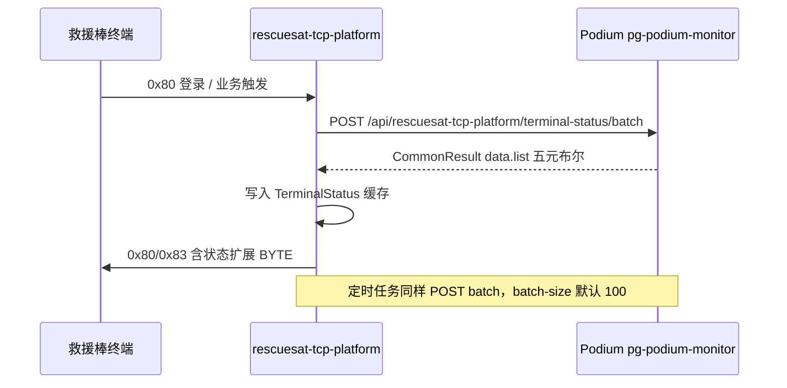
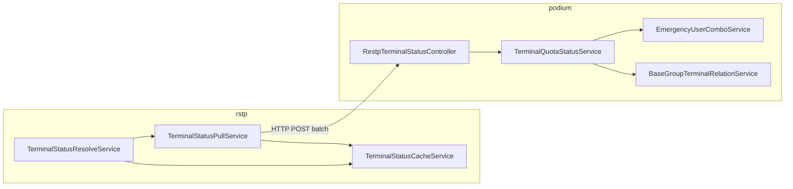

# 终端状态跨平台拉取对接说明

> **适用范围**：rescuesat-tcp-platform（rstp）与 Podium（pg-podium-monitor）  
> **文档版本**：2026-07-06  
> **两份仓库各有一份同名文档，内容应保持一致**（Podium 仓路径：`podium/docs/星联卫士App对接文档/后端/终端状态跨平台拉取对接说明.md`，或本仓库 [`后端/终端状态跨平台拉取对接说明.md`](终端状态跨平台拉取对接说明.md)）

---

## 1. 背景与目标

天通救援棒协议 V1.10 要求在 **0x80 登录响应 / 0x83 ACK** 中携带状态扩展 BYTE（设备禁用、短音/报位不足或用尽）。rstp 在下发前需获知每台终端的「五元布尔状态」，数据来源为 **Podium 业务平台**（套餐余量 + 星豆）。

| 场景 | 调用时机 | 典型批量大小 |
|------|----------|--------------|
| 登录/ACK 热路径 | 单终端上线或下发前同步 | **1 台** |
| 定时拉取 | 后台调度刷新缓存 | **≤100 台/次** |

---

## 2. 整体架构



**数据方向**：rstp **拉取** Podium（与 `RestpReceiveController` 的**推送**方向相反，同属 `rescuesattcpplatform` 对接域）。

---

## 3. 相关提交

| 仓库 | 分支 | Commit | 说明 |
|------|------|--------|------|
| podium | `dev` | `70e6e19ac` | 新增批量拉取接口与 Service |
| rescuesat-tcp-platform | `test-udp-v2` | `32c09d0` | 默认 batch-path 指向 Podium 真实接口 |

---

## 4. HTTP 接口契约

### 4.1 请求

| 项 | 值 |
|----|-----|
| 方法/路径 | `POST /api/rescuesat-tcp-platform/terminal-status/batch` |
| Content-Type | `application/json` |
| 鉴权 | **无**（与 `receive-event` 一致，内网/专线调用） |
| Body | `{ "terminalIds": ["卡号1", "卡号2", ...] }` |

Podium 侧处理：`trim` → 去 blank → `distinct`（保留首次出现顺序）→ **去重后 ≤100**，否则 `PARAM_NOT_VALID`。

### 4.2 响应

```json
{
  "code": 0,
  "data": {
    "list": [
      {
        "terminalId": "12345678901",
        "deviceDisabled": false,
        "speechInsufficient": true,
        "speechExhausted": false,
        "positionInsufficient": false,
        "positionExhausted": false
      }
    ]
  }
}
```

| 字段 | 含义 |
|------|------|
| `terminalId` | 终端卡号（addr） |
| `deviceDisabled` | 设备禁用；**本期恒 false** |
| `speechInsufficient` | 短音余量不足（有效条数在 (0, 阈值]） |
| `speechExhausted` | 短音已用尽（有效条数 ≤ 0） |
| `positionInsufficient` | 报位余量不足 |
| `positionExhausted` | 报位已用尽 |

字段名必须与 rstp `TerminalStatusRemoteItem` 一致，解析逻辑见 `TerminalStatusPullService#parseItems`。

### 4.3 超限错误

去重后 `terminalIds` > 100：

```json
{ "code": 非0, "msg": "terminalIds 最多 100 个" }
```

**不**静默截断前 100 个。

---

## 5. 业务规则（Podium 计算）

### 5.1 绑定类型

| 绑定 | 判定 | 五元状态 |
|------|------|----------|
| **企业** | `c_group_terminal_relation` 存在 `ENTERPRISE`（`bindType==null` 视为企业） | **全 false**，不查套餐/星豆 |
| **仅个人** | 无企业绑定，有个人 `PERSONAL` | 按套餐+星豆计算 |
| **无绑定** | 无任何 relation | **全 false** |

绑定判定见 `TerminalQuotaStatusService#classifyBinding`（** deliberately 不用** `StarBeanTransactionService#resolveDeductAccount`，避免企业路径多查 `getFirstAccount`）。

### 5.2 个人设备有效条数

与 `EmergencyUserComboServiceImpl#comboAggregationActivity` 对齐：

```
comboVoice    = Σ有效套餐剩余 − Σ未结清欠费（deductionStatus=0）
comboPosition = 同上（报位维度）

effectiveVoice    = max(0, comboVoice)    + starBeans / voicePrice
effectivePosition = max(0, comboPosition) + starBeans / positionPrice
```

| 输出字段 | true 条件 |
|----------|-----------|
| `speechExhausted` | `effectiveVoice <= 0` |
| `speechInsufficient` | `0 < effectiveVoice <= threshold` |
| `positionExhausted` | `effectivePosition <= 0` |
| `positionInsufficient` | `0 < effectivePosition <= threshold` |

`exhausted` 与 `insufficient` 互斥。

### 5.3 阈值与星豆单价

| 配置项 | 位置 | 默认 |
|--------|------|------|
| 短音不足阈值 | Podium `emergency.tcpserver.speech-insufficient-threshold` | 10 |
| 报位不足阈值 | Podium `emergency.tcpserver.position-insufficient-threshold` | 10 |
| 短音星豆单价 | `BaseStarBeanConfigService#getVoiceStarBeanPrice` | 10 |
| 报位星豆单价 | `BaseStarBeanConfigService#getPositionStarBeanPrice` | 1 |

---

## 6. Podium 侧代码导航

**模块**：`pg-podium-monitor`  
**包域**：`com.pancoit.podium.controller.datareceiver.rescuesattcpplatform`（与 `RestpReceiveController` 同域）

| 文件 | 职责 |
|------|------|
| `RestpTerminalStatusController.java` | HTTP 入口，薄层转发 |
| `dto/TerminalStatusBatchRequest.java` | 请求体 |
| `dto/TerminalStatusRemoteItemDto.java` | 响应 list 元素 |
| `service/rescuesattcpplatform/TerminalQuotaStatusService.java` | **核心**：绑定判定、套餐/欠费/星豆、双路径查询 |
| `config/EmergencyTcpServerConfig.java` | 不足阈值配置 |
| `TerminalQuotaStatusServiceTest.java` | 单测（6 用例） |

### 6.1 查询性能（双路径）

| 路径 | 触发条件 | Mongo 次数（约） |
|------|----------|------------------|
| **单终端热路径** | `terminalIds` 去重后 size=1 | 企业/无绑定：**1**；个人：**4** |
| **批量 prefetch** | size ≥ 2 | **固定 4 次**（绑定 + 套餐 + 欠费 + WebUser） |

批量路径 **不用** `comboAggregationForAddrs`（返回群级合计，无法 per-device）。

单终端个人路径复用 `comboAggregationActivity(addr, null)`。

---

## 7. rescuesat-tcp-platform 侧代码导航

| 文件 | 职责 |
|------|------|
| `TerminalStatusPullService.java` | HTTP 拉取、解析 `data.list`、写缓存 |
| `TerminalStatusResolveService.java` | 登录/ACK 前 resolve：pull → 缓存 → 默认 |
| `TerminalStatusProperties.java` | 拉取 URL、超时、batch-size 等 |
| `ConfigInitializer.java` | 系统配置默认值初始化 |
| `TerminalStatusBatchPullScheduler.java` | 定时批量拉取（按 batch-size 分批） |
| `static/index.html` | 管理台「终端状态拉取与播报」配置页 |

拉取成功后状态进入本地 Mongo 缓存，经 `TerminalStatusBroadcastPolicy` 决定是否在下发帧中置位并控制播报间隔。

---

## 8. 配置说明

### 8.1 rstp（调用方）

配置组：`terminal-status`，可在管理台 **系统配置 → 终端状态拉取与播报** 修改，或数据库 `system_config` 表。

| 键 | 默认值 | 说明 |
|----|--------|------|
| `terminal-status.pull.enabled` | `true` | 是否启用 HTTP 拉取 |
| `terminal-status.pull.base-url` | `http://back.tdwtv2.pg8.ink` | Podium 基础 URL |
| `terminal-status.pull.batch-path` | `/api/rescuesat-tcp-platform/terminal-status/batch` | 批量接口路径 |
| `terminal-status.pull.batch-size` | `100` | 每批最多 terminalId 数（与 Podium `MAX_BATCH_SIZE` 对齐） |
| `terminal-status.pull.connect-timeout-ms` | `3000` | 连接超时 |
| `terminal-status.pull.read-timeout-ms` | `5000` | 读取超时 |
| `terminal-status.downlink-sync-timeout-ms` | `3000` | 下发前拉取总超时 |

**注意**：已部署环境若数据库中仍为旧值 `/api/mock/terminal-status/batch`，需在管理台改为新路径或重置默认配置。

### 8.2 Podium（提供方）

```yaml
# application-*.yml 可选
emergency:
  tcpserver:
    speech-insufficient-threshold: 10
    position-insufficient-threshold: 10
```

不配则使用 `EmergencyTcpServerConfig` 类内 Java 默认值 10。

---

## 9. 测试

### Podium

```bash
cd pg-podium-monitor
mvn test -Dtest=TerminalQuotaStatusServiceTest
```

覆盖：企业快路径、个人 insufficient/exhausted、无绑定、批量 prefetch、超限拒绝。

### rstp

```bash
mvn test -Dtest=TerminalStatusPropertiesTest,TerminalStatusPullServiceTest
```

联调前仍可使用 mock 接口：`POST /api/mock/terminal-status/batch`（`MockTerminalStatusController`）。

---

## 10. 联调检查清单

- [ ] rstp `pull.base-url` 指向目标环境 Podium 地址
- [ ] rstp `pull.batch-path` = `/api/rescuesat-tcp-platform/terminal-status/batch`
- [ ] Podium 已部署含 `70e6e19ac` 的版本
- [ ] 单终端 POST 返回 `code=0`，`list` 字段名与上表一致
- [ ] 企业设备五元全 false；个人设备余量符合预期
- [ ] rstp「终端状态拉取记录」中可见 `REMOTE_PLATFORM` 来源
- [ ] 登录/ACK 帧详情中状态扩展 BYTE 与拉取结果一致

### 手工探测示例

```bash
curl -X POST "http://{podium-host}/api/rescuesat-tcp-platform/terminal-status/batch" \
  -H "Content-Type: application/json" \
  -d '{"terminalIds":["你的测试卡号"]}'
```

---

## 11. 常见问题

| 现象 | 可能原因 | 处理 |
|------|----------|------|
| rstp 仍请求 mock 路径 | DB 配置未更新 | 改 `terminal-status.pull.batch-path` 或重置默认 |
| `terminalIds 最多 100 个` | 单批超限 | 调小 rstp `batch-size` 或检查调用方是否未去重 |
| 企业设备出现 insufficient | 绑定数据异常或多条 relation | 查 `c_group_terminal_relation`，确认无多余 PERSONAL |
| 个人余量与「群聊剩余」不一致 | 本接口为 **per-device** | 勿与 `comboAggregationForAddrs` 群合计对比 |
| 拉取超时 | Podium 慢或网络 | 看 Podium 日志；个人设备 Mongo 约 4 次，应在 3s 内 |
| `deviceDisabled` 始终 false | 产品设计 | 本期 Podium 无禁用能力，预留字段 |

---

## 12. 后续扩展注意

| 需求 | 建议改动位置 |
|------|--------------|
| 后台「点击禁用」→ `deviceDisabled=true` | Podium `TerminalQuotaStatusService` + 禁用数据源 |
| 调整不足阈值 | Podium `EmergencyTcpServerConfig` / yml |
| 修改批量上限 | **同时**改 Podium `MAX_BATCH_SIZE` 与 rstp `batch-size` |
| 批量 Mongo 进一步优化 | 评估改 `pg-business` Repository，本期 intentionally 未做 |
| 新增状态维度 | 同步改 Podium DTO、rstp `TerminalStatusRemoteItem`、协议 BYTE 定义 |

---

## 13. 关键类关系图



---

*文档维护：功能变更时请同步更新本文档与另一仓库同名文件，并补充 §3 提交记录。*
