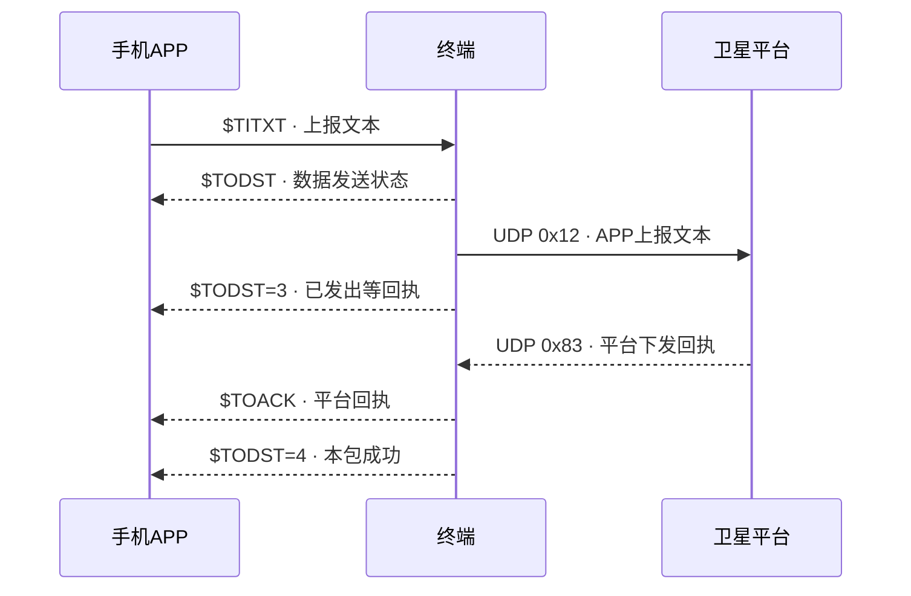
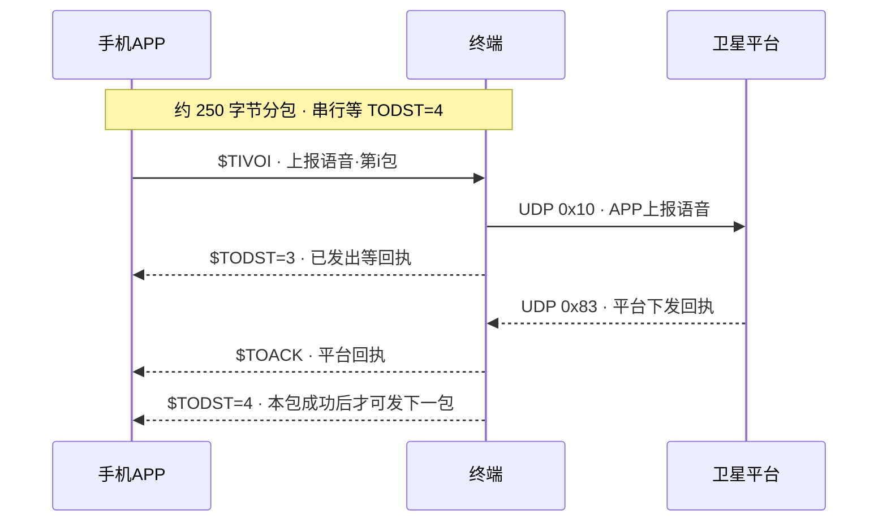
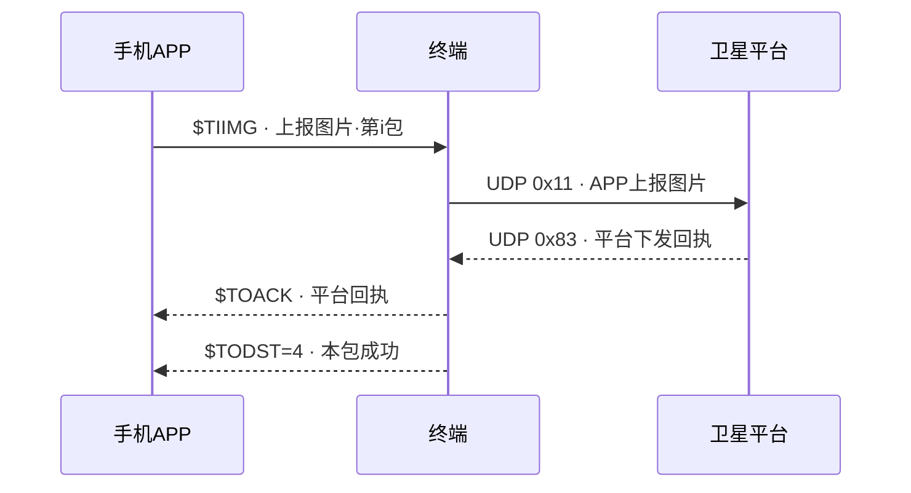
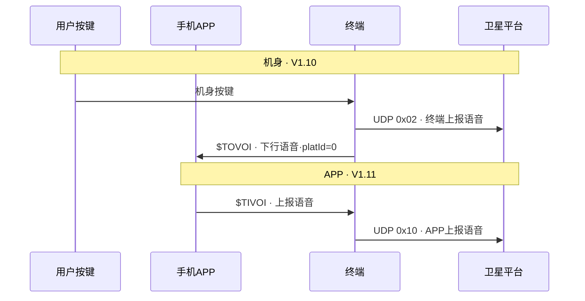

# 终端固件要做什么

> PRD 第 06 章摘要页。主站看「固件这期做什么」；本页给研发对照。APP 侧以 [星联卫士-终端与APP交互协议.md](../通用/星联卫士-终端与APP交互协议.md)（APP 交互协议 **v2.7**）为准；卫星侧基线 UDP协议 V1.10，本期增量 V1.11 三条上行 + **V1.12 号段分区**。增量改造正文见 [固件/README.md](README.md)（`tt_rescue_stick/Doc`）。  
> 联调硬前置：[工程附录-联调前置说明.md](../通用/工程附录-联调前置说明.md)。上行故事时序见 [需求文档 PRD](../需求文档/index.html#sec-protocol)，勿与本页重复理解成两套协议。

## 一句话

手机只认蓝牙 `$xxxx`，平台只认 UDP，终端转译。《卫星应急救援终端UDP协议》（下称 UDP协议）V1.10 机身业务已做完不重做；本期补 UDP协议 V1.11 三条 APP 上行（并按 V1.12 分区 termBizId），并接上《星联卫士终端与APP交互协议》（下称 APP 交互协议）v1.8 全套蓝牙帧。不改硬件。

```
手机 APP  ←── 蓝牙 / $xxxx ──→  终端固件  ←── 卫星 UDP ──→  卫星平台
```

## 现状

| | 终端侧 |
|--|--------|
| **V1.10 UDP** | 已做：`0x00` 终端登录 / `0x80` 平台登录响应 / `0x01` 终端上报位置 / `0x02` 终端上报语音 / `0x03` 已接收 / `0x05` 已读 / `0x81` 平台下发文本 / `0x82` 平台下发语音 / `0x83` 平台下发回执 + 附录 A |
| **V1.11 增量** | 待做：`0x10` APP上报语音、`0x11` APP上报图片、`0x12` APP上报文本 |
| **V1.12 号段** | 机身 termBizId 0～32767；APP 上行 termBizId=APP seq（32800～65535）；32768～32799 保留 |
| **APP v2.7** | 27 条 `$xxxx`；真上电 UDP 中转；`$TILGN` 空闲重登；`$TOLVO` 机身录音推 App |

**别搞混：** 机身短音走 `0x02` 终端上报语音；APP 语音走 `0x10` APP上报语音。

## 约束

- 不改硬件；V1.10 **功能不重做**，但互斥与号段须做最小回归（见工程附录 §H）。
- 不含 APP 侧策略细节中的：离线底图下载实现、设置页排版；等待发送超时规则见 APP 协议。

## 几条死规定

| 规定 | 做法 |
|------|------|
| 设备禁用 / 额度 | 禁用→全部 APP 上行 `$TODST=0`；短音用完→仅拦 `$TIVOI`；报位用完不影响 APP；余额不足仍允许。勿用改 `netStatus` 凑门闩 |
| termBizId / seq 分区 | 机身 0～32767；APP seq 32800～65535（按 deviceId 持久化，换终端从 32800）；上行 termBizId=seq；32768～32799 保留 |
| 分包串行 | 本包 `$TODST=4` 后才发下一包；`$TODST=3` 不可发下一包；同条重试保持 seq |
| 机身与 APP 互斥 | 「一条在途」含 `0x01`/`0x02` 与 `0x10`/`0x11`/`0x12`。APP 在途→机身延后；机身在途→APP `$TODST=0`。**须回归测试** |
| `$TOLOC` vs `0x01` | 相互独立；报位按 UDP协议 V1.10；`$TOLOC` 按 APP 交互协议节流。SOS 经 `0x01` + `$TOSTA.sosStatus` |
| `0x05` 已读 | 已连：推完 APP 后上报；未连：本机播完后上报；APP 不发已读帧 |

---

## APP 交互协议怎么结合 UDP协议

手机从不发 UDP。

| 方向 | APP 侧（蓝牙） | 卫星侧（UDP） | 说明 |
|------|----------------|---------------|------|
| APP → 平台 | `$TITXT` 上报文本 | `0x12` APP上报文本 | 边发边回 `$TODST` 数据发送状态 |
| APP → 平台 | `$TIVOI` 上报语音 | `0x10` APP上报语音 | 勿走 `0x02` |
| APP → 平台 | `$TIIMG` 上报图片 | `0x11` APP上报图片 | 约 250B 分包 |
| 平台 → APP | `$TOACK` → `$TODST=4` | `0x83` 平台下发回执 | 先 ACK 再 status=4 |
| 平台 → APP | `$TOTXT` / `$TOVOI` | `0x81` / `0x82` | UDP 已有；推 APP 新增 |
| 终端 → 平台 | （APP 不参与） | `0x03` / `0x05` | V1.10 已有 |
| 联网态 | `$TOSTA` 设备快照 · netStatus | `0x00` / `0x80` | 登录已有；推 APP 新增 |

原文：[卫星应急救援终端UDP协议V1.12.docx](../通用/卫星应急救援终端UDP协议V1.12.docx)。联调以 **V1.12** 为准。

---

## 对接时序

### 文本上行



### 语音上行（分包）



### 图片上行



### 机身短音 vs APP 语音



下行时序见 PRD 第 05 章「收到消息」：`0x81`/`0x82` → `$TOTXT`/`$TOVOI`；`0x03`/`0x05` 终端上报。

---

## 六模块摘要

1. **上电连卫星**：`0x00`/`0x80` 已有；`$TOSTA` 桥接新增  
2. **报状态/位置/信号**：`$TOSTA`→`$TOLOC`→`$TOSIG`；查询/Notify 全新增  
3. **帮 APP 发消息**：见上表与时序；`$TIDSQ` 可查 `$TODST`  
4. **帮 APP 收消息**：UDP 已有，推 APP 新增  
5. **按键**：`0x02` 已有；转 APP `$TOVOI` platId=0 新增  
6. **通用规则**：单条在途；分包有序；条件不够不发 UDP；APP 等待超时不算终端  

---

## 不在清单内

- 改硬件 / 换料；改写 V1.10（除非修 bug）
- APP 等待超时、离线底图、设置页；OTA / 固件版本给 APP 查

---

## 附录 · E01–E18 与模块对照

| 原序号 | 工作项 | 归属 | 状态 |
|--------|--------|------|------|
| E01 | 应用层帧引擎 | 2 | 新增 |
| E02 | BLE GATT | 2 | 新增 |
| E03 | 连接后快照 | 2 | 新增 |
| E04 | 查询应答 | 2 | 新增 |
| E05 | `$TOSTA` | 1+2 | UDP 已有；推 APP 新增 |
| E06 | 卫星登录 | 1 | V1.10 已有 |
| E07 | `$TOLOC` | 2 | 新增桥接 |
| E08 | `$TOSIG` | 2 | 新增桥接 |
| E09 | `$TITXT`→`0x12` | 3 | 新增（V1.11） |
| E10 | `$TIVOI`→`0x10` | 3 | 新增（V1.11） |
| E11 | `$TIIMG`→`0x11` | 3 | 新增（V1.11） |
| E12 | `$TODST`/`$TOACK` | 3 | 新增 |
| E13 | `$TIDSQ` | 3 | 新增 |
| E14 | 下行推 APP | 4 | UDP 已有；推 APP 新增 |
| E15 | `0x03`/`0x05` | 4 | V1.10 已有 |
| E16 | 按键 `0x02`+转 APP | 5 | UDP 已有；转 APP 新增 |
| E17 | 发送规则 | 6 | 新增 |
| E18 | 变化 Notify | 2 | 新增 |
