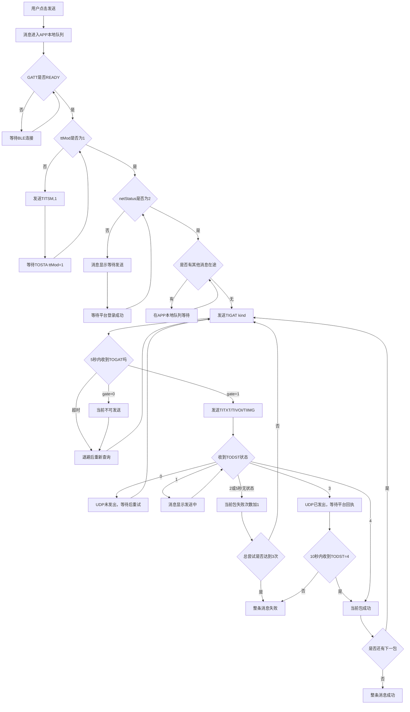
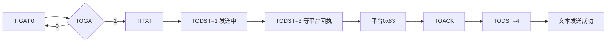
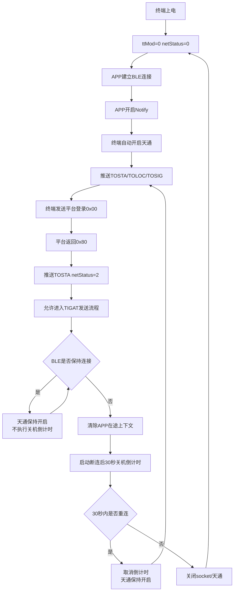

# APP 消息发送与平台状态交互逻辑

> 适用范围：星联卫士 APP 通过 BLE 连接终端，并由终端通过天通卫星网络向平台发送文本、语音和图片。
>
> 主要依据：
>
> - 《星联卫士-终端与APP交互协议》v2.7
> - 《工程附录-联调前置说明》
> - 《歧义项决议》
> - 《协议映射说明》
> - 《卫星应急救援终端UDP协议》V1.12
>
> 本文使用通俗流程说明“触发什么指令、收到什么反馈、达到什么条件才算成功”。如本文与后续正式协议冲突，以最新签收版本为准。

---

## 1. 一句话理解整个发送过程

APP 发消息到平台需要依次通过四道门：

1. **蓝牙通道准备好**：GATT READY；
2. **天通模块已开启**：`ttMod=1`；
3. **终端已完成平台登录**：`netStatus=2`；
4. **当前卫星发送信道空闲**：`$TOGAT,1`。

四个条件都满足以后，APP 才能发送文本、语音或图片业务帧。

发送后，终端通过 `$TODST` 告诉 APP 当前发送进度。最终只有收到：

```text
$TODST,<seq>,4
```

才表示当前包已经得到平台确认。

语音和图片有多个分包时，必须等当前包收到 `$TODST=4`，才能发送下一包。

---

## 2. 参与方和职责

```text
APP
  │ BLE GATT：$TIxxx / $TOxxx
  ▼
星联卫士终端
  │ 卫星 UDP：0x10 / 0x11 / 0x12 / 0x83
  ▼
天通卫星链路
  ▼
平台
```

| 参与方 | 职责 |
|---|---|
| APP | 蓝牙连接、文本编码、语音/图片压缩、分包、生成 seq、发送、超时重试、展示消息状态 |
| 终端 | 判断能否发送、将 APP 帧转换为卫星 UDP、执行实际发送、向 APP 推送状态 |
| 天通卫星链路 | 承载终端与平台之间的 UDP 报文 |
| 平台 | 接收文本/语音/图片，每包返回 `0x83` 回执 |

APP 不直接解析卫星 UDP，只处理 `$TIxxx/$TOxxx` 应用层帧：

```text
APP → 终端：$TIxxx
终端 → APP：$TOxxx
```

---

## 3. 四道发送前置条件

## 3.1 第一道门：GATT READY

日志出现：

```text
GATT: Transport state: READY
```

表示：

- BLE 已连接；
- GATT 服务发现成功；
- 收发 Characteristic 已找到；
- Notify 已开启；
- APP 可以向终端写入 `$TIxxx`；
- APP 可以接收终端推送的 `$TOxxx`。

GATT READY 只代表：

```text
APP ↔ 终端
```

蓝牙通道已经就绪，不代表终端已经连上卫星平台。

---

## 3.2 第二道门：天通模块已开启

通过 `$TOSTA` 判断：

```text
$TOSTA,<deviceId>,<battery>,<sosStatus>,<ttMod>,<netStatus>
```

要求：

```text
ttMod=1
```

`ttMod` 含义：

| 值 | 含义 |
|---:|---|
| `0` | 天通模块关闭 |
| `1` | 天通模块开启 |

如果 `ttMod=0`，APP 可以发送：

```text
$TITSM,1
```

终端应返回完整 `$TOSTA`：

```text
$TOSTA,...,1,<netStatus>
```

BLE 连接后，协议主流程要求终端自动开启天通。APP 发送 `$TITSM,1` 可作为天通仍未开启时的幂等补偿。

---

## 3.3 第三道门：平台已经联网

仍通过 `$TOSTA.netStatus` 判断：

| netStatus | 含义 | 是否能发送业务消息 |
|---:|---|---|
| `0` | 已断网 | 不能 |
| `1` | 搜星、注册、建链或平台登录中 | 不能 |
| `2` | 已联网，包括平台登录成功 | 可以进入门闩流程 |

基础发送条件必须达到：

```text
GATT READY
AND ttMod=1
AND netStatus=2
```

注意：

```text
$TOSIG,-80,1,...
```

只表示终端已经检测到卫星信号，不代表平台登录成功。真正的业务联网状态必须以 `$TOSTA.netStatus=2` 为准。

---

## 3.4 第四道门：当前发送信道空闲

每一包业务消息发送前，APP 必须查询发送门闩：

```text
APP  → 终端：$TIGAT,<kind>
终端 → APP ：$TOGAT,<gate>
```

`kind` 定义：

| kind | 即将发送的消息 |
|---:|---|
| `0` | 文本 `$TITXT` |
| `1` | 语音 `$TIVOI` |
| `2` | 图片 `$TIIMG` |

`gate` 定义：

| gate | 含义 |
|---:|---|
| `0` | 当前不能发送 |
| `1` | 当前可以尝试发送 |

`gate=1` 需要同时满足：

```text
ttMod=1
AND netStatus=2
AND 当前卫星发送信道空闲
AND 当前没有机身报位/录音消息在途
AND 当前没有其他APP业务包在途
AND 设备未被平台禁用
AND 语音额度可用（仅语音）
```

`$TOGAT=1` 只是预检结果，不是最终保证。APP 真正发送业务帧时，终端还要再次检查发送条件。

最终以 `$TODST` 为准。

---

## 4. APP 消息发送总流程图



---

## 5. 文本发送逻辑

文本只发送一包。

## 5.1 查询门闩

```text
APP → 终端：$TIGAT,0
```

允许发送时，终端返回：

```text
终端 → APP：$TOGAT,1
```

如果返回：

```text
$TOGAT,0
```

APP 不发送 `$TITXT`，消息保持等待，稍后重新查询门闩。

## 5.2 发送文本

```text
$TITXT,<seq>,<len>,<hex>
```

示例：

```text
$TITXT,32800,4,D6D0CEC4
```

字段说明：

| 字段 | 说明 |
|---|---|
| seq | APP 消息序号，范围 `32800～65535` |
| len | GB2312 编码后的二进制字节数 |
| hex | 文本 GB2312 编码后转换成的大写 HEX |

文本规则：

- 文本一条消息只发一包；
- 单条载荷不超过 200 字节；
- 超长文本由 APP 拆成多条独立消息；
- 每条独立消息使用不同 seq；
- 每条独立消息分别展示气泡和发送状态。

## 5.3 文本完整状态链

```text
$TIGAT,0
→ $TOGAT,1
→ $TITXT
→ $TODST,seq,1
→ $TODST,seq,3
→ 平台返回UDP 0x83
→ $TOACK
→ $TODST,seq,4
→ 文本发送成功
```

允许出现：

```text
$TODST=1
→ $TOACK
→ $TODST=4
```

即 `$TODST=3` 不是每次都必须出现。



---

## 6. 语音发送逻辑

语音由 APP 压缩并分包。

业务帧：

```text
$TIVOI,<seq>,<idx>,<total>,<ver>,<rate>,<len>,<hex>
```

默认编解码参数：

```text
ver=3
rate=10
```

字段规则：

| 字段 | 规则 |
|---|---|
| seq | 整条语音所有分包共用同一个 seq |
| idx | 当前包序号，从 1 开始 |
| total | 总包数 |
| ver | 仅第 1 包填写真实值，后续填 0 |
| rate | 仅第 1 包填写真实值，后续填 0 |
| len | 当前包二进制字节数 |
| hex | 当前包压缩数据 |

每一包都必须重新查询门闩：

```text
第1包：
TIGAT,1
→ TOGAT,1
→ TIVOI idx=1
→ TODST=4

第2包：
TIGAT,1
→ TOGAT,1
→ TIVOI idx=2
→ TODST=4

……

最后一包：
TIGAT,1
→ TOGAT,1
→ TIVOI idx=total
→ TODST=4
→ 整条语音成功
```

禁止一次性连续发送全部语音分包。

---

## 7. 图片发送逻辑

图片与语音使用相同的逐包串行规则。

业务帧：

```text
$TIIMG,<seq>,<idx>,<total>,<ver>,<model>,<origKb>,<len>,<hex>
```

默认编解码参数：

```text
ver=5
model=16
```

字段规则：

| 字段 | 规则 |
|---|---|
| seq | 整张图片所有分包共用同一个 seq |
| idx | 当前包序号，从 1 开始 |
| total | 总包数 |
| ver | 仅第 1 包填写真实值，后续填 0 |
| model | 仅第 1 包填写真实值，后续填 0 |
| origKb | 原图 KB，仅第 1 包填写，后续填 0 |
| len | 当前包二进制字节数 |
| hex | 当前包压缩数据 |

每包发送流程：

```text
TIGAT,2
→ TOGAT,1
→ TIIMG当前包
→ TODST=1
→ TODST=3
→ TOACK
→ TODST=4
→ 下一包重新TIGAT,2
```

最后一包收到 `$TODST=4` 后，整张图片才算发送成功。

---

## 8. TODST 状态说明

状态帧：

```text
$TODST,<seq>,<status>
```

| status | 通俗解释 | APP 处理 |
|---:|---|---|
| `0` | 现在不能发，终端没有发出 UDP | 转为等待，不计失败，重新查门闩 |
| `1` | 终端正在发送当前包 | 显示发送中，重新开始 5 秒状态计时 |
| `2` | 当前轮发送失败 | 当前包失败次数加 1，保持原 seq/idx 重试 |
| `3` | UDP 已发出，正在等待平台确认 | 禁止重发，禁止发下一包，等待 10 秒 |
| `4` | 平台已经确认收到当前包 | 当前包成功，可以进入下一包 |

## 8.1 `TOGAT=0` 与 `TODST=0` 的区别

```text
TOGAT=0：
“当前不能发，APP先不要把业务包发给终端。”

TODST=0：
“业务包已经到终端，但最终条件不满足，卫星UDP没有发出去。”
```

| 对比项 | `$TOGAT=0` | `$TODST=0` |
|---|---|---|
| 发生阶段 | 业务包发送前 | 终端收到业务包后 |
| APP 是否已发送业务帧 | 否 | 是 |
| 卫星 UDP 是否发出 | 否 | 否 |
| 是否增加失败次数 | 否 | 否 |
| 后续动作 | 退避后重查 TIGAT | 回到门闩阶段重查 TIGAT |

## 8.2 `TODST=0` 常见触发条件

- `ttMod=0`；
- `netStatus≠2`；
- 机身报位 `0x01` 正在发送；
- 机身录音 `0x02` 正在发送；
- 其他 APP 消息仍在途；
- 上一个语音/图片分包尚未收到 `TODST=4`；
- `$TOGAT=1` 后信道被机身业务抢占；
- 设备被平台禁用；
- 语音额度用完；
- seq 越界或属于迟到旧 seq。

## 8.3 `TODST=2` 常见触发条件

- 底层发送失败；
- 业务帧缺列；
- `len` 非法；
- HEX 长度与 `len` 不一致；
- HEX 字符非法；
- 语音/图片 `idx` 非法；
- `total` 或 `ver` 非法。

校验和 XOR 错误时，终端不返回 `$TODST`，APP 最终表现为 5 秒无状态。

---

## 9. 平台回执逻辑

平台收到 APP 上行包后，通过 UDP `0x83` 返回回执。

终端收到平台 `0x83` 后，应依次向 APP 推送：

```text
$TOACK,<seq>,<termBizId>,<pktIdx>
$TODST,<seq>,4
```

字段关系：

```text
TOACK.seq       = 当前消息seq
TOACK.termBizId = 当前消息seq
TOACK.pktIdx    = 当前语音/图片分包idx
```

APP 处理原则：

- `$TOACK` 用于核对平台确认的是哪条消息、哪一包；
- `$TOACK` 本身不负责推进下一包；
- `$TODST=4` 才是当前包完成信号；
- 当前包收到 `$TODST=4` 后，才能发下一包的 `$TIGAT`。

正确顺序：

```text
TOACK
→ TODST=4
→ 下一包TIGAT
```

错误顺序：

```text
TOACK
→ 立即发下一包TIGAT
→ 上一包TODST=4随后才到
```

错误顺序容易造成 APP 和终端的当前包状态不一致。

---

## 10. 消息状态如何展示

| APP 消息状态 | 触发条件 |
|---|---|
| 等待发送 | GATT 未就绪、`ttMod=0`、`netStatus≠2`、前序消息在途、`TOGAT=0`、`TODST=0` |
| 发送中 | 已收到 `TODST=1`，或者已收到 `TODST=3` 正在等平台回执 |
| 发送失败 | 当前包尝试达到 3 次、`TODST=3` 后 10 秒无 `4`、连续等待达到配置时长 |
| 发送成功 | 文本唯一包为 `4`；语音/图片所有分包均为 `4` |

重要原则：

```text
未真正发出UDP：等待发送
收到TODST=1/3：发送中
收到当前包TODST=4：当前包成功
所有包TODST=4：整条消息成功
```

协议默认连续等待超时为 10 分钟。消息达到等待超时后，应转为发送失败，不能永久停留在等待状态。

---

## 11. 重试和超时规则

## 11.1 TIGAT 门闩超时

```text
发送TIGAT
5秒无TOGAT
```

处理：

- 本次不计入包失败；
- APP 退避后重新查询 `$TIGAT`；
- 不能绕过门闩直接发业务帧。

## 11.2 业务包状态超时

发送 `$TITXT/$TIVOI/$TIIMG` 后：

```text
5秒无TODST
```

当前轮计一次失败。

收到 `$TODST=1` 后，应重新开始 5 秒状态计时。

## 11.3 TODST=2 重试

收到：

```text
$TODST,<seq>,2
```

处理：

- 当前包失败次数加 1；
- 重试保持原 seq；
- 重试保持原 idx；
- 重试前重新查询 `$TIGAT`；
- 达到最大尝试次数后整条消息失败。

建议统一口径为：

```text
首发1次 + 自动重试2次 = 总共最多3次
```

## 11.4 TODST=3 平台回执超时

收到 `$TODST=3` 后：

- UDP 已经发出；
- 不允许重发当前包；
- 不允许发送下一包；
- 从收到 `3` 开始等待 10 秒；
- 10 秒内收到 `$TODST=4`，当前包成功；
- 10 秒没有收到 `4`，整条消息失败且不自动重发。

禁止自动重发的原因是：平台可能已经收到业务包，只是回执丢失，自动重发可能造成重复消息。

## 11.5 用户手动重发

整条消息失败后，用户再次点击发送：

```text
分配新seq
从第1包重新发送
```

---

## 12. seq 使用规则

APP seq 范围：

```text
32800～65535
```

循环方式：

```text
65535 → 32800
```

| 场景 | seq 处理 |
|---|---|
| 新消息 | 分配新 seq |
| 同一条语音/图片所有分包 | 共用同一个 seq |
| 同一包自动重试 | 保持原 seq |
| 整条消息失败后用户手动重发 | 使用新 seq |
| 换终端 | 按新 deviceId 单独管理，从 32800 开始 |
| 收到旧 seq 的 TODST/TOACK | 丢弃，不影响当前消息 |

终端转换 APP 上行 UDP 时：

```text
UDP termBizId = APP seq
```

APP 应按 `$TOSTA.deviceId` 分别持久化 seq 和会话，不能将不同终端的数据混在一起。

---

## 13. 天通与 BLE 生命周期

## 13.1 终端上电

默认状态：

```text
ttMod=0
netStatus=0
```

## 13.2 BLE 连接

正常流程：

```text
APP建立BLE连接
→ APP开启Notify
→ 终端自动开启天通
→ 推送TOSTA
→ 推送TOLOC
→ 推送TOSIG
→ 终端发送平台登录UDP 0x00
→ 平台返回UDP 0x80
→ 终端推送TOSTA netStatus=2
→ 允许进入TIGAT发送流程
```

首条 `$TOSTA` 可能仍然是 `ttMod=0`，因为模块正在上电。上电完成后终端应再次推送 `ttMod=1`。

## 13.3 BLE 保持连接

只要 BLE 保持连接：

```text
终端不应启动天通关机倒计时
天通模块应保持开启
```

如果 BLE 仍为 READY，终端却主动变为：

```text
ttMod=0
netStatus=0
```

属于生命周期异常，需要排查终端关机原因和倒计时状态。

## 13.4 BLE 断开

BLE 断开时：

1. 清除 APP 当前在途上行上下文；
2. 未完成的 `$TODST` 会话重连后不恢复；
3. 从 BLE 断开时刻开始 30 秒天通关机倒计时。

## 13.5 30 秒内重连

正确行为：

```text
取消关机倒计时
天通模块保持开启
不执行关机再重启
重新推送TOSTA/TOLOC/TOSIG
```

## 13.6 30 秒内没有重连

终端执行：

```text
RICLOSE
或关闭天通模块
```

最终状态：

```text
ttMod=0
netStatus=0
```

---

## 14. 天通与 BLE 生命周期流程图



---

## 15. 两个不同的 30 秒计时器

协议中存在两个完全不同的 30 秒计时器，不能混用。

## 15.1 BLE 断开后关天通

```text
BLE断开
→ 等待30秒
→ 30秒内没有重连
→ 关闭天通
```

这个计时器只在 BLE 断开后启动。

## 15.2 BLE 已连接时平台空闲重登

BLE 仍连接，但连续 30 秒没有平台业务包时，APP 发送：

```text
$TILGN,0
```

终端反馈：

| 应答 | 含义 |
|---|---|
| `$TOLGN,1` | 已接受，将排队静默登录 |
| `$TOLGN,0` | 当前未就绪，没有 socket 或连接标志无效 |
| `$TOLGN,2` | 当前有上行在途，为避免打断发送而跳过 |

代码中建议使用不同名称：

```text
bleDisconnectShutdownTimer
platformIdleReloginTimer
```

APP 自己还可能有“长时间无消息后主动断开 BLE”的本地计时器，该计时器也必须独立管理。

---

## 16. 手动关闭天通时的在途规则

APP 发送：

```text
$TITSM,0
```

如果当前没有消息在途，可以立即关闭并返回：

```text
$TOSTA,...,0,0
```

如果当前包已经处于：

```text
TODST=1
```

或者：

```text
TODST=3
```

终端不能立即中断，必须：

```text
等待平台0x83
→ 推送TOACK
→ 推送TODST=4
→ 再关闭天通
```

---

## 17. 可直接用于验收的判断表

| 验收点 | 合格标准 |
|---|---|
| BLE 建连 | 出现 GATT READY |
| Notify | 能收到 `$TOSTA/$TOLOC/$TOSIG` |
| 天通开启 | `$TOSTA.ttMod=1` |
| 平台联网 | `$TOSTA.netStatus=2` |
| 发包预检 | 每一包前都有 `$TIGAT` |
| 允许发送 | 收到 `$TOGAT=1` 后才发业务帧 |
| 文本发送 | `$TIGAT,0 → TOGAT,1 → TITXT` |
| 语音发送 | 每包 `$TIGAT,1 → TOGAT,1 → TIVOI` |
| 图片发送 | 每包 `$TIGAT,2 → TOGAT,1 → TIIMG` |
| 包发送中 | 收到 `$TODST=1` |
| 等平台回执 | 收到 `$TODST=3` |
| 包成功 | 收到当前 seq 的 `$TODST=4` |
| 多包串行 | 当前包收到 `4` 后才发下一包 |
| 包级自动重试 | 保持原 `seq/idx` |
| 整条成功 | 所有分包均收到 `$TODST=4` |
| BLE 保持连接 | 天通不应因 BLE 断连倒计时自动关闭 |
| BLE 断开 | 从断开时刻开始 30 秒关机计时 |
| 30 秒内重连 | 取消关机倒计时，模块保持开启 |
| 等待超时 | 默认连续等待 10 分钟后转失败 |

---

## 18. 日志快速定位表

| 日志停留位置 | 说明 | 优先排查方向 |
|---|---|---|
| 没有 GATT READY | 蓝牙通道未完成初始化 | BLE 连接、服务发现、Notify |
| `ttMod=0` | 天通未开启 | `$TITSM,1`、终端上电流程 |
| `ttMod=1,netStatus=1` | 天通已开但平台未登录 | socket、登录 `0x00/0x80` |
| 没有 `$TIGAT` | APP 本地前置校验或发送队列未启动 | APP 队列、发送锁、状态机 |
| 有 `$TIGAT`，无 `$TOGAT` | 门闩请求超时 | GATT Notify、终端应答 |
| `$TOGAT=0` | 终端判定当前不能发 | 网络、信道、禁用、在途状态 |
| `$TOGAT=1`，无业务帧 | APP 构帧或写队列异常 | APP 状态分发、编码、GATT 写队列 |
| 业务帧后 `$TODST=0` | UDP 未发出 | 最终条件变化或信道抢占 |
| 业务帧后 `$TODST=2` | 当前轮失败或帧非法 | 参数、HEX、底层发送失败 |
| `$TODST=1` 后无后续 | 终端发送状态卡住 | 5 秒状态超时处理 |
| `$TODST=3` 后无 `4` | 平台回执链路未完成 | 平台 `0x83`、终端回执解析 |
| `$TOACK` 后提前发下一包 | APP 串行状态机错误 | 必须等待 `$TODST=4` |
| BLE 重连后收到旧 seq | 旧会话状态未清理 | 终端上下文、APP 旧回执过滤 |

---

## 19. 当前文档中需要统一的口径

## 19.1 语音/图片分包大小

- 主协议写 250 B；
- APP 和部分测试资料中出现 240 B；
- `$TOLVO` 明确使用 240 B。

需要明确：

```text
$TIVOI/$TIIMG 正式使用240B还是250B
```

否则 APP、固件和平台计算的 `total/idx` 可能不一致。

## 19.2 平台回执超时

- 主协议规定 `$TODST=3` 后等待 10 秒；
- APP 测试配置中出现 5 秒。

建议正式协议未修改前以 10 秒为准。

## 19.3 重试次数

建议统一定义：

```text
maxAttempts=3
```

即：

```text
首发1次 + 自动重试2次
```

避免“最多 3 次”和“重发 2 次”被理解成两套规则。

## 19.4 文本 TOACK.pktIdx

当前资料存在文本 `pktIdx=0` 和 `pktIdx=1` 两种口径，需要平台、终端、APP 统一。

无论最终取 0 还是 1，APP 当前包成功仍应以 `$TODST=4` 为最终条件。

## 19.5 同条消息自动重试是否更换 seq

统一结论应为：

```text
同一条消息内部自动重试：保持原seq和idx
整条消息失败后用户手动重发：分配新seq并从第1包开始
```

---

## 20. 最简口诀

```text
先连蓝牙：
GATT READY

再开天通：
ttMod=1

再等平台登录：
netStatus=2

每包先问能不能发：
TIGAT → TOGAT=1

再发业务包：
TITXT / TIVOI / TIIMG

看发送进度：
TODST=1 → TODST=3

看平台确认：
TOACK → TODST=4

当前包为4：
才能发下一包

所有包为4：
整条消息成功
```

生命周期口诀：

```text
BLE连接：终端自动开天通
BLE连着：天通不应因断连倒计时关闭
BLE断开：从断开时刻开始30秒倒计时
30秒内重连：取消倒计时，天通不关
30秒没有重连：关闭天通
```
