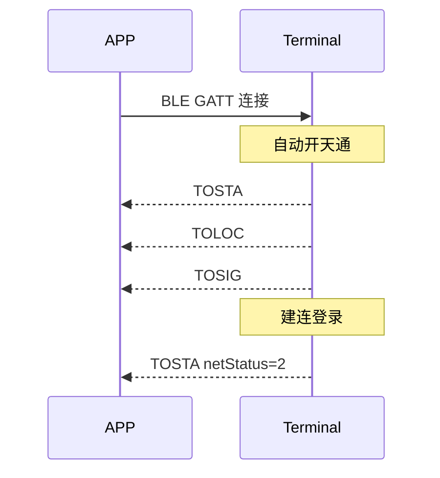
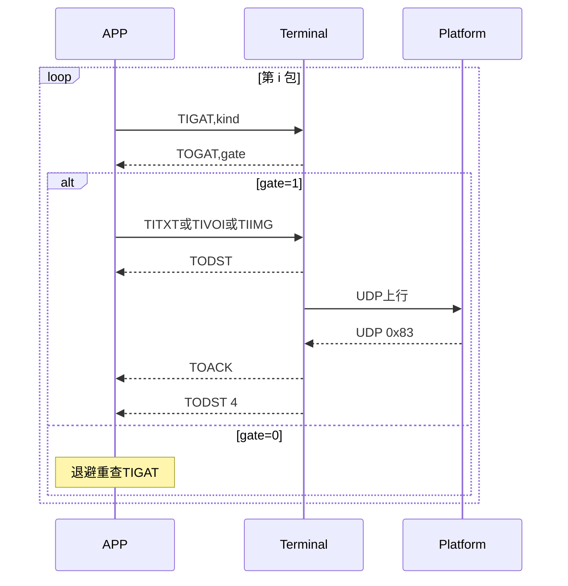
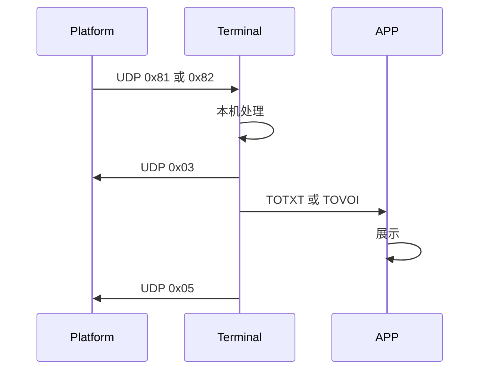
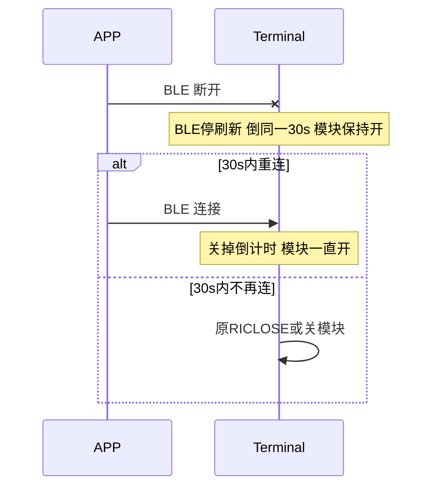

# 星联卫士 终端与 APP 交互协议

> Word 正式版见 [星联卫士-终端与APP交互协议v2.7.docx](星联卫士-终端与APP交互协议v2.7.docx)（与本文 v2.7 同步）。对齐卫星 UDP V1.12（号段分区）；APP 上行 `0x10`/`0x11`/`0x12`。  
> 联调硬前置见 [工程附录-联调前置说明.md](工程附录-联调前置说明.md)（GATT / 编解码 / 分包状态机）。固件增量见 [固件/README.md](../固件/README.md)（链到 `tt_rescue_stick/Doc`）。

APP 解析 `$xxxx` 帧；不组包、不解析卫星 UDP，不保存授权码。  
本期承载为蓝牙 GATT，后续可更换 Wi-Fi，应用层帧格式不变。  
卫星 UDP V1.12 仅用于终端与平台。

**v2.7**（相对 v2.5）：新增 `$TILGN`/`$TOLGN` 平台空闲重登，以及 `$TOLVO`/`$TILVA` 机身录音推 App。v2.5 真上电中转仍有效。须 **APP 与固件同版** 联调。

---

## 1. 帧格式

```
$CMD,field,field,...*hh<CR><LF>
```

- 禁止 JSON。
- `hh`：`$` 与 `*` 之间全部字符的异或（XOR），两位大写 HEX。
- 中间列数固定；空值留空（连续逗号）。
- 载荷 HEX 为大写、无 `0x` 前缀、长度为偶数。`len` = 二进制字节数 = HEX 字符数 / 2。
- 单帧载荷默认 250 字节（HEX 约 500 字符）。语音、图片按 250 字节分包；文本一包。
- `$TITXT`、`$TOTXT` 的 `hex` 为 GB2312。

指令配对：

| APP 发出 | 5 s 内应答 |
|----------|------------|
| `$TIQRY` | `$TOSTA` |
| `$TILOC` | `$TOLOC` |
| `$TISIG` | `$TOSIG` |
| `$TITXT` / `$TIVOI` / `$TIIMG` | `$TODST` |
| `$TIDSQ` | `$TODST` |
| `$TITSM,<sw>` | `$TOSTA` |
| `$TIGAT,<kind>` | `$TOGAT,<gate>` |
| `$TIREL,<sw>` | `$TOREL,<sw>` |
| `$TIADD,0` / `$TIADD,1,<ip>,<port>` | `$TOADD,<ip>,<port>` |
| `$TIUDP,<len>,<hex>` | 无（非法丢弃）；合法则走原 UDP 解析 |
| `$TILGN,0` | `$TOLGN,<st>` |
| `$TILVA,<localId>,<idx>` | 无（确认上一包 `$TOLVO`） |

共 **27 条** 指令帧（v2.5 的 23 条 + `$TILGN`/`$TOLGN`/`$TOLVO`/`$TILVA`）。`$TITSM`、`$TIGAT`、`$TIREL`、`$TIADD`、`$TILGN` 适用 5 s 指令超时；**`$TIGAT` 超时不计入** 单包 3 次失败。`$TIUDP` 非法 len/HEX 不回。`$TOLVO` 由终端主动推，每包等 `$TILVA`。

GATT 连接后，终端**自动开天通**，并依次推送 `$TOSTA`、`$TOLOC`、`$TOSIG`（约 2 s 内，等 APP 打开 Notify）。若主动推送时 Notify 尚未就绪，**首条合法 `$TI*`** 会再补推一次快照。首包 `$TOSTA.ttMod` 可能仍为 `0`（模块正在上电），上电完成后会再推 `ttMod=1`。其后字段变化时再推送；APP 可用对应查询核对。

`$TITXT` / `$TIVOI` / `$TIIMG` 缺列、非法 `len`/`idx`/`ver`、HEX 对不上时，5 s 内回 `$TODST,<seq>,2`（`seq` 解析不出则 `seq=0`）。`seq` 越界或迟到旧 seq 回 `$TODST,<seq>,0`。校验和失败不回。

### 1.1 序号与 termBizId 分区

与《卫星应急救援终端UDP协议》V1.12 对齐。WORD 类型不变，号段互不重叠：

| 用途 | 字段 | 范围 | 分配方 |
|------|------|------|--------|
| 机身 UDP（`0x01`/`0x02`） | `termBizId` | 0～32767 | 终端自增循环 |
| APP 上报（`$TITXT`/`$TIVOI`/`$TIIMG` 及 `$TODST`/`$TOACK`/`$TIDSQ`） | `seq` | 32800～65535 | APP 自增循环 |
| APP 上行 UDP（`0x10`/`0x11`/`0x12`） | `termBizId` | = APP `seq` | 不另分配 |
| 保留间隔 | — | 32768～32799 | 不得使用 |

循环：终端 `32767 → 0`；APP `65535 → 32800`。重试须换新 `seq`。

**APP seq 持久化**（按 `$TOSTA.deviceId` 分别保存；终端不参与）：

| 场景 | 行为 |
|------|------|
| 首次连接某终端 | 该终端无记录 → 下一条上报从 **32800** 起 |
| 再次连接同一终端 | 读取已存值，自增后继续（仍在 32800～65535 内循环） |
| 换了终端（`deviceId` 变化） | 从 **32800** 重新开始，不沿用上一台的 seq |
| 重试同一条消息内失败包 | **保持 seq**（自增计数器不前进）；仅整条失败后用户再次发送才换新 seq 并写回存储 |

---

## 2. 指令说明

查询应答与变化 Notify 使用同一帧格式。

### 2.1 `$TIQRY` / `$TILOC` / `$TISIG`

查询帧第二列固定为 `0`。

中转开启时，APP 可写位置：`$TILOC,1,<lat>,<lon>`（WGS84 十进制度，与 `$TOLOC` 同号）。仅中转会话有效；未开中转的写包忽略，仍回当前 RNSS `$TOLOC`。关中转后缓存丢弃。

举例：`$TIQRY,0*5B`　`$TILOC,0*41`　`$TISIG,0*5C`　`$TILOC,1,39.904987,116.407394`

### 2.2 `$TOSTA`

输出设备快照。

格式：`$TOSTA,<deviceId>,<battery>,<sosStatus>,<ttMod>,<netStatus>*hh`

| 列 | 名 | 取值 |
|----|----|------|
| 1 | deviceId | 12 位设备号 |
| 2 | battery | 0～100 |
| 3 | sosStatus | `0` 无 / `1` SOS 中 |
| 4 | ttMod | `0` 天通模块关闭 / `1` 天通模块开启 |
| 5 | netStatus | `0` 已断网 / `1` 搜星中 / `2` 已联网（含卫星登录成功） |

**约束**：

- 未开中转时：`ttMod=0` 则 `netStatus` **必须为 `0`**
- **UDP 中转**（`$TIREL,1`）：仍真上电天通，`ttMod` 跟 `poweron`；附着 AT 不进 UART，空口改 `$TOUDP`/`$TIUDP`；平台 `0x80` 成功后 `netStatus=2`
- `ttMod=0` 时 `$TOSIG` 的 `valid=0`，`rssi/arfcn/snr` 填 `0`
- 未完成卫星登录（含中转未收到 `0x80`）时不得上报 `netStatus=2`
- `ttMod` 不持久化：上电默认 `ttMod=0`；APP 须 `$TITSM,1` 开启天通；中转开着也继续 `$TITSM,1` 直到 `ttMod=1`
- `ttMod` / `netStatus` 变化时主动推送 `$TOSTA`

推送时机：连接建立后立即一条；`ttMod`、断网、联网、SOS 变化时推送。  
平台 `0x80` 由终端内部处理，经本帧反映联网态；授权码留在终端。

举例：`$TOSTA,123456789012,85,0,0,0*5A`（`sos=0, ttMod=0, net=0`）  
举例：`$TOSTA,123456789012,85,0,1,2*4D`（`sos=0, ttMod=1, net=2`）

### 2.3 `$TITSM` → `$TOSTA`

天通模块开关。应答为完整 `$TOSTA`（含更新后的 `ttMod`）。

格式：`$TITSM,<sw>*hh`

| 列 | 名 | 取值 |
|----|----|------|
| 1 | sw | `0` 关闭 / `1` 开启 |

- **开启**：5 s 内回 `$TOSTA`，`ttMod=1`；`netStatus` 为当前值（`0` 或 `1`）；登录成功后 **再推送** `netStatus=2`
- **关闭**：5 s 内回 `$TOSTA`，`ttMod=0`，`netStatus=0`；见 §3 在途规则
- **非法 `sw`**：回当前 `$TOSTA`，状态不变
- **`tt_init` 失败**：回 `$TOSTA` 且 `ttMod` 仍为 `0`

### 2.4 `$TIGAT,<kind>` → `$TOGAT,<gate>`

发送门闩预检。**每一包** `$TITXT`/`$TIVOI`/`$TIIMG` 前须查询。

| kind | 含义 |
|------|------|
| `0` | 即将发 `$TITXT` |
| `1` | 即将发 `$TIVOI` |
| `2` | 即将发 `$TIIMG` |

| gate | 含义 |
|------|------|
| `0` | 不可发送 |
| `1` | 可发送 |

**`gate=1` 须同时满足**：

1. `ttMod=1`
2. `netStatus=2`
3. 卫星发送信道空闲（机身 `0x01`/`0x02` 无在途；APP 上行无在途包）
4. 设备未禁用（平台 `0x80` bit0）
5. `kind=1` 时短音未用尽（工程附录 §E bit1）

**细则**：

- `TOGAT=1` 后终端仍可能因机身抢占而回 `TODST=0`；**`TODST` 为最终权威**，`TIGAT` 为预检
- `$TIGAT` 5 s 超时 **不计入** 单包 3 次失败；退避后重查
- 等待 `TOGAT` 时可能穿插 `TOSTA`/`TOLOC` 等 Notify；APP 须请求-应答配对，勿误认
- 本包 `TODST∈{1,3}` 时 `TOGAT=0`；收到 `TODST=4` 后下一包前再 `TIGAT`

举例：`$TIGAT,0*53`　`$TOGAT,1*54`

### 2.5 `$TOLOC`

输出位置。

格式：`$TOLOC,<locStatus>,<lat>,<lon>,<unixTime>*hh`

| 列 | 名 | 取值 |
|----|----|------|
| 1 | locStatus | `0` 搜星中 / `1` 已定位 / `2` 无效 |
| 2 | lat | WGS84 十进制度，北纬为正，最多 6 位小数；`locStatus≠1` 时留空 |
| 3 | lon | 东经为正；`locStatus≠1` 时留空 |
| 4 | unixTime | 定位时刻 UTC 秒；未定位填 `0` |

推送时机：连接建立后立即一条；`locStatus` 变化；已定位后位移超过 10 m，或距上次推送不少于 5 s。  
`$TILOC` 立即返回当前值，不受 5 s 节流限制。

举例：`$TOLOC,1,39.904987,116.407394,1724572800*58`  
举例：`$TOLOC,0,,,0*5B`

### 2.6 `$TOSIG`

输出信号，字段对齐固件 `tt_log_info_t`。

格式：`$TOSIG,<rssi>,<valid>,<arfcn>,<snr>*hh`

| 列 | 名 | 取值 | 含义 |
|----|----|------|------|
| 1 | rssi | 有符号整数，固件原值 | 信号指示 |
| 2 | valid | 无符号整数；`0` 未搜星，非 0 搜星中 | 是否搜星 |
| 3 | arfcn | 0～65535；未锁星填 `0` | 锁星号码 |
| 4 | snr | 0～65535；无效填 `0` | 信噪比 |

BLE 已连接时，信号更新即推送；连接建立后先推一条。可用 `$TISIG,0` 核对。  
`netStatus` 表示链路联网态；`valid` 表示射频搜星。信号显示以本帧为准。`ttMod=0` 时固定 `$TOSIG,0,0,0,0`。

举例：`$TOSIG,-70,1,12345,25*6B`　`$TOSIG,0,0,0,0*46`

### 2.7 `$TITXT`

上报文本，终端组 UDP `0x12`，应答 `$TODST`。UDP `termBizId` 取本帧 `seq`。

格式：`$TITXT,<seq>,<len>,<hex>*hh`

| 列 | 名 | 规则 |
|----|----|------|
| 1 | seq | 32800～65535，APP 自增；按 `$TOSTA.deviceId` 本地持久化；换终端从 32800 起；**同条消息内重试保持 seq**；整条失败后用户再次发送才换新 seq；迟到的旧 seq 的 TODST/TOACK 丢弃 |
| 2 | len | 二进制字节数 |
| 3 | hex | GB2312 HEX |

一包发送。载荷须满足 UDP `0x12` 上限（N≤200）；超长由 APP 拆成多条消息。发包前须 `$TIGAT,0` 且 `gate=1`。

举例：`$TITXT,32800,4,D6D0CEC4*13`

### 2.8 `$TIVOI`

上报语音分包，应答 `$TODST`，对应 UDP `0x10`。UDP `termBizId` 取本帧 `seq`。

格式：`$TIVOI,<seq>,<idx>,<total>,<ver>,<rate>,<len>,<hex>*hh`

| 列 | 名 | 规则 |
|----|----|------|
| 1 | seq | 同 `$TITXT` |
| 2 | idx | 本包序号，从 1 起 |
| 3 | total | 总包数 |
| 4 | ver | 压缩版本；仅第 1 包有效，其后填 `0` |
| 5 | rate | 码率；仅第 1 包有效，其后填 `0` |
| 6 | len | 本包二进制字节数 |
| 7 | hex | 压缩载荷 |

按 **250 字节**分包。**串行**：仅当本包收到 `$TODST=4`（经 `$TOACK`）后，才发送下一包。同条消息所有分包共用同一 `seq`。每包前须 `$TIGAT,1` 且 `gate=1`。

默认编解码档（APP 侧压缩）：`ver=3`（T05_L02_M01），`rate=10`；详见 [工程附录-联调前置说明.md](工程附录-联调前置说明.md) §C。

### 2.9 `$TIIMG`

上报图片分包，应答 `$TODST`，对应 UDP `0x11`。UDP `termBizId` 取本帧 `seq`。

格式：`$TIIMG,<seq>,<idx>,<total>,<ver>,<model>,<origKb>,<len>,<hex>*hh`

| 列 | 名 | 规则 |
|----|----|------|
| 1 | seq | 同 `$TITXT` |
| 2 | idx | 从 1 起 |
| 3 | total | 总包数 |
| 4 | ver | 仅第 1 包有效，其后填 `0` |
| 5 | model | 模型号；仅第 1 包有效，其后填 `0` |
| 6 | origKb | 原图 KB；仅第 1 包有效，其后填 `0` |
| 7 | len | 本包二进制字节数 |
| 8 | hex | 压缩载荷 |

按 **250 字节**分包。**串行**：仅当本包 `$TODST=4` 后发下一包。每包前须 `$TIGAT,2` 且 `gate=1`。

默认编解码档（APP 侧压缩）：`ver=5`（T05_L01_M01），`model=16`；详见工程附录 §C。

### 2.10 `$TODST`

输出本包本轮发送状态。整条消息汇总见第 3 节。

格式：`$TODST,<seq>,<status>*hh`

| 列 | 名 | 规则 |
|----|----|------|
| 1 | seq | 对应 `$TITXT` / `$TIVOI` / `$TIIMG`（32800～65535） |
| 2 | status | 见下表 |

| status | 含义 | APP 处理 |
|--------|------|----------|
| 0 | 未达发送条件，未发 UDP | 等待；失败计数不变；条件恢复后从当前包续发，该包失败计数清零 |
| 1 | 发送中 | 重计 5 s；超时仍未收到 `{0,2,3,4}` 则本轮失败 |
| 2 | 发送失败 | 本轮失败计数加 1；**同条消息内重试保持 seq/idx** |
| 3 | 已发出，等待平台回执 | **不可**发下一包；自收到 `3` 起 10 s 内须收到 `4`，超时则整条失败且不重发 |
| 4 | 已收到平台回执 | 本包完成；允许 `1→4` 跳过 `3`；**此后**才可发下一包（若有） |

举例：`$TODST,32800,1*50`  
举例：`$TODST,32800,4*55`

### 2.11 `$TOACK`

平台对上行 `0x12` / `0x10` / `0x11` 返回 `0x83` 时，终端先推本帧，再推 `$TODST` 且 `status=4`。

格式：`$TOACK,<seq>,<termBizId>,<pktIdx>*hh`

| 列 | 名 | 规则 |
|----|----|------|
| 1 | seq | 对应上报帧 seq |
| 2 | termBizId | APP 上行时与 seq 同值（32800～65535） |
| 3 | pktIdx | 分包序号 |

举例：`$TOACK,32800,32800,1*4F`

### 2.12 `$TIDSQ`

查询指定 seq 的发送状态，应答 `$TODST`。

格式：`$TIDSQ,<seq>*hh`

举例：`$TIDSQ,32800*4E`

### 2.13 `$TOTXT`

平台下行文本（UDP `0x81`）。终端本机处理后向 APP 推送。

格式：`$TOTXT,<platId>,<len>,<hex>*hh`

| 列 | 名 | 规则 |
|----|----|------|
| 1 | platId | 平台业务 ID |
| 2 | len | 二进制字节数 |
| 3 | hex | GB2312 HEX |

举例：`$TOTXT,80001,4,D6D0CEC4*15`

### 2.14 `$TOVOI`

平台下行语音（UDP `0x82`）。终端本机处理后向 APP 推送。

格式：`$TOVOI,<platId>,<idx>,<total>,<rate>,<len>,<hex>*hh`

| 列 | 名 | 规则 |
|----|----|------|
| 1 | platId | 平台业务 ID；按键短音转 APP 时填 `0` |
| 2 | idx | 从 1 起 |
| 3 | total | 总包数 |
| 4 | rate | 码率 |
| 5 | len | 本包二进制字节数 |
| 6 | hex | 压缩载荷 |

下行回执由终端上报：接收回执 UDP `0x03`，已读回执 UDP `0x05`。APP 不发回执帧。

**`0x05` 时机（已拍板）：**

- APP 已连接：终端成功推送 `$TOTXT` / `$TOVOI`（语音整条各包推完）后上报 `0x05`（不依赖用户是否点开气泡）
- APP 未连接：终端本机展示/播报完成后上报 `0x05`；该条不进入 APP 会话（不做后连补推）

同一 `platId`+`idx` 可能因卫星重发重复到达，APP 按 `platId,idx` 去重。

### 2.15 `$TIREL` / `$TOREL`

开/关手机 UDP 中转。开中转时终端**仍真上电天通**，附着类 AT（`CREG`/`CGDCONT`/`CGEQREQ`/`CGACT`/`RIOPEN`/`RICLOSE`）不进 UART、按现网解析器注入成功应答；本要 `AT+RISEND` 的 UDP 改成 `$TOUDP`；平台回包由 APP 原样 `$TIUDP` 回灌。读卡、`DCID`、`TOSIG` 仍走真芯片。回执仍是平台真 `0x80`/`0x83`，不伪造 `$TOACK`。

格式：`$TIREL,<sw>*hh`　`$TOREL,<sw>*hh`

| sw | 含义 |
|----|------|
| `1` | 开中转；未上电则补 `PRE_STARTUP`，不关模块、不跳登录 |
| `0` | 关中转并丢弃 APP 坐标；已上电从真 `CREG` 续跑；未上电且蓝牙仍连则 `PRE_STARTUP` |

非法 `sw` 回当前态。蓝牙断开时若模块已开，仍从断开这一刻起算原 30 s。

### 2.16 `$TOUDP` / `$TIUDP`

一整包卫星 UDP（与 `AT+RISEND` 载荷相同）。APP **只转发字节**，不解析 `0x00/0x80/0x12/0x83`。

格式：`$TOUDP,<len>,<hex>*hh`　`$TIUDP,<len>,<hex>*hh`

HEX 规则同 `$TITXT`。一包 UDP 一帧。超长拆帧本期不做。非法 `len`/HEX 的 `$TIUDP` 丢弃不回。

### 2.17 `$TIADD` / `$TOADD`

读写终端服务器 IP/端口（`config_admin2`，与运维 `$BDADD`、真星 `RIOPEN` 同一份）。

| 帧 | 含义 |
|----|------|
| `$TIADD,0` | 读 |
| `$TIADD,1,<ip>,<port>` | 写并落盘 |
| `$TOADD,<ip>,<port>` | 当前值 |

非法 IP/端口不改，仍回当前 `$TOADD`。APP 展示、中转绑 socket 都先读终端。

### 2.18 `$TILGN` / `$TOLGN`

蓝牙已连且 **30 秒**无平台业务包时，APP 发 `$TILGN,0`，终端静默再发登录 `0x00`（UDP 心跳）。不播「连接成功」。禁止 `tt_platform_fsm_reset()`。

格式：`$TILGN,0*hh`　`$TOLGN,<st>*hh`

| st | 含义 |
|----|------|
| `1` | 已接受，将排队静默登录 |
| `0` | 未就绪（无 socket / `connect_flag==0`） |
| `2` | 上行在途，跳过以免打断 RISEND |

重置 30 s 计时的业务包：TX `TITXT`/`TIVOI`/`TIIMG`/`TIUDP`/`TILGN`/`TILVA`；RX `TOTXT`/`TOVOI`/`TODST`/`TOACK`/`TOUDP`/`TOLGN`/`TOLVO`。`$TOSIG`/`$TOSTA`/`$TOLOC`/`$TILOC` **不重置**。中转时登录仍走 `$TOUDP`（首字节 `00`）。无消息断蓝牙是 APP 本地策略，不进本协议。

### 2.19 `$TOLVO` / `$TILVA`

机身按键录音入队后，BLE 已连接则读拷贝推 `$TOLVO`（不 `dequeue`，不改卫星 `0x02`）。不复用 `$TOVOI`（`$TOVOI` 仍是平台下行入站）。APP 合包后作出站语音，**不得**再发 `$TIVOI`。

格式：`$TOLVO,<localId>,<idx>,<total>,<rate>,<len>,<HEX>*hh`　`$TILVA,<localId>,<idx>*hh`

| 字段 | 规则 |
|------|------|
| `localId` | 固件自增 1–32767，回绕跳过 0；与 APP seq（32800–65535）、平台 `platId` 分号段 |
| `idx` / `total` | 从 1 起；按 240 字节切 |
| `rate` | 0=450 / 1=700 / 2=1200 / 3=2400（不要把 AT32 原码 0x15–0x1B 放进帧） |
| `len` | HEX 解码后的字节数 |

可靠传输按 `$TIVOI`+`$TOACK`：发一包等对应 `$TILVA`；超时 10 s 重发最多 3 次；仍失败则终止该 `localId`，不影响 `0x02`。BLE 中途断开丢弃当前 TOLVO 会话。APP 对已收齐的 `localId` 重复包仍回 `$TILVA`（幂等）。BLE 未连接只走 `0x02`。

---

## 3. 发送规则

同时仅一条消息在途；消息内分包 **串行**（本包 `$TODST=4` 后再发下一包）。

| 规则 | 说明 |
|------|------|
| 每包先查门闩 | **每一包**前先 `$TIGAT,<kind>`；`gate=1` 才发 `$TITXT`/`$TIVOI`/`$TIIMG` |
| 每包最多 3 次 | `TODST=2` 或 5 s 无 `$TODST` 计一次；同一轮二者只计一次。`TODST=0` 与 `TIGAT` 等待/超时不计入。满 3 次则整条失败 |
| 同条重试保持 seq | 包失败重试不换 `seq`/`idx`；整条失败后用户再次发送才换新 `seq` 并从第 1 包重来 |
| 指令超时 5 s | 上表配对指令；`$TIGAT` 超时不计包失败 |
| 暂停发送 | `ttMod=0`、`netStatus≠2`、`TOGAT=0`、`TODST=0` 时暂停；条件恢复后从当前包续发 |
| 等待发送超时（APP） | 整条消息处于「等待」时 APP 计时；连续等待达到配置时长则整条失败。**默认 10 分钟** |
| seq 持久化 | 按 `$TOSTA.deviceId` 本地记录下一 seq；换终端从 32800 起；见 §1.1 |
| 职责划分 | 快照=`$TOSTA`；即时可发=`$TIGAT/$TOGAT`；包进度=`$TODST`；**误发兜底=`TODST=0`** |
| `$TITSM,0` 在途 | 已有包 `TODST=1/3` **不中断**；走完 `TOACK→TODST=4` 后再关天通 |
| 禁用/额度 | 见 [工程附录-联调前置说明.md](工程附录-联调前置说明.md) §E |

### 3.1 天通与 BLE 生命周期

| 场景 | 行为 |
|------|------|
| 上电默认 | `ttMod=0`，`netStatus=0` |
| BLE 连接 | **自动开天通**（已开则不重复上电），推快照；`$TITSM` 仍可手动关/开 |
| BLE 已连 + `ttMod=1` | 不倒计时关模块；保活只刷新原 30 s 空闲（`connect_end_time`），为断开备 30 s |
| BLE 断开 | BLE 停保活；从断开这一刻起算原 30 s |
| 30 s 内重连 | **关掉倒计时**（再刷 30 s + 已连跳过超时），模块**一直开着**（不关再开） |
| 30 s 内不再连 | 满 30 s 走原 `RICLOSE` / 关模块 |
| 机身从未连 App | 同样只认原 30 s 空闲；无 300 s 上限 |
| 卫星收包/录音 | 仍可续同一 30 s 钟 |
| 断连会话 | 断开即清 APP 在途上行上下文；重连不恢复未完成的 `$TODST` |
| `$TIREL,1` | 真上电；附着 AT 走桩；空口 `$TOUDP` 登录 `0x00`；`0x80` 后 `net=2`；`ttMod` 跟 `poweron` |
| `$TIREL,0` | 清中转与 APP 坐标；已上电从真 `CREG` 续跑；断连仍刷 30 s |
| 服务器地址 | 只存在终端；`$TIADD` 读写 |
| `$TILGN,0` | 已连且 30 s 无平台业务包时静默重登；回 `$TOLGN` |
| `$TOLVO` | 机身录音读拷贝推 APP；每包等 `$TILVA`；不改 `0x02` |

整条消息状态：

| 状态 | 条件 |
|------|------|
| 等待 | 未发，或存在 `TODST=0`/`TOGAT=0`，且失败未满 3 次；若连续等待达 APP 配置的超时时长 → 转失败 |
| 发送中 | 已收到 `status=1`，或已 `3` 尚未 `4`（串行下同时至多一包） |
| 失败 | 某包失败满 3 次，或某包已 `3` 后 10 s 无 `4`，或**等待发送超时** |
| 发送成功 | 各包均为 `4` |

会话落库、机身短音进会话、信号格映射：见工程附录 §F / §G。

---

## 4. 时序

### 4.1 连接后快照与开天通



### 4.2 APP 上报（含 TIGAT）



### 4.3 平台下行



### 4.4 BLE 断开（共用卫星 30 s）



---

## 5. 修订记录

| 版本 | 日期 | 说明 |
|------|------|------|
| v1.8 | — | 初版 14 帧 |
| v1.9 | 2026-09 | TOSTA 五列重排 + ttMod；TITSM/TIGAT/TOGAT；每包门闩；BLE 保活与断连宽限；破坏性升级 |
| v2.0 | 2026-09 | BLE 连接自动开天通；断连与卫星 30s 空闲共用一计时；非法上行必回 TODST |
| v2.1 | 2026-09 | 已连保持天通；断开从这一刻起算原 30s/300s；保活不再改写 300s |
| v2.2 | 2026-09 | 已连不倒计时；断开只倒 30s；期内重连关掉倒计时；蓝牙会话跳过 300s |
| v2.3 | 2026-09 | 删除机身 300s 上限；关模块只认原 30s 空闲 |
| v2.4 | 2026-09 | 手机 UDP 中转 TIREL/TOUDP/TIUDP；服务器地址 TIADD 读写终端 |
| v2.5 | 2026-09 | 中转真上电；附着 AT/空口替换；中转 TILOC 写位置；回执仍为真 0x83 |
| v2.6 | 2026-09 | TILGN/TOLGN：已连空闲 30s 静默重登 0x00；TOSIG/TOSTA/TOLOC 不重置计时 |
| v2.7 | 2026-09 | TOLVO/TILVA：机身录音读拷贝推 APP；不 dequeue、不改 0x02；不复用 TOVOI |
