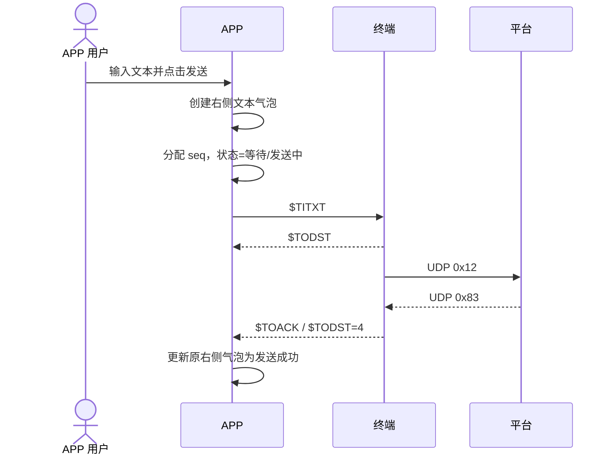
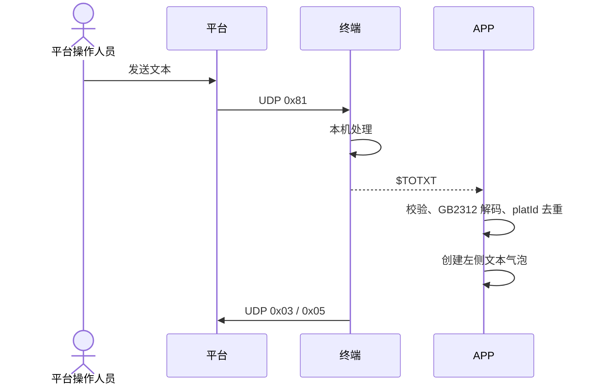
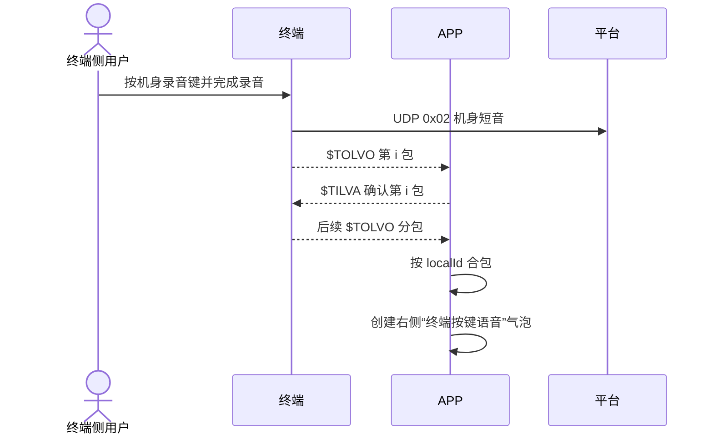
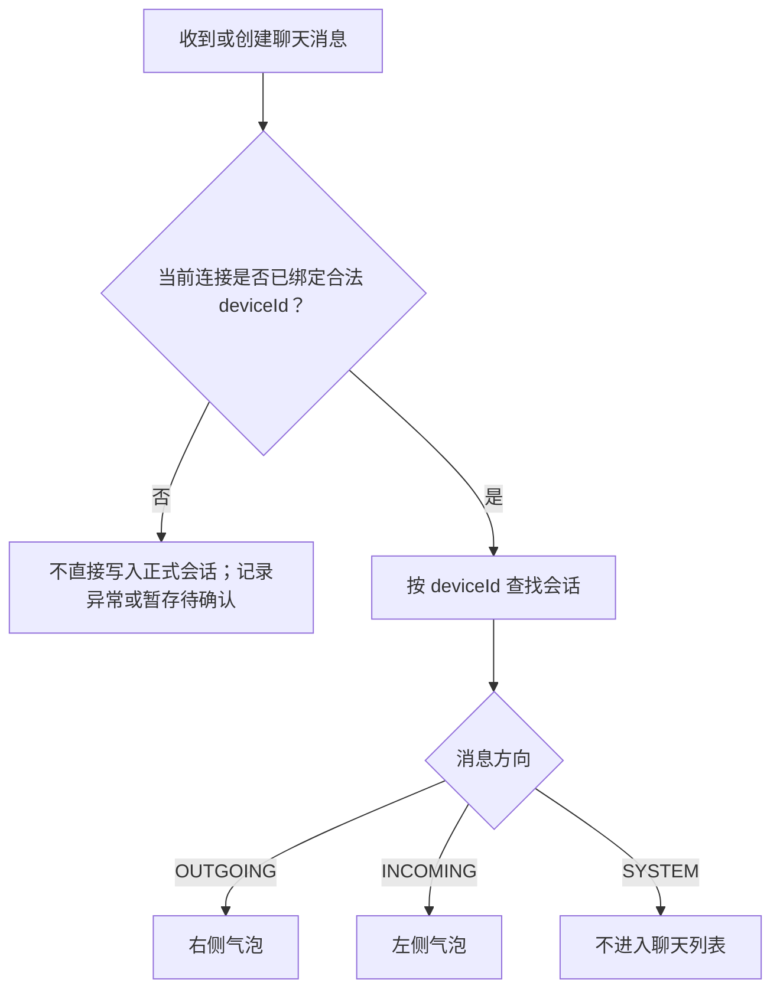

# 星联卫士 APP 聊天消息上下行与气泡展示逻辑点梳理.plan

<aside>
🎯

**文档用途**：梳理星联卫士 APP 聊天会话中上行、下行、终端本地消息和系统控制消息的分类规则，明确不同协议指令对应的聊天气泡左右位置、创建时机、状态更新、去重和本地存储逻辑，作为 UI 开发、协议接入和测试用例设计的依据。

**适用范围**：APP 已连接终端后的聊天会话，覆盖 APP 文本/语音/图片发送、平台文本/语音下发、终端机身按键录音同步 APP、发送状态和平台回执。位置、信号、终端状态、UDP 中转和配置指令仅说明“不进入聊天列表”，不展开其完整业务流程。

**核心口径**：聊天气泡左右侧按**消息业务发起方**判断，不按 BLE 物理传输方向判断，也不能只按 `$TI/$TO` 指令前缀判断。

</aside>

---

## 1. 核心结论

| 业务方向 | 消息含义 | 聊天气泡位置 |
| --- | --- | --- |
| 本端发出 / 出站 | 当前 APP 用户或终端机身用户发起，目标是卫星平台或监控端 | **右侧** |
| 对端发来 / 入站 | 平台或监控端发起，目标是终端侧用户 | **左侧** |
| 状态、回执或控制事件 | 只更新设备状态、消息状态或工程配置，不是聊天内容 | **不创建聊天气泡** |

```text
消息是否由当前终端侧用户发起？
├─ 是
│  ├─ APP 输入文本
│  ├─ APP 录制语音
│  ├─ APP 选择/拍摄图片
│  └─ 用户按终端机身录音键
│       → 出站消息
│       → 聊天项右侧
│
└─ 否，是否由平台/监控端发给终端用户？
    ├─ 是
    │    → 入站消息
    │    → 聊天项左侧
    └─ 否
         → 状态、回执或控制事件
         → 不进入普通聊天列表
```

<aside>
⚠️

**最容易误判的场景是 `$TOLVO`**：它在 BLE 链路上的物理方向是“终端 → APP”，但语音由终端侧用户按键产生，并继续作为终端侧出站语音发送平台，因此在 APP 聊天列表中必须显示于**右侧**。

</aside>

---

## 2. 上下行术语定义

### 2.1 本文采用的业务视角

本文以上下行的**业务发起方和最终目标**为准：

| 术语 | 发起方 | 目标 | APP 展示 |
| --- | --- | --- | --- |
| 上行 / 出站 | APP 用户或终端机身用户 | 卫星平台、Podium、Monitor | 右侧 |
| 下行 / 入站 | 平台、Podium 或 Monitor 操作人员 | 终端侧用户 | 左侧 |

### 2.2 不采用的错误判断方式

| 错误判断方式 | 为什么错误 | 反例 |
| --- | --- | --- |
| `$TI*` 全部显示右侧 | `$TI*` 表示 APP 写入终端，不等同于聊天消息 | `$TIQRY`、`$TILOC` 是查询指令，不应生成气泡 |
| `$TO*` 全部显示左侧 | `$TO*` 表示终端写给 APP，但其中可能是状态或本端出站副本 | `$TOLVO` 是终端机身出站语音，应显示右侧 |
| 终端上报 APP 的消息全部显示左侧 | 物理传输方向不等于业务方向 | 机身按键录音由终端推给 APP，但属于本端出站 |
| 收到 Notify 就生成聊天气泡 | Notify 中包含状态、回执、控制和聊天消息 | `$TOSTA/$TODST/$TOACK` 都不应新建气泡 |
| 按消息颜色判断业务方向 | 颜色只是视觉样式，不能成为数据模型真源 | 深色模式、无障碍模式可能改变颜色 |

### 2.3 必须区分的三个方向字段

| 字段 | 示例 | 用途 |
| --- | --- | --- |
| BLE 传输方向 | APP→终端、终端→APP | 协议日志 TX/RX、链路排障 |
| 业务消息方向 | OUTGOING、INCOMING | 决定聊天气泡左右位置 |
| 消息来源 | APP、TERMINAL_BUTTON、PLATFORM | 决定消息说明、图标、ID 和去重方式 |

<aside>
❗

同一条消息的 BLE 传输方向和业务消息方向可能不同。例如 `$TOLVO`：

```text
BLE 传输方向：终端 → APP
业务消息方向：本端 → 平台
聊天展示方向：OUTGOING，右侧
```

</aside>

---

## 3. 协议指令与聊天展示映射

### 3.1 完整映射表

| 业务场景 | 协议指令 | BLE 方向 | 业务方向 | 气泡位置 | 是否新建气泡 |
| --- | --- | --- | --- | --- | --- |
| APP 发送文本 | `$TITXT` | APP→终端 | OUTGOING | 右侧 | 是，用户提交后立即创建 |
| APP 发送语音 | `$TIVOI` | APP→终端 | OUTGOING | 右侧 | 是，用户完成录音并确认发送后创建 |
| APP 发送图片 | `$TIIMG` | APP→终端 | OUTGOING | 右侧 | 是，用户确认图片发送后创建 |
| 平台下发文本 | `$TOTXT` | 终端→APP | INCOMING | 左侧 | 是，合法解码并去重后创建 |
| 平台下发语音 | `$TOVOI,platId>0` | 终端→APP | INCOMING | 左侧 | 是，全部分包收齐并解码后创建 |
| 终端机身按键录音 | `$TOLVO` | 终端→APP | OUTGOING | 右侧 | 是，全部分包收齐后创建 |
| 旧版机身短音兼容 | `$TOVOI,platId=0` | 终端→APP | OUTGOING | 右侧 | 是，仅旧协议兼容时使用 |
| 消息发送状态 | `$TODST` | 终端→APP | SYSTEM | 不适用 | 否，只更新已有右侧气泡 |
| 平台业务回执 | `$TOACK` | 终端→APP | SYSTEM | 不适用 | 否，只更新已有右侧气泡 |
| 状态查询结果 | `$TOSTA` | 终端→APP | SYSTEM | 不适用 | 否，更新顶栏/设备状态 |
| 位置查询结果 | `$TOLOC` | 终端→APP | SYSTEM | 不适用 | 否，更新地图/位置 |
| 信号查询结果 | `$TOSIG` | 终端→APP | SYSTEM | 不适用 | 否，更新信号格 |
| 上行队列状态 | `$TIDSQ` | 终端→APP | SYSTEM | 不适用 | 否，更新调试或队列状态 |
| UDP 中转数据 | `$TOUDP/$TIUDP` | 双向 | SYSTEM | 不适用 | 否，只做工程中转 |
| 服务器地址 | `$TIADD/$TOADD` | 双向 | SYSTEM | 不适用 | 否，更新设置项 |
| 空闲重登 | `$TILGN/$TOLGN` | 双向 | SYSTEM | 不适用 | 否，更新连接/工程状态 |
| 机身语音包确认 | `$TILVA` | APP→终端 | SYSTEM | 不适用 | 否，只确认 `$TOLVO` 分包 |

### 3.2 映射优先级

消息进入 APP 后按以下顺序判断：

```text
1. 是否属于聊天内容指令？
   ├─ 否 → 进入状态、回执或控制处理器，不创建气泡
   └─ 是
       ↓
2. 是否存在明确业务来源？
   ├─ APP 用户发起 → OUTGOING / 右侧
   ├─ 终端机身用户发起 → OUTGOING / 右侧
   └─ 平台发起 → INCOMING / 左侧
       ↓
3. 校验消息 ID、设备 ID、分包完整性和重复状态
       ↓
4. 新建气泡或更新已有气泡
```

---

## 4. APP 发出消息——右侧气泡

### 4.1 文本 `$TITXT`



**展示规则**：

- 用户点击发送后立即创建右侧文本气泡。
- 气泡内容采用用户最终确认发送的文本。
- 单条文本显示 1/1 包。
- 超长文本若拆成多条独立消息，则每条使用独立 seq 和独立右侧气泡。
- `$TODST/$TOACK` 只更新已有气泡，不创建新的回执消息。

### 4.2 语音 `$TIVOI`

- 用户在 APP 录音并确认发送后创建右侧语音气泡。
- 同一语音全部分包共用一个 seq。
- 气泡可显示语音时长、分包进度和发送状态。
- 某包失败时更新当前右侧气泡，不创建新的失败气泡。
- 用户手动重发整条语音时使用新 seq；是否复用原气泡或创建新气泡需产品确认。

### 4.3 图片 `$TIIMG`

- 用户确认图片发送后创建右侧图片气泡。
- 气泡显示本地缩略图及 `k/N` 分包进度。
- 发送失败时保留图片内容和失败状态。
- 图片上行成功后仍使用原右侧气泡，不因平台 fileId 回传另建消息。
- 本期没有图片下行，因此左侧不应出现普通平台图片气泡。

### 4.4 右侧气泡创建时机

| 阶段 | 是否创建气泡 | 状态建议 |
| --- | --- | --- |
| 用户仅输入文本/录音/选图，未提交 | 否 | 草稿或本地编辑态 |
| 用户确认发送 | 是 | 等待发送或发送中 |
| 发送门闩暂不满足 | 已创建 | 等待发送 |
| `$TODST=1` | 已创建 | 发送中 |
| `$TODST=2` | 已创建 | 当前轮失败/重试中 |
| `$TODST=3` | 已创建 | 已发出，等待平台回执 |
| `$TODST=4` | 已创建 | 发送成功 |
| 等待或重试达到失败上限 | 已创建 | 发送失败 |

<aside>
💡

右侧气泡应先于最终发送结果出现，否则弱网或卫星等待期间用户看不到自己刚刚执行的发送动作，也无法理解等待、重试和失败状态。

</aside>

---

## 5. 平台下发消息——左侧气泡

### 5.1 平台文本 `$TOTXT`



**展示规则**：

- `$TOTXT` 是平台下行文本，显示在聊天项左侧。
- 按 `deviceId + platId` 或协议约定的稳定键去重。
- 文本解码失败时不能展示乱码冒充正常消息，应显示异常态或记录错误。
- 重复收到相同 platId 的文本不得重复创建气泡。

### 5.2 平台语音 `$TOVOI,platId>0`

- 平台下行语音显示在左侧。
- 按 `platId + idx` 对分包去重。
- 全部分包收齐后合成一条左侧语音气泡。
- 重复分包不重复累计进度。
- 分包缺失、解码失败时不得创建可正常播放的完整气泡。
- 是否显示“接收中”临时气泡或仅在收齐后展示，需产品确认。

### 5.3 下行消息已读与气泡位置无关

- APP 已连接时，终端成功推送完整 `$TOTXT/$TOVOI` 后上报 UDP `0x05`。
- 0x05 不依赖用户是否点击左侧气泡。
- APP 点击气泡只更新本地 UI 已读状态，不发送 `$TIRD`。
- 0x03、0x05 均不在聊天列表生成系统气泡。

### 5.4 未连接期间下行

- APP 未连接时，终端本机展示或播报后处理 0x05。
- 该消息本期不在 APP 重连后补推。
- APP 不得在重连后凭空创建历史左侧气泡。

---

## 6. 终端机身按键录音——右侧特殊气泡

### 6.1 v2.7 正式主路径 `$TOLVO`



### 6.2 为什么显示右侧

| 判断维度 | 结果 |
| --- | --- |
| BLE 物理方向 | 终端 → APP |
| 内容发起人 | 当前终端侧用户 |
| 卫星业务方向 | 终端 → 平台 |
| APP 消息方向 | OUTGOING |
| 聊天气泡位置 | 右侧 |

**正式协议明确**：APP 合包后将 `$TOLVO` 作为出站语音，不得再发 `$TIVOI`。

### 6.3 `$TOLVO` 展示规则

- 全部包收齐后创建或完成一条右侧语音气泡。
- 气泡来源标识为 `TERMINAL_BUTTON`，与 APP 麦克风录音区分。
- APP 对每包返回 `$TILVA`，但 `$TILVA` 不创建聊天项。
- 已收齐 localId 的重复分包仍返回 TILVA，但不得重复创建气泡。
- BLE 中途断开时丢弃当前未完成 TOLVO 会话。
- TOLVO 失败不得影响终端原有 UDP 0x02 发送。
- APP 不得因收到 TOLVO 再发送 TIVOI，否则会造成语音重复上报。

### 6.4 旧固件兼容 `$TOVOI,platId=0`

当前部分资料仍存在“机身按键短音使用 `$TOVOI,platId=0`”的历史口径。若产品明确需要兼容旧固件：

```text
$TOVOI 且 platId = 0
    → source = TERMINAL_BUTTON
    → direction = OUTGOING
    → 显示右侧
```

<aside>
⚠️

v2.7 已新增 `$TOLVO/$TILVA` 并明确“不复用 `$TOVOI`”。正式版本应优先使用 `$TOLVO`；`$TOVOI,platId=0` 只能作为旧固件兼容分支，不能与 `$TOLVO` 同时为同一条机身录音生成两条右侧气泡。

</aside>

---

## 7. 状态、回执和控制指令——不创建聊天气泡

### 7.1 发送状态 `$TODST`

| TODST 状态 | 对右侧气泡的影响 |
| --- | --- |
| 0 | 更新为等待发送，不增加失败次数 |
| 1 | 更新为发送中 |
| 2 | 更新为当前轮失败或重试中 |
| 3 | 更新为已发出、等待平台回执 |
| 4 | 更新当前包成功；全部包完成后整条成功 |

### 7.2 平台回执 `$TOACK`

- 根据 `termBizId/seq + pktIdx` 查找已有右侧气泡。
- 只推进当前消息或当前包状态。
- 重复 TOACK 幂等处理。
- 错误 seq、错误 idx 和旧连接迟到回执不得推进当前气泡。
- 不创建“平台已回执”左侧消息。

### 7.3 状态和控制指令

以下指令不进入聊天列表：

- `$TOSTA`：终端状态。
- `$TOLOC`：终端位置。
- `$TOSIG`：卫星信号。
- `$TOGAT`：发送门闩。
- `$TIDSQ`：消息队列状态。
- `$TOREL/$TOUDP/$TIUDP`：UDP 中转。
- `$TOADD`：服务器地址。
- `$TOLGN`：空闲重登结果。
- `$TILVA`：TOLVO 分包确认。

这些事件可以进入协议日志、状态栏、调试页或设置页，但不得污染聊天会话。

---

## 8. 推荐消息数据模型

### 8.1 消息方向枚举

```text
MessageDirection
├─ OUTGOING：本端发出，右侧
├─ INCOMING：平台/对端发来，左侧
└─ SYSTEM：状态或控制事件，不进入普通聊天列表
```

### 8.2 消息来源枚举

```text
MessageSource
├─ APP
├─ TERMINAL_BUTTON
├─ PLATFORM
└─ SYSTEM
```

### 8.3 消息类型枚举

```text
MessageType
├─ TEXT
├─ VOICE
└─ IMAGE
```

### 8.4 推荐消息对象

```json
{
  "messageId": "local-stable-id",
  "deviceId": "202606030046",
  "connectionSessionId": "session-id",
  "direction": "OUTGOING",
  "source": "APP",
  "type": "TEXT",
  "businessId": "32800",
  "seq": 32800,
  "platId": null,
  "localId": null,
  "content": "测试消息",
  "sendStatus": "SENDING",
  "packetDone": 1,
  "packetTotal": 1,
  "createdAt": 1789344000000
}
```

### 8.5 关键字段用途

| 字段 | 作用 |
| --- | --- |
| `direction` | 唯一决定气泡左右位置 |
| `source` | 区分 APP 发送、终端按键和平台下发 |
| `type` | 决定文本、语音或图片气泡组件 |
| `deviceId` | 会话分库，切换终端时不混消息 |
| `seq` | APP 上行消息和 TODST/TOACK 关联 |
| `platId` | 平台下行消息去重和组包 |
| `localId` | 终端机身语音 TOLVO 组包和去重 |
| `connectionSessionId` | 隔离断连前后的迟到协议事件 |
| `sendStatus` | 右侧出站消息发送状态 |

### 8.6 推荐映射逻辑

```text
TITXT / TIVOI / TIIMG
    → direction = OUTGOING
    → source = APP

TOTXT
    → direction = INCOMING
    → source = PLATFORM

TOVOI 且 platId > 0
    → direction = INCOMING
    → source = PLATFORM

TOLVO
    → direction = OUTGOING
    → source = TERMINAL_BUTTON

TOVOI 且 platId = 0（仅旧版兼容）
    → direction = OUTGOING
    → source = TERMINAL_BUTTON

TODST / TOACK / TOSTA / TOLOC / TOSIG 等
    → direction = SYSTEM
    → 不创建聊天消息
```

---

## 9. 气泡 UI 展示规则

### 9.1 左右对齐

| 方向 | 对齐 | 典型样式 |
| --- | --- | --- |
| OUTGOING | 右对齐 | 本端消息样式，可附发送状态 |
| INCOMING | 左对齐 | 对端消息样式，不展示本端发送状态 |

当前原型中：

- APP 发送文本、语音、图片均写入 `dir: "out"`。
- `dir: "out"` 使用反向行布局，将气泡显示于右侧。
- PRD 明确要求“左右分列展示下行与上行”。

### 9.2 右侧气泡附加信息

- 等待发送。
- 发送中。
- 当前包进度 `k/N`。
- 等待平台回执。
- 发送成功。
- 发送失败及失败原因。
- 用户重发入口。

### 9.3 左侧气泡附加信息

- 消息到达时间。
- 语音时长。
- 未读或本地已读状态。
- 下行组包异常提示。
- 平台来源标识是否展示，待 UI 确认。

### 9.4 终端按键语音标识

终端按键语音虽然显示右侧，但建议通过以下至少一种方式与 APP 录音区分：

- “终端按键语音”辅助文案。
- 终端图标。
- `source=TERMINAL_BUTTON` 的无障碍描述。
- 详情页显示 localId 和来源。

不建议仅依赖颜色区分来源。

### 9.5 无障碍与大字体

- 左右位置不能成为唯一方向提示。
- 读屏应读出“已发送”或“收到的消息”。
- 终端按键语音应读出“终端按键发出的语音”。
- 发送失败状态不能只使用红色表达。
- 大字体下气泡、状态和重发入口不能相互遮挡。

---

## 10. 消息创建、更新和去重逻辑

### 10.1 APP 上行消息

| 操作 | 预期 |
| --- | --- |
| 用户确认发送 | 创建一条右侧消息，并生成稳定 messageId/seq |
| 重复点击发送 | 防抖或幂等，只产生一次业务消息 |
| `$TODST` 到达 | 按 deviceId+seq 更新原消息 |
| `$TOACK` 到达 | 按 deviceId+seq+pktIdx 更新原消息 |
| 重复 TODST/TOACK | 不重复完成、不重复创建气泡 |
| 整条失败后用户重发 | 使用新 seq；是否新建气泡待产品确认 |

### 10.2 平台下行消息

| 消息 | 推荐去重键 |
| --- | --- |
| `$TOTXT` | `deviceId + platId` |
| `$TOVOI` 分包 | `deviceId + platId + idx` |
| 完整 `$TOVOI` 气泡 | `deviceId + platId` |

- 重复文本不得重复落库。
- 重复语音分包不得重复累计。
- 同一 platId 全部分包只生成一条左侧语音气泡。
- 不同 deviceId 即使 platId 相同，也必须进入不同设备会话。

### 10.3 终端按键语音

| 消息 | 推荐去重键 |
| --- | --- |
| `$TOLVO` 分包 | `deviceId + localId + idx` |
| 完整 TOLVO 气泡 | `deviceId + localId` |
| 旧版 `$TOVOI,platId=0` | 需增加固件侧可区分 ID，否则存在去重风险 |

- 已完成 localId 的重复包仍返回 TILVA。
- 重复包不得重复生成右侧气泡。
- TOLVO 和旧版 TOVOI=0 同时到达时不得生成两条相同语音。

### 10.4 迟到事件隔离

消息更新至少同时校验：

```text
deviceId
+ connectionSessionId
+ seq / platId / localId
+ idx（分包或回执场景）
+ 当前状态是否允许该事件
```

旧连接 session 的 TODST、TOACK、TOTXT、TOVOI 或 TOLVO 不得错误写入当前设备的新会话。

---

## 11. 本地会话与设备隔离

### 11.1 已确认规则

- 聊天气泡按 `$TOSTA.deviceId` 分库持久化。
- 切换终端时切换到对应 deviceId 的会话。
- 不同终端消息不得混库。
- APP 未连接时错过的平台下行消息不在后连时补推。
- 上行和下行消息均需要持久化。

### 11.2 会话归属规则



### 11.3 换设备场景

- 设备 A 的右侧发送状态不得显示在设备 B 会话。
- 设备 A 的下行 platId 与设备 B 相同时仍是两条独立消息。
- 终端按键 localId 按设备分别去重。
- 设备切换过程中收到旧设备消息时按失效 session 处理。
- 切回原设备时历史左右位置和发送状态保持一致。

---

## 12. 开发人员实现约束

### 12.1 禁止直接按指令前缀渲染

错误示例：

```text
if command startsWith "$TI" → right
if command startsWith "$TO" → left
```

该逻辑会造成：

- `$TOSTA/$TOLOC/$TOSIG` 被错误创建为左侧气泡。
- `$TODST/$TOACK` 被错误创建为左侧回执气泡。
- `$TOLVO` 被错误显示到左侧。
- `$TIQRY/$TIGAT` 等查询控制指令被错误显示到右侧。

### 12.2 推荐分发器

```text
onProtocolFrame(frame):
    switch frame.command:
        TITXT/TIVOI/TIIMG:
            由发送流程创建 OUTGOING 消息

        TOTXT:
            handleIncomingText(frame)

        TOVOI:
            if frame.platId == 0 and legacyCompatible:
                handleTerminalOutgoingVoice(frame)
            else:
                handleIncomingVoice(frame)

        TOLVO:
            handleTerminalOutgoingVoice(frame)

        TODST/TOACK:
            updateOutgoingStatus(frame)

        TOSTA/TOLOC/TOSIG/TOGAT/TIDSQ/TOREL/TOUDP/TOADD/TOLGN:
            dispatchSystemEvent(frame)

        default:
            logUnknownFrame(frame)
```

### 12.3 数据层约束

1. `direction` 在消息创建时确定并落库，渲染层只读取，不重复推导。
2. `source` 与 `direction` 分开保存。
3. 右侧发送状态只允许更新 OUTGOING 消息。
4. INCOMING 消息不得出现“发送中/发送失败”状态。
5. SYSTEM 事件不得进入普通消息表；如需记录，应进入协议日志或系统事件表。
6. 所有消息按 deviceId 隔离。
7. 重复回执、重复分包和重复下行必须幂等。
8. 旧 session 事件不得更新新 session 消息。
9. TOLVO 不得再次触发 TIVOI。
10. 旧版 TOVOI=0 与新版 TOLVO 的兼容开关应与固件版本绑定，不能同时无条件启用。

### 12.4 UI 层约束

- `direction=OUTGOING` 固定右对齐。
- `direction=INCOMING` 固定左对齐。
- 不能根据发送状态判断左右位置。
- 发送失败的消息仍保持右侧。
- 终端按键语音仍保持右侧。
- 页面刷新、APP 重启和切换设备后方向保持不变。

---

## 13. 测试人员逻辑点

### 13.1 基础方向矩阵

| 编号 | 场景 | 预期位置 | 其他断言 |
| --- | --- | --- | --- |
| D-01 | APP 发送文本 | 右侧 | 显示发送状态，单包 1/1 |
| D-02 | APP 发送语音 | 右侧 | 显示时长、分包进度和状态 |
| D-03 | APP 发送图片 | 右侧 | 显示缩略图、分包进度和状态 |
| D-04 | 平台下发文本 | 左侧 | 不显示本端发送状态 |
| D-05 | 平台下发语音 | 左侧 | 收齐后可播放 |
| D-06 | 终端机身按键录音 `$TOLVO` | 右侧 | 标识终端来源，不再发 TIVOI |
| D-07 | 旧版 `$TOVOI,platId=0` | 右侧 | 仅兼容模式启用 |

### 13.2 非聊天指令

| 编号 | 指令 | 预期 |
| --- | --- | --- |
| D-08 | `$TOSTA` | 更新终端状态，不创建气泡 |
| D-09 | `$TOLOC` | 更新位置，不创建气泡 |
| D-10 | `$TOSIG` | 更新信号，不创建气泡 |
| D-11 | `$TODST` | 更新已有右侧气泡，不新建 |
| D-12 | `$TOACK` | 更新已有右侧气泡，不新建 |
| D-13 | `$TOUDP/$TOADD/$TOLGN` | 更新对应工程功能，不进入聊天列表 |
| D-14 | `$TILVA` | 确认 TOLVO 分包，不创建气泡 |

### 13.3 状态与位置保持

- 右侧消息从等待、发送中、等回执、成功到失败，位置始终为右侧。
- 发送失败后重启 APP，气泡仍在右侧。
- 左侧消息本地标记已读后仍保持左侧。
- 平台消息播放失败不应移动到右侧。
- TOLVO 合包失败不得错误显示为平台左侧语音。

### 13.4 去重与幂等

- 重复 `$TOTXT` 只生成一个左侧文本气泡。
- 重复 `$TOVOI` 分包不重复累计，不生成多个左侧语音。
- 重复 `$TOLVO` 分包仍回 TILVA，但只生成一个右侧语音。
- 重复 `$TODST=4/$TOACK` 不生成新气泡。
- APP 快速双击发送只生成一条右侧业务消息。
- 同一机身语音同时收到 TOLVO 和旧 TOVOI=0 时不能重复展示。

### 13.5 断开重连与设备切换

- 发送中断开后，右侧气泡仍保持右侧并进入明确终态。
- 重连后迟到旧 TOACK 不得更新新右侧消息。
- 设备 A 的左侧下行不得出现在设备 B 会话。
- 设备 A 和 B 使用相同 platId 时分别去重。
- 切回设备 A 后消息方向、内容和状态保持。
- APP 未连接期间下行消息不在重连后补建左侧气泡。

### 13.6 异常数据

- `$TOTXT` 解码失败。
- `$TOVOI` 缺包、乱序和坏数据。
- `$TOLVO` 缺包、重复和 TILVA 超时。
- 收到未知 `$TO*` 指令。
- `platId/localId/seq` 缺失或越界。
- 收到不属于当前 deviceId/session 的消息。
- 消息入库成功但 UI 渲染失败后的恢复。

---

## 14. 边界值与等价类速查

| 对象 | 有效场景 | 异常或边界行为 |
| --- | --- | --- |
| APP seq | 32800～65535 | 越界、重复、旧 seq 不得关联当前右侧气泡 |
| 平台 platId | 合法非零平台业务 ID | 重复时去重；0 按旧机身语音兼容处理 |
| TOLVO localId | 1～32767 | 回绕、重复、缺失，不得与 APP seq 混用 |
| 文本方向 | TITXT=右，TOTXT=左 | 不按 TI/TO 前缀统一判断 |
| 语音方向 | TIVOI=右，TOVOI>0=左，TOLVO=右 | TOVOI=0 为旧兼容特殊分支 |
| 图片方向 | TIIMG=右 | 本期无图片下行，不应出现普通左侧图片 |
| 发送状态 | 只更新右侧 OUTGOING | 不创建左侧回执气泡 |
| 重复下行 | 原气泡保持 1 条 | 不重复落库和展示 |
| 分包消息 | 收齐后 1 条完整气泡 | 每包创建一条气泡属于错误 |
| 设备切换 | 按 deviceId 分库 | 不同设备消息混入同一会话属于错误 |
| APP 未连接 | 不补历史下行 | 重连后凭空出现旧左侧消息属于错误 |

---

## 15. 关键规则说明

1. **右侧代表本端发出，左侧代表平台发来。**
2. **业务方向优先于 BLE 物理方向。**
3. **不能通过 `$TI/$TO` 前缀直接决定气泡位置。**
4. APP `$TITXT/$TIVOI/$TIIMG` 均为右侧出站消息。
5. 平台 `$TOTXT/$TOVOI(platId>0)` 均为左侧入站消息。
6. 终端机身录音 `$TOLVO` 虽由终端推给 APP，仍是右侧出站消息。
7. `$TODST/$TOACK` 只更新已有右侧气泡，不生成回执气泡。
8. `$TOSTA/$TOLOC/$TOSIG` 等状态帧不进入聊天列表。
9. 消息方向在数据层创建时确定，UI 不重复推导。
10. 上下行消息按 `$TOSTA.deviceId` 分库，不同终端不混会话。
11. 平台下行按 platId 去重，机身语音按 localId 去重，APP 上行按 seq 关联状态。
12. 断连后的旧回执不得推进重连后的新右侧消息。
13. 本期未连接期间的平台下行不做历史补推。
14. 本期无普通图片下行，左侧图片气泡不属于当前正式范围。
15. 终端机身语音不得因 TOLVO 和 0x02/TOVOI 兼容逻辑重复展示。

---

## 16. 待确认问题

### 16.1 终端机身语音兼容

- 正式发布是否只支持 v2.7 `$TOLVO/$TILVA`？
- 是否仍需兼容 `$TOVOI,platId=0` 旧固件？
- 若新旧协议都可能出现，如何识别同一条机身录音，避免重复右侧气泡？
- 终端按键语音是否展示独立图标或“终端按键语音”文案？

### 16.2 下行语音展示

- `$TOVOI` 分包未收齐时是否展示“接收中”临时左侧气泡？
- 缺包或解码失败时展示失败气泡、系统提示还是不展示？
- 下行语音是否需要显示平台发送者名称？

### 16.3 上行重发交互

- 整条失败后用户点击重发，是更新原右侧气泡还是创建新右侧气泡？
- 若创建新气泡，原失败气泡是否保留？
- 重发后的新 seq 与原 messageId 如何关联？

### 16.4 已读与时间

- 左侧消息的本地已读标识如何展示？
- APP 是否需要显示平台消息送达时间、终端接收时间或 APP 接收时间？
- 右侧气泡展示用户点击发送时间还是平台成功时间？
- 本地时钟异常时如何排序消息？

### 16.5 系统消息

- 蓝牙断开、卫星离线等事件是否以会话分割线或系统提示展示？
- 若展示系统提示，应进入独立 SYSTEM 消息类型，不能伪装成普通左右聊天气泡。
- 系统提示是否落库和参与会话摘要？

### 16.6 图片下行

- 当前明确无图片下行；未来若增加，应使用独立平台下行指令并显示左侧。
- 不应直接复用 TIIMG 或仅凭 fileId 在左侧创建图片。

---

## 17. 参考文档

- `../2026_09_14_星联卫士App对接文档/星联卫士App对接文档/需求文档/prd-site/prd-brief.json`
- `../2026_09_14_星联卫士App对接文档/星联卫士App对接文档/需求文档/prd-site/assets/screens-1.js`
- `../2026_09_14_星联卫士App对接文档/星联卫士App对接文档/需求文档/prd-site/assets/app-ui.css`
- `../2026_09_14_星联卫士App对接文档/星联卫士App对接文档/通用/星联卫士-终端与APP交互协议.md`
- `../2026_09_14_星联卫士App对接文档/星联卫士App对接文档/通用/工程附录-联调前置说明.md`
- `../2026_09_14_星联卫士App对接文档/星联卫士App对接文档/通用/协议映射说明.md`
- `../2026_09_14_星联卫士App对接文档/星联卫士App对接文档/通用/联调与测试指南.md`
- `../星联卫士APP测试功能点清单.md`
- `星联卫士 APP 蓝牙连接逻辑点梳理 plan.md`

---

**文档版本**：v1.0

**最后更新**：2026-09-14

**维护人**：测试团队 / Android 开发 / 固件开发
