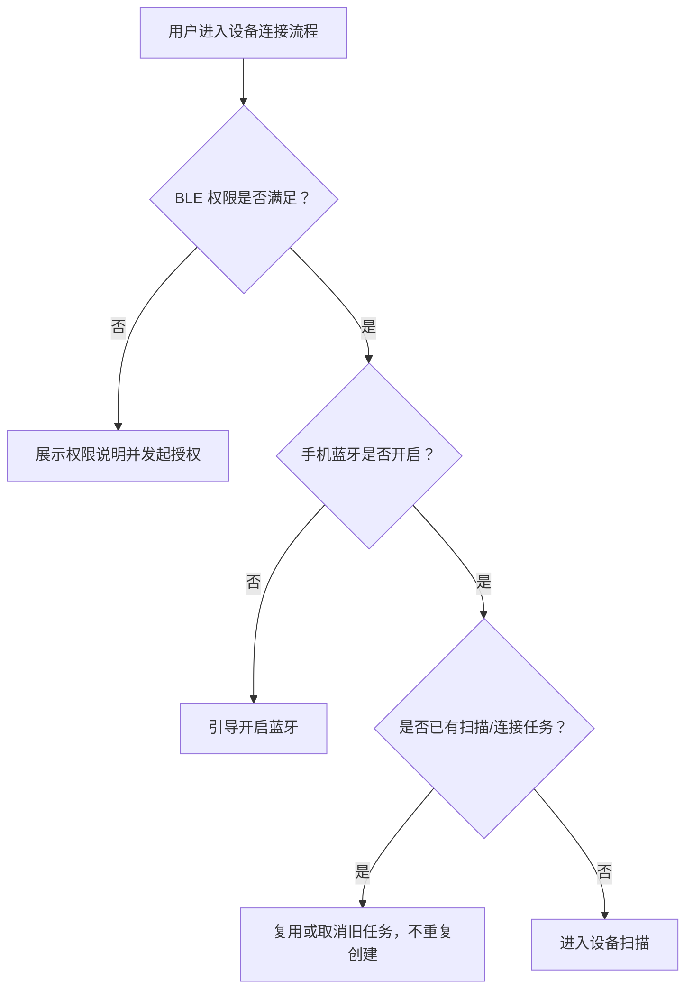
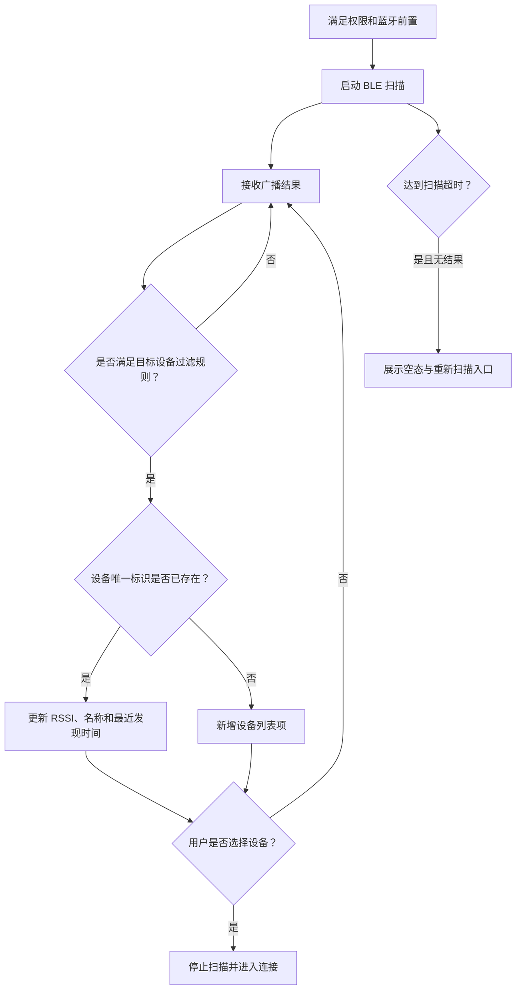
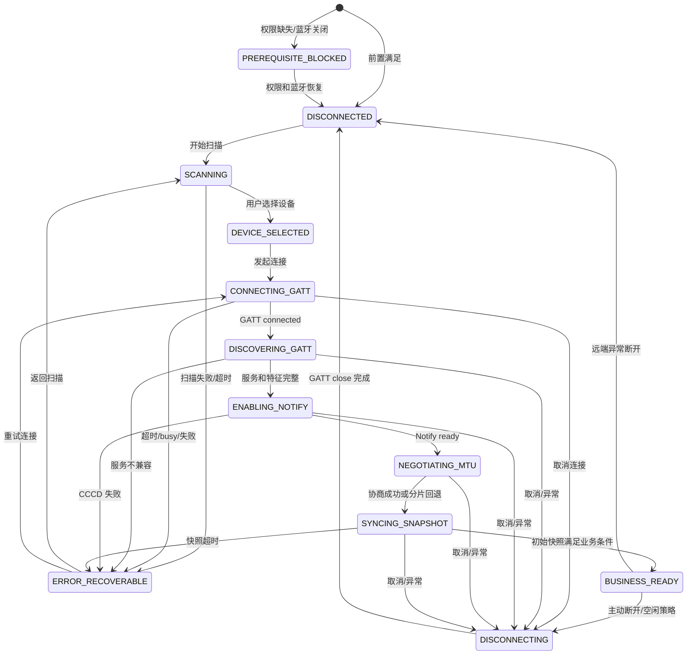
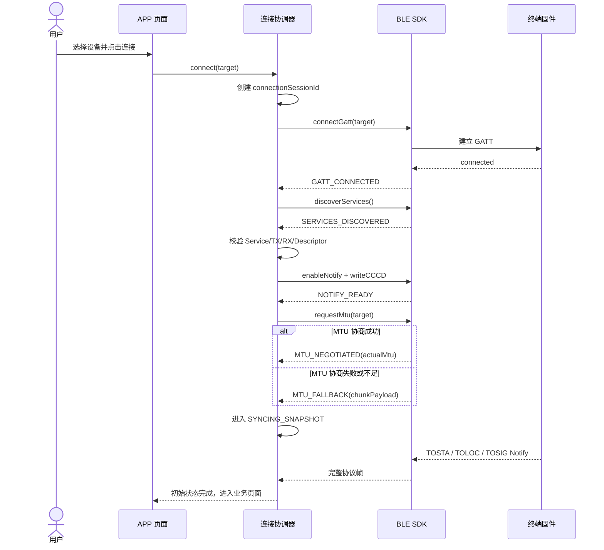
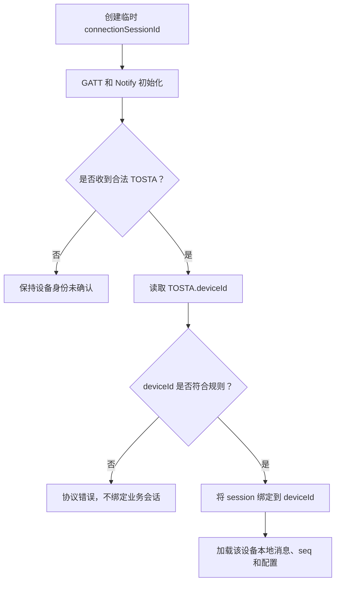
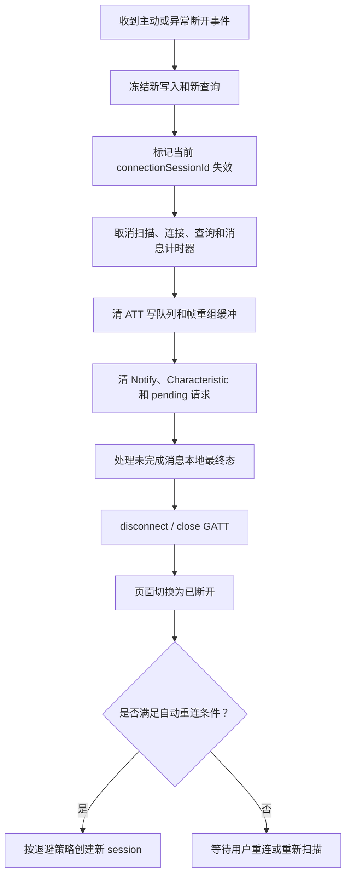
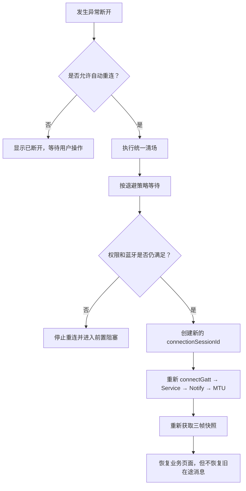

# 星联卫士 APP 蓝牙连接逻辑点梳理.plan

<aside>
🎯

**文档用途**：从测试人员与开发人员双重视角，梳理星联卫士 APP 与 S1 / 应急救援终端之间的蓝牙扫描、连接、GATT 初始化、初始快照、断开重连、资源清理、异常恢复和可观测性逻辑，作为开发设计、联调排障和后续测试用例编写的依据。

**适用范围**：Android APP 一期 BLE 链路，覆盖「权限与蓝牙前置 → 扫描和过滤 → 用户选择设备 → GATT 连接 → 服务发现 → Notify → MTU / ATT 分片 → 三帧快照 → 业务可用 → 主动断开 / 异常断开 → 重连与清场」。消息发送状态机、卫星 UDP、Podium 和 Monitor Web 仅在与蓝牙会话直接相关时展开。

**资料基线**：当前以《星联卫士-终端与APP交互协议》v2.7、《工程附录-联调前置说明》《歧义项决议》《设备与APP协作模型》为主要规则来源；PRD 和原型用于页面、入口与体验参考。若原型、旧 v1.8 文档与 v2.7 冲突，以 v2.7 及歧义决议为准。

**标识约定**：

- **已确认规则**：正式协议、工程附录或歧义决议已明确，可直接作为测试判定依据。
- **工程建议**：基于 Android BLE、并发和状态机风险推导，用于指导实现和补充测试，不自动等于已确认产品需求。
- **待确认项**：当前资料无法唯一判定，不能擅自作为开发实现或测试通过标准。

</aside>

---

## 1. 蓝牙链路对象、分层与职责

### 1.1 链路分层

```text
用户 / Android 系统
    ↓ 权限、蓝牙开关、前后台和进程生命周期
APP 页面层
    ↓ 扫描页、连接页、异常页、消息页顶栏
APP 业务与连接协调层
    ↓ 会话隔离、设备身份、重连、计时器、发送状态
Android BLE SDK 层
    ↓ 扫描、connectGatt、服务发现、CCCD、MTU、ATT 收发
BLE 协议 Core
    ↓ $TI/$TO 组帧、校验、缓冲解析、请求应答和状态机
终端固件 GATT Server
    ↓ 快照 Notify、状态变化、天通控制、业务互斥
天通模块 / 卫星平台
```

<aside>
⚠️

**必须区分三种“连接成功”**：

1. **GATT 物理连接成功**：Android 收到 GATT connected 回调。
2. **BLE 通道初始化成功**：Service、Characteristic、Notify 和分片能力均已准备。
3. **业务连接成功**：APP 已收到足以建立设备身份与初始状态的快照，可以安全执行查询和消息业务。

开发不得用单一 `bleConnected=true` 同时表达以上三种状态；测试也不能只看到系统蓝牙图标或 GATT 回调就判定业务连接成功。

</aside>

### 1.2 参与对象职责矩阵

| 对象 | 开发人员职责 | 测试人员关注点 |
| --- | --- | --- |
| Android 系统 | 提供蓝牙开关、运行时权限、GATT 回调和进程生命周期 | 权限拒绝、永久拒绝、运行中撤权、蓝牙关闭、锁屏、后台、进程被杀 |
| APP 页面层 | 展示扫描、连接阶段、异常原因和可恢复操作 | UI 与底层状态一致；不得提前显示“已连接”或“已联网” |
| APP 连接协调层 | 管理扫描、连接、断开、重连、single-flight 和连接 session | 重复点击、并发重连、旧回调污染、页面切换后重复建连 |
| APP 业务层 | 根据 deviceId 隔离会话、消息、seq 和本地状态 | 换设备不串数据；断连后旧消息不污染新会话 |
| BLE SDK Android 层 | 扫描、GATT、Service、Characteristic、CCCD、MTU、ATT 分片、资源释放 | 每阶段有成功/失败/超时；底层资源成对创建和释放 |
| BLE 协议 Core | `$...*HH\r\n` 组帧、校验、缓冲解析、请求应答和消息状态 | 半帧、粘包、多帧、乱序、重复、校验失败、错误 seq/idx |
| 终端固件 | GATT Peripheral、三帧快照、首指令补推、断连清场、天通生命周期 | 快照顺序、重复补推、状态变化 Notify、30 秒规则、业务互斥 |
| 天通模块 / 平台 | 卫星登录、状态变化、上行与 0x83 回执 | 蓝牙连接态不得与卫星联网态混淆；回执延迟和迟到消息 |
| 烧录脚本 / 电脑探针 | 固件烧录、协议探测和联调取证 | 与 APP 的单客户端互斥；执行前必须确保 APP 已释放 GATT |

### 1.3 APP、BLE SDK、协议 Core、固件的边界

| 分层 | 应负责 | 不应负责 |
| --- | --- | --- |
| APP UI | 权限引导、设备选择、连接阶段与错误展示 | 自己推测终端已联网；绕过 SDK 直接维护 GATT 状态 |
| APP 连接协调层 | 统一连接入口、session、重连、资源生命周期 | 每个页面各自创建独立连接；多个连接任务并行 |
| APP 业务层 | deviceId 会话隔离、发送等待、消息最终态 | 把 BLE MAC 或广播名当作最终业务身份 |
| BLE SDK | Android BLE 全流程和结构化事件 | 解析卫星业务 UDP；自行决定业务消息成功 |
| BLE 协议 Core | `$TI/$TO` 帧和请求/响应/Notify 语义 | 操作 Android 页面；保存卫星 authCode |
| 终端固件 | GATT Server、Notify、天通和 UDP 桥 | 依赖 APP 页面状态；把旧连接回执发送给新会话 |

**已确认边界**：APP 只处理 `$TI/$TO` 蓝牙协议，不组装或解析卫星业务 UDP，不保存卫星 authCode。

---

## 2. 蓝牙状态、卫星状态与业务状态必须正交

### 2.1 三类状态维度

| 维度 | 典型状态 | 用途 |
| --- | --- | --- |
| BLE 连接状态 | 未授权、蓝牙关闭、扫描中、连接中、初始化中、业务可用、断开中、已断开 | 判断 APP 与终端之间是否能传输 `$TI/$TO` |
| 天通模块状态 | `ttMod=0/1` | 判断终端天通模块是否关闭或开启 |
| 卫星网络状态 | `netStatus=0/1/2` | 判断断网、搜星、已联网 |
| 消息发送状态 | 等待、发送中、等平台回执、成功、失败 | 判断具体消息或包的生命周期 |

<aside>
❗

**易错概念**：

1. `GATT connected` ≠ BLE 业务可用。
2. BLE 业务可用 ≠ 天通模块已开启。
3. `ttMod=1` ≠ 卫星已联网。
4. `netStatus=2` ≠ 当前消息一定可发送，还需每包执行 `TIGAT/TOGAT` 门闩。
5. `TOGAT=1` ≠ 当前包最终成功，最终仍以 `TODST/TOACK` 为准。
6. 页面显示“已连接”不得掩盖 Notify 未开启或三帧快照缺失。

</aside>

### 2.2 推荐 UI 状态表达

| 底层状态 | 页面建议表达 | 可执行动作 |
| --- | --- | --- |
| 权限缺失 | 需要蓝牙权限 | 去授权、返回 |
| 手机蓝牙关闭 | 蓝牙未开启 | 开启蓝牙、取消 |
| 扫描中 | 正在搜索附近设备 | 停止、等待 |
| 扫描无结果 | 未发现可用设备 | 重新扫描、检查设备 |
| GATT 连接中 | 正在连接设备 | 取消连接 |
| 初始化中 | 正在初始化通信 | 等待、取消 |
| 快照同步中 | 正在读取设备状态 | 等待、重试 |
| BLE 业务可用、卫星搜星中 | 蓝牙已连接，卫星搜星中 | 可查状态；发送按门闩等待 |
| BLE 业务可用、卫星已联网 | 设备已连接 | 可进入完整业务 |
| 设备占用 | 设备已被其他客户端连接 | 返回扫描、稍后重试 |
| 异常断开 | 蓝牙已断开 | 重连、返回扫描 |

---

## 3. 建连前置条件与拦截顺序

### 3.1 前置条件

| 前置条件 | 已确认规则 | 测试视角 | 开发视角 |
| --- | --- | --- | --- |
| Android 蓝牙权限 | APP 必须取得对应系统权限 | 首次拒绝、永久拒绝、运行中撤销、系统设置恢复 | 权限不足时不得启动扫描或 connectGatt |
| 手机蓝牙开关 | 蓝牙必须开启 | 关闭、开启中、运行中关闭 | 监听适配器状态，关闭时停止扫描并清连接 |
| 目标设备已上电 | 扫描必须能收到终端广播 | 终端未上电、距离过远、弱信号 | 区分“未发现设备”和“连接失败” |
| 目标设备未被占用 | 同一终端只允许一个 GATT 客户端 | 另一手机、电脑探针、烧录脚本占用 | busy 与普通超时分开表达 |
| 当前无其他连接任务 | 工程建议 | 快速点击、自动重连与手动连接竞争 | 统一走 single-flight 连接协调器 |
| 已选稳定设备标识 | 工程建议 | 同名设备、地址变化、列表刷新 | 扫描阶段用 address/标识，业务身份以 TOSTA.deviceId 为准 |

### 3.2 建议拦截优先级

1. 当前系统是否支持 BLE。
2. APP 是否具备蓝牙运行时权限。
3. 手机蓝牙是否已开启。
4. 当前是否存在未结束的扫描、连接或断开任务。
5. 用户是否已选择有效扫描结果。
6. 当前 APP 是否已持有其他有效 GATT 会话。
7. 目标设备是否可连接或已被其他客户端占用。



---

## 4. 设备扫描、过滤、去重与列表刷新

### 4.1 扫描主流程



### 4.2 扫描规则

| 项目 | 规则 | 边界与易错点 |
| --- | --- | --- |
| 扫描触发 | 权限已授权、蓝牙已开启后启动 | 页面重复进入不得叠加多个 ScanCallback |
| 扫描时长 | PRD 目标为 10 秒内出现列表或空态 | 不能用固定延时替代实际扫描状态管理 |
| 列表字段 | 至少展示设备名称和 RSSI | 名称为空、乱码、超长；RSSI 高频变化 |
| 去重依据 | 优先使用稳定蓝牙地址或 SDK 提供的设备标识 | 不能按名称去重，同名设备可能是不同终端 |
| 刷新策略 | 同一设备重复广播时更新 RSSI 和最近发现时间 | 更新不得导致选中项跳动或丢失 |
| 选择行为 | 用户选中设备后停止扫描并发起连接 | 停止扫描与 connectGatt 的竞态 |
| 重新扫描 | 清除失效状态后重新启动 | 是否保留旧结果和保留多久需确认 |
| 后台行为 | 工程建议：页面离开或前置失效时停止扫描 | 后台持续扫描会造成耗电和重复回调 |

### 4.3 广播名称过滤冲突

当前资料存在以下名称：

- `S1`
- `星联卫士`
- `PD_202606030046`
- `S1_PD_`

<aside>
⚠️

**当前风险**：若 APP 只按“名称包含 `S1` 或星联卫士”过滤，会直接漏掉现有联调设备 `PD_202606030046`。正式测试前必须由产品、Android 和固件共同冻结广播名称规则。

**工程建议**：短期联调可配置兼容前缀；正式版本不要无限扩大模糊匹配，应使用明确白名单或广播 Service UUID 识别目标设备。

</aside>

### 4.4 测试人员重点

- 扫描 0 台、1 台和多台目标设备。
- 同名不同地址、同地址名称变化。
- 目标设备与大量无关 BLE 设备混合。
- RSSI 强、中、弱及频繁波动。
- 扫描中关闭蓝牙、撤销权限和切后台。
- 扫描结束瞬间选择设备。
- 重复点击扫描、连接和返回。
- 设备已被另一客户端连接时是否仍可扫描到，以及连接阶段如何提示。

### 4.5 开发人员实现约束

1. 扫描任务必须有唯一 owner，避免 Activity、Fragment、Service 各开一份扫描。
2. 扫描开始和停止必须幂等。
3. 去重键不得使用展示名称。
4. RSSI 更新不得重建整个列表并清除选中态。
5. 用户选择设备后先停止扫描，再进入连接协调器。
6. 权限或蓝牙状态失效时立即停止扫描。
7. ScanCallback 必须在页面或连接管理器销毁时注销。

---

## 5. 分层蓝牙连接状态机

### 5.1 推荐状态定义

> 以下枚举名称属于工程建模建议；状态边界依据正式协议和 Android BLE 流程整理。

| 状态 | 进入条件 | 状态含义 | 允许动作 | 退出条件 |
| --- | --- | --- | --- | --- |
| `PREREQUISITE_BLOCKED` | 权限缺失或蓝牙关闭 | 系统前置未满足 | 授权、开启蓝牙、取消 | 前置满足 |
| `DISCONNECTED` | 初始、主动断开、异常断开、进程重启 | 无有效 GATT 会话 | 开始扫描 | 扫描启动 |
| `SCANNING` | 扫描成功启动 | 正在发现设备 | 停止、重扫、选设备 | 选择、超时、取消、异常 |
| `DEVICE_SELECTED` | 用户选中设备 | 已锁定本次目标 | 连接、重新选择 | 发起 connectGatt |
| `CONNECTING_GATT` | 已调用 connectGatt | 等待物理 GATT 连接 | 取消 | connected、超时、失败 |
| `DISCOVERING_GATT` | GATT connected | 发现服务和特征 | 取消 | 服务完整或失败 |
| `ENABLING_NOTIFY` | 找到 Notify 特征 | 写 CCCD 并等待成功 | 取消、有限重试 | Notify ready 或失败 |
| `NEGOTIATING_MTU` | GATT 已连 | 请求目标 MTU | 取消、分片回退 | 协商完成或回退 |
| `SYNCING_SNAPSHOT` | Notify 已就绪 | 等待初始 TOSTA/TOLOC/TOSIG | 查询补推、取消 | 快照完整、超时、断开 |
| `BUSINESS_READY` | 双向通道和设备身份已建立 | 可安全执行业务 | 查询、消息、地图、断开 | 断开或前置失效 |
| `DISCONNECTING` | 用户断开或策略要求断开 | 正在清理会话 | 不允许新写入 | GATT closed |
| `ERROR_RECOVERABLE` | 可恢复错误 | 当前尝试失败但可重试 | 重试、返回扫描、修复前置 | 用户选择或自动恢复 |

### 5.2 合法状态跃迁



### 5.3 非法状态跃迁

| 非法行为 | 风险 |
| --- | --- |
| 点击连接后立即进入 `BUSINESS_READY` | Service、Notify、MTU 和设备身份可能均未建立 |
| GATT connected 后直接进入消息页 | Notify 可能未开启，首帧和后续状态均收不到 |
| `SCANNING` 与多个 `CONNECTING_GATT` 并行 | 多 GATT、回调交叉和资源泄漏 |
| 已连接时重复调用 connectGatt | 同设备多会话或旧会话未关闭 |
| `DISCONNECTING` 未完成就开始新连接 | 旧 GATT callback 可能污染新连接 |
| MTU 协商失败直接判定完全不可用 | 正式资料允许 ATT 分片回退 |
| 收到任意 TOSTA 就认为某次 TIQRY 已完成 | 主动 Notify 可能与查询响应穿插 |
| 重连后恢复旧 TODST 等待器 | 正式协议要求断连清场、不恢复旧会话 |
| 用 `netStatus=2` 驱动 BLE 已连接 UI | 卫星状态和 BLE 状态混淆 |

### 5.4 连接成功判定层级

| 层级 | 最小条件 | 可开放能力 |
| --- | --- | --- |
| GATT 已连接 | Android GATT connected | 仅允许继续初始化，不开放业务 |
| 通道已就绪 | Service/Characteristic 完整、Notify ready、写通道可用 | 可收发协议帧，但设备身份可能未建立 |
| 设备身份已建立 | 收到合法 TOSTA.deviceId | 可绑定本次连接 session 与业务设备 |
| 初始快照完整 | TOSTA、TOLOC、TOSIG 均已获取 | 顶栏、地图和消息页具备完整初始状态 |
| 卫星可发送 | `ttMod=1`、`netStatus=2` 且当前包 `TOGAT=1` | 当前包可尝试发送，最终仍看 TODST/TOACK |

---

## 6. GATT 服务发现、Characteristic、Notify 与 MTU

### 6.1 已确认协议规则

| 项目 | 当前规则 |
| --- | --- |
| 角色 | APP 为 Central，终端为 Peripheral |
| 系统 Bond | 本期不要求 |
| APP → 终端 | Write Characteristic |
| 终端 → APP | Notify Characteristic |
| 写入模式 | 默认 Write With Response |
| Notify 前置 | APP 连接后必须写 CCCD 开启 Notify |
| 目标 MTU | 建议不低于 512 |
| MTU 不足 | 使用 ATT 层分片传输同一逻辑帧 |
| 帧完成标识 | 缓冲到完整 `\r\n` 后才解析 |
| 半帧处理 | 半帧不得作为完整协议指令解析 |
| UUID | 当前工程附录中仍为 TBD，需终端提供并冻结 |

### 6.2 推荐初始化序列



### 6.3 初始化阶段开发约束

1. Service、Write Characteristic、Notify Characteristic 和 CCCD 必须逐项校验。
2. CCCD 写成功回调之前不得设置 `notifyReady=true`。
3. MTU 协商结果必须记录实际值，不得只记录请求值。
4. MTU 小于目标值时必须计算实际 ATT payload 并执行分片。
5. Write With Response 必须串行，收到上一块写完成回调后再写下一块。
6. 多个 ATT 分块属于同一逻辑帧时，不能被另一逻辑帧插入。
7. Notify 数据必须先进入字节缓冲，再按 `\r\n` 切出完整帧。
8. 一个 Notify 包可能包含半帧、一帧、多帧或前后两帧交界，解析器均需处理。
9. Service 缺失、Characteristic 缺失和 CCCD 失败应归类为协议或固件版本不兼容，不得笼统展示为卫星未联网。
10. 初始化失败后必须关闭旧 GATT，清空特征引用和接收缓冲，再允许重试。

### 6.4 测试人员重点

- Service 完整、Service 缺失和错误 UUID。
- Write 特征缺失、Notify 特征缺失和 Descriptor 缺失。
- CCCD 成功、失败、超时和重复写入。
- MTU 达到目标、低于目标、请求失败和回调迟到。
- 单帧单 ATT、单帧多 ATT、多帧单 Notify。
- 半帧、粘包、跨包 `\r\n` 和异常超长无结束符数据。
- 初始化中用户取消连接。
- 初始化阶段远端断开。
- 旧连接的服务发现或 MTU 回调在新连接建立后迟到。

---

## 7. 协议帧缓冲、校验与收发串行

### 7.1 逻辑帧处理

```text
ATT 数据到达
    ↓
追加到当前 connectionSessionId 的接收缓冲
    ↓
查找 \r\n
    ├─ 未找到：继续等待，受最大缓冲和重组超时限制
    └─ 找到：截取一条完整逻辑帧
              ↓
          校验 $、*HH、XOR、字段数量、HEX、len
              ├─ 失败：记录错误，不进入业务状态机
              └─ 成功：按命令类型分发
```

### 7.2 开发人员约束

- 每个连接 session 使用独立接收缓冲。
- 断连时立即清空未完成帧。
- 必须设置最大重组缓冲，避免无结束符数据无限占用内存。
- 必须设置重组超时，超时后丢弃残帧并记录原因。
- 校验失败帧不得更新页面、设备身份或消息状态。
- 请求应答配对与主动 Notify 分开处理。
- 调试页自定义指令也必须经过同一发送串行器，不得旁路插入正常业务帧。

### 7.3 测试人员重点

- 校验和正确与错误。
- 帧头缺失、结束符缺失、字段数量错误。
- HEX 奇数长度、非法 HEX 字符、len 与真实数据不一致。
- 两帧粘连、三帧连续到达。
- 残帧后接合法帧。
- 大量连续 Notify 下解析顺序和性能。
- 调试指令与正常查询同时触发时的串行和响应归属。

---

## 8. 连接后三帧快照与业务就绪

### 8.1 已确认规则

GATT 连接完成且 APP 开启 Notify 后，终端约 2 秒内依次主动推送：

1. `$TOSTA`：设备身份、电量、SOS、天通模块和网络状态。
2. `$TOLOC`：终端位置状态、坐标和时间。
3. `$TOSIG`：卫星信号有效性和 RSSI。

补充规则：

- 若终端首次主动推送早于 APP Notify 就绪，首条合法 `$TI*` 到达时补推一次三帧快照。
- 首帧 TOSTA 的 `ttMod` 允许为 0；天通模块上电完成后再主动推送 `ttMod=1`。
- 重连成功后必须重新推送三帧快照。
- 后续状态、位置和信号变化继续通过 Notify 主动推送。

### 8.2 推荐快照聚合模型

```text
snapshotMask
TOSTA = 001
TOLOC = 010
TOSIG = 100
完整 = 111
```

| 输入情况 | 建议处理 |
| --- | --- |
| 按 TOSTA→TOLOC→TOSIG 到达 | 正常聚合，完成后进入完整业务态 |
| 乱序到达 | 可聚合，但记录协议顺序异常 |
| 同类型重复 | 更新为该类型最新合法值，不重复导航 |
| 首次推送与补推重叠 | 按连接 session + 类型幂等处理 |
| TOSTA 未到 | 不能建立正式 deviceId 会话 |
| TOLOC 未到 | 地图进入位置未知或等待态，是否允许进主界面待确认 |
| TOSIG 未到 | 信号显示未知或 0 格的口径待确认 |
| 超时后迟到 | 若仍为当前 session 可更新状态；不得重复触发页面跳转 |

### 8.3 连接 session 与设备身份绑定



<aside>
⚠️

**设备名称、MAC 和 deviceId 的用途不能混用**：

- 广播名称：只用于发现与展示。
- BLE 地址或 SDK 标识：用于本次扫描和 GATT 目标。
- `TOSTA.deviceId`：用于消息分库、seq 持久化和业务身份。

同名设备不得合并；同一 BLE 地址返回不同 deviceId 时应记录为严重协议或设备身份异常。

</aside>

### 8.4 三帧快照测试重点

- 正常顺序、任意乱序和各类型重复。
- 仅收到 1 帧、2 帧或 0 帧。
- Notify 开启晚导致首次推送丢失。
- 首条合法 TI 触发补推。
- 非法 TI 是否不应触发补推。
- 补推与原主动推送同时到达。
- TOSTA 首次 `ttMod=0`，随后更新为 1。
- 快照期间断开、切后台或关闭蓝牙。
- 重连后重新获取快照，不复用旧快照冒充实时状态。
- 旧 session 的迟到快照不得覆盖当前设备。

---

## 9. 主动查询与主动 Notify 的并发

### 9.1 已确认查询关系

| APP 指令 | 终端响应 | 目标时限 |
| --- | --- | --- |
| `TIQRY` | `TOSTA` | 5 秒 |
| `TILOC` | `TOLOC` | 5 秒 |
| `TISIG` | `TOSIG` | 5 秒 |

终端同时允许状态变化时主动 Notify，因此同一种 `$TO*` 帧可能来自：

- 连接后初始快照；
- 首条合法 TI 触发的补推；
- APP 主动查询响应；
- 终端状态变化主动推送。

### 9.2 开发人员约束

1. 不能把“下一条同类型 Notify”无条件认作某次查询响应。
2. 查询 pending 状态必须绑定当前 connectionSessionId。
3. 查询超时后，迟到 Notify 可以更新全局状态，但不得把已超时操作改成成功提示。
4. 同类型查询是否允许并发需明确；工程建议同类查询合并或串行。
5. 主动 Notify 更新状态时不得重复创建业务对象或重复页面导航。

### 9.3 测试人员重点

- 查询期间收到同类型状态变化 Notify。
- 查询超时后收到迟到响应。
- 多次快速点击状态、位置、信号查询。
- 不同查询交叉发送和响应乱序。
- 查询过程中断开并重连。
- 旧 session 查询响应到达新 session。

---

## 10. 主动断开、异常断开与统一清场

### 10.1 断开来源

| 断开来源 | 示例 |
| --- | --- |
| 用户主动断开 | 在 APP 点击断开并确认 |
| APP 本地策略 | BLE 空闲达到配置时长 |
| Android 系统 | 蓝牙关闭、权限撤销、系统回收 |
| 链路异常 | 超出距离、干扰、GATT 错误 |
| 终端主动断开 | 终端重启、固件异常、资源回收 |
| 联调操作 | force-stop APP、烧录固件、电脑探针接管 |

### 10.2 统一断开流程



### 10.3 断开时必须清理的瞬时状态

- 当前 GATT 对象和 callback 引用。
- Service、Write Characteristic、Notify Characteristic 和 Descriptor 引用。
- `notifyReady`、实际 MTU 和 ATT payload。
- 未完成 ATT 写队列。
- 未完成协议帧缓冲。
- pending 查询和请求应答映射。
- 初始快照 mask。
- 当前 connectionSessionId 的有效标记。
- 当前 TIGAT、TODST、TOACK 等待器。
- 当前上行 seq/idx 的瞬时发送上下文。
- TOLVO 分包、合包及 TILVA 确认上下文。
- 自动重连定时器或重复重连任务。
- UDP 中转 socket 是否同时释放，按具体退出场景处理。

### 10.4 断开时不得清理的持久数据

- 已完成的本地消息历史。
- 当前设备的下一 seq 持久化值。
- 用户设置和已确认配置。
- 已落库的设备会话。
- 已完成消息的最终状态。

### 10.5 未完成消息处理

**已确认规则**：BLE 断开后，终端清理 APP 在途上行上下文；重连后不恢复未完成 `$TODST` 会话；旧 seq 的迟到 `$TODST/$TOACK` 必须丢弃。

**待确认 UI 规则**：APP 本地未完成气泡最终显示为以下哪一种：

- 失败：蓝牙断开；
- 发送已中断，用户可重发；
- 等待发送；
- 其他明确状态。

在规则冻结前，开发至少不能让气泡永久停留在“发送中”。

---

## 11. 自动重连与新旧会话隔离

### 11.1 当前协议口径

- 自动重连属于 APP 可选能力，不是蓝牙协议强制要求。
- 重连成功后必须重新执行 GATT 初始化和三帧快照。
- 重连不得恢复断开前未完成的 TODST/TOLVO 会话。
- APP 未连接期间错过的下行消息，本期不做历史补推。

### 11.2 推荐重连前置

```text
允许自动重连
AND 用户未主动断开
AND 权限仍有效
AND 手机蓝牙已开启
AND APP 仍处于允许保持连接的生命周期
AND 当前不存在 connect/disconnect 任务
AND 目标设备标识仍有效
```

### 11.3 推荐重连流程



### 11.4 开发人员约束

1. 手动连接、自动重连和页面重试必须共用一个连接协调器。
2. 每次连接尝试创建新的 connectionSessionId。
3. 所有异步回调处理前先校验 session 是否仍有效。
4. 旧 GATT 必须 close 后才能发起新连接。
5. 自动重连应有限次、退避、可取消，避免重连风暴。
6. 用户主动断开后不得被自动重连立即拉起。
7. 权限撤销或蓝牙关闭后停止重连。
8. 重连成功不代表卫星已联网，页面应分别恢复 BLE 和卫星状态。

### 11.5 测试人员重点

- 用户主动断开后不自动重连。
- 异常断开后自动重连。
- 重连等待期间用户手动连接。
- 重连期间关闭蓝牙或撤销权限。
- 旧 connect、Service、Notify、MTU 回调迟到。
- 连续多次断开形成重连风暴。
- 重连后切换到不同物理设备。
- 重连后旧消息状态、旧快照和旧查询不得恢复。
- 重连后本地历史仍按 deviceId 正确展示。

---

## 12. BLE 与天通模块 30 秒生命周期

### 12.1 必须分开的计时器

| 计时器 | 时长 | 所属模块 | 作用 |
| --- | ---: | --- | --- |
| BLE 断开后天通关闭宽限 | 30 秒 | 终端固件 | 短时重连时避免重复关闭/开启天通 |
| 平台业务空闲重登 | 30 秒 | APP + 固件 | 已连接但平台业务空闲时触发 TILGN |
| APP BLE 空闲自动断开 | 5/10/20/30/60 分钟，实测默认 30 分钟 | APP 本地策略 | 节电和会话回收 |
| 消息连续等待超时 | 默认 10 分钟，存在可选档位 | APP 消息状态机 | 条件长期不满足时结束消息 |
| 查询响应超时 | 5 秒 | APP 协议层 | TIQRY/TILOC/TISIG 等请求超时 |
| 平台回执等待 | 正式协议 10 秒 | APP 消息状态机 | TODST=3 后等待最终成功 |

<aside>
❗

上述计时器不得共用同一变量，也不能互相错误重置。尤其是：

- TOSTA、TOLOC、TOSIG 高频 Notify 不应重置“平台业务空闲重登”计时。
- 页面操作不应重置“终端断连后天通关闭宽限”。
- BLE 空闲自动断开不等于消息等待超时。

</aside>

### 12.2 天通模块生命周期

| 场景 | 终端预期行为 |
| --- | --- |
| 终端初始上电 | `ttMod=0, netStatus=0` |
| BLE 连接成功 | 自动开启天通；已开启时不重复上电 |
| BLE 保持连接 | 不启动断连关机倒计时 |
| BLE 断开 | 从断开时刻启动原 30 秒宽限 |
| 30 秒内重连 | 取消关机倒计时，天通保持开启 |
| 30 秒未重连 | 执行原 `RICLOSE` / 关闭模块逻辑 |
| `$TITSM,0` 且当前包处于 1/3 | 不直接打断，完成 `TOACK→TODST=4` 后关闭 |
| BLE 断开且有 APP 在途上行 | 清理 APP 会话；重连不恢复旧 TODST |

### 12.3 测试取证注意

<aside>
⚠️

**禁止用“30 秒后重新连 BLE，再查询 TOSTA”单独证明天通没有关闭。**

原因：协议规定 BLE 重连本身会自动开启天通，重新连接后查到 `ttMod=1` 可能是刚刚被重连动作重新开启，而不是 30 秒关机失败。

正确取证应优先使用：

- 终端串口日志；
- 固件状态日志；
- 模块供电或功耗测量；
- 不触发新 BLE 连接的旁路状态证据。

</aside>

### 12.4 边界场景

- 断开后第 29 秒重连。
- 断开后第 30 秒临界重连。
- 断开后第 31 秒重连。
- 30 秒内多次连接抖动。
- 天通正在初始化时断开。
- 天通已联网时断开。
- APP 在途消息处于 TODST=1 或 3 时断开。
- 用户主动 `$TITSM,0` 与 BLE 断开同时发生。

---

## 13. 单客户端互斥与连接并发

### 13.1 已确认规则

- 同一终端同时只能由一个 GATT 客户端占用。
- APP、烧录脚本和电脑探针不能同时连接同一终端。
- 固件烧录或电脑探测前需确保 APP 已 force-stop 或主动释放连接。
- APP 连接异常页需能表达设备被其他客户端占用。

### 13.2 APP 内部 single-flight 规则

```text
任一时刻最多存在：
1 个扫描任务
1 个连接尝试
1 个有效 GATT 会话
1 个断开清理流程
```

| 并发来源 | 预期处理 |
| --- | --- |
| 连续点击连接 | 复用当前连接任务或忽略重复点击 |
| 自动重连与手动连接同时发生 | 由连接协调器选择一个，取消另一个 |
| 页面重试与系统恢复同时触发 | 汇入同一 single-flight |
| 已连接时再次点击连接 | 不重复 connectGatt；可提示当前已连接 |
| 断开未完成时点击连接 | 等 close 完成后再创建新 session |
| 扫描中选中两个不同设备 | 只接受第一次有效选择，或明确取消前一个 |

### 13.3 测试人员重点

- 两台手机同时连接同一终端。
- APP 与电脑 bleak/探针同时连接。
- APP 未退出直接烧录固件。
- 同一手机快速选择两台终端。
- 自动重连时用户切换目标设备。
- disconnect 和 connect 快速交替。
- busy、超时和普通 GATT 失败的提示是否可区分。

---

## 14. 前后台、锁屏、页面与进程生命周期

### 14.1 生命周期事件矩阵

| 事件 | 已确认程度 | 建议行为 |
| --- | --- | --- |
| Activity/Fragment 切换 | 工程建议 | 连接归进程级协调器，不随页面重建重复 connectGatt |
| APP 短暂切后台 | 待确认 | 是否保持连接由产品策略决定，不应因页面销毁立即断开 |
| 锁屏 | 待确认 | 与短暂后台使用同一策略，并验证 Android 限制 |
| 进程被系统回收 | 工程建议 | 视为 BLE 会话丢失；重启从 DISCONNECTED 开始 |
| force-stop | 联调证据明确用于释放 | 释放 GATT、扫描、计时器和 UDP socket |
| 权限运行中撤销 | 工程建议 | 停止扫描和连接，进入前置阻塞态 |
| 手机蓝牙运行中关闭 | 工程建议 | 收到断连后清 session，不继续显示已连接 |
| 页面返回扫描页 | 待确认 | 是否主动断开或保持后台连接需产品确认 |
| UDP 中转开启 | 待确认 | 是否禁止 BLE 空闲自动断开需确认 |

### 14.2 开发人员约束

1. 不在 Fragment/Activity 中直接持有不可恢复的唯一 GATT 真源。
2. 页面订阅连接状态，不能各自维护独立 `isConnected`。
3. 配置变化或页面重建不得触发重复扫描、重复连接和重复 Notify 注册。
4. 进程重启后不得从本地布尔值恢复“已连接”。
5. force-stop 后不能留下后台 socket、定时器或扫描任务。
6. Android 系统回调可能晚于页面销毁，回调必须由连接 session 校验后再分发。

### 14.3 测试人员重点

- 连接中旋转屏幕或重建页面。
- 已连接后切换多个功能页面。
- 后台 1 分钟、5 分钟、30 分钟后恢复。
- 锁屏和解锁。
- 系统回收进程后冷启动。
- force-stop 后电脑探针能否立即接管。
- 权限撤销、蓝牙关闭后页面是否同步更新。
- 前后台切换期间是否出现重复快照和重复消息。

---

## 15. 蓝牙断开对消息业务的影响

### 15.1 已确认规则

- BLE 断开时固件立即清理 APP 在途上行上下文。
- 重连后不恢复未完成的 TODST 会话。
- 迟到的旧 seq TODST/TOACK 必须丢弃。
- TOLVO 会话在断开时丢弃，重连后不恢复。
- APP 未连接期间错过的下行消息不补推。

### 15.2 消息状态影响矩阵

| 断开前消息状态 | 终端处理 | APP 建议处理 | 重连后 |
| --- | --- | --- | --- |
| 尚未发出、正在本地排队 | 无终端在途 | 标记中断/失败或保留可重发，待产品确认 | 不自动继续 |
| TODST=0 等待 | 清当前 APP 上下文 | 不再继续等待；不得永久转圈 | 用户主动重发 |
| TODST=1 发送中 | 清当前 APP 上下文 | 标记中断，丢弃旧状态 | 不恢复 |
| TODST=2 本轮失败 | 清当前 APP 上下文 | 停止自动重试 | 用户主动重发 |
| TODST=3 等平台回执 | 清 APP 蓝牙会话；平台回执可能迟到 | 最终态待确认，但不得由旧回执推进新消息 | 旧 seq 回执丢弃 |
| TODST=4 当前包成功 | 已完成包不回退 | 持久化成功；若整条还有后续包则中断 | 不自动续传后续包 |
| TOLVO 处理中 | 丢弃会话 | 清合包和 ACK 上下文 | 不恢复 |

### 15.3 开发人员防串逻辑

业务事件至少同时匹配：

```text
connectionSessionId
+ deviceId
+ seq / localId
+ pktIdx
+ 当前状态允许的事件类型
```

任何一项不匹配时，不得推进当前 UI 气泡或消息状态。

---

## 16. 异常分类、恢复动作与提示

### 16.1 异常恢复矩阵

| 异常 | 当前明确行为 | 开发建议 | 测试判定重点 |
| --- | --- | --- | --- |
| 权限拒绝 | 说明影响并引导授权 | 独立前置阻塞态 | 不启动扫描，不笼统提示连接失败 |
| 永久拒绝 | 引导系统设置 | 返回后重新检查权限 | 不陷入重复弹窗 |
| 手机蓝牙关闭 | PRD 有前置要求 | 引导开启并在恢复后重扫 | 关闭瞬间清扫描/连接 |
| 扫描 10 秒无设备 | 展示空态 | 保留重新扫描 | 不是连接失败 |
| 设备被占用 | 原型有 busy 文案 | 单独错误码，避免高频重连 | 与普通超时区分 |
| GATT 连接超时 | PRD 目标 15 秒内报错 | close 旧 GATT 后允许重试 | 旧回调不得污染重试 |
| Service 缺失 | 未正式定义 | 协议/固件不兼容 | 不进入业务页面 |
| Characteristic 缺失 | 未正式定义 | 协议/固件不兼容 | 指出缺少 TX 或 RX |
| Notify Enable 失败 | 未正式定义 | 有限重试或断开 | 不得显示业务可用 |
| MTU 请求失败 | 允许 ATT 分片 | 降级告警，不必直接断开 | 分片路径仍可通信 |
| 快照缺失 | 首条合法 TI 可补推 | 补推一次，仍缺失则超时 | 是否允许降级进入待确认 |
| 帧校验失败 | 非法帧不进入业务 | 记录并等待请求超时 | 页面状态不被非法帧更新 |
| 请求 5 秒超时 | 按命令超时 | pending 结束，迟到帧仅更新全局状态 | 不把迟到响应改为操作成功 |
| BLE 异常断开 | 清 APP 在途 | 新 session 重连 | 不恢复旧消息 |
| 进程被杀 | 未正式定义 | 新启动视为新会话 | 不从缓存恢复假连接 |

### 16.2 建议错误码分类

> 名称为工程建议，需由 Android、BLE SDK 和产品共同冻结。

| 分类 | 建议错误码 |
| --- | --- |
| 系统前置 | `BLE_UNSUPPORTED`、`PERMISSION_DENIED`、`PERMISSION_PERMANENTLY_DENIED`、`BLUETOOTH_OFF` |
| 扫描 | `SCAN_START_FAILED`、`SCAN_TIMEOUT`、`DEVICE_NOT_FOUND` |
| 连接 | `DEVICE_BUSY`、`CONNECT_TIMEOUT`、`GATT_CONNECT_FAILED` |
| GATT 初始化 | `SERVICE_NOT_FOUND`、`WRITE_CHAR_NOT_FOUND`、`NOTIFY_CHAR_NOT_FOUND`、`CCCD_NOT_FOUND`、`NOTIFY_ENABLE_FAILED` |
| MTU/分片 | `MTU_NEGOTIATION_WARNING`、`ATT_WRITE_FAILED`、`FRAME_REASSEMBLY_TIMEOUT` |
| 协议 | `FRAME_CHECKSUM_INVALID`、`FRAME_FORMAT_INVALID`、`PROTOCOL_VERSION_MISMATCH` |
| 快照/请求 | `SNAPSHOT_TIMEOUT`、`REQUEST_TIMEOUT` |
| 断开 | `DISCONNECTED_LOCAL`、`DISCONNECTED_REMOTE`、`DISCONNECTED_SYSTEM` |

### 16.3 错误对象建议字段

```text
phase
code
gattStatus
androidStatus
deviceAddress
deviceId（若已知）
connectionSessionId
recoverable
suggestedAction
timestamp
```

<aside>
⚠️

原型中的 `net` 表示“卫星未联网”，不属于 BLE transport 错误。开发和测试报告中应把 BLE 连接异常、天通模块异常和卫星网络异常分开统计。

</aside>

---

## 17. 日志、埋点与联调可观测性

### 17.1 已有日志能力

- GATT `$TI/$TO` 日志：`files/debug-logs/ble-YYYY-MM-DD.jsonl`。
- UDP 中转日志：`files/debug-logs/udp-YYYY-MM-DD.jsonl`。
- logcat 标签：`XinglianBle`、`UdpRelay`。
- 指令调试页展示 TX/RX、时间和完整协议帧。

### 17.2 连接阶段建议事件

```text
SCAN_STARTED
SCAN_RESULT
SCAN_STOPPED
CONNECT_REQUESTED
CONNECT_CALLBACK
SERVICES_DISCOVERY_STARTED
SERVICES_DISCOVERY_COMPLETED
SERVICE_MATCHED
CCCD_WRITE_STARTED
CCCD_WRITE_COMPLETED
NOTIFY_READY
MTU_REQUESTED
MTU_NEGOTIATED
ATT_TX_CHUNK
ATT_RX_CHUNK
FRAME_REASSEMBLED
FRAME_REJECTED
SNAPSHOT_TOSTA
SNAPSHOT_TOLOC
SNAPSHOT_TOSIG
SNAPSHOT_COMPLETE
DISCONNECT_REQUESTED
DISCONNECTED
GATT_CLOSED
RECONNECT_SCHEDULED
RECONNECT_ATTEMPT
SESSION_CLEARED
DEVICE_BUSY
```

### 17.3 每条连接日志建议携带

- connectionSessionId。
- 连接阶段 phase。
- 设备蓝牙地址或脱敏标识。
- deviceId（收到合法 TOSTA 后）。
- Android GATT status。
- 实际 MTU 和 ATT payload。
- 操作耗时。
- 主动/被动断开来源。
- 错误是否可恢复。

### 17.4 测试人员取证要求

| 场景 | 最低证据 |
| --- | --- |
| 扫描失败 | 权限、蓝牙状态、扫描开始/停止和结果数量 |
| GATT 连接失败 | connect 请求、callback、gattStatus、耗时 |
| 初始化失败 | Service 列表、特征和 Descriptor 校验结果 |
| Notify 失败 | CCCD 请求值和完成状态 |
| MTU 问题 | 请求 MTU、实际 MTU、分片数量和写入结果 |
| 快照缺失 | Notify ready 时间、三类帧到达时间、补推行为 |
| 异常断开 | 断开来源、session 清场和 GATT close |
| 旧回调污染 | 新旧 connectionSessionId 及丢弃记录 |
| 天通 30 秒关闭 | 串口/功耗/固件日志，不使用重连查询作为唯一证据 |

### 17.5 日志安全与容量

- 明确日志保留天数和单文件大小上限。
- 明确日志轮转和自动清理策略。
- deviceId、MAC、坐标和媒体数据按安全要求脱敏。
- 完整协议帧可能包含位置和消息内容，正式版不能无限保留。
- 清空日志后 UI 与磁盘文件是否同步需明确。

---

## 18. 测试人员视角的测试逻辑树

### 18.1 主链路

```text
蓝牙连接测试
├─ A. 系统前置
│  ├─ BLE 支持能力
│  ├─ 蓝牙权限
│  ├─ 手机蓝牙开关
│  └─ 终端上电与可发现
├─ B. 扫描
│  ├─ 启停与超时
│  ├─ 名称过滤
│  ├─ 地址去重
│  ├─ RSSI 刷新
│  └─ 多设备选择
├─ C. GATT 连接
│  ├─ 正常连接
│  ├─ 超时
│  ├─ busy
│  ├─ 用户取消
│  └─ 连接竞态
├─ D. 初始化
│  ├─ Service
│  ├─ TX/RX Characteristic
│  ├─ CCCD / Notify
│  ├─ MTU
│  └─ ATT 分片
├─ E. 初始快照
│  ├─ TOSTA
│  ├─ TOLOC
│  ├─ TOSIG
│  ├─ 乱序/重复/缺失
│  └─ 首 TI 补推
├─ F. 业务就绪
│  ├─ deviceId 会话绑定
│  ├─ 状态/位置/信号同步
│  ├─ 查询与主动 Notify 并发
│  └─ BLE 与卫星状态分离
├─ G. 断开
│  ├─ 用户主动
│  ├─ 系统异常
│  ├─ 终端异常
│  ├─ 空闲策略
│  └─ 在途消息清场
├─ H. 重连
│  ├─ 新 session
│  ├─ GATT 全流程重建
│  ├─ 三帧重取
│  ├─ 旧回调丢弃
│  └─ 旧消息不恢复
└─ I. 稳定性与可观测性
   ├─ 前后台/锁屏/杀进程
   ├─ 连接抖动
   ├─ 单客户端互斥
   ├─ 长时连接
   └─ 日志和资源泄漏
```

### 18.2 测试设计原则

1. **按状态而不是按按钮设计**：每个连接阶段都覆盖成功、失败、超时、取消和迟到回调。
2. **按事件组合而不是单场景设计**：例如“连接中关闭蓝牙”“快照中断开”“重连时用户手动连接”。
3. **验证 UI 和底层双证据**：页面提示只是表象，需结合 GATT 日志、协议日志和固件日志判断。
4. **验证清场而不仅是恢复**：断开后检查旧计时器、旧写队列和旧回调是否仍生效。
5. **区分链路状态与业务状态**：蓝牙连接、天通开启、卫星联网、消息可发分别断言。
6. **重点验证一次副作用**：重复点击、重复快照、重复回执和自动重连不能产生重复连接、重复消息或重复导航。
7. **真实设备和 Mock 分层**：Mock 可验证 APP 状态机，真实终端用于验证 GATT、MTU、分片、互斥和天通生命周期。

---

## 19. 开发人员视角的实现逻辑大纲

### 19.1 推荐组件划分

| 组件 | 核心职责 |
| --- | --- |
| `BlePrerequisiteChecker` | BLE 支持、权限和蓝牙开关检查 |
| `BleScanner` | 扫描、过滤、去重、RSSI 更新和超时 |
| `BleConnectionCoordinator` | single-flight、连接状态机、session、重连和断开 |
| `GattInitializer` | Service、Characteristic、CCCD 和 MTU 初始化 |
| `AttTransport` | Write With Response 串行和 ATT 分片 |
| `FrameAssembler` | 接收缓冲、`\r\n` 切帧、最大缓冲和重组超时 |
| `ProtocolCodec` | `$TI/$TO` 组帧、XOR、字段和 HEX 校验 |
| `SnapshotAggregator` | TOSTA/TOLOC/TOSIG 聚合、补推和完整性 |
| `DeviceSessionStore` | connectionSessionId 与 deviceId 绑定，旧会话隔离 |
| `RequestDispatcher` | 主动查询、响应超时和主动 Notify 分发 |
| `MessageTransportFsm` | TIGAT、TODST、TOACK、seq/idx 和消息状态 |
| `BleDiagnostics` | 结构化日志、错误码、耗时和联调导出 |

### 19.2 关键不变量

1. 任一时刻最多一个有效 GATT 会话。
2. 任一回调处理前必须校验 connectionSessionId。
3. Notify ready 前不宣称双向通道可用。
4. 收到合法 TOSTA 前不建立正式业务 deviceId 会话。
5. 半帧不进入协议解析器。
6. Write With Response 和逻辑帧分片必须串行。
7. 断开清除所有瞬时状态，但不删除已完成历史和下一 seq。
8. 重连创建新 session，不恢复旧消息和旧请求。
9. 同一消息包只完成一次。
10. BLE 状态、天通状态、卫星状态和消息状态分别维护。

### 19.3 连接协调器伪逻辑

```text
connect(target):
    if prerequisites invalid:
        emit PREREQUISITE_BLOCKED
        return

    if active connect/disconnect exists:
        return existing task or reject duplicate

    stop scan
    close stale gatt
    session = new connectionSessionId
    state = CONNECTING_GATT

    connectGatt(target, session)
      → discover services
      → validate service/characteristics/descriptors
      → enable notify and wait CCCD success
      → request MTU; fallback to ATT fragmentation when needed
      → state = SYNCING_SNAPSHOT
      → aggregate TOSTA/TOLOC/TOSIG
      → bind session to TOSTA.deviceId
      → state = BUSINESS_READY

onCallback(event, callbackSession):
    if callbackSession != currentSession:
        log and discard
        return
    dispatch according to current state

clearSession(reason):
    invalidate session first
    cancel timers and pending requests
    clear write queue, frame buffer and snapshot state
    disconnect/close gatt idempotently
    emit DISCONNECTED
```

### 19.4 开发自测最低要求

- 状态机单元测试覆盖所有合法和非法跃迁。
- FrameAssembler 覆盖半帧、粘包、多帧和超长残帧。
- single-flight 覆盖重复 connect/disconnect。
- session 隔离覆盖所有迟到回调。
- SnapshotAggregator 覆盖乱序、重复、缺失和补推重叠。
- ATT 写队列覆盖分片、失败和中途断开。
- 前后台和配置变化不重复创建连接管理器。
- 错误码和日志字段可被测试稳定断言。

---

## 20. 边界值与等价类速查

| 校验对象 | 有效值 / 正常边界 | 无效值 / 异常行为 |
| --- | --- | --- |
| 扫描时间 | PRD 目标 10 秒内有列表或空态 | 无限扫描、无结束状态 |
| 连接体验 | PRD 目标 15 秒内进入业务页或展示失败原因 | 长期停留“连接中” |
| 初始快照 | 协议约 2 秒；产品目标 3 秒内顶栏可见 | 部分快照永不结束、重复导航 |
| 查询响应 | 5 秒内 TOSTA/TOLOC/TOSIG | 超时后迟到响应错误改为查询成功 |
| 终端断连关天通 | 30 秒 | 用重连查询作为唯一取证 |
| 平台空闲重登 | 30 秒 | 被普通状态 Notify 错误重置 |
| APP BLE 空闲断开 | 5/10/20/30/60 分钟 | 与终端 30 秒关天通混用 |
| 建议 MTU | 目标不低于 512 | 请求失败后直接判业务不可用，未尝试分片 |
| ATT 数据 | 半帧、多帧和粘包均可重组 | 半帧直接解析、缓冲无限增长 |
| deviceId | TOSTA 中合法 12 位设备号 | 空、长度错误、同地址返回不同 deviceId |
| APP seq | 32800～65535 | 旧号段、重复分配、换设备串号 |
| 重连 session | 每次生成新 session | 复用旧 session 导致迟到回调生效 |
| GATT 客户端数 | 单终端 1 个 | APP、探针或两手机同时占用 |
| 重复连接点击 | 只保留 1 个连接任务 | 创建多个 GATT |
| 重复断开点击 | 幂等清场一次 | 多次 close 报错或触发自动重连 |

---

## 21. 权限、幂等、并发与资源释放约束

| 前置状态 | 触发动作 | 系统应有行为 |
| --- | --- | --- |
| 权限未授权 | 点击扫描 | 进入授权流程，不启动扫描 |
| 权限永久拒绝 | 点击扫描 | 引导系统设置，不重复请求死循环 |
| 蓝牙关闭 | 点击扫描或连接 | 引导开启，不调用 connectGatt |
| 正在扫描 | 再次点击扫描 | 复用或重启唯一任务，不叠加 callback |
| 正在连接 | 重复点击连接 | 保持一个连接任务 |
| 正在断开 | 点击连接 | 等旧 GATT close 后再开始 |
| 已业务连接 | 再次连接同一设备 | 不重复连接 |
| 已连接设备 A | 连接设备 B | 先明确断开 A 并完成清场，再连接 B |
| 设备被其他客户端占用 | 发起连接 | 返回独立 busy 状态，不无限重试 |
| Notify 未就绪 | 收不到首推 | 不误判固件无快照；首合法 TI 触发补推 |
| MTU 不足 | 发送长帧 | 走 ATT 分片，不截断逻辑帧 |
| 重复快照 | 更新状态 | 不重复页面导航或创建会话 |
| 旧 session 回调 | 新连接已建立 | 记录并丢弃 |
| 异常断开 | 有在途消息 | 清瞬时上下文，不恢复旧 TODST |
| 用户主动断开 | 自动重连开启 | 不应立即自动重连 |
| force-stop | 电脑探针接管 | GATT 和 socket 已释放，可正常连接 |

---

## 22. 关键规则说明

1. **设备业务身份以 TOSTA.deviceId 为准**，广播名称和 BLE 地址只服务于发现与本次物理连接。
2. **蓝牙连接采用分层状态机**，不能用单一布尔值覆盖 GATT、Notify、快照和业务可用。
3. **APP 是 Central、终端是 Peripheral**，本期不要求 Bond。
4. **Notify 是业务前置**，CCCD 未成功时不得进入业务可用状态。
5. **MTU 不足不是必然失败**，必须支持 ATT 分片和 `\r\n` 逻辑帧重组。
6. **快照可乱序聚合但需记录异常**；重复帧幂等，不重复导航或创建业务对象。
7. **首条合法 TI 补推只解决 Notify 就绪时序问题**，不能替代常规初始化和超时处理。
8. **每次连接创建新 connectionSessionId**，所有回调、Notify、查询和消息事件先校验 session。
9. **单终端只允许一个 GATT 客户端**，APP、烧录脚本和电脑探针互斥。
10. **断开先使 session 失效，再释放资源**，避免清场期间的迟到回调继续生效。
11. **重连重新走完整 GATT 初始化和三帧快照**，不恢复断开前的 TODST、TOLVO 或 pending 查询。
12. **BLE、天通、卫星和消息状态正交**，任何一层成功都不能代替其他层成功。
13. **天通断连 30 秒宽限属于固件生命周期**，与 APP 空闲断连、平台空闲重登和消息等待超时完全不同。
14. **调试指令不能旁路正式发送队列**，否则会破坏 Write With Response 串行和请求响应归属。
15. **所有恢复动作必须先保证清场完成**，否则“重试成功”可能只是新旧会话叠加后的假象。

---

## 23. 待确认问题

### 23.1 协议与固件契约

- Service UUID、Write Characteristic、Notify Characteristic 和 CCCD 的正式值是什么？
- Characteristic 的属性、权限和最大长度是什么？
- Service 发现、Notify Enable 和 MTU 请求的固定执行顺序是否冻结？
- 最低兼容 MTU、单次 ATT payload 和分片最大数量是多少？
- 逻辑帧最大总长度、接收缓冲上限和重组超时是多少？
- 终端如何可靠表达“设备已被其他客户端占用”？是否有明确 GATT status 或业务码？
- APP 和固件如何识别协议版本不兼容？

### 23.2 扫描与设备身份

- 正式广播名称规则是 `S1`、星联卫士、`PD_` 还是 `S1_PD_`？
- 是否应优先通过 Service UUID 而不是名称识别目标设备？
- Android 随机 MAC 或地址变化场景下，扫描去重和自动重连用什么稳定标识？
- 扫描结果是否保留旧设备，保留多长时间？

### 23.3 快照与业务页面

- 必须收到三帧完整快照后才能进入消息页，还是收到 TOSTA 后即可降级进入？
- 缺少 TOLOC 或 TOSIG 时的正式占位状态和文案是什么？
- 快照总超时时间是多少？
- 首条合法 TI 补推应由 APP 主动发送哪条指令，是否只允许触发一次？
- 重复快照是否必须严格按最新时间戳覆盖？

### 23.4 断开与重连

- 是否实现自动重连？重连次数、间隔、退避和停止条件是什么？
- 用户主动断开、页面返回、APP 后台和锁屏时是否允许自动重连？
- 后台是否保持 BLE 连接，是否需要前台服务？
- APP 进程被杀后是否自动恢复连接？
- 未完成消息在 APP 本地的正式最终状态是什么？
- 重连到同一终端后是否自动回到原业务页面？
- 重连到不同终端时是否需要用户二次确认？

### 23.5 本地策略与计时器

- BLE 空闲自动断开是否属于正式一期需求？默认值和正式档位是什么？
- 哪些事件重置 BLE 空闲计时：用户操作、TI/T0 帧、状态 Notify、消息发送、语音播放？
- UDP 中转开启时是否禁止 BLE 空闲断开？
- APP 在后台时空闲计时是否继续？
- 本地计时是否统一使用单调时钟？

### 23.6 错误、日志与验收

- 完整蓝牙错误码和 Android GATT status 映射表是什么？
- 设备占用、连接超时和普通 GATT 错误的正式用户文案是什么？
- 日志保留天数、单文件上限、脱敏和导出规则是什么？
- 正式验收是否要求提供 Service、CCCD、实际 MTU 和 ATT 分片的直接证据？
- 天通模块关闭应采用哪一种不触发 BLE 重连的验收取证方式？

### 23.7 当前文档冲突

- PRD 和旧资料使用 v1.8，当前索引要求 v2.7，发布是否完整包含 v2.7 新能力？
- 协议一处写重试更换 seq，其余正式规则和歧义决议明确保持 seq；建议以保持 seq 为准。
- 一处要求 BLE 连接后自动开天通，一处要求 APP 发送 `$TITSM,1`；需明确主路径与补偿路径。
- 协议分包写 250B，实际 APP 配置为 200～240B；需明确 BLE 帧、ATT 分片和 UDP 载荷的真实关系。
- 正式协议规定每包最多 3 次、回执等待 10 秒，实际 APP 支持配置；需明确配置是否允许覆盖协议常量。

---

## 24. 参考文档

- `../2026_09_14_星联卫士App对接文档/星联卫士App对接文档/文档索引.md`
- `../2026_09_14_星联卫士App对接文档/星联卫士App对接文档/需求文档/prd-site/prd-brief.json`
- `../2026_09_14_星联卫士App对接文档/星联卫士App对接文档/需求文档/prd-site/assets/screens-1.js`
- `../2026_09_14_星联卫士App对接文档/星联卫士App对接文档/通用/星联卫士-终端与APP交互协议.md`
- `../2026_09_14_星联卫士App对接文档/星联卫士App对接文档/通用/星联卫士-终端与APP交互协议v2.7.docx`
- `../2026_09_14_星联卫士App对接文档/星联卫士App对接文档/通用/工程附录-联调前置说明.md`
- `../2026_09_14_星联卫士App对接文档/星联卫士App对接文档/通用/歧义项决议.md`
- `../2026_09_14_星联卫士App对接文档/星联卫士App对接文档/通用/设备与APP协作模型.md`
- `../2026_09_14_星联卫士App对接文档/星联卫士App对接文档/通用/联调烧录与App运行说明.md`
- `../2026_09_14_星联卫士App对接文档/星联卫士App对接文档/通用/联调与测试指南.md`
- `../2026_09_14_星联卫士App对接文档/星联卫士App对接文档/通用/联调功能全量回归测试报告-2026-09-08.md`
- `../2026_09_14_星联卫士App对接文档/星联卫士App对接文档/通用/联调功能全量回归测试计划-2026-09-10.md`
- `../2026_09_14_星联卫士App对接文档/星联卫士App对接文档/固件/固件工作范围说明.md`
- `../2026_09_14_星联卫士App对接文档/星联卫士App对接文档/固件/固件与Android库对照表.md`
- `../星联卫士APP测试功能点清单.md`

---

**文档版本**：v1.0

**最后更新**：2026-09-14

**维护人**：测试团队 / Android 开发 / 固件开发
