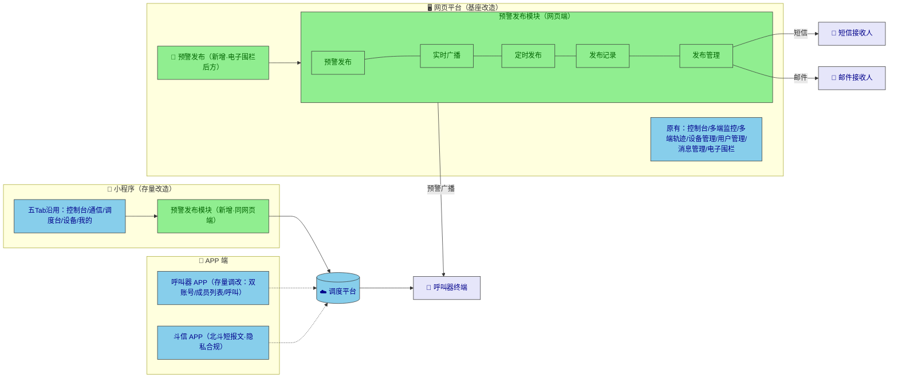
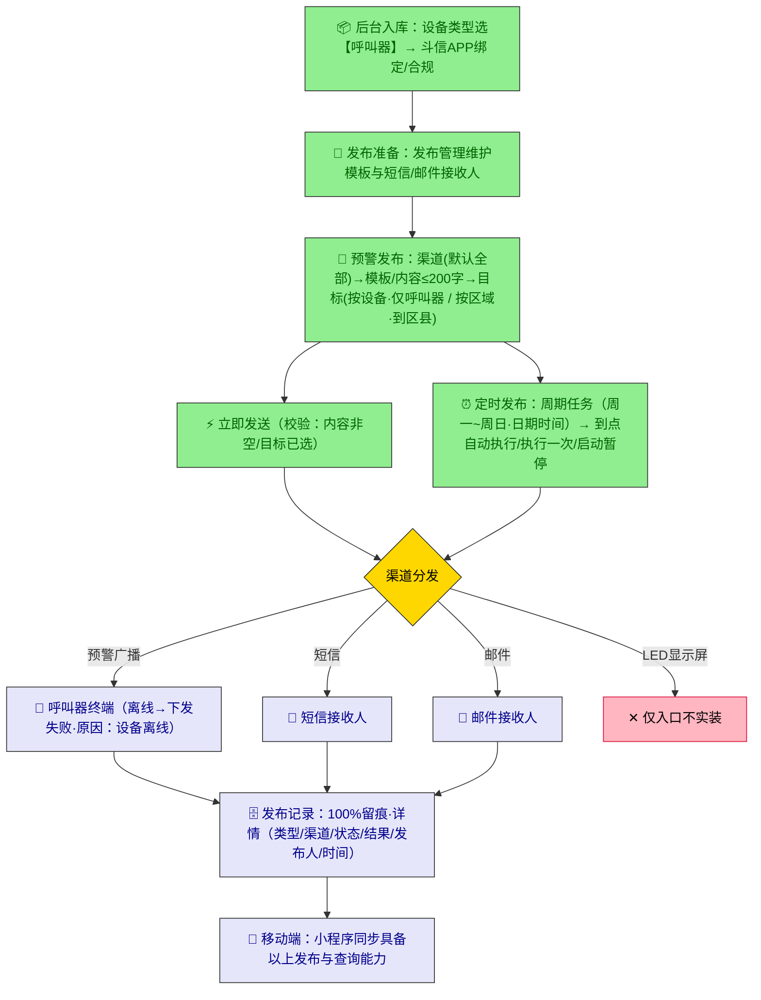

# 钒星应急叫应平台（一期）· 总概览

> 📌 本文是文档族入口（00 号），将 PRD、功能清单、业务流程图、MVP 范围四份文档**头脑风暴整合**为一页式全景。细节请跳转对应文档（见第 9 章导航）。
>
> | 项目 | 内容 |
> | --- | --- |
> | 版本 | v1.0（整合自 01~04 号文档，2026-09-03） |
> | 需求来源 | 磨刀原型两个一期项目 + 38 条原型批注返推 |
> | 技术基座 | 网页端基于 pg-podium-tdwt（星地多网融合指挥调度平台）改造 |

---

## 1. 一页看懂

**做什么**：在现有"星地多网融合指挥调度平台"上新增**应急叫应能力**——调度员通过新增的"预警发布"模块，把预警/广播消息经**预警广播、短信、邮件**渠道触达"呼叫器"终端（入户报警终端）与接收人；配套接入呼叫器设备、调改呼叫器 APP 登录体系、在小程序端同步提供移动化发布与调度。

**为什么**：应急消息需要**一键触达、多形态广播（文本/实时/短语音）、周期化自动执行、100% 留痕**，现有基座均不具备。

**一句话闭环**：

> 设备入库（呼叫器）→ 选渠道/选目标（按设备·仅呼叫器 / 按区域·到区县）→ 填内容（模板回填，≤200 字）→ 立即发送或定时周期执行 → 终端/短信/邮件触达 → 发布记录留痕（含设备离线失败原因）。

**关键数字仪表盘**：

| 维度 | 数量 | 说明 |
| --- | --- | --- |
| 交付端 | 4 | 网页平台、呼叫器 APP（存量小改）、斗信 APP（合规配套）、小程序（存量改造） |
| 预警发布子模块 | 5 | 预警发布 / 实时广播 / 定时发布 / 发布记录 / 发布管理 |
| 发布渠道 | 3+1 | 预警广播、短信、邮件实装；LED 显示屏仅入口 |
| 发布方式 | 3+1 | 文本语音、实时语音、短语音实装；告警触发一期不做 |
| 功能点 | 80 | P0 55 · P1 14 · P2 2 · 沿用存量 6 · 明确不做 9 类（详见 02/04 号文档） |
| 需求依据 | 12 画布 + 38 批注 | 已排除 4 个"废弃不用"画布、北斗监管 APP、天通兴迅 |
| 待确认假设 | 9 | 见第 7 章 ⚠️ |

---

## 2. 产品全景

**四端职责一句话**：

| 端 | 性质 | 一期核心改动 |
| --- | --- | --- |
| 网页平台 | 基座改造（pg-podium-tdwt） | 预警发布五子模块 + 设备管理调整 + 设备入库新增呼叫器 |
| 小程序 | 存量调度小程序改造 | 控制台新增预警发布入口 + 同款五子模块；调度/设备/我的沿用 |
| 呼叫器 APP | 存量小改 | 企业/个人双账号登录、成员列表默认页+五项统计+呼叫、空态提示 |
| 斗信 APP | 配套合规 | 首启三弹窗（欢迎/个人信息指引/隐私协议）+ 定位"始终允许"引导 |

---

## 3. 功能地图（端 × 模块 × 优先级）

> 编号体系与《02-功能清单》一致；●=P0 必须，◐=P1 一期内，○=P2 入口/简化，✕=一期不做。

| 端 | 模块 | 关键功能 | 优先级 |
| --- | --- | --- | --- |
| 网页 | 菜单入口 | 电子围栏后方新增"预警发布"入口、五子页顶部菜单 | ● |
| 网页 | 预警发布 | 渠道四选多（默认全部）、模板弹窗回填、内容≤200字、按设备（仅呼叫器·全选耦合·计数）/按区域（区县级·四快捷）、切换互斥、发送校验与留痕 | ● |
| 网页 | 实时广播 | 三方式切换即重置；文本语音（次数/音量1-9·播音员2种·提示音）；实时语音（音波图·重置回放）；短语音（录音·回放·发送）；告警触发 | ●●● ✕ |
| 网页 | 定时发布 | 列表筛选、新增任务弹框（名称*/区域*/渠道多选/周期多选/日期时间非必填）、执行一次、启动/暂停（北京时间）、编辑、删除确认 | ● |
| 网页 | 发布记录 | 三条件筛选、6 类消息类型、分页 20 条/页、详情六字段、离线失败留痕 | ● |
| 网页 | 发布管理 | 预警模板（内容*/状态*互斥·复制·时间倒序）、短信接收人（手机号*/区域*）、邮件接收人（邮箱*/区域*）；排序、所属机构 | ● ✕ |
| 网页 | 设备管理 | 呼叫器启用/禁用标识；显示列设置（默认9列/完整17列）、行操作、LoRa 独立按钮迁移、调度组 Tab | ● ◐ |
| 网页 | 设备入库 | 设备类型新增"呼叫器"；图标选项迁移至绑定处 | ● ◐ |
| APP | 呼叫器 APP | 双账号登录、成员列表+五项统计+呼叫（逻辑同原APP）、空态提示 | ● |
| APP | 斗信 APP | 三弹窗合规、定位始终允许引导 | ● |
| 小程序 | 调度台/设备/通信/我的 | 沿用存量：调度组管理、收听对讲、语音/消息/视频调度、视频会议 | 沿用 |
| 小程序 | 预警发布 | 控制台入口 + 同网页端五子模块 | ● |

---

## 4. 核心业务闭环

**五大流程速览**（详细图见 03 号文档）：

| 流程 | 一句话 |
| --- | --- |
| 预警发布 | 渠道→模板/内容→目标→校验→发送→留痕 |
| 实时广播 | 三方式切换重置；文本设参数、实时控广播、短语音录音发送 |
| 定时任务生命周期 | 新建→已禁用⇄运行中（启动/暂停·北京时间）→执行一次/编辑/删除 |
| 呼叫器 APP | 登录（企业/个人）→成员列表（统计+呼叫）→呼叫页（同原APP） |
| 设备入库 | 后台选类型呼叫器→入库→斗信绑定（三弹窗+定位授权）→平台可发布 |

---

## 5. 硬规则速查表 ⚡（头脑风暴沉淀：全项目校验/限制/枚举集中地）

> 散落在 PRD 各节的硬约束集中于此，开发与测试可直接对照。

**输入限制**：

| 项 | 规则 |
| --- | --- |
| 发布内容 / 模板内容 / 备注 | ≤200 字符（发布内容右下角实时计数） |
| 定时任务名称 | ≤20 字符，中英文大小写+汉字，**不支持特殊字符**，必填 |
| 播放次数 / 播放音量 | 1~9，默认 1，支持输入+拖动，>9 归 9，仅数字（静默校验不弹 toast） |
| 播音员 | 普通话女声 / 普通话男声 |
| 提示音 | 警报声 / 门铃声（⚠️ 旧画布含电话铃音共 3 种，待确认） |

**必填与校验**：

| 场景 | 规则 |
| --- | --- |
| 预警发布-发送 | 内容为空 →"发布内容不能为空"；未选目标 →"请选择发布目标"（未选设备时按钮置灰） |
| 定时任务-确定 | 必填缺失 → toast"请填写完整基础信息和任务日程"（名称*、区域*；日期/时间非必填） |
| 预警模板 | 内容*、状态*（启用/禁用互斥）；排序一期不实现 |
| 短信接收人 | 手机号*、所属区域*；状态默认启用 |
| 邮件接收人 | 邮箱地址*、所属区域*；状态默认启用 |

**枚举字典**：

| 字段 | 枚举值 |
| --- | --- |
| 发布渠道 | LED显示屏（仅入口）、预警广播、短信、邮件 —— 多选、默认全部、不可手输、二次点击取消 |
| 发布方式 | 文本语音、实时语音、短语音、告警触发（一期不做）—— 切换即重置 |
| 发布目标 | 按设备（列表仅呼叫器/入户报警终端）、按区域（省→市→县/区，不支持乡/村）；按机构 ✕ |
| 消息类型 | 预警发布、实时广播、定时发布、应急广播、告警通知、短语音 |
| 消息状态 | 已完成 等 |
| 发布结果 | 成功 / 失败（设备离线 →"下发失败·设备离线"） |
| 设备状态 | 在线 / 离线 / 未连接 |
| 启用状态 | 启用 / 禁用（仅呼叫器类型设备展示） |
| 设备操作 | 详情、编辑、收藏、移动分组、更多 |
| 定时列表状态 | 全部 / 运行中 / 已启用 / 已禁用 |
| 呼叫器 APP 底部统计 | 设备总数、已应答、已报警、值守中、公网离线 |

**交互铁律**：

1. 发布**无论成功失败均写发布记录**（100% 留痕）；
2. 按设备 ⇄ 按区域切换时**勾选状态互相重置**；"所有设备"复选框与设备列表勾选**双向耦合**；
3. 定时任务**新任务插入列表顶部**，继续新增依次插队；三种状态不做固定排序；
4. "执行一次"**不区分任务日期**立即发送；定时触发基准为**网络系统北京时间**；
5. 区域树四快捷：选择全部 / 取消选择 / 展开全部 / 折叠全部，支持区域名搜索；
6. 模板复制 = 预填内容进新增页；模板确定后**按时间倒序**入列表；
7. 删除类操作（定时任务/模板/接收人）一律**弹窗确认**；
8. 预警发布模块网页端与小程序端**同款设计、同一套规则**。

---

## 6. 一期边界

**✅ 做（In Scope）**：第 3 章全部 ● 与 ◐ 项；斗信合规弹窗；小程序预警发布模块；呼叫器 APP 调改；设备入库呼叫器类型。

**✕ 不做（Out of Scope）**：

| 排除项 | 依据 |
| --- | --- |
| LED 显示屏渠道实装（仅入口） | 批注"先做入口体现，功能暂不实装" |
| 实时广播"告警触发" | 批注"一期暂不开发" |
| 按机构发布 / 所属机构字段（3 处） | 批注"当前版本暂不做/暂不实现" |
| 预警模板排序 | 批注"一期可暂不实现" |
| 原型 4 个"废弃不用"画布、北斗监管 APP_HD 版、天通兴迅 v1.0.0 | 用户明确废弃不用 |

---

## 7. 待确认假设 ⚠️（评审时优先过一遍）

| # | 问题 | 当前口径 | 影响 |
| --- | --- | --- | --- |
| 1 | 预警发布是否双端同步实现 | 双端同步 | 工作量约一倍 |
| 2 | 呼叫器/斗信 APP 是否存量小改 | 是 | 若全新开发需补 PRD |
| 3 | 小程序是否存量改造 | 是，仅加预警发布 | 同上 |
| 4 | 提示音 2 种还是 3 种（含电话铃音） | 2 种（新画布口径） | 音频资源 |
| 5 | 次数/音量上限 1-9 还是 1-5/1-10 | 1-9（新画布口径） | 校验规则 |
| 6 | 区域层级到区县还是到街道 | 区县（618 更新口径） | 区域数据源 |
| 7 | 定时列表筛选形式（状态 Tab vs 名称+日期+状态） | 合并两者 | 交互细节 |
| 8 | 小程序"我的"页无原型 | 沿用存量 | 是否补设计 |
| 9 | 上述 9 大排除项是否最终确认 | 按批注确认 | 范围基线 |

---

## 8. 里程碑与验收（浓缩）

**M1** 骨架（菜单/五子页框架/设备类型入库）→ **M2** 核心发布（预警发布+文本语音+发布记录）→ **M3** 任务与语音（定时全周期+实时/短语音+发布管理）→ **M4** 端侧（呼叫器 APP+斗信+设备管理调整）→ **M5** 小程序（入口+同款模块）→ **M6** 联调验收（北京时间触发、离线留痕、合规审查）。

**验收九问**（通过即 MVP 达成，详见 04 号文档第 4 章）：发布闭环通？三形态广播通？定时生命周期通？三模块管理通？离线失败留痕对？入库与启用标识对？APP 双账号+成员列表对？斗信三弹窗+定位引导对？小程序入口+五子页与网页端一致？

---

## 9. 文档族导航

| 文档 | 定位 | 什么时候看 |
| --- | --- | --- |
| **00-总概览.md**（本文） | 全景入口·速查·导航 | 评审会、新成员入门、快速定位 |
| 01-PRD产品需求文档.md | 需求细节权威源（字段/规则/批注依据） | 开发/测试对细节有疑问时 |
| 02-功能清单.md | 功能点全量台账（编号 W/A/D/M 系） | 排期、任务拆分、进度跟踪 |
| 03-业务流程图.md | 10 张 Mermaid 流程/状态/时序图 | 理解业务流、写测试用例 |
| 04-MVP范围清单.md | 范围边界+验收+假设+里程碑 | 范围争议、验收评审 |

**维护原则**：改需求细节 → 先改 01，再同步 00 第 5 章；改范围/优先级 → 先改 02/04，再同步 00 第 3/6 章；改流程 → 先改 03，再同步 00 第 4 章速览。00 永远保持"一页能读完"的浓缩度。
