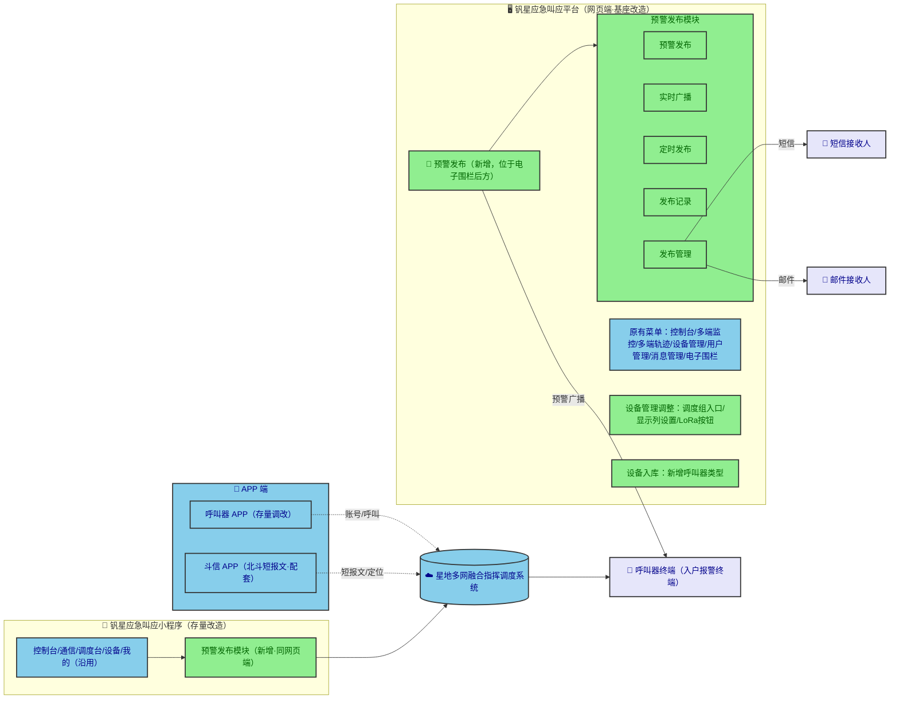
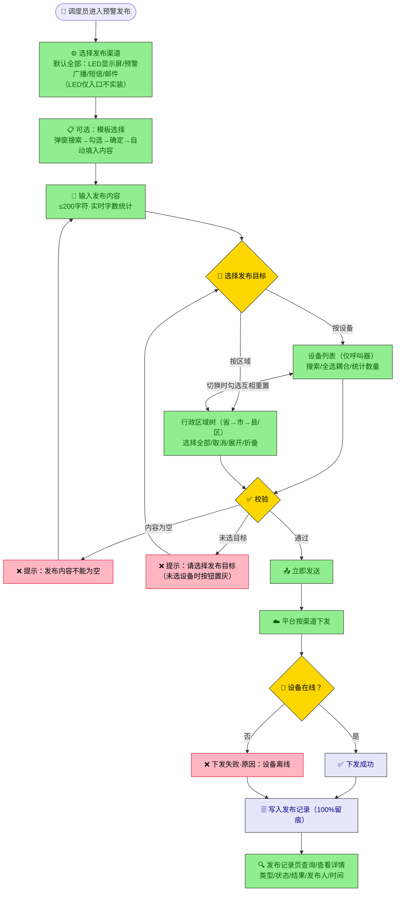
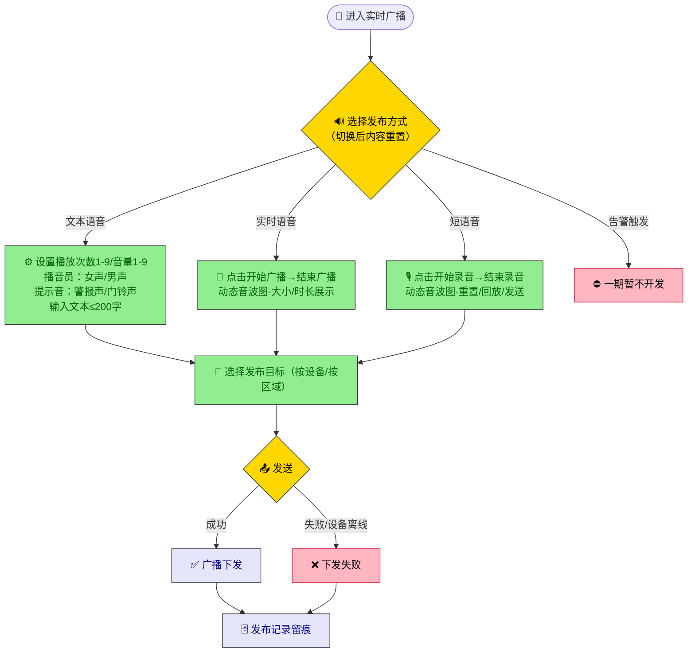
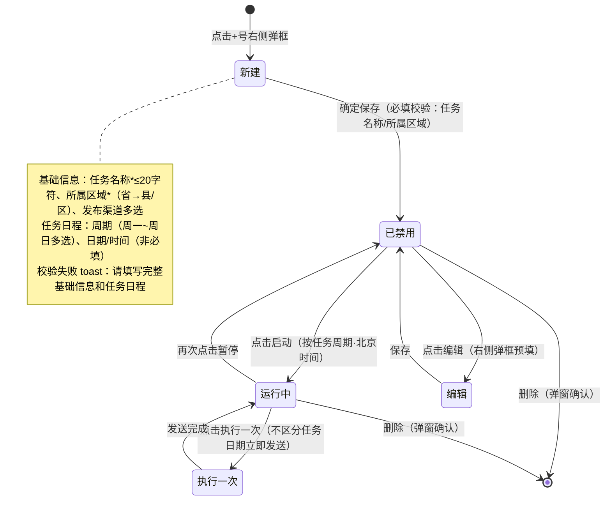
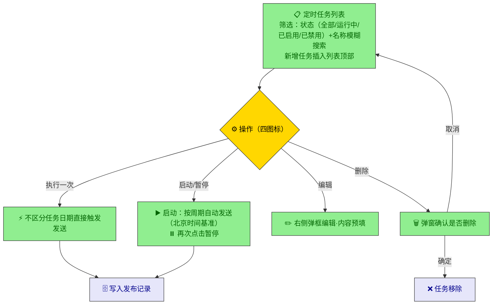
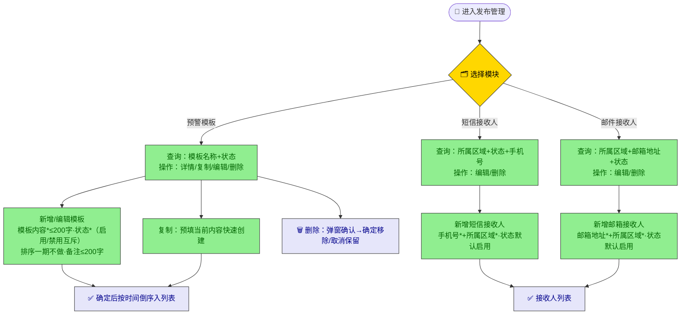
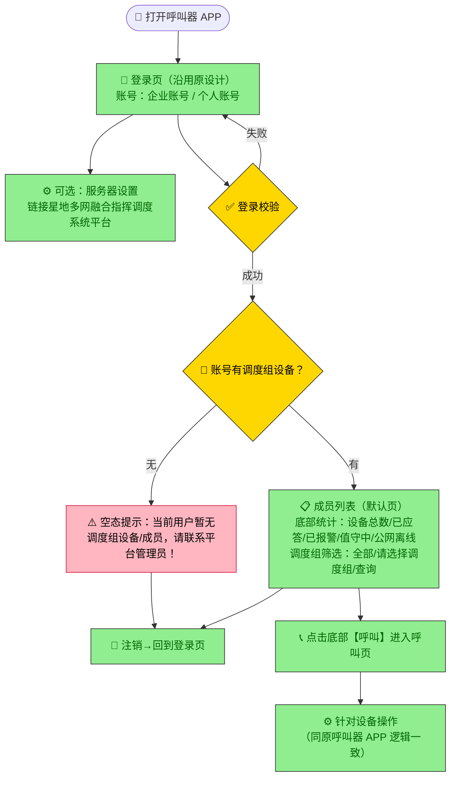
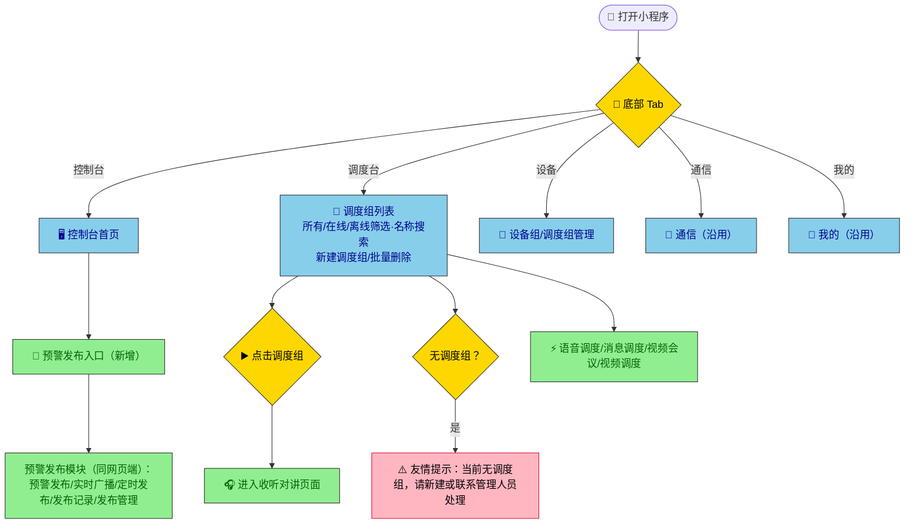
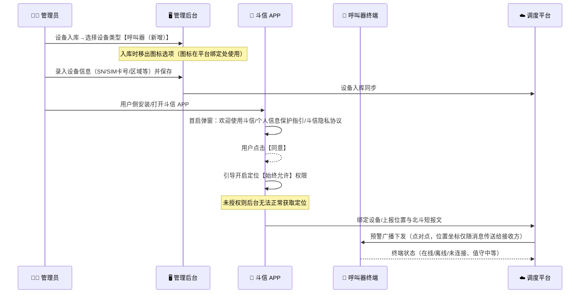
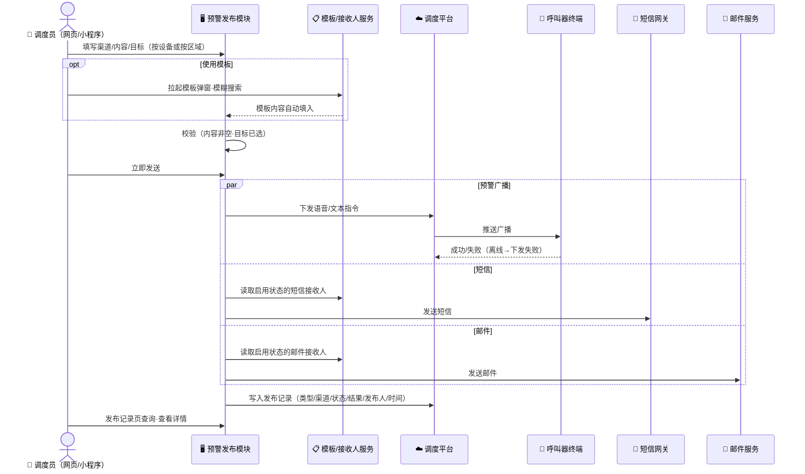

# 钒星应急叫应平台（一期）业务流程图

> 来源：磨刀原型返推。所有图为 Mermaid 代码，可在支持 Mermaid 的 Markdown 环境（GitHub / Typora / VS Code 等）直接渲染。

## 1. 产品总体信息架构

## 2. 预警发布端到端流程（预警发布页）

## 3. 实时广播流程（三种发布方式）

## 4. 定时发布任务生命周期

## 5. 定时发布操作流程

## 6. 发布管理（模板与接收人维护）

## 7. 呼叫器 APP 登录与呼叫流程

## 8. 小程序调度与预警发布流程

## 9. 呼叫器设备入库与斗信绑定流程

## 10. 预警消息下发时序（网页端/小程序端一致）

