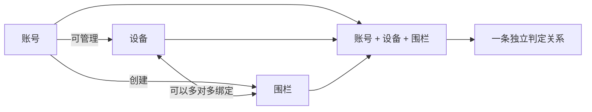
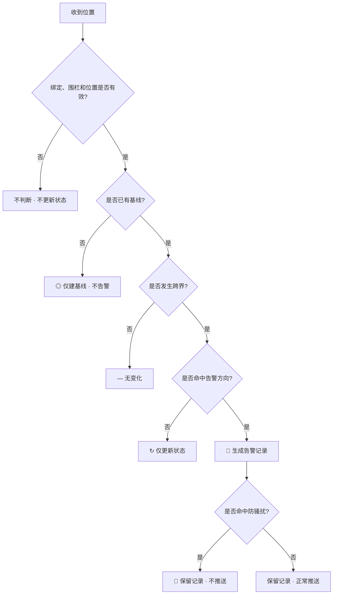
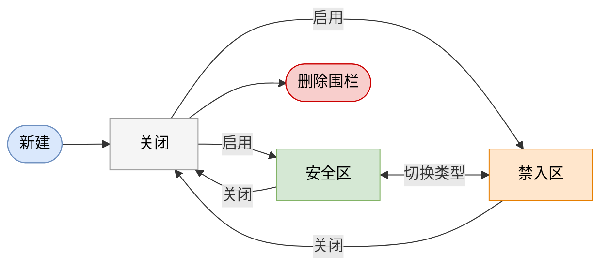
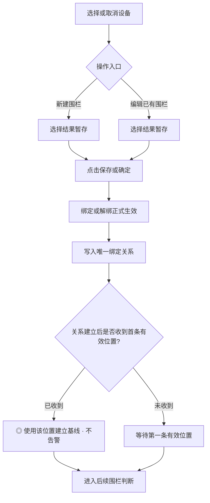
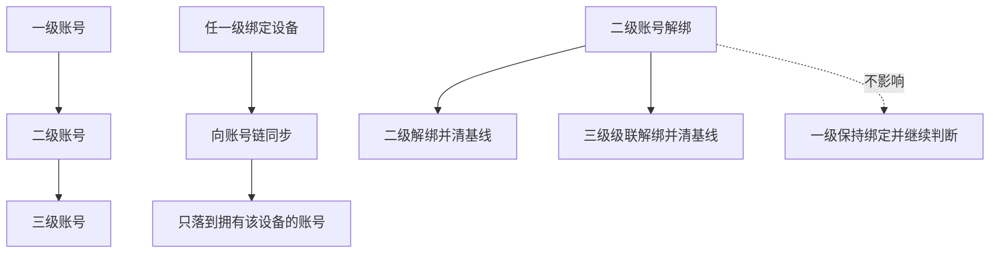
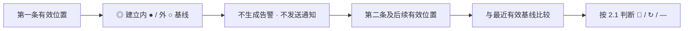
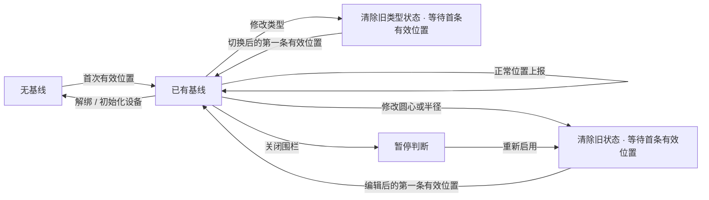
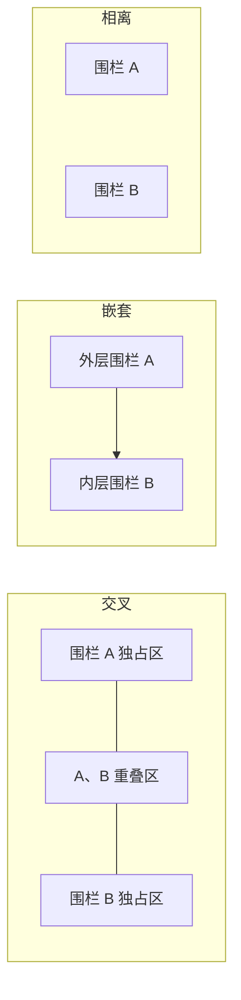
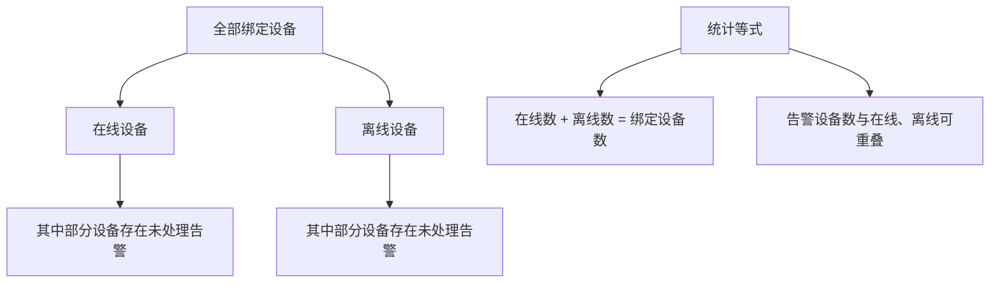
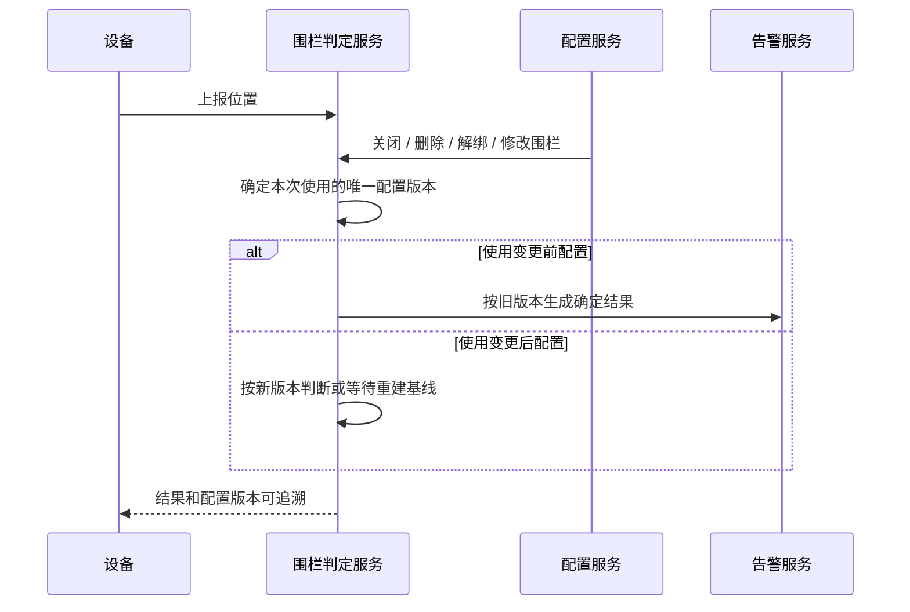

# 02-地理围栏场景梳理

> **项目**：革泰海外平台一期 ｜ **模块**：位置域 / 地理围栏 ｜ **负责人**：林庆敏
> 
> 
> **适用端**：安卓、iOS、平台端 ｜ **当前版本**：v4.5（2026-09-22）
> 
> **文档定位**：测试大纲中的”场景梳理”，**不是测试用例**——本文只定**方式、规则与复杂场景**（判定模型、口径矩阵、组合边界、待确认项）；具体操作步骤、测试数据、断言粒度与 UI 文案细节由后续测试用例基于本文叶节点拆分（见第七章）。
> 

<aside>
🚀

**快速阅读**

- **主链必读**：2.1 类型方向 → 2.4 判定流程 → 3.2 CRUD → 3.3 绑定 → 3.4 基线 → 3.5 进出 → 3.6 告警 → 3.8 统计。
- **专项按需**：3.7 多围栏、多设备、多账号；第四章异常、竞态与幂等。
- **阅读原则**：正文只保留权威规则和代表场景；全量排列组合在测试用例中展开，不在场景文档重复穷举。
</aside>

---

## 一、测试目标与范围

### 1.1 测试目标

| 序号 | 测试目标 |
| --- | --- |
| 1 | 验证地理围栏列表、新增、编辑、删除、启停和设备绑定关系的完整性 |
| 2 | 验证圆形围栏的名称、圆心、半径、告警类型和绑定设备字段规则正确生效 |
| 3 | 验证安全区、禁入区、关闭三种围栏类型的业务行为符合需求 |
| 4 | 验证服务端跨界判定在单点基线比较、持续停留、防骚扰、去重和多围栏条件下不会误判、漏判或重复提醒 |
| 5 | 验证单围栏统计页口径正确：在线、离线为互斥基础状态，告警为可叠加分类；确保在线数 + 离线数 = 绑定设备数，告警设备数按存在未处理告警的设备去重；验证筛选、搜索分组与跳转可用（原区内/区外统计已按 PRD 关闭，见 FENCE-R-12） |
| 6 | 验证围栏配置、围栏判定、告警中心、地图首页、实时追踪之间的数据联动正确 |
| 7 | 验证安卓、iOS、平台端对同一围栏、同一设备、同一告警事件的展示结果一致 |

### 1.2 测试范围

| 分组 | 覆盖内容 |
| --- | --- |
| 围栏列表 | 围栏名称、缩略图、地址、半径、绑定设备、围栏类型、状态、编辑、绑定设备、删除 |
| 围栏类型 | 关闭、安全区、禁入区三态展示、切换和业务作用 |
| 新建围栏 | 地图选点、圆心、半径行内输入与确认、名称、类型、绑定设备、保存、取消 |
| 字段校验 | 名称必填和 30 字符上限、圆心有效坐标、半径必填、整数、50～20000 米、类型必选 |
| 编辑删除 | 回显、修改名称、圆心、半径、类型、绑定设备、删除确认、关联清理 |
| 设备绑定 | 一个围栏绑定多设备、一台设备绑定多围栏、权限范围、重复绑定、解除绑定 |
| 围栏统计 | 在线、离线两种基础状态及告警叠加分类的计数与筛选（初始化等边缘状态归入离线口径）、绑定设备列表、搜索分组组合、当前显示汇总、设备明细跳转 |
| 跨界判定 | 基线建立、单有效点跨界确认、持续停留、重复报文去重、基线重置、边界往复、坐标系一致性（海外 WGS84） |
| 告警触发 | 离开安全区、进入禁入区、关闭态不告警、30 分钟防骚扰、重复报文去重、不同围栏独立保留 |
| 异常边界 | 无有效位置、无效坐标、乱序上报、重复报文、设备离线、围栏删除、设备解绑、缓存与判定数据一致性 |
| 层级账号联动 | 上级与子账号绑定传播、解绑下游清理、跨层级告警可见性 |
| 通知与提醒 | 通道口径、双绑定去重、通知偏好分流、存量设备防骚扰窗口（口径登记于 3.6.3，用例已由 03 承接） |
| 账号与设备生命周期 | 账号冻结/删除、管理端收回设备、服务到期、双账户绑定对围栏列表、判定、告警和统计的影响 |

### 1.3 不在本文件展开的内容

| 内容 | 承接文档 |
| --- | --- |
| 告警中心列表、筛选、详情、处理备注、历史报警等完整闭环 | `03-告警中心场景梳理.md`（已创建）；围栏提醒与通知口径原登记于本文 3.5.3，已由 03 承接，本文仅保留口径摘要（见 3.6.3） |
| 地图首页点位、聚合点、今日概览总览 | `01-地图与监控场景梳理.md` |
| 设备位置上报、乱序报文、跨端面一致性总链路 | `05-位置数据联动与一致性场景梳理.md` |
| 中文版与海外版文案、底图、单位、时间格式一致性 | `附录A-中文版与海外版一致性检查清单.md` |

### 1.4 准入 / 准出

- **准入**：服务端围栏判定与告警服务可用；测试环境至少准备 2 个围栏（安全区 + 禁入区各一）、2 台可模拟位置上报的终端；企业（含层级）与个人账号测试数据就绪；第六章 ⭐ 必确认项均已登记临时口径或挂账有解。
- **准出**：P0/P1 核心用例 100% 通过；异常场景 P1 用例 ≥ 95% 通过；围栏判定模型（首次定位 / 进出方向 / 防骚扰）与层级账号绑定用例全部执行且结果明确。

---

## 二、核心业务规则摘要

### 2.1 围栏类型规则

| 围栏类型 | 列表状态 | 位置变化 | 处理结果 | 说明 |
| --- | --- | --- | --- | --- |
| 安全区 | 🟩 绿色 | 内 ● → 外 ○ | 🚨 **告警** | 生成“离开安全区”告警记录 |
| 安全区 | 🟩 绿色 | 外 ○ → 内 ● | ↻ 仅更新状态 | 更新为围栏内，不生成告警 |
| 安全区 | 🟩 绿色 | 内 ● → 内 ●，或外 ○ → 外 ○ | — 无变化 | 不生成新事件 |
| 禁入区 | 🟧 橙色 | 外 ○ → 内 ● | 🚨 **告警** | 生成“进入禁入区”告警记录 |
| 禁入区 | 🟧 橙色 | 内 ● → 外 ○ | ↻ 仅更新状态 | 更新为围栏外，不生成告警 |
| 禁入区 | 🟧 橙色 | 内 ● → 内 ●，或外 ○ → 外 ○ | — 无变化 | 不生成新事件 |
| 关闭 | ⬜ 灰色 | 任意位置变化 | — 不参与判断 | 配置保留，但不执行围栏判断 |

<aside>
📌

**全文统一标记**

内 ● = 位于围栏内 ｜ 外 ○ = 位于围栏外 ｜ 🚨 告警 = 生成新的告警记录 ｜ ↻ 仅更新状态 = 位置变化但不告警 ｜ ◎ 仅建基线 = 首次定位，只记录状态 ｜ — 无变化 = 未跨界 ｜ 🔕 告警静默 = 告警记录已生成，但本次不推送 ｜ ⚠ 判断异常 = 本围栏判断失败并记录异常。

</aside>

### 2.2 围栏字段约束

> **告警类型三选一**口径见 2.1；本表列出名称、圆心、半径、绑定设备、地址五个字段的约束与校验点（适用于新建、编辑、绑定等所有操作）。
> 

| 字段 | 类型 | 约束 | 校验重点 |
| --- | --- | --- | --- |
| 名称 ✱ | 文本 | 必填，字符数 ≤ 30 | 空值、纯空格、超长均不能保存 |
| 圆心 ✱ | 经纬度 | 必填，坐标合法 | 保存值应与地图选点一致 |
| 半径 ✱ | 整数 | 必填，取值范围 [50, 20000] 米 | 行内输入框输入（点击中心点聚焦该行）；确认与保存的交互规则见 3.2.2（PRD 9-14 口径，FENCE-R-16） |
| 绑定设备 | 设备列表 | 可选，允许为空 | 可选设备来自当前账户可管理范围 |
| 地址 | 文本 | 可选 | 地址解析失败时不阻断创建和保存；按实际返回展示 `0.0.0.0`，或显示“未定位” |

> **图例**：✱ = 必填字段；其他 = 可选或视场景。
> 

### 2.3 绑定规则

> **图示说明**：一个围栏可以绑定多台设备，一台设备也可以绑定多个围栏；每个“账号 + 设备 + 围栏”组合独立保存位置基线、生成告警和执行防骚扰。图中只表达业务关系，不再使用数据库 ER 符号。
> 

| 关系 | 校验重点 |
| --- | --- |
| 围栏 : 设备 = 1 : N | 一个围栏可以绑定多台设备；绑定设备数量、设备列表、围栏统计需要一致 |
| 设备 : 围栏 = N : N | 一台设备可以同时绑定多个围栏；多围栏分别判定、分别统计、分别告警 |
| 围栏 + 设备 : 绑定关系 = 1 : 1 | 同一围栏与同一设备的绑定关系仅保存一条；重复提交不应导致重复计数或重复判定（幂等权威口径） |
| 设备 : 账户（可选范围） = N : 1 | 可选设备来自当前账户可管理的设备范围；不允许越权绑定其他账户设备 |
| 围栏绑定 ≠ 账户设备绑定 | 解除围栏绑定不改变设备与个人、企业账户的绑定关系；只解除围栏关系，不删除设备本体和账户设备绑定 |
| 绑定初始化 | 初次绑定或重新启用后，等待关系建立后的第一条有效位置建立判定基线；建立基线不产生告警，后续有效跨界才触发（基线口径统一归口 3.4.1） |

### 2.4 设备定位基线与各围栏关系

> **摘要**（详细场景见 3.4 / 3.5）：
> 
> 1. 服务端以“账号 × 设备 × 围栏”为判定粒度；
> 2. 先检查关系、围栏状态和位置有效性，再检查是否存在 `lastInside`；
> 3. 首个有效定位只建基线；已有基线时按单点状态变化判断跨界；
> 4. 只有安全区内→外、禁入区外→内生成告警记录；反方向只更新基线；
> 5. 防骚扰位于告警记录生成之后，只能静默推送，不能吞掉记录。

| 规则 | 校验重点 |
| --- | --- |
| APP 与后台应使用服务端返回的同一判定结果 | 内部状态不以首页”围栏内设备”汇总数量代替 |
| 首个有效定位只建立基线，不产生告警 | 基线重置各场景（重绑 / 启用 / 初始化 / 范围变更）统一见 3.4.1 |
| 重复上报不能凭到达次数产生新报警 | 去重与防骚扰边界见 2.6 摘要与 3.6 展开 |

### 2.5 增删改查对围栏的影响矩阵

> 修改圆心或半径后的规则已经明确：绑定设备保持不变，原内外状态失效，编辑保存后由设备上报的第一条有效位置按新围栏范围建立基线，不产生告警。修改类型后旧类型状态同样失效，切换后的第一条有效位置按新类型建立基线；基线口径权威归口 3.4.1。
> 

| 动作 | 绑定 | 判定基线（lastInside） | 告警生成 | 统计页归属 |
| --- | --- | --- | --- | --- |
| 新建 | 可在新建时绑定设备 | 保存成功后等待设备上报第一条有效位置→建立基线 | 新建及首次建基线不生成事件 | 新建成功后纳入在线/离线基础状态统计；告警分类按未处理告警单独叠加 |
| 修改（圆心/半径） | 原已选设备保持绑定 | 清除各绑定设备在旧围栏范围下的内外状态；编辑保存后，设备上报的第一条有效位置按新圆心和半径建立基线 | ◎ 首条有效位置只建基线，不生成告警；不把围栏范围变化当成设备真实跨界 | 后续有效位置再与新基线比较；绑定设备数量和选择结果不变 |
| 修改类型 | 原已选设备保持绑定 | 旧类型下的内 ● / 外 ○ 状态失效；切换后的第一条有效位置按新类型建立基线 | ◎ 第一条有效位置只建基线，不告警；不补历史事件 | 后续位置按新类型方向判断 |
| 删除 | 当前围栏的设备绑定关系清理（完整删除规则见 3.2.2） | 该关系下用于后续判断的基线失效 | 历史告警快照保留，但后续不再触发 | 设备如仍绑定其他围栏，只从当前围栏统计移除 |
| 绑定 | 增减设备 ↔︎ 当前围栏的绑定 | 关系生效后，以设备上报的第一条有效位置建立基线 | 首次建基线不触发告警 | 设备进入在线/离线基础统计；存在未处理告警时叠加进入告警分类 |
| 重复绑定（幂等） | 不变（已存在关系） | 不变（不重写基线，避免历史跨界） | 不触发告警 | 数量不重复增加 |
| 解绑 | 移除设备 ↔︎ 当前围栏的绑定 | 清除该“账号 × 设备 × 围栏”关系下可用于后续判定的 `lastInside`；重新绑定必须重新建基线 | 解绑前产生的历史告警保留 | 设备从当前围栏三态计数移除（其他围栏不变） |

### 2.6 防骚扰与去重规则（摘要）

| 规则 |
| --- |
| 报警未处理且距上次报警不足 30 分钟时执行防骚扰；防骚扰只限制推送，报警记录照常生成；旧报警处理后再次真实穿越按新报警重新提醒 |
| 同一事实重复报文按原事件关联去重；不得用时间窗口合并吞掉新的真实进出；5 分钟合并规则仅保留给低电量事件，不同围栏事件分别保留 |
| 持续停在同一侧不是新的进出，只更新基线、不重复告警 |

---

## 三、核心场景

> 本章保留按功能域查阅的章节编号；实际执行按“创建 → 绑定 → 建基线 → 单围栏判定 → 配置变化 → 告警与防骚扰 → 组合 → 统计”顺序进行。每个核心场景均按 3.0 的断言维度拆分，避免只写泛化预期。
> 

### 3.0 场景执行导航与统一断言模板

#### 3.0.1 推荐执行顺序

| 阶段 | 执行内容 | 主要章节 | 进入下一阶段的条件 |
| --- | --- | --- | --- |
| A 配置成立 | 新建、字段校验、保存/取消、列表展示 | 3.2 | 围栏配置合法且服务端保存一致 |
| B 关系成立 | 绑定、解绑、重复绑定、权限过滤 | 3.3 | “账号 × 设备 × 围栏”关系唯一有效 |
| C 基线成立 | 首次定位、重绑、重新启用、初始化 | 3.4 | `lastInside` 与当前位置一致且未产生告警 |
| D 单围栏判定 | 安全区离开、禁入区进入、反方向、同侧停留 | 2.1 / 3.5 | 方向、记录、基线均符合权威矩阵 |
| E 配置变化 | 类型切换、范围修改、关闭、删除 | 3.1 / 3.2 | 生效时点与基线处理明确 |
| F 告警闭环 | 记录入库、去重、防骚扰、处理后复发 | 3.6 | 记录与通知分层正确 |
| G 组合与汇总 | 多设备、多围栏、多账号、统计 | 3.7 / 3.8 | 各关系独立且汇总等式成立 |
| H 异常与联动 | 时序、网络、竞态、权限、跨端 | 四、五章 | 服务端最终状态可解释、可追踪 |

#### 3.0.2 统一断言维度

> 每个核心场景至少回答以下 8 项，不再使用单一“预期正确”作为断言：
> 

| 断言层 | 必须明确的结果 |
| --- | --- |
| 前置关系 | 账号是否有设备和围栏权限；绑定是否有效；围栏是否启用 |
| 输入位置 | 坐标、定位时间、接收时间、是否有效、与圆心距离 |
| 基线变化 | 上报前/后的 `lastInside` |
| 状态变化 | 外→内、内→外、同侧或首次建基线 |
| 告警记录 | 是否生成、类型、围栏/设备/时间快照、是否重复 |
| 通知推送 | 是否发送；若静默，必须说明仅静默推送还是连记录也不建 |
| 统计变化 | 在线/离线归属、告警设备数、绑定设备数是否变化 |
| 联动结果 | 告警中心、地图、实时追踪及安卓/iOS/平台端是否一致 |

#### 3.0.3 P0 场景卡片示例

| 字段 | 内容 |
| --- | --- |
| 场景 ID | FENCE-JUDGE-P0-01 |
| 场景名称 | 安全区首次建基线后离开 |
| 前置 | 安全区 F1 已启用；设备 D1 已绑定；无基线、无未处理围栏告警 |
| 输入路径 | P1：距圆心 30 m（栏内）→ P2：距圆心 120 m（栏外）；两点坐标及时间均有效 |
| 基线断言 | P1 写入 `lastInside=true` 且不告警；P2 更新为 `false` |
| 告警断言 | P2 仅生成 1 条“离开安全区”告警；围栏、设备、发生时间及位置正确 |
| 通知断言 | 不在防骚扰窗口时发送；在窗口内仅静默推送，告警记录仍须存在 |
| 统计断言 | 告警设备数 +1；设备原在线/离线归属不变；绑定设备数不变 |
| 跨端断言 | 安卓、iOS、平台端最终展示同一告警与处理状态 |

> **位置路径写法**：优先使用“P1 → P2 → P3”表达连续移动，例如“栏内 30 m → 栏内 80 m → 栏外 120 m → 栏外 150 m → 栏内 70 m”，并在每个点分别断言基线、记录、推送与统计。
> 

### 3.1 围栏种类与类型切换（原 3.4）

#### 3.1.1 类型三态与方向规则

> 类型 × 方向 × 是否告警的**权威口径见 2.1 矩阵**（安全区离开告警 / 禁入区进入告警 / 关闭不参与判定），本节不再重复，只覆盖**已保存围栏的类型切换**。
> 

#### 3.1.2 类型切换矩阵与两个入口

> **本节口径**（避免与新建场景混淆）：
> 
> 1. 本节适用于**已保存围栏的类型变更**；新建流程中的类型选择见 3.2.2（默认关闭），不走本节矩阵；
> 2. 变更有两个入口，**判定规则与入口无关**：① 列表卡片快捷三态循环切换；② 编辑页 Alert Type 单选组修改后随保存生效（见 3.2.2”修改类型”）；
> 3. 切换到**启用态**或在安全区、禁入区之间互切后，旧类型下的内 ● / 外 ○ 状态失效；设备切换后上报的第一条有效位置按新类型执行 ◎ 仅建基线，不告警，后续位置再按新类型判断（**FENCE-R-02 / R-18 已确认**）；
> 4. 列表快捷切换的生效时机（立即生效 or 需二次确认）PRD 未明确，登记 **FENCE-R-19**。

**类型状态图**（连线只表示允许切换，不用颜色表达业务结果）：

> **读法**：关闭 = 暂停判断；安全区 = 离开时 🚨 告警；禁入区 = 进入时 🚨 告警。切换动作本身不补历史告警；切换后的第一条有效位置只建立新基线，不告警，后续真实跨界才按新类型处理。
> 

| 切换方向 | 预期结果 |
| --- | --- |
| 关闭 → 安全区 | 设备绑定保持不变；切换后的第一条有效位置按安全区执行 ◎ 仅建基线，不产生历史跨界告警 |
| 关闭 → 禁入区 | 设备绑定保持不变；切换后的第一条有效位置按禁入区执行 ◎ 仅建基线，不产生历史跨界告警 |
| 安全区 / 禁入区 → 关闭 | 配置和设备绑定保留，暂停告警判定；关闭期间不新增围栏告警；地图和列表状态更新为关闭 |
| 安全区 ↔︎ 禁入区 | 旧类型下的内 ● / 外 ○ 状态失效；切换后的第一条有效位置按新类型执行 ◎ 仅建基线，不告警；后续位置再按新类型方向判断 |
| 两个入口结果一致 | 同一方向切换，无论列表快捷切换还是编辑页修改保存• 判定规则、基线处理、列表状态颜色结果一致• 仅生效时机可能不同（FENCE-R-19） |

#### 3.1.3 切换 × 未处理告警

| 场景 | 条件分支 | 预期结果 |
| --- | --- | --- |
| 切换到关闭时有未处理告警 | 围栏存在未处理告警，经列表快捷切换或编辑页改为关闭 | 未处理告警保留、仍可查看与处理，不自动关闭、不自动标记已处理关闭期间历史告警在告警中心仍可见；仅后续不再产生新告警 |
| 启用态互切时有未处理告警 | 安全区 ↔︎ 禁入区切换且存在未处理告警 | 未处理告警保留，不因类型变更作废事件展示按发生时刻的围栏类型快照，不随新类型改写 |
| 切换后再触发 | 切换后设备再次形成有效跨界 | 按新类型方向生成新事件（判定见 3.1.2 / 3.5）；未处理数量随新事件正确累加 |

> **FENCE-R-24 已确认**：围栏切换类型或切换到关闭，只影响后续围栏判断，不影响已有告警。已处理和未处理告警均保留；未处理告警仍可继续查看和处理，不自动关闭、不自动删除，事件继续展示发生时的围栏类型快照。
> 

### 3.2 围栏 CRUD（原 3.1：列表 · 新建 · 编辑 · 删除）

> 重点确认：列表展示完整、状态颜色正确、无权限数据不泄露；圆心/半径/名称/类型字段校验合法（半径行内输入按 PRD 9-14 口径）；编辑回显准确、修改后配置生效；删除只删除围栏关系，不删除设备和既有告警。
> 

#### 3.2.1 列表与展示规则

| 规则 | 说明 |
| --- | --- |
| 列表字段与服务端一致 | 名称、缩略图、地址、半径、绑定设备、类型、状态完整展示；多围栏数据互不串联，编辑或删除任一不影响其他围栏 |
| 状态颜色 = 围栏类型 | 关闭灰 / 安全区绿 / 禁入区橙；编辑、绑定设备、删除入口可见 |
| 绑定信息按数量摘要 | 数量 = 实际绑定设备数；点击进入绑定管理页（非统计页）；不展示设备名称（9-11 版口径） |
| 卡片主体点击进统计页 | 进入该围栏”围栏牛群统计”页（标题为围栏名，规则见 3.8）；编辑 / 绑定 / 删除 / 类型切换为独立操作区，不因点击主体误入统计页 |
| 未绑定设备空态 | 列表提示”未绑定设备，点击添加”，“设备”入口亦可完成绑定 |
| 地图缩放不改判定 | 围栏圆形显示尺寸随缩放变化；地理圆心与实际半径不变，缩放不改变判定范围 |
| 空态与权限 | 未创建展示空状态与新增入口，不展示历史残留；无权限展示无数据提示，不暴露其他账户围栏 |
| 数量较多 | 列表正常加载、滚动流畅、所有围栏可达；搜索能力待确认（FENCE-R-17） |

#### 3.2.2 新建 / 编辑 / 删除交互规则

> 字段合法性总纲（名称 ≤30 字符、半径 [50, 20000] 整数、坐标合法、非法值拦截）见 2.2 字段约束；删除对四维度的横向对比见 2.5 矩阵删除行；本节只列交互层规则。
> 

| 规则 | 说明 |
| --- | --- |
| 确认范围 ≠ 保存围栏 | 已确认范围后修改圆心 / 半径，未重新确认即保存：阻止保存并提示；已确认 → 修改 → 重新确认 → 才可保存 |
| 半径未确认不可保存 | 圆心已设置但半径未确认：保存按钮不可用，不生成围栏数据 |
| 取消 / 退出的作用范围 | 新建页或编辑页中，名称、圆心、半径、类型及设备绑定调整都先暂存；只有点击“保存”或“确定”后才正式生效。直接取消或退出时，未确认的绑定、解绑和配置修改均不生效 |
| 编辑回显一致 | 编辑页完整回显该围栏全部配置，与列表及服务端保存值一致 |
| 名称修改同步展示 | 修改后列表、编辑页、告警展示同步使用新名称（非法值拦截见 2.2） |
| 范围变更基线重置 | 修改圆心 / 半径保存后，下一条有效定位按首次定位建基线（权威口径统一见 3.4.1） |
| 修改类型走切换规则 | 类型变更按 3.1 切换矩阵判定，不沿用旧类型方向误触发（FENCE-R-18） |
| 地图控件不误触发 | 新建 / 编辑页地图控件（图层切换、定位回中、缩放）不影响已设置的圆心与半径，不误触发重新确认流程 |
| 删除前需二次确认 | 确认环节取消则围栏保留、绑定关系不变、原状态判定不变 |
| 删除只删围栏关系 | 绑定关系解除；该关系下用于后续判断的内外状态失效；设备本身、设备与个人/企业账户绑定、既有告警记录均不删除 |
| 删除不补新告警 | 删除动作不产生新的进入/离开告警，告警数量不因删除增加；设备当时处于栏内或栏外无影响 |
| 删除后历史告警保留 | 已处理和未处理告警均继续保留；删除围栏不自动处理、关闭或删除未处理告警；告警列表与详情保留发生时的围栏名称等快照，仅当前围栏统计和绑定关系移除，其他围栏不受影响 |

### 3.3 围栏与设备绑定（原 3.7）（⭐ 必看）

> 重点确认：绑定关系以”围栏 + 设备”为粒度保存；解除围栏绑定不等于解绑设备；层级账号的绑定与解绑按原账号链传播。绑定是首次定位（3.4）与全部判定的前提。
> 

#### 3.3.1 绑定与解除

| 场景 | 条件分支 | 预期结果 |
| --- | --- | --- |
| 绑定设备 | 选择一台或多台当前账户可管理设备并保存 | 绑定成功，绑定设备数量与选择数量一致；每台设备独立参与该围栏判定；绑定生效后，以设备上报的第一条有效位置建立判定基线 |
| 新建时预选设备（草稿语义） | 新建围栏时预选设备：保存前仅存草稿，保存时随围栏一次性提交 | 保存后：创建与绑定同时成功，不需要二次提交取消新建：不产生绑定关系，不提前建立绑定关系或判定基线与编辑页”选择即时生效”口径区分 |
| 编辑已有围栏时调整绑定 | 在已有围栏编辑页勾选或取消设备 | 选择期间只更新页面暂存结果；点击“保存”或“确定”后，绑定或解绑正式生效并与服务端一致。未确认即取消或退出时不改变原绑定关系，不出现前端与服务端不一致的半成功状态 |
| 无可绑定设备 | 当前账户无可管理设备 | 展示无可选设备或无设备提示不能绑定其他账户设备；保存后围栏绑定数量仍为 0 |
| 解除绑定 | 取消勾选一台或多台已绑定设备并保存 | 被取消设备解除关联，其余设备不受影响围栏绑定数量相应减少；设备本身仍保留在当前账户设备列表中ⓘ 示例（非约束）：设备 D 先绑围栏 A 并已建立基线；解除 D 与 A 的绑定后，D 仍绑围栏 B——B 上 D 的基线不会因 A 的解绑而重置 |
| 解除后重新绑定 | 同一设备解除后再次绑定同一围栏 | 重新建立绑定关系；重绑后的第一条有效位置只建立新基线，不沿用解绑前状态，也不会立即触发告警 |
| 勾选当前在围栏外的设备 | 绑定选择页中勾选此刻位于围栏外的设备 | 勾选成功，围栏外提示不阻断绑定；标识随取消勾选消失。保存生效后，设备上报的第一条有效位置按实际内外关系建立基线；后续真实跨界再按围栏类型判断（见 3.4） |
| 绑定选择页内筛选搜索与勾选保持 | 绑定页内按分组筛选，并按设备卡号或备注搜索 | 搜索只过滤设备列表，不过滤地图定位点，也不改变已勾选状态；切换分组或搜索后已勾选设备保持勾选；勾选数量汇总与最终保存结果一致；无匹配设备展示空态 |
| 绑定页入口与已选数量展示 | 打开绑定选择页进入设备多选 | 入口数量与确认/取消动作实时反映设备数量变化• 入口数量 = 当前已是已绑设备数• 每次勾选/取消即时反映到确认按钮数量• 跨分组时入口数量与最终保存的绑定关系保持一致 |

**重复绑定幂等**：同一设备重复提交绑定同一围栏，绑定关系保持一条，数量/统计/判定均不重复执行（幂等权威口径见 2.3；多围栏交叉场景见 3.7.1）。

#### 3.3.2 个人账号 — 按操作方与层面的绑定/解绑

> 已知规则：围栏可绑设备来自当前账户可管理范围（见 2.3），不区分设备标签——只要设备在当前账号设备管理中存在且支持定位，即可出现在围栏绑定列表。解绑途径按 **操作方 × 操作层面** 两个维度展开。
> 

**情形一：个人 A — 自己绑定的设备（“我的”类）**

| 操作方 | 操作层面 | 动作 | 预期结果 |
| --- | --- | --- | --- |
| 个人 A 自己 | 围栏层面 | 在围栏绑定管理中取消勾选该设备并保存 | 解绑成功，基线清除；其他围栏绑定不受影响 |
| 个人 A 自己 | 围栏层面 | 直接删除该围栏 | 围栏删除，绑定关系一并清除 |
| 个人 A 自己 | 设备层面 | 在设备管理中解除账号与该设备的绑定（APP / 平台端 / 管理后台） | 设备从账号消失，名下所有围栏绑定随之清除 |
| 管理员（外部） | 管理后台 | 删除个人 A 账号与该设备的绑定关系 | 同设备层面解绑效果 |

**情形二：个人 B — 共享/关注得到的设备（若一期支持该类绑定）**

| 操作方 | 操作层面 | 动作 | 预期结果 |
| --- | --- | --- | --- |
| 个人 B 自己 | 围栏层面 | 在围栏绑定管理中取消勾选该设备并保存 | 解绑成功；设备主的同围栏绑定不受影响 |
| 个人 B 自己 | 围栏层面 | 直接删除自己创建的围栏 | 围栏删除，绑定关系一并清除 |
| 设备主（原绑定方） | 设备层面 | 解除与 B 的共享/关注关系 | 设备从 B 账号消失，B 的围栏绑定随之清除 |
| 管理员（外部） | 管理后台 | 解除 B 账号与该设备的绑定关系 | 共享关系清除，B 的围栏绑定失效 |

> 适用前提：情形二依赖”设备共享/好友关注”类业务；一期是否支持待确认，无该业务时情形二按缺口径登记不执行。
> 

#### 3.3.3 层级账号 — 绑定扩散与解绑级联

<aside>
↕️

**非对称模型**：绑定向整条账号链扩散，但只落到“拥有该设备”的账号；解绑仅清除操作方及其下游，父级不受影响。每个“账号 × 设备 × 围栏”独立维护基线和告警。

</aside>

| 操作 | 上级账号 | 操作账号 | 下级账号 |
| --- | --- | --- | --- |
| 绑定链路共同拥有的设备 | 同步已绑 | 已绑 | 拥有该设备则同步已绑，否则不可见 |
| 解绑 | 保持已绑、继续判定 | 解绑并清除基线 | 级联解绑并清除基线 |
| 再次绑定 | 按链路重新扩散 | 重新建立关系 | 拥有设备则同步；各账号按首次定位重建基线 |

**三个代表场景**

| 场景 | 预期结果 |
| --- | --- |
| 最下级绑定全链路设备 | 上级、中间级、最下级均显示已绑，各自建立独立基线 |
| 中间级绑定、下级没有该设备 | 上级和中间级已绑；下级因设备不在其可管理范围而不可见 |
| 中间级解绑全链路设备 | 中间级及下级解绑并清基线；上级保持已绑并继续独立判定 |
- 👁️ **可见性公式**：围栏中可见设备 = 当前账号设备列表 ∩ 当前账号有效绑定记录。
- 🧭 **基线处理**：解绑清除对应账号的 `lastInside`；重新绑定按首次定位处理。
- 🚨 **告警权限**：跨层级账号对可见的围栏告警具有处理权限；处理结果在有权限的账号间保持一致（FENCE-R-10 已确认）。
- 🧪 **用例展开**：一级/二级/三级 × X/Y/Z 的全量排列组合放到测试用例，不在场景正文重复穷举。

#### 3.3.4 账号生命周期与权限

#### 3.3.4.1 账号与设备生命周期 × 围栏

| 场景 | 条件分支 | 预期结果 |
| --- | --- | --- |
| 账号被冻结 | 账号冻结期间登录并访问围栏功能 | 按服务端冻结与授权结果限制业务访问，不因围栏页面绕过权限校验围栏列表、编辑、删除、绑定接口行为与冻结授权一致；不泄露其他账户围栏数据 |
| 账号被冻结 | 冻结前已产生未处理围栏告警 | 告警数据不因冻结被物理删除，展示与处理口径以 FENCE-R-06 确认结果为准解冻后围栏配置、绑定关系和告警数据完整恢复；不出现静默清库 |
| 子账号受影响 | 企业上层账号被冻结，下层子账号访问自己创建的围栏 | 影响口径以 FENCE-R-06 确认结果为准子账号围栏可见性与判定结果和账号授权体系一致；与设备域冻结测试结论不互相矛盾 |
| 账号被删除 | 账号在管理端或原服务端被删除，名下存在围栏与历史告警 | 围栏归属与清理口径以 FENCE-R-06 确认结果为准删除后不出现悬挂围栏继续产生新告警；既有告警展示有明确兜底 |
| 管理端收回设备 | 设备被上级或管理端强制收回，此前绑定当前账户围栏 | 当前账户下该设备的围栏关联按收回规则清理围栏绑定数量减少；该设备不再参与该围栏判定；统计等式重新成立；另一类账户绑定按 FENCE-R-08 裁决口径处理 |
| 收回后换主绑定 | 设备被收回后绑定到新账户，新账户再将其绑定围栏 | 按“旧账号解绑 + 新账号绑定”处理；旧账号下围栏关系和基线清除，新账号下绑定后的第一条有效位置执行 ◎ 仅建基线、不告警；新旧账号互不影响 |
| 设备损坏或报废换新 | 旧设备解绑或注销，再将新设备绑定到账号和所需围栏 | 等同“旧设备解绑 + 新设备换绑”，不设置独立的围栏迁移规则；旧设备退出围栏判断，历史告警保留；新设备绑定后重新走首次定位和建基线流程 |
| 服务到期设备 | 设备服务到期或物联卡停机，但仍绑定在启用围栏上 | 是否继续参与判定与告警以 FENCE-R-07 确认结果为准到期设备在统计页三态计数中的归属口径明确（在线、离线或告警）；统计等式始终成立 |
| 双账户绑定同一设备 | 个人与企业账户同时绑定同一设备，各自绑定不同围栏 | 各账户围栏独立判定，告警按各自围栏权限展示，互不覆盖每个账户下统计等式独立成立；一方删除围栏或解除绑定不影响另一方判定与告警 |

#### 3.3.4.2 权限与数据范围

| 场景 | 条件分支 | 预期结果 |
| --- | --- | --- |
| 绑定无权限设备 | 通过异常入口或历史缓存尝试绑定不可管理设备 | 绑定失败或不可选择不可越权绑定其他账户设备；接口拒绝后前端不展示成功 |
| 查看无权限围栏 | 通过链接、缓存或返回历史进入无权限围栏 | 不能查看或操作该围栏不泄露围栏名称、设备、地址、告警状态等敏感数据 |
| 设备解除当前账户绑定 | 设备此前绑定了围栏，后续从当前账户解绑 | 当前账户下由该设备产生的围栏关联按原解绑规则清理围栏统计更新；该设备不再出现在当前账户围栏绑定列表；另一类账户的有效绑定继续保留 |
| 不同解绑入口等效 | 分别从 App 设备管理、平台端、管理后台解绑设备 | 三个入口解绑后，围栏关联清理结果一致以服务端数据为准；任一入口解绑后其他端刷新一致（参考大纲 2.7 多途径口径） |

### 3.4 首次定位 — 只记录状态不报警（原 3.2）（⭐ 必看）

> 📌 **核心规则**：设备首次绑定围栏后，第一条有效定位标记为 **◎ 仅建基线**，只记录内 ● / 外 ○，**不生成告警记录、不发送通知**。基线重置（解绑重绑 / 重新启用 / 初始化设备数据 / 范围变更）后，下一条有效定位同样按首次定位处理。先建立基线，再用单个有效定位点与基线比较；本期不采用缓冲带与连续两点确认。基线建立与重置明细见 3.4.1。
> 

**首次定位两步示意**（完整判定流程只保留在 2.4，本节不重复）：

**首次定位判定表**（总表上半部分；进/出见 3.5）：

| 场景 | 条件分支 | 预期结果 |
| --- | --- | --- |
| 首次定位 — 在围栏外 | 坐标落在围栏几何范围外 | `lastInside = false`；不报警、不推送、不创建告警记录 |
| 首次定位 — 在围栏内 | 坐标落在围栏几何范围内 | `lastInside = true`；不报警、不推送、不生成”进入”告警 |
| 首次定位 — 在围栏边界上 | 点到圆心的服务端计算距离约等于半径 | 与服务端圆形几何计算结果一致（判内或判外）；不报警；`lastInside` 写对应值，多端展示必须一致 |
| 首次定位 — 无效坐标（经纬度=0） | 坐标被 `checkLoc()` 判定为非法 | 位置丢弃；不触发围栏检测；`lastInside` 保持初始空值 |
| 首次定位 — 经纬度超出范围 | 经度绝对值 > 180 或纬度绝对值 > 90 | 位置丢弃；不触发围栏检测 |
| 首次定位后立即连续上报 | 第 1 次在围栏外，第 2 次在围栏内，且两点均有效 | 第 1 次只建立栏外基线；第 2 次形成外→内：禁入区生成进入告警，安全区只更新基线 |
| 首次定位 — 解绑后重新绑定 | 解绑—重绑—首次上报在围栏内 | 重绑后视为全新关系；首次不报警；`lastInside` 重新初始化 |

#### 3.4.1 判定基线建立与重置（基线口径权威归口）

> 本表是全文“建立基线 / 更新状态 / 保持状态 / 清除基线”的权威口径；2.4、2.5、3.1.2、3.2.2 等章节均以此处为准。R-01、R-02、R-18 已确认，不再作为待确认项。
> 

> **读法**：进入“无基线”或“待重新建基线”后，下一条合格位置只能执行 ◎ 仅建基线，不能直接制造历史跨界告警。
> 

| 场景 | 条件分支 | 预期结果 |
| --- | --- | --- |
| 初次绑定设备 | 围栏及绑定关系建立后，设备上报第一条有效位置 | ◎ 使用这条位置建立判定基线，不产生围栏告警；后续有效位置再与该基线比较 |
| 初次绑定设备 | 围栏及绑定关系建立后，尚未收到有效位置 | 暂不形成内 ● / 外 ○ 状态，不产生告警；继续等待第一条有效位置。是否可建基线只看它是不是建立后的首条有效上报，不设置“多久以前”的新鲜度阈值 |
| 修改围栏圆心或半径 | 已绑定设备保持选择，编辑保存成功 | 各绑定设备在旧范围下的内 ● / 外 ○ 状态失效；设备编辑后上报的第一条有效位置按新围栏范围执行 ◎ 仅建基线，不告警；后续位置再与新基线比较 |
| 围栏重新启用或类型互切 | 关闭 → 安全区/禁入区，或安全区 ↔︎ 禁入区 | 旧类型下的内 ● / 外 ○ 状态失效；切换后的第一条有效位置按新类型执行 ◎ 仅建基线，不告警；后续位置再按新类型判断 |
| 设备解除绑定后重新绑定 | 同设备再次绑定同一围栏 | 重新绑定视为新的判定关系首次有效位置只建立基线；不沿用解绑前的历史内外状态直接触发告警 |
| 管理端初始化设备数据 | 设备在管理端执行初始化设备数据或恢复出厂后仍绑定原围栏 | 清空该设备既有内外判定状态，下一条有效定位按首次定位重新建立基线初始化后不立即产生进入或离开告警；新基线与初始化后首条有效位置一致 |
| 设备范围变更 | 管理端调整设备可管理范围并重新关联围栏后收到有效定位 | 重置对应基线，下一条有效定位按首次定位建立基线不以旧状态制造新的进入或离开事件；变更前后围栏统计口径一致 |

### 3.5 进/出判断（原 3.3）

> 📌 **核心规则**：已有基线时，单个有效定位点形成真实进入或离开即确认跨界，再按围栏类型与方向（口径见 2.1）决定是否报警；同侧持续停留不产生新事件；无效定位不参与判定、不更新基线。
> 

**进/出判定表**（总表下半部分）：

| 场景 | 条件分支 | 预期结果 |
| --- | --- | --- |
| 进/出 — 外 → 内 | `lastInside = false`，本次点在围栏内 | 状态更新为栏内；禁入区生成“进入禁入区”告警，安全区仅更新基线；关闭态不参与判定 |
| 进/出 — 内 → 外 | `lastInside = true`，本次点在围栏外 | 状态更新为栏外；安全区生成“离开安全区”告警，禁入区仅更新基线；关闭态不参与判定 |
| 进/出 — 外 → 外（同侧无告警） | `lastInside = false`，本次点仍在围栏外 | 状态不变；不生成告警；不进入防骚扰计算 |
| 进/出 — 内 → 内（同侧无告警） | `lastInside = true`，本次点仍在围栏内 | 状态不变；不生成告警；不进入防骚扰计算 |
| 进/出 — 连续穿越（外→内→外） | 第 2 次在内、第 3 次在外 | 两次均形成状态变化；安全区仅第 3 次生成离开告警，禁入区仅第 2 次生成进入告警；非告警方向只更新基线 |
| 进/出 — 海外 WGS84 一致性 | 终端 WGS84 坐标位于围栏边界附近 | 服务端直接使用 WGS84 判定，不叠加国内 GCJ02 转换；判定结果与海外底图显示一致，不因旧代码偏移产生误报/漏报 |
| 进/出 — 多围栏同时绑定 | 终端绑定 2 个围栏；同一位置对围栏 A 形成外→内，对围栏 B 状态不变 | A 按自身类型决定生成告警或只更新基线；B 不产生新告警；两围栏基线、记录和防骚扰窗口互不干扰 |
| 进/出 — SOS 报警同时触发围栏 | 终端处于 SOS 状态；本次位置穿越围栏 | 围栏告警正常生成并插入告警列表最前面；SOS 状态不受影响；两者独立存在 |
| 进/出 — 无效位置不更新状态 | `lastInside = false`，本次经纬度 = 0（被丢弃） | 围栏不触发；`lastInside` 保持 false；不报警 |
| 进/出 — 补传位置触发围栏检测 | `lastInside = false`，补传历史位置在围栏内 | 按实现口径判断是否触发：补传位置时间较旧则跳过（以实现为准，FENCE-R-03） |

#### 3.5.1 单点基线比较与持续停留

| 场景 | 条件分支 | 预期结果 |
| --- | --- | --- |
| 单个有效点形成跨界 | 已有基线，当前有效定位点与基线相比形成真实进入或离开 | 立即确认跨界，并按围栏类型方向决定是否报警不要求第二个点确认；告警设备、围栏、方向、时间正确；基线同步更新 |
| 持续停留在同一侧 | 后续有效点与基线位置关系不变 | 不生成新事件、不重复告警；告警数量不增加；内外状态保持不变，设备最新位置正常更新；重复上报不能凭到达次数产生新报警 |
| 重复报文 | 同一事实的重复位置或告警报文到达 | 按原事件关联去重不增加未处理数量；列表不出现重复脏数据；不得凭到达次数新建事件 |
| 无效定位中断 | 跨界后下一条上报坐标无效或被过滤 | 不更新基线、不生成新事件下一条有效点仍与最近有效基线比较；无效点不清空判定状态 |

#### 3.5.2 边界漂移与往复穿越

| 场景 | 条件分支 | 预期结果 |
| --- | --- | --- |
| 边界附近漂移反复穿越 | 设备在边界两侧来回漂移，每次均形成内外状态变化 | 每次状态变化都更新基线；只有命中当前围栏告警方向的穿越生成独立告警记录，不因“边界抖动”合并真实告警；推送是否发送由防骚扰单独判定 |
| 安全区往复离开 | 短时间内两次真实离开同一安全区 | 两条离开告警记录均存在第二条是否推送按防骚扰判定；记录不合并、不覆盖 |
| 禁入区往复进入 | 短时间内两次真实进入同一禁入区 | 两条进入告警记录均存在同上；事件描述中的围栏名称正确 |
| 方向往复与状态一致 | 进入后随即离开，再次进入 | 每次方向变化独立处理，基线始终等于最近有效位置各围栏统计与最近有效位置一致；不出现方向错乱 |

#### 3.5.3 状态保持专项

| 场景 | 条件分支 | 预期结果 |
| --- | --- | --- |
| 安全区持续区内 | 设备基线为区内，后续有效点与基线位置关系保持区内不变 | 持续更新位置，不生成告警告警数量不增加；围栏统计保持区内 |
| 安全区持续区外 | 设备基线为区外，后续有效点与基线位置关系保持区外不变 | 持续更新位置，不重复生成离开安全区告警位置关系不变不产生新事件；再次真实离开后记录照常生成，是否推送按防骚扰判定 |
| 禁入区持续区外 | 设备已确认在禁入区外，后续有效点仍在区外 | 持续更新位置，不生成告警告警中心无新增禁入区告警 |
| 禁入区持续区内 | 设备已确认在禁入区内，后续有效点仍在区内且未重新形成跨界 | 持续更新位置，不重复生成进入禁入区告警未处理数量不因持续停留而增加 |

### 3.6 围栏告警与防骚扰（原 3.5）

> 重点确认：30 分钟防骚扰只限制推送、不禁止新事件入库；围栏事件不做时间窗合并，仅重复报文按原事件关联去重，5 分钟合并仅保留给低电量事件。通知偏好与通道口径见 3.6.3。
> 

#### 3.6.1 30 分钟防骚扰

| 场景 | 条件分支 | 预期结果 |
| --- | --- | --- |
| 防骚扰窗口内真实进出 | 同一设备、同一围栏告警未处理，距上次报警不足 30 分钟又形成真实进出 | 🚨 新告警记录照常生成；🔕 本次不重复推送。告警列表数量增加、事件记录完整，不能把“未推送”误判为“未告警” |
| 窗口外再次穿越 | 距上次报警已满 30 分钟，再次形成真实进出 | 生成新告警记录并正常推送提醒推送恢复不代表此前窗口内的事件被丢弃；各记录时间正确 |
| 旧报警处理后再次穿越 | 距上次报警不足 30 分钟，但旧报警已人工处理 | 按新报警重新进入提醒流程已处理旧报警的窗口不延续为永久静默；新提醒正常产生 |
| 相反方向状态变化 | 同一设备、同一围栏发生相反方向状态变化 | 按围栏类型方向规则处理安全区返回、禁入区离开只更新基线；不会生成不支持方向的告警 |
| 不同设备防骚扰独立 | 设备 A 处于防骚扰窗口，设备 B 首次触发同一围栏 | 设备 B 正常生成告警与提醒防骚扰维度包含设备，不因设备 A 抑制设备 B |
| 不同围栏防骚扰独立 | 围栏 A 处于防骚扰窗口，围栏 B 首次触发 | 围栏 B 正常生成告警与提醒防骚扰维度包含围栏，不因围栏 A 抑制围栏 B |

#### 3.6.2 重复报文去重与合并边界

| 场景 | 条件分支 | 预期结果 |
| --- | --- | --- |
| 重复报文 | 同一事实的重复位置或告警报文到达 | 按原事件关联去重，不新增记录未处理数量不重复增加；原始发生时间保留；列表不出现重复脏数据 |
| 防骚扰窗口内真实进出不合并 | 上一条告警未处理且不足 30 分钟，设备又真实穿越 | 生成新的独立告警记录，不合并入原记录不得用时间窗口合并吞掉新的真实进入或离开；新旧记录时间分别正确 |
| 低电量事件合并 | 同设备低电事件未处理，5 分钟内重复上报 | 沿用原 5 分钟合并规则合并到同一记录合并规则仅适用低电量事件，不改写围栏事件口径 |
| 不同围栏事件 | 同设备同时段对两个围栏形成事件 | 两个围栏事件分别保留不能把不同围栏事件合并成一条 |

#### 3.6.3 提醒与通知边界

> 通知渠道、接收人、偏好设置和跨账号去重由 `03-告警中心场景梳理.md` 承接；本文只保留围栏域必须保证的边界。
> 

| 围栏域边界 | 必须满足的结果 |
| --- | --- |
| 记录与推送分离 | 通知关闭或命中防骚扰时，告警记录仍正常生成并可查询 |
| 事件身份稳定 | 传给通知域的事件应包含唯一事件标识、设备、围栏、类型和发生时间，重复消费不得重复通知 |
| 不扩大权限 | 通知路由不得使无围栏或设备权限的账号获得事件内容 |

#### 3.6.4 协议上报与围栏业务边界

<aside>
🧪

**测试视角**：协议提供位置和报警输入，围栏产品规则决定业务结果。测试验证报文进入系统后基线、事件和告警是否正确，不描述解析代码，也不把设备协议位当成服务端围栏判定结果。

</aside>

| 协议场景 | 围栏域预期结果 | 测试校验点 |
| --- | --- | --- |
| 合法实时位置 UD | 按当前有效的“账号 + 设备 + 围栏”关系参与基线或跨界判断 | 首条有效位置只建基线；后续按各围栏独立判断 |
| 无效定位、超限坐标或 (0,0) | 不参与围栏判断，不更新基线 | 不产生进入/离开事件和告警 |
| 历史补传 UD2 | 是否参与实时判定继续按 FENCE-R-03 挂起 | 未确认前只断言不得破坏当前实时状态或覆盖最新基线 |
| 建栏前产生、建栏后到达的 UD2 | 不作为新关系的首条建基线位置 | 基线只使用关系建立后上报的第一条有效位置，见 FENCE-R-25 |
| 设备上报进/出围栏状态位或报警位 | 不能直接指明当前账号下的具体围栏，也不能替代服务端判定 | 多围栏仍逐个使用自身圆心、半径、类型和基线判断 |
| 协议位与服务端跨界事件表达同一事实 | 关联为同一业务事件 | 告警中心只保留一条，不重复增加未处理数量 |
| AL 回执丢失后设备重传 | 重传关联原事件 | 不重复生成围栏告警、统计和推送 |
| 同一位置同时命中多个围栏 | 每个围栏独立判断 | 可形成多条独立告警，不能被单个协议位合并或抵消 |
| 协议包含 SOS、拆除、跌倒等一期外报警位 | 不扩大本期围栏和告警范围 | 围栏主链只关注离开安全区、进入禁入区及与位置判定相关的结果 |
| 位置上报与配置变更并发 | 协议本身不能决定使用哪个配置版本 | 继续由 FENCE-R-27 挂起，测试不得自行假设 |

### 3.7 多设备、多围栏和多账号

> **读法**：内 ●、外 ○ 表示位置；🚨、↻、◎、—、🔕、⚠ 表示处理结果，完整图例见 2.1。每个围栏分别判断，一个围栏的状态、告警和防骚扰结果不影响其他围栏。
> 

#### 3.7.1 一台设备绑定多个围栏

| 场景 | 怎么变化 | 预期结果 |
| --- | --- | --- |
| 只跨越围栏 A | 设备跨过 A 的边界，但在围栏 B 中的位置没有变化 | 只处理围栏 A；围栏 B 不产生新的状态变化或告警 |
| 同时跨越 A、B | 同一次位置上报使 A、B 都发生内外变化 | A、B 分别判断，可能生成两条告警；不能合并为一条 |
| A 关闭、B 启用 | 设备同时跨过 A、B | A 不参与判断；B 正常判断 |

#### 3.7.2 同一设备绑定不同账号的围栏

> **本节固定类型，直接给出告警结果**：设备 D 同时绑定账号 1 的**安全区 A**和账号 2 的**禁入区 B**。安全区 A 在“离开”时告警，禁入区 B 在“进入”时告警。
> 

| 上次位置 | 本次位置 | 安全区 A 结果（账号 1） | 禁入区 B 结果（账号 2） |
| --- | --- | --- | --- |
| A 外 ○、B 外 ○ | A 内 ●、B 外 ○ | ↻ 进入安全区，只更新状态，不告警 | — 无变化 |
| A 内 ●、B 外 ○ | A 外 ○、B 外 ○ | 🚨 离开安全区 A | — 无变化 |
| A 外 ○、B 外 ○ | A 内 ●、B 内 ● | ↻ 进入安全区，只更新状态，不告警 | 🚨 进入禁入区 B |
| A 内 ●、B 外 ○ | A 外 ○、B 内 ● | 🚨 离开安全区 A | 🚨 进入禁入区 B，共生成 2 条独立告警 |
| A 首次、B 外 ○ | A 内 ●、B 内 ● | ◎ 仅建立 A 的基线，不告警 | 🚨 进入禁入区 B |
| A、B 都没有跨界 | 本次仍在原来的区域 | — 无变化，不告警 | — 无变化，不告警 |

**账号归属**：A 的告警只归账号 1，B 的告警只归账号 2。两条告警分别保存、分别处理；一个围栏进入防骚扰窗口，不能影响另一个围栏。若实际围栏类型与本示例相反，则另建“禁入区 A + 安全区 B”用例，不在同一行使用“按类型决定”这样的模糊表达。

#### 3.7.3 多台设备绑定同一围栏

| 场景 | 预期结果 |
| --- | --- |
| 多台设备同时跨界 | 每台设备分别判断、分别生成告警；不能合并成一台设备 |
| 部分设备没有有效位置 | 有效设备正常判断；无有效位置的设备不做进出判断，但仍按在线或离线口径进入统计 |

#### 3.7.4 两个围栏存在重叠区域

> **几何读法**：交叉时存在重叠区；嵌套时 B 内必然也在 A 内；相离时不存在同时位于 A、B 内的合法位置。图只解释空间关系，告警仍按下表和 2.1 分别判断。
> 

位置可以分成四类：A 外 ○、B 外 ○；A 内 ●、B 外 ○；A 内 ●、B 内 ●；A 外 ○、B 内 ●。

| 上次位置 | 本次位置 | 预期结果 |
| --- | --- | --- |
| A 外 ○、B 外 ○ | A 内 ●、B 内 ● | A、B 都发生“进入”，分别判断 |
| A 内 ●、B 内 ● | A 外 ○、B 外 ○ | A、B 都发生“离开”，分别判断 |
| A 内 ●、B 外 ○ | A 外 ○、B 内 ● | A 离开，B 进入；两个结果互不抵消 |
| A 外 ○、B 内 ● | A 内 ●、B 外 ○ | A 进入，B 离开；两个结果互不抵消 |
| 位置仍在原来的区域 | 位置未跨越任何边界 | A、B 都无变化 |

> “进入、离开”只是位置变化。两个围栏始终各自独立判断：安全区离开时告警，禁入区进入时告警。即使围栏重叠，也分别生成各自的告警记录，不合并、不抵消。
> 

#### 3.7.5 大围栏包含小围栏

> 围栏 A 是外层大围栏，围栏 B 是内部小围栏。正常顺序是：A 外 ○、B 外 ○ → A 内 ●、B 外 ○ → A 内 ●、B 内 ●。
> 

| 上次位置 | 本次位置 | 预期结果 |
| --- | --- | --- |
| A 外 ○、B 外 ○ | A 内 ●、B 外 ○ | 只处理“进入 A” |
| A 内 ●、B 外 ○ | A 内 ●、B 内 ● | 只处理“进入 B” |
| A 内 ●、B 内 ● | A 内 ●、B 外 ○ | 只处理“离开 B” |
| A 内 ●、B 外 ○ | A 外 ○、B 外 ○ | 只处理“离开 A” |
| A 外 ○、B 外 ○ | 直接跳到 A 内 ●、B 内 ● | A、B 都发生进入，分别判断；同时记录为 GPS 跳点或低频采样场景 |
| A 内 ●、B 内 ● | 直接跳到 A 外 ○、B 外 ○ | A、B 都发生离开，分别判断；同时记录为 GPS 跳点或低频采样场景 |

“A 外 ○、B 内 ●”不符合包含关系。如果出现，应检查历史基线、乱序位置或缓存数据是否异常。

#### 3.7.6 安全区和禁入区同时存在

假设 A 是安全区，B 是禁入区：

| 同一次位置变化 | 围栏 A 结果 | 围栏 B 结果 |
| --- | --- | --- |
| A 内 ● → A 外 ○；B 外 ○ → B 内 ● | 🚨 离开安全区 | 🚨 进入禁入区 |
| A 外 ○ → A 内 ●；B 内 ● → B 外 ○ | ↻ 仅更新为围栏内 | ↻ 仅更新为围栏外 |
| 只命中其中一个告警方向 | 命中时生成 🚨 告警，否则 ↻ 更新状态 | 命中时生成 🚨 告警，否则 ↻ 更新状态 |

#### 3.7.7 相离围栏和 GPS 跳点

- 设备依次经过 A、B、C 时，各围栏按实际位置上报顺序分别判断。
- 某个围栏关闭，只影响该围栏。
- GPS 跳过中间围栏时，不补造没有采集到的穿越记录。
- 一个围栏判断异常，不能阻断其他围栏。

#### 3.7.8 容易遗漏的组合边界

| 场景 | 预期结果 |
| --- | --- |
| A 首次定位，B 已有基线 | A 标记为 ◎ 仅建基线；B 继续正常判断，不能被 A 跳过 |
| A 判断异常，B 正常 | A 标记为 ⚠ 判断异常并留下日志；B 继续正常判断 |
| A 被修改、关闭、删除或解绑 | 只处理 A；B 的绑定、基线、告警和统计均不受影响 |
| 同次上报生成两条告警 | 两条 🚨 告警分别保存围栏、账号、类型和发生时间；处理其中一条不影响另一条 |
| A 首次定位，B 命中防骚扰 | A 为 ◎ 仅建基线；B 仍生成 🚨 告警记录，但标记为 🔕 告警静默 |
| 同一设备同一围栏存在多条未处理告警 | 告警记录数按实际记录核对；围栏统计的告警设备数按设备去重，同一设备只计 1 台，处理最后一条未处理告警后才退出告警分类 |

**组合场景统一检查**

1. 每个围栏的上一次内外状态是否分别保存；
2. 不同围栏的告警是否分别生成；
3. 一个围栏的防骚扰是否影响其他围栏；
4. 一个围栏异常时，其他围栏是否继续判断；
5. 每个围栏的绑定数和告警数是否分别统计。

### 3.8 围栏统计（被动汇总）

> 重点确认：围栏统计按 PRD 展示在线、离线、告警三个筛选入口；在线、离线是互斥的基础状态，告警是可叠加分类。核心等式为 `在线 + 离线 = 绑定设备数`；告警设备数单独按存在未处理告警的设备去重。统计口径和判定层区内/区外状态不要混用。原《功能需求说明》4.6 的“区内/区外/位置未知”统计与等式不再作为一期口径（FENCE-R-12 已关闭 2026-09-15，原型统计页对照佐证：全页仅三态、无区内/区外概念）。围栏停留时长一期不做（《0907 需求问题》第 6 问产品确认）：页面不出现停留时长入口或字段，若出现按范围外实现登记缺陷。
> 

#### 3.8.1 统计页口径与交互

> **重点**：告警不是与在线、离线并列互斥的第三种设备归属。设备可以同时是“在线 + 告警”或“离线 + 告警”。
> 

| 场景 | 条件分支 | 预期结果 |
| --- | --- | --- |
| 进入统计页 | 从围栏列表“查看统计”入口进入该围栏统计页 | 展示该围栏的在线、离线基础状态、告警叠加分类及绑定设备列表；统计范围仅包含该围栏绑定设备；无权限围栏无统计入口；三个筛选按钮分别带对应数量 |
| 基础状态与告警分类计数 | 绑定设备分别处于在线或离线状态，部分设备同时存在未处理告警 | 展示在线数、离线数和告警设备数；`在线 + 离线 = 绑定设备数`；告警独立计数，不挤占在线/离线归属，也不与判定层区内/区外状态混用 |
| 告警态设备 | 某绑定设备存在至少 1 条未处理围栏告警 | 该设备计入告警分类，同时保留在线/离线归属；告警分类按“存在未处理告警的设备数”去重，同一设备新增多条未处理记录仍只计 1 台 |
| 同一设备多条未处理告警 | 同一设备在同一围栏存在 2 条及以上未处理告警 | 处理其中一条后，只要仍有其他未处理围栏告警，该设备继续计入告警分类；处理最后一条后告警设备数才减 1。告警记录数与告警设备数分别核对，不混用 |
| 未绑定归属状态设备 | 设备已绑定围栏但处于未绑定/初始化等边缘状态（原型按 unbound 归入离线） | 计入离线展示无独立“未知”分类残留；服务端口径如与原型不一致需登记确认 |
| 存在离线设备 | 离线设备有最后有效位置 | 在线状态按离线展示离线不影响其参与判定所用的最后有效位置；三态统计与判定状态不混用 |
| 绑定设备为空 | 围栏未绑定任何设备 | 三态计数均为 0，展示空状态不展示残留设备；等式为 `0 + 0 = 0` |
| 三态筛选 | 点击在线/离线/告警筛选按钮 | 设备列表按所选状态过滤，支持循环切换筛选结果与按钮计数一致；切回全部恢复完整列表 |
| 搜索与分组组合 | 统计页内按设备卡号或备注搜索，并切换设备分组 | 结果为设备列表中“搜索条件 × 分组”的交集；搜索只过滤列表，不过滤或隐藏地图定位点，也不改变绑定关系；“当前显示 N 台设备”与实际列表条数一致；无匹配时展示列表空态 |
| 从统计页进入实时追踪 | 点击某台设备行 | 进入该设备实时追踪页携带正确设备标识；返回后统计页筛选与汇总保持 |

#### 3.8.2 绑定设备列表与跳转

| 场景 | 条件分支 | 预期结果 |
| --- | --- | --- |
| 查看绑定设备明细 | 围栏绑定设备列表存在设备 | 展示绑定设备列表及各设备围栏位置状态设备数量与围栏绑定数量一致；设备名称、编号、状态正确 |
| 从设备明细进入实时追踪 | 点击某台绑定设备 | 进入该设备实时追踪页面页面携带当前设备标识；不会跳转到其他设备；实时追踪展示该设备最近有效位置 |

#### 3.8.3 多围栏独立归属

| 场景 | 条件分支 | 预期结果 |
| --- | --- | --- |
| 设备绑定多个有效围栏 | 设备位于甲围栏内、同时在乙围栏外 | 甲、乙分别维护各自区内/区外状态不合成“总体区内/总体区外”单一归属口径；同次上报进入甲禁入区、离开乙安全区时两个围栏各自报警 |
| 设备离开全部已绑定有效围栏 | 对每个围栏分别形成真实离开 | 每个围栏独立按类型处理，不产生跨围栏汇总事件无“总体归属”记录；各围栏统计分别更新；不同围栏事件互不合并 |

---

## 四、异常与边界场景

> 重点确认：异常与边界不改变主判定规则——无效输入不污染基线、异常状态不吞事件、跨端展示以服务端返回为准。
> 

#### 4.1 缓存与判定数据一致性

> 来源：参考大纲 3.1 缓存一致性专项。老系统围栏数据缓存于 Redis（`ENCLOSURE_POINT`），围栏编辑/删除后需及时失效；本期服务端复用原平台，需验证缓存行为不产生脏判定。验证行为而非实现细节（Key 名等以服务端实际为准）。
> 

| 场景 | 条件分支 | 预期结果 |
| --- | --- | --- |
| 编辑围栏后缓存及时生效 | 修改围栏圆心或半径保存成功后，立即触发设备位置上报 | 本次及后续判定使用新圆心半径，不使用旧缓存进/出结论与新围栏一致；不出现按旧范围误报（与 3.2.2“范围变更基线重置”联动验证） |
| 删除围栏后无幽灵报警 | 删除围栏后设备继续上报位置 | 后续上报不再触发该围栏检测告警中心无该围栏新增记录；不残留判定关系（与 5.4 联动验证） |
| 缓存失效后自动重载 | 缓存被清除或过期后设备位置上报 | 系统从数据库重新加载围栏数据参与判定判定结果与数据库围栏配置一致；加载过程不产生错误告警 |
| 缓存与数据库不一致 | 缓存残留旧围栏数据（模拟异常） | 判定结果以数据库为准，不产生误报下次缓存写入后自动纠正；不出现按残留数据的错误进/出事件 |
| 单围栏判定异常不影响其他围栏 | 某围栏判定执行异常（如缓存超时） | 其他围栏的判定正常执行异常围栏本次事件缺失可在日志/告警侧追溯；不阻断、不污染其他围栏结果 |

#### 4.2 坐标与位置边界

#### 4.2.1 坐标异常

| 异常类型 | 条件分支 | 预期结果 |
| --- | --- | --- |
| 经纬度缺失 | 设备上报缺失经纬度 | 不参与围栏判定不更新区内/区外状态；不生成围栏告警；设备可保持位置未知或上次有效状态 |
| 经纬度超限 | 经度超出 `[-180, 180]` 或纬度超出 `[-90, 90]` | 不参与围栏判定不生成误告警；不污染围栏统计 |
| 坐标为 `(0,0)` | 设备上报明显无效坐标 | 不参与围栏判定地图不跳转到异常位置；围栏不生成误告警 |

#### 4.2.2 小半径围栏与定位精度

| 场景 | 条件分支 | 预期结果 |
| --- | --- | --- |
| 小半径围栏边界精度 | 半径 50～100 米，GPS 常规精度即可跨越边界 | 无缓冲保护，真实穿越即生成事件登记误告警率风险（见 FENCE-R-11）；推送频度受 30 分钟防骚扰抑制 |
| 大半径围栏 | 半径 10000 米以上 | 判定仍为位置点与圆的距离比较，无额外缓冲远离边界时状态稳定，不因定位误差误判 |
| 边界临界距离 | 位置到圆心距离约等于半径 | 判定结果与服务端几何计算一致同一位置多端展示的内外状态一致；以服务端返回为准 |

#### 4.2.3 坐标系一致性（海外 WGS84）

> 来源：参考大纲“坐标系转换”专项 + 测试方案 v1 回归铁律 5（海外 WGS84 坐标系为固定必测项，防老代码逻辑回流）与风险 3（海外底图 GCJ02 偏移）。本期为海外场景，判定坐标系与国内 GCJ02 转换逻辑相反——验证“不转换”。
> 

| 场景 | 条件分支 | 预期结果 |
| --- | --- | --- |
| 判定坐标与地图显示一致 | 设备位置在围栏边界附近，地图底图为 OSM/OpenTopoMap（WGS84） | 判定用的坐标与地图显示坐标同源，进/出结论与视觉位置一致不出现“地图看着在栏内、判定却在栏外”的系统性偏移 |
| 无 GCJ02 转换残留 | 设备上报 WGS84 坐标 | 服务端按 WGS84 直接参与围栏判定，不叠加国内偏移转换边界附近设备不因约几百米偏移产生误报/漏报（老代码回流检查） |
| 偏移明显区域验证 | 在坐标偏移理论值较大的高纬度或特定区域测试 | 围栏边界与设备点位的相对位置关系在地图上正确同一设备、同一围栏，多端（安卓/iOS/平台）内外结论一致 |

#### 4.2.4 上报周期与采样漏检风险

> 来源：单点基线模型的固有边界——判定只看采样点、看不到连续轨迹。登记为已知风险 **FENCE-R-23**（与 FENCE-R-11 小半径抖动同性质），属模型固有漏检而非缺陷，不按 Bug 登记；建议真实设备实测后决定是否提产品层策略。
> 

| 场景 | 条件分支 | 预期结果 |
| --- | --- | --- |
| 上报周期大于穿越时长 | 上报间隔 60 s，设备 30 s 内出栏又回栏（两次穿越） | 采样点均在栏外，两次穿越被系统性漏检不按缺陷登记；实测记录典型上报周期（10/30/60 s）下的漏检率并留档 |
| 上报周期 × 小半径围栏叠加 | 上报间隔 60 s，半径 50 m 围栏常规速度穿越 | 单次采样可能完全跳过栏内（栏外→栏外）与 FENCE-R-11 叠加放大，重点真机实测 |
| 短暂停留仅一个采样点落栏内 | 快速穿越且仅一个采样点在栏内 | 正常生成“进入+离开”事件对，事件时间按采样点时间不因停留短于上报周期而漏建单边事件；推送仍受防骚扰抑制 |

#### 4.3 时间、顺序与网络异常

#### 4.3.1 时间与顺序异常

| 异常类型 | 条件分支 | 预期结果 |
| --- | --- | --- |
| 乱序上报 | 较旧的定位点晚于新定位点到达 | 不应覆盖最新有效判定结果导致围栏状态倒退围栏判定使用服务端认可的有效时序；不因旧点补到而误触发新告警 |
| 历史补传 | 历史定位点补传到平台，定位时间早于当前状态 | 是否参与围栏判定按服务端规则执行；不得破坏当前实时围栏状态若不参与实时判定，不生成告警；若参与，必须按定位时间与基线比较规则一致处理 |
| 超前时间戳 | 定位时间明显超前 | 按网关或服务端时间修正规则处理，不直接污染围栏判定告警时间、最近发生时间、地图时间不出现明显未来时间异常 |

#### 4.3.2 网络与保存异常

| 异常类型 | 条件分支 | 预期结果 |
| --- | --- | --- |
| 保存围栏失败 | 新增或编辑提交失败 | 围栏不应显示为已成功保存列表不新增或不更新失败数据；用户可重试；本地临时态不污染正式数据 |
| 删除围栏失败 | 用户确认删除但服务端未成功 | 围栏仍应保留或展示失败提示绑定关系不被前端错误清空；后续刷新后数据与服务端一致 |
| 绑定设备失败 | 新增或取消绑定提交失败 | 绑定关系不应假成功刷新后绑定设备列表与服务端一致；不会产生半绑定状态 |

#### 4.3.3 配置变更、绑定操作与位置上报竞态

> **图示重点**：图不预设旧配置或新配置优先，只要求同一条位置使用一个确定版本，不能一半按旧配置、一半按新配置；最终口径见 FENCE-R-27。
> 

| 场景 | 并发动作 | 预期结果 |
| --- | --- | --- |
| 上报同时关闭围栏 | 跨界位置进入判定链路时，另一端将围栏切为关闭 | 按服务端统一生效边界决定使用关闭前或关闭后配置；同一位置不得既判定又撤销；结果可通过配置版本、时间或日志追溯 |
| 上报同时删除围栏 | 位置消息处理期间删除围栏 | 不产生无围栏信息的幽灵告警；若删除前已形成记录，历史快照完整；删除生效后不再新增 |
| 上报同时解绑 | 位置消息处理期间解除设备与围栏绑定 | 以绑定关系的服务端生效时点判定；解绑生效后的上报不再参与检测，不能产生半解绑状态 |
| 上报同时修改圆心/半径 | 同一点按旧范围在内、按新范围在外 | 只允许使用一个确定版本的围栏范围；若新配置要求重建基线，不得沿用旧基线立即制造告警 |
| 两端同时编辑 | App 与平台端同时修改同一围栏 | 明确后提交覆盖、版本冲突或字段合并策略；最终配置唯一，其他端刷新一致，不出现半新半旧配置 |
| 快速连续切换类型 | 安全区→禁入区→关闭→安全区 | 最终状态与最后一次成功提交一致；中间切换不产生误告警，不重复建立多份基线 |

#### 4.3.4 基线首条位置、重复请求与消息幂等

| 场景 | 条件分支 | 预期结果 |
| --- | --- | --- |
| 围栏建立后收到第一条有效位置 | 围栏及绑定关系已经成立，设备随后上报第一条通过合法性校验的位置 | ◎ 直接使用该位置建立基线，不产生告警；不额外判断该位置距离当前时间有多久 |
| 围栏建立后暂时没有有效位置 | 设备尚未上报，或上报位置未通过合法性校验 | 保持无基线并继续等待；无效位置不能用于建基线 |
| 收到围栏建立前产生的历史补传点 | 报文在围栏建立后到达，但位置发生时间早于围栏或绑定关系建立时间 | 不作为“建立后的第一条有效位置”；不得用建立前的历史事实制造新关系下的围栏状态或告警 |
| 新建/编辑请求超时后重试 | 客户端未收到响应而重复提交 | 不重复创建围栏、不重复重置基线；返回最终一致结果 |
| 相同报文重复到达 | 报文 ID、位置、发生时间完全相同 | 只处理一次，不重复更新统计、告警和通知 |
| 相同时间戳但坐标不同 | 同设备同一发生时间出现两个不同坐标 | 不可仅按时间戳简单去重；按协议序号、接收顺序或服务端规则裁决，最终基线唯一且可追溯 |
| 不同时间戳但坐标相同 | 设备持续停留并周期上报同一坐标 | 视为正常持续停留，不生成新告警；不能误判为重复消息异常 |
| 告警消息重复消费 | 同一告警事件被消息队列重复投递 | 告警记录和通知均保持幂等，不重复增加未处理数量 |

#### 4.4 跨告警类型与设备状态共存

| 场景 | 条件分支 | 预期结果 |
| --- | --- | --- |
| SOS 与围栏告警同时发生 | 设备触发 SOS 的同一时段形成有效围栏跨界 | SOS 告警与围栏告警独立生成、互不覆盖两条记录分别存在；SOS 列表置顶或排序不影响围栏告警数据完整性；类型、设备、时间各自正确 |
| 围栏告警未处理期间设备离线 | 围栏告警处于未处理状态，设备随后转为离线 | 围栏告警独立保留，不因离线被自动处理或覆盖未处理状态保持；离线状态与告警状态不混写；设备恢复后继续按 3.4 / 3.5 规则判定 |
| 权限隔离下的实时推送 | 账号无某围栏权限，围栏产生告警 | 页面查询与实时推送均不向该账号触达除列表与详情不泄露外，WebSocket 或轮询推送同样不含该围栏事件 |

---

## 五、跨端联动与一致性校验

> 本章只定义围栏域对外输出的一致性边界；各模块内部完整场景由对应文档承接。
> 

| 联动对象 | 围栏域必须提供 | 最终一致性断言 |
| --- | --- | --- |
| 告警中心 | 唯一事件、设备、围栏、类型、发生时间和处理状态 | 安全区离开/禁入区进入可查；返回安全区不自动处理历史告警 |
| 地图首页 | 最新圆心、半径、类型、设备位置和告警状态 | 新增/编辑/删除后地图范围正确；点位与未处理告警状态最终一致 |
| 实时追踪 | 正确设备标识和最新有效位置 | 从围栏设备进入正确设备；页面刷新频率不改变服务端判定 |
| 安卓 / iOS / 平台端 | 同一服务端配置与事件结果 | 名称、范围、类型、绑定数、告警及处理状态最终一致 |

**对称性自检**

- 🚨 安全区离开 ↔ 禁入区进入：均按有效点与基线比较后生成告警。
- ↻ 安全区进入 ↔ 禁入区离开：均只更新内外状态，不新增告警。
- ◎ 关闭 ↔ 启用：关闭暂停判断；启用后的第一条有效位置只建立新基线，不补历史告警。

---

## 六、规则结论、待确认与已知风险

> **阅读方式**：✅ 表示已有明确执行口径；🔴 表示仍需产品或服务端确认；🟡 表示模型固有风险，需要专项验证但不阻塞主链。当前只有 R-03、R-27 两项会直接改变核心判断结果。
> 

### 6.1 规则与问题总表

| 编号 | 状态 | 规则或问题 | 影响范围 | 执行口径或处理建议 |
| --- | --- | --- | --- | --- |
| FENCE-R-01 | ✅ 已确认 | 编辑圆心或半径后，绑定设备保持不变；旧范围下的内外状态失效 | 2.5、3.2.2、3.4.1 | 编辑保存后，由设备上报的第一条有效位置按新围栏范围确定内 ● / 外 ○ 并建立基线；首次只建基线、不告警，后续位置再参与跨界判断 |
| FENCE-R-02 | ✅ 已确认 | 安全区与禁入区互切后，不沿用旧类型下的内外状态 | 类型切换后的首次判定与告警方向 | 设备绑定保持不变；切换后的第一条有效位置按新类型执行 ◎ 仅建基线、不告警，后续位置再按新类型判断 |
| FENCE-R-03 ⭐ | 🔴 待确认 | 历史补传位置是否参与实时围栏判定 | 弱网补传、轨迹补点、旧位置晚到 | 建议由服务端明确按定位时间还是接收时间参与判定；未确认前只断言不得破坏当前实时状态 |
| FENCE-R-04 | ✅ 已确认 | 删除围栏后，已处理和未处理的历史告警均保留 | 历史告警和告警详情展示 | 删除不自动处理或删除未处理告警；列表与详情继续使用告警发生时保存的围栏名称等快照，不因围栏删除而显示空白 |
| FENCE-R-05 | ✅ 已确认 | 围栏地址解析失败时，展示实际返回的 `0.0.0.0`，或显示“未定位” | 列表、详情、编辑页地址字段 | 解析失败只影响地址展示，不阻断围栏创建和保存；各端保持同一种兜底结果 |
| FENCE-R-06 🔶 | 🔴 待确认 | 账号被冻结或删除后，名下围栏的归属、判定与告警处理口径 | 围栏列表可见性、判定是否继续、未处理告警展示与处理、子账号围栏 | 建议产品/服务端明确；未确认前仅断言不越权、不泄露、数据不物理丢失；老平台同类遗留问题一并合并确认 |
| FENCE-R-07 ⚪ | 🔴 待确认 | 服务到期或物联卡停机设备是否继续参与围栏判定与告警 | 围栏判定、告警生成、统计页归属口径 | 建议明确到期设备按无有效上报处理（统计页归入离线或按服务端实际规则），登记后执行 |
| FENCE-R-10 | ✅ 已确认 | 层级账号对可见的同一围栏告警具有处理权限 | 3.3.3 跨层级告警可见性与处理 | 有权限的层级账号均可处理；处理结果需在其他有权限账号间保持一致。通知路由细节由 `03-告警中心场景梳理.md` 承接 |
| FENCE-R-11 ⚪ | 🔴 待确认 | 最小半径 50 米且无缓冲保护时，GPS 常规精度抖动即可造成频繁进出事件 | 小半径围栏事件量、误告警体感与推送频度 | 登记为已知风险并用真实设备实测频繁进出；推送频度由 30 分钟防骚扰抑制，事件量是否需要产品层策略提交产品确认 |
| FENCE-R-13 | ✅ 已确认 | 围栏判断采用 PRD 2026-09-14 版的单点基线模型；《功能需求说明》4.7 的缓冲带、连续两点、冷却不建记录和 5 分钟合并为旧口径 | 第二章、3.4/3.5、五章对称性自检 | 测试按 PRD 执行：首次有效位置只建基线，后续单个有效点形成跨界即判断；防骚扰只限制推送，不吞告警记录。另行推动功能说明同步修订 |
| FENCE-R-14 | ✅ 已确认 | 围栏设备搜索按设备卡号和备注匹配，并可与设备分组筛选组合使用 | 3.3.1、3.8.1 | 搜索结果只作用于设备列表；搜索与分组同时使用时取交集，不改变设备绑定关系和已勾选状态 |
| FENCE-R-15 | ✅ 已确认 | 统计页搜索设备不联动过滤地图定位点 | 统计页设备列表与地图展示 | 搜索依据为设备卡号和备注，只过滤设备列表；地图继续展示原有定位点，不因列表搜索隐藏或改变定位结果 |
| FENCE-R-16 | ✅ 已确认 | 半径输入采用 PRD 9-14 US-011 的编辑页行内输入方式，不使用《功能需求说明》4.3 的旧独立弹窗 | 3.2.2、2.2 | 点击中心点聚焦半径行；修改圆心或半径后须重新确认才能保存。若实现仍为独立弹窗，按与最新 PRD 不一致登记缺陷，并推动功能说明同步修订 |
| FENCE-R-17 🔶 | 🔴 待确认 | 围栏列表数量较多时是否提供搜索（按名称）与分页能力，PRD 与功能说明均未明确 | 3.2.1 围栏数量较多 | 参考大纲 2.1 有“列表分页/搜索”场景；待产品确认；先验证加载与滚动可用、数量正确，无搜索按缺口径登记不按缺陷 |
| FENCE-R-18 | ✅ 已确认 | 围栏类型切换后清除旧类型下的判定状态，使用切换后的第一条有效位置建立新基线 | 3.2.2 修改类型、3.1、3.4.1 | 首条有效位置只建基线、不告警；从下一条有效位置开始按新类型判断真实跨界，与 R-02 合并关闭 |
| FENCE-R-19 ⭐ | 🔴 待确认 | 列表卡片快捷类型切换（三态循环）的生效时机：点击后立即生效并同步判定，还是弹二次确认、确认后才生效；与编辑页“保存后生效”链路的关系 | 3.1 入口①、3.2.1 操作区域独立 | 两个入口的判定结果应一致（3.1.2 已列），仅生效时机待产品确认；若为立即生效需补“误触切换”防护场景 |
| FENCE-R-20 | ✅ 已确认 | 设备更换或报废换新按账号设备解绑、换绑流程处理，不属于独立的围栏迁移能力 | 3.3.1、3.3.4.1、3.3.4.2 | 旧设备解绑或注销后清除其围栏绑定和判定基线，历史告警保留；新设备绑定账号和围栏后，第一条有效位置执行 ◎ 仅建基线、不告警 |
| FENCE-R-21 | ✅ 已确认 | 一期暂不设置单账户围栏数、单设备绑定围栏数和单围栏绑定设备数的产品上限 | 3.2、3.3、3.7 | 不做固定数量的功能拦截断言；测试按常用规模、较大规模和持续增长三档验证性能、加载、保存、判定和统计稳定性，并记录实际性能边界 |
| FENCE-R-22 | ✅ 已确认 | 同一设备绑定多个围栏时，无论相交、重叠、嵌套或类型不同，均按各围栏独立判断 | 3.7.4～3.7.8 | 各围栏独立维护内外状态、独立生成告警记录、独立执行防骚扰和统计；同次位置命中多个告警方向时分别生成多条告警，不合并、不抵消 |
| FENCE-R-23 ⚪ | 🟡 风险登记 | 上报周期大于穿越时长时（如 60 s 上报、30 s 内出栏又回栏），采样点均在栏外，穿越被单点基线模型系统性漏检；与小半径围栏（R-11）叠加放大 | 4.2.4、3.5 进/出判定 | 登记为模型固有已知风险，不按缺陷登记；真机实测典型上报周期（10/30/60 s）漏检率留档，事件量策略是否上收提交产品确认 |
| FENCE-R-24 | ✅ 已确认 | 围栏类型切换或切换到关闭后，已有告警数据继续保留 | 3.1.3 切换 × 未处理告警 | 已处理和未处理告警均不删除；未处理告警仍可查看、继续处理，不自动关闭；事件保留发生时的围栏类型和名称快照。类型切换只影响后续判断 |
| FENCE-R-25 | ✅ 已确认 | 围栏建立后的第一条有效位置用于建立基线，不设置按时间长短计算的新鲜度阈值 | 3.4.1、4.3.4 | 只接受围栏及绑定关系建立后上报的第一条有效位置；建立前产生的历史补传点不作为新关系的基线 |
| FENCE-R-26 | ✅ 已确认 | 编辑页调整设备绑定后，点击“保存”或“确定”才正式生效 | 3.2.2、3.3.1 | 勾选或取消期间仅暂存；保存或确定后统一提交绑定变更。未确认即取消或退出时不改变原绑定关系 |
| FENCE-R-27 ⭐ | 🔴 待确认 | 位置上报与关闭、删除、解绑、修改范围同时发生时，以哪个服务端生效边界选择配置版本 | 4.3.3 | 建议通过服务端提交时间、配置版本或事务边界确定唯一结果，并保留可追溯日志 |
| FENCE-R-28 | ✅ 已确认 | 围栏统计页的“告警”数量按存在未处理告警的设备数计算 | 3.8.1 | 同一设备有多条未处理告警时只计 1 台；处理其中一条但仍有其他未处理告警时继续计入，处理最后一条后才退出告警分类。告警中心和今日概览按未处理告警记录数统计，两种口径不混用 |
| FENCE-R-29 🔶 | 🔴 待确认 | 位置报文、告警消息和新建/编辑请求分别使用什么幂等键；相同时间戳但坐标不同如何裁决 | 3.6.2、4.3.4 | 由服务端明确报文 ID、协议序号、请求 ID 及消费幂等策略，不能仅按时间戳简单去重 |

---

## 七、用例拆分与优先级建议

### 7.1 优先级 × 高风险方向 × 叶节点

| 优先级 | 高风险方向 | 建议优先拆分的叶节点 |
| --- | --- | --- |
| P0 | 判定模型 | 首次定位不报警；单点基线比较；进/出方向告警正确（安全区离开 / 禁入区进入）；持续停留不重复 |
| P0 | 防骚扰 | 只限推送不吞记录；窗口内记录照建仅免推送；满 30 分钟恢复推送 |
| P0 | 半径输入 | 50 / 20000 边界、空值、非整数、49 / 20001；按已确认的行内输入与重新确认规则执行 |
| P1 | 围栏 CRUD | 三态切换与方向判定；名称 / 圆心校验；保存与取消 |
| P1 | 绑定关系 | 一围栏多设备、一设备多围栏、重复绑定、解除后重绑基线重置 |
| P1 | 删除影响 | 删除围栏不删设备、不删既有告警、不产生新告警 |
| P1 | 统计口径 | 三态计数与筛选；在线 + 离线 = 绑定设备数；告警可叠加；搜索分组组合 |
| P1 | 去重与合并 | 重复报文按原事件去重、真实进出不合并、5 分钟合并仅低电量 |
| P1 | 跨端一致 | 安卓 / iOS / 平台端围栏配置与围栏事件一致 |
| P2 | 账号与设备生命周期 | 冻结 / 删除、管理端收回、设备解绑与换绑、报废换新、到期设备、双账户绑定 × 围栏判定与统计 |
| P2 | 层级账号联动 | 绑定扩散同步、解绑向下级联、跨层级可见与处理权限 |
| P2 | 多围栏组合 | 双围栏一进一出、交叉 / 嵌套矩阵、GPS 跳点按有效性判定、异型不抵消、相离顺序穿越、相切切点 |
| P2 | 通知与提醒 | 通道白名单、双绑定去重、偏好关闭仍生成记录、48 小时窗口设备区分 |
| P2 | 跨告警共存 | SOS 与围栏告警独立、离线不覆盖未处理告警、无权限账号推送不触达 |
| P2 | 边界往复 | 漂移往复各自生成事件、窗口内推送抑制、处理后重新提醒 |
| P3 | 小半径 GPS 抖动（R-11） | 50 米无缓冲下频繁进出的事件量与误告警体感 |
| P3 | 采样漏检（R-23） | 不同上报周期（10/30/60 s）下快速穿越的漏检率实测 |
| P3 | 无固定上限的性能边界（R-21） | 按常用规模、较大规模、持续增长三档验证单账户围栏、单设备多围栏和单围栏多设备的加载、保存、判定、统计与响应时间 |
| P3 | 停留时长回归 | 一期不做：页面不出现停留时长入口与字段，若出现按范围外实现登记缺陷 |

---