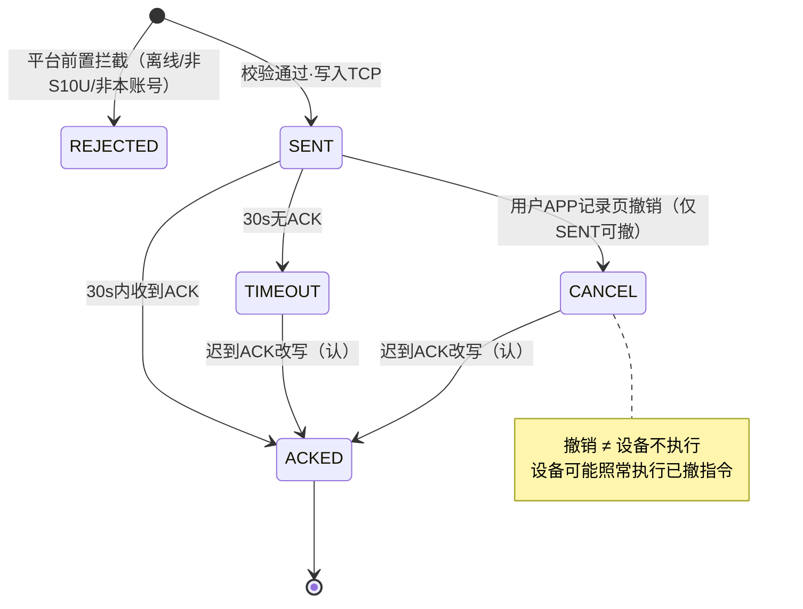
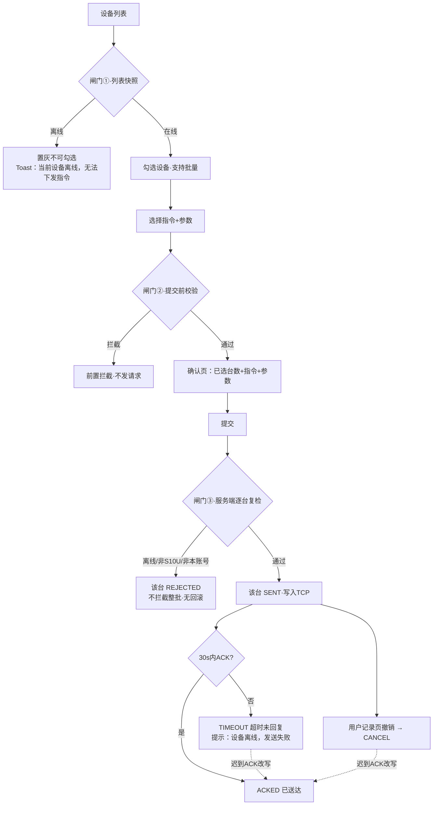

# 革泰 APP · S10U 指令交互状态逻辑大纲（2026-09-17 确认口径）

> **依据**：44.png 服务端状态机现状 + 2026-09-17 测试负责人逐条确认。PRD 双状态机不作为依据。

---

## 1. 状态定义与中文映射（六态）

| 状态 | 中文映射 | 进入条件 | 终态？ |
|---|---|---|---|
| REJECTED | 已拒绝 | **平台前置拦截**（指令未发出）：①设备离线 ②非牛马定位器(S10U)类型 ③非当前账号设备。无设备侧拒绝 | 是（不可迁移） |
| SENT | 已发送，等待回复 | 校验通过，**已写入 TCP**，等待设备 ACK | 否 |
| ACKED | 已送达 | 30s 内收到设备 ACK；或迟到 ACK 改写进入 | **是（唯一吸收态）** |
| TIMEOUT | 超时未回复 | 30s 未收到 ACK | 否（可被迟到 ACK 改写） |
| CANCEL | 已撤销 | **用户主动撤销**（APP 记录页发起），仅 SENT 状态可撤 | 否（可被迟到 ACK 改写） |
| FAILURE | 失败（暂定） | **语义未知，无已知进入路径，待跟进** | 待定 |

---

## 2. 状态迁移图

---

## 3. 关键语义规则（逐条确认原话 → 规则化）

| # | 确认原话 | 规则化表达 |
|---|---|---|
| 1 | "第一个是直接平台指令都没有下发，前置拦截" | REJECTED = 指令未发出，仅平台侧拦截 |
| 2 | "已写入 TCP，等 ACK" | SENT 的判定点是写入 TCP，非设备确认 |
| 3 | "用户主动撤销 / APP记录页撤销 / 仅SENT可撤" | CANCEL 唯一来源 = 用户在记录页对 SENT 状态记录发起撤销 |
| 4 | "撤销≠设备不执行" | CANCEL 后设备行为不断言（可能执行可能不执行） |
| 5 | "迟到ACK也认"、"改回ACKED" | TIMEOUT→ACKED、CANCEL→ACKED 两条改写边均存在；ACKED 为唯一吸收态 |
| 6 | "APP按钮防住就行" | 防重复提交仅靠前端按钮禁用，无服务端幂等 |

---

## 4. 交互流程

### 4.1 下发主流程

**三道闸门**：

| 闸门 | 位置 | 校验内容 | 失败表现 |
|---|---|---|---|
| ① 列表快照 | 设备列表页 | 在线状态 | 离线设备置灰不可勾选 + Toast |
| ② 提交前校验 | 确认提交前 | 参数合法性 + 在线 + 权限 | 拦截提示，不发请求 |
| ③ 服务端逐台复检 | 服务端受理时 | 绑定关系 / S10U类型 / 在线 | 该台 REJECTED，不拦截整批、无回滚 |

**"勾选后掉线"场景**：离线设备在闸门①不可勾选；该场景仅发生在勾选→提交窗口期内设备掉线，由闸门③兜底（如勾选10台 → 8 台 SENT + 2 台 REJECTED）。

### 4.2 撤销流程

入口：APP 指令记录页 → 仅 **SENT** 状态记录可发起撤销 → 状态置 CANCEL。
撤销后设备可能照常执行（撤销≠设备不执行）。

### 4.3 离线两套文案（触发层不同，不可混用）

| 时机 | 文案 |
|---|---|
| 下发前（前置拦截） | 「当前设备离线，无法下发指令」 |
| 下发后（TIMEOUT 超时） | 「设备离线，发送失败」 |

---

## 5. 待跟进（仅状态相关）

- FAILURE 语义与进入路径未定义。
- TIMEOUT 后是否有自动重试未确认。
- 迟到 ACK 改写有无截止时间未定义（影响 TIMEOUT/CANCEL 终态断言）。
