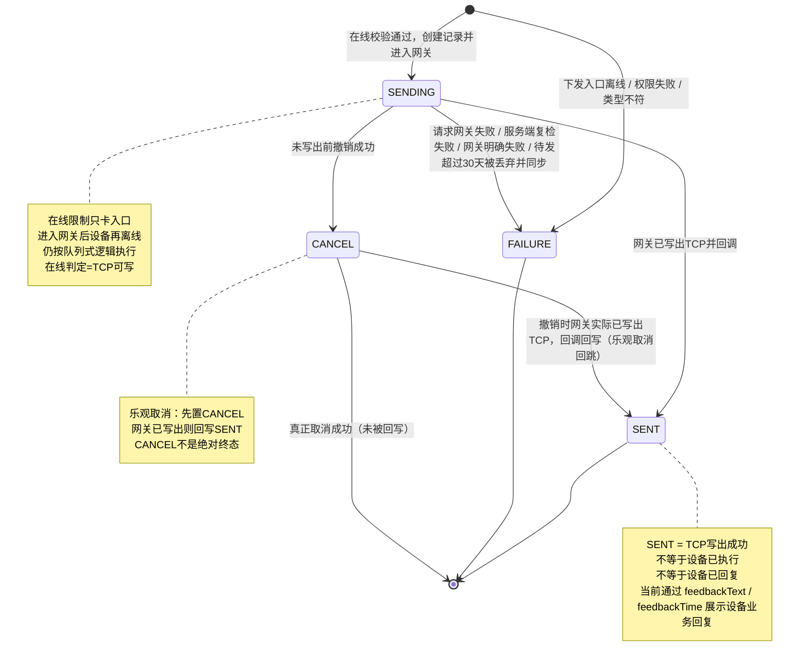
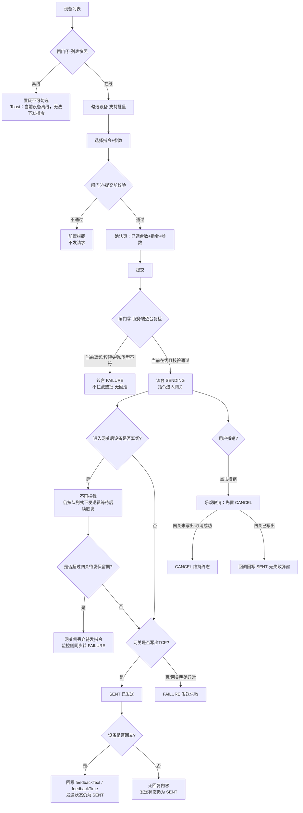
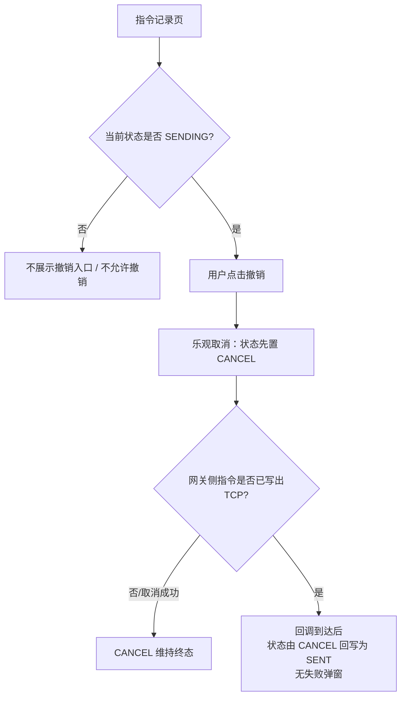

# S10U 指令交互状态逻辑大纲

> **对齐口径**：S10U 与 [pn06-808-交互说明](https://app.notion.com/p/pn06-808-6d95667c6d3a83b9973c01058414edeb?pvs=21) 的关系是**仅指令交互逻辑一致（仿 PN06 队列式下发逻辑），并非复用同一网关、同一条链路**。S10U 是独立链路，在其下发入口增加一条限制：**当前设备必须在线，才允许发起指令下发**。
>
> **注意**：pn06-808-交互说明 第 6 节「S10U 网关回调会把明细打成 ACKED」属于旧口径描述；S10U 服务端发送状态枚举**已对齐 PN06 四态** `SENDING` / `SENT` / `FAILURE` / `CANCEL`，不再使用 `ACKED`。

**核心结论**：S10U 不是改成“在线即时必达”模式，而是“在线才允许入网关”；一旦指令已进入网关并置为 `SENDING`，后续设备掉线不再拦截，仍按队列式下发逻辑执行。在线判定口径：**服务端确认当前 TCP channel 存在且可写才视为在线放行**（心跳间隔内的设备存在被误判离线的风险，测试需覆盖）。
> 

---

## 1. 角色与链路分层

| 角色 | 职责 | 用户侧理解 |
| --- | --- | --- |
| APP / 监控侧 | 用户发起指令、展示指令记录、展示发送状态与回复内容 | 用户看到的指令入口与记录页 |
| 服务端 / 接入网关 | 校验设备、接收指令、按队列式逻辑排队或写出 TCP、超过 30 天保留期后丢弃待发指令并同步 FAILURE、回传写出结果 | 决定记录进入 SENDING / SENT / FAILURE / CANCEL |
| 终端设备 | 在线后接收 TCP 指令，执行后可能返回业务文本 | 决定是否产生 feedbackText / feedbackTime |

**分层规则**：

1. **在线限制只发生在下发入口**：设备当前离线时，不允许发起指令下发。
2. **进入网关后按队列式逻辑执行**：设备在线校验通过后，记录进入 `SENDING`，指令进入网关；之后即使设备离线，也不再回退、不再前端拦截，继续按队列式下发逻辑处理（逻辑仿 PN06，但为独立链路）。
3. **网关收下 ≠ 设备收到**：服务端请求网关成功，只能说明指令已进入发送流程；如果设备后续长期没有上线触发发送，网关侧可能因为超过 30 天把待发指令丢掉。
4. **TCP 写出 ≠ 设备业务回复**：写出成功对应发送状态变更；设备回文只回写回复字段。
5. **设备回复不再改发送状态**：是否有回复看 `feedbackText` / `feedbackTime`，不要新增或展示成 ACKED 状态。

---

## 2. 状态定义与中文映射

| 状态 | 中文映射 | 进入条件 | 是否终态 | 备注 |
| --- | --- | --- | --- | --- |
| SENDING | 发送中 / 等待发送 | 设备在线校验通过，监控侧已创建记录，且指令已进入网关发送流程 | 否 | 设备未必收到；可能还在网关队列；进入 SENDING 后即使设备离线也按队列式逻辑继续等待/写出；若网关侧待发超过 30 天，监控侧同步转 FAILURE |
| SENT | 已发送 | 网关已把指令写出到 TCP，并回调监控侧 | 是（发送状态层面） | 只代表 TCP 写出成功，不代表设备已执行或已回复 |
| FAILURE | 发送失败 | 调网关 HTTP 失败、非允许环境/白名单拦截、服务端复检失败，或网关 30 天丢弃后同步回调 | 是 | 属于平台/服务端侧失败 |
| CANCEL | 已撤销 | 指令还未写出 TCP 前，用户撤销且网关取消成功 | **否（可被回写）** | 乐观取消：用户点击撤销先置 CANCEL；若网关侧实际已写出 TCP，回调到达后状态由 CANCEL 回写为 SENT；已写出的指令不能真正取消 |

<aside>
⚠️

不再使用 `ACKED` 作为用户可见发送状态。

设备业务回复与发送状态拆开：发送状态最多到 `SENT`；回复内容单独看 `feedbackText` / `feedbackTime`。

</aside>

---

## 3. 状态迁移图

### 3.1 可能存在的状态流转变更矩阵

| 从 | 到 | 触发事件 |
| --- | --- | --- |
| 创建前 | FAILURE | 下发入口设备离线 / 权限失败 / 类型不符 / 参数校验失败 |
| 创建前 | SENDING | 用户发起指令下发；设备当前在线（TCP 可写）；服务端校验通过；指令成功进入网关 |
| SENDING | FAILURE | 调网关失败 |
| SENDING | FAILURE | 非生产环境且卡号不在白名单 / 平台侧明确拦截（已确认：S10U 继承此规则，测试前需将测试卡号加白） |
| SENDING | SENDING | 网关成功收下并返回 `businessId` |
| SENDING | SENDING | 指令进入网关后设备离线 |
| SENDING | SENT | 设备上行报文触发后，网关将指令写到 TCP，并回调平台（**写出触发机制未实测确认**，用例按「上行触发」主预期 +「不触发则保持 SENDING」观察设计） |
| SENDING | CANCEL | 指令还未发送给设备前，用户撤销（乐观取消：先置 CANCEL） |
| SENDING | FAILURE | 网关待发超过 30 天被丢弃，监控侧**同步转 FAILURE**（已确认） |
| CANCEL | SENT | 撤销时网关实际已写出 TCP，回调到达后由 CANCEL 回写为 SENT（乐观取消回跳，已确认） |
| SENT | SENT | 设备返回业务回文，feedbackText / feedbackTime 存在具体值（注意：回文按「该设备最新已发送指令」近似挂靠，同设备连发多条时存在串扰风险，已确认继承此风险） |
| SENT | SENT | 设备一直不回业务回文，feedbackText / feedbackTime 为空 |

---

## 4. 下发主流程

---

## 5. 三道闸门

| 闸门 | 位置 | 校验内容 | 失败表现 |
| --- | --- | --- | --- |
| ① 列表快照 | 设备列表页 | 在线状态 | 离线设备置灰不可勾选 + Toast |
| ② 提交前校验 | 确认提交前 | 参数合法性 + 在线 + 权限 | 拦截提示，不发请求 |
| ③ 服务端逐台复检 | 服务端受理时 | 绑定关系 / 设备类型 / **当前在线状态（TCP channel 存在且可写）** / 网关可达性 | 当前离线则该台 FAILURE；当前在线则允许进入网关，不拦截整批、无回滚 |

**“勾选后掉线”场景**分两段处理：

1. **提交/服务端复检前掉线**：由闸门③兜底，该台不允许进入网关，置为 `FAILURE`。
2. **已通过在线复检并进入网关后掉线**：不再回退、不再拦截，保持 `SENDING`，继续按队列式逻辑等待设备后续上线/心跳/定位/鉴权触发下发；若超过 30 天仍未下发，网关侧丢弃待发指令，**监控侧同步转 FAILURE**。

---

## 6. 撤销流程

入口：APP 指令记录页。

规则：

1. 仅 `SENDING` 状态可发起撤销。
2. **乐观取消**：用户点击撤销后，记录先置为 `CANCEL`；若网关侧指令实际已写出 TCP，写出回调到达后状态由 `CANCEL` 回写为 `SENT`，不弹撤销失败提示。
3. 进入网关后设备掉线，不影响撤销入口判断；只要记录仍为 `SENDING` 且网关队列中仍存在该指令，就可以尝试撤销（已确认）。
4. 如果网关侧已因超过 30 天丢弃待发指令，撤销时可能查不到可取消队列项；此时该记录已同步转 `FAILURE`，不满足撤销入口条件，自然不可撤销。
5. 已写出 TCP 的指令不能真正取消；乐观取消后若回写 `SENT`，即代表指令已发出。
6. `CANCEL` 维持终态仅当网关侧取消真实成功；**CANCEL 不是绝对终态**（存在 CANCEL→SENT 回写路径）。
7. 撤销交互的完整 UI 细节（入口展示、确认弹窗等）随指令历史记录专项一并梳理。

---

## 7. 设备业务回文展示规则

设备执行后可能返回文本回文。该回文属于「回复内容」，不属于「发送状态」。

| 字段/展示 | 含义 |
| --- | --- |
| `feedbackText` | 设备返回的业务文本 |
| `feedbackTime` | 设备回文时间 |
| 发送状态 | 保持 `SENT`，不因回文改成 ACKED |
| 无回文 | 仅表示暂未收到设备业务回复，不反推发送失败 |

**列表展示建议**：

| 发送状态 | 回复字段 | 用户理解 |
| --- | --- | --- |
| SENDING | 空 | 指令已提交，等待发送/写出 |
| SENT | 空 | 已发送到设备通道，暂未收到设备回复 |
| SENT | 有值 | 已发送，且设备已有回复 |
| FAILURE | 空 | 发送失败 |
| CANCEL | 空 | 已撤销 |

---

## 8. 离线与失败文案

| 时机 | 文案 | 状态 |
| --- | --- | --- |
| 下发前，列表页设备离线 | 「当前设备离线，无法下发指令」 | 不创建记录 |
| 提交后，服务端复检失败（离线/权限/类型不符/网关不可达等） | **统一文案「设备离线，无法下发指令」**（已确认，不按原因细分） | FAILURE |
| 已进入网关后设备离线 | 不立即提示“发送失败”；保持发送中，按队列式逻辑等待后续触发 | SENDING |
| 已发送后无设备回文 | 不提示“发送失败” | SENT + 无回复 |
| 网关侧待发超过 30 天被丢弃 | 已确认：监控侧同步转 FAILURE，按失败展示 | SENDING → FAILURE |

---

## 9. 批量下发规则

1. 批量下发按设备维度生成记录。
2. 单台失败不影响其他设备继续下发。
3. 不做整批回滚。
4. 每台设备独立进入 `SENDING` / `SENT` / `FAILURE` / `CANCEL`。
5. 结果页或记录页需能体现每台设备的最终发送状态与回复情况。

<aside>
🕒

批量下发中，S10U 只在“下发入口/服务端受理时”要求设备当前在线；只要该台设备已通过在线校验并进入网关，后续即使离线也不再拦截，继续按队列式逻辑处理。若长期未再次上线触发下发，网关侧在超过 30 天后丢弃该台设备的待发指令并同步转 FAILURE；其他设备的发送结果不受影响。

</aside>

---

## 10. 与旧口径差异

| 旧口径 | 对齐后口径 |
| --- | --- |
| REJECTED 表示平台前置拦截 | 前置拦截不创建记录；服务端失败统一进入 FAILURE |
| SENT 表示已写入 TCP，等待 ACK | SENDING 表示进入发送流程；SENT 表示 TCP 已写出 |
| ACKED 表示 30s 内收到设备 ACK | 不再使用 ACKED；设备回文写入 feedbackText / feedbackTime |
| TIMEOUT 表示 30s 未收到 ACK | 不单独作为发送状态；超时/异常按失败或无回复场景区分 |
| CANCEL 可被迟到 ACK 改写为 ACKED | 乐观取消：先置 CANCEL；已写出的指令不能真正取消，写出回调到达后由 CANCEL 回写为 SENT |
| 撤销≠设备不执行 | 对齐为：仅未写出前可真正取消；已写出则回写 SENT |
| 未覆盖 网关待发保留期 | 增加：设备通过在线校验并进入网关后，如果后续长期未上线触发下发，网关侧超过 30 天丢弃待发指令，监控侧同步转 FAILURE |
| S10U 在线限制与队列式逻辑冲突 | 调整为：在线限制只卡下发入口；进入网关后仍按队列式逻辑执行 |
| S10U 与 PN06 同网关同链路 | 修正为：仅交互逻辑一致（仿队列式下发），独立网关、独立链路 |

---

## 11. 与 PN06 差异对照（2026-09-18 确认）

> **总定性**：S10U 与 PN06 **仅指令交互逻辑一致（仿队列式下发），并非同一网关、同一条链路**。下表按功能行为维度对照，凡标注「S10U 增强」的行为是 S10U 链路上相对 PN06 代码现状的独立变化，不是「继承」。

| # | 差异维度 | PN06 现状 | S10U 口径（已确认） | 测试关注点 |
| --- | --- | --- | --- | --- |
| 1 | 链路关系 | 808 网关 + podium 一套自洽体系 | **独立网关、独立链路**，仅交互逻辑仿 PN06 | 不能直接拿 PN06 排障经验套 S10U；接口/日志位置不同 |
| 2 | 下发入口在线校验 | 无（离线可下发，排队等上线） | **三道闸门**：列表置灰→提交前校验→服务端复检 | 闸门③判定=TCP 可写；心跳间隔内设备误判离线场景 |
| 3 | 发送状态枚举 | SENDING / SENT / FAILURE / CANCEL | **已对齐四态**，ACKED 等旧枚举废弃 | 校验服务端实际返回枚举无 ACKED 残留 |
| 4 | 设备回文 | 只写 feedbackText / feedbackTime，不改状态 | 同左 | 回文展示细节留指令历史记录专项 |
| 5 | 回文匹配机制 | 按卡号「最新已发送」近似挂靠，连发可能串 | **同样存在串扰风险**（功能行为类似） | 同设备连发多条指令后观察回文归属 |
| 6 | 网关 30 天丢弃 | 808 只丢不通知，podium 永久卡 SENDING | **监控侧同步转 FAILURE**（S10U 增强） | 构造超 30 天未上线场景验证状态同步 |
| 7 | 撤销语义 | 同步判结果，CANCEL 即终态 | **乐观取消**：先置 CANCEL，已写出则回调回写 SENT，无失败弹窗 | 撤销与写出竞态场景；CANCEL→SENT 回跳展示 |
| 8 | 环境白名单 | 非 prod + 卡号不在白名单 → FAILURE | **继承此规则** | 测试前置：测试卡号必须先加白 |
| 9 | 复检失败文案 | —（PN06 无在线复检环节） | 统一「设备离线，无法下发指令」 | 不区分离线/权限/类型等原因 |
| 10 | 写出触发机制 | 心跳/定位/鉴权/补传四类上行触发 | **未实测确认**，用例按「上行触发」主预期 +「不触发保持 SENDING」观察设计 | 探针用例：SENDING 后不发上行，观察是否滞留 |
| 11 | 服务到期设备 | — | **仍允许下发**，到期不拦截 | 到期+在线设备全链路下发用例 |

## 12. 已确认结论记录（原待确认清单裁决）

| # | 原待确认项 | 裁决（2026-09-18） |
| --- | --- | --- |
| 1 | 服务端枚举是否对齐四态 | ✅ 已对齐 SENDING / SENT / FAILURE / CANCEL；pn06 文档第 6 节 ACKED 描述属旧口径 |
| 2 | 回文展示方式 | 链路事实：写 feedbackText / feedbackTime、不改发送状态；展示细节留指令历史记录专项 |
| 3 | 复检失败文案 | ✅ 统一「设备离线，无法下发指令」 |
| 4 | 撤销失败提示 | ✅ 乐观取消：先 CANCEL，网关已写出则回写 SENT，无失败弹窗 |
| 5 | 30 天丢弃后状态 | ✅ 监控侧同步转 FAILURE |
| 6 | 丢弃后 APP 展示 | 由第 5 条覆盖：按 FAILURE 失败展示 |
| 7 | 在线判定点 | ✅ TCP channel 存在且可写 |
| 8 | 掉线后能否撤销 | ✅ 仍可撤销（原第 6 节规则 3 成立） |

---

**文档版本**：v1.1（2026-09-18 差异确认：总定性修正为独立链路仿 PN06 交互逻辑；状态机新增 CANCEL→SENT 乐观取消回写、30 天丢弃同步 FAILURE；复检失败文案统一；服务到期不拦截；新增第 11 节差异对照）

**维护人**：测试团队