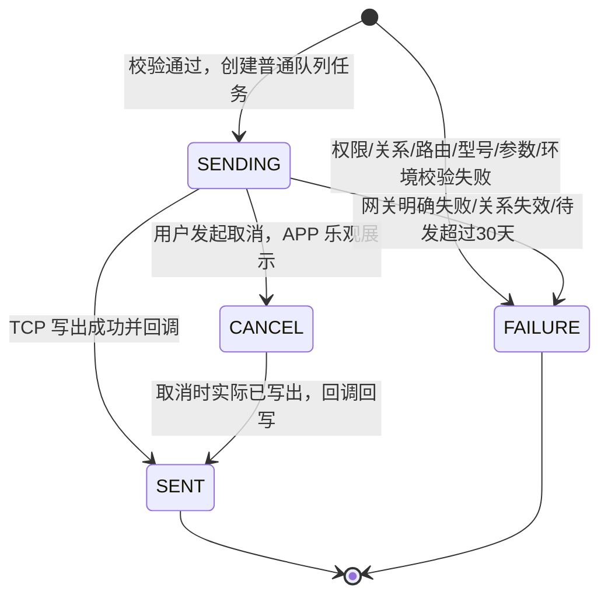
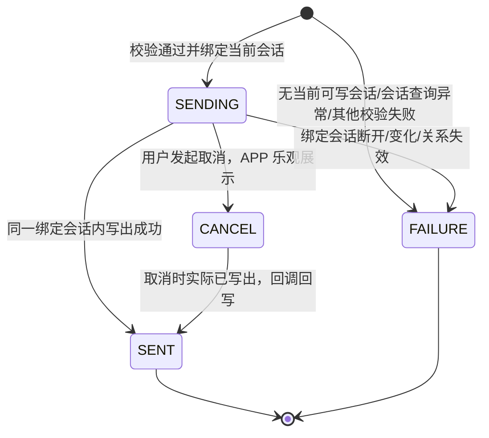

# S10U 指令交互状态逻辑大纲

> **文档用途**：定义革泰指令通过 S10U 独立服务及网关下发时的准入分类、四态流转、队列有效期、会话绑定、取消、回文与批量边界。
>
> **链路关系**：S10U 与 PN06 仅在普通指令的队列式交互思想上相似，不复用 PN06/808 网关、接口、数据库或在线状态。
>
> **最新真源**：普通五类允许离线提交；高危两类必须绑定提交时的 S10U 当前可写会话。旧版“七类指令统一在线限制”和“离线设备统一失败”规则作废。

---

## 1. 指令分类与核心规则

| 类别 | 指令 | 提交准入 | 未写出时设备离线 / 断线 | 有效期 |
| --- | --- | --- | --- | --- |
| 普通队列类 | CR、VERNO、FIND、UPLOAD、ZONE | 在线、离线、未连接均可提交，但必须通过权限、关系、路由、型号、参数和幂等校验 | 保持 SENDING，等待后续通信触发写出 | 30 天；超期删除队列任务并同步 FAILURE |
| 高危会话绑定类 | RESET、POWEROFF | 必须存在 S10U 当前可写会话，并保存具体会话标识 | 绑定会话断开、变化或被新会话替换时立即 FAILURE 并出队 | 绑定当前会话；是否增加会话内最大有效时间待确认 |

共同原则：

1. 页面在线快照只用于交互提示，不能替代服务端校验。
2. 缺少合法 S10U 路由不能伪装成普通离线排队。
3. `SENT` 只表示指令已写入 TCP，不表示设备已执行或已回复。
4. 设备回复不改变 SENDING / SENT / FAILURE / CANCEL 四态，只更新 `feedbackText / feedbackTime`；UPLOAD / ZONE 的匹配成功反馈还可更新对应配置确认值，但不得新增 `ACKED` 状态。
5. 同一任务在写出、断线、取消和关系失效竞态中只能产生一个最终结果。

---

## 2. 角色与链路分层

| 角色 | 职责 |
| --- | --- |
| APP | 发起指令，展示提交反馈、指令四态和设备回复 |
| 指令服务 | 校验账号、关系、路由、型号、参数和幂等，创建记录与任务 |
| S10U 服务 / 网关 | 管理设备会话、队列与 TCP 写出，回传写出或失败结果 |
| 终端设备 | 接收指令、执行业务动作，并可能返回业务文本 |

---

## 3. 状态定义

| 状态 | 中文展示 | 进入条件 | 是否终态 |
| --- | --- | --- | --- |
| SENDING | 发送中 / 等待发送 | 服务端校验通过并创建待写出任务 | 否 |
| SENT | 已发送 | S10U 已完成 TCP 写出并回调 | 是（发送状态层面） |
| FAILURE | 发送失败 | 权限、关系、路由、型号、参数、环境、会话或队列过期等明确失败 | 是 |
| CANCEL | 已取消 | 用户发起取消后 APP 乐观展示；网关确认未写出且队列删除成功时维持该状态 | 否，可能被迟到的可靠写出事实改写为 SENT |

不再使用 `ACKED / TIMEOUT / QUEUED / COMPLETED / REJECTED / EXPIRED` 作为 APP 指令发送状态。

---

## 4. 生命周期

### 4.1 普通五类


```mermaid
stateDiagram-v2
    [*] --> FAILURE : 权限/关系/路由/型号/参数/环境校验失败
    [*] --> SENDING : 校验通过，创建普通队列任务
    SENDING --> SENT : TCP 写出成功并回调
    SENDING --> CANCEL : 用户发起取消，APP 乐观展示
    SENDING --> FAILURE : 网关明确失败/关系失效/待发超过30天
    CANCEL --> SENT : 取消时实际已写出，回调回写
    SENT --> [*]
    FAILURE --> [*]
```

- 设备离线不是普通五类的失败原因。
- 无当前会话时任务保持 SENDING。
- 待发超过 30 天仍未写出时，网关删除任务并同步 FAILURE。
- 解绑、企业回收、改绑或账号失权时，未写出任务立即 FAILURE 并出队。

### 4.2 高危两类


```mermaid
stateDiagram-v2
    [*] --> FAILURE : 无当前可写会话/会话查询异常/其他校验失败
    [*] --> SENDING : 校验通过并绑定当前会话
    SENDING --> SENT : 同一绑定会话内写出成功
    SENDING --> CANCEL : 用户发起取消，APP 乐观展示
    SENDING --> FAILURE : 绑定会话断开/变化/关系失效
    CANCEL --> SENT : 取消时实际已写出，回调回写
    SENT --> [*]
    FAILURE --> [*]
```

- 任务必须保存 `boundSessionId/sessionEpoch/channelId` 等稳定会话标识。
- 写出前必须再次比较当前会话与绑定会话。
- 设备断线后建立的新会话不得执行旧高危任务。
- 高危重发属于新用户意图，必须生成新 attempt 并绑定重发时的新当前会话。

---

## 5. 提交与批量处理

### 5.1 共同校验

所有入口必须校验：

- 登录会话和账号状态；
- 当前账号与设备关系；
- 设备唯一标识与 S10U 路由；
- 型号能力与参数；
- 幂等标识、批量上限和限流。

统一建单边界：

1. APP 本地格式校验未通过、请求未发出时，不创建后台记录；
2. 用户已确认且请求已到达服务端，服务端能够识别账号、设备和操作意图时，无论后续校验成功或失败，均创建 `commandId / attemptId`；
3. 服务端权限、关系、路由、型号、参数、环境或高危会话复检失败时，记录直接进入 `FAILURE`，并保存 `failureStage / failureReason / failedAt`；
4. 批量最终目标范围内的每台设备均须建立明细，失败设备不得静默丢失。

### 5.2 单设备

- 普通五类离线可提交并进入 SENDING。
- 高危两类页面可以基于最近一次状态快照展示置灰和原因，但页面从后台恢复、收到设备通信状态变化或用户尝试操作时，应刷新当前 S10U 会话；单设备与批量入口均以提交时服务端实时会话复检为最终准入依据。
- 构造请求绕过前端时，服务端必须拒绝无当前可写会话的高危指令请求。
- 成功、明确失败和结果未知均由 APP Toast 反馈，页面不把 TCP 写出或设备执行冒充提交结果。

### 5.3 批量

1. 在线、离线、未连接和告警设备均可选择。
2. 普通五类不得因离线失败。
3. 高危两类不在选择阶段静默剔除离线设备，最终提交时逐台复检当前会话。
4. 有效设备继续受理，失败设备建立逐设备 FAILURE，不做整批回滚。
5. 必须满足：

```text
最终选中去重数量
= SENDING + SENT + FAILURE + CANCEL
```

任何设备不得从批次明细中静默消失。

“未连接”是设备尚无有效通信记录的内部事实状态，在设备列表筛选与统计中统一归入离线；指令页如需区分，只展示为“离线·尚未连接”等原因文案，不建立独立的第五种通信筛选状态，也不改变最终服务端准入规则。

---

## 6. 取消与重发

### 6.1 取消

1. 仅 SENDING 可发起取消。
2. APP 先乐观更新为 CANCEL；该状态表示取消请求已进入处理，不代表平台已绝对确认指令不会写出。
3. 网关未写出且删除成功：维持 CANCEL，并将 `cancelResolution` 记为 `CONFIRMED`。
4. 网关实际已写出：已发生的写出事实优先，迟到回调将 CANCEL 改写为 SENT，并将 `cancelResolution` 记为 `OVERRIDDEN_BY_SENT`。
5. CANCEL → SENT 后必须提示用户“取消未生效，指令已下发”；RESET / POWEROFF 使用高优先级提醒，并说明设备仍可能执行。
6. SENT 不允许被迟到的取消结果改回 CANCEL；重复回调不得重复统计、重复通知或重复产生业务副作用。
7. 已转 FAILURE 或 SENT 的任务不展示取消入口。

### 6.2 重发

- 每次用户完成主动重发二次确认后，生成新的后台 attempt。
- APP 记录页不新增可见卡片，在原卡更新状态并累计“已重发 N 次”。
- 普通五类离线可重发。
- 高危两类重发时重新复检当前会话；复检失败时，新 attempt 直接进入 FAILURE，重发次数增加并展示本次失败原因，不复活旧高危任务。
- 网络安全重试必须复用同一 attempt 的幂等标识，不得创建重复任务。

---

## 7. 回文与配置指令

| 场景 | 发送状态 | 回复字段 |
| --- | --- | --- |
| 尚未写出 | SENDING | 空 |
| 已写出、无业务回复 | SENT | 空 |
| 已写出、有业务回复 | SENT | 写入 feedbackText / feedbackTime |
| 平台或队列失败 | FAILURE | 通常为空 |
| 真正取消成功 | CANCEL | 空 |

时间字段统一口径：

- `sentAt` 只表示实际完成 TCP 写出的时间，只有 SENT 状态有值；
- FAILURE 使用独立的 `failedAt`，不得用发送时间表达失败发生时间；
- 设备已写出后返回业务失败时，发送状态仍为 SENT，业务失败通过独立反馈字段表达，不得改写成发送 FAILURE。

UPLOAD / ZONE 额外满足：

1. 同一设备、同一配置项按提交顺序执行，任务不合并删除。
2. `commandId` 表示一条用户可见逻辑记录，`attemptId` 表示该记录下的一次发送尝试，S10U `businessId` 与 attemptId 一一映射；反馈按 `businessId → attemptId → commandId` 追踪。
3. 用户最新目标值不得冒充设备确认值。
4. 只有匹配成功反馈才能更新确认值。
5. 旧任务晚到回文不得覆盖更新的目标值。

---

## 8. 失败原因

FAILURE 必须保留可区分的失败阶段与原因，至少覆盖：

- 权限或设备关系失效；
- S10U 路由缺失；
- 型号或参数不支持；
- 测试环境 / 白名单限制；
- 高危指令无当前会话、会话变化或会话查询异常；
- 普通任务待发超过 30 天；
- 网关、服务端或系统异常。

禁止将权限、路由、型号、参数和系统异常统一伪装成“设备离线”。

---

## 9. 与 PN06 的关键差异

| 维度 | PN06 参考行为 | S10U 当前口径 |
| --- | --- | --- |
| 链路 | 808 网关体系 | 独立服务和网关 |
| 普通指令 | 队列式 | 普通五类采用 30 天队列 |
| 高危指令 | 无本篇会话绑定模型 | RESET / POWEROFF 绑定具体当前会话 |
| 四态 | SENDING / SENT / FAILURE / CANCEL | 同四态，不使用 ACKED |
| 30 天丢弃 | 可能仅丢队列 | 必须同步业务记录为 FAILURE |
| 取消 | 依实现返回 | 乐观 CANCEL，可被写出回调改写为 SENT |
| 回文 | 独立回复字段 | feedbackText / feedbackTime，不改发送状态 |

---

## 10. 待确认事项

1. 高危任务在同一会话持续在线时是否增加最大有效时间及起算点。
2. UPLOAD / ZONE 前序任务失败或取消后的队列推进方式。
3. 单次设备上行允许连续写出的配置指令数量。
4. 服务重启后的队列恢复与 30 天过期补偿。
5. 服务到期设备及其排队任务的处理。
6. S10U 会话查询接口、会话标识和错误码契约。

---

**文档版本**：v2.0（2026-10-10 普通队列类与高危会话绑定类重构）

**维护人**：测试团队
