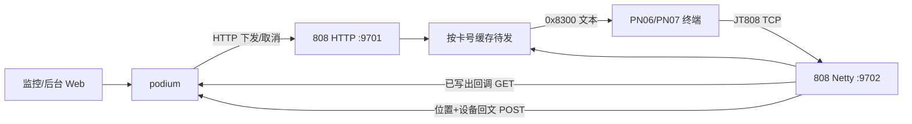
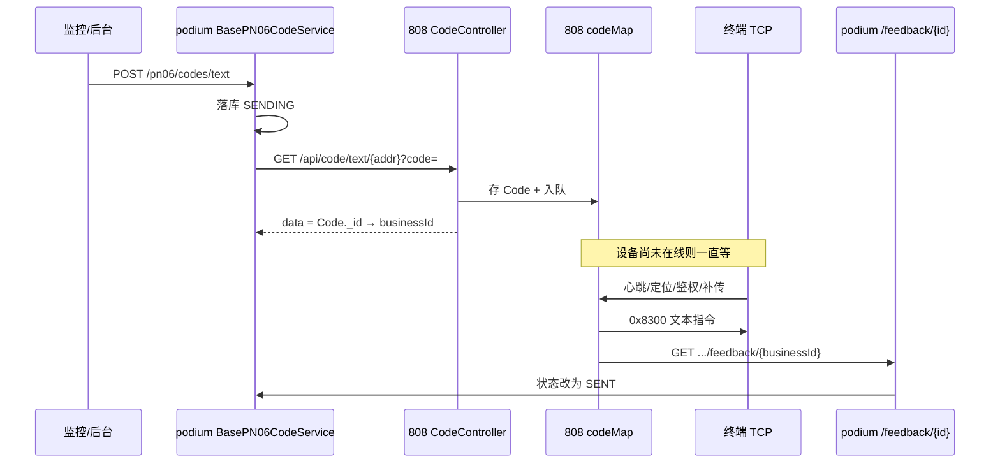
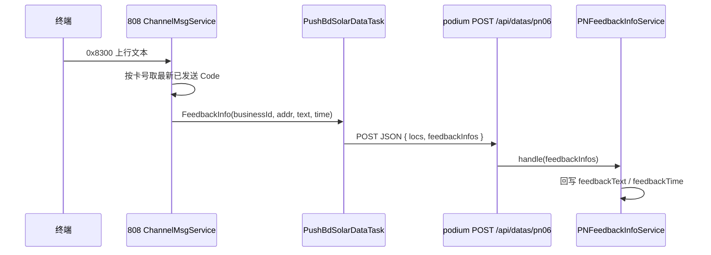
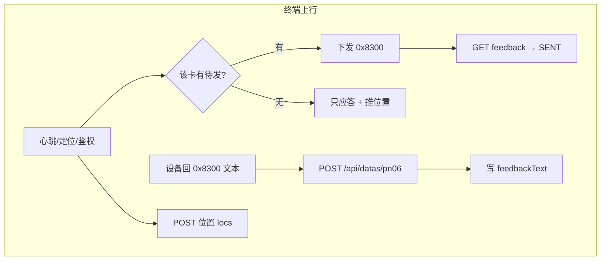

# pn06-808-交互说明

> 依据当前代码梳理（podium + `D:\workbase\808platform`）。
> 
> 
> `808platform` 的 Maven 坐标是 `pn06-platform`，启动类 `PN06PlatformApplication`，就是监控平台口中的 **PN06 / 808 接入网关**。
> 

---

## 1. 三个角色

| 角色 | 项目 | 干什么 |
| --- | --- | --- |
| 监控 / 后台 | `podium`（`pg-podium-monitor` / `pg-podium-admin` + `pg-business`） | 用户点「指令下发」；落库 `c_pn06_code`；HTTP 调 808；收两类回执 |
| 808 / PN06 平台 | `808platform` | HTTP 收指令、TCP（JT808 风格）连终端；等设备上线后把文本写下去；再回调 / 推送给 podium |
| 终端 | PN06 / PN07 太阳能 4G 终端 | 心跳、定位、鉴权时从平台取指令；执行后用文本帧回内容 |

两边 **各自 Mongo**：podium 记业务指令，808 记待发队列。关联键是 podium 的 `businessId` = 808 保存 `Code` 后返回的 Mongo `_id`。

---

## 2. 平台下发之后发生了什么

**不会立刻推到设备。** 808 只把指令存库并挂到该卡号的内存队列；等终端下一次「有机会」上报（心跳 / 定位 / 鉴权 / 补传）才真正写 TCP。

### 2.1 监控侧（podium）

1. Web 调例如 `POST /api/monitor/pn06/codes/text`（后台同路径前缀在 admin 模块）。
2. `BasePN06CodeService` 先写 `PN06Code`：状态 `SENDING`，正文在 `content`（JSON，`{"text":"..."}`）。
3. 再 HTTP 调 808：
    - 单台：`GET {pn06.baseUrl}/text/{addr}?code={文本}`
    - 批量：`POST {pn06.baseUrl}/batch/text`，body `{ addrs, text }`
4. 808 返回成功时，把返回的指令 id 写入 `businessId`，**状态仍是 `SENDING`**（只表示「网关已收下」）。
5. HTTP 失败或非 prod 且卡号不在白名单：标 `FAILURE`，不再等设备。

生产配置示例：`pn06.baseUrl = http://back.pn06.pancoit.com/api/code`。

本地 808：`server.port=9701`，对应 `CodeController` 的 `/api/code/**`。

### 2.2 808 侧收下指令

`CodeService.sendTextCode`：

1. 写入 Mongo（库名常见为 `pn06`），`isSend=false`，`isCancel=false`。
2. `ChannelMsgService.put`：按 `addr`（终端手机号 / 卡号）放进 `codeMap`。
3. 超过 30 天的指令直接丢掉、不再排队。
4. 把 `_id` 字符串返回给 podium，即 `businessId`。

此时设备可能还没连上。

### 2.3 真正下到设备

终端 TCP 连 808 Netty（默认 **9702**）。`Jt808Handler` 收到帧后交给 `ChannelMsgService.handleData`。

解析后走 `dealCommonResp`。下列报文在回通用应答之后，会调用 `sendTextCode` 冲队列：

- 心跳 `0x0002`
- 定位 `0x0200`
- 鉴权 `0x0102`
- 补传 `0x0704`

`sendTextCode`：

1. 取该卡号队列里「文本类」指令。
2. `sleep(2)` 后组 `SendTextResp`（消息 ID **`0x8300`**），正文就是监控下发的 `<SPYT*...>` 一类字符串。
3. `ctx.writeAndFlush` 写出。
4. 808 库里该条 `isSend=true`，记下 `sendTime`，从队列摘掉。
5. 异步 HTTP **GET** 监控：`{feedbackUrl}/api/monitor/pn06/codes/feedback/{808指令id}`

监控 `PN06CodeController.handleSuccessFeedback`（Visitor，PN06/PN07 共用）按 `businessId` 找到记录：

- `codeSendStatus = SENT`（已发送）
- 写入 `sendTime`

**这一步只表示「808 已经写到 TCP」，不是设备业务回执。**

---

## 3. 设备回复平台怎么接到

有两条完全不同的回传，不要混成一次 ACK。

### 3.1 通道 A：写出成功（上一节）

- 方向：808 → podium
- 接口：`GET /api/monitor/pn06/codes/feedback/{businessId}`
- 含义：网关已把 `0x8300` flush 给设备
- 字段：状态 `SENT`、`sendTime`
- 配置：808 的 `code.feedbackUrlList`

### 3.2 通道 B：设备业务回文（用户看到的「回复」）

设备执行完后，再发一帧文本。808 把 **上行也按消息 ID `0x8300` 解析**（`ReceiveTextMsg`），在 `dealReceiveTextMsg` 里当「设备反馈指令」。

匹配规则（粗）：

- 查该 `addr` 上 **已经 `isSend=true` 且 `sendTime` 最早于现在** 的指令
- **按 `sendTime` 倒序取最新一条**
- 注释写明：不一定对得上那条，设备回得快一般没事

然后打进推送包 `FeedbackInfo(businessId, addr, time, text)`，经 `PushBdSolarDataTask` 批量 **POST**：

`push.dataPlatformUrlList`，例如：

- `http://.../api/datas/pn06`

监控 `DataReceiverController.receive`：

- `locs` → `PN06LocationService`（轨迹）
- `feedbackInfos` → `PNFeedbackInfoService.handle`

`PNFeedbackInfoService` 用 `businessId` 查 `c_pn06_code`：

- `feedbackText` = 设备回的字符串
- `feedbackTime` = 回文时间
- 顺带 `PN07ActiveService`、时间轴

**状态不会再改成别的枚举**（没有 ACKED）。列表上「有没有回复」看 `feedbackText` / `feedbackTime`。

### 3.3 和位置上报是同一条推送管道

808 定位 / 补传也会 `pushBdSolarDataTask.add`。任务每 500ms 最多拼 30 包，向配置里 **每一个** 数据平台 URL 各 POST 一次。所以回文经常和位置挤在同一个 `PNDataPacket` 里。

---

## 4. 状态怎么理解（对照页面）

| podium `codeSendStatus` | 含义 |
| --- | --- |
| `SENDING` | 已请求 808（或刚入库），**设备未必收到** |
| `SENT` | 808 已 TCP 写出，并回调了 `/feedback/{id}` |
| `FAILURE` | 调 808 HTTP 失败，或 dev/test 不允许真下发 |
| `CANCEL` | 还在 808 队列时取消成功（已 `isSend` 的不能取消） |

取消：podium `GET/PUT` 808 `/api/code/cancel/{id}` 或 `/batch/cancel`，808 从 `codeMap` 摘掉并标 `isCancel`。

---

## 5. 808platform 和 podium 是否有关

**就是一套。** 证据：

1. 工程名 `pn06-platform`，Mongo 库 `pn06`。
2. podium `PN06PlatformConfig` 的 URL 与 808 `CodeController` 路径一一对应。
3. 808 `feedbackUrlList` 指向 podium `GET /api/monitor/pn06/codes/feedback/{}`。
4. 808 `dataPlatformUrlList` 指向 podium `POST /api/datas/pn06`。
5. `PN06Code.businessId` 注释写的就是「808 平台系统返回的 ID」。

本地 808 开发配置会同时推 `8014` 和 `9004` 两套 `/api/datas/pn06`，按实际起了哪个监控实例改。

---

## 6. 和 S10U 的差别（避免对照错）

S10U 网关回调会把明细打成 `ACKED` 等。PN06 **没有** 用设备回文改发送状态：写出成功 = `SENT`，回文只填 `feedbackText`。监控/后台 S10U 返回字段后来对齐了 PN06 的 JSON 形状，**链路不是同一条**。

---

## 7. 关键代码

| 环节 | 位置 |
| --- | --- |
| 下发、写 businessId、SENT 回调 | `pg-business/.../BasePN06CodeService.java` |
| 监控下发 / feedback 入口 | `pg-podium-monitor/.../PN06CodeController.java` |
| 收位置 + 收设备回文 | `DataReceiverController` `POST /api/datas/pn06` |
| 回文落库 | `PNFeedbackInfoService` |
| 808 HTTP 收指令 | `808platform/.../CodeController.java` |
| 808 排队、写出、两类回传 | `808platform/.../ChannelMsgService.java` |
| 808 推数据包 | `808platform/.../PushBdSolarDataTask.java` |
| 终端 TCP | `808platform/.../Jt808Handler.java` |

---

## 8. 排障时先看哪一步断了

1. podium 有记录但没有 `businessId` → 没打到 808 或 HTTP 失败。
2. 有 `businessId` 一直 `SENDING` → 808 已收，设备还没心跳/定位把队列冲下去，或 `feedbackUrlList` 指错监控。
3. 已是 `SENT` 但没有 `feedbackText` → TCP 已下发，设备没回 `0x8300`，或 `POST /api/datas/pn06` 没到这台监控，或 `businessId` 对不上最新一条。
4. 回文挂错指令 → 808 按「该卡最新已发送」近似匹配，连发多条时可能串。