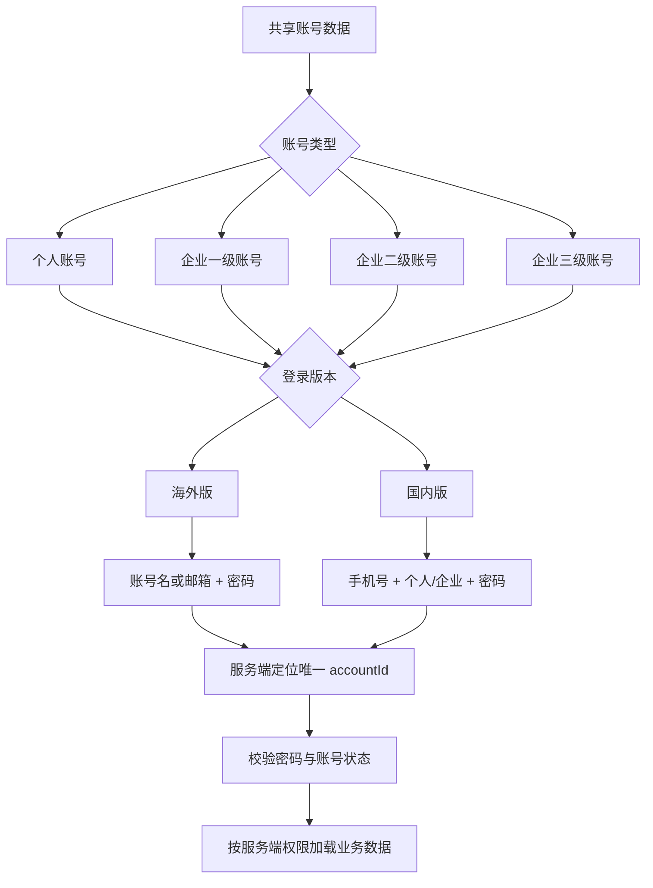
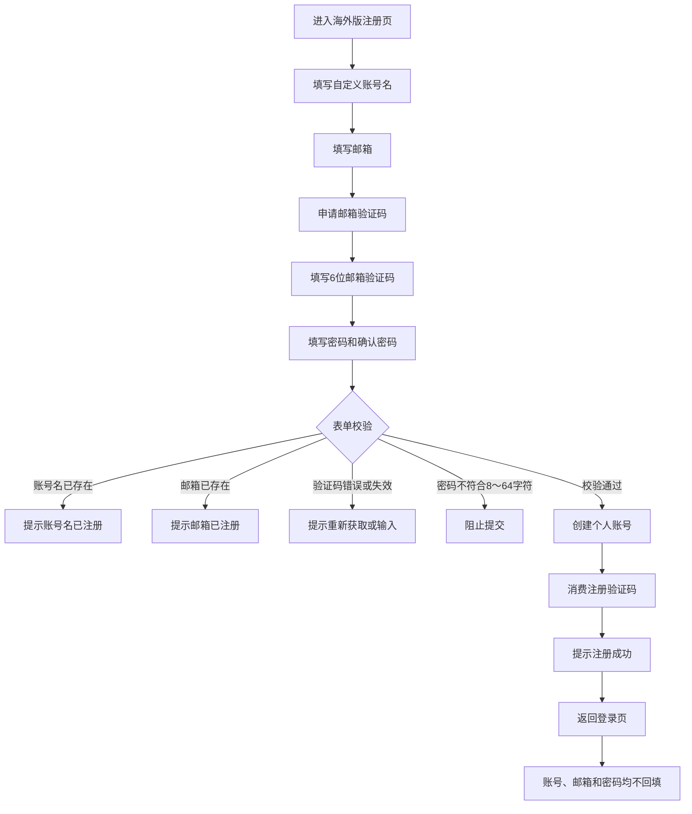
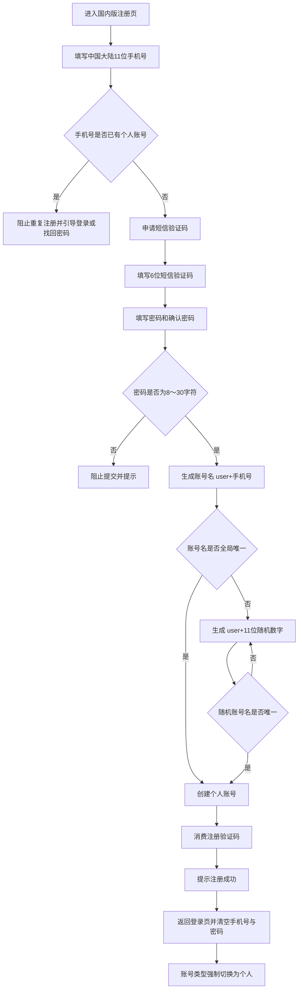
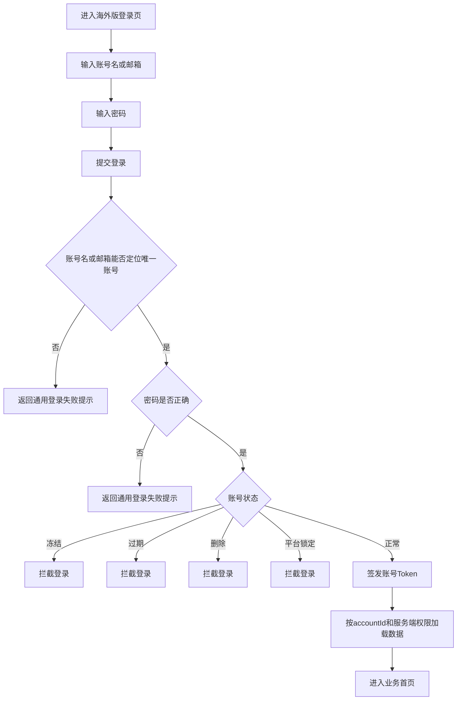
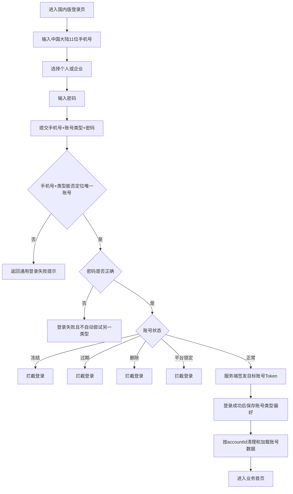
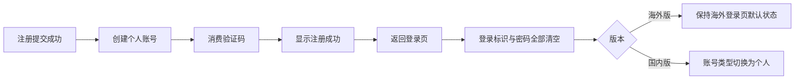
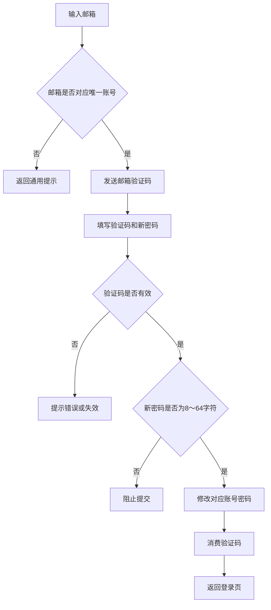
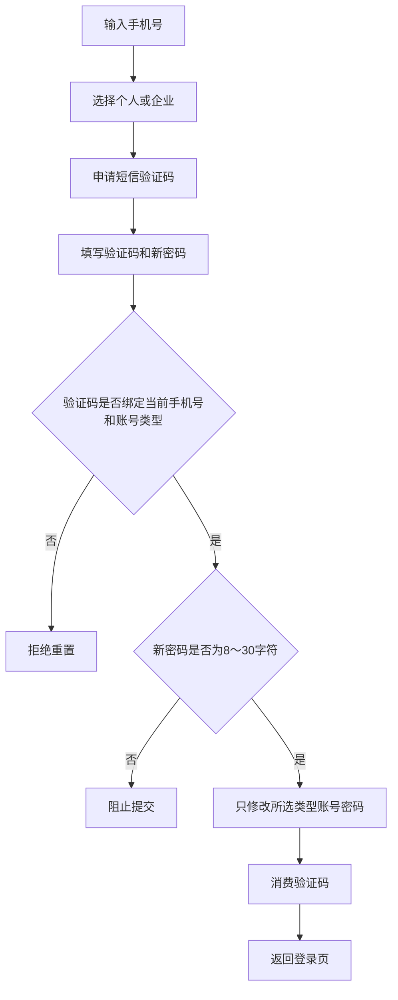
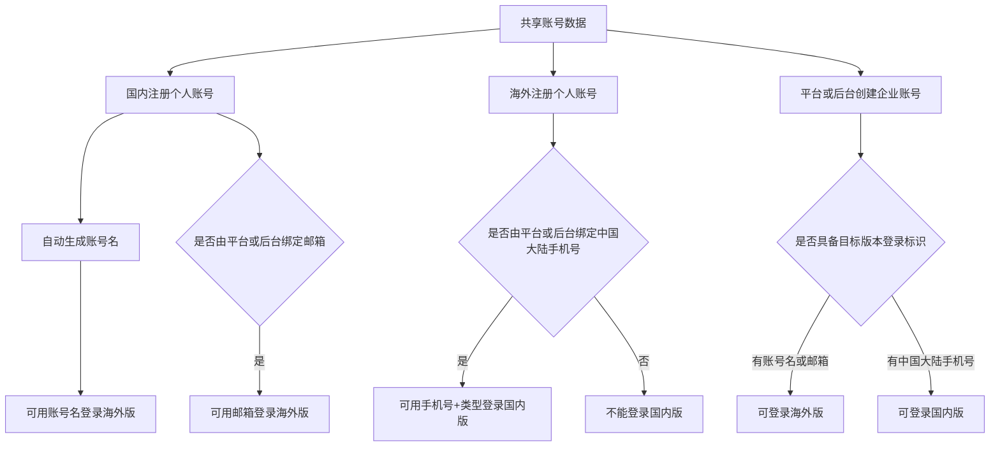
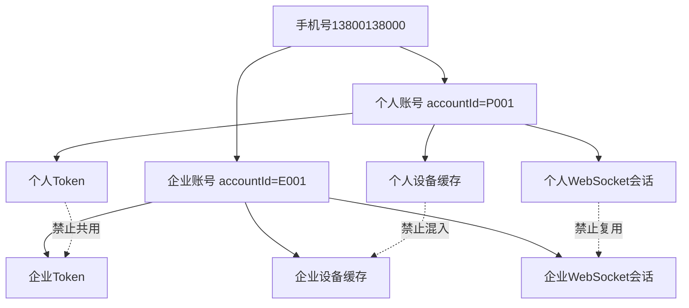

# 革泰 APP 国内版与海外版登录注册差异梳理

> **文档用途**：梳理革泰 APP 国内版与海外版在账号注册、账号登录、密码找回、账号类型、跨版本登录及账号状态方面的差异，并补充开发约束、异常场景和测试风险。
>
> **文档定位**：本文以海外版为测试主线，国内版采用差异化补充；不替代产品 PRD、接口文档和数据库设计。
>
> **当前结论来源**：根据当前需求沟通结果整理。后续如产品需求、服务端实现或账号存量数据与本文冲突，应先更新规则真源，再调整测试预期。

---

## 1. 一句话结论

国内版与海外版使用两个独立安装包，但共用账号数据：

- 两版注册均只创建个人账号；
- 海外版通过“账号名 + 邮箱”注册，使用账号名或邮箱登录；
- 国内版通过中国大陆手机号注册，使用“手机号 + 账号类型”登录；
- 个人账号、企业一级账号、企业二级账号、企业三级账号均允许登录 APP；
- 账号满足目标版本所需登录标识后，可以跨版本登录；
- 账号状态、企业权限和设备范围继续沿用原服务端规则。

---

## 2. 国内版与海外版差异总览

| 对比维度 | 海外版 | 国内版 |
| --- | --- | --- |
| 安装包 | 独立海外安装包 | 独立国内安装包 |
| 账号数据 | 与国内版共用账号数据 | 与海外版共用账号数据 |
| 当前测试优先级 | 主要测试范围 | 差异矩阵与关键兼容场景 |
| 注册结果 | 只创建个人账号 | 只创建个人账号 |
| 注册主标识 | 自定义账号名 + 邮箱 | 中国大陆 11 位手机号 |
| 注册验证方式 | 邮箱验证码 | 短信验证码 |
| 验证码格式 | 6 位数字 | 6 位数字 |
| 验证码有效期 | 5 分钟 | 5 分钟 |
| 验证码重发间隔 | 60 秒 | 60 秒 |
| 注册密码长度 | 8～64 字符 | 8～30 字符 |
| 默认账号名 | 用户自行填写 | 自动生成 `user{手机号}` |
| 默认账号名冲突 | 注册时直接判定账号名已存在 | 使用 `user{11位随机数字}` 重新生成 |
| 登录标识 | 账号名或邮箱 | 仅手机号 |
| 登录账号类型选择 | 不需要 | 必须选择个人或企业 |
| 可登录个人账号 | 支持 | 支持 |
| 可登录企业一级账号 | 支持 | 支持 |
| 可登录企业二级账号 | 支持 | 支持 |
| 可登录企业三级账号 | 支持 | 支持 |
| 忘记密码定位方式 | 邮箱唯一定位账号 | 手机号 + 账号类型定位账号 |
| 忘记密码验证方式 | 邮箱验证码 | 短信验证码 |
| 注册成功后 | 返回空白登录页 | 返回空白登录页，类型切换为个人 |
| 资料绑定入口 | APP 不负责跨版本资料补全 | APP 不负责跨版本资料补全 |

---

## 3. 总体账号模型



### 3.1 核心实体

| 字段 | 作用 | 约束建议 |
| --- | --- | --- |
| `accountId` | 账户永久唯一 ID | 所有会话、缓存和权限判断的主键 |
| `accountName` | 海外版登录标识之一 | 跨个人与企业全局唯一 |
| `accountCategory` | 个人或企业 | 国内手机号登录时参与唯一定位 |
| `enterpriseLevel` | 企业一级、二级、三级 | 仅企业账号存在，不代替权限校验 |
| `phone` | 国内版登录标识及联系方式 | 同一手机号最多对应一个个人账号和一个企业账号 |
| `email` | 海外版登录标识及联系方式 | 非空时跨个人与企业全局唯一 |
| `tenantId` | 企业组织或租户 | 企业数据与权限隔离依据 |
| `accountStatus` | 正常、冻结、过期、删除等 | 国内外登录统一执行 |

### 3.2 建议数据库唯一约束

```text
UNIQUE(accountName)
UNIQUE(normalizedEmail) WHERE email IS NOT NULL
UNIQUE(normalizedPhone, accountCategory) WHERE phone IS NOT NULL
```

企业一级、二级、三级在手机号唯一性判断时应统一归类为“企业”，否则可能出现同一手机号绑定多个不同层级企业账号，导致国内登录无法唯一定位。

---

## 4. 海外版注册逻辑

### 4.1 注册流程



### 4.2 注册规则

- 注册入口只创建个人账号；
- 不提供个人或企业类型选择；
- 不允许通过请求参数夹带企业角色、企业层级或企业权限；
- 账号名由用户填写；
- 账号名在个人账号和企业账号之间全局唯一；
- 邮箱在个人账号和企业账号之间全局唯一；
- 邮箱必须完成验证码验证；
- 密码长度为 8～64 字符；
- 注册成功后不自动登录；
- 返回登录页后不回填账号名、邮箱或密码。

---

## 5. 国内版注册逻辑

### 5.1 注册流程



### 5.2 手机号规则

- 仅接受中国大陆 11 位手机号；
- 不接受 `+86`、`0086` 或其他国际号码格式；
- 同一手机号最多绑定一个个人账号和一个企业账号；
- 手机号已绑定企业账号但没有个人账号时，仍允许注册个人账号；
- 手机号已绑定个人账号时，不允许再次注册个人账号。

### 5.3 默认账号名生成规则

正常生成：

```text
user{手机号}
```

示例：

```text
手机号：13800138000
账号名：user13800138000
```

账号名规则：

- 账号名是账户永久唯一标识；
- 注册成功后只读；
- 不允许用户修改；
- 手机号换绑后，账号名不随手机号改变；
- 国内版登录不使用该账号名；
- 账号名可以用于海外版登录。

### 5.4 默认账号名冲突处理

若 `user{手机号}` 已被海外账号、企业账号或其他存量账号占用，则生成：

```text
user{11位随机数字}
```

开发约束：

- 随机值必须经过数据库全局唯一约束校验；
- 冲突后重新生成；
- 不能只依靠“先查询再插入”；
- 不能使用无上限死循环；
- 建议设置合理最大尝试次数；
- 多次失败后返回系统繁忙并记录告警；
- 账号创建和验证码消费应处于同一事务。

---

## 6. 海外版登录逻辑

### 6.1 登录流程



### 6.2 登录规则

- 同一输入框支持账号名和邮箱；
- 不需要个人或企业类型选择；
- 账号名和邮箱均跨个人、企业账号全局唯一；
- 个人账号、企业一级账号、企业二级账号、企业三级账号均可登录；
- 企业账号登录后沿用原服务端权限及设备范围；
- APP 不得根据企业层级自行扩大权限；
- 冻结、过期、删除、平台锁定状态均拦截登录。

---

## 7. 国内版登录逻辑

### 7.1 登录流程



### 7.2 登录定位规则

国内版登录唯一键为：

```text
手机号 + 账号类型
```

原因：

```text
同一手机号
├─ 最多一个个人账号
└─ 最多一个企业账号
```

只输入手机号无法确定用户要登录哪一个账号。

### 7.3 类型选择与记忆

- 首次安装默认选择个人；
- 用户可以在个人与企业之间切换；
- 仅登录成功后保存所选账号类型；
- 登录失败、只切换未提交或只浏览页面时，不更新记忆；
- 下次进入登录页时，回显上次成功登录的账号类型；
- 注册成功返回登录页时，强制切换为个人类型。

### 7.4 类型选错处理

场景：

```text
用户选择个人
但手机号和密码实际属于企业账号
```

预期：

- 只校验个人账号；
- 登录失败；
- 不自动尝试企业账号；
- 不自动切换账号类型；
- 不提示该手机号存在企业账号；
- 不泄露另一类型账号是否存在。

---

## 8. 注册成功后的统一流转



统一规则：

- 国内版和海外版注册成功后都不自动登录；
- 注册成功与登录成功是两个独立状态；
- 返回登录页后不回填账号名、邮箱、手机号或密码；
- 国内版账号类型强制选择个人。

---

## 9. 忘记密码差异

### 9.1 海外版忘记密码



适用账号：

- 个人账号；
- 企业一级账号；
- 企业二级账号；
- 企业三级账号。

正常业务约束下账号应绑定邮箱。若管理员清空邮箱，则账号仍可使用账号名登录，但无法通过邮箱自助找回密码。

### 9.2 国内版忘记密码



国内找回密码验证码至少应绑定：

```text
手机号
+ 账号类型
+ 目标accountId
+ 用途（找回密码）
+ 请求编号
```

个人账号验证码不得用于重置同手机号企业账号，企业账号验证码也不得用于重置个人账号。

---

## 10. 跨版本登录

### 10.1 跨版本关系



### 10.2 跨版本规则

- 国内版和海外版使用两个独立安装包；
- 两版共用账号数据；
- 不按照账号注册来源限制登录版本；
- 满足目标版本所需登录标识即可跨版本登录。

### 10.3 国内账号登录海外版

国内注册账号可以使用自动生成的账号名登录海外版：

```text
user{手机号或随机数字} + 密码
```

如果后续由平台或后台绑定邮箱，还可以使用：

```text
邮箱 + 密码
```

### 10.4 海外账号登录国内版

海外账号需要先由监控平台或管理后台绑定中国大陆手机号，然后使用：

```text
手机号 + 账号类型 + 密码
```

两个 APP 均不承担跨版本资料补全：

- 国内 APP 不提供邮箱绑定、换绑或清空；
- 海外 APP 不提供中国大陆手机号绑定；
- 邮箱和手机号由监控平台或管理后台维护。

---

## 11. 密码规则与跨版本兼容

### 11.1 新密码规则

| 场景 | 海外版 | 国内版 |
| --- | --- | --- |
| 个人账号注册 | 8～64 字符 | 8～30 字符 |
| 忘记密码设置新密码 | 8～64 字符 | 8～30 字符 |
| 登录后修改密码 | 8～64 字符 | 8～30 字符 |
| 企业账号修改密码 | 8～64 字符 | 8～30 字符 |

密码规则跟随当前安装包，不跟随账号创建来源、个人/企业类型或企业层级。

### 11.2 登录密码输入不能套用新密码上限

由于账号允许跨版本登录，可能出现海外账号已有 31～64 字符密码后登录国内版。

因此必须区分：

```text
登录密码输入长度
≠
当前版本设置新密码长度
```

建议：

- 登录密码输入至少支持整个账号体系的最大长度；
- 国内版不能因为密码超过 30 字符就在客户端阻止登录请求；
- 国内版只在注册、忘记密码和修改密码时执行 8～30 字符规则；
- 海外版设置新密码时执行 8～64 字符规则。

---

## 12. 账号状态与锁定规则

### 12.1 账号状态

以下状态规则继续适用于国内版、海外版及跨版本登录：

| 状态 | APP 登录结果 |
| --- | --- |
| 正常 | 允许登录 |
| 冻结 | 拦截登录 |
| 过期 | 直接拦截登录，不允许只读进入 |
| 删除 | 登录失败 |
| 平台锁定 | APP 同步拦截 |

企业父子级联、设备范围和数据权限继续沿用原服务端规则，APP 不得绕过或重新定义。

### 12.2 当前密码错误锁定口径

当前平台规则：

```text
密码连续错误3次
→ 第4次触发锁定
→ 锁定30分钟
```

当前确认的 APP 口径：

- APP 密码错误不累计平台锁定次数；
- APP 自身不建立密码错误锁定；
- 账号被平台锁定后，APP 同步拦截登录。

### 12.3 安全漏洞

上述口径存在暴力破解漏洞：攻击者可以绕过平台，直接在 APP 登录接口持续尝试密码，而不触发锁定。

建议至少采用一种服务端保护：

1. 所有登录渠道共享账号级错误次数与锁定状态；
2. APP 登录接口独立执行账号级限流；
3. 连续失败后增加图形验证码；
4. 同时按账号、IP、设备指纹等维度限流。

不能依赖 APP 本地计数，否则清缓存、重装或换设备即可绕过。

---

## 13. 企业账号登录后的权限

企业一级、二级、三级账号均可登录国内版和海外版，但必须满足目标版本的登录标识要求。

登录后的权限原则：

```text
APP允许登录
≠
APP扩大权限
```

- 沿用服务端既有设备范围；
- 沿用服务端既有角色和功能权限；
- APP 不根据一级、二级、三级账号写死授权结果；
- 界面隐藏不能代替服务端权限校验；
- 所有写操作、设备控制和配置操作必须由服务端鉴权；
- Token 应包含服务端确认的 `accountId`、账号类型、租户和权限信息。

---

## 14. 关键异常场景与逻辑漏洞

### 14.1 P0 级风险

| 风险 | 触发场景 | 可能后果 | 建议 |
| --- | --- | --- | --- |
| APP 绕过密码锁定 | APP 输错不计数 | 无限暴力破解 | 共享锁定或服务端独立限流 |
| 历史数据存在一手机号多企业账号 | 企业人员属于多个组织 | 国内企业登录无法唯一定位 | 上线前扫描存量数据，必要时增加企业选择 |
| 跨版本密码长度冲突 | 海外 31～64 字符密码登录国内版 | 客户端错误拦截 | 登录输入与新密码规则分离 |
| 同手机号双账号缓存串号 | 个人、企业交替登录 | 数据、Token、设备越权 | 所有缓存按 `accountId` 隔离 |
| 客户端账号类型被篡改 | 修改 `accountType` 请求参数 | 登录错误账号或越权 | 服务端按真实账号类型判断 |
| 验证码未绑定账号类型 | 个人验证码用于企业重置 | 账户接管 | 绑定手机号、类型、accountId和用途 |
| 并发注册 | 同手机号同时提交注册 | 创建重复个人账号 | 数据库唯一约束、事务、幂等键 |

### 14.2 P1 级风险

| 风险 | 说明 | 建议 |
| --- | --- | --- |
| 账号名暴露历史手机号 | 手机号换绑后账号名仍包含旧号码 | 脱敏展示、隐藏或改用随机账号名 |
| 随机账号名无限循环 | “生成直到唯一”没有最大次数 | 设置最大尝试次数并记录告警 |
| 注册成功响应丢失 | 账号已创建但 APP 显示失败 | 注册接口支持幂等和成功结果恢复 |
| 注册成功后全部清空 | 用户忘记刚注册的账号名 | 明确成功提示，并提供安全的账号提示方式 |
| 后台换绑标识未定义 | 邮箱、手机号被转移给其他账号 | 原会话、验证码和缓存未失效 | 原子换绑并记录审计 |
| 密码修改后旧会话继续有效 | 另一版本或平台 Token 未失效 | 旧设备继续访问 | 统一定义 Token 和 Refresh Token 失效策略 |
| 登录提示暴露账号信息 | 不同错误返回不同提示 | 枚举账号、类型和状态 | 密码错误前使用通用提示 |
| 老版本 APP 不兼容 | 服务端放开企业登录 | 旧 APP 将企业账号当个人处理 | 按客户端版本灰度并回归旧版本 |

---

## 15. 同手机号双账号数据隔离



客户端不得使用手机号作为唯一缓存键。建议以下数据全部按 `accountId` 隔离：

- Access Token；
- Refresh Token；
- 用户资料；
- 设备列表；
- 围栏；
- 告警；
- 轨迹；
- WebSocket 会话；
- 分页游标；
- 当前组织；
- 记住密码数据；
- 页面恢复状态。

账号切换时还应丢弃上一账号仍在途的异步请求结果，防止旧请求覆盖当前页面。

---

## 16. 验证码开发约束

验证码不能只校验“数字正确”，还需要绑定业务上下文。

### 16.1 海外注册验证码

```text
邮箱
+ 用途（海外个人注册）
+ 请求编号
```

### 16.2 海外找回密码验证码

```text
邮箱
+ 目标accountId
+ 用途（找回密码）
+ 请求编号
```

### 16.3 国内注册验证码

```text
手机号
+ 用途（国内个人注册）
+ 请求编号
```

### 16.4 国内找回密码验证码

```text
手机号
+ 账号类型
+ 目标accountId
+ 用途（找回密码）
+ 请求编号
```

### 16.5 通用约束

- 6 位数字；
- 有效期 5 分钟；
- 同目标、同用途 60 秒后可重发；
- 重发后旧验证码失效；
- 验证成功后只能消费一次；
- 注册码不能用于找回密码；
- 个人账号找回码不能用于企业账号；
- 应限制验证码错误尝试次数；
- 并发提交同一验证码只能成功一次；
- 创建账号或修改密码成功后再原子消费验证码。

---

## 17. 关键测试矩阵

### 17.1 版本 × 账号类型 × 登录标识

| 版本 | 账号类型 | 账号具备的标识 | 预期 |
| --- | --- | --- | --- |
| 海外版 | 个人 | 账号名 | 可登录 |
| 海外版 | 个人 | 邮箱 | 可登录 |
| 海外版 | 企业一级 | 账号名或邮箱 | 可登录并按服务端权限加载 |
| 海外版 | 企业二级 | 账号名或邮箱 | 可登录并按服务端权限加载 |
| 海外版 | 企业三级 | 账号名或邮箱 | 可登录并按服务端权限加载 |
| 国内版 | 个人 | 手机号 + 个人 | 可登录 |
| 国内版 | 企业一级 | 手机号 + 企业 | 可登录并按服务端权限加载 |
| 国内版 | 企业二级 | 手机号 + 企业 | 可登录并按服务端权限加载 |
| 国内版 | 企业三级 | 手机号 + 企业 | 可登录并按服务端权限加载 |
| 国内版 | 个人 | 只有邮箱、无手机号 | 不具备国内登录条件 |
| 海外版 | 个人 | 只有手机号、无账号名或邮箱 | 不具备海外登录条件；国内注册账号实际应已有自动账号名 |

### 17.2 同手机号双账号

| 场景 | 预期 |
| --- | --- |
| 选择个人 + 个人密码 | 登录个人账号 |
| 选择企业 + 企业密码 | 登录企业账号 |
| 选择个人 + 企业密码 | 登录失败，不自动切换 |
| 选择企业 + 个人密码 | 登录失败，不自动切换 |
| 个人验证码重置企业密码 | 失败 |
| 企业验证码重置个人密码 | 失败 |
| 个人退出后登录企业 | 不残留个人数据 |
| 企业退出后登录个人 | 不残留企业数据 |

### 17.3 跨版本密码

| 场景 | 预期 |
| --- | --- |
| 海外设置 31～64 字符密码后登录国内版 | 国内登录页允许输入并提交 |
| 海外账号在国内重置为 8～30 字符密码 | 两版统一使用新密码 |
| 国内修改密码后使用海外旧密码 | 登录失败 |
| 密码修改后另一版本已有会话 | 按统一会话失效策略处理 |

### 17.4 并发与幂等

| 场景 | 预期 |
| --- | --- |
| 同手机号并发注册 | 最多创建一个个人账号 |
| 同邮箱并发注册 | 最多创建一个账号 |
| 同账号名并发注册 | 最多创建一个账号 |
| 同验证码并发提交 | 只能成功一次 |
| 注册成功但响应丢失后重试 | 不重复创建账号 |
| 后台换绑与用户登录并发 | 登录结果与最终归属一致，不产生脏写 |

---

## 18. 开发实现检查清单

### 18.1 服务端

- [ ] 账号名全局唯一索引；
- [ ] 邮箱归一化后全局唯一索引；
- [ ] 手机号 + 账号大类唯一索引；
- [ ] 注册接口支持幂等；
- [ ] 验证码原子消费；
- [ ] 登录账号类型由服务端校验；
- [ ] Token 使用 `accountId` 和 `tenantId` 标识身份；
- [ ] 企业权限由服务端执行；
- [ ] 冻结、过期、删除和锁定状态统一拦截；
- [ ] APP 登录接口具备防暴力破解能力；
- [ ] 密码修改后的跨端会话失效规则明确；
- [ ] 邮箱、手机号换绑具备审计记录；
- [ ] 老版本客户端兼容策略明确。

### 18.2 APP

- [ ] 国内版只提供手机号登录；
- [ ] 国内版提供个人/企业类型选择；
- [ ] 类型仅登录成功后记忆；
- [ ] 类型选错不自动尝试另一账号；
- [ ] 海外版提供账号名/邮箱统一输入框；
- [ ] 登录密码输入长度兼容跨版本长密码；
- [ ] 注册成功后不自动登录；
- [ ] 国内注册成功后类型切换为个人；
- [ ] 所有缓存按 `accountId` 隔离；
- [ ] 账号切换时清理上一账号数据；
- [ ] 丢弃上一账号的在途请求回包；
- [ ] WebSocket 随账号切换重建；
- [ ] 不在 APP 内提供跨版本手机号或邮箱补全入口。

---

## 19. 上线前存量数据检查

开发上线前必须检查现有账号数据是否满足新登录模型。

建议统计：

1. 同一手机号绑定多个个人账号的数量；
2. 同一手机号绑定多个企业账号的数量；
3. 同一手机号跨多个企业组织的数量；
4. 手机号为空或格式非法的企业账号数量；
5. 邮箱重复、大小写重复和首尾空格重复的数量；
6. `user{手机号}` 已被其他账号占用的数量；
7. 账号名为空或重复的数量；
8. 企业一级、二级、三级共用手机号的数量；
9. 邮箱被管理后台清空但账号仍有效的数量；
10. 密码长度超过国内版登录控件上限的账号数量。

若存量数据不满足唯一性假设，不能直接上线“手机号 + 企业类型”登录，否则可能随机命中账号、登录失败或发生越权。

---

## 20. 当前仍需重点确认的问题

| 待确认项 | 影响 |
| --- | --- |
| APP 登录失败是否纳入统一锁定，或采用何种服务端限流 | 防止暴力破解 |
| 存量数据是否满足一手机号最多一个企业账号 | 国内企业账号能否唯一登录 |
| 密码修改后国内、海外、Web 会话如何失效 | 账号安全与多端一致性 |
| 验证码最多允许输错几次 | 防止验证码枚举 |
| 邮箱、手机号换绑时原账号及旧会话如何处理 | 账号归属与会话安全 |
| 默认账号名包含历史手机号是否需要脱敏 | 隐私与账号枚举风险 |
| 老版本 APP 是否允许企业账号登录 | 灰度发布与兼容性 |
| 随机账号名生成最大尝试次数 | 防止无限循环 |
| 注册成功响应丢失后的恢复提示 | 注册幂等与用户体验 |
| 企业账号手机号存在多绑定时的兜底方案 | 登录消歧 |

---

## 21. 最简规则口诀

```text
注册都只建个人：
海外账号名加邮箱
国内手机号加短信

海外登录不选类型：
账号名或邮箱唯一定位

国内登录必须选类型：
手机号加个人或企业

个人企业都能登录：
一级二级三级都放行
权限仍由服务端判定

国内账号自动起名：
user加手机号
冲突改为user加11位随机数

两版账号数据共享：
满足目标版标识即可跨版

状态规则不能绕过：
冻结、过期、删除、锁定都拦截

双账号数据必须隔离：
只认accountId，不拿手机号当主键
```

---

**文档版本**：v1.0  
**整理日期**：2026-09-16  
**当前重点**：海外版登录注册测试，国内版差异与跨版本兼容验证
