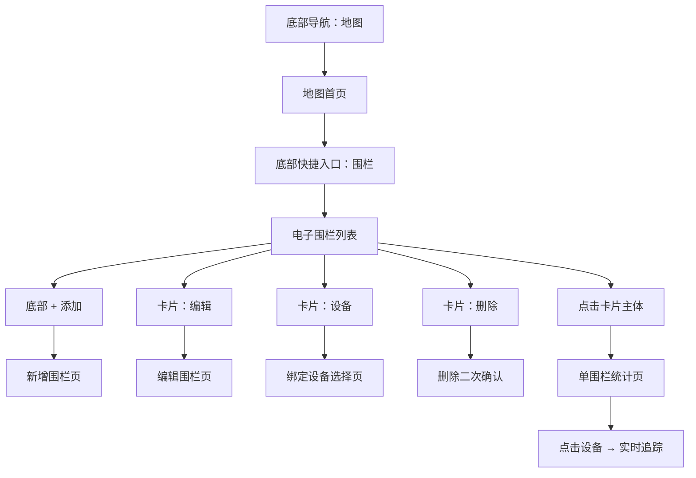
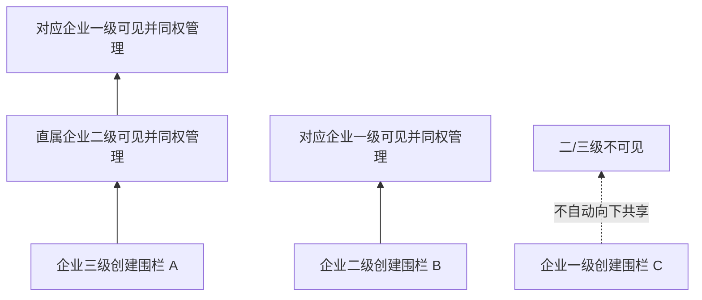
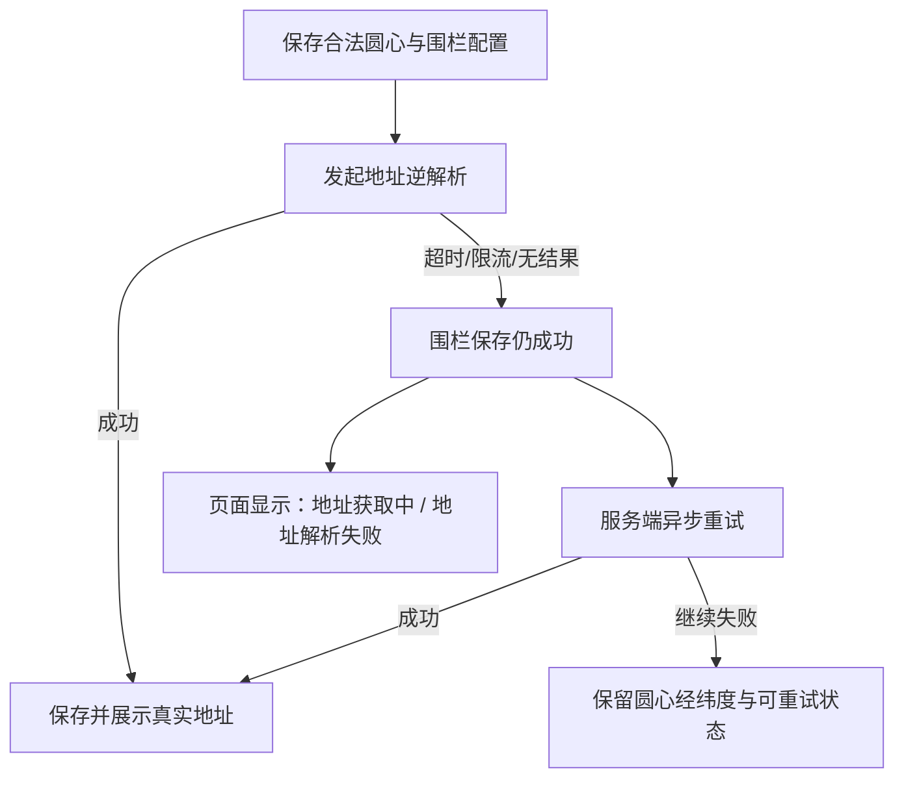
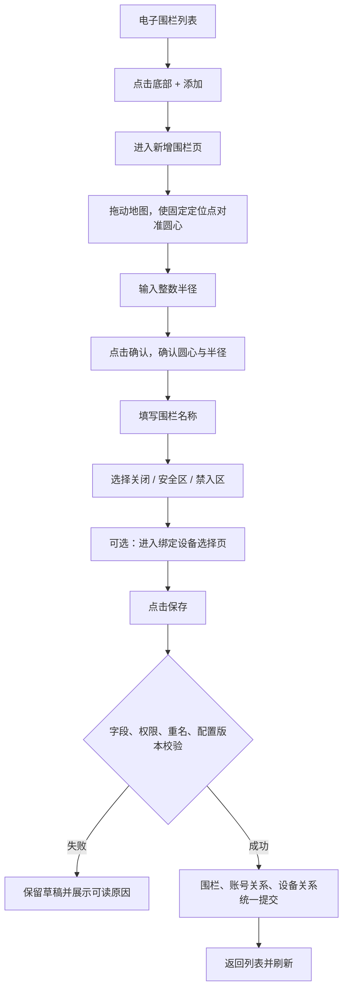
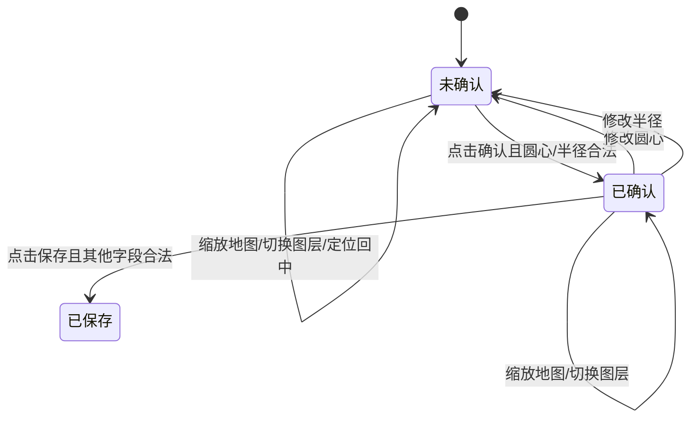
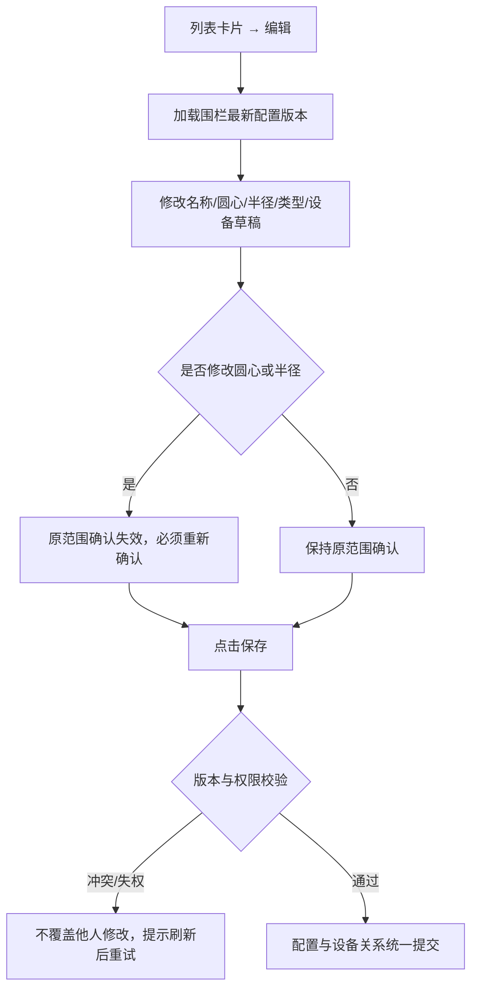
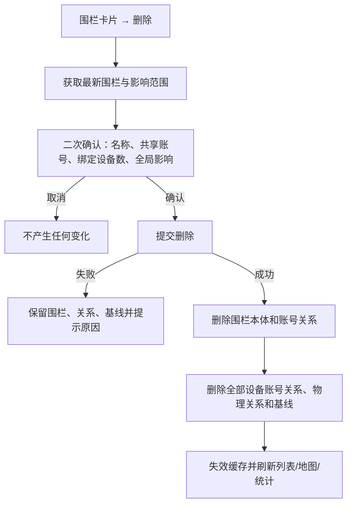
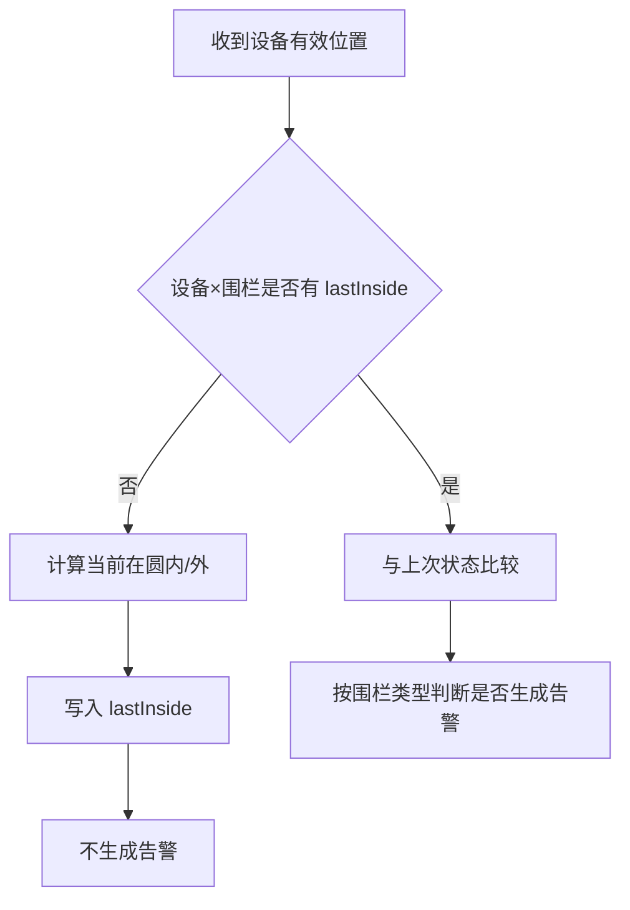
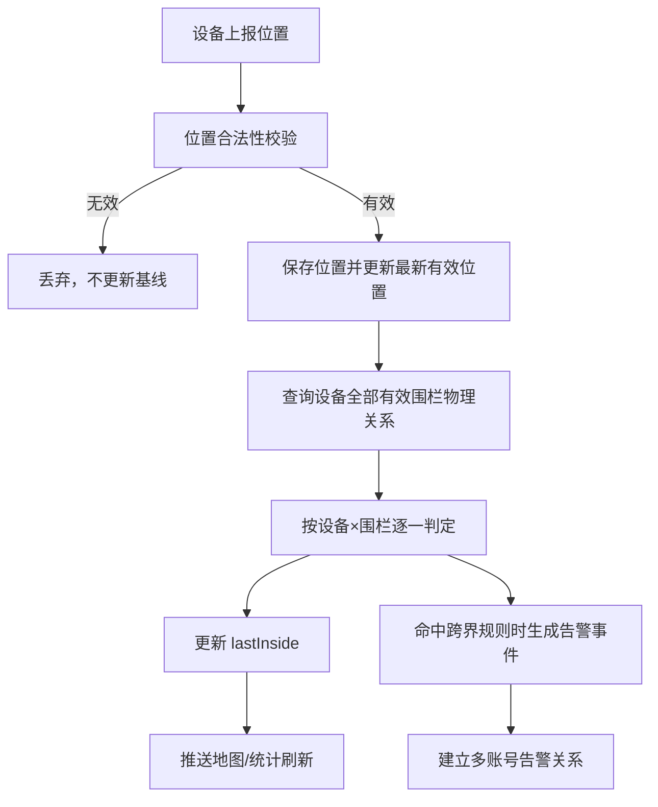

# 革泰 APP 地理围栏逻辑点梳理.plan

<aside>
🎯

**文档用途**：梳理革泰 APP「地理围栏」的入口、围栏增删改查、账号关联、设备绑定、跨界判定、统计展示及模块联动，作为后续原型完善、接口契约确认和测试用例编写的依据。

**当前产品范围**：革泰 APP 只实现**圆形围栏**，围栏类型仅包含「关闭、​​安全区、禁入区」三种。不实现其他平台已有的多边形围栏、区域围栏或“设备只要位于区域内便每次报位都报警”的能力。

**口径优先级**：当前革泰 APP 原型图与 `02-地理围栏场景梳理.md` 为主口径；Notion 中原监控平台的多边形围栏、WGS84→GCJ02 转换、按账号重复判定等内容仅用于补充联动、识别旧系统差异和暴露风险，不直接作为本期 APP 验收标准。

**通知边界**：本大纲只定义围栏告警的生成、可见、处理关系及统计联动；微信、公众号、短信、电话、邮件、紧急联系人、防骚扰窗口等通知渠道和对象由告警/通知模块另行描述，本大纲不展开。

</aside>

---

## 1. 核心概念与本期结论

### 1.1 先区分五个对象

| 对象 | 定义 | 唯一性 / 关键属性 |
| --- | --- | --- |
| 围栏 | 当前账号创建或通过企业账号链向上共享的圆形地理范围 | 围栏唯一 ID；名称、圆心、半径、类型、地址、创建账号、配置版本 |
| 围栏账号关系 | 账号对围栏的可见和管理关系 | 企业子级创建后向直属父级、祖父级同步；个人账号独立 |
| 设备可见关系 | 账号是否有权查看和操作某设备 | 来源于设备直接绑定或企业父级分配，规则由设备管理模块定义 |
| 围栏设备物理关系 | 一台设备是否实际参与某围栏的地理判定 | 同一 `设备 × 围栏` 只保留一条有效物理关系和一份 `lastInside` 基线 |
| 围栏设备账号关系 | 哪些账号可在该围栏中看到、管理该设备及接收对应告警关系 | 由围栏可见范围与账号设备可见范围共同决定 |

### 1.2 本期围栏形态与类型

| 类型 | 列表标签 | 是否参与地理判定 | 告警方向 | 反方向行为 |
| --- | --- | --- | --- | --- |
| 关闭 | 灰色「关闭」 | ❌ | 不生成围栏告警 | 不更新跨界告警，但绑定关系保留 |
| 安全区 | 绿色「安全区」 | ✅ | 设备由圆内到圆外时生成「离开安全区」告警 | 圆外到圆内只更新状态，不生成进入告警 |
| 禁入区 | 橙色「禁入区」 | ✅ | 设备由圆外到圆内时生成「进入禁入区」告警 | 圆内到圆外只更新状态，不生成离开告警 |

- 当前只支持圆形围栏：圆心 + 半径。
- 列表右上角类型标签只用于展示，**不可直接点击切换**。
- 修改类型必须进入编辑页，随其他配置统一保存。
- 新增围栏默认类型为「关闭」，默认值即有效选择，不存在“类型未选择”状态。

### 1.3 当前正式结论

<aside>
⚠️

1. **入口唯一主路径**：地图首页 → 围栏 → 电子围栏列表。
2. **企业围栏向上共享**：三级创建同步给二级、一级；二级创建同步给一级；一级创建不自动向下共享；个人围栏只属于个人账号。
3. **共享围栏同权**：企业链中已获得围栏关系的账号均可查看、编辑、删除和管理设备；任一账号删除共享围栏都会对其他关联账号全局生效。
4. **设备绑定双向扩散**：企业链任一账号把设备绑定到共享围栏后，同一围栏链路内所有同时拥有该设备的账号自动获得围栏设备账号关系；没有该设备可见权的账号不展示该设备。
5. **设备解绑向下级联**：账号从围栏解绑设备时，删除操作账号及其下游子级的围栏设备账号关系，父级关系不受影响。
6. **地理判定不按账号重复执行**：同一 `设备 × 围栏` 只有一份物理关系、一份 `lastInside` 和一次跨界判定；一次真实跨界只生成 1 条告警事件，再建立多账号可见/处理关系。
7. **部分账号解绑不重置唯一基线**：只要仍有任一有效账号关系，物理关系与 `lastInside` 保留；最后一个账号关系删除后，才删除物理关系并清空基线。
8. **首次有效位置不报警**：新建物理绑定、全部解绑后重绑、圆心/半径/类型发生影响判定的变更后，第一条有效位置只建立基线。
9. **名称唯一性**：企业一级—二级—三级整条账号链内围栏名称全局唯一；个人账号仅在自己的围栏范围内唯一。
10. **通知不在本大纲展开**：只定义告警事件及账号关系，不定义外部通知渠道和频控。

</aside>

---

## 2. 围栏入口与页面链路

### 2.1 主入口

### 2.2 地图首页入口

| 区域 | 当前原型 | 围栏联动 |
| --- | --- | --- |
| 底部导航 | 地图、设备、告警、我的 | 围栏从「地图」模块进入，不增加设备页或我的页常规入口 |
| 地图底部快捷区 | 实时追踪、围栏、全图概览 | 点击「围栏」进入电子围栏列表 |
| 地图设备点位 | 聚合点、单设备点位、告警角标 | 围栏配置、设备最新位置和未处理告警变化后需最终一致刷新 |
| 地图状态数量 | 设备、在线、离线、告警 | 统计口径由地图首页模块定义；不能直接套用单围栏统计口径 |

### 2.3 页面职责边界

| 页面 | 主要职责 | 不负责的内容 |
| --- | --- | --- |
| 电子围栏列表 | 搜索、查看摘要、新增、编辑、设备管理、删除、进入统计 | 不直接切换围栏类型 |
| 新增/编辑围栏页 | 设置名称、圆心、半径、类型和设备草稿并统一保存 | 不在字段变化时立即写服务端正式关系 |
| 绑定设备选择页 | 搜索、分组、多选、确认本次设备调整 | 不修改设备本体、设备分组或账号设备归属 |
| 单围栏统计页 | 展示地图、在线/离线/告警数量、筛选设备和进入实时追踪 | 不承担通知设置和告警渠道配置 |
| 实时追踪页 | 查看被点击设备最新有效位置 | 不改变围栏配置和判定基线 |

---

## 3. 账号类型、围栏归属与权限

### 3.1 账号与围栏创建/共享矩阵

| 账号类型 | 能否创建围栏 | 围栏同步范围 | 能否管理已同步围栏 | 设备候选范围 |
| --- | --- | --- | --- | --- |
| 个人账号 | ✅ | 仅当前个人账号 | ✅ 自己创建的围栏 | 当前个人账号可见设备 |
| 企业一级账号 | ✅ | 仅企业一级；不因创建自动下发给二/三级 | ✅ 自己创建及下级向上同步的围栏 | 当前一级账号可见设备 |
| 企业二级账号 | ✅ | 当前二级 + 直属一级 | ✅ 自己创建及三级向上同步的围栏 | 当前二级账号可见设备 |
| 企业三级账号 | ✅ | 当前三级 + 直属二级 + 对应一级 | ✅ 自己创建及链路共享的围栏 | 当前三级账号可见设备 |

### 3.2 企业围栏向上共享关系

- 围栏保留原创建账号标识，用于审计、账号删除级联和历史追溯。
- 向上共享不是复制三份围栏；所有账号操作的是同一围栏 ID 和同一配置版本。
- 同一共享链内围栏名称全局判重，避免向上汇总后出现无法区分的同名围栏。
- 企业不同一级分支之间相互隔离，不得通过搜索、缓存、链接或告警消息读取其他企业链围栏。
- 个人围栏与企业围栏完全隔离，即使同一物理设备同时存在个人和企业绑定，也不共享围栏本体。

### 3.3 共享围栏同权规则

企业链内已经获得围栏关系的账号，对同一共享围栏具备相同管理能力：

- 查看围栏列表与统计；
- 编辑名称、圆心、半径和类型；
- 绑定或解绑当前账号有权设备；
- 删除围栏；
- 查看和处理由该围栏事件建立给当前账号的告警关系。

<aside>
❗

**高风险规则**：任一共享账号删除围栏，都会删除同一围栏本体，其他账号中的该围栏同步消失。删除确认必须展示围栏名称、创建账号、当前共享账号范围、绑定设备数量，并明确提示“删除后其他关联账号也将无法继续使用此围栏”。

</aside>

### 3.4 账号冻结与删除

| 账号动作 | 围栏本体 | 围栏判定 | 其他账号可见性 | 历史告警 |
| --- | --- | --- | --- | --- |
| 冻结账号 | 保留 | 继续执行 | 已共享给父级的围栏继续可见和可管理 | 保留 |
| 解冻账号 | 保留 | 延续原有效关系 | 恢复登录后按最新服务端数据展示 | 保留 |
| 删除账号 | 删除该账号创建的围栏 | 对应围栏立即停止判定 | 所有关联账号同步失去该围栏 | 历史告警及发生时快照保留 |

- 删除账号不得删除设备本体、历史位置、历史轨迹或其他账号创建的围栏。
- 删除账号引起的围栏删除应复用围栏删除的数据清理规则，不得留下缓存、物理绑定或幽灵判定。

---

## 4. 围栏列表、搜索与加载

### 4.1 围栏卡片字段

| 区域 | 展示内容 | 规则 |
| --- | --- | --- |
| 地图缩略图 | 圆心及圆形范围摘要 | 应与当前已保存圆心、半径一致；不得继续展示旧配置 |
| 主标题 | 围栏名称 | 单行尾部省略；使用归一化后的正式名称 |
| 半径 | `半径：N m` | 与服务端正式值一致 |
| 地址 | 圆心逆地理编码结果 | 地址解析中或失败时按 4.4 处理 |
| 绑定设备 | `已绑定：N 台设备` 或未绑定提示 | N 按当前账号可见设备与围栏设备账号关系交集去重 |
| 类型标签 | 关闭 / 安全区 / 禁入区 | 只展示，不响应快捷切换 |
| 操作区 | 编辑、设备、删除 | 与卡片主体点击区域隔离 |

### 4.2 卡片点击与操作隔离

1. 点击卡片主体进入该围栏统计页。
2. 点击编辑、设备、删除时，不得先触发卡片主体跳转。
3. 所有跳转携带围栏唯一 ID，不能用名称、列表索引或缩略图定位围栏。
4. 从编辑、设备选择或统计页返回时，保留进入前的名称关键词、滚动位置和已加载分页数据；若围栏已被其他账号删除，则移除失效卡片并提示。

### 4.3 名称搜索

| 项 | 正式规则 |
| --- | --- |
| 搜索字段 | 围栏名称 |
| 匹配方式 | 包含匹配；英文大小写不敏感 |
| 输入归一化 | 搜索前去除关键词首尾空格；内部空格保留 |
| 空关键词 | 恢复当前账号全部可见围栏 |
| 组合范围 | 只在当前账号有权围栏范围内搜索，不扩大权限 |
| 无结果 | 展示“未找到匹配围栏”，保留新增入口 |
| 条件变化 | 关键词变化后从第一页重新查询，不在旧分页结果上本地过滤 |

### 4.4 服务端分页与刷新方案

1. 围栏列表和名称搜索统一使用服务端分页。
2. APP 支持下拉刷新和上拉加载更多。
3. 首次进入、下拉刷新、账号切换、关键词变化后，从第一页重新查询。
4. 默认稳定排序：`更新时间倒序 + 围栏唯一 ID 倒序`。
5. 翻页结果按围栏唯一 ID 去重；同一围栏被共享关系命中多次时只展示一张卡片。
6. 页大小由接口契约或服务端配置确定，APP 不写死业务上限。
7. 加载下一页失败时保留已加载数据，展示可重试入口；不得把失败当作“没有更多”。
8. 第一页失败时保留上一次有效数据并展示失败状态；不得用空数组冒充账号无围栏。

### 4.5 地址解析与异常兜底

- 地址是圆心的派生展示信息，不是围栏地理判定前置。
- 不使用 `0.0.0.0` 作为地址兜底。
- 地址解析失败不得回滚已成功保存的名称、圆心、半径、类型和设备关系。
- 地址更新只刷新展示字段，不清空 `lastInside`，不触发跨界告警。

---

## 5. 新增围栏

### 5.1 新增入口与主流程

### 5.2 新增字段与校验

| 字段 | 是否必填 | 规则 | 失败结果 |
| --- | --- | --- | --- |
| 围栏名称 | ✅ | 保存前自动去除首尾空格；纯空格禁止；内部空格保留；1～30 字符 | 停留页面并提示名称要求 |
| 名称唯一性 | ✅ | 企业链全局不重名；个人账号范围内不重名 | 提示围栏名称已存在 |
| 圆心 | ✅ | 合法 WGS84 经纬度；由拖动地图选择 | 未设置时禁止保存 |
| 半径 | ✅ | 整数，50～20000 米 | 空、非整数、越界均禁止确认/保存 |
| 范围确认 | ✅ | 圆心或半径变更后必须重新点击「确认」 | 未确认时保存按钮不可用或保存被阻止 |
| 类型 | ✅，有默认 | 默认关闭；关闭、安全区、禁入区三选一 | 不允许提交未知类型 |
| 绑定设备 | ❌ | 可为空；只能选择当前账号可见且支持定位的设备 | 越权设备拒绝绑定，不影响合法设备草稿 |
| 地址 | 派生 | 保存圆心后异步解析 | 失败不阻断保存，按 4.5 处理 |

### 5.3 范围确认状态机

- 「确认」只确认当前圆心和半径组合，不等于保存围栏。
- 地图缩放只改变视觉比例，不改变实际半径。
- 图层切换、缩放控件、定位回中不得被误识别为用户拖动圆心。
- 确认后继续修改半径或移动地图，原确认立即失效。

### 5.4 新建草稿与事务边界

1. 名称、圆心、半径、类型和预选设备在保存前均为本地草稿。
2. 从绑定设备页确认选择，只更新新增页草稿，不立即创建正式设备关系。
3. 点击取消或直接返回：不创建围栏、不创建账号关系、不创建设备关系、不建立基线、不生成告警。
4. 点击保存成功：围栏本体、围栏账号关系、设备物理关系和设备账号关系按一个业务事务提交。
5. 任一部分失败时不得出现“围栏已创建但设备关系半成功”或“列表显示已保存但刷新后消失”。
6. 网络超时后重试必须幂等，不能创建两个内容相同但 ID 不同的围栏。

---

## 6. 查看与查询围栏

### 6.1 列表查看

用户可在列表直接查看：

- 围栏名称；
- 当前圆心及范围缩略图；
- 半径；
- 地址；
- 当前账号可见的绑定设备数；
- 关闭/安全区/禁入区类型；
- 编辑、设备、删除入口。

### 6.2 单围栏统计页结构

| 区域 | 展示内容 | 规则 |
| --- | --- | --- |
| 页面标题 | 围栏名称 | 名称变更后使用最新名称 |
| 地图区域 | 圆形范围、当前可见绑定设备点位 | 无效位置不显示；不得串入其他围栏设备 |
| 状态统计 | 在线、离线、告警 | 在线/离线互斥；告警可与在线或离线叠加 |
| 状态筛选 | 在线、离线、告警 | 单选；筛选条件与设备分组、关键词取交集 |
| 设备搜索 | 编号、名称、备注、序列号 | 模糊匹配；忽略关键词首尾空格；英文大小写不敏感 |
| 分组筛选 | 当前账号可用设备分组 | 只影响当前账号设备展示，不改变围栏绑定关系 |
| 设备行 | 设备标识、名称/备注、在线状态、围栏告警状态 | 点击进入对应设备实时追踪 |

### 6.3 统计口径

<aside>
⚠️

1. 在线和离线是互斥基础状态。
2. 初始化未连接、从未有效上报的绑定设备统一计入离线。
3. `在线数 + 离线数 = 当前账号在该围栏中可见的绑定设备去重数`。
4. 告警数按“至少存在一条当前未处理围栏告警的设备数”去重，不按告警记录条数累计。
5. 同一设备可同时计入「在线 + 告警」或「离线 + 告警」。
6. 围栏统计页告警数与告警中心记录数不是同一口径：前者按设备去重，后者可按事件记录统计。

</aside>

### 6.4 搜索、分组和地图联动

1. 设备状态、分组、关键词三个条件取交集。
2. 修改任一条件不清空其他有效条件。
3. 清空关键词后恢复当前状态 + 分组范围。
4. 设备搜索只过滤下方列表，不从地图删除该围栏已绑定设备点位，避免用户误认为设备已解绑。
5. 页面需区分：
   - 当前分组绑定设备总数；
   - 当前筛选实际显示设备数。
6. “当前显示 N 台”必须与列表实际渲染数量一致，不能拿分组总数替代。
7. 状态筛选是否同步过滤地图点位，当前原型与大纲未形成一致规则，列入第 14 节待确认项。

### 6.5 实时追踪下钻

- 点击设备行进入被点击设备实时追踪页。
- 跳转使用设备唯一标识，不使用备注、名称或列表位置。
- 离线设备仍可进入，由实时追踪页展示最后有效位置与离线状态。
- 返回围栏统计页后保留围栏 ID、状态筛选、分组、关键词和滚动位置。
- 实时追踪刷新频率不改变服务端围栏判定频率和 `lastInside`。

---

## 7. 编辑围栏

### 7.1 编辑入口与回显

编辑页必须回显：

- 围栏唯一 ID 对应的当前名称；
- 当前圆心；
- 当前半径和圆形范围；
- 当前类型；
- 当前账号可见的已绑定设备及数量；
- 地址解析状态；
- 当前配置版本。

### 7.2 编辑保存规则

- 设备勾选变化只暂存，点击整页保存后正式生效。
- 取消或直接返回时，名称、范围、类型和设备草稿全部丢弃。
- 保存失败时列表继续显示服务端旧配置，不得前端假成功。
- 两个账号同时编辑共享围栏时使用配置版本做乐观锁；后提交者若基于旧版本，应收到冲突提示，而不是静默覆盖。

### 7.3 不同编辑内容对判定的影响

| 变更内容 | 设备物理关系 | `lastInside` | 下一条有效位置 | 告警影响 |
| --- | --- | --- | --- | --- |
| 仅修改名称 | 保持 | 保持 | 正常继续判断 | 新事件使用新名称；历史事件使用发生时快照 |
| 地址异步刷新 | 保持 | 保持 | 正常继续判断 | 不生成告警 |
| 修改圆心 | 保持 | 清空 | 只建立新范围基线 | 不把围栏移动当成设备跨界 |
| 修改半径 | 保持 | 清空 | 只建立新范围基线 | 不把范围伸缩当成设备跨界 |
| 安全区↔禁入区 | 保持 | 清空 | 按新类型建立基线 | 不补历史告警 |
| 切换为关闭 | 保持 | 暂停并清除有效判定基线 | 关闭期间不判断 | 历史告警保留 |
| 关闭后重新启用 | 保持 | 空 | 第一条只建立基线 | 后续真实跨界才告警 |
| 新增设备且物理关系不存在 | 新建 | 空 | 第一条只建立基线 | 首次不报警 |
| 移除部分账号设备关系但仍有其他账号关系 | 保持 | 保持 | 正常继续判断 | 不影响其他账号事件 |
| 移除最后一个账号设备关系 | 删除 | 删除 | 后续重绑时重新建基线 | 解绑动作本身不报警 |

### 7.4 配置生效边界

建议服务端使用配置版本明确位置上报与编辑并发的唯一口径：

1. 编辑事务提交成功前到达的位置使用旧配置版本。
2. 编辑事务提交成功后到达的位置使用新配置版本。
3. 圆心、半径或类型变更与 `lastInside` 清空必须在同一事务边界生效。
4. 告警事件保存配置版本和围栏名称/类型快照，便于追溯事件按哪版规则产生。
5. 缓存不得覆盖数据库最新版本；发现缓存版本落后时应失效并重新加载。

---

## 8. 绑定与解绑设备

### 8.1 绑定设备入口

绑定入口有两处：

1. 围栏列表卡片 → 设备；
2. 新增/编辑围栏页 → 绑定设备。

两处进入同一设备选择能力，差异仅在提交方式：

- 列表卡片进入：确认后直接提交该围栏设备关系调整；
- 新增/编辑页进入：确认后先回到表单草稿，最终随整页保存统一提交。

### 8.2 设备选择页

| 能力 | 规则 |
| --- | --- |
| 设备范围 | 只能查询当前账号设备管理中可见且支持定位的设备 |
| 多选 | 支持同时选择多台设备 |
| 分组 | 支持按当前账号设备分组筛选 |
| 搜索 | 编号、名称、备注、序列号模糊搜索 |
| 勾选保持 | 搜索或切换分组后，其他条件下已勾选设备继续保留 |
| 已选汇总 | 展示已选设备去重数量 |
| 无结果 | 只展示当前条件无结果，不清空已勾选设备 |
| 越权校验 | 提交时服务端重新校验账号对每台设备的最新可见权 |

### 8.3 企业链绑定扩散

设围栏 A 由三级创建并已向二级、一级共享：

| 设备可见范围 | 操作账号绑定 | 自动建立围栏设备账号关系 |
| --- | --- | --- |
| X：一级、二级、三级均可见 | 任一层级 | 一级、二级、三级均显示已绑定 |
| Y：一级、二级可见，三级不可见 | 二级或一级 | 一级、二级建立关系；三级过滤 |
| Z：仅一级可见 | 一级 | 仅一级建立关系 |
| 非当前企业链设备 | 任意账号 | 拒绝绑定，不创建任何关系 |

- 绑定扩散的前提是“账号同时拥有围栏可见关系和设备可见关系”。
- 同一设备重复绑定同一围栏不得重复创建物理关系、账号关系、数量或基线。
- 新增账号关系时，如果该设备×围栏物理关系已经存在，不重置唯一 `lastInside`。
- 只有首次创建物理关系时，`lastInside` 初始化为空。

### 8.4 企业链解绑向下级联

| 操作账号 | 删除的账号关系 | 父级关系 | 物理关系与唯一基线 |
| --- | --- | --- | --- |
| 三级解绑 | 仅三级 | 二级、一级保留 | 仍有关系则保留 |
| 二级解绑 | 二级 + 该二级下游三级 | 一级保留 | 仍有一级关系则保留 |
| 一级解绑 | 一级 + 对应下游二/三级 | 无父级 | 若无其他有效账号关系则删除并清空基线 |
| 个人解绑 | 当前个人 | 企业关系不受影响 | 个人围栏与企业围栏本体独立，按对应围栏关系判断 |

### 8.5 设备管理模块引起的围栏级联

| 设备关系变化 | 围栏设备账号关系 | 物理关系 | 历史数据 |
| --- | --- | --- | --- |
| 个人解绑自己的设备 | 清除个人账号对应关系 | 无其他账号关系时删除 | 保留历史位置、轨迹、告警 |
| 企业一级解绑设备 | 清除一级及其下游分配链的围栏账号关系 | 无其他有效关系时删除 | 保留 |
| 企业二级失去父级分配 | 清除二级及其下三级围栏账号关系 | 仍有一级关系则保留 | 保留 |
| 企业三级失去设备 | 只清除三级围栏账号关系 | 仍有父级关系则保留 | 保留 |
| 管理后台改绑企业一级 A→B | 清除 A 链路关系；B 获得设备后不自动继承 A 原围栏关系 | 按各围栏剩余关系决定 | 保留 |
| 重新绑定/重新分配设备 | 不自动恢复已清理的围栏账号关系 | 需用户重新绑定围栏 | 保留 |

---

## 9. 删除围栏

### 9.1 删除主流程

### 9.2 删除成功后的数据后果

1. 删除同一围栏 ID 的围栏本体。
2. 删除企业链或个人账号的围栏可见关系。
3. 删除所有围栏设备账号关系。
4. 删除所有对应设备×围栏物理关系和 `lastInside`。
5. 清理地址、缩略图和围栏配置缓存。
6. 不删除设备本体、设备账号绑定、设备分组、位置轨迹或物联网卡关系。
7. 不影响设备在其他围栏中的关系、基线和告警。
8. 删除动作本身不生成进入或离开告警。
9. 已处理、未处理历史围栏告警均保留，未处理告警不自动变成已处理。
10. 历史告警通过事件发生时保存的围栏名称、类型、圆心、半径和配置版本快照继续展示。
11. 删除生效后，设备继续上报不得触发已删围栏的幽灵判定或幽灵告警。

### 9.3 删除失败与重复操作

- 删除失败时前端不得提前移除卡片或解绑设备。
- 网络超时后重复提交删除需幂等：已删除返回可识别成功/不存在结果，不重复产生副作用。
- 两个共享账号同时删除同一围栏，只允许一次真实删除；另一请求不得报服务端异常或残留部分关系。
- 删除与编辑并发时，以服务端事务和配置版本为准，不能出现围栏本体已删但缓存/设备关系仍在。

---

## 10. 圆形判定、首次基线与告警生成

### 10.1 坐标与圆内判断

- 革泰海外版当前口径统一使用 WGS84 坐标，不执行原国内平台的 WGS84→GCJ02 偏移转换。
- 终端位置与围栏圆心使用同一坐标系计算球面距离。
- 推荐使用 Haversine 等球面距离算法。
- `距离 ≤ 半径` 视为圆内，`距离 > 半径` 视为圆外；边界点归入圆内，保证结果确定。
- 地图视觉圆形、服务端判定和统计页点位应使用同一圆心与半径版本。

### 10.2 有效位置前置

以下位置不参与围栏判定，也不更新 `lastInside`：

- 经纬度对象为空；
- 经度或纬度为 0；
- 经度不在 `[-180, 180]`；
- 纬度不在 `[-90, 90]`；
- 位置无法归属到当前设备；
- 已确认是乱序旧数据且会覆盖当前判定状态的报文。

定位时间超前服务器当前时间 10 分钟以上时，可按位置处理模块规则校正时间后再进入围栏判定。

### 10.3 首次定位

触发“首次定位只建基线”的场景：

- 新设备首次绑定该围栏；
- 所有账号关系已解绑，后续重新绑定；
- 围栏圆心变化；
- 围栏半径变化；
- 安全区与禁入区互相切换；
- 关闭后重新启用；
- 管理端执行明确的围栏判定状态初始化。

### 10.4 状态跃迁决策表

| 围栏类型 | 上次状态 | 本次状态 | 是否生成告警 | 事件 |
| --- | --- | --- | --- | --- |
| 关闭 | 任意 | 任意 | ❌ | 不判断 |
| 安全区 | 首次 | 内/外 | ❌ | 只记录基线 |
| 安全区 | 内 | 外 | ✅ | 离开安全区 |
| 安全区 | 外 | 内 | ❌ | 更新为内 |
| 安全区 | 内 | 内 | ❌ | 状态不变 |
| 安全区 | 外 | 外 | ❌ | 状态不变 |
| 禁入区 | 首次 | 内/外 | ❌ | 只记录基线 |
| 禁入区 | 外 | 内 | ✅ | 进入禁入区 |
| 禁入区 | 内 | 外 | ❌ | 更新为外 |
| 禁入区 | 内 | 内 | ❌ | 状态不变 |
| 禁入区 | 外 | 外 | ❌ | 状态不变 |

### 10.5 告警事件粒度

<aside>
✅

**一次物理跨界 = 一条围栏告警事件。**

告警事件按 `设备 × 围栏 × 跨界事件` 唯一生成，不按企业一级/二级/三级账号重复复制。事件生成后，再为当前有权账号建立告警可见/处理关系。

</aside>

告警事件至少保存：

- 事件唯一标识/幂等键；
- 设备唯一标识；
- 围栏唯一标识；
- 围栏名称快照；
- 围栏类型快照；
- 圆心、半径或配置版本快照；
- 进入/离开方向；
- 发生位置；
- 位置时间与服务端接收时间；
- 处理状态关系；
- 有权账号关系。

### 10.6 告警与状态联动

- 返回安全区或离开禁入区不会自动处理此前未处理告警。
- 人工处理旧告警后，设备再次真实跨界应生成新事件。
- 设备离线不删除或自动处理未处理围栏告警。
- 设备处于 SOS 时仍可生成围栏告警；SOS 状态不被围栏事件覆盖。
- 一个围栏判定异常不得阻断同一设备其他围栏的判断。
- 告警通知渠道、对象、频控由告警/通知模块定义，本大纲不展开。

---

## 11. 多围栏、重叠与嵌套

### 11.1 独立判定原则

- 一台设备可绑定多个围栏。
- 每个 `设备 × 围栏` 维护独立物理关系、配置版本和 `lastInside`。
- 同一位置上报依次对全部有效围栏执行判断。
- 一次位置可同时触发多个围栏事件，每个围栏各生成一条事件。
- 围栏 A 异常、缓存失败或配置失效不得阻断围栏 B。
- 多围栏可以重叠或嵌套，不因空间关系自动合并。

### 11.2 两个围栏代表性组合

设圆形围栏 α、β 均为启用状态：

| 本次位置区域 | α 上次状态 | β 上次状态 | 代表结果 |
| --- | --- | --- | --- |
| α∩β 交叉区 | 外 | 外 | α、β 分别按自身类型判断，最多生成 2 条事件 |
| α 独占区 | 外 | 内 | α 可能进入；β 可能离开，方向可相反 |
| β 独占区 | 内 | 外 | α 可能离开；β 可能进入，方向可相反 |
| 两围栏外 | 内 | 内 | α、β 分别可能产生离开方向事件 |
| 任一围栏首次 | 空 | 任意 | 首次围栏只建自己的基线，不影响另一围栏正常判断 |

具体是否报警仍需套用围栏类型：

- 安全区只对内→外报警；
- 禁入区只对外→内报警；
- 关闭不判断。

### 11.3 嵌套围栏代表性场景

设大圆 α 完全包含小圆 β：

| 移动路径 | 空间变化 | 可能事件 |
| --- | --- | --- |
| α 外 → α 内 β 外 | 只进入大圆 | 仅 α 按类型判断 |
| α 内 β 外 → β 内 | 进入小圆，仍在大圆内 | 仅 β 按类型判断 |
| β 内 → α 内 β 外 | 离开小圆，仍在大圆内 | 仅 β 按类型判断 |
| β 内 → α 外 | 同时离开小圆和大圆 | α、β 各自判断，最多 2 条事件 |
| GPS 跳点造成历史状态不符合嵌套几何约束 | 状态组合异常 | 仍按各围栏独立 `lastInside` 判断，并记录诊断日志 |

---

## 12. 模块联动

### 12.1 与设备管理联动

- 围栏设备候选集来自当前账号设备管理可见范围。
- 设备备注、名称、编号和序列号与设备管理使用同一数据源。
- 设备解绑、分配回收、后台改绑时，按第 8.5 节清理围栏账号关系。
- 设备重新绑定或重新分配后，原围栏关系不自动恢复。
- 围栏解绑不等于设备解绑，不修改设备本体、分组、物联网卡和账号设备归属。

### 12.2 与地图首页联动

- 地图首页提供围栏入口。
- 围栏新增、编辑、删除后，地图范围最终与服务端正式配置一致。
- 地图缩略图和统计页范围不得使用旧缓存。
- 无效位置不得把设备点位移动到 `(0,0)` 或异常坐标。
- 地图首页全局数量与单围栏数量属于不同统计域，不能互相替代。

### 12.3 与位置处理联动

### 12.4 与告警中心联动

- 围栏告警进入告警中心并携带围栏和设备快照。
- 告警处理状态变化后，围栏统计页告警设备数同步刷新。
- 围栏删除、关闭或设备解绑不自动处理历史告警。
- 同一事件只生成一条告警详情，可为多个有权账号建立处理关系。
- 多个账号对同一告警的处理状态是否全局同步，以告警模块统一规则为准；本大纲不重复定义通知和处理审批流程。

### 12.5 与实时追踪联动

- 从单围栏统计页点击设备进入实时追踪。
- 实时追踪显示最近有效位置，不展示无效坐标。
- 返回后保留原围栏统计上下文。
- 实时追踪刷新和围栏判定共用位置事实，但二者刷新频率不等同。

### 12.6 与账号/组织联动

- 企业子级围栏向上共享，个人与企业隔离。
- 企业链围栏名称全局判重。
- 冻结账号只限制登录，不中断围栏判定。
- 删除账号级联删除该账号创建的围栏，并触发全局清理。
- 权限变化后，APP 重新查询服务端最新账号、围栏和设备关系，不继续使用旧缓存展示受保护数据。

---

## 13. 异常、并发与幂等

### 13.1 请求失败

| 操作 | 失败时预期 |
| --- | --- |
| 新增失败 | 不新增列表假数据；草稿保留，可重试 |
| 编辑失败 | 正式配置保持旧值；草稿保留；不提前清基线 |
| 删除失败 | 围栏、关系、基线继续存在；卡片不消失 |
| 绑定失败 | 不建立部分账号关系或部分物理关系 |
| 解绑失败 | 原关系和基线保持；不得前端显示已解绑 |
| 地址解析失败 | 围栏保存成功；地址进入异步重试状态 |
| 列表加载失败 | 保留上次有效数据并支持重试 |
| 统计加载失败 | 不用全 0 冒充真实统计结果 |

### 13.2 并发场景

| 并发 | 建议裁决 |
| --- | --- |
| 两个共享账号同时编辑 | 配置版本乐观锁；后提交旧版本失败并提示刷新 |
| 编辑圆心/半径与位置上报同时发生 | 以编辑事务提交时间为边界；新配置与基线清空原子生效 |
| 删除与位置上报同时发生 | 删除提交后不得再生成该围栏事件；提交前已形成的合法事件可保留 |
| 绑定与位置上报同时发生 | 物理关系提交后第一条有效位置只建基线 |
| 最后一个账号解绑与位置上报同时发生 | 解绑提交后停止判定；不得重建幽灵关系 |
| 两账号同时绑定同一设备 | 物理关系唯一；账号关系去重；只初始化一次基线 |
| 两账号同时删除围栏 | 只执行一次真实删除，其余请求幂等返回 |

### 13.3 幂等建议

- 新增围栏：客户端请求 ID / 业务幂等键；
- 编辑围栏：围栏 ID + 配置版本；
- 删除围栏：围栏 ID；
- 设备绑定：围栏 ID + 设备 ID + 账号 ID；
- 设备物理关系：围栏 ID + 设备 ID 唯一；
- 位置报文：设备 ID + 定位时间 + 序列号/报文唯一标识；
- 告警事件：设备 ID + 围栏 ID + 前后状态 + 位置报文唯一标识 + 配置版本。

### 13.4 缓存一致性

- 围栏新增、编辑、删除后主动失效对应缓存。
- 缓存必须携带围栏配置版本。
- 缓存版本落后于数据库时，以数据库为准并重建缓存。
- 删除后缓存不存在，不得从旧缓存继续判定。
- 单个围栏缓存异常只影响该围栏并记录日志，不阻断其他围栏。

---

## 14. 待确认项

以下内容没有被当前原型、主大纲或本轮确认完整裁决，不能直接作为正式验收通过标准：

| 待确认项 | 当前已知 | 建议 |
| --- | --- | --- |
| 状态筛选是否过滤地图点位 | 设备搜索只过滤列表已明确；状态筛选未明确 | 建议状态筛选同时过滤列表和地图，搜索只过滤列表 |
| 围栏排序是否允许手工调整 | 当前方案为更新时间倒序 | 若无手工排序需求，保持稳定服务端排序 |
| 围栏数量上限 | 未给出固定数值 | APP 不写死，读取服务端配置并展示可读提示 |
| 补传历史位置是否参与判定 | 旧位置不得倒退当前状态已明确 | 建议仅时间晚于当前判定基线的位置参与实时围栏判断 |
| 同一时间戳不同坐标 | 幂等键无法只依赖时间 | 使用设备报文序列号或原始消息 ID 裁决 |
| 地图定位回中目标 | 原型有定位控件但语义未明确 | 明确回用户当前位置、设备位置还是围栏圆心 |
| 未保存返回确认 | 取消不生效已明确 | 表单有变化时建议弹出“放弃修改”确认 |
| 多账号处理同一告警 | 一条事件、多账号关系已明确 | 处理结果是否全局同步由告警模块确认 |
| 地址长期解析失败 | 已确定保存并后台重试 | 需确认最大重试次数、人工刷新入口和长期展示文案 |
| 大量围栏性能 | 使用服务端分页已明确 | 需压测单设备绑定大量围栏时的位置判定耗时 |

---

## 15. 原型与旧平台差异

| 维度 | 革泰 APP 当前口径 | 旧平台/参考 Notion | 本期处理 |
| --- | --- | --- | --- |
| 围栏形态 | 圆形：圆心 + 半径 | 多边形顶点 | 旧多边形不纳入 APP |
| 围栏类型 | 关闭、安全区、禁入区 | 普通进出围栏、区域内持续报警等 | 区域围栏不实现 |
| 坐标系 | WGS84 统一判定 | 国内平台 WGS84→GCJ02 | 以革泰 WGS84 为准 |
| 类型切换 | 进入编辑页统一保存 | 旧大纲曾描述列表快捷切换 | 列表标签只展示 |
| 告警事件粒度 | 一次跨界 1 条事件 + 多账号关系 | 旧规则可能按账号独立判定并产生重复事件 | 采用单事件模型 |
| 判定基线 | 设备×围栏唯一 | 旧文档按账号×设备×围栏独立 | 采用唯一物理基线 |
| 账号关系 | 企业子级围栏向上共享，同权 | 旧平台已有类似规则 | 沿用共享逻辑，但修正重复判定 |
| 通知 | 本大纲不展开 | 旧文档包含微信、短信、电话和频控 | 由告警/通知模块承接 |
| 地址失败 | 保存成功 + 后台重试 | 旧大纲曾出现 `0.0.0.0` / 未定位 | 不展示技术兜底值 |

---

## 16. 易错点汇总

<aside>
❗

1. **围栏标签不是快捷开关**：关闭/安全区/禁入区只在编辑页修改。
2. **共享围栏不是多份围栏**：企业三级、二级、一级看到的是同一围栏 ID。
3. **设备绑定扩散不等于设备分配**：只给同时有围栏权和设备权的账号建立围栏账号关系，不改变设备归属。
4. **账号关系可以多条，地理基线只能一份**：不能因为三个账号可见就执行三次判定、生成三条相同告警。
5. **部分账号解绑不能误清唯一基线**：仍有其他账号关系时继续正常判定。
6. **最后一个账号解绑才删除物理关系**：重绑后第一条有效位置重新建基线。
7. **配置变更不是设备跨界**：圆心、半径、类型变化后重新初始化，不立即生成告警。
8. **名称修改不重置基线**：只影响后续事件展示名称，历史事件使用快照。
9. **围栏删除不删除设备和历史告警**：只删除当前围栏及其有效关系。
10. **返回安全区不自动处理旧告警**：事件处理与当前地理位置分离。
11. **告警数不是告警记录数**：围栏统计按存在未处理告警的设备去重。
12. **列表失败不等于空列表**：接口异常不能渲染成账号没有围栏。
13. **地址失败不阻断围栏**：圆心和半径是判定真源，地址只是派生展示。
14. **个人与企业隔离**：同一物理设备双绑不代表围栏共享。
15. **删除共享围栏影响整条关联链**：确认弹窗必须明确展示全局影响。

</aside>

---

## 17. 资料索引

### 17.1 本地资料

- `docs/manuals/革泰/逻辑大纲/02-地理围栏场景梳理.md`
- `docs/manuals/革泰/逻辑大纲/革泰 APP 设备管理逻辑点梳理 plan.md`
- `assets/革泰/围栏/1.png`：电子围栏列表
- `assets/革泰/围栏/2.png`：编辑围栏
- `assets/革泰/围栏/3.png`：单围栏统计
- `assets/革泰/围栏/4.png`：地图首页及围栏入口

### 17.2 Notion 参考资料

- 位置处理流程：`https://app.notion.com/p/40a5667c6d3a83bf822781c4701f5146`
- SOS 报警流程：`https://app.notion.com/p/d2d5667c6d3a82d49931016718d9d176`
- 其他平台区域围栏组合规则：`https://app.notion.com/p/a415667c6d3a83948e5c819b242d94d0`
- 旧平台围栏 CRUD、账号关联与测试大纲：`https://app.notion.com/p/b2d5667c6d3a833cbb96013ec4b09287`

### 17.3 适用声明

Notion 资料中涉及多边形围栏、区域内持续报警、国内坐标转换、按账号独立基线和具体通知渠道的内容，不直接作为革泰 APP 当前验收口径；只有本大纲明确吸收并写入正文的账号共享、位置校验、首次基线、历史保留和异常一致性原则，才纳入当前逻辑模型。
