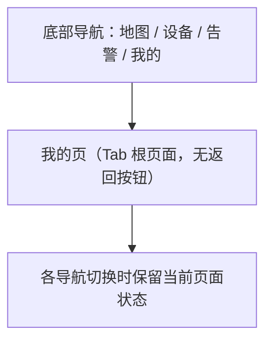
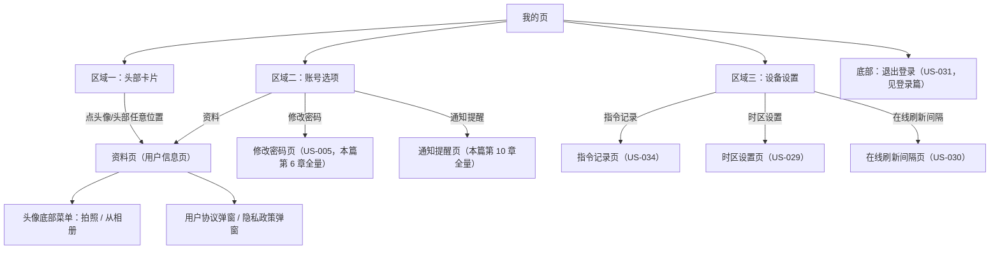
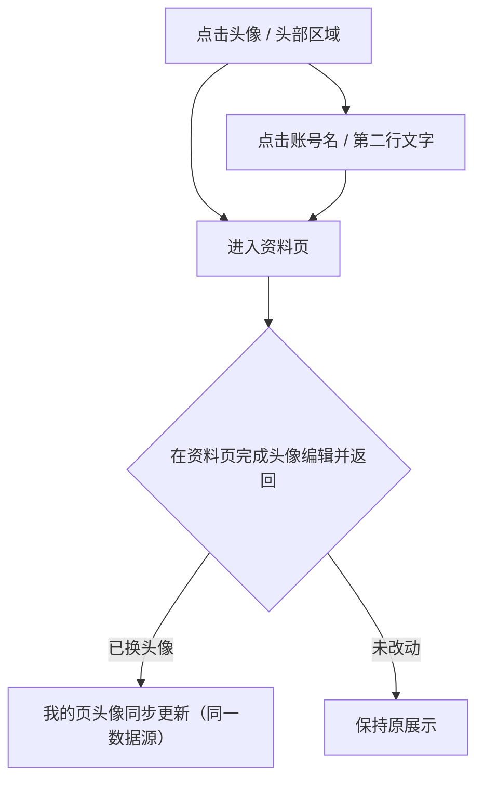
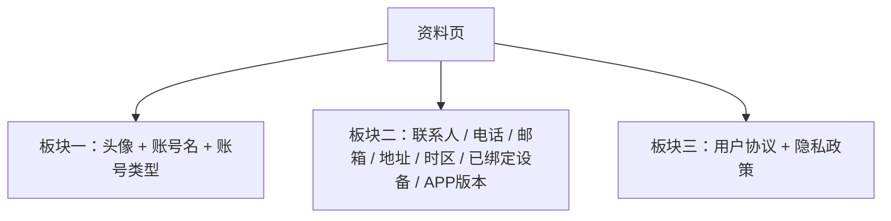
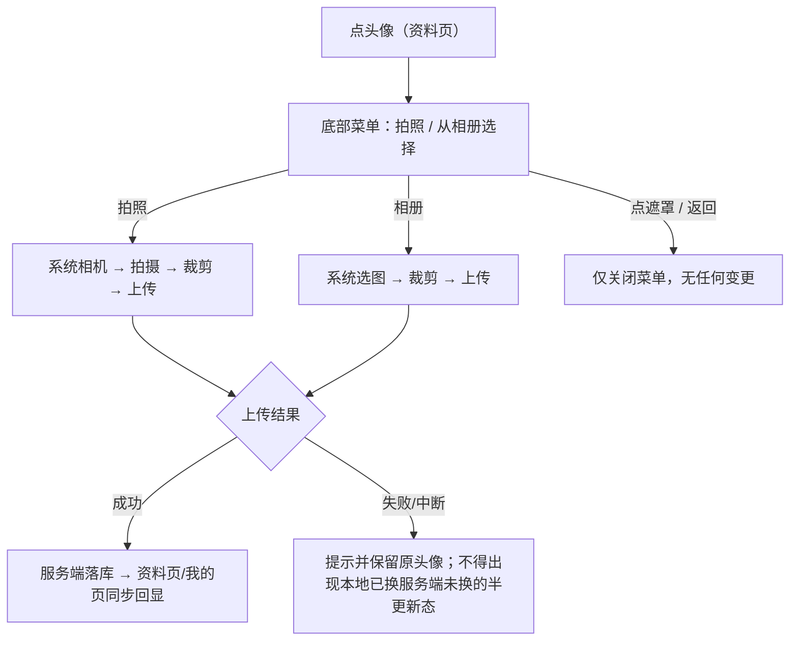
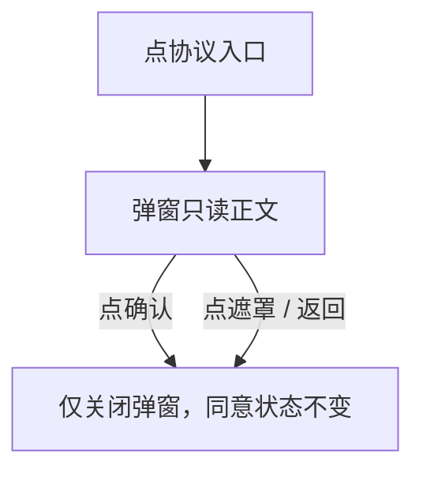
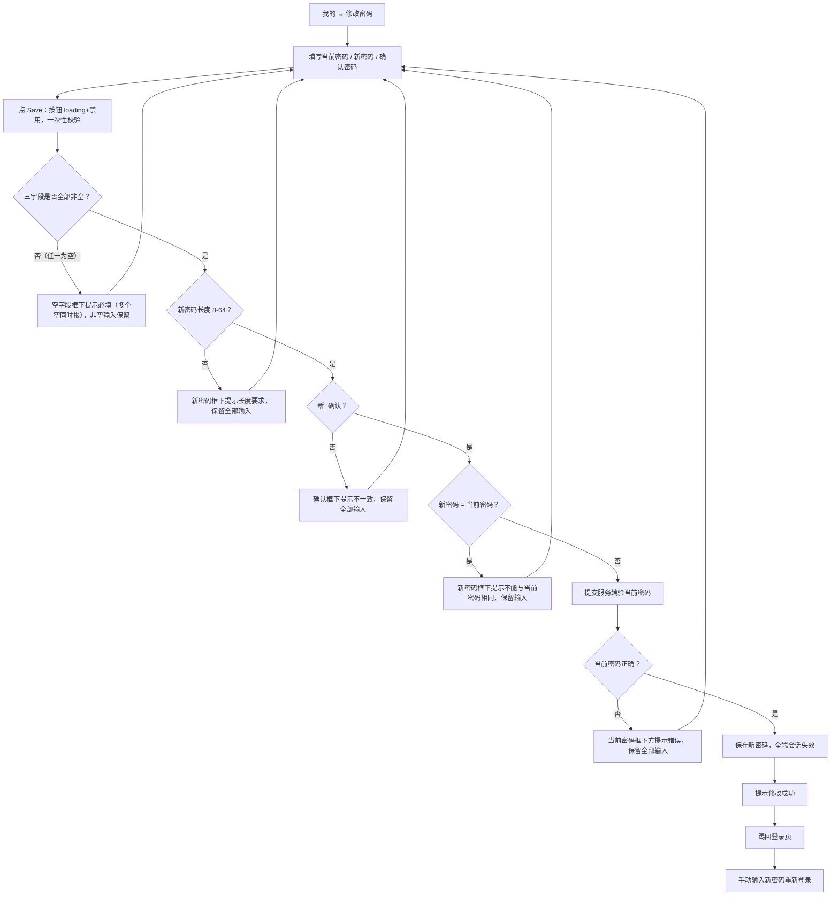
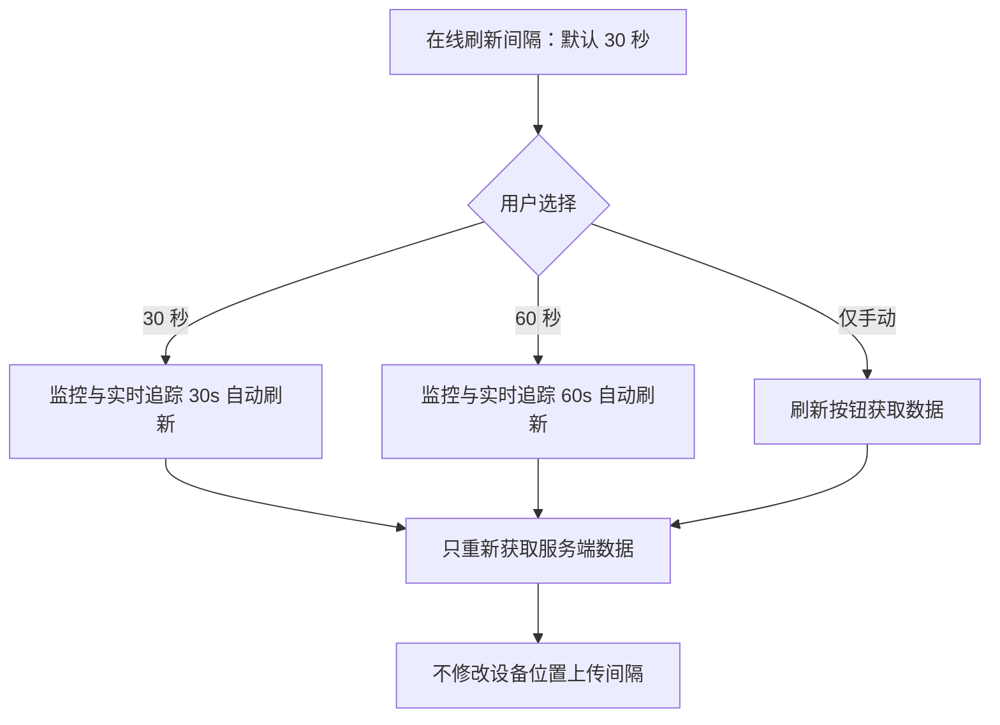
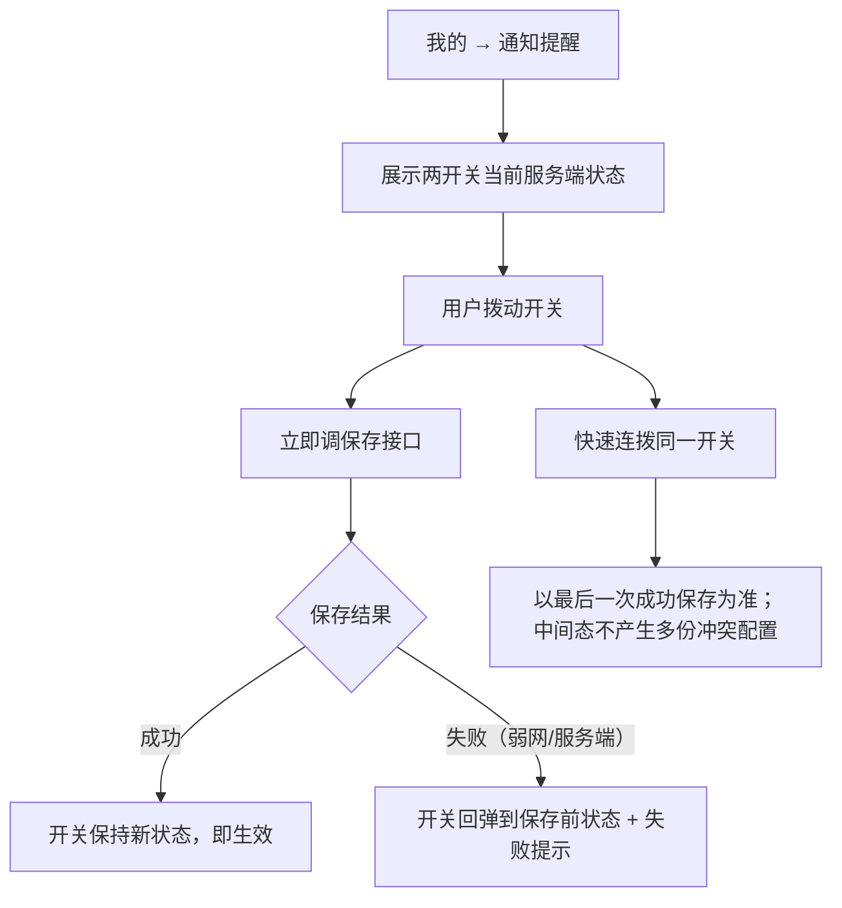

# 革泰 APP 我的模块逻辑点梳理.plan

<aside>
🎯

**文档用途**：梳理革泰 APP「我的」模块各子模块的入口、页面结构、展示元素、字段限制、交互逻辑与异常场景，作为后续产品澄清、接口联调与测试用例设计依据。

**适用范围**：覆盖 US-005「登录后修改密码」（本篇全量收录，含异常场景）、US-026 入口项「通知提醒」（原告警设置，本篇完整梳理两开关交互；防骚扰 / 渠道等告警业务规则留告警专项）、US-028「查看和维护个人资料」、US-029「统一设置 APP 展示时区」、US-030「设置监控页面刷新间隔」、US-034「查询与筛选指令记录」；US-031 退出登录收录于登录篇，本篇仅指针引用。

**US-005 与 US-004 的边界**：登录页「忘记密码」（US-004）是未登录链路，靠短信 / 邮箱验证码重置，收录于登录篇；「我的 → 修改密码」（US-005）是已登录链路，靠当前密码验证身份，三字段（当前密码 / 新密码 / 确认密码）。两者密码长度限制相同（8–64），身份验证方式、入口、会话处理完全不同，用例不得互相套用。

**口径基准**：业务逻辑以本文 2026-09-17 拍板结论为准；与 PRD 或 UI 原型冲突处已在「已确认的原型修订」章节列明，拍板结论优先。

**重要口径变更**：① 资料电话字段已改为与登录凭证无关的普通可编辑字段（推翻 PRD「国内只读=登录手机号、海外不显示」）；② 资料页时区行改为纯展示不可改（推翻 PRD「点击进同一时区设置页」）；③ UI 原型 More 层废弃。详见第 14 章。

</aside>

---

## 1. 核心结论

1. **我的页三区域结构**：区域一头部卡片（账号信息摘要）、区域二账号选项（资料 / 修改密码 / 通知提醒）、区域三设备设置（指令记录 / 时区设置 / 在线刷新间隔）、底部退出登录。
2. **无 More 层**：UI 原型 More 页废弃；Language、Offline Map 两项确认为 UI 错误，本期不存在；在线刷新间隔直平在区域三。
3. **头像编辑能力收敛资料页**：资料页板块一头像是全 APP 唯一头像编辑入口（底部菜单：拍照 / 从相册选择）；我的页头像纯展示，仅作进资料页的导流点击。
4. **头部第二行按版本分流**：国内显示登录手机号（完整展示不脱敏），海外显示邮箱（无邮箱整行隐藏）。
5. **资料电话与登录凭证解耦**：电话是普通可编辑资料字段（默认空、手动维护），与账号绑定手机号没有任何关系——重大口径变更，服务端契约必须保证改资料不能触碰登录标识。
6. **单字段弹窗编辑**：联系人 / 电话 / 地址一次只改一项，各自弹窗，保存成功回显、取消保留原值。
7. **时区行纯展示**：资料页时区只做数据展示不可更改；修改时区只能走区域三「时区设置」（US-029，与登录页同一份配置）。
8. **已绑定设备数 = 可见设备数**：个人 / 企业主 = 自己绑定 + 后台代绑；企业子 = 父级分配的可见范围；非「亲自绑定数」。
9. **协议区两入口**：用户协议 + 隐私政策各自弹窗只读正文，底部「确认」仅关闭弹窗，不出现同意 / 不同意，不改变登录协议同意状态。
10. **指令记录全量收编**：US-034 入口、筛选、两层状态、排序键在本篇完整梳理（指令篇遗留的指令记录专项由本篇补上）；页面形态（筛选面板 vs UI 三 Tab）待确认。
11. **在线刷新间隔只管取数**：30s / 60s / 仅手动，默认 30s，仅作用于监控中心与实时追踪，不修改设备位置上传间隔。
12. **通知提醒仅两开关**：告警 Sound + 手机振动，切换即保存；类型过滤能力（离开/进入围栏、低电量开关）移除，所有设备告警类型默认推；两开关只控制提醒表现形式，不影响推送、记录与处理状态。

---

## 2. 页面入口与导航链路

### 2.1 我的页在全局导航中的位置

### 2.2 我的页二级导航全集

| 链路 | 规则 |
| --- | --- |
| 我的页 → 资料页 | 双入口：点头像（导流）或菜单「资料」；同一页面 |
| 资料页 → 修改密码 | **不存在此链路**；修改密码入口在「我的」区域二（口径变更） |
| 资料页 → 时区设置 | **不存在此链路**；时区行纯展示（口径变更） |
| 我的页 → 各二级页 | 二级页返回均回「我的」，恢复我的页原状态 |
| 退出登录 | 结束会话、清理账户展示数据、回登录页（登录篇 US-031） |

---

## 3. 我的页结构（三区域 + 底部）

| 区域 | 元素 | 交互 |
| --- | --- | --- |
| 区域一：头部卡片 | 头像（左侧）+ 第一行账号名 + 第二行登录标识 | 点头像 / 头部 → 进资料页；其余纯展示 |
| 区域二：账号选项 | 资料、修改密码、通知提醒 | 各自跳二级页 |
| 区域三：设备设置 | 指令记录、时区设置、在线刷新间隔 | 各自跳二级页 |
| 底部 | 退出登录按钮（描边样式） | US-031 退出流程 |

- 系统消息入口已从「我的」及模块导航中移除，不提供独立系统消息页面（PRD 既有规则）。
- 菜单分组标题（账号选项 / 设备设置）仅作视觉分区，不承载交互。

---

## 4. 区域一：头部卡片

### 4.1 元素与展示规则

| 元素 | 位置 | 规则 |
| --- | --- | --- |
| 头像 | 卡片左侧 | 圆形；默认头像兜底（首次注册账号预期存在默认头像）；**无任何角标**（绿点为识图误差，不存在）；自定义图加载失败回退默认头像，不允许空白 |
| 账号名 | 右侧第一行 | 只读；同资料页口径；超长折行 / 截断规则待 UI 确认 |
| 登录标识 | 右侧第二行 | 国内 = 当前登录手机号**完整展示（不脱敏）**；海外 = 账户邮箱，**无邮箱整行隐藏** |

### 4.2 交互

- 头部整块可点进资料页；头部不弹任何编辑组件。
- 编辑能力单一入口在资料页，消灭「我的页 / 资料页双入口缓存漂移」与双份异常链用例。

### 4.3 数据来源与账号隔离

| 数据 | 来源 | 隔离规则 |
| --- | --- | --- |
| 头像 | 服务端账户资料 | 账号级数据；账号切换 / 退出重登按账号各自展示，不残留上一账号（联动 US-031） |
| 账号名 | 服务端账户 | 只读镜像单一真源 |
| 国内手机号 | 当前账户登录手机号 | 后台换绑后跟随最新值，不残留旧号 |
| 海外邮箱 | 服务端返回原样展示 | 大小写 / 空格不做二次处理 |

### 4.4 异常场景

| # | 场景 | 预期 |
| --- | --- | --- |
| 1 | 自定义头像弱网加载失败 | 回退默认头像占位 |
| 2 | 国内后台换绑手机号 | 第二行随最新登录手机号更新 |
| 3 | 海外账户后续补充 / 验证邮箱 | 第二行由隐藏变为邮箱展示 |
| 4 | 账号 A 退出后账号 B 登录 | 头部三元素全部切换为 B 的数据 |
| 5 | 海外账号名与邮箱同值 | 两行同串展示，不混淆层级 |

---

## 5. 资料页（用户信息页）

### 5.1 页面结构：三板块

### 5.2 板块一：头像 + 账号名 + 账号类型

| 元素 | 规则 |
| --- | --- |
| 头像 | **全 APP 唯一编辑入口**；点击弹底部菜单［拍照｜从相册选择］；与我的页头像同数据源，改一处两处同步 |
| 账号名 | 只读展示，同头部口径；**不进入任何编辑表单，任何资料保存不能改变账号名**（服务端须忽略该字段，非仅前端隐藏） |
| 账号类型 | 三分类只读标签：**个人账号 / 企业主账号 / 企业子账号**（服务端返回，不可切换） |

**头像字段限制**：

| 项 | 规则 |
| --- | --- |
| 格式 | jpg / png / webp |
| 大小 | ≤ 5MB，超限提示 |
| 裁剪 | 1:1 圆形 |
| 恢复默认头像 | **不提供** |
| 多端冲突 | **后写覆盖**：最后一次保存生效，各端下次拉取以服务端为准，无冲突提示 |
| 默认头像 | 首次注册账号预期存在内置默认头像 |

**头像交互流**：

**头像异常场景**：

1. 相机 / 存储权限未授权 → 引导系统设置开启；拒绝后对应菜单项不可用，不崩溃不白屏。
2. 所选图片损坏 / 格式不支持 → 提示重选，不上传半截数据。
3. 上传中断网 / 超时 → 原头像不变；重进页面以服务端为准。
4. 多端同时改头像 → 后写覆盖，先改的一端下次拉取被覆盖。

### 5.3 板块二：资料字段总表

| 字段 | 编辑性 | 交互 | 限制 / 数据源 | 备注 |
| --- | --- | --- | --- | --- |
| 联系人 | ✅ 可编辑 | 单字段弹窗 | 可空；1–20 字符任意文本 | 默认空，手动维护 |
| 电话 | ✅ 可编辑 | 单字段弹窗 | 可空；5–20 字符；宽松字符集：数字 / 空格 / `( ) + -`；不做国家归属校验 | 🔴 重大变更：与登录手机号无关 |
| 邮箱 | ❌ 只读 | 无点击 | 已验证邮箱才显值；**无邮箱时行恒在显示占位** | 不用模拟邮箱代替真实数据 |
| 地址 | ✅ 可编辑 | 单字段弹窗 | 可空；多行输入；总计 ≤ 200 字符 | 默认空 |
| 时区 | ❌ 只读 | 无点击（🔴 变更：不可更改） | 显示当前统一时区配置值 | 修改走区域三「时区设置」 |
| 已绑定设备 | ❌ 只读 | 无点击 | = 当前账号**可见设备数** | 口径见 5.4 |
| APP 版本 | ❌ 只读 | 无点击 | 当前版本号 | — |

**编辑交互通用规则**：

- 单字段弹窗一次只改一项，无统一保存。
- 保存成功 → 资料页回显新值；取消 / 关弹窗 → 保留原值。
- 保存硬约束：任何资料保存不能改变账号名；电话字段与登录凭证完全解耦，改电话不触碰登录手机号。

**电话宽松校验的真实格式例证**（用例数据参考）：

| 国家 | 手机号 | 座机 |
| --- | --- | --- |
| 美国 | +1 (555) 123-4567 | 555-123-4567 |
| 澳大利亚 | +61 412 345 678 | (02) 9876 5432 |
| 芬兰 | +358 40 1234567 | 09 123456 |
| 巴西 | +55 11 91234-5678 | (11) 1234-5678 |

- 上述格式全部可保存（字母拦截）；位数 / 分隔符差异不做强校验。
- 边界：4 字符拦截、5 字符通过、20 字符通过、21 字符拦截；纯字母拦截；空可保存。

### 5.4 已绑定设备数口径

| 账号类型 | 统计口径 |
| --- | --- |
| 个人账户 | 自己绑定 + 后台代绑的设备去重数 |
| 企业主账号（一级） | 自己绑定 + 后台代绑（含向下分配链形成的可见范围）去重数 |
| 企业子账号（二级 / 三级） | 父级分配形成的**可见设备数**（子账号无绑定入口，非亲自绑定数，不应显示 0） |

- 数字为只读展示，无点击行为，不跳设备列表。

### 5.5 板块三：协议区

| 项 | 规则 |
| --- | --- |
| 入口 | **用户协议 + 隐私政策两个独立入口** |
| 形态 | 弹窗只读正文 + 底部「确认」按钮 |
| 确认语义 | **仅关闭弹窗**；不出现「同意 / 不同意」；不改变登录协议同意状态；登录入口的同意及拒绝流程保持不变 |

### 5.6 资料页异常场景

| # | 场景 | 预期 | 状态 |
| --- | --- | --- | --- |
| 1 | 保存失败（网络 / 服务端报错） | 提示 + 输入保留策略 | ⚠️ 待定义 |
| 2 | 邮箱验证状态字段缺失 | 「已验证才展示」无法实现，需后端契约支持 | 开发联调项 |
| 3 | 头像上传各异常 | 见 5.2 | 已定义 |
| 4 | 空值保存（联系人 / 电话 / 地址均空） | 允许，保存后回显空 | 已定义 |

---

## 6. 修改密码（US-005 全量）

入口：我的 → 区域二「修改密码」（资料页无此入口，见第 14 章口径变更）。

### 6.1 与忘记密码（US-004）的边界

| 维度 | US-004 忘记密码 | US-005 修改密码 |
| --- | --- | --- |
| 登录状态 | 未登录（登录页入口） | 已登录（我的 → 修改密码） |
| 身份验证 | 短信 / 邮箱验证码 | 当前密码 |
| 字段 | 手机号/邮箱 + 验证码 + 新密码 + 确认 | 当前密码 + 新密码 + 确认密码（三字段） |
| 密码规则 | 8–64 字符 | 8–64 字符（相同） |
| 成功后 | 返回登录页 | 踢回登录页，手动重登 |

### 6.2 页面结构与字段

| 字段 | 输入类型 | 说明 |
| --- | --- | --- |
| Current Password 当前密码 | 密码框，带眼睛图标 | 必填；服务端校验 |
| New Password 新密码 | 密码框，带眼睛图标 | 必填；8–64 字符，**无复杂度要求**（纯数字/纯字母合法，与注册/重置统一） |
| Confirm Password 确认密码 | 密码框，带眼睛图标 | 必填；须与新密码完全一致 |
| Save 保存按钮 | 底部主按钮 | 三框均带独立眼睛图标，各自切换明文/密文（UI 原型口径） |

### 6.3 校验规则（拍板定版）

| # | 规则 | 结果 |
| --- | --- | --- |
| 1 | 校验时机：**点保存才检查**，输入中不提示 | 定版 |
| 2 | 错误展示：**输入框下方显示提示文案**（分字段定位，非单条 Toast） | 定版 |
| 3 | 失败后三个输入框内容**全部保留**（PRD：保留表单并显示原因） | 定版 |
| 4 | 密码规则：**仅长度 8–64，不校验复杂度**（经查证 Google 消费级/NIST 同为仅长度+弱密码库，拍板维持极简；三处入口统一） | 定版 |
| 5 | **新旧密码相同拦截**：新密码 = 当前密码时阻止保存并提示 | 定版 |
| 6 | 当前密码错误：**不限制尝试次数**（PRD 未定义限次锁定），每次错误提示并保留输入 | 定版 |
| 7 | 保存按钮：点击后 **loading + 禁用**防重复提交，返回结果后恢复 | 定版 |

### 6.4 主流程

**校验顺序说明**（点保存后按此序列执行，命中即停在该层并逐字段提示）：

| 序 | 校验层 | 对象 | 提示位置 |
| --- | --- | --- | --- |
| 1 | 必填校验 | 三字段逐个判空 | 空字段各自框下提示必填；**多个空字段同时提示，不逐个弹** |
| 2 | 长度校验 | 新密码（确认密码随一致性层覆盖） | 新密码框下提示 8–64 要求 |
| 3 | 一致性校验 | 新密码 vs 确认密码 | 确认框下提示不一致 |
| 4 | 新旧相同校验 | 新密码 vs 当前密码 | 新密码框下提示不能相同 |
| 5 | 服务端当前密码校验 | 当前密码 | 当前密码框下提示错误 |

- 1–4 层为前端本地校验，全部通过才发请求；第 5 层为服务端校验。
- 前端校验原则：**同一层内多字段错误同时标出**（如新密码空 + 确认密码空一起提示）；**跨层不重复报**（长度不合规时不叠报一致性问题）。
- 全部失败路径均保留三框输入、按钮恢复可点。

### 6.5 会话处理（拍板定版）

| 场景 | 规则 |
| --- | --- |
| 改密成功·当前端 | 提示成功后**踢回登录页**，不保持登录态 |
| 改密成功·其他端 | 该账号**全端会话失效**（另一台手机 / Web 监控平台下次请求被踢回登录） |
| 重登方式 | 登录页**手动输新密码**登录，不自动静默重登；账号标识按保存偏好带出，密码留空 |
| 旧密码 | **立即失效**：改密成功后旧密码登录必须报「密码错误」；新密码可登录（安全硬断言） |

### 6.6 异常场景全集

| # | 场景 | 预期 |
| --- | --- | --- |
| 1 | 当前密码错误 | 框下提示错误，三框输入保留，可无限重试（不限次） |
| 2 | 新密码 7 字符 / 65 字符 / 空 | 新密码框下提示长度要求，输入保留 |
| 3 | 确认密码与新密码不一致 | 确认框下提示不一致，输入保留 |
| 4 | 新密码 = 当前密码 | 拦截保存，提示不能相同 |
| 5 | 任一字段为空点保存 | 空字段框下提示必填；**多个空字段同时提示**；不清空其他输入 |
| 5a | 仅当前密码为空（新/确认已填） | 只标当前密码框，新/确认输入保留不报错 |
| 5b | 三字段全空点保存 | 三框同时提示必填 |
| 6 | 提交中断网 / 超时 | 提示失败，输入保留；按钮恢复可点；**不得半提交**（服务端未落库则密码未变） |
| 7 | 快速连点保存 | loading+禁用保证只发一次请求 |
| 8 | 双端同时改密 | 先提交者成功；后提交者验当前密码失败（旧密码已失效），自然兜底，无双改成功 |
| 9 | 改密成功后旧密码登录 | 报密码错误 |
| 10 | 改密成功后新密码登录 | 成功，账户身份/权限/数据范围不变 |
| 11 | 改密成功后其他端停留中的会话 | 下次请求踢回登录，需新密码重登 |
| 12 | 改密成功时密码含首尾空格 / 表情符号 | 按原样字符计长（8–64 判定），不做 trim——是否 trim 待联调确认（见第 15 章） |
| 13 | 改密页停留期间被其他端踢下线（token 失效） | 提交时报会话失效，走统一认证流程，不显示为「当前密码错误」 |

### 6.7 开发契约要点

1. 当前密码校验必须在**服务端**完成（前端不持有明文旧密码比对能力，防绕过）。
2. 改密成功原子性：密码落库 + 全端 token 失效在同一事务语义内；不允许「密码已改、旧 token 仍有效」窗口。
3. 旧密码比对与新密码落库使用同一账号数据快照，防 TOCTOU。
4. 「新旧密码相同」的比对在服务端再做一次（前端拦截可被绕过）。
5. 防重复提交：服务端对同一请求幂等（客户端 loading 禁用只是第一道）。
6. 会话失效需覆盖 APP 与 Web 监控平台全部 issued token，非仅当前端。

---

## 7. 指令记录（US-034，全量收编）

### 7.1 入口与上下文

| 入口 | 初始范围 | 返回 |
| --- | --- | --- |
| 我的 → 指令记录 | 当前账户**全部有权查看的设备**；不继承其他页面此前选中的单台设备 | 回「我的」 |
| 设备指令页进入 | 默认筛选当前设备 | 保留原返回路径及导航上下文 |
| 批量发送结果的原记录入口 | 保持原批次入口既有行为 | 同左 |

### 7.2 页面结构

- 顶部：全部设备下发指令历史、记录总数、「按下发时间（首次提交时间）倒序」说明。
- 左上角返回；右上角筛选入口。
- 记录卡：指令名称与参数、目标设备（名称 + 编号，以编号识别）、下发时间（首次提交时刻，排序键）、最近投递时间、回复时间、整体状态与最近发送结果**分别表达**。

### 7.3 筛选面板规则

| 条件 | 类型 | 匹配方式 |
| --- | --- | --- |
| 指令类型 | 单选（既有七类命令类别） | 未指定不施加限制 |
| 整体发送状态 | 单选：已受理/待投递（QUEUED）、已确认（COMPLETED）、已拒绝（REJECTED）、已取消（CANCELLED）、已过期（EXPIRED） | 单次 TIMEOUT 不合成整体失败 |
| 设备号 | 输入 | **精确匹配**唯一编号，不以设备名称替代 |
| 设备备注 | 输入 | **模糊匹配**，与设备号分别输入 |

- 填写条件不立即查询；点「应用」后按**交集**更新列表及数量。
- 面板「重置」只重置本次可编辑草稿，保留入口锁定设备，须再点应用才查询。
- 列表「清除筛选」清空设备范围、设备查询、类型、下发状态及全部草稿，**立即**恢复账号可见全部设备记录；不删除记录、不改变返回路径或原选中设备。

### 7.4 两层状态模型

| 层 | 值域 | 说明 |
| --- | --- | --- |
| 整体状态 | QUEUED / COMPLETED / REJECTED / CANCELLED / EXPIRED | 筛选依据；不能以成功/失败图标合并 |
| 最近一次结果 | NOT_SENT / SENT / ACKED / TIMEOUT | 独立展示；「已投递」= 发送动作，「已回复」= 有效回复 |

- 整体 QUEUED + 最近 TIMEOUT 的记录同时保留两种含义，不误归整体已失败。
- CR 已有回复但不等于新位置已更新，不能据回复宣称已获取新位置。

### 7.5 排序与只读约束

- 「下发时间」= 首次提交时刻并用于排序；补发只更新最近投递信息，旧记录不按补发时间重新置顶；首次提交相同时按接口明确的稳定次级键排序。
- 切换 APP 时区或收到设备回复：展示字段可更新，**不改变首次提交排序键**。
- 只读查询不重发、不取消、不修改指令状态；「设备离线，发送失败」是失败原因展示，不代表允许向离线设备新建待执行命令。
- 查询始终受当前账号权限限制；输入权限范围外设备号不能扩大权限获取记录。
- 总数 = 指令记录数量，不按设备去重；示例数量 7 不是容量上限。

## 8. 时区设置（US-029 专项补全）

| 项 | 规则 |
| --- | --- |
| 入口 | 我的 → 时区设置（区域三）；与登录页选定时区是**同一份配置**，资料页时区行只读回显 |
| 页面形态 | 地区 + 城市 + UTC/GMT 偏移单选列表，突出当前选中项；存在夏令时的地区按事件日期计算实际偏移 |
| 生效范围 | 地图与监控（最近更新 / 定位上报时间）、轨迹（点时间 / 日期筛选 / 日历）、告警（发生 / 处理 / 历史定位时间）、指令（提交 / 发送 / 回复 / 过期时间）、设备与物联网卡（创建 / 服务到期 / 卡有效期） |
| 持久化 | 本页修改后下次登录可带出；登录页选定值在本页回显 |

**时区边界规则**：

- 服务端保存的事件时刻不变，APP 按选定时区转换显示；切换时区只改变展示。
- 今日、昨日、日历查询按选定时区确定日期边界；纯日期型字段（如到期日）按业务日期展示，**不因 UTC 零点转换跨到前一日或后一日**。
- APP 时区与设备 `ZONE` 参数分别管理：前者控制展示与日期查询，后者用于设备协议侧设置，不能用修改一项代替另一项。

## 9. 在线刷新间隔（US-030）

| 项 | 规则 |
| --- | --- |
| 可选项 | 30 秒 / 60 秒 / 仅手动 |
| 默认值 | 30 秒 |
| 作用范围 | **仅**监控中心与实时追踪页面 |
| 不影响 | 设备位置上传间隔（上报周期是设备侧指令，见指令篇） |
| 仅手动 | 通过页面刷新按钮主动获取数据 |

## 10. 通知提醒（原告警设置 / US-026 入口项）

入口：我的 → 区域二「通知提醒」。页面标题「通知提醒」，左上角返回回「我的」。

### 10.1 页面结构（UI 定版）

单张白色圆角卡片，两项开关，无分组标题、无保存按钮、页面其余区域空白：

| # | 开关 | 说明文案 | 图标 |
| --- | --- | --- | --- |
| 1 | 告警 Sound | 推送通知时播放声音 | 铃铛（浅绿圆形底） |
| 2 | 手机振动 | 收到推送通知时振动 | 手机（浅绿圆形底） |

### 10.2 规则定版

| 项 | 规则 |
| --- | --- |
| 开关清单 | **仅两项**（告警 Sound / 手机振动）；PRD 的三个类型开关（离开围栏 / 进入围栏 / 低电量）**不在本期页面**，类型过滤能力整体移除——所有设备告警类型默认推 |
| 生效时机 | **切换即保存即生效**，无保存按钮；退出页面不回滚；下次登录保持 |
| 作用边界 | 仅控制**提醒的表现形式**（响铃 / 振动）；两开关全关不等于免打扰——推送本身、告警记录、告警中心列表、处理状态均不受影响（提醒偏好与业务处理分离，US-026 原则） |
| 事件范围 | 仅**设备告警类推送**（围栏进出、低电量）受控；APP 其他类型推送不在此控 |
| 渠道边界 | 控制 APP 内提醒表现；服务端站内 / 微信渠道推送本身不受这两开关影响（渠道路由属告警专项） |
| 默认值 | 两开关默认**全开** |
| 数据归属 | **账号级配置**：每人独立；新注册账号默认开；账号切换不混用；退出重登保持 |
| 保存失败 | 开关**回弹到保存前状态 + 提示失败**；不允许「UI 已开、服务端未存」的假状态 |

### 10.3 交互流

### 10.4 异常场景

| # | 场景 | 预期 |
| --- | --- | --- |
| 1 | 弱网下拨动开关 | 回弹 + 失败提示；服务端保持原值 |
| 2 | 进入页面时配置加载失败 | 不得显示假默认值冒充真值；重试加载；默认展示规则待定（见 15 章） |
| 3 | 双端同时拨同一开关 | 后写覆盖；各端下次拉取以服务端为准 |
| 4 | 双端拨不同开关 | 各自独立保存，互不覆盖（两开关独立字段） |
| 5 | 拨动后立即退出页面 | 已发出的保存请求不因退出而丢失语义；重进以服务端为准核对 |
| 6 | 两开关全关后设备告警 | 推送照常到达、告警记录照常产生；仅不响铃不振动 |
| 7 | 账号 A 关振动，退出登录账号 B | B 的通知提醒为 B 自己的配置（默认开），不继承 A |

### 10.5 开发契约要点

1. 两开关为**独立字段**独立保存，一次拨动只 PATCH 对应字段，不整表覆盖（防双端拨不同开关互相踩）。
2. 保存接口需幂等；失败回弹的前端状态必须以服务端响应为准，不得本地先行提交假成功。
3. 配置读取：进入页面时从服务端拉取当前值，不信任本地缓存兜底展示。
4. 开关只作用于 APP 提醒表现层，服务端推送渠道路由不读取这两字段（渠道逻辑在告警链路侧）。

---

## 11. 国内外差异总表（本模块）

| 项 | 国内版 | 海外版 |
| --- | --- | --- |
| 头部第二行 | 登录手机号，完整展示不脱敏 | 邮箱；无邮箱整行隐藏 |
| 资料电话字段 | 可编辑，与登录手机号无关 | 可编辑，与登录凭证无关（无差异） |
| 资料邮箱 | 已验证才显值，无则占位 | 同左（无差异） |
| 账号名 | 注册不要求独立账号名；展示按实际账户数据断言 | 注册后固定 |
| 协议区 | 用户协议 + 隐私政策两弹窗 | 同左 |

---

## 12. 会话与账号隔离

| 场景 | 规则 |
| --- | --- |
| 退出登录（US-031） | 结束会话、清理当前账户设备 / 围栏 / 告警展示数据、回登录页；详见登录篇 |
| 账号切换 | 头像、账号名、第二行标识、资料字段全部按新账号加载，不混入上一账户展示 |
| 时区偏好 | 账号级配置：B 账号登录应用 B 上次保存的时区；首次登录取默认（登录篇 2.8） |
| 修改密码成功（US-005） | 当前端踢回登录页、全端会话失效、旧密码立即失效、手动新密码重登；详见第 6 章 |

---

## 13. 边界值与关键验收场景

| 场景 | 预期结果 |
| --- | --- |
| 首次注册账号进我的页 | 默认头像；账号名 + 国内手机号 / 海外邮箱 |
| 海外无邮箱账户 | 头部第二行整行隐藏，不空白占位 |
| 国内后台换绑手机号 | 头部第二行随最新登录手机号更新 |
| 点我的页头像 | 进资料页，不弹编辑组件 |
| 资料页点头像 → 拍照，拒绝相机权限 | 引导系统设置；对应菜单项不可用，不崩溃 |
| 头像选 5MB 文件 / 5.1MB 文件 | 通过 / 超限提示 |
| 头像上传中断网 | 原头像不变；无「本地已换服务端未换」半更新态 |
| 多端改头像 | 后写覆盖；先改端下次拉取被覆盖 |
| 头像改成功返回我的页 | 两处头像同步更新（同一数据源） |
| 联系人输入 20 字符 / 21 字符 | 通过 / 拦截 |
| 联系人、电话、地址均空保存 | 允许，回显空 |
| 电话输入 +1 (555) 123-4567 | 保存成功（宽松字符集） |
| 电话输入 4 字符 / 21 字符 | 拦截 |
| 电话输入纯字母 | 拦截 |
| 改资料电话后登录 | 登录手机号不变（字段解耦硬断言） |
| 资料保存携带账号名字段 | 服务端忽略，账号名不变（越权防线） |
| 无邮箱账户看资料页邮箱行 | 行恒在，显示占位 |
| 资料页时区行 | 纯展示；无点击、无编辑入口 |
| 企业子账号看已绑定设备数 | = 父级分配可见设备数，非 0 |
| 点用户协议 / 隐私政策 | 各自弹窗只读正文 + 确认仅关闭 |
| 弹窗确认后回登录页 | 登录协议同意状态不变 |
| 修改密码：三字段合法且当前密码正确 | 保存成功，提示后踢回登录页 |
| 修改密码：当前密码错误 | 框下提示，输入保留，可重试，不限次 |
| 修改密码：新密码 7/65 字符 | 长度提示，输入保留 |
| 修改密码：确认不一致 | 确认框下提示，输入保留 |
| 修改密码：新密码 = 当前密码 | 拦截，提示不能相同 |
| 修改密码：纯数字新密码 | 允许（无复杂度要求） |
| 修改密码：连点保存 | loading+禁用，仅一次请求 |
| 修改密码：成功后旧密码登录 | 密码错误（旧密码立即失效） |
| 修改密码：成功后另一端在线会话 | 下次请求被踢回登录 |
| 修改密码：双端同时提交 | 后提交者当前密码验证失败，无双改成功 |
| 我的 → 指令记录 | 全部有权限设备记录；不残留此前单台设备选择 |
| 指令记录设备号精确 + 类型单选 + 应用 | 条件交集查询 |
| 筛选编辑中未点应用 | 不因输入立即查询 |
| 面板重置未应用 | 草稿重置、入口锁定设备保留、不查询 |
| 列表清除筛选 | 立即恢复全部可见记录；返回路径与原选中设备不变 |
| 整体 QUEUED + 最近 TIMEOUT 记录 | 两层状态同时展示；按 QUEUED 命中筛选 |
| 较早指令今日补发 | 不因补发置顶，按首次提交排序 |
| 切换 APP 时区后看指令历史 | 展示时间更新，排序键不变 |
| 时区切到有夏令时地区 | 按事件日期计算偏移；服务端时刻不变 |
| 纯日期字段切时区 | 不跨日前一日 / 后一日 |
| 修改设备 ZONE 参数 | 不改变 APP 展示时区（两配置分离） |
| 在线刷新切 60s / 仅手动 | 监控与实时追踪生效；设备上报周期不变 |
| 通知提醒：拨动开关保存成功 | 即生效，无保存按钮；退出重进保持新状态 |
| 通知提醒：弱网拨动保存失败 | 开关回弹 + 失败提示，服务端保持原值 |
| 通知提醒：两开关全关后设备告警 | 推送照常、告警记录照常产生，仅不响铃不振动 |
| 通知提醒：页面无类型开关 | 离开/进入围栏、低电量告警均默认推，无类型过滤入口 |
| 通知提醒：双端拨不同开关 | 各自独立保存互不覆盖（独立字段） |
| 通知提醒：新账号进入 | 两开关默认全开 |
| 查权限范围外设备号 | 不能扩大权限获取记录 |
| 账号 A 退出登录 B | 头部、资料、偏好全部切换为 B，不混用 |

---

## 14. 开发视角契约要点

1. **登录标识防越权**：资料保存接口即使收到 `accountName` / 登录手机号字段也必须服务端忽略，不能只靠前端不展示输入框。
2. **电话字段数据源**：独立资料列，与登录手机号分表 / 分字段存储；禁止复用登录手机号列导致改资料改登录凭证。
3. **邮箱验证状态**：后端需返回邮箱 + 验证状态字段；只返回邮箱字符串则「已验证才展示」无法实现。
4. **头像单一写入口**：资料页是唯一写路径；头像 URL 由服务端下发，加载失败前端兜底默认图。
5. **账号类型枚举**：服务端返回个人 / 企业主 / 企业子三分类，前端只映射标签不推断。
6. **可见设备数**：服务端按账号可见范围去重统计返回，不由前端遍历设备列表自行计算。
7. **时区单源**：登录页、时区设置页、资料页回显共用同一配置存储；修改一处三处同步。
8. **指令记录筛选**：四条件交集 + 权限谓词在服务端完成；设备号精确、备注模糊的区分要在接口参数层面显式表达。
9. **改密服务端校验**：当前密码验证、新旧相同比对均须服务端执行（前端拦截可绕过）；改密+全端 token 失效须原子（见 6.7）。
10. **通知提醒独立字段**：两开关独立 PATCH、幂等保存、失败回弹以服务端响应为准；进入页面从服务端拉取真值（见 10.5）。

---

## 15. 已确认的原型修订（拍板结论 vs PRD / UI）

| 原型 / PRD 旧规则 | 当前结论 |
| --- | --- |
| PRD：资料电话 = 登录手机号只读镜像；海外不显示该字段 | **改为**：普通可编辑资料字段（默认空、手动维护、宽松国际格式校验），与登录凭证完全无关，国内外无差异 |
| PRD：资料页时区行点击进同一时区设置页 | **改为**：时区行纯数据展示不可更改；修改只走「我的 → 时区设置」 |
| PRD：资料页提供修改密码入口 | **改为**：修改密码入口在「我的」区域二（UI 原型位置）；资料页无此入口 |
| PRD US-005 未定义改密后会话处理 | **拍板补全**：成功后踢回登录页、全端会话失效、旧密码立即失效、手动新密码重登 |
| PRD US-005 未定义新旧密码相同 | **拍板补全**：新密码 = 当前密码时拦截保存 |
| PRD US-005 未定义当前密码错误次数限制 | **拍板**：不限次（已登录态，风险由全端踢线机制兜底） |
| 密码复杂度曾议增加字符类型要求 | **拍板**：不校验复杂度，仅长度 8–64（经 Google/NIST 查证后维持极简，三处入口统一） |
| UI 原型：More 二级页（Language / Offline Map / Online Refresh Interval） | **More 层废弃**；Language、Offline Map 为 UI 错误不存在；在线刷新间隔直平区域三 |
| UI 原型：我的页头部第二行 = 邮箱（demo@livestocktracker.io） | 定版：国内 = 登录手机号完整展示；海外 = 邮箱（无则隐藏行） |
| UI 原型：头像左上角绿点（第一次识图） | 确认无任何角标（第二次识图为准） |
| UI 原型：User Information 页显示 Number 字段（海外稿） | 海外稿属旧稿；电话字段按新口径（可编辑资料字段）重定义 |
| UI 原型：Command History 页 All / Delivered / Failed 三 Tab + 搜索框 | 与 PRD 五状态筛选面板冲突，**页面形态待确认**（见 16 章） |
| PRD US-026：告警设置含五项偏好（离开/进入围栏、低电量、提示音、振动） | **改为**：页面定名「通知提醒」，仅保留告警 Sound + 手机振动两开关；三个类型开关移除，类型过滤能力不提供，所有设备告警类型默认推；「告警设置」名同步废止 |
| UI 原型：账号类型未在资料页展示 | 定版：板块一含三分类账号类型标签 |
| PRD：修改资料保存电话与登录手机号强关联 | 随电话字段口径变更一并废止 |

---

## 16. 待后续确认 / 联调项

1. **指令记录页面形态**：PRD 筛选面板（五整体状态 + 设备号精确 / 备注模糊 + 显式应用）vs UI 原型三 Tab（All / Delivered / Failed）+ 搜索框——发布阻断级真源冲突，需拍板后才能定稿用例。
2. **PRD US-026 同步修订**：通知提醒已拍板仅两开关，PRD 中类型开关、字段规范与验收标准需同步删除/改写；防骚扰 30 分钟窗口、渠道去重、微信通道规则留告警专项。
3. **通知提醒配置加载失败态**：进入页面拉取配置失败时展示什么（空白 / 重试），待 UI 确认。
4. **资料保存失败提示与输入保留策略**：网络 / 服务端报错时的文案与表单状态未定义。
5. **头像上传中 loading 态与失败提示文案**：待 UI 确认。
6. **账号名超长折行 / 截断规则**：最大行数、省略号策略待 UI 确认。
7. **国内无独立账号名账户的头部第一行展示**：按实际账户数据断言，测试时以真值核对。
8. **邮箱验证状态契约**：后端返回字段与语义需联调确认。
9. **可见设备数接口口径**：企业子账号的父级分配范围统计需后端确认实现。
10. **改密密码是否 trim**：含首尾空格的密码按原样计长还是 trim 后校验，前后端口径需联调确认。
11. **全端会话失效实现方式**：token 黑名单 / 版本号 / 下发踢线，后端方案需确认并覆盖 Web 监控平台。

---

## 17. 参考资料

- 革泰 APP 产品需求文档（Gitea：getai-app-prototype/docs/革泰 APP 产品需求文档.md）：US-005、US-026、US-028、US-029、US-030、US-031、US-034。
- `docs/manuals/革泰/逻辑大纲/革泰 APP 登录与注册逻辑点梳理 plan.md`：US-005 修改密码、US-031 退出登录、时区账号级规则（2.8）、国内 / 海外版本差异。
- `docs/manuals/革泰/逻辑大纲/革泰 APP 指令单设备与批量下发逻辑点梳理 plan.md`：指令下发流程；指令记录专项遗留由本篇第 7 章承接。
- `assets/革泰/我的/`：我的页、时区 / 在线刷新、More 页、通知提醒（55.png）UI 原型截图（其中 More 页、Language、Offline Map 已确认废弃）。

---

**文档版本**：v1.2（新增第 10 章通知提醒完整梳理：两开关定版、类型开关移除、异常场景与契约要点）

**最后更新**：2026-09-17

**维护人**：测试团队
