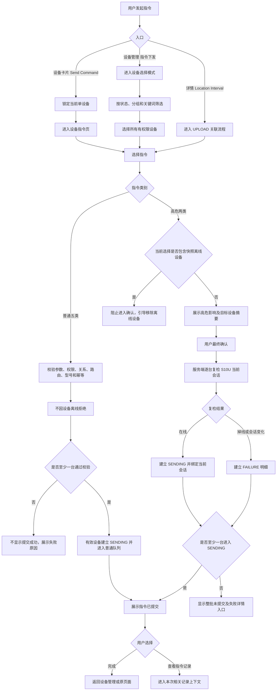

# 革泰 APP 指令单设备与批量下发逻辑点梳理（v2 草案）

> **文档用途**：梳理革泰 APP 指令单设备下发与批量下发的入口、设备选择、指令分类、参数选择、提交资格、在线会话校验、确认交互、批量部分失败、提交反馈、记录跳转、幂等及异常边界，作为产品、研发评审和测试用例编写依据。
>
> **本篇范围**：展开 APP 发起指令到服务端受理结果返回的交互流程，并定义普通队列类与高危会话绑定类指令在提交阶段必须满足的最低安全约束。
>
> **本篇不展开**：指令记录页面完整状态机、设备业务回文解析、队列内部存储实现、回调补偿、数据对账和历史记录保留周期。这些内容由指令记录及平台—终端交互专项展开。
>
> **实际链路**：革泰 APP 指令实际通过 **S10U 独立服务及网关**完成下发。PN06 仅作为普通指令队列式交互的参考，不代表革泰复用 PN06/808 网关、接口、消息类型、数据库或在线状态。
>
> **冲突处理**：本篇以最新确认的“普通五类离线可提交、高危两类绑定当前 S10U 在线会话”为准。旧大纲中的“七类指令统一在线限制”“批量离线设备不可选择”等规则作废。
>
> **草案说明**：未正式裁决的内容统一列入“待确认事项”，不得直接作为已实现功能或验收通过标准。

---

## 1. 范围、对象与核心结论

### 1.1 本篇覆盖

- 设备卡片更多菜单中的 `Send Command`；
- 设备管理页底部“指令下发”；
- 批量流程只选择 1 台或多台设备；
- 设备详情 `Location Interval` 产生的 `UPLOAD` 指令；
- 普通队列类与高危会话绑定类指令分类；
- 设备选择、筛选、全选、取消选择；
- 指令和参数选择；
- 服务端权限、关系、路由、型号及参数校验；
- 高危指令的 S10U 当前在线会话复检；
- 批量部分失败和数量守恒；
- 指令受理反馈；
- 查看指令记录入口；
- 网络异常、重复点击和幂等；
- 高危会话断开、解绑、回收和改绑等安全边界。

### 1.2 本篇不展开

- S10U 队列的具体存储介质；
- 终端协议编码；
- 设备业务回文完整解析；
- 指令记录页面完整展示规则；
- 普通任务过期回调及补偿实现；
- 取消和重发的完整记录状态机；
- 设备最终业务动作是否成功。

本篇虽然不展开上述实现，但必须明确以下提交边界：

1. 普通指令是否允许离线受理；
2. 高危指令是否绑定当前 S10U 会话；
3. 高危任务断线后是否出队；
4. 批量最终复检失败是否建立明细；
5. 关系失效是否清理未写出任务。

### 1.3 核心结论

1. 革泰实际使用 S10U 独立链路，PN06 仅作为队列式交互参考。
2. 七类指令拆分为普通队列类和高危会话绑定类。
3. `CR/VERNO/FIND/UPLOAD/ZONE` 为普通队列类，在线、离线、未连接均可提交。
4. `RESET/POWEROFF` 为高危会话绑定类，提交时必须存在 S10U 当前可写在线会话。
5. 普通指令不能因为设备离线或未连接被拒绝，但仍必须校验设备关系、S10U 路由、型号能力和参数。
6. 高危任务必须绑定提交时的 S10U 会话，不能只保存 `online=true`。
7. 高危任务写出前绑定会话断开时，任务立即进入 `FAILURE` 并出队。
8. 设备断线后重新建立的新会话，不得获取或执行旧高危任务。
9. 批量设备选择阶段允许选择在线、离线、未连接和告警设备。
10. 选择高危指令后，如果当前选择中包含离线或未连接设备，应阻止进入最终确认并引导用户移除。
11. 高危最终确认时仍需由服务端逐台复检 S10U 当前会话。
12. 批量高危最终复检掉线的设备必须建立逐设备 `FAILURE` 明细。
13. 批量中部分设备失败时，有效设备继续受理，不做整批回滚。
14. 解绑、企业回收、改绑或关系失效后，相关未写出任务必须转 `FAILURE` 并从队列清理。
15. `UPLOAD/ZONE` 的已受理任务全部保留并按顺序执行，最终目标以最新提交值为准。
16. `SENT` 只表示 S10U 已完成 TCP 写出，不表示设备业务动作已经成功。
17. “指令已提交”只表示至少一台设备被服务端受理，不表示全部设备成功或已经执行。

---

## 2. 术语定义

| 术语 | 定义 |
| --- | --- |
| 页面在线快照 | APP 页面进入时展示的设备状态，仅供用户参考，不能作为高危指令最终安全依据 |
| S10U 当前在线会话 | S10U 服务端当前持有的、属于目标设备且可写的 TCP session/channel |
| 会话标识 | 能唯一识别一次连接生命周期的 `sessionId/sessionEpoch/channelId` |
| 普通队列类 | 允许设备离线受理，并在设备后续恢复通信后写出的指令 |
| 高危会话绑定类 | 提交时必须在线，只能由提交时绑定的同一会话写出的指令 |
| 未写出任务 | 尚未完成 TCP 写出提交的指令任务 |
| 受理 | 服务端完成前置校验并建立指令明细或任务 |
| 写出 | S10U 已将指令内容写入对应设备的 TCP 通道 |
| 业务回文 | 设备执行指令后返回的文本或业务数据，不等同于 TCP 写出结果 |
| 关系失效 | 解绑、企业分配回收、改绑、账号失权或上级关系失效 |
| 用户主动重发 | 用户再次表达发送意图，生成新的发送尝试 |
| 网络安全重试 | 同一次用户操作因超时或连接异常而重复调用，必须复用原幂等标识 |

---

## 3. 七类指令策略矩阵

| 页面分类 | 页面指令 | 协议命令 | 参数 | 指令类别 | 离线提交 | 最终在线复检 |
| --- | --- | --- | --- | --- | ---: | ---: |
| 常用指令 | 立即定位 | `CR` | 无 | 普通队列类 | 允许 | 不需要 |
| 常用指令 | 查询版本 | `VERNO` | 无 | 普通队列类 | 允许 | 不需要 |
| 现场操作 | 查找设备 | `FIND` | 无 | 普通队列类 | 允许 | 不需要 |
| 参数设置 | 设置上传间隔 | `UPLOAD` | 上传间隔秒数 | 普通配置队列类 | 允许 | 不需要 |
| 参数设置 | 设置设备时区 | `ZONE` | UTC 偏移 | 普通配置队列类 | 允许 | 不需要 |
| 设备控制 | 远程重启 | `RESET` | 无 | 高危会话绑定类 | 不允许 | 必须 |
| 设备控制 | 远程关机 | `POWEROFF` | 无 | 高危会话绑定类 | 不允许 | 必须 |

### 3.1 生命周期差异

| 场景 | 普通五类 | 高危两类 |
| --- | --- | --- |
| 提交时设备离线 | 允许受理 | 拒绝 |
| 当前无可写会话 | 允许进入普通队列 | 拒绝 |
| 受理后设备断线 | 继续等待 | 立即 FAILURE 并出队 |
| 设备重新连接 | 原任务可以继续 | 原任务不得恢复 |
| 队列有效期 | 暂沿用普通队列配置 | 绑定当前会话；是否增加最大有效时间待确认 |
| 关系失效 | FAILURE 并出队 | FAILURE 并出队 |
| 用户主动重发 | 离线也可创建新尝试 | 必须重新复检并绑定新会话 |

---

## 4. 指令入口矩阵

| 入口 | 设备数量 | 普通指令 | 高危指令 | 记录归属 |
| --- | ---: | --- | --- | --- |
| 设备卡片更多 → `Send Command` | 固定 1 台 | 所有状态均可进入和提交 | 所有状态可进入指令页；离线时按钮置灰 | 单设备记录 |
| 设备管理 → 指令下发 | 选中 1 台 | 所有有权限设备均可选 | 选择阶段可选，选定高危后处理离线设备 | 批量流程记录 |
| 设备管理 → 指令下发 | 选中多台 | 所有有权限设备均可选 | 选择阶段可选，选定高危后处理离线设备 | 批量流程记录 |
| 设备详情 → Edit → Location Interval | 固定 1 台 | 在线、离线、未连接均可提交 UPLOAD | 不涉及 | 单设备记录 |

### 4.1 入口一致性原则

1. 所有入口复用同一套服务端权限、设备关系、路由、型号、参数和幂等校验。
2. 同一设备、同一指令不能因为入口不同出现无业务依据的准入差异。
3. “批量流程只选择 1 台”仍属于批量入口，不得按设备数量切换到单设备直接入口。
4. 所有入口必须携带设备唯一标识。
5. 所有入口产生的 `UPLOAD/ZONE` 应进入同一设备、同一配置项的顺序体系。
6. 页面按钮状态不能替代服务端校验。

---

## 5. 下发资格与提交条件

### 5.1 所有指令共同校验

| 条件 | 规则 | 不满足时处理 |
| --- | --- | --- |
| 登录会话有效 | 当前账号未退出或失效 | 拒绝提交 |
| 账号状态正常 | 冻结或禁用账号沿用平台规则 | 拒绝提交 |
| 当前设备关系有效 | 当前账号仍具有设备控制关系 | 建议建立明确失败明细 |
| 设备唯一标识有效 | 按 Device ID 定位目标设备 | 失败 |
| S10U 路由有效 | 设备具有合法路由标识并已接入 S10U | 失败，不得当作普通离线排队 |
| 型号支持 | 当前型号支持目标指令及参数 | 失败 |
| 参数合法 | 格式、范围和枚举通过校验 | 失败 |
| 幂等标识有效 | 能识别同一用户操作和网络重试 | 防止重复任务 |
| 服务端容量允许 | 未超过单批、队列和限流边界 | 明确拒绝或分片，禁止静默截断 |

### 5.2 设备状态 × 指令类别矩阵

| 设备状态 | 普通五类 | 高危两类 |
| --- | --- | --- |
| 在线，无告警 | 允许 | 允许，但提交时仍复检 |
| 在线 + 告警 | 允许 | 允许，但提交时仍复检 |
| 离线 | 允许进入普通队列 | 不允许 |
| 未连接但路由合法 | 允许进入普通队列 | 不允许 |
| 缺少 S10U 路由 | 失败 | 失败 |
| 状态未知 | 不因在线未知拒绝，但必须确认路由合法 | 不允许直接提交，应区分设备离线与状态服务异常 |
| 选择时在线、确认时掉线 | 不影响普通指令受理 | 建立 FAILURE，不进入高危队列 |
| 受理后掉线 | 继续普通队列 | 立即 FAILURE 并出队 |

### 5.3 高危在线判定

高危指令提交时必须由 S10U 服务端确认：

1. 目标设备当前存在有效会话；
2. 当前会话可写；
3. 返回稳定的会话标识；
4. 查询异常与设备离线必须使用不同的错误原因；
5. 创建任务时保存绑定会话标识；
6. 写出前再次比较当前会话与绑定会话。

禁止以下错误实现：

```text
只读取 APP 页面在线状态；
只判断数据库中的 online=true；
只判断设备最近一次心跳时间；
设备重连后使用新会话执行旧高危任务。
```

### 5.4 服务到期

以下规则尚未正式确认，不能自行作为验收标准：

- 提交时服务已到期是否允许下发；
- 提交时有效、排队期间到期如何处理；
- 到期后续费是否恢复旧普通任务；
- 高危任务等待写出期间服务到期如何处理。

---

## 6. 总体主流程



---

## 7. 单设备直接下发流程

### 7.1 在线设备

```text
设备列表
→ 点击目标设备更多菜单
→ Send Command
→ 进入当前设备指令页
→ 展示设备摘要和页面在线快照
→ 展示七类指令
→ 用户选择指令
```

#### 选择普通指令

```text
设置参数
→ 确认提交
→ 服务端校验权限、关系、路由、型号、参数和幂等
→ 不因确认期间掉线拒绝
→ 建立 SENDING
→ 进入普通队列
```

#### 选择高危指令

```text
展示操作影响
→ 二次确认
→ 服务端查询 S10U 当前可写会话
→ 通过：建立 SENDING，绑定当前会话
→ 不通过：拒绝并展示具体原因
```

### 7.2 离线或未连接设备

```text
设备列表
→ 点击离线设备更多菜单
→ Send Command
→ 正常进入设备指令页
→ 页面显示离线或未连接状态
```

页面规则：

- `CR/VERNO/FIND/UPLOAD/ZONE` 正常可选；
- `RESET/POWEROFF` 置灰；
- 高危置灰时展示具体原因；
- 普通指令提交后提示“设备恢复通信后将按顺序发送”；
- 缺少路由、设备注销或型号不支持时不能当作普通离线队列成功处理。

### 7.3 页面状态滞后

#### 在线进入页面，提交前掉线

- 普通指令继续允许提交；
- 高危指令最终服务端复检失败；
- 不依赖页面快照放行高危任务。

#### 离线进入页面，停留期间恢复在线

高危按钮是否实时刷新尚未确认，可选方案包括：

- 点击高危按钮时实时刷新状态；
- 页面提供手动刷新；
- 保持置灰，用户退出重进。

无论采用哪种 UI，高危最终仍由服务端复检。

### 7.4 单设备高危最终复检失败

建议目标规则：

```text
服务端收到高危请求
→ 最终会话复检失败
→ 建立 FAILURE 审计记录
→ 不显示“指令已提交”
```

建议字段：

```text
failureStage = FINAL_RECHECK
failureReason = SESSION_NOT_ACTIVE / SESSION_CHANGED
```

该项仍需产品确认是否与批量保持完全一致。

---

## 8. 批量设备选择

### 8.1 进入多选模式

- 设备管理页点击底部“指令下发”；
- 页面标题切换为“选择设备”；
- 顶部显示已选数量；
- 保留状态、分组和关键词筛选；
- 在线、离线、未连接、告警设备均允许选择；
- 选择资格以当前账号是否具备有效设备关系为准；
- 底部展示“选择指令（N）”。

### 8.2 选择范围

| 操作 | 规则 |
| --- | --- |
| 手动勾选 | 当前筛选结果中所有有权限设备均可选择 |
| 告警设备 | 告警属于叠加状态，不单独禁止选择 |
| 离线设备 | 可以选择 |
| 未连接设备 | 可以选择，但必须有合法 S10U 路由 |
| 全选当前结果 | 选择状态、分组、关键词交集范围内全部有权限设备 |
| 取消全选 | 清空当前选择 |
| 重复设备 | 同一批次按设备唯一标识去重 |

### 8.3 筛选变化

暂沿用原确认规则：

- 切换状态；
- 切换分组；
- 修改或清空关键词；

均清空之前已选设备，并同步：

1. 复选框取消；
2. 已选数量归零；
3. 底部按钮恢复未选择状态；
4. 必要时展示轻提示。

### 8.4 选择普通指令

- 在线、离线、未连接设备均可进入确认；
- 离线不属于普通指令失败原因；
- 服务端逐台校验权限、关系、路由、型号和参数；
- 有效设备进入普通队列；
- 无效设备形成明确失败结果。

### 8.5 选择高危指令

如果当前选择中存在页面快照为离线或未连接的设备：

1. 阻止进入最终确认；
2. 展示离线和未连接数量；
3. 支持查看设备明细；
4. 引导用户移除；
5. 不得静默剔除；
6. 不得让用户误认为原选择范围全部执行。

### 8.6 高危最终复检

最终确认时，服务端必须重新查询每台设备的 S10U 当前会话。

| 结果 | 处理 |
| --- | --- |
| 全部设备存在当前可写会话 | 全部进入高危会话绑定队列 |
| 部分在线、部分掉线 | 在线设备继续；掉线设备建立 FAILURE；不回滚在线设备 |
| 全部掉线 | 所有设备建立 FAILURE；不显示提交成功 |
| 会话查询接口异常 | 按系统异常处理，不得伪装成设备离线 |
| 会话在复检期间变化 | 旧会话不得继续使用，按 SESSION_CHANGED 失败 |

### 8.7 批量数量守恒

必须满足：

```text
最终选中去重数量 = 批次设备明细数量
```

进一步满足：

```text
批次设备明细数量
= SENDING 数量
+ SENT 数量
+ FAILURE 数量
+ CANCEL 数量
```

提交阶段可表示为：

```text
最终选中去重数量
= 已受理数量
+ 权限失败数量
+ 路由失败数量
+ 型号失败数量
+ 参数失败数量
+ 会话失败数量
+ 其他明确失败数量
```

任何设备不得静默消失。

---

## 9. 指令与参数

### 9.1 指令目录

| 分类 | 页面指令 | 协议命令 | 是否有参数 | 指令类别 |
| --- | --- | --- | ---: | --- |
| 常用指令 | 立即定位 | `CR` | 否 | 普通队列 |
| 常用指令 | 查询版本 | `VERNO` | 否 | 普通队列 |
| 现场操作 | 查找设备 | `FIND` | 否 | 普通队列 |
| 参数设置 | 设置上传间隔 | `UPLOAD` | 是 | 普通配置队列 |
| 参数设置 | 设置设备时区 | `ZONE` | 是 | 普通配置队列 |
| 设备控制 | 远程重启 | `RESET` | 否 | 高危会话绑定 |
| 设备控制 | 远程关机 | `POWEROFF` | 否 | 高危会话绑定 |

### 9.2 设置上传间隔

| 选项 | 分钟值 | 下发参数 |
| --- | ---: | ---: |
| 1 分钟（耗电模式） | 1 | 60 秒 |
| 10 分钟（默认模式） | 10 | 600 秒 |
| 1 小时（省电模式） | 60 | 3600 秒 |
| 自定义 | 1～1440 整数分钟 | 分钟 × 60 秒 |

> 上述数值以最新需求和终端协议能力为准，核对位置为革泰产品需求及 S10U 指令参数契约。

规则：

1. 一次只能选择一个预设值或自定义值；
2. 自定义为空、0、1441、小数或非数字时不能提交；
3. 1 和 1440 为有效边界；
4. 取消参数弹层时不保存本次选择；
5. APP 页面刷新间隔与设备上传间隔不是同一配置；
6. 详情页确认值、本地编辑值、最新目标值和处理中值必须区分；
7. 离线设备允许提交 UPLOAD。

### 9.3 设置设备时区

1. 使用终端协议支持的 UTC 偏移枚举；
2. 具体可选值由服务端或统一配置返回；
3. APP 不自行创造时区范围；
4. 设备 ZONE 与“我的 → 时区设置”的 APP 展示时区不是同一配置；
5. 未选择时区不能提交；
6. 离线设备允许提交 ZONE。

### 9.4 UPLOAD/ZONE 多任务顺序

已确认原则：

1. 所有已受理任务均保留；
2. 不采用“只保留最后一条未写出任务”；
3. 同一设备、同一配置项按提交顺序执行；
4. UPLOAD 与 ZONE 分别排序，互不覆盖；
5. 单设备、批量和详情入口进入同一个设备配置序列；
6. 最终用户目标取最新提交参数；
7. 旧任务业务回文不得覆盖最新目标；
8. 每条任务保留独立审计记录。

建议数据字段：

```text
deviceId
commandType
configSequence
commandInstanceId
desiredValue
```

以下内容仍待确认：

- 前一条进入 `SENT` 后发送下一条，还是收到业务回文后发送下一条；
- 前一条 `FAILURE/CANCEL` 后是否立即推进下一条；
- 一次上行是否允许连续写出多条配置指令；
- 服务重启后如何恢复未完成顺序。

### 9.5 配置值分层

至少区分：

| 值 | 含义 |
| --- | --- |
| `confirmedValue` | 最后一次可靠确认已经生效的值 |
| `desiredValue` | 用户最新提交的目标值 |
| `processingValue` | 当前正在排队或写出的任务值 |

用户提交新值不能直接覆盖 `confirmedValue`。

---

## 10. 确认下发

### 10.1 普通指令确认面板

展示：

- 已选择设备数量；
- 指令名称；
- 参数摘要；
- 离线设备数量提示；
- “离线设备将在恢复通信后发送”的说明；
- 取消；
- 确认下发。

### 10.2 高危指令确认面板

展示：

- 已选择设备数量；
- 设备名称或摘要；
- 重启或关机影响；
- 高危任务只对当前在线会话有效；
- 设备断线后任务失败且不会在下次上线补发；
- 取消；
- 确认下发。

批量关机是否落实“长按 1 秒确认”仍待产品确认。

### 10.3 返回、取消和蒙层

| 操作 | 结果 |
| --- | --- |
| 确认面板返回 | 返回指令选择或参数页，保留已选设备 |
| 确认面板取消 | 关闭确认面板，不提交 |
| 蒙层存在 | 底层控件不可点击 |
| 设备选择页取消 | 退出多选模式并清空选择 |
| 高危存在离线设备 | 返回设备列表并引导移除 |

---

## 11. 服务端受理流程

### 11.1 普通指令

```text
收到提交请求
→ 校验账号、关系、设备、路由、型号、参数和幂等
→ 不校验在线状态
→ 创建 SENDING 明细
→ 进入普通待写出队列
→ 当前会话可写时按队列顺序写出
→ 无当前会话时等待后续通信
```

### 11.2 高危指令

```text
收到提交请求
→ 校验账号、关系、设备、路由、型号、参数和幂等
→ 查询 S10U 当前可写会话
→ 无会话：FAILURE
→ 有会话：保存 boundSessionId/sessionEpoch
→ 创建 SENDING
→ 进入高危会话绑定队列
→ 仅允许绑定会话写出
```

### 11.3 高危会话生命周期

```text
SENDING_BOUND
├─ 同一绑定会话内写出成功 → SENT
├─ 绑定会话断开 → FAILURE + 出队
├─ 当前会话已被新会话替换 → FAILURE + 出队
├─ 设备关系失效 → FAILURE + 出队
├─ 用户取消且队列删除成功 → CANCEL
└─ 最大有效时间到期 → FAILURE + 出队（是否配置待确认）
```

高危任务不得从旧会话迁移到新会话。

### 11.4 写出与断线竞态

必须保证同一任务只有一个最终结果：

| 原子事件先完成 | 最终状态 |
| --- | --- |
| TCP 写出提交成功 | SENT |
| 断线清队列成功 | FAILURE |
| 关系失效清理成功 | FAILURE |
| 用户取消队列成功 | CANCEL |

禁止同一任务同时出现 `SENT` 和 `FAILURE`。

### 11.5 关系失效

以下事件发生时：

- 设备解绑；
- 企业分配回收；
- 设备改绑；
- 上级关系失效；
- 当前账号失去控制权限；

处理规则：

1. 查找相关未写出任务；
2. 从普通或高危队列清理；
3. 记录转 `FAILURE`；
4. 保存明确的失败阶段和原因；
5. 已 `SENT` 记录只保留审计，不尝试回滚；
6. 真正写出前仍需复检当前关系版本。

---

## 12. 提交反馈

### 12.1 至少一台被受理

显示：

```text
指令已提交

设备执行结果可能稍后返回，
可在指令记录中查看。

[查看指令记录] [完成]
```

语义：

- 表示至少一台设备被服务端受理；
- 不表示全部选中设备被受理；
- 不表示已经完成 TCP 写出；
- 不表示设备已经执行；
- 不表示设备已经返回业务回文。

### 12.2 部分受理、部分失败

建议至少展示：

```text
已受理 M 台，N 台未受理
```

并提供：

```text
[查看结果] [完成]
```

如果产品坚持不在弹窗展示数量，也必须能通过记录页直接查看本批次全部设备结果。

### 12.3 全部失败

不得显示“指令已提交”。

建议显示：

```text
指令未提交

共 N 台设备未通过校验。

[查看失败详情] [返回修改]
```

即使全部失败，批量最终复检已经建立 FAILURE 明细，也必须提供可达入口。

### 12.4 查看指令记录

建议：

- 单设备直接入口：进入当前设备记录；
- 批量入口：携带 `batchId` 进入批量记录；
- 页面定位、高亮或置顶本次批次；
- 允许用户从本次上下文返回全量历史。

是否必须自动定位本批次仍待 UI/产品确认。

---

## 13. 防重复、幂等与重试

### 13.1 前端防重复

1. 点击最终确认后按钮进入 loading；
2. 当前请求完成前禁止再次点击；
3. 参数弹层和确认面板不得重复打开；
4. 成功后返回不能重复提交原请求；
5. 前端按钮禁用不能替代服务端幂等。

### 13.2 标识层级

| 字段 | 含义 |
| --- | --- |
| `operationId` | 一次用户确认操作 |
| `batchId` | 一次批量操作 |
| `deviceId` | 批量内设备唯一维度 |
| `attemptId` | 初次发送或一次用户主动重发 |
| `requestId/idempotencyKey` | 同一 attempt 的网络安全重试 |
| `boundSessionId` | 高危任务绑定的 S10U 会话 |
| `configSequence` | UPLOAD/ZONE 顺序编号 |

### 13.3 网络重试

- 请求超时但服务端是否受理未知时，不得直接创建新任务；
- 使用原幂等标识查询或安全重试；
- 网络重试复用原 attempt；
- 同一批次同一设备只能受理一次；
- 重复回调不得重复变更状态。

### 13.4 用户主动重发

- 属于新的用户意图；
- 生成新的 attempt；
- 普通指令离线也可重发；
- 高危指令必须重新复检在线；
- 高危重发必须绑定重发时的新当前会话；
- 禁止复活旧高危任务。

---

## 14. 批量数量与性能边界

1. APP 不自行假设服务端无限承载；
2. 全选当前结果可能包含大量在线和离线设备；
3. 服务端必须定义单批设备上限；
4. 超限时明确拒绝或分片；
5. 不得只处理前 N 台却显示全部提交；
6. 分片后必须保持统一 batchId 或可追溯父批次；
7. 部分分片失败时不得丢失设备明细；
8. 网络超时后应支持按 batchId 查询实际结果；
9. 具体单批上限、分片大小、并发数和限流码待研发确认。

---

## 15. 异常与边界场景

| 编号 | 场景 | 预期 |
| --- | --- | --- |
| CMD-01 | 离线设备进入单设备指令页 | 正常进入；普通五类可选，高危两类置灰 |
| CMD-02 | 离线设备提交 CR | 正常受理并进入普通队列 |
| CMD-03 | 离线设备提交 UPLOAD | 正常受理，目标值进入待处理状态 |
| CMD-04 | 构造请求对离线设备提交 RESET | 服务端拒绝，不能绕过前端 |
| CMD-05 | 告警 + 在线设备 | 普通和高危均可选择，高危最终复检 |
| CMD-06 | 告警 + 离线设备 | 普通可提交，高危不可提交 |
| CMD-07 | 批量模式选择离线设备 | 允许选择 |
| CMD-08 | 混合在线/离线设备全选 | 选择当前范围内全部有权限设备 |
| CMD-09 | 混合状态设备选择普通指令 | 允许进入确认 |
| CMD-10 | 混合状态设备选择高危指令 | 阻止进入确认并引导移除离线设备 |
| CMD-11 | 高危确认时部分设备掉线 | 在线设备 SENDING；掉线设备 FAILURE |
| CMD-12 | 高危确认时全部设备掉线 | 全部 FAILURE，不显示提交成功 |
| CMD-13 | 页面显示在线但 S10U 无当前会话 | 高危最终复检失败 |
| CMD-14 | S10U 会话查询接口异常 | 显示系统异常，不得提示设备离线 |
| CMD-15 | 高危任务受理后绑定会话断开 | 立即 FAILURE 并出队 |
| CMD-16 | 设备断线后快速重连 | 新会话不得执行旧高危任务 |
| CMD-17 | 高危写出和断线同时发生 | 只能产生 SENT 或 FAILURE 中一个结果 |
| CMD-18 | 普通任务受理后设备断线 | 保持普通队列，不立即失败 |
| CMD-19 | 普通任务排队期间设备解绑 | FAILURE 并出队 |
| CMD-20 | 设备改绑后重新上线 | 不得执行旧关系创建的未写出任务 |
| CMD-21 | 缺少 S10U 路由 | 失败，不得伪装成离线排队 |
| CMD-22 | 型号不支持目标指令 | 逐设备失败 |
| CMD-23 | UPLOAD 连续提交 600、3600、60 | 全部保留并按顺序执行，最终目标为 60 |
| CMD-24 | 旧 UPLOAD 回文晚到 | 不得覆盖更新的目标值 |
| CMD-25 | 自定义上传间隔为 1 或 1440 | 允许提交 |
| CMD-26 | 上传间隔为空、0、1441、小数或非数字 | 本地拦截，不发请求 |
| CMD-27 | ZONE 未选择参数 | 不允许提交 |
| CMD-28 | 设备选择后切换筛选条件 | 清空原选择 |
| CMD-29 | 连续点击最终确认 | 不产生重复任务 |
| CMD-30 | 请求超时后重试 | 复用原幂等标识 |
| CMD-31 | 批量部分权限失效 | 有效设备继续，失效设备失败 |
| CMD-32 | 批量选中数与明细数不一致 | 判定为数据一致性异常 |
| CMD-33 | 批量超过服务端容量 | 明确拒绝或分片，不静默截断 |
| CMD-34 | 普通任务超过队列保留期 | 队列删除并最终转 FAILURE |
| CMD-35 | CR 长时间排队后设备上线 | 按当前规则执行，但需提示延迟执行风险 |
| CMD-36 | FIND 长时间排队后设备上线 | 按当前规则执行，但需提示设备可能延迟鸣响 |
| CMD-37 | 服务到期设备提交指令 | 待正式裁决 |
| CMD-38 | 批量远程关机 | 长按 1 秒是否落实待确认 |
| CMD-39 | Location Interval 资料保存成功、UPLOAD 失败 | 两部分结果独立展示 |
| CMD-40 | Location Interval 资料保存失败、UPLOAD 已受理 | 不得因资料失败重复创建 UPLOAD |

---

## 16. 当前风险与逻辑漏洞

### 16.1 高危任务只绑定会话但没有最大有效时间

如果会话持续在线但长时间没有上行触发，高危任务可能延迟很久才执行。

建议：

```text
同一会话绑定
+
最大有效时间兜底
```

具体时长以最新产品需求和 S10U 上报周期为准，当前不得自行写死。

### 16.2 高危写出与断线竞态

必须由服务端或网关提供原子裁决，禁止同一任务形成两个终态。

### 16.3 普通队列过期后状态不同步

必须保证队列删除最终同步到业务记录，否则会永久停留 `SENDING`。

### 16.4 CR/FIND 长期排队

- “立即定位”可能不再立即；
- “查找设备”可能在用户离开现场后才触发；
- 建议增加排队提示和未写出取消能力；
- 是否采用独立有效期待确认。

### 16.5 UPLOAD/ZONE 顺序和回文

仅保证数据库排序不够，必须保证网关写出顺序和旧回文隔离。

### 16.6 部分失败反馈误导

仅显示“指令已提交”可能让用户误以为全部设备成功，建议展示受理和失败数量。

### 16.7 状态快照滞后

页面状态只用于展示，高危安全必须由服务端最终复检保证。

### 16.8 批量容量

允许选择离线设备后，普通队列任务数量可能大幅增长，必须评估队列容量和限流。

---

## 17. 待确认事项

1. 高危任务是否在会话绑定之外增加最大有效时间；
2. 高危最大有效时间的默认值、起算点和配置方式；
3. 单设备高危最终复检失败是否建立 FAILURE 记录；
4. UPLOAD/ZONE 前一条达到什么条件后推进下一条；
5. UPLOAD/ZONE 前一条失败或取消后是否继续后续任务；
6. 一次终端上行是否允许连续写出多条积压配置；
7. 普通队列最长保留期及配置真源；
8. CR/FIND 是否使用与配置指令相同的普通保留期；
9. 服务到期设备的七类指令准入规则；
10. 排队期间服务到期是否清队；
11. 服务续费后旧普通任务是否恢复；
12. 型号 × 指令 × 参数范围能力矩阵；
13. 批量远程关机是否落实长按 1 秒；
14. 单设备提交成功是否展示独立成功弹窗；
15. 批量查看记录是否自动定位本次 batch；
16. S10U 在线会话查询接口、会话标识和错误码；
17. 批量单批上限、分片大小、并发和限流码；
18. 部分成功弹窗是否展示已受理/失败数量；
19. CR/FIND 是否提供未写出取消入口；
20. 页面离线恢复在线后，高危按钮如何刷新。

---

## 18. 验收红线

1. 普通五类不得因为设备离线或未连接被拒绝。
2. RESET/POWEROFF 提交时必须存在 S10U 当前可写会话。
3. 高危任务必须绑定具体会话标识。
4. 高危绑定会话断开后，任务必须失败并出队。
5. 新会话不得执行旧高危任务。
6. 页面在线快照不得替代服务端最终会话复检。
7. 高危会话查询异常不得伪装成设备离线。
8. 批量高危最终掉线设备必须建立 FAILURE 明细。
9. 批量任何设备不得从选中范围中静默消失。
10. 批量选中去重数量必须等于设备明细数量。
11. 缺少 S10U 路由不得作为普通离线任务成功受理。
12. 解绑、回收、改绑后，未写出任务不得继续执行。
13. UPLOAD/ZONE 必须按同设备同配置项顺序执行。
14. 旧配置回文不得覆盖最新目标。
15. 用户最新目标值不得直接冒充设备已确认值。
16. `SENT` 只能表示 TCP 写出，不得表示设备业务执行成功。
17. 网络重试不得重复创建任务。
18. 用户主动重发必须生成新的发送尝试。
19. 普通队列过期后，队列清理与业务 FAILURE 必须最终一致。
20. 高危写出、断线、取消和关系失效竞态只能产生一个最终结果。
21. 批量超限不得静默截断。
22. 全部失败时不得显示“指令已提交”，但必须提供失败详情入口。

---

## 19. 后续关联修改范围

本大纲确认后，应依次同步：

1. 《革泰 APP 指令逻辑变更影响分析与关联梳理》；
2. 《革泰 APP 指令记录逻辑点梳理 plan》；
3. 《革泰 APP 设备管理逻辑点梳理 plan》中的 Location Interval、解绑和设备状态文案；
4. 《革泰 APP 我的模块逻辑点梳理 plan》中的旧指令状态；
5. 设备时区大纲中的 ZONE 离线队列规则；
6. 单设备、批量、定位频率和指令记录测试用例；
7. 聚合测试用例及质量报告。

---

**文档版本**：v2.0-draft

**草案状态**：已按普通队列类与高危会话绑定类完成结构性重写；待确认事项在正式裁决前不得作为验收通过标准。

**维护人**：测试团队
