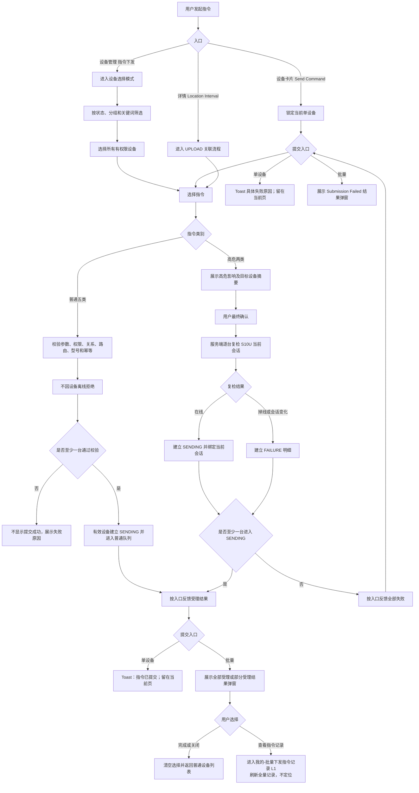

# 革泰 APP 指令单设备与批量下发逻辑点梳理（v2 草案）

> **文档用途**：梳理革泰 APP 指令单设备下发与批量下发的入口、设备选择、指令分类、参数选择、提交资格、在线会话校验、确认交互、批量部分失败、提交反馈、记录跳转、幂等及异常边界，作为产品、研发评审和测试用例编写依据。
>
> **本篇范围**：展开 APP 发起指令到服务端受理结果返回的交互流程，并定义普通队列类与高危会话绑定类指令在提交阶段必须满足的最低安全约束。
>
> **本篇不展开**：指令记录页面完整状态机、设备业务回文解析、队列内部存储实现、回调补偿、数据对账和历史记录保留周期。这些内容由指令记录及平台—终端交互专项展开。
>
> **实际链路**：革泰 APP 指令实际通过 **S10U 独立服务及网关**完成下发。PN06 仅作为普通指令队列式交互的参考，不代表革泰复用 PN06/808 网关、接口、消息类型、数据库或在线状态。
>
> **冲突处理**：本篇以最新确认的“普通五类离线可提交、高危两类绑定当前 S10U 在线会话”为准。旧大纲中的“七类指令统一在线限制”“批量离线设备不可选择”等规则作废。
>
> **草案说明**：未正式裁决的内容统一列入“待确认事项”，不得直接作为已实现功能或验收通过标准。

---

## 1. 范围、对象与核心结论

### 1.1 本篇覆盖

- 设备卡片更多菜单中的 `Send Command`；
- 设备管理页底部“指令下发”；
- 批量流程只选择 1 台或多台设备；
- 设备详情 `Location Interval` 产生的 `UPLOAD` 指令；
- 普通队列类与高危会话绑定类指令分类；
- 设备选择、筛选、全选、取消选择；
- 指令和参数选择；
- 服务端权限、关系、路由、型号及参数校验；
- 高危指令的 S10U 当前在线会话复检；
- 批量部分失败和数量守恒；
- 指令受理反馈；
- 查看指令记录入口；
- 网络异常、重复点击和幂等；
- 高危会话断开、解绑、回收和改绑等安全边界。

### 1.2 本篇不展开

- S10U 队列的具体存储介质；
- 终端协议编码；
- 设备业务回文完整解析；
- 指令记录页面完整展示规则；
- 普通任务过期回调及补偿实现；
- 取消和重发的完整记录状态机；
- 设备最终业务动作是否成功。

本篇虽然不展开上述实现，但必须明确以下提交边界：

1. 普通指令是否允许离线受理；
2. 高危指令是否绑定当前 S10U 会话；
3. 高危任务断线后是否出队；
4. 批量最终复检失败是否建立明细；
5. 关系失效是否清理未写出任务。

### 1.3 核心结论

1. 革泰实际使用 S10U 独立链路，PN06 仅作为队列式交互参考。
2. 七类指令拆分为普通队列类和高危会话绑定类。
3. `CR/VERNO/FIND/UPLOAD/ZONE` 为普通队列类，在线、离线、未连接均可提交。
4. `RESET/POWEROFF` 为高危会话绑定类，提交时必须存在 S10U 当前可写在线会话。
5. 普通指令不能因为设备离线或未连接被拒绝，但仍必须校验设备关系、S10U 路由、型号能力和参数。
6. 高危任务必须绑定提交时的 S10U 会话，不能只保存 `online=true`。
7. 高危任务写出前绑定会话断开时，任务立即进入 `FAILURE` 并出队。
8. 设备断线后重新建立的新会话，不得获取或执行旧高危任务。
9. 批量设备选择阶段允许选择在线、离线、未连接和告警设备。
10. 批量选择高危指令时不新增离线设备前置拦截；沿用原确认流程，由服务端在最终提交时逐台复检。
11. 高危最终确认时仍需由服务端逐台复检 S10U 当前会话。
12. 批量高危最终复检掉线的设备必须建立逐设备 `FAILURE` 明细。
13. 批量中部分设备失败时，有效设备继续受理，不做整批回滚，并通过三状态结果弹窗明确展示提交数量。
14. 解绑、企业回收、改绑或关系失效后，相关未写出任务必须转 `FAILURE` 并从队列清理。
15. `UPLOAD/ZONE` 的已受理任务全部保留并按顺序执行，最终目标以最新提交值为准。
16. `SENT` 只表示 S10U 已完成 TCP 写出，不表示设备业务动作已经成功。
17. “指令已提交”只表示至少一台设备被服务端受理，不表示全部设备成功或已经执行。

---

## 2. 术语定义

| 术语 | 定义 |
| --- | --- |
| 页面在线快照 | APP 页面进入时展示的设备状态，仅供用户参考，不能作为高危指令最终安全依据 |
| S10U 当前在线会话 | S10U 服务端当前持有的、属于目标设备且可写的 TCP session/channel |
| 会话标识 | 能唯一识别一次连接生命周期的 `sessionId/sessionEpoch/channelId` |
| 普通队列类 | 允许设备离线受理，并在设备后续恢复通信后写出的指令 |
| 高危会话绑定类 | 提交时必须在线，只能由提交时绑定的同一会话写出的指令 |
| 未写出任务 | 尚未完成 TCP 写出提交的指令任务 |
| 受理 | 服务端完成前置校验并建立指令明细或任务 |
| 写出 | S10U 已将指令内容写入对应设备的 TCP 通道 |
| 业务回文 | 设备执行指令后返回的文本或业务数据，不等同于 TCP 写出结果 |
| 关系失效 | 解绑、企业分配回收、改绑、账号失权或上级关系失效 |
| 用户主动重发 | 用户再次表达发送意图，生成新的发送尝试 |
| 网络安全重试 | 同一次用户操作因超时或连接异常而重复调用，必须复用原幂等标识 |

---

## 3. 七类指令策略矩阵

| 页面分类 | 页面指令 | 协议命令 | 参数 | 指令类别 | 离线提交 | 最终在线复检 |
| --- | --- | --- | --- | --- | ---: | ---: |
| 常用指令 | 立即定位 | `CR` | 无 | 普通队列类 | 允许 | 不需要 |
| 常用指令 | 查询版本 | `VERNO` | 无 | 普通队列类 | 允许 | 不需要 |
| 现场操作 | 查找设备 | `FIND` | 无 | 普通队列类 | 允许 | 不需要 |
| 参数设置 | 设置上传间隔 | `UPLOAD` | 上传间隔秒数 | 普通配置队列类 | 允许 | 不需要 |
| 参数设置 | 设置设备时区 | `ZONE` | UTC 偏移 | 普通配置队列类 | 允许 | 不需要 |
| 设备控制 | 远程重启 | `RESET` | 无 | 高危会话绑定类 | 不允许 | 必须 |
| 设备控制 | 远程关机 | `POWEROFF` | 无 | 高危会话绑定类 | 不允许 | 必须 |

### 3.1 生命周期差异

| 场景 | 普通五类 | 高危两类 |
| --- | --- | --- |
| 提交时设备离线 | 允许受理 | 拒绝 |
| 当前无可写会话 | 允许进入普通队列 | 拒绝 |
| 受理后设备断线 | 继续等待 | 立即 FAILURE 并出队 |
| 设备重新连接 | 原任务可以继续 | 原任务不得恢复 |
| 队列有效期 | 待发最多 30 天，超期转 FAILURE | 绑定当前会话；会话断开或变化立即 FAILURE，是否增加会话内最大有效时间待确认 |
| 关系失效 | FAILURE 并出队 | FAILURE 并出队 |
| 用户主动重发 | 离线也可创建新尝试 | 必须重新复检并绑定新会话 |

---

## 4. 指令入口矩阵

| 入口 | 设备数量 | 普通指令 | 高危指令 | 记录归属 |
| --- | ---: | --- | --- | --- |
| 设备卡片更多 → `Send Command` | 固定 1 台 | 所有状态均可进入和提交 | 所有状态可进入指令页；无当前可写会话时可置灰并展示原因，状态变化后可刷新，提交时实时复检 | 单设备记录 |
| 设备管理 → 指令下发 | 选中 1 台 | 所有有权限设备均可选 | 所有状态均可进入确认；最终提交时逐台复检 | 批量流程记录 |
| 设备管理 → 指令下发 | 选中多台 | 所有有权限设备均可选 | 所有状态均可进入确认；最终提交时逐台复检 | 批量流程记录 |
| 设备详情 → Edit → Location Interval | 固定 1 台 | 在线、离线、未连接均可提交 UPLOAD | 不涉及 | 单设备记录 |

### 4.1 入口一致性原则

1. 所有入口复用同一套服务端权限、设备关系、路由、型号、参数和幂等校验。
2. 同一设备、同一指令不能因为入口不同出现无业务依据的准入差异。
3. “批量流程只选择 1 台”仍属于批量入口，不得按设备数量切换到单设备直接入口。
4. 所有入口必须携带设备唯一标识。
5. 所有入口产生的 `UPLOAD/ZONE` 应进入同一设备、同一配置项的顺序体系。
6. 页面按钮状态不能替代服务端校验。
7. 设备更多菜单只进入 `Send Command`；设备指令记录的唯一入口为单设备下发页底部常驻「指令记录」，返回时回到原下发页且不主动重置指令与参数。

---

## 5. 下发资格与提交条件

### 5.1 所有指令共同校验

| 条件 | 规则 | 不满足时处理 |
| --- | --- | --- |
| 登录会话有效 | 当前账号未退出或失效 | 拒绝提交 |
| 账号状态正常 | 冻结或禁用账号沿用平台规则 | 拒绝提交 |
| 当前设备关系有效 | 当前账号仍具有设备控制关系 | 服务端已识别操作意图时，建立明确 FAILURE 记录 / 明细 |
| 设备唯一标识有效 | 按 Device ID 定位目标设备 | 服务端可识别目标操作时建立 FAILURE；无法识别目标时按请求错误返回 |
| S10U 路由有效 | 设备具有合法路由标识并已接入 S10U | 建立 FAILURE，不得当作普通离线排队 |
| 型号支持 | 当前型号支持目标指令及参数 | 建立 FAILURE |
| 参数合法 | 格式、范围和枚举通过校验 | APP 本地拦截且请求未发出时不建记录；服务端校验失败时建立 FAILURE |
| 幂等标识有效 | 能识别同一用户操作和网络重试 | 防止重复任务 |
| 服务端容量允许 | 未超过单批、队列和限流边界 | 明确拒绝或分片，禁止静默截断 |

### 5.2 设备状态 × 指令类别矩阵

| 设备状态 | 普通五类 | 高危两类 |
| --- | --- | --- |
| 在线，无告警 | 允许 | 允许，但提交时仍复检 |
| 在线 + 告警 | 允许 | 允许，但提交时仍复检 |
| 离线 | 允许进入普通队列 | 不允许 |
| 未连接但路由合法 | 允许进入普通队列 | 不允许 |
| 缺少 S10U 路由 | 失败 | 失败 |
| 状态未知 | 不因在线未知拒绝，但必须确认路由合法 | 不允许直接提交，应区分设备离线与状态服务异常 |
| 选择时在线、确认时掉线 | 不影响普通指令受理 | 建立 FAILURE，不进入高危队列 |
| 受理后掉线 | 继续普通队列 | 立即 FAILURE 并出队 |

### 5.3 高危在线判定

高危指令提交时必须由 S10U 服务端确认：

1. 目标设备当前存在有效会话；
2. 当前会话可写；
3. 返回稳定的会话标识；
4. 查询异常与设备离线必须使用不同的错误原因；
5. 创建任务时保存绑定会话标识；
6. 写出前再次比较当前会话与绑定会话。

禁止以下错误实现：

```text
只读取 APP 页面在线状态；
只判断数据库中的 online=true；
只判断设备最近一次心跳时间；
设备重连后使用新会话执行旧高危任务。
```

### 5.4 服务到期

以下规则尚未正式确认，不能自行作为验收标准：

- 提交时服务已到期是否允许下发；
- 提交时有效、排队期间到期如何处理；
- 到期后续费是否恢复旧普通任务；
- 高危任务等待写出期间服务到期如何处理。

---

## 6. 总体主流程



---

## 7. 单设备直接下发流程

### 7.1 在线设备

```text
设备列表
→ 点击目标设备更多菜单
→ Send Command
→ 进入当前设备指令页
→ 展示设备摘要和页面在线快照
→ 展示七类指令
→ 用户选择指令
```

#### 选择普通指令

```text
设置参数
→ 确认提交
→ 服务端校验权限、关系、路由、型号、参数和幂等
→ 不因确认期间掉线拒绝
→ 建立 SENDING
→ 进入普通队列
```

#### 选择高危指令

```text
展示操作影响
→ 二次确认
→ 服务端查询 S10U 当前可写会话
→ 通过：建立 SENDING，绑定当前会话
→ 不通过：拒绝并展示具体原因
```

### 7.2 离线或未连接设备

```text
设备列表
→ 点击离线设备更多菜单
→ Send Command
→ 正常进入设备指令页
→ 页面统一显示离线；尚无有效通信记录时补充“尚未连接”原因
```

页面规则：

- “未连接”是尚无有效通信记录的内部事实状态，在设备列表筛选与统计中统一归入离线；指令页如需区分，展示为“离线·尚未连接”或同等原因文案，不建立独立筛选状态；
- `CR/VERNO/FIND/UPLOAD/ZONE` 正常可选；
- `RESET/POWEROFF` 可根据最近一次会话快照置灰并展示具体原因，但页面从后台恢复、收到通信状态变化或用户尝试操作时应刷新当前 S10U 会话；
- 单设备与批量高危指令均以提交时服务端实时会话复检为最终准入依据；
- 普通指令提交后提示“设备恢复通信后将按顺序发送”；
- 缺少路由、设备注销或型号不支持时不能当作普通离线队列成功处理。

### 7.3 页面状态滞后

#### 在线进入页面，提交前掉线

- 普通指令继续允许提交；
- 高危指令最终服务端复检失败；
- 不依赖页面快照放行高危任务。

#### 离线进入页面，停留期间恢复在线

统一按“页面提示可刷新、服务端最终复检”处理：

- 页面可以先按进入时快照将 `RESET/POWEROFF` 置灰；
- 页面从后台恢复、收到设备通信状态变化或用户点击高危置灰项时，触发一次当前 S10U 会话刷新；
- 刷新确认存在当前可写会话后，可解除置灰并允许进入二次确认；
- 刷新失败或仍无会话时保持置灰，并展示具体原因；
- 无论页面如何展示，提交时服务端仍须重新查询并复检当前会话；
- 同一设备、同一时刻、同一高危指令不得仅因单设备或批量入口不同产生无业务依据的准入差异。

### 7.4 单设备提交后的即时反馈

#### 受理成功

```text
用户完成二次确认并点击 Save
→ 服务端受理成功
→ 关闭确认弹窗
→ Toast：指令已提交
→ 留在当前设备指令页
```

单设备不展示批量使用的独立结果弹窗，也不自动跳转指令记录。下发页底部常驻「指令记录」入口，成功、明确失败或结果未知后均由用户主动进入；记录页返回时回到原下发页，不主动重置已选指令与参数。

#### 当场提交失败

```text
服务端拒绝或高危最终会话复检失败
→ 建立 FAILURE 审计记录
→ Toast 展示具体失败原因
→ 关闭 loading，保留当前指令及参数
→ 留在当前设备指令页
```

建议字段：

```text
failureStage = FINAL_RECHECK
failureReason = SESSION_NOT_ACTIVE / SESSION_CHANGED / SYSTEM_ERROR
```

#### 网络超时、受理结果未知

不得直接提示“提交失败”，应进入持久的“正在确认提交结果”状态并提示：

```text
提交结果暂未确认，系统正在查询原操作，请勿重复发送
```

处理规则：

1. 保留原 `operationId / requestId / idempotencyKey`，查询或安全重试原操作；
2. 确认期间主提交按钮保持禁用，不得恢复为可再次创建新指令的普通状态；
3. APP 切后台、重启或切换网络后继续恢复原核验流程；
4. 查到原操作后按受理成功或明确失败更新页面和记录；
5. 只有服务端明确确认原请求未受理时，才允许用户重新发送并创建新的用户意图。

---

## 8. 批量设备选择

### 8.1 进入多选模式

- 设备管理页点击底部“指令下发”；
- 页面标题切换为“选择设备”；
- 顶部显示已选数量；
- 保留状态、分组和关键词筛选；
- 在线、离线、未连接、告警设备均允许选择；
- 选择资格以当前账号是否具备有效设备关系为准；
- 底部展示“选择指令（N）”。

### 8.2 选择范围

| 操作 | 规则 |
| --- | --- |
| 手动勾选 | 当前筛选结果中所有有权限设备均可选择 |
| 告警设备 | 告警属于叠加状态，不单独禁止选择 |
| 离线设备 | 可以选择 |
| 未连接设备 | 可以选择；未连接在列表统计中归入离线，S10U 路由由最终提交阶段逐台校验，缺少路由时建立明确 FAILURE 明细 |
| 全选当前结果 | 选择状态、分组、关键词交集范围内全部有权限设备 |
| 取消全选 | 清空当前选择 |
| 重复设备 | 同一批次按设备唯一标识去重 |

### 8.3 筛选变化

暂沿用原确认规则：

- 切换状态；
- 切换分组；
- 修改或清空关键词；

均清空之前已选设备，并同步：

1. 复选框取消；
2. 已选数量归零；
3. 底部按钮恢复未选择状态；
4. 必要时展示轻提示。

### 8.4 选择普通指令

- 在线、离线、未连接设备均可进入确认；
- 离线不属于普通指令失败原因；
- 服务端逐台校验权限、关系、路由、型号和参数；
- 有效设备进入普通队列；
- 无效设备形成明确失败结果。

### 8.5 选择高危指令

当前选择中即使存在页面快照为离线或未连接的设备，也沿用原批量交互流程：

1. 不新增离线设备前置拦截弹窗；
2. 不要求用户在进入确认前手动移除离线设备；
3. 不静默剔除任何已选设备；
4. 所有已选设备均进入最终提交范围；
5. 服务端在最终提交时逐台复检 S10U 当前会话；
6. 存在当前可写会话的设备继续受理；无当前会话、会话变化或会话查询异常的设备建立 `FAILURE` 明细，不以设备列表在线标签替代会话事实；
7. 提交后通过全部受理、部分受理、全部失败三种结果弹窗明确展示数量。

### 8.6 高危最终复检

最终确认时，服务端必须重新查询每台设备的 S10U 当前会话。

| 结果 | 处理 |
| --- | --- |
| 全部设备存在当前可写会话 | 全部进入高危会话绑定队列 |
| 部分在线、部分掉线 | 在线设备继续；掉线设备建立 FAILURE；不回滚在线设备 |
| 全部掉线 | 所有设备建立 FAILURE；不显示提交成功 |
| 会话查询接口异常 | 按系统异常处理，不得伪装成设备离线 |
| 会话在复检期间变化 | 旧会话不得继续使用，按 SESSION_CHANGED 失败 |

### 8.7 批量数量守恒

必须满足：

```text
最终选中去重数量 = 批次设备明细数量
```

进一步满足：

```text
批次设备明细数量
= SENDING 数量
+ SENT 数量
+ FAILURE 数量
+ CANCEL 数量
```

提交阶段可表示为：

```text
最终选中去重数量
= 已受理数量
+ 权限失败数量
+ 路由失败数量
+ 型号失败数量
+ 参数失败数量
+ 会话失败数量
+ 其他明确失败数量
```

任何设备不得静默消失。

---

## 9. 指令与参数

### 9.1 指令目录

| 分类 | 页面指令 | 协议命令 | 是否有参数 | 指令类别 |
| --- | --- | --- | ---: | --- |
| 常用指令 | 立即定位 | `CR` | 否 | 普通队列 |
| 常用指令 | 查询版本 | `VERNO` | 否 | 普通队列 |
| 现场操作 | 查找设备 | `FIND` | 否 | 普通队列 |
| 参数设置 | 设置上传间隔 | `UPLOAD` | 是 | 普通配置队列 |
| 参数设置 | 设置设备时区 | `ZONE` | 是 | 普通配置队列 |
| 设备控制 | 远程重启 | `RESET` | 否 | 高危会话绑定 |
| 设备控制 | 远程关机 | `POWEROFF` | 否 | 高危会话绑定 |

### 9.2 设置上传间隔

| 选项 | 分钟值 | 下发参数 |
| --- | ---: | ---: |
| 1 分钟（耗电模式） | 1 | 60 秒 |
| 10 分钟（默认模式） | 10 | 600 秒 |
| 1 小时（省电模式） | 60 | 3600 秒 |
| 自定义 | 1～1440 整数分钟 | 分钟 × 60 秒 |

> 上述数值以最新需求和终端协议能力为准，核对位置为革泰产品需求及 S10U 指令参数契约。

规则：

1. 一次只能选择一个预设值或自定义值；
2. 自定义为空、0、1441、小数或非数字时不能提交；
3. 1 和 1440 为有效边界；
4. 取消参数弹层时不保存本次选择；
5. APP 页面刷新间隔与设备上传间隔不是同一配置；
6. 详情页确认值、本地编辑值、最新目标值和处理中值必须区分；
7. 离线设备允许提交 UPLOAD。

### 9.3 设置设备时区

1. 使用终端协议支持的 UTC 偏移枚举；
2. 具体可选值由服务端或统一配置返回；
3. APP 不自行创造时区范围；
4. 设备 ZONE 与“我的 → 时区设置”的 APP 展示时区不是同一配置；
5. 未选择时区不能提交；
6. 离线设备允许提交 ZONE。

### 9.4 UPLOAD/ZONE 多任务顺序

已确认原则：

1. 所有已受理任务均保留；
2. 不采用“只保留最后一条未写出任务”；
3. 同一设备、同一配置项按提交顺序执行；
4. UPLOAD 与 ZONE 分别排序，互不覆盖；
5. 单设备、批量和详情入口进入同一个设备配置序列；
6. 最终用户目标取最新提交参数；
7. 旧任务业务回文不得覆盖最新目标；
8. 每条任务保留独立审计记录。

建议数据字段：

```text
deviceId
commandType
commandId        // 一条用户可见逻辑记录，重发时保持不变
attemptId        // 初次发送或一次用户主动重发
businessId       // S10U 网关任务标识，与 attemptId 一一映射
configSequence
desiredValue
```

以下内容仍待确认：

- 前一条进入 `SENT` 后发送下一条，还是收到业务回文后发送下一条；
- 前一条 `FAILURE/CANCEL` 后是否立即推进下一条；
- 一次上行是否允许连续写出多条配置指令；
- 服务重启后如何恢复未完成顺序。

### 9.5 配置值分层

至少区分：

| 值 | 含义 |
| --- | --- |
| `confirmedValue` | 最后一次可靠确认已经生效的值 |
| `desiredValue` | 用户最新提交的目标值 |
| `processingValue` | 当前正在排队或写出的任务值 |

用户提交新值不能直接覆盖 `confirmedValue`。

---

## 10. 确认下发

### 10.1 普通指令确认面板

沿用当前确认面板，不新增离线数量或额外操作步骤。展示：

- 已选择设备数量；
- 指令名称；
- 参数摘要；
- 取消；
- 确认下发。

离线设备是否已受理及后续状态不在确认面板提前展开，提交结果由结果弹窗和指令记录承接。

### 10.2 高危指令确认面板

展示：

- 已选择设备数量；
- 设备名称或摘要；
- 重启或关机影响；
- 高危任务只对当前在线会话有效；
- 设备断线后任务失败且不会在下次上线补发；
- 取消；
- 确认下发。

批量关机沿用普通二次确认，不落实“长按 1 秒确认”，不新增独立操作手势。

### 10.3 返回、取消和蒙层

| 操作 | 结果 |
| --- | --- |
| 确认面板返回 | 返回指令选择或参数页，保留已选设备 |
| 确认面板取消 | 关闭确认面板，不提交 |
| 蒙层存在 | 底层控件不可点击 |
| 设备选择页取消 | 退出多选模式并清空选择 |
| 高危存在离线设备 | 不新增前置拦截，沿用确认流程并在最终提交时逐台复检 |

---

## 11. 服务端受理流程

### 11.1 普通指令

```text
收到提交请求
→ 校验账号、关系、设备、路由、型号、参数和幂等
→ 不校验在线状态
→ 创建 SENDING 明细
→ 进入普通待写出队列
→ 当前会话可写时按队列顺序写出
→ 无当前会话时等待后续通信
→ 待发超过 30 天仍未写出时删除队列任务并同步转 FAILURE
```

### 11.2 高危指令

```text
收到提交请求
→ 校验账号、关系、设备、路由、型号、参数和幂等
→ 查询 S10U 当前可写会话
→ 无会话：FAILURE
→ 有会话：保存 boundSessionId/sessionEpoch
→ 创建 SENDING
→ 进入高危会话绑定队列
→ 仅允许绑定会话写出
```

### 11.3 高危会话生命周期

```text
SENDING + boundSessionId / sessionEpoch / channelId
├─ 同一绑定会话内写出成功 → SENT
├─ 绑定会话断开 → FAILURE + 出队
├─ 当前会话已被新会话替换 → FAILURE + 出队
├─ 设备关系失效 → FAILURE + 出队
├─ 用户发起取消 → APP 乐观展示 CANCEL
│  ├─ 未写出且队列删除成功 → 维持 CANCEL
│  └─ 已实际完成写出 → CANCEL 修正为 SENT
└─ 最大有效时间到期 → FAILURE + 出队（有效时间及起算点待产品裁决）
```

`SENDING_BOUND` 不作为第五种 APP 状态；会话绑定通过 `boundSessionId / sessionEpoch / channelId` 等属性表达。高危任务不得从旧会话迁移到新会话。

### 11.4 写出与断线竞态

必须保证同一任务的权威发送结果最终收敛；允许 APP 乐观 CANCEL 被已经发生的 SENT 事实修正，但不允许 SENT 再被迟到取消结果覆盖：

| 原子事实先完成 | 权威状态 |
| --- | --- |
| TCP 写出提交成功 | SENT |
| 未写出且用户取消删除队列成功 | CANCEL |
| APP 已展示 CANCEL，后确认实际已写出 | CANCEL → SENT，并提示取消未生效 |
| SENT 后到达迟到取消结果 | 保持 SENT |
| 断线清队列成功 | FAILURE |
| 关系失效清理成功 | FAILURE |

禁止同一任务同时出现 `SENT` 和 `FAILURE`；重复写出、取消或清理回调不得重复累计统计、重复通知或重复产生副作用。

### 11.5 关系失效

以下事件发生时：

- 设备解绑；
- 企业分配回收；
- 设备改绑；
- 上级关系失效；
- 当前账号失去控制权限；

处理规则：

1. 查找相关未写出任务；
2. 从普通或高危队列清理；
3. 记录转 `FAILURE`；
4. 保存明确的失败阶段和原因；
5. 已 `SENT` 记录只保留审计，不尝试回滚；
6. 真正写出前仍需复检当前关系版本。

---

## 12. 提交反馈

### 12.1 入口反馈分流

- 单设备入口不展示独立结果弹窗，成功、失败和结果未知的反馈见 7.4；
- 批量入口沿用当前底部结果弹窗结构，不新增页面和操作步骤；
- 批量结果弹窗顶栏统一使用 `Submission Result`，不得继续使用提交前语义的 `Confirm command`；
- 弹窗根据全部受理、部分受理、全部失败切换图标、主标题、数量和说明文案。

### 12.2 全部受理

```text
Submission Result

[绿色成功图标]

Command Submitted

N of N devices submitted.

The device execution results may be returned later.
View them in Command History.

[Command History] [Done]
```

### 12.3 部分受理、部分失败

```text
Submission Result

[黄色警告图标]

Partially Submitted

M of N devices submitted.
F devices failed to submit.

View details in Command History.

[Command History] [Done]
```

其中必须满足：

```text
N = M + F
```

不得在部分受理时继续使用纯成功图标和无数量的 `Command Submitted`，避免用户误认为全部设备均已提交。

### 12.4 全部失败

```text
Submission Result

[红色失败图标]

Submission Failed

0 of N devices submitted.

No commands were submitted.
View failure details in Command History.

[Command History] [Done]
```

全部失败时不得显示 `Command Submitted`。由于仍保留 `Command History` 按钮，即使 0 台设备被受理，本次批量也必须建立可查询的批次及逐设备 `FAILURE` 明细，禁止跳转后出现无记录空页面。

### 12.5 弹窗操作

| 操作 | 结果 |
| --- | --- |
| `Command History` | 直接进入「我的 → 批量下发指令记录」L1，刷新全量记录，不携带定位、高亮或预置筛选上下文 |
| `Done` | 结束本次批量操作，清空设备、指令和参数，退出多选模式并返回普通设备列表 |
| 右上角 `×` | 与 `Done` 完全一致，不得保留不同的隐藏行为 |

### 12.6 数量与文案语义

三种状态均展示数量，数量必须来自服务端返回的本次批量最终去重统计，不得使用页面标签总数、分组数量、当前分页数量或前端未去重选择数。

```text
最终目标设备数
= submitted 数量
+ failedToSubmit 数量
```

弹窗只表达服务端提交受理结果，应使用：

- `Submitted`；
- `Failed to submit`；
- `Submission Failed`。

不得使用 `Executed successfully`、`Execution failed`、`Delivered` 等词冒充设备已经执行或完成业务动作。

### 12.7 查看指令记录

本篇只约束：

- 批量三种结果均保留 `Command History` 入口；
- 点击后直接进入「我的 → 批量下发指令记录」L1，刷新全量记录，不自动筛选、定位或高亮本次批次；
- 全部失败时同样必须存在可查询的批次与逐设备 FAILURE 明细；
- `batchId` 仅用于后台追踪和查询，不作为页面跳转上下文。

---

## 13. 防重复、幂等与重试

### 13.1 前端防重复

1. 点击最终确认后按钮进入 loading；
2. 当前请求完成前禁止再次点击；
3. 参数弹层和确认面板不得重复打开；
4. 成功后返回不能重复提交原请求；
5. 前端按钮禁用不能替代服务端幂等。

### 13.2 标识层级

| 字段 | 含义 |
| --- | --- |
| `operationId` | 一次用户确认操作 |
| `batchId` | 一次批量操作 |
| `deviceId` | 批量内设备唯一维度 |
| `commandId` | 一条用户可见逻辑记录；初次发送创建，用户主动重发时保持不变 |
| `attemptId` | commandId 下的一次发送尝试；初次发送和每次用户主动重发各自独立 |
| `businessId` | S10U 网关任务标识，与 attemptId 一一映射，用于写出与回文追踪 |
| `requestId/idempotencyKey` | 同一 attempt 的网络安全重试 |
| `boundSessionId` | 高危任务绑定的 S10U 会话 |
| `configSequence` | UPLOAD/ZONE 顺序编号 |

### 13.3 网络重试

- 请求超时但服务端是否受理未知时，不得直接创建新任务；
- 使用原幂等标识查询或安全重试；
- 网络重试复用原 attempt；
- 同一批次同一设备只能受理一次；
- 重复回调不得重复变更状态。

### 13.4 用户主动重发

- 用户完成重发二次确认后，视为新的用户意图并生成新的后台 attempt；
- 记录页面不新增可见卡片，原卡更新状态并累计「已重发 N 次」，只展示最近一次发送、反馈和失败信息；
- 普通指令离线也可重发；
- 高危指令的重发按钮可点击，确认后必须重新复检当前可写会话；复检失败时，新 attempt 直接进入 FAILURE，重发次数增加并展示本次失败原因，不复活旧高危任务；
- 高危重发必须绑定重发时的新当前会话，禁止复活旧高危任务。

---

## 14. 批量数量与性能边界

1. APP 不自行假设服务端无限承载；
2. 全选当前结果可能包含大量在线和离线设备；
3. 服务端必须定义单批设备上限；
4. 超限时明确拒绝或分片；
5. 不得只处理前 N 台却显示全部提交；
6. 分片后必须保持统一 batchId 或可追溯父批次；
7. 部分分片失败时不得丢失设备明细；
8. 网络超时后应支持按 batchId 查询实际结果；
9. 具体单批上限、分片大小、并发数和限流码待研发确认。

---

## 15. 异常与边界场景

| 编号 | 场景 | 预期 |
| --- | --- | --- |
| CMD-01 | 离线设备进入单设备指令页 | 正常进入；普通五类可选，高危两类置灰 |
| CMD-02 | 离线设备提交 CR | 正常受理并进入普通队列 |
| CMD-03 | 离线设备提交 UPLOAD | 正常受理，目标值进入待处理状态 |
| CMD-04 | 构造请求对离线设备提交 RESET | 服务端拒绝，不能绕过前端 |
| CMD-05 | 告警 + 在线设备 | 普通和高危均可选择，高危最终复检 |
| CMD-06 | 告警 + 离线设备 | 普通可提交，高危不可提交 |
| CMD-07 | 批量模式选择离线设备 | 允许选择 |
| CMD-08 | 混合在线/离线设备全选 | 选择当前范围内全部有权限设备 |
| CMD-09 | 混合状态设备选择普通指令 | 允许进入确认 |
| CMD-10 | 混合状态设备选择高危指令 | 不新增前置拦截，正常进入确认并由服务端逐台复检 |
| CMD-11 | 高危确认时部分设备掉线 | 在线设备 SENDING、掉线设备 FAILURE；展示 `Partially Submitted` 及数量 |
| CMD-12 | 高危确认时全部设备掉线 | 全部 FAILURE；展示 `Submission Failed` 和 `0 of N devices submitted` |
| CMD-13 | 页面显示在线但 S10U 无当前会话 | 高危最终复检失败 |
| CMD-14 | S10U 会话查询接口异常 | 显示系统异常，不得提示设备离线 |
| CMD-15 | 高危任务受理后绑定会话断开 | 立即 FAILURE 并出队 |
| CMD-16 | 设备断线后快速重连 | 新会话不得执行旧高危任务 |
| CMD-17 | 高危写出和断线同时发生 | 只能产生 SENT 或 FAILURE 中一个结果 |
| CMD-18 | 普通任务受理后设备断线 | 保持普通队列，不立即失败 |
| CMD-19 | 普通任务排队期间设备解绑 | FAILURE 并出队 |
| CMD-20 | 设备改绑后重新上线 | 不得执行旧关系创建的未写出任务 |
| CMD-21 | 缺少 S10U 路由 | 失败，不得伪装成离线排队 |
| CMD-22 | 型号不支持目标指令 | 逐设备失败 |
| CMD-23 | UPLOAD 连续提交 600、3600、60 | 全部保留并按顺序执行，最终目标为 60 |
| CMD-24 | 旧 UPLOAD 回文晚到 | 不得覆盖更新的目标值 |
| CMD-25 | 自定义上传间隔为 1 或 1440 | 允许提交 |
| CMD-26 | 上传间隔为空、0、1441、小数或非数字 | 本地拦截，不发请求 |
| CMD-27 | ZONE 未选择参数 | 不允许提交 |
| CMD-28 | 设备选择后切换筛选条件 | 清空原选择 |
| CMD-29 | 连续点击最终确认 | 不产生重复任务 |
| CMD-30 | 请求超时后重试 | 复用原幂等标识 |
| CMD-31 | 批量部分权限失效 | 有效设备继续，失效设备失败 |
| CMD-32 | 批量选中数与明细数不一致 | 判定为数据一致性异常 |
| CMD-33 | 批量超过服务端容量 | 明确拒绝或分片，不静默截断 |
| CMD-34 | 普通任务超过队列保留期 | 队列删除并最终转 FAILURE |
| CMD-35 | CR 长时间排队后设备上线 | 按当前规则执行，但需提示延迟执行风险 |
| CMD-36 | FIND 长时间排队后设备上线 | 按当前规则执行，但需提示设备可能延迟鸣响 |
| CMD-37 | 服务到期设备提交指令 | 待正式裁决 |
| CMD-38 | 批量远程关机 | 沿用普通二次确认，不使用长按 1 秒 |
| CMD-39 | Location Interval 资料保存成功、UPLOAD 失败 | 两部分结果独立展示 |
| CMD-40 | Location Interval 资料保存失败、UPLOAD 已受理 | 不得因资料失败重复创建 UPLOAD |

---

## 16. 当前风险与逻辑漏洞

### 16.1 高危任务只绑定会话但没有最大有效时间

如果会话持续在线但长时间没有上行触发，高危任务可能延迟很久才执行。

建议：

```text
同一会话绑定
+
最大有效时间兜底
```

具体时长以最新产品需求和 S10U 上报周期为准，当前不得自行写死。

### 16.2 高危写出与断线竞态

必须由服务端或网关提供原子裁决，禁止同一任务形成两个终态。

### 16.3 普通队列过期后状态不同步

必须保证队列删除最终同步到业务记录，否则会永久停留 `SENDING`。

### 16.4 CR/FIND 长期排队

- “立即定位”可能不再立即；
- “查找设备”可能在用户离开现场后才触发；
- 建议增加排队提示和未写出取消能力；
- 是否采用独立有效期待确认。

### 16.5 UPLOAD/ZONE 顺序和回文

仅保证数据库排序不够，必须保证网关写出顺序和旧回文隔离。

### 16.6 部分失败反馈误导

仅显示 `Command Submitted` 会让用户误以为全部设备均已提交。已确认批量结果弹窗采用三状态：全部受理显示 `Command Submitted`，部分受理显示 `Partially Submitted`，全部失败显示 `Submission Failed`，三种状态均展示服务端最终统计数量。

### 16.7 状态快照滞后

页面状态只用于展示，高危安全必须由服务端最终复检保证。

### 16.8 批量容量

允许选择离线设备后，普通队列任务数量可能大幅增长，必须评估队列容量和限流。

---

## 17. 待确认事项

### 17.1 本篇页面交互待设计确认

以下内容不影响本篇业务流程定稿，但需由 UI/产品在出图和验收文案中确认：

1. `Submission Result` 三状态弹窗的最终中英文文案；
2. 全部受理、部分受理、全部失败三种图标资源、颜色和无障碍表达；
3. 单设备成功、失败、结果未知三类 Toast 的最终中英文文案；
4. 页面按钮最终统一使用 `Save`、`Confirm` 还是对应中文文案。

### 17.2 移交平台—终端交互专项

以下内容属于任务生命周期、队列或网关实现，不在本篇页面交互流程中继续展开，也不得因本篇未定义而由 APP 自行推断：

1. 高危任务在同一会话持续在线时是否增加最大有效时间及起算点；
2. UPLOAD/ZONE 队列推进、失败后续跑和单次上行写出数量；
3. 普通队列 30 天过期清理的服务重启恢复与补偿实现；
4. 服务到期与排队任务的内部处理；
5. S10U 会话查询接口、会话标识和错误码；
6. 批量分片大小、并发数和限流码；
7. CR/FIND 等未写出任务的取消能力；
8. 指令业务回文关联、补偿和对账。

### 17.3 已确认项

已确认规则均直接写入对应正文，不在本章重复罗列；待确认清单仅保留尚未裁决的实现与交互问题。

---

## 18. 验收红线

1. 普通五类不得因为设备离线或未连接被拒绝。
2. RESET/POWEROFF 提交时必须存在 S10U 当前可写会话。
3. 高危任务必须绑定具体会话标识。
4. 高危绑定会话断开后，任务必须失败并出队。
5. 新会话不得执行旧高危任务。
6. 页面在线快照不得替代服务端最终会话复检。
7. 高危会话查询异常不得伪装成设备离线。
8. 批量高危最终掉线设备必须建立 FAILURE 明细。
9. 批量任何设备不得从选中范围中静默消失。
10. 批量选中去重数量必须等于设备明细数量。
11. 缺少 S10U 路由不得作为普通离线任务成功受理。
12. 解绑、回收、改绑后，未写出任务不得继续执行。
13. UPLOAD/ZONE 必须按同设备同配置项顺序执行。
14. 旧配置回文不得覆盖最新目标。
15. 用户最新目标值不得直接冒充设备已确认值。
16. `SENT` 只能表示 TCP 写出，不得表示设备业务执行成功。
17. 网络重试不得重复创建任务。
18. 用户主动重发必须生成新的发送尝试。
19. 普通队列过期后，队列清理与业务 FAILURE 必须最终一致。
20. 高危写出、断线、取消和关系失效竞态只能产生一个最终结果。
21. 批量超限不得静默截断。
22. 批量全部失败时必须显示 `Submission Failed` 和 `0 of N devices submitted`，不得显示 `Command Submitted`。
23. 批量部分受理必须显示 `Partially Submitted`、已提交数量和提交失败数量。
24. 批量三种结果状态均必须满足 `最终目标设备数 = submitted 数量 + failedToSubmit 数量`。
25. 批量结果弹窗顶栏必须使用 `Submission Result`，不得继续使用提交前语义的 `Confirm command`。
26. 批量全部失败仍保留 `Command History` 时，必须存在可查询的批次和逐设备 `FAILURE` 明细。
27. 批量结果弹窗右上角 `×` 与 `Done` 行为必须一致，均清空本次操作并返回普通设备列表。
28. 单设备受理成功只显示 Toast 并留在当前页，不展示批量结果弹窗。
29. 网络超时且受理结果未知时不得直接提示提交失败，应提示用户前往指令记录核查。

---

## 19. 关联同步状态

已同步：

1. 《革泰 APP 指令逻辑变更影响分析与关联梳理》；
2. 《革泰 APP 指令记录逻辑点梳理 plan》；
3. 《S10U 指令交互状态逻辑点梳理》；
4. 《革泰 APP 设备管理逻辑点梳理 plan》；
5. 《革泰 APP 我的模块逻辑点梳理 plan》；
6. 《革泰 APP 时区设置逻辑点梳理 plan》。

待后续单独处理：单设备、批量、定位频率、指令记录测试用例及聚合质量报告。

---

**文档版本**：v2.1-draft（2026-10-10 记录入口、批量跳转、30 天普通队列与重发展示语义对齐）

**草案状态**：普通五类与高危两类的准入、记录跳转和页面反馈已确认；第 17 章剩余待确认事项在正式裁决前不得作为验收通过标准。

**维护人**：测试团队
