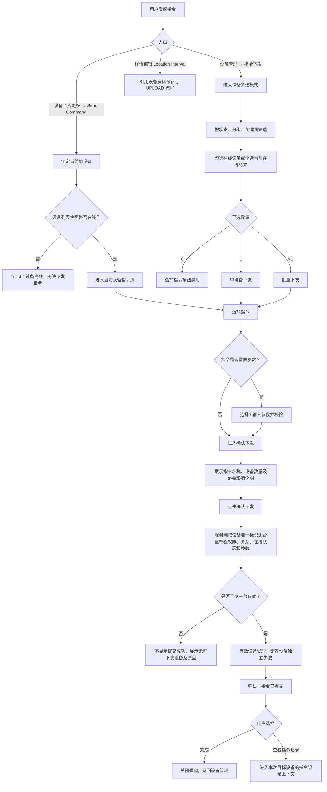

# 革泰 APP 指令单设备与批量下发逻辑点梳理.plan

<aside>
🎯

**文档用途**：梳理革泰 APP 指令单设备下发与批量下发的入口、设备选择、指令与参数选择、提交条件、确认、提交反馈、记录跳转、异常边界及当前逻辑漏洞，作为后续测试用例编写和产品 / 研发评审的依据。

**本篇范围**：只展开 APP 发起并提交指令的交互流程，截止到“指令已提交”反馈及进入指令记录。平台投递、终端 ACK、单次超时、自动补发、配置覆盖、迟到回复及最终执行状态，后续单独梳理，不在本篇定义通过标准。

**参考真源**：

1. 革泰 APP 产品需求文档：US-020、US-021、US-022 中与入口、参数、提交条件和记录入口相关的内容；
2. `docs/manuals/革泰/逻辑大纲/革泰 APP 设备管理逻辑点梳理 plan.md`；
3. `assets/革泰/1.png`～`6.png` 当前 UI；
4. 本轮确认结论。

**冲突处理**：当前 UI 能证明页面结构和交互顺序；PRD 能证明业务约束。两者冲突且本轮未确认的内容统一列入“待确认 / 逻辑漏洞”，不得直接当作已实现验收标准。

</aside>

---

## 1. 范围、对象与核心结论

### 1.1 本篇覆盖

- 单设备直接入口：设备卡片更多菜单中的 `Send Command`；
- 列表统一入口：设备管理页底部“指令下发”，选择 1 台时属于单设备下发，选择多台时属于批量下发；
- 指令和参数选择；
- 设备选择、筛选、全选、取消选择；
- 最终确认前的权限、设备关系和在线状态重校验；
- 提交成功 / 失败反馈；
- “完成”及“查看指令记录”的导航范围；
- 重复点击、状态滞后、部分设备失效、大批量等异常边界。

### 1.2 本篇不展开

- 指令实际投递通道；
- 终端协议编码和 ACK 关联；
- 30 秒等待、超时、自动补发与最长 30 天保留；
- 配置覆盖、重复 ACK、迟到 ACK；
- 指令是否已被终端实际执行；
- 指令记录最终状态机及“已送达”的技术判定。

上述内容统一归入后续“平台—终端指令交互逻辑”专项。

### 1.3 当前确认结论

1. 单设备有两个正式入口：卡片更多菜单直接进入；列表“指令下发”后只选择 1 台进入。
2. 设备详情编辑中的 `Location Interval` 会生成 `UPLOAD` 指令，但本篇只作关联引用，完整保存流程沿用设备管理大纲。
3. 当前账户只要对设备具有有效可见关系，即具备指令控制权；服务端仍必须按登录账号和设备唯一标识重新鉴权。
4. 离线 / 未连接设备不能下发指令；告警设备只要底层在线，仍可下发。
5. 批量选择页的离线设备置灰、不可勾选。
6. “全选当前结果”只选择当前状态、分组、关键词交集范围内的在线可下发设备，并跨分页按设备唯一标识去重。
7. 切换状态、分组或关键词时，清空之前已选设备，不跨筛选条件累计。
8. 最终确认时由服务端逐台重校验；有效设备继续，离线 / 失权设备独立失败；全部设备无效时不得显示“指令已提交”。
9. 提交成功弹窗只提示“指令已提交”，不展示 `Submitted / Skipped` 数量；实际情况进入指令记录查看。
10. 批量提交成功弹窗进入指令记录时，只展示本次选中设备对应的记录上下文，不直接跳到无范围限制的全设备历史。
11. APP 前端不写死单次批量数量上限；服务端容量、限流和分片阈值待确认。
12. 当前暂按所有接入型号均支持七类指令，不按 S18 / 186 做能力过滤。
13. 服务到期设备是否允许下发指令待确认。
14. 批量远程关机“长按 1 秒确认”在 PRD 中明确、当前 UI 未体现，列为需求 / UI 冲突。
15. 指令记录中的“已送达”技术含义待确认，本篇不得将其直接等同于设备执行成功。

---

## 2. 指令入口矩阵

| 入口 | 设备数量 | 进入方式 | 设备状态处理 | 后续页面 |
| --- | ---: | --- | --- | --- |
| 设备卡片更多 → `Send Command` | 固定 1 台 | 点击目标设备右上角更多菜单 | 在线进入；离线点击后 Toast“设备离线，无法下发指令”，不进入指令页 | 当前设备指令页 |
| 设备管理 → 指令下发 | 1 台 | 进入多选模式后只勾选 1 台 | 只允许勾选在线设备 | 选择指令 → 确认下发 |
| 设备管理 → 指令下发 | 多台 | 进入多选模式后勾选多台或全选当前结果 | 离线设备置灰不可选；告警但在线可选 | 选择指令 → 确认下发 |
| 设备详情 → Edit → Location Interval → 整页 Save | 固定 1 台 | 编辑设备资料并选择定位频率 | 仅在线且满足详情保存条件时生成 `UPLOAD` | 引用设备管理大纲，不在本篇重复展开 |

### 2.1 入口一致性原则

1. 卡片更多直接入口与列表选择 1 台入口必须复用同一套服务端权限、在线、参数和幂等校验。
2. 不允许因为入口不同，出现同一设备同一指令一个入口能发、另一个入口无业务依据地拒绝。
3. 所有入口必须携带设备唯一标识，不使用名称、备注、列表位置代替设备身份。
4. 设备详情产生的 `UPLOAD` 可以有独立页面交互，但最终仍进入同一指令服务和记录体系。

---

## 3. 下发资格与提交条件

### 3.1 账号与权限

| 条件 | 规则 | 不满足时处理 |
| --- | --- | --- |
| 登录会话有效 | 当前账号未退出、未失效 | 拒绝提交并引导重新登录 |
| 账号状态正常 | 冻结 / 禁用账号沿用原平台规则拦截 | 不进入指令提交成功 |
| 设备当前可见 | 个人、企业一级、二级、三级账号只要对设备存在有效可见关系，即允许控制 | 关系已失效时服务端拒绝 |
| 服务端重新鉴权 | 前端展示入口不能替代服务端鉴权 | 构造越权请求同样拒绝 |
| 设备唯一标识有效 | 按 Device ID / 设备唯一标识定位目标 | 缺失、非法或不存在时拒绝 |

### 3.2 设备状态

| 设备状态 | 能否下发 | 说明 |
| --- | --- | --- |
| 在线，无告警 | ✅ | 正常可选、可提交 |
| 在线 + 告警 | ✅ | 告警是叠加状态，不单独阻止指令下发 |
| 离线 | ❌ | 列表批量模式置灰不可选；单设备入口点击后 Toast 拦截 |
| 未连接 | ❌ | 统一按离线处理 |
| 选择时在线、确认时离线 | 部分失败 / 拒绝 | 最终确认时服务端重新校验，不依赖列表缓存 |
| 状态未知 | ❌ | 未明确在线时按离线处理，不冒险下发 |

### 3.3 其他条件

| 条件 | 当前口径 |
| --- | --- |
| 设备型号能力 | 暂按所有接入型号均支持七类指令 |
| 服务到期 | 是否仍允许下发待确认 |
| 参数有效 | 有参数指令必须通过格式、范围和枚举校验 |
| 同类任务冲突 | 同设备、同配置项已有处理中任务时是否允许再次提交，由服务端规则拦截；具体状态逻辑后续专项展开 |
| 批量数量 | APP 不写死上限；服务端阈值、限流、分片策略待确认 |

---

## 4. 总体主流程



---

## 5. 单设备直接下发流程

### 5.1 在线设备

```text
设备列表
→ 点击目标设备更多菜单
→ Send Command
→ 进入当前设备 Command Delivery / 指令页
→ 展示当前设备摘要及七类指令
→ 选择指令
→ 有参数则设置参数
→ 二次确认
→ 最终提交
→ 指令已提交
→ 完成 / 查看该设备指令记录
```

### 5.2 离线设备

```text
设备列表
→ 点击离线设备更多菜单
→ 点击 Send Command
→ Toast：设备离线，无法下发指令
→ 不进入指令页
→ 不建立本次有效指令提交
```

### 5.3 状态滞后

设备在列表中显示在线，但进入指令页后或点击确认前已离线：

1. 前端不能仅凭进入页面时的状态放行；
2. 最终确认接口必须重新校验；
3. 校验失败时不显示“指令已提交”；
4. 页面保留用户已选择的指令和参数，展示“设备离线，无法下发指令”；
5. 用户返回或设备恢复在线后可重新发起。

### 5.4 单设备高风险指令

- 远程关机、远程重启均使用普通二次确认；
- 确认内容必须展示目标设备名称 / 编号和操作影响；
- 本篇不要求单设备长按确认；
- 是否收到设备执行结果不在提交成功弹窗中表达。

---

## 6. 批量设备选择

### 6.1 进入多选模式

来源：`assets/革泰/1.png`、`2.png`。

- 设备管理页点击底部“指令下发”；
- 页面标题切换为“选择设备”；
- 顶部显示已选数量；
- 保留状态页签、分组筛选和设备编号 / 备注搜索；
- 在线设备展示可用复选框；
- 离线设备置灰且不可勾选；
- 底部展示“选择指令（N）”。

### 6.2 选择范围

| 操作 | 规则 |
| --- | --- |
| 手动勾选 | 仅可勾选当前筛选结果中的在线设备 |
| 告警设备 | 只要底层在线即可勾选 |
| 离线设备 | 置灰，不可勾选，不计入已选数量 |
| 全选当前结果 | 选择当前状态 × 分组 × 关键词交集中的全部在线设备，跨分页按设备唯一标识去重 |
| 取消全选 | 取消当前已选设备，已选数量归零 |
| 重复设备 | 同一设备无论通过多少关系或列表数据出现，同一批次只保留一次 |

### 6.3 筛选变化与已选设备

本轮确认规则：改变任一筛选条件时，清空之前已选设备。

包括：

- 切换全部 / 在线 / 离线 / 告警；
- 切换分组；
- 修改或清空关键词。

页面必须同步：

1. 清除原复选框选择；
2. 已选数量归零；
3. 底部按钮恢复未选择状态；
4. 不得在用户看不到的筛选范围中暗中保留设备。

建议在首次发生清空时提供轻提示，避免用户误以为选择丢失属于故障。

### 6.4 无设备可选

| 场景 | 预期 |
| --- | --- |
| 当前筛选结果全部离线 | 全部设备置灰；全选不产生选择；选择指令按钮禁用 |
| 搜索无结果 | 展示空态；已选数量为 0 |
| 当前账户无设备 | 不可进入有效下发链路，展示无可操作设备 |
| 当前筛选只有在线告警设备 | 允许选择并下发 |

---

## 7. 指令选择与参数

### 7.1 指令目录

来源：`assets/革泰/3.png` 与 PRD US-020。

| 分类 | 页面指令 | 协议命令 | 是否有参数 |
| --- | --- | --- | --- |
| 常用指令 | 立即定位 | `CR` | 否 |
| 常用指令 | 查询版本 | `VERNO` | 否 |
| 现场操作 | 查找设备 | `FIND` | 否 |
| 参数设置 | 设置上传间隔 | `UPLOAD` | 是 |
| 参数设置 | 设置设备时区 | `ZONE` | 是 |
| 设备控制 | 远程重启 | `RESET` | 否 |
| 设备控制 | 远程关机 | `POWEROFF` | 否 |

### 7.2 设置上传间隔

| 选项 | 分钟值 | 下发参数 |
| --- | ---: | ---: |
| 1 分钟（耗电模式） | 1 | 60 秒 |
| 10 分钟（默认模式） | 10 | 600 秒 |
| 1 小时（省电模式） | 60 | 3600 秒 |
| 自定义 | 1～1440 整数分钟 | 分钟 × 60 秒 |

规则：

1. 一次只能选择一个预设或自定义；
2. 自定义为空、0、1441、小数、非数字时不能进入最终确认；
3. 1 和 1440 为有效边界；
4. 取消参数弹层时不保存本次选择、不提交指令；
5. APP 页面刷新间隔与设备上传间隔不是同一配置；
6. 详情页当前值、弹层目标值与本次提交参数必须区分，实际生效结果不在本篇展开。

### 7.3 设置设备时区

1. 使用终端协议支持的 UTC 偏移枚举；
2. 具体可选值由服务端 / 协议能力返回或统一配置，APP 不自行创造范围；
3. 设备时区用于终端协议侧时间设置；
4. 不得与“我的 → 时区设置”的 APP 时间展示时区混为同一项；
5. 未选择时区时不能进入最终确认。

### 7.4 批量参数

- 同一批次只能选择一条指令；
- 同一组参数应用到本次全部目标设备；
- 当前暂按全部设备均支持七类指令和同一参数格式；
- 如果后续发现型号能力不同，需补充“型号 × 指令 × 参数”能力矩阵和批量混选规则。

---

## 8. 确认下发

### 8.1 普通确认面板

来源：`assets/革泰/4.png`。

必须展示：

- 已选择设备数量；
- 指令名称；
- 参数摘要（有参数时）；
- 取消；
- 确认下发（N 台）。

### 8.2 返回、取消与蒙层

| 操作 | 结果 |
| --- | --- |
| 确认面板左上返回 | 关闭确认面板，回到指令选择 / 参数页，保留已选设备 |
| 确认面板底部取消 | 关闭确认面板，回到指令选择 / 参数页，保留已选设备 |
| 蒙层存在 | 底层页面控件不可点击，必须先关闭当前弹窗 / 面板 |
| 设备选择页取消 | 退出多选模式并清空当前选择，返回普通设备管理页 |

### 8.3 最终服务端重校验

点击最终确认时，服务端逐台重新校验：

1. 登录账号和账号状态；
2. 设备唯一标识；
3. 当前账户是否仍具有设备可见 / 控制关系；
4. 设备实时在线状态；
5. 指令和参数合法性；
6. 同类指令冲突；
7. 服务到期控制规则（待确认）；
8. 服务端批量容量和限流。

### 8.4 部分有效

| 校验结果 | 处理 |
| --- | --- |
| 全部有效 | 受理本次全部设备 |
| 部分有效、部分掉线 / 失权 | 有效设备继续；无效设备独立失败，不回滚有效设备 |
| 全部无效 | 不显示“指令已提交”；展示本次无可下发设备及可读原因 |

当前提交成功弹窗不负责展示逐设备成功 / 失败数量；用户通过指令记录查看各设备实际情况。

### 8.5 批量远程关机冲突

| 来源 | 规则 |
| --- | --- |
| PRD US-021 | 展示目标数量与停机影响，长按 1 秒确认 |
| 当前 `assets/革泰/1.png`～`6.png` | 未提供批量关机专属确认页，无法证明长按交互已落实 |

结论：列为需求 / UI 冲突。本篇不把长按 1 秒写成当前已实现验收标准，但要求产品明确是否补充对应 UI。

---

## 9. 提交反馈与记录跳转

### 9.1 指令已提交

来源：`assets/革泰/5.png`。

当至少一台设备通过最终校验并被服务端受理后，弹出：

```text
指令已提交

设备执行结果可能稍后返回，
可在指令记录中查看。

[查看指令记录] [完成]
```

### 9.2 反馈语义

1. “指令已提交”只表示平台已接受本次至少一台有效设备的提交请求；
2. 不表示所有目标设备均已发送成功；
3. 不表示终端已经收到；
4. 不表示设备已经执行；
5. 不在该弹窗展示 `Submitted / Skipped` 数量；
6. 全部设备校验失败时不得展示该弹窗。

### 9.3 两个按钮

| 按钮 | 结果 |
| --- | --- |
| 完成 | 关闭弹窗并返回设备管理页 |
| 查看指令记录 | 进入本次目标设备对应的指令记录上下文 |

### 9.4 记录范围

本轮确认：

- 单设备直接入口：查看当前设备相关指令记录；
- 列表选择 1 台：查看该设备及本次提交上下文；
- 批量选择多台：查看本次选中设备对应的记录，不直接扩大为无范围限制的全部设备历史；
- “我的”中的全设备指令记录属于另一个全局入口。

当前 `assets/革泰/6.png` 文案为“全部设备下发指令历史”，与本轮确认的批次上下文存在差异，需要 UI / 产品统一。

### 9.5 状态边界

`assets/革泰/6.png` 出现绿色勾选、“已送达”、返回版本号和“设备离线，发送失败”等内容。本篇只确认提交后可以进入记录查看，不定义这些状态的技术判定。

“已送达”可能对应已投递、设备已回复或整体已确认，当前无统一定义，必须在后续平台—终端交互大纲中明确。

---

## 10. 防重复、网络异常与一致性

### 10.1 前端防重复

1. 点击最终确认后按钮进入 loading 并禁用；
2. 当前请求完成前不允许再次点击；
3. 参数弹层、确认面板不得同时重复打开；
4. 提交成功后不能通过返回再次重复提交原请求。

### 10.2 服务端幂等

1. 每次单设备或批量提交携带操作幂等标识；
2. 网络重试、重复点击、客户端重连不能为同一设备生成多条重复提交；
3. 批量请求按“批次幂等标识 + 设备唯一标识”去重；
4. 同一设备在同一批次只受理一次；
5. 前端禁用按钮不能替代服务端幂等。

### 10.3 网络异常

| 场景 | 预期 |
| --- | --- |
| 提交接口明确失败 | 不显示“指令已提交”；保留设备、指令和参数，展示可重试原因 |
| 请求超时，服务端是否受理未知 | 不直接重复创建新提交；应按幂等标识查询或安全重试 |
| 部分设备受理、部分设备拒绝 | 至少一台受理时可显示统一提交弹窗；各设备结果进入本次记录上下文 |
| APP 在提交过程中退出 / 切后台 | 服务端结果不依赖前端页面存活；重新进入后可通过记录查询 |

---

## 11. 批量数量与性能边界

1. APP 前端不写死固定 100 台、500 台等数量上限；
2. “全选当前结果”可能跨分页选择全部在线设备；
3. 服务端不能因此默认无限承载，必须有批量容量、并发、队列或分片保护；
4. 超过服务端允许范围时返回可读提示，不得静默截断；
5. 不能只提交前 N 台却仍显示全部已选择设备提交成功；
6. 具体单批上限、分片大小、并发数、接口超时和限流码待研发确认。

---

## 12. 异常与边界场景

| 编号 | 前置 / 操作 | 预期 |
| --- | --- | --- |
| CMD-01 | 离线设备更多菜单 → Send Command | Toast“设备离线，无法下发指令”，不进入指令页 |
| CMD-02 | 批量模式查看离线设备 | 卡片置灰、复选框不可用 |
| CMD-03 | 告警 + 在线设备 | 可正常选择和提交 |
| CMD-04 | 告警 + 离线设备 | 按离线处理，不可选择 |
| CMD-05 | 当前筛选结果混合在线 / 离线，点击全选 | 只选在线设备，离线不计入已选数量 |
| CMD-06 | 全选跨分页 | 按设备唯一标识选择当前筛选范围全部在线设备，不重复 |
| CMD-07 | 已选择设备后切换状态 / 分组 / 关键词 | 清空原选择，已选数量归零 |
| CMD-08 | 未选择设备 | “选择指令”按钮禁用 |
| CMD-09 | 选择 1 台进入统一入口 | 按单设备流程提交 |
| CMD-10 | 选择多台 | 同一指令和参数应用到全部目标设备 |
| CMD-11 | 自定义上传间隔为 1 / 1440 | 允许进入确认，分别换算 60 / 86400 秒 |
| CMD-12 | 上传间隔为空、0、1441、小数、非数字 | 阻止进入最终确认并提示修正 |
| CMD-13 | 参数弹层点击取消 | 不保存本次参数，不提交指令 |
| CMD-14 | 设备选择时在线，最终确认时离线 | 服务端拒绝该设备，其他有效设备继续 |
| CMD-15 | 设备关系在选择后被解绑 / 回收 | 服务端拒绝该设备，不允许越权提交 |
| CMD-16 | 批量中部分有效、部分无效 | 有效设备继续受理，无效设备独立失败 |
| CMD-17 | 批量中全部设备无效 | 不显示“指令已提交”，提示无可下发设备 |
| CMD-18 | 连续点击确认 | 前端禁用 + 服务端幂等，不产生重复提交 |
| CMD-19 | 请求超时后重试 | 使用同一幂等标识安全重试或查询，不重复建记录 |
| CMD-20 | 提交至少一台成功 | 展示“指令已提交”弹窗 |
| CMD-21 | 成功弹窗点击完成 | 返回设备管理页 |
| CMD-22 | 成功弹窗点击查看指令记录 | 进入本次目标设备记录上下文 |
| CMD-23 | 服务到期设备在线 | 是否允许下发待确认，不能自行假定 |
| CMD-24 | 批量远程关机 | PRD 长按 1 秒与当前 UI 缺失冲突，待确认 |
| CMD-25 | 指令记录显示“已送达” | 本篇不把其当作设备执行成功，技术含义待后续专项确认 |
| CMD-26 | 批量结果超过服务端容量 | 明确拒绝或分片处理，不静默丢设备 |

---

## 13. 当前逻辑漏洞与风险

### 13.1 “指令已提交”可能掩盖部分失败

当前弹窗不展示成功、失败或跳过数量。批量中部分设备最终校验失败时，用户只能进入记录查看，容易误以为全部设备都已提交。

当前确认方案：保留统一弹窗，但必须确保至少一台设备已被受理；全部无效时禁止显示成功弹窗。

### 13.2 批量关机需求与 UI 冲突

PRD 要求长按 1 秒确认，当前 UI 无对应页面。若不补齐，批量误关机风险较高；若直接按 PRD验收，则现有 UI 必然不通过。必须由产品明确最终口径。

### 13.3 指令记录跳转范围冲突

本轮确认要求从批量成功弹窗进入本次目标设备记录；当前 UI 却写“全部设备下发指令历史”。若直接进入全量历史，用户需要再次筛选，且难以快速确认本次批量结果。

### 13.4 “已送达”语义不清

“已送达”可能被理解为：

- 平台已受理；
- 已投递通信通道；
- 终端已回复；
- 设备已执行。

四种含义完全不同。本篇只保留状态展示事实，不定义判定条件，必须在后续专项中解决。

### 13.5 列表状态存在滞后

前端在线状态不能作为最终安全边界。若服务端不在确认时重新校验，会出现离线设备被错误受理、失权设备越权下发等问题。

### 13.6 无前端上限不等于无限制

“全选当前结果”可能产生大批量请求。若服务端无上限、分片和限流，会造成请求超时、队列拥塞、部分设备静默丢失或重复提交。

### 13.7 切换筛选会清空选择

本轮确定切换状态、分组或关键词时清空选择。若页面没有提示，用户可能误认为勾选失效是故障；建议至少同步更新已选数量并给予轻提示。

### 13.8 型号能力暂按全支持存在回归风险

当前没有 S18 / 186 的正式“型号 × 指令 × 参数”矩阵。本轮暂按七类全支持；后续若协议表证明存在差异，必须补型号过滤和混型号批量规则。

### 13.9 服务到期控制规则缺失

设备到期后是否仍允许查询版本、立即定位、查找、重启、关机或设置参数未定义。该缺口直接影响入口、按钮状态、服务端鉴权与错误文案。

### 13.10 确认页只展示数量，缺少目标复核

当前确认页只显示“已选择 N 台设备”，没有展示设备清单。大批量或误全选时，用户无法在最终提交前复核具体目标。建议产品评估增加设备摘要或“查看已选设备”入口。

---

## 14. 待确认清单

1. 服务到期设备是否允许下发七类指令；
2. 批量远程关机是否落实 PRD 的长按 1 秒确认；
3. 服务端单批设备上限、分片大小、并发量、接口超时和限流错误码；
4. 指令记录“已送达”的技术判定；
5. 指令记录页面如何保留本次批量上下文，是否支持切换到全设备历史；
6. 设备时区的正式可选 UTC 偏移范围；
7. 同设备、同配置项已有处理中指令时的提交拦截文案；
8. S18 / 186 是否真的全部支持七类指令；
9. 确认页是否增加已选设备明细或摘要；
10. 切换筛选清空已选设备时是否增加提示。

---

## 15. 后续专项建议

后续单独建立《革泰 APP 平台—终端指令交互逻辑点梳理》，重点展开：

1. 平台受理、记录建立、投递、设备回复、业务执行的分层语义；
2. 整体状态与单次状态；
3. 七类命令的 ACK / 返回值 / 失败码；
4. 30 秒超时；
5. 自动补发资格和最长 30 天规则；
6. 高风险命令取消后续投递；
7. 配置类最后值覆盖；
8. 重复 ACK、迟到 ACK、旧回复覆盖新配置；
9. `CR` 回复与新位置上报分离；
10. 指令记录“已送达”等 UI 文案映射。

---

**文档版本**：v1.0

**最后更新**：2026-09-16

**维护人**：测试团队
