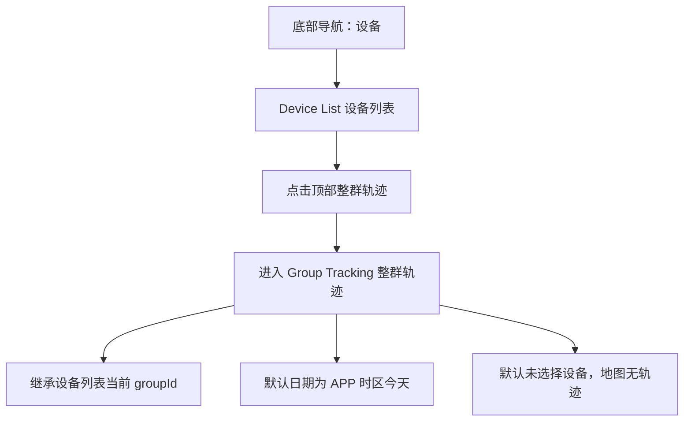
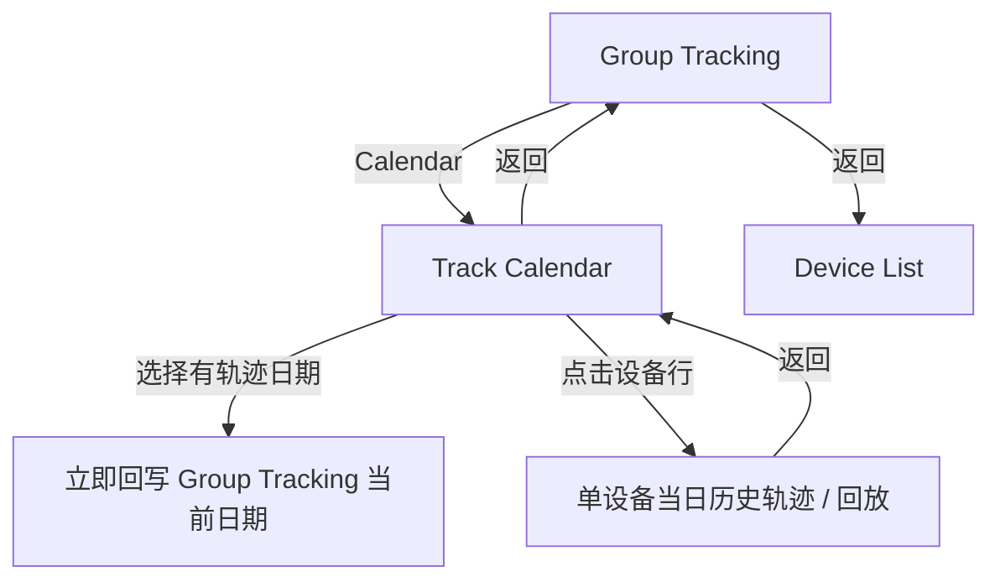
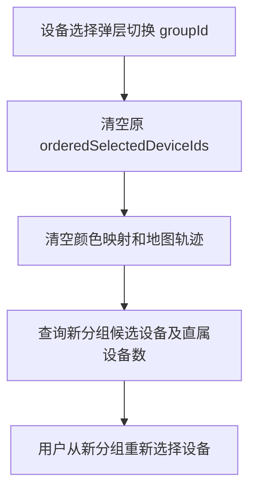
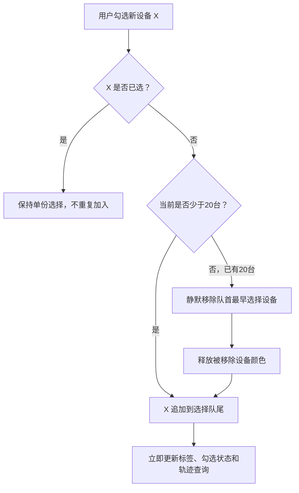
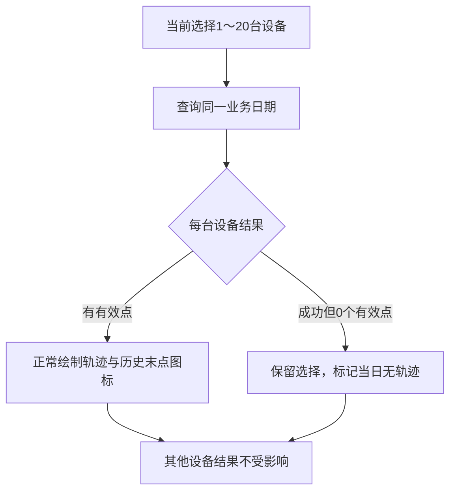
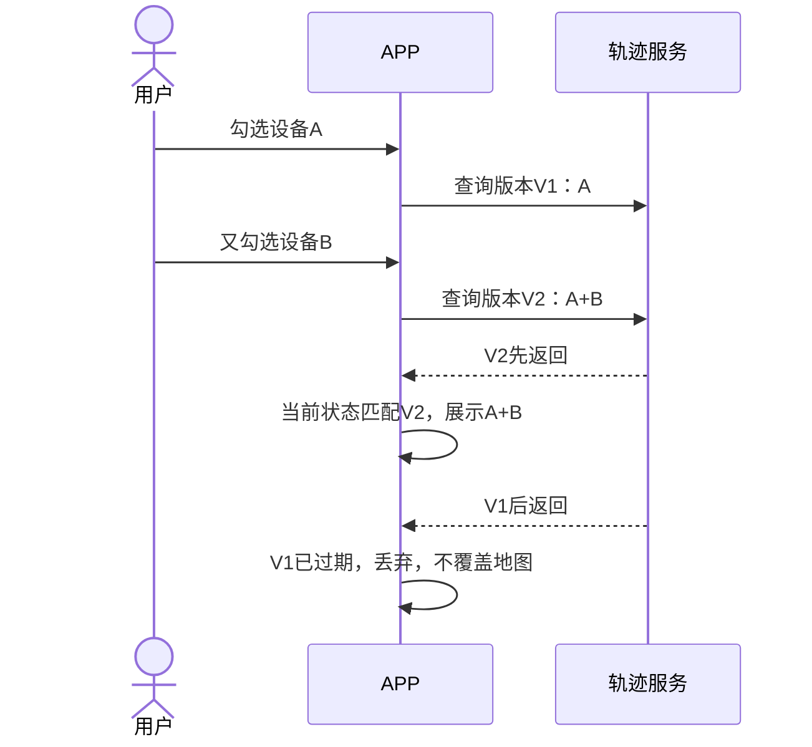
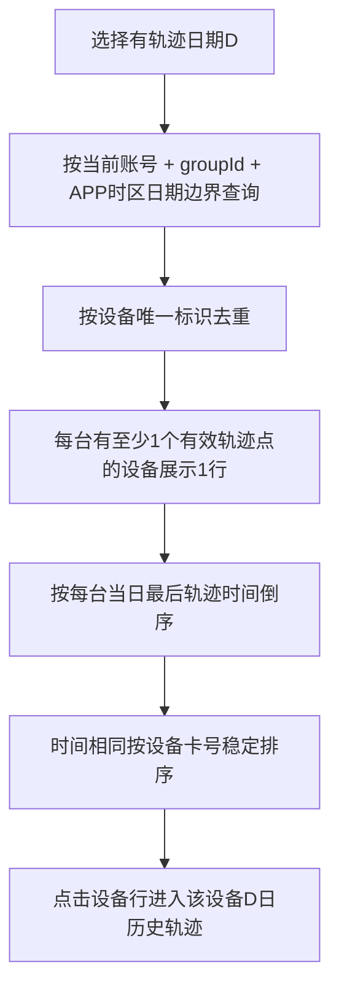
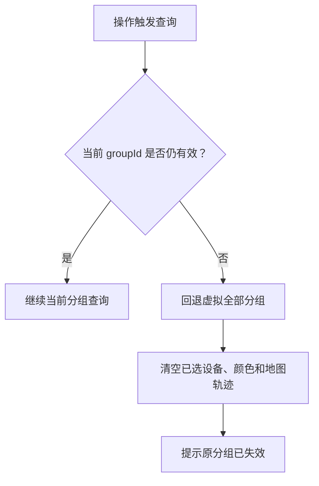

# 革泰 APP 整群轨迹逻辑点梳理.plan

<aside>
🎯

**文档用途**：梳理革泰 APP「整群轨迹」及「轨迹日历」的入口、分组范围、设备选择、日期联动、轨迹查询与绘制、单设备回放、状态保留、异常处理和接口边界，作为后续产品澄清、接口联调与测试用例设计依据。

**适用范围**：覆盖 US-009「叠加查看整群轨迹」与 US-010「按日历选择轨迹日期」；关联 US-007 的设备列表共享分组、US-008 的单设备历史轨迹、US-015 的设备列表入口、US-017 的账户分组体系、US-029 的 APP 时区。

**设计基准**：业务逻辑按中文原型梳理；页面视觉、地图布局、底部面板和已选标签样式按英文原型执行。两套原型冲突时，以本文已确认的业务规则为准。

</aside>

---

## 1. 核心结论

1. **唯一入口**：设备列表顶部「整群轨迹」；不从地图首页、分组管理页或设备行内菜单新增入口。
2. **共享当前分组**：进入时继承设备列表当前 `groupId`；虚拟「全部分组」代表当前账号全部可见设备，具体业务组只取直属设备，不聚合后代分组。
3. **首次不选设备**：首次进入日期默认为 APP 时区的今天，设备选择为空，地图不伪造任何轨迹。
4. **英文主页面 + 底部选择弹层**：主页面按英文稿展示 `Bind Device / Selected N` 和已选标签；点击后打开底部弹层，在弹层中完成中文稿定义的分组切换、设备数量、搜索和多选。
5. **暂定最多 20 台**：Notion 与旧中文稿的 5 台上限被本轮暂定 20 台覆盖。选择第 21 台时，静默取消最早选择的第 1 台并加入第 21 台，后续依此类推。
6. **即时生效**：设备勾选、取消、标签删除、日期变化均立即更新选择状态并发起轨迹查询，不存在确认后统一提交或关闭弹层回滚。
7. **不同设备轨迹颜色不同**：颜色由前端控制；同一页面会话内，仍保留的设备颜色保持稳定。
8. **日历按当前分组查询**：轨迹日历查询当前分组全部直属设备，不局限于主页面当前已选设备。
9. **日期立即回写**：日历选择有轨迹日期后，立即更新整群轨迹主页面日期；点击当日设备行则进入该设备该日的单设备历史轨迹。
10. **日历无确认按钮**：设备行点击即进入单设备回放；删除原型中的底部「确定」按钮和含义不明的「当前 / Current」标签。
11. **历史位置与当前状态分开**：设备图标放在所选日期最后一个有效轨迹点，但图标颜色展示设备当前通信 / 告警状态，不代表历史当日状态。
12. **操作触发刷新**：不增加定时轮询或服务端推送；进入页面、打开选择弹层、切换分组、修改选择、修改日期、切换日历月份、选择日期或重试时查询最新数据。

---

## 2. 页面入口与导航链路

### 2.1 唯一入口



- 从设备列表进入时携带当前分组唯一标识，不以分组名称代替 `groupId`。
- 若设备列表当前选择虚拟「全部分组」，整群轨迹使用当前账号全部可见设备作为候选范围。
- 若当前选择具体一级、二级或三级业务组，只使用直接归属该组的设备，不聚合后代组设备。
- 返回设备列表后，本次整群轨迹页面会话结束；再次进入时重新初始化，不恢复上一次日期、设备选择、颜色或地图视野。

### 2.2 页面间导航



- 单设备回放返回轨迹日历，保留月份、日期、当前分组、搜索词和列表滚动位置。
- 从轨迹日历返回整群轨迹，保留当前分组、已选设备顺序、颜色映射、日历回写日期、地图中心和缩放级别。
- 从整群轨迹返回设备列表后，再次进入按首次状态重新初始化。

---

## 3. 页面状态模型

### 3.1 整群轨迹状态

整群轨迹当前有效查询状态至少由以下字段共同确定：

```text
GroupTrackState =
  sessionGenerationId
  + pageInstanceId
  + accountId
  + groupScope
  + groupId
  + appTimezoneId
  + businessDate
  + dateSelectionMode
  + orderedSelectedDeviceIds
  + colorMapping
  + queryFingerprint
  + resourceRequestVersions
  + mapViewport
```

| 状态 | 含义 |
| --- | --- |
| `sessionGenerationId` | 登录会话世代标识；登录、退出、token失效或切换账号后更新，旧会话响应全部作废 |
| `pageInstanceId` | 本次整群轨迹页面实例标识；返回设备列表结束实例，旧页面回调不得写入新页面 |
| `accountId` | 当前有效登录账号，由服务端登录态确定，不能由前端替换后扩权 |
| `groupScope` | 显式区分 `ALL_VISIBLE` 与 `DIRECT_GROUP`，禁止使用空 `groupId` 猜测全部分组 |
| `groupId` | `DIRECT_GROUP` 时必填的真实分组唯一标识；`ALL_VISIBLE` 时不得携带真实分组ID |
| `appTimezoneId` | IANA 地区时区，例如 `Asia/Shanghai`、`Europe/London`；不得仅用固定 UTC 偏移代替 |
| `businessDate` | 按 APP 当前时区解释的业务日期，默认今天 |
| `dateSelectionMode` | `AUTO_TODAY` 或 `EXPLICIT_DATE`，用于处理跨午夜和APP时区变化 |
| `orderedSelectedDeviceIds` | 按选择先后顺序保存的设备唯一标识集合，用于20台上限与 FIFO 淘汰 |
| `colorMapping` | 本页面会话内设备唯一标识到轨迹颜色的稳定映射 |
| `queryFingerprint` | 由账号会话、分组范围、时区、日期和去重设备集合生成，用于相同请求复用与结果归属校验 |
| `resourceRequestVersions` | 候选设备、月份日历、日历设备列表、轨迹和当前状态分别维护版本，不能只保护轨迹请求 |
| `mapViewport` | 地图中心与缩放；是否保留由查询指纹是否变化决定 |

### 3.2 状态生命周期

| 场景 | 处理 |
| --- | --- |
| 首次进入 | 继承设备列表当前分组；日期为 APP 时区今天；设备为空；颜色映射为空 |
| 页面内打开 / 关闭设备选择弹层 | 保留全部状态；关闭弹层不回滚已即时生效的选择 |
| 进入日历再返回 | 保留全部状态；若日历修改日期，则使用新日期 |
| 进入单设备回放再返回 | 先回日历；保留UI条件但重新校验登录态和设备权限，失权设备不得继续显示；再返回整群页时恢复有效状态 |
| APP时区变化 | `AUTO_TODAY` 重新计算新时区今天；`EXPLICIT_DATE` 保留字面日期但按新时区边界重查；旧时区全部在途响应作废 |
| 页面跨APP时区午夜 | `AUTO_TODAY` 切换到新今天并重查；用户显式选择的历史日期保持不变 |
| 返回设备列表 | 结束本次页面实例并取消 / 作废全部异步请求 |
| 再次进入 | 创建新 `pageInstanceId`，重新初始化，不恢复上一次设备选择与颜色 |
| 退出登录 / token失效 / 切换账号 | 更新 `sessionGenerationId`，取消旧请求并清除账号分区缓存；旧账号响应不得写入新账号页面 |

---

## 4. 主页面结构与交互

### 4.1 最终页面组合方式

主页面使用英文原型结构与视觉：

- 标题：`Group Tracking`；
- 上半区：卫星 / 地图底图、轨迹线、轨迹节点、设备名称和设备图标；
- 地图操作：图层 / 全屏类入口、缩放；
- 下半区：当前日期、`Calendar` 按钮、`Bind Device / Selected N`；
- 已选设备使用可删除标签展示。

中文原型中的以下业务能力放入点击 `Bind Device / Selected N` 后打开的底部弹层：

- 当前分组与分组内设备数量；
- 切换分组；
- 搜索设备；
- 候选设备复选列表；
- 已选数量。

### 4.2 无设备选择状态

- 首次进入不自动选择当前组第一台、前两台、前20台或全部设备。
- `Selected 0` 时地图不查询、不展示轨迹线和历史设备点。
- 页面保留日期和设备选择入口，提示用户选择设备；确切空态文案待 UI 文案确认。

---

## 5. 当前分组与候选设备范围

### 5.1 分组来源

- 整群轨迹与设备列表使用同一个会话级 `sharedDeviceGroupContext`，不是进入时复制后各自维护。
- 设备列表切组后进入整群轨迹，整群页读取最新共享分组；整群轨迹切组成功后也立即回写共享上下文，返回设备列表时设备列表按新分组刷新。
- 底部选择弹层展示当前账号的虚拟「全部分组」及真实一级、二级、三级分组。
- 分组结构、Level、父组和直属设备数量来自服务端分组查询，不从当前设备列表反向聚合。
- 空组仍可出现在分组选择器中。

### 5.2 候选设备范围

| 当前分组 | 候选范围 |
| --- | --- |
| 虚拟「全部分组」 | 当前账号全部可见设备，按设备唯一标识去重 |
| 具体一级 / 二级 / 三级业务组 | 直接归属当前 `groupId` 的全部可见设备，不包含后代组 |

- 候选列表不按在线、离线、告警状态预过滤。
- 候选列表不按当前日期是否已有轨迹预过滤。
- 离线、未连接、当前告警或当天无轨迹的设备仍可被选择。
- 候选设备身份始终使用设备唯一标识；备注、卡号或名称只用于展示与搜索。

### 5.3 切换分组



- 不允许已选集合跨多个业务分组拼接。
- 即使同一设备因异常数据同时出现在多个候选来源，也按设备唯一标识去重。
- 切换分组不自动选择新分组设备。

---

## 6. 设备搜索、选择与20台滚动上限

### 6.1 搜索规则

| 项 | 规则 |
| --- | --- |
| 搜索字段 | 设备卡号 / 编号 `addr`、业务备注 `remark` |
| 匹配方式 | 模糊包含匹配 |
| 大小写 | 英文不区分大小写 |
| 关键词空格 | 忽略搜索关键词首尾空格 |
| 空关键词 | 恢复当前分组全部候选设备 |
| 对已选设备影响 | 只过滤候选行，不取消、不隐藏地图轨迹、不删除标签 |

示例：已选 `S18-001` 与 `S18-002` 后搜索 `002`，候选列表可只显示 `S18-002`，但 `S18-001` 仍在已选集合和地图中；清空搜索后恢复其已勾选设备行。

### 6.2 即时选择

- 勾选设备后立即加入有序选择集合、分配轨迹颜色并查询当前日期轨迹。
- 取消勾选后立即从选择集合、标签、颜色映射和地图移除。
- 点击主页面已选标签的删除图标，等价于在弹层取消该设备。
- 关闭弹层只结束选择操作，不撤销已生效选择。
- 相同设备重复操作不能在集合中产生两份选择或两条重复轨迹。

### 6.3 暂定20台上限与 FIFO



- 最大选择数量暂定为20台，覆盖 Notion 与旧中文原型的5台旧值。
- 选择第21台时自动取消第1台；选择第22台时自动取消当时最早的设备，以此类推。
- 自动替换不弹 Toast、不二次确认，也不单独提示被移除设备。
- 页面必须通过勾选状态、已选标签和 `Selected 20` 的变化真实反映最终集合。
- FIFO 顺序以用户实际加入选择集合的顺序为准；取消后重新选择的设备视为最新加入，排到队尾。
- 选择变更必须在最新状态上通过单线程 reducer / 原子事务完成：先按 `deviceId` 去重，再判断容量、淘汰队首、追加新设备，最后一次性提交选择、标签、颜色和查询指纹。
- 每次选择操作生成递增 `selectionOpSeq`；快速双击同一设备、几乎同时选择两台或旧异步回调均不得基于过期数组各自淘汰设备。
- UI选择状态即时变化，但轨迹网络请求允许使用短尾随合并（建议100～300ms）并取消旧请求，避免连续选择20台产生1+2+…+20台次的请求风暴；合并不得改变最终选择顺序和即时视觉状态。

<aside>
⚠️

**暂定风险**：20台同时绘制显著高于当前 Notion / 中文原型的5台。正式发布前仍需补充真机性能目标、接口数据量上限和20色可辨识验证；在正式数值确认前，本文将20标记为暂定需求，而非原平台稳定规则。

</aside>

---

## 7. 日期、时区与轨迹查询范围

### 7.1 默认日期

- 首次进入使用 APP 当前时区的今天。
- APP 时区来自登录 /「我的 → 时区设置」的统一配置，不使用设备 `ZONE` 参数代替。
- 主页面日期是纯业务日期，不按 UTC 零点直接跨日展示。

### 7.2 日期查询边界

对于业务日期 `D`，服务端查询范围应按 APP 地区时区转换为：

```text
[startOfDay(D, appTimezone), startOfDay(D + 1 day, appTimezone))
```

- 起点包含，下一日零点不包含。
- 存在夏令时的地区，按该业务日期实际偏移计算，不能固定认为一天始终等于86400秒。
- 轨迹点以 UTC 毫秒时间戳 `locTime` 作为唯一定位时间事实源，并按 APP 时区归属业务日期；服务端接收时间不得替代定位时间。
- 若接口同时返回 `locTime` 与格式化时间字符串，字符串必须由同一时间事实派生；不一致属于接口契约错误，客户端不得自行选择一个字段猜测。
- 迟到补传的位置在重新查询后进入其实际定位日期。
- 当前接口示例中 `1725811200000` 与 `2026-05-06 18:00:00` 相差近两年，联调前必须修正，不能把错误样例作为自动化预期。

### 7.3 查询触发

以下操作会形成新的整群轨迹查询条件：

- 勾选设备；
- 取消设备；
- 标签删除设备；
- FIFO 自动替换设备；
- 日历选择新日期后返回并重新激活整群轨迹页面；
- 点击失败重试；
- 检测并移除失权 / 移组设备后重新查询。

日历选择日期时立即更新共享 `businessDate` 并使旧查询结果失效，但不在不可见的整群页面重复发起相同请求；返回整群轨迹时按新查询指纹请求一次。若实现后台预取，则返回时必须复用同一在途 / 已完成请求，不得再次查询。

`Selected 0` 时不发起轨迹查询。

---

## 8. 多设备轨迹绘制

### 8.1 数据组织

整群轨迹结果应按设备唯一标识分组返回或整理：

```text
DeviceTrack =
  deviceId
  + displayRemarkOrAddr
  + currentStatus
  + trackColor
  + orderedValidPoints
```

- 同一设备轨迹点按实际定位时间从早到晚排序；相同时间戳时必须使用服务端稳定次级字段（如 `sequence`、`locationId`）排序，不能依赖数据库自然顺序。
- 轨迹点应具有稳定 `locationId` / 报文标识。重复报文优先按稳定标识去重；没有标识时才使用 `deviceId + locTime + 规范化坐标 + 报文序号` 组合，不能只按时间或坐标粗暴去重。
- 有效点至少要求经纬度为有限数且位于合法范围，并符合原轨迹服务允许绘制的定位状态；`null`、NaN、无穷值、越界坐标和明确无效定位不得点亮日历、增加有轨迹设备数或参与折线。
- `0,0` 是否为有效业务位置、哪些 `locStatus` 可绘制、双坐标缺失时是否允许转换，必须由轨迹接口契约书面定义，不能仅写“原服务认为有效”后由各端自行猜测。
- 不同设备的点不能串成同一条折线。
- 响应设备集合必须是请求设备集合的合法子集且每个请求设备有明确结果；服务端多返回的未请求设备禁止渲染，设备结果缺失不得自动视为无轨迹。
- 一台设备无轨迹属于该设备的成功空结果，不等于接口技术失败。

### 8.2 点与线

| 有效轨迹点数量 | 展示 |
| --- | --- |
| 0 | 不绘制轨迹线和历史位置图标；设备保留已选状态并标记当日无轨迹 |
| 1 | 展示单个轨迹点及设备图标，不伪造线段 |
| ≥2 | 按定位时间依次连接所有有效点 |

- 不增加“相邻点时间过长”“距离过远”的断线阈值。
- 不使用虚线表达轨迹缺口。
- 轨迹就是按有效点时间顺序依次连接；点间跨度不作为本期额外清洗规则。

### 8.3 轨迹颜色

- 颜色由 APP 前端为当前选择集合分配，不读取设备资料 `trackColor`，也不依赖服务端返回颜色。
- 同屏已选设备的轨迹颜色必须两两不同并能够有效区分。
- 同一次整群轨迹页面会话内，仍在选择集合中的设备颜色保持不变。
- 新设备使用当前未占用颜色；设备移除后释放其颜色槽位。
- 重新退出并进入整群轨迹后，可以重新分配颜色。
- 轨迹颜色只表达“这是哪台设备的轨迹”，不表达在线、离线或告警状态。

### 8.4 历史位置图标与当前状态

- 每台有轨迹设备的图标放在所选日期最后一个有效轨迹点。
- 图标旁展示该设备备注，备注为空时使用设备卡号兜底。
- 历史末点坐标与当前设备状态是两个不同时间快照：图标位置来自历史当日末点，通信 / 告警状态来自当前状态服务，并需返回 `statusAsOf`。
- 当前状态必须拆成两个维度：`communicationStatus = ONLINE | OFFLINE`，以及 `hasUntreatedAlarm = true | false`；告警可与在线或离线叠加，不能用一个颜色丢失其中一个维度。
- 图标主体表达在线 / 离线，独立角标或描边表达是否存在未处理告警；不得仅根据 `lastAlarmType` 推断当前告警，因为最后一条历史告警可能已经处理。
- 未明确在线的设备按既定规则映射为离线；状态接口不可用或状态快照超过产品约定有效期时，应展示未知 / 陈旧状态提示，不得继续无条件称为“当前”。
- 轨迹线颜色与状态图标颜色属于两套独立语义，不能因为当前告警图标为红色，就把该设备轨迹线也解释为告警轨迹。
- 查询历史日期时，应避免使用“设备当前位于此处”等实时语义；图标位置仍是历史当日末点。

### 8.5 地图视野

- 查询指纹（账号会话、分组、时区、日期、设备集合）发生变化且新结果首次成功展示时，地图自动适配所有有轨迹设备的全部有效轨迹点。
- 从日历返回时，若日期未变、查询指纹未变则保留地图中心和缩放；若日期已变化，则以新结果首次成功后的自动适配为准，不保留旧日期视野。
- 同一查询指纹已经成功展示后，用户手动缩放或拖动地图，普通刷新 / 重试不得反复抢回视野。
- 新查询此前从未成功、首次请求失败后重试成功时，仍属于该查询指纹的首次成功，必须自动适配，不能因“重试”二字跳过。
- 地图坐标使用当前地图 SDK 与底图所要求的坐标系；若接口同时提供 GCJ-02 与 WGS84，由前端地图适配层选择或转换，同一轨迹不得混用坐标系。

---

## 9. 部分无轨迹、整批失败与并发

### 9.1 设备级结果与顶层失败分类

| 结果 | 含义 | APP处理 |
| --- | --- | --- |
| `OK` | 设备合法且存在有效轨迹点 | 保留选择并绘制轨迹 |
| `NO_DATA` | 设备合法，但当前日期没有有效轨迹点 | 保留选择和颜色，显示当日无轨迹 |
| `OUT_OF_SCOPE` | 已解绑、失权、移出当前分组或对象已不存在 | 从选择集合移除并提示；其他有效设备重新查询 |
| `TECHNICAL_FAILED` | 轨迹存储、上游、网络或数据结构技术异常 | 本次整批地图结果不提交，按整批失败处理 |
| 会话级失败 | token过期、账号冻结、登录主体失效 | 终止当前业务访问并进入统一认证 / 账号状态处理，不显示为普通轨迹重试 |
| 分组级失败 | 当前具体分组已删除或失权 | 回退虚拟全部分组并清空选择、颜色和轨迹 |

- `OUT_OF_SCOPE` 属于业务范围变化，不得混入 `TECHNICAL_FAILED` 后反复重试。
- 每个请求设备必须返回一份明确结果；缺失设备不能自动当作 `NO_DATA`。
- 响应中出现未请求设备、重复设备结果或设备结果缺失，均属于接口契约错误；额外设备禁止渲染。
- 技术失败采用整批原子提交：结果在暂存区完整校验通过后再一次性替换地图，禁止部分轨迹先显示后因另一设备失败再撤回。

### 9.2 部分设备当天无轨迹



- 一台或多台无轨迹不导致整批失败。
- 无轨迹设备不自动取消选择，不释放颜色，不从标签中删除。
- 不得使用设备当前最新位置补齐历史日期空轨迹。
- 无轨迹确切提示文案与标签样式待 UI 文案确认。

### 9.3 技术失败采用整批失败

- 轨迹接口技术异常、响应结构不可用或批次中出现查询失败时，本次整批查询失败。
- 整批失败后清空地图上所有轨迹和历史设备点，防止旧日期 / 旧设备结果冒充当前查询。
- 保留当前分组、日期、设备选择顺序和颜色映射。
- 显示失败原因和重试入口。
- “设备当天0个有效点”是成功空结果，不能误判成技术失败。

### 9.4 快速操作与旧响应



- 轨迹查询至少绑定 `sessionGenerationId + pageInstanceId + groupScope/groupId + appTimezoneId + businessDate + orderedSelectedDeviceIds + requestVersion`。
- 只有与当前账号会话、页面实例和查询条件一致的最新响应可以更新地图。
- 候选设备、分组结构、月份日历、日历设备列表 / 搜索和当前状态分别维护自己的查询键与版本；快速切组、切月、切日期或输入关键词时，旧资源响应同样不得覆盖新状态。
- 可取消旧请求，也可让旧请求完成后丢弃；无论采用哪种实现，都不能按返回先后让旧结果覆盖新结果。
- 候选设备刷新成功后立即用服务端授权候选集合核对已选设备；已不在范围的设备原子移除。候选请求失败时不得用空数组冒充全部设备失权。

---

## 10. 轨迹日历

### 10.1 数据范围

- 日历继承整群轨迹当前 `groupId`。
- 查询范围是当前分组全部直属设备，不局限于主页面已选设备集合。
- 虚拟「全部分组」查询当前账号全部可见设备。
- 日历及当日设备列表均受当前账号设备可见权限限制。

### 10.2 月份与日期

| 项 | 规则 |
| --- | --- |
| 初始月份 | 打开当前整群轨迹日期所在月份 |
| 月份切换 | 支持切换任意年月，包括未来月份 |
| 有轨迹日期 | 使用绿色点 / 高亮表示，可选择 |
| 无轨迹日期 | 不可选择 |
| 未来日期 | 正常显示；无轨迹时不可选择 |
| 当前日期无轨迹 | 停留当前月份，不自动回溯最近有轨迹日期；下方展示无数据空态 |
| 日期边界 | 使用 APP 当前时区 |

- 日历状态需区分 `committedBusinessDate`、当前视觉高亮日期和日期是否有轨迹 / 可点击；当前整群查询日期即使无轨迹，也可以显示当前查看高亮，但仍不可触发有轨迹设备查询。
- `daysWithData` 必须去重、严格位于请求年月的合法日期范围；重复、0、32、2月30日等非法值应忽略并上报契约错误，不能映射到相邻月份。
- 月历与当日设备列表必须使用相同账号范围、分组范围、有效点规则、APP时区和数据修订水位，避免月历显示有数据而详情为空。
- 迟到补传可能改变历史月份的绿点；从单设备回放返回、用户重新进入日历或显式刷新时，应重新查询当前月份，而不是永久保留旧月份数据快照。

### 10.3 日期选择与主页面回写

- 点击有轨迹日期后，该日期立即成为整群轨迹主页面当前日期。
- 日历下方同步列出当前分组在该日期存在有效轨迹点的设备。
- 用户不点击设备、直接返回整群轨迹时，整群页面按新日期重新查询当前已选设备。
- 无轨迹日期不可选择，不改变整群轨迹当前日期。

### 10.4 当日设备列表



设备行字段：

| 位置 | 展示规则 |
| --- | --- |
| 第一行 | 业务备注；备注为空时使用设备卡号 / 编号兜底 |
| 第二行 | 当前账户下该设备所属分组名称 |
| 右侧 | 进入箭头；点击整行或箭头进入回放 |

- 删除原型中的「当前 / Current」标签。
- 删除底部「确定」按钮。
- 点击设备行立即进入单设备当日历史轨迹，不需要单选后再次确认。
- 同一设备当天有多个轨迹点，设备列表仍只出现一行。

### 10.5 当日设备数量与搜索

- 顶部“X台设备 / X Device Track”表示当前分组、当前日期存在轨迹点的设备去重总数。
- 数量不随设备搜索关键词缩小。
- 搜索只支持设备卡号 / 编号 `addr` 与业务备注 `remark` 的模糊包含匹配。
- 英文搜索不区分大小写，忽略关键词首尾空格。
- 搜索无结果时列表显示空态，但顶部当日设备总数保持不变。
- 清空关键词恢复当前日期全部有轨迹设备。
- 当日设备可能数量很大，必须使用稳定分页 / 游标；排序键至少为 `lastTrackTime DESC, addr ASC, deviceId ASC`，同一次滚动绑定固定快照，避免迟到补传导致跨页重复或漏项。
- 响应数量至少区分 `totalDeviceCount`（不受关键词影响）与 `filteredDeviceCount`（关键词过滤后），不能用语义不清的单个 `deviceCount` 让前端猜测。
- 候选设备和日历设备列表的分页缓存不得重建全局已选集合；任意设备行加载时都根据 `orderedSelectedDeviceIds` 判断勾选状态。

---

## 11. 单设备当日历史轨迹

- 点击日历设备行时携带设备唯一标识和所选业务日期，复用 US-008 单设备历史轨迹 / 回放能力。
- 查询日期边界继续使用 APP 当前时区。
- 轨迹点按实际定位时间归属和排序，迟到补传位置重新查询后进入对应日期。
- 单设备回放可继续使用既有轨迹节点、起终点、停留点、统计、播放、暂停、进度和倍速规则；整群轨迹不重新定义这些能力。
- 单设备回放返回轨迹日历，而不是直接跳回整群轨迹或设备列表。
- 返回后保留：月份、日期、当前分组、搜索关键词、当日设备总数和列表滚动位置。

---

## 12. 数据来源与接口契约

### 12.1 数据来源

| 数据 | 来源 |
| --- | --- |
| 当前账号 | 登录 token / 服务端会话 |
| 当前分组和候选设备 | 原账户分组与设备关系服务；与设备列表共用分组上下文 |
| 分组直属设备数量 | 服务端分组查询返回，APP不遍历设备自行计算 |
| 当前设备状态 | 当前设备列表 / 设备总览服务的最新通信与告警数据 |
| 月份有轨迹日期 | `GET /api/monitor/app/home/track-calendar`，现有接口需补当前分组与时区边界能力 |
| 当日有轨迹设备 | 应按当前账号、当前分组、日期返回按设备去重的设备摘要 |
| 整群轨迹点 | 当前接口文档未明确批量多设备轨迹接口，需要复用或补充批量查询能力 |
| 单设备回放 | 复用原单设备历史轨迹服务 / US-008 |

### 12.2 当前接口契约缺口

本地《API接口改动新增》目前记录：

1. `GET /api/monitor/app/home/track-calendar` 只有 `year`、`month`，没有显式分组范围和 APP IANA 时区；无法严格满足“按当前分组、APP时区查询有轨迹日期”。
2. `GET /api/monitor/app/home/track-calendar/detail` 返回当天 `locations[]` 定位点列表，而页面需要的是“当天有轨迹的设备列表，每台设备一行”。
3. `detail` 当前无分页，并可能返回同一设备的大量轨迹点；若直接渲染会把同一设备重复成多行，且数据量与页面需求不匹配。
4. 当前接口文档未明确“按同一天、1～20个设备稳定唯一标识批量返回分设备轨迹点”的整群轨迹接口。
5. 当前接口主要使用 `addr` 识别设备，未提供不可变、不可复用的稳定 `deviceId`；`addr` 只能用于展示、搜索和旧接口兼容，不能承担颜色映射、FIFO和权限关联主键。
6. `track-calendar/detail` 示例中的毫秒 `locTime` 与 `loc.time` 字符串相差近两年，尚未形成唯一时间事实源。
7. 当前接口未定义 `OK / NO_DATA / OUT_OF_SCOPE / TECHNICAL_FAILED` 等设备级结果，无法同时实现失权移除和技术整批失败。
8. 当前接口未定义最大设备数、单设备 / 整批最大点数、最大响应字节、截断、游标、压缩和超时规则。
9. Apifox旧单设备轨迹契约存在将 `Authorization` 作为查询参数的风险；新接口认证必须使用标准请求头，不得把token写入URL、日志或缓存键。

### 12.3 业务契约要求

无论最终采用修改旧接口还是新增接口，服务端结果必须满足：

#### 月份日历

```text
输入：当前账号登录态 + groupScope（ALL_VISIBLE / DIRECT_GROUP）+ groupId（按scope条件必填）+ year + month + IANA appTimezoneId
输出：当前分组范围内有轨迹的日期集合 + 实际查询时区、UTC起止边界和数据修订水位
```

#### 当日设备列表

```text
输入：当前账号登录态 + groupScope/groupId + businessDate + IANA appTimezoneId + keyword + cursor + pageSize
输出：固定快照下当天有至少1个有效轨迹点的设备去重分页列表 + totalDeviceCount + filteredDeviceCount + nextCursor
```

每台设备摘要至少需要：

- 设备唯一标识；
- 卡号 / 编号 `addr`；
- 业务备注 `remark`；
- 当前账户所属分组名称；
- 当日最后轨迹时间，用于排序。

#### 整群轨迹

```text
输入：当前账号登录态 + groupScope/groupId + businessDate + IANA appTimezoneId + deviceIds（去重后1～20）+ clientRequestId
输出：同一授权 / 数据快照下按稳定deviceId分组的轨迹结果 + 每设备outcome + 查询边界 + 点数 / 截断信息
```

每台设备轨迹至少需要：

- 不可变、不可复用的稳定 `deviceId`；
- 备注与卡号 `addr`；
- 设备级 `outcome`；
- 当前通信状态、`hasUntreatedAlarm` 与 `statusAsOf`；
- 按实际定位时间和稳定次级键有序的有效位置点；
- 每个点的稳定 `locationId`、UTC定位时间、坐标及坐标系；
- `rawPointCount / validPointCount / returnedPointCount / truncated / nextCursor`；
- 空轨迹结果、失权结果与技术失败的明确区分。

前端轨迹颜色不要求服务端返回。服务端响应中的设备顺序不承担前端FIFO语义，前端按本地有序选择集合匹配 `deviceId`。

### 12.4 服务端授权

- 使用标准 `Authorization` 请求头认证；token不得出现在URL查询参数、业务日志或共享缓存键中。
- 服务端根据登录态确定当前账号，不因客户端传入其他账号标识扩大范围；外部错误不得泄露目标设备是否真实存在。
- `groupScope=ALL_VISIBLE` 与 `groupScope=DIRECT_GROUP` 使用显式互斥参数组合；禁止把漏传或空 `groupId` 自动解释为全部分组。
- `ALL_VISIBLE` 必须复用当前账号经绑定、分配及其他有效授权形成的**全部可见设备去重集合**，不能仅查询当前账号直接绑定设备。
- 校验 `groupId` 属于当前账号可见分组范围。
- 校验每个设备仍属于当前账号可见范围，并直接归属当前具体分组；虚拟全部分组时校验账号可见范围。
- 权限、当前分组关系和轨迹读取必须位于同一数据库快照或不可绕过的查询谓词中，避免“先校验、后失权、仍返回轨迹”的 TOCTOU。
- 请求中重复设备标识按稳定 `deviceId` 去重；越权设备不得返回历史轨迹、设备摘要或当前状态。
- 退出、账号切换和token失效后，响应还需通过客户端 `sessionGenerationId + accountId + pageInstanceId` 校验，防止旧账号位置数据进入新账号UI或缓存。
- HTTP缓存若存在，必须按认证主体隔离并采用 `Cache-Control: private, no-store` 等安全策略；本地缓存按账号命名空间隔离，退出时清理。

### 12.5 容量、分页与截断

- 候选设备和日历当日设备列表必须支持稳定游标分页；同一游标绑定账号、分组、时区、关键词、排序和数据快照。
- 整群轨迹必须定义去重后最大设备数、单设备最大原始点数、整批最大点数、最大响应字节数、接口超时和APP可承载上限。
- 超过容量不得静默丢点；必须返回 `truncated`、原始 / 有效 / 返回点数和 `nextCursor`，或返回稳定错误码 `TRACK_QUERY_TOO_LARGE`。
- 若采用轨迹抽稀，必须区分原始点、有效点和绘制点；首个和最后有效点强制保留，单点设备不能被抽成空结果。
- 日历设备摘要接口不得为了显示每台一行而返回账号当天全部轨迹点。
- 传输层明确gzip / br压缩、连接 / 读取超时和页面离开后的取消与内存释放策略。

### 12.6 错误码与可观测性

业务分支不得解析中英文 `msg` 文本，至少需要以下机器可读错误码：

| 错误码 | 处理 |
| --- | --- |
| `UNAUTHENTICATED` / `ACCOUNT_FROZEN` | 结束当前业务访问，进入统一认证 / 账号状态流程 |
| `GROUP_NOT_FOUND_OR_FORBIDDEN` | 回退全部分组并清空选择 |
| `DEVICE_OUT_OF_SCOPE` | 移除对应设备，不反复技术重试 |
| `INVALID_DATE` / `INVALID_TIMEZONE` | 阻止查询并提示修正 |
| `TOO_MANY_DEVICES` | 契约上限不一致，禁止服务端静默截前N台 |
| `TRACK_QUERY_TOO_LARGE` | 提示范围过大；按正式点数 / 抽稀契约处理 |
| `RATE_LIMITED` | 遵循 `Retry-After`，禁止即时循环重试 |
| `UPSTREAM_TIMEOUT` / `TRACK_STORE_UNAVAILABLE` | 整批技术失败，可按规则重试 |

请求 / 响应至少提供：`clientRequestId`、`traceId`、`snapshotId`、`scopeVersion`、`dataAsOf`、实际时区、UTC查询起止、请求 / 返回设备数、原始 / 有效 / 返回点数及 `truncated`。日志不得记录完整token或未经授权暴露完整轨迹坐标。

---

## 13. 数据刷新、跨端变化与失效处理

### 13.1 操作触发刷新

本期不增加定时轮询和服务端实时推送。数据在以下动作发生时更新：

| 数据 | 查询时机 |
| --- | --- |
| 当前分组与候选设备 | 进入整群轨迹；每次打开 Bind Device 弹层；切换分组 |
| 已选设备有效性 | 勾选、取消、日期变化、重试等每次轨迹查询时由服务端重校验 |
| 多设备轨迹 | 设备集合或业务日期变化时立即查询 |
| 月份有轨迹日期 | 进入轨迹日历、切换年月 |
| 当日设备列表 | 点击有轨迹日期、修改 / 清空搜索关键词 |
| 当前设备状态 | 随整群轨迹查询或当前设备状态服务更新 |

- 用户停留页面且没有任何操作时，允许暂时保留进入时快照。
- Web 或其他端发生变化后，不要求页面无操作时立即推送更新。
- 候选设备、分组、月历、日历设备列表、搜索和轨迹分别维护 `NOT_REQUESTED / LOADING / SUCCESS_DATA / SUCCESS_EMPTY / FAILED_RETRYABLE / FAILED_NON_RETRYABLE` 状态。
- 新查询失败不得把旧查询键的数据冒充为当前结果；若暂时保留旧画面，必须清晰标记为旧数据且禁止依赖新范围继续选择。
- 技术失败不得写入业务空结果缓存；历史日期无数据可能被迟到补传改变，只允许短期负缓存并绑定数据修订水位。

### 13.2 单设备失效

设备在页面停留期间被解绑、失权或移出当前分组，下一次操作触发查询时：

1. 服务端拒绝该设备继续进入当前范围；
2. APP 从已选集合中移除该设备；
3. 释放颜色并删除对应标签和轨迹；
4. 提示该设备已不在当前范围；
5. 其余有效设备继续重新查询。

此场景属于选择对象失效，不按普通整批技术失败处理。

### 13.3 当前分组失效



- 不保留已删除分组的设备快照继续访问历史。
- 不直接退出整群轨迹页面。
- 回退后不自动选择全部分组中的任何设备。

---

## 14. 边界值与关键验收场景

| 场景 | 预期结果 |
| --- | --- |
| 首次进入 | 继承设备列表当前分组；日期为APP时区今天；Selected 0；地图无轨迹 |
| 当前组0台设备 | 弹层展示空态；不能伪造设备或轨迹 |
| 选择1台 | 分配唯一颜色并查询；0点显示无轨迹，1点只显示点，≥2点连线 |
| 选择20台 | 允许同时保留20台；颜色两两不同 |
| 已有20台选择第21台 | 静默移除最早选择设备，第21台加入队尾；数量仍为20 |
| 取消后重新选择同一设备 | 设备排到选择队尾，获得当前可用颜色，不产生重复选择 |
| 搜索不匹配已选设备 | 已选设备、标签、颜色和地图轨迹继续保留 |
| 切换分组 | 清空原选择、颜色与轨迹，新组默认不选设备 |
| 具体父组有子组 | 候选只取直接归属父组设备，不聚合子组 |
| 部分设备当天无轨迹 | 有轨迹设备正常绘制；无轨迹设备保留选择并标记 |
| 一台设备 `OUT_OF_SCOPE` | 只移除该设备并提示，其余有效设备按新集合重新查询 |
| 一台设备 `TECHNICAL_FAILED` | 本次整批失败，清空地图；保留选择和颜色，提供重试 |
| 快速连续勾选 | FIFO状态在最新集合上原子计算；只有最新设备集合响应可更新地图，旧响应丢弃 |
| 快速切组 / 切月 / 切日期 / 搜索 | 各资源旧响应均不得覆盖新查询键，不只保护轨迹请求 |
| 轨迹点间隔很长 | 仍按定位时间依次连线，不按时间 / 距离阈值断线 |
| 完全重复轨迹点 | 按稳定位置记录标识去重，不重复绘制节点和零长度线段 |
| 相同 `locTime` 不同坐标 | 使用稳定次级排序键；末点和折线顺序不能依赖数据库自然顺序 |
| 经纬度缺失、越界、NaN或明确无效定位 | 不参与日历、设备有轨迹数量、折线和历史末点；上报契约 / 数据质量问题 |
| 服务端多返回未请求设备 | 禁止渲染并上报契约错误，不得为其分配颜色或扩大数据范围 |
| 查询历史日期 | 图标位于历史当日末点；图标颜色表达当前状态，不冒充历史状态 |
| 打开日历当前日期无轨迹 | 停留当前月份，不自动跳最近日期；显示空态 |
| 选择无轨迹日期 | 日期不可选，不改变整群主页面日期 |
| 选择有轨迹日期 | 日期立即回写主页面；列表展示当前分组当日有轨迹设备 |
| 同设备当天100个轨迹点 | 日历设备列表只显示该设备1行 |
| 搜索日历设备 | 只按addr和remark模糊匹配；顶部当日设备总数不变 |
| 点击日历设备行 | 立即进入该设备所选日期的单设备回放，无确定按钮 |
| 从回放返回 | 回到日历并保留月份、日期、分组、搜索和滚动位置 |
| 从日历返回整群，日期未变 | 查询指纹未变，保留设备顺序、颜色和地图视野 |
| 从日历返回整群，日期已变 | 保留分组、设备顺序和颜色；新结果首次成功后自动适配，不沿用旧日期地图视野 |
| 返回设备列表后重进 | 创建新页面实例，重新初始化今天、当前共享分组和Selected 0 |
| 整群页面切换分组后返回设备列表 | 新 `groupId` 已回写共享上下文，设备列表按新分组刷新 |
| 已选设备失权 / 移组 | 下一次查询或候选刷新时移除该设备并提示，其余有效设备继续查询 |
| 当前分组失效 | 回退虚拟全部分组，清空选择和轨迹并提示 |
| 候选接口失败 | 不得把空数组当全部设备失权；保留原选择并显示加载失败 |
| 切换未来年月 | 月份允许进入；无轨迹日期不可选择；非法年份范围由服务端参数校验 |
| 2月28/29、月末、年末 | 按真实日历和APP时区计算，不生成非法日期或错误跨月 |
| DST开始 / 结束日 | 使用IANA时区形成23小时或25小时查询区间，不固定按86400秒 |
| 页面跨APP时区午夜 | `AUTO_TODAY` 更新到新今天；显式历史日期保持不变 |
| 改APP时区 | 默认今天重新计算；显式日期保留字面值但按新时区重查；设备ZONE不替代APP时区 |
| 账号A请求未完成时退出并登录B | A响应因会话世代不匹配丢弃，且不得写入B的UI或缓存 |
| 设备在线且告警 / 离线且告警 | 图标主体表达通信状态，独立角标表达告警，两维状态不得互相覆盖 |

---

## 15. 已确认的原型修订

| 原型 / 旧规则 | 当前结论 |
| --- | --- |
| Notion / 中文稿最多5台 | 暂定改为20台 |
| 超过上限时阻止选择 | 改为FIFO静默替换最早选择设备 |
| 中文稿在主页面内嵌分组、搜索和设备列表 | 业务能力保留，但放入英文稿 `Bind Device` 底部弹层 |
| 英文稿主页面只有Bind Device与已选标签 | 保留作为主页面视觉结构 |
| 日历底部「确定」 | 删除 |
| 日历设备「当前 / Current」标签 | 删除 |
| 点击设备后查看当日单设备轨迹 | 保留，点击行立即跳转 |
| 日历选择日期是否影响整群日期不明确 | 明确为立即回写整群轨迹日期 |
| 日历是否只看已选设备不明确 | 明确查询当前分组全部直属设备 |
| 轨迹颜色来源不明确 | 前端分配，同屏设备颜色不同，会话内稳定 |
| 长间隔轨迹是否断线未定义 | 不断线，所有有效点按时间依次连接 |
| 坐标系固定字段 | 由地图SDK和底图适配层决定，同一轨迹禁止混用 |

---

## 16. 待后续确认 / 联调项

以下内容目前不能作为最终固定实现值，其中前六项属于发布阻断真源冲突：

1. **5台 vs 暂定20台**：Notion确定稿和中文原型仍是最多5台且超限阻止；本文暂定20台并FIFO静默替换。需正式变更Notion、原型、接口上限和验收标准后，20台才能转为正式规则。
2. **自然日 vs 任意时间段**：Notion US-009使用“同一时间段 / 调整所选时间段”，本文按当前原型收敛为单个业务日期。需确认是正式删减为自然日，还是仍需今日 / 昨日 / 近7天 / 自定义时间段。
3. **日历当前设备标签**：Notion要求当前设备标记或置顶，本文按已确认原型删除 `Current`。需同步修改Notion验收，或重新定义 `currentDeviceId` 来源。
4. **整群主页面进入单设备回放**：Notion写“可进入对应设备回放”，本文目前只定义日历设备行入口；需确认主页面是否允许点击历史末点图标 / 轨迹图例直接进入。
5. **未分组数据模型**：Notion旧稿存在未分组系统视图，但当前设备管理大纲已确认本期不存在未分组。需统一PRD与服务端数据模型，不能让两个模块采用不同分组全集。
6. **20台上限性能可行性**：需结合真机、地图SDK和接口数据量验证后转为正式值；未通过前保持“暂定”。
7. **20色具体色板**：需提供固定色板、槽位复用顺序和前端原子分配算法，并验证浅色 / 卫星底图、色弱和相邻轨迹重叠场景下的辨识度；仅十六进制值不同不能视为可辨识。
8. **性能指标**：补充20台场景的服务端P95/P99、最大响应字节、单设备 / 整批最大点数、首屏可交互时间、全量绘制时间、峰值内存和连续切换后的资源回收目标。
9. **整群轨迹接口**：当前接口文档未提供明确批量轨迹路径、方法、稳定deviceId、最大设备数和响应结构。
10. **日历接口调整方式**：需由后端确认修改现有 `track-calendar/detail`，还是新增按设备去重且支持分页的当日设备摘要接口。
11. **无轨迹与加载失败文案**：业务状态已区分，最终中英文文案和标签样式待 UI 确认。
12. **当前状态来源与时效**：需确认由批量轨迹响应携带还是并行读取状态服务，并确定 `statusAsOf` 与状态过期阈值。
13. **地图坐标适配**：业务不固定 GCJ-02 / WGS84，需由实际地图SDK方案确认目标坐标、转换位置、转换版本和精度验收标准，防止重复转换。
14. **轨迹有效点策略**：需确认 `locStatus`、`0,0`、双坐标缺失、非法坐标和重复点的服务端正式判断规则与策略版本。
15. **原单设备历史轨迹接口**：需在联调阶段确认日历设备行跳转所复用的真实接口、认证方式及参数；旧接口不得把Authorization放在URL查询参数。
16. **可查询年月范围**：当前交互允许任意年月，但服务端必须确认合法年份、最早历史日期、未来月份和数据保留期边界。

---

## 17. 参考资料

- [革泰 APP 产品需求文档（Notion）](https://app.notion.com/p/APP-3d75667c6d3a800e938af02c795b6fcf)：US-007、US-008、US-009、US-010、US-015、US-017、US-029。
- `docs/manuals/革泰/API接口改动新增.md`：APP 首页设备总览、轨迹日历与轨迹日历详情接口。
- `docs/manuals/革泰/逻辑大纲/革泰 APP 设备管理逻辑点梳理 plan.md`：设备列表入口、共享分组、账户分组范围与直属设备统计口径。
- 中文整群轨迹 / 轨迹日历原型：业务功能、分组、搜索、多选、日历设备列表与单设备回放链路。
- 英文 Group Tracking / Track Calendar 原型：最终主页面视觉、地图布局、日期、Bind Device、已选标签与日历视觉。

---

**文档版本**：v1.1（补充测试 / 开发边界、状态机、接口容量与发布门禁）

**最后更新**：2026-09-14

**维护人**：测试团队
