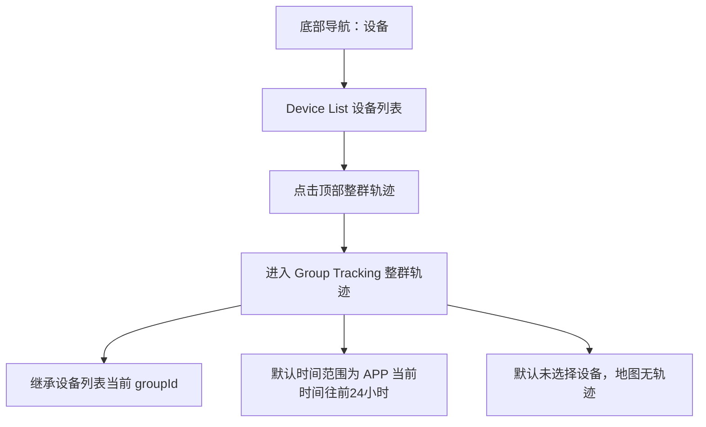
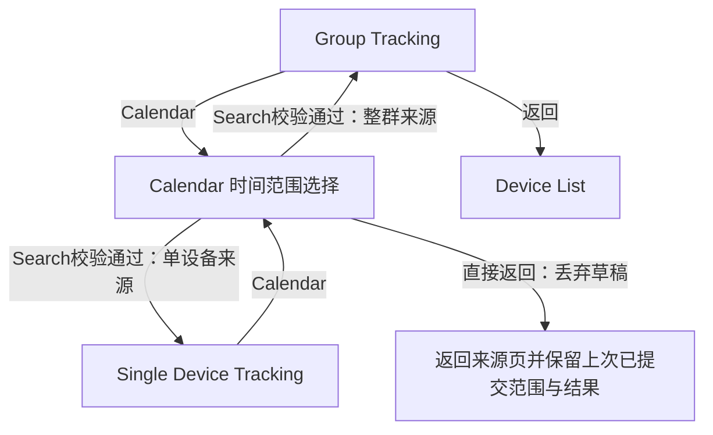
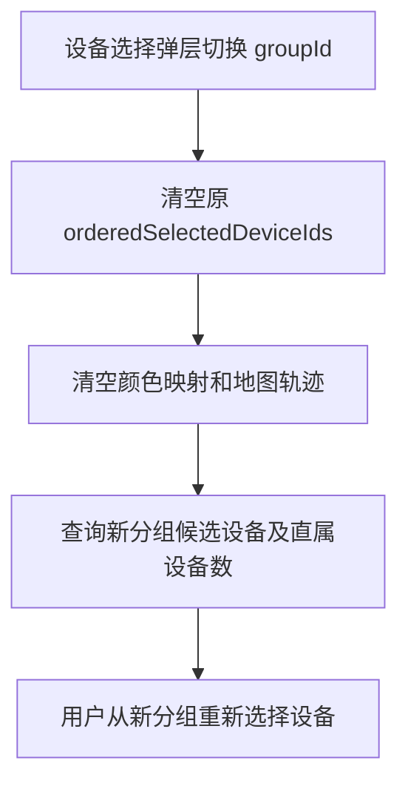
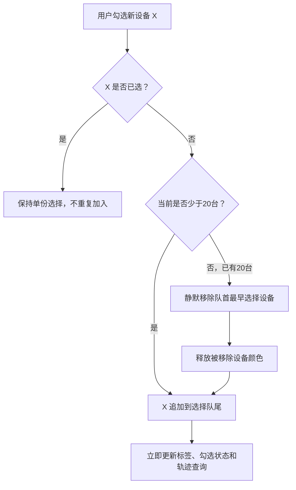
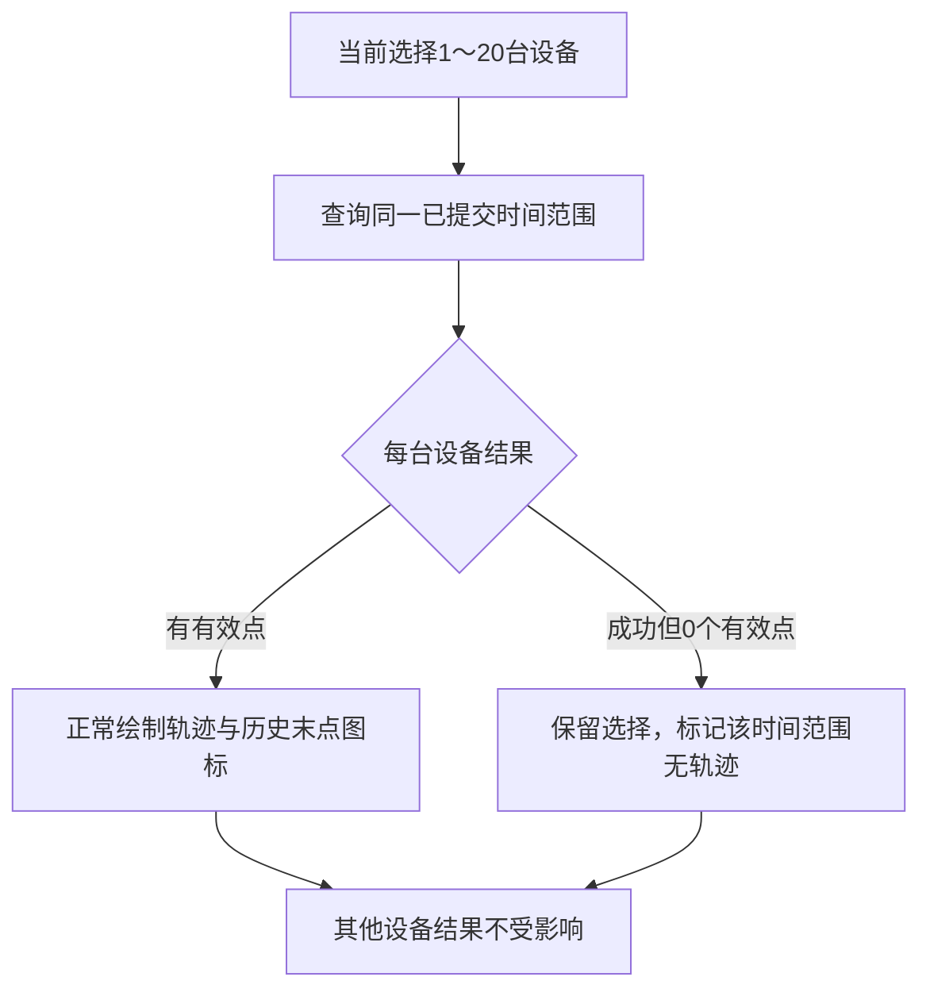
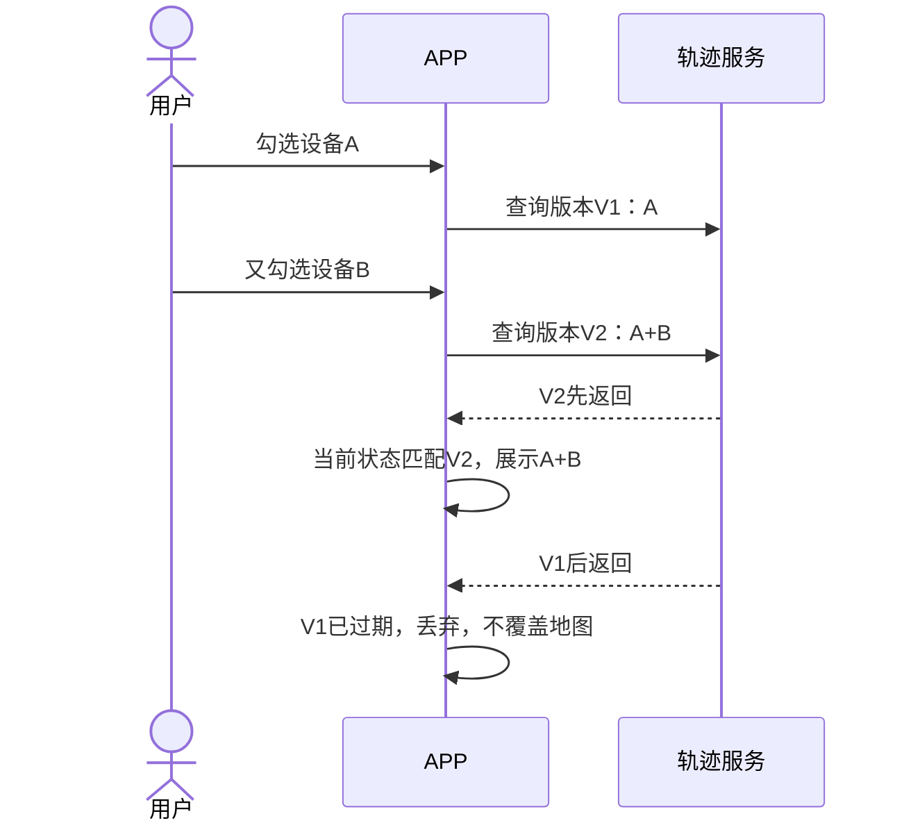
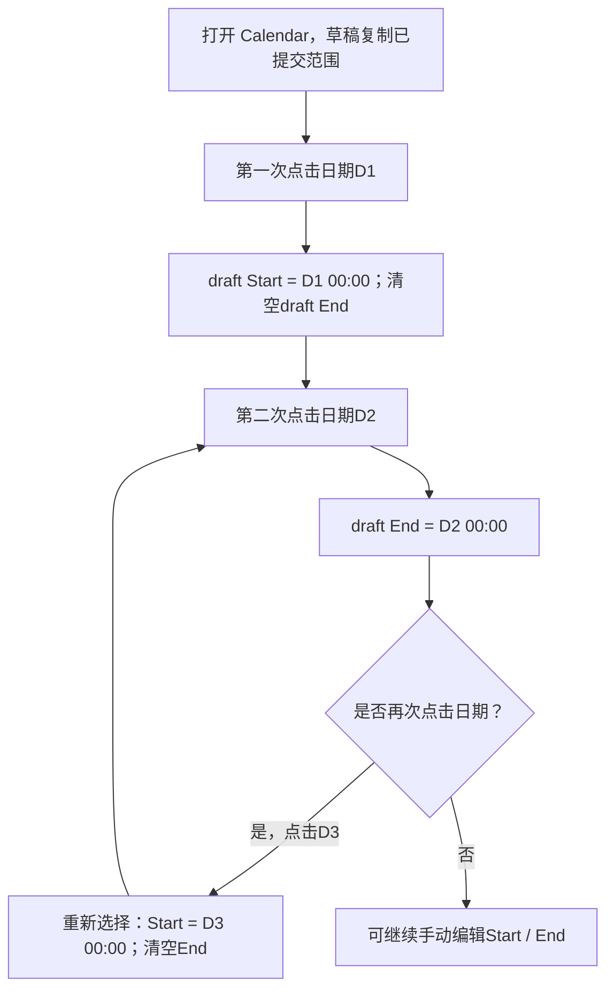
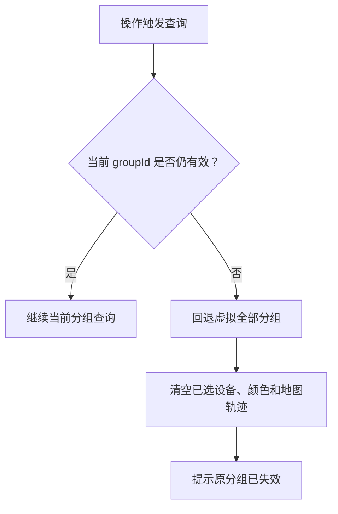

# 革泰 APP 整群轨迹逻辑点梳理.plan

<aside>
🎯

**文档用途**：梳理革泰 APP「整群轨迹」及整群 / 单设备共用的「轨迹时间范围选择」能力，包括入口、分组范围、设备选择、Start-End 时间段交互、轨迹查询与绘制、状态保留、异常处理和接口边界，作为后续产品澄清、接口联调与测试用例设计依据。

**适用范围**：覆盖 US-009「叠加查看整群轨迹」与 US-010「选择轨迹查询时间」；关联 US-007 的设备列表共享分组、US-008 的单设备历史轨迹、US-015 的设备列表入口、US-017 的账户分组体系、US-029 的 APP 时区。

**设计基准**：业务逻辑按中文原型梳理；页面视觉、地图布局、底部面板和已选标签样式按英文原型执行。两套原型冲突时，以本文已确认的业务规则为准。

</aside>

---

## 1. 核心结论

1. **唯一入口**：设备列表顶部「整群轨迹」；不从地图首页、分组管理页或设备行内菜单新增整群入口。
2. **共享当前分组**：进入时继承设备列表当前 `groupId`；虚拟「全部分组」代表当前账号全部可见设备，具体业务组只取直属设备，不聚合后代分组。
3. **首次不选设备**：首次进入设备选择为空，地图不伪造任何轨迹；整群轨迹时间范围独立初始化为 APP 时区当前时间往前 24 小时。
4. **英文主页面 + 底部选择弹层**：主页面按英文稿展示 `Bind Device / Selected N` 和已选标签；点击后打开底部弹层，在弹层中完成中文稿定义的分组切换、设备数量、搜索和多选。
5. **暂定最多 20 台**：Notion 与旧中文稿的 5 台上限被本轮暂定 20 台覆盖。选择第 21 台时，静默取消最早选择的第 1 台并加入第 21 台，后续依此类推。
6. **设备选择即时生效，时间范围确认后生效**：设备勾选、取消和标签删除立即更新选择状态并查询；Calendar 中 Start / End 仅为草稿，点击 `Search Tracking History` 且校验通过后才提交并发起查询，直接返回则丢弃草稿。
7. **不同设备轨迹颜色不同**：颜色由前端控制；同一页面会话内，仍保留的设备颜色保持稳定。
8. **绿色日期按当前查询对象计算**：整群 Calendar 仅根据当前已选设备集合标记有轨迹日期；单设备 Calendar 仅根据当前设备标记。绿色只表示当日存在轨迹，不限制日期选择。
9. **自定义时间范围**：Calendar 第一次点击日期设置 Start 日期并清空 End，第二次设置 End 日期；从日历选择的日期时分统一为 `00:00`，底部 Start / End 可自由修改到分钟。
10. **查询时统一校验**：日期和时间输入阶段不限制过去、未来或灰色日期；点击 Search 时校验 End 必填、End 不早于 Start、真实经过时长不超过 24 小时。`End = Start` 合法并返回空范围。
11. **Calendar 不承载设备列表**：取消旧轨迹日历中的当日设备列表、设备搜索、设备数量、设备行跳转和确认后再选设备逻辑；查询成功后返回调用 Calendar 的整群或单设备轨迹页。
12. **历史位置与当前状态分开**：设备图标放在所选时间范围内最后一个有效轨迹点，但图标颜色展示设备当前通信 / 告警状态，不代表轨迹发生时的历史状态。
13. **操作触发刷新**：不增加定时轮询或服务端推送；进入页面、打开设备选择弹层、切换分组、修改设备选择、提交新时间范围、切换 Calendar 月份或重试时查询最新数据。

---

## 2. 页面入口与导航链路

### 2.1 唯一入口


```mermaid
flowchart TD
    A["底部导航：设备"] --> B["Device List 设备列表"]
    B --> C["点击顶部整群轨迹"]
    C --> D["进入 Group Tracking 整群轨迹"]
    D --> E["继承设备列表当前 groupId"]
    D --> F["默认时间范围为 APP 当前时间往前24小时"]
    D --> G["默认未选择设备，地图无轨迹"]
```

- 从设备列表进入时携带当前分组唯一标识，不以分组名称代替 `groupId`。
- 若设备列表当前选择虚拟「全部分组」，整群轨迹使用当前账号全部可见设备作为候选范围。
- 若当前选择具体一级、二级或三级业务组，只使用直接归属该组的设备，不聚合后代组设备。
- 返回设备列表后，本次整群轨迹页面会话结束；再次进入时重新初始化，不恢复上一次时间范围、设备选择、颜色或地图视野。

### 2.2 页面间导航


```mermaid
flowchart TD
    A["Group Tracking"] -->|"Calendar"| B["Calendar 时间范围选择"]
    D["Single Device Tracking"] -->|"Calendar"| B
    B -->|"Search校验通过：整群来源"| A
    B -->|"Search校验通过：单设备来源"| D
    B -->|"直接返回：丢弃草稿"| C["返回来源页并保留上次已提交范围与结果"]
    A -->|"返回"| E["Device List"]
```

- Calendar 是整群轨迹与单设备轨迹共用的时间范围选择页，但两个来源的已提交时间范围和页面状态相互独立。
- 点击 Search 校验通过后，将草稿 Start / End 提交给来源页；整群来源按当前已选设备查询，单设备来源按当前设备查询。
- 未点击 Search 直接返回时，丢弃本次 Calendar 草稿，来源页继续展示上次已提交范围和结果。
- 同一来源页面会话内再次打开 Calendar，回显上次已提交范围；退出该轨迹页面会话后再次进入，重新初始化为当前时间往前 24 小时。
- 从整群轨迹返回设备列表后，本次整群页面实例结束；再次进入不恢复上次设备选择、颜色、时间范围或地图视野。

---

## 3. 页面状态模型

### 3.1 整群轨迹状态

整群轨迹当前有效查询状态至少由以下字段共同确定：

```text
GroupTrackState =
  sessionGenerationId
  + pageInstanceId
  + accountId
  + groupScope
  + groupId
  + appTimezoneId
  + committedStartDateTime
  + committedEndDateTime
  + calendarDraft
  + orderedSelectedDeviceIds
  + colorMapping
  + queryFingerprint
  + resourceRequestVersions
  + mapViewport
```

```text
CalendarDraft =
  draftStartDateTime
  + draftEndDateTime
  + selectionPhase
  + validationError
  + sourcePageType
```

| 状态 | 含义 |
| --- | --- |
| `sessionGenerationId` | 登录会话世代标识；登录、退出、token失效或切换账号后更新，旧会话响应全部作废 |
| `pageInstanceId` | 本次整群轨迹页面实例标识；返回设备列表结束实例，旧页面回调不得写入新页面 |
| `accountId` | 当前有效登录账号，由服务端登录态确定，不能由前端替换后扩权 |
| `groupScope` | 显式区分 `ALL_VISIBLE` 与 `DIRECT_GROUP`，禁止使用空 `groupId` 猜测全部分组 |
| `groupId` | `DIRECT_GROUP` 时必填的真实分组唯一标识；`ALL_VISIBLE` 时不得携带真实分组ID |
| `appTimezoneId` | IANA 地区时区，例如 `Asia/Shanghai`、`Europe/London`；页面日期时间按该时区解释后再转换为 UTC |
| `committedStartDateTime` | 上一次 Search 校验通过并提交的查询开始时间，首次为 APP 当前时间往前 24 小时 |
| `committedEndDateTime` | 上一次 Search 校验通过并提交的查询结束时间，首次为 APP 当前时间 |
| `calendarDraft` | Calendar 当前编辑草稿；直接返回时丢弃，不得污染来源页已提交条件 |
| `selectionPhase` | `SELECT_START` 或 `SELECT_END`；完整范围后再次点击日期重新进入 `SELECT_START` |
| `sourcePageType` | `GROUP_TRACKING` 或 `SINGLE_DEVICE_TRACKING`，决定 Search 成功后的返回目标和查询对象 |
| `orderedSelectedDeviceIds` | 按选择先后顺序保存的设备唯一标识集合，用于20台上限与 FIFO 淘汰 |
| `colorMapping` | 本页面会话内设备唯一标识到轨迹颜色的稳定映射 |
| `queryFingerprint` | 由账号会话、分组范围、时区、已提交 Start / End 和去重设备集合生成，用于结果归属校验 |
| `resourceRequestVersions` | 候选设备、月份日历、轨迹和当前状态分别维护版本，不能只保护轨迹请求 |
| `mapViewport` | 地图中心与缩放；是否保留由查询指纹是否变化决定 |

### 3.2 状态生命周期

| 场景 | 处理 |
| --- | --- |
| 首次进入整群轨迹 | 继承设备列表当前分组；设备为空；颜色映射为空；已提交范围初始化为当前时间往前24小时 |
| 页面内打开 / 关闭设备选择弹层 | 保留全部状态；关闭弹层不回滚已即时生效的设备选择 |
| 打开 Calendar | 草稿复制来源页已提交 Start / End；整群与单设备来源的状态互相隔离 |
| Calendar 第一次点日期 | 将该日期与 `00:00` 组合为 draft Start，清空 draft End，进入 `SELECT_END` |
| Calendar 第二次点日期 | 将该日期与 `00:00` 组合为 draft End；不提前限制先后顺序、未来日期或24小时跨度 |
| 完整范围后再次点日期 | 开启新一轮选择：新日期 `00:00` 写入 draft Start，旧 draft End 清空 |
| 手动编辑 Start / End | 允许自由修改完整日期时间到分钟；不自动联动、不自动截断、不提前禁用越界值 |
| 点击 Search 校验失败 | 不发请求；保留草稿，在字段区域下方显示红字错误，等待用户手动修正 |
| 点击 Search 校验成功 | 草稿提交为来源页正式 Start / End，返回来源页并按新查询指纹查询 |
| Calendar 直接返回 | 丢弃草稿，来源页保留上次已提交范围、轨迹结果、地图视野和其他有效状态 |
| 再次打开 Calendar | 同一来源页面会话回显上次已提交范围，不恢复未提交草稿 |
| APP时区变化 | 保留已提交和草稿的本地字面日期时间，按新 APP 时区重新解析边界；旧时区在途响应作废。若新边界无效或真实跨度超过24小时，不自动修正，要求用户回到 Calendar 调整后重新提交 |
| 页面跨APP时区午夜 | 已提交自定义范围不自动平移；只有退出页面实例后再次进入，才按新的当前时间初始化近24小时 |
| 返回设备列表 | 结束本次整群页面实例并取消 / 作废全部异步请求 |
| 再次进入整群轨迹 | 创建新 `pageInstanceId`，重新初始化，不恢复上一次设备选择、颜色或时间范围 |
| 退出登录 / token失效 / 切换账号 | 更新 `sessionGenerationId`，取消旧请求并清除账号分区缓存；旧账号响应不得写入新账号页面 |

---

## 4. 主页面结构与交互

### 4.1 最终页面组合方式

主页面使用英文原型结构与视觉：

- 标题：`Group Tracking`；
- 上半区：卫星 / 地图底图、轨迹线、轨迹节点、设备名称和设备图标；
- 地图操作：图层 / 全屏类入口、缩放；
- 下半区：当前已提交时间范围、`Calendar` 按钮、`Bind Device / Selected N`；
- 已选设备使用可删除标签展示。

中文原型中的以下业务能力放入点击 `Bind Device / Selected N` 后打开的底部弹层：

- 当前分组与分组内设备数量；
- 切换分组；
- 搜索设备；
- 候选设备复选列表；
- 已选数量。

### 4.2 无设备选择状态

- 首次进入不自动选择当前组第一台、前两台、前20台或全部设备。
- `Selected 0` 时地图不查询、不展示轨迹线和历史设备点。
- 页面保留时间范围和设备选择入口，提示用户选择设备；确切空态文案待 UI 文案确认。

---

## 5. 当前分组与候选设备范围

### 5.1 分组来源

- 整群轨迹与设备列表使用同一个会话级 `sharedDeviceGroupContext`，不是进入时复制后各自维护。
- 设备列表切组后进入整群轨迹，整群页读取最新共享分组；整群轨迹切组成功后也立即回写共享上下文，返回设备列表时设备列表按新分组刷新。
- 底部选择弹层展示当前账号的虚拟「全部分组」及真实一级、二级、三级分组。
- 分组结构、Level、父组和直属设备数量来自服务端分组查询，不从当前设备列表反向聚合。
- 空组仍可出现在分组选择器中。

### 5.2 候选设备范围

| 当前分组 | 候选范围 |
| --- | --- |
| 虚拟「全部分组」 | 当前账号全部可见设备，按设备唯一标识去重 |
| 具体一级 / 二级 / 三级业务组 | 直接归属当前 `groupId` 的全部可见设备，不包含后代组 |

- 候选列表不按在线、离线、告警状态预过滤。
- 候选列表不按当前已提交时间范围是否已有轨迹预过滤。
- 离线、未连接、当前告警或当前已提交时间范围无轨迹的设备仍可被选择。
- 候选设备身份始终使用设备唯一标识；备注、卡号或名称只用于展示与搜索。

### 5.3 切换分组


```mermaid
flowchart TD
    A["设备选择弹层切换 groupId"] --> B["清空原 orderedSelectedDeviceIds"]
    B --> C["清空颜色映射和地图轨迹"]
    C --> D["查询新分组候选设备及直属设备数"]
    D --> E["用户从新分组重新选择设备"]
```

- 不允许已选集合跨多个业务分组拼接。
- 即使同一设备因异常数据同时出现在多个候选来源，也按设备唯一标识去重。
- 切换分组不自动选择新分组设备。

---

## 6. 设备搜索、选择与20台滚动上限

### 6.1 搜索规则

| 项 | 规则 |
| --- | --- |
| 搜索字段 | 设备卡号 / 编号 `addr`、业务备注 `remark` |
| 匹配方式 | 模糊包含匹配 |
| 大小写 | 英文不区分大小写 |
| 关键词空格 | 忽略搜索关键词首尾空格 |
| 空关键词 | 恢复当前分组全部候选设备 |
| 对已选设备影响 | 只过滤候选行，不取消、不隐藏地图轨迹、不删除标签 |

示例：已选 `S18-001` 与 `S18-002` 后搜索 `002`，候选列表可只显示 `S18-002`，但 `S18-001` 仍在已选集合和地图中；清空搜索后恢复其已勾选设备行。

### 6.2 即时选择

- 勾选设备后立即加入有序选择集合、分配轨迹颜色并查询当前已提交时间范围轨迹。
- 取消勾选后立即从选择集合、标签、颜色映射和地图移除。
- 点击主页面已选标签的删除图标，等价于在弹层取消该设备。
- 关闭弹层只结束选择操作，不撤销已生效选择。
- 相同设备重复操作不能在集合中产生两份选择或两条重复轨迹。

### 6.3 暂定20台上限与 FIFO


```mermaid
flowchart TD
    A["用户勾选新设备 X"] --> B{"X 是否已选？"}
    B -->|"是"| C["保持单份选择，不重复加入"]
    B -->|"否"| D{"当前是否少于20台？"}
    D -->|"是"| E["X 追加到选择队尾"]
    D -->|"否，已有20台"| F["静默移除队首最早选择设备"]
    F --> G["释放被移除设备颜色"]
    G --> E
    E --> H["立即更新标签、勾选状态和轨迹查询"]
```

- 最大选择数量暂定为20台，覆盖 Notion 与旧中文原型的5台旧值。
- 选择第21台时自动取消第1台；选择第22台时自动取消当时最早的设备，以此类推。
- 自动替换不弹 Toast、不二次确认，也不单独提示被移除设备。
- 页面必须通过勾选状态、已选标签和 `Selected 20` 的变化真实反映最终集合。
- FIFO 顺序以用户实际加入选择集合的顺序为准；取消后重新选择的设备视为最新加入，排到队尾。
- 选择变更必须在最新状态上通过单线程 reducer / 原子事务完成：先按 `deviceId` 去重，再判断容量、淘汰队首、追加新设备，最后一次性提交选择、标签、颜色和查询指纹。
- 每次选择操作生成递增 `selectionOpSeq`；快速双击同一设备、几乎同时选择两台或旧异步回调均不得基于过期数组各自淘汰设备。
- UI选择状态即时变化，但轨迹网络请求允许使用短尾随合并（建议100～300ms）并取消旧请求，避免连续选择20台产生1+2+…+20台次的请求风暴；合并不得改变最终选择顺序和即时视觉状态。

<aside>
⚠️

**暂定风险**：20台同时绘制显著高于当前 Notion / 中文原型的5台。正式发布前仍需补充真机性能目标、接口数据量上限和20色可辨识验证；在正式数值确认前，本文将20标记为暂定需求，而非原平台稳定规则。

</aside>

---

## 7. 时间范围、时区与轨迹查询边界

### 7.1 默认时间范围

- 整群轨迹和单设备轨迹首次进入时，各自独立初始化已提交范围：`End = APP 时区当前时间`，`Start = End 往前 24 小时`。
- APP 时区来自登录 /「我的 → 时区设置」的统一配置，不使用设备 `ZONE` 参数代替。
- 页面按 `YYYY-MM-DD HH:mm` 展示，精确到分钟；接口查询边界使用 UTC 毫秒时间戳。
- 同一来源页面会话内再次打开 Calendar，回显上次已提交范围；退出页面实例后再次进入才重新计算近24小时。

### 7.2 Calendar 日期选择

- Calendar 第一次点击日期时，将该日期 `00:00` 写入 draft Start，并清空 draft End。
- 第二次点击日期时，将该日期 `00:00` 写入 draft End。
- 已有完整 draft Start / End 后再次点击日期，视为重新选择：新日期 `00:00` 写入 Start，旧 End 清空。
- 日期点击只负责生成 `00:00` 的日期边界；用户可通过底部 Start / End 行自由修改完整日期时间。
- 所有合法日历日期均允许选择，包括灰色无轨迹日期和未来日期；绿色只表示该自然日存在可用轨迹历史。
- 日历选择与底部输入阶段不校验日期先后、24小时跨度或未来时间，也不自动截断、排序、平移或改写另一端。

### 7.3 Search 提交校验

点击 `Search Tracking History` 时按以下顺序校验，失败时不发送轨迹请求：

| 条件 | 处理 |
| --- | --- |
| Start 为空 | Start / End 区域下方红字提示“请选择开始时间” |
| End 为空 | Start / End 区域下方红字提示“请选择结束时间” |
| `End < Start` | 红字提示“结束时间不能早于开始时间” |
| `End - Start > 24小时` | 红字提示“查询时间范围不能超过24小时” |
| `End = Start` | 合法，允许提交零时长范围，正常返回成功空结果 |
| `0 < End - Start <= 24小时` | 合法，提交并发起查询 |

- 校验错误保留用户输入并定位到相关字段；用户修改字段后清除对应错误，不使用短暂 Toast，也不自动修正。
- 允许提交未来时间范围；无轨迹时按成功空结果处理，不得当作参数错误或技术失败。
- “最多24小时”按真实经过时间计算：Start / End 按 APP IANA 时区解析为 UTC 后，要求 `endUtc - startUtc <= 1440分钟`，不能只比较本地日期或固定自然日。

### 7.4 查询边界与时间事实

轨迹查询使用左闭右开区间：

```text
[startUtc, endUtc)
```

- 包含 Start 时刻，不包含 End 时刻；相邻时间段连续查询不会重复包含边界点。
- 轨迹点以 UTC 毫秒时间戳 `locTime` 作为唯一定位时间事实源，服务端接收时间不得替代定位时间。
- 若接口同时返回 `locTime` 与格式化时间字符串，字符串必须由同一时间事实派生；不一致属于接口契约错误，客户端不得自行选择一个字段猜测。
- 迟到补传的位置在重新查询后按实际定位时间进入对应查询区间。
- 当前接口示例中 `1725811200000` 与 `2026-05-06 18:00:00` 相差近两年，联调前必须修正，不能把错误样例作为自动化预期。

### 7.5 查询触发

以下操作会形成新的整群轨迹查询条件：

- 勾选设备；
- 取消设备；
- 标签删除设备；
- FIFO 自动替换设备；
- Calendar 点击 Search 且校验通过，提交新的 Start / End；
- 点击失败重试；
- 检测并移除失权 / 移组设备后重新查询。

Calendar 草稿变化不触发来源页查询；Search 校验通过后才更新已提交范围、使旧查询结果失效并返回来源页请求一次。若实现后台预取，返回时必须复用同一在途 / 已完成请求，不得重复查询。

`Selected 0` 时不发起整群轨迹网络请求；Calendar 仍允许编辑和提交范围，来源页直接展示成功空态。

---

## 8. 多设备轨迹绘制

### 8.1 数据组织

整群轨迹结果应按设备唯一标识分组返回或整理：

```text
DeviceTrack =
  deviceId
  + displayRemarkOrAddr
  + currentStatus
  + trackColor
  + orderedValidPoints
```

- 同一设备轨迹点按实际定位时间从早到晚排序；相同时间戳时必须使用服务端稳定次级字段（如 `sequence`、`locationId`）排序，不能依赖数据库自然顺序。
- 轨迹点应具有稳定 `locationId` / 报文标识。重复报文优先按稳定标识去重；没有标识时才使用 `deviceId + locTime + 规范化坐标 + 报文序号` 组合，不能只按时间或坐标粗暴去重。
- 有效点至少要求经纬度为有限数且位于合法范围，并符合原轨迹服务允许绘制的定位状态；`null`、NaN、无穷值、越界坐标和明确无效定位不得点亮日历、增加有轨迹设备数或参与折线。
- `0,0` 是否为有效业务位置、哪些 `locStatus` 可绘制、双坐标缺失时是否允许转换，必须由轨迹接口契约书面定义，不能仅写“原服务认为有效”后由各端自行猜测。
- 不同设备的点不能串成同一条折线。
- 响应设备集合必须是请求设备集合的合法子集且每个请求设备有明确结果；服务端多返回的未请求设备禁止渲染，设备结果缺失不得自动视为无轨迹。
- 一台设备无轨迹属于该设备的成功空结果，不等于接口技术失败。

### 8.2 点与线

| 有效轨迹点数量 | 展示 |
| --- | --- |
| 0 | 不绘制轨迹线和历史位置图标；设备保留已选状态并标记当前时间范围无轨迹 |
| 1 | 展示单个轨迹点及设备图标，不伪造线段 |
| ≥2 | 按定位时间依次连接所有有效点 |

- 不增加“相邻点时间过长”“距离过远”的断线阈值。
- 不使用虚线表达轨迹缺口。
- 轨迹就是按有效点时间顺序依次连接；点间跨度不作为本期额外清洗规则。

### 8.3 轨迹颜色

- 颜色由 APP 前端为当前选择集合分配，不读取设备资料 `trackColor`，也不依赖服务端返回颜色。
- 同屏已选设备的轨迹颜色必须两两不同并能够有效区分。
- 同一次整群轨迹页面会话内，仍在选择集合中的设备颜色保持不变。
- 新设备使用当前未占用颜色；设备移除后释放其颜色槽位。
- 重新退出并进入整群轨迹后，可以重新分配颜色。
- 轨迹颜色只表达“这是哪台设备的轨迹”，不表达在线、离线或告警状态。

### 8.4 历史位置图标与当前状态

- 每台有轨迹设备的图标放在所选时间范围内最后一个有效轨迹点。
- 图标旁展示该设备备注，备注为空时使用设备卡号兜底。
- 历史末点坐标与当前设备状态是两个不同时间快照：图标位置来自查询时间范围内末点，通信 / 告警状态来自当前状态服务，并需返回 `statusAsOf`。
- 当前状态必须拆成两个维度：`communicationStatus = ONLINE | OFFLINE`，以及 `hasUntreatedAlarm = true | false`；告警可与在线或离线叠加，不能用一个颜色丢失其中一个维度。
- 图标主体表达在线 / 离线，独立角标或描边表达是否存在未处理告警；不得仅根据 `lastAlarmType` 推断当前告警，因为最后一条历史告警可能已经处理。
- 未明确在线的设备按既定规则映射为离线；状态接口不可用或状态快照超过产品约定有效期时，应展示未知 / 陈旧状态提示，不得继续无条件称为“当前”。
- 轨迹线颜色与状态图标颜色属于两套独立语义，不能因为当前告警图标为红色，就把该设备轨迹线也解释为告警轨迹。
- 查询历史时间范围时，应避免使用“设备当前位于此处”等实时语义；图标位置仍是该范围内的历史末点。

### 8.5 地图视野

- 查询指纹（账号会话、分组、时区、已提交 Start / End、设备集合）发生变化且新结果首次成功展示时，地图自动适配所有有轨迹设备的全部有效轨迹点。
- 从 Calendar 返回时，若已提交 Start / End 未变、查询指纹未变则保留地图中心和缩放；若时间范围已变化，则以新结果首次成功后的自动适配为准，不保留旧范围视野。
- 同一查询指纹已经成功展示后，用户手动缩放或拖动地图，普通刷新 / 重试不得反复抢回视野。
- 新查询此前从未成功、首次请求失败后重试成功时，仍属于该查询指纹的首次成功，必须自动适配，不能因“重试”二字跳过。
- 地图坐标使用当前地图 SDK 与底图所要求的坐标系；若接口同时提供 GCJ-02 与 WGS84，由前端地图适配层选择或转换，同一轨迹不得混用坐标系。

---

## 9. 部分无轨迹、整批失败与并发

### 9.1 设备级结果与顶层失败分类

| 结果 | 含义 | APP处理 |
| --- | --- | --- |
| `OK` | 设备合法且存在有效轨迹点 | 保留选择并绘制轨迹 |
| `NO_DATA` | 设备合法，但当前已提交时间范围没有有效轨迹点 | 保留选择和颜色，显示该时间范围无轨迹 |
| `OUT_OF_SCOPE` | 已解绑、失权、移出当前分组或对象已不存在 | 从选择集合移除并提示；其他有效设备重新查询 |
| `TECHNICAL_FAILED` | 轨迹存储、上游、网络或数据结构技术异常 | 本次整批地图结果不提交，按整批失败处理 |
| 会话级失败 | token过期、账号冻结、登录主体失效 | 终止当前业务访问并进入统一认证 / 账号状态处理，不显示为普通轨迹重试 |
| 分组级失败 | 当前具体分组已删除或失权 | 回退虚拟全部分组并清空选择、颜色和轨迹 |

- `OUT_OF_SCOPE` 属于业务范围变化，不得混入 `TECHNICAL_FAILED` 后反复重试。
- 每个请求设备必须返回一份明确结果；缺失设备不能自动当作 `NO_DATA`。
- 响应中出现未请求设备、重复设备结果或设备结果缺失，均属于接口契约错误；额外设备禁止渲染。
- 技术失败采用整批原子提交：结果在暂存区完整校验通过后再一次性替换地图，禁止部分轨迹先显示后因另一设备失败再撤回。

### 9.2 部分设备在查询时间范围内无轨迹


```mermaid
flowchart TD
    A["当前选择1～20台设备"] --> B["查询同一已提交时间范围"]
    B --> C{"每台设备结果"}
    C -->|"有有效点"| D["正常绘制轨迹与历史末点图标"]
    C -->|"成功但0个有效点"| E["保留选择，标记该时间范围无轨迹"]
    D --> F["其他设备结果不受影响"]
    E --> F
```

- 一台或多台无轨迹不导致整批失败。
- 无轨迹设备不自动取消选择，不释放颜色，不从标签中删除。
- 不得使用设备当前最新位置补齐历史时间范围空轨迹。
- 无轨迹确切提示文案与标签样式待 UI 文案确认。

### 9.3 技术失败采用整批失败

- 轨迹接口技术异常、响应结构不可用或批次中出现查询失败时，本次整批查询失败。
- 整批失败后清空地图上所有轨迹和历史设备点，防止旧日期 / 旧设备结果冒充当前查询。
- 保留当前分组、已提交 Start / End、设备选择顺序和颜色映射。
- 显示失败原因和重试入口。
- “设备在当前时间范围内0个有效点”是成功空结果，不能误判成技术失败。

### 9.4 快速操作与旧响应


```mermaid
sequenceDiagram
    actor User as 用户
    participant App as APP
    participant Service as 轨迹服务
    User->>App: 勾选设备A
    App->>Service: 查询版本V1：A
    User->>App: 又勾选设备B
    App->>Service: 查询版本V2：A+B
    Service-->>App: V2先返回
    App->>App: 当前状态匹配V2，展示A+B
    Service-->>App: V1后返回
    App->>App: V1已过期，丢弃，不覆盖地图
```

- 轨迹查询至少绑定 `sessionGenerationId + pageInstanceId + groupScope/groupId + appTimezoneId + committedStartDateTime + committedEndDateTime + orderedSelectedDeviceIds + requestVersion`。
- 只有与当前账号会话、页面实例和查询条件一致的最新响应可以更新地图。
- 候选设备、分组结构、月份 Calendar、轨迹和当前状态分别维护自己的查询键与版本；快速切组、切月、改变设备集合或连续提交时间范围时，旧资源响应同样不得覆盖新状态。
- 可取消旧请求，也可让旧请求完成后丢弃；无论采用哪种实现，都不能按返回先后让旧结果覆盖新结果。
- 候选设备刷新成功后立即用服务端授权候选集合核对已选设备；已不在范围的设备原子移除。候选请求失败时不得用空数组冒充全部设备失权。

---

## 10. Calendar 时间范围选择

### 10.1 页面职责与数据范围

- Calendar 只负责选择并提交 Start / End，不承载设备列表、设备搜索、设备数量、分页或设备行跳转。
- Calendar 由整群轨迹和单设备轨迹共用，但必须携带明确 `sourcePageType`，查询成功后返回原来源页。
- 整群来源的绿色日期仅根据当前 `orderedSelectedDeviceIds` 计算，不再按当前分组全部设备计算；`Selected 0` 时不显示绿色日期。
- 单设备来源的绿色日期仅根据当前设备计算。
- 月份日期查询仍受当前登录账号设备权限限制；失权设备不得返回绿点或轨迹存在性信息。

### 10.2 月份、日期与绿色标记

| 项 | 规则 |
| --- | --- |
| 初始月份 | 待UI确认；至少应展示已提交 Start 或 End 所在月份，且切月只改变视图、不修改草稿时间 |
| 月份切换 | 支持切换任意年月，包括未来月份 |
| 有轨迹日期 | 使用绿色点 / 高亮表示该自然日存在可用轨迹历史 |
| 无轨迹日期 | 正常显示并允许选择；绿色不承担可选性限制 |
| 未来日期 | 正常显示并允许选择 |
| 日期时区 | 按 APP 当前 IANA 时区计算自然日归属 |
| 日期点击时分 | 从日历选择的 Start / End 时分统一为 `00:00` |

- `daysWithData` 必须去重、严格位于请求年月的合法日期范围；重复、0、32、2月30日等非法值应忽略并上报契约错误，不能映射到相邻月份。
- 绿色日期查询必须与来源页使用相同账号范围、设备集合、有效点规则、APP时区和数据修订水位。
- 迟到补传可能改变历史月份绿点；重新进入 Calendar、切换月份或显式刷新时应重新查询当前月份，不能永久保留旧快照。
- 绿色只提供数据存在性提示；用户仍可选择灰色日期、未来日期或最终返回空结果的范围。

### 10.3 日期点选状态机


```mermaid
flowchart TD
    A["打开 Calendar，草稿复制已提交范围"] --> B["第一次点击日期D1"]
    B --> C["draft Start = D1 00:00；清空draft End"]
    C --> D["第二次点击日期D2"]
    D --> E["draft End = D2 00:00"]
    E --> F{"是否再次点击日期？"}
    F -->|"是，点击D3"| G["重新选择：Start = D3 00:00；清空End"]
    G --> D
    F -->|"否"| H["可继续手动编辑Start / End"]
```

- 第一次点击始终定义 Start，第二次点击定义 End；系统不按日期早晚自动交换两端。
- 完整范围后第三次点击开启新一轮选择，不允许旧 End 混入新范围。
- Start 或 End 可通过底部入口自由修改完整日期时间，精确到分钟。
- 手动修改一端不联动另一端；即使形成倒序、超过24小时或未来范围，也先保留草稿，统一由 Search 校验。

### 10.4 Search、返回与错误提示

- 点击 `Search Tracking History` 后执行第7.3节的完整校验；校验失败不请求接口、不返回来源页。
- 错误在 Start / End 区域下方使用红字展示，并保留用户输入供其手动调整。
- 校验通过后，将草稿提交为来源页正式范围并返回：整群来源查询当前已选设备，单设备来源查询当前设备。
- 合法范围查询成功但无轨迹时，来源页清空旧轨迹并显示“该时间范围暂无轨迹”空态；不得继续展示旧范围轨迹。
- 未点击 Search 直接返回时，丢弃本次草稿；上次已提交范围、轨迹结果和地图视野保持不变。
- 同一来源页面会话再次打开 Calendar 时回显上次已提交范围，不恢复已丢弃草稿。

---

## 11. 单设备时间范围历史轨迹

- 单设备轨迹页在进入 Calendar 前已确定设备唯一标识；Calendar 不再通过设备列表选择或跳转设备。
- Search 校验通过后携带当前 `deviceId + committedStartDateTime + committedEndDateTime + appTimezoneId` 返回单设备轨迹 / 回放页查询。
- 单设备和整群轨迹的已提交时间范围、草稿和请求版本相互独立，不得串用状态或缓存。
- 查询使用 `[startUtc, endUtc)`；轨迹点按实际定位时间排序，迟到补传位置重新查询后按实际定位时间进入对应范围。
- 单设备回放可继续使用既有轨迹节点、起终点、停留点、统计、播放、暂停、进度和倍速规则；整群轨迹不重新定义这些能力。
- 从 Calendar Search 成功返回后使用新范围；直接返回则继续保留单设备页面上次已提交范围和回放结果。

---

## 12. 数据来源与接口契约

### 12.1 数据来源

| 数据 | 来源 |
| --- | --- |
| 当前账号 | 登录 token / 服务端会话 |
| 当前分组和候选设备 | 原账户分组与设备关系服务；与设备列表共用分组上下文 |
| 分组直属设备数量 | 服务端分组查询返回，APP不遍历设备自行计算 |
| 当前设备状态 | 当前设备列表 / 设备总览服务的最新通信与告警数据 |
| 月份有轨迹日期 | `GET /api/monitor/app/home/track-calendar`；整群按当前已选设备集合，单设备按当前设备，并使用 APP IANA 时区 |
| 整群轨迹点 | 当前接口文档未明确按 Start / End 批量查询多设备轨迹的接口，需要复用或补充批量能力 |
| 单设备回放 | 复用原单设备历史轨迹服务 / US-008，并改为接收 Start / End 时间范围 |

### 12.2 当前接口契约缺口

本地《API接口改动新增》目前记录：

1. `GET /api/monitor/app/home/track-calendar` 只有 `year`、`month`，没有明确区分整群 / 单设备来源、当前设备集合和 APP IANA 时区；无法严格满足“按当前查询对象标记绿色日期”。
2. 旧 `GET /api/monitor/app/home/track-calendar/detail` 服务于当日设备列表；新 Calendar 已取消设备列表、搜索和设备行跳转，该接口不再是本页面依赖，不应继续围绕新原型扩充分页摘要能力。
3. 当前接口文档未明确“按 Start / End、1～20个稳定设备标识批量返回分设备轨迹点”的整群轨迹接口。
4. 当前接口主要使用 `addr` 识别设备，未提供不可变、不可复用的稳定 `deviceId`；`addr` 只能用于展示、搜索和旧接口兼容，不能承担颜色映射、FIFO和权限关联主键。
5. 当前接口未定义 `OK / NO_DATA / OUT_OF_SCOPE / TECHNICAL_FAILED` 等设备级结果，无法同时实现失权移除和技术整批失败。
6. 当前接口未定义零时长范围、未来范围、End早于Start、超过24小时以及 `[startUtc, endUtc)` 的服务端校验契约。
7. 当前接口未定义最大设备数、单设备 / 整批最大点数、最大响应字节、截断、游标、压缩和超时规则。
8. Apifox旧单设备轨迹契约存在将 `Authorization` 作为查询参数的风险；新接口认证必须使用标准请求头，不得把token写入URL、日志或缓存键。

### 12.3 业务契约要求

无论最终采用修改旧接口还是新增接口，服务端结果必须满足：

#### 月份 Calendar

```text
整群输入：当前账号登录态 + sourcePageType=GROUP_TRACKING + deviceIds（当前已选集合）+ year + month + IANA appTimezoneId
单设备输入：当前账号登录态 + sourcePageType=SINGLE_DEVICE_TRACKING + deviceId + year + month + IANA appTimezoneId
输出：对应设备范围内有轨迹的日期集合 + 实际查询时区、UTC月份边界和数据修订水位
```

- 整群 `Selected 0` 时 APP 可直接展示无绿色日期，不得用当前分组全部设备替代空选择集合。
- `daysWithData` 只表达数据存在性，不表达日期是否可选；灰色和未来日期仍允许用户选择。
- Calendar 不再需要当日设备摘要、设备搜索、数量或分页接口。

#### 整群轨迹

```text
输入：当前账号登录态 + groupScope/groupId + startUtc + endUtc + IANA appTimezoneId + deviceIds（去重后1～20）+ clientRequestId
输出：同一授权 / 数据快照下按稳定deviceId分组的轨迹结果 + 每设备outcome + 已解析查询边界 + 点数 / 截断信息
```

#### 单设备轨迹

```text
输入：当前账号登录态 + deviceId + startUtc + endUtc + IANA appTimezoneId + clientRequestId
输出：授权快照下的单设备轨迹结果 + outcome + 已解析查询边界 + 点数 / 截断信息
```

#### 时间范围契约

- APP 本地校验后，服务端仍必须再次校验 `endUtc >= startUtc` 且真实经过时长不超过1440分钟，不能信任客户端。
- `endUtc = startUtc` 是合法零时长范围，返回成功空结果。
- 允许未来时间范围；没有轨迹时返回 `NO_DATA`，不得返回参数错误。
- 查询边界统一为 `[startUtc, endUtc)`，响应回显 `resolvedStartUtc / resolvedEndUtc / durationMinutes / timezoneId`。

每台设备轨迹至少需要：

- 不可变、不可复用的稳定 `deviceId`；
- 备注与卡号 `addr`；
- 设备级 `outcome`；
- 当前通信状态、`hasUntreatedAlarm` 与 `statusAsOf`；
- 按实际定位时间和稳定次级键有序的有效位置点；
- 每个点的稳定 `locationId`、UTC定位时间、坐标及坐标系；
- `rawPointCount / validPointCount / returnedPointCount / truncated / nextCursor`；
- 空轨迹结果、失权结果与技术失败的明确区分。

前端轨迹颜色不要求服务端返回。服务端响应中的设备顺序不承担前端FIFO语义，前端按本地有序选择集合匹配 `deviceId`。

### 12.4 服务端授权

- 使用标准 `Authorization` 请求头认证；token不得出现在URL查询参数、业务日志或共享缓存键中。
- 服务端根据登录态确定当前账号，不因客户端传入其他账号标识扩大范围；外部错误不得泄露目标设备是否真实存在。
- `groupScope=ALL_VISIBLE` 与 `groupScope=DIRECT_GROUP` 使用显式互斥参数组合；禁止把漏传或空 `groupId` 自动解释为全部分组。
- `ALL_VISIBLE` 必须复用当前账号经绑定、分配及其他有效授权形成的**全部可见设备去重集合**，不能仅查询当前账号直接绑定设备。
- 校验 `groupId` 属于当前账号可见分组范围。
- 校验每个设备仍属于当前账号可见范围，并直接归属当前具体分组；虚拟全部分组时校验账号可见范围。
- 权限、当前分组关系和轨迹读取必须位于同一数据库快照或不可绕过的查询谓词中，避免“先校验、后失权、仍返回轨迹”的 TOCTOU。
- 请求中重复设备标识按稳定 `deviceId` 去重；越权设备不得返回历史轨迹、设备摘要或当前状态。
- 退出、账号切换和token失效后，响应还需通过客户端 `sessionGenerationId + accountId + pageInstanceId` 校验，防止旧账号位置数据进入新账号UI或缓存。
- HTTP缓存若存在，必须按认证主体隔离并采用 `Cache-Control: private, no-store` 等安全策略；本地缓存按账号命名空间隔离，退出时清理。

### 12.5 容量、分页与截断

- 候选设备列表仍需支持稳定游标分页；同一游标绑定账号、分组、关键词、排序和数据快照。
- 月份 Calendar 仅返回去重日期集合和数据修订水位，不得返回整月轨迹点。
- 整群轨迹必须定义去重后最大设备数、单设备最大原始点数、整批最大点数、最大响应字节数、接口超时和APP可承载上限。
- 超过容量不得静默丢点；必须返回 `truncated`、原始 / 有效 / 返回点数和 `nextCursor`，或返回稳定错误码 `TRACK_QUERY_TOO_LARGE`。
- 若采用轨迹抽稀，必须区分原始点、有效点和绘制点；查询范围内首个和最后有效点强制保留，单点设备不能被抽成空结果。
- 传输层明确gzip / br压缩、连接 / 读取超时和页面离开后的取消与内存释放策略。

### 12.6 错误码与可观测性

业务分支不得解析中英文 `msg` 文本，至少需要以下机器可读错误码：

| 错误码 | 处理 |
| --- | --- |
| `UNAUTHENTICATED` / `ACCOUNT_FROZEN` | 结束当前业务访问，进入统一认证 / 账号状态流程 |
| `GROUP_NOT_FOUND_OR_FORBIDDEN` | 回退全部分组并清空选择 |
| `DEVICE_OUT_OF_SCOPE` | 移除对应设备，不反复技术重试 |
| `INVALID_TIME_RANGE` / `INVALID_TIMEZONE` | Start / End 无法解析或 End 早于 Start，阻止查询并提示修正 |
| `TIME_RANGE_TOO_LARGE` | 真实经过时长超过24小时，阻止查询并提示用户手动调整 |
| `TOO_MANY_DEVICES` | 契约上限不一致，禁止服务端静默截前N台 |
| `TRACK_QUERY_TOO_LARGE` | 提示范围过大；按正式点数 / 抽稀契约处理 |
| `RATE_LIMITED` | 遵循 `Retry-After`，禁止即时循环重试 |
| `UPSTREAM_TIMEOUT` / `TRACK_STORE_UNAVAILABLE` | 整批技术失败，可按规则重试 |

请求 / 响应至少提供：`clientRequestId`、`traceId`、`snapshotId`、`scopeVersion`、`dataAsOf`、实际时区、UTC查询起止、请求 / 返回设备数、原始 / 有效 / 返回点数及 `truncated`。日志不得记录完整token或未经授权暴露完整轨迹坐标。

---

## 13. 数据刷新、跨端变化与失效处理

### 13.1 操作触发刷新

本期不增加定时轮询和服务端实时推送。数据在以下动作发生时更新：

| 数据 | 查询时机 |
| --- | --- |
| 当前分组与候选设备 | 进入整群轨迹；每次打开 Bind Device 弹层；切换分组 |
| 已选设备有效性 | 勾选、取消、提交新时间范围、重试等每次轨迹查询时由服务端重校验 |
| 多设备轨迹 | 设备集合变化时立即查询；Calendar 草稿变化不查，Search 校验通过并提交新范围后查询 |
| 月份有轨迹日期 | 进入 Calendar、切换年月、整群已选设备集合变化后重新打开或刷新 |
| 当前设备状态 | 随整群轨迹查询或当前设备状态服务更新 |

- 用户停留页面且没有任何操作时，允许暂时保留进入时快照。
- Web 或其他端发生变化后，不要求页面无操作时立即推送更新。
- 候选设备、分组、月份 Calendar、整群轨迹和单设备轨迹分别维护 `NOT_REQUESTED / LOADING / SUCCESS_DATA / SUCCESS_EMPTY / FAILED_RETRYABLE / FAILED_NON_RETRYABLE` 状态。
- 新查询失败不得把旧查询键的数据冒充为当前结果；若暂时保留旧画面，必须清晰标记为旧数据且禁止依赖新范围继续选择。
- 技术失败不得写入业务空结果缓存；历史时间范围无数据可能被迟到补传改变，只允许短期负缓存并绑定数据修订水位。

### 13.2 单设备失效

设备在页面停留期间被解绑、失权或移出当前分组，下一次操作触发查询时：

1. 服务端拒绝该设备继续进入当前范围；
2. APP 从已选集合中移除该设备；
3. 释放颜色并删除对应标签和轨迹；
4. 提示该设备已不在当前范围；
5. 其余有效设备继续重新查询。

此场景属于选择对象失效，不按普通整批技术失败处理。

### 13.3 当前分组失效


```mermaid
flowchart TD
    A["操作触发查询"] --> B{"当前 groupId 是否仍有效？"}
    B -->|"是"| C["继续当前分组查询"]
    B -->|"否"| D["回退虚拟全部分组"]
    D --> E["清空已选设备、颜色和地图轨迹"]
    E --> F["提示原分组已失效"]
```

- 不保留已删除分组的设备快照继续访问历史。
- 不直接退出整群轨迹页面。
- 回退后不自动选择全部分组中的任何设备。

---

## 14. 边界值与关键验收场景

| 场景 | 预期结果 |
| --- | --- |
| 首次进入整群轨迹 | 继承设备列表当前分组；已提交范围为APP当前时间往前24小时；Selected 0；地图无轨迹 |
| 当前组0台设备 | 弹层展示空态；不能伪造设备或轨迹 |
| 选择1台 | 分配唯一颜色并按已提交范围查询；0点显示无轨迹，1点只显示点，≥2点连线 |
| 选择20台 | 允许同时保留20台；颜色两两不同 |
| 已有20台选择第21台 | 静默移除最早选择设备，第21台加入队尾；数量仍为20 |
| 取消后重新选择同一设备 | 设备排到选择队尾，获得当前可用颜色，不产生重复选择 |
| 搜索不匹配已选设备 | 已选设备、标签、颜色和地图轨迹继续保留 |
| 切换分组 | 清空原选择、颜色与轨迹，新组默认不选设备 |
| 具体父组有子组 | 候选只取直接归属父组设备，不聚合子组 |
| 部分设备在范围内无轨迹 | 有轨迹设备正常绘制；无轨迹设备保留选择并标记 |
| 一台设备 `OUT_OF_SCOPE` | 只移除该设备并提示，其余有效设备按新集合重新查询 |
| 一台设备 `TECHNICAL_FAILED` | 本次整批失败，清空地图；保留选择、颜色和已提交范围，提供重试 |
| 快速连续勾选 | FIFO状态在最新集合上原子计算；只有最新设备集合响应可更新地图，旧响应丢弃 |
| 快速切组 / 切月 / 连续提交范围 | 各资源旧响应均不得覆盖新查询键，不只保护轨迹请求 |
| 轨迹点间隔很长 | 仍按定位时间依次连线，不按时间 / 距离阈值断线 |
| 完全重复轨迹点 | 按稳定位置记录标识去重，不重复绘制节点和零长度线段 |
| 相同 `locTime` 不同坐标 | 使用稳定次级排序键；末点和折线顺序不能依赖数据库自然顺序 |
| 经纬度缺失、越界、NaN或明确无效定位 | 不参与绿色日期、折线和范围内历史末点；上报契约 / 数据质量问题 |
| 服务端多返回未请求设备 | 禁止渲染并上报契约错误，不得为其分配颜色或扩大数据范围 |
| 查询历史时间范围 | 图标位于该范围最后有效点；图标颜色表达当前状态，不冒充历史状态 |
| 打开整群Calendar | 草稿回显整群页面上次已提交范围；绿色日期仅按当前已选设备计算 |
| 打开单设备Calendar | 草稿回显该单设备页面上次已提交范围；绿色日期仅按当前设备计算 |
| 整群Selected 0打开Calendar | 不显示绿色日期；仍允许编辑和提交范围，返回来源页后展示成功空态 |
| 点击灰色日期 | 允许选择；绿色仅提示数据存在，不限制可选性 |
| 点击未来日期 | 允许选择和查询；没有轨迹时返回成功空结果 |
| 日历第一次点击9日 | draft Start=9日00:00，draft End清空 |
| 日历第二次点击11日 | draft End=11日00:00；先保留48小时草稿，不提前限制 |
| 完整范围后第三次点击15日 | 重新开始选择：draft Start=15日00:00，旧End清空 |
| 同一日期连续点击两次 | Start=End=该日00:00；允许提交零时长范围并返回空结果 |
| 手动修改Start / End | 可自由选择任意日期和分钟，不自动联动、排序、截断或改写另一端 |
| End为空点击Search | 不发请求；字段区域红字提示“请选择结束时间” |
| End早于Start点击Search | 不发请求；红字提示“结束时间不能早于开始时间” |
| 范围刚好24小时 | 校验通过并查询 |
| 范围24小时1分钟 | 不发请求；红字提示“查询时间范围不能超过24小时” |
| DST切换日校验24小时 | 按UTC真实经过分钟数计算，不按本地日期差或固定自然日猜测 |
| Search校验失败 | 留在Calendar并保留全部输入，用户手动调整；不弹短暂Toast，不自动修正 |
| 未点击Search直接返回 | 丢弃草稿；来源页保留上次已提交范围、轨迹和地图视野 |
| Search成功且范围未变 | 查询指纹未变时可复用结果，并保留地图中心和缩放 |
| Search成功且范围变化 | 返回来源页查询；新结果首次成功后自动适配，不沿用旧范围视野 |
| 合法范围查询成功但无轨迹 | 清空旧轨迹，保留已提交范围和设备选择，显示“该时间范围暂无轨迹” |
| 同一来源再次打开Calendar | 回显上次成功提交范围，不恢复已丢弃草稿 |
| 整群与单设备分别打开Calendar | 两类页面状态独立，不共享已提交范围、草稿、请求或缓存 |
| 返回设备列表后重进 | 创建新页面实例，重新初始化近24小时、当前共享分组和Selected 0 |
| 整群页面切换分组后返回设备列表 | 新 `groupId` 已回写共享上下文，设备列表按新分组刷新 |
| 已选设备失权 / 移组 | 下一次查询或候选刷新时移除该设备并提示，其余有效设备继续查询 |
| 当前分组失效 | 回退虚拟全部分组，清空选择和轨迹并提示 |
| 候选接口失败 | 不得把空数组当全部设备失权；保留原选择并显示加载失败 |
| 切换未来年月 | 月份允许进入；所有合法日期允许选择；非法年份范围由服务端参数校验 |
| 2月28/29、月末、年末 | 按真实日历和APP时区生成日期，不产生非法日期；跨日范围由Start / End明确表达 |
| 改APP时区 | 保留本地字面Start / End并按新时区重新解析；设备ZONE不替代APP时区，旧时区响应作废；若新跨度超过24小时则要求用户重新调整 |
| 页面跨APP时区午夜 | 已提交范围不自动平移；退出页面实例后重进才按新的当前时间初始化近24小时 |
| 账号A请求未完成时退出并登录B | A响应因会话世代不匹配丢弃，且不得写入B的UI或缓存 |
| 设备在线且告警 / 离线且告警 | 图标主体表达通信状态，独立角标表达告警，两维状态不得互相覆盖 |

---

## 15. 已确认的原型修订

| 原型 / 旧规则 | 当前结论 |
| --- | --- |
| Notion / 中文稿最多5台 | 暂定改为20台 |
| 超过上限时阻止选择 | 改为FIFO静默替换最早选择设备 |
| 中文稿在主页面内嵌分组、搜索和设备列表 | 业务能力保留，但放入英文稿 `Bind Device` 底部弹层 |
| 英文稿主页面只有Bind Device与已选标签 | 保留作为主页面视觉结构 |
| 旧日历无确认按钮 | 新增 `Search Tracking History`；只有点击后校验、提交并查询 |
| 旧日历设备列表、搜索、数量和设备行跳转 | 全部取消；Calendar 仅负责Start / End时间范围选择 |
| 单自然日查询 | 改为自定义Start / End，真实经过时长最多24小时 |
| 有轨迹日期才能选择 | 改为所有合法日期均可选择，绿色只提示数据存在 |
| 日期点击立即回写来源页 | 改为草稿编辑；Search成功后回写，直接返回丢弃草稿 |
| 日历是否只看已选设备不明确 | 整群按当前已选设备标记绿点；单设备按当前设备标记 |
| 轨迹颜色来源不明确 | 前端分配，同屏设备颜色不同，会话内稳定 |
| 长间隔轨迹是否断线未定义 | 不断线，所有有效点按时间依次连接 |
| 坐标系固定字段 | 由地图SDK和底图适配层决定，同一轨迹禁止混用 |

---

## 16. 待后续确认 / 联调项

以下内容仍不能作为最终固定实现值；自然日与时间段、Calendar设备列表、日期可选性和Search提交方式已由本轮原型变更确认，不再列为待确认项。

1. **5台 vs 暂定20台**：Notion确定稿和旧中文原型仍是最多5台且超限阻止；本文暂定20台并FIFO静默替换。需正式变更Notion、原型、接口上限和验收标准后，20台才能转为正式规则。
2. **整群主页面进入单设备回放**：Notion写“可进入对应设备回放”，新 Calendar 已取消设备行入口；需确认整群主页面是否允许点击历史末点图标、设备标签或轨迹图例进入对应设备回放。
3. **未分组数据模型**：Notion旧稿存在未分组系统视图，但当前设备管理大纲已确认本期不存在未分组。需统一PRD与服务端数据模型，不能让两个模块采用不同分组全集。
4. **20台上限性能可行性**：需结合真机、地图SDK和接口数据量验证后转为正式值；未通过前保持“暂定”。
5. **20色具体色板**：需提供固定色板、槽位复用顺序和前端原子分配算法，并验证浅色 / 卫星底图、色弱和相邻轨迹重叠场景下的辨识度；仅十六进制值不同不能视为可辨识。
6. **性能指标**：补充20台、24小时范围场景的服务端P95/P99、最大响应字节、单设备 / 整批最大点数、首屏可交互时间、全量绘制时间、峰值内存和连续切换后的资源回收目标。
7. **整群轨迹接口**：当前接口文档未提供明确批量轨迹路径、方法、稳定deviceId、Start / End、最大设备数和响应结构。
8. **月份 Calendar 接口**：需补充 `sourcePageType`、整群已选 `deviceIds` / 单设备 `deviceId`、IANA时区和数据修订水位；旧 `track-calendar/detail` 不再作为新页面依赖。
9. **无轨迹、加载失败与校验文案**：业务状态已区分，最终中英文文案、红字位置和样式待 UI 确认。
10. **当前状态来源与时效**：需确认由批量轨迹响应携带还是并行读取状态服务，并确定 `statusAsOf` 与状态过期阈值。
11. **地图坐标适配**：业务不固定 GCJ-02 / WGS84，需由实际地图SDK方案确认目标坐标、转换位置、转换版本和精度验收标准，防止重复转换。
12. **轨迹有效点策略**：需确认 `locStatus`、`0,0`、双坐标缺失、非法坐标和重复点的服务端正式判断规则与策略版本。
13. **原单设备历史轨迹接口**：需在联调阶段确认真实接口能否接收 Start / End、`[startUtc, endUtc)`、零时长和未来范围；旧接口不得把Authorization放在URL查询参数。
14. **可查询年月范围**：当前交互允许任意年月和未来日期，但服务端仍需确认合法年份、最早历史日期和数据保留期边界。
15. **Calendar初始展示月份**：需由UI确认打开时优先展示已提交Start月份还是End月份；切换月份不得隐式改写Start / End。

---

## 17. 参考资料

- [革泰 APP 产品需求文档（Notion）](https://app.notion.com/p/APP-3d75667c6d3a800e938af02c795b6fcf)：US-007、US-008、US-009、US-010、US-015、US-017、US-029。
- `docs/manuals/革泰/API接口改动新增.md`：APP 首页设备总览、月份 Calendar 与轨迹查询相关接口。
- `docs/manuals/革泰/逻辑大纲/革泰 APP 设备管理逻辑点梳理 plan.md`：设备列表入口、共享分组、账户分组范围与直属设备统计口径。
- 中文整群轨迹旧原型：业务功能、分组、搜索、多选和旧自然日交互，仅保留未被新原型覆盖的设备选择能力。
- 英文 Group Tracking / Calendar 新原型：最终主页面视觉、Start / End、24小时提示、`Search Tracking History` 与月份绿色日期视觉。

---

**文档版本**：v1.2（改为Start-End时间范围查询，新增24小时提交校验并移除Calendar设备列表）

**最后更新**：2026-10-10

**维护人**：测试团队
