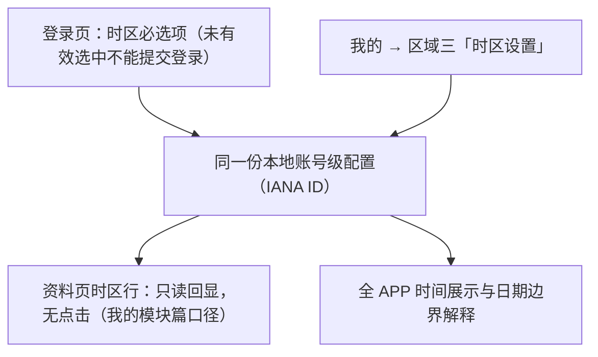

# 革泰 APP 时区设置逻辑点梳理.plan

<aside>
🎯

**文档用途**：全量梳理革泰 APP「APP 展示时区设置」（US-029，**仅修改 APP 端时间展示与日期查询边界，不涉设备**——与「设备 ZONE 指令下发」是两个不同功能，见口径区概念澄清）的配置模型、入口链路、列表规范、默认值规则、生效范围、日期边界换算与异常场景，并收录**已实测验证**的「下载轨迹跨夏令时错 1 小时」已知风险（RISK-TZ-01），作为产品澄清、接口联调与测试用例设计依据。

**适用范围**：US-029 全量（APP 展示时区功能）；登录页时区入口（与「我的 → 时区设置」同源配置的口径）、资料页时区行只读回显（口径见我的模块篇）、指令记录排序键不受时区影响的关联边界（US-034）；与设备 `ZONE` 指令的功能边界（第 9 章，指令下发细节归指令篇 7.3，本篇不重复展开）。

**口径基准**：业务逻辑以本文 2026-09-18 逐项拍板结论为准（拍板记录见第 15 章）；与 PRD 或 UI 原型冲突或不一致处已在正文标明。

**三条关键口径**：① 时区为**纯本地账号级配置**（不随设备共享、不上服务端）；② 时区列表数据源为**手机系统 tzdata（IANA）**、呈现参照 Windows 精选视图、存储 IANA 区域名；③ 下载轨迹是**唯一后端转换场景**，其固定偏移传参存在已验证的跨 DST 错 1h 风险（第 10 章），且轨迹查询/下载链路另有 RISK-TZ-02~05 关联风险群（第 10.3 章）。

**🔑 概念澄清——「设置时区」在本 APP 是两个不同功能**：

| 功能 | 是什么 | 入口 |
| --- | --- | --- |
| **APP 展示时区**（本篇对象） | **仅修改 APP 端的时间显示与日期查询边界**——不改设备任何参数、不向设备下发任何内容、不是指令 | 登录页 / 我的 → 时区设置 |
| **设备 ZONE 指令下发** | 一条**设备指令**：设置设备协议侧时区，走完整指令链路（提交→投递→设备回复确认），产生指令记录 | 指令 → 参数设置 → 设置设备时区 |

两者入口不同、对象不同、取值体系不同、互不代替、互不影响（详见第 9 章）。本篇只梳理前者；后者见指令篇 7.3。

</aside>

---

## 1. 核心结论

1. **「设置时区」是两个不同功能，不得混淆**：**APP 展示时区**（本篇——纯展示层配置，只改 APP 端时间显示与日期查询边界，不碰设备）与**设备 ZONE 指令下发**（指令篇——向设备下发协议侧时区设置的指令，走指令链路产生指令记录）。入口、对象、取值体系、生效机制完全不同，互不代替互不影响（第 9 章）。
2. **一份配置、三个入口**：登录页选择（登录必选项）、「我的 → 时区设置」修改（点选即生效）、资料页时区行只读回显——单一本地真源，改一处其余入口回显同步。
3. **纯本地账号级存储**：不随设备共享、服务端不保存；多端（双手机 / Web 监控平台）各自独立、可以不同；卸载重装 / 清除数据后重置为默认。**设计后果（非缺陷，已明示）**：换新设备登录不带旧设备的时区。
4. **点选即生效**：列表绿色对勾单选，无保存按钮、无确认弹窗；点选即写入本地并更新当前选中项。
5. **下次渲染生效**：切换后返回 / 进入各业务页重新渲染时按新时区显示；不承诺停留在原页面时时间字段实时跳变（PRD「当前和后续页面的时间显示同步更新」按此口径落地）。
6. **列表 = 系统 tzdata + Windows 式呈现**：约 38 个 UTC 偏移档 / 138 项精选视图，按偏移升序、一行一城；**存储 IANA 区域名**（如 `Australia/Sydney`），GMT 偏移仅为展示层标注。
7. **偏移标注动态**：列表行的 GMT/UTC 偏移按**访问当日**该区实际偏移计算（含夏令时）；1 月访问 Sydney 显示 +11:00，7 月显示 +10:00。
8. **默认时区 = 手机系统时区预选**：首次登录 / 注册时预选系统当前时区；系统时区不可用时兜底 GMT+0。本条同时关闭登录篇 2.8「默认时区来源待确认」遗留项。
9. **转换架构分层**：除「下载轨迹」外，**全部时间展示转换与今日 / 昨日 / 日历日期边界换算由 APP 端完成**（后端接口不依赖时区参数）；后端存储基准为 UTC+8；下载轨迹是唯一由后端做时区转换的场景。
10. **夏令时按事件日期逐点计算**：历史事件按其各自发生日期的 DST 相位转换（端侧 IANA 规则），满足 PRD「夏令时偏移按事件日期计算」验收标准（下载轨迹场景除外，见第 10 章）。
11. **纯日期不跨日**：服务到期日等纯日期字段按业务日期展示，不因 UTC 零点换算跨到前一日 / 后一日（PRD 既定）。
12. **APP 时区 ≠ 设备 ZONE 指令**（结论 1 的规则层表述）：前者控制展示与日期查询、点选即生效；后者是走指令链路的设备协议侧设置、有指令记录；改其中一个另一个纹丝不动（PRD 既定，详见第 9 章）。
13. **指令排序键不受时区影响**：切换 APP 时区只改指令历史的展示时间，不改「首次提交时刻」排序键（US-034 关联边界）。
14. 🔴 **RISK-TZ-01（已实测验证 2026-09-18）**：下载轨迹接口传固定偏移 `time-zone-utc=+11:00`，跨 DST 相位的历史轨迹导出时间错 1 小时——契约表达力缺陷，非实现 bug；处置待产品拍板（第 10 章）。
15. **「现在」以服务端校时为基准**（v1.2 审核补全）：今日 / 昨日 / 日历 / min-date 的一切「当前时刻」不取设备时钟——设备手改日期不得影响日期边界；一切「今天」概念按 **APP 时区**而非系统时区计算（同一物理时刻可出现三种「今日」，第 8 章）。
16. **守恒断言**（v1.2 审核补全）：切换时区前后，不带日期筛选的列表记录数 / 统计值必须不变——切时区只改标签不改数据；日期分组 / 筛选场景因窗口移动而变，属预期变化单独断言（第 8 章、第 11 章场景 21）。
17. 🔴 **轨迹链路关联风险群（v1.3 扫描，第 10.3 章）**：下载点集边界（RISK-TZ-02，待抓包定形态）、切换日「今日」窗口（RISK-TZ-03）、轨迹日历日切（RISK-TZ-04）、非整点偏移下载（RISK-TZ-05）；RISK-TZ-01 误差量按目标区 DST 差值泛化（不恒 1h）。「屏幕 vs 文件点数交叉核对」可一次定级 RISK-TZ-02。

---

## 2. 配置模型与存储

| 项 | 规则 |
| --- | --- |
| 归属模型 | **账号级本地数据**：以账号为单位保存在本设备，不随设备共享、不上服务端 |
| 存储内容 | IANA 时区名（如 `Australia/Sydney`、`Asia/Shanghai`）；GMT 偏移不落盘（展示时按规则计算） |
| 多端行为 | 双手机 / Web 监控平台各自独立保存、可以不同；无同步、无冲突提示（无服务端真源，无从同步） |
| 卸载重装 / 清除数据 | 本地配置随之清除，重装后首次登录回默认时区（系统时区预选） |
| 整机备份恢复 / 换机迁移（iOS iCloud 备份、Android Auto Backup / 换机克隆） | 本地配置**随整机备份带回新设备**——「换设备不带时区」仅指全新安装；备份迁移路径会保留旧值，两条换机路径需分别断言 |
| 账号切换 | B 账号登录应用 B 在本设备已保存的时区；B 首次在本设备登录取默认（系统时区），**不继承 A 的已存时区** |
| 会话失效 / 退出登录 | 时区作为登录页回显偏好的一部分保留（属最后成功登录账号的偏好，见登录篇 2.9）；重新登录可带出 |
| 与通知提醒的体例差异 | 通知提醒为**服务端账号级**（有保存失败回弹用例）；时区为**纯本地账号级**（无保存失败场景）——两者体例不同，用例不得互相套用 |

**设计后果声明（写进大纲供产品知悉）**：纯本地模型下，**全新安装**的新设备 / 重装后时区回到系统默认，**不跟随账号漫游**。这是拍板接受的取舍，不是缺陷；如未来要求跨设备一致，需升级为服务端账号级（参考通知提醒模式）。注意：**整机备份恢复 / 换机迁移例外**——本地数据随备份带走（见上表末行），不视为漫游能力的替代。

---

## 3. 入口与链路

| 链路 | 规则 |
| --- | --- |
| 登录页 → 配置 | 时区为登录必选项；登录成功后所选值即为本账号时区，进入个人中心回显相同值 |
| 我的 → 时区设置 | 二级页，左上返回回「我的」；本页修改后全 APP 生效 |
| 资料页 → 时区行 | **纯展示不可改**（我的模块篇拍板口径）；修改只能走「我的 → 时区设置」 |
| 注册流程带入 | 从登录页进入注册并自动进入业务页时，沿用登录入口已选时区；直接进注册用默认时区（登录篇口径） |

---

## 4. 设置页交互

| 元素 / 行为 | 规则 |
| --- | --- |
| 页面结构 | 顶部导航（返回 + 标题「Time Zone」）→ 说明卡（时区作用范围文案）→ 单选列表 |
| 列表行 | `GMT±H:MM 城市名` 一行一城 + 行尾对勾标识选中项 |
| 选择交互 | 点选新行 → 对勾移动到新行 → **立即写入本地并生效**；无保存按钮、无确认弹窗 |
| 偏移标注 | 动态：按访问当日该区实际偏移显示（含 DST）；同一行不同季节访问标注不同 |
| 排序 | 固定按**标准时偏移**升序（-12:00 → +14:00），不随季节重排（保证自动化断言稳定；代价是 DST 期间标注与排序可能不完全单调，接受） |
| 搜索框 | UI 原型无搜索框；138 项列表在手机上可用性差——**建议增加**，待 UI 确认（第 14 章待确认 #2） |
| 返回 | 仅退出页面；已点选的变更不因返回回滚（无草稿态） |

---

## 5. 时区列表规范

### 5.1 数据源与存储

| 项 | 规则 |
| --- | --- |
| 数据源 | **手机系统内置 tzdata（IANA 时区数据库）**，APP 不硬编码清单；DST 规则变更随系统更新自动生效（硬编码清单必然腐烂，拍板否决） |
| 呈现范围 | 参照 **Windows 精选视图**：38 个 UTC 偏移档、138 项条目（Windows 同一行多城市的按首城市展示，如 `Beijing, Chongqing, Hong Kong, Urumqi` 显示为 Beijing，选取结果等同整组） |
| 存储格式 | **IANA 区域名**（如 `Australia/Sydney`）；这是「按事件日期计算夏令时偏移」能落地的前提——同偏移不同 DST 规则的城市（Brisbane vs Sydney）必须可区分 |
| 偏移展示格式 | `GMT+8:00` 风格（随 UI 原型）；Windows 的 `(UTC+08:00)` 风格仅作参照不照搬 |
| 纯偏移占位条目 | Windows 列表含 `Coordinated Universal Time-11/-09/-08/-02/+12/+13` 六项无城市条目，APP 是否保留**待 UI 确认**（第 14 章待确认 #4） |

> 📖 **中文名口径**：本篇 5.2 / 5.3 / 11.1 及正文中的中文城市名为**文档阅读对照注记**，不代表 APP 内列表显示语言（英文还是中文待 UI 确认，第 14 章待确认 #3）。测试执行匹配列表行时**一律以英文名为准**。

### 5.2 偏移档位全集（38 档 / 138 项，Windows 视图）

| 偏移 | 项数 | 显示行（※ = 含 DST 敏感区） |
| --- | --- | --- |
| -12:00 | 1 | International Date Line West（国际日期变更线西） |
| -11:00 | 1 | Coordinated Universal Time-11（协调世界时-11，纯偏移占位） |
| -10:00 | 2 | Aleutian Islands（阿留申群岛）※ / Hawaii（夏威夷） |
| -09:30 | 1 | Marquesas Islands（马克萨斯群岛） |
| -09:00 | 2 | Alaska（阿拉斯加）※ / Coordinated Universal Time-09（协调世界时-09） |
| -08:00 | 3 | Baja California（下加利福尼亚）※ / Coordinated Universal Time-08（协调世界时-08） / Pacific Time (US & Canada)（太平洋时间·美加）※ |
| -07:00 | 4 | Arizona（亚利桑那） / La Paz, Mazatlan（拉巴斯、马萨特兰）※ / Mountain Time (US & Canada)（山地时间·美加）※ / Yukon（育空）※ |
| -06:00 | 5 | Central America（中美洲） / Central Time (US & Canada)（中部时间·美加）※ / Easter Island（复活节岛）※ / Guadalajara, Mexico City, Monterrey（瓜达拉哈拉、墨西哥城、蒙特雷） / Saskatchewan（萨斯喀彻温） |
| -05:00 | 7 | Bogota, Lima, Quito, Rio Branco（波哥大、利马、基多、里奥布朗库） / Chetumal（切图马尔） / Eastern Time (US & Canada)（东部时间·美加）※ / Haiti（海地）※ / Havana（哈瓦那）※ / Indiana (East)（印第安纳·东部）※ / Turks and Caicos（特克斯和凯科斯群岛）※ |
| -04:00 | 6 | Asuncion（亚松森）※ / Atlantic Time (Canada)（大西洋时间·加拿大）※ / Caracas（加拉加斯） / Cuiaba（库亚巴）※ / Georgetown, La Paz, Manaus, San Juan（乔治敦、拉巴斯、马瑙斯、圣胡安） / Santiago（圣地亚哥）※ |
| -03:30 | 1 | Newfoundland（纽芬兰）※ |
| -03:00 | 8 | Araguaina（阿拉瓜伊纳） / Brasilia（巴西利亚）※ / Cayenne, Fortaleza（卡宴、福塔莱萨） / City of Buenos Aires（布宜诺斯艾利斯）※ / Montevideo（蒙得维的亚）※ / Punta Arenas（蓬塔阿雷纳斯） / Saint Pierre and Miquelon（圣皮埃尔和密克隆）※ / Salvador（萨尔瓦多） |
| -02:00 | 2 | Coordinated Universal Time-02（协调世界时-02） / Greenland（格陵兰）※ |
| -01:00 | 2 | Azores（亚速尔群岛）※ / Cabo Verde Is.（佛得角群岛） |
| +00:00 | 3 | Dublin, Edinburgh, Lisbon, London（都柏林、爱丁堡、里斯本、伦敦）※ / Monrovia, Reykjavik（蒙罗维亚、雷克雅未克） / Sao Tome（圣多美） |
| +01:00 | 6 | Casablanca（卡萨布兰卡）※ / Amsterdam, Berlin, Bern, Rome, Stockholm, Vienna（阿姆斯特丹、柏林、伯尔尼、罗马、斯德哥尔摩、维也纳）※ / Belgrade, Bratislava, Budapest, Ljubljana, Prague（贝尔格莱德、布拉迪斯拉发、布达佩斯、卢布尔雅那、布拉格）※ / Brussels, Copenhagen, Madrid, Paris（布鲁塞尔、哥本哈根、马德里、巴黎）※ / Sarajevo, Skopje, Warsaw, Zagreb（萨拉热窝、斯科普里、华沙、萨格勒布）※ / West Central Africa（中西部非洲） |
| +02:00 | 13 | Athens, Bucharest（雅典、布加勒斯特）※ / Beirut（贝鲁特）※ / Cairo（开罗）※ / Chisinau（基希讷乌）※ / Gaza, Hebron（加沙、希伯伦）※ / Harare, Pretoria（哈拉雷、比勒陀利亚） / Helsinki, Kyiv, Riga, Sofia, Tallinn, Vilnius（赫尔辛基、基辅、里加、索非亚、塔林、维尔纽斯）※ / Jerusalem（耶路撒冷）※ / Juba（朱巴） / Kaliningrad（加里宁格勒） / Khartoum（喀土穆） / Tripoli（的黎波里） / Windhoek（温得和克）※ |
| +03:00 | 9 | Amman（安曼）※ / Baghdad（巴格达） / Damascus（大马士革）※ / Istanbul（伊斯坦布尔） / Kuwait, Riyadh（科威特、利雅得） / Minsk（明斯克） / Moscow, St. Petersburg（莫斯科、圣彼得堡） / Nairobi（内罗毕） / Volgograd（伏尔加格勒） |
| +03:30 | 1 | Tehran（德黑兰）※ |
| +04:00 | 8 | Abu Dhabi, Muscat（阿布扎比、马斯喀特） / Astrakhan, Ulyanovsk（阿斯特拉罕、乌里扬诺夫斯克） / Baku（巴库） / Izhevsk, Samara（伊热夫斯克、萨马拉） / Port Louis（路易港） / Saratov（萨拉托夫） / Tbilisi（第比利斯） / Yerevan（埃里温） |
| +04:30 | 1 | Kabul（喀布尔） |
| +05:00 | 4 | Ashgabat, Tashkent（阿什哈巴德、塔什干） / Ekaterinburg（叶卡捷琳堡） / Islamabad, Karachi（伊斯兰堡、卡拉奇） / Qyzylorda（克孜勒奥尔达） |
| +05:30 | 2 | Chennai, Kolkata, Mumbai, New Delhi（金奈、加尔各答、孟买、新德里） / Sri Jayawardenepura（斯里贾亚瓦德纳普拉·斯里兰卡） |
| +05:45 | 1 | Kathmandu（加德满都） |
| +06:00 | 3 | Dhaka（达卡） / Nur-Sultan（努尔苏丹，即阿斯塔纳） / Omsk（鄂木斯克） |
| +06:30 | 1 | Yangon (Rangoon)（仰光） |
| +07:00 | 6 | Bangkok, Hanoi, Jakarta（曼谷、河内、雅加达） / Barnaul, Gorno-Altaysk（巴尔瑙尔、戈尔诺-阿尔泰斯克） / Hovd（科布多）※ / Krasnoyarsk（克拉斯诺亚尔斯克） / Novosibirsk（新西伯利亚） / Tomsk（托木斯克） |
| +08:00 | 6 | Beijing, Chongqing, Hong Kong, Urumqi（北京、重庆、香港、乌鲁木齐） / Irkutsk（伊尔库茨克） / Kuala Lumpur, Singapore（吉隆坡、新加坡） / Perth（珀斯） / Taipei（台北） / Ulaanbaatar（乌兰巴托）※ |
| +08:45 | 1 | Eucla（尤克拉） |
| +09:00 | 5 | Chita（赤塔） / Osaka, Sapporo, Tokyo（大阪、札幌、东京） / Pyongyang（平壤） / Seoul（首尔） / Yakutsk（雅库茨克） |
| +09:30 | 2 | Adelaide（阿德莱德）※ / Darwin（达尔文） |
| +10:00 | 5 | Brisbane（布里斯班） / Canberra, Melbourne, Sydney（堪培拉、墨尔本、悉尼）※（⚠️ 组首城为 Canberra，UI 原型示例为 Sydney——组内代表城市显示规则待 UI 确认，见第 14 章待确认 #9） / Guam, Port Moresby（关岛、莫尔兹比港） / Hobart（霍巴特）※ / Vladivostok（符拉迪沃斯托克·海参崴） |
| +10:30 | 1 | Lord Howe Island（豪勋爵岛）※（DST 仅偏移 30 分钟） |
| +11:00 | 6 | Bougainville Island（布干维尔岛） / Chokurdakh（乔库尔达赫） / Magadan（马加丹） / Norfolk Island（诺福克岛）※ / Sakhalin（萨哈林·库页岛） / Solomon Is., New Caledonia（所罗门群岛、新喀里多尼亚） |
| +12:00 | 4 | Anadyr, Petropavlovsk-Kamchatsky（阿纳德尔、堪察加彼得罗巴甫洛夫斯克） / Auckland, Wellington（奥克兰、惠灵顿）※ / Coordinated Universal Time+12（协调世界时+12） / Fiji（斐济） |
| +12:45 | 1 | Chatham Islands（查塔姆群岛）※ |
| +13:00 | 3 | Coordinated Universal Time+13（协调世界时+13） / Nuku'alofa（努库阿洛法） / Samoa（萨摩亚） |
| +14:00 | 1 | Kiritimati Island（基里蒂马蒂岛，即圣诞岛） |

- 全量清单真源：系统 tzdata / `tzutil /l`（Windows 视图）；本表为 2026-09-18 本机快照，**测试时以当前系统 tzdata 为准现查，不背记**。
- 含半小时 / 45 分钟档位（-3:30 / +3:30 / +4:30 / +5:30 / +5:45 / +8:45 / +9:30 / +10:30 / +12:45），偏移格式化断言须覆盖非整点档。

### 5.3 DST 敏感对照组（用例设计金料）

| 对照组 | 偏移（标准 / 夏令） | 测试价值 |
| --- | --- | --- |
| Brisbane（布里斯班） vs Sydney（悉尼） | +10 恒定 vs +10 / +11 | 同标准偏移、DST 有无——验证存 IANA 而非偏移的最小组 |
| London（伦敦） vs Reykjavik（雷克雅未克） | +0 / +1 vs +0 恒定 | 同上，北半球 |
| Darwin（达尔文） vs Adelaide（阿德莱德） | +9:30 恒定 vs +9:30 / +10:30 | 半小时档 + DST |
| Tehran（德黑兰） | +3:30 / +4:30 | 亚洲唯一半小时 DST |
| Lord Howe Island（豪勋爵岛） | +10:30 / +11:00 | **DST 偏移仅 30 分钟**的全球孤例 |
| Chatham Islands（查塔姆群岛） | +12:45 / +13:45 | 45 分钟档 + DST |
| Sydney（悉尼） 切换日 | 2026-04-05 结束（+11→+10）、2026-10-04 开始（+10→+11） | 回拨夜 02:30 出现两次 / 跳变夜 02:30 不存在 |

---

## 6. 默认值与预选规则

| 场景 | 预选 / 默认 |
| --- | --- |
| 首次登录 / 注册（本设备本账号无记录） | **手机系统当前时区**（映射到列表对应城市行预选） |
| 系统时区不可用 / 无法映射 | 兜底 GMT+0（待联调确认兜底实现，第 14 章待确认 #5） |
| 再次登录（本设备本账号有记录） | 上次保存值带出（登录页「可预选上次值」，PRD） |
| 本页修改后 | 下次登录带出新值（本地持久化） |
| 账号 B 首次在本设备登录 | 取默认（系统时区），不继承 A 的已存时区 |

- 本条拍板同时**关闭登录篇 2.8 遗留项**「直接进入注册流程时，默认时区来源待确认」→ 答案：系统时区。
- 登录页时区预选与「最后登录账号偏好带出」的交叠边界（A 退出后 B 首登，登录页带出的是 A 的时区还是系统默认）属登录页交互，登录篇下次修订时明确（第 14 章待确认 #8）。

---

## 7. 生效范围与展示转换

### 7.1 生效范围（PRD 字段规范）

| 模块 | 使用 APP 时区的内容 |
| --- | --- |
| 地图与监控 | 最近更新时间、定位上报时间 |
| 轨迹 | 轨迹点时间、日期筛选、轨迹日历 |
| 告警 | 发生时间、最近发生时间、处理时间、历史记录的定位时间 |
| 指令 | 提交时间、发送时间、回复时间、过期时间及指令历史的展示时间 |
| 设备与物联网卡 | 创建时间、服务到期时间、卡有效期中的时间值 |

### 7.2 生效时机（拍板口径）

- **下次渲染生效**：切换时区后，返回或进入上述页面时按新时区重新渲染；停留中的页面不要求实时跳变。
- **重渲染触发全集**（开发契约同步约束）：页面返回栈复现（Android Fragment / iOS VC 重新出现）、主动进入新页面、下拉刷新、监控页 30s / 60s 自动刷新——后两者会让停留页面呈现「准实时」切换，**不得视为违反「不承诺实时跳变」**；该口径仅豁免「不做全局事件总线强推」的实现要求。
- 验收方法：切时区 → 返回监控 / 轨迹 / 告警 / 指令页 → 断言时间字段已按新时区显示；不断言停留页面的实时刷新（自动刷新到期触发的更新除外）。

### 7.3 转换规则

| 规则 | 内容 |
| --- | --- |
| 服务端时刻不变 | 切换时区只改变展示，不改变服务端保存的事件时刻（守恒量） |
| 夏令时按事件日期 | 每个时间戳按**其自身日期**的 DST 相位转换（端侧 IANA 逐点计算）；不是按「查看时刻」的相位 |
| 纯日期不跨日 | 服务到期日等纯日期字段按业务日期原样展示，不做 UTC 零点换算 |
| 指令排序键不变 | 切时区只改指令历史展示时间；「下发时间 = 首次提交时刻」排序键不变，补发不置顶（US-034） |
| 断言方法 | 预期偏移一律用工具计算（Python `zoneinfo`，与系统 tzdata 同源；交叉核对 timeanddate.com），**禁止手算**；测试数据标注「以当前 tzdata 版本为准」 |

---

## 8. 日期边界与查询换算

| 场景 | 换算方 | 规则 |
| --- | --- | --- |
| 今日 / 昨日 / 日历查询 | **APP 端** | APP 按选定时区把日期边界换算为 UTC 时间范围后请求；服务端不理解时区 |
| 「当前时刻」的取值基准 | **服务端时间为准**（🔴 拍板补全） | 「今日 / 昨日」边界换算中的“现在几点”必须以**服务端时间**为基准（登录 / 刷新时校时），**不得取设备本地时钟**——用户手改手机日期会导致今日查错天、日历高亮错日；设备时钟与服务端偏差超过阈值时的处理待联调（第 14 章 #10） |
| APP 时区 vs 系统时区的“今日”错位 | 按 **APP 时区**计算一切日期概念（🔴 拍板补全） | 北京 09-18 23:30 时选 Kiritimati 基里蒂马蒂(+14) → APP“今日”= 09-19；同一时刻选 UTC-11 → “今日”= 09-17。**同一物理时刻可出现三种“今日”**：日历高亮「今天」、日期选择器 min-date、今日查询窗口全部按 APP 时区算，不得偷懒用系统时区 |
| 一般时间展示 | **APP 端** | 接口返回 UTC+8 基准值，APP 视作 +8 偏移换算为目标 IANA 时区（UTC+8 无 DST，链路确定） |
| 无筛选列表的守恒断言 | 🔴 拍板补全 | 切换时区前后，**不带日期筛选**的列表记录数 / 统计值**必须不变**（切时区只改标签不改数据）；带日期分组 / 筛选的场景因窗口随 tz 移动而变，属预期变化，须单独断言 |
| 下载轨迹 | **后端**（唯一例外） | 前端传 `time-zone-utc=±H:MM` 固定偏移，后端按该偏移转换导出文件时间 → 🔴 跨 DST 错 1h（第 10 章 RISK-TZ-01） |
| 服务端自身时间窗规则 | 一律用**服务端时区** | 防骚扰 30 分钟窗口、限流、报表周期等若误用 APP 传入时区会产生窗口漂移；契约声明服务端窗口与 APP 时区无关 |
| 推送通知栏时间戳 | **OS 系统时区**格式化 | 通知栏时间由操作系统按系统时区显示，与 APP 内展示（APP 时区）可能差数小时甚至跨日——设计使然非 bug；断言时区分通知栏（系统时区）与 APP 内（APP 时区）两个层面 |
| 普通请求是否携带时区参数 | 待抓包确认 | 若携带而后端不使用，属冗余参数，建议清理（第 14 章待确认 #6） |

---

## 9. 「设置时区」两个功能的边界：APP 展示时区 vs 设备 ZONE 指令

> 本 APP 存在两个都叫「设置时区」的功能，**功能定位完全不同**：一个是**纯展示层配置**（改了只影响 APP 界面上时间怎么看），一个是**设备指令下发**（走完整指令链路、改变设备协议侧时区、产生指令记录）。测试设计时先分清对象再套用例模板——前者用本篇口径，后者用指令篇口径，**不得互相套用**。

| 维度 | APP 展示时区（本篇对象） | 设备 ZONE 指令下发（指令篇 7.3） |
| --- | --- | --- |
| **功能性质** | 展示层配置，**不是指令** | 一条**设备指令**（参数设置类） |
| 改变什么 | 仅 APP 端时间显示与日期查询边界 | 设备协议侧时区设置 |
| 不改变什么 | 设备任何参数、服务端任何数据 | APP 展示时区、服务端存储时刻 |
| 入口 | 登录页 / 我的 → 时区设置 | 指令 → 参数设置 → 设置设备时区 |
| 生效机制 | 点选即写本地、下次渲染生效 | 走指令链路：提交 → 投递 → 设备回复 `ZONE` 确认 |
| 是否产生指令记录 | **否**（无指令、无记录） | **是**（指令记录页可见，US-034） |
| 取值体系 | IANA 区域名（含 DST 规则） | 终端协议支持的 UTC 偏移枚举（服务端 / 协议能力下发） |
| 失败形态 | 本地写入，无失败场景（纯本地存储） | 指令失败链路（拒发 / 超时 / 拒绝等，指令篇） |
| 关系 | **分别管理，互不代替、互不影响**：修改 APP 时区不改设备 ZONE、不产生任何指令；下发 ZONE 不改 APP 展示时区 | 同左 |

**反向断言（防混淆金用例）**：
- 改 APP 时区 → 指令记录页**不出现**任何新记录（没有指令被下发）；
- 下发设备 ZONE → 返回 APP 任意页面，展示时区**纹丝不动**。

---

## 10. 🔴 已知风险 RISK-TZ-01：下载轨迹跨 DST 错 1 小时（已实测验证）

| 项 | 内容 |
| --- | --- |
| 风险编号 | RISK-TZ-01 |
| 状态 | **已实测验证**（2026-09-18，标准时相位下载夏令时相位历史数据，导出时间误差 1 小时） |
| 现象 | 所选时区有夏令时，且轨迹下载范围与下载时刻处于**不同 DST 相位**（或范围**横跨切换日**）时，导出文件中相应时间段的时间错 1 小时，可连带日期错一天 |
| 根因 | 下载接口传固定偏移 `time-zone-utc=+11:00`：**单一偏移参数物理上无法表达「按事件日期变化」的偏移**——1 月（夏令时 +11）下载去年 7 月（标准时 +10）的悉尼轨迹，7 月的点全部被按 +11 转。这是 API 契约表达力缺陷，**非实现 bug**，前端无法独自修复 |
| 违反 | PRD US-029 验收标准「夏令时偏移按**事件日期**计算」——下载轨迹恰是该标准的主要落地场景 |
| 影响面 | 国内版零影响（中国无夏令时）；海外 DST 市场（澳大利亚 / 欧洲 / 北美等）约半年处于相位差窗口，用户必现；横跨切换日的下载**同一文件内部分点对部分点错**，自相矛盾 |
| 建议方案 | 下载接口改传 **IANA ID**（`timezone=Australia/Sydney`），后端下载模块集成 tzdata 按轨迹点各自日期转换（行业标准做法：Google Takeout / Strava / Zoom 导出同此）；替代方案（分段传参 / 返回 UTC 由 APP 转 / 限制下载范围）改动更大或体验更差，不推荐 |
| 当前处置 | **待产品 / 后端拍板**；拍板前测试口径：同相位下载严格断言（应通过）+ 跨相位下载按 PRD 断言（**预期失败**，关联本风险，不算新 bug） |

### 10.1 回归数据集（UTC 时刻注入，`Australia/Sydney` DST：2026-04-05 结束、2026-10-04 开始）

**注入点**：

| # | 真实发生 (UTC) | 后端存储（UTC+8） | 正确展示（按事件日） | 现契约展示 | 判定 |
| --- | --- | --- | --- | --- | --- |
| A1 | 2026-01-15 00:30 | 01-15 08:30 | 01-15 11:30（+11） | 01-15 10:30 | ❌ 早 1h |
| A2 | 2026-01-15 13:30 | 01-15 21:30 | **01-16 00:30**（+11） | 01-15 23:30 | ❌ 早 1h 且**日期错一天**（黄金用例：按日分组统计点数会偏） |

**场景组**：

| 场景 | 操作 | 预期（PRD） | 现契约 | 验证目标 |
| --- | --- | --- | --- | --- |
| S0 对照·Brisbane（无 DST） | 选 Brisbane 下载含 A1/A2 数据 | 10:30 / 23:30 | 同 ✓ | 孤立出 DST 是唯一变量，证明下载管线本身无 bug |
| S1 主弹·冬相位下夏史 | 选 **Sydney**，标准时期间（~2026-10-04 前）下载 2026-01-15 数据 | 11:30 / 01-16 00:30 | 10:30 / 01-15 23:30 | **本次已验证复现** |
| S2 跨切换日半对半错 | 选 Sydney 下载 2026-04-04~05 | B1/B2 见下表 | B1 错 B2 对 | 同一文件内自相矛盾 |
| S3 黑屏交叉 | 同条 A2：APP 屏幕看 vs 下载文件看 | 两者均 01-16 00:30 | 屏幕对、文件错 | 端侧 IANA 与后端固定偏移自相矛盾，最直观证据 |
| S4 反向窗口 | 2026-10-04 后（传 +11）下载 2026-07-10 02:00 UTC 的点 | 12:00（+10） | 13:00 | 错误方向反转：晚 1h |

**S2 切换日数据（回拨夜 02:30 出现两次）**：

| # | 真实 UTC | 存储（UTC+8） | 正确展示 | 现契约（+10） |
| --- | --- | --- | --- | --- |
| B1 | 2026-04-04 15:30 | 04-04 23:30 | 04-05 02:30（第一次，AEDT） | 04-05 01:30 ❌ |
| B2 | 2026-04-04 16:30 | 04-05 00:30 | 04-05 02:30（第二次，AEST） | 04-05 02:30 ✓ |

### 10.2 已排除的方向

- 展示链路（监控 / 轨迹 / 告警 / 指令页内时间）走 APP 端 IANA 转换，**不受本风险影响**；
- 纯日期字段不跨日规则在 APP 端展示同样不受影响；
- 后端按 UTC+8 存储本身无偏（UTC+8 无 DST，挂钟 ↔ UTC 换算恒定）；问题仅在下载转换的传参格式。

### 10.3 轨迹查询 / 下载链路关联风险（v1.3 扫描）

> RISK-TZ-01 的相邻风险面：同一条「查询 → 展示 → 下载」链路上，切换时区引发的边界与聚合问题。

| 编号 | 风险 | 场景与后果 | 状态 |
| --- | --- | --- | --- |
| **RISK-TZ-02** | 下载「点集」边界可能也偏 1h（不止标签错） | 取决于下载接口参数形态：**A. APP 传 UTC 起止范围** → 点集正确、仅文件内时间标签错（10.1 章口径）；**B. 传日期 + 固定偏移由后端算窗口** → 夏季传 +11 下载 7 月「当日」文件：**前一日本地 23:00–24:00 的点混入、当日最后 1 小时的点缺失**——数据选择本身错误 | 🔴 待抓包定形态（待确认 #14） |
| **RISK-TZ-03** | 切换日当天「今日」查询窗口错位 | 若 APP 用「当前偏移」而非 IANA 感知算法算当日边界：悉尼 **2026-04-05 回拨日**（当日 25h），+10 算出的起点晚 1h → 本地 00:30 的点落进「昨日」查询结果；**2026-10-04 跳变日**（23h）反向，前一日 23:30 的点混进「今日」。屏幕层即错，与下载无关 | 🔴 待验证（取决于 APP 边界算法实现） |
| **RISK-TZ-04** | 轨迹日历「有轨迹日」标记的日切口径 | 若月历聚合在服务端按 **UTC+8 日切**：悉尼用户本地 1 月 16 日 00:30 的单点（UTC 1 月 15 日 13:30 = UTC+8 的 21:30）会点亮 **1 月 15 日**而非 16 日——非 UTC+8 用户的日历标记系统性偏移（跨日点全标错日） | 🔴 待取证（待确认 #15） |
| **RISK-TZ-05** | 非整点偏移区下载传参兼容性 | `time-zone-utc=+11:00` 格式若后端仅解析整点：Kolkata 加尔各答(+5:30) / Adelaide 阿德莱德(+10:30 夏令) / Kathmandu 加德满都(+5:45) 的下载**恒错 30/45 分钟**（与 DST 无关） | 中（一测便知） |
| **RISK-TZ-01 泛化** | 误差量 = 该区 DST 差值，不恒为 1h | Lord Howe Island（豪勋爵岛）夏令仅拨 30 分钟（+10:30 ↔ +11:00）→ 跨相位下载误差 **30 分钟**；用例预期须按目标区 DST 差值写，不得默认 1h | 用例设计修正 |

**一致性断言（风险取证的抓手）**：

| 断言 | 操作 | 判定 |
| --- | --- | --- |
| 窗口-展示同源 | 会话中途切时区，带「今日」筛选重进轨迹页 | 查询窗口随新时区重算——北京 23:30 切 Kiritimati 基里蒂马蒂(+14) 后「今日」点集应多出「明天」的点；症状「日头新时区、点数旧窗口」即缺陷 |
| 屏幕 vs 文件点数 | 同日同时区：屏幕过滤点数 vs 下载文件行数 | **相等** → 下载传 UTC 范围（RISK-TZ-02 轻形态 A）；**差边界小时的点** → 传日期+偏移（重形态 B）——一项核对即可定级 |

**RISK-TZ-03 验证数据（悉尼切换日窗口）**：

| 日期 | 注入点 (UTC) | 本地时刻 | 断言 |
| --- | --- | --- | --- |
| 2026-04-05（回拨，25h 日） | 04-04 13:30 | 04-05 00:30（首次，AEDT） | 必须出现在「今日 04-05」查询，**不得**落进「昨日 04-04」 |
| 2026-10-04（跳变，23h 日） | 10-03 13:30 | 10-03 23:30（AEST，前一日） | **不得**混入「今日 10-04」查询，应属「昨日 10-03」 |

**验证优先级**：① 抓包下载接口参数形态（定 RISK-TZ-02）→ ② 切换日两用例（RISK-TZ-03）→ ③ 非整点区下载（RISK-TZ-05）→ ④ 日历标记取证（RISK-TZ-04）→ ⑤ Lord Howe 30 分钟断言。

---

## 11. 异常与边界场景

| # | 场景 | 预期 |
| --- | --- | --- |
| 1 | 卸载重装 / 清除 APP 数据后登录 | 时区回默认（系统时区预选），不残留旧值 |
| 2 | 换新设备登录 | 不带旧设备时区（纯本地账号级设计后果，明示非缺陷） |
| 3 | 双设备登录同账号，各自改不同时区 | 各自独立生效，互不同步、无冲突提示 |
| 4 | 账号 A 改时区后退出，账号 B 首次登录 | B 取系统默认，不继承 A 的时区 |
| 5 | 选 Sydney（悉尼）后查看去年 7 月轨迹（当前 1 月） | 按各点事件日期 +10 转换（非当前相位 +11）——端侧逐点正确 |
| 6 | 选 London（伦敦）在 7 月查看 1 月告警 | 1 月事件按 +0 展示（冬令时），7 月新事件按 +1 |
| 7 | 1 月 vs 7 月访问时区列表 | Sydney（悉尼）行标注分别显示 +11:00 / +10:00（动态偏移） |
| 8 | 选 +5:45 Kathmandu（加德满都） / +12:45 Chatham（查塔姆群岛） | 非整点偏移正确展示与转换 |
| 9 | 选 Lord Howe Island（豪勋爵岛）跨其 DST（仅 30 分钟） | 切换日前后偏移差 30 分钟，正确 |
| 10 | 切时区后看指令历史 | 展示时间更新；排序键（首次提交时刻）不变 |
| 11 | 切时区后看服务到期日 | 纯日期不跨日 |
| 12 | 修改设备 ZONE 参数后回 APP | APP 展示时区不变（两配置分离） |
| 13 | 下载轨迹跨 DST 相位 / 跨切换日 | 🔴 RISK-TZ-01：错 1h；Lord Howe（豪勋爵岛）类区域错 30min（误差 = 该区 DST 差值，已知风险，第 10 章） |
| 14 | 系统时区不可用（极端） | 兜底 GMT+0（实现待联调确认） |
| 15 | DST 期间本地 tzdata 过期（旧手机系统） | 偏移按旧规则计算——真源碎片化固有风险，验收以设备当前 tzdata 为准 |
| 16 | 存储的 IANA 值不在 138 精选列表（tzdata 版本更迭 / 别名 / 系统时区映射失败如 `Etc/GMT+5`） | 选中项不得从列表凭空消失、不得崩溃：回退展示该 IANA 原名或偏移兜底行；预选失败回系统默认逻辑（回退策略待联调，第 14 章 #11） |
| 17 | DST 切换恰逢当地午夜（如 Havana 哈瓦那 2026-03-08 00:00 起夏令时，当天 00:00 不存在） | 「今日 00:00」边界在跳变日的取值依赖时区库实现——断言以库计算结果为准，用例标注该不确定性；不手造预期 |
| 18 | 跨午夜前后连续两次「今日」查询（23:59 / 00:01） | 以服务端时间为基准各自算窗口，第二次窗口整体前移一天（结合场景 19 服务端校时断言） |
| 19 | 设备时钟手改（日期拨快 / 拨慢数天） | 今日 / 昨日 / 日历 / min-date 均以**服务端时间**为“现在”，不随设备时钟漂移；偏差提示策略待联调（第 14 章 #10） |
| 20 | 通知栏推送时间 vs APP 内告警时间 | 通知栏按系统时区、APP 内按 APP 时区，两者可不同甚至跨日——分层断言，通知栏时间不作为 APP 时区 bug 证据 |
| 21 | 无筛选列表切时区前后对比 | 记录数 / 统计值**不变**（守恒断言）；带日期筛选的列表因窗口移动而变，单独断言 |
| 22 | DST 切换日的按日统计（里程 / 点数按 tz 日分组） | 切换日天然 23h / 25h，统计窗口比常规日少 / 多 1 小时属预期，用例标注 |
| 23 | 切时区后 Android 按返回键回到业务页 | 返回栈页面按新时区重渲染（onResume 级失效化），不得残留旧时区渲染（契约 C 端同步） |
| 24 | 后台停留跨过 DST 切换后回前台（切时区页或业务页） | 回前台触发重渲染，偏移标注按切换后相位显示，不残留旧相位 |

### 11.1 时间锚点场景测试数据集（免计算 · 拿来即测）

> **用法**：覆盖场景 5/6/7/8/9/13/17/18/22。测试人员按「注入时刻 (UTC)」列在造数工具落点，再用指定 APP 时区查看/查询，直接对照「预期显示」列——**所有跨 DST、跨日换算已按 IANA 规则预计算，无需手算**。
>
> **基准声明**：全部预期值按 **2026-09-18 当前 DST 相位**（悉尼 / 阿德莱德 / Lord Howe 为标准时，伦敦为夏令时）预计算；偏移数值**以执行设备当前 tzdata 版本为准**（核对方法见 7.3「断言方法」）。标注类预期（S7）仅对 **2026-10-04 前**执行有效，跨相位后须重算。
>
> **数据载体**：统一用**轨迹点**（APP 端转换为全局规则，告警 / 指令等时间字段同法适用）；S13 下载场景直接沿用 10.1 已注入数据，不重复造数。除 S18 外所有注入时刻均为历史日期（≤2026-09-18），不依赖造数工具支持未来时间戳。

**S5（场景 5）选 Sydney（悉尼）看夏令时历史轨迹** ——原场景「当前 1 月看去年 7 月」为 1 月视角；当前窗口（悉尼标准时相位）判别性等价形态为「标准时相位看 1 月（夏令时）历史」：

| 注入点 | 真实发生 (UTC) | 后端存储 (UTC+8) | 预期屏幕显示（选 Sydney 悉尼） | 判定 |
| --- | --- | --- | --- | --- |
| P1 | 2026-01-15 00:30 | 01-15 08:30 | **01-15 11:30**（按事件日 +11） | 若显示 10:30 → 错用当前相位 +10，缺陷 |
| P2 | 2026-01-15 13:30 | 01-15 21:30 | **01-16 00:30**（+11，跨日） | 若显示 01-15 23:30 → 错 1h 且错一天，缺陷 |

**S6（场景 6）选 London（伦敦）看冬 / 夏两相位事件**（当前 9 月伦敦为夏令时 +1，冬季历史事件即判别项）：

| 注入点 | 真实发生 (UTC) | 后端存储 (UTC+8) | 预期屏幕显示（选 London 伦敦） | 判定 |
| --- | --- | --- | --- | --- |
| L1 | 2026-01-15 12:00 | 01-15 20:00 | **01-15 12:00**（冬令 +0） | 若显示 13:00 → 错用当前夏令相位，缺陷 |
| L2 | 2026-07-15 12:00 | 07-15 20:00 | **07-15 13:00**（夏令 +1） | 同相位对照组，必须通过 |

**S7（场景 7）列表动态偏移标注**（无需造数，2026-09-18 时点访问时区设置页核对）：

| 时区行 | 当前应标注 | 相位变化提醒 |
| --- | --- | --- |
| Sydney（悉尼） | GMT+10:00 | 2026-10-04 起变 +11:00 |
| Adelaide（阿德莱德） | GMT+9:30 | 2026-10-04 起变 +10:30 |
| Lord Howe Island（豪勋爵岛） | GMT+10:30 | 2026-10-04 起变 +11:00 |
| Chatham Islands（查塔姆群岛） | GMT+12:45 | ⚠️ **2026-09-27 起变 +13:45**（在本执行窗口内翻相） |
| London（伦敦） | GMT+1:00 | 2026-10-25 起变 +0:00 |
| Brisbane（布里斯班） | GMT+10:00 | 恒定，对照组 |
| Kathmandu（加德满都） | GMT+5:45 | 恒定，对照组 |

**S8（场景 8）非整点偏移转换**：

| 注入点 | 真实发生 (UTC) | 后端存储 (UTC+8) | APP 时区 | 预期屏幕显示 | 判定 |
| --- | --- | --- | --- | --- | --- |
| K1 | 2026-08-15 00:00 | 08-15 08:00 | Kathmandu 加德满都 (+5:45) | **08-15 05:45** | 分钟必须落 :45，不得抹零成整点 |
| K2 | 2026-08-15 18:30 | 08-16 02:30 | Kathmandu 加德满都 (+5:45) | **08-16 00:15**（跨日） | 跨日方向不得反 |
| C1 | 2026-08-15 12:00 | 08-15 20:00 | Chatham Islands 查塔姆群岛 (+12:45) | **08-16 00:45**（跨日） | 45 分钟档 + 跨日双重验证 |

**S9（场景 9）Lord Howe Island（豪勋爵岛）跨 DST 仅 30 分钟**：

| 注入点 | 真实发生 (UTC) | 后端存储 (UTC+8) | 预期显示（选 Lord Howe 豪勋爵岛） | 同刻 Sydney 悉尼对照 | 判定 |
| --- | --- | --- | --- | --- | --- |
| LH1（夏令相位） | 2026-01-15 00:00 | 01-15 08:00 | **01-15 11:00**（+11:00） | 11:00 | 两点偏移差须为 **30 分钟**；若差 60 分钟 → 误套悉尼规则 / 偏移硬编码，缺陷 |
| LH2（标准相位） | 2026-07-15 00:00 | 07-15 08:00 | **07-15 10:30**（+10:30） | 12:00 | 同上 |

**S13（场景 13）下载轨迹跨 DST**——Sydney 数据直接沿用 10.1 的 A1 / A2 / B1 / B2（已实测验证，不重复注入）；补 Lord Howe 泛化行（复用 S9 的 LH1）：

| 操作 | PRD 预期 | 现契约实出 | 判定 |
| --- | --- | --- | --- |
| 当前窗口选 Lord Howe 豪勋爵岛（+10:30）下载含 LH1（UTC 2026-01-15 00:00）的轨迹 | 文件内时间 **01-15 11:00**（+11:00） | **01-15 10:30**（早 30 分钟） | ❌ 关联 RISK-TZ-01 泛化（误差 = DST 差值 30min，不恒 1h），已知风险不算新 bug |

**S17（场景 17）Havana（哈瓦那）切换恰逢当地午夜**（2026-03-08 00:00 起夏令时，当天 00:00–00:59 不存在；切换点 = UTC 2026-03-08 05:00）：

| 注入点 | 真实发生 (UTC) | 后端存储 (UTC+8) | 预期显示（选 Havana 哈瓦那） | 归属断言 |
| --- | --- | --- | --- | --- |
| H1 | 2026-03-08 04:30 | 03-08 12:30 | **03-07 23:30**（-5，切换前） | 查「03-07」须含 H1 不含 H2 |
| H2 | 2026-03-08 05:30 | 03-08 13:30 | **03-08 01:30**（-4，切换后） | 查「03-08」须含 H2 不含 H1 |

- 「03-08 今日窗口起点」取值依赖时区库实现（00:00 不存在），**不手造预期**；只断言两点归属不错日、不丢点、不重复。

**S18（场景 18）跨午夜两次「今日」查询**——卡点执行（悉尼午夜 = 北京时间 22:00，无需熬夜跨真实午夜）。令 **D = 执行日的北京日历日**，D 日白天一次性注入三点：

| 注入点 | 真实发生 (UTC) | 后端存储 (UTC+8) | 悉尼本地时刻 |
| --- | --- | --- | --- |
| P_a | (D-1) 14:30 | (D-1) 22:30 | D 日 00:30 |
| P_b | D 13:30 | D 21:30 | D 日 23:30 |
| P_c | D 14:30 | D 22:30 | (D+1) 日 00:30 |

| 步骤 | 操作（APP 时区选 Sydney 悉尼） | 预期 |
| --- | --- | --- |
| 1 | 北京时间 D 日 **21:59**（悉尼 23:59）轨迹页查「今日」 | 含 P_a、P_b，**不含 P_c** |
| 2 | 北京时间 D 日 **22:01**（悉尼次日 00:01）再查「今日」 | **仅含 P_c**（窗口整体前移一天） |

**S22（场景 22）DST 切换日按日统计**——回拨日用 2026-04-05（25h），跳变日用 **2025-10-05**（23h；取去年同型切换日，规避未来时间戳，规则相同）：

| 注入点 | 真实发生 (UTC) | 后端存储 (UTC+8) | 悉尼本地时刻 | 应计入 |
| --- | --- | --- | --- | --- |
| R1 | 2026-04-04 13:30 | 04-04 21:30 | 04-05 00:30（AEDT） | **04-05** |
| R2 | 2026-04-05 13:30 | 04-05 21:30 | 04-05 23:30（AEST） | **04-05** |
| F1 | 2025-10-04 14:30 | 10-04 22:30 | 10-05 00:30（AEST） | **10-05** |
| F2 | 2025-10-05 12:30 | 10-05 20:30 | 10-05 23:30（AEDT） | **10-05** |
| F0（界外对照） | 2025-10-05 13:30 | 10-05 21:30 | 10-06 00:30（AEDT） | **10-06**，不得计入 10-05 |

- 断言：04-05 当日统计 = R1 + R2（若同日注入了 10.1 的 B1 / B2 则为 4 点），04-04 / 04-06 为 0；10-05 = F1 + F2 共 2 点，F0 落 10-06。切换日窗口 25h / 23h 属预期，不按 24h 质疑点数。

---

## 12. 边界值与关键验收场景

| 场景 | 预期结果 |
| --- | --- |
| 登录页选定时区登录，进我的 → 时区设置 | 回显相同值（同源） |
| 在时区设置页改选后返回资料页 | 时区行回显新值 |
| 修改后杀进程重开 / 退出重登 | 时区保持（本地持久化） |
| 登录页未选时区点登录 | 不能提交（PRD：必须有效选中） |
| 首次注册 / 登录进时区页 | 预选 = 手机系统时区 |
| 同一事件切时区前后对比 | 服务端时刻不变，仅展示变 |
| Sydney 冬夏相位各下载同时段轨迹（同相位） | 导出时间正确（风险仅跨相位） |
| Sydney 跨相位下载（S1） | 🔴 错 1h，关联 RISK-TZ-01 |
| Lord Howe Island（豪勋爵岛）跨相位下载 | 🔴 错 30min（DST 差值非 1h，用例预期按差值写） |
| 屏幕「今日」点数 vs 下载文件行数（同日同时区） | 相等 → 下载传 UTC 范围；差边界小时点 → 传日期+偏移（RISK-TZ-02 定级抓手） |
| 悉尼 04-05 回拨日「今日」查询含本地 00:30 点 | 必须在今日结果，不得落昨日（RISK-TZ-03） |
| 悉尼 10-04 跳变日「今日」查询不含前日 23:30 点 | 不得混入今日（RISK-TZ-03） |
| 会话中途切时区后「今日」轨迹重查 | 窗口随新时区重算（北京 23:30 切 +14 → 多出「明天」的点） |
| Kolkata 加尔各答(+5:30) 下载单日核对已知点时刻 | 时间不恒偏 30/45 分钟（RISK-TZ-05） |
| 造本地 00:30 单点看日历点亮哪天 | 按用户 APP 时区点亮当天，不按 UTC+8 日切（RISK-TZ-04） |
| 列表 138 项滚动到底 | 无缺档：-12:00 至 +14:00 全档位可见 |
| 选任意档位后全 APP 五模块时间走查 | 全部按新时区（下次渲染生效口径） |
| 双端各自时区不同 | 各自展示自洽，服务端数据一致 |
| 无筛选列表切时区前后 | 记录数 / 统计值不变（守恒断言，金用例） |
| 北京 23:30 时选 Kiritimati 基里蒂马蒂(+14) / UTC-11 后看日历「今天」高亮 | 「今天」按 APP 时区：+14 → 已是 09-19；-11 → 仍 09-17 |
| 设备时钟手改数天后查今日 / 日历高亮 | 以服务端校时为准，不随设备时钟漂移 |
| Android：切时区后按系统返回键回监控页 | 新时区重渲染，无旧时区残留 |
| iOS：后台跨 DST（如 10-04 切换日）回前台 | 按切换后相位（+11）显示，无旧相位（+10）残留 |
| iOS：系统 12h 制 + 中文区域 | 时间数值按 APP 时区、格式按系统区域设置，两层各自正确 |
| 存储值不在 138 列表（别名 / tzdata 更迭） | 不崩溃、有兜底展示、可重选 |

---

## 12A. Android / iOS 平台专项

> 平台行为差异与系统级干扰源——逻辑上仍属「本地配置 + 展示转换」，但触发链路由 OS 发起，单靠功能用例扫不到，需专项覆盖。

### 12A.1 Android 专项

| # | 场景 | 预期 / 契约要求 |
| --- | --- | --- |
| A1 | **返回栈缓存页**：切时区后按系统返回键回到监控 / 轨迹页 | 返回栈中的页面按新时区重渲染（页面缓存失效化或 onResume 重绘）；**不得展示旧时区渲染结果**——开发契约要求时区变更使返回栈页面失效 |
| A2 | 系统时区运行中变更（`ACTION_TIMEZONE_CHANGED` 广播）：APP 在前台 / 后台 | APP 配置**不得被系统广播改写**（纯本地账号级独立模型）；不崩溃、列表不错乱；业务页时间展示按 APP 时区维持不变 |
| A3 | Auto Backup / 换机克隆（整机迁移） | 本地时区随备份迁移到新设备——「换设备不带时区」仅对全新安装成立；两条换机路径（新装 / 备份迁移）分别断言 |
| A4 | 工作资料 / 应用分身双开 | 双实例存储空间独立，时区各自独立互不串 |
| A5 | Doze / 后台限流下的 30s 自动刷新不精确 | 属 US-030 在线刷新间隔边界，本篇指针引用，不重复展开 |

### 12A.2 iOS 专项

| # | 场景 | 预期 / 契约要求 |
| --- | --- | --- |
| I1 | 整机备份恢复（iCloud / iTunes）/ 换机迁移 | 同 A3：本地配置随备份带回，不视为账号漫游 |
| I2 | 系统自动时区开启（基于定位，旅行中自动切换） | APP 配置不跟随系统自动时区（符合拍板模型）；**首登预选取值时点**（打开登录页时 vs 提交登录时）需定义——建议「提交登录时刻」的系统时区，避免登录页停留期间系统已切换（待 UI 确认，第 14 章 #12） |
| I3 | 后台停留跨 DST 切换后回前台 | 回前台触发重渲染，按切换后相位显示；不得残留旧相位标注 |
| I4 | 12/24 小时制与日期格式（跟随系统区域设置） | 时间**数值与时区**由 APP 时区决定，**格式**（12/24h、日期顺序）跟随系统区域设置——两层分离断言；UI 自动化预期文案须按设备区域设置生成 |
| I5 | WebView 渲染的时间字段（若存在 H5 页面） | JS `Date` 默认走**系统时区**，与原生 APP 时区转换不一致；契约要求业务时间字段纯原生渲染或 H5 显式传 tz——**待联调确认是否存在 H5 时间字段**（第 14 章 #13） |

---

## 13. 开发契约要点

1. **单源三处回显**：登录页、时区设置页、资料页只读行共用同一份本地配置存储（IANA ID）；修改一处其余同步。
2. **存储格式**：本地保存 IANA 区域名，不保存偏移量；GMT 偏移为运行时按规则计算的展示值。
3. **列表不硬编码**：数据源取系统 tzdata；DST 规则随系统更新，APP 不自带过期清单。
4. **接口不依赖时区参数**（下载轨迹除外）：日期边界由 APP 换算为 UTC 时间范围后请求；若现存接口仍携带冗余时区参数，建议清理（待抓包确认）。
5. 🔴 **下载轨迹契约建议升级**（RISK-TZ-01）：`time-zone-utc=±H:MM` → IANA ID + 后端逐点转换；拍板前该缺陷视为已知风险挂账。
6. **后端 UTC+8 存储基准**：UTC+8 无 DST，挂钟 ↔ UTC 换算恒定；下载转换修复时应以 UTC 为换算枢纽，不引入二次偏移。
7. **纯日期字段**：接口返回的业务日期（无时间部分）不参与时区换算，前端原样展示。
8. **默认时区**：首登 / 注册取系统时区；映射不到时兜底 GMT+0（实现方式联调确认）。
9. **冷启动时序**：时区配置读取须在**首个业务页渲染前**就绪——防止首帧按默认时区渲染后再跳变为新时区（首帧闪变是高频用户可感知缺陷）。
10. **本地存储健壮性**：读到非法 / 损坏 / 未知 IANA 值不崩溃——回退默认（系统时区）并允许重选；启动链路不得因时区解析失败阻断。
11. **升级迁移**：若历史版本存过偏移量格式，升级时一次性迁移为 IANA ID（无法精确映射的按偏移量就近映射并标记待确认）。
12. **「现在」的基准**：今日 / 昨日 / 日历 / min-date 的一切「当前时刻」取**服务端校时结果**，不取设备时钟（联动第 8 章拍板）。
13. **日期选择器口径**：日历「今天」高亮与可选日期下限（min-date）按 **APP 时区**计算，不得用系统时区（联动第 8 章 L2）。
14. **服务端时间窗**：防骚扰窗口、限流、报表周期等一律按服务端时区，接口即使收到时区参数也不得用于自身窗口计算。
15. **返回栈失效化**：时区变更后返回栈中的业务页须失效重渲染（Android onResume 级 / iOS viewWillAppear 级），不得复用旧时区渲染缓存。
16. **H5 时间字段**：若存在 WebView 渲染的时间，须显式传入 APP 时区或改原生渲染；禁止 JS `Date` 默认走系统时区（待联调确认是否存在）。

---

## 14. 待确认 / 联调项

1. **RISK-TZ-01 产品拍板**：下载轨迹契约改 IANA ID 还是接受现状（影响海外 DST 市场数据正确性，建议尽快）。
2. **搜索框**：138 项无搜索在手机上可用性差，建议增加（UI 确认）。
3. **城市名语言**：时区列表显示英文原名（随 UI 原型）还是本地化中文（UI 确认；影响 UI 自动化预期文案）。
4. **纯偏移占位条目去留**：UTC-11/-09/-08/-02/+12/+13 六项无城市条目（UI 确认）。
5. **系统时区不可用的兜底实现**：GMT+0 兜底由谁判定（联调确认）。
6. **普通请求是否冗余携带时区参数**：抓包确认，若携带且后端不用则列入清理。
7. **切换日推送 / 告警在回拨夜的时间排序**：02:30 出现两次的时间序列展示顺序（低优先级，UI 确认）。
8. **登录页预选与账号偏好带出的交叠**：A 退出后 B 首登，登录页时区带出 A 值还是系统默认（登录篇修订时明确）。
9. **+10:00 组代表城市**：Windows 组首城为 Canberra，UI 原型示例为 Sydney——组内代表城市取首城还是最大城市，待 UI 确认。
10. **服务端校时与设备时钟偏差处理**：设备时钟手改 / 偏差超阈值时，今日边界以服务端时间为准的具体校时实现与提示策略，待联调。
11. **IANA 值脱列表的回退策略**：存储值不在 138 精选列表（tzdata 更迭 / 别名 / `Etc/GMT+5` 类系统值）时的展示与预选回退实现，待联调。
12. **iOS 首登预选取值时点**：打开登录页时 vs 提交登录时的系统时区（自动时区旅行场景），待 UI 确认。
13. **是否存在 H5 / WebView 时间字段**：影响 iOS I5 与契约 #16，待联调排查。
14. **下载接口参数形态取证（RISK-TZ-02 定级）**：抓包确认传 UTC 起止范围（轻形态 A）还是日期 + 固定偏移由后端算窗口（重形态 B）——决定是「仅标签错」还是「点集本身错」。
15. **轨迹日历聚合日切口径（RISK-TZ-04 取证）**：月历「有轨迹日」标记由谁按什么时区聚合——服务端 UTC+8 日切则非 UTC+8 用户标记系统性偏移。

---

## 15. 拍板决策记录（2026-09-18）

| # | 决策点 | 拍板结论 |
| --- | --- | --- |
| 1 | 文档形态 | 独立成篇；我的模块篇第 8 章压缩为指针 |
| 2 | 存储模型 | 纯本地账号级（维持登录篇 2.8 拍板体例；与通知提醒的服务端账号级明确区分） |
| 3 | 保存时机 | 点选即生效，无保存按钮无确认 |
| 4 | 生效时机 | 下次渲染生效，不承诺实时跳变 |
| 5 | 列表方案 | 系统 tzdata + Windows 式呈现（38 档 / 138 项精选视图），存 IANA ID |
| 6 | 默认时区 | 手机系统时区预选（关闭登录篇 2.8 遗留项） |
| 7 | 偏移标注 | 动态（随当前日期含 DST） |
| 8 | 转换架构 | APP 端全量转换 + 下载轨迹后端转换；后端存储基准 UTC+8 |
| 9 | 下载轨迹契约风险 | 实测验证跨 DST 错 1h → 已知风险 RISK-TZ-01，建议方案待产品拍板 |
| 10 | 「现在」基准（v1.2 审核） | 服务端校时为「当前时刻」基准；「今天」类概念按 APP 时区算（结论 15） |
| 11 | 守恒断言（v1.2 审核） | 无筛选列表记录数 / 统计值不随时区变化（结论 16） |
| 12 | 轨迹链路风险群（v1.3 扫描） | RISK-TZ-02/03/04/05 立项待取证；RISK-TZ-01 误差量按 DST 差值泛化（结论 17、第 10.3 章） |

---

## 16. 参考资料

- 革泰 APP 产品需求文档（Gitea：getai-app-prototype/docs/革泰 APP 产品需求文档.md，2026-09-14 修订版）：US-029 全节、登录页时区字段规范、US-034 时序边界。
- `docs/manuals/革泰/逻辑大纲/革泰 APP 我的模块逻辑点梳理 plan.md`：入口位置、资料页时区行只读口径（第 15 章拍板变更 #2）。
- `docs/manuals/革泰/逻辑大纲/革泰 APP 登录与注册逻辑点梳理 plan.md`：2.8 时区规则、2.9 本地偏好账号级隔离模型。
- `docs/manuals/革泰/逻辑大纲/革泰 APP 指令单设备与批量下发逻辑点梳理 plan.md`：7.3 设置设备时区（ZONE）。
- `assets/革泰/我的/22.png`、`33.png`：时区设置页 UI 原型（单级平铺列表、对勾单选、无搜索框无保存按钮）。
- Windows 系统时区列表（`tzutil /l`，2026-09-18 本机快照）：呈现范围参照。

---

**文档版本**：v1.5（5.2 全量 138 项 / 5.3 / 11.1 及正文关键场景城市名增加中文对照注记；口径：中文名仅供阅读对照，列表行匹配以英文名为准，APP 显示语言待确认 #3）

**最后更新**：2026-09-18

**维护人**：测试团队
