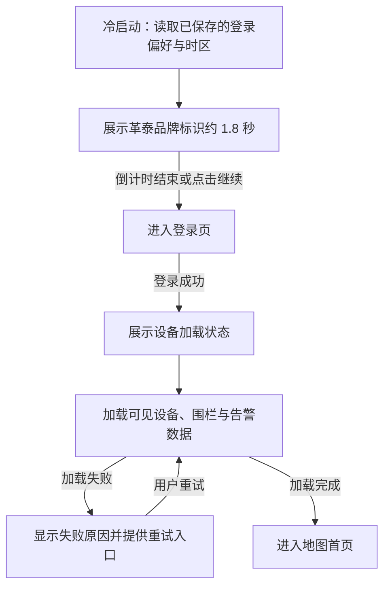
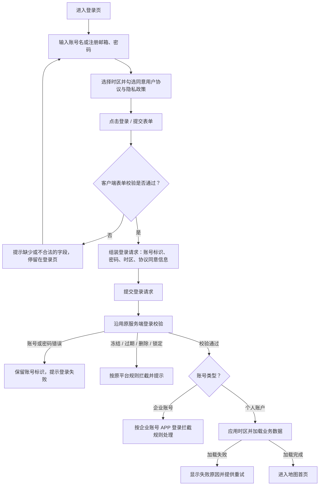
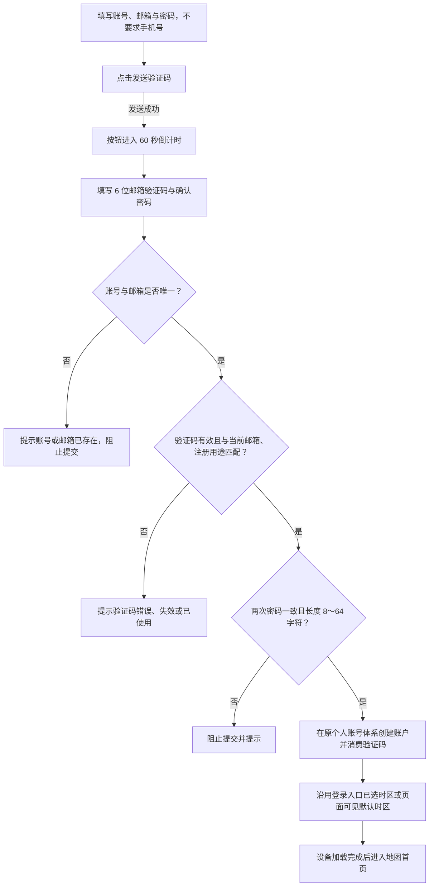
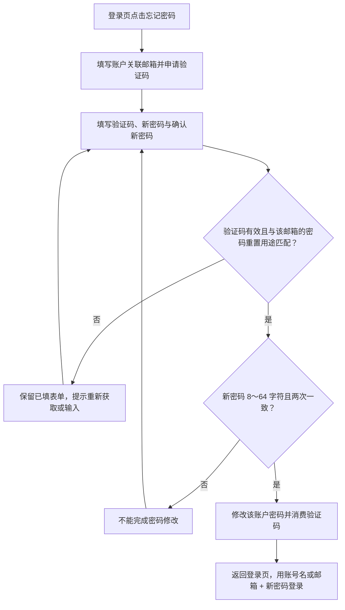

# 革泰 APP 登录与注册逻辑点梳理.plan

<aside>
🎯

**文档用途**：梳理革泰 APP「登录与注册」相关功能的测试逻辑点，为后续测试用例设计、边界值拆分、场景组合与存量平台回归提供依据。

**文档定位**：本文不是产品 PRD，也不是最终交互稿；重点是将登录、注册、邮箱、密码、账号状态、会话隔离等规则沉淀为可复用的测试规则、流程触发点和场景矩阵。

**适用范围**：覆盖 US-001 启动并加载账户数据、US-002 登录、US-003 邮箱验证注册、US-004 邮箱重置密码、US-005 登录后修改密码、US-031 退出并清理会话；设备、围栏、告警、指令等业务仅作关联引用，不展开。

**整理原则**：核心规则只在「规则主定义」中完整说明；流程章节只说明触发点与预期流转；矩阵章节用于支撑用例拆分；待确认问题按测试影响分组，避免同一论点反复展开。

**存量对齐**：登录相关的账号状态（冻结 / 过期 / 删除 / 锁定）、父子级联与强制下线，均以原监控平台既有逻辑为基准；与 APP 新规则冲突的部分列入待确认问题。

</aside>

---

## 1. 账号类型与测试范围

| 账号类型 | 能否在 APP 自助注册 | APP 登录入口 | 权限与数据范围 |
| --- | --- | --- | --- |
| 个人账户 | ✅ 可注册（只产生个人身份） | ✅ 统一登录入口 | 沿用原服务端个人业务账号的既有权限与设备范围 |
| 企业主账号（一级） | ❌ 不可注册 | ❌ 不可在 APP 登录 | 按原企业账号管理与设备授权范围操作；用户管理、子账号管理、设备分配仅在监控平台 Web 与管理后台 |
| 企业普通子账号（二级 / 三级） | ❌ 不可注册 | ❌ 不可在 APP 登录 | 由上级按原流程分配设备；本身无用户管理入口；不因可见设备获得主动扫码绑定权 |

<aside>
⚠️

**测试建模说明**：企业账号不可在 APP 登录、注册只创建个人账户、权限不由 APP 决定，这三条规则在后续流程、矩阵和回归点中会被多次引用。后续章节若再次出现，均作为测试场景触发条件，不再重复定义业务含义。

</aside>

---

## 2. 核心规则主定义

### 2.1 登录标识规则

- 同一输入框同时支持账号名与注册邮箱登录。
- 账号名与邮箱分别执行唯一性校验。
- 同一账户使用账号名或邮箱登录后，进入的业务数据范围必须完全一致。
- 邮箱匹配需去除首尾空格，并按统一大小写口径匹配。
- 登录失败时保留已输入的账号名或邮箱，不展示任何其他账户数据。

### 2.2 账号类型规则

- APP 仅面向个人账户。
- APP 注册入口只创建个人账户，不提供个人 / 企业身份选择。
- 注册请求即使夹带企业角色或企业创建意图，也不得据此创建企业或提升权限。
- 企业一级、二级、三级账号在 APP 端均不可登录。
- 企业账号相关的用户管理、子账号管理、设备资源分配、离线报警设置等能力只存在于监控平台 Web 与管理后台。
- APP 不重新定义权限等级，界面隐藏按钮不能代替服务端授权。

### 2.3 企业账号 APP 登录拦截规则

| 项 | 规则 |
| --- | --- |
| 判定主体 | 服务端按账号层级判定，APP 不以本地输入、缓存或界面选择判断身份 |
| 拦截时机 | 登录提交后返回企业身份拦截结果，不下发业务 Token，不进入设备加载状态 |
| 页面表现 | 停留在登录页，已输入的账号或邮箱保留，不跳转任何业务页 |
| 提示文案 | 明确告知该账号为企业账号并需前往监控平台登录，同时给出平台地址；最终措辞见第 10 节 |
| 覆盖范围 | 企业一级、二级、三级账号全部拦截且提示一致；个人账户不受影响 |
| 业务副作用 | 拦截后不创建会话、不请求设备 / 围栏 / 告警接口、不写入登录偏好与记住密码 |
- 企业账号无论状态如何（正常 / 冻结 / 过期 / 锁定）在 APP 端都不可登录。
- 企业账号同时命中「企业身份」与「冻结 / 过期 / 删除 / 锁定」时，返回哪一条提示需产品定稿；但无论返回哪条，都不得放行进入 APP 业务页。
- 若企业账号在早期版本已登录并留有本地会话，升级后应判定为不可用：清理会话、退回登录页并给出同一提示，不能依靠旧 Token 继续访问业务接口。

### 2.4 账号状态规则（沿用原平台）

**适用说明**：本矩阵是原平台账号状态的完整口径，用于服务端与平台 Web 回归；在 APP 端主要作用于个人账户。企业账号 APP 登录统一按 2.3 拦截。

| 账号状态 | 触发来源 | 登录行为 | 数据与业务影响 | 恢复方式 |
| --- | --- | --- | --- | --- |
| 正常 | — | 正常登录并按权限加载数据 | 无 | — |
| 冻结（本账号） | 管理后台 / 上级账号操作 | 登录被拦截，提示账号已冻结 | 只限制登录，不限制数据流；设备位置、报警照常入库，离线消息保留 | 启用后可登录，并能看到冻结期间产生的消息与报警 |
| 冻结（父级级联） | 父级企业账号被冻结 | 父级及其关联子账号全部登录被拦截 | 同上 | 父级启用后所有子账号一并恢复 |
| 冻结（子级） | 单个子账号被冻结 | 仅该子账号登录被拦截 | 父级与同级子账号不受影响 | 单独启用该子账号 |
| 过期（服务到期） | 管理端写入到期时间 | 按原到期处理结果拦截或降级 | APP 与平台均只读，无自助续费入口 | 管理端续期 |
| 过期（父级） | 父级企业账号到期 | 父级到期不影响子账号有效期，子账号仍可登录 | 与冻结的级联规则相反 | 管理端续期 |
| 删除 / 注销 | 一级与个人账号仅管理后台可删；二 / 三级由上级在平台用户管理删除 | 登录直接失败，账号不存在 | 已授权或分享出去的设备关系按原规则保留或级联解绑 | 不可恢复，需重新创建 |
| 锁定 | 密码连续输错 3 次 | 锁定 30 分钟，期间即使密码正确也不能登录 | 不影响其他账号与数据流 | 等待锁定结束或由后台重置密码 |

<aside>
⚠️

**状态规则重点**

1. 冻结级联、过期不级联：冻结父级时其子账号一并被拦；父级过期时子账号有效期不受影响。
2. 冻结只拦登录、不断数据：冻结期间设备继续上报，解冻后登录可看到这段时间的位置、报警与离线消息。
3. 状态提示可区分：冻结、过期、删除、锁定不应全部归并为「账号或密码错误」；最终提示口径见第 10 节。
</aside>

### 2.5 邮箱规则

#### 2.5.1 邮箱字段定义

- 登录邮箱与通知邮箱使用同一个账户邮箱字段，不建立独立通知邮箱字段。
- 该邮箱字段同时用于邮箱登录、通知邮件接收、密码找回、注册邮箱验证和邮箱换绑验证。
- 账号名、密码、权限、设备、分组、告警、轨迹及历史业务数据不因邮箱变更而改变。
- 邮箱应按统一规则进行格式校验、首尾空格处理、大小写归一化和唯一性判断。

#### 2.5.2 邮箱格式与类别校验

| 层级 | 校验内容 | 建议口径 | 失败表现 |
| --- | --- | --- | --- |
| L1 语法格式 | 有且仅有一个 @；本地部分 ≤ 64 字符、整体 ≤ 254 字符；域名含点且末段为字母 | 宽松校验，只拦明显非法，不用固定后缀白名单 | 前端即时提示格式错误，不发送验证码 |
| L2 归一化与唯一性 | 去首尾空格、统一大小写后再做唯一性比对与登录匹配 | 存储与比对使用同一份归一化结果 | 提示邮箱已注册 |
| L3 域名类别策略 | 是否拦截一次性 / 临时邮箱域名、是否校验域名 MX 记录、是否设置黑白名单 | 产品决策项；默认放行则需接受垃圾注册风险 | 提示该邮箱不支持注册 |
| L4 投递可达性 | 验证码邮件能否在有效期内送达目标邮箱 | 不属于表单校验，属服务端与邮件服务配置 | 用户收不到码，最终表现为「验证码错误 / 失效」 |

#### 2.5.3 全球用户邮箱测试关注点

1. 老式正则误杀海外域名：只认 2～4 位后缀的正则会拦掉 .online、.travel、.company 等长后缀，.com.au、.co.uk、.co.jp 等多级域名，以及企业自建域名。
2. Gmail 别名等价：a.b@gmail.com、ab+test@gmail.com 与 ab@gmail.com 在收件侧可能是同一个信箱，是否按同一邮箱处理需产品定稿。
3. 大小写口径前后不一致：注册按原样存、登录按小写匹配，会出现「注册成功却登录失败」。
4. 国际化域名（IDN）：非 ASCII 邮箱地址是否允许、是否转 Punycode 存储要有结论。
5. 5 分钟有效期 vs 跨境投递延迟：境外收件方常有分钟级延迟或直接落入垃圾箱，验证码可能到达时已过期。
6. 发件身份与语种：原平台验证码邮件的发送方署名与模板均为中文，海外用户既难读，也更容易被判为垃圾邮件；发件域名 SPF / DKIM / DMARC 需确认。

### 2.6 验证码规则

| 规则项 | 取值 / 逻辑 |
| --- | --- |
| 格式 | 6 位数字 |
| 绑定维度 | 目标邮箱 + 用途（注册 / 密码重置 / 邮箱换绑）+ 请求编号 |
| 发送间隔 | 同一目标、同一用途 60 秒 |
| 缓存有效期 | 5 分钟 |
| 消费规则 | 校验成功即消费，不可重复完成同一验证用途 |
| 重发规则 | 以最新有效验证码为准，旧码不再作为该用途有效凭据 |
| 更换邮箱 | 原邮箱验证码不能用于新邮箱注册、找回或换绑 |
| 展示口径 | 有效期与发送倒计时分别计算，「可以重发」不等于「验证码刚刚过期」 |

### 2.7 密码规则

- 注册、找回密码、登录后修改密码均要求密码长度 8～64 字符。
- 确认密码必须与密码完全一致，仅用于输入校验，不作为账户资料写入。
- 登录后修改密码需校验当前密码正确。
- 邮箱重置密码需校验邮箱与目标账号有效关联，并校验密码重置用途验证码。
- 平台后台创建账号密码规则与 APP 注册密码规则存在差异，见第 10 节。

### 2.8 时区规则

- 登录页所选时区与「我的 → 时区设置」是同一份配置。
- 登录页选定后，个人中心需回显。
- 个人中心修改后，全 APP 同步生效，下次登录可带出。
- 时区决定今日 / 昨日与日历查询的日期边界。
- 直接进入注册流程时，默认时区来源待确认。

### 2.9 会话与数据隔离规则

- 登录态失效时返回登录页，重新认证后才能访问业务数据。
- 主动退出登录后结束当前会话并返回登录页。
- 退出登录、强制下线、账号切换时，均需清理当前账户的设备、围栏、告警等会话展示数据。
- 不允许继续停留在地图首页展示上一账户的缓存数据。
- 不允许后台静默续期继续访问业务接口。
- 强制下线后再次登录，需按账号状态矩阵重新校验。

---

## 3. 业务流程测试逻辑

### 3.1 启动与加载账户数据（US-001）

| 测试点 | 期望 |
| --- | --- |
| 品牌页停留 | 约 1.8 秒 |
| 提前进入 | 支持点击继续进入登录页 |
| 启动读取 | 读取已保存的登录偏好与时区 |
| 登录成功后 | 必须先进入设备加载状态 |
| 加载失败 | 显示失败原因并提供重试入口 |
| 重试行为 | 回到同一加载流程，不退回登录页 |

### 3.2 登录流程（US-002）

| 字段 / 控件 | 测试规则 | 补充说明 |
| --- | --- | --- |
| 账号或邮箱 | 同一输入框同时支持注册账号名与注册邮箱 | 两种方式登录后的业务数据范围必须一致 |
| 邮箱匹配口径 | 去除首尾空格，按统一大小写口径匹配 | 首尾带空格、大小写混写的邮箱应能正常登录 |
| 密码 | 输入账户密码 | 错误时保留已输入的登录标识 |
| 时区 | 必须有效选中；展示 GMT/UTC 偏移与地区名称，可预选上次值 | 未有效选中时不能提交登录 |
| 用户协议与隐私政策 | 支持打开阅读，同意后方可提交 | 未同意时不能提交登录 |
| 记住密码 | 选中后，下次进入登录页带出凭证 | 带出凭证仍需用户点击登录，不得自动跳过登录动作 |
| 创建账号 | 进入注册流程 | 注册只创建个人账户 |
| 忘记密码 | 进入邮箱验证码找回密码流程 | 走 US-004 流程 |

### 3.3 注册流程（US-003）

| 字段 | 测试规则 | 边界与异常 |
| --- | --- | --- |
| 账号 | 必填，3～40 字符，仅字母、数字、下划线，唯一 | 2 字符、41 字符、含中文 / 空格 / 连字符 / @ 等均不可注册；注册成功后固定只读 |
| 邮箱 | 必填，格式正确，唯一，且必须完成验证 | 重复邮箱给出对应提示；修改邮箱后必须重新验证新邮箱；长后缀、多级域名与企业自建域名不得被误拦 |
| 邮箱验证码 | 必填，6 位数字，与当前邮箱及「注册」用途匹配 | 错误、失效、已使用均不能完成注册 |
| 密码 | 必填，8～64 字符 | 7 字符、65 字符不可注册 |
| 确认密码 | 与密码一致，仅用于输入校验 | 两次不一致时阻止提交；不作为账户资料写入 |
| 手机号 | 不要求填写 | 不得为满足旧逻辑自动伪造手机号 |
| 联系人 / 电话 / 地址 | 不在注册表单 | 注册后在「我的 → 资料」补充 |

### 3.4 忘记密码流程（US-004）

| 测试维度 | 期望 |
| --- | --- |
| 前置条件 | 未登录，知道账户关联邮箱 |
| 身份校验 | 校验邮箱与目标账号的有效关联 + 密码重置用途验证码 |
| 密码规则 | 新密码 8～64 字符，确认新密码一致 |
| 验证码失败 | 保留表单，提示重新获取或输入 |
| 成功后 | 验证码完成使用，返回登录页，用新密码登录 |
| 重发验证码 | 同样使用 60 秒倒计时 |

### 3.5 登录后修改密码流程（US-005）

| 测试维度 | 期望 |
| --- | --- |
| 入口 | 我的 → 修改密码 |
| 前置条件 | 已登录 |
| 输入项 | 当前密码、新密码、确认新密码 |
| 身份校验 | 校验当前密码正确 |
| 密码规则 | 新密码 8～64 字符，确认新密码一致 |
| 成功后 | 提示「密码已修改」 |
| 失败处理 | 保留表单并显示失败原因 |

### 3.6 退出登录流程（US-031）

| 测试维度 | 期望 |
| --- | --- |
| 触发动作 | 点击退出登录 |
| 会话处理 | 结束当前会话并返回登录页 |
| 数据清理 | 清理当前账户的设备、围栏、告警等会话展示数据 |
| 登录页展示 | 按保存偏好显示登录标识与时区 |
| 再次访问业务数据 | 必须重新认证 |
| 切换账户 | 上一账户的展示数据不得混入新账户页面 |

### 3.7 已登录期间账号状态变更

| 触发条件 | APP 侧预期 |
| --- | --- |
| 账号被删除 / 冻结 / 过期 | 立即强制下线并跳转登录页 |
| Token 失效 | 退回登录页，重新认证 |
| WebSocket 长连接 | 立即切断，停止实时业务 |
| 当前账户展示数据 | 按 US-031 清理 |
| 再次登录 | 按账号状态矩阵重新拦截或放行 |
| 前台 / 后台 / 息屏 | 回到前台后表现一致，均退回登录页 |
| 弱网 | 不停留在加载页 |
| 在途请求返回 | 不写入本地展示数据 |

---

## 4. 场景组合矩阵

### 4.1 账号类型 × APP 登录

| 账号类型 | 密码正确 | 密码错误 | 账号冻结 | 账号过期 | 预期 |
| --- | --- | --- | --- | --- | --- |
| 个人账户 | 可登录并加载业务数据 | 提示登录失败并保留账号标识 | 按冻结规则拦截 | 按过期规则拦截或只读 | 以账号状态矩阵为准 |
| 企业一级账号 | 拦截并提示前往监控平台 | 返回顺序待确认 | 仍不可进入 APP | 仍不可进入 APP | 不下发 APP 业务 Token |
| 企业二级账号 | 拦截并提示前往监控平台 | 返回顺序待确认 | 仍不可进入 APP | 仍不可进入 APP | 不下发 APP 业务 Token |
| 企业三级账号 | 拦截并提示前往监控平台 | 返回顺序待确认 | 仍不可进入 APP | 仍不可进入 APP | 不下发 APP 业务 Token |

### 4.2 账号状态 × 登录 / 会话

| 状态 | 未登录时登录 | 已登录期间变化 | 数据流 | 恢复后 |
| --- | --- | --- | --- | --- |
| 正常 | 正常登录 | — | 正常 | — |
| 冻结 | 登录拦截 | 强制下线 | 设备位置、报警继续入库 | 解冻后可登录并查看冻结期间数据 |
| 过期 | 按原规则拦截或降级 | 强制下线或降级，最终口径待确认 | 按原服务到期规则 | 续期后恢复 |
| 删除 / 注销 | 登录失败，账号不存在 | 强制下线 | 按原规则保留或级联解绑 | 不可恢复，需重新创建 |
| 锁定 | 30 分钟内不可登录 | 已登录期间是否触发待确认 | 不影响其他账号与数据流 | 等待锁定结束或后台重置 |

### 4.3 邮箱状态 × 注册 / 登录 / 找回

| 邮箱状态 | 注册 | 登录 | 找回密码 | 预期 |
| --- | --- | --- | --- | --- |
| 未注册邮箱 | 可进入验证码验证与注册 | 不可作为既有账号登录 | 不可找回既有账号 | 按对应流程提示 |
| 已注册邮箱 | 提示邮箱已注册 | 可作为登录标识 | 可用于找回密码 | 需匹配归属账号 |
| 首尾带空格 | 去空格后校验 | 去空格后匹配 | 去空格后匹配 | 不因首尾空格失败 |
| 大小写混写 | 按统一大小写口径校验 | 按统一大小写口径匹配 | 按统一大小写口径匹配 | 注册、登录、找回口径一致 |
| 被其他账号占用 | 注册不通过 | 解析到当前归属账号 | 解析到当前归属账号 | 换绑归属转移见 4.5 |
| 被后台清空 | 可按释放口径重新使用，待确认 | 原账号不能再用该邮箱登录 | 原账号不能再用该邮箱找回 | 账号本身不删除 |

### 4.4 验证码状态 × 业务用途

| 验证码状态 | 注册 | 找回密码 | 邮箱换绑 | 预期 |
| --- | --- | --- | --- | --- |
| 正确且有效 | 可继续完成注册 | 可继续重置密码 | 可继续完成换绑 | 成功后立即消费 |
| 错误 | 阻止提交 | 阻止提交 | 阻止提交 | 保留表单并提示 |
| 过期 | 阻止提交 | 阻止提交 | 阻止提交 | 提示失效，需重新获取 |
| 已使用 | 不可重复使用 | 不可重复使用 | 不可重复使用 | 提示无效 |
| 旧验证码 | 重发后旧码失效 | 重发后旧码失效 | 重发后旧码失效 | 以最新验证码为准 |
| 跨邮箱 | 不可使用 | 不可使用 | 不可使用 | 绑定目标邮箱 |
| 跨用途 | 不可使用 | 不可使用 | 不可使用 | 注册码不能用于找回或换绑 |

### 4.5 邮箱换绑与归属转移

#### 4.5.1 变更入口与验证

| 变更入口 | 操作 | 验证要求 |
| --- | --- | --- |
| 监控平台 | 修改 / 换绑邮箱 | 必须完成验证码校验 |
| 管理后台 | 清空邮箱 | 不需要邮箱验证码，但必须校验后台操作权限并记录审计 |
| APP | 无换绑邮箱入口 | 不支持此操作 |

#### 4.5.2 目标邮箱已被占用时的归属转移

假设变更前：

| 账号 | 邮箱 |
| --- | --- |
| A | a@example.com |
| B | b@example.com |

A 完成平台换绑并将邮箱设置为 B 当前使用的 b@example.com 后：

| 账号 | 邮箱 |
| --- | --- |
| A | b@example.com |
| B | 空 |

测试规则如下：

- 目标邮箱从 B 账号转移至 A 账号。
- B 账号的邮箱字段自动清空，但 B 账号本身不删除、不注销。
- b@example.com 后续只能解析到 A，不得继续解析到 B。
- B 不能继续使用 b@example.com 登录、找回密码或接收普通通知。
- B 的设备、权限、分组、告警、轨迹和历史业务数据保持不变。
- A 原有邮箱 a@example.com 是否自动释放，按第 10 节待确认规则处理。

#### 4.5.3 归属转移后的测试关注点

| 测试维度 | 关注点 |
| --- | --- |
| 验证码 | B 原邮箱对应的注册、找回密码、邮箱换绑验证码应全部失效 |
| 会话 | A 当前会话、A 其他端会话、B 已登录会话是否失效需确认 |
| 缓存 | A 原邮箱缓存、B 旧邮箱和密码缓存如何更新或清除需确认 |
| 并发 | 清空 B 邮箱和写入 A 邮箱必须作为同一原子操作完成 |
| 唯一性 | 同一邮箱在任意时刻最多只能归属于一个账号 |
| 在途请求 | 邮箱变更期间已经发出但尚未返回的请求，不得覆盖最新邮箱状态 |
| 审计 | 应记录操作账号、原持有账号、目标邮箱、变更时间、操作来源和变更结果 |

---

## 5. 边界值与等价类速查

| 校验对象 | 有效值 | 无效值 |
| --- | --- | --- |
| 账号长度 | 3 字符、40 字符 | 空、2 字符、41 字符 |
| 账号字符集 | 字母、数字、下划线及其组合 | 中文、空格、连字符、@、emoji 等 |
| 账号可编辑性 | 注册时可自定义 | 注册后任何资料编辑入口都不能改账号名 |
| 密码长度 | 8 字符、64 字符 | 空、7 字符、65 字符 |
| 确认密码 | 与密码完全一致 | 大小写不同、多一个空格 |
| 验证码 | 5 分钟内首次使用的 6 位数字 | 5 位 / 7 位、含字母、超过 5 分钟、已消费、跨邮箱、跨用途 |
| 重发倒计时 | 60 秒结束后重新发送 | 60 秒内重复点击发送 |
| 邮箱格式 | 首尾带空格、大小写混写、长后缀（.online / .travel）、多级域名（.com.au / .co.uk）、企业自建域名 | 无 @、多个 @、@ 前后为空、域名不含点、本地部分超 64 字符、整体超 254 字符 |
| 邮箱唯一性 | 未注册过的新邮箱 | 已注册邮箱；Gmail 点号与 plus 别名是否算重复按第 10 节结论 |
| 登录提交条件 | 时区已有效选中 + 已同意协议 | 未选时区、未同意协议 |
| 记住密码 | 带出凭证后手动点击登录 | 带出凭证后自动完成登录 |
| 密码错误次数 | 第 1～2 次错误：提示错误并保留输入 | 第 3 次错误：锁定 30 分钟，期间正确密码也不能登录 |
| 账号状态 | 正常账号、解冻后账号、已续期账号 | 冻结中、已过期、已删除、锁定期内 |
| 账号类型（APP 登录） | 个人账户 | 企业一级 / 二级 / 三级账号（一律拦截并提示前往监控平台） |

---

## 6. 存量平台兼容回归点

| 规则域 | 前置条件 | 测试动作 | 期望结果 | 用例优先级 |
| --- | --- | --- | --- | --- |
| 原服务端权限 | 原服务端账号已冻结 | 在 APP 登录或访问受限业务 | 沿用原冻结与授权结果，不能绕过限制 | P0 |
| 企业子账号权限 | 企业普通子账号只可见指定设备 | 在 APP 请求绑定或访问范围外设备 | 执行原服务端校验，不因新客户端扩权 | P0 |
| 跨端访问一致性 | 同一有效账号从原端与 APP 访问同一对象 | 执行相同已授权操作 | 身份与对象权限口径一致，展示差异不改变授权 | P1 |
| 注册提权防护 | 注册请求夹带企业角色或企业创建意图 | 提交 APP 注册 | 只创建个人账户，不能借此创建企业或提权 | P0 |
| 企业体系隔离 | 管理后台已存在企业账号 | 使用 APP 注册入口 | 不改变原企业账号、层级及权限 | P0 |
| 无手机号兼容 | 个人账号以邮箱注册且无手机号 | 登录、找回密码、绑定设备全链路 | 全流程可用，不新增必填手机号，不合成假手机号 | P0 |
| 新设备类型回归 | 新增牛马定位器类型上线后 | 回归原登录与后台企业管理流程 | 原登录访问、绑定、围栏、告警、指令规则不变 | P1 |
| 父级冻结 | 父级企业账号被冻结 | 用父级与其子账号分别登录 | 父级与关联子账号均登录失败；父级启用后一并恢复 | P0 |
| 子级冻结 | 仅某个子账号被冻结 | 用该子账号、父级、同级子账号分别登录 | 仅该子账号被拦截，父级与同级不受影响 | P0 |
| 父级过期 | 父级企业账号服务到期 | 用其子账号登录 | 子账号使用有效期不受父级到期影响，仍可登录 | P0 |
| 服务到期 | 账号已过期 | 在 APP 登录并查看服务信息 | 与平台口径一致地拦截或降级为只读，不出现自助续费入口 | P0 |
| 强制下线 | 账号在 APP 已登录时被冻结 / 过期 / 删除 | 继续操作 APP 业务 | 立即强制下线跳登录页，长连接切断，会话数据清理 | P0 |
| 冻结期间数据 | 账号冻结期间设备持续上报 | 解冻后登录 APP | 冻结期间的位置、报警与离线消息可正常查看，未因冻结丢数 | P1 |
| 删除账号 | 二 / 三级子账号被上级在平台删除 | 在 APP 登录 | 登录失败，且提示与「密码错误」「已冻结」可区分 | P0 |
| 密码锁定 | 密码在 APP 连续输错 3 次 | 立即改用正确密码登录 APP，并尝试登录平台 Web | 锁定 30 分钟内均不可登录；跨端计数口径按第 10 节结论执行 | P0 |
| 企业账号拦截 | 企业一 / 二 / 三账号状态正常 | 在 APP 输入正确账号与密码登录 | 登录被拦截，提示前往监控平台；不下发 Token、不进入设备加载 | P0 |
| 企业异常状态 | 企业账号已被冻结或已过期 | 在 APP 登录 | 同样不可进入业务页；提示口径按第 10 节结论 | P0 |
| 旧版本企业会话 | 企业账号在旧版本 APP 已登录 | 升级到当前版本后打开 APP | 判定会话不可用，清理会话退回登录页并给出同一提示 | P0 |
| 企业账号注册入口 | 企业账号在 APP 使用「创建账号」 | 完成注册流程 | 仅创建个人账户，不改变原企业账号、层级与权限 | P0 |
| 个人账号登录 | 个人账户状态正常 | 在 APP 登录 | 正常登录，不受企业账号拦截规则影响 | P0 |

---

## 7. 用例设计索引

| 规则 / 场景 | 主定义章节 | 需覆盖的用例类型 |
| --- | --- | --- |
| 账号名 / 邮箱登录等价 | 2.1 | 账号名登录、邮箱登录、大小写、首尾空格、数据范围一致 |
| 企业账号 APP 拦截 | 2.3 | 正确密码、错误密码、冻结、过期、旧会话、缓存清理 |
| 冻结 / 过期 / 删除 / 锁定 | 2.4 / 3.7 | 登录拦截、强制下线、解冻恢复、数据不断流、父子级联 |
| 注册只创建个人账户 | 2.2 / 3.3 | 正常注册、夹带企业参数、无手机号注册、注册后权限 |
| 邮箱格式与唯一性 | 2.5 / 5 | 长后缀、多级域名、大小写、重复邮箱、Gmail 别名 |
| 验证码机制 | 2.6 / 4.4 | 正常、错误、过期、重发、跨用途、跨邮箱、已消费 |
| 密码规则 | 2.7 / 3.4 / 3.5 | 注册密码、找回密码、修改密码、长度边界、强度冲突 |
| 时区规则 | 2.8 | 登录页选择、个人中心回显、个人中心修改、下次登录带出 |
| 会话隔离 | 2.9 / 3.6 / 3.7 | 退出登录、切换账号、强制下线、弱网在途请求 |
| 邮箱归属转移 | 4.5 | A/B 邮箱转移、旧码失效、会话处理、缓存清理、并发一致性 |
| 存量平台兼容 | 6 | 权限不扩张、原平台账号状态、原平台多端规则、设备数据不断流 |

---

## 8. 待确认问题

### 8.1 邮箱与验证码

| 待确认项 | 影响范围 | 不确认的测试风险 |
| --- | --- | --- |
| 邮箱统一大小写口径：全部转小写存储，还是不区分大小写匹配 | 注册、登录、找回密码、换绑 | 同一邮箱可能注册成功但登录失败，或唯一性判断不一致 |
| Gmail 点号与 plus 别名是否视为同一邮箱 | 注册唯一性、找回密码、通知接收 | 同一用户可用别名反复注册，或账号归属判断不一致 |
| 是否拦截一次性 / 临时邮箱域名，是否校验 MX，是否维护黑白名单 | 注册、验证码发送 | 垃圾注册风险与误拦风险无法定级 |
| 非 ASCII 邮箱地址是否允许注册，存储是否转 Punycode | 海外用户注册 | 前端放行但服务端发不出信 |
| 境外邮箱验证码 5 分钟有效期是否足够 | 注册、找回密码 | 跨境投递延迟导致大量验证码过期 |
| 发件域名 SPF / DKIM / DMARC 是否已配置；发件署名与模板是否需要英文或本地化版本 | 验证码到达率、垃圾箱命中率 | 海外用户收不到或看不懂验证码邮件 |
| 原平台邮箱通知每日上限是否影响注册 / 找回密码验证码 | 验证码发送频控 | 验证码可能被通知额度限制误伤 |
| 注册与找回密码是否共用同一套验证码发送频控 | 注册、找回密码 | 同一邮箱不同用途的倒计时与错误提示无法设计 |
| 邮件发送失败、超时后是否仍进入 60 秒倒计时 | 验证码异常场景 | 用户无法判断是否需要等待或重试 |

### 8.2 企业账号拦截

| 待确认项 | 影响范围 | 不确认的测试风险 |
| --- | --- | --- |
| 企业账号拦截提示的最终文案，是否包含平台地址，能否点击跳转或复制 | APP 登录页 | 文案、跳转、复制类用例无法定稿 |
| 企业账号 + 错误密码的返回顺序：先报密码错误还是直接提示前往监控平台 | 登录安全、账号枚举风险 | 账号类型可能被枚举，或锁定计数无法设计 |
| 企业账号被拦截是否计入锁定次数 | 密码错误锁定 | 连续尝试是否触发 30 分钟锁定无法验证 |
| 企业账号同时处于冻结 / 过期状态时，APP 返回企业身份提示还是账号状态提示 | 登录提示优先级 | 状态提示用例预期不明确 |
| 旧版本已登录的企业账号升级后是否强制清理会话，是否需要单独说明提示 | 升级兼容、会话清理 | 旧 Token 是否继续可用无法判定 |
| 企业账号是否能走 APP 忘记密码流程 | 忘记密码入口 | 企业账号找回密码提示和后续动作无法定稿 |

### 8.3 密码与锁定

| 待确认项 | 影响范围 | 不确认的测试风险 |
| --- | --- | --- |
| APP 登录接口是否仍保留图形验证码或其他风控校验 | 登录失败策略 | 跳过图形验证码后风控覆盖不明确 |
| 密码错误 3 次锁定 30 分钟是否仍按原逻辑生效 | 登录锁定 | 锁定类用例无法定稿 |
| 密码错误锁定计数是否跨端共享 | APP、平台 Web | APP 错 3 次是否同时锁定 Web 登录无法验证 |
| 锁定期内是否显示剩余时间 | 登录提示 | 锁定提示文案和倒计时用例不明确 |
| 平台后台创建账号密码规则与 APP 注册密码规则冲突时按哪套规则 | 注册、后台创建、修改密码 | 密码长度和复杂度边界无法统一 |
| 修改密码 / 重置密码成功后，其他端已登录会话是否失效 | 多端会话 | 密码变更后的强制重新登录用例无法设计 |

### 8.4 时区、会话与多端

| 待确认项 | 影响范围 | 不确认的测试风险 |
| --- | --- | --- |
| 直接进入注册流程时默认时区来源：设备系统时区还是固定默认值 | 注册、登录后时间展示 | 默认值用例无法定稿 |
| 「记住密码」是否存储密码本身、保留时长、退出登录后是否仍保留 | 登录偏好、安全 | 缓存、安全和退出后回显用例无法判断 |
| 原平台限制 1 网页 + 1 PC、多浏览器互踢；APP 是否占用其中一个名额 | 多端登录 | APP 与 Web 同时在线是否互踢无法验证 |
| 登录态失效、强制下线、弱网在途请求的前后端责任边界 | 会话清理 | 是否清理缓存、是否切断长连接的判断依据不足 |

### 8.5 账号状态与提示文案

| 待确认项 | 影响范围 | 不确认的测试风险 |
| --- | --- | --- |
| 冻结 / 过期 / 删除 / 锁定四种状态在 APP 登录页是否逐一区分 | 登录失败提示 | 断言口径不一致 |
| 服务到期在 APP 是拦截登录还是允许只读进入 | 到期账号 | 到期场景期望不明确 |
| 账号被删除后，其账号名与邮箱是否释放、能否被再次注册 | 注册唯一性、删除恢复 | 删除后复用类用例无法设计 |
| 个人账号能否登录监控平台 Web 的书面结论 | APP 与 Web 职责边界 | 一期测试计划与排期表中已登记冲突，需产品与开发定稿 |

### 8.6 邮箱归属转移

| 待确认项 | 影响范围 | 不确认的测试风险 |
| --- | --- | --- |
| A 将邮箱换绑为 B 当前使用的邮箱后，A 是否获得该邮箱、B 是否自动清空邮箱 | 邮箱唯一性、换绑 | A/B 归属转移主流程无法定稿 |
| A 原有邮箱是否自动释放，是否允许其他账号立即再次绑定 | 邮箱复用 | 原邮箱释放边界无法验证 |
| B 邮箱被清空后是否仍可使用账号名登录、是否可以重新绑定邮箱 | 登录、找回密码、资料维护 | B 账号恢复能力不明确 |
| A 当前会话是否保留；A 的其他端会话是否失效；B 的 APP / Web 会话是否立即失效 | 会话安全 | 换绑后的强制下线与数据清理用例无法设计 |
| A、B 两个账号的邮箱与记住密码缓存是否更新或清除 | 本地缓存 | 多设备旧邮箱缓存是否失效无法验证 |
| B 原邮箱的注册、找回密码、换绑验证码是否立即作废 | 验证码安全 | 旧验证码可能继续操作错误账号 |
| 邮箱变更期间的在途请求如何避免覆盖最新邮箱状态 | 并发一致性 | 并发覆盖和脏写用例无法设计 |
| B 邮箱被清空后安全通知通过什么渠道发送 | 安全通知 | 用户不可达时通知链路不明确 |
| 邮箱归属转移是否适用于个人账号、企业一级账号、企业子账号，以及冻结、过期、删除账号 | 账号类型覆盖 | 适用范围不明确，组合用例无法收敛 |

---

## 9. 参考文档

- 《革泰 APP 产品需求文档》US-001 启动并加载账户数据 / US-002 使用账号名或邮箱登录 / US-003 验证邮箱并注册个人账户 / US-004 通过邮箱重置密码 / US-005 登录后修改密码 / US-031 退出并清理当前会话 / US-032 在原平台接入牛马定位器类型
- 《革泰 APP 产品需求文档》第「用户与角色」章：用户分类、用户权限与数据范围
- 《革泰 APP 产品需求文档》第「非功能性需求」章：存量兼容与回归要求、异常场景处理
- [北斗位置监控平台使用说明书20260421](https://app.notion.com/p/20260421-bf25667c6d3a839e8d7a01bf1a85076e?pvs=21)：第二章 登录（密码错误 3 次锁定 30 分钟）、3.2 用户管理（三级账号体系、创建账号密码规则、密码重置规则、子账号管理）
- [天地卫通相关模块核心逻辑梳理 ](https://app.notion.com/p/9225667c6d3a834a969701209a2dff27?pvs=21)：第 8 节 企业账号冻结／过期逻辑（父级冻结级联、父级过期不级联）、第 9 节 手机号绑定规则
- [星地多网融合指挥调度SaaS平台1期.监控平台重构测试方案](https://app.notion.com/p/SaaS-1-bb25667c6d3a8200a4f9011a7df881fe?pvs=21)：1.4.2 登录与认证 / 用户与账号体系，3.5 账号权限与设备归属（父子账号冻结）
- [语音调度模块-测试大纲](https://app.notion.com/p/28d5667c6d3a83b28a7d81f44d5b5fe4?pvs=21)、[视频拉取场景-测试大纲](https://app.notion.com/p/9fc5667c6d3a832faa7501a7c094f53e?pvs=21)：账号被删 / 被冻 / 被过期后强制下线跳登录页、WebSocket 切断、多端登录互踢
- [电子围栏-测试大纲](https://app.notion.com/p/b2d5667c6d3a833cbb96013ec4b09287?pvs=21)、[设备绑定 / 设备标签 / 归属 — 核心逻辑与隐藏风险](https://app.notion.com/p/9625667c6d3a82949c9f81896c6b3fd8?pvs=21)：冻结只限制登录不限制数据流、离线消息解冻可见
- [通知模板与样例对应表](https://app.notion.com/p/5545667c6d3a8216a9f081dd26373d37?pvs=21)、[消息通知-测试大纲](https://app.notion.com/p/e735667c6d3a8289a8ae0170f7f1a7a7?pvs=21)：验证码邮件模板与发件署名（中文主体）、邮箱通知单账号每日上限与按北京时间自然日重置
- [革泰海外平台一期测试计划（设备业务与公共能力）](https://app.notion.com/p/9d8aa4ed74cb4812b6c0df6a46c24e26?pvs=21)、[革泰海外平台1期-测试A测试排期表](https://app.notion.com/p/1-A-3d75667c6d3a805a8128d5bc40596dad?pvs=21)：个人账号登录监控平台的需求冲突、服务到期只读且无自助续费入口

---

**文档版本**：v1.6（按测试逻辑文档定位重构：主规则定义、流程触发点、场景矩阵、边界值、兼容回归点、待确认问题分层）

**最后更新**：2026-09-11

**维护人**：测试团队