# 革泰 APP 设备管理逻辑点梳理.plan

<aside>
🎯

**文档用途**：梳理革泰 APP「设备管理（牛马定位器）」相关功能的核心逻辑规则、流程与边界，作为后续测试用例编写的依据。

**适用范围**：覆盖 US-015 设备筛选与快捷操作、US-016 绑定牛马定位器、US-017 设备分组、US-018 设备资料与物联网卡、US-019 设备入口告警、US-032 新类型接入原平台；并关联 US-006/US-007 的设备状态计数、US-020～US-022 指令入口。告警处理、围栏判定、轨迹回放本身仅作关联引用，不展开。

**存量对齐**：设备绑定 / 解绑级联、设备备注单存储、分配方式（同步分组和设备 / 仅分配设备）、账号层级与配额等，全部以原监控平台既有逻辑为基准，汇总在第 3.5～3.7 与第 9 节；与 APP 新规则冲突或本期未定的部分列入第 11 节。当前设备关系仅保留绑定与分配，不再使用「我的 / 用户 / 好友」设备标签。

</aside>

---

## 1. 账号类型、绑定权与设备可见范围

### 1.1 先区分三个概念

| 概念 | 定义 | 是否产生直接绑定关系 |
| --- | --- | --- |
| 绑定 | 账号通过有权入口与设备建立直接归属关系。当前只有个人账号和企业一级账号具备绑定资格。 | ✅ 是 |
| 分配 | 企业父级把自己已可见的设备授权给直属下级。分配必须按「企业一级 → 企业二级 → 企业三级」逐级进行。 | ❌ 否 |
| 可见 | 账号通过直接绑定或父级分配获得设备访问范围。可见设备不等于当前账号直接绑定的设备。 | — |

当前版本的设备关系只包含**绑定、分配**，不存在分享关系，也不使用「我的 / 用户 / 好友」设备标签划分可见范围。

### 1.2 账号与绑定入口矩阵

管理后台的运营 / 管理员是**代绑操作主体**，不是个人、企业一级、企业二级、企业三级之外的第五类设备业务账号；后台代绑不会把设备绑定到操作员自己名下。

| 业务账号类型 | APP | 监控平台 Web | 管理后台能否将其作为代绑目标 | 绑定关系落点 |
| --- | --- | --- | --- | --- |
| 个人账号 | ✅ 可登录并扫码或输入设备编号绑定 | ✅ 保留原平台个人绑定入口 | ❌ 不支持后台代绑给个人账号 | 当前登录的个人账号；APP 与 Web 使用同一绑定关系 |
| 企业一级账号 | ✅ 可登录并扫码或输入设备编号绑定 | ✅ 可自行绑定 | ✅ 运营 / 管理员可代绑 | 当前登录的企业一级账号或后台指定的企业一级账号；APP 与 Web 使用同一绑定关系 |
| 企业二级账号 | ✅ 可登录；❌ 无直接绑定入口 | ❌ 无绑定入口 | ❌ 不可作为代绑目标 | 不产生直接绑定关系，只能接收直属一级通过 Web 分配的设备 |
| 企业三级账号 | ✅ 可登录；❌ 无直接绑定入口 | ❌ 无绑定入口 | ❌ 不可作为代绑目标 | 不产生直接绑定关系，只能接收直属二级通过 Web 分配的设备 |

绑定入口只说明账号是否有资格发起或接收直接绑定；设备入库、设备类型、同类占用、账号配额等绑定前置条件见第 3.2 节。

### 1.3 账号与设备可见来源矩阵

| 业务账号类型 | 设备可见范围来源 | 可见端 | 能否继续向下分配 |
| --- | --- | --- | --- |
| 个人账号 | 当前个人账号通过 APP 或监控平台 Web 直接绑定的设备 | APP、监控平台 Web；任一端绑定成功后两端同步可见 | ❌ 无企业下级，不参与企业分配链 |
| 企业一级账号 | 自己在 APP / 监控平台 Web 绑定的设备 + 管理后台代其绑定的设备 | APP、监控平台 Web；任一端绑定或后台代绑成功后两端同步可见 | ✅ 仅在监控平台 Web 将已可见设备分配给一个或多个直属二级账号 |
| 企业二级账号 | 直属企业一级账号通过监控平台 Web 分配的设备 | APP、监控平台 Web；父级分配成功后两端同步可见 | ✅ 仅在监控平台 Web 将自己已获分配的设备继续分配给一个或多个直属三级账号 |
| 企业三级账号 | 直属企业二级账号通过监控平台 Web 分配的设备；对应二级必须先拥有该设备可见关系 | APP、监控平台 Web；父级分配成功后两端同步可见 | ❌ 当前层级无继续下分对象 |

企业分配是**向下授权，不是归属转移**：设备分配给下级后，上游父级继续可见。同一设备可以同时分配给多个二级账号，也可以在每个二级分支下同时分配给多个直属三级账号；各账号列表均按设备唯一标识去重。企业一级向二级、企业二级向三级的设备分配只在监控平台 Web 完成，APP 只读取分配结果，不提供向下分配入口。

### 1.4 企业可见范围关系

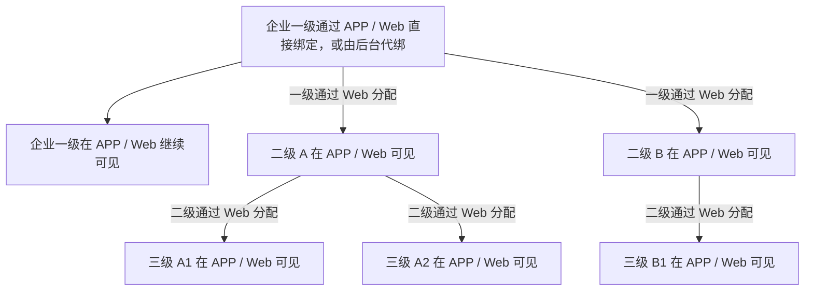

- 二级设备可见范围必须是其直属一级可见范围的子集。
- 三级设备可见范围必须是其直属二级可见范围的子集。
- 一级不能绕过二级直接给三级建立可见关系。
- 「同步分组和设备」与「仅分配设备」都会使目标下级获得设备可见性；两者差异只在分组处理，不改变分配关系的性质。

<aside>
⚠️

**本节关键结论**

1. **只有两类账号产生直接绑定**：个人账号与企业一级账号均可通过 APP / 监控平台 Web 自行绑定；企业一级账号还可由管理后台代绑。企业二级、三级账号永远不产生直接绑定关系。
2. **直接绑定采用双槽位唯一性**：同一设备最多同时绑定 1 个个人账号和 1 个企业一级账号；个人账号之间互斥，企业一级账号之间互斥，个人与企业一级可双绑共存。
3. **分配不占直接绑定名额**：二级、三级获得的是分配关系，不占用「1 个个人 + 1 个企业一级」的直接绑定槽位。
4. **分配严格逐级且父级保留可见**：一级在监控平台 Web 分配给二级、二级在监控平台 Web 分配给三级；向下分配后父级仍可见，同级多个账号可同时获得同一设备。APP 只读取分配结果，不提供向下分配入口。
5. **登录、可见与绑定权相互独立**：个人、企业一级、企业二级、企业三级均可登录 APP；二级、三级虽然能登录并使用授权范围内的设备业务，但不能自行绑定设备，服务端必须按账号身份和设备关系重新鉴权。
6. **个人与企业链路相互独立**：两类账号看到的是同一台物理设备及同一份位置、电量、运行状态事实；账户内分组关系分别管理。
7. **APP 按账号层级加载设备范围**：个人账号读取自己的直接绑定设备；企业一级读取自己绑定或后台代绑的设备；企业二级读取直属一级分配的设备；企业三级读取直属二级分配的设备。各端使用同一账号关系数据，不建立 APP 独立授权副本。
</aside>

---

## 2. 设备列表与状态筛选（US-015）

<aside>
⚠️

**状态统计计数规则（本期口径）**

1. **设备列表只展示三种设备状态**：在线、离线、告警。前端不展示「未连接」独立状态，不设置「未连接」筛选项，也不单独统计未连接数量。
2. **离线 = 离线 + 未连接**：设备已有通信记录但当前不可通信时，展示为离线；设备初始化绑定后，尚无任何数据上报，也没有完成过有效下发 / 通信建立时，属于未连接，但在设备列表中统一按离线展示、筛选和计数。
3. **在线 / 离线为基础状态**：同一统计范围内，在线数 + 离线数 = 设备总数；未连接设备计入离线数，不额外增加第三类基础状态。
4. **告警为设备状态优先展示**：告警表示设备触发了告警。设备处于告警状态时，列表筛选可命中「告警」，卡片右侧状态优先展示「告警」。
5. **告警仍需保留在线 / 离线底层差异**：告警设备当前在线时，图标展示为告警 + 在线角标；告警设备当前离线或未连接时，图标展示为告警 + 离线角标，第三行展示「离线，无法下发指令」。
6. **设备按唯一标识去重统计**：同一设备通过多条关系可见时，设备总数、在线数、离线数、告警数均按设备唯一标识去重，不重复计数。
</aside>

| 统计项 | 计数范围 | 说明 |
| --- | --- | --- |
| 全部 | 当前账户可见的全部设备去重数 | 包含在线、离线、未连接与告警设备；未连接不单独拆分 |
| 在线 | 当前明确在线的设备去重数 | 若设备触发告警，同时可进入告警筛选；卡片右侧优先展示告警 |
| 离线 | 当前离线设备 + 初始化未连接设备的去重数 | 未连接来源于设备初始化绑定后尚无数据上报与有效通信；统一归入离线 |
| 告警 | 当前触发告警的设备去重数 | 告警是设备状态优先展示项；不在本节展开告警来源 |

**状态组合与计数归属**

| 设备实际情况 | 计入全部 | 计入在线 | 计入离线 | 计入告警 |
| --- | --- | --- | --- | --- |
| 在线，无告警 | ✅ | ✅ | ❌ | ❌ |
| 离线，无告警 | ✅ | ❌ | ✅ | ❌ |
| 初始化未连接，无告警 | ✅ | ❌ | ✅ | ❌ |
| 告警 + 在线 | ✅ | ✅ | ❌ | ✅ |
| 告警 + 离线 | ✅ | ❌ | ✅ | ✅ |

### 2.2 筛选、搜索与卡片字段

| 项 | 规则 | 边界与易错点 |
| --- | --- | --- |
| 状态筛选 | 全部 / 在线 / 离线 / 告警，各带数量 | 一次只选一项；默认离线设备必须能在「全部」「离线」中找到 |
| 搜索字段 | 设备编号、名称、备注、序列号 | 不区分大小写、忽略首尾空格；**备注展示与备注检索必须是同一份业务备注** |
| 分组筛选 | 虚拟「全部分组」/ 具体业务分组；支持按分组名称搜索 | 本期不存在「未分组」筛选项；分组数量不随当前状态与关键词减少，状态数量不随关键词减少 |
| 条件组合 | 状态 × 分组 × 关键词取**交集** | 改一项不清空其他项；清空关键词恢复当前状态 + 分组范围 |
| 卡片字段 | 第一行展示备注优先、设备编号兜底；第二行展示电池图标 + 电量；第三行展示定位频率 / 离线提示；保留左侧图标状态与右上角更多入口 | 卡片内不再展示分组名称、字段分隔符和右侧在线 / 离线 / 告警文字标签；电量缺失或越界显示 Unknown，不按 0% 处理 |
| 列表操作 | 刷新、整群轨迹、指令下发 | 指令下发进入多选模式 |
| 行内菜单 | 设备详情、实时追踪、历史轨迹、设备告警记录、物联网卡查询、发送指令、解除当前账户绑定 | 跳转一律携带**设备唯一标识**，不以名称作为身份；本轮菜单口径及验证范围见 2.4 |

### 2.3 设备卡片展示元素

<aside>
🎯

**本节口径**：以下规则来自「革泰 APP-设备卡片展示元素.plan」确认稿。若与旧卡片大纲冲突，以本节为准。本节只约束设备卡片展示元素、显示条件、布局边界与卡片本体点击行为；不改变绑定流程、批量指令、全选规则、列表排序或刷新机制。

</aside>

**设备卡片结构**

| 区域 | 展示内容 | 规则 |
| --- | --- | --- |
| 左侧设备图标 | 系统固定设备图标 | 按设备类型固定展示，添加设备及后续编辑时均不可修改图标形态。 |
| 图标主体与角标 | 状态颜色 + 右上角角标 | 在线绿色，离线 / 未连接灰色，存在未处理告警时红色；告警态通过角标保留在线 / 离线差异。 |
| 第一行 | 备注优先，设备编号兜底 | 有备注显示备注；备注为空时显示设备编号；不额外附加编号，不新增备注唯一性限制。 |
| 第二行 | 电池图标 + 电量 | 有效电量展示百分比，缺失或越界显示 Unknown。有效电量 < 20%，图标颜色为红色；有效电量 ≥ 20%，图标为绿色 |
| 第三行 | 定位频率及模式 / 离线提示 | 在线显示定位频率及模式；离线 / 未连接统一显示「离线，无法下发指令」。 |
| 更多入口 | 右上角竖向三点 | 所有设备状态均保留；独立于卡片本体点击。 |
| 卡片本体点击 | 进入对应设备详情 | 在线、离线、未连接、告警状态均保持相同跳转目标；跳转必须携带设备唯一标识。 |

**第三行定位频率与离线提示**

| 情况 | 展示文案 |
| --- | --- |
| 在线，1 分钟 | 1分钟定位（耗电模式） |
| 在线，10 分钟 | 10分钟定位（默认模式） |
| 在线，60 分钟 | 1小时定位（省电模式） |
| 在线，自定义 N 分钟 | 自定义模式（N分钟） |
| 在线，无可确认频率 | 表达频率未知，确切占位文案待确认 |
| 离线 / 未连接，无论是否有已知频率 | 离线，无法下发指令 |
- 自定义 N 沿用 1～1440 整数分钟；N 为 1、10、60 时，优先展示对应预设文案。
- 定位频率与 APP 刷新间隔不是同一概念，本节不改变页面刷新设置。
- 详情编辑弹层选中的目标值、平台受理结果均不自动等于设备已生效值；只有匹配成功 ACK 后才更新确认值。
- 没有可确认值时表达未知，不自行填入 10 分钟默认值。
- 截图中的灰色离线卡片继续显示定位频率不采纳；离线 / 未连接统一替换为离线提示。
- 截图中的「1 分钟 = 省电模式」不采纳；沿用 1 分钟耗电、10 分钟默认、60 分钟省电。

**布局与展示边界**

| 区域 | 约束 |
| --- | --- |
| 第一行备注 / 兜底编号 | 单行尾部省略，不挤压更多入口 |
| 电量数值 | 优先完整展示，不截断；缺失时不再隐藏，改为 Unknown |
| 第三行 | 单行过长尾部省略；多语言及大字体下关键语义如何保护需补充设计 |
| 设备图标与角标 | 固定尺寸和位置，不被文本挤压或遮挡 |
| 更多入口 | 各状态保留，不被长文本遮挡 |

**待确认项与建议**

以下内容未确认为正式需求，不能直接作为开发实现或测试通过标准。

| 待确认项 | 具体缺口 | 建议，尚未采纳 |
| --- | --- | --- |
| 历史电量提示 | 最终文案、位置、换行、行高及溢出处理 | 可在第二行采用「电池图标 65% · 上次上报」，第三行保留离线提示 |
| Unknown 图标 | 是否保留图标、颜色和填充形态 | 中性灰色未知态，避免像满电或低电 |
| 告警角标 | 在线 / 离线的具体颜色、形状和辨识方式 | 提供两种明确视觉稿，并补充非颜色提示与读屏语义 |
| 标题空值 | 纯空白备注归一化；备注和编号均缺失的异常兜底 | 纯空白按空处理，异常数据避免无标题卡片 |
| 电量精度与异常 | 小数、舍入、非法类型、历史有效值与新异常值优先级 | 避免显示 20% 却因原始小数值而标红，异常数据不当正常百分比 |
| 在线频率未知 | 确切占位文案 | 可使用「定位频率未知」 |
| 离线整卡样式 | 是否弱化及弱化范围 | 建议只改变状态图标，不把整卡呈现为不可点击 |
| 长文案与多语言 | 历史电量提示及模式名称在窄屏、大字体下的显示 | 优先保留电量及关键状态含义，验证长备注、翻译膨胀和读屏 |
| 在线恢复后的历史电量 | 已恢复通信但尚无新电量时历史标记如何处理 | 不仅凭通信恢复就把旧电量表达为实时数据 |

列表默认排序、状态刷新机制等原有待确认事项未在本轮解决，也不纳入本节新增设计。

### 2.4 单设备扩展项「更多操作」

<aside>
🎯

**本节范围**：入口为设备卡片右上角竖向三点。本轮重点展开「物联网卡查询」；「设备告警记录」只验证跳转后查询对象与数据范围；设备资料、实时追踪、历史轨迹和发送指令只记录跳转关系，由对应模块测试人员继续验证页面内容；解绑操作不在本轮讨论，完整规则见第 3.3 节。

</aside>

#### 2.4.1 统一入口与菜单跳转

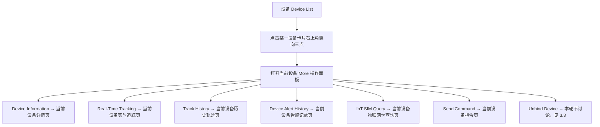

| 菜单项 | 跳转目标 / 动作 | 本节验证范围 |
| --- | --- | --- |
| Device Information | 当前设备详情与资料页 | 只验证跳转目标和设备标识正确；字段、编辑与保存见第 5 节。 |
| Real-Time Tracking | 当前设备实时追踪页 | 只验证页面聚焦被点击设备；位置、刷新和状态展示由地图模块覆盖。 |
| Track History | 当前设备历史轨迹页 | 只验证查询对象为被点击设备；时间范围、轨迹点和回放由轨迹模块覆盖。 |
| Device Alert History | 当前设备告警记录页 | 验证只查询该设备产生的历史告警记录，不验证告警卡片内容和处理交互。 |
| IoT SIM Query | 当前设备物联网卡查询页 | 本节详细验证入口、接口字段映射、有值 / 空值 / 失败展示及刷新。 |
| Send Command | 当前设备指令页 | 只验证跳转目标和设备标识正确；可用指令、在线校验和发送闭环由指令模块覆盖。 |
| Unbind Device | 解绑确认与后续动作 | 本轮不讨论；不得用本节简化或替代第 3.3 节既有解绑规则。 |

**统一身份与导航规则**

1. 所有跳转均携带**被点击设备的唯一标识**，不得使用名称、备注或列表位置作为查询身份。
2. 两台设备名称 / 备注相同，或设备名称在跳转前后发生变化时，目标页仍必须指向原设备唯一标识。
3. 设备卡片本体点击与右上角更多入口相互独立；点击更多入口不得先触发设备详情跳转。
4. 菜单项被点击后关闭当前操作面板并执行一次目标跳转，不得同时打开两个页面或串到上一次操作的设备。
5. 从目标页返回设备列表时，沿用设备模块已有导航状态规则；不得因查看单设备扩展项改变设备归属、分组、在线状态或告警处理状态。

#### 2.4.2 Device Alert History：仅验证设备级跳转与数据范围

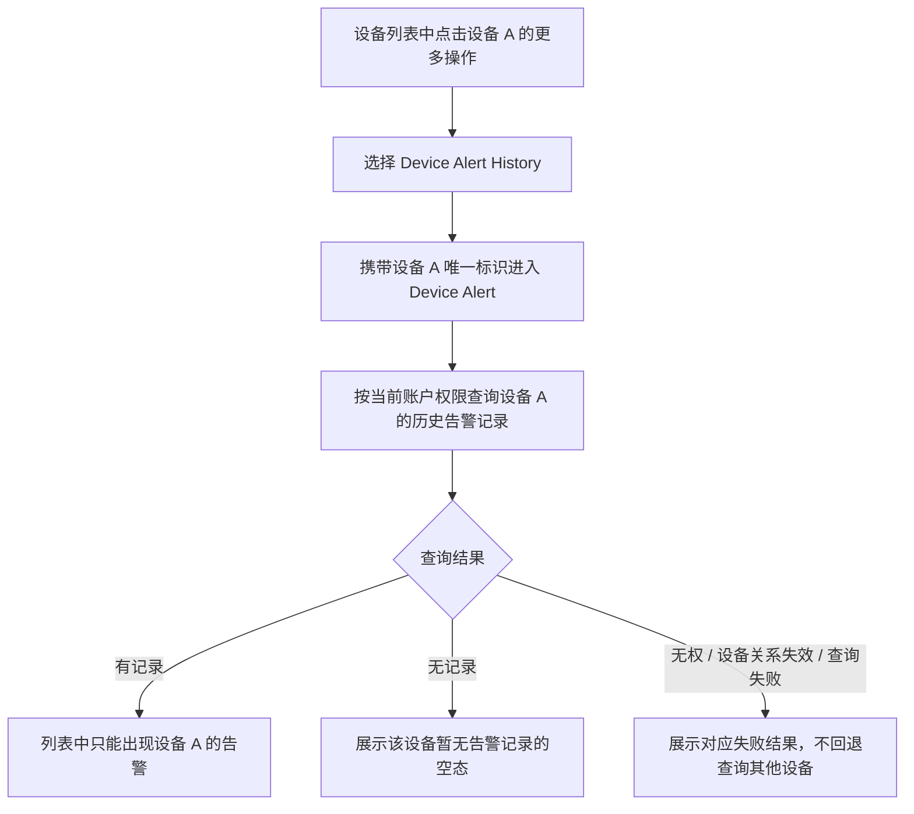

| 验证点 | 预期 |
| --- | --- |
| 查询对象 | 由更多菜单所属设备的唯一标识确定，不按名称匹配，也不复用上一次查看设备。 |
| 数据来源 | 与告警中心使用同源告警记录，但本入口固定增加当前设备范围。 |
| 数据范围 | 只返回当前账户有权查看的该设备历史告警；不得混入其他设备记录，也不得扩大账户权限。 |
| 同名设备 | 设备 A、B 名称相同时，从 A 进入只能查询 A；从 B 进入只能查询 B。 |
| 无数据 | 返回该设备专属空态，不得显示其他设备告警填充页面。 |
| 关系失效 | 跳转或查询时设备已解绑、失权或不可见，按权限结果拦截，不得继续展示越权数据。 |
| 页面内容边界 | 告警类型、描述、时间、状态、处理备注、单条 / 批量处理等页面内容由告警模块成员验证，本节不重复定义通过标准。 |

#### 2.4.3 IoT SIM Query：入口与查询链路

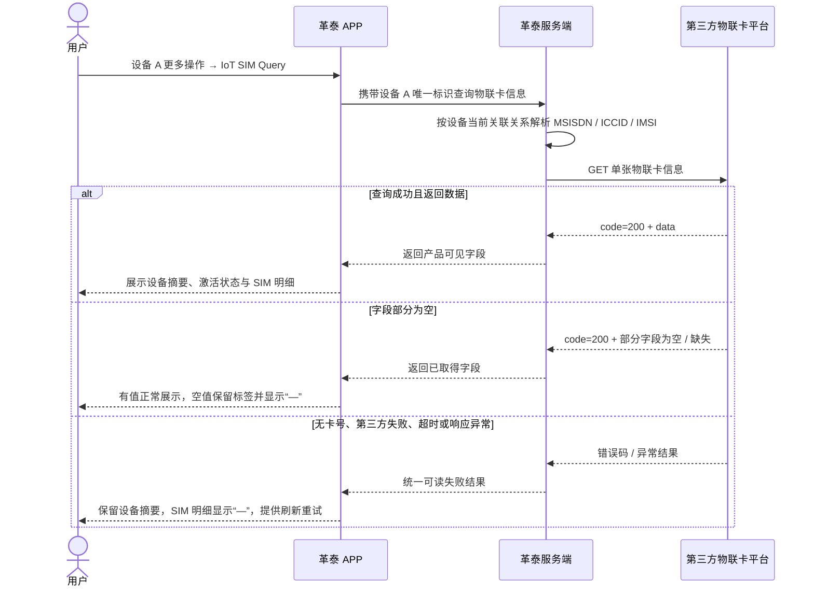

**入口规则**

1. 入口：**设备列表 → 当前设备卡片右上角更多 → IoT SIM Query**。
2. 首次进入页面自动查询当前设备的物联网卡信息；右上角刷新按钮重新查询同一设备。
3. APP 只提交设备唯一标识，不由前端选择、输入或拼接第三方卡号。
4. 服务端按该设备当前物联卡关联关系选择可用的 `MSISDN`、`ICCID` 或 `IMSI` 调用第三方单卡接口；第三方接口地址中的卡号为必填路径参数。
5. 页面返回的 ICCID 必须属于当前设备的关联卡；设备切换、重复名称或连续查看不同设备时不得串卡。
6. 设备未关联可用卡号时仍进入查询链路，最终按统一查询失败态展示；不要求固定映射为第三方 `502`。

#### 2.4.4 IoT SIM Query：页面元素与字段映射

| 页面区域 / 文案 | 数据来源 | 有值展示 | 空值 / 缺失展示 |
| --- | --- | --- | --- |
| 页面标题 | 固定文案 | `IoT SIM Query` | 固定展示，不受接口影响 |
| 返回按钮 | 固定控件 | 返回设备列表 | 固定展示 |
| 刷新按钮 | 固定控件 | 重新查询当前设备 | 固定展示；查询失败后仍可重试 |
| 设备名称 / 显示名 | 当前设备资料 | 展示当前设备可识别名称 | `—` |
| 设备类型 / 型号 | 当前设备资料 | 展示牛马定位器实际类型或型号 | `—` |
| 激活标识 | 第三方 `active` | `true` → Active；`false` → Inactive | `—`；`false` 是有效值，不得当作空值 |
| ICCID | 第三方 `iccid` | 原值展示，归属必须与当前设备一致 | `—` |
| 运营商 | 第三方 `carrier` 或服务端码表映射 | 展示运营商名称 | `—` |
| 卡状态 | 第三方 `account_status` | 按第三方卡状态码表翻译展示 | `—` |
| 流量套餐 | 第三方 `data_plan` 及真实套餐周期配置 | 按接口值进行等价单位换算；只有取得真实周期时才附加 `/month`、`/year` 等周期 | `—` |
| 已用流量 | 第三方约定的当月 / 当前周期已用字段 | 按接口值进行等价单位换算并展示对应统计周期 | `—`；数值 0 是有效值，展示 0，不得显示“—” |
| 剩余流量 | 第三方 `data_balance` | 按接口值进行等价单位换算 | `—`；共享累计卡按接口说明可能为空，不得伪造为 0 |
| 有效期 | 第三方 `expiry_date` | 展示计费结束日期；结束日期当天仍有效，次日起失效 | `—` |
| 查询异常原因 | 服务端对第三方错误、超时和异常响应的可读映射 | 查询失败时展示原因，可附接口码用于排查 | 成功时不展示错误条 |

**第三方卡状态映射**

| `account_status` | 页面卡状态 |
| --- | --- |
| `00` | 正使用 |
| `10` | 测试期 |
| `02` | 停机 |
| `03` | 预销号 |
| `04` | 销号 |
| `11` | 沉默期 |
| `12` | 停机保号 |
| `15` | 库存期 |
| `99` 或未识别值 | 未知 |

- 顶部 Active / Inactive 来自 `active`，明细卡状态来自 `account_status`，两者是不同字段，不得互相替代。
- 第三方响应 `code` 是**接口状态码**：`200` 表示请求成功，`502` 表示物联卡不存在或未启用，`505` 表示访问频率限制；接口 `code` 不得展示成卡状态。
- 单卡接口限制为 160 次 / 分钟。本节只验证普通刷新行为，不据此新增倒计时或固定冷却交互。
- 第三方文档在单卡字段表中未逐项标明所有流量字段单位，但同平台相关接口明确以 MB 表达流量。页面可以在 MB / GB 间进行可读换算，必须保证换算前后数值等价；套餐周期不能仅凭 `data_plan` 推导。
- “已用流量”究竟取 `data_usage`（当月流量）还是 `cycle_data_usage`（当前周期已用流量），必须由服务端接口契约与页面文案保持一致；未确认前不得混用两个口径。

#### 2.4.5 IoT SIM Query：逻辑点与边界值

| 场景 / 边界 | 预期结果 |
| --- | --- |
| `code=200`，全部产品可见字段有值 | 页面字段与第三方返回 / 服务端映射一致，单位换算数值等价。 |
| `code=200`，单个字段为 `null`、空字符串或缺失 | 保留该字段标签，值显示 `—`；其他有值字段正常展示。 |
| `active=false` | 展示 Inactive；不得因布尔值为 false 显示 `—`。 |
| 流量值为 `0`、`0.000` | 展示 0 及对应单位；不得当作无值。 |
| ICCID 前导零、长数字或含字母 | 按字符串完整展示，不转数值、不丢位、不使用科学计数法。 |
| `account_status=00` | 展示“正使用”；不得把字符串 `00` 转为数值 0 后误判为空或未激活。 |
| `account_status=99` 或未知新码 | 展示“未知”，可保留原码用于排查；页面不得空白或崩溃。 |
| 共享累计卡总流量为空 | 对应字段显示 `—`，不得把空值写成 0；如需流量池数据由服务端另行查询，不由 APP 猜测。 |
| `expiry_date` 为当天 | 当天仍有效；不得提前一天显示失效。 |
| `expiry_date` 已过期 | 按真实日期展示；是否增加过期样式需以产品设计为准，本节不虚构。 |
| 无关联卡号仍发起查询 | 最终进入统一查询失败态：设备摘要保留，SIM 明细为 `—`，展示可读原因和刷新入口。 |
| 第三方 `502` | 展示“物联卡不存在或未启用”等可读原因；不得同时把接口码当作卡状态。 |
| 第三方 `505` | 展示访问频率受限的可读原因并允许稍后刷新；不得无限加载。 |
| 第三方超时、网络失败、非 JSON、缺少 `data` | 进入统一查询失败态；不得保留本次未确认的伪成功数据。 |
| 查询设备 A 后返回列表，再查询设备 B | 标题设备摘要、ICCID、状态和流量必须全部切换为 B；不得残留 A 数据。 |
| 查询过程中设备关系变更或失权 | 按最新权限返回失败，不得继续展示其他账户或旧关联卡的受保护数据。 |
| 连续点击刷新 | 每次行为仍针对当前设备；页面提供基础加载反馈，不新增本节未确认的冷却规则。 |

---

## 3. 设备绑定与解绑（US-016 / US-015）

### 3.1 绑定入口与主流程

**入口 × 账号类别分流（本期已确认）**

绑定入口按「入口」和「账号类别」同时判断，不能把“可以登录 APP”直接等同于“可以绑定设备”。个人、企业一级、企业二级、企业三级均可登录 APP；其中只有个人账号与企业一级账号可在 APP / 监控平台 Web 发起直接绑定。管理后台不绑定到操作员自己名下，只为企业一级账号代绑设备。所有绑定入口的共同前提是：**设备必须已入库**。设备未入库时，任何入口均不得绑定成功，并需给出对应提示。

| 入口 | 账号类别 / 操作主体 | 是否可发起绑定 | 绑定落到谁名下 | 入库前置 | 不满足时预期 |
| --- | --- | --- | --- | --- | --- |
| APP | 个人账号 | ✅ 可绑定 | 当前登录个人账号 | 必须已入库 | 未入库则拒绝绑定，并提示设备不存在 / 未入库等对应原因 |
| APP | 企业一级账号 | ✅ 可绑定 | 当前登录企业一级账号 | 必须已入库 | 未入库则拒绝绑定，并提示设备不存在 / 未入库等对应原因 |
| APP | 企业二级账号 | ❌ 不可绑定 | — | — | 可登录并查看一级分配的设备，但无绑定入口；构造请求时服务端同样拒绝 |
| APP | 企业三级账号 | ❌ 不可绑定 | — | — | 可登录并查看二级分配的设备，但无绑定入口；构造请求时服务端同样拒绝 |
| 监控平台 Web | 个人账号 | ✅ 可绑定 | 当前登录个人账号 | 必须已入库 | 未入库则拒绝绑定，并提示设备不存在 / 未入库等对应原因 |
| 监控平台 Web | 企业一级账号 | ✅ 可绑定 | 当前登录企业一级账号 | 必须已入库 | 未入库则拒绝绑定，并提示设备不存在 / 未入库等对应原因 |
| 监控平台 Web | 企业二 / 三级账号 | ❌ 不可绑定 | — | — | 无绑定入口；只能由直属父级逐级分配设备 |
| 管理后台 | 运营 / 管理员 | ✅ 可代绑 | 指定企业一级账号 | 必须已入库 | 未入库则拒绝代绑，并提示设备不存在 / 未入库等对应原因 |
| 管理后台 | 个人、企业二 / 三级账号作为目标 | ❌ 不可作为代绑目标 | — | — | 个人需自行绑定；二 / 三级只能先由一级建立企业绑定，再由直属父级逐级分配 |

<aside>
⚠️

**入口分流核心**

1. **APP 与监控平台 Web 都支持直接绑定**：个人账号与企业一级账号均可在两个客户端自行绑定设备，两端使用同一账号绑定关系。
2. **登录资格不等于绑定资格**：企业二、三级可登录 APP / Web 并使用授权范围内的设备业务，但不产生直接绑定关系；前端无入口，服务端也必须拒绝越权绑定请求。
3. **管理后台是代绑入口**：操作主体是运营 / 管理员，绑定目标仅为企业一级账号，不是绑定到管理员自己名下。
4. **设备入库是所有绑定入口的共同前提**：APP、监控平台 Web、管理后台均要求设备已入库；未入库一律不能绑定成功。
5. **企业分配仅在 Web 完成**：一级通过监控平台 Web 向直属二级分配，二级再通过 Web 向直属三级分配；APP 只读取分配结果，不提供向下分配入口。
</aside>

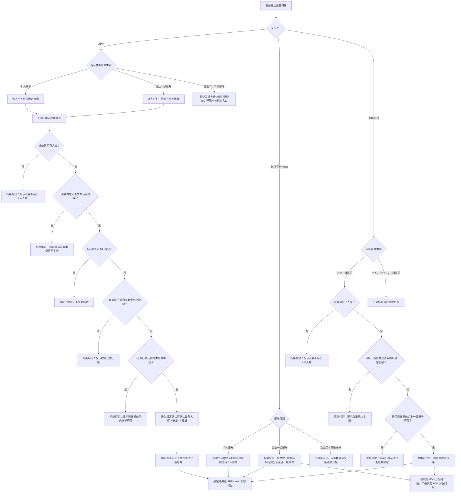

<aside>
⚠️

**分配 ≠ 绑定**：二 / 三级账号获得设备属于「被分配」，不产生新的绑定占用，也不占用「1 个个人 + 1 个一级企业」的唯一性名额。解绑、改绑、强制替换等动作只对**绑定关系**生效；对分配关系表现为随父级级联变化。用例设计时不要把「分配成功」写成「绑定成功」。

</aside>

**APP 绑定主流程（个人账号 / 企业一级账号）**

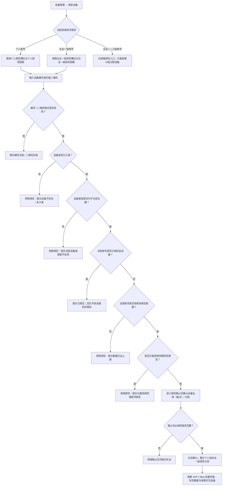

- 当前账号为个人账号时，校验个人绑定槽位是否已被其他个人账号占用；已有企业一级绑定不单独阻断。
- 当前账号为企业一级账号时，校验企业一级绑定槽位是否已被其他企业一级账号占用；已有个人绑定不单独阻断。
- 企业二、三级账号即使通过统一入口登录 APP，也不能进入上述绑定主流程；前端隐藏入口不能代替服务端权限校验。

### 3.2 绑定前置与拦截清单

| 校验项 | 是否绑定前置 | 校验规则 | 未满足时预期 |
| --- | --- | --- | --- |
| 编号 / 二维码格式 | ✅ 是 | 用户输入或扫码结果必须能解析为系统可识别的SN码 | 提示编号无效 / 二维码无效；不进入后续查库与确认页。 |
| 设备是否已入库 | ✅ 是 | 设备必须已在管理后台完成入库；APP、监控平台 Web、管理后台代绑均适用。 | 拒绝绑定，提示设备不存在 / 未入库等对应原因。 |
| 设备类型是否支持当前入口 | ✅ 是 | 革泰 APP 当前仅支持牛马定位器；已入库但类型为北斗、星联卫士等旧类型时，不允许在 APP 绑定。设备类型以后台入库维护的类型 / 型号 / 品类字段为准，不以名称或二维码文案判断。 | 拒绝绑定，提示当前设备类型暂不支持；不要误提示为设备不存在。 |
| 账号类别与入口权限 | ✅ 是 | APP 与监控平台 Web 均支持个人账号、企业一级账号直接绑定；管理后台只为指定企业一级账号代绑。企业二 / 三级可登录 APP / Web，但不直接产生绑定关系，只能由直属父级通过监控平台 Web 逐级分配；APP 不提供企业向下分配入口。 | 二 / 三级账号无绑定入口；构造绑定请求时服务端拒绝并提示只能由父级分配。APP 发起企业向下分配时无入口，不得创建分配关系。 |
| 当前账号是否已绑定 | ✅ 是 | 当前账号 / 目标账号已绑定该设备时，视为重复绑定，不新增关系、不增加数量。 | 提示已绑定 / 已添加；APP 可直接打开该设备详情页。 |
| 账号剩余可绑定设备数量 | ✅ 是 | 个人账号绑定消耗个人账号配额；企业一级账号自绑或后台代绑消耗目标一级账号配额。二 / 三级被分配是否消耗可见 / 分配数量，需按企业分配规则另行确认，不应混同为绑定配额。 | 拒绝绑定，提示数量已达上限 / 可绑定设备数量不足。 |
| 是否已被其他同级别账号绑定 | ✅ 是 | 个人绑定时，若已被其他个人账号绑定则拒绝；企业一级绑定 / 后台代绑时，若已被其他企业一级账号绑定则拒绝。个人 + 企业一级属于不同绑定层级，可双绑共存。 | 拒绝绑定，提示已被其他账号绑定 / 已被其他企业账号绑定。 |
| 确认页必填项 | ✅ 是，但属于确认页保存条件 | APP 绑定确认页只校验真实分组等绑定资料；定位频率已移出绑定流程。设备名称（备注）默认写入当前绑定账号昵称快照，可为空或后续清空。 | 停留确认页并提示补全；不建立绑定关系。 |
| 设备是否激活 | ❌ 否 | 不作为绑定成功 / 失败的前置条件。 | 不拦截绑定；绑定后可能影响位置、轨迹、在线状态或通信能力。 |
| 物联网卡状态 | ❌ 否 | 无 SIM、未激活、停机、已拆机、卡状态异常等不作为绑定前置。 | 不拦截绑定；仅在设备详情 / 物联网卡查询 / 通信异常场景中展示或提示联系管理员。 |
| 设备是否在线 / 是否已有上报 | ❌ 否 | 不要求设备当前在线，也不要求已有定位或数据上报。 | 不拦截绑定；绑定后若无上报 / 无有效通信，按未连接来源归入离线展示。 |

**建议拦截优先级**

1. 编号 / 二维码格式无效；
2. 设备未入库 / 设备不存在；
3. 设备类型不支持当前入口；
4. 当前账号类别或目标账号无绑定权限；
5. 当前账号 / 目标账号已绑定该设备；
6. 账号剩余可绑定设备数量不足；
7. 已被其他同级别账号绑定。

<aside>
💡

**设计原则**：绑定只验证「能不能建立归属关系」，不验证「设备当前能不能正常工作」。激活、物联网卡、在线、定位上报属于绑定后的使用状态，不应阻断绑定。

</aside>

### 3.3 解绑流程与级联边界

- **入口 × 操作主体 × 被操作对象矩阵**
    
    
    | 入口 | 操作主体 | 被操作对象 | 动作性质 | 影响范围 |
    | --- | --- | --- | --- | --- |
    | 📱 APP · 设备管理 | 个人账号 | 自己设备列表中的设备 | 个人绑定解绑 | 当前个人账号在 APP / Web 均不可见；清除个人侧分组与围栏设备关联；不影响企业链路。 |
    | 🖥️ Web · 设备管理 | 个人账号 | 自己设备列表中的设备 | 个人绑定解绑 | 当前个人账号在 Web / APP 均不可见；清除个人侧分组与围栏设备关联；不影响企业链路。 |
    | 🖥️ Web · 设备管理 | 企业一级账号 | 自己设备列表中的设备 | 企业一级绑定解绑 | 一级自己不可见；所有二级、三级通过该一级获得的设备关系立即失效；清除整条企业链路内分组与围栏设备关联；不影响个人绑定关系。 |
    | 🖥️ Web · 设备管理 | 企业二级账号 | 自己设备列表中的设备 | 二级分配关系移除 | 二级自己不可见；该二级下所有三级立即失效；一级仍可见；其他二级及其三级不受影响；清除该二级及其下三级分组与围栏设备关联。 |
    | 🖥️ Web · 设备管理 | 企业三级账号 | 自己设备列表中的设备 | 三级分配关系移除 | 仅该三级自己不可见；一级、二级、同二级下其他三级均不受影响；清除该三级分组与围栏设备关联。 |
    | 🖥️ Web · 用户管理 | 企业一级账号 | 指定二级账号设备 | 一级回收二级分配 | 一级仍可见；指定二级不可见；该二级下所有三级立即失效；其他二级及其三级不受影响；清除被回收链路分组与围栏设备关联。 |
    | 🖥️ Web · 用户管理 | 企业一级账号 | 指定二级对应的三级账号设备 | 一级经用户管理路径回收三级分配 | 一级仍可见；二级仍可见；指定三级不可见；同二级下其他三级不受影响；仅清除该三级分组与围栏设备关联。 |
    | 🖥️ Web · 用户管理 | 企业二级账号 | 指定三级账号设备 | 二级回收三级分配 | 一级仍可见；二级仍可见；指定三级不可见；同二级下其他三级不受影响；仅清除该三级分组与围栏设备关联。 |
    | 🛠️ 管理后台 | 后台管理员 / 运营人员 | 指定个人账号绑定关系 | 后台解绑个人 | 指定个人账号在 APP / Web 均不可见；清除该个人侧分组与围栏设备关联；不影响企业链路。 |
    | 🛠️ 管理后台 | 后台管理员 / 运营人员 | 指定企业一级账号绑定关系 | 后台解绑一级 | 一级、所有二级、所有三级企业链路立即失效；清除整条企业链路内分组与围栏设备关联；不影响个人绑定关系。 |
    | 🛠️ 管理后台 | 后台管理员 / 运营人员 | 企业一级 A → 企业一级 B | 后台改绑 | 等价于「解绑 A + 绑定 B」；A 下所有二 / 三级分配立即失效；B 下级默认不可见，需重新分配；个人绑定关系保留。 |
- **APP 分支树**
    
    ```
    📱 APP · 设备管理删除设备
    └─ 👤 个人账号删除自己的设备
       ├─ 动作性质：个人绑定解绑
       ├─ 当前个人账号在 APP 不可见
       ├─ 同一个人账号在监控平台 Web 同步不可见
       ├─ 清除个人侧分组关系
       ├─ 清除个人侧围栏设备关联
       ├─ 后续重新绑定同一设备，原围栏关联不自动恢复
       ├─ 保留历史位置 / 轨迹 / 告警 / 指令等历史数据
       └─ 不影响企业一级 / 二级 / 三级链路
    ```
    
- **Web 平台分支树**
    
    ```
    🖥️ 监控平台 Web 删除 / 移除设备
    ├─ A. 设备管理入口：当前账号删除自己的设备
    │  ├─ 👤 个人账号
    │  │  └─ 删除自己绑定设备 → 个人绑定解绑 → APP / Web 同步不可见
    │  ├─ 🏢 企业一级账号
    │  │  └─ 删除自己绑定设备 → 企业一级绑定解绑 → 一级 + 所有二级 + 所有三级失效
    │  ├─ 🏢 企业二级账号
    │  │  └─ 删除自己设备 → 二级分配关系移除 → 二级 + 该二级下所有三级失效，一级保留
    │  └─ 🏢 企业三级账号
    │     └─ 删除自己设备 → 三级分配关系移除 → 仅三级自己失效，一级 / 二级保留
    │
    └─ B. 用户管理入口：父级移除下级账号设备
       ├─ 🏢 一级账号 → 移除二级账号设备
       │  └─ 一级保留；指定二级失效；该二级下所有三级失效
       ├─ 🏢 一级账号 → 移除二级对应三级账号设备
       │  └─ 一级、二级保留；指定三级失效；同二级下其他三级不受影响
       └─ 🏢 二级账号 → 移除三级账号设备
          └─ 一级、二级保留；指定三级失效；同二级下其他三级不受影响
    ```
    
- **管理后台分支树**
    
    ```
    🛠️ 管理后台解绑 / 改绑
    ├─ 👤 后台解绑个人账号绑定关系
    │  ├─ 动作性质：个人绑定解绑
    │  ├─ 指定个人账号在 APP / Web 均不可见
    │  ├─ 清除该个人账号侧分组关系
    │  ├─ 清除该个人账号侧围栏设备关联
    │  ├─ 后续重新绑定同一设备，原围栏关联不自动恢复
    │  ├─ 保留历史数据
    │  └─ 不影响企业链路
    │
    ├─ 🏢 后台解绑企业一级绑定关系
    │  ├─ 动作性质：企业一级绑定解绑
    │  ├─ 一级账号不可见
    │  ├─ 所有二级分配关系立即失效
    │  ├─ 所有三级分配关系立即失效
    │  ├─ 清除一级 / 二级 / 三级企业链路内分组关系
    │  ├─ 清除一级 / 二级 / 三级企业链路内围栏设备关联
    │  ├─ 后续重新绑定同一设备，原二 / 三级分配不自动恢复
    │  ├─ 后续重新绑定同一设备，原围栏关联不自动恢复
    │  ├─ 保留历史数据
    │  └─ 不影响个人账号独立绑定关系
    │
    └─ 🔀 后台改绑企业一级 A → 企业一级 B
       ├─ 动作性质：解绑 A + 绑定 B
       ├─ A 的企业一级绑定关系删除
       ├─ A 下所有二 / 三级分配关系立即失效
       ├─ 清除 A 企业链路内分组与围栏设备关联
       ├─ B 获得企业一级绑定关系
       ├─ B 下二 / 三级默认不可见，必须重新分配
       ├─ 原围栏关联不迁移、不自动恢复
       ├─ 个人账号绑定关系保留
       └─ 保留历史数据
    ```
    
- **级联规则**
    
    <aside>
    💡
    
    1. **一级删除自己的设备 / 后台解绑一级**：删除企业一级绑定关系，一级、所有二级、所有三级企业链路立即失效。
    2. **二级删除自己的设备**：删除二级自己的分配关系；该二级及其下所有三级立即失效；一级、其他二级、其他二级下三级不受影响。
    3. **三级删除自己的设备**：只删除三级自己的分配关系；一级、二级、同二级下其他三级不受影响。
    4. **一级在用户管理移除二级设备**：一级仍可见；指定二级及其下所有三级立即失效。
    5. **一级在用户管理移除二级对应三级设备**：一级与二级仍可见；仅指定三级失效。
    6. **二级在用户管理移除三级设备**：一级与二级仍可见；仅指定三级失效。
    7. **后台改绑企业一级 A → B**：等价于「解绑 A + 绑定 B」；A 链路全部失效，B 获得一级绑定，B 下二 / 三级默认不可见，需重新分配。
    8. **重新绑定 / 重新分配不自动恢复**：原二 / 三级分配关系不会自动恢复，原围栏与设备绑定关系也不会自动恢复。
    </aside>
    
- **围栏与历史数据规则**
    
    <aside>
    💡
    
    1. 设备删除 / 解绑 / 分配回收时，当前失效链路内的围栏设备关联同步清除。
    2. 个人解绑：清除个人侧围栏设备关联。
    3. 一级解绑：清除一级 + 所有二级 + 所有三级企业链路内围栏设备关联。
    4. 二级删除自己设备或一级移除二级设备：清除该二级 + 该二级下所有三级围栏设备关联。
    5. 三级删除自己设备、一级移除三级设备、二级移除三级设备：仅清除该三级围栏设备关联。
    6. 后续重新绑定 / 重新分配同一设备后，原围栏与设备关系不自动恢复，必须重新关联。
    7. 历史位置、历史轨迹、历史告警、历史指令记录等已产生历史数据保留；但当前账号是否还能查看，取决于其是否仍有设备可见关系。
    </aside>
    

<aside>
❗

**易错边界**

1. **删除自己的设备不一定等于解绑设备**：个人 / 企业一级删除是绑定解绑；企业二 / 三级删除是分配关系移除。
2. **一级移除二级 ≠ 一级移除三级**：移除二级会带掉该二级下所有三级；只移除三级时，二级仍可见。
3. **二级也有父级级联能力**：二级删除自己的设备会影响其下三级；二级在用户管理移除三级设备时，仅该三级失效。
4. **级联只向下，不向上**：二级 / 三级删除或被移除，不反向影响一级绑定；三级删除不影响二级可见。
5. **个人链路与企业链路独立**：个人解绑不影响企业链路；企业解绑 / 分配回收不影响个人绑定。
6. **解绑不等于删除设备**：设备本体、库存、物联网卡与历史数据保留；只是当前归属 / 分配 / 分组 / 围栏关联与可见范围失效。
</aside>

### 3.4 重复绑定与幂等

| 场景 | 预期结果 |
| --- | --- |
| 当前账户重复绑定同一设备 | 提示「已绑定」；设备列表保持一条记录，数量不增加 |
| 设备已被个人绑定，企业按其权限申请绑定 | 不以此为唯一拒绝理由；其余准入条件仍校验 |
| 同一设备通过多条可见关系出现 | 按唯一标识去重，只计一台 |
| 解绑后重新绑定 | 分组、围栏关联、判定基线按原规则重建；下一条有效定位只建立基线，不报警 |

---

## 4. 分组管理（US-017）

### 4.1 分组管理入口与数据来源

**唯一常规入口**

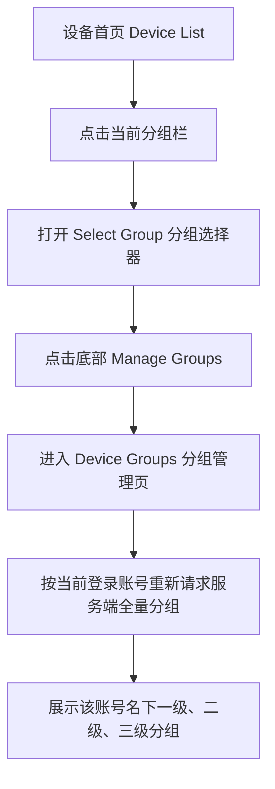

- 分组管理页的唯一常规入口是：**设备列表 → 当前分组栏 → Select Group → Manage Groups**。
- 绑定流程中当前账号无可选真实分组时，可以引导进入同一个分组管理页创建一级组；这是业务异常引导，不是第二个常规菜单入口。

**数据来源与取数边界**

| 数据对象 | 来源与查询范围 | APP 使用方式 |
| --- | --- | --- |
| 登录账号上下文 | 当前有效登录会话，由服务端根据登录身份确定账号范围 | APP 不得通过替换前端账号参数读取其他账号分组 |
| 分组主数据 | APP 与 Web 共用原有账户分组体系；查询归属当前登录账号的全量分组，不按创建端过滤 | 空组也必须返回，不能从当前设备列表反向聚合分组 |
| 分组结构字段 | 服务端返回分组唯一标识、名称、Level、直接父组、排序等结构数据 | APP 以 `groupId` 识别分组，以 `parentId` / Level 还原层级，不以名称拼接关系 |
| 分组选择器数量 | 服务端分组查询同时返回当前账号下各组的直属设备数；虚拟「全部分组」使用账户全部可见设备去重数 | APP 只展示服务端统计结果，不遍历设备列表自行计算 |
| 分组管理页 | 每次从 Manage Groups 进入时重新查询当前账号一级至三级全量分组 | 与选择器使用同源分组主数据，但管理页不渲染设备数量 |
| Web 跨端变更 | 当前账号在 Web 创建的二、三级分组，以及 Web 的重命名、删除结果 | APP 重新进入选择器 / 管理页后读取最新服务端结果，不维护独立 APP 分组副本 |

**进入、返回与刷新规则**

1. 打开 Select Group 时重新查询当前账号最新分组结构和直属设备数。
2. 从 Select Group 点击 Manage Groups 后，分组管理页再次请求当前账号全量分组，不能只复用选择器快照。
3. 从分组管理页返回时重新查询分组数据：原选中 `groupId` 仍有效则保留；已被删除或失权则回退虚拟「全部分组」，并刷新设备列表与状态数量。
4. APP 新增、重命名或删除成功后，以服务端返回结果为准刷新管理页；重新打开选择器时同步看到最新结构和数量。
5. 接口失败时不得用空数组冒充账号无分组；保留原有效页面状态并展示可重试的失败提示。

### 4.2 分组模型与对象边界

分组采用**三级父子体系**，例如「广东省（一级）→ 广州市（二级）→ 天河区（三级）」。APP 的分组选择器使用平铺列表展示，但业务数据仍保留层级、父组与唯一标识，不能把 Level 标签当作纯展示字段。

| 对象 | 性质 | 层级 | 是否进入分组管理页 | 是否可作为设备所属分组 | 操作规则 |
| --- | --- | --- | --- | --- | --- |
| 全部分组 | 设备首页的虚拟筛选项，不是真实分组 | 无 | ❌ | ❌ | 固定置于选择器首位，不可增删改 |
| 我的分组 | 账号初始化时自动创建的普通业务分组 | 一级 | ✅ | ✅ | 与其他一级组规则相同，可重命名；满足删除条件时可删除 |
| 一级分组 | 当前账号名下的真实业务分组 | Level 1 | ✅ | ✅ | APP 可新增、重命名、按空组规则删除 |
| 二级分组 | 当前账号通过 Web 创建的真实业务分组 | Level 2 | ✅ | ✅ | APP 不可新增，但可重命名、按空组规则删除 |
| 三级分组 | 当前账号通过 Web 创建的真实业务分组 | Level 3 | ✅ | ✅ | APP 不可新增，但可重命名、按空组规则删除 |

**核心约束**

1. 一个设备在当前账户下必须且只能归属**一个真实业务分组**，一级、二级、三级均可作为所属分组。
2. 系统**不存在「未分组」**视图或归属状态；绑定和设备资料保存时，所属分组不能为空。
3. 分组按账户隔离。同一物理设备在不同账户下可以归属不同分组，一方改组不影响另一方。
4. 「全部分组」仅用于设备首页查询所有设备，不能写入设备的 `groupId`，也不出现在分组管理列表。
5. 允许用户创建名称为「全部分组」的真实一级组。选择器中虚拟项固定置顶且无 Level，真实同名组按业务排序展示并标记 Level 1，以此区分。
6. 「我的分组」不是保留名称，也不是不可删除的系统组：当前存在同名组时按重名拦截；被改名或删除后，名称释放，允许再次创建。

### 4.3 APP 可管理范围

- APP 的「分组管理」页展示归属当前登录账号的**一级、二级、三级全部真实分组**；不展示虚拟「全部分组」。
- APP 只限制多级分组的**创建能力**：点击标题栏「＋」固定创建一级分组，不提供 Level 或父组选择；二、三级分组需由当前账号在 Web 平台创建。
- 当前账号名下任意一级、二级、三级分组均可在 APP 重命名、按空组规则发起删除；创建端不影响后续管理能力。
- 管理页按父子关系连续平铺并展示 Level；二、三级同时展示直接父组，一级不展示父组。
- 每个真实分组展示名称、Level、必要的父组信息、重命名和删除入口；**不展示 `Devices: N` / 设备数量**。旧 UI 稿中的设备数量行已废止，不能作为当前验收标准。

### 4.4 初始化与零分组状态

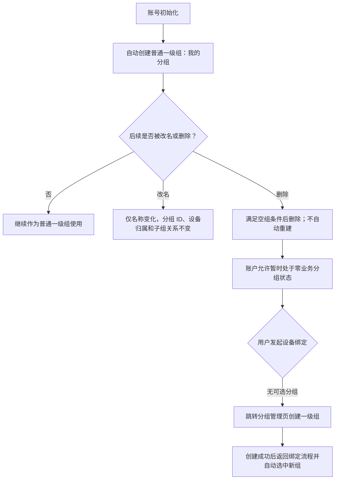

- 即使「我的分组」是账户最后一个真实分组，只要满足删除条件，也允许删除。
- 删除后账户可以只剩虚拟「全部分组」，但设备不能归属该虚拟项。
- 账户已有业务分组时，绑定确认页默认选中**排序最靠前的一级分组**，用户可改选任意一级、二级或三级分组。
- 父级在监控平台执行「仅分配设备」时，如果目标账号不存在精确名称为「我的分组」的真实分组，系统自动创建一个普通一级「我的分组」承接设备；若已存在则直接复用。

### 4.5 新增与重命名

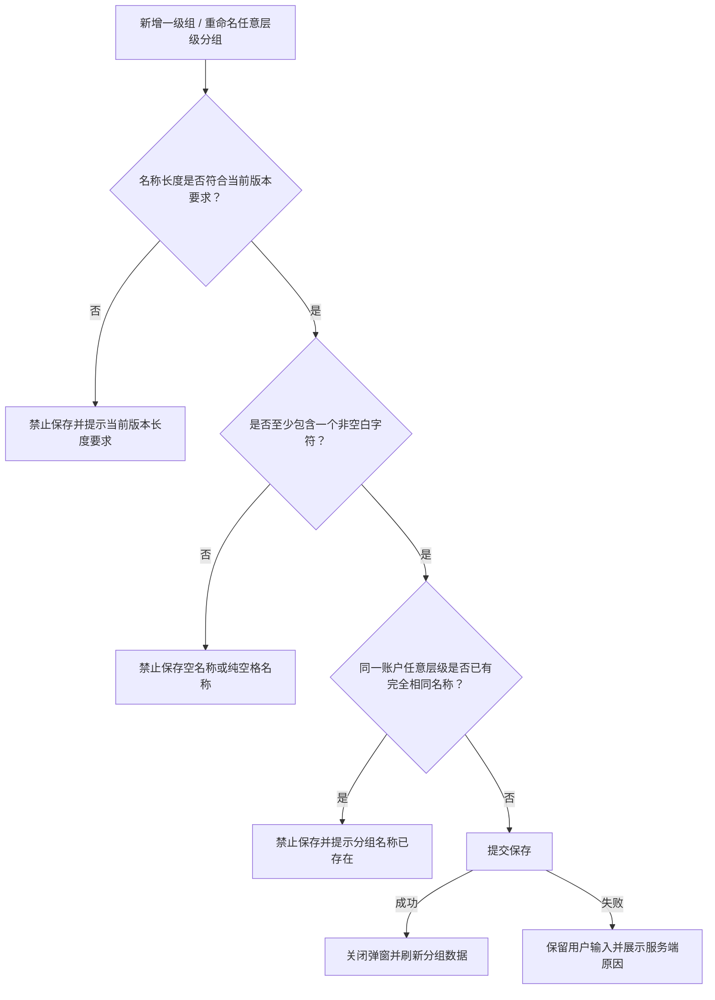

| 校验项 | 规则 |
| --- | --- |
| 长度 | **海外版 1～40 字符（本大纲主口径）**；国内版 1～15 字符。版本上限由国内版 / 海外版产品构建确定，不随用户切换界面语言动态变化。 |
| 弹窗提示 | 新增与重命名使用相同上限；海外版弹窗固定展示 `Group name (1–40 characters)`，国内版展示对应的 1～15 字符范围提示。当前 UI 稿仅确认静态范围提示，不据此扩展字符计数器、超长粘贴裁剪等未明确交互。 |
| 空值 | 空字符串、纯空格名称禁止保存 |
| 重名范围 | 同一账户下一级、二级、三级分组全局判重，不只校验同级或同父组 |
| 比较方式 | 完全精确匹配；英文大小写、内部空格及首尾空格均参与比较 |
| 首尾空格 | 只要名称包含非空白字符，首尾空格按原样保留，不自动裁剪 |
| 重命名自身 | 名称未变化时不能把当前分组自身误判为重名 |
| 重命名影响 | 任意层级分组即使存在直属设备或子组仍允许改名；只更新名称，不改变分组 ID、层级、父子关系和设备归属；其直接子组的父组名称展示同步更新 |
| 容量上限 | APP 不写死分组数量上限，沿用服务端当前配置与提示 |

### 4.6 删除规则与交互

分组管理项中的红色「删除」按钮对一级、二级、三级真实分组始终展示。管理页不展示设备数量，因此不能凭页面文案判断是否为空组；点击后必须向服务端实时校验可删除条件。**任意层级只有在无子组且无直属设备时才能进入二次确认并删除**；三级组天然没有下一层子组，实际只需校验直属设备。

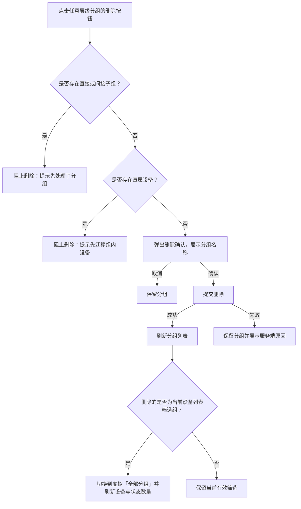

**删除校验优先级**

1. 先校验是否存在子分组；命中时只提示子分组阻塞原因。
2. 无子分组后，再校验是否存在直属设备；命中时提示先迁移设备。
3. 两项均不命中时，进入二次确认。

### 4.7 分组选择器展示、排序与搜索

**默认结构**

```text
全部分组（账户全部设备数）          ← 虚拟项，固定置顶，无 Level
广东省（直属设备数）       Level 1
广州市（直属设备数）       Level 2
属于：广东省
天河区（直属设备数）       Level 3
属于：广州市
深圳市（直属设备数）       Level 2
属于：广东省
浙江省（直属设备数）       Level 1
```

| 项目 | 规则 |
| --- | --- |
| 虚拟项位置 | 「全部分组」固定置顶，无 Level 标签，括号内为当前账户全部可见设备去重数 |
| 业务组数量 | 各一级、二级、三级分组括号内均为**直接归属该组**的设备数，不包含后代分组设备；父组数量可以小于子组数量 |
| 数量展示边界 | 设备数量只在设备首页的分组选择器中展示；分组管理卡片不展示 `Devices: N` |
| 同名区分 | 虚拟「全部分组」显示账户全部设备去重数、固定置顶且无 Level；若存在同名真实一级组，则另行显示该真实组直属设备数和 Level 1 |
| 平铺方式 | 按父子关系连续平铺；一级后连续展示其二级和三级后代，再展示下一个一级 |
| 父组信息 | 二、三级分组展示其直接父组；一级不展示父组 ，举例：Belongs to First group/Sencond group|
| 一级排序 | 优先同步监控平台维护的一级分组排序值；没有排序值时按创建时间升序 |
| 同父组排序 | 使用服务端排序值；无排序值时按创建时间升序 |
| 搜索字段 | 按分组名称做关键词包含匹配 |
| 搜索结果 | 返回所有名称命中的分组供选择；仅展示命中项，不自动带出未命中的祖先组；结果仍保留设备数、Level 和直接父组信息 |
| 无结果 | 展示无匹配分组提示，不改变原筛选 |
| 选择行为 | 单选；点击目标分组后立即应用、关闭选择器并返回设备列表，无需额外确认 |
| 取消行为 | 未选择直接关闭或返回时，保留原筛选 |
| 数据刷新 | 每次打开分组选择器时重新拉取服务端最新分组数据 |

### 4.8 设备筛选范围与状态数量

1. 设备首页首次进入默认选择虚拟「全部分组」。
2. 同一登录会话内，离开再返回设备首页时保留上次有效的分组选择。
3. 切换登录账号后不复用上一账号的分组筛选，新账号从虚拟「全部分组」开始。
4. 当前选择被其他端删除或已无权限时，APP 获取最新数据后切换到虚拟「全部分组」并提示原分组已失效。
5. 选择一级或二级父组时，**只展示直接归属该组的设备，不聚合其后代分组设备**。
6. 状态、分组、设备关键词条件取交集；切换其中一项不清空其他有效条件。
7. 顶部「全部 / 在线 / 离线 / 告警」数量按当前分组范围重算：
   - 选择虚拟「全部分组」时，按当前账户全部设备统计；
   - 选择具体业务组时，只按直接归属该组的设备统计；
   - 设备关键词只缩小列表结果，不继续缩小分组括号数量和顶部状态数量。

### 4.9 设备改组

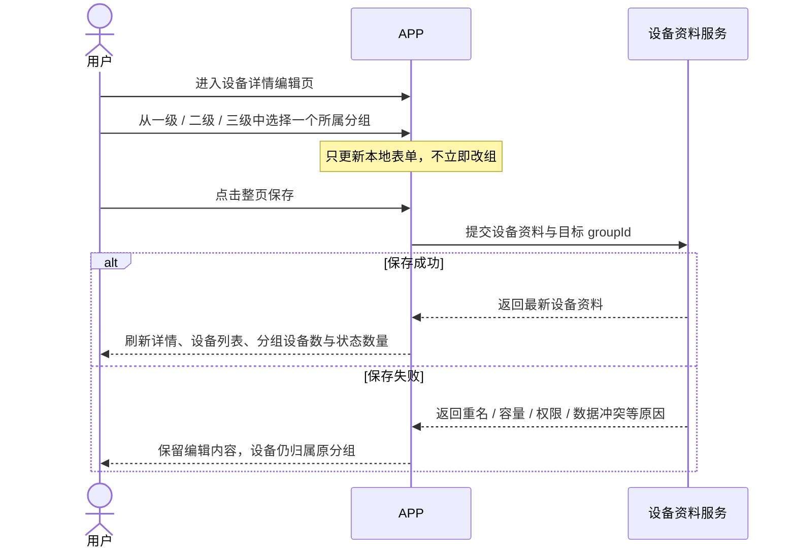

- 设备改组随设备资料整页保存生效；选择分组后取消编辑，不产生变更。
- 保存前后均以分组唯一标识为准，不能使用名称代替 `groupId`。
- 单分组设备容量沿用服务端现有规则，APP 不写死具体上限；超限时保存失败并展示服务端可读提示。
- 改组成功只更新当前账户的设备分组关系，不改变其他个人或企业账户下同一设备的分组。

### 4.10 本期修订结论与易错点

1. **全部分组 ≠ 真实分组**：只存在于设备首页筛选器，不进入分组管理，也不能作为设备归属。
2. **我的分组 ≠ 固定系统组**：只是账号初始化自动创建的普通一级组，可改名、可按空组规则删除。
3. **无未分组状态**：设备必须且只能归属一个一级、二级或三级业务组。
4. **父组不聚合子组设备**：筛选结果、分组设备数和状态数量均按直接归属计算。
5. **入口不能断头**：唯一常规路径为「设备列表 → 分组选择器 → Manage Groups」；标题栏「＋」只负责新增一级组。
6. **分组数据不能从设备反推**：读取归属当前登录账号的全量分组主数据，包含空组及 Web 创建的二、三级组；APP 与 Web 不建立两套分组副本。
7. **APP 只限制多级创建**：APP 新增固定为一级组，但管理页展示一级至三级；当前账号名下任意层级均可重命名、按空组规则删除。
8. **删除不迁移设备**：任意层级存在子组或直属设备均禁止删除；先校验子组，再校验设备，不级联删除或自动迁移。
9. **名称全局精确判重**：跨一级、二级、三级校验；大小写和空格差异视为不同名称。
10. **同名虚拟项与业务组可共存**：虚拟「全部分组」固定置顶且无 Level；真实一级组允许同名，展示直属设备数和 Level 1，以此区分。
11. **数量按页面区分**：设备首页分组选择器展示服务端返回的账户总数 / 各组直属设备数；分组管理页不展示 `Devices: N`，旧 UI 稿中的数量行已废止。
12. **名称上限按产品版本区分**：海外版新增 / 重命名均为 1～40 字符，并在弹窗展示 `Group name (1–40 characters)`；国内版对应为 1～15 字符。不按界面语言动态切换。
13. **返回时保留有效选择**：管理页返回后重新查询；原选中 `groupId` 有效则保留，已删除或失权则回退虚拟「全部分组」。
14. **跨端以服务端数据为准**：打开选择器 / 管理页时获取最新数据，Web 端结构变更不得被 APP 缓存覆盖。
15. **本节只定义分组管理及其直接联动**；整群轨迹、围栏统计和批量指令的独立业务流程不在本节展开。

---

## 5. 设备详情与资料编辑（US-018）

<aside>
🎯

**本节范围**：只梳理设备详情展示、资料编辑、定位频率设置、保存及回显闭环。物联网卡在本节仅展示 ICCID，不展开卡状态、流量套餐或二级查询流程；「用户协议 / 隐私政策」不属于设备详情，需求正文中的相关描述按误写移除。
</aside>

### 5.1 页面字段、数据来源与可编辑性

详情页字段与顺序以最新 UI 为准。查看态底部展示 `Edit`；进入编辑态后，允许修改的字段统一随整页保存提交。

| UI 字段 | 中文语义 | 数据来源 | 查看态 | 编辑规则 |
| --- | --- | --- | --- | --- |
| Device ID | 设备编号 | 设备主数据中的业务唯一编号 | 只读 | 不可修改；所有查询、保存和跳转仍携带设备唯一标识 |
| ICCID | 物联网卡号 | 当前设备关联物联网卡记录 | 只读 | 本节不提供物联网卡二级查询入口 |
| Expiration Date | 服务到期日期 | 管理端维护的服务记录 | 只读 | APP 无自助续费和修改入口 |
| Device Model | 设备型号 | 实际硬件型号 | 只读 | 不得由名称或前端选项反推 |
| Group | 所属分组 | 当前账户与设备的分组关系 | 可编辑 | 必须选择一个真实一级 / 二级 / 三级分组；只修改当前账户关系 |
| Device Name | 设备名称（备注） | 设备级共享资料 | 可编辑 | 与原平台「设备备注」为同一字段，不再另建昵称 / 备注第二字段 |
| Contact | 联系人 | 设备级共享资料 | 可编辑 | 非必填；非空时执行长度与空白校验 |
| Phone Number | 联系电话 | 设备级共享资料 | 可编辑 | 非必填；采用国家 / 地区码选择器与 E.164 规范存储 |
| Location Interval | 定位频率 | 服务端保存的最后确认 `UPLOAD` 参数及当前指令状态 | 条件可编辑 | 查看态按实际确认值展示；仅在线且无同类指令处理中时可修改 |
| Created At | 创建时间 | 设备建立记录 | 只读 | 不可修改 |

**通用展示规则**

1. Device ID、ICCID、Expiration Date、Device Model、Created At 等普通只读字段缺失时统一显示 `-`，保留字段行，不显示 `0` 或伪造日期。
2. Device Name、Contact、Phone Number 为空时，查看态按 UI 显示 `-`；设备列表标题仍按「设备名称（备注）优先、Device ID 兜底」展示。
3. Location Interval 没有最后确认值时属于明确业务状态，显示 `Unknown`（最终英文文案仍待 UI 确认），不能用 `-`、10 分钟默认值或本次目标值替代。
4. 日期按 UI 使用 `YYYY-MM-DD` 展示；服务端空值或非法值按 `-` 处理，不由客户端补默认日期。
5. 所有字段的读取、修改与跳转均以设备唯一标识定位，不以设备名称、联系人或 ICCID 作为设备身份。

### 5.2 可编辑字段校验

| 字段 | 必填性 | 长度 / 格式 | 空白、重名与存储规则 |
| --- | --- | --- | --- |
| Group | 必填 | 必须是当前账户有权使用的真实 `groupId` | 不允许虚拟「全部分组」或空分组；保存前重新校验分组仍有效、未删除、未失权 |
| Device Name（备注） | 非必填 | 0～40 字符，支持 Unicode | 保存前去除首尾空格；纯空格归一为空；内部空格保留；允许重名，设备身份仍以 Device ID 为准 |
| Contact | 非必填 | 非空时 1～40 字符，支持 Unicode 与多语言姓名 | 保存前去除首尾空格；纯空格按空值处理；不要求唯一 |
| Phone Number | 非必填 | 输入层允许 `+`、数字、空格、短横线、括号等常见格式；规范号码为 `+国家码+号码`，最多 15 位数字 | 保存前按所选国家 / 地区解析并标准化为 E.164；无法解析时禁止保存；分机号不并入 E.164 主号码 |
| Location Interval | 条件必填 | 三个预设或 1～1440 的整数分钟 | 只有用户主动进入弹层选择时才形成目标值；未知且未选择时不阻塞普通资料保存 |

**联系电话国家 / 地区规则**

1. 电话字段提供明确的国家 / 地区码选择器，不能仅靠输入文本猜测国家码。
2. 电话为空且首次进入编辑时，优先按手机系统 Region 预选国家 / 地区码。
3. 系统 Region 无法识别或不在支持列表时不预选；用户填写本地号码前必须主动选择国家 / 地区。
4. 系统 Region 只影响空字段的初始选择，不得静默改写已保存号码。
5. 界面可保留便于阅读的输入格式，服务端存储与接口返回使用标准 E.164 值。

### 5.3 查看态、编辑态与退出行为

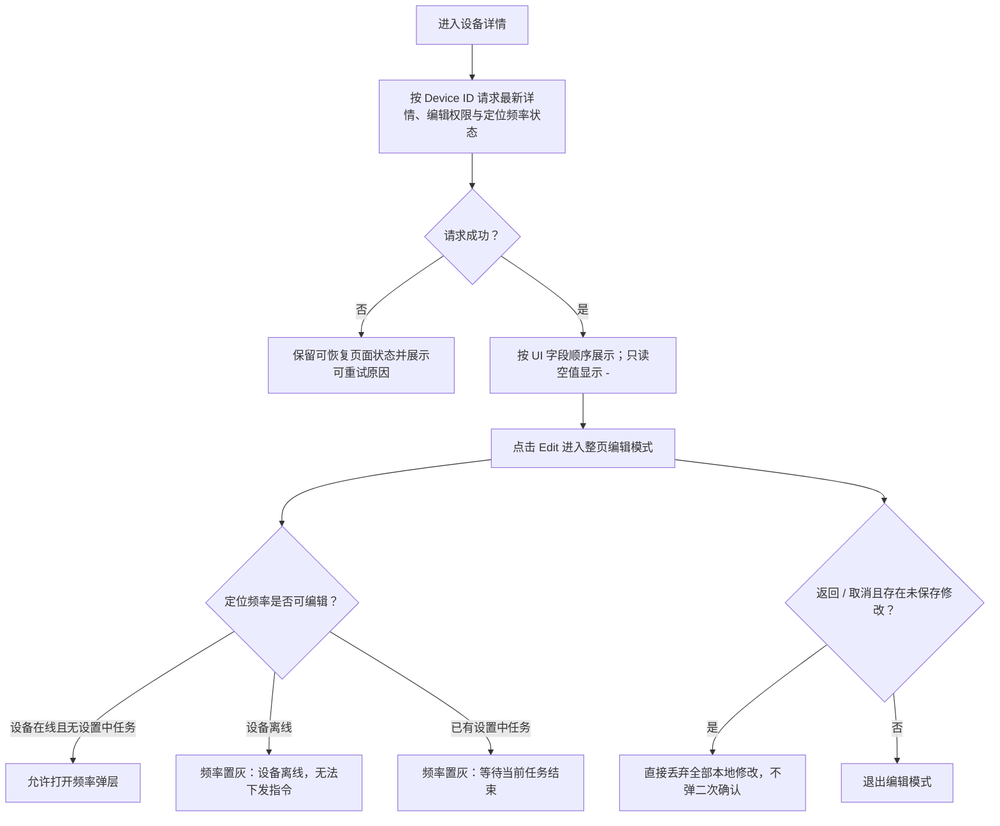

1. 查看态的 Location Interval 只负责展示，点击不直接打开设置弹层。
2. 定位频率弹层只能在整页编辑模式中打开；弹层 `Save` 只暂存目标值，不立即发送指令。
3. 整页 `Save` 才提交普通资料，并在满足条件时生成 `UPLOAD` 指令。
4. 用户返回或取消编辑时，设备名称、联系人、电话、分组及已暂存频率全部直接丢弃，不自动保存、不二次确认。
5. 所有当前账户可见设备均展示 Edit，并允许编辑本节列出的全部可编辑字段；服务端仍必须重新校验设备处于当前账户可见范围，不能只依赖前端按钮。

### 5.4 定位频率的数据模型与展示口径

<aside>
❗

**必须区分：当前确认值、编辑目标值、设置中值。** 用户选择了某个选项或平台受理了指令，都不能直接证明终端已经按该频率运行。
</aside>

| 概念 | 定义 | 是否可作为详情当前值 |
| --- | --- | --- |
| 当前确认值 | 最近一次 `UPLOAD,interval` 收到该设备匹配的成功 ACK 后，由服务端保存的指令参数 | ✅ 是 |
| 编辑目标值 | 用户在频率弹层选中并暂存、尚未随整页 Save 提交的值 | ❌ 否，仅存在于本地编辑表单 |
| 设置中值 | 指令已提交并正在等待终端 ACK 的目标值 | ⚠️ 只能以「目标文案 +（设置中）」展示 |
| 未知 | 平台没有任何可证明成功的历史 `UPLOAD` 参数 | ✅ 展示为 Unknown，但不能推定终端没有出厂配置 |

**成功确认依据**

```text
平台发送：[3G*设备号*LEN*UPLOAD,600]
终端回复：[3G*设备号*LEN*UPLOAD]
```

1. ACK 本身不携带 `600`，服务端必须把回复与同一设备当前待确认的具体 `UPLOAD,600` 指令记录正确关联。
2. 关联成功且协议将该 ACK 定义为设置成功时，服务端才把 600 秒保存为最后确认值。
3. 同一设备同一时刻只允许一条定位频率指令处于设置中，避免无参数 ACK 无法区分先后目标值。
4. 仅选中目标值、接口受理、成功写入指令记录、已发送但未回复，均不得覆盖最后确认值。
5. 定位频率与 APP 在线刷新间隔分别管理；前者控制设备位置上传周期，后者只控制 APP 页面取数。

**分钟值与展示文案映射**

| 类型 | 分钟值 | `UPLOAD` 参数 | 详情 / 弹层文案 |
| --- | ---: | ---: | --- |
| 预设一 | 1 | 60 秒 | 1 分钟（耗电模式） |
| 预设二 | 10 | 600 秒 | 10 分钟（默认模式） |
| 预设三 | 60 | 3600 秒 | 1 小时（省电模式） |
| 自定义 | 1～1440 的其他整数 | 分钟 × 60 秒 | 自定义模式（N 分钟） |

- 「耗电模式 / 默认模式 / 省电模式」只由分钟值自动映射，不是终端另行上报的独立模式标识，也不新增运行模式命令、低电阈值或续航承诺。
- 当前确认值为 1 / 10 / 60 分钟时，打开弹层自动选中对应预设；其他合法值自动选中 Custom 并填入 N。
- 当前值 Unknown 时，弹层不默认选中 10 分钟或任何选项；用户主动选择后才形成目标值。
- 用户主动选择与当前确认值相同的频率并整页保存时，仍重新下发一次 `UPLOAD`，用于重新确认终端配置。

### 5.5 定位频率与绑定、在线状态的关系

1. **定位频率移出绑定流程**：绑定只建立账户归属和分组关系，不要求填写、暂存或下发定位频率。
2. **绑定不要求设备在线**：离线设备可以完成绑定，不创建等待上线后自动执行的频率任务。
3. **刚绑定的正常初始态**：若平台没有该设备历史成功 `UPLOAD` 记录，详情页显示 Unknown；不得自动显示 10 分钟。
4. **离线不可修改频率**：离线时频率项置灰，但普通资料仍可编辑和保存。
5. **提交前重校验**：打开编辑页时在线、点击整页 Save 前变离线时，普通资料继续保存，频率不下发并返回部分失败结果。

### 5.6 整页保存、部分成功与防重复

普通资料保存与定位频率设置是两个不同结果，不能包装成一个不可拆分的成功状态。

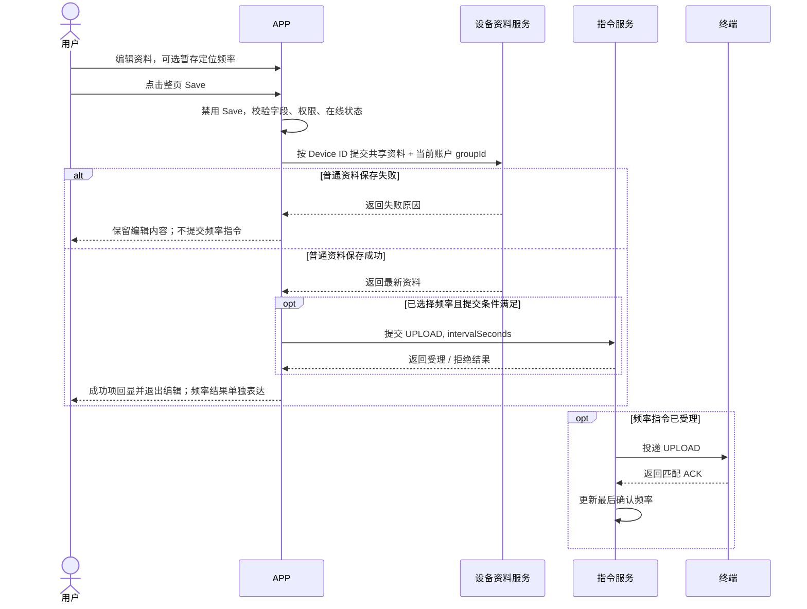

| 保存结果 | 页面处理 |
| --- | --- |
| 普通资料成功，未选择频率 | 退出编辑并回显普通资料；频率保持原确认值或 Unknown |
| 普通资料成功，频率已受理 | 退出编辑；频率展示目标文案 +「（设置中）」 |
| 普通资料成功，频率被拒绝 / 投递失败 | 普通资料不回滚；频率保留原确认值或 Unknown，并提示部分失败 |
| 普通资料失败，频率未提交 | 保留编辑内容并展示资料失败原因 |
| 保存前设备变离线 | 普通资料按正常规则提交；频率不生成新指令，提示「资料已保存，但定位频率未更新」 |

**防重复**

1. 首次点击 Save 后按钮进入 loading 并禁用，完成当前请求前不允许再次点击。
2. 服务端按本次保存操作的幂等标识去重，确保普通资料只更新一次、定位频率只生成一条 `UPLOAD` 指令。
3. 前端禁用不能替代服务端幂等；网络超时重试、重连或重复请求不得产生多条相同指令。
4. 「无任何字段修改时点击 Save 是否重新下发当前确认频率」尚未最终定案，不在本节写成通过标准；只有用户明确进入频率弹层并确认选项时，才确定属于一次频率设置意图。

### 5.7 异步状态、成功、失败与超时

1. 平台受理频率指令后，APP 不等待终端 ACK 才退出编辑；普通资料成功项立即回显。
2. 设置中展示**目标值**，例如 `1 小时（省电模式）（设置中）`；不能把该值当作已经生效。
3. 设置中状态由服务端持久化。用户退出详情或重启 APP 后，重新进入仍能恢复目标值与任务状态。
4. 设置中期间频率项置灰，不允许再次提交新频率。
5. 每次实际投递后等待终端回复 30 秒：
   - 收到匹配成功 ACK：目标值转为最后确认值，移除「设置中」；
   - 明确失败或 30 秒无 ACK：本次最终失败，不自动补发，恢复原确认值；没有原确认值时恢复 Unknown。
6. 详情编辑产生的 `UPLOAD` 不进入最长 30 天的配置指令补发队列，设备后续上线时不得突然执行这条已超时设置。
7. 失败或超时后立即解除频率编辑锁，设备仍在线时用户可以重新选择并发送。
8. 超时后到达的迟到 ACK 必须关联原指令记录，不能覆盖更新后的新目标值；若设备实际已执行旧指令，平台如何校正当前确认值仍以第 11 节 ACK 契约待确认项为准。
9. 用户已离开详情时不发送系统推送或站内消息；下次进入详情读取最终结果，失败时展示一次可读提示。

**状态流转**

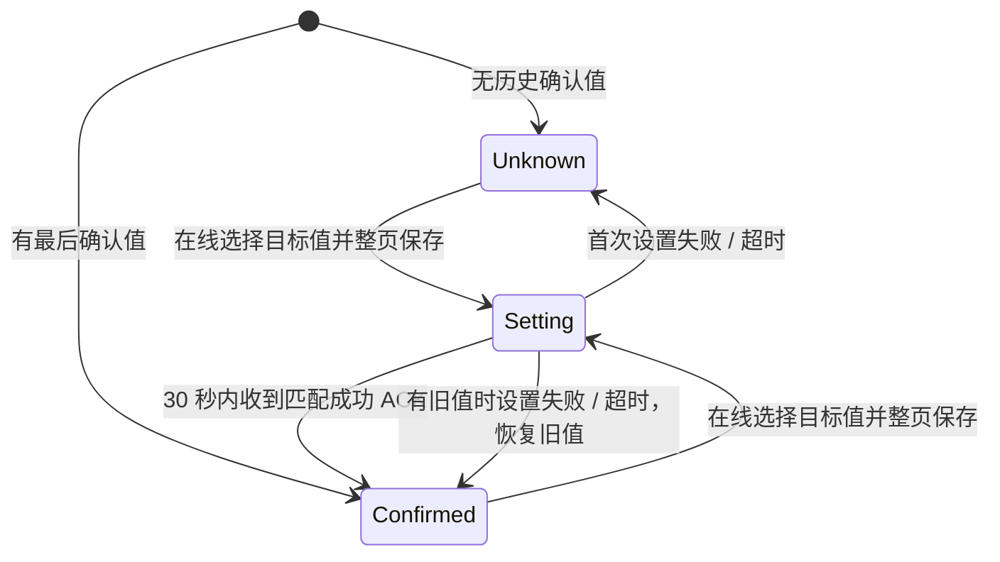

### 5.8 跨账户同步与并发覆盖

1. Device Name（备注）、Contact、Phone Number 均为**设备级共享字段**。个人与企业双绑时读取同一份数据，任一有权限账户保存后，其他关联账户及管理端读取新值。
2. Group 是**账户级关系字段**，只更新当前账户下的 `groupId`，不改变另一账户对同一设备的分组。
3. 所有可见设备均允许编辑上述共享字段与当前账户分组；定位频率还需满足设备在线且无同类任务设置中。
4. 两个账户并发修改同一共享字段时采用**后写覆盖先写**，不做版本冲突拦截；各端刷新后以服务端最终值为准。
5. 设备首次绑定时，Device Name（备注）写入当前绑定账号昵称快照；账号昵称后续变化不回写。
6. 设备已有非空名称时，另一类账户新增绑定仍以新绑定账号昵称覆盖设备级名称，并同步影响已有账户；解绑后重绑同样重置。
7. APP 不建立名称、联系人、电话或定位频率的账户独立副本；详情回显、设备列表标题与关键词搜索读取同一份设备名称（备注）。
8. 普通资料保存成功后刷新详情与设备列表；名称变更后列表展示与搜索结果同步更新，改组后刷新相关分组直属设备数与状态数量。

### 5.9 易错点与验收红线

1. **设备名称、昵称、备注不是三个字段**：当前统一为 Device Name（设备名称 / 备注）一份设备级数据。
2. **定位频率选项不等于详情值**：选项只用于形成目标值，详情展示最后确认值；设置中必须带状态标识。
3. **无 ACK 不得更新确认值**：平台受理、发送成功或用户看到目标选中态都不能替代终端有效回复。
4. **Unknown 不等于 10 分钟**：刚绑定、存量无记录、首次设置失败等场景均可能为 Unknown。
5. **离线只禁频率，不禁资料编辑**：不能因为设备离线阻止修改名称、联系人、电话或当前账户分组。
6. **部分成功不能伪装全部失败或全部成功**：资料成功、频率失败时资料不回滚，且必须明确提示频率未更新。
7. **设置中不能重复改频**：无参数 ACK 无法安全区分多条并发目标值，同设备同配置项只允许一条处理中记录。
8. **详情改频不做 30 天补发**：30 秒无回复即结束，避免设备未来上线执行过期目标值。
9. **共享资料与账户分组不能混存**：名称 / 联系人 / 电话跨账户同步，分组只影响当前账户。
10. **可见设备可编辑不等于可以越权构造请求**：服务端必须按当前登录账户与 Device ID 校验可见范围和操作权限。

---

## 6. 设备入口的告警与指令（US-019 / US-020～022）

### 6.1 设备入口告警

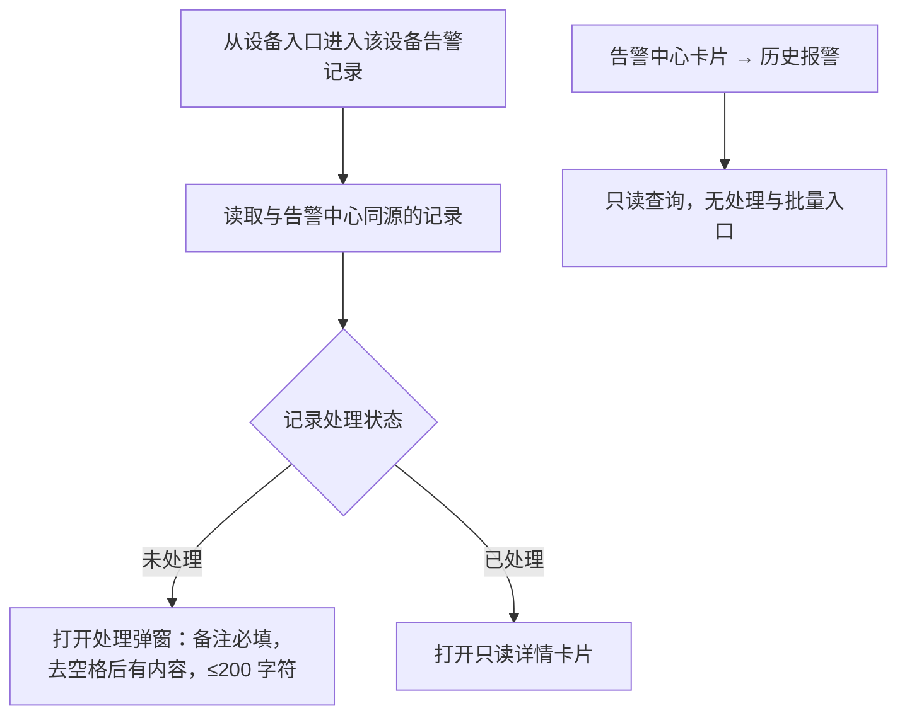

<aside>
⚠️

**两个告警页面不能互相替代**：设备模块的单设备告警记录页**保留**处理与详情；告警中心卡片进入的「历史报警」**仅只读**，且不继承告警中心的页签与筛选。

</aside>

### 6.2 设备入口指令

| 规则 | 说明 |
| --- | --- |
| 离线禁发 | 离线设备禁止提交新指令，提示「设备离线，无法下发指令」 |
| 提交前重校验 | 选择时在线、提交前变离线 → 本次拒绝，不新建等待上线任务 |
| 批量去重 | 按设备唯一标识选择，同一设备在同一批次仅提交一次 |
| 批量离线 | 计为「跳过」，不为其新建待上线指令 |
| 高风险确认 | 批量关机使用独立面板，展示目标数量与停机影响，**长按 1 秒**确认 |
| 受理 ≠ 执行 | 平台受理只表示接收；未收到设备有效回复前不显示执行完成 |
| 记录入口 | 设备指令页、批量结果页保留各自上下文；「我的 → 指令记录」为全设备范围 |

---

## 7. 新设备类型接入与跨端一致性（US-032）

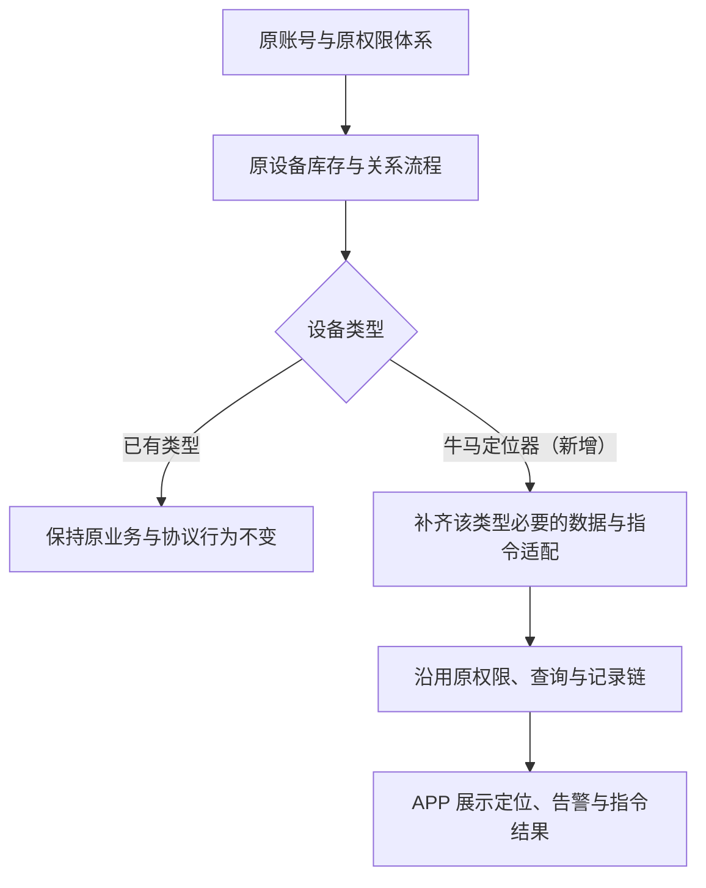

- **接入判定标准**：新类型必须能完整走通**库存 → 绑定 → 分组 → 列表 → 查询**；只改显示名称不算完成接入。
- **协议不兼容时**：只隔离必要的协议适配边界，仍复用原业务平台，不新建授权入口或独立设备事实库。
- **跨端一致性必测项**：App、监控平台、管理后台三端的**账号、设备归属、分组、SIM 状态、在线状态、到期时间**一致。
- **存量回归**：旧设备类型、旧多边形围栏、原告警同步、原历史分页不因新增类型出现规则变化。

---

## 8. 边界值与等价类速查

| 校验对象 | 有效值 | 无效值 / 边界行为 |
| --- | --- | --- |
| 分组名称长度 | 海外版：1 字符、40 字符；国内版：1 字符、15 字符 | 空；海外版 41 字符；国内版 16 字符；账户内重名。新增与重命名弹窗展示当前产品版本对应范围 |
| 分组删除 | 无子组且无直属设备时，二次确认后删除 | 有子组或直属设备时禁止删除；不得隐式迁移或删除设备，本期不存在「未分组」 |
| 设备电量 | 0～100 有效百分比 | 缺失、越界 → 显示未知，**不按 0% 触发低电** |
| 低电阈值 | 19%、0% 触发 | 20%、21% 不触发；阈值不随上传间隔、账户类型变化 |
| 上传间隔自定义 | 1 分钟、1440 分钟 | 空、0、1441、小数、非整数 |
| 上传间隔换算 | 1→60、10→600、60→3600 秒 | 1 小时按 1 分钟发送（错误） |
| APP 刷新间隔 | 30 秒（默认）、60 秒、仅手动 | 改刷新间隔联动改变设备上传间隔（错误） |
| 设备搜索 | 编号 / 名称 / 备注 / 序列号，含匹配 | 展示一份备注却检索另一份备注 |
| 状态计数 | 在线 + 离线 = 总数 | 在线 + 离线 + 告警 = 总数（错误） |
| APP 登录范围 | 个人、企业一级、企业二级、企业三级均可登录 | 企业账号被错误拦截；不同层级账号串用同一设备范围 |
| 直接绑定入口 | APP / Web = 个人账号、企业一级账号；管理后台 = 仅为企业一级账号代绑 | 二 / 三级出现绑定入口或绑定成功；个人成为后台代绑目标 |
| 企业设备分配 | 一级 → 二级、二级 → 三级，仅在监控平台 Web 逐级分配 | APP 出现向下分配入口；一级越级分配给三级；把「分配成功」判为「绑定成功」 |
| 重复绑定 | 提示已绑定，记录仍为 1 条 | 列表出现两条、数量 +1 |
| 双绑 | 个人 + 企业一级各 1 个绑定共存 | 因已有另一类绑定单独拒绝；把二 / 三级分配也计入唯一性名额 |
| 解绑范围 | 仅清理本账户及下游 | 连带清除父级有效绑定 / 删除设备 / 删除历史告警 |
| 卡状态 | 预开通 / 未激活 / 在用 / 停机 / 已拆机 | 出现第六种状态或空白无提示 |
| 定位频率展示 | 预设文案、N 分钟（自定义）、未知 | 无依据时显示「10 分钟（默认模式）」 |

---

## 9. 权限与存量兼容约束

| 前置状态 | 触发动作 | 系统行为 |
| --- | --- | --- |
| 企业一级账号 | 登录 APP 并绑定设备 | 登录成功；按企业一级绑定槽位、配额、同类占用及其他绑定前置执行 |
| 企业二 / 三级账号 | 登录 APP / 监控平台 Web | 登录成功；只加载直属父级逐级分配的设备，不因可登录而获得直接绑定权 |
| 企业二 / 三级账号 | 在 APP / 监控平台 Web 尝试绑定设备 | 无绑定入口；即便构造请求，服务端同样拒绝，只能由直属父级分配 |
| 企业一级 / 二级账号 | 尝试在 APP 向直属下级分配设备 | APP 不提供向下分配入口；一级 → 二级、二级 → 三级仅在监控平台 Web 完成 |
| 管理后台为一级账号绑定设备 | 二 / 三级账号查看设备列表 | 未分配前不可见；需一级 → 二级 → 三级逐级分配后才进入范围 |
| 企业子账号仅可见指定设备 | 请求授权范围外设备 | 执行原服务端校验，不因新客户端扩权 |
| 设备未入库 | 在 APP 输入编号绑定 | 明确报错，不允许绑定 |
| 设备未激活 / 无 SIM | 绑定 | 按原规则拦截并给出可读原因 |
| 账号设备配额已满 | 绑定或被分配设备 | 拦截并提示配额限制 |
| 个人与企业双绑同一设备 | 个人修改分组 | 企业侧分组不变 |
| 个人与企业双绑同一设备 | 有权限方修改共享备注 | 按原服务端同步范围生效，双方读取同一结果 |
| 当前账户解除绑定 | 查看另一类账户 | 另一类账户独立有效的绑定继续保留 |
| 一级账号解绑设备 | 查看二 / 三级 | 已分配给子级的关联关系一并失效（唯一级联） |
| 一级账号执行「同步分组和设备」 | 二级账号查看分组 | 二级原有分组被**全量覆盖**，属高破坏性操作 |
| 一级账号执行「仅分配设备」 | 二级账号查看分组 | 原分组保留，新设备进入「我的分组」 |
| 账号被冻结 | 在 APP 访问设备业务 | 沿用原冻结结果拦截；冻结期间设备数据照常入库 |
| 服务到期 | 在 APP / 监控平台查看 | 只读或按原规则降级，无自助续费入口 |
| 新增牛马定位器类型上线 | 回归旧设备类型业务 | 旧类型的绑定、围栏、告警、指令规则不变 |
| 管理后台修改设备备注 | 各端查看 | 按共享设备资料规则写入，所有关联账号视角同步刷新 |

---

## 10. 关键规则说明

1. **设备身份**：一切选择、查询、跳转、批量去重都以**设备唯一标识**为准，不以设备名称代替。
2. **通信状态**：只有在线与离线；未明确在线一律默认离线，并按离线规则禁止提交新指令。该默认映射**只作用于通信状态展示与计数**，不适用于定位、配置值或围栏判定基线。
3. **告警叠加**：告警是可叠加分类而非第三种通信状态；设备数与记录数分别统计。
4. **去重口径**：同一账户通过多条可见关系访问同一设备只计一台；同一批次同一设备只提交一次指令。
5. **登录、绑定与分配相互独立**：个人、企业一级、企业二级、企业三级均可登录 APP；个人与企业一级可通过 APP / 监控平台 Web 直接绑定，企业一级还可由管理后台代绑。企业二、三级只能由直属父级通过监控平台 Web 逐级分配，**分配不等于绑定**；APP 不提供企业向下分配入口。绑定、分组、围栏关系按账户分别管理，设备位置、电量、状态是同一份事实。
6. **解绑边界**：账户解绑、围栏解绑、设备删除三者互不等同；父级 / 子级清理方向必须区分。
7. **资料同步**：Device Name（设备名称 / 备注）、Contact、Phone Number 为设备级共享字段，APP 不建立账户独立覆盖值；分组仍按账户独立管理，名称展示与搜索必须同源。
8. **定位频率**：设备上传间隔与 APP 刷新间隔分别管理；详情展示最后确认值，编辑选项只形成目标值，只有匹配成功 ACK 后才更新确认值。
9. **只读边界**：设备编号、型号、到期时间、SIM 信息在 APP 侧只读，管理端唯一可写。
10. **存量优先**：新类型在原库存、身份、绑定、查询与协议链内补齐；只有原契约无法表达已定需求时才作向后兼容扩展，旧调用默认行为保持。

---

## 11. 待确认问题

- **分配关系的回收与越级**：一级账号解绑或改绑设备后，已分配给二 / 三级的可见关系是否实时回收；二级向三级分配后，一级能否越级直接回收或改派。
- **绑定前置的拦截顺序与文案**：未入库、未激活、无 SIM、已被占用、配额已满同时命中时返回哪一条提示。
- **扫码绑定的二维码内容口径**：扫码识别的是 SN、IMEI 还是设备编号；扫到非本平台二维码 / 非牛马定位器类型时的提示。
- **设备配额**：个人账户是否有绑定数量上限，上限值与超限提示文案。
- **解绑的欠费 / 风险拦截**：原平台监控侧对企业一级账号解绑有欠费强拦截、管理后台为风险二次确认；革泰一期是否沿用，APP 解绑是否需要同类拦截。
- **定位频率未知的最终英文文案**：逻辑统一按 Unknown 状态处理，但 UI 最终使用 `Unknown`、`Frequency unknown` 或其他本地化文案仍需视觉 / 产品确认。
- **整页无改动保存行为**：用户未修改普通资料、也未进入频率弹层确认选项时，Save 是直接退出、空提交资料还是重新下发当前确认频率，尚未最终定案。
- **分组数量上限**：单账户可创建的分组数上限、单分组设备数上限。
- **物联网卡查询频率**：是否有查询次数限制或缓存时长；「联系管理员」入口的具体落点（电话 / 邮箱 / 跳转页面）。
- **服务到期后的设备表现**：到期设备在列表中是否有单独标识、是否仍计入在线 / 离线统计、是否仍可下发指令。
- **低电阈值与电量来源**：电量取自最近一次上报还是最近一次有效定位；长时间未上报时电量是否显示为过期值。
- **UPLOAD ACK 契约落库**：当前按「同设备待确认 `UPLOAD,interval` 收到匹配无参数 ACK，即以该指令参数更新最后确认值」梳理；仍需研发在接口 / 协议契约中明确 ACK 关联键、重复 ACK 与迟到 ACK 的处理。
- **跨端删除与解绑的实时性**：监控平台 / 后台解绑后，APP 是否实时刷新还是需手动刷新或重新登录。
- **设备型号与能力过滤**：S18 / 186 支持的指令集是否不同；APP 是否需按型号过滤可用指令入口（后台已有按型号过滤要求）。

---

## 12. 参考文档

- [革泰 APP 产品需求文档](https://app.notion.com/p/APP-3d75667c6d3a800e938af02c795b6fcf?pvs=21)：US-015 筛选设备并打开快捷操作 / US-016 绑定牛马定位器 / US-017 管理账户内设备分组 / US-018 编辑设备资料并查询物联网卡 / US-019 从设备入口查看与处理告警 / US-032 在原平台接入牛马定位器类型；「用户与角色」章、「全局业务规则」章
- [革泰 APP 登录与注册逻辑点梳理.plan](https://app.notion.com/p/APP-plan-6a7ad80968254dbbb4bd514d60d7a86e?pvs=21)：个人与企业账号统一登录、企业层级识别、账号状态与授权范围矩阵
- [设备绑定 / 设备标签 / 归属 — 核心逻辑与隐藏风险](https://app.notion.com/p/9625667c6d3a82949c9f81896c6b3fd8?pvs=21)：参考其中三端绑定入口、唯一性与双绑、解绑级联、分配方式和设备备注单存储；设备标签不再进入当前产品模型
- [天地卫通相关模块核心逻辑梳理 ](https://app.notion.com/p/9225667c6d3a834a969701209a2dff27?pvs=21)：设备绑定逻辑、标签起始与派生表、账号冻结与过期
- [北斗位置监控平台使用说明书20260421](https://app.notion.com/p/20260421-bf25667c6d3a839e8d7a01bf1a85076e?pvs=21)：设备管理与用户管理操作口径
- [革泰海外平台一期测试计划（设备业务与公共能力）](https://app.notion.com/p/9d8aa4ed74cb4812b6c0df6a46c24e26?pvs=21)：设备生命周期、SIM 五态与到期、指令闭环、跨端一致性、账号配额
- [革泰海外平台1期-测试A测试排期表](https://app.notion.com/p/1-A-3d75667c6d3a805a8128d5bc40596dad?pvs=21)：App 设备用例设计与监控平台设备用例排期

---

**文档版本**：v1.4（统一个人与企业账号 APP 登录、绑定资格及逐级分配口径）

**最后更新**：2026-09-15

**维护人**：测试团队