# 革泰 APP 设备管理逻辑点梳理.plan

<aside>
🎯

**文档用途**：梳理革泰 APP「设备管理（牛马定位器）」相关功能的核心逻辑规则、流程与边界，作为后续测试用例编写的依据。

**适用范围**：覆盖 US-015 设备筛选与快捷操作、US-016 绑定牛马定位器、US-017 设备分组、US-018 设备详情抽屉与资料编辑、US-019 告警入口调整、US-032 新类型接入原平台；并关联 US-006/US-007 的设备状态计数、US-020～US-022 指令入口。告警处理、围栏判定、轨迹回放本身仅作关联引用，不展开。

**存量对齐**：设备绑定 / 解绑级联、设备备注单存储、分配方式（同步分组和设备 / 仅分配设备）、账号层级与配额等，全部以原监控平台既有逻辑为基准，汇总在第 3.5～3.7 与第 9 节；与 APP 新规则冲突或本期未定的部分列入第 11 节。当前设备关系仅保留绑定与分配，不再使用「我的 / 用户 / 好友」设备标签。

</aside>

---

## 1. 账号类型、绑定权与设备可见范围

### 1.1 先区分三个概念

| 概念 | 定义 | 是否产生直接绑定关系 |
| --- | --- | --- |
| 绑定 | 账号通过有权入口与设备建立直接归属关系。当前只有个人账号和企业一级账号具备绑定资格。 | ✅ 是 |
| 分配 | 企业父级把自己已可见的设备授权给直属下级。分配必须按「企业一级 → 企业二级 → 企业三级」逐级进行。 | ❌ 否 |
| 可见 | 账号通过直接绑定或父级分配获得设备访问范围。可见设备不等于当前账号直接绑定的设备。 | — |

当前版本的设备关系只包含**绑定、分配**，不存在分享关系，也不使用「我的 / 用户 / 好友」设备标签划分可见范围。

### 1.2 账号与绑定入口矩阵

管理后台的运营 / 管理员是**代绑操作主体**，不是个人、企业一级、企业二级、企业三级之外的第五类设备业务账号；后台代绑不会把设备绑定到操作员自己名下。

| 业务账号类型 | APP | 监控平台 Web | 管理后台能否将其作为代绑目标 | 绑定关系落点 |
| --- | --- | --- | --- | --- |
| 个人账号 | ✅ 可登录并扫码或输入设备编号绑定 | ✅ 保留原平台个人绑定入口 | ❌ 不支持后台代绑给个人账号 | 当前登录的个人账号；APP 与 Web 使用同一绑定关系 |
| 企业一级账号 | ✅ 可登录并扫码或输入设备编号绑定 | ✅ 可自行绑定 | ✅ 运营 / 管理员可代绑 | 当前登录的企业一级账号或后台指定的企业一级账号；APP 与 Web 使用同一绑定关系 |
| 企业二级账号 | ✅ 可登录；❌ 无直接绑定入口 | ❌ 无绑定入口 | ❌ 不可作为代绑目标 | 不产生直接绑定关系，只能接收直属一级通过 Web 分配的设备 |
| 企业三级账号 | ✅ 可登录；❌ 无直接绑定入口 | ❌ 无绑定入口 | ❌ 不可作为代绑目标 | 不产生直接绑定关系，只能接收直属二级通过 Web 分配的设备 |

绑定入口只说明账号是否有资格发起或接收直接绑定；设备入库、设备类型、同类占用、账号配额等绑定前置条件见第 3.2 节。

### 1.3 账号与设备可见来源矩阵

| 业务账号类型 | 设备可见范围来源 | 可见端 | 能否继续向下分配 |
| --- | --- | --- | --- |
| 个人账号 | 当前个人账号通过 APP 或监控平台 Web 直接绑定的设备 | APP、监控平台 Web；任一端绑定成功后两端同步可见 | ❌ 无企业下级，不参与企业分配链 |
| 企业一级账号 | 自己在 APP / 监控平台 Web 绑定的设备 + 管理后台代其绑定的设备 | APP、监控平台 Web；任一端绑定或后台代绑成功后两端同步可见 | ✅ 仅在监控平台 Web 将已可见设备分配给一个或多个直属二级账号 |
| 企业二级账号 | 直属企业一级账号通过监控平台 Web 分配的设备 | APP、监控平台 Web；父级分配成功后两端同步可见 | ✅ 仅在监控平台 Web 将自己已获分配的设备继续分配给一个或多个直属三级账号 |
| 企业三级账号 | 直属企业二级账号通过监控平台 Web 分配的设备；对应二级必须先拥有该设备可见关系 | APP、监控平台 Web；父级分配成功后两端同步可见 | ❌ 当前层级无继续下分对象 |

企业分配是**向下授权，不是归属转移**：设备分配给下级后，上游父级继续可见。同一设备可以同时分配给多个二级账号，也可以在每个二级分支下同时分配给多个直属三级账号；各账号列表均按设备唯一标识去重。企业一级向二级、企业二级向三级的设备分配只在监控平台 Web 完成，APP 只读取分配结果，不提供向下分配入口。

### 1.4 企业可见范围关系

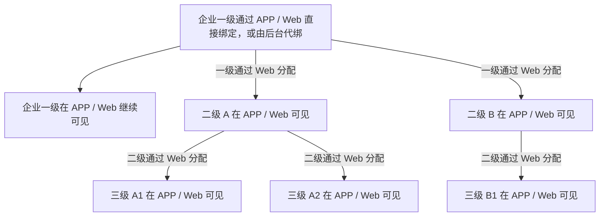
```mermaid
flowchart TD
    D["企业一级通过 APP / Web 直接绑定，或由后台代绑"]
    D --> E1["企业一级在 APP / Web 继续可见"]
    D -->|"一级通过 Web 分配"| E2A["二级 A 在 APP / Web 可见"]
    D -->|"一级通过 Web 分配"| E2B["二级 B 在 APP / Web 可见"]
    E2A -->|"二级通过 Web 分配"| E3A1["三级 A1 在 APP / Web 可见"]
    E2A -->|"二级通过 Web 分配"| E3A2["三级 A2 在 APP / Web 可见"]
    E2B -->|"二级通过 Web 分配"| E3B1["三级 B1 在 APP / Web 可见"]
```

- 二级设备可见范围必须是其直属一级可见范围的子集。
- 三级设备可见范围必须是其直属二级可见范围的子集。
- 一级不能绕过二级直接给三级建立可见关系。
- 「同步分组和设备」与「仅分配设备」都会使目标下级获得设备可见性；两者差异只在分组处理，不改变分配关系的性质。

<aside>
⚠️

**本节关键结论**

1. **只有两类账号产生直接绑定**：个人账号与企业一级账号均可通过 APP / 监控平台 Web 自行绑定；企业一级账号还可由管理后台代绑。企业二级、三级账号永远不产生直接绑定关系。
2. **直接绑定采用双槽位唯一性**：同一设备最多同时绑定 1 个个人账号和 1 个企业一级账号；个人账号之间互斥，企业一级账号之间互斥，个人与企业一级可双绑共存。
3. **分配不占直接绑定名额**：二级、三级获得的是分配关系，不占用「1 个个人 + 1 个企业一级」的直接绑定槽位。
4. **分配严格逐级且父级保留可见**：一级在监控平台 Web 分配给二级、二级在监控平台 Web 分配给三级；向下分配后父级仍可见，同级多个账号可同时获得同一设备。APP 只读取分配结果，不提供向下分配入口。
5. **登录、可见与绑定权相互独立**：个人、企业一级、企业二级、企业三级均可登录 APP；二级、三级虽然能登录并使用授权范围内的设备业务，但不能自行绑定设备，服务端必须按账号身份和设备关系重新鉴权。
6. **个人与企业链路相互独立**：两类账号看到的是同一台物理设备及同一份位置、电量、运行状态事实；账户内分组关系分别管理。
7. **APP 按账号层级加载设备范围**：个人账号读取自己的直接绑定设备；企业一级读取自己绑定或后台代绑的设备；企业二级读取直属一级分配的设备；企业三级读取直属二级分配的设备。各端使用同一账号关系数据，不建立 APP 独立授权副本。
</aside>

---

## 2. 设备列表与状态筛选（US-015）

<aside>
⚠️

**状态统计计数规则（本期口径）**

1. **设备列表只展示三种设备状态**：在线、离线、告警。前端不展示「未连接」独立状态，不设置「未连接」筛选项，也不单独统计未连接数量。
2. **离线 = 离线 + 未连接**：设备已有通信记录但当前不可通信时，展示为离线；设备初始化绑定后，尚无任何数据上报，也没有完成过有效下发 / 通信建立时，属于未连接，但在设备列表中统一按离线展示、筛选和计数。
3. **在线 / 离线为基础状态**：同一统计范围内，在线数 + 离线数 = 设备总数；未连接设备计入离线数，不额外增加第三类基础状态。
4. **告警为设备状态优先展示**：告警表示设备触发了告警。设备处于告警状态时，列表筛选可命中「告警」，卡片右侧状态优先展示「告警」。
5. **告警仍需保留在线 / 离线底层差异**：告警设备当前在线时，图标展示为告警 + 在线角标；告警设备当前离线或未连接时，图标展示为告警 + 离线角标，第三行展示「离线，无法下发指令」。
6. **设备按唯一标识去重统计**：同一设备通过多条关系可见时，设备总数、在线数、离线数、告警数均按设备唯一标识去重，不重复计数。
</aside>

| 统计项 | 计数范围 | 说明 |
| --- | --- | --- |
| 全部 | 当前账户可见的全部设备去重数 | 包含在线、离线、未连接与告警设备；未连接不单独拆分 |
| 在线 | 当前明确在线的设备去重数 | 若设备触发告警，同时可进入告警筛选；卡片右侧优先展示告警 |
| 离线 | 当前离线设备 + 初始化未连接设备的去重数 | 未连接来源于设备初始化绑定后尚无数据上报与有效通信；统一归入离线 |
| 告警 | 当前触发告警的设备去重数 | 告警是设备状态优先展示项；不在本节展开告警来源 |

**状态组合与计数归属**

| 设备实际情况 | 计入全部 | 计入在线 | 计入离线 | 计入告警 |
| --- | --- | --- | --- | --- |
| 在线，无告警 | ✅ | ✅ | ❌ | ❌ |
| 离线，无告警 | ✅ | ❌ | ✅ | ❌ |
| 初始化未连接，无告警 | ✅ | ❌ | ✅ | ❌ |
| 告警 + 在线 | ✅ | ✅ | ❌ | ✅ |
| 告警 + 离线 | ✅ | ❌ | ✅ | ✅ |

### 2.2 筛选、搜索与卡片字段

| 项 | 规则 | 边界与易错点 |
| --- | --- | --- |
| 状态筛选 | 全部 / 在线 / 离线 / 告警，各带数量 | 一次只选一项；默认离线设备必须能在「全部」「离线」中找到 |
| 搜索字段 | 设备编号、名称、备注、序列号 | 不区分大小写、忽略首尾空格；**备注展示与备注检索必须是同一份业务备注** |
| 分组筛选 | 虚拟「全部分组」/ 具体业务分组；支持按分组名称搜索 | 本期不存在「未分组」筛选项；分组数量不随当前状态与关键词减少，状态数量不随关键词减少 |
| 条件组合 | 状态 × 分组 × 关键词取**交集** | 改一项不清空其他项；清空关键词恢复当前状态 + 分组范围 |
| 卡片字段 | 第一行展示“备注（卡号）”或卡号；第二行展示电池图标 + 电量 + 最近更新时间；第三行展示定位频率 / 离线提示；保留左侧图标状态与右上角更多入口 | 卡片内不再展示分组名称、字段分隔符和右侧在线 / 离线 / 告警文字标签；无有效电量时隐藏电池图标和数值，不展示技术状态占位文案；缺失或越界电量不按 0% 处理。 |
| 列表操作 | 刷新、整群轨迹、指令下发 | 指令下发进入多选模式 |
| 行内菜单 | 实时追踪、历史轨迹、物联网卡查询、发送指令、解除当前账户绑定 | 设备详情与设备告警记录不再出现在 More 菜单；跳转一律携带**设备唯一标识**，不以名称作为身份；本轮菜单口径及验证范围见 2.4 |

### 2.3 设备卡片展示元素

<aside>
🎯

**本节口径**：以下规则来自「革泰 APP-设备卡片展示元素.plan」确认稿。若与旧卡片大纲冲突，以本节为准。本节只约束设备卡片展示元素、显示条件、布局边界与卡片本体点击行为；不改变绑定流程、批量指令、全选规则、列表排序或刷新机制。

</aside>

**设备卡片结构**

| 区域 | 展示内容 | 规则 |
| --- | --- | --- |
| 左侧设备图标 | 系统固定设备图标 | 按设备类型固定展示，添加设备及后续编辑时均不可修改图标形态。 |
| 图标主体与角标 | 状态颜色 + 右上角角标 | 在线绿色，离线 / 未连接灰色，存在未处理告警时红色；告警态通过角标保留在线 / 离线差异。 |
| 第一行 | 备注（卡号）或卡号 | 有备注时显示“备注（卡号）”；无备注时直接显示卡号；不新增备注唯一性限制。 |
| 第二行 | 电池图标 + 电量 + 最近更新时间 | 有效电量时展示电池图标、百分比及接口返回的“最近更新于”时间，在线、离线均适用；无有效电量时隐藏电池图标和数值，不展示技术状态占位文案。有效电量 < 20%，图标颜色为红色；有效电量 ≥ 20%，图标为绿色。 |
| 第三行 | 最后确认定位频率及模式 / 离线提示 | 在线显示设备最后确认生效的定位频率及模式；存在频率设置中目标时，列表仍显示最后确认值，不显示未确认目标；离线 / 未连接统一显示「离线，无法下发指令」。 |
| 更多入口 | 右上角竖向三点 | 所有设备状态均保留；独立于卡片本体点击。 |
| 卡片本体点击 | 在当前列表上方打开对应设备的半屏详情抽屉 | 在线、离线、未连接、告警状态均可打开；必须携带设备唯一标识，不能使用备注、卡号或列表位置查询。 |

**第三行定位频率与离线提示**

| 情况 | 展示文案 |
| --- | --- |
| 在线，1 分钟 | 1分钟定位（耗电模式） |
| 在线，10 分钟 | 10分钟定位（默认模式） |
| 在线，60 分钟 | 1小时定位（省电模式） |
| 在线，自定义 N 分钟 | 自定义模式（N分钟） |
| 在线，无最后确认值且无设置中目标 | 卡片隐藏定位频率文本，不展示任何占位文案 |
| 离线 / 未连接，无论是否有已知频率 | 离线，无法下发指令 |
- 自定义 N 沿用 1～1440 整数分钟；N 为 1、10、60 时，优先展示对应预设文案。
- 定位频率与 APP 刷新间隔不是同一概念，本节不改变页面刷新设置。
- 独立编辑页频率弹层选中的目标值、平台受理结果、`SENDING` 或 `SENT` 均不自动等于设备已生效值；只有后端按对应 `commandId` 判定反馈成功后才更新确认值。
- 没有最后确认值且无设置中目标时，设备卡片隐藏定位频率文本；独立设备编辑页的定位频率选择框显示“请选择定位频率”，不自行填入 10 分钟默认值；详情抽屉不展示定位频率。
- 截图中的灰色离线卡片继续显示定位频率不采纳；离线 / 未连接统一替换为离线提示。
- 截图中的「1 分钟 = 省电模式」不采纳；沿用 1 分钟耗电、10 分钟默认、60 分钟省电。

**布局与展示边界**

| 区域 | 约束 |
| --- | --- |
| 第一行备注（卡号）/ 卡号 | 单行尾部省略，不挤压更多入口 |
| 电量信息 | 有效电量与“最近更新于”时间优先完整展示，不截断；无有效电量时隐藏电池图标和数值，第二行布局高度保持不变 |
| 第三行 | 单行过长尾部省略；多语言及大字体下关键语义如何保护需补充设计 |
| 设备图标与角标 | 固定尺寸和位置，不被文本挤压或遮挡 |
| 更多入口 | 各状态保留，不被长文本遮挡 |

**待确认项与建议**

以下内容未确认为正式需求，不能直接作为开发实现或测试通过标准。

| 待确认项 | 具体缺口 | 建议，尚未采纳 |
| --- | --- | --- |
| 历史电量提示 | 时间字段与接口返回数据的展示一致性、长文案和溢出处理 | 有效电量统一在第二行展示“电池图标 + 百分比 + 最近更新于时间”，在线、离线均适用；第三行继续展示定位频率或离线提示 |
| 无有效电量展示 | 无有效电量时的图标与数值处理 | 隐藏电池图标和数值，不展示技术状态占位文案，不按 0% 处理 |
| 告警角标 | 在线 / 离线的具体颜色、形状和辨识方式 | 提供两种明确视觉稿，并补充非颜色提示与读屏语义 |
| 备注展示 | 备注为空时直接展示卡号；按当前业务前提不增加“备注和卡号同时缺失”的异常展示规则 | 备注与卡号数据以接口返回为准，测试验证有备注 / 无备注两种正常展示路径 |
| 电量精度与异常 | 小数、舍入、非法类型、历史有效值与新异常值优先级 | 避免显示 20% 却因原始小数值而标红，异常数据不当正常百分比 |
| 定位频率无确认值 | 卡片、详情抽屉和独立编辑页的展示差异 | 卡片与详情抽屉隐藏定位频率；独立编辑页选择框显示“请选择定位频率” |
| 离线整卡样式 | 是否弱化及弱化范围 | 建议只改变状态图标，不把整卡呈现为不可点击 |
| 长文案与多语言 | 历史电量提示及模式名称在窄屏、大字体下的显示 | 优先保留电量及关键状态含义，验证长备注、翻译膨胀和读屏 |
| 在线恢复后的历史电量 | 已恢复通信但尚无新电量时历史标记如何处理 | 不仅凭通信恢复就把旧电量表达为实时数据 |

列表默认排序、状态刷新机制等原有待确认事项未在本轮解决，也不纳入本节新增设计。

### 2.4 单设备扩展项「更多操作」

<aside>
🎯

**本节范围**：入口为设备卡片右上角竖向三点。More 菜单仅保留实时追踪、历史轨迹、物联网卡查询、发送指令和解绑设备；设备详情改由卡片本体打开半屏抽屉，设备告警记录不再提供设备列表入口。本轮重点展开「物联网卡查询」；实时追踪、历史轨迹和发送指令只记录跳转关系，解绑完整规则见第 3.3 节。

</aside>

#### 2.4.1 统一入口与菜单跳转

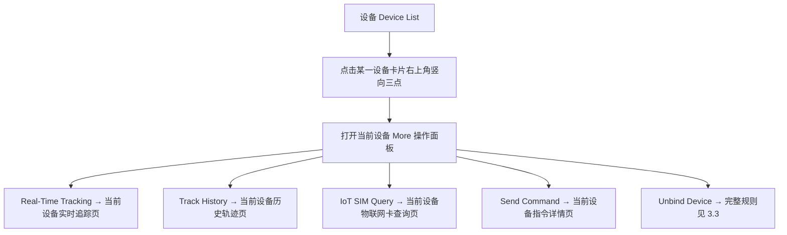
```mermaid
flowchart TD
    A["设备 Device List"] --> B["点击某一设备卡片右上角竖向三点"]
    B --> C["打开当前设备 More 操作面板"]
    C --> D["Real-Time Tracking → 当前设备实时追踪页"]
    C --> E["Track History → 当前设备历史轨迹页"]
    C --> F["IoT SIM Query → 当前设备物联网卡查询页"]
    C --> G["Send Command → 当前设备指令详情页"]
    C --> H["Unbind Device → 完整规则见 3.3"]
```

| 菜单项 | 跳转目标 / 动作 | 本节验证范围 |
| --- | --- | --- |
| Real-Time Tracking | 当前设备实时追踪页 | 页面聚焦被点击设备；离线设备仍可进入，由追踪页展示离线态。 |
| Track History | 当前设备历史轨迹页 | 查询对象为被点击设备；离线设备仍可查看已有历史轨迹。 |
| IoT SIM Query | 当前设备物联网卡查询页 | 本节详细验证入口、接口字段映射、有值 / 空值 / 失败展示及刷新。 |
| Send Command | 当前设备指令详情页 | 只验证跳转目标和设备标识正确；历史记录与具体指令闭环由指令模块覆盖。 |
| Unbind Device | 解绑确认与后续动作 | 不得用本节简化或替代第 3.3 节既有解绑规则。 |

**已移除入口**

1. `Device Information` 不再出现在 More 菜单；点击设备卡片本体直接打开第 5 章定义的半屏详情抽屉。
2. `Device Alert History` 不再出现在 More 菜单；设备列表不再提供单设备告警记录入口，告警查看与处理统一按告警模块现有入口执行。

**统一身份与导航规则**

1. 所有跳转均携带**被点击设备的唯一标识**，不得使用名称、备注、卡号或列表位置作为查询身份。
2. 两台设备备注相同，或设备备注在跳转前后发生变化时，目标页仍必须指向原设备唯一标识。
3. 设备卡片本体点击与右上角更多入口相互独立；点击更多入口不得先打开详情抽屉。
4. 菜单项被点击后关闭当前操作面板并执行一次目标跳转，不得同时打开两个页面或串到上一次操作的设备。
5. 从目标页返回设备列表时，保留进入前的状态筛选、分组、关键词与滚动位置；不得因查看单设备扩展项改变设备归属、分组、在线状态或告警处理状态。

#### 2.4.2 IoT SIM Query：入口与查询链路

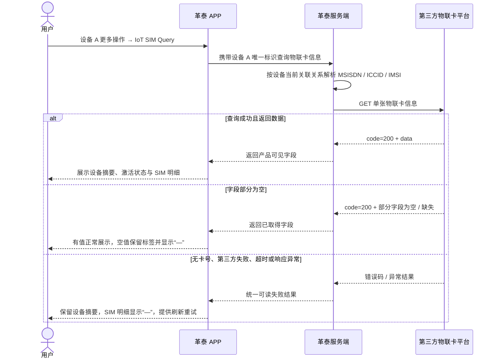
```mermaid
sequenceDiagram
    actor User as 用户
    participant App as 革泰 APP
    participant Service as 革泰服务端
    participant SIM as 第三方物联卡平台
    User->>App: 设备 A 更多操作 → IoT SIM Query
    App->>Service: 携带设备 A 唯一标识查询物联卡信息
    Service->>Service: 按设备当前关联关系解析 MSISDN / ICCID / IMSI
    Service->>SIM: GET 单张物联卡信息
    alt 查询成功且返回数据
        SIM-->>Service: code=200 + data
        Service-->>App: 返回产品可见字段
        App-->>User: 展示设备摘要、激活状态与 SIM 明细
    else 字段部分为空
        SIM-->>Service: code=200 + 部分字段为空 / 缺失
        Service-->>App: 返回已取得字段
        App-->>User: 有值正常展示，空值保留标签并显示“—”
    else 无卡号、第三方失败、超时或响应异常
        SIM-->>Service: 错误码 / 异常结果
        Service-->>App: 统一可读失败结果
        App-->>User: 保留设备摘要，SIM 明细显示“—”，提供刷新重试
    end
```

**入口规则**

1. 入口：**设备列表 → 当前设备卡片右上角更多 → IoT SIM Query**。
2. 首次进入页面自动查询当前设备的物联网卡信息；右上角刷新按钮重新查询同一设备。
3. APP 只提交设备唯一标识，不由前端选择、输入或拼接第三方卡号。
4. 服务端按该设备当前物联卡关联关系选择可用的 `MSISDN`、`ICCID` 或 `IMSI` 调用第三方单卡接口；第三方接口地址中的卡号为必填路径参数。
5. 页面返回的 ICCID 必须属于当前设备的关联卡；设备切换、重复名称或连续查看不同设备时不得串卡。
6. 设备未关联可用卡号时仍进入查询链路，最终按统一查询失败态展示；不要求固定映射为第三方 `502`。

#### 2.4.3 IoT SIM Query：页面元素与字段映射

| 页面区域 / 文案 | 数据来源 | 有值展示 | 空值 / 缺失展示 |
| --- | --- | --- | --- |
| 页面标题 | 固定文案 | `IoT SIM Query` | 固定展示，不受接口影响 |
| 返回按钮 | 固定控件 | 返回设备列表 | 固定展示 |
| 刷新按钮 | 固定控件 | 重新查询当前设备 | 固定展示；查询失败后仍可重试 |
| 设备名称 / 显示名 | 当前设备资料 | 展示当前设备可识别名称 | `—` |
| 设备类型 / 型号 | 当前设备资料 | 展示牛马定位器实际类型或型号 | `—` |
| 激活标识 | 第三方 `active` | `true` → Active；`false` → Inactive | `—`；`false` 是有效值，不得当作空值 |
| ICCID | 第三方 `iccid` | 原值展示，归属必须与当前设备一致 | `—` |
| 运营商 | 第三方 `carrier` 或服务端码表映射 | 展示运营商名称 | `—` |
| 卡状态 | 第三方 `account_status` | 按第三方卡状态码表翻译展示 | `—` |
| 流量套餐 | 第三方 `data_plan` 及真实套餐周期配置 | 按接口值进行等价单位换算；只有取得真实周期时才附加 `/month`、`/year` 等周期 | `—` |
| 已用流量 | 第三方约定的当月 / 当前周期已用字段 | 按接口值进行等价单位换算并展示对应统计周期 | `—`；数值 0 是有效值，展示 0，不得显示“—” |
| 剩余流量 | 第三方 `data_balance` | 按接口值进行等价单位换算 | `—`；共享累计卡按接口说明可能为空，不得伪造为 0 |
| 有效期 | 第三方 `expiry_date` | 展示计费结束日期；结束日期当天仍有效，次日起失效 | `—` |
| 查询异常原因 | 服务端对第三方错误、超时和异常响应的可读映射 | 查询失败时展示原因，可附接口码用于排查 | 成功时不展示错误条 |

**第三方卡状态映射**

| `account_status` | 页面卡状态 |
| --- | --- |
| `00` | 正使用 |
| `10` | 测试期 |
| `02` | 停机 |
| `03` | 预销号 |
| `04` | 销号 |
| `11` | 沉默期 |
| `12` | 停机保号 |
| `15` | 库存期 |
| `99` 或未识别值 | 未知 |

- 顶部 Active / Inactive 来自 `active`，明细卡状态来自 `account_status`，两者是不同字段，不得互相替代。
- 第三方响应 `code` 是**接口状态码**：`200` 表示请求成功，`502` 表示物联卡不存在或未启用，`505` 表示访问频率限制；接口 `code` 不得展示成卡状态。
- 单卡接口限制为 160 次 / 分钟。本节只验证普通刷新行为，不据此新增倒计时或固定冷却交互。
- 第三方文档在单卡字段表中未逐项标明所有流量字段单位，但同平台相关接口明确以 MB 表达流量。页面可以在 MB / GB 间进行可读换算，必须保证换算前后数值等价；套餐周期不能仅凭 `data_plan` 推导。
- “已用流量”究竟取 `data_usage`（当月流量）还是 `cycle_data_usage`（当前周期已用流量），必须由服务端接口契约与页面文案保持一致；未确认前不得混用两个口径。

#### 2.4.4 IoT SIM Query：逻辑点与边界值

| 场景 / 边界 | 预期结果 |
| --- | --- |
| `code=200`，全部产品可见字段有值 | 页面字段与第三方返回 / 服务端映射一致，单位换算数值等价。 |
| `code=200`，单个字段为 `null`、空字符串或缺失 | 保留该字段标签，值显示 `—`；其他有值字段正常展示。 |
| `active=false` | 展示 Inactive；不得因布尔值为 false 显示 `—`。 |
| 流量值为 `0`、`0.000` | 展示 0 及对应单位；不得当作无值。 |
| ICCID 前导零、长数字或含字母 | 按字符串完整展示，不转数值、不丢位、不使用科学计数法。 |
| `account_status=00` | 展示“正使用”；不得把字符串 `00` 转为数值 0 后误判为空或未激活。 |
| `account_status=99` 或未知新码 | 展示“未知”，可保留原码用于排查；页面不得空白或崩溃。 |
| 共享累计卡总流量为空 | 对应字段显示 `—`，不得把空值写成 0；如需流量池数据由服务端另行查询，不由 APP 猜测。 |
| `expiry_date` 为当天 | 当天仍有效；不得提前一天显示失效。 |
| `expiry_date` 已过期 | 按真实日期展示；是否增加过期样式需以产品设计为准，本节不虚构。 |
| 无关联卡号仍发起查询 | 最终进入统一查询失败态：设备摘要保留，SIM 明细为 `—`，展示可读原因和刷新入口。 |
| 第三方 `502` | 展示“物联卡不存在或未启用”等可读原因；不得同时把接口码当作卡状态。 |
| 第三方 `505` | 展示访问频率受限的可读原因并允许稍后刷新；不得无限加载。 |
| 第三方超时、网络失败、非 JSON、缺少 `data` | 进入统一查询失败态；不得保留本次未确认的伪成功数据。 |
| 查询设备 A 后返回列表，再查询设备 B | 标题设备摘要、ICCID、状态和流量必须全部切换为 B；不得残留 A 数据。 |
| 查询过程中设备关系变更或失权 | 按最新权限返回失败，不得继续展示其他账户或旧关联卡的受保护数据。 |
| 连续点击刷新 | 每次行为仍针对当前设备；页面提供基础加载反馈，不新增本节未确认的冷却规则。 |

---

## 3. 设备绑定与解绑（US-016 / US-015）

### 3.1 绑定入口与主流程

**本节口径**：个人账号、企业一级账号、企业二级账号、企业三级账号均可登录 APP，但登录资格、直接绑定资格和设备可见来源是三个独立概念。本节沿用现有三端模板，先明确 APP、监控平台 Web、管理后台的入口权限，再详细展开 APP 中个人账号与企业一级账号的绑定主流程。

#### 3.1.1 入口 × 账号类别分流（本期已确认）

| 入口 | 账号类别 / 操作主体 | 是否展示 / 提供绑定入口 | 是否产生直接绑定 | 绑定关系落点 | 设备未入库时 |
| --- | --- | --- | --- | --- | --- |
| APP | 个人账号 | ✅ 展示「绑定设备」 | ✅ | 当前登录个人账号 | 拒绝绑定，提示设备不存在 / 未入库 |
| APP | 企业一级账号 | ✅ 展示「绑定设备」 | ✅ | 当前登录企业一级账号 | 拒绝绑定，提示设备不存在 / 未入库 |
| APP | 企业二级账号 | ❌ 隐藏绑定入口 | ❌ | —；只读取直属一级分配的设备 | 不进入绑定流程 |
| APP | 企业三级账号 | ❌ 隐藏绑定入口 | ❌ | —；只读取直属二级分配的设备 | 不进入绑定流程 |
| 监控平台 Web | 个人账号 | ✅ 提供绑定入口 | ✅ | 当前登录个人账号 | 拒绝绑定，提示设备不存在 / 未入库 |
| 监控平台 Web | 企业一级账号 | ✅ 提供绑定入口 | ✅ | 当前登录企业一级账号 | 拒绝绑定，提示设备不存在 / 未入库 |
| 监控平台 Web | 企业二 / 三级账号 | ❌ 无直接绑定入口 | ❌ | 只能由直属父级逐级分配 | 不进入绑定流程 |
| 管理后台 | 运营 / 管理员 | ✅ 提供代绑入口 | ✅ | 后台指定的企业一级账号，不绑定到操作员名下 | 拒绝代绑，提示设备不存在 / 未入库 |
| 管理后台 | 个人、企业二 / 三级账号作为目标 | ❌ 不可作为代绑目标 | ❌ | — | 不进入代绑流程 |

**APP 入口展示规则**

1. APP 唯一常规绑定入口为：**设备管理 → 绑定设备**，不增加首页、无设备空状态或全局扫码快捷入口。
2. 个人账号、企业一级账号显示「绑定设备」入口；企业二级、三级账号隐藏该入口。
3. 企业二级、三级账号正常展示父级已分配的设备；无设备时沿用普通设备空状态，不额外展示「联系上级分配」等权限说明。
4. 本节对企业二级、三级只验证 APP 页面无绑定入口，不展开构造绑定请求的接口校验场景。
5. 企业设备向下分配不属于 APP 绑定入口：一级 → 二级、二级 → 三级仍只在监控平台 Web 完成，APP 只读取分配结果。

<aside>
⚠️

**登录资格不等于绑定资格**：四类账号均可登录 APP，但只有个人账号与企业一级账号具备直接绑定资格。企业二级、三级获得的是父级分配关系，不能因为能够登录、能够查看设备，就把其设备关系记录为直接绑定。

</aside>

#### 3.1.2 三端绑定关系主路径

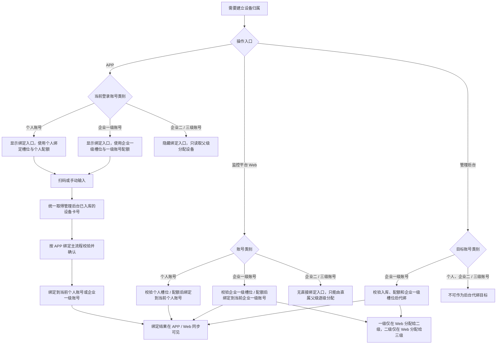
```mermaid
flowchart TD
    A["需要建立设备归属"] --> B{"操作入口"}

    B -->|"APP"| C{"当前登录账号类别"}
    C -->|"个人账号"| C1["显示绑定入口，使用个人绑定槽位与个人配额"]
    C -->|"企业一级账号"| C2["显示绑定入口，使用企业一级槽位与一级账号配额"]
    C -->|"企业二 / 三级账号"| C3["隐藏绑定入口，只读取父级分配设备"]
    C1 --> C4["扫码或手动输入"]
    C2 --> C4
    C4 --> C5["统一取得管理后台已入库的设备卡号"]
    C5 --> C6["按 APP 绑定主流程校验并确认"]
    C6 --> C7["绑定到当前个人账号或企业一级账号"]

    B -->|"监控平台 Web"| D{"账号类别"}
    D -->|"个人账号"| D1["校验个人槽位 / 配额后绑定到当前个人账号"]
    D -->|"企业一级账号"| D2["校验企业一级槽位 / 配额后绑定到当前企业一级账号"]
    D -->|"企业二 / 三级账号"| D3["无直接绑定入口，只能由直属父级逐级分配"]

    B -->|"管理后台"| E{"目标账号类别"}
    E -->|"企业一级账号"| E1["校验入库、配额和企业一级槽位后代绑"]
    E -->|"个人、企业二 / 三级账号"| E2["不可作为后台代绑目标"]

    C7 --> F["绑定结果在 APP / Web 同步可见"]
    D1 --> F
    D2 --> F
    E1 --> F
    D2 --> G["一级仅在 Web 分配给二级，二级仅在 Web 分配给三级"]
    E1 --> G
```

<aside>
⚠️

**分配 ≠ 绑定**：二 / 三级账号获得设备属于「被分配」，不产生新的直接绑定关系，也不占用「1 个个人 + 1 个企业一级」的直接绑定名额。用例设计和页面文案均不得把「分配成功」写成「绑定成功」。

</aside>

#### 3.1.3 APP 绑定主流程（个人账号 / 企业一级账号）

扫码和手动输入为并列方式，两种方式最终进入同一套校验流程。本期不展开二维码中保存的是 SN、IMEI 还是其他编码，也不要求 APP 暴露标识映射过程；业务上统一取得管理后台已入库的**设备卡号**并查询同一设备。

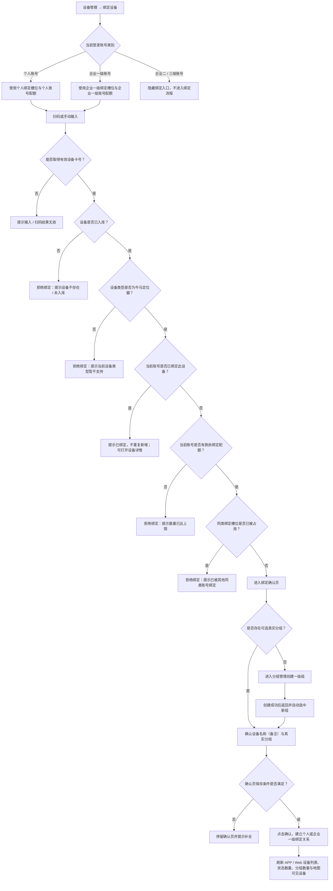
```mermaid
flowchart TD
    A["设备管理 → 绑定设备"] --> A1{"当前登录账号类别"}
    A1 -->|"个人账号"| A2["使用个人绑定槽位与个人账号配额"]
    A1 -->|"企业一级账号"| A3["使用企业一级绑定槽位与企业一级账号配额"]
    A1 -->|"企业二 / 三级账号"| A4["隐藏绑定入口，不进入绑定流程"]
    A2 --> B["扫码或手动输入"]
    A3 --> B
    B --> C{"能否取得有效设备卡号？"}
    C -->|"否"| C1["提示输入 / 扫码结果无效"]
    C -->|"是"| D{"设备是否已入库？"}
    D -->|"否"| D1["拒绝绑定：提示设备不存在 / 未入库"]
    D -->|"是"| E{"设备类型是否为牛马定位器？"}
    E -->|"否"| E1["拒绝绑定：提示当前设备类型暂不支持"]
    E -->|"是"| F{"当前账号是否已绑定此设备？"}
    F -->|"是"| F1["提示已绑定，不重复新增；可打开设备详情"]
    F -->|"否"| G{"当前账号是否有剩余绑定配额？"}
    G -->|"否"| G1["拒绝绑定：提示数量已达上限"]
    G -->|"是"| H{"同类绑定槽位是否已被占用？"}
    H -->|"是"| H1["拒绝绑定：提示已被其他同类账号绑定"]
    H -->|"否"| I["进入绑定确认页"]
    I --> J{"是否存在可选真实分组？"}
    J -->|"否"| J1["进入分组管理创建一级组"]
    J1 --> J2["创建成功后返回并自动选中新组"]
    J -->|"是"| K["确认设备名称（备注）与真实分组"]
    J2 --> K
    K --> L{"确认页保存条件是否满足？"}
    L -->|"否"| L1["停留确认页并提示补全"]
    L -->|"是"| M["点击确认，建立个人或企业一级绑定关系"]
    M --> N["刷新 APP / Web 设备列表、状态数量、分组数量与地图可见设备"]
```

**APP 正式校验顺序**

1. 扫码 / 手动输入能否取得有效设备卡号；
2. 设备是否已入库；
3. 设备类型是否为牛马定位器；
4. 当前账号是否已经绑定该设备；
5. 当前账号是否有剩余绑定配额；
6. 同类直接绑定槽位是否已被其他账号占用；
7. 绑定确认页保存条件是否满足。

同一请求同时命中多个失败条件时，按上述顺序返回前一个原因。例如设备未入库且账号配额已满时，优先提示设备不存在 / 未入库，不继续以配额不足作为本次结果。

#### 3.1.4 绑定槽位、配额与重复绑定

1. 个人账号使用个人直接绑定槽位与个人账号配额；企业一级账号使用企业一级直接绑定槽位与企业一级账号配额。
2. APP 不写死具体配额上限，绑定时读取服务端当前配置；个人账号具体上限值仍可另行确认，但不改变绑定前必须校验剩余配额的规则。
3. 同一设备最多同时直接绑定 1 个个人账号和 1 个企业一级账号：个人之间互斥，企业一级之间互斥，个人与企业一级可双绑共存。
4. 设备已有企业一级绑定时，不单独阻断新的个人绑定；已有个人绑定时，也不单独阻断新的企业一级绑定。
5. 当前账号重复绑定同一设备时，提示已绑定，不新增关系、不增加数量、不重复占用配额；APP 可直接打开该设备详情。
6. 网络重试、重复点击或重复请求不得产生多条相同绑定关系。

#### 3.1.5 绑定确认页与非绑定前置

| 项目 | 规则 |
| --- | --- |
| 设备身份 | 使用前序流程确定的设备唯一标识与设备卡号；确认页不能切换成另一设备 |
| Device Name（设备名称 / 备注） | 默认写入当前绑定账号昵称快照，允许编辑、允许为空；与设备详情和列表使用同一份设备级共享字段 |
| Group（所属分组） | 必须选择当前账号有权使用的真实一级 / 二级 / 三级分组；虚拟「全部分组」不能作为归属 |
| 当前账号无真实分组 | 引导进入同一分组管理页创建一级组；创建成功后返回绑定流程并自动选中新组 |
| Location Interval（定位频率） | 已移出绑定流程，不在确认页填写、暂存或下发 |
| 激活状态 | 不作为绑定成功 / 失败前置 |
| 物联网卡状态 | 无 SIM、未激活、停机、已拆机或异常均不阻断绑定 |
| 在线与上报状态 | 不要求设备在线，也不要求已有定位、数据上报或有效通信 |

绑定只验证能否建立账号归属关系，不验证设备当前能否正常通信或工作。未激活、无 SIM、SIM 异常、离线或从未上报的设备，在其他绑定条件满足时仍可绑定；绑定后的通信、位置、轨迹与状态展示按对应模块规则处理。

#### 3.1.6 绑定成功后的同步范围

绑定成功后：

1. 建立当前个人账号或企业一级账号的直接绑定关系；
2. APP 与监控平台 Web 读取同一绑定关系，不创建 APP 独立授权副本；
3. 刷新当前账号设备列表、设备总数、在线 / 离线 / 告警数量、相关分组直属设备数与地图可见设备；
4. 不自动创建企业二级或三级分配关系，一级仍需在监控平台 Web 逐级分配；
5. 不自动创建围栏设备关联；
6. 不自动下发定位频率，也不创建等待设备上线后执行的配置任务。

### 3.2 绑定前置与拦截清单

| 校验项 | 是否绑定前置 | 校验规则 | 未满足时预期 |
| --- | --- | --- | --- |
| 设备卡号输入 / 扫码结果 | ✅ 是 | 扫码或手动输入最终必须能取得管理后台已入库体系可识别的设备卡号；本期不展开二维码载荷及 SN / IMEI 等底层映射细节。 | 提示输入 / 扫码结果无效；不进入后续查库与确认页。 |
| 设备是否已入库 | ✅ 是 | 设备必须已在管理后台完成入库；APP、监控平台 Web、管理后台代绑均适用。 | 拒绝绑定，提示设备不存在 / 未入库等对应原因。 |
| 设备类型是否支持当前入口 | ✅ 是 | 革泰 APP 当前仅支持牛马定位器；已入库但类型为北斗、星联卫士等旧类型时，不允许在 APP 绑定。设备类型以后台入库维护的类型 / 型号 / 品类字段为准，不以名称或二维码文案判断。 | 拒绝绑定，提示当前设备类型暂不支持；不要误提示为设备不存在。 |
| 账号类别与入口权限 | ✅ 是 | APP 与监控平台 Web 均支持个人账号、企业一级账号直接绑定；管理后台只为指定企业一级账号代绑。企业二 / 三级可登录 APP / Web，但不直接产生绑定关系，只能由直属父级通过监控平台 Web 逐级分配；APP 不提供企业向下分配入口。 | APP 中二 / 三级账号隐藏绑定入口，正常读取父级分配结果；本节不展开其构造绑定请求的接口校验。APP 不得创建企业向下分配关系。 |
| 当前账号是否已绑定 | ✅ 是 | 当前账号 / 目标账号已绑定该设备时，视为重复绑定，不新增关系、不增加数量。 | 提示已绑定 / 已添加；APP 可直接回到设备列表并打开该设备半屏详情抽屉。 |
| 账号剩余可绑定设备数量 | ✅ 是 | 个人账号绑定消耗个人账号配额；企业一级账号自绑或后台代绑消耗目标一级账号配额。二 / 三级被分配是否消耗可见 / 分配数量，需按企业分配规则另行确认，不应混同为绑定配额。 | 拒绝绑定，提示数量已达上限 / 可绑定设备数量不足。 |
| 是否已被其他同级别账号绑定 | ✅ 是 | 个人绑定时，若已被其他个人账号绑定则拒绝；企业一级绑定 / 后台代绑时，若已被其他企业一级账号绑定则拒绝。个人 + 企业一级属于不同绑定层级，可双绑共存。 | 拒绝绑定，提示已被其他账号绑定 / 已被其他企业账号绑定。 |
| 确认页必填项 | ✅ 是，但属于确认页保存条件 | APP 绑定确认页只校验真实分组等绑定资料；定位频率已移出绑定流程。设备名称（备注）默认写入当前绑定账号昵称快照，可为空或后续清空。 | 停留确认页并提示补全；不建立绑定关系。 |
| 设备是否激活 | ❌ 否 | 不作为绑定成功 / 失败的前置条件。 | 不拦截绑定；绑定后可能影响位置、轨迹、在线状态或通信能力。 |
| 物联网卡状态 | ❌ 否 | 无 SIM、未激活、停机、已拆机、卡状态异常等不作为绑定前置。 | 不拦截绑定；仅在设备详情 / 物联网卡查询 / 通信异常场景中展示或提示联系管理员。 |
| 设备是否在线 / 是否已有上报 | ❌ 否 | 不要求设备当前在线，也不要求已有定位或数据上报。 | 不拦截绑定；绑定后若无上报 / 无有效通信，按未连接来源归入离线展示。 |

**APP 绑定正式拦截优先级（个人账号 / 企业一级账号）**

1. 扫码 / 手动输入无法取得有效设备卡号；
2. 设备未入库 / 设备不存在；
3. 设备类型不支持当前入口；
4. 当前账号已绑定该设备；
5. 账号剩余可绑定设备数量不足；
6. 已被其他同类账号绑定。

同一次绑定同时命中多个失败条件时，按上述顺序返回前一个原因。例如设备未入库且账号配额已满时，优先提示设备不存在 / 未入库。企业二、三级账号在 APP 中隐藏绑定入口，不进入本优先级流程。

<aside>
💡

**设计原则**：绑定只验证「能不能建立归属关系」，不验证「设备当前能不能正常工作」。激活、物联网卡、在线、定位上报属于绑定后的使用状态，不应阻断绑定。

</aside>

### 3.3 解绑流程与级联边界

**本节口径**：APP 与监控平台 Web「设备管理」中的解绑 / 移除功能使用同一套关系处理与级联规则，区别只在操作入口。APP 入口为「设备列表 → 当前设备卡片右上角更多 → Unbind Device」；Web 入口为「设备管理 → 当前账号设备列表 → 删除 / 移除设备」。两端都根据当前账号与设备的实际关系，执行个人绑定解绑、企业一级绑定解绑、二级分配关系移除或三级分配关系移除。

- **入口 × 操作主体 × 被操作对象矩阵**
    
    
    | 入口 | 操作主体 | 被操作对象 | 动作性质 | 影响范围 |
    | --- | --- | --- | --- | --- |
    | 📱 APP · 设备卡片更多 → Unbind Device | 个人账号 | 自己设备列表中的设备 | 个人绑定解绑 | 当前个人账号在 APP / Web 均不可见；清除个人侧分组与围栏设备关联；不影响企业链路。 |
    | 📱 APP · 设备卡片更多 → Unbind Device | 企业一级账号 | 自己设备列表中的设备 | 企业一级绑定解绑 | 一级自己不可见；所有二级、三级通过该一级获得的设备关系立即失效；清除整条企业链路内分组与围栏设备关联；不影响个人绑定关系。 |
    | 📱 APP · 设备卡片更多 → Unbind Device | 企业二级账号 | 自己设备列表中的设备 | 二级分配关系移除 | 二级自己不可见；该二级下所有三级立即失效；一级仍可见；其他二级及其三级不受影响；清除该二级及其下三级分组与围栏设备关联。 |
    | 📱 APP · 设备卡片更多 → Unbind Device | 企业三级账号 | 自己设备列表中的设备 | 三级分配关系移除 | 仅该三级自己不可见；一级、二级、同二级下其他三级均不受影响；清除该三级分组与围栏设备关联。 |
    | 🖥️ Web · 设备管理 | 个人账号 | 自己设备列表中的设备 | 个人绑定解绑 | 当前个人账号在 Web / APP 均不可见；清除个人侧分组与围栏设备关联；不影响企业链路。 |
    | 🖥️ Web · 设备管理 | 企业一级账号 | 自己设备列表中的设备 | 企业一级绑定解绑 | 一级自己不可见；所有二级、三级通过该一级获得的设备关系立即失效；清除整条企业链路内分组与围栏设备关联；不影响个人绑定关系。 |
    | 🖥️ Web · 设备管理 | 企业二级账号 | 自己设备列表中的设备 | 二级分配关系移除 | 二级自己不可见；该二级下所有三级立即失效；一级仍可见；其他二级及其三级不受影响；清除该二级及其下三级分组与围栏设备关联。 |
    | 🖥️ Web · 设备管理 | 企业三级账号 | 自己设备列表中的设备 | 三级分配关系移除 | 仅该三级自己不可见；一级、二级、同二级下其他三级均不受影响；清除该三级分组与围栏设备关联。 |
    | 🖥️ Web · 用户管理 | 企业一级账号 | 指定二级账号设备 | 一级回收二级分配 | 一级仍可见；指定二级不可见；该二级下所有三级立即失效；其他二级及其三级不受影响；清除被回收链路分组与围栏设备关联。 |
    | 🖥️ Web · 用户管理 | 企业一级账号 | 指定二级对应的三级账号设备 | 一级经用户管理路径回收三级分配 | 一级仍可见；二级仍可见；指定三级不可见；同二级下其他三级不受影响；仅清除该三级分组与围栏设备关联。 |
    | 🖥️ Web · 用户管理 | 企业二级账号 | 指定三级账号设备 | 二级回收三级分配 | 一级仍可见；二级仍可见；指定三级不可见；同二级下其他三级不受影响；仅清除该三级分组与围栏设备关联。 |
    | 🛠️ 管理后台 | 后台管理员 / 运营人员 | 指定个人账号绑定关系 | 后台解绑个人 | 指定个人账号在 APP / Web 均不可见；清除该个人侧分组与围栏设备关联；不影响企业链路。 |
    | 🛠️ 管理后台 | 后台管理员 / 运营人员 | 指定企业一级账号绑定关系 | 后台解绑一级 | 一级、所有二级、所有三级企业链路立即失效；清除整条企业链路内分组与围栏设备关联；不影响个人绑定关系。 |
    | 🛠️ 管理后台 | 后台管理员 / 运营人员 | 企业一级 A → 企业一级 B | 后台改绑 | 等价于「解绑 A + 绑定 B」；A 下所有二 / 三级分配立即失效；B 下级默认不可见，需重新分配；个人绑定关系保留。 |
- **APP 分支树**
    
    ```
    📱 APP · 设备卡片更多 → Unbind Device
    ├─ 👤 个人账号删除自己的设备
    │  ├─ 动作性质：个人绑定解绑
    │  ├─ 当前个人账号在 APP / Web 均不可见
    │  ├─ 清除个人侧分组关系与围栏设备关联
    │  ├─ 后续重新绑定时，原分组与围栏关联不自动恢复
    │  ├─ 保留历史位置 / 轨迹 / 告警 / 指令等历史数据
    │  └─ 不影响企业一级 / 二级 / 三级链路
    │
    ├─ 🏢 企业一级账号删除自己的设备
    │  ├─ 动作性质：企业一级绑定解绑
    │  ├─ 当前一级账号在 APP / Web 均不可见
    │  ├─ 该一级下所有二级、三级分配关系立即失效
    │  ├─ 清除整条企业链路内分组关系与围栏设备关联
    │  ├─ 后续重新绑定时，原二 / 三级分配、分组和围栏关联不自动恢复
    │  ├─ 保留历史位置 / 轨迹 / 告警 / 指令等历史数据
    │  └─ 不影响个人账号独立绑定关系
    │
    ├─ 🏢 企业二级账号删除自己的设备
    │  ├─ 动作性质：二级分配关系移除
    │  ├─ 当前二级账号在 APP / Web 均不可见
    │  ├─ 该二级下所有三级分配关系立即失效
    │  ├─ 企业一级、其他二级及其他分支三级继续可见
    │  ├─ 清除当前二级及其下三级的分组关系与围栏设备关联
    │  └─ 保留历史数据
    │
    └─ 🏢 企业三级账号删除自己的设备
       ├─ 动作性质：三级分配关系移除
       ├─ 仅当前三级账号在 APP / Web 中不可见
       ├─ 企业一级、直属二级及同二级下其他三级继续可见
       ├─ 仅清除当前三级的分组关系与围栏设备关联
       └─ 保留历史数据
    ```

    APP 与 Web 设备管理入口必须产生相同的关系变更、下级级联、分组清理和围栏清理结果；不能因操作端不同而扩大或缩小影响范围。
    
- **Web 平台分支树**
    
    ```
    🖥️ 监控平台 Web 删除 / 移除设备
    ├─ A. 设备管理入口：当前账号删除自己的设备
    │  ├─ 👤 个人账号
    │  │  └─ 删除自己绑定设备 → 个人绑定解绑 → APP / Web 同步不可见
    │  ├─ 🏢 企业一级账号
    │  │  └─ 删除自己绑定设备 → 企业一级绑定解绑 → 一级 + 所有二级 + 所有三级失效
    │  ├─ 🏢 企业二级账号
    │  │  └─ 删除自己设备 → 二级分配关系移除 → 二级 + 该二级下所有三级失效，一级保留
    │  └─ 🏢 企业三级账号
    │     └─ 删除自己设备 → 三级分配关系移除 → 仅三级自己失效，一级 / 二级保留
    │
    └─ B. 用户管理入口：父级移除下级账号设备
       ├─ 🏢 一级账号 → 移除二级账号设备
       │  └─ 一级保留；指定二级失效；该二级下所有三级失效
       ├─ 🏢 一级账号 → 移除二级对应三级账号设备
       │  └─ 一级、二级保留；指定三级失效；同二级下其他三级不受影响
       └─ 🏢 二级账号 → 移除三级账号设备
          └─ 一级、二级保留；指定三级失效；同二级下其他三级不受影响
    ```
    
- **管理后台分支树**
    
    ```
    🛠️ 管理后台解绑 / 改绑
    ├─ 👤 后台解绑个人账号绑定关系
    │  ├─ 动作性质：个人绑定解绑
    │  ├─ 指定个人账号在 APP / Web 均不可见
    │  ├─ 清除该个人账号侧分组关系
    │  ├─ 清除该个人账号侧围栏设备关联
    │  ├─ 后续重新绑定同一设备，原围栏关联不自动恢复
    │  ├─ 保留历史数据
    │  └─ 不影响企业链路
    │
    ├─ 🏢 后台解绑企业一级绑定关系
    │  ├─ 动作性质：企业一级绑定解绑
    │  ├─ 一级账号不可见
    │  ├─ 所有二级分配关系立即失效
    │  ├─ 所有三级分配关系立即失效
    │  ├─ 清除一级 / 二级 / 三级企业链路内分组关系
    │  ├─ 清除一级 / 二级 / 三级企业链路内围栏设备关联
    │  ├─ 后续重新绑定同一设备，原二 / 三级分配不自动恢复
    │  ├─ 后续重新绑定同一设备，原围栏关联不自动恢复
    │  ├─ 保留历史数据
    │  └─ 不影响个人账号独立绑定关系
    │
    └─ 🔀 后台改绑企业一级 A → 企业一级 B
       ├─ 动作性质：解绑 A + 绑定 B
       ├─ A 的企业一级绑定关系删除
       ├─ A 下所有二 / 三级分配关系立即失效
       ├─ 清除 A 企业链路内分组与围栏设备关联
       ├─ B 获得企业一级绑定关系
       ├─ B 下二 / 三级默认不可见，必须重新分配
       ├─ 原围栏关联不迁移、不自动恢复
       ├─ 个人账号绑定关系保留
       └─ 保留历史数据
    ```
    
- **级联规则**
    
    <aside>
    💡
    
    1. **一级删除自己的设备 / 后台解绑一级**：删除企业一级绑定关系，一级、所有二级、所有三级企业链路立即失效。
    2. **二级删除自己的设备**：删除二级自己的分配关系；该二级及其下所有三级立即失效；一级、其他二级、其他二级下三级不受影响。
    3. **三级删除自己的设备**：只删除三级自己的分配关系；一级、二级、同二级下其他三级不受影响。
    4. **一级在用户管理移除二级设备**：一级仍可见；指定二级及其下所有三级立即失效。
    5. **一级在用户管理移除二级对应三级设备**：一级与二级仍可见；仅指定三级失效。
    6. **二级在用户管理移除三级设备**：一级与二级仍可见；仅指定三级失效。
    7. **后台改绑企业一级 A → B**：等价于「解绑 A + 绑定 B」；A 链路全部失效，B 获得一级绑定，B 下二 / 三级默认不可见，需重新分配。
    8. **重新绑定 / 重新分配不自动恢复**：原二 / 三级分配关系不会自动恢复，原围栏与设备绑定关系也不会自动恢复。
    </aside>
    
- **围栏与历史数据规则**
    
    <aside>
    💡
    
    1. 设备删除 / 解绑 / 分配回收时，当前失效链路内的围栏设备关联同步清除。
    2. 个人解绑：清除个人侧围栏设备关联。
    3. 一级解绑：清除一级 + 所有二级 + 所有三级企业链路内围栏设备关联。
    4. 二级删除自己设备或一级移除二级设备：清除该二级 + 该二级下所有三级围栏设备关联。
    5. 三级删除自己设备、一级移除三级设备、二级移除三级设备：仅清除该三级围栏设备关联。
    6. 后续重新绑定 / 重新分配同一设备后，原围栏与设备关系不自动恢复，必须重新关联。
    7. 历史位置、历史轨迹、历史告警、历史指令记录等已产生历史数据保留；但当前账号是否还能查看，取决于其是否仍有设备可见关系。
    </aside>
    

<aside>
❗

**易错边界**

1. **删除自己的设备不一定等于解绑设备**：个人 / 企业一级删除是绑定解绑；企业二 / 三级删除是分配关系移除。
2. **一级移除二级 ≠ 一级移除三级**：移除二级会带掉该二级下所有三级；只移除三级时，二级仍可见。
3. **二级也有父级级联能力**：二级删除自己的设备会影响其下三级；二级在用户管理移除三级设备时，仅该三级失效。
4. **级联只向下，不向上**：二级 / 三级删除或被移除，不反向影响一级绑定；三级删除不影响二级可见。
5. **个人链路与企业链路独立**：个人解绑不影响企业链路；企业解绑 / 分配回收不影响个人绑定。
6. **解绑不等于删除设备**：设备本体、库存、物联网卡与历史数据保留；只是当前归属 / 分配 / 分组 / 围栏关联与可见范围失效。
</aside>

### 3.4 重复绑定与幂等

| 场景 | 预期结果 |
| --- | --- |
| 当前账户重复绑定同一设备 | 提示「已绑定」；设备列表保持一条记录，数量不增加 |
| 设备已被个人绑定，企业按其权限申请绑定 | 不以此为唯一拒绝理由；其余准入条件仍校验 |
| 同一设备通过多条可见关系出现 | 按唯一标识去重，只计一台 |
| 解绑后重新绑定 | 分组、围栏关联、判定基线按原规则重建；下一条有效定位只建立基线，不报警 |

---

## 4. 分组管理（US-017）

### 4.1 分组管理入口与数据来源

**唯一常规入口**

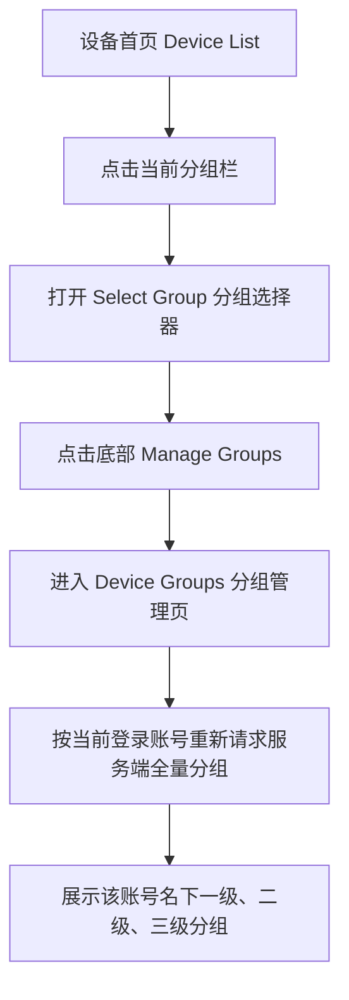
```mermaid
flowchart TD
    A["设备首页 Device List"] --> B["点击当前分组栏"]
    B --> C["打开 Select Group 分组选择器"]
    C --> D["点击底部 Manage Groups"]
    D --> E["进入 Device Groups 分组管理页"]
    E --> F["按当前登录账号重新请求服务端全量分组"]
    F --> G["展示该账号名下一级、二级、三级分组"]
```

- 分组管理页的唯一常规入口是：**设备列表 → 当前分组栏 → Select Group → Manage Groups**。
- 绑定流程中当前账号无可选真实分组时，可以引导进入同一个分组管理页创建一级组；这是业务异常引导，不是第二个常规菜单入口。

**数据来源与取数边界**

| 数据对象 | 来源与查询范围 | APP 使用方式 |
| --- | --- | --- |
| 登录账号上下文 | 当前有效登录会话，由服务端根据登录身份确定账号范围 | APP 不得通过替换前端账号参数读取其他账号分组 |
| 分组主数据 | APP 与 Web 共用原有账户分组体系；查询归属当前登录账号的全量分组，不按创建端过滤 | 空组也必须返回，不能从当前设备列表反向聚合分组 |
| 分组结构字段 | 服务端返回分组唯一标识、名称、Level、直接父组、排序等结构数据 | APP 以 `groupId` 识别分组，以 `parentId` / Level 还原层级，不以名称拼接关系 |
| 分组选择器数量 | 服务端分组查询同时返回当前账号下各组的直属设备数；虚拟「全部分组」使用账户全部可见设备去重数 | APP 只展示服务端统计结果，不遍历设备列表自行计算 |
| 分组管理页 | 每次从 Manage Groups 进入时重新查询当前账号一级至三级全量分组 | 与选择器使用同源分组主数据，但管理页不渲染设备数量 |
| Web 跨端变更 | 当前账号在 Web 创建的二、三级分组，以及 Web 的重命名、删除结果 | APP 重新进入选择器 / 管理页后读取最新服务端结果，不维护独立 APP 分组副本 |

**进入、返回与刷新规则**

1. 打开 Select Group 时重新查询当前账号最新分组结构和直属设备数。
2. 从 Select Group 点击 Manage Groups 后，分组管理页再次请求当前账号全量分组，不能只复用选择器快照。
3. 从分组管理页返回时重新查询分组数据：原选中 `groupId` 仍有效则保留；已被删除或失权则回退虚拟「全部分组」，并刷新设备列表与状态数量。
4. APP 新增、重命名或删除成功后，以服务端返回结果为准刷新管理页；重新打开选择器时同步看到最新结构和数量。
5. 接口失败时不得用空数组冒充账号无分组；保留原有效页面状态并展示可重试的失败提示。

### 4.2 分组模型与对象边界

分组采用**三级父子体系**，例如「广东省（一级）→ 广州市（二级）→ 天河区（三级）」。APP 的分组选择器使用平铺列表展示，但业务数据仍保留层级、父组与唯一标识，不能把 Level 标签当作纯展示字段。

| 对象 | 性质 | 层级 | 是否进入分组管理页 | 是否可作为设备所属分组 | 操作规则 |
| --- | --- | --- | --- | --- | --- |
| 全部分组 | 设备首页的虚拟筛选项，不是真实分组 | 无 | ❌ | ❌ | 固定置于选择器首位，不可增删改 |
| 我的分组 | 账号初始化时自动创建的普通业务分组 | 一级 | ✅ | ✅ | 与其他一级组规则相同，可重命名；满足删除条件时可删除 |
| 一级分组 | 当前账号名下的真实业务分组 | Level 1 | ✅ | ✅ | APP 可新增、重命名、按空组规则删除 |
| 二级分组 | 当前账号通过 Web 创建的真实业务分组 | Level 2 | ✅ | ✅ | APP 不可新增，但可重命名、按空组规则删除 |
| 三级分组 | 当前账号通过 Web 创建的真实业务分组 | Level 3 | ✅ | ✅ | APP 不可新增，但可重命名、按空组规则删除 |

**核心约束**

1. 一个设备在当前账户下必须且只能归属**一个真实业务分组**，一级、二级、三级均可作为所属分组。
2. 系统**不存在「未分组」**视图或归属状态；绑定和设备资料保存时，所属分组不能为空。
3. 分组按账户隔离。同一物理设备在不同账户下可以归属不同分组，一方改组不影响另一方。
4. 「全部分组」仅用于设备首页查询所有设备，不能写入设备的 `groupId`，也不出现在分组管理列表。
5. 允许用户创建名称为「全部分组」的真实一级组。选择器中虚拟项固定置顶且无 Level，真实同名组按业务排序展示并标记 Level 1，以此区分。
6. 「我的分组」不是保留名称，也不是不可删除的系统组：当前存在同名组时按重名拦截；被改名或删除后，名称释放，允许再次创建。

### 4.3 APP 可管理范围

- APP 的「分组管理」页展示归属当前登录账号的**一级、二级、三级全部真实分组**；不展示虚拟「全部分组」。
- APP 只限制多级分组的**创建能力**：点击标题栏「＋」固定创建一级分组，不提供 Level 或父组选择；二、三级分组需由当前账号在 Web 平台创建。
- 当前账号名下任意一级、二级、三级分组均可在 APP 重命名、按空组规则发起删除；创建端不影响后续管理能力。
- 管理页按父子关系连续平铺并展示 Level；二、三级同时展示直接父组，一级不展示父组。
- 每个真实分组展示名称、Level、必要的父组信息、重命名和删除入口；**不展示 `Devices: N` / 设备数量**。旧 UI 稿中的设备数量行已废止，不能作为当前验收标准。

### 4.4 初始化与零分组状态

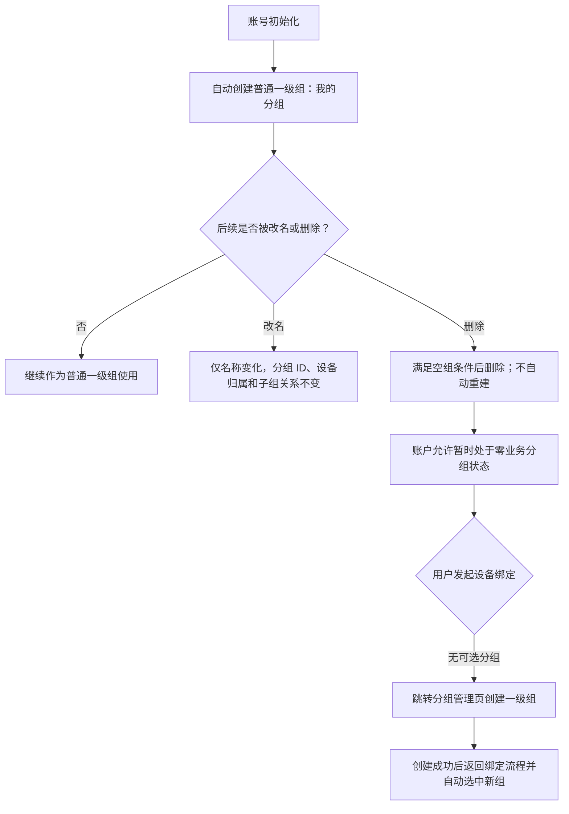
```mermaid
flowchart TD
    A["账号初始化"] --> B["自动创建普通一级组：我的分组"]
    B --> C{"后续是否被改名或删除？"}
    C -->|"否"| D["继续作为普通一级组使用"]
    C -->|"改名"| E["仅名称变化，分组 ID、设备归属和子组关系不变"]
    C -->|"删除"| F["满足空组条件后删除；不自动重建"]
    F --> G["账户允许暂时处于零业务分组状态"]
    G --> H{"用户发起设备绑定"}
    H -->|"无可选分组"| I["跳转分组管理页创建一级组"]
    I --> J["创建成功后返回绑定流程并自动选中新组"]
```

- 即使「我的分组」是账户最后一个真实分组，只要满足删除条件，也允许删除。
- 删除后账户可以只剩虚拟「全部分组」，但设备不能归属该虚拟项。
- 账户已有业务分组时，绑定确认页默认选中**排序最靠前的一级分组**，用户可改选任意一级、二级或三级分组。
- 父级在监控平台执行「仅分配设备」时，如果目标账号不存在精确名称为「我的分组」的真实分组，系统自动创建一个普通一级「我的分组」承接设备；若已存在则直接复用。

### 4.5 新增与重命名

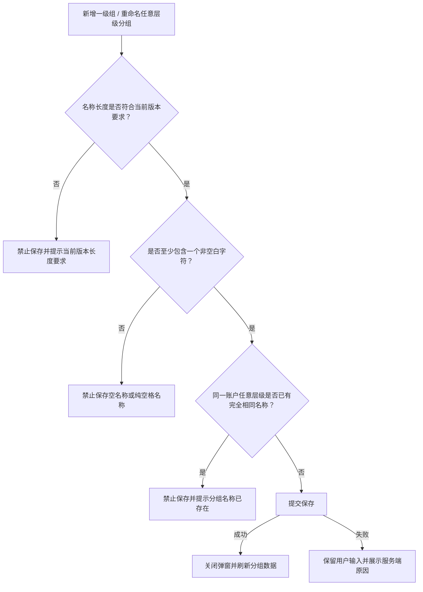
```mermaid
flowchart TD
    A["新增一级组 / 重命名任意层级分组"] --> B{"名称长度是否符合当前版本要求？"}
    B -->|"否"| B1["禁止保存并提示当前版本长度要求"]
    B -->|"是"| C{"是否至少包含一个非空白字符？"}
    C -->|"否"| C1["禁止保存空名称或纯空格名称"]
    C -->|"是"| D{"同一账户任意层级是否已有完全相同名称？"}
    D -->|"是"| D1["禁止保存并提示分组名称已存在"]
    D -->|"否"| E["提交保存"]
    E -->|"成功"| F["关闭弹窗并刷新分组数据"]
    E -->|"失败"| G["保留用户输入并展示服务端原因"]
```

| 校验项 | 规则 |
| --- | --- |
| 长度 | **海外版 1～40 字符（本大纲主口径）**；国内版 1～15 字符。版本上限由国内版 / 海外版产品构建确定，不随用户切换界面语言动态变化。 |
| 弹窗提示 | 新增与重命名使用相同上限；海外版弹窗固定展示 `Group name (1–40 characters)`，国内版展示对应的 1～15 字符范围提示。当前 UI 稿仅确认静态范围提示，不据此扩展字符计数器、超长粘贴裁剪等未明确交互。 |
| 空值 | 空字符串、纯空格名称禁止保存 |
| 重名范围 | 同一账户下一级、二级、三级分组全局判重，不只校验同级或同父组 |
| 比较方式 | 完全精确匹配；英文大小写、内部空格及首尾空格均参与比较 |
| 首尾空格 | 只要名称包含非空白字符，首尾空格按原样保留，不自动裁剪 |
| 重命名自身 | 名称未变化时不能把当前分组自身误判为重名 |
| 重命名影响 | 任意层级分组即使存在直属设备或子组仍允许改名；只更新名称，不改变分组 ID、层级、父子关系和设备归属；其直接子组的父组名称展示同步更新 |
| 容量上限 | APP 不写死分组数量上限，沿用服务端当前配置与提示 |

### 4.6 删除规则与交互

分组管理项中的红色「删除」按钮对一级、二级、三级真实分组始终展示。管理页不展示设备数量，因此不能凭页面文案判断是否为空组；点击后必须向服务端实时校验可删除条件。**任意层级只有在无子组且无直属设备时才能进入二次确认并删除**；三级组天然没有下一层子组，实际只需校验直属设备。

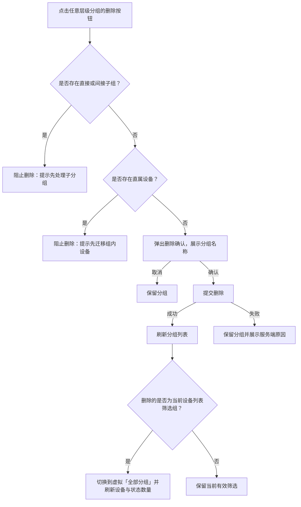
```mermaid
flowchart TD
    A["点击任意层级分组的删除按钮"] --> B{"是否存在直接或间接子组？"}
    B -->|"是"| B1["阻止删除：提示先处理子分组"]
    B -->|"否"| C{"是否存在直属设备？"}
    C -->|"是"| C1["阻止删除：提示先迁移组内设备"]
    C -->|"否"| D["弹出删除确认，展示分组名称"]
    D -->|"取消"| E["保留分组"]
    D -->|"确认"| F["提交删除"]
    F -->|"成功"| G["刷新分组列表"]
    F -->|"失败"| H["保留分组并展示服务端原因"]
    G --> I{"删除的是否为当前设备列表筛选组？"}
    I -->|"是"| J["切换到虚拟「全部分组」并刷新设备与状态数量"]
    I -->|"否"| K["保留当前有效筛选"]
```

**删除校验优先级**

1. 先校验是否存在子分组；命中时只提示子分组阻塞原因。
2. 无子分组后，再校验是否存在直属设备；命中时提示先迁移设备。
3. 两项均不命中时，进入二次确认。

### 4.7 分组选择器展示、排序与搜索

**默认结构**

```text
全部分组（账户全部设备数）          ← 虚拟项，固定置顶，无 Level
广东省（直属设备数）       Level 1
广州市（直属设备数）       Level 2
属于：广东省
天河区（直属设备数）       Level 3
属于：广州市
深圳市（直属设备数）       Level 2
属于：广东省
浙江省（直属设备数）       Level 1
```

| 项目 | 规则 |
| --- | --- |
| 虚拟项位置 | 「全部分组」固定置顶，无 Level 标签，括号内为当前账户全部可见设备去重数 |
| 业务组数量 | 各一级、二级、三级分组括号内均为**直接归属该组**的设备数，不包含后代分组设备；父组数量可以小于子组数量 |
| 数量展示边界 | 设备数量只在设备首页的分组选择器中展示；分组管理卡片不展示 `Devices: N` |
| 同名区分 | 虚拟「全部分组」显示账户全部设备去重数、固定置顶且无 Level；若存在同名真实一级组，则另行显示该真实组直属设备数和 Level 1 |
| 平铺方式 | 按父子关系连续平铺；一级后连续展示其二级和三级后代，再展示下一个一级 |
| 父组信息 | 二、三级分组展示其直接父组；一级不展示父组 ，举例：Belongs to First group/Sencond group|
| 一级排序 | 优先同步监控平台维护的一级分组排序值；没有排序值时按创建时间升序 |
| 同父组排序 | 使用服务端排序值；无排序值时按创建时间升序 |
| 搜索字段 | 按分组名称做关键词包含匹配 |
| 搜索结果 | 返回所有名称命中的分组供选择；仅展示命中项，不自动带出未命中的祖先组；结果仍保留设备数、Level 和直接父组信息 |
| 无结果 | 展示无匹配分组提示，不改变原筛选 |
| 选择行为 | 单选；点击目标分组后立即应用、关闭选择器并返回设备列表，无需额外确认 |
| 取消行为 | 未选择直接关闭或返回时，保留原筛选 |
| 数据刷新 | 每次打开分组选择器时重新拉取服务端最新分组数据 |

### 4.8 设备筛选范围与状态数量

1. 设备首页首次进入默认选择虚拟「全部分组」。
2. 同一登录会话内，离开再返回设备首页时保留上次有效的分组选择。
3. 切换登录账号后不复用上一账号的分组筛选，新账号从虚拟「全部分组」开始。
4. 当前选择被其他端删除或已无权限时，APP 获取最新数据后切换到虚拟「全部分组」并提示原分组已失效。
5. 选择一级或二级父组时，**只展示直接归属该组的设备，不聚合其后代分组设备**。
6. 状态、分组、设备关键词条件取交集；切换其中一项不清空其他有效条件。
7. 顶部「全部 / 在线 / 离线 / 告警」数量按当前分组范围重算：
   - 选择虚拟「全部分组」时，按当前账户全部设备统计；
   - 选择具体业务组时，只按直接归属该组的设备统计；
   - 设备关键词只缩小列表结果，不继续缩小分组括号数量和顶部状态数量。

### 4.9 设备改组

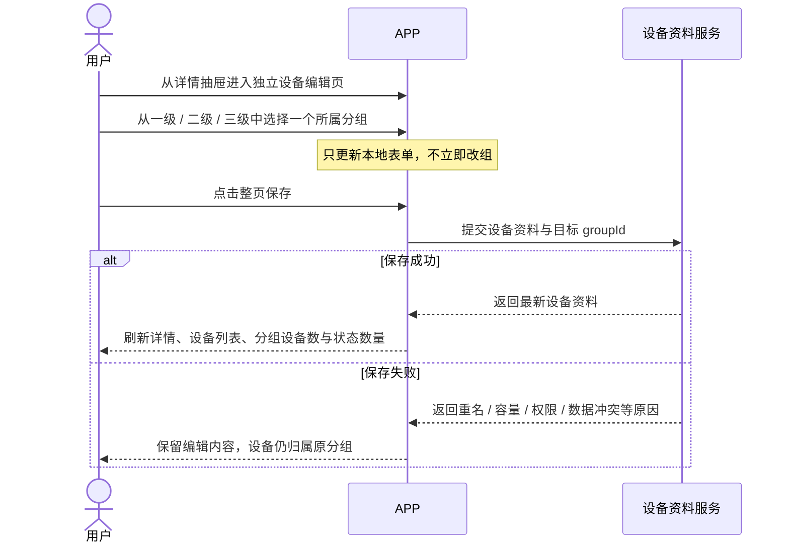
```mermaid
sequenceDiagram
    actor User as 用户
    participant App as APP
    participant Service as 设备资料服务
    User->>App: 从详情抽屉进入独立设备编辑页
    User->>App: 从一级 / 二级 / 三级中选择一个所属分组
    Note over App: 只更新本地表单，不立即改组
    User->>App: 点击整页保存
    App->>Service: 提交设备资料与目标 groupId
    alt 保存成功
        Service-->>App: 返回最新设备资料
        App-->>User: 刷新详情、设备列表、分组设备数与状态数量
    else 保存失败
        Service-->>App: 返回重名 / 容量 / 权限 / 数据冲突等原因
        App-->>User: 保留编辑内容，设备仍归属原分组
    end
```

- 设备改组随设备资料整页保存生效；选择分组后取消编辑，不产生变更。
- 保存前后均以分组唯一标识为准，不能使用名称代替 `groupId`。
- 单分组设备容量沿用服务端现有规则，APP 不写死具体上限；超限时保存失败并展示服务端可读提示。
- 改组成功只更新当前账户的设备分组关系，不改变其他个人或企业账户下同一设备的分组。

### 4.10 本期修订结论与易错点

1. **全部分组 ≠ 真实分组**：只存在于设备首页筛选器，不进入分组管理，也不能作为设备归属。
2. **我的分组 ≠ 固定系统组**：只是账号初始化自动创建的普通一级组，可改名、可按空组规则删除。
3. **无未分组状态**：设备必须且只能归属一个一级、二级或三级业务组。
4. **父组不聚合子组设备**：筛选结果、分组设备数和状态数量均按直接归属计算。
5. **入口不能断头**：唯一常规路径为「设备列表 → 分组选择器 → Manage Groups」；标题栏「＋」只负责新增一级组。
6. **分组数据不能从设备反推**：读取归属当前登录账号的全量分组主数据，包含空组及 Web 创建的二、三级组；APP 与 Web 不建立两套分组副本。
7. **APP 只限制多级创建**：APP 新增固定为一级组，但管理页展示一级至三级；当前账号名下任意层级均可重命名、按空组规则删除。
8. **删除不迁移设备**：任意层级存在子组或直属设备均禁止删除；先校验子组，再校验设备，不级联删除或自动迁移。
9. **名称全局精确判重**：跨一级、二级、三级校验；大小写和空格差异视为不同名称。
10. **同名虚拟项与业务组可共存**：虚拟「全部分组」固定置顶且无 Level；真实一级组允许同名，展示直属设备数和 Level 1，以此区分。
11. **数量按页面区分**：设备首页分组选择器展示服务端返回的账户总数 / 各组直属设备数；分组管理页不展示 `Devices: N`，旧 UI 稿中的数量行已废止。
12. **名称上限按产品版本区分**：海外版新增 / 重命名均为 1～40 字符，并在弹窗展示 `Group name (1–40 characters)`；国内版对应为 1～15 字符。不按界面语言动态切换。
13. **返回时保留有效选择**：管理页返回后重新查询；原选中 `groupId` 有效则保留，已删除或失权则回退虚拟「全部分组」。
14. **跨端以服务端数据为准**：打开选择器 / 管理页时获取最新数据，Web 端结构变更不得被 APP 缓存覆盖。
15. **本节只定义分组管理及其直接联动**；整群轨迹、围栏统计和批量指令的独立业务流程不在本节展开。

---

## 5. 设备详情抽屉与资料编辑（US-018）

<aside>
🎯

**本节范围**：设备详情查看态由独立页面调整为设备列表上的半屏抽屉；资料编辑继续使用独立编辑页。详情抽屉只展示设备摘要、状态、型号、电量、最后有效定位、到期时间与 ICCID；独立编辑页只保留设备备注、所属分组和定位频率。联系人、联系电话、创建时间不再进入 APP 设备详情与编辑模型。物联网卡在详情抽屉仅展示 ICCID，不展开卡状态、流量套餐或二级查询流程。
</aside>

### 5.1 半屏详情抽屉的入口、标题与关闭

**入口与页面定位**

1. 点击设备卡片本体，在当前设备列表上方打开该设备的半屏详情抽屉，不跳转旧独立详情查看页。
2. More 菜单不再提供 `Device Information`；详情抽屉唯一入口为设备卡片本体。
3. 在线、离线、未连接、告警设备均可打开详情抽屉；查询必须携带设备唯一标识，不以备注、卡号、ICCID 或列表位置作为身份。
4. 打开设备 B 前必须清理设备 A 的详情数据；连续点击不同设备时，标题、状态、位置、电量、到期时间和 ICCID 不得串用。

**标题区**

| 元素 | 展示规则 |
| --- | --- |
| 设备图标 | 与列表使用同一设备类型图标及状态视觉规则。 |
| 主标题 | 有备注时显示“备注（卡号）”；无备注时直接显示卡号。备注和卡号只用于展示，不作为查询身份。 |
| 状态标签 | 完全沿用列表的在线、离线、告警模型；告警设备保留在线 / 离线底层差异。 |
| 关闭按钮 | 点击标题区右侧下箭头关闭抽屉。 |

**关闭与列表恢复**

1. 点击下箭头、点击抽屉外空白区域、点击系统返回虚拟键均关闭抽屉。
2. 不要求通过下滑手势关闭。
3. 关闭后保留原状态筛选、分组、关键词、列表数据与滚动位置，不重新跳到列表顶部。

### 5.2 详情抽屉字段、格式与空值规则

| UI 字段 | 数据来源 | 有效值展示 | 缺失 / 非法值 |
| --- | --- | --- | --- |
| 类型 | 设备主数据中的实际硬件型号 | 展示后端返回的实际型号，如 `S18`；前端不得从备注、卡号或图标推断 | 隐藏整个字段 |
| 电量 | 设备最新有效电量 | 0～100%；<20% 使用红色，≥20% 使用绿色，与列表规则同源 | 隐藏整个字段，不按 0% 处理 |
| 经度 | 最后一条完整有效定位记录 | 转为度分秒，秒保留两位小数，追加 E / W | 与纬度、定位时间成组隐藏 |
| 纬度 | 与经度相同的有效定位记录 | 转为度分秒，秒保留两位小数，追加 N / S | 与经度、定位时间成组隐藏 |
| 定位时间 | 与经纬度相同的有效定位记录 | 按当前 APP 时区转换为 `YYYY-MM-DD HH:mm:ss` | 与经纬度成组隐藏 |
| 到期时间 | 管理端维护的服务到期日期 | 只展示 `YYYY-MM-DD`；不增加临期、过期文案或颜色 | 隐藏整个字段 |
| ICCID | 当前设备关联物联网卡记录 | 按字符串原值完整展示；不转数值、不插入分组空格、不丢前导零，过长允许换行 | 隐藏整个字段 |

**最后有效定位的完整性规则**

1. 经度、纬度、定位时间必须来自同一条最后有效定位记录，不得跨记录拼接。
2. 经度范围为 `[-180, 180]`，纬度范围为 `[-90, 90]`；任一越界、缺失或类型非法时，三项全部隐藏。
3. 十进制度统一转换为度分秒；秒四舍五入后达到 60 时必须正确向分、度进位。
4. 东经使用 `E`、西经使用 `W`、北纬使用 `N`、南纬使用 `S`，例如 `113°59'42.14"E`。
5. 设备恢复通信但尚无新有效定位时，继续展示上一条有效位置及其原定位时间，不得用通信时间冒充定位时间。
6. 切换 APP 时区后仅转换定位时间，经纬度与定位记录身份不变。

### 5.3 底部入口、刷新、异常与独立编辑页

**底部快捷入口**

| 入口 | 行为 | 离线设备 |
| --- | --- | --- |
| 轨迹 | 进入当前设备历史轨迹页，携带设备唯一标识 | 允许进入并查看已有历史轨迹 |
| 追踪 | 进入当前设备实时追踪页，携带设备唯一标识 | 允许进入，由追踪页展示离线态 |
| 编辑 | 进入独立设备编辑页 | 允许进入；备注、分组可编辑，定位频率置灰 |
| 位置 | 跳转首页地图模块并聚焦当前设备最后有效定位；不下发 CR 或立即定位指令 | 只要存在完整有效经纬度即可进入 |

1. 只有存在完整有效经纬度时才展示「位置」入口；无有效定位时直接隐藏，不跳转、不提示。
2. 展示位置入口时四项等宽；隐藏位置入口后三项重新等宽铺满，不保留空槽。
3. 所有入口以设备唯一标识确定目标，不能因备注相同或排序变化串到其他设备。

**加载与刷新**

1. 每次打开抽屉均按设备唯一标识请求最新详情。
2. 抽屉停留期间复用设备列表既有刷新周期更新状态、电量和最后有效定位，不新增抽屉独立轮询。
3. 加载失败时保留当前设备标题身份，清空内容区旧数据，在抽屉内展示失败原因和重试入口，不自动关闭抽屉。
4. 查询设备 A 失败或切换到设备 B 时，不得展示 A 的缓存字段冒充 B 的详情。
5. 抽屉打开期间设备被解绑或当前账户失去可见权限时，立即清空受保护数据、关闭抽屉、提示设备不可用并刷新列表。

**独立编辑页**

| 字段 | 必填性 | 校验与保存规则 |
| --- | --- | --- |
| Device Name（设备备注） | 非必填 | 0～40 字符，支持 Unicode；去除首尾空格，纯空格归一为空，内部空格保留，允许重名 |
| Group | 必填 | 必须选择当前账户有权使用的真实一级 / 二级 / 三级 `groupId`；不允许虚拟「全部分组」或空分组，保存前重新校验有效性与权限 |
| Location Interval | 条件必填 | 三个预设或 1～1440 整数分钟；只有用户明确选择时形成频率意图，设备离线时置灰并显示「设备离线，无法下发指令」 |

1. 点击详情抽屉底部「编辑」进入独立编辑页，不在抽屉内切换编辑态。
2. 联系人、联系电话及电话国家 / 地区选择器从 APP 设备编辑能力中移除。
3. 用户返回或取消编辑时，备注、分组及已暂存频率全部丢弃，不自动保存、不弹二次确认。
4. 只修改备注或分组时不创建 `UPLOAD`；定位频率仍按 5.4～5.7 的指令模型处理。
5. 普通资料保存成功后刷新设备列表和详情抽屉；备注变更后列表标题、搜索结果与抽屉标题同步更新，改组后刷新相关分组数量。

### 5.4 定位频率的数据模型与展示口径

<aside>
❗

**必须区分：最后确认值、编辑目标值、设置中目标。** 用户选中目标、接口受理、指令进入 `SENDING` 或 TCP 写出为 `SENT`，均不能直接证明终端已经按该频率运行。
</aside>

| 概念 | 定义 | 页面用途 |
| --- | --- | --- |
| 最后确认值 | 最近一次由后端按对应 `commandId` 匹配成功反馈后确认的 `UPLOAD` 参数 | 设备列表卡片第三行；独立编辑页无在途目标时的频率值 |
| 编辑目标值 | 用户在独立编辑页的频率弹层中选择并暂存、尚未点击整页 `Save` 的值 | 仅存在于本地编辑表单，不作为已生效值 |
| 设置中目标 | 最新一条有效 `UPLOAD` 指令的目标值，记录处于 `SENDING / SENT` 且尚无后端确认成功结果 | 独立编辑页显示「目标值 +（设置中）」；只展示最新一条在途目标，详情抽屉不展示频率 |
| 无最后确认值（内部状态） | 当前账户 / 设备没有任何可证明成功的历史 `UPLOAD` 确认值 | 独立编辑页的频率选择框显示“请选择定位频率”；不得将内部状态名直接展示给用户，也不得自动推定为 10 分钟 |

**页面展示分工**

1. **设备列表卡片**只展示最后确认值；存在设置中目标时仍展示原确认值，不把目标值冒充已生效值。
2. **独立设备编辑页**有设置中目标时只展示最新目标 +「设置中」；无在途目标时展示最后确认值，若无最后确认值则展示“请选择定位频率”。失败 / 真正取消且没有其他在途目标时，恢复最后确认值或“请选择定位频率”。详情抽屉不展示定位频率。
3. **指令记录页**展示具体 `commandId`、四态、发送时间、反馈内容和失败原因；频率 `UPLOAD` 与普通单设备指令记录使用同一记录链路。
4. 编辑页数据接口必须能区分最后确认值与最新在途目标，至少返回或可按同一权限可靠取得确认值、目标值、`commandId`、指令状态及后端归一化结果；APP 不得仅凭一个裸 `uploadIntervalSec` 猜测展示状态。

**成功确认与指令关联**

```text
APP / 平台发送：[3G*设备号*LEN*UPLOAD,600]
服务端创建：commandId = C123
设备 / 网关反馈：由后端按 C123 关联并判定
```

1. 每条频率指令都有独立 `commandId`（或等价事件 ID），下发、网关处理、设备反馈和指令记录必须贯穿同一关联键。
2. 后端负责校验预期 `UPLOAD,interval` 与实际反馈内容是否匹配，并返回归一化成功 / 设置中 / 失败结果；APP 不解析协议、不按反馈文案自行判定。
3. 只有后端按 `commandId` 判定对应反馈成功，才更新最后确认值；`SENDING`、`SENT`、平台受理或 TCP 写出均不能覆盖最后确认值。
4. **频率设置即普通指令**：独立设备编辑页、Send Command、批量下发、指令记录页重发四个入口的 `UPLOAD` 平等；只要入口校验通过且设备在线即可进入指令流程，不做跨入口「同刻仅一条」拦截。
5. 同一设备允许多条频率指令并行；独立编辑页只展示最新一条有效在途目标。旧指令仍按自身 `commandId` 独立流转，旧回执不得覆盖编辑页最新目标。
6. 最新指令失败 / 取消时，如仍有更早的有效在途指令，独立编辑页回退展示最新剩余在途目标；没有在途指令时才展示最后确认值，若无最后确认值则显示“请选择定位频率”。
7. 定位频率与 APP 在线刷新间隔分别管理；前者控制设备位置上传周期，后者只控制 APP 页面取数。
8. 频率任务层完全绑定指令记录四态（`SENDING / SENT / FAILURE / CANCEL`），不设独立的 30 秒超时终判，联动规则见 5.7。

**分钟值与展示文案映射**

| 类型 | 分钟值 | `UPLOAD` 参数 | 编辑页 / 弹层文案 |
| --- | ---: | ---: | --- |
| 预设一 | 1 | 60 秒 | 1 分钟（耗电模式） |
| 预设二 | 10 | 600 秒 | 10 分钟（默认模式） |
| 预设三 | 60 | 3600 秒 | 1 小时（省电模式） |
| 自定义 | 1～1440 的其他整数 | 分钟 × 60 秒 | 自定义模式（N 分钟） |

- 「耗电模式 / 默认模式 / 省电模式」只由分钟值自动映射，不是终端另行上报的独立模式标识，也不新增运行模式命令、低电阈值或续航承诺。
- 当前确认值为 1 / 10 / 60 分钟时，打开弹层自动选中对应预设；其他合法值自动选中 Custom 并填入 N。
- 处于“无最后确认值”的内部状态时，弹窗保留四个可选目标，选择框默认显示「请选择定位频率」，不预选任何选项；只有用户明确选择合法目标后才形成频率设置意图。
- 用户明确选择与当前最后确认值相同的频率并整页保存时，仍创建新的 `UPLOAD`，用于重新确认终端配置。
- 用户再次明确确认当前最新在途目标时，也创建新的 `UPLOAD`；不能用「设备 + 秒数」简单去重误伤合法设置意图。

### 5.5 定位频率与绑定、在线状态的关系

1. **定位频率移出绑定流程**：绑定只建立账户归属和分组关系，不要求填写、暂存或下发定位频率。
2. **绑定不要求设备在线**：离线设备可以完成绑定，不创建等待上线后自动执行的频率任务。
3. **刚绑定的正常初始态**：若平台没有该设备历史成功 `UPLOAD` 记录，独立编辑页的频率选择框显示“请选择定位频率”；详情抽屉不展示频率，不得直接显示技术状态名称或自动显示 10 分钟。
4. **离线只禁频率入口，不禁资料编辑**：独立编辑页已确认设备离线时，频率行置灰并显示「设备离线，无法下发指令」；设备备注与当前账户分组仍可编辑和保存。
5. **提交前重校验**：打开编辑页时在线、点击整页 Save 前变离线时，资料接口仍独立提交；频率接口按普通指令入口重新校验并拦截，不创建静默等待上线任务。若频率已经通过在线校验进入 `SENDING` 后设备才离线，则继续按队列式指令逻辑执行，不回退为入口离线失败。
6. **无静默补发**：频率失败后设备恢复在线，不自动补发；用户只能通过指令记录页重发，或重新进入独立编辑页明确选择目标并保存。

### 5.6 整页保存、部分成功与防重复

设备备注 / 当前账户分组保存与定位频率设置是独立编辑页同一次用户操作中的两个独立结果。APP 同时发起两个接口，但不把它们包装成一个不可拆分的事务，也不因一方失败回滚另一方。

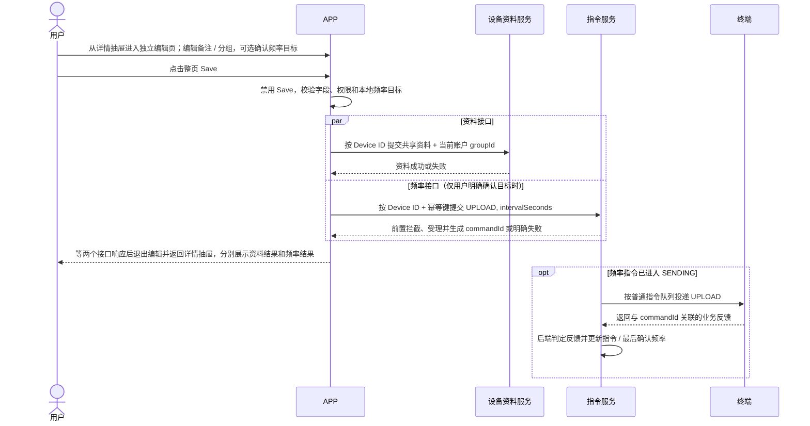
```mermaid
sequenceDiagram
    actor User as 用户
    participant App as APP
    participant Profile as 设备资料服务
    participant Command as 指令服务
    participant Device as 终端

    User->>App: 从详情抽屉进入独立编辑页；编辑备注 / 分组，可选确认频率目标
    User->>App: 点击整页 Save
    App->>App: 禁用 Save，校验字段、权限和本地频率目标
    par 资料接口
        App->>Profile: 按 Device ID 提交共享资料 + 当前账户 groupId
        Profile-->>App: 资料成功或失败
    and 频率接口（仅用户明确确认目标时）
        App->>Command: 按 Device ID + 幂等键提交 UPLOAD, intervalSeconds
        Command-->>App: 前置拦截、受理并生成 commandId 或明确失败
    end
    App-->>User: 等两个接口响应后退出编辑并返回详情抽屉，分别展示资料结果和频率结果
    opt 频率指令已进入 SENDING
        Command->>Device: 按普通指令队列投递 UPLOAD
        Device-->>Command: 返回与 commandId 关联的业务反馈
        Command->>Command: 后端判定反馈并更新指令 / 最后确认频率
    end
```

| 资料接口结果 | 频率接口结果 | 页面处理 |
| --- | --- | --- |
| 成功 | 未产生频率意图 | 退出编辑并返回详情抽屉；抽屉与列表刷新备注和分组关联结果 |
| 成功 | 受理并进入 `SENDING` | 退出编辑并返回详情抽屉；频率状态在下次进入独立编辑页时展示目标值 +「设置中」，列表仍展示最后确认值 |
| 成功 | 前置拦截 / 离线 / 参数错误 / 明确拒绝 | 备注 / 分组不回滚；独立提示“频率未更新”和原因，频率保持最后确认值或“请选择定位频率” |
| 失败 | 未产生频率意图 | 保留资料编辑内容并展示资料失败原因 |
| 失败 | 频率独立受理或失败 | 两部分分别展示；不因资料失败取消已创建的频率指令，也不因频率失败回滚资料 |
| 任意 | 客户端超时、服务端结果未知 | 不自动新建指令；按已有 `commandId` 查询原记录，按四态结果恢复页面状态 |

**频率设置意图与防重复**

1. 只进入编辑页、只打开弹层、取消弹层或未改变普通资料，不创建 `UPLOAD`。
2. 用户在弹层明确选择并确认目标，整页 `Save` 时才创建频率指令。
3. 当前确认值与目标值相同，只要用户明确确认，仍创建新的 `UPLOAD`，用于重新确认终端配置。
4. 当前已有在途目标时，用户再次明确确认同一目标，也创建新的 `UPLOAD`；不能按设备和秒数简单去重。
5. 首次点击 Save 后按钮进入 loading 并禁用，完成两个接口当前响应前不允许再次点击。
6. 每次整页 Save 生成唯一 `operationId` / 幂等键；服务端按幂等键去重，确保一次用户操作最多生成一条频率 `UPLOAD`。
7. 网络超时、重连或重复请求只查询原 `commandId`，不得新建重复指令。
8. 资料接口与频率接口分别返回结果；已成功保存的资料不因频率失败回滚。

### 5.7 异步状态与指令四态联动（对齐 S10U / 指令记录大纲）

> 指令交互层（记录状态、网关队列、30 天丢弃、取消 / 重发）一律以 `S10U 指令交互状态逻辑点梳理.md` 与 `革泰 APP 指令记录逻辑点梳理 plan.md` 为准线。频率任务层不设独立超时终判，**完全绑定指令记录四态**；不使用 `ACKED` 作为用户可见状态：

1. 平台受理频率指令后，APP 不等待终端 ACK 才退出编辑；资料结果和频率结果分别回显。
2. 设置中只在独立编辑页展示**最新目标值 +「设置中」**，例如 `1 小时（省电模式）（设置中）`；详情抽屉不展示定位频率，不能把目标值当作已生效值。
3. 设备列表卡片只展示最后确认值；无最后确认值时隐藏定位频率；独立编辑页无在途目标时展示最后确认值或“请选择定位频率”。
4. 设置中状态由服务端持久化。用户退出编辑页或重启 APP 后，重新进入独立编辑页仍能恢复最新在途目标和任务状态。
5. 设置中仍允许提交新频率目标（后发优先，无单任务锁）；独立编辑页只展示最新有效在途目标，旧记录在指令记录页独立流转。
6. 设备已确认离线时频率行置灰；若已通过在线校验进入 `SENDING` 后才掉线，则继续按网关队列逻辑执行。

| 指令记录事件 | 独立编辑页频率展示 |
| --- | --- |
| 前置闸门拦截（不创建记录） | 有最后确认值则保持该值，无最后确认值则显示“请选择定位频率”，可重新提交 |
| `FAILURE`（复检失败 / 网关失败 / 白名单 / 30 天网关丢弃） | 有其他在途目标则回退到最新剩余目标；否则恢复最后确认值，若无最后确认值则显示“请选择定位频率” |
| `CANCEL`（未写出、真正取消成功） | 有其他在途目标则回退到最新剩余目标；否则恢复最后确认值，若无最后确认值则显示“请选择定位频率”，可重新提交 |
| `CANCEL` 回写 `SENT`（乐观取消回跳，设备实际会收到） | 维持该目标 +「设置中」，继续等后端按 commandId 判定反馈 |
| `SENDING`（滞留队列）/ `SENT` 无成功反馈 | 最新在途目标 +「设置中」 |
| `SENT` + 后端按 commandId 判定反馈成功 | 更新最后确认值；若仍有更新的在途目标，独立编辑页继续展示该最新目标 +「设置中」 |
| `SENT` + 后端按 commandId 判定反馈失败 / 拒绝 | 发送记录按统一指令记录保留反馈；有其他在途目标则回退到最新目标，否则恢复最后确认值，若无最后确认值则显示“请选择定位频率”，并提示本次设置失败 |
| 指令记录页「重新发送」 | 沿用普通指令重发规则，产生新的底层 commandId；最新目标重新进入「设置中」 |

5. 确认值更新不分来源入口：独立设备编辑页、Send Command、批量下发、记录页重发产生的 `UPLOAD`，均由后端按 commandId 判定成功后更新。
6. 同一设备多条在途指令按各自 commandId 独立流转；旧回执不得覆盖独立编辑页最新目标。
7. 用户已离开编辑页时不发送系统推送或站内消息；下次进入独立编辑页读取最终结果，失败时展示一次可读提示，状态由服务端持久化恢复。

**状态流转**

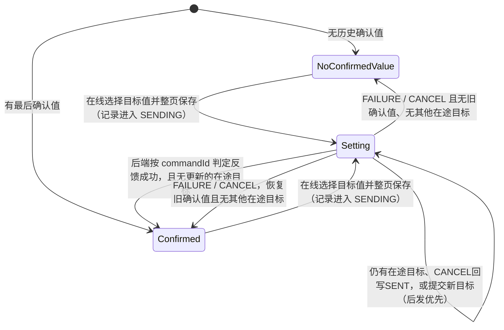
```mermaid
stateDiagram-v2
    [*] --> NoConfirmedValue: 无历史确认值
    [*] --> Confirmed: 有最后确认值
    NoConfirmedValue --> Setting: 在线选择目标值并整页保存（记录进入 SENDING）
    Confirmed --> Setting: 在线选择目标值并整页保存（记录进入 SENDING）
    Setting --> Confirmed: 后端按 commandId 判定反馈成功，且无更新的在途目标
    Setting --> NoConfirmedValue: FAILURE / CANCEL 且无旧确认值、无其他在途目标
    Setting --> Confirmed: FAILURE / CANCEL，恢复旧确认值且无其他在途目标
    Setting --> Setting: 仍有在途目标、CANCEL回写SENT，或提交新目标（后发优先）
```

### 5.8 跨账户同步与并发覆盖

1. Device Name（设备备注）为**设备级共享字段**。个人与企业双绑时读取同一份数据，任一有权限账户保存后，其他关联账户及管理端读取新值。联系人与联系电话已从 APP 设备资料模型移除。
2. Group 是**账户级关系字段**，只更新当前账户下的 `groupId`，不改变另一账户对同一设备的分组。
3. 所有可见设备均允许编辑设备备注与当前账户分组；定位频率按普通 `UPLOAD` 指令入口校验在线状态，进入 `SENDING` 后按网关队列逻辑执行（并发规则见 5.4）。
4. 两个账户并发修改同一共享字段时采用**后写覆盖先写**，不做版本冲突拦截；各端刷新后以服务端最终值为准。
5. 设备首次绑定时，Device Name（备注）写入当前绑定账号昵称快照；账号昵称后续变化不回写。
6. 设备已有非空名称时，另一类账户新增绑定仍以新绑定账号昵称覆盖设备级名称，并同步影响已有账户；解绑后重绑同样重置。
7. APP 不建立设备备注或定位频率的账户独立副本；详情抽屉标题、设备列表标题与关键词搜索读取同一份设备备注。
8. 备注 / 分组保存成功后刷新详情抽屉与设备列表；备注变更后列表展示与搜索结果同步更新，改组后刷新相关分组直属设备数与状态数量。

### 5.9 易错点与验收红线

1. **设备名称、昵称、备注不是三个字段**：当前统一为 Device Name（设备名称 / 备注）一份设备级数据。
2. **定位频率选项不等于已生效值**：选项只用于形成目标值；列表展示最后确认值，独立编辑页有在途目标时展示目标值 +「设置中」，详情抽屉不展示频率。
3. **无后端成功反馈不得更新确认值**：平台受理、进入 SENDING、TCP 写出为 SENT 或用户看到目标选中态，都不能替代后端按 commandId 判定的成功反馈。
4. **无最后确认值不等于 10 分钟**：刚绑定、存量无记录、首次设置失败或真正取消且无旧确认值等场景均可能进入“无最后确认值”内部状态；卡片和详情抽屉隐藏定位频率，独立编辑页选择框显示「请选择定位频率」。
5. **离线只禁频率，不禁资料编辑**：不能因为设备离线阻止修改设备备注或当前账户分组；已进入 SENDING 后掉线按队列逻辑执行。
6. **部分成功不能伪装全部失败或全部成功**：资料接口与频率接口并行，资料成功、频率失败时资料不回滚，必须明确提示频率未更新。
7. **频率并发后发优先**：频率设置即普通 `UPLOAD` 指令，四入口平等、不设跨入口单任务锁；每条指令以独立 commandId 关联，独立编辑页只展示最新有效在途目标，旧回执不得覆盖新目标。
8. **频率任务绑定指令四态**：SENDING / SENT 且无后端成功反馈时为设置中；FAILURE / 真正 CANCEL 后回退到最新剩余在途目标、最后确认值或“无最后确认值”内部状态；卡片和详情抽屉隐藏无确认值，独立编辑页显示「请选择定位频率」；CANCEL 回写 SENT 仍维持设置中；不存在独立的 30 秒超时终判、ACKED 用户态或离线静默补发。
9. **共享备注与账户分组不能混存**：设备备注跨账户同步，分组只影响当前账户；联系人和联系电话不再属于 APP 设备资料。
10. **编辑页接口必须提供分层频率状态**：APP 不能仅凭裸 uploadIntervalSec 区分确认值与在途目标；服务端需提供或可靠查询确认值、目标值、commandId、状态和归一化结果。
11. **可见设备可编辑不等于可以越权构造请求**：服务端必须按当前登录账户与 Device ID 校验可见范围和操作权限。

---

## 6. 设备入口的告警与指令（US-019 / US-020～022）

### 6.1 设备入口告警调整

1. 设备卡片 More 菜单已移除「设备告警记录」，详情抽屉底部也不提供告警入口。
2. 设备列表不再直接进入单设备告警记录页；原 `Device Alert History` 跳转流程和设备入口处理规则从本模块验收范围删除。
3. 告警查看、历史报警和处理能力统一从告警模块现有入口进入，仍须按当前账户权限和设备唯一标识限制数据范围。
4. 本次只移除设备列表入口，不删除已经产生的历史告警数据，也不改变告警中心自身的查询、处理和只读历史规则。

### 6.2 设备入口指令

**本节修订范围**：仅调整设备列表单设备入口的页面跳转逻辑；批量下发、「我的 → 指令记录」及指令记录页重发沿用各自指令模块规则，不在本节重复定义。

| 规则 | 说明 |
| --- | --- |
| 入口可达性 | 当前账户可见的设备，不区分在线、离线、未连接或告警状态，均可从设备列表更多菜单进入设备指令详情页。 |
| 跳转目标 | 进入当前被点击设备对应的设备指令详情页，不因通信状态不同改变目标页面。 |
| 设备身份 | 跳转必须携带被点击设备的唯一标识；不得使用设备名称、备注或列表位置作为身份。 |
| 历史记录 | 设备指令详情页可查看当前设备的历史指令记录；离线、未连接或告警状态不得阻断历史记录查看。 |
| 具体指令下发 | 用户选择具体指令后的下发前置判断、参数校验、提交结果及执行闭环，沿用单设备指令下发模块规则；本节不将其前置到页面入口。 |
| 权限与关系失效 | 设备已不在当前账户可见范围、设备唯一标识无效或当前账户无权访问时，按统一权限与数据访问规则处理，不得展示越权指令记录。 |

---

## 7. 新设备类型接入与跨端一致性（US-032）

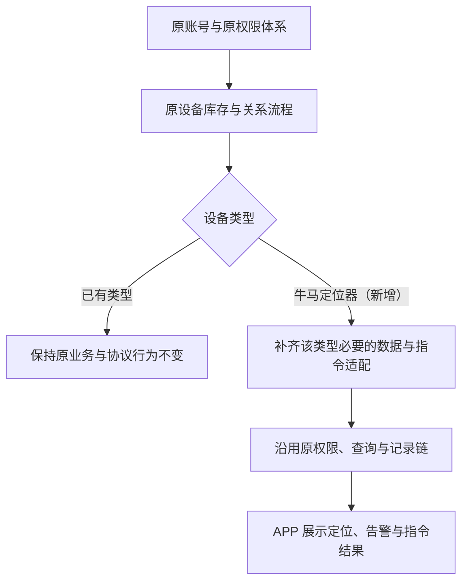
```mermaid
flowchart TD
    A["原账号与原权限体系"] --> B["原设备库存与关系流程"]
    B --> C{"设备类型"}
    C -->|"已有类型"| D["保持原业务与协议行为不变"]
    C -->|"牛马定位器（新增）"| E["补齐该类型必要的数据与指令适配"]
    E --> F["沿用原权限、查询与记录链"]
    F --> G["APP 展示定位、告警与指令结果"]
```

- **接入判定标准**：新类型必须能完整走通**库存 → 绑定 → 分组 → 列表 → 查询**；只改显示名称不算完成接入。
- **协议不兼容时**：只隔离必要的协议适配边界，仍复用原业务平台，不新建授权入口或独立设备事实库。
- **跨端一致性必测项**：App、监控平台、管理后台三端的**账号、设备归属、分组、SIM 状态、在线状态、到期时间**一致。
- **存量回归**：旧设备类型、旧多边形围栏、原告警同步、原历史分页不因新增类型出现规则变化。

---

## 8. 边界值与等价类速查

| 校验对象 | 有效值 | 无效值 / 边界行为 |
| --- | --- | --- |
| 分组名称长度 | 海外版：1 字符、40 字符；国内版：1 字符、15 字符 | 空；海外版 41 字符；国内版 16 字符；账户内重名。新增与重命名弹窗展示当前产品版本对应范围 |
| 分组删除 | 无子组且无直属设备时，二次确认后删除 | 有子组或直属设备时禁止删除；不得隐式迁移或删除设备，本期不存在「未分组」 |
| 设备电量 | 0～100 有效百分比；<20% 红色，≥20% 绿色 | 缺失、非法、负数或 >100 → 列表隐藏图标与数值、详情抽屉隐藏字段，**不按 0% 处理** |
| 低电阈值 | 19%、0% 使用低电红色 | 20%、21% 使用正常绿色；阈值不随上传间隔、账户类型变化 |
| 详情定位坐标 | 经度 [-180,180]、纬度 [-90,90]，转换为度分秒且秒保留两位，追加 E/W/N/S | 任一经纬度或定位时间缺失 / 非法 → 三项成组隐藏；不得展示半个坐标或跨记录拼接 |
| 上传间隔自定义 | 1 分钟、1440 分钟 | 空、0、1441、小数、非整数 |
| 上传间隔换算 | 1→60、10→600、60→3600 秒 | 1 小时按 1 分钟发送（错误） |
| APP 刷新间隔 | 30 秒（默认）、60 秒、仅手动 | 改刷新间隔联动改变设备上传间隔（错误） |
| 设备搜索 | 编号 / 名称 / 备注 / 序列号，含匹配 | 展示一份备注却检索另一份备注 |
| 状态计数 | 在线 + 离线 = 总数 | 在线 + 离线 + 告警 = 总数（错误） |
| APP 登录范围 | 个人、企业一级、企业二级、企业三级均可登录 | 企业账号被错误拦截；不同层级账号串用同一设备范围 |
| 直接绑定入口 | APP / Web = 个人账号、企业一级账号；管理后台 = 仅为企业一级账号代绑 | 二 / 三级出现绑定入口或绑定成功；个人成为后台代绑目标 |
| 企业设备分配 | 一级 → 二级、二级 → 三级，仅在监控平台 Web 逐级分配 | APP 出现向下分配入口；一级越级分配给三级；把「分配成功」判为「绑定成功」 |
| 重复绑定 | 提示已绑定，记录仍为 1 条 | 列表出现两条、数量 +1 |
| 双绑 | 个人 + 企业一级各 1 个绑定共存 | 因已有另一类绑定单独拒绝；把二 / 三级分配也计入唯一性名额 |
| 解绑范围 | 仅清理本账户及下游 | 连带清除父级有效绑定 / 删除设备 / 删除历史告警 |
| 卡状态 | 预开通 / 未激活 / 在用 / 停机 / 已拆机 | 出现第六种状态或空白无提示 |
| 定位频率展示 | 预设文案、N 分钟（自定义）、未知 | 无依据时显示「10 分钟（默认模式）」 |

---

## 9. 权限与存量兼容约束

| 前置状态 | 触发动作 | 系统行为 |
| --- | --- | --- |
| 企业一级账号 | 登录 APP 并绑定设备 | 登录成功；按企业一级绑定槽位、配额、同类占用及其他绑定前置执行 |
| 企业二 / 三级账号 | 登录 APP / 监控平台 Web | 登录成功；只加载直属父级逐级分配的设备，不因可登录而获得直接绑定权 |
| 企业二 / 三级账号 | 在 APP / 监控平台 Web 尝试绑定设备 | 无绑定入口；即便构造请求，服务端同样拒绝，只能由直属父级分配 |
| 企业一级 / 二级账号 | 尝试在 APP 向直属下级分配设备 | APP 不提供向下分配入口；一级 → 二级、二级 → 三级仅在监控平台 Web 完成 |
| 管理后台为一级账号绑定设备 | 二 / 三级账号查看设备列表 | 未分配前不可见；需一级 → 二级 → 三级逐级分配后才进入范围 |
| 企业子账号仅可见指定设备 | 请求授权范围外设备 | 执行原服务端校验，不因新客户端扩权 |
| 设备未入库 | 在 APP 输入编号绑定 | 明确报错，不允许绑定 |
| 设备未激活 / 无 SIM / SIM 异常 | 绑定 | 不作为绑定前置；其他绑定条件满足时允许建立归属关系，绑定后的通信与状态展示按实际情况处理 |
| 账号设备配额已满 | 绑定或被分配设备 | 拦截并提示配额限制 |
| 个人与企业双绑同一设备 | 个人修改分组 | 企业侧分组不变 |
| 个人与企业双绑同一设备 | 有权限方修改共享备注 | 按原服务端同步范围生效，双方读取同一结果 |
| 当前账户解除绑定 | 查看另一类账户 | 另一类账户独立有效的绑定继续保留 |
| 一级账号解绑设备 | 查看二 / 三级 | 已分配给子级的关联关系一并失效（唯一级联） |
| 一级账号执行「同步分组和设备」 | 二级账号查看分组 | 二级原有分组被**全量覆盖**，属高破坏性操作 |
| 一级账号执行「仅分配设备」 | 二级账号查看分组 | 原分组保留，新设备进入「我的分组」 |
| 账号被冻结 | 在 APP 访问设备业务 | 沿用原冻结结果拦截；冻结期间设备数据照常入库 |
| 服务到期 | 在 APP / 监控平台查看 | 只读或按原规则降级，无自助续费入口 |
| 新增牛马定位器类型上线 | 回归旧设备类型业务 | 旧类型的绑定、围栏、告警、指令规则不变 |
| 管理后台修改设备备注 | 各端查看 | 按共享设备资料规则写入，所有关联账号视角同步刷新 |

---

## 10. 关键规则说明

1. **设备身份**：一切选择、查询、跳转、批量去重都以**设备唯一标识**为准，不以设备名称代替。
2. **通信状态**：只有在线与离线；未明确在线一律默认离线，并按离线规则禁止提交新指令。该默认映射**只作用于通信状态展示与计数**，不适用于定位、配置值或围栏判定基线。
3. **告警叠加**：告警是可叠加分类而非第三种通信状态；设备数与记录数分别统计。
4. **去重口径**：同一账户通过多条可见关系访问同一设备只计一台；同一批次同一设备只提交一次指令。
5. **登录、绑定与分配相互独立**：个人、企业一级、企业二级、企业三级均可登录 APP；个人与企业一级可通过 APP / 监控平台 Web 直接绑定，企业一级还可由管理后台代绑。企业二、三级只能由直属父级通过监控平台 Web 逐级分配，**分配不等于绑定**；APP 不提供企业向下分配入口。绑定、分组、围栏关系按账户分别管理，设备位置、电量、状态是同一份事实。
6. **解绑边界**：账户解绑、围栏解绑、设备删除三者互不等同；父级 / 子级清理方向必须区分。
7. **资料同步**：Device Name（设备备注）为设备级共享字段，APP 不建立账户独立覆盖值；分组仍按账户独立管理，备注展示与搜索必须同源；联系人和联系电话已从 APP 设备资料模型移除。
8. **定位频率**：设备上传间隔与 APP 刷新间隔分别管理；设备列表展示最后确认值，详情抽屉不展示频率，独立编辑页有在途目标时展示目标值 +「设置中」；只有后端按 commandId 判定反馈成功后才更新最后确认值；频率任务层完全绑定指令记录四态（见 5.7）。
9. **详情抽屉只读边界**：型号、电量、最后有效定位、到期时间和 ICCID 均不可在抽屉修改；空值按字段隐藏，定位三项成组隐藏。备注、分组和定位频率只在独立编辑页修改。
10. **存量优先**：新类型在原库存、身份、绑定、查询与协议链内补齐；只有原契约无法表达已定需求时才作向后兼容扩展，旧调用默认行为保持。

## 11. 参考文档

- [革泰 APP 产品需求文档](https://app.notion.com/p/APP-3d75667c6d3a800e938af02c795b6fcf?pvs=21)：US-015 筛选设备并打开快捷操作 / US-016 绑定牛马定位器 / US-017 管理账户内设备分组 / US-018 设备详情抽屉、编辑资料并查询物联网卡 / US-019 告警能力（设备列表入口已按最新原型移除） / US-032 在原平台接入牛马定位器类型；「用户与角色」章、「全局业务规则」章
- [革泰 APP 登录与注册逻辑点梳理.plan](https://app.notion.com/p/APP-plan-6a7ad80968254dbbb4bd514d60d7a86e?pvs=21)：个人与企业账号统一登录、企业层级识别、账号状态与授权范围矩阵
- [设备绑定 / 设备标签 / 归属 — 核心逻辑与隐藏风险](https://app.notion.com/p/9625667c6d3a82949c9f81896c6b3fd8?pvs=21)：参考其中三端绑定入口、唯一性与双绑、解绑级联、分配方式和设备备注单存储；设备标签不再进入当前产品模型
- [天地卫通相关模块核心逻辑梳理 ](https://app.notion.com/p/9225667c6d3a834a969701209a2dff27?pvs=21)：设备绑定逻辑、标签起始与派生表、账号冻结与过期
- [北斗位置监控平台使用说明书20260421](https://app.notion.com/p/20260421-bf25667c6d3a839e8d7a01bf1a85076e?pvs=21)：设备管理与用户管理操作口径
- [革泰海外平台一期测试计划（设备业务与公共能力）](https://app.notion.com/p/9d8aa4ed74cb4812b6c0df6a46c24e26?pvs=21)：设备生命周期、SIM 五态与到期、指令闭环、跨端一致性、账号配额
- [革泰海外平台1期-测试A测试排期表](https://app.notion.com/p/1-A-3d75667c6d3a805a8128d5bc40596dad?pvs=21)：App 设备用例设计与监控平台设备用例排期

---

**文档版本**：v2.1（2026-10-08 设备详情原型调整：独立详情查看页改为列表半屏抽屉；查看字段收敛为型号、电量、最后有效定位、到期时间和 ICCID；编辑页仅保留备注、分组、定位频率；移除联系人、电话及 More 中的设备详情 / 设备告警记录入口）

**最后更新**：2026-10-08

**维护人**：测试团队