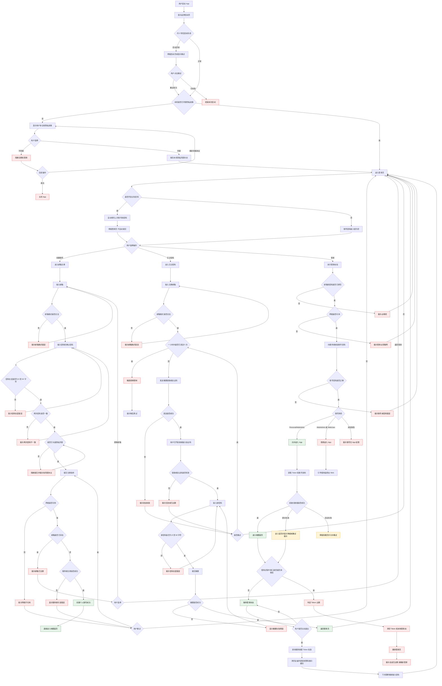
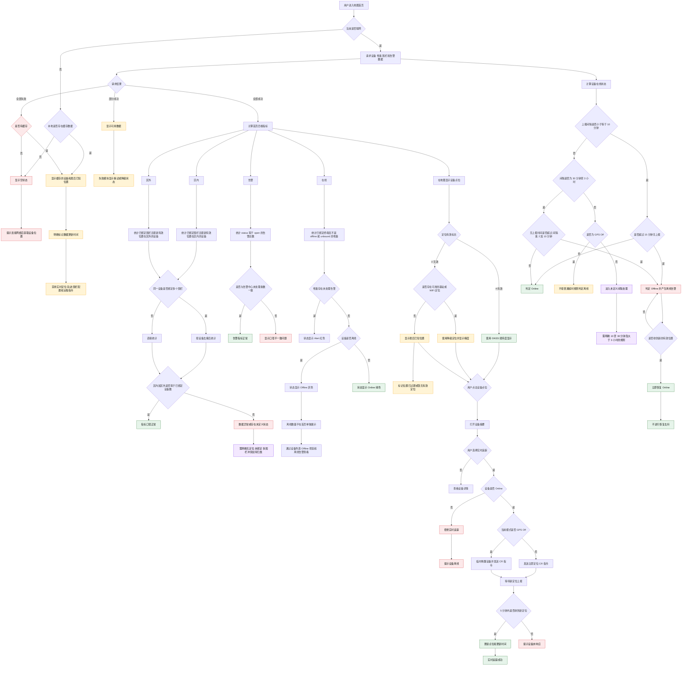
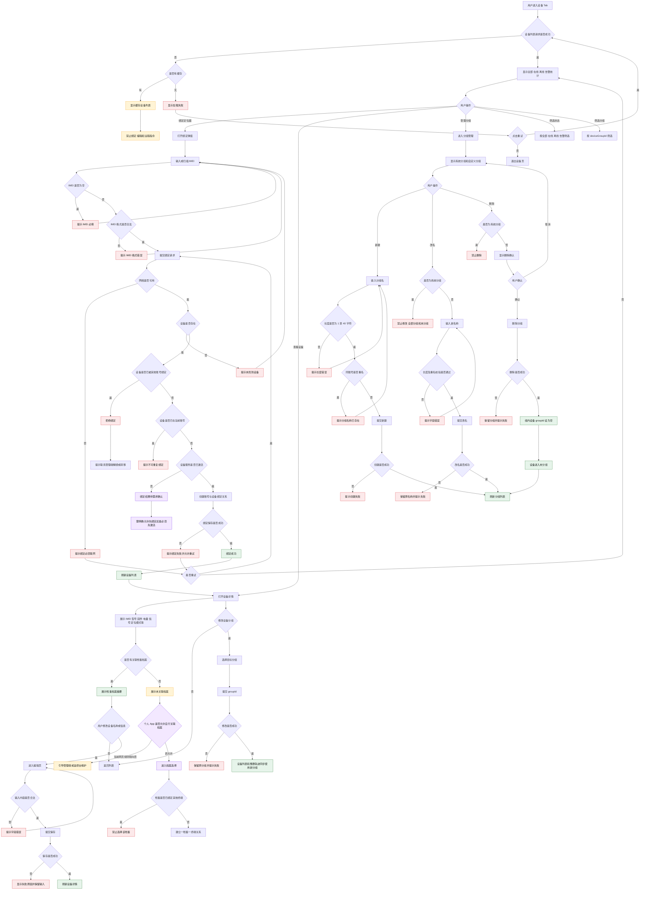
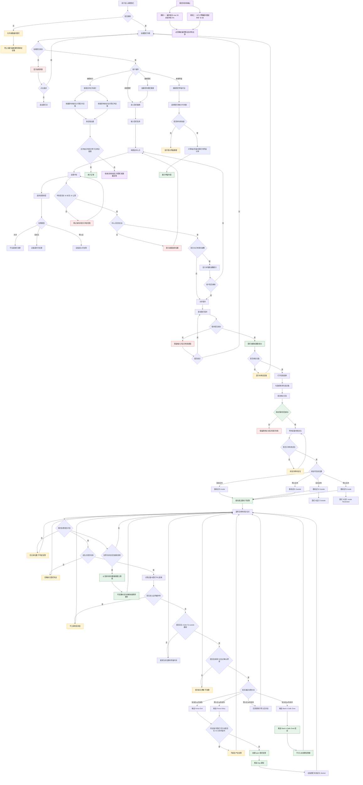
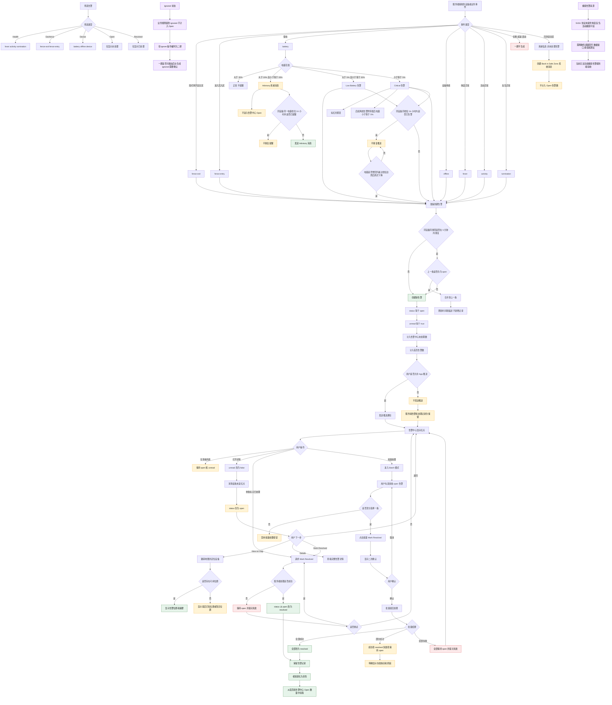
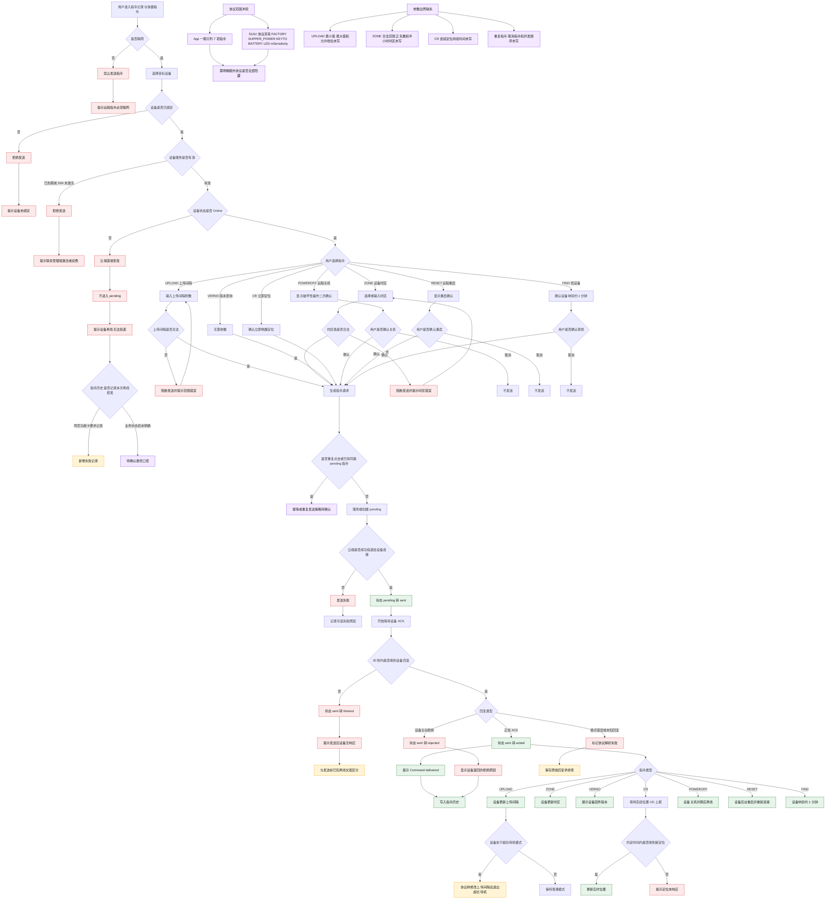
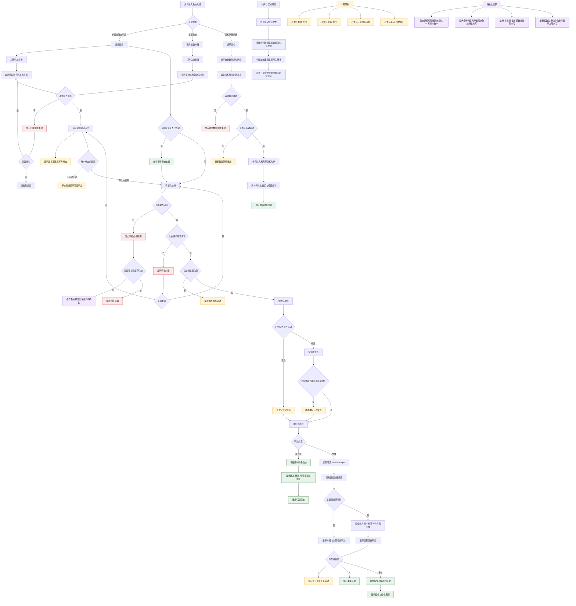
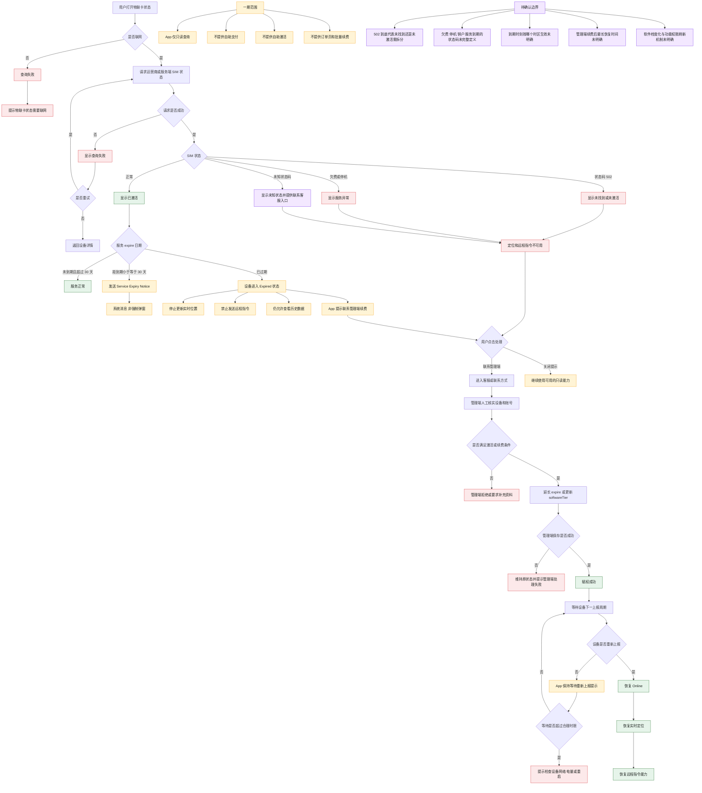
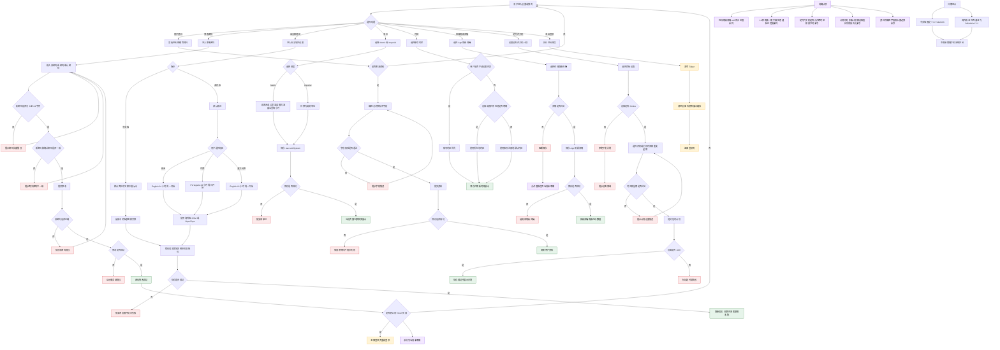

# 革泰 App 一期详细功能流程图

## 1. 文档说明

| 项目 | 内容 |
|---|---|
| 资料来源 | `S10U协议.docx`、[革泰 App 可点击需求文档](http://getai.pg8.ink/app/index.html#sec-app) |
| 分析视角 | 软件测试、需求评审、异常流程和边界值分析 |
| 流程范围 | 启动登录、地图首页、设备管理、地理围栏、告警中心、远程指令、历史轨迹、物联卡、设置与区域化 |
| 分支范围 | 正常成功、校验失败、网络失败、设备异常、服务端失败、降级处理、人工处理和待确认分支 |

> 说明：流程图中的“待确认”节点表示当前资料不足以确定唯一预期结果，不能直接作为测试验收结论。

## 2. 图例

- 绿色：成功或正常结束。
- 红色：失败、拒绝或阻断。
- 黄色：等待、降级或需要人工处理。
- 紫色：需求待确认，当前证据不足。

# 3. App 启动、隐私、注册、登录与会话流程

# 4. 地图首页、缓存、在线状态与实时定位流程

# 5. 设备绑定、设备详情、档案关联与分组流程

> 设备绑定必须确认的边界：网页未给出 IMEI 的长度、字符集、校验位、大小写、前后空格、扫描重复提交、并发绑定和解绑权限，因此这些规则不能作为当前已确定结论。

# 6. 圆形地理围栏创建、绑定与告警判定流程

# 7. 告警产生、推送、已读、合并与处理流程

# 8. S10U 远程指令发送、ACK、超时与失败流程

# 9. 历史轨迹、整群轨迹、分组筛选与停留统计流程

# 10. 物联卡、服务到期、续费与恢复流程

# 11. 设置、区域、语言、单位、刷新间隔与定时开关机流程

# 12. 测试准入前必须澄清的关键问题

以下问题如果不明确，测试无法获得唯一预期结果，也不能据此给出上线通过结论。

## 12.1 P0：协议与核心业务冲突

1. 协议文件实际为旧版 OLE Word 格式，但文件扩展名为 `.docx`。
2. 协议写明 `UPLOAD` 只针对设备震动状态，静止时不上传位置；产品却按最后位置上报时间判断 Offline。必须明确：
   - 静止设备是否仍发送 `LK`；
   - `LK` 是否能维持 Online；
   - 静止多久会被误判离线；
   - 围栏跨界后设备静止时能否及时告警。
3. S10U 协议已有出围栏、进围栏状态位和报警位；网页又要求服务端根据圆形围栏重新判定。必须明确：
   - 最终以设备报警位还是服务端计算为准；
   - 两者同时上报是否生成两条告警；
   - 两者冲突时采用哪一个；
   - 协议 `AL` 是否参与 App 围栏告警。
4. 网页存在两套围栏缓冲描述：
   - `max(50m, 半径×5%)`；
   - 固定外扩 `30m`。

   两者无法同时作为唯一验收标准。
5. 网页包含体温、活动、反刍异常，但当前 S10U 协议没有对应字段。健康告警的数据源、设备型号、算法阈值和采样频率均未给出。

## 12.2 P0：S10U 指令协议问题

6. App 声明只有 7 项指令，但协议还包括：
   - `FACTORY`；
   - `SUPPER_POWER`；
   - `KEYTO`；
   - `BATTERY`；
   - `LED`；
   - `mSensitivity`。

   必须明确这些能力是一律隐藏、仅后台可用，还是一期需求遗漏。
7. `UPLOAD` 缺少合法范围、步长和档位映射。
8. `ZONE` 缺少合法范围，不明确是否支持 `-3`、`+5:30`、`+9:30` 等海外时区。
9. `CR` 只写“连续一段时间”，未明确持续时间和结束条件。
10. 协议部分长度字段出现 `0000C`、`0000B`，与“四位 ASCII 长度”描述冲突。
11. `3G` 与 `3g` 大小写混用，必须明确解析是否区分大小写。
12. 30 秒 ACK 是产品层规则，但协议没有：
    - 请求流水号；
    - 幂等键；
    - ACK 与具体请求的关联字段。

    多条同类指令并发时可能无法正确匹配回复。
13. “设备 Offline 直接拒发”与“指令记录保留失败条目”需要统一，明确拒发是否写入历史。
14. `FIND` 协议称响铃一分钟，但不明确：
    - 是否可提前停止；
    - 静音模式是否仍响；
    - 连续发送如何处理。

## 12.3 P1：功能边界问题

15. IMEI 长度、字符集、校验位和并发绑定规则未定义。
16. “App 添加设备”与“档案关联由管理端维护”的操作边界不够清晰。
17. 一个设备能否绑定多个围栏、一个围栏最多绑定多少设备，没有上限定义。
18. 首页“区内+区外=已绑”在以下场景如何成立未定义：
    - 无有效定位；
    - 刚绑定等待定位；
    - 同一设备绑定多个围栏；
    - 围栏关闭；
    - 设备已到期。
19. 在线状态只覆盖“≤10 分钟”和“30 分钟～3 小时”，`10～30 分钟`、`超过 3 小时`没有规则。
20. 轨迹最大查询范围、最大设备数、最大轨迹点数和数据保留期限未统一。
21. App 弱网时可以看缓存，但退出登录要求清空缓存；重新登录且无网络时能否看之前缓存需要明确。
22. “离线地图”同时出现在离线能力说明和一期不做清单中，范围互相冲突。
23. 修改密码后是否强制重新登录未定义。
24. App 在线刷新间隔 `m6` 的合法值未列出。
25. 定时开关机遇到夏令时、跨时区、重复计划冲突时没有规则。
26. 告警状态提到 `ignored`，但 Ignore 操作又被列为二期，需明确一期是否会展示后台产生的 ignored 数据。
27. 批量处理告警部分成功时，事务策略和失败提示未定义。
28. 到期时刻使用 UTC、账号时区还是设备所在地时区未定义。
29. 管理端续费后“下一上报周期恢复”，但没有最长恢复时限。
30. 海外版目标地区含欧洲、巴西、澳大利亚，但货币、日期、时区和地图切换后的历史数据展示规则还需要统一验收样例。
