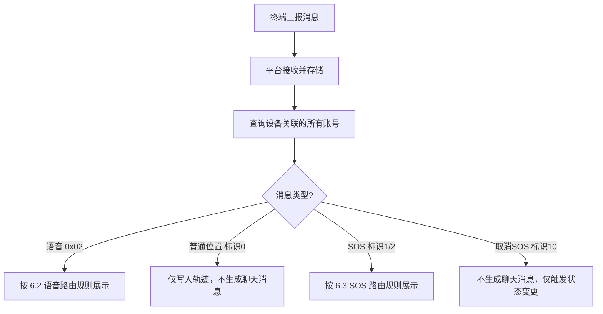
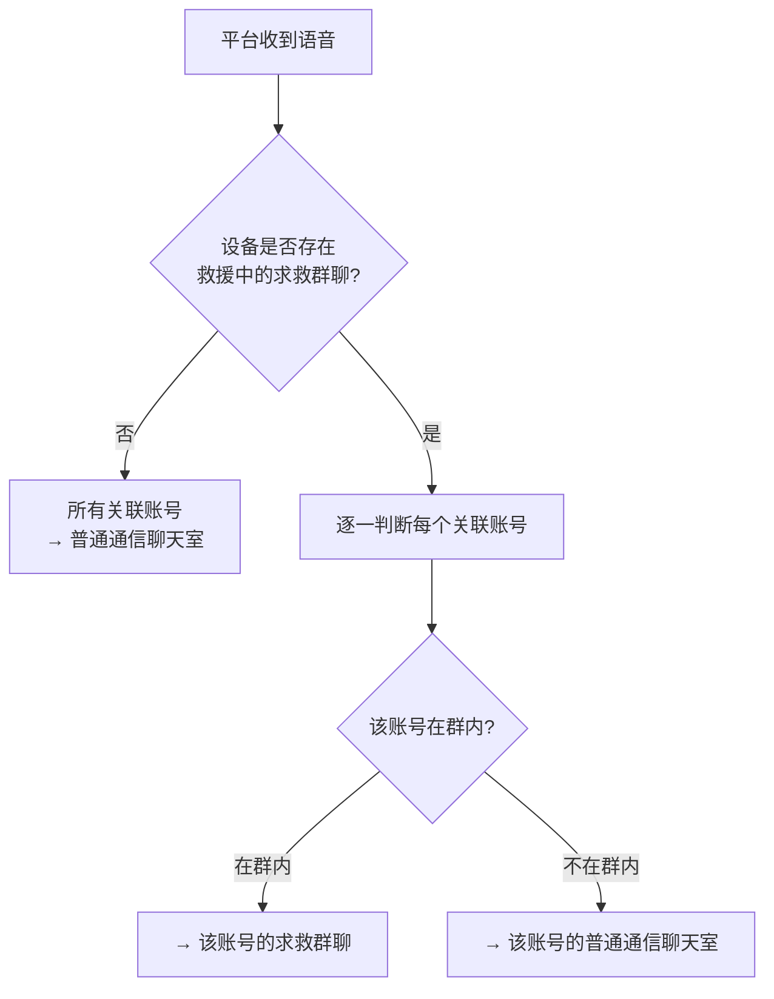
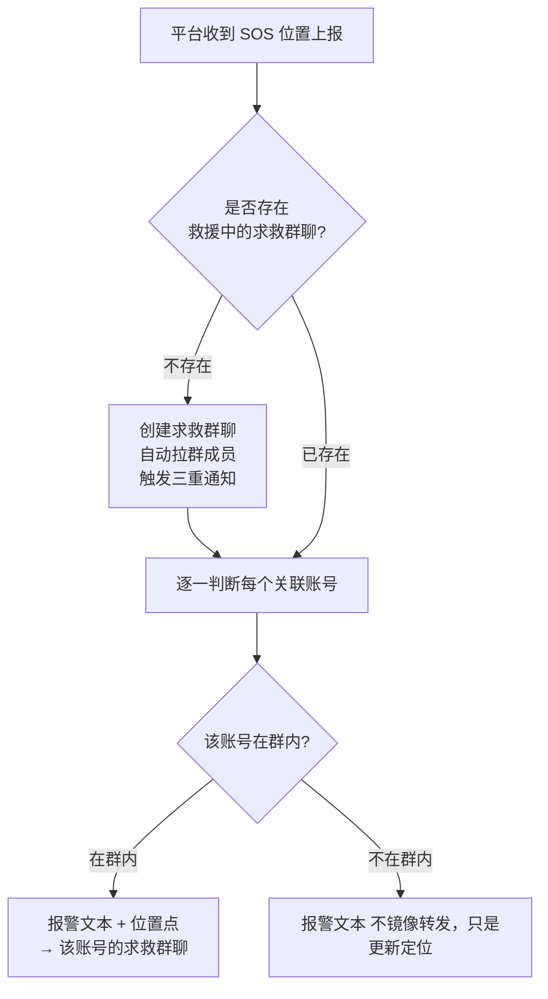

# 终端上报方案

<!-- notion_page_id: 2145667c-6d3a-82af-a181-01d7495066c4 -->

# 天通救援应急棒终端上报消息（语音/位置）逻辑限制规划
## 1. 范围与目标
- **范围**：仅针对 **天通救援应急棒设备** 的「终端 → 平台」上报行为，覆盖：
	- 终端上报 **语音（0x02）** 与 **位置（0x01，含 4 种上报标识）** 的前置校验、上报限制、计费/欠费处理规则
	- 消息转发与展示规则（以小程序为主）
	- 欠费场景下的能力差异与套餐恢复逻辑
- **不在本规划展开**：
	- 平台 → 终端的消息下发（见 `sos-msg-send-limits` 规划）
	- 文本消息相关规则（终端不支持文本上报）
	- TCP 协议字段与校验实现细节
	- APP 对讲机的接收矩阵与计费逻辑
	- 其他设备类型（如北斗等）的上报与计费规则
---
## 2. 消息类型与基础约束
### 2.1 支持的消息类型
<table header-row="true">
<tr>
<td>消息类型</td>
<td>协议</td>
<td>上报标识</td>
<td>说明</td>
</tr>
<tr>
<td>**语音消息（短音）**</td>
<td>0x02</td>
<td>—</td>
<td>压缩语音数据，暂定固定码率 450</td>
</tr>
<tr>
<td>**普通位置**</td>
<td>0x01</td>
<td>0</td>
<td>普通位置上报（轨迹点）</td>
</tr>
<tr>
<td>**按键 SOS**</td>
<td>0x01</td>
<td>1</td>
<td>位置 + 设备状态标识，触发建群/报警</td>
</tr>
<tr>
<td>**落水 SOS**</td>
<td>0x01</td>
<td>2</td>
<td>位置 + 设备状态标识，触发建群/报警</td>
</tr>
<tr>
<td>**取消 SOS**</td>
<td>0x01</td>
<td>10</td>
<td>设备切回普通状态</td>
</tr>
</table>
💡 **文本消息说明**：终端不支持文本协议上报。当收到标识 1/2 的 SOS 位置上报时，平台侧**派生生成一条报警文本**（如「按键SOS」「落水SOS」）用于聊天/事件流展示，不是终端独立上报的文本。
### 2.2 内容合法性校验
<table header-row="true">
<tr>
<td>校验项</td>
<td>规则</td>
</tr>
<tr>
<td>语音时长</td>
<td>1–10 秒（含边界），与平台下发一致</td>
</tr>
<tr>
<td>敏感词过滤</td>
<td>终端上报语音暂不需要敏感词过滤</td>
</tr>
<tr>
<td>经纬度</td>
<td>经度 \[-180, 180\]，纬度 \[-90, 90\]，必须可解析</td>
</tr>
<tr>
<td>时间戳</td>
<td>UTC 秒，必须可解析</td>
</tr>
<tr>
<td>上报标识</td>
<td>必须为 \{0, 1, 2, 10\}，否则记录日志并丢弃</td>
</tr>
</table>
---
## 3. 频率控制与并发限制
<table header-row="true">
<tr>
<td>维度</td>
<td>规则</td>
<td>备注</td>
</tr>
<tr>
<td>**卡频度限制**</td>
<td>暂定 ≥ 60 秒</td>
<td>救援棒自身的硬件限制，按设备 ID 维度</td>
</tr>
<tr>
<td>**并发控制**</td>
<td>不支持并发发送</td>
<td>同一时间只能发送一条消息，需排队处理</td>
</tr>
</table>
---
## 4. 套餐扣费与欠费规则
### 4.1 扣费总览
📌 **核心原则**：先用后扣费 + 允许倒欠。终端上报侧 **不做余额拦截**，无论套餐是否为 0，终端都允许继续上报。
<table header-row="true">
<tr>
<td>消息类型</td>
<td>扣费套餐</td>
<td>扣费粒度</td>
<td>去重规则</td>
</tr>
<tr>
<td>**语音（0x02）**</td>
<td>短音条数</td>
<td>每条语音 -1</td>
<td>无去重，逐条扣除</td>
</tr>
<tr>
<td>**位置（0x01，标识 0/1/2/10）**</td>
<td>报位条数</td>
<td>每次触发 -1</td>
<td>同一设备 1 小时窗口内最多扣 1 次</td>
</tr>
</table>
- **派生文本不额外扣费**：由标识 1/2 派生的报警文本消息不额外扣短音/报位
- **扣费按设备维度**：与接收账号数量无关
- **多账号下发区分**：多个账号对设备下发消息时，按账号数量分别扣费（每个账号下发一条各扣 1 条）
### 4.2 报位扣费时间窗算法
- **滚动 1 小时窗口**：首次触发扣费时刻记为 `t0`（UTC 秒），免扣截止为 `t0 + 3600s`
- 窗口内无论上报多少次位置（含 0/1/2/10）、多少个位置点，均不再扣费
- 当 `t > t0 + 3600s` 时，下一次位置上报触发新一轮扣费并刷新 `t0`
### 4.3 欠费场景处理
<table header-row="true">
<tr>
<td>能力</td>
<td>正常状态</td>
<td>欠费状态</td>
<td>说明</td>
</tr>
<tr>
<td>终端上报</td>
<td>✅</td>
<td>✅</td>
<td>不拦截，允许继续上报</td>
</tr>
<tr>
<td>小程序接收</td>
<td>✅</td>
<td>✅</td>
<td>消息正常展示</td>
</tr>
<tr>
<td>语音播放</td>
<td>✅</td>
<td>❌ 禁用</td>
<td>播放按钮禁用，提示「套餐余额不足，请充值后播放」</td>
</tr>
<tr>
<td>轨迹详情</td>
<td>✅</td>
<td>✅</td>
<td>不因欠费屏蔽</td>
</tr>
<tr>
<td>下发消息</td>
<td>✅</td>
<td>❌ 限制</td>
<td>发送按钮置灰，提示「套餐余额不足，请充值后发送」</td>
</tr>
</table>
### 4.4 充值与倒欠恢复
- **充值后处理顺序**：先扣除倒欠条数 → 再显示剩余余额
- **示例**：倒欠 -3 条，充值 10 条 → 扣除倒欠 3 条 → 余额显示 7 条
- **充值不足以覆盖倒欠**：倒欠 -5 条，充值 3 条 → 扣除 3 条 → 剩余倒欠 -2 条，余额显示 0
- **倒欠无上限**：套餐条数可无限变为负数
- **余额恢复正数后**：解锁语音播放功能和下发消息功能
---
## 5. 设备状态与绑定关系
<table header-row="true">
<tr>
<td>维度</td>
<td>规则</td>
<td>说明</td>
</tr>
<tr>
<td>**设备开机**</td>
<td>必须开机才能上报</td>
<td>TCP 连接建立后即可发送</td>
</tr>
<tr>
<td>**模式区分**</td>
<td>终端侧不区分模式</td>
<td>救援棒只有几个物理按钮，不区分普通/求救模式；仅小程序和平台端区分</td>
</tr>
<tr>
<td>**未绑定设备**</td>
<td>可上报，但无人接收</td>
<td>消息仅存档，不转发、不展示、计入倒欠，后续设备与账号关联之后，关联账号要为设备已产生的账单付费</td>
</tr>
<tr>
<td>**后续绑定**</td>
<td>历史消息不补发</td>
<td>仅处理绑定后的新消息</td>
</tr>
</table>
---
## 6. 消息转发与展示规则（核心）
⚠️ **阅读前提**：终端侧不区分通信模式，统一发送消息至平台；平台根据设备当前状态和账号关系，决定消息在小程序/WEB 端的展示归属。
### 6.1 转发总览

### 6.2 语音消息转发规则（0x02）

<table header-row="true">
<tr>
<td>设备状态</td>
<td>账号与群关系</td>
<td>展示位置</td>
</tr>
<tr>
<td>无救援中群聊</td>
<td>所有关联账号</td>
<td>普通通信聊天室</td>
</tr>
<tr>
<td>有救援中群聊</td>
<td>账号在群内</td>
<td>求救群聊</td>
</tr>
<tr>
<td>有救援中群聊</td>
<td>账号不在群内但关注/绑定设备</td>
<td>普通通信聊天室</td>
</tr>
<tr>
<td>任意</td>
<td>与设备无关系的账号</td>
<td>不接收</td>
</tr>
</table>
### 6.3 SOS 位置转发规则（标识 1/2）

💡 **关键说明**： • SOS 不是独立文本消息，是位置上报（0x01）携带的设备状态标识，平台收到后**派生生成报警文本** • 报警文本 + 位置点在逻辑上属于**同一事件** • 镜像展示（群外账号在普通通信看到）**不额外计费**
- • SOS 不是独立文本消息，是位置上报（0x01）携带的设备状态标识，平台收到后**派生生成报警文本**
- • 报警文本 + 位置点在逻辑上属于**同一事件**
- • 镜像展示（群外账号在普通通信看到）**不额外计费**
### 6.4 普通位置展示规则（标识 0）
- **不生成任何聊天消息/气泡**
- 位置点写入轨迹数据
- 所有与设备有关系的账号可在 **地图/轨迹详情** 中查看
### 6.5 取消 SOS 展示规则（标识 10）
- **不在任何聊天窗口生成文本或消息**
- 仅影响后台状态：设备报警状态解除 → 求救群聊置为「救援完成」→ 通信模式切回普通
- 位置点本身仍参与轨迹与报位按小时扣费
### 6.6 转发规则总览对比
<table header-row="true">
<tr>
<td>消息类型</td>
<td>聊天窗口展示</td>
<td>展示内容</td>
<td>轨迹/地图展示</td>
<td>涉及求救群聊路由</td>
</tr>
<tr>
<td>**语音（0x02）**</td>
<td>✅ 语音气泡</td>
<td>可播放的语音消息</td>
<td>❌</td>
<td>✅ 群内→群聊，群外→普通通信</td>
</tr>
<tr>
<td>**普通位置（标识 0）**</td>
<td>❌ 不生成</td>
<td>—</td>
<td>✅ 轨迹点</td>
<td>❌</td>
</tr>
<tr>
<td>**SOS（标识 1/2）**</td>
<td>✅ 报警文本</td>
<td>「按键SOS」「落水SOS」+ 位置</td>
<td>✅ 位置点</td>
<td>✅ 群内→群聊，群外→普通通信镜像</td>
</tr>
<tr>
<td>**取消 SOS（标识 10）**</td>
<td>❌ 不生成</td>
<td>—</td>
<td>✅ 轨迹点</td>
<td>✅ 触发群聊关闭</td>
</tr>
</table>
### 6.7 欠费场景下的展示特殊处理
<table header-row="true">
<tr>
<td>展示项</td>
<td>欠费时行为</td>
</tr>
<tr>
<td>语音气泡</td>
<td>正常显示，但 **播放按钮禁用**，提示「套餐余额不足，请充值后播放」</td>
</tr>
<tr>
<td>位置/轨迹</td>
<td>正常展示，不受欠费影响</td>
</tr>
<tr>
<td>报警文本</td>
<td>正常展示（由位置上报派生，不额外扣费）</td>
</tr>
<tr>
<td>下发入口</td>
<td>发送按钮置灰/点击提示欠费</td>
</tr>
</table>
---
## 7. 群聊状态对上报的影响
📌 **核心结论**：终端上报 **不受群聊状态影响**。终端是硬件设备，不区分模式，统一发送；平台侧根据设备当前状态和群聊状态决定消息的展示归属。
<table header-row="true">
<tr>
<td>场景</td>
<td>终端行为</td>
<td>平台展示归属</td>
</tr>
<tr>
<td>有救援中群聊</td>
<td>正常上报</td>
<td>语音/SOS 按群内外路由展示</td>
</tr>
<tr>
<td>群聊已「救援完成」</td>
<td>正常上报</td>
<td>新语音展示在普通通信中；新 SOS 触发创建新群聊</td>
</tr>
<tr>
<td>无群聊（普通模式）</td>
<td>正常上报</td>
<td>所有消息展示在普通通信中</td>
</tr>
</table>
---
## 8. 边界与异常场景
### 8.1 欠费连续上报
- 语音连续上报倒欠示例
	场景：套餐余额为 0，终端连续上报 3 条语音
	- 第 1 条：接收后无法播放，倒欠 = -1
	- 第 2 条：接收后无法播放，倒欠 = -2
	- 第 3 条：接收后无法播放，倒欠 = -3
	- 用户充值 10 条：扣除倒欠 3 条，剩余余额 = 7 条
	- 所有语音解锁播放功能
- 位置连续上报扣费示例
	场景：欠费状态下终端持续上报位置
	- 同一「1 小时免扣窗口」内：不重复扣报位条数
	- 超过 1 小时并触发新的扣费窗口：报位条数继续 -1（可持续倒欠）
	- 倒欠无上限
### 8.2 未绑定设备上报
- 设备可上报语音/位置到平台（协议层面允许）
- 无绑定用户 → 无法转发给任何人
- 处理方式：消息仅存档，不转发、不展示、计入倒欠
- 后续绑定后：历史未转发消息不补发，仅处理新消息（待确认）
### 8.3 救援完成后继续上报
- 终端不受「救援完成」状态限制，仍可继续发送
- **语音**：展示在普通通信中（因求救群已关闭）
- **新 SOS（标识 1/2）**：触发创建新的求救群聊
- **播放/下发能力**：取决于当前套餐余额
### 8.4 链路异常（暂不关注）
> 当前阶段不关注中途链路异常，留待后续版本补充：TCP 连接断开/重连、设备关机时正在发送的消息处理、套餐过期/设备解绑等。
---
## 9. 与平台下发规则对比
<table header-row="true">
<tr>
<td>维度</td>
<td>平台 → 终端（下发）</td>
<td>终端 → 平台（上报）</td>
</tr>
<tr>
<td>**消息类型**</td>
<td>文本（≤60字符）+ 语音（1-10秒）</td>
<td>语音（1-10秒）+ 位置（标识 0/1/2/10）</td>
</tr>
<tr>
<td>**扣费规则**</td>
<td>下发入队扣短音（每条 -1）</td>
<td>语音按条扣短音；位置按小时扣报位</td>
</tr>
<tr>
<td>**欠费处理**</td>
<td>余额不足时**拒绝发送**，不入队</td>
<td>**允许倒欠**，不拦截上报</td>
</tr>
<tr>
<td>**倒欠机制**</td>
<td>不存在倒欠</td>
<td>支持倒欠，充值后扣除</td>
</tr>
<tr>
<td>**频率限制**</td>
<td>≥ 3 秒间隔</td>
<td>救援棒卡频度 ≥ 60 秒</td>
</tr>
<tr>
<td>**模式区分**</td>
<td>区分普通通信/求救群聊</td>
<td>终端侧不区分；小程序端按展示规则路由</td>
</tr>
<tr>
<td>**群聊状态影响**</td>
<td>救援完成时禁止新消息</td>
<td>不受群聊状态影响</td>
</tr>
</table>
---
## 10. 典型场景矩阵
<table header-row="true">
<tr>
<td>场景</td>
<td>可上报</td>
<td>可接收</td>
<td>语音可播放</td>
<td>轨迹可查看</td>
<td>可下发消息</td>
<td>计入倒欠</td>
</tr>
<tr>
<td>正常（短音≥1 且 报位≥1）</td>
<td>✅</td>
<td>✅</td>
<td>✅</td>
<td>✅</td>
<td>✅</td>
<td>❌</td>
</tr>
<tr>
<td>欠费（短音≤0 或 报位≤0）</td>
<td>✅</td>
<td>✅</td>
<td>❌</td>
<td>✅</td>
<td>❌</td>
<td>✅</td>
</tr>
<tr>
<td>充值后（扣除倒欠）</td>
<td>✅</td>
<td>✅</td>
<td>✅</td>
<td>✅</td>
<td>✅</td>
<td>❌</td>
</tr>
<tr>
<td>未绑定设备</td>
<td>✅</td>
<td>❌</td>
<td>❌</td>
<td>❌</td>
<td>❌</td>
<td>❌</td>
</tr>
<tr>
<td>设备关机</td>
<td>❌</td>
<td>—</td>
<td>—</td>
<td>—</td>
<td>—</td>
<td>—</td>
</tr>
<tr>
<td>救援完成后继续上报</td>
<td>✅</td>
<td>✅</td>
<td>取决于短音</td>
<td>✅</td>
<td>取决于套餐</td>
<td>取决于套餐</td>
</tr>
</table>
---
##
###
