# 星联应急叫应平台 PRD（全端合并版）

<!-- notion_page_id: 2d95667c-6d3a-8293-b3a3-812656c75481 -->

# 星联应急叫应平台 - PRD（全端合并版）
## 文档元信息
<table header-row="true">
<tr>
<td>属性</td>
<td>值</td>
</tr>
<tr>
<td>**文档标题**</td>
<td>星联应急叫应平台 - 全端产品需求文档（平台WEB + 小程序 + 管理后台 + APP对讲机）</td>
</tr>
<tr>
<td>**文档版本**</td>
<td>v1.1</td>
</tr>
<tr>
<td>**创建日期**</td>
<td>2026-02-09</td>
</tr>
<tr>
<td>**最后更新**</td>
<td>2026-02-11</td>
</tr>
<tr>
<td>**文档状态**</td>
<td>初稿</td>
</tr>
<tr>
<td>**产品负责人**</td>
<td>待定</td>
</tr>
<tr>
<td>**参与方**</td>
<td>开发、设计、测试、业务等相关人员</td>
</tr>
<tr>
<td>**原型来源**</td>
<td>images/星联应急叫应平台_20260205、星联应急叫应小程序-20260203、星联应急叫应管理后台_20260205</td>
</tr>
</table>
### 术语表
<table header-row="true">
<tr>
<td>术语</td>
<td>定义</td>
<td>数据类型</td>
<td>备注</td>
</tr>
<tr>
<td>天通应急</td>
<td>基于天通卫星的应急通信能力</td>
<td>-</td>
<td>产品线名称</td>
</tr>
<tr>
<td>短音套餐</td>
<td>以短消息条数为计费单位的套餐</td>
<td>枚举</td>
<td>套餐类型之一</td>
</tr>
<tr>
<td>报位套餐</td>
<td>以报位时长和频度为计费单位的套餐</td>
<td>枚举</td>
<td>套餐类型之一</td>
</tr>
<tr>
<td>组合套餐</td>
<td>同时包含短音条数、报位时长与频度的套餐</td>
<td>枚举</td>
<td>套餐类型之一</td>
</tr>
<tr>
<td>日包/月包</td>
<td>按天或按月计费的服务周期</td>
<td>枚举</td>
<td>套餐商城展示用</td>
</tr>
<tr>
<td>报文下发额度</td>
<td>各设备类型剩余可下发报文数量</td>
<td>数值</td>
<td>日报文下发额度页</td>
</tr>
<tr>
<td>求救群聊</td>
<td>设备报警后创建的救援协同群聊</td>
<td>-</td>
<td>通信管理子模块</td>
</tr>
<tr>
<td>设备卡号</td>
<td>设备的业务标识号</td>
<td>字符串</td>
<td>绑定、订购时使用</td>
</tr>
<tr>
<td>紧急联系人</td>
<td>设备报警时接收通知的联系人</td>
<td>-</td>
<td>绑定设备时设置</td>
</tr>
<tr>
<td>对讲机 ID</td>
<td>对讲机设备的唯一标识</td>
<td>字符串</td>
<td>APP 需设置后才能使用通讯</td>
</tr>
<tr>
<td>对星</td>
<td>对讲机与卫星建立连接的过程</td>
<td>-</td>
<td>约 2 分钟（APP）</td>
</tr>
<tr>
<td>服务周期</td>
<td>套餐计费周期</td>
<td>枚举</td>
<td>如：按天、按月（管理后台）</td>
</tr>
</table>
> **说明**：统一术语定义，避免理解歧义。
---
## 终端/设备端区分说明
<table header-row="true">
<tr>
<td>设备端</td>
<td>标识</td>
<td>目标用户</td>
<td>主要场景</td>
</tr>
<tr>
<td>**平台 WEB**</td>
<td>【平台WEB】</td>
<td>个人账号、企业一级/二/三级账号</td>
<td>个人中心、套餐订购、通信管理、日报文额度</td>
</tr>
<tr>
<td>**小程序**</td>
<td>【小程序】</td>
<td>个人账号</td>
<td>实名认证、绑定设备、套餐商城、求救群聊</td>
</tr>
<tr>
<td>**管理后台**</td>
<td>【管理后台】</td>
<td>后台运营管理员</td>
<td>套餐管理、套餐明细、订单管理、订单统计</td>
</tr>
<tr>
<td>**APP 对讲机**</td>
<td>【APP对讲机】</td>
<td>终端使用者</td>
<td>通讯（对星、发送短语、群聊）、我的（设置）</td>
</tr>
</table>
---
## 项目概述
### 功能概述
本 PRD 合并了星联应急叫应全端产品需求：
- **【平台WEB】**：面向个人与企业账号，提供个人中心（账号信息、实名认证、平台设置）、**我的套餐**、**套餐商城**（订购与支付）、**我的订单 **、**日报文下发额度**，以及**通信管理**（普通通信、求救群聊及群管理、套餐信息查看）。
- **【小程序】**：面向个人账号，提供实名认证（微信授权）、绑定设备与紧急联系人、套餐商城（我的套餐、我的订单、报文下发额度）、**通信消息 **（求救群聊）。
- **【管理后台】**：面向运营管理员，提供天通应急套餐管理、套餐明细查询、订单管理与退款、订单统计。
- **【APP对讲机】**：面向终端使用者，提供通讯（卫星链接、对星、发送短语、接收消息、群聊记录）、我的（平台设置 TCP、对讲机 ID 设置）。
### 范围与排除项
- **在范围内**：本 PRD 涵盖上述四端全部功能模块。
- **排除项**：控制台、多端监控、多端轨迹、设备管理、消息管理、电子围栏等模块的详细需求按端单独描述；支付渠道与清结算对接见单独文档。
---
## 用户与角色
### 用户分类
<table header-row="true">
<tr>
<td>用户类</td>
<td>设备端</td>
<td>特征描述</td>
<td>核心痛点</td>
<td>主要功能</td>
<td>技术熟练度</td>
</tr>
<tr>
<td>个人账号</td>
<td>平台WEB、小程序</td>
<td>户外/应急救援终端使用者</td>
<td>需查看与购买套餐、管理订单与通信</td>
<td>个人中心/我的信息、套餐商城、订单、通信</td>
<td>一般</td>
</tr>
<tr>
<td>企业一级/二级/三级账号</td>
<td>平台WEB</td>
<td>企业组织内不同层级账号</td>
<td>多设备、多成员管理与订购</td>
<td>同上，权限按层级区分</td>
<td>熟练</td>
</tr>
<tr>
<td>后台运营管理员</td>
<td>管理后台</td>
<td>负责套餐上下架、订单与退款处理</td>
<td>需快速筛选订单与套餐、查看明细与趋势</td>
<td>套餐 CRUD、订单查询与退款、统计查看</td>
<td>熟练</td>
</tr>
<tr>
<td>终端使用者</td>
<td>APP对讲机</td>
<td>使用对讲机 APP 进行应急通信</td>
<td>需快速建立卫星连接、发送/接收消息</td>
<td>通讯（对星、群聊、发送短语）、我的（设置）</td>
<td>一般</td>
</tr>
</table>
### 用户权限矩阵（如适用）
<table header-row="true">
<tr>
<td>功能</td>
<td>个人账号</td>
<td>企业一/二/三级</td>
<td>后台管理员</td>
<td>终端使用者</td>
</tr>
<tr>
<td>个人中心/我的信息（账号、实名认证、平台设置/通知设置）</td>
<td>✅</td>
<td>✅（平台）</td>
<td>-</td>
<td>-</td>
</tr>
<tr>
<td>日报文下发额度</td>
<td>✅</td>
<td>✅</td>
<td>-</td>
<td>-</td>
</tr>
<tr>
<td>我的套餐 / 套餐商城 / 我的订单</td>
<td>✅</td>
<td>✅</td>
<td>-</td>
<td>-</td>
</tr>
<tr>
<td>通信管理 / 通信消息（普通通信、求救群聊）</td>
<td>✅</td>
<td>✅</td>
<td>-</td>
<td>✅（APP）</td>
</tr>
<tr>
<td>绑定设备与紧急联系人</td>
<td>✅（小程序）</td>
<td>-</td>
<td>-</td>
<td>-</td>
</tr>
<tr>
<td>套餐管理 / 套餐明细 / 订单管理 / 订单统计</td>
<td>-</td>
<td>-</td>
<td>✅</td>
<td>-</td>
</tr>
<tr>
<td>通讯（对星、发送短语、群聊记录）、平台设置</td>
<td>-</td>
<td>-</td>
<td>-</td>
<td>✅</td>
</tr>
</table>
---
## 功能需求
### 功能清单
<table header-row="true">
<tr>
<td>功能ID</td>
<td>设备端</td>
<td>功能名称</td>
<td>优先级</td>
<td>用户故事</td>
<td>验收标准关联</td>
</tr>
<tr>
<td>[F-001](about:blank#f-001)</td>
<td>【平台WEB】</td>
<td>个人中心（账号信息、平台设置）</td>
<td>P0</td>
<td>US-001</td>
<td>AC-001</td>
</tr>
<tr>
<td>[F-002](about:blank#f-002)</td>
<td>【平台WEB】</td>
<td>实名认证</td>
<td>P0</td>
<td>US-002</td>
<td>AC-002</td>
</tr>
<tr>
<td>[F-003](about:blank#f-003)</td>
<td>【平台WEB】</td>
<td>日报文下发额度查询</td>
<td>P1</td>
<td>US-003</td>
<td>AC-003</td>
</tr>
<tr>
<td>[F-004](about:blank#f-004)</td>
<td>【平台WEB】</td>
<td>我的套餐列表与筛选</td>
<td>P1</td>
<td>US-004</td>
<td>AC-004</td>
</tr>
<tr>
<td>[F-005](about:blank#f-005)</td>
<td>【平台WEB】</td>
<td>套餐商城展示与订购流程</td>
<td>P0</td>
<td>US-005</td>
<td>AC-005</td>
</tr>
<tr>
<td>[F-006](about:blank#f-006)</td>
<td>【平台WEB】</td>
<td>我的订单列表与操作</td>
<td>P2</td>
<td>US-006</td>
<td>AC-006</td>
</tr>
<tr>
<td>[F-007](about:blank#f-007)</td>
<td>【平台WEB/小程序/APP】</td>
<td>通信管理 - 求救群聊 - 消息、短音发送</td>
<td>P0</td>
<td>US-007</td>
<td>AC-007</td>
</tr>
<tr>
<td>[F-008](about:blank#f-008)</td>
<td>【平台WEB/小程序】</td>
<td>通信管理 - 求救群聊（套餐信息、群管理）</td>
<td>P0</td>
<td>US-008</td>
<td>AC-008</td>
</tr>
<tr>
<td>[F-009](about:blank#f-009)</td>
<td>【平台WEB】</td>
<td>通信管理 - 求救群聊 - 求救群聊状态变更</td>
<td>P0</td>
<td>US-009</td>
<td>AC-009</td>
</tr>
<tr>
<td>[F-010](about:blank#f-010)</td>
<td>【平台WEB】</td>
<td>设备状态管理（上线、离线、报警）</td>
<td>P0</td>
<td>US-010</td>
<td>AC-010</td>
</tr>
<tr>
<td>[F-101](about:blank#f-101)</td>
<td>【小程序】</td>
<td>实名认证（微信授权）</td>
<td>P0</td>
<td>US-101</td>
<td>AC-101</td>
</tr>
<tr>
<td>[F-102](about:blank#f-102)</td>
<td>【小程序】</td>
<td>绑定设备与紧急联系人</td>
<td>P0</td>
<td>US-102</td>
<td>AC-102</td>
</tr>
<tr>
<td>[F-103](about:blank#f-103)</td>
<td>【小程序】</td>
<td>我的套餐列表与套餐明细</td>
<td>P1</td>
<td>US-103</td>
<td>AC-103</td>
</tr>
<tr>
<td>[F-104](about:blank#f-104)</td>
<td>【小程序】</td>
<td>套餐商城展示与订购</td>
<td>P0</td>
<td>US-104</td>
<td>AC-104</td>
</tr>
<tr>
<td>[F-105](about:blank#f-105)</td>
<td>【小程序】</td>
<td>我的订单列表与操作</td>
<td>P2</td>
<td>US-105</td>
<td>AC-105</td>
</tr>
<tr>
<td>[F-106](about:blank#f-106)</td>
<td>【小程序】</td>
<td>报文下发额度查询</td>
<td>P1</td>
<td>US-106</td>
<td>AC-106</td>
</tr>
<tr>
<td>[F-107](about:blank#f-107)</td>
<td>【小程序】</td>
<td>通信消息 - 求救群聊（套餐信息、群管理）</td>
<td>P0</td>
<td>US-107</td>
<td>AC-107</td>
</tr>
<tr>
<td>[F-201](about:blank#f-201)</td>
<td>【管理后台】</td>
<td>天通应急套餐列表与筛选</td>
<td>P0</td>
<td>US-201</td>
<td>AC-201</td>
</tr>
<tr>
<td>[F-202](about:blank#f-202)</td>
<td>【管理后台】</td>
<td>天通应急套餐添加/编辑</td>
<td>P0</td>
<td>US-202</td>
<td>AC-202</td>
</tr>
<tr>
<td>[F-203](about:blank#f-203)</td>
<td>【管理后台】</td>
<td>套餐启用/禁用与删除</td>
<td>P1</td>
<td>US-203</td>
<td>AC-203</td>
</tr>
<tr>
<td>[F-204](about:blank#f-204)</td>
<td>【管理后台】</td>
<td>天通应急套餐明细查询</td>
<td>P0</td>
<td>US-204</td>
<td>AC-204</td>
</tr>
<tr>
<td>[F-205](about:blank#f-205)</td>
<td>【管理后台】</td>
<td>订单管理列表与筛选</td>
<td>P0</td>
<td>US-205</td>
<td>AC-205</td>
</tr>
<tr>
<td>[F-206](about:blank#f-206)</td>
<td>【管理后台】</td>
<td>订单退款</td>
<td>P1</td>
<td>US-206</td>
<td>AC-206</td>
</tr>
<tr>
<td>[F-207](about:blank#f-207)</td>
<td>【管理后台】</td>
<td>订单统计仪表盘</td>
<td>P1</td>
<td>US-207</td>
<td>AC-207</td>
</tr>
<tr>
<td>[F-301](about:blank#f-301)</td>
<td>【APP对讲机】</td>
<td>首页（通讯）- 对星、发送短语、接收消息</td>
<td>P0</td>
<td>US-301</td>
<td>AC-301</td>
</tr>
<tr>
<td>[F-302](about:blank#f-302)</td>
<td>【APP对讲机】</td>
<td>群聊记录</td>
<td>P0</td>
<td>US-302</td>
<td>AC-302</td>
</tr>
<tr>
<td>[F-303](about:blank#f-303)</td>
<td>【APP对讲机】</td>
<td>我的 - 首页（APP 信息）</td>
<td>P0</td>
<td>US-303</td>
<td>AC-303</td>
</tr>
<tr>
<td>[F-304](about:blank#f-304)</td>
<td>【APP对讲机】</td>
<td>我的 - 平台设置（TCP 连接）</td>
<td>P0</td>
<td>US-304</td>
<td>AC-304</td>
</tr>
<tr>
<td>[F-305](about:blank#f-305)</td>
<td>【APP对讲机】</td>
<td>我的 - 对讲机 ID 设置</td>
<td>P0</td>
<td>US-305</td>
<td>AC-305</td>
</tr>
</table>
---
### 用户故事
---
### 【平台WEB】 US-001：个人中心查看与编辑
**描述**：作为平台用户，我希望在个人中心查看并编辑账号信息、资源额度与平台设置，以便管理我的账号与可用资源。
### 前置条件
- 用户已登录星联应急叫应平台。
### 触发条件
- 用户进入顶部导航下「个人中心」或从左侧个人中心菜单进入默认视图。
### 主流程
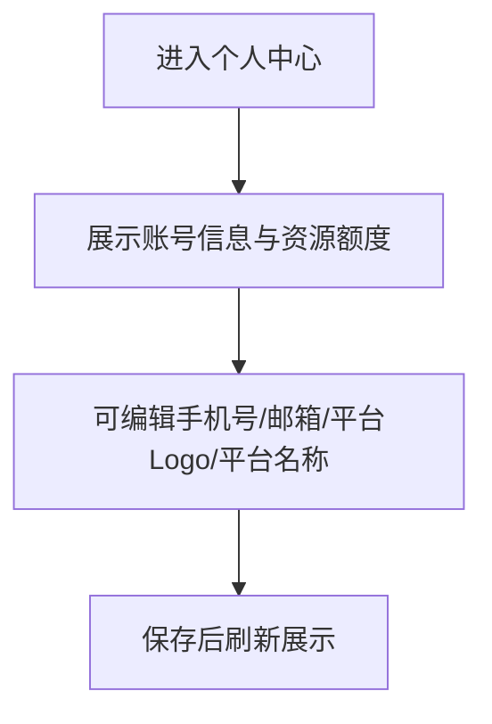
```mermaid
flowchart TD
    Start[进入个人中心] --> View[展示账号信息与资源额度]
    View --> Edit[可编辑手机号/邮箱/平台Logo/平台名称]
    Edit --> Save[保存后刷新展示]
```
### 字段/展示项
<table header-row="true">
<tr>
<td>字段/区域</td>
<td>标识</td>
<td>类型</td>
<td>说明</td>
</tr>
<tr>
<td>头像</td>
<td>avatar</td>
<td>图片</td>
<td>默认或上传</td>
</tr>
<tr>
<td>手机号码</td>
<td>phone</td>
<td>字符串</td>
<td>可编辑</td>
</tr>
<tr>
<td>账号类型</td>
<td>accountType</td>
<td>枚举</td>
<td>个人账号/企业一级账号/企业二级账号/企业三级账号</td>
</tr>
<tr>
<td>邮箱</td>
<td>email</td>
<td>字符串</td>
<td>未绑定时展示「绑定」入口</td>
</tr>
<tr>
<td>实名认证</td>
<td>realNameStatus</td>
<td>枚举</td>
<td>未认证时展示「点击认证」入口</td>
</tr>
<tr>
<td>剩余可绑定设备数量</td>
<td>bindableDeviceQuota</td>
<td>整数</td>
<td>单位：台</td>
</tr>
<tr>
<td>剩余短信通知数量</td>
<td>smsNotificationQuota</td>
<td>整数</td>
<td>单位：条</td>
</tr>
<tr>
<td>剩余邮件通知数量</td>
<td>emailNotificationQuota</td>
<td>整数</td>
<td>单位：封</td>
</tr>
<tr>
<td>剩余电话通知数量</td>
<td>callNotificationQuota</td>
<td>整数</td>
<td>单位：个</td>
</tr>
<tr>
<td>平台 Logo</td>
<td>platformLogo</td>
<td>图片</td>
<td>建议 120\*120 像素</td>
</tr>
<tr>
<td>平台名称</td>
<td>platformName</td>
<td>字符串</td>
<td>可编辑</td>
</tr>
</table>
### 验收标准
- [ ] AC-001.1：个人中心左侧菜单包含：我的套餐、套餐商城、我的订单、日报文下发额度、修改密码、意见反馈、退出登录。
- [ ] AC-001.2：账号信息与资源额度正确展示；编辑后保存成功并刷新展示。
---
### 【平台WEB】 US-002：实名认证
**描述**：作为个人账号用户，我希望在个人中心完成实名认证，以便使用需实名认证的功能。
### 前置条件
- 用户已登录；当前为个人账号且未完成实名认证。
### 触发条件
- 在个人中心点击「点击认证」打开实名认证弹窗。
### 主流程
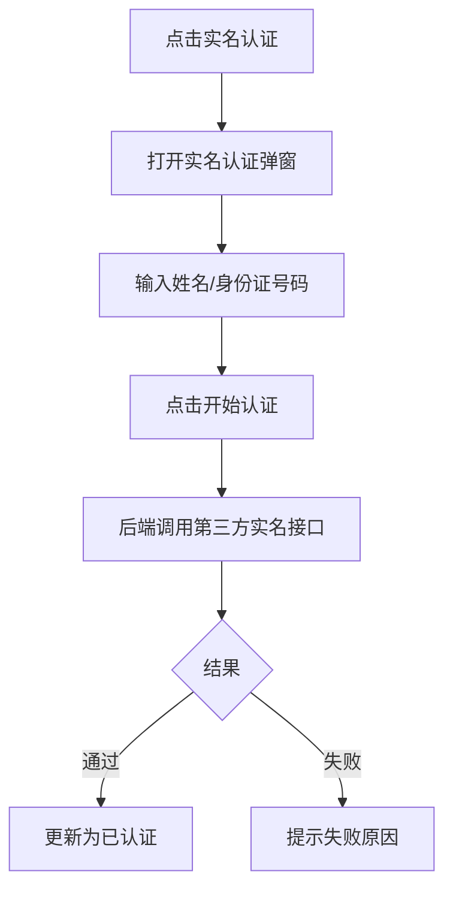
```mermaid
flowchart TD
    Start[点击实名认证] --> Open[打开实名认证弹窗]
    Open --> Input[输入姓名/身份证号码]
    Input --> Submit[点击开始认证]
    Submit --> API[后端调用第三方实名接口]
    API --> Result{结果}
    Result -->|通过| Update[更新为已认证]
    Result -->|失败| Tip[提示失败原因]
```
### 字段规范
<table header-row="true">
<tr>
<td>字段名</td>
<td>标识</td>
<td>类型</td>
<td>必填</td>
<td>校验规则</td>
<td>显示方式</td>
</tr>
<tr>
<td>姓名</td>
<td>realName</td>
<td>字符串</td>
<td>是</td>
<td>真实姓名格式</td>
<td>输入框，占位「请输入姓名」</td>
</tr>
<tr>
<td>身份证号码</td>
<td>idNumber</td>
<td>字符串</td>
<td>是</td>
<td>身份证号格式</td>
<td>输入框，占位「请输入身份证号码」</td>
</tr>
</table>
弹窗内需展示实名认证说明（如：实名认证接口服务由 xxx 官方提供；请确认本人填写且信息真实）。
### 分支流程/异常流程
<table header-row="true">
<tr>
<td>分支ID</td>
<td>条件</td>
<td>流程</td>
</tr>
<tr>
<td>A1</td>
<td>用户关闭弹窗</td>
<td>不提交，关闭弹窗</td>
</tr>
<tr>
<td>E1</td>
<td>未填姓名或身份证号</td>
<td>提示「请输入姓名和身份证号码」</td>
</tr>
<tr>
<td>E2</td>
<td>姓名或身份证格式错误</td>
<td>提示对应格式错误说明</td>
</tr>
<tr>
<td>E3</td>
<td>第三方接口失败</td>
<td>提示「实名认证服务暂时不可用，请稍后重试」</td>
</tr>
<tr>
<td>E4</td>
<td>第三方验证不通过</td>
<td>提示「实名认证失败，请检查姓名与身份证号是否正确」</td>
</tr>
</table>
### 验收标准
- [ ] AC-002.1：未认证时个人中心展示「点击认证」；认证成功后展示已认证状态。
- [ ] AC-002.2：必填项与格式校验生效；第三方失败/不通过时提示明确。
---
### 【平台WEB】 US-003：日报文下发额度查询
**描述**：作为平台用户，我希望查看各设备类型的剩余报文下发数量，以便了解可用额度。
### 前置条件
- 用户已登录。
### 触发条件
- 用户从个人中心左侧菜单进入「日报文下发额度」。
### 主流程
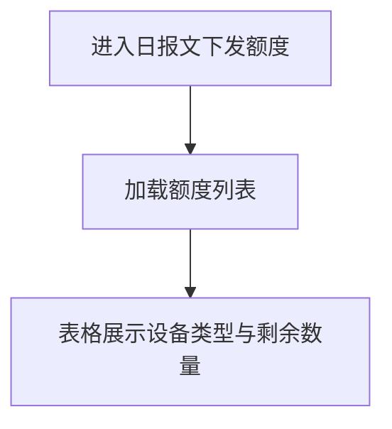
```mermaid
flowchart TD
    Start[进入日报文下发额度] --> Load[加载额度列表]
    Load --> Table[表格展示设备类型与剩余数量]
```
### 列表字段
<table header-row="true">
<tr>
<td>列名</td>
<td>标识</td>
<td>类型</td>
<td>说明</td>
</tr>
<tr>
<td>设备类型</td>
<td>deviceType</td>
<td>字符串</td>
<td>如：北斗设备、天通设备、吉利设备</td>
</tr>
<tr>
<td>剩余报文下发数量</td>
<td>remainingMessageQuota</td>
<td>整数</td>
<td>单位：条</td>
</tr>
</table>
支持分页（如 20 条/页）。
### 验收标准
- [ ] AC-003.1：页面展示设备类型与对应剩余报文下发数量；数据与账号/权限一致。
- [ ] AC-003.2：无数据时展示「暂无数据」或空列表。
---
### 【平台WEB】 US-004：我的套餐列表与筛选
**描述**：作为平台用户，我希望按设备类型、设备 ID、状态筛选并查看已购套餐列表，以便掌握套餐使用情况。
### 前置条件
- 用户已登录。
### 触发条件
- 用户进入「个人中心」→「我的套餐」；或设置筛选条件后点击「查询」。
### 主流程
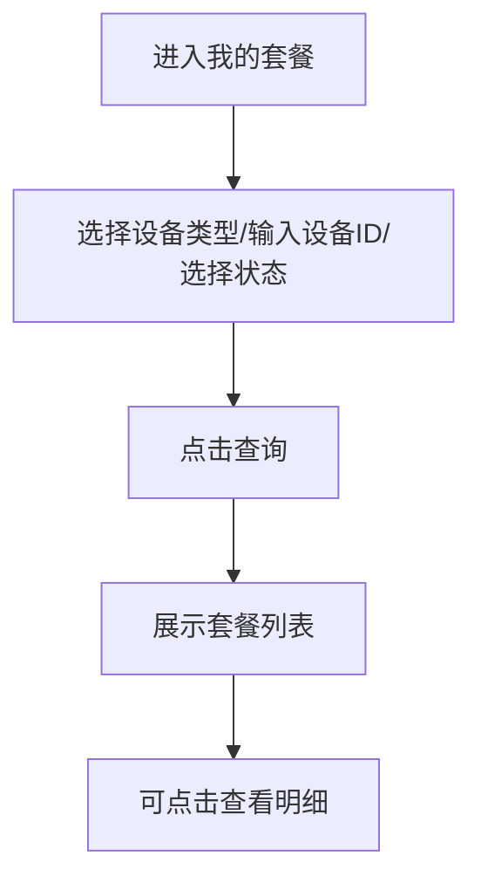
```mermaid
flowchart TD
    Start[进入我的套餐] --> Filter[选择设备类型/输入设备ID/选择状态]
    Filter --> Query[点击查询]
    Query --> List[展示套餐列表]
    List --> Detail[可点击查看明细]
```
### 筛选与列表字段
<table header-row="true">
<tr>
<td>字段/列</td>
<td>标识</td>
<td>类型</td>
<td>说明</td>
</tr>
<tr>
<td>设备类型筛选</td>
<td>deviceType</td>
<td>枚举</td>
<td>如：天通应急救援终端</td>
</tr>
<tr>
<td>设备 ID 输入</td>
<td>deviceId</td>
<td>字符串</td>
<td>占位「请输入设备ID」</td>
</tr>
<tr>
<td>状态筛选</td>
<td>status</td>
<td>枚举</td>
<td>全部/使用中/已过期</td>
</tr>
<tr>
<td>设备 ID</td>
<td>deviceId</td>
<td>字符串</td>
<td>表格列</td>
</tr>
<tr>
<td>状态</td>
<td>status</td>
<td>枚举</td>
<td>使用中/已过期，以标签展示</td>
</tr>
<tr>
<td>激活时间</td>
<td>activationTime</td>
<td>日期</td>
<td>表格列</td>
</tr>
<tr>
<td>失效时间</td>
<td>expirationTime</td>
<td>日期</td>
<td>表格列</td>
</tr>
<tr>
<td>短音额度</td>
<td>shortMessageQuota</td>
<td>字符串</td>
<td>如 450/500条</td>
</tr>
<tr>
<td>报位时长</td>
<td>positionDuration</td>
<td>字符串</td>
<td>如 30秒/次</td>
</tr>
<tr>
<td>操作</td>
<td>-</td>
<td>-</td>
<td>查看明细；可选「套餐商城」跳转按钮</td>
</tr>
</table>
### 验收标准
- [ ] AC-004.1：筛选后点击查询，列表展示符合条件数据；已购套餐展示购买时快照，不受后台套餐变更影响。
- [ ] AC-004.2：点击「查看明细」可进入套餐明细；列表支持分页。
---
### 【平台WEB】 US-005：套餐商城展示与订购流程
**描述**：作为平台用户，我希望在套餐商城选择设备类型与套餐类型、浏览日包/月包并完成订购（选择设备→订单详情→支付→完成），以便为设备办理套餐。
### 前置条件
- 用户已登录；套餐商城有可订购套餐；用户有可绑定/选择的设备。
### 触发条件
- 用户进入「套餐商城」；或在我的套餐页点击「套餐商城」。
### 主流程
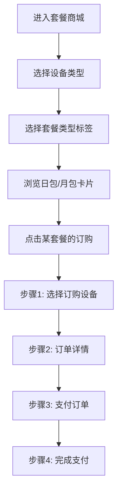
```mermaid
flowchart TD
    Start[进入套餐商城] --> SelectDeviceType[选择设备类型]
    SelectDeviceType --> SelectPackageType[选择套餐类型标签]
    SelectPackageType --> Browse[浏览日包/月包卡片]
    Browse --> Order[点击某套餐的订购]
    Order --> Step1[步骤1: 选择订购设备]
    Step1 --> Step2[步骤2: 订单详情]
    Step2 --> Step3[步骤3: 支付订单]
    Step3 --> Step4[步骤4: 完成支付]
```
### 支付流程
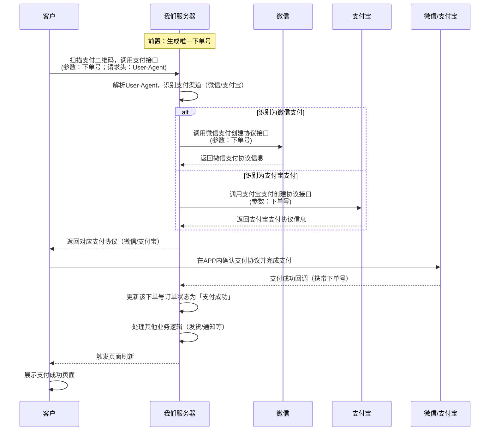
```mermaid
sequenceDiagram
    participant 客户
    participant 服务器 as 我们服务器
    participant 微信
    participant 支付宝
%% 前置步骤：已生成下单号
    note over 服务器: 前置：生成唯一下单号
%% 核心流程：扫码调用接口→解析渠道→返回支付协议
    客户 ->> 服务器: 扫描支付二维码，调用支付接口<br/>(参数：下单号；请求头：User-Agent)
    服务器 ->> 服务器: 解析User-Agent，识别支付渠道（微信/支付宝）

    alt 识别为微信支付
        服务器 ->> 微信: 调用微信支付创建协议接口<br/>(参数：下单号)
        微信 -->> 服务器: 返回微信支付协议信息
    else 识别为支付宝支付
        服务器 ->> 支付宝: 调用支付宝支付创建协议接口<br/>(参数：下单号)
        支付宝 -->> 服务器: 返回支付宝支付协议信息
    end

%% 支付协议返回至APP，客户完成支付
    服务器 -->> 客户: 返回对应支付协议（微信/支付宝）
    客户 ->> 微信/支付宝: 在APP内确认支付协议并完成支付
%% 支付结果处理
    微信/支付宝 -->> 服务器: 支付成功回调（携带下单号）
    服务器 ->> 服务器: 更新该下单号订单状态为「支付成功」
    服务器 ->> 服务器: 处理其他业务逻辑（发货/通知等）
    服务器 -->> 客户: 触发页面刷新
    客户 ->> 客户: 展示支付成功页面
```
**步骤 1 - 选择订购设备**：弹窗内支持按设备卡号或备注名称搜索；筛选所有/在线/离线/报警/停港/关注；按分组展示设备列表，可多选；支持「添加设备」（设备卡号必填、备注名称可选，最多 18 字）；选完成后点击「完成(n)」进入订单详情。
**步骤 2 - 订单详情**：展示套餐详情（价格、短音条数、报位时长、产品规则：可用范围、有效时间、生效时间、退订说明）、办理设备 ID 列表（设备卡号、备注）及数量；需支付金额 = 套餐单价 × 设备数；用户点击「确认下单」进入支付订单。
**步骤 3 - 支付订单**：展示订单编号、下单时间、支付金额；支付方式选择（支付宝、微信支付）；展示支付二维码及说明（如：打开手机支付宝/微信，扫一扫继续支付）；支付即视为同意服务协议；限时完成支付（如 10 分钟内）。
**步骤 4 - 完成支付**：支付成功后弹窗展示「支付成功」、交易详情（套餐类型、套餐信息、套餐价格、设备类型、办理设备 ID 及数量、商品总额、实付金额、订单编号、支付方式、下单时间、支付时间）；用户点击「确认」关闭弹窗。
### 套餐商城列表展示（日包/月包）
每张套餐卡片含：价格（¥）、「订购」按钮、「套餐详情」链接；套餐详情含短音条数、报位时长等（组合套餐两项均有；短音套餐仅条数；报位套餐仅时长与频度，以实际原型为准）。
### 分支流程/异常流程
<table header-row="true">
<tr>
<td>分支ID</td>
<td>条件</td>
<td>流程</td>
</tr>
<tr>
<td>A1</td>
<td>用户关闭订购弹窗或取消</td>
<td>不提交，关闭弹窗</td>
</tr>
<tr>
<td>E1</td>
<td>所选套餐已下架或过期</td>
<td>提示重新选择套餐</td>
</tr>
<tr>
<td>E2</td>
<td>所选设备不可用</td>
<td>提示重新选择设备</td>
</tr>
<tr>
<td>E3</td>
<td>支付超时</td>
<td>二维码失效，提示过期；可从「我的订单」待支付再次发起支付</td>
</tr>
<tr>
<td>E4</td>
<td>支付成功但订单已取消/过期</td>
<td>订单状态不更新，后端 24 小时内自动退款</td>
</tr>
</table>
### 验收标准
- [ ] AC-005.1：设备类型、套餐类型切换后，日包/月包列表正确展示；订购流程四步清晰、可回退或关闭。
- [ ] AC-005.2：选择设备支持搜索、筛选、分组、多选与添加设备；订单详情中设备数与金额计算正确。
- [ ] AC-005.3：支付方式可切换；支付成功后展示完成支付弹窗并展示交易详情；超时与异常提示明确。
---
### 【平台WEB】 US-006：我的订单列表与操作
**描述**：作为平台用户，我希望查看订单列表并按状态筛选，对待支付订单进行支付或取消，对已取消/已支付订单进行删除，以便管理订单。
### 前置条件
- 用户已登录。
### 触发条件
- 用户进入「个人中心」→「我的订单」；或设置订单状态后点击「查询」。
### 主流程
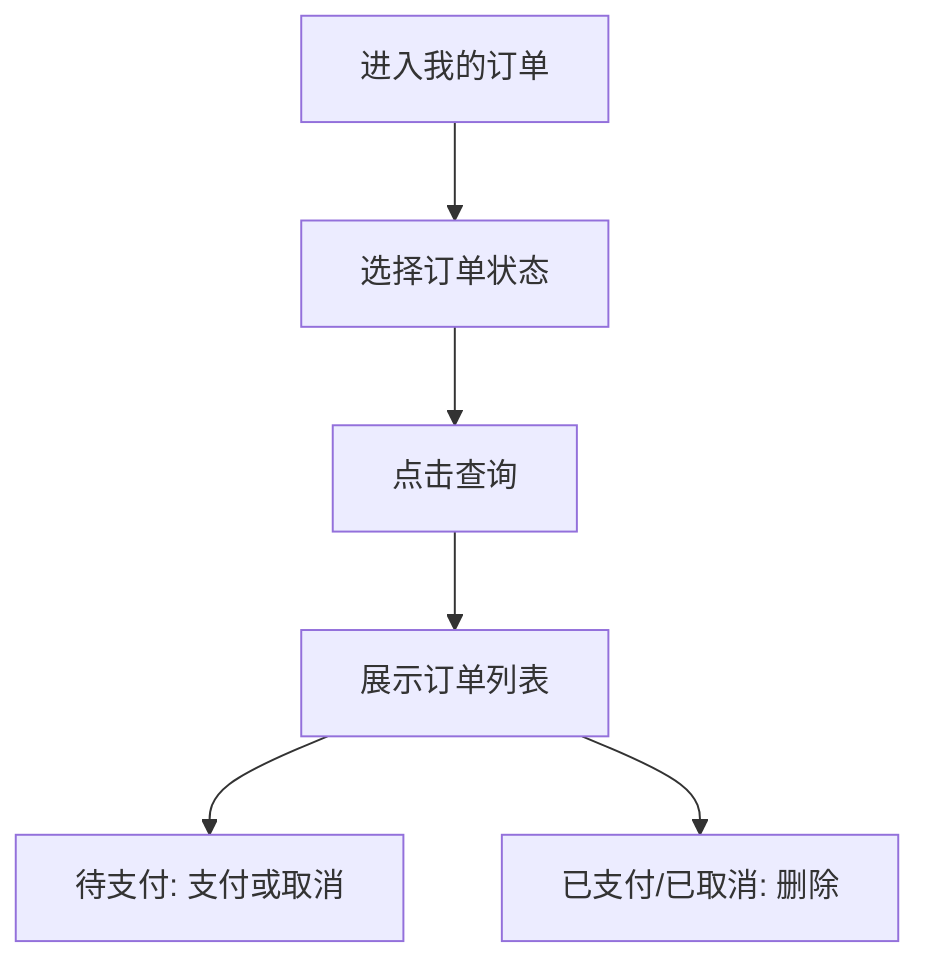
```mermaid
flowchart TD
    Start[进入我的订单] --> Filter[选择订单状态]
    Filter --> Query[点击查询]
    Query --> List[展示订单列表]
    List --> Pay[待支付: 支付或取消]
    List --> Del[已支付/已取消: 删除]
```
### 筛选与列表字段
<table header-row="true">
<tr>
<td>字段/列</td>
<td>标识</td>
<td>类型</td>
<td>说明</td>
</tr>
<tr>
<td>订单状态筛选</td>
<td>orderStatus</td>
<td>枚举</td>
<td>全部/待支付/已支付/已取消</td>
</tr>
<tr>
<td>订单编号</td>
<td>orderNo</td>
<td>字符串</td>
<td>表格列</td>
</tr>
<tr>
<td>商品信息</td>
<td>productInfo</td>
<td>文本</td>
<td>可悬停展示详情：套餐类型、套餐信息、套餐价格、设备类型、办理设备 ID 及数量</td>
</tr>
<tr>
<td>商品总额</td>
<td>totalAmount</td>
<td>金额</td>
<td>表格列</td>
</tr>
<tr>
<td>下单时间</td>
<td>orderTime</td>
<td>日期时间</td>
<td>表格列</td>
</tr>
<tr>
<td>实付金额</td>
<td>payAmount</td>
<td>金额</td>
<td>表格列</td>
</tr>
<tr>
<td>支付方式</td>
<td>payMethod</td>
<td>枚举</td>
<td>微信支付/支付宝/无等</td>
</tr>
<tr>
<td>支付时间</td>
<td>payTime</td>
<td>日期时间</td>
<td>表格列</td>
</tr>
<tr>
<td>订单状态</td>
<td>orderStatus</td>
<td>枚举</td>
<td>待支付/已支付/已取消</td>
</tr>
<tr>
<td>操作</td>
<td>-</td>
<td>-</td>
<td>待支付：支付、取消；已支付/已取消：删除</td>
</tr>
</table>
### 验收标准
- [ ] AC-006.1：筛选后列表与订单状态一致；商品信息悬停可查看完整套餐与设备信息。
- [ ] AC-006.2：待支付订单可「支付」跳转支付流程、「取消」后状态更新；已支付/已取消可「删除」；列表支持分页。
---
### 【平台WEB/小程序/APP】 US-007：通信管理 - 求救群聊 - 消息、短音发送
> **📌 跨端引用说明**：小程序端、APP对讲机端的求救群聊中「消息、短音发送」流程与本节一致，均按下方主流程与消息转发流程实现。小程序 US-107、APP US-301 中涉及发送文本/语音/短语、接收消息时，**直接引用本 US-007**，不再重复描述。
**描述** ：作为web、小程序、救援棒、APP对讲机用户，我希望在求救群聊中选择通信对象后，能够发送文本、短音消息。 其中信息、短音的接收规则我希望救援棒、web端、小程序端能接收来自所有通讯对象的信息、短音，而APP对讲机仅能接收来自救援棒的短音消息。
### 前置条件
- 救援棒设备：已触发报警以及报位到平台，且已经与平台建立TCP连接。
- web或小程序端：用户已登录且已在群聊中；左侧设备/联系人列表可用；已选择通信对象。
- APP对讲机：已设置对讲机ID，已建立TCP连接成功并且已在群聊中。
### 触发条件
- 用户进入控制台/消息等场景，在左侧选择对应的求救群聊后，进入求救群聊界面。
### 主流程（此流程不包括救援棒设备）
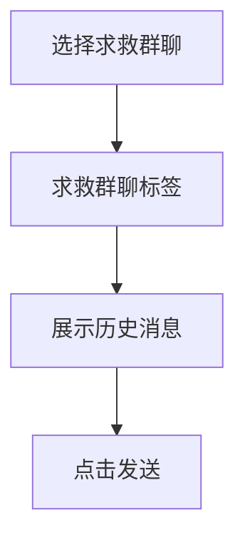
```mermaid
flowchart TD
    Start[选择求救群聊] --> Tab[求救群聊标签]
    Tab --> Send[展示历史消息]
    Send --> Submit[点击发送]
```
### 所有设备端消息收发流程
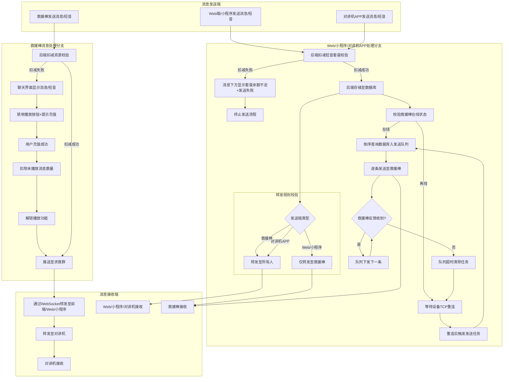
```mermaid
flowchart TD
    subgraph 消息发送端
        A1[救援棒发送消息/短音]
        A2[Web端/小程序发送消息/短音]
        A3[对讲机APP发送消息/短音]
    end

    subgraph 救援棒消息处理分支
        A1 --> B1[后端扣减资源校验]
        B1 -->|扣减失败| C1[聊天界面显示消息/短音]
        C1 --> D1[禁用播放按钮+提示充值]
        D1 --> E1[用户充值成功]
        E1 --> F1[扣除未播放消息数量]
        F1 --> G1[解锁播放功能]
        G1 --> H1[推送至求救群]
        B1 -->|扣减成功| H1
    end

    subgraph Web/小程序/对讲机APP处理分支
        A2 --> K1[后端扣减短音套餐校验]
        A3 --> K1
        K1 -->|扣减失败| L1[消息下方显示套餐余额不足+发送失败]
        L1 --> AC1[终止发送流程]
        K1 -->|扣减成功| M1[后端存储至数据库]
        M1 --> N1[校验救援棒在线状态]
        N1 -->|在线| O1[倒序查询数据库入发送队列]
        O1 --> P1[逐条发送至救援棒]
        P1 --> Q1{救援棒反馈收到?}
        Q1 -->|是| R1[队列下发下一条]
        Q1 -->|否| S1[队列超时清除任务]
        N1 -->|离线| T1[等待设备TCP重连]
        T1 --> U1[重连后触发发送任务]
        U1 --> O1
        R1 --> Q1
        S1 --> T1

        subgraph 转发规则校验
            V1{发送端类型}
            V1 -->|救援棒| W1[转发至所有人]
            V1 -->|Web/小程序| X1[仅转发至救援棒]
            V1 -->|对讲机APP| W1
        end
        M1 --> V1
    end

    subgraph 消息接收端
        H1 --> I1[通过WebSocket转发至前端/Web/小程序]
        I1 --> J1[转发至对讲机]
        W1 --> Z1[Web/小程序/对讲机接收]
        X1 --> AA1[救援棒接收]
        J1 --> AB1[对讲机接收]
        P1 --> AA1
    end
```
**左侧**：搜索（设备卡号或备注名称）。
**中央**：标签「普通通信」「求救群聊」；当前救援对象名称；底部发送按钮。
### 验收标准
- [ ] AC-007.1：左侧设备列表与筛选、分组展示正确；选择后中央展示对应救援通信会话与历史消息。
- [ ] AC-007.2：可发送文本或短音消息；发送成功后在会话中展示。
---
### 【平台WEB/小程序】 US-008：通信管理 - 求救群聊（套餐信息、群管理）
> **📌 跨端引用说明**：小程序端 US-107「通信消息 - 求救群聊（套餐信息、群管理）」与本节流程一致，**直接引用本 US-008** 。小程序仅交互形式（如底部导航、卡片样式）不同，业务逻辑相同。
**描述**：作为平台用户，我希望在求救群聊中查看当前 SOS 事件、套餐信息与群成员，发送/接收消息，并参与群管理（添加成员、标记救援已完成），以便参与救援协同。
### 前置条件
- 用户已登录；存在求救群聊（如设备报警后创建）；用户为该群成员或有权查看。
### 触发条件
- 用户在通信面板切换至「求救群聊」标签；或从事件入口进入某 SOS 求救群聊。
### 主流程
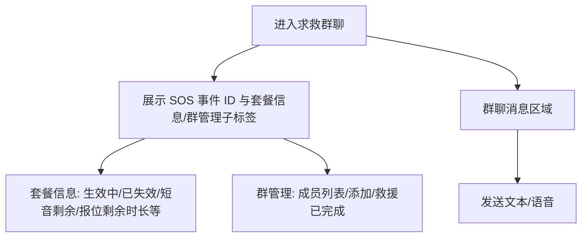
```mermaid
flowchart TD
    Start[进入求救群聊] --> Header[展示 SOS 事件 ID 与套餐信息/群管理子标签]
    Header --> Info[套餐信息: 生效中/已失效/短音剩余/报位剩余时长等]
    Header --> Group[群管理: 成员列表/添加/救援已完成]
    Start --> Chat[群聊消息区域]
    Chat --> Send[发送文本/语音]
```
### 群管理-添加新成员
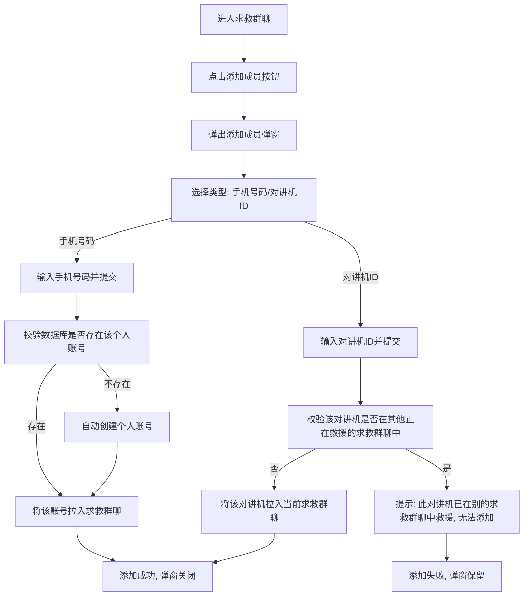
```mermaid
flowchart TD
    Start[进入求救群聊] --> A[点击添加成员按钮]
    A --> B[弹出添加成员弹窗]
    B --> C[选择类型: 手机号码/对讲机ID]
    C -->|手机号码| D[输入手机号码并提交]
    C -->|对讲机ID| E[输入对讲机ID并提交]
%% 手机号码分支
    D --> F[校验数据库是否存在该个人账号]
    F -->|不存在| G[自动创建个人账号]
    F -->|存在| H[将该账号拉入求救群聊]
    G --> H
    H --> I[添加成功, 弹窗关闭]
%% 对讲机ID分支
    E --> J[校验该对讲机是否在其他正在救援的求救群聊中]
    J -->|是| K[提示: 此对讲机已在别的求救群聊中救援, 无法添加]
    J -->|否| L[将该对讲机拉入当前求救群聊]
    L --> I
    K --> M[添加失败, 弹窗保留]
```
**主事件头**：SOS 事件 ID（如 SOS-10230210-01）；子标签「套餐信息」「群管理」；服务状态如短音剩余条数、报位剩余时长、「充值」入口、最新情况（如设备状态、最后通话时间）及「查看」。
**套餐信息**：展示生效中/已失效；生效中展示有效期、设备 ID、短音条数（剩余/总共）、报位时长（剩余/总共）、「查看套餐明细」「购买套餐」；已失效展示套餐描述、「查看历史明细」「购买套餐」。
**群管理**：成员列表（头像、名称与 ID、最近活跃时间、编辑入口）；「添加」按钮；「救援已完成」按钮。
**群聊消息**：时间线、群内已读/未读、发送失败等状态；支持语音与文本发送。
### 分支流程/异常流程
<table header-row="true">
<tr>
<td>分支ID</td>
<td>条件</td>
<td>流程</td>
</tr>
<tr>
<td>E1</td>
<td>套餐余额不足发送消息</td>
<td>提示余额不足并引导充值</td>
</tr>
<tr>
<td>E2</td>
<td>消息发送失败</td>
<td>展示「发送失败」等状态，可重试</td>
</tr>
</table>
### 验收标准
- [ ] AC-008.1：求救群聊展示对应 SOS 事件与套餐信息、群管理；套餐信息中生效中/已失效状态与额度展示正确。
- [ ] AC-008.2：群管理可查看成员、添加成员、编辑；「救援已完成」操作后状态更新。
- [ ] AC-008.3：群聊消息可发送文本/语音；已读/未读与发送状态展示正确。
---
### 【平台WEB】 US-009：通信管理 - 求救群聊 - 求救群聊状态变更
**描述**：作为平台系统与群成员，我希望求救群聊的状态能随救援棒报警/报平安、超时规则及成员操作正确变更，并在「救援完成」后禁止所有人发送消息与短音，以便规范救援流程并避免无效打扰。
### 前置条件
- 求救群聊已创建（救援棒设备主动或被动触发报警后创建）；群聊具备状态字段（救援中 / 救援完成）。
### 触发条件
- 救援棒设备报平安；或群聊最后一条消息超过 3 天未产生新消息/短音；或企业账号、个人账号、客服（后续加入）点击「救援完成」。
### 主流程
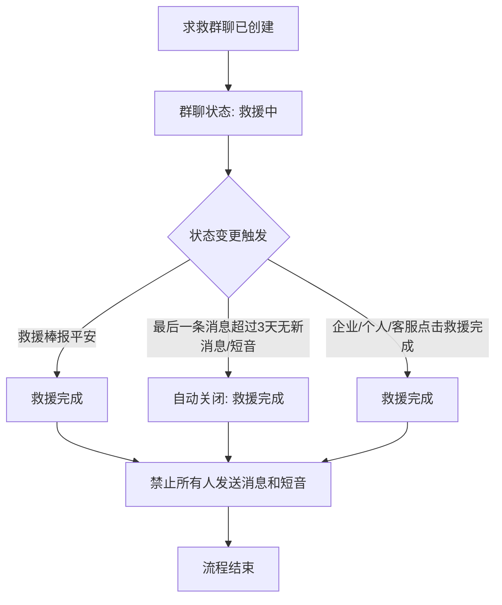
```mermaid
flowchart TD
    Start[求救群聊已创建] --> Status1[群聊状态: 救援中]
    Status1 --> Trigger{状态变更触发}
    Trigger -->|救援棒报平安| ToComplete1[救援完成]
    Trigger -->|最后一条消息超过3天无新消息/短音| ToComplete2[自动关闭: 救援完成]
    Trigger -->|企业/个人/客服点击救援完成| ToComplete3[救援完成]
    ToComplete1 --> Lock[禁止所有人发送消息和短音]
    ToComplete2 --> Lock
    ToComplete3 --> Lock
    Lock --> End[流程结束]
```
### 状态与规则说明
<table header-row="true">
<tr>
<td>群聊状态</td>
<td>说明</td>
<td>可发消息/短音</td>
<td>触发方式</td>
</tr>
<tr>
<td>救援中</td>
<td>报警后创建或报警救援中</td>
<td>是</td>
<td>救援棒报警创建群聊；群聊初始状态为「救援中」</td>
</tr>
<tr>
<td>救援完成</td>
<td>救援结束或超时关闭</td>
<td>否（所有人不可发消息、不可发短音）</td>
<td>① 救援棒设备报平安；② 超时：最后一条消息超过 3 天无新消息/短音则自动关闭；③ 企业账号、个人账号、客服点击「救援完成」</td>
</tr>
</table>
**超时自动关闭规则**：以群聊「最后一条消息」的时间为基准，若超过 3 天（72 小时）没有任何新消息或短音，则系统自动将该群聊状态更新为「救援完成」，效果与手动点击「救援完成」一致（禁止发送消息与短音）。
**手动点击「救援完成」**：仅企业账号、个人账号、客服（后续加入）可点击；点击后群聊状态变为「救援完成」，所有人不可再发送消息与短音。
### 分支流程/异常流程
<table header-row="true">
<tr>
<td>分支ID</td>
<td>条件</td>
<td>流程</td>
</tr>
<tr>
<td>E1</td>
<td>群聊已为「救援完成」时有人尝试发消息/短音</td>
<td>前端禁止发送并提示「该群聊已救援完成，无法发送」；后端拒绝并返回明确错误</td>
</tr>
<tr>
<td>E2</td>
<td>非企业/个人/客服账号点击「救援完成」</td>
<td>不展示按钮或点击无权限时提示「无操作权限」</td>
</tr>
</table>
### 验收标准
- [ ] AC-009.1：救援棒报警创建群聊时，群聊状态为「救援中」；救援棒报平安后，该群聊状态自动变为「救援完成」，且所有人无法再发送消息与短音。
- [ ] AC-009.2：群聊最后一条消息超过 3 天无新消息/短音时，系统自动将群聊状态更新为「救援完成」，并禁止发送消息与短音。
- [ ] AC-009.3：企业账号、个人账号、客服（后续加入）可点击「救援完成」，点击后群聊状态变为「救援完成」，所有人无法再发送消息与短音。
- [ ] AC-009.4：群聊状态为「救援完成」时，前端禁止输入与发送，后端拒绝消息/短音发送请求并返回明确错误提示。
---
### 【平台WEB】 US-010：设备状态管理（上线、离线、报警）
**描述**：作为平台用户，我希望系统能自动更新设备状态（上线 / 离线 / 报警），并在应急救援棒报警时触发状态变更、通知推送、报位扣减及求救群聊创建等联动逻辑，以便及时响应设备异常情况。
### 前置条件
- 用户已登录星联应急叫应平台；
- 设备已绑定至用户账号；
- 设备（应急救援棒）具备状态上报能力。
### 触发条件
- 设备主动上报状态（上线 / 离线 / 报警）；
- 平台检测到设备心跳超时、断开链接判定为离线；
- 应急救援棒触发报警机制。
### 主流程
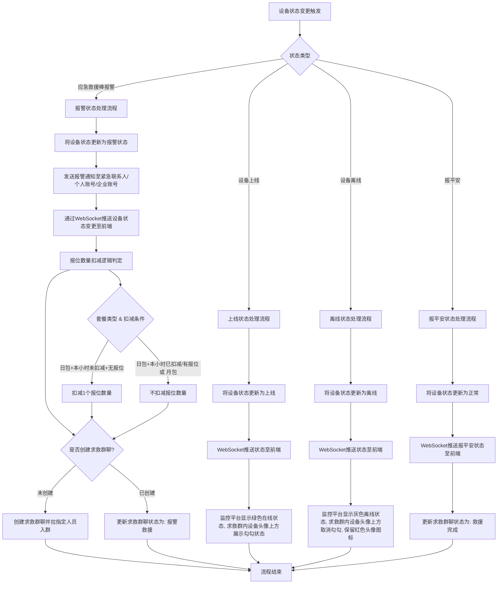
```mermaid
flowchart TD
    Start[设备状态变更触发] --> JudgeType{状态类型}
    JudgeType -->|应急救援棒报警| AlarmProcess[报警状态处理流程]
    JudgeType -->|设备上线| OnlineProcess[上线状态处理流程]
    JudgeType -->|设备离线| OfflineProcess[离线状态处理流程]
    JudgeType -->|报平安| SafeProcess[报平安状态处理流程]
%% 报警分支（原逻辑保留+关联群聊状态）
    AlarmProcess --> Step1[将设备状态更新为报警状态]
    Step1 --> Step2[发送报警通知至紧急联系人/个人账号/企业账号]
    Step2 --> Step3[通过WebSocket推送设备状态变更至前端]
    Step3 --> Step4[报位数量扣减逻辑判定]
    Step4 --> Step5{是否创建求救群聊?}
    Step5 -->|未创建| CreateGroup[创建求救群聊并拉指定人员入群]
    Step5 -->|已创建| UpdateGroupStatus1[更新求救群聊状态为: 报警救援]
    CreateGroup --> End[流程结束]
    UpdateGroupStatus1 --> End
    Step4 --> JudgePackage{套餐类型 & 扣减条件}
    JudgePackage -->|日包+本小时未扣减+无报位| Deduct[扣减1个报位数量]
    JudgePackage -->|日包+本小时已扣减/有报位 或 月包| NoDeduct[不扣减报位数量]
    Deduct --> Step5
    NoDeduct --> Step5
%% 上线分支
    OnlineProcess --> UpdateOnline[将设备状态更新为上线]
    UpdateOnline --> WebSocketOnline[WebSocket推送状态至前端]
    WebSocketOnline --> ShowOnline[监控平台显示绿色在线状态, 求救群内设备头像上方展示勾勾状态]
    ShowOnline --> End
%% 离线分支
    OfflineProcess --> UpdateOffline[将设备状态更新为离线]
    UpdateOffline --> WebSocketOffline[WebSocket推送状态至前端]
    WebSocketOffline --> ShowOffline[监控平台显示灰色离线状态, 求救群内设备头像上方取消勾勾, 保留红色头像图标]
    ShowOffline --> End
%% 报平安分支
    SafeProcess --> UpdateSafe[将设备状态更新为正常]
    UpdateSafe --> WebSocketSafe[WebSocket推送报平安状态至前端]
    WebSocketSafe --> UpdateGroupStatus2[更新求救群聊状态为: 救援完成]
    UpdateGroupStatus2 --> End
```
**报警事件头**：应急救援棒设备手动或自动触发报警
**报警报位上报到应急叫应平台**：校验是否是应急救援棒设备，不是则走监控平台旧流程；是则走扣减报位数量、创建群聊等逻辑。
**扣减报位条件**：日包+本小时未扣减。月包和在本小时已扣减报位数量则不在扣除。
**群聊状态**：设备报警报位中（报警救援中）、报平安完成（救援完成）。
### 核心状态交互规则说明
<table header-row="true">
<tr>
<td>设备状态</td>
<td>监控平台展示</td>
<td>求救群聊内展示</td>
<td>群聊状态联动</td>
</tr>
<tr>
<td>上线</td>
<td>绿色在线标识</td>
<td>设备头像上方显示勾勾</td>
<td>无（仅更新成员状态标识）</td>
</tr>
<tr>
<td>离线</td>
<td>灰色离线标识</td>
<td>设备头像上方取消勾勾，保留红色头像图标</td>
<td>无（仅更新成员状态标识）</td>
</tr>
<tr>
<td>报警</td>
<td>红色报警标识</td>
<td>设备头像标红 + 报警提示</td>
<td>群聊状态置为「报警救援」</td>
</tr>
<tr>
<td>报平安</td>
<td>恢复绿色在线</td>
<td>设备头像恢复正常勾勾</td>
<td>群聊状态置为「救援完成」</td>
</tr>
</table>
### 验收标准
- [ ] AC-010.1：设备上线 / 离线状态变更后，前端可通过 WebSocket 实时接收并展示最新状态；
- [ ] AC-010.2：应急救援棒报警时，设备状态自动更新为「报警」，且报警通知精准推送至指定对象；
- [ ] AC-010.3：报位扣减逻辑生效：日包场景下，报警小时内无报位且未扣减过则扣减 1 个报位，月包 / 已扣减 / 有报位则不扣减；
- [ ] AC-010.4：求救群聊创建逻辑生效：报警事件未创建群聊则自动创建并拉指定人员入群，已创建则不重复操作；
---
## 【小程序】用户故事
### 【小程序】 US-101：实名认证（微信授权）
**描述**：作为个人账号用户，我希望通过微信授权获取实名认证信息，以便使用需实名认证的功能。
> **说明**：与平台 US-002 区别为——平台使用第三方实名接口，小程序使用微信授权获取实名认证信息；流程其余校验与异常处理类似。
### 应用信息
- **触发**：在「我的信息」中点击实名认证入口；或访问需实名功能时跳转。
- **流程**：点击实名认证 → 调用微信授权接口获取实名信息 → 通过则更新为已认证，失败则提示。
- **验收**：未认证时展示实名认证入口；授权成功后展示已认证状态。
---
### 【小程序】 US-102：绑定设备与紧急联系人
**描述**：作为个人账号用户，我希望绑定天通救援棒并为其设置紧急联系人，以便设备报警时通知到人。
### 前置条件
- 用户已登录小程序并完成实名认证；有可绑定的设备（如通过扫码或输入设备卡号）。
### 触发条件
- 用户在设备管理或绑定设备入口进入绑定流程。
### 主流程
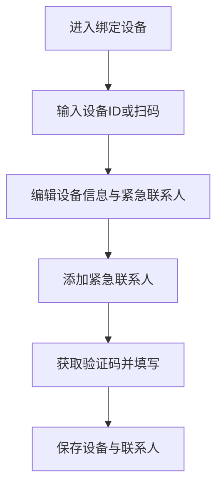
```mermaid
flowchart TD
    Start[进入绑定设备] --> Input[输入设备ID或扫码]
    Input --> Edit[编辑设备信息与紧急联系人]
    Edit --> AddContact[添加紧急联系人]
    AddContact --> Verify[获取验证码并填写]
    Verify --> Save[保存设备与联系人]
```
**绑定设备表单**：
<table header-row="true">
<tr>
<td>字段名</td>
<td>标识</td>
<td>类型</td>
<td>必填</td>
<td>说明</td>
</tr>
<tr>
<td>设备ID</td>
<td>deviceId</td>
<td>字符串</td>
<td>是</td>
<td>如 123123123</td>
</tr>
<tr>
<td>所属分组</td>
<td>group</td>
<td>枚举</td>
<td>是</td>
<td>下拉选择，如「我的分组」</td>
</tr>
<tr>
<td>设备类型</td>
<td>deviceType</td>
<td>字符串</td>
<td>只读</td>
<td>如：天通应急救援棒</td>
</tr>
<tr>
<td>显示图标</td>
<td>displayIcon</td>
<td>枚举</td>
<td>否</td>
<td>可选：人、车、卡车、熊猫、船、直升机、飞机、火车、信号塔等</td>
</tr>
</table>
**紧急联系人**：每人需填写：
<table header-row="true">
<tr>
<td>字段名</td>
<td>标识</td>
<td>类型</td>
<td>必填</td>
<td>说明</td>
</tr>
<tr>
<td>手机号码</td>
<td>phone</td>
<td>字符串</td>
<td>是</td>
<td>格式校验</td>
</tr>
<tr>
<td>姓名</td>
<td>name</td>
<td>字符串</td>
<td>是</td>
<td>最多 20 字符</td>
</tr>
<tr>
<td>验证码</td>
<td>verificationCode</td>
<td>字符串</td>
<td>是</td>
<td>点击「获取验证码」后填写</td>
</tr>
</table>
### 分支流程/异常流程
<table header-row="true">
<tr>
<td>分支ID</td>
<td>条件</td>
<td>流程</td>
</tr>
<tr>
<td>A1</td>
<td>用户取消绑定</td>
<td>返回，不保存</td>
</tr>
<tr>
<td>E1</td>
<td>设备ID不存在</td>
<td>提示「无此设备信息」</td>
</tr>
<tr>
<td>E2</td>
<td>手机号格式错误</td>
<td>提示「请输入正确的手机号码」</td>
</tr>
<tr>
<td>E3</td>
<td>紧急联系人姓名超长</td>
<td>提示「紧急联系人最大输入 20 个字符」</td>
</tr>
<tr>
<td>E4</td>
<td>验证码错误或过期</td>
<td>提示「验证码错误或已过期，请重新获取」</td>
</tr>
</table>
### 验收标准
- [ ] AC-102.1：绑定设备时可选择设备图标、所属分组；可添加紧急联系人，每人需填写手机号、姓名、验证码。
- [ ] AC-102.2：保存后设备绑定成功，紧急联系人设置生效；设备报警时将通知到设置的紧急联系人。
---
### 【小程序】 US-103：我的套餐列表与套餐明细
**描述**：作为小程序用户，我希望查看已购套餐列表及套餐明细，以便掌握套餐使用情况。
> 与平台 US-004：我的套餐列表与筛选 应用逻辑一致。小程序以「我的套餐」「套餐商城」标签切换，套餐卡片展示生效中/已失效及进度条。
### 应用信息
- **验收**：AC-103.1 支持设备类型、设备ID、状态筛选；生效中套餐展示使用进度条；点击「查看套餐明细」可查看扣费记录。
---
### 【小程序】 US-104：套餐商城展示与订购
**描述**：作为小程序用户，我希望在套餐商城浏览套餐（按设备类型与套餐类型筛选、日包/月包）并完成订购，以便为设备办理套餐。
> 与平台 US-005：套餐商城展示与订购流程 应用逻辑一致。小程序支付方式为微信支付。
### 应用信息
- **验收**：AC-104.1 支持设备类型与套餐类型筛选；点击「订购」进入订购流程；支持选择设备、确认订单、支付等步骤。
---
### 【小程序】 US-105：我的订单列表与操作
**描述**：作为小程序用户，我希望查看订单列表并按状态筛选，对待支付订单进行支付或取消，对已支付/已取消订单进行删除，以便管理订单。
> 与平台 US-006：我的订单列表与操作 应用逻辑一致。小程序以订单状态标签切换，订单卡片展示形式不同。
### 应用信息
- **验收**：AC-105.1 待支付展示倒计时与支付/取消；已支付/已取消可删除；点击订单可查看详情；支付流程正常。
---
### 【小程序】 US-106：报文下发额度查询
**描述**：作为小程序用户，我希望查看各设备类型的剩余报文下发数量，以便了解可用额度。
> 与平台 US-003：日报文下发额度查询 应用逻辑一致。小程序以卡片形式展示各设备类型与剩余数量。
### 应用信息
- **验收**：AC-106.1 以卡片形式展示各设备类型与对应剩余报文下发数量；数据与账号一致。
---
### 【小程序】 US-107：通信消息 - 求救群聊（套餐信息、群管理）
**描述**：作为小程序用户，我希望在求救群聊中查看 SOS 事件、套餐信息、群成员，发送/接收消息，并参与群管理，以便参与救援协同。
> 与平台 US-008：通信管理 - 求救群聊（套餐信息、群管理） 应用逻辑一致；消息、短音发送详见 US-007。
### 应用信息
- **验收**：AC-107.1 求救群聊展示 SOS 事件、套餐信息、群管理；AC-107.2 群管理可查看成员、添加成员；群聊消息可发送文本/语音。
---
## 【管理后台】用户故事
### 【管理后台】 US-201：查看与筛选天通应急套餐列表
**描述**：作为后台管理员，我希望按套餐类型、套餐状态筛选并查看套餐列表，以便快速定位需要维护的套餐。
### 前置条件
- 用户已登录管理后台并具有套餐管理权限。
### 触发条件
- 用户进入「套餐管理」→「天通应急套餐管理」；或设置筛选条件后点击「查询」。
### 主流程
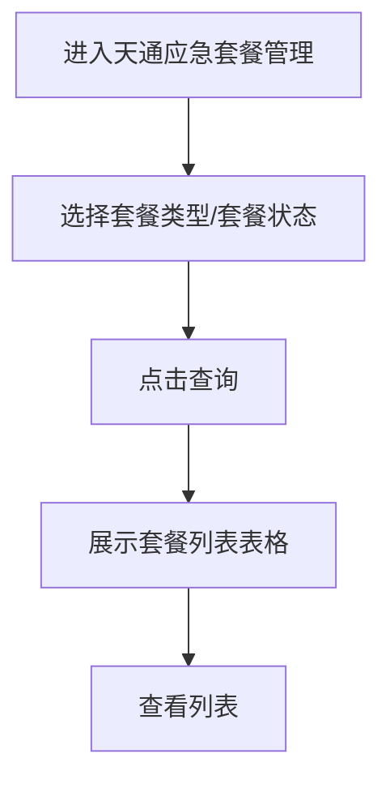
```mermaid
flowchart TD
    Start[进入天通应急套餐管理] --> Filter[选择套餐类型/套餐状态]
    Filter --> Query[点击查询]
    Query --> List[展示套餐列表表格]
    List --> End[查看列表]
```
### 筛选与列表字段
<table header-row="true">
<tr>
<td>字段/列</td>
<td>标识</td>
<td>类型</td>
<td>说明</td>
</tr>
<tr>
<td>套餐类型筛选</td>
<td>packageType</td>
<td>枚举</td>
<td>全部/组合套餐/短音套餐/报位套餐</td>
</tr>
<tr>
<td>套餐状态筛选</td>
<td>packageStatus</td>
<td>枚举</td>
<td>全部/使用中/已禁用</td>
</tr>
<tr>
<td>排序下标</td>
<td>sortIndex</td>
<td>整数</td>
<td>列表列</td>
</tr>
<tr>
<td>设备类型</td>
<td>deviceType</td>
<td>字符串</td>
<td>如：天通应急救援棒</td>
</tr>
<tr>
<td>套餐类型</td>
<td>packageType</td>
<td>枚举</td>
<td>组合/短音/报位</td>
</tr>
<tr>
<td>套餐信息</td>
<td>packageInfo</td>
<td>文本</td>
<td>短音条数、报位时长、频度等描述</td>
</tr>
<tr>
<td>套餐价格</td>
<td>packagePrice</td>
<td>字符串</td>
<td>如 19.9元/天</td>
</tr>
<tr>
<td>状态</td>
<td>status</td>
<td>枚举</td>
<td>使用中/已禁用</td>
</tr>
<tr>
<td>备注</td>
<td>remarks</td>
<td>文本</td>
<td>可选</td>
</tr>
<tr>
<td>更新时间</td>
<td>updateTime</td>
<td>日期时间</td>
<td>格式 YYYY-MM-DD HH\:mm\:ss</td>
</tr>
<tr>
<td>操作</td>
<td>-</td>
<td>-</td>
<td>编辑、禁用/启用、删除</td>
</tr>
</table>
### 验收标准
- [ ] AC-201.1：筛选为「全部」时展示所有套餐；选择具体套餐类型/状态后点击查询，仅展示符合条件的数据。
- [ ] AC-201.2：列表支持分页；无数据时展示「暂无数据」提示。
---
### 【管理后台】 US-202：添加或编辑天通应急套餐
**描述**：作为后台管理员，我希望通过表单添加或编辑天通应急套餐（短音/报位/组合），以便配置可售套餐。
### 前置条件
- 用户已登录并具有套餐管理权限；编辑时目标套餐已存在。
### 触发条件
- 在套餐列表页点击「添加」打开添加套餐弹窗；或点击某行的「编辑」打开编辑套餐弹窗。
### 主流程
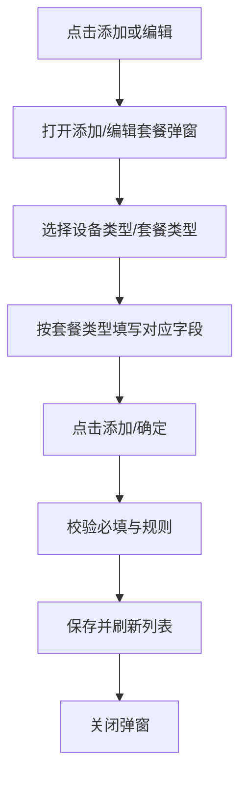
```mermaid
flowchart TD
    Start[点击添加或编辑] --> Open[打开添加/编辑套餐弹窗]
    Open --> SelectType[选择设备类型/套餐类型]
    SelectType --> Fill[按套餐类型填写对应字段]
    Fill --> Submit[点击添加/确定]
    Submit --> Validate[校验必填与规则]
    Validate --> Save[保存并刷新列表]
    Save --> End[关闭弹窗]
```
### 分支流程/异常流程
<table header-row="true">
<tr>
<td>分支ID</td>
<td>条件</td>
<td>流程</td>
</tr>
<tr>
<td>A1</td>
<td>用户点击关闭或取消</td>
<td>关闭弹窗，不保存</td>
</tr>
<tr>
<td>E1</td>
<td>必填项为空或格式错误</td>
<td>提示错误项，不提交</td>
</tr>
<tr>
<td>E2</td>
<td>提交时网络异常</td>
<td>提示”网络异常，请稍后重试”</td>
</tr>
</table>
### 字段规范（添加/编辑表单）
**通用字段：**
<table header-row="true">
<tr>
<td>字段名</td>
<td>标识</td>
<td>类型</td>
<td>必填</td>
<td>默认值</td>
<td>校验规则</td>
<td>显示方式</td>
</tr>
<tr>
<td>设备类型</td>
<td>deviceType</td>
<td>枚举</td>
<td>是</td>
<td>天通应急救援棒</td>
<td>枚举值</td>
<td>下拉</td>
</tr>
<tr>
<td>套餐类型</td>
<td>packageType</td>
<td>枚举</td>
<td>是</td>
<td>-</td>
<td>组合套餐/短音套餐/报位套餐</td>
<td>下拉</td>
</tr>
<tr>
<td>价格</td>
<td>price</td>
<td>数值</td>
<td>是</td>
<td>-</td>
<td>\>0，精度 2 位小数</td>
<td>数字输入+单位「元」</td>
</tr>
<tr>
<td>服务周期</td>
<td>servicePeriod</td>
<td>枚举</td>
<td>是</td>
<td>按天</td>
<td>如：按天、按月</td>
<td>下拉</td>
</tr>
<tr>
<td>排序下标</td>
<td>sortIndex</td>
<td>整数</td>
<td>否</td>
<td>1</td>
<td>≥1</td>
<td>数字输入</td>
</tr>
<tr>
<td>备注</td>
<td>remarks</td>
<td>文本</td>
<td>否</td>
<td>-</td>
<td>长度限制待定</td>
<td>多行文本</td>
</tr>
</table>
**短音套餐专属：**
<table header-row="true">
<tr>
<td>字段名</td>
<td>标识</td>
<td>类型</td>
<td>必填</td>
<td>单位</td>
<td>校验规则</td>
</tr>
<tr>
<td>短音条数</td>
<td>shortMessageCount</td>
<td>整数</td>
<td>是</td>
<td>条</td>
<td>\>0</td>
</tr>
</table>
**报位套餐专属：**
<table header-row="true">
<tr>
<td>字段名</td>
<td>标识</td>
<td>类型</td>
<td>必填</td>
<td>单位</td>
<td>校验规则</td>
</tr>
<tr>
<td>报位时长</td>
<td>positionDuration</td>
<td>数值</td>
<td>是</td>
<td>小时</td>
<td>\>0</td>
</tr>
<tr>
<td>报位频度</td>
<td>positionFrequency</td>
<td>数值</td>
<td>是</td>
<td>次/小时</td>
<td>\>0</td>
</tr>
</table>
**组合套餐：** 同时包含短音条数、报位时长、报位频度，规则同上。
### 验收标准
- [ ] AC-202.1：选择「短音套餐」时仅展示短音条数；选择「报位套餐」时仅展示报位时长、报位频度；选择「组合套餐」时展示上述全部字段。
- [ ] AC-202.2：提交成功后列表刷新，弹窗关闭；编辑时弹窗预填当前套餐数据。
- [ ] AC-202.3：必填项为空或价格/数量≤0 时提交按钮可置灰或提交时提示错误。
---
### 【管理后台】 US-203：启用、禁用或删除天通应急套餐
**描述**：作为后台管理员，我希望对套餐执行启用、禁用或删除，以便控制套餐是否可售及清理无效配置。
### 触发条件
- 在套餐列表某行点击「禁用」/「启用」或「删除」。
### 业务规则
<table header-row="true">
<tr>
<td>规则ID</td>
<td>规则名称</td>
<td>触发时机</td>
<td>规则描述</td>
</tr>
<tr>
<td>BR-203-1</td>
<td>禁用后不展示给C端</td>
<td>套餐状态变为已禁用</td>
<td>已禁用套餐不可被用户订购</td>
</tr>
<tr>
<td>BR-203-2</td>
<td>删除二次确认</td>
<td>点击删除</td>
<td>弹窗确认后再执行删除</td>
</tr>
</table>
### 验收标准
- [ ] AC-203.1：禁用后该行状态变为「已禁用」，操作变为「启用」「删除」；启用后变为「使用中」，操作变为「禁用」「删除」。
- [ ] AC-203.2：删除需二次确认；删除后列表刷新，该条不再展示。
---
### 【管理后台】 US-204：查询天通应急套餐明细
**描述**：作为后台管理员，我希望按设备类型、设备ID、扣除时间范围查询套餐使用明细，以便核对扣费与使用情况。
### 前置条件
- 用户已登录并具有套餐管理或明细查看权限。
### 触发条件
- 用户进入「套餐管理」→「天通应急套餐明细」；或设置筛选后点击「查询」。
### 主流程
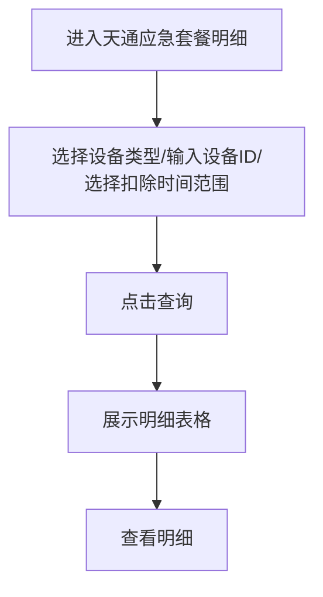
```mermaid
flowchart TD
    Start[进入天通应急套餐明细] --> Filter[选择设备类型/输入设备ID/选择扣除时间范围]
    Filter --> Query[点击查询]
    Query --> List[展示明细表格]
    List --> End[查看明细]
```
### 筛选与列表字段
<table header-row="true">
<tr>
<td>字段/列</td>
<td>标识</td>
<td>类型</td>
<td>说明</td>
</tr>
<tr>
<td>设备类型筛选</td>
<td>deviceType</td>
<td>枚举</td>
<td>全部或具体设备类型</td>
</tr>
<tr>
<td>设备ID</td>
<td>deviceId</td>
<td>字符串</td>
<td>输入框，支持模糊或精确（待定）</td>
</tr>
<tr>
<td>扣除时间</td>
<td>deductionTimeStart/End</td>
<td>日期时间范围</td>
<td>开始时间、结束时间</td>
</tr>
<tr>
<td>设备类型</td>
<td>deviceType</td>
<td>字符串</td>
<td>表格列</td>
</tr>
<tr>
<td>设备ID</td>
<td>deviceId</td>
<td>字符串</td>
<td>表格列</td>
</tr>
<tr>
<td>上下行消息</td>
<td>messageDirection</td>
<td>枚举</td>
<td>上行/下行</td>
</tr>
<tr>
<td>短音扣除条数</td>
<td>shortMessageDeduction</td>
<td>整数</td>
<td>条</td>
</tr>
<tr>
<td>报位扣除时长(小时)</td>
<td>positionDeductionHours</td>
<td>数值</td>
<td>小时</td>
</tr>
<tr>
<td>扣除时间</td>
<td>deductionTime</td>
<td>日期时间</td>
<td>表格列</td>
</tr>
</table>
### 验收标准
- [ ] AC-204.1：选择时间范围、设备类型或输入设备ID后点击查询，列表展示符合条件明细；支持分页。
- [ ] AC-204.2：无数据时展示「暂无数据」。
---
### 【管理后台】 US-205：查看与筛选订单列表
**描述**：作为后台管理员，我希望按商品类型、订单状态、下单时间、订单编号筛选并查看订单列表，以便处理订单与退款。
### 前置条件
- 用户已登录并具有订单管理权限。
### 触发条件
- 用户进入「订单管理」→「订单管理」；或设置筛选条件后点击「查询」。
### 筛选与列表字段
<table header-row="true">
<tr>
<td>字段/列</td>
<td>标识</td>
<td>类型</td>
<td>说明</td>
</tr>
<tr>
<td>商品类型</td>
<td>productType</td>
<td>枚举</td>
<td>全部/通信套餐等</td>
</tr>
<tr>
<td>订单状态</td>
<td>orderStatus</td>
<td>枚举</td>
<td>全部/待支付/已支付/已退款等</td>
</tr>
<tr>
<td>下单时间</td>
<td>orderTimeStart/End</td>
<td>日期时间范围</td>
<td>开始时间、结束时间；支持快捷：今天、昨天、本月、上月、最近7天、最近30天、最近90天、最近1年、本年、去年</td>
</tr>
<tr>
<td>订单搜索</td>
<td>orderKeyword</td>
<td>字符串</td>
<td>如订单编号</td>
</tr>
<tr>
<td>订单编号</td>
<td>orderNo</td>
<td>字符串</td>
<td>表格列</td>
</tr>
<tr>
<td>商品类型</td>
<td>productType</td>
<td>字符串</td>
<td>表格列</td>
</tr>
<tr>
<td>商品信息</td>
<td>productInfo</td>
<td>文本</td>
<td>套餐类型、短音/报位描述、价格等；可 tooltip 展示完整信息</td>
</tr>
<tr>
<td>用户信息</td>
<td>userInfo</td>
<td>文本</td>
<td>表格列</td>
</tr>
<tr>
<td>商品总额</td>
<td>totalAmount</td>
<td>金额</td>
<td>表格列</td>
</tr>
<tr>
<td>下单时间</td>
<td>orderTime</td>
<td>日期时间</td>
<td>表格列</td>
</tr>
<tr>
<td>实付金额</td>
<td>payAmount</td>
<td>金额</td>
<td>表格列</td>
</tr>
<tr>
<td>支付方式</td>
<td>payMethod</td>
<td>枚举</td>
<td>微信支付/支付宝等</td>
</tr>
<tr>
<td>支付时间</td>
<td>payTime</td>
<td>日期时间</td>
<td>表格列</td>
</tr>
<tr>
<td>操作</td>
<td>-</td>
<td>-</td>
<td>退款等</td>
</tr>
</table>
### 验收标准
- [ ] AC-205.1：筛选条件变更后点击查询，列表展示符合条件订单；下单时间支持日期范围选择与快捷选项。
- [ ] AC-205.2：商品信息支持悬停展示完整套餐信息（套餐类型、套餐信息、套餐价格、设备类型、办理设备ID 等）。
- [ ] AC-205.3：列表分页；无数据时展示「暂无数据」。
---
### 【管理后台】 US-206：订单退款
**描述**：作为后台管理员，我希望对符合条件的订单执行退款操作，以便处理用户退款申请或异常订单。
### 触发条件
- 在订单列表某行点击「退款」。
### 分支流程/异常流程
<table header-row="true">
<tr>
<td>分支ID</td>
<td>条件</td>
<td>流程</td>
</tr>
<tr>
<td>A1</td>
<td>用户取消退款</td>
<td>关闭弹窗/抽屉，不提交</td>
</tr>
<tr>
<td>E1</td>
<td>订单状态不允许退款</td>
<td>提示”当前订单状态不可退款”</td>
</tr>
<tr>
<td>E2</td>
<td>退款失败（如支付渠道异常）</td>
<td>提示具体失败原因，可重试</td>
</tr>
</table>
### 验收标准
- [ ] AC-206.1：仅对允许退款的订单展示或启用「退款」操作；退款前可二次确认。
- [ ] AC-206.2：退款成功后列表刷新，订单状态或操作区状态更新；失败时提示明确错误信息。
---
### 【管理后台】 US-207：查看订单统计仪表盘
**描述**：作为后台管理员，我希望查看订单总量、订单销售额、退款订单数、退款金额及营业趋势图，以便掌握销售动态。
### 前置条件
- 用户已登录并具有订单统计查看权限。
### 触发条件
- 用户进入「订单管理」→「订单统计」。
### 主流程
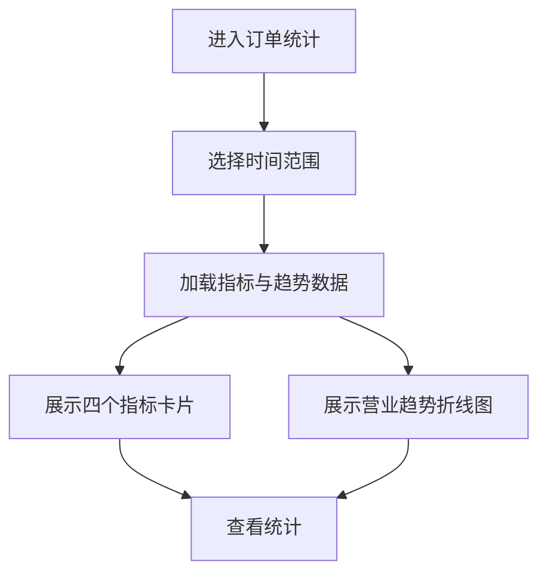
```mermaid
flowchart TD
    Start[进入订单统计] --> SelectTime[选择时间范围]
    SelectTime --> Load[加载指标与趋势数据]
    Load --> Cards[展示四个指标卡片]
    Load --> Chart[展示营业趋势折线图]
    Cards --> End[查看统计]
    Chart --> End
```
### 界面元素与数据
<table header-row="true">
<tr>
<td>元素</td>
<td>标识</td>
<td>说明</td>
</tr>
<tr>
<td>选择时间</td>
<td>timeRange</td>
<td>开始时间、结束时间，用于统计范围</td>
</tr>
<tr>
<td>订单总量</td>
<td>orderCount</td>
<td>指标卡片，数值</td>
</tr>
<tr>
<td>订单销售额</td>
<td>orderSalesAmount</td>
<td>指标卡片，金额格式</td>
</tr>
<tr>
<td>退款订单数</td>
<td>refundOrderCount</td>
<td>指标卡片，数值</td>
</tr>
<tr>
<td>退款金额</td>
<td>refundAmount</td>
<td>指标卡片，金额格式</td>
</tr>
<tr>
<td>营业趋势</td>
<td>businessTrendChart</td>
<td>折线图：最近 30 天（或所选时间）订单总量、订单销售额、退款订单数、退款金额</td>
</tr>
</table>
### 验收标准
- [ ] AC-207.1：切换时间范围后，指标卡片与趋势图数据随之更新。
- [ ] AC-207.2：趋势图图例区分订单总量、订单销售额、退款订单数、退款金额；横轴为日期，纵轴为数值。
---
## 【APP对讲机】用户故事
### 【APP对讲机】 US-301：首页（通讯）- 对星、发送短语、接收消息
**描述**：作为对讲机 APP 用户，我希望在首页完成对星、发送短语消息、自动接收或播放短信消息，以便进行应急通信。
> **→ 引用**
	：发送短语消息、接收消息的业务逻辑（含套餐扣减、消息转发至求救群等）详见 【平台WEB/小程序/APP】 US-007：通信管理 - 求救群聊 - 消息、短音发送 中的消息转发流程。APP 端仅交互形式为对星→发送短语→接收消息，底层与平台一致。
### 前置条件
- 用户已登录对讲机 APP；已设置对讲机 ID；已设置 TCP 连接信息。未设置则自动跳转对讲机 ID 设置页或平台设置（TCP）页并提示。
### 触发条件
- 用户打开对讲机 APP，进入首页（通讯）。
### 主流程
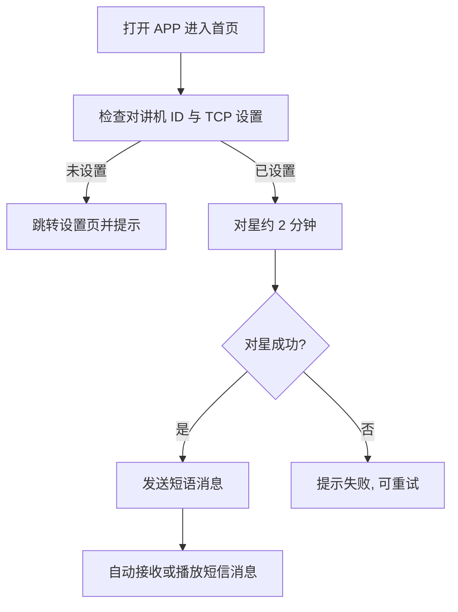
```mermaid
flowchart TD
    Start[打开 APP 进入首页] --> Check[检查对讲机 ID 与 TCP 设置]
    Check -->|未设置| Jump[跳转设置页并提示]
    Check -->|已设置| Star[对星约 2 分钟]
    Star --> Success{对星成功?}
    Success -->|是| Send[发送短语消息]
    Success -->|否| Retry[提示失败, 可重试]
    Send --> Receive[自动接收或播放短信消息]
```
**对星**：每次对星约 2 分钟；失败可重试。
**发送短语消息**：输入短语内容后发送；扣除套餐内短音条数。
**接收消息**：自动接收或播放短信消息；消息在界面中展示。
### 分支流程/异常流程
<table header-row="true">
<tr>
<td>分支ID</td>
<td>条件</td>
<td>流程</td>
</tr>
<tr>
<td>E1</td>
<td>未设置对讲机 ID</td>
<td>自动跳转到对讲机 ID 设置页，提示「请先设置对讲机 ID」</td>
</tr>
<tr>
<td>E2</td>
<td>未设置 TCP 信息</td>
<td>自动跳转到平台设置（TCP）页，提示「请先设置 TCP 信息」</td>
</tr>
<tr>
<td>E3</td>
<td>对星失败</td>
<td>提示「对星失败，请重试」，可点击重新对星</td>
</tr>
<tr>
<td>E4</td>
<td>套餐余额不足</td>
<td>提示「短音余额不足，请先充值」</td>
</tr>
<tr>
<td>E5</td>
<td>TCP 异常，连接失败</td>
<td>提示「网络不稳定，请稍后重试」</td>
</tr>
</table>
### 验收标准
- [ ] AC-301.1：未设置对讲机 ID 或 TCP 信息时，自动跳转对应设置页并提示；设置完成后可返回首页使用通讯功能。
- [ ] AC-301.2：对星成功后可发送短语消息；消息发送成功并扣除套餐短音条数；自动接收并展示短信消息。
- [ ] AC-301.3：对星失败、套餐余额不足、TCP 异常时提示明确，支持重试或引导充值。
---
### 【APP对讲机】 US-302：群聊记录
**描述**：作为对讲机 APP 用户，我希望查看群聊记录，以便了解群聊历史消息。
> **说明**：群聊记录为求救群聊的历史消息展示，与平台 US-007/US-008 中群聊消息区域一致；APP 端以独立入口展示群聊列表与历史消息，业务数据与平台同步。
### 前置条件
- 用户已登录；存在群聊记录。
### 触发条件
- 用户在通讯功能中进入群聊记录。
### 主流程
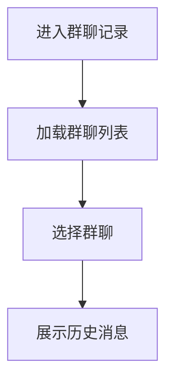
```mermaid
flowchart TD
    Start[进入群聊记录] --> Load[加载群聊列表]
    Load --> Select[选择群聊]
    Select --> History[展示历史消息]
```
**群聊列表**：展示用户参与的群聊（群聊名称、最后消息、时间等）。
**历史消息**：选择群聊后展示该群聊的历史消息（文本、语音等，带发送方、时间等）。
### 验收标准
- [ ] AC-302.1：群聊记录列表正确展示用户参与的群聊；选择群聊后可查看历史消息。
---
### 【APP对讲机】 US-303：我的 - 首页（APP 信息）
**描述**：作为对讲机 APP 用户，我希望在「我的」中查看 APP 信息，以便了解 APP 版本与相关信息。
### 前置条件
- 用户已登录。
### 触发条件
- 用户进入「我的」→「首页」或默认展示。
### 主流程
```mermaid
flowchart TD
    Start[进入我的] --> Info[展示 APP 信息]
```
**APP 信息**：展示 APP 名称、版本号、相关说明等（具体内容以实际设计为准）。
### 验收标准
- [ ] AC-303.1：我的首页正确展示 APP 信息。
---
### 【APP对讲机】 US-304：我的 - 平台设置（TCP 连接）
**描述**：作为对讲机 APP 用户，我希望在「我的」中配置平台 TCP 连接信息，以便建立与服务器的连接。
### 前置条件
- 用户已登录。
### 触发条件
- 用户进入「我的」→「平台设置（TCP连接）」；或首页检测到未设置 TCP 信息时自动跳转。
### 主流程
```mermaid
flowchart TD
    Start[进入平台设置] --> Input[输入 TCP 连接信息]
    Input --> Save[保存设置]
    Save --> Return[返回首页]
```
**TCP 连接配置**：需配置 TCP 服务器地址、端口等（具体字段以实际设计为准）。
### 分支流程/异常流程
<table header-row="true">
<tr>
<td>分支ID</td>
<td>条件</td>
<td>流程</td>
</tr>
<tr>
<td>E1</td>
<td>TCP 信息格式错误或连接失败</td>
<td>提示「TCP 连接信息错误，请检查后重试」</td>
</tr>
</table>
### 验收标准
- [ ] AC-304.1：平台设置页支持输入与保存 TCP 连接信息；保存后可返回首页使用通讯功能。
- [ ] AC-304.2：TCP 信息格式错误或连接失败时提示明确。
---
### 【APP对讲机】 US-305：我的 - 对讲机 ID 设置
**描述**：作为对讲机 APP 用户，我希望在「我的」中设置对讲机 ID，以便标识我的设备。
### 前置条件
- 用户已登录。
### 触发条件
- 用户进入「我的」→「对讲机 ID 设置」；或首页检测到未设置对讲机 ID 时自动跳转。
### 主流程
```mermaid
flowchart TD
    Start[进入对讲机 ID 设置] --> Input[输入对讲机 ID]
    Input --> Save[保存设置]
    Save --> Return[返回首页]
```
**对讲机 ID**：输入对讲机 ID（格式与校验规则以实际设计为准）。
### 分支流程/异常流程
<table header-row="true">
<tr>
<td>分支ID</td>
<td>条件</td>
<td>流程</td>
</tr>
<tr>
<td>E1</td>
<td>对讲机 ID 格式错误或已存在</td>
<td>提示「对讲机 ID 格式错误或已被使用，请重新输入」</td>
</tr>
</table>
### 验收标准
- [ ] AC-305.1：对讲机 ID 设置页支持输入与保存对讲机 ID；保存后可返回首页使用通讯功能。
- [ ] AC-305.2：对讲机 ID 格式错误或已存在时提示明确。
---
## 非功能性需求
### 异常场景处理
<table header-row="true">
<tr>
<td>设备端</td>
<td>场景</td>
<td>触发条件</td>
<td>预期行为</td>
<td>错误提示/处理</td>
</tr>
<tr>
<td>全端</td>
<td>网络中断</td>
<td>请求过程中断网</td>
<td>请求失败，不误更新本地状态</td>
<td>「网络异常，请稍后重试」</td>
</tr>
<tr>
<td>全端</td>
<td>数据不存在</td>
<td>访问已删除或无效资源</td>
<td>提示或跳转</td>
<td>「内容不存在或已失效」</td>
</tr>
<tr>
<td>平台/管理后台</td>
<td>未登录访问</td>
<td>未登录访问需登录页</td>
<td>跳转登录</td>
<td>「请先登录」</td>
</tr>
<tr>
<td>小程序</td>
<td>未登录访问</td>
<td>未登录访问需登录页</td>
<td>跳转微信登录</td>
<td>「请先登录」</td>
</tr>
<tr>
<td>小程序</td>
<td>微信授权失败</td>
<td>实名认证时授权失败</td>
<td>提示失败，可重试</td>
<td>「实名认证失败，请重试」</td>
</tr>
<tr>
<td>管理后台</td>
<td>无权限</td>
<td>越权访问功能</td>
<td>拒绝操作或跳转无权限页</td>
<td>「无操作权限」</td>
</tr>
</table>
### 交互与数据规范
### 列表分页规范（平台、管理后台）
<table header-row="true">
<tr>
<td>项目</td>
<td>规范说明</td>
</tr>
<tr>
<td>参数命名</td>
<td>`page`（页码）、`page_size` 或 `limit`（每页条数）</td>
</tr>
<tr>
<td>默认值</td>
<td>`page=1`，`page_size=20`</td>
</tr>
<tr>
<td>响应格式</td>
<td>需包含 `items`、`total`、`page`、`page_size`</td>
</tr>
<tr>
<td>无数据</td>
<td>展示「暂无数据」</td>
</tr>
</table>
### 日期/时间格式
<table header-row="true">
<tr>
<td>项目</td>
<td>规范说明</td>
</tr>
<tr>
<td>格式</td>
<td>展示统一为 `YYYY-MM-DD` 或 `YYYY-MM-DD HH:mm:ss`</td>
</tr>
</table>
### 小程序导航
<table header-row="true">
<tr>
<td>项目</td>
<td>规范说明</td>
</tr>
<tr>
<td>底部导航</td>
<td>按实际小程序设计为准</td>
</tr>
<tr>
<td>页面返回</td>
<td>支持左上角返回与微信返回手势</td>
</tr>
</table>
### 【APP对讲机】性能与兼容性
<table header-row="true">
<tr>
<td>项目</td>
<td>规范说明</td>
</tr>
<tr>
<td>系统要求</td>
<td>Android 8.0+</td>
</tr>
<tr>
<td>对星/发送消息</td>
<td>关键操作需保证响应速度与稳定性</td>
</tr>
<tr>
<td>适配</td>
<td>需适配主流 Android 设备与屏幕尺寸</td>
</tr>
</table>
---
## 界面原型
### 【平台WEB】原型目录
<table header-row="true">
<tr>
<td>模块</td>
<td>界面说明</td>
<td>原型路径</td>
</tr>
<tr>
<td>个人中心</td>
<td>个人账号</td>
<td>images/星联应急叫应平台_20260205/个人中心/个人中心_个人账号.png</td>
</tr>
<tr>
<td>个人中心</td>
<td>企业一级/二级/三级账号</td>
<td>images/星联应急叫应平台_20260205/个人中心/个人中心_企业一级账号.png 等</td>
</tr>
<tr>
<td>个人中心</td>
<td>实名认证弹窗</td>
<td>images/星联应急叫应平台_20260205/个人中心/个人中心 _实名认证.png</td>
</tr>
<tr>
<td>套餐商城</td>
<td>商城列表（设备类型、套餐类型、日包/月包）</td>
<td>images/星联应急叫应平台_20260205/套餐商城/套餐商城.png</td>
</tr>
<tr>
<td>套餐商城</td>
<td>订购 - 添加设备、选择设备、订单详情、支付订单、完成支付</td>
<td>images/星联应急叫应平台_20260205/套餐商城/立即订购_\*.png</td>
</tr>
<tr>
<td>我的套餐</td>
<td>列表与筛选</td>
<td>images/星联应急叫应平台_20260205/我的套餐/我的套餐.png</td>
</tr>
<tr>
<td>我的订单</td>
<td>列表与操作</td>
<td>images/星联应急叫应平台_20260205/我的订单/我的订单.png</td>
</tr>
<tr>
<td>报文下发额度</td>
<td>额度列表</td>
<td>images/星联应急叫应平台_20260205/报文下发额度/个人中心_个人账号.png</td>
</tr>
<tr>
<td>通信管理</td>
<td>普通通信、求救群聊、套餐信息、群管理</td>
<td>images/星联应急叫应平台_20260205/通信管理_普通通信、通信管理_求救群聊等</td>
</tr>
</table>
### 【小程序】原型目录
<table header-row="true">
<tr>
<td>模块</td>
<td>界面说明</td>
<td>原型路径</td>
</tr>
<tr>
<td>实名认证</td>
<td>微信授权实名认证</td>
<td>images/星联应急叫应小程序-20260203/我的信息_实名认证/\*</td>
</tr>
<tr>
<td>绑定设备 / 紧急联系人</td>
<td>绑定表单、紧急联系人设置</td>
<td>images/星联应急叫应小程序-20260203/绑定设备/*、紧急联系人/*</td>
</tr>
<tr>
<td>我的套餐 / 套餐商城</td>
<td>套餐列表、套餐明细、组合/短音/报位套餐</td>
<td>images/星联应急叫应小程序-20260203/我的信息_我的套餐/\*</td>
</tr>
<tr>
<td>我的订单</td>
<td>订单列表、订单详情</td>
<td>images/星联应急叫应小程序-20260203/我的信息_我的订单/\*</td>
</tr>
<tr>
<td>报文下发额度</td>
<td>额度列表</td>
<td>images/星联应急叫应小程序-20260203/我的信息_报文下发额度/\*</td>
</tr>
<tr>
<td>通信消息 - 求救群聊</td>
<td>求救群聊、套餐信息、群管理</td>
<td>images/星联应急叫应小程序-20260203/求救群聊_\*</td>
</tr>
</table>
### 【管理后台】原型目录
<table header-row="true">
<tr>
<td>模块</td>
<td>界面说明</td>
<td>原型路径</td>
</tr>
<tr>
<td>天通应急套餐管理</td>
<td>列表、筛选、添加套餐（短音/报位/组合）</td>
<td>images/星联应急叫应管理后台_20260205/天通应急套餐管理/\*</td>
</tr>
<tr>
<td>天通应急套餐明细</td>
<td>筛选与明细列表</td>
<td>images/星联应急叫应管理后台_20260205/天通应急套餐明细/\*</td>
</tr>
<tr>
<td>订单管理</td>
<td>订单列表与筛选、时间选择</td>
<td>images/星联应急叫应管理后台_20260205/订单管理/\*</td>
</tr>
<tr>
<td>订单统计</td>
<td>指标卡片与营业趋势图</td>
<td>images/星联应急叫应管理后台_20260205/订单统计/\*</td>
</tr>
</table>
### 【APP对讲机】原型说明
<table header-row="true">
<tr>
<td>模块</td>
<td>说明</td>
<td>备注</td>
</tr>
<tr>
<td>首页（通讯）</td>
<td>对星、发送短语、接收消息界面</td>
<td>暂无原型图，基于需求文档描述</td>
</tr>
<tr>
<td>群聊记录</td>
<td>群聊列表与历史消息</td>
<td>暂无原型图，基于需求文档描述</td>
</tr>
<tr>
<td>我的 - 首页 / 平台设置 / 对讲机 ID 设置</td>
<td>APP 信息、TCP 配置、对讲机 ID 表单</td>
<td>暂无原型图，基于需求文档描述</td>
</tr>
</table>
---
## 业务规则
### 全局业务规则
<table header-row="true">
<tr>
<td>规则ID</td>
<td>规则名称</td>
<td>规则描述</td>
<td>触发场景</td>
<td>设备端</td>
<td>优先级</td>
</tr>
<tr>
<td>BR-G001</td>
<td>已购套餐快照</td>
<td>我的套餐、订单详情中展示用户购买时的套餐详情，不受后台套餐编辑/下架影响</td>
<td>我的套餐、我的订单、订单详情</td>
<td>平台、小程序</td>
<td>P0</td>
</tr>
<tr>
<td>BR-G002</td>
<td>金额与时间格式</td>
<td>金额保留 2 位小数；时间统一 YYYY-MM-DD HH\:mm\:ss</td>
<td>全端展示</td>
<td>全端</td>
<td>P0</td>
</tr>
<tr>
<td>BR-G004</td>
<td>金额精度（管理后台）</td>
<td>金额计算与展示保留 2 位小数，可千分位格式化</td>
<td>管理后台</td>
<td>管理后台</td>
<td>P0</td>
</tr>
<tr>
<td>BR-G005</td>
<td>设置前置检查（APP）</td>
<td>使用通讯功能前必须设置对讲机 ID 与 TCP 连接信息</td>
<td>首页（通讯）</td>
<td>APP对讲机</td>
<td>P0</td>
</tr>
</table>
### 功能级业务规则索引
<table header-row="true">
<tr>
<td>规则ID</td>
<td>所属用户故事</td>
<td>规则名称</td>
<td>简要描述</td>
<td>设备端</td>
</tr>
<tr>
<td>BR-005-1</td>
<td>US-005</td>
<td>订购设备必选</td>
<td>订购流程必须至少选择一台设备</td>
<td>平台</td>
</tr>
<tr>
<td>BR-005-2</td>
<td>US-005</td>
<td>支付限时</td>
<td>支付二维码有效期内完成支付，超时需从订单再次发起</td>
<td>平台</td>
</tr>
<tr>
<td>BR-006-1</td>
<td>US-006</td>
<td>待支付可取消</td>
<td>待支付订单可取消，取消后状态为已取消</td>
<td>平台</td>
</tr>
<tr>
<td>BR-102-1</td>
<td>US-102</td>
<td>实名认证前置</td>
<td>绑定设备前需完成实名认证</td>
<td>小程序</td>
</tr>
<tr>
<td>BR-102-2</td>
<td>US-102</td>
<td>紧急联系人验证码</td>
<td>添加紧急联系人需获取并填写验证码</td>
<td>小程序</td>
</tr>
<tr>
<td>BR-203-1</td>
<td>US-203</td>
<td>禁用套餐不可售</td>
<td>已禁用套餐不对 C 端展示/可售</td>
<td>管理后台</td>
</tr>
<tr>
<td>BR-203-2</td>
<td>US-203</td>
<td>删除二次确认</td>
<td>删除套餐前需弹窗确认</td>
<td>管理后台</td>
</tr>
<tr>
<td>BR-301-1</td>
<td>US-301</td>
<td>对星失败重试</td>
<td>对星失败后可点击重新对星</td>
<td>APP对讲机</td>
</tr>
<tr>
<td>BR-301-2</td>
<td>US-301</td>
<td>套餐余额不足提示</td>
<td>套餐余额不足时提示充值</td>
<td>APP对讲机</td>
</tr>
</table>
---
## 附录
### 原型图隐藏细节
1. 设备上报短音上来，但是扣除余额失败怎么办？
	- **解决方案：** 仍然在聊天界面显示，但是禁止点击播放，并在短音下方提醒充值才可以播放。充值成功扣除之前不能播放的消息数量，然后才可以播放短音。
2. 求救群聊群管理，添加成员根据原型图没发区分是对讲机还是手机号码。
	- **解决方案：** 增加一个下拉选：手机号码；对讲机。
3. 添加成员对讲机时，此时对讲机已经在别的救援中群聊中怎么处理？
	- **解决方案：** 在添加这个对讲机的群聊中添加时，提示“此对讲机已在别的求救群聊中救援，无法添加”。
4. 求救群里的系统客服怎么创建？
	- **解决方案：** 需求尚不清楚，先不做。
5. 求救群内15分钟无“有效响应”，系统是通过什么渠道通知救援机构的？
	- **解决方案：** 就这样挂着，72小时后系统自动关闭救援。
6. 恢复为普通模式，终端再次触发 SOS，是激活旧群并保留记录，还是重新创建一个新群？
	- **解决方案：** 重新创建一个新群。
7. 文本消息敏感词过滤调用第三方接口校验？
	- **解决方案：** 调用阿里云API校验。
### 待确认事项（TBD）
<table header-row="true">
<tr>
<td>#</td>
<td>设备端</td>
<td>内容</td>
<td>责任人</td>
<td>状态</td>
<td>预计闭环时间</td>
</tr>
<tr>
<td>1</td>
<td>救援棒、APP对讲机</td>
<td>TCP 连接配置的具体协议内容</td>
<td>待定</td>
<td>待讨论</td>
<td>-</td>
</tr>
</table>
### 变更记录
<table header-row="true">
<tr>
<td>版本</td>
<td>日期</td>
<td>变更内容</td>
<td>变更人</td>
<td>审核人</td>
</tr>
<tr>
<td>v1.0</td>
<td>2026-02-09</td>
<td>初稿：基于 images/星联应急叫应平台_20260205 原型编写</td>
<td>梁培坤</td>
<td>-</td>
</tr>
<tr>
<td>v1.1</td>
<td>2026-02-11</td>
<td>合并小程序、管理后台、APP对讲机 PRD；新增设备端区分与跨端引用</td>
<td>梁培坤</td>
<td>-</td>
</tr>
</table>
