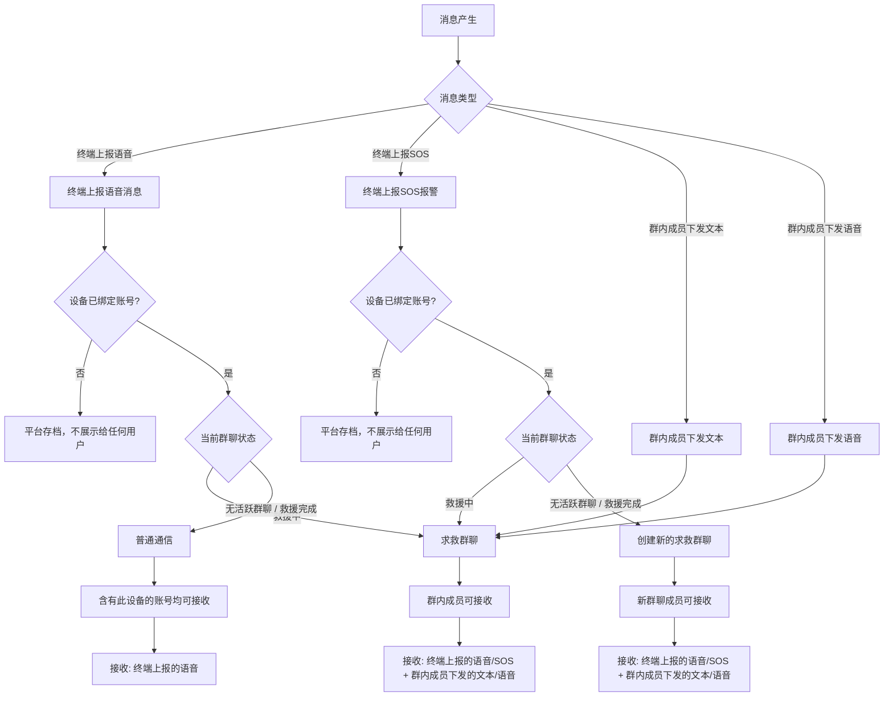

# 消息接收规则

<!-- notion_page_id: 2fd5667c-6d3a-838c-9ecc-8150e9c5ae68 -->

# 聊天窗口消息接收规则梳理文档
> **说明**：本文档仅梳理聊天室内**接收**的消息规则，不涉及消息下发相关逻辑。
> **重要说明**：本文档中描述的**普通通信**和**求救群聊**两种通信模式及其消息接收规则，**仅适用于天通救援应急棒设备**。其余类型的设备沿用之前的逻辑，**只有普通通信模式**，且可以查看终端上报的文本、语音、图片、报警、报平安消息。
---
## 0. 适用范围说明
### 0.1 天通救援应急棒设备
本文档中描述的**普通通信**和**求救群聊**两种通信模式及其消息接收规则，**仅适用于天通救援应急棒设备**。
- **普通通信模式**：接收终端上报的语音消息、SOS 报警消息
- **求救群聊模式**：接收终端上报的消息 + 群内成员下发的消息（文本、语音）
### 0.2 其他类型设备
**其余类型的设备沿用之前的逻辑**，具体规则如下：
- **通信模式**：只有普通通信模式（无求救群聊功能）
- **可接收的消息类型**：
	- ✅ 终端上报的文本消息
	- ✅ 终端上报的语音消息
	- ✅ 终端上报的图片消息
	- ✅ 终端上报的报警消息
	- ✅ 终端上报的报平安消息
- **接收对象**：含有此设备，无论何种关系都可以查看（个人主账号、企业账号、好友账号）
---
## 1. 聊天室接收的消息类型（天通救援应急棒设备）
### 1.1 语音消息
- **类型**：语音消息（短音），时长 1-10 秒
- **来源**：
	- **终端上报**：救援棒设备上报的语音消息（协议类型 0x02）
	- **求救群聊中**：群内其他成员下发的语音消息
- **展示位置**：普通通信、求救群聊
### 1.2 文本消息
- **类型**：文本消息
- **来源**：
	- **求救群聊中**：群内其他成员下发的文本消息
- **展示位置**：求救群聊
- **备注**：普通通信中不接收文本消息（只能接收终端上报的语音消息）
### 1.3 SOS 报警消息
- **类型**：终端触发的 SOS 报警消息
- **触发方式**：
	- **按键 SOS**：手动长按 SOS 按钮触发
	- **落水报警**：自动触发落水报警
- **来源**：救援棒设备触发报警时上报
- **展示位置**：普通通信、求救群聊
### 1.4 位置信息
- **类型**：终端上报的位置信息
- **展示规则**：**无法在聊天室内查看**
- **展示位置**：位置信息在控制台地图/轨迹模块展示
- **备注**：聊天室不展示位置信息
---
## 2. 接收链路与账号范围（天通救援应急棒设备）
### 2.1 普通通信
### 2.1.1 接收的消息类型
- **只能接收终端上报的消息**：
	- 语音消息（终端上报）
	- SOS 报警消息（按键、落水）
### 2.1.2 可接收消息的账号对象
- **含有此设备，无论何种关系都可以查看**，包括：
	- **个人主账号**（设备标签为”我的”）
	- **企业账号**（设备标签为”我的”或”用户”）
	- **好友账号**（设备标签为”好友”，通过扫码关注设备）
### 2.1.3 消息展示规则
- 普通通信中，所有与该设备有绑定关系的账号都可以看到：
	- 终端上报的语音消息
	- 终端上报的 SOS 报警消息
	- **不接收**文本消息（文本消息只在求救群聊中接收）
### 2.2 求救群聊
### 2.2.1 接收的消息类型
- **终端上报的消息**：
	- 语音消息（终端上报）
	- SOS 报警消息（按键、落水）
- **群聊内其余成员下发的消息**：
	- 文本消息（群内成员下发）
	- 语音消息（群内成员下发）
### 2.2.2 可接收消息的账号对象
- **群内成员**，包括：
	- 个人主账号（设备标签为”我的”）
	- 最低等级企业账号（设备标签为”我的”或”用户”）
	- 紧急联系人（个人主账号设置的紧急联系人，0-3个）
	- 系统客服（自动加入）
	- 设备虚拟成员（用于展示设备状态）
### 2.2.3 消息展示规则
- 求救群聊中，所有群成员可以接收：
	- 终端上报的语音消息
	- 终端上报的 SOS 报警消息
	- 群内其他成员下发的文本消息
	- 群内其他成员下发的语音消息
---
## 3. 接收链路对比（天通救援应急棒设备）
### 3.1 普通通信接收链路
- **接收对象**：含有此设备，无论何种关系都可以查看（个人主账号、企业账号、好友账号）
- **接收消息类型**：
	- ✅ 终端上报的语音消息
	- ✅ 终端上报的 SOS 报警消息（按键、落水）
	- ❌ 不接收文本消息
	- ❌ 不接收群内成员下发的消息
- **入口**：小程序”通信消息”Tab → “普通通信”标签页
### 3.2 求救群聊接收链路
- **接收对象**：群内成员（个人主账号、最低等级企业账号、紧急联系人、系统客服、设备虚拟成员）
- **接收消息类型**：
	- ✅ 终端上报的语音消息
	- ✅ 终端上报的 SOS 报警消息（按键、落水）
	- ✅ 群内其他成员下发的文本消息
	- ✅ 群内其他成员下发的语音消息
- **入口**：小程序”通信消息”Tab → “求救群聊”标签页
- **状态**：
	- **救援中**：可以接收消息（终端上报的消息 + 群内成员下发的消息）
	- **救援完成**：
		- 群聊功能只作为备份展示，不接收与下发任何消息
		- 仅可查看历史消息记录
		- 终端上报的新消息不再进入该群聊
---
## 4. 特殊场景处理（天通救援应急棒设备）
### 4.1 欠费场景
- **终端上报的语音消息**：
	- 消息正常接收和展示
	- 但语音消息无法播放，显示欠费提示
	- 套餐条数变为负数（倒欠）
### 4.2 未绑定设备场景
- **终端上报消息**：
	- 设备可正常上报语音和位置消息到平台（协议层面允许，平台正常接收并存档）
	- 因没有绑定任何账号，消息无法转发给任何用户，仅在平台侧存档
	- **计费仍然产生**：语音按条扣短音、位置按时长扣报位，设备无可用套餐时产生倒欠账单
- **后续关联账号时**：
	- 新关联的账号需为该设备**已生成的倒欠账单付费**（用户责任）
	- 充值购买套餐后，先抵扣倒欠额度，再计算剩余可用余量
### 4.3 救援完成后终端继续上报
- **终端不受”救援完成”状态限制**，仍可继续上报消息
- **消息归属规则**：
	- **终端上报语音消息**：
		- 由于求救群聊状态已变更为”救援完成”，群聊功能只作为备份展示，不接收新消息
		- 终端上报的语音消息在**普通通信**中接收展示
		- 含有此设备，无论何种关系的账号都可以在普通通信中接收这些语音消息
	- **终端上报 SOS 报警消息**：
		- 由于求救群聊状态已变更为”救援完成”，群聊功能只作为备份展示，不接收新消息
		- 终端上报的 SOS 报警消息触发创建**新的求救群聊**
		- 新创建的求救群聊按照正常流程拉取群成员，接收终端上报的消息和群内成员下发的消息
- **关键原则**：
	- 救援完成后的群聊是只读的，仅作为历史记录备份
	- 所有新的终端上报消息（语音、SOS）都不再进入已完成的群聊
	- 语音消息去普通通信，SOS 报警创建新群聊
### 4.4 账号解绑场景
- **报警后解绑——需区分绑定关系**：
	- **「我的」关系解绑天通救援棒**：
		- 触发求救群聊状态变更为**「已结束」**（与手动结束、后台结束等路径等效）
		- 群聊进入只读状态，仅可查看历史消息
		- 群内待发送消息按群结束流程取消并退费
	- **「用户」「好友」等其他关系解绑**：
		- 求救群聊状态**不受影响**，群聊继续正常运作
		- 解绑账号**仍保留在本场求救群聊中**，可继续接收和下发消息（群成员只进不出，解绑不影响当前救援的参与资格）
		- 解绑仅影响**后续新报警**时是否被再次拉入新的求救群聊
		- 已产生的历史消息记录保留
- **普通通信中解绑**：
	- 解绑后该账号无法再接收该设备的新消息
	- 历史消息保留
---
## 5. 消息接收流程图（天通救援应急棒设备）

---
## 6. 消息接收规则总结（天通救援应急棒设备）
### 6.1 普通通信接收规则
<table header-row="true">
<tr>
<td>消息类型</td>
<td>来源</td>
<td>是否接收</td>
<td>接收对象</td>
</tr>
<tr>
<td>语音消息</td>
<td>终端上报</td>
<td>✅</td>
<td>含有此设备，无论何种关系（个人主账号、企业账号、好友账号）</td>
</tr>
<tr>
<td>SOS 报警</td>
<td>终端上报</td>
<td>✅</td>
<td>含有此设备，无论何种关系（个人主账号、企业账号、好友账号）</td>
</tr>
<tr>
<td>文本消息</td>
<td>群内成员下发</td>
<td>❌</td>
<td>不接收</td>
</tr>
<tr>
<td>语音消息</td>
<td>群内成员下发</td>
<td>❌</td>
<td>不接收</td>
</tr>
<tr>
<td>位置信息</td>
<td>终端上报</td>
<td>❌</td>
<td>不在聊天室展示</td>
</tr>
</table>
### 6.2 求救群聊接收规则
<table header-row="true">
<tr>
<td>消息类型</td>
<td>来源</td>
<td>是否接收</td>
<td>接收对象</td>
</tr>
<tr>
<td>语音消息</td>
<td>终端上报</td>
<td>✅</td>
<td>群内成员</td>
</tr>
<tr>
<td>SOS 报警</td>
<td>终端上报</td>
<td>✅</td>
<td>群内成员</td>
</tr>
<tr>
<td>文本消息</td>
<td>群内成员下发</td>
<td>✅</td>
<td>群内成员</td>
</tr>
<tr>
<td>语音消息</td>
<td>群内成员下发</td>
<td>✅</td>
<td>群内成员</td>
</tr>
<tr>
<td>位置信息</td>
<td>终端上报</td>
<td>❌</td>
<td>不在聊天室展示</td>
</tr>
</table>
---
## 7. 关键规则说明（天通救援应急棒设备）
### 7.1 位置信息展示规则
- **位置信息无法在聊天室内查看**
- 位置信息在控制台地图/轨迹模块展示
- 聊天室不展示位置信息
### 7.2 普通通信与求救群聊的区别
- **普通通信**：
	- 接收对象：含有此设备，无论何种关系都可以查看（个人主账号、企业账号、好友账号）
	- 接收内容：仅终端上报的消息（语音、SOS）
	- 不接收：文本消息、群内成员下发的消息
	- **特殊场景**：救援完成后，终端上报的语音消息在普通通信中接收
- **求救群聊**：
	- 接收对象：群内成员
	- 接收内容：终端上报的消息 + 群内成员下发的消息（文本、语音）
	- 不接收：位置信息（不在聊天室展示）
	- **状态说明**：
		- **救援中**：正常接收所有消息
		- **救援完成**：群聊功能只作为备份展示，不接收与下发任何新消息，仅可查看历史消息
### 7.3 救援完成后的消息路由规则
- **救援完成后，求救群聊状态变更为”救援完成”**：
	- 群聊功能只作为备份展示，不接收与下发任何消息
	- 仅可查看历史消息记录
- **终端继续上报消息的处理**：
	- **上报语音消息**：在**普通通信**中接收展示（只有关注该设备的好友可接收）
	- **上报 SOS 报警消息**：创建**新的求救群聊**，按照正常流程拉取群成员，接收终端上报的消息和群内成员下发的消息
---
## 8. 总结（天通救援应急棒设备）
### 8.1 核心规则
1. **普通通信**：
	- 接收对象：含有此设备，无论何种关系都可以查看（个人主账号、企业账号、好友账号）
	- 接收内容：只能接收终端上报的消息（语音、SOS）
	- 不接收：文本消息、群内成员下发的消息
	- **特殊场景**：救援完成后，终端上报的语音消息在普通通信中接收
2. **求救群聊**：
	- 接收对象：群内成员
	- 接收内容：终端上报的消息 + 群内成员下发的消息（文本、语音）
	- 不接收：位置信息（不在聊天室展示）
	- **状态说明**：
		- **救援中**：正常接收所有消息
		- **救援完成**：群聊功能只作为备份展示，不接收与下发任何新消息
3. **位置信息**：
	- 无法在聊天室内查看
	- 位置信息在控制台地图/轨迹模块展示
4. **救援完成后的消息路由**：
	- 终端上报语音消息 → 在普通通信中接收展示
	- 终端上报 SOS 报警消息 → 创建新的求救群聊
### 8.2 接收消息类型汇总
<table header-row="true">
<tr>
<td>消息类型</td>
<td>来源</td>
<td>普通通信</td>
<td>求救群聊</td>
<td>备注</td>
</tr>
<tr>
<td>语音消息</td>
<td>终端上报</td>
<td>✅</td>
<td>✅</td>
<td>好友/群成员可接收</td>
</tr>
<tr>
<td>SOS 报警</td>
<td>终端上报（按键/落水）</td>
<td>✅</td>
<td>✅</td>
<td>好友/群成员可接收</td>
</tr>
<tr>
<td>文本消息</td>
<td>群内成员下发</td>
<td>❌</td>
<td>✅</td>
<td>仅求救群聊中接收</td>
</tr>
<tr>
<td>语音消息</td>
<td>群内成员下发</td>
<td>❌</td>
<td>✅</td>
<td>仅求救群聊中接收</td>
</tr>
<tr>
<td>位置信息</td>
<td>终端上报</td>
<td>❌</td>
<td>❌</td>
<td>不在聊天室展示</td>
</tr>
</table>
### 8.3 接收对象对比
<table header-row="true">
<tr>
<td>接收链路</td>
<td>接收对象</td>
<td>接收内容</td>
</tr>
<tr>
<td>普通通信</td>
<td>含有此设备，无论何种关系（个人主账号、企业账号、好友账号）</td>
<td>终端上报的语音、SOS</td>
</tr>
<tr>
<td>求救群聊</td>
<td>群内成员（个人主账号、企业账号、紧急联系人、系统客服等）</td>
<td>终端上报的语音、SOS + 群内成员下发的文本、语音</td>
</tr>
</table>
### 8.4 设备类型对比说明
<table header-row="true">
<tr>
<td>设备类型</td>
<td>通信模式</td>
<td>可接收的消息类型</td>
<td>接收对象</td>
</tr>
<tr>
<td>**天通救援应急棒**</td>
<td>普通通信 + 求救群聊</td>
<td>普通通信：终端上报的语音、SOS求救群聊：终端上报的语音、SOS + 群内成员下发的文本、语音</td>
<td>普通通信：含有此设备，无论何种关系求救群聊：群内成员</td>
</tr>
<tr>
<td>**其他类型设备**</td>
<td>仅普通通信</td>
<td>终端上报的文本、语音、图片、报警、报平安消息</td>
<td>含有此设备，无论何种关系（个人主账号、企业账号、好友账号）</td>
</tr>
</table>
**关键区别**： - **天通救援应急棒设备**：支持普通通信和求救群聊两种模式，求救群聊模式下可以接收群内成员下发的消息 - **其他类型设备**：只有普通通信模式，可以接收终端上报的文本、语音、图片、报警、报平安等各类消息
---
## 9. 参考文档
- `sos-terminal-voice-upload-limits.plan.md` - 天通救援应急棒终端上报语音消息逻辑限制规划
- `sos-groupchat-plan_fa323615.plan.md` - 求救群聊整体规划文档
- `US-107_求救群聊（触发_拉群_状态_头像）.md` - 求救群聊测试用例
- `星联应急保障平台产品需求文档20260105-v1 12.md` - 产品需求文档
---
**文档版本**：v2.1
**创建日期**：2026-01-XX
**最后更新**：2026-01-XX
**维护人**：产品团队
**说明**： - 本文档仅梳理聊天室内接收的消息规则，不涉及消息下发相关逻辑 - **适用范围**：本文档中描述的普通通信和求救群聊两种通信模式及其消息接收规则，**仅适用于天通救援应急棒设备** - **其他设备**：其余类型的设备沿用之前的逻辑，只有普通通信模式，且可以查看终端上报的文本、语音、图片、报警、报平安消息
