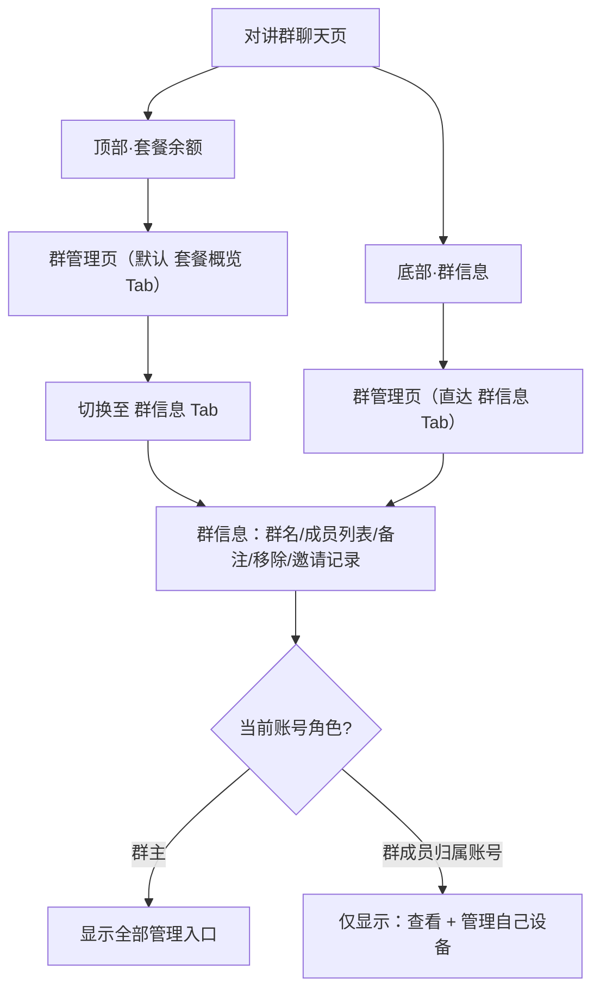
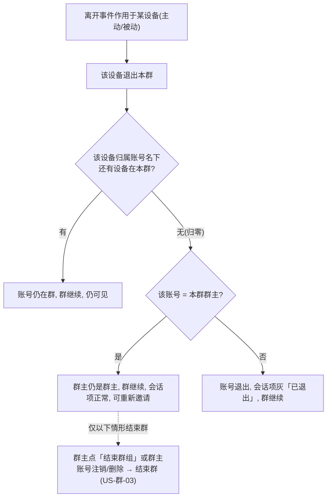

# 群信息管理逻辑

<!-- notion_page_id: 3305667c-6d3a-8281-b7e8-8145fe82fd34 -->

<callout icon="📌" color="blue_bg">
	**文档用途**：梳理对讲群「群信息查看」（US-群-02）的完整业务逻辑点，作为开发/测试的功能依据。**核心命题：入群的是设备，操作的是设备背后的归属账号。**
</callout>
## 一、核心模型与角色
每台终端设备（卡号/addr）是一个群成员；界面里做操作的是**设备背后的归属账号**。群里只有两个角色（按账号判定）：
- **群主**：创建该对讲群的账号，拥有**最高权限**，无论其在群内是否拥有自己的设备，均可管理全群。
- **群成员归属账号**：在群内拥有 ≥1 台成员设备的账号，只能管理**自己名下的设备**。
<callout icon="⚠️" color="yellow_bg">
	**群成员归属账号可以就是群主本人。** 例如一级企业账号创建对讲群，并邀请自己**绑定（ENTERPRISE，标签「我的」）**的设备入群——这些设备归属账号即它自己。此时该账号**既是群主、又是群成员归属账号**，按群主最高权限处理，不受「只能管自己设备」限制。
</callout>
## 二、角色与权限
权限为**按钮级控制**：无权操作时**直接隐藏入口**，不显示禁用态、不报错；Web 端与小程序权限完全对齐。当群成员归属账号恰为群主时，一律以**群主最高权限**为准，不被「仅管自己设备」限制。
<table fit-page-width="true" header-row="true">
<tr>
<td>操作</td>
<td>群主</td>
<td>群成员归属账号（非群主时）</td>
</tr>
<tr>
<td>查看群名称</td>
<td>✅</td>
<td>✅</td>
</tr>
<tr>
<td>编辑群名称</td>
<td>✅</td>
<td>❌</td>
</tr>
<tr>
<td>查看成员列表</td>
<td>✅</td>
<td>✅</td>
</tr>
<tr>
<td>编辑成员备注（群内昵称）</td>
<td>✅ 所有成员设备</td>
<td>✅ 仅自己名下设备</td>
</tr>
<tr>
<td>移除成员</td>
<td>✅ 任意成员设备</td>
<td>✅ 仅自己名下设备</td>
</tr>
<tr>
<td>添加成员（邀请）</td>
<td>✅</td>
<td>❌</td>
</tr>
<tr>
<td>查看邀请记录</td>
<td>✅</td>
<td>❌</td>
</tr>
<tr>
<td>结束群组</td>
<td>✅</td>
<td>❌</td>
</tr>
</table>
## 三、入口与主流程
两个入口，均落到「群管理」页：
- **入口 A（顶部套餐余额）**：对讲群聊天页 → 点顶部「套餐余额」→ 进群管理页，**默认落在「套餐概览」Tab** → 手动切到「群信息」Tab。
- **入口 B（底部群信息）**：对讲群聊天页 → 点底部「群信息」→ 进群管理页并**直接定位「群信息」Tab**。

## 四、群管理页结构
- 多 Tab：至少含**套餐概览 Tab**（默认）与**群信息 Tab**。
- 本文聚焦「群信息」Tab；套餐概览（短音/报位剩余、单设备/批量购买）属 US-群-13 / US-豆-04，不展开。
## 五、设备群内备注（昵称）逻辑
<table fit-page-width="true" header-row="true">
<colgroup>
<col>
<col width="576.9971313476562">
</colgroup>
<tr>
<td>规则</td>
<td>说明</td>
</tr>
<tr>
<td>入群初始化</td>
<td>设备首次加入该群时取快照：绑定层有备注 → 群内昵称=「备注(卡号)」，如 张三(12345)；无备注 → 「卡号」。</td>
</tr>
<tr>
<td>群级独立编辑</td>
<td>编辑仅对当前群生效，群内独立昵称，不回写设备绑定层备注，不影响该设备在其他群的昵称。</td>
</tr>
<tr>
<td>绑定层变更隔离</td>
<td>未退群期间，绑定者在绑定层改/补备注均不同步到群内昵称（绑定层仅在入群那一刻单向取值一次，之后解耦）。</td>
</tr>
<tr>
<td>跨群循环</td>
<td>设备退群后再进入其他群，按入群初始化重新取值，与上一群昵称无关，按群隔离循环。</td>
</tr>
<tr>
<td>并发覆盖</td>
<td>群主与设备归属账号同时改同一台自己设备昵称、或群主改后归属账号再改，均以最后修改为准。</td>
</tr>
<tr>
<td>长度与显示</td>
<td>群内昵称长度可达 20 字符；达 20 字符超出显示区域时换行显示，不截断。</td>
</tr>
</table>
## 六、成员列表展示
- 列表项 = 群内每台终端设备（成员按设备数计），字段：**头像（终端图标 + 状态）** / 群内昵称（备注）/ 设备卡号。
- 账号冻结/过期的成员设备**仍保留在列表**（不自动退群），仅无法通过终端发消息。
### 6.1 头像 = 终端图标（实时同步，区别于备注）
- 成员头像本质是**该终端设备的图标**，**与备注昵称逻辑相反**：备注是入群快照、不回写；头像是**实时读取设备当前图标**。
- 可更改入口：**个人或企业绑定者在设备编辑页**或**管理后台**修改设备图标；修改后**全端、全群实时同步**，可反复修改。
- 图标范围为**固定枚举**：只能从预置列表中选择，**不可自定义上传 / 增删**。
### 6.2 头像叠加：在线 / 报警 / 离线状态（全局统一）
- 头像以**主体图标颜色 + 右上角角标**叠加表达设备状态。
- 状态为**设备全局状态**：与求救群**共用同一套设备报警状态**，**不区分群聊、不区分账号、不区分标签**。
- 两个互相独立的维度：**在线状态**（在线/离线，连续 1 分钟无心跳→离线）与**报警状态**（正常/报警中/已解除，解除后即按正常态展示）。
<table fit-page-width="true" header-row="true">
<tr>
<td>组合状态</td>
<td>主体图标</td>
<td>右上角角标</td>
</tr>
<tr>
<td>报警中 + 在线</td>
<td>红色（报警优先）</td>
<td>绿色 ✓</td>
</tr>
<tr>
<td>报警中 + 离线</td>
<td>红色（未解除前始终红）</td>
<td>灰色 ×</td>
</tr>
<tr>
<td>正常/已解除 + 在线</td>
<td>绿色</td>
<td>不展示</td>
</tr>
<tr>
<td>正常/已解除 + 离线</td>
<td>灰色</td>
<td>不展示</td>
</tr>
</table>
> 报警中主体锁红、靠角标 ✓/× 区分在线/离线；非报警态主体色直接表达在线（绿）/离线（灰），无角标。
### 6.3 实时更新机制
通过 WebSocket / 长连接 / 轮询接收状态变更事件，多端同步刷新：心跳恢复/超时切换在线（绿/✓）↔ 离线（灰/×）；触发报警主体转红、按在线状态显示 ✓/×；报警解除恢复绿/灰并清除角标；设备图标被修改时主体图标实时替换，颜色态/角标逻辑照常叠加。
## 七、移除 / 离群操作（群信息内）
### 7.1 核心判定规则（这把尺）
- **账号「在不在」对讲群 = 该账号名下是否还有设备在本群。** 入群的是设备，移除/退出的也是单台设备。
- 某设备离群后，看其**归属账号名下是否还有设备在本群**：
	- **未归零**（还有别的设备在群）→ 账号仍在群、仍可见、群继续。
	- **归零 + 非群主账号** → 账号退出本群，会话项灰「已退出」，**群继续**。
	- **归零 + 群主账号** → 群主在群虽无设备，但**仍是群主、群继续、会话项保持正常、可重新邀请设备入群**；**不再自动结束群**。
- **双重身份归属优先级（先于上面所有分支判定）**：当离群/归零设备的**归属账号同时就是群主本人**（群主把自己绑定「我的」设备拉进群）时，**一律按群主权限、走「归零 + 群主账号」分支**处理：即群继续、不结束、**不出现「已退出」灰态**；其对自己设备的移除/退出动作也**按群主权限路径**处理，**不降级**为普通成员的退群（US-群-09）口径。
- **群结束仅有两种情形**：① 群主在群信息内点**「结束群组」**直接结束；② **群主账号本身注销/删除**（已无群主主体，必然结束）。设备归零本身不再触发结束群。
- **个人群、企业群同理**（下文主动/被动各类触发路径，最终都套用这把尺）。

### 7.2 操作权限与确认
- **群主**：可移除任意成员设备（他人设备=踢出）；移除自己设备与移除他人设备走**同一确认流程**；另有独立**「结束群组」**入口可直接结束群。
- **群成员归属账号（非群主）**：只能将**自己名下设备**移出群（=该设备退群）；该动作与 US-群-09「退出群组」为**同一动作**，确认弹窗文案一致。
- 均需**二次确认**（文案含昵称/卡号）；**移除/退出不退还邀请星豆（规则18）**；被移除/退出方不推送。
### 7.3 个人群——离群路径与群结果总表
<callout icon="💡">
	个人群群主=个人账号，可能存在他人归属设备。下表把**主动（人为操作）**与**被动（外部因素）**合并，统一套用 7.1 的判定尺；前提：设备已入群，不涉及退还星豆。
</callout>

**表一｜离群设备 = 群主 G 自己的设备**

	<table fit-page-width="true" header-row="true">
	<colgroup>
	<col width="119.99999237060547">
	<col>
	<col>
	</colgroup>
<tr>
<td>触发类型</td>
<td>触发路径（明确操作）</td>
<td>群结果</td>
</tr>
<tr>
<td>主动</td>
<td>群主移除/退出自己名下设备</td>
<td>未归零→该设备移出本群，群继续、群主仍在；归零→设备全部移出，仍是群主、群继续、会话项正常、可重新邀请（不自动结束）</td>
</tr>
<tr>
<td>主动</td>
<td>群主点「结束群组」</td>
<td>结束群（US-群-03）</td>
</tr>
<tr>
<td>被动·设备失效</td>
<td>① G 解绑（含平台/后台强制解绑）；② 设备类型被改为非救援棒</td>
<td>未归零→群继续；归零→群继续（群主仍在，可重新邀请其余设备）</td>
</tr>
<tr>
<td>被动·归属异常</td>
<td>③ G 账号注销/删除 → 名下设备被强制全部解绑离群</td>
<td>已无群主主体 → 结束群（US-群-03）</td>
</tr>
<tr>
<td>被动·唯一性</td>
<td>④ G 把设备加入另一对讲群（换群，自动退本群）</td>
<td>未归零→群继续；归零→群继续</td>
</tr>
<tr>
<td>被动·主人变更</td>
<td>⑤ G 解绑 → 个人账号 B 绑定（好友→我的强替换 / null→普通首绑），离群按「G 解绑」计</td>
<td>未归零→群继续；归零→群继续；设备归 B，不自动回原群，需重新邀请</td>
</tr>
	</table>

**表二｜离群设备 = 他人 A 的设备（被 G 邀请进群的他人个人账号）**

	<table fit-page-width="true" header-row="true">
<tr>
<td>触发类型</td>
<td>触发路径（明确操作）</td>
<td>群结果</td>
</tr>
<tr>
<td>主动</td>
<td>A 本人退出自己一台设备（US-群-09，仍有在群设备）</td>
<td>该设备退出本群；群继续，A 仍可见</td>
</tr>
<tr>
<td>主动</td>
<td>群主踢出 A 一台 / A 退出自己最后一台（A 归零）</td>
<td>未归零→群继续；A 归零→A 退出·灰「已退出」，群继续</td>
</tr>
<tr>
<td>被动·设备失效</td>
<td>① A 解绑（含强制解绑）；② 设备类型被改为非救援棒</td>
<td>未归零→群继续；A 归零→A 退出·灰「已退出」</td>
</tr>
<tr>
<td>被动·归属异常</td>
<td>③ A 账号注销/删除 → 其设备被强制全部解绑离群</td>
<td>必然归零 → A 退出·灰「已退出」，群继续</td>
</tr>
<tr>
<td>被动·唯一性</td>
<td>④ A 把设备加入另一对讲群（换群）</td>
<td>未归零→群继续；A 归零→A 退出·灰「已退出」</td>
</tr>
<tr>
<td>被动·主人变更</td>
<td>⑤ A 解绑 → 个人账号 B 绑定，离群按「A 解绑」计</td>
<td>未归零→群继续；A 归零→A 退出；设备归 B，不自动回原群</td>
</tr>
	</table>

<callout icon="💡" color="gray_bg">
	**主人变更⑤补充**：一设备同时只能被 1 个个人账号绑定为「我的」，B 要拿到设备必须等 A 先解绑——离群一律在「A 解绑」那一刻发生，群结果按 A 判定，与 B 来路无关。
</callout>
### 7.4 企业群——离群路径与群结果总表
<callout icon="🏢" color="green_bg">
	**企业群本质**：在群设备的归属账号**恒为群主企业本人**（无「他人 A」分支）。判定很干脆——某设备离群后，群主企业名下**未归零→群继续；归零→仍是群主、群继续、可重新邀请（不自动结束）**。**群仅在群主企业点「结束群组」或企业账号被删除时才结束。** 复杂度仅来自群主企业在层级链的位置：层级越低，能从外部把其设备打离群的父级/后台路径越多（一级是链路根，无父级级联）。
</callout>

**企业群离群路径表（按群主层级合并）**

	<table fit-page-width="true" header-row="true">
<tr>
<td>适用层级</td>
<td>触发路径（明确操作）</td>
<td>影响范围</td>
<td>群结果</td>
</tr>
<tr>
<td>通用（一/二/三级）</td>
<td>① 解绑设备（小程序/平台/后台）；② 设备类型变更；④ 后台企业改绑 A→B；⑤ 换群</td>
<td>单台</td>
<td>未归零→群继续；归零→群继续（群主仍在，可重新邀请）</td>
</tr>
<tr>
<td>二级 / 三级</td>
<td>③ 群主企业账号被删除</td>
<td>全部</td>
<td>已无群主主体 → 结束群</td>
</tr>
<tr>
<td>二级（父级=一级）</td>
<td>🔗 一级解绑（含后台强制解绑）二级在群的「我的」设备</td>
<td>单台</td>
<td>未归零→群继续；归零→群继续</td>
</tr>
<tr>
<td>二级（父级=一级）</td>
<td>🔗 一级解绑（含后台强制解绑）二级在群的「我的」设备</td>
<td>单台</td>
<td>未归零→群继续；归零→群继续</td>
</tr>
<tr color="brown_bg">
<td>三级（父级=二级）</td>
<td>🔗 一级移除对二级的设备分配</td>
<td>单台</td>
<td>未归零→群继续；归零→群继续</td>
</tr>
<tr color="brown_bg">
<td>三级（父级=二级）</td>
<td>🔗 二级解绑（含后台强制解绑）三级在群的「我的」设备</td>
<td>单台</td>
<td>未归零→群继续；归零→群继续</td>
</tr>
<tr color="brown_bg">
<td>三级（父级=二级）</td>
<td>🔗 二级移除对三级的设备分配</td>
<td>单台</td>
<td>未归零→群继续；归零→群继续</td>
</tr>
<tr>
<td>三级（父级=二级）</td>
<td>🔗 二级账号被删除（子级对应删除）</td>
<td>全部</td>
<td>子级群主账号随之删除·已无群主主体 → 结束群</td>
</tr>
<tr>
<td>三级（祖父级=一级跨级）</td>
<td>🔗🚨 一级解绑设备</td>
<td>单台</td>
<td>未归零→群继续；归零→群继续</td>
</tr>
	</table>

### 7.5 不离群反例（防误判，个人群/企业群通用）
<table fit-page-width="true" header-row="true">
<tr>
<td>路径（明确操作）</td>
<td>为什么不离群</td>
</tr>
<tr>
<td>归属账号**冻结 / 过期**（含父级冻结→子级同步冻结）</td>
<td>设备不退群、仍在列表，仅终端无法发消息（规则4）；父级过期不影响子级有效期</td>
</tr>
<tr>
<td>双绑场景下企业侧变动（后台改绑 / 企业侧解绑）</td>
<td>「企业自动解绑后换绑，个人绑定者保留」；个人群靠个人绑定入群 → 不离群</td>
</tr>
<tr>
<td>绑定层改备注 / 改图标</td>
<td>备注快照不回写、图标实时同步，仅影响展示，设备不退群</td>
</tr>
</table>
## 八、群已结束状态下的群信息
- 群主：结束后仍可进入群（只读查看历史），群信息内所有操作按钮隐藏。
- 群成员归属账号：
	- 群被群主结束时**自己仍有设备在群** → 会话项`已结束`，**可进入只读查看历史，操作按钮全隐藏**（与群主一致）。
	- 自己设备已退出/被移除（归零·`已退出`）→ 不可进入查看。
- **只读冻结口径（已确认）**：群结束后页面整体只读，**设备头像 / 在线·报警角标、设备套餐余额仍全局实时刷新**（设备与账号仍存在、套餐仍可被其他群或通信消耗）；**其余历史参数（群名、成员列表、群内昵称快照、消息记录等）一律定格为结束时刻快照，不再变化。**
### 8.1 消息列表「会话项状态与可见性总表」（US-群-07）
<callout icon="📋" color="blue_bg">
	会话项的状态由「账号角色 + 群是否结束 / 账号是否离群」共同决定。**群主只有「已结束 / 未结束」两态，永远不会出现「已退出」**；只有非群主的普通成员归属账号才会出现「已退出」。
</callout>
<table fit-page-width="true" header-row="true">
<colgroup>
<col width="135.99999237060547">
<col>
<col>
<col>
<col>
<col>
</colgroup>
<tr>
<td>账号角色</td>
<td>会话状态</td>
<td>触发来源</td>
<td>标签</td>
<td>头像</td>
<td>点击行为</td>
</tr>
<tr>
<td>群主（个人账号）</td>
<td>群未结束</td>
<td>—</td>
<td>无</td>
<td>正常</td>
<td>进入群聊</td>
</tr>
<tr>
<td>群主（个人账号）</td>
<td>群已结束</td>
<td>① 点「结束群组」直接结束 / ② 群主账号注销·删除（设备归零本身不结束）</td>
<td>`已结束`（灰）</td>
<td>灰色</td>
<td>可进入，只读查看历史，操作按钮全隐藏</td>
</tr>
<tr>
<td>群主（企业账号·一/二/三级）</td>
<td>群未结束</td>
<td>—</td>
<td>无</td>
<td>正常</td>
<td>进入群聊</td>
</tr>
<tr>
<td>群主（企业账号·一/二/三级）</td>
<td>群已结束</td>
<td>① 点「结束群组」直接结束 / ② 群主企业账号被删除（设备归零本身不结束）</td>
<td>`已结束`（灰）</td>
<td>灰色</td>
<td>可进入，只读查看历史，操作按钮全隐藏</td>
</tr>
<tr>
<td>普通成员归属账号（仅个人账号·他人 A）</td>
<td>群未结束（自己仍有设备在群）</td>
<td>—</td>
<td>无</td>
<td>正常</td>
<td>进入群聊</td>
</tr>
<tr>
<td>普通成员归属账号（仅个人账号·他人 A）</td>
<td>群已结束（自己仍有设备在群）</td>
<td>群主点「结束群组」或群主账号注销/删除（非自己设备归零）</td>
<td>`已结束`（灰）</td>
<td>灰色</td>
<td>可进入，只读查看历史，操作按钮全隐藏</td>
</tr>
<tr>
<td>普通成员归属账号（仅个人账号·他人 A）</td>
<td>已退出</td>
<td>自己在群设备归零，且自己≠群主（被移除 / 主动退出 / 被动归零）</td>
<td>`已退出`（灰）</td>
<td>灰色</td>
<td>提示「已退出群聊」，不可进入</td>
</tr>
</table>
### 8.2 群结束的两条路径
<callout icon="🔄" color="orange_bg">
	**需求变更（v7）**：群主名下在群设备**归零不再自动结束群**。只要群主账号仍存在，群继续、群主仍是群主、会话项保持「未结束」，并可重新邀请设备入群。
</callout>
- **路径①｜显式结束**：群主点「结束群组」→ 直接结束对讲群（US-群-03），与设备是否归零无关。这是设备未归零时结束群的唯一方式。
- **路径②｜群主主体消失**：群主账号**本身注销/删除** → 已无群主主体 → 必然结束群（US-群-03）；企业群中即群主企业账号被删除（含上级删除导致的子级账号删除级联）。
- 仅以上两条路径汇聚到会话项「已结束」状态；单纯的设备移除/解绑/类型变更/换群即使造成群主设备归零，也不结束群。
### 8.3 账号可见范围与配套交互
- **个人账号可见范围**：自己创建的群 + 自己设备被邀请并已接受的群。
- **企业账号可见范围**：只看得到自己创建的群；企业设备即便被拉入别的群，该企业账号在消息列表**不可见**（本期设计刻意如此，对应全局规则17）。企业绑定设备只能由企业账号自己加入、不能被他人邀请，故企业账号只会作为**群主**出现，「普通成员·已退出」一行只对**个人群**成立。
- 通用交互：分 Tab（对讲群 / SOS 求救群聊）按最后消息时间倒序展示，支持未读角标；「已结束」「已退出」会话长按可删除；「全部已读」只作用当前 Tab。小程序底部 tabbar 文案为「聊天消息」（原「通信消息」）。
## 九、关键规则速记
1. 入群的是设备，操作的是设备归属账号。
2. 群主=最高权限管全群；群成员归属账号=只能管自己设备，且可以就是群主本人。
3. 备注初始化取值一次，群级隔离、不回写、跨群重置、最后修改为准。
4. 头像=终端图标，实时同步（区别于备注快照）；固定枚举只选不增删；在线/报警/离线状态全局统一。
5. 权限按钮级控制：无权即隐藏，不禁用、不报错；Web 与小程序对齐。
6. 移除/退出的是单台设备；账号在不在群只看「名下是否还有设备在本群」。归零时：非群主=退出（灰「已退出」、群继续）；群主=群继续、仍是群主、会话项正常、可重新邀请（**设备归零不再自动结束群**）。群仅在群主点「结束群组」或群主账号注销/删除时结束。个人群、企业群同理。
## 十、参考文档
- <mention-page url="https://app.notion.com/p/8375667c6d3a83418af28148964e9b01"/>（US-群-02 / 全局规则 4·5·6·19）
- <mention-page url="https://app.notion.com/p/d345667c6d3a8275b77e01df63808736"/>（角色/设备归属模型）
- <mention-page url="https://app.notion.com/p/afc5667c6d3a82f5b59781cafc86f207"/>（报位计费/欠费展示口径）
---
> **版本**：v7 ｜ **维护人**：<mention-user url="user://2d7d872b-594c-813e-a8a5-00026539d78a"/> ｜ **状态**：v7 变更——群主设备归零不再自动结束群，群仅由「结束群组」或群主账号注销/删除结束 {color="gray"}
<empty-block/>
