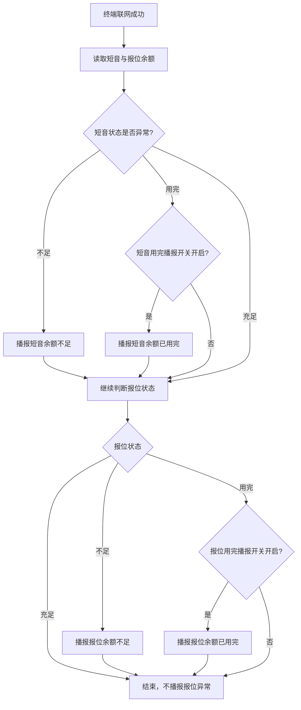
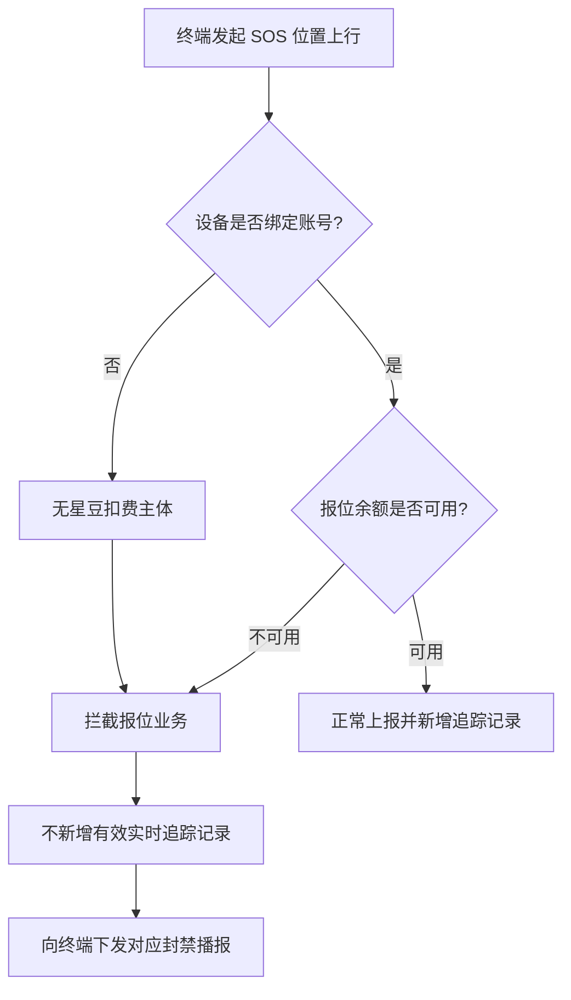

# 封禁逻辑

<!-- notion_page_id: 3db5667c-6d3a-82ad-9a5c-01a5b4b8194d -->

<callout icon="🎯" color="blue_bg">
	**文档用途**：梳理终端短音、报位及 SOS 场景下的封禁判断、余额播报与消息处理逻辑，供产品 / 开发 / 测试快速对齐。
	**适用范围**：覆盖设备上线后的待转发消息、短音与报位余额组合、SOS 文本播报、无扣费主体时的报位拦截及终端封禁播报；具体后台配置方式与套餐规则不展开。
</callout>
---
## 1. 核心对象与状态定义
<table header-row="true">
<tr>
<td>对象 / 状态</td>
<td>定义</td>
<td>主要影响</td>
</tr>
<tr>
<td>短音余额充足</td>
<td>短音可正常使用</td>
<td>不触发短音余额异常播报</td>
</tr>
<tr>
<td>短音余额不足</td>
<td>短音余额低于不足阈值</td>
<td>播报短音余额不足</td>
</tr>
<tr>
<td>短音余额用完</td>
<td>短音余额为 0 或达到用完条件</td>
<td>根据短音“用完播报”开关决定是否播报</td>
</tr>
<tr>
<td>报位余额充足</td>
<td>报位可正常使用</td>
<td>不触发报位余额异常播报</td>
</tr>
<tr>
<td>报位余额不足</td>
<td>报位余额低于不足阈值</td>
<td>播报报位余额不足</td>
</tr>
<tr>
<td>报位余额用完</td>
<td>报位余额为 0 或达到用完条件</td>
<td>根据报位“用完播报”开关决定是否播报，并校验业务拦截</td>
</tr>
<tr>
<td>无扣费主体</td>
<td>设备未绑定账号，无法确定星豆扣费主体</td>
<td>需重点校验 SOS 报位拦截、实时追踪记录及终端封禁播报</td>
</tr>
</table>
---
## 2. 终端联网后的余额判断主流程

<callout icon="💡">
	**组合原则**：联网后统一读取短音和报位余额；两项异常时按“短音 → 报位”的顺序分别处理，仅一项异常时只播报对应项目。
</callout>
---
## 3. 短音 × 报位组合处理矩阵
<table header-row="true">
<tr>
<td>短音状态</td>
<td>报位状态</td>
<td>预期处理</td>
<td>当前已知实际场景</td>
<td>验证重点</td>
</tr>
<tr>
<td>充足</td>
<td>充足</td>
<td>不播报</td>
<td>待验证</td>
<td>联网后无误播报</td>
</tr>
<tr>
<td>不足</td>
<td>充足</td>
<td>只播报短音余额不足</td>
<td>待验证</td>
<td>不追加报位播报</td>
</tr>
<tr>
<td>用完</td>
<td>充足</td>
<td>只判断短音用完播报开关</td>
<td>终端采集定位并联网成功后，会播报“短音余额已用完”</td>
<td>开关开启 / 关闭分别验证</td>
</tr>
<tr>
<td>充足</td>
<td>不足</td>
<td>只播报报位余额不足</td>
<td>录入语音并联网成功后，播报“报位余额不足”</td>
<td>不追加短音播报</td>
</tr>
<tr>
<td>充足</td>
<td>用完</td>
<td>只判断报位用完播报开关</td>
<td>待验证</td>
<td>开关开启 / 关闭分别验证</td>
</tr>
<tr>
<td>不足</td>
<td>不足</td>
<td>依次播报短音不足、报位不足</td>
<td>待验证</td>
<td>播报顺序、次数及间隔</td>
</tr>
<tr>
<td>用完</td>
<td>用完</td>
<td>分别判断两项用完播报开关</td>
<td>待验证</td>
<td>四种开关组合均需覆盖</td>
</tr>
<tr>
<td>不足</td>
<td>用完</td>
<td>播报短音不足；报位按用完开关处理</td>
<td>待验证</td>
<td>短音固定播报，报位受开关控制</td>
</tr>
<tr>
<td>用完</td>
<td>不足</td>
<td>短音按用完开关处理；播报报位不足</td>
<td>待验证</td>
<td>短音受开关控制，报位固定播报</td>
</tr>
</table>
---
## 4. 待转发消息与超时反馈逻辑
- 对讲群内存在设备 A、设备 B、设备 C，其中设备 C 为真实设备。
- 设备 C 离线期间，设备 A、设备 B 向设备 C 转发大量文本或语音消息。
- 设备 C 上线后接收待转发消息，当前出现大量接收失败，消息几乎都标记为 **「设备超时无反馈」**。
- 当前设计：处于发送中的消息在 **15 秒**内未收到对应反馈，则标记为失败，失败原因为 **「超时无反馈」**。
<callout icon="⚠️" color="yellow_bg">
	**风险点**：大量离线消息集中下发时，固定 15 秒超时机制可能导致终端尚未完成处理，平台已提前将消息判定失败。需重点验证消息排队、下发节奏、终端反馈顺序及超时计时起点。
</callout>
---
## 5. SOS 场景封禁逻辑
### 5.1 SOS 文本语音播报
- 场景：对讲群终端接收 SOS 文本。
- 当前问题：SOS 字母的语音播报错误。
- 验证重点：
	- SOS 字母读音是否正确；
	- SOS 与后续文本的播报顺序是否正确；
	- 中英文混合、重复 SOS、多条连续 SOS 的播报是否稳定。
### 5.2 无扣费主体 + 报位余额为 0
- 前置条件：设备未绑定账号，且报位余额为 0，系统无星豆扣费主体。
- 预期关注链路：SOS 位置上行 → 报位余额 / 扣费主体校验 → 业务拦截 → 实时追踪记录处理 → 终端封禁播报。
- 当前实际：
	- SOS 位置上行报位未被拦截；
	- 实时追踪仍新增记录；
	- 终端未收到对应的封禁播报。

<callout icon="🚨" color="red_bg">
	**高风险缺陷**：无扣费主体且报位余额为 0 时，拦截、追踪记录控制、终端播报三段链路均未按预期生效，可能导致欠费业务继续执行且终端无感知。
</callout>
---
## 6. 关键判定规则
1. **独立判断**：短音与报位余额分别判断，不应因其中一项正常而跳过另一项异常检查。
2. **顺序处理**：两项均异常时，按短音在前、报位在后的顺序依次播报。
3. **不足必播**：余额不足场景直接播报对应“余额不足”。
4. **用完受开关控制**：余额用完场景是否播报，由对应项目的“用完播报”开关决定。
5. **业务拦截与播报解耦**：播报开关只控制终端提示，不应影响余额用完后的业务拦截。
6. **无扣费主体需拦截**：设备未绑定账号且无法确定扣费主体时，不应继续执行需要扣费的报位链路。
7. **追踪记录一致性**：被拦截的 SOS 报位不应生成正常有效的实时追踪记录。
8. **消息超时**：发送中消息 15 秒无设备反馈则失败；批量待转发场景需验证计时起点和排队机制。
---
## 7. 测试覆盖建议
### 7.1 余额组合
- 覆盖短音 3 种状态 × 报位 3 种状态，共 **9 种组合**。
- 对涉及“用完”的组合，补充对应播报开关开启 / 关闭状态。
- 校验播报内容、顺序、次数、间隔及是否存在重复播报。
### 7.2 业务入口
- 终端联网；
- 录入语音；
- 采集定位；
- SOS 文本下发；
- SOS 位置上行；
- 离线消息批量转发后设备上线。
### 7.3 账号与扣费主体
- 设备已绑定个人账号；
- 设备已绑定企业账号；
- 设备未绑定账号；
- 有星豆扣费主体但余额不足 / 用完；
- 无星豆扣费主体且报位余额为 0。
### 7.4 核心断言
- 后台余额状态与终端实际播报一致；
- 播报开关仅影响“用完”提示，不改变业务封禁结果；
- 被封禁业务不产生成功消息或有效追踪记录；
- 终端收到明确且正确的封禁原因播报；
- 平台消息状态、失败原因与设备反馈一致。
---
## 8. 当前问题汇总
<table header-row="true">
<tr>
<td>编号</td>
<td>问题</td>
<td>影响</td>
<td>优先级建议</td>
</tr>
<tr>
<td>1</td>
<td>大量待转发文本 / 语音在设备上线后被标记为“设备超时无反馈”</td>
<td>离线消息送达率与状态准确性</td>
<td>高</td>
</tr>
<tr>
<td>2</td>
<td>SOS 文本中的 SOS 字母语音播报错误</td>
<td>紧急场景提示准确性</td>
<td>高</td>
</tr>
<tr>
<td>3</td>
<td>设备未绑定账号且报位余额为 0 时，SOS 报位未拦截</td>
<td>计费与封禁控制失效</td>
<td>最高</td>
</tr>
<tr>
<td>4</td>
<td>被封禁的 SOS 报位仍新增实时追踪记录</td>
<td>业务数据与封禁状态不一致</td>
<td>最高</td>
</tr>
<tr>
<td>5</td>
<td>上述封禁场景终端未收到对应播报</td>
<td>终端无法感知失败原因</td>
<td>高</td>
</tr>
</table>
---
## 9. 总结
1. **组合维度**：短音与报位各有充足、不足、用完 3 种状态，共形成 9 种基础组合。
2. **播报原则**：不足直接播报；用完由对应开关控制；两项异常时按短音、报位顺序分别处理。
3. **封禁原则**：业务拦截不应依赖播报开关；无扣费主体或余额不可用时，需拦截报位链路。
4. **数据原则**：被拦截的 SOS 报位不应继续生成正常实时追踪记录。
5. **消息原则**：发送中消息 15 秒无反馈即失败，但批量离线消息上线转发场景需重点确认超时机制是否合理。
---
**文档版本**：v1.0
**最后更新**：2026-07-22
**维护人**：测试团队
