# 星联应急叫应平台2期需求文档 v2.2

<!-- notion_page_id: 4975667c-6d3a-82de-bf5e-81df8412feae -->

# 星联应急叫应平台2期需求文档v2.2
<table header-row="true">
<tr>
<td>字段</td>
<td>内容</td>
</tr>
<tr>
<td>文档标题</td>
<td>星联应急叫应平台 2期产品需求文档</td>
</tr>
<tr>
<td>版本</td>
<td>v2.2</td>
</tr>
<tr>
<td>创建日期</td>
<td>2026-05-26</td>
</tr>
<tr>
<td>文档状态</td>
<td>待评审</td>
</tr>
<tr>
<td>产品负责人</td>
<td>—</td>
</tr>
<tr>
<td>参与方</td>
<td>开发 / 设计 / 测试</td>
</tr>
<tr>
<td>更新日期</td>
<td>2026-06-05</td>
</tr>
</table>
## 一、项目概述
在1期基础上，本期叠加**对讲群通信**、**星豆虚拟货币与套餐购买**、**设备入库与绑定**、**管理后台统一运营管理**四大模块，形成”通信 + 计费 + 设备 + 运营”完整闭环。本次评审范围覆盖三端：**小程序（tdwt-applet）**、**监控平台 Web（pg-podium-tdwt）**、**管理后台（monitor-admin）**。
**在范围内：** 对讲群全生命周期（创建/邀请/消息/套餐/结束）、星豆体系（充值/消费/套餐购买）、通信扣费与企业欠费、个人设备停用状态同步、管理后台参数配置与统计、设备入库绑定（含跨企业解绑）、消息通知记录迁移。
**排除项：** 设备单聊通信（1期已有）、SOS基础触发逻辑（1期已有）、调度群聊功能（1期已有）、星豆提现/退款、监控平台其他无关模块。
## 二、核心术语
<table header-row="true">
<tr>
<td>术语</td>
<td>说明</td>
</tr>
<tr>
<td>**对讲群**</td>
<td>一组终端设备组成的通信群组，群内设备发出的语音。小程序和Web端为纯监听界面（无法发送），仅终端设备可发送消息。成员上限：个人账号默认5台设备，企业账号默认100台设备，均支持管理后台全局配置；本期不支持按单个企业一级账号单独配置。</td>
</tr>
<tr>
<td>**星豆**</td>
<td>系统内虚拟货币，1元兑换N豆（N可配置，默认10）。不可提现，不可退款，仅限系统内消费。各账号（含企业子账号）星豆独立，互不共享，余额最低为0，不允许为负。企业设备通信扣费由企业一级账号承担，企业子账号星豆仅用于创建群、邀请成员等账号行为类消费。</td>
</tr>
<tr>
<td>**短音**</td>
<td>语音消息计费单位。发送方发送时扣1条；对讲群PTT下行广播时，每台接收终端每收到1条再扣1条。套餐不足时先按后台配置单价扣星豆（默认10星豆/条）；企业设备星豆不足后继续通信并产生短音欠费条数，个人设备星豆为0后停止服务。</td>
</tr>
<tr>
<td>**报位**</td>
<td>位置上报消息计费单位，单位为“个”。按位置点个数扣除，1个位置点扣1个报位资源；套餐不足时先按后台配置单价扣星豆（默认1星豆/个）。</td>
</tr>
<tr>
<td>**群主(个人账号)**</td>
<td>创建对讲群的账号，拥有结束群、添加/移除成员、修改任意成员昵称等完整管理权限。</td>
</tr>
<tr>
<td>**群成员(设备)**</td>
<td>群内每台终端设备（每个卡号/addr）为一个独立成员。成员上限按设备数计，非账号数。</td>
</tr>
<tr>
<td>**套餐**</td>
<td>为设备购买的通信资源包（短音条数 + 报位个数），套餐可叠加购买，资源累加。套餐耗尽后星豆仅作按次即时抵扣，不自动转换为套餐余额。</td>
</tr>
<tr>
<td>**跨企业解绑**</td>
<td>管理员将已绑定在企业A的设备解绑并重新绑定到企业B的操作，需二次确认，全部成功或全部回滚。</td>
</tr>
<tr>
<td>**PERSONAL设备**</td>
<td>个人账号自己绑定的设备，账号是设备的真正主人，拥有完整操作权限。</td>
</tr>
<tr>
<td>**SHARE设备**</td>
<td>设备真正主人将设备临时分享给另一个账号形成的绑定关系。SHARE账号可见该设备，对讲群邀请与套餐购买权限与PERSONAL/ENTERPRISE相同（均按”可见即可操作”原则）。</td>
</tr>
<tr>
<td>**企业设备**</td>
<td>只要设备绑定了企业一级账号，无论是否同时绑定个人账号、是否分配给二级/三级子账号，均视为企业设备。企业设备套餐耗尽后扣企业一级账号星豆；企业一级账号星豆为0后仍允许上行和下行通信，并产生设备侧欠费记录。</td>
</tr>
<tr>
<td>**个人设备**</td>
<td>设备未绑定任何企业一级账号，仅绑定个人账号时，才视为个人设备。个人设备套餐耗尽后扣个人账号星豆；个人账号星豆为0后进入不可用状态，上行禁止、下行失败。</td>
</tr>
<tr>
<td>**通信欠费**</td>
<td>企业设备在套餐耗尽且企业一级账号星豆为0后继续通信产生的短音欠费条数、报位欠费个数或欠费明细。星豆余额不记负数；企业一级账号后续充值时优先按当前配置单价自动冲抵欠费。</td>
</tr>
</table>
## 三、用户角色与权限
### 3.1 用户角色表
<table header-row="true">
<tr>
<td>用户角色</td>
<td>典型操作</td>
<td>群成员上限（设备数）</td>
<td>星豆归属</td>
<td>备注</td>
</tr>
<tr>
<td>个人账号</td>
<td>创建群、邀请设备、购买套餐、充值星豆</td>
<td>5（可配置）</td>
<td>独立</td>
<td>同手机号可同时拥有企业账号，两个身份空间完全隔离</td>
</tr>
<tr>
<td>企业一级账号</td>
<td>创建群、管理子账号、购买套餐、承担企业设备通信扣费与欠费</td>
<td>100（可配置）</td>
<td>独立</td>
<td>企业体系根账号（level=1）；其名下企业设备套餐耗尽后扣一级账号星豆，星豆为0后允许欠费通信</td>
</tr>
<tr>
<td>企业子账号</td>
<td>可独立创建对讲群，与一级账号共用同一成员上限配置</td>
<td>100（与一级账号同配置）</td>
<td>独立，不与一级账号共享</td>
<td>最多支持3级；不承担设备通信扣费，仅承担自身创建群、邀请成员等账号行为类消费</td>
</tr>
<tr>
<td>群主</td>
<td>结束群、添加/移除成员、修改任意成员昵称、批量购买套餐</td>
<td>—</td>
<td>—</td>
<td>创建群的账号自动成为群主</td>
</tr>
<tr>
<td>普通成员</td>
<td>监听群消息、查看成员位置、购买单设备套餐、修改自己的昵称</td>
<td>—</td>
<td>—</td>
<td>无法发送消息（发送由终端设备完成）</td>
</tr>
<tr>
<td>管理员/运营</td>
<td>配置系统参数、管理套餐、查看全量订单和星豆明细</td>
<td>—</td>
<td>—</td>
<td>管理后台等权，不做权限分级</td>
</tr>
</table>
### 3.2 权限矩阵
<table header-row="true">
<tr>
<td>操作</td>
<td>个人账号</td>
<td>企业账号</td>
<td>群主</td>
<td>普通成员</td>
<td>管理员</td>
</tr>
<tr>
<td>创建对讲群</td>
<td>✅</td>
<td>✅</td>
<td>—</td>
<td>—</td>
<td>❌</td>
</tr>
<tr>
<td>结束群组</td>
<td>✅（仅自己的群）</td>
<td>✅（仅自己的群）</td>
<td>✅</td>
<td>❌（越权时隐藏按钮）</td>
<td>❌</td>
</tr>
<tr>
<td>添加成员（邀请）</td>
<td>✅（仅群主）</td>
<td>✅（仅群主）</td>
<td>✅</td>
<td>❌（越权时隐藏按钮）</td>
<td>❌</td>
</tr>
<tr>
<td>移除成员</td>
<td>✅（仅群主）</td>
<td>✅（仅群主）</td>
<td>✅</td>
<td>❌</td>
<td>❌</td>
</tr>
<tr>
<td>发送消息</td>
<td>❌（终端设备专属）</td>
<td>❌（终端设备专属）</td>
<td>❌</td>
<td>❌</td>
<td>❌</td>
</tr>
<tr>
<td>单设备购买套餐</td>
<td>✅</td>
<td>✅</td>
<td>✅</td>
<td>✅</td>
<td>❌</td>
</tr>
<tr>
<td>批量购买套餐</td>
<td>✅</td>
<td>✅</td>
<td>✅</td>
<td>❌（越权时隐藏按钮）</td>
<td>❌</td>
</tr>
<tr>
<td>配置群参数</td>
<td>❌</td>
<td>❌</td>
<td>❌</td>
<td>❌</td>
<td>✅</td>
</tr>
<tr>
<td>查看星豆明细</td>
<td>✅</td>
<td>✅</td>
<td>✅</td>
<td>✅</td>
<td>✅</td>
</tr>
</table>
## 四、模块一：对讲群
### US-群-01：创建对讲群
**描述：** 作为账号用户，我希望创建一个对讲群，以便将名下设备组织为一个通信单元，统一接收群内消息。
**前置条件：** 用户已登录；创建群扣费配置大于0时，创建账号星豆余额需充足；配置为0时不校验星豆余额、不扣星豆。
**触发方式：** 点击消息列表页「+」按钮 → 选择「创建对讲群」。
**主流程：**
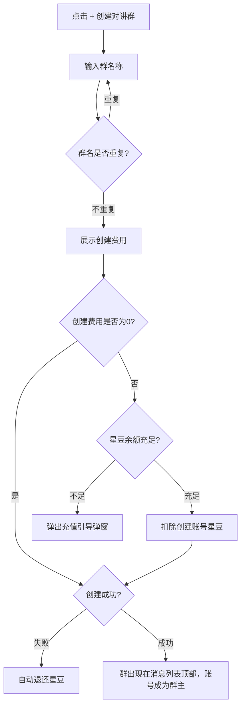
**分支/异常：**
<table header-row="true">
<tr>
<td>场景</td>
<td>处理</td>
</tr>
<tr>
<td>群名重复（同账号下）</td>
<td>提示”群名已存在，请重新输入”</td>
</tr>
<tr>
<td>扣费成功但创建失败</td>
<td>自动退还星豆</td>
</tr>
<tr>
<td>星豆不足</td>
<td>创建群扣费配置大于0时弹出充值引导弹窗；配置为0时不校验余额</td>
</tr>
</table>
**验收标准：**
- 群名长度 1\~15 字符，同账号下不可重名
- 创建成功后群出现在消息列表顶部，群主标识显示
- 扣费成功但创建失败时星豆自动退还，无需用户操作
- 成员上限按设备数计（个人5台/企业100台，均可配置）
**关键规则：**
- 创建群扣费拆分为个人账号与企业账号两套配置：个人账号默认20星豆，企业账号默认0星豆；企业一级账号和企业子账号均按企业账号配置执行；
- 企业账号创建群配置为0时不扣星豆；配置大于0时扣创建账号自身星豆，企业子账号创建群不扣企业一级账号星豆；
- 企业子账号可独立创建群，成员上限与一级账号共用同一配置（REQ-001, REQ-028）。
---
### US-群-02：群信息查看
**描述：** 作为群成员，我希望查看群的基本信息和成员列表；作为群主，我还能看到管理入口。
**触发方式：** 在群聊页点击底部「群信息」按钮，或从消息列表长按进入。
**群主视角包含：** 群名称 / 成员列表（含头像、昵称、设备卡号）/ 套餐概览 Tab / 「结束群组」按钮 / 「编辑群名」按钮 / 「查看邀请记录」入口。
**普通成员视角包含：** 群名称 / 成员列表 / 套餐概览 Tab。无结束/编辑/邀请记录入口。
**验收标准：**
- 群主视角有结束、编辑、邀请记录三个入口；普通成员视角无上述入口
- 按钮级权限控制，无权操作时直接隐藏，不显示禁用态
**关键规则：** 无权操作时直接隐藏按钮，不返回错误提示（F-002, REQ-002, REQ-003）。
---
### US-群-03：结束群组
**描述：** 作为群主，我希望在不再需要该群时将其结束，群结束后不可恢复。
**触发方式：** 群信息页点击「结束群组」。
**主流程：**
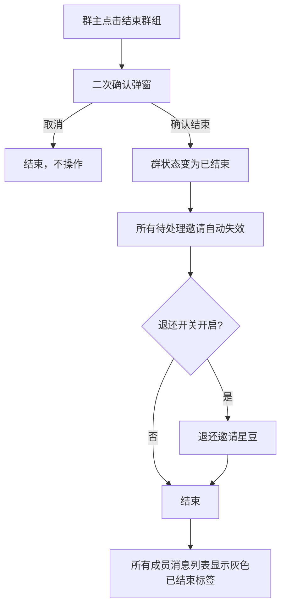
**验收标准：**
- 结束前必须有二次确认弹窗
- 结束后群状态变为”已结束”，所有成员消息列表显示灰色”已结束”标签
- 待处理中的邀请自动失效，星豆退还（如退还开关开启）
- 三端统一使用”结束群组”文案
- 群主账号过期或冻结时，群组不做特殊处理
- 群主账号被删除时，系统自动结束该群（流程同本故事，待处理邀请按退还开关处理）
**关键规则：**
- 术语统一为”结束群组”（DEC-002, REQ-004）；
- 群主过期/冻结不触发群状态变更；
- 群主被删除时自动结束群（TBD-001）。
---
### US-群-04：添加成员（邀请）
**描述：** 作为群主，我希望通过邀请设备加入群，扩大对讲范围；我还能查看所有已发出的邀请历史。
**前置条件：** 当前用户为群主；群内成员数未达上限。
**触发方式：** 群聊页底部「添加成员」（仅群主可见）或群信息页入口。
**设备类型限制：** 设备列表只显示\*\*天通应急救援棒（TT_RESCUE_STICK）\*\*类型的设备，其他类型不可加入对讲群。
**设备列表过滤规则：** 个人账号邀请时，仅展示已绑定个人账号的设备；未绑定个人账号的设备及企业账号绑定的设备不在列表中显示（企业账号绑定的设备只能由企业账号直接加入）。
**邀请权限矩阵：**
<table header-row="true">
<tr>
<td>邀请方</td>
<td>目标设备归属</td>
<td>允许</td>
<td>行为</td>
</tr>
<tr>
<td>**个人账号**</td>
<td>自己账号的设备（我的/好友(没有归属的设备)）</td>
<td>✅</td>
<td>直接入群，不发通知</td>
</tr>
<tr>
<td>企业账号</td>
<td>企业账号所绑定(ENTERPRISE)的设备</td>
<td>✅</td>
<td>直接拉进群</td>
</tr>
<tr>
<td>**个人账号**</td>
<td>**其他**已绑定个人账号(PERSONAL)的设备</td>
<td>✅</td>
<td>**发送邀请通知**</td>
</tr>
</table>
**主流程：**
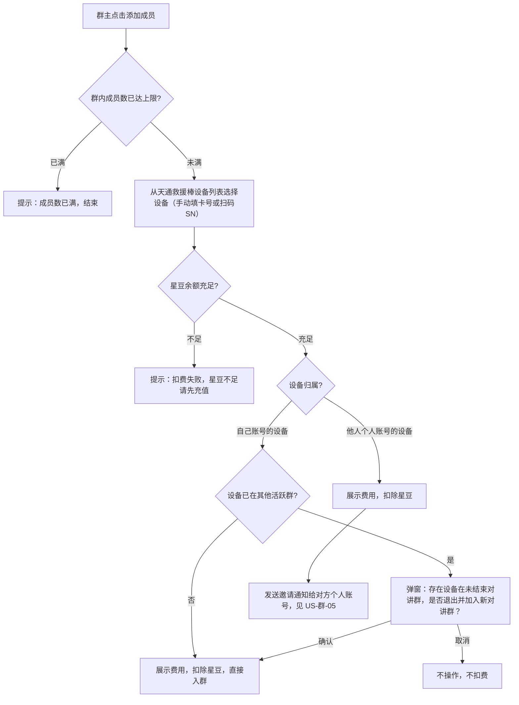
**分支/异常：**
<table header-row="true">
<tr>
<td>场景</td>
<td>处理</td>
</tr>
<tr>
<td>群内成员数已达上限</td>
<td>提示「成员数已满」，不扣费</td>
</tr>
<tr>
<td>余额不足</td>
<td>提示「扣费失败，星豆不足请先充值」</td>
</tr>
<tr>
<td>设备已在未结束推荐群</td>
<td>提示 「存在设备在未结束对讲群，是否退出并加入新对讲群？」</td>
</tr>
</table>
**验收标准：**
- 设备列表只显示天通应急救援棒类型设备
- **个人账号邀请时，设备列表仅展示已绑定个人账号的设备**
- 个人账号邀请时，企业账号绑定设备不显示
- 企业账号绑定的设备只能由企业账号直接加入
- 自己的设备已在其他群时，弹出换群确认弹窗，取消则不扣费
- 邀请他人设备时立即扣费；拒绝/超时按开关决定是否退还
- 移除成员和设备换群退出均**不退还**邀请星豆
- 成员昵称最大 15 字符
- 个人账号扫码发现设备未绑定个人账号，提示“设备未绑定个人账号”。
- 企业账号扫码发现设备非本账号所有，提示“未绑定该设备”。
**关键规则：**
- 邀请时立即扣费；
- 批量邀请时，如果因为各种原因导致一个失败，则全部失败
- 移除/换群退出不退还星豆，只有邀请失败/拒绝/超时才按开关退还（REQ-005, REQ-006, REQ-008, REQ-009）。
---
### US-群-05：接收与处理邀请
**描述：** 作为被邀请设备的账号拥有者，我希望收到入群邀请通知，并在限定时间内选择接受或拒绝。
> 本故事只适用于邀请他人设备的场景（路径2）；邀请自己设备不触发此流程。
**触发方式：** 设备真正主人收到小程序内邀请通知（不推送微信服务通知，见 TBD-002）。
**主流程：**
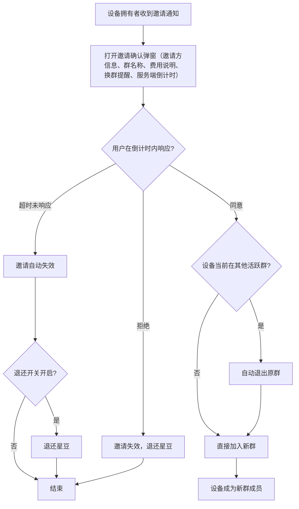
**分支/异常：**
<table header-row="true">
<tr>
<td>场景</td>
<td>处理</td>
</tr>
<tr>
<td>超时未处理</td>
<td>邀请自动失效；视管理后台配置决定是否退还星豆</td>
</tr>
<tr>
<td>群已结束（邀请期间）</td>
<td>邀请自动失效并退还星豆</td>
</tr>
<tr>
<td>群已满员（邀请期间其他设备抢先入群）</td>
<td>邀请自动失效并退还星豆</td>
</tr>
</table>
**验收标准：**
- 弹窗包含费用说明和换群提醒两条说明文字
- 倒计时从服务端获取，切换前后台不丢失进度
- 超时后邀请自动失效，不允许手动确认
**关键规则：**
- 邀请状态机：待确认→已接受/已拒绝/已过期；
- 超时退还开关由管理后台控制；
- 拒绝时退还；
- 倒计时不依赖本地计时器（REQ-007, REQ-043, F-025, F-033）。
---
### US-群-06：设备换群
**描述：** 作为设备，我在同一时间只能属于一个活跃对讲群；当接受新邀请时，系统自动退出原群。
**触发方式：** 设备接受新群邀请时系统自动触发（无需用户手动操作）。
**主流程：**
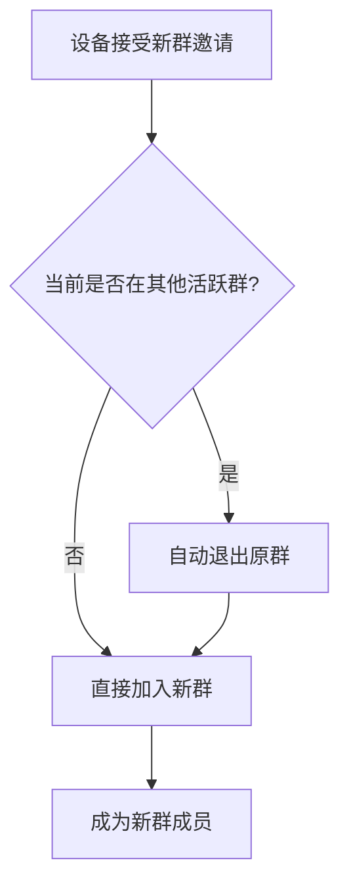
**并发保护：**
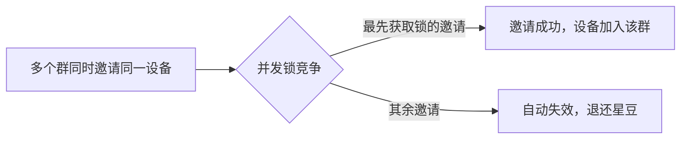
**验收标准：**
- 同一设备同一时间最多只在一个活跃群中
- 并发邀请场景下只有一个邀请成功
**关键规则：** 并发邀请同一设备时只有一个能成功（REQ-008, REQ-075, F-006, F-027）。
---
### US-群-07：消息列表页
**描述：** 作为用户，我希望在消息列表看到我所有的对讲群会话，并通过会话项状态了解当前群的情况。
**页面结构：** 分 Tab 展示（对讲群 / SOS群聊），按最后消息时间倒序排列，支持未读消息数角标。
**会话项状态与可见性规则：**
<table header-row="true">
<tr>
<td>角色</td>
<td>会话状态</td>
<td>标签</td>
<td>头像</td>
<td>点击行为</td>
</tr>
<tr>
<td>群主(个人账户)</td>
<td>群未结束</td>
<td>—</td>
<td>正常</td>
<td>进入群聊</td>
</tr>
<tr>
<td>**群主(个人账户)**</td>
<td>**群已结束**</td>
<td>`已结束`</td>
<td>灰色</td>
<td>**可进入，只读查看历史**</td>
</tr>
<tr>
<td>普通成员对应的个人账户</td>
<td>群未结束</td>
<td>—</td>
<td>正常</td>
<td>进入群聊</td>
</tr>
<tr>
<td>普通成员对应的个人账户</td>
<td>被移除 / 主动退出</td>
<td>`已退出`</td>
<td>灰色</td>
<td>提示「已退出群聊」，不可进入</td>
</tr>
</table>
**账号可见范围：**
- **个人账号：** 自己创建的群 + 自己设备被邀请加入并已接受的群
- **企业账号：** 只有自己创建的群（企业设备被他人拉入的群，企业账号不可见）
**验收标准：**
- 小程序底部 tabbar 文案改为「**聊天消息**」（原「通信消息」）
- 正常群显示最后消息时间和未读角标
- 普通成员（设备）退出/被移除后，头像灰色，账号(个人+企业)点击提示「已退出群聊」，不进入聊天页
- **群主结束群后，点击「已结束」的群仍可进入只读查看历史消息，所有操作按钮隐藏**
- 长按会话项可删除（已结束，已退出状态的可删除）
- 「全部已读」仅标记当前 Tab 下的会话，不跨 Tab 操作
**关键规则：**
- 企业账号设备被他人拉入群后，该企业账号消息列表不可见该群（设计刻意如此）；
- 群主只有「已结束/未结束」两种状态，无「已退出」（REQ-011, REQ-039, F-009）。
---
### US-群-08：群聊详情页
**描述：** 作为群成员，我希望在群聊页实时查看群内设备发来的语音和SOS报位消息，并能看到每条消息的送达状态明细。
**重要前提：小程序端和 Web 端均无法发送消息，消息仅由物理终端设备发出。** 群聊页是纯监听界面。
**页面结构：**
- **头部：** 群名称 + 套餐状态（套餐耗尽时红色显示”已过期”并出现「购买套餐」按钮，每次进入都提示）
- **消息气泡：** 昵称 / 消息内容（语音/SOS报位）/ 送达状态（X人已读 / X人未读 / X人失败），点击可展开查看接收人明细列表
- **底部操作栏：**
<table header-row="true">
<tr>
<td>按钮</td>
<td>可见范围</td>
</tr>
<tr>
<td>成员位置</td>
<td>所有成员</td>
</tr>
<tr>
<td>群信息</td>
<td>所有成员（视角不同，见US-群-02）</td>
</tr>
<tr>
<td>添加成员</td>
<td>**仅群主可见**</td>
</tr>
<tr>
<td>购买套餐</td>
<td>所有成员</td>
</tr>
</table>
**消息状态语义（重要）：** 所有状态针对终端设备，不是人：
<table header-row="true">
<tr>
<td>状态</td>
<td>含义</td>
<td>触发条件</td>
</tr>
<tr>
<td>**未读**</td>
<td>未下发/发送中/消息已下发，等待设备 ACK</td>
<td>~~初始状态~~</td>
</tr>
<tr>
<td>**已读**</td>
<td>设备已读回执</td>
<td>~~设备回传读回执~~</td>
</tr>
<tr>
<td>**失败**</td>
<td>下发成功但超时未收到 ACK/消息未能送达（下行链路失败）</td>
<td>~~下行链路返回失败~~</td>
</tr>
</table>
账号拥有者在小程序/Web端打开聊天页不影响已读状态，只有终端回执才算。
**接收人明细可见性：** 所有群成员均可点击消息气泡查看该条消息的完整接收人明细列表。
**离线通知规则：** 群内语音/SOS消息及入群邀请均不推送微信服务通知；用户需主动打开小程序查看邀请和消息。
**推送机制：** Web端 WebSocket 实时推送（断线后指数退避重连）；小程序3-5秒轮询（DEC-006, REQ-012）。
**验收标准：**
- 小程序和Web端无输入框、无语音按钮
- 消息气泡点击后展开接收人明细（所有成员均可查看）
- 套餐耗尽时头部红色警示，每次进入群聊都提示
- 已读状态以终端回执为准，非人工打开页面
**关键规则：**
- 每条语音消息从**发送方**设备扣除1条短音；报位消息按位置点个数从发送方设备扣除对应报位个数；
- 转发，谁接收扣谁
- 套餐余额不足时先扣对应账号星豆；企业设备星豆不足后仍可上行和下行并产生欠费记录；个人设备套餐和星豆均不足时，上行禁止、下行失败（见全局业务规则）；
- 成员数为0时设备也无法发消息（REQ-012, REQ-040, F-011, F-028）。
---
### US-群-09：成员管理
**描述：** 作为群成员，我希望能退出群组；作为群主，我希望能移除成员并修改任意成员的昵称；任何成员均可修改自己的群内昵称。
**三个子流程：**
**1. 退出群：**
**2. 移除成员（群主操作）：**
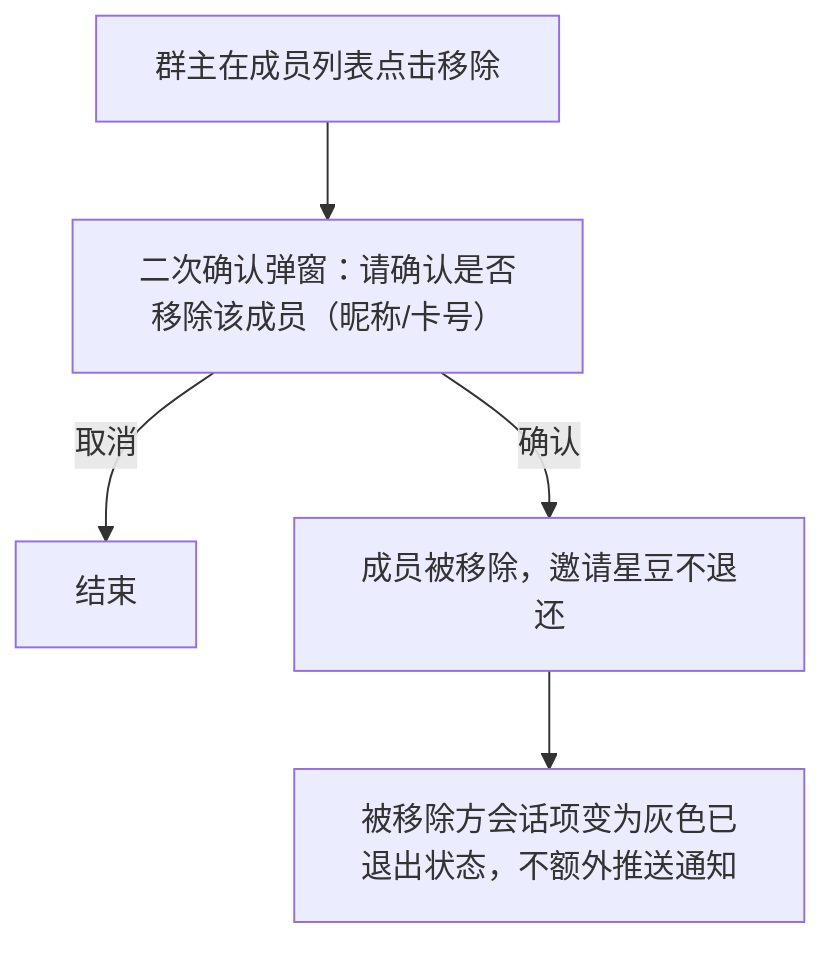
**3. 修改昵称：**
- 成员只能修改自己的群内昵称
- 群主可修改任意成员的群内昵称
**验收标准：**
- 退出群组前必须有二次确认弹窗。
- 退出群组按设备维度处理，不直接按当前登录账号是否为群主判断。
- 普通成员设备退出后，仅该设备退出群组，群继续存在。
- 群主账号名下某台设备退出时，若群内仍存在该群主账号归属的其他设备，则仅该设备退出，群继续存在。
- 设备退出后，该设备可加入其他活跃对讲群。
- 设备退出/被移除不退还邀请星豆。
**关键规则：**
- 群主身份绑定到创建群的账号，但退出群组按设备维度处理；
- 不应仅根据「当前用户是否群主」直接结束群组；
- 普通成员账号名下最后一台设备退出，不影响群生命周期；
- 成员设备退出后，其对应账号是否还能在消息列表看到该群，按消息列表可见性规则处理；
- 设备被账号主动解绑时，按同一规则判断是否需要退出群组或结束群组；
- 管理员强制解绑不处理。
---
### US-群-10：成员位置查看
**描述：** 作为群成员，我希望在群聊页点击「成员位置」查看群内所有成员的最新位置信息，以便掌握各设备的实时状态。
**触发方式：** 群聊页底部「成员位置」按钮。
**页面结构：** 地图视图 + 各成员位置图标；点击图标显示设备昵称/最后上报时间；支持「点击最新位置」按钮快速定位。
**验收标准：**
- 所有群成员均可查看成员位置
- 离线设备显示最后已知位置及时间戳
- 位置每30秒刷新一次
**关键规则：**
- 位置每30秒刷新；
- 离线设备显示最后已知位置（REQ-014, REQ-065）。
---
### US-群-11：消息路由与 SOS 联动
**描述：** 作为系统，我希望在收到终端消息后，根据消息类型和设备状态，自动路由到正确的目标，保证 SOS 报警和对讲群通信互不干扰。
**完整消息路由流程图（对应原型流程图）：**
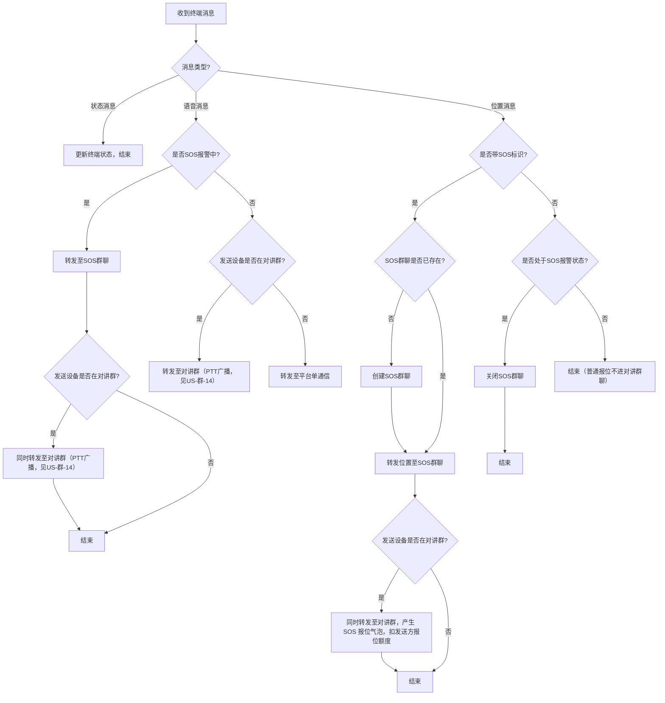
**计费规则（所有路由场景共用）：**
- 套餐绑定设备，与群类型无关
- **对讲群 SOS 报位**：仅**带 SOS 标识**的位置消息在对讲群产生报位气泡，按位置点个数从发送方设备扣除报位个数；同一条 SOS 报位即使同时进入 SOS 群聊和对讲群，**发送设备只扣一次**
- **普通报位**：不在对讲群聊产生报位气泡，不扣对讲群报位额度（成员位置地图仍按 US-群-10 刷新）
- **语音消息（对讲群 PTT）**：发送方设备发送时扣 1 条短音；下行广播至每台接收终端时，各接收设备各扣 1 条短音（详见 US-群-14）
- 发送方或接收方套餐余额不足时，先按后台配置单价扣除对应账号星豆；企业设备星豆不足仍允许上行和下行并产生欠费记录，个人设备套餐和星豆均不足时上行禁止、下行失败
**验收标准：**
- SOS 报警期间带 SOS 标识的语音和位置消息同时进入 SOS 群聊和对讲群（如存在）；SOS 报位发送方只扣一次，语音按 US-群-14 分别向发送方与各接收方扣费
- SOS 解除时（普通位置上报）自动关闭 SOS 群聊，**不在对讲群产生报位气泡**
- 设备在对讲群内时，**普通报位不产生对讲群报位气泡**，也不扣对讲群报位额度
- 不在对讲群的设备发语音 → 走平台单通信，不进对讲群
- 企业设备套餐和星豆耗尽时不阻断通信，记录欠费；个人设备套餐和星豆耗尽时，相关上行禁止、下行接收失败
**关键规则：**
- SOS群聊与对讲群并行存在，互不干扰；
- 语音消息进入对讲群后需下行广播给群内所有其他终端（见 US-群-14）（F-024, DEC-005, REQ-026）。
---
### US-群-12：邀请记录查看
**描述：** 作为账号用户，我希望能查看与我相关的邀请历史记录——被邀请方查看收到的邀请，群主查看发出的邀请，每人只能看到自己的记录。
**触发方式：**
- 群主：群信息页「查看邀请记录」入口
- 被邀请方：消息通知入口或小程序通知列表
**记录内容：** 群名称 / 邀请方/被邀请方 / 邀请状态（待确认/已接受/已拒绝/已过期）/ 时间。
**验收标准：**
- 账号只能看到自己相关的邀请记录，不可跨账号查看
- 四种状态均有展示
- 历史记录永久保留，不自动清除
**关键规则：** 每个账号只能查看自己的邀请记录（REQ-009, F-007）。
---
### US-群-13：群内套餐管理
**描述：** 作为群成员，我希望在群信息页查看每台设备的套餐剩余情况；作为任意成员，我可以为群内设备购买单个套餐还能批量购买套餐；
**页面结构（套餐概览 Tab）：**
<table header-row="true">
<tr>
<td>列</td>
<td>内容</td>
</tr>
<tr>
<td>设备</td>
<td>卡号 / 群内昵称</td>
</tr>
<tr>
<td>短音剩余</td>
<td>XX条</td>
</tr>
<tr>
<td>报位剩余</td>
<td>XX个</td>
</tr>
<tr>
<td>操作</td>
<td>「查看」按钮</td>
</tr>
</table>
底部：「批量购买套餐」按钮。
**设备套餐详情页：** 该设备所有套餐记录（状态 / 激活时间 / 失效时间 / 短音进度条 / 报位进度条）；底部「购买套餐」按钮（所有成员可见）。
**验收标准：**
- 所有成员可查看群内每台设备的套餐状态
- 所有成员均可点击「查看」进入单设备套餐详情并购买
- 「批量购买套餐」所有成员可见
- 套餐可叠加，资源累加
**关键规则：**
- 批量购买流程见 US-豆-04；
- 设备范围仅限当前群内成员（原型图, F-013）。
---
### US-群-14：对讲群 PTT 语音广播（服务端下行转发）
**描述：** 作为系统，我希望在收到对讲群内某台设备的语音消息后，将该消息下行广播给群内所有其他终端设备，实现真正的 PTT（Push-To-Talk）对讲功能，并按设备归属执行套餐、星豆与欠费扣费规则。
**触发条件：** 语音消息路由结果为”转发至对讲群”（见 US-群-11）。
**通信扣费原则：**
- 上行短音：发送设备产生 1 条短音扣费。
- 下行短音：每个接收设备各产生 1 条短音扣费。
- 设备套餐不足时，不直接失败，先进入星豆即时抵扣；星豆抵扣不增加套餐余额。
- 企业设备：套餐不足后扣企业一级账号星豆；企业一级账号星豆为 0 后仍允许上行和下行通信，并产生短音欠费条数。
- 个人设备：套餐不足后扣个人账号星豆；个人账号星豆为 0 后进入不可用状态，上行禁止、下行失败。
**主流程：**
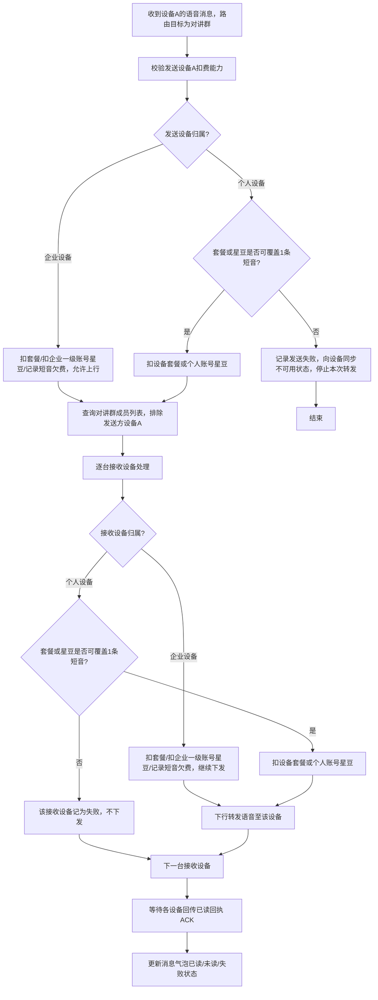
**消息状态定义：**
- 等待下发中：消息排队待发送阶段。
- 未读：消息已下发但尚未收到接收端 ACK 回执。
- 已读：接收端已返回已读回执。
- 失败：下发成功但超时未收到 ACK，或因个人设备套餐与星豆均不足导致无法下发。
**关键规则：**
- 发送方设备发送时扣除 1 条短音；不收到自己的消息回传。
- 企业发送方或接收方套餐和星豆均不足时，仍允许通信并记录企业设备短音欠费。
- 个人发送方套餐和星豆均不足时，停止本次下行广播，并向终端同步不可用状态。
- 个人接收方套餐和星豆均不足时，仅该设备记为失败，不影响其他设备。
- 已读/未读/失败状态以终端 ACK 为准；对讲群 ACK **独立存储**，不复用 EmergencyMessageStatus。
**验收标准：**
- 企业设备余额不足不导致转发失败，可持续通信并产生欠费记录。
- 终端发送消息后，中途离开对讲群，后续终端上线不会受到消息，消息标记为失败
- 个人设备套餐与星豆均不足时，上行被禁止、下行接收失败。
- 每条对讲群语音消息：发送方扣 1 条短音，每台成功接收的终端各扣 1 条短音；企业欠费场景记录为欠费条数。
- 消息气泡实时更新”X人已读 / Y人未读 / Z人失败”。
---
## 五、模块二：星豆体系
### US-豆-01：查看星豆余额
**描述：** 作为账号用户，我希望随时查看当前账号的星豆余额，以便决策是否需要充值。
**入口：** 小程序「我的信息」页；监控平台「个人中心」页。对所有账号类型（含企业子账号）开放。
**验收标准：**
- 余额实时显示，充值/消费后即时刷新
- 子账号显示自己的余额，不显示一级账号余额
**关键规则：** 子账号与一级账号余额独立，各自充值各自使用（REQ-017, REQ-053）。
---
### US-豆-02：充值星豆
**描述：** 作为用户，我希望选择充值档位，完成支付后星豆即时到账。
**支付方式（分端）：**
- **小程序：** 微信小程序支付（`wx.requestPayment`，页面内完成）
- **Web 端（监控平台）：** 微信扫码支付 或 支付宝扫码支付（跳转扫码页面）
**充值档位（默认）：** 50豆/5元、100豆/10元、300豆/30元、500豆/50元、1000豆/100元，支持自定义金额。
**验收标准：**
- 支付完成后星豆余额即时更新
- 支付轮询超时90秒后提示用户重试
- 充值记录出现在星豆明细
**关键规则：**
- 档位由管理后台配置；
- 兑换比例1元=N豆（N可配置，默认10）；
- 星豆不可提现、不可退款（REQ-018, REQ-041）。
---
### US-豆-04：批量购买套餐
**描述：** 作为群成员，我希望在群内一次性为多台设备购买套餐，合并为一笔支付，提升效率。
**设备范围：** 从群信息页进入，可选设备仅限当前对讲群的成员设备，不引入群外设备。
**小程序流程（4步）：**
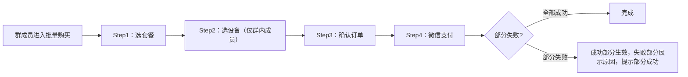
**Web 端流程（4步 Wizard）：**
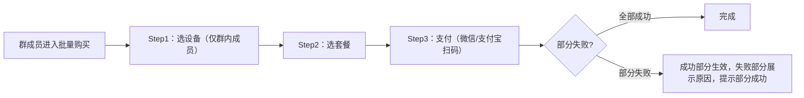
**验收标准：**
- 设备选择范围限定为当前群内成员
- 部分设备失败时：已成功设备正常生效，失败设备显示失败原因，用户收到”部分成功”提示
**关键规则：** 部分失败时已成功设备不回滚（DEC-001, REQ-016, REQ-054）。
---
### US-豆-05：星豆明细与订单查看
**描述：** 作为用户，我希望查看自己的星豆交易流水和历史订单记录，了解每笔消费来源。
**入口：** 小程序「我的信息」→「星豆明细」；监控平台「个人中心」→「星豆明细」。
**验收标准：**
- 流水列表按时间倒序，包含：交易类型 / 交易额度（+/-）/ 交易说明 / 时间
- 退款记录只含套餐退款，星豆退还（如邀请失败退还）在星豆明细单独显示
**关键规则：**
- 「已过期」订单在订单列表中的 Tab 归属见 **TBD-007**（见第九章待定事项）
- 星豆明细需覆盖所有交易类型（REQ-019, DEC-003, DEC-010）
---
## 六、模块三：管理后台
### US-管-01：对讲群参数配置
**描述：** 作为管理员，我希望在系统配置页调整对讲群的全局参数，控制功能开关和费用规则。
**配置项：**
<table header-row="true">
<tr>
<td>配置项</td>
<td>类型</td>
<td>默认值</td>
<td>说明</td>
</tr>
<tr>
<td>个人账号创建群扣除星豆</td>
<td>数值</td>
<td>20豆</td>
<td>0表示免费；大于0时扣创建账号星豆</td>
</tr>
<tr>
<td>企业账号创建群扣除星豆</td>
<td>数值</td>
<td>0豆</td>
<td>适用于企业一级账号和企业子账号；0表示免费</td>
</tr>
<tr>
<td>邀请成员扣除星豆</td>
<td>开关 + 数值</td>
<td>开启，20豆</td>
<td>关闭后邀请免费</td>
</tr>
<tr>
<td>邀请失败退还星豆</td>
<td>开关</td>
<td>开启</td>
<td>邀请扣费关闭时自动禁用</td>
</tr>
<tr>
<td>邀请超时时间</td>
<td>数值（分钟）</td>
<td>10分钟</td>
<td>—</td>
</tr>
<tr>
<td>个人账号最大成员数</td>
<td>数值（设备数）</td>
<td>5</td>
<td>仅对新建群生效</td>
</tr>
<tr>
<td>企业账号最大成员数</td>
<td>数值（设备数）</td>
<td>100</td>
<td>仅对新建群生效；本期仅支持全局配置，不支持指定单个企业一级账号单独配置</td>
</tr>
<tr>
<td>短音星豆单价</td>
<td>数值</td>
<td>10豆/条</td>
<td>套餐耗尽后的星豆即时抵扣与企业欠费冲抵使用</td>
</tr>
<tr>
<td>报位星豆单价</td>
<td>数值</td>
<td>1豆/个</td>
<td>套餐耗尽后的星豆即时抵扣与企业欠费冲抵使用</td>
</tr>
</table>
**验收标准：**
- 所有配置项保存后即时生效
- 成员上限变更只对新建群生效，不影响已有群
- 邀请扣费开关关闭时，退还开关自动禁用置灰
**关键规则：** 成员上限变更不追溯已有群（REQ-023, REQ-045）；配置变更记入已有日志模块，不单独建页；单个企业一级账号自定义成员上限作为后续扩展，本期不实现。
---
### US-管-02：星豆经济参数配置
**描述：** 作为管理员，我希望配置星豆的兑换比例、充值档位和单笔最大充值金额，灵活调整收费策略。
**配置项：** 兑换比例（1元=N豆）/ 充值档位（多档，可增删）/ 最低充值金额（默认1元）/ 最大充值金额。
**验收标准：**
- 兑换比例修改后即时生效，不影响已有星豆余额
- 充值档位变更在用户下次打开充值页时生效
**关键规则：** 兑换比例配置后即时生效（REQ-024, REQ-058）；配置变更记入已有日志模块，不单独建页。
---
### US-管-03：星豆套餐管理
**描述：** 作为管理员，我希望对星豆充值套餐（金额档位）进行添加、禁用和删除操作，管理用户可选的充值方案。
**页面结构：** 列表（排序 / 星豆数 / 价格 / 状态 / 操作）+ 添加弹窗（排序下标 / 星豆数1-10000 / 价格 / 备注）。
**验收标准：**
- 禁用/删除均需二次确认
- 已有关联订单的套餐不可删除（提示原因）
- 禁用套餐灰色显示，不隐藏，历史订单仍可查看
- 订单中冗余存储套餐名称快照，不受禁用影响
**关键规则：** 禁用不隐藏（REQ-123\~126）。
---
### US-管-04：订单统计 Dashboard
**描述：** 作为管理员，我希望查看平台整体订单数据，支持按支付方式和套餐类型两个维度分析经营情况。
**页面结构（按原型截图，从上到下）：**
**区域1 — KPI 卡片（4个，横排）：**
<table header-row="true">
<tr>
<td>卡片</td>
<td>指标</td>
</tr>
<tr>
<td>蓝色</td>
<td>订单量（笔数）</td>
</tr>
<tr>
<td>橙色</td>
<td>订单销售额（元）</td>
</tr>
<tr>
<td>绿色</td>
<td>退款订单数（笔数）</td>
</tr>
<tr>
<td>粉色</td>
<td>退款金额（元）</td>
</tr>
</table>
**区域2 — 营业趋势折线图：**
- 横轴：日期（默认近30天，支持自定义时间范围）
- 纵轴：金额/数量
- 4条折线：订单总额 / 订单量 / 退款订单数 / 退款订单量（图例可切换显示）
**区域3 — 订单来源分析（左）+ 订单类型分析（右）：**
左侧：**饼图**，维度为支付方式，包含以下分类：
- 微信小程序支付
- 微信扫码支付
- 支付宝扫码支付
右侧：**条形进度条列表**，展示各订单类型金额占比，包含以下分类：
- 星豆订单
- 组合套餐
- 短音套餐
- 报位套餐
每行展示：序号 / 类型名称 / 金额 / 进度条（按金额占比）
**验收标准：**
- KPI 卡片数值实时反映所选时间范围内的数据
- 折线图4条折线可通过图例独立开关显示
- 饼图悬停时展示该支付方式的笔数和金额
- 条形进度条按金额降序排列
- 退款统计只含套餐退款，不含星豆退还
- 默认时间范围：近30天，支持自定义时间范围筛选
**关键规则：** 退款口径统一：只含套餐退款（DEC-010, REQ-025）。
---
### US-管-05：设备入库管理
**描述：** 作为管理员，我希望在入库时为设备选择所属分组，并能按分组筛选查看已入库设备列表。
**入库弹窗：** 分组选择为必填（`el-select filterable` 单选，实时加载分组列表）；无分组时提示”暂无分组，请先创建分组”。
**批量入库：** 所有行共用同一分组，弹窗顶部统一选择。
**验收标准：**
- 分组为必填项，未选择时不允许提交
- 列表页展示分组名称，支持按分组筛选
**关键规则：** 分组必填（REQ-111\~113）。
---
### US-管-06：批量绑定设备（含跨企业解绑）
**描述：** 作为管理员，我希望将入库设备批量绑定到企业账号；若设备已绑定其他企业，需明确确认后执行跨企业解绑。
**主流程：**
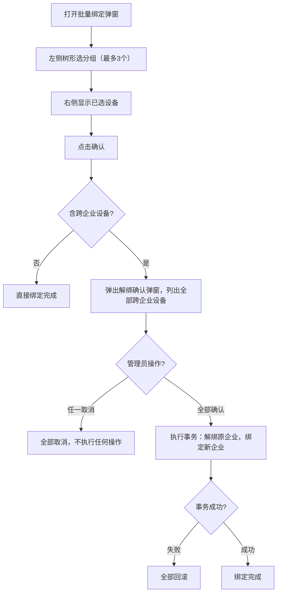
**验收标准：**
- 跨企业设备必须全部确认或全部取消，不支持部分确认
- 事务失败时全部回滚
- 历史记录仍归原企业账号
**关键规则：**
- 跨企业解绑全部确认或全部取消；
- 失败全部回滚（REQ-114\~119, DEC-REQ-004, DEC-REQ-005）。
---
### US-管-07：消息通知记录管理
**描述：** 作为管理员，我希望在管理后台统一查看全平台的消息通知记录；对短信/邮箱/电话类通知，展示具体扣费账号、数量与说明。该功能从监控平台迁移至管理后台。
**现有表格列（来自原型截图）：** 收方Web账号 / 收方手机号码 / 设备卡号 / 发送时间 / 内容 / 发送状态 / 发送结果 / 创建时间
**新增列（本期需求）：** 消息类型为 **短信通知 / 邮箱通知 / 电话通知** 时，在”内容”与”发送状态”之间插入：**扣除Web账号** / **扣除数量** / **扣除说明**
**最终表格列顺序：**
- **其他消息类型：** 收方Web账号 / 收方手机号码 / 设备卡号 / 发送时间 / 内容 / 发送状态 / 发送结果 / 创建时间（与现有列一致，无新增）
- **短信通知 / 邮箱通知 / 电话通知：** 收方Web账号 / 收方手机号码 / 设备卡号 / 发送时间 / 内容 / **扣除Web账号** / **扣除数量** / **扣除说明** / 发送状态 / 发送结果 / 创建时间
**筛选条件：** 账号 / 交易时间范围 / 消息类型
**短信通知 / 邮箱通知 / 电话通知——扣费字段规则：**
<table header-row="true">
<tr>
<td>字段</td>
<td>说明</td>
</tr>
<tr>
<td>扣除Web账号</td>
<td>实际被扣减短信/邮箱/电话额度的 Web 账号</td>
</tr>
<tr>
<td>扣除数量</td>
<td>本次通知扣减的条数（短信条数、邮件封数、电话次数等，按对应类型计量）</td>
</tr>
<tr>
<td>扣除说明</td>
<td>扣费原因简述，如「SOS 报警通知紧急联系人」「账号主动发送」等</td>
</tr>
</table>
**短信通知 / 邮箱通知 / 电话通知——不扣费场景：**
<table header-row="true">
<tr>
<td>触发来源</td>
<td>规则</td>
</tr>
<tr>
<td>**天通救援棒**（`TT_RESCUE_STICK`）触发的报警</td>
<td>向紧急联系人发送的短信/邮件/电话通知**不扣除**紧急联系人所属账号的短信/邮箱/电话数量；对应记录的扣除数量填 `0`，扣除说明标注「设备报警通知，不扣紧急联系人额度」</td>
</tr>
<tr>
<td>**同类终端产品**（后续扩展，与天通救援棒同等报警链路）</td>
<td>同上，按产品类型配置识别，统一适用不扣紧急联系人额度规则</td>
</tr>
</table>
> 不扣费时：扣除Web账号、扣除数量、扣除说明仍展示；扣除数量必须为 0。
**验收标准：**
- 管理后台展示全量消息通知记录
- 短信通知、邮箱通知、电话通知三类记录展示扣除Web账号、扣除数量、扣除说明
- 天通救援棒（及后续同类终端产品）触发的报警，向紧急联系人发出的短信/邮件/电话不扣减额度，记录中扣除数量为 0 且说明可追溯
- 监控平台删除该功能前端入口（数据保留在原库）
**关键规则：** 监控平台删除前端入口；
---
### US-管-08：星豆明细查询
**描述：** 作为管理员，我希望查看全量用户的星豆交易流水，支持模糊搜索账号，覆盖所有交易类型。
**页面结构：** 筛选区（账号文本输入支持模糊匹配 / 交易时间范围）+ 表格（账号类型 / 手机号 / 账号 / 交易类型 / 交易额度 / 交易说明 / 交易时间）+ 分页。
**验收标准：**
- 账号搜索支持包含匹配（SQL LIKE）
- 管理员可查看所有用户记录，不受账号归属限制
- 充值/消费/退还/配置变更均有记录
- 管理员配置变更（对讲群参数、星豆汇率等）在已有日志模块中可查，不单独建页
**关键规则：**
- 账号搜索包含匹配；
- 全量查询（F-020, F-P3-006, F-036, REQ-022, REQ-127）。
---
### US-管-09：企业欠费记录查询
**描述：** 作为管理员，我希望查询企业设备因套餐和星豆耗尽后持续通信产生的欠费记录，并能追踪后续充值冲抵情况，便于企业查账。
**页面结构：** 筛选区（企业一级账号 / 设备卡号或设备ID / 欠费类型 / 时间范围）+ 表格（企业一级账号 / 设备ID / 设备卡号 / 欠费类型 / 欠费数量 / 折算星豆 / 产生时间 / 冲抵状态 / 冲抵时间）+ 分页。
**冲抵规则：** 企业一级账号充值星豆后，系统优先按当前后台配置单价自动冲抵该企业名下设备历史欠费；企业子账号充值不自动冲抵企业一级账号欠费。
**验收标准：**
- 管理员可按企业一级账号、设备和时间范围查询欠费记录。
- 欠费记录可展示短音欠费条数、报位欠费个数及折算星豆。
- 自动冲抵动作在欠费记录和星豆明细中均可追溯。
- 星豆余额不允许显示负数，欠费负数仅体现在设备资源/欠费记录中。
---
## 七、全局业务规则
以下规则跨模块生效，各用户故事中不再重复说明。
1. **星豆不可提现、不可退款**，仅限系统内消费；星豆余额最低为0，不允许为负。
2. **报位单位统一为“个”**：有多少个位置点扣除多少个报位资源，前端展示为“报位剩余：12个”等格式，不再使用分钟/时长口径。
3. **短音单位统一为“条”**：发送方上行1条短音扣1条；对讲群下行广播至每台接收终端时，每台接收终端各扣1条。
4. **套餐耗尽后星豆按次即时抵扣**：短音默认10星豆/条，报位默认1星豆/个，具体单价由管理后台配置；星豆抵扣成功后不自动转换为套餐余额，套餐剩余仍显示0条/0个。
5. **设备归属判定优先级**：只要设备绑定了企业一级账号，无论是否同时绑定个人账号、是否分配给企业二级/三级账号，均视为企业设备；只有未绑定任何企业一级账号且仅绑定个人账号时，才视为个人设备。
6. **企业设备通信扣费主体为企业一级账号**：设备套餐耗尽后扣企业一级账号星豆；企业一级账号星豆为0后，上行和下行仍可继续通信，并产生设备侧短音欠费条数、报位欠费个数或企业欠费明细。
7. **企业欠费不记入星豆负数**：欠费负数只体现在设备资源/欠费记录中；企业一级账号后续充值星豆时，优先按当前后台配置单价自动冲抵历史欠费，冲抵后剩余星豆进入余额。
8. **企业子账号不承担设备通信扣费**：企业子账号星豆仍独立，但仅用于创建群、邀请成员等账号行为类消费；企业子账号充值不自动冲抵企业一级账号欠费。
9. **个人设备套餐和星豆均耗尽后停止服务**：平台向终端同步套餐状态与可用状态；上行短音和位置禁止进入正常通信流程，下行通信内容不再下发，对讲群中该个人接收设备记为失败。
10. **个人设备允许少量负数只作为网络延迟容错**：如状态指令未及时到达导致重复上报，可出现1-2条/个级别的短暂负数，但不允许长期欠费运行。
11. **个人设备状态恢复机制**：用户充值星豆或购买套餐后，终端重启或定时查询状态时发现可用，恢复正常通信并播报“设备已恢复可用状态”。
12. **创建群扣费按账号类型拆分配置**：个人账号创建群默认20星豆，企业账号创建群默认0星豆；企业一级账号和企业子账号均按企业账号配置执行。配置为0时不校验余额、不扣星豆；配置大于0时扣创建账号自身星豆。
13. **对讲群成员上限仅支持全局配置**：个人账号默认5台设备，企业账号默认100台设备；成员上限配置变更只对新建群生效，不影响已有群；本期不支持按单个企业一级账号单独配置成员上限。
14. **一台设备同一时间只能处于一个未结束的对讲群**，接受新邀请时自动退出原群。
15. **账号冻结或过期后**，该账号无法在群内（通过终端）发消息，但保留在成员列表中（不自动退群）；**群主账号过期或冻结时，群组不做特殊处理**；**群主账号被删除时，系统自动结束该群**（流程同 US-群-03，待处理邀请按退还开关处理）。
16. 三端统一使用“**结束群组**”作为结束群的术语。
17. **星豆退还（如邀请失败/群结束）只退还一次**，防止重复退还。
18. **退款统计口径**：只含套餐退款，星豆退还在星豆明细单独统计，不计入退款。
19. **同一手机号可拥有企业账号和个人账号两个独立身份**（小程序切换登录）；对讲群、星豆、套餐均按身份隔离，两空间完全独立，不提供合并视图。
20. **对讲群按账号严格隔离**：企业父账号与子账号的对讲群互不可见；每个账号只能管理自己创建或加入的群。
21. **Web端与小程序对讲群操作权限完全对齐**，不存在端级别的功能限制。
22. **套餐绑定设备，不绑定账号**：通信费用先从各设备自身绑定套餐中扣除；套餐不足后再按设备归属扣对应账号星豆或产生企业欠费。
23. **对讲群 SOS 报位**：仅**带 SOS 标识**的位置消息在对讲群产生报位气泡并按位置点个数扣发送方报位个数；同一条 SOS 报位多目标路由时**发送设备只扣一次**；**普通报位不在对讲群聊产生报位气泡**。
24. **对讲群 PTT 语音**：发送方发送时扣1条短音；下行广播至每台接收终端时，各接收设备各扣1条短音；企业设备余额不足不阻断通信，个人设备套餐和星豆均不足时失败。
25. **对讲群成员只能是天通应急救援棒（TT_RESCUE_STICK）设备**，其他设备类型不可加入。
26. 个人账号邀请只能邀请已绑定个人账号的设备，选择邀请设备时提前过滤掉未绑定个人账号的设备，企业账号绑定的设备只能由企业账号直接加入。
27. **企业账号只能看到自己创建的群**。
28. **移除成员和设备换群退出均不退还邀请星豆**；只有邀请失败/拒绝/超时才按退还开关处理。
29. **群主结束群后仍可进入只读查看历史消息**；普通成员退出/被移除后不可查看历史。
---
## 八、非功能性需求
<table header-row="true">
<tr>
<td>指标</td>
<td>目标值</td>
</tr>
<tr>
<td>消息送达延迟</td>
<td>≤ 10秒（正常网络）</td>
</tr>
<tr>
<td>位置刷新周期</td>
<td>30秒</td>
</tr>
<tr>
<td>小程序轮询间隔</td>
<td>3\~5秒</td>
</tr>
<tr>
<td>页面加载时间</td>
<td>≤ 2秒（首屏）</td>
</tr>
<tr>
<td>API 响应时间</td>
<td>P99 ≤ 2秒</td>
</tr>
<tr>
<td>WebSocket 连接数</td>
<td>支持并发 ≥ 1000</td>
</tr>
<tr>
<td>接口频率限制</td>
<td>创建群 ≤ 5次/分钟；充值 ≤ 10次/分钟；关键操作均需二次确认</td>
</tr>
</table>
## 九、待定事项
以下事项**尚未定稿或本期不做**，各用户故事中可引用编号；定稿后移入对应 US 或全局规则，并从本表删除。
<table header-row="true">
<tr>
<td>编号</td>
<td>事项</td>
<td>关联模块</td>
</tr>
<tr>
<td>TBD-007</td>
<td>已过期订单在订单列表中的 Tab 归属（归入已取消 / 独立 Tab / 不展示等）</td>
<td>US-豆-05</td>
</tr>
<tr>
<td>TBD-008</td>
<td>是否支持为指定企业一级账号单独配置对讲群成员上限（如单企业200人）；本期不实现，仅保留后续扩展</td>
<td>US-管-01</td>
</tr>
</table>
## 十、v2.2 需求变更访谈结论
本版本在 v2.1 基础上，根据 2026-06-04 需求变更材料及深度访谈确认以下口径：
1. 企业欠费负数记在设备侧套餐资源/欠费记录，不记在星豆余额；星豆余额最低为0。
2. 报位单位统一为“个”，例如“短音剩余：100条，报位剩余：12个”。
3. 企业成员上限本期只做全局配置，不支持按指定企业一级账号单独配置。
4. 企业子账号星豆仍独立，但设备通信扣费一律走企业一级账号；子账号星豆只用于创建群、邀请成员等账号行为类消费。
5. 个人设备套餐与星豆都耗尽后，上行和下行通信均禁止；对讲群下行到该个人设备时记为失败。
6. 创建群扣费拆成个人/企业两套配置：个人默认20星豆，企业默认0星豆。
7. 套餐耗尽后，星豆只做按次即时抵扣，不自动转换为套餐余额。
8. 企业一级账号充值星豆后，优先按当前后台配置单价自动冲抵历史欠费；企业子账号充值不冲抵一级账号欠费。
9. 设备只要绑定企业一级账号，就按企业设备通信扣费；个人账号可见/绑定不承担通信费用。
10. 通信扣费新规则同时适用于上行和下行；企业设备余额不足不再导致转发失败，个人设备余额不足才失败。
---
## 十一、版本信息
<table header-row="true">
<tr>
<td>版本</td>
<td>日期</td>
<td>状态</td>
<td>变更记录</td>
</tr>
<tr>
<td>v2.2</td>
<td>2026-06-05</td>
<td>待评审</td>
<td>见 [CHANGELOG.md](https://alidocs.dingtalk.com/document/edit?docKey=1GXn45KVYwYJQqDQ&dentryKey=zxaDn4B5FPQ5kqrQ&type=d)</td>
</tr>
<tr>
<td>v2.1</td>
<td>2026-05-28</td>
<td>已评审</td>
<td>见 [CHANGELOG.md](https://alidocs.dingtalk.com/document/edit?docKey=1GXn45KVYwYJQqDQ&dentryKey=zxaDn4B5FPQ5kqrQ&type=d)</td>
</tr>
<tr>
<td>v2.0</td>
<td>2026-05-27</td>
<td>已归档</td>
<td>见 [CHANGELOG.md](https://alidocs.dingtalk.com/document/edit?docKey=1GXn45KVYwYJQqDQ&dentryKey=zxaDn4B5FPQ5kqrQ&type=d)</td>
</tr>
</table>
