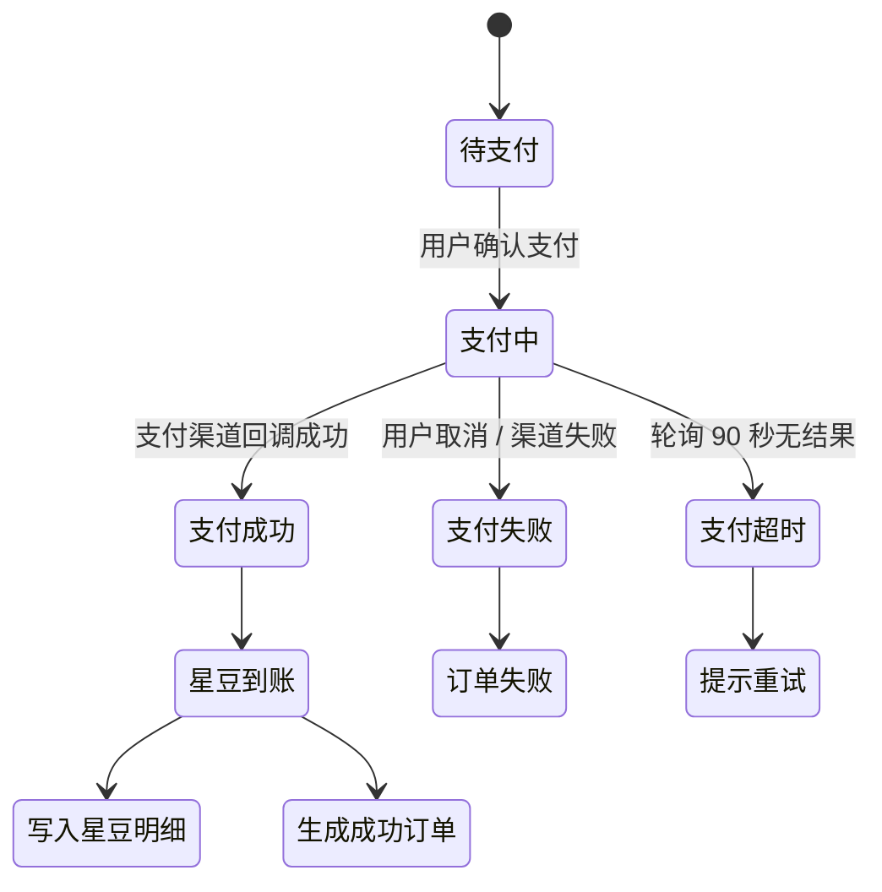
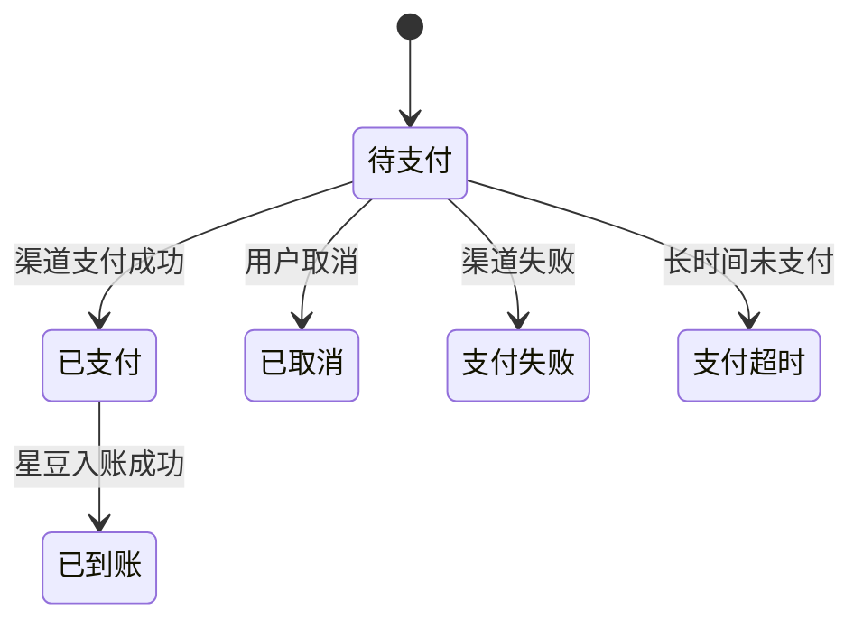

# 星豆账户逻辑

<!-- notion_page_id: a335667c-6d3a-83aa-8180-01943cc89aef -->

<callout icon="🫘" color="blue_bg">
	**文档用途**：在「二期逻辑大纲」已覆盖的**计费 / 群 / 套餐**链路之外，补齐**星豆作为账户资产**的独立逻辑——充值、明细流水、我的订单、后台运营配置。
	**去重原则**：凡是「扣费主体判定、通信计费规则、企业欠费展示、创建群 / 邀请扣费、套餐购买与套餐明细」**已在其他文档展开的，本页只引用不重抄**；只保留这些文档里**没有的**星豆资产侧内容。
	**核心结论**：星豆有两层身份——① 账号资产（可充值、按身份隔离、有明细与订单）；② 套餐用尽后的通信托底扣费单位。通信侧「扣谁星豆 / 欠费 / 封禁」以计费文档为准，本页不重复。
</callout>
## 一、去重对照（先看这里）
### 1.1 已被其他模块覆盖的功能（本页不再重复，仅引用）
<table fit-page-width="true" header-row="true">
<tr>
<td>已被覆盖的功能</td>
<td>覆盖文档</td>
</tr>
<tr>
<td>套餐用尽后扣谁星豆（个人 / 企业一级 / 双绑 / 子账号扣费主体判定、企业优先不扣个人、子账号设备扣一级）</td>
<td><mention-page url="https://app.notion.com/p/90a5667c6d3a834dab038144953f606d"/> §四 L10–L18、<mention-page url="https://app.notion.com/p/a8b5667c6d3a8298b2e60187ca27e5a8"/> §1.2</td>
</tr>
<tr>
<td>通信扣费单价与规则（短音 / 报位、上报一次扣一次、PTT 逐终端各扣）</td>
<td><mention-page url="https://app.notion.com/p/90a5667c6d3a834dab038144953f606d"/>、<mention-page url="https://app.notion.com/p/a8b5667c6d3a8298b2e60187ca27e5a8"/></td>
</tr>
<tr>
<td>企业欠费展示分层 + 倒欠铁律（设备聚合层显负、单实例卡永不为负、一级星豆显 0）</td>
<td><mention-page url="https://app.notion.com/p/c555667c6d3a83d0a00d81403f5fd393"/> §2.2、<mention-page url="https://app.notion.com/p/90a5667c6d3a834dab038144953f606d"/> L13</td>
</tr>
<tr>
<td>充值星豆不能抵扣套餐欠费 / 只能充套餐清欠</td>
<td><mention-page url="https://app.notion.com/p/90a5667c6d3a834dab038144953f606d"/> L13.3</td>
</tr>
<tr>
<td>创建对讲群扣星豆（开关 / 默认 20 / 企业默认 0 / 创建失败退还）</td>
<td><mention-page url="https://app.notion.com/p/6015667c6d3a8398a5e7015cc92b4e3c"/> §4–§6</td>
</tr>
<tr>
<td>邀请成员扣星豆（开关 / 退还开关 / 超时快照 / 原路退 / 只退一次）</td>
<td><mention-page url="https://app.notion.com/p/d345667c6d3a8275b77e01df63808736"/> §5</td>
</tr>
<tr>
<td>套餐购买流程 / 支付方式 / 单设备 + 批量购买 / 退款</td>
<td><mention-page url="https://app.notion.com/p/00d5667c6d3a830d84e3014a48de2608"/>、<mention-page url="https://app.notion.com/p/34f5667c6d3a822ba7ef01e619786259"/>、<mention-page url="https://app.notion.com/p/c555667c6d3a83d0a00d81403f5fd393"/> §2.7–§2.8</td>
</tr>
<tr>
<td>套餐明细页 / 套餐额度返还日志（R1 失败退、R2 群结束退）</td>
<td><mention-page url="https://app.notion.com/p/2c65667c6d3a820b978801838378c4f3"/>、<mention-page url="https://app.notion.com/p/34f5667c6d3a822ba7ef01e619786259"/></td>
</tr>
<tr>
<td>通信侧消费 / 欠费 / 封禁流程图</td>
<td><mention-page url="https://app.notion.com/p/90a5667c6d3a834dab038144953f606d"/> §八、<mention-page url="https://app.notion.com/p/a8b5667c6d3a8298b2e60187ca27e5a8"/> §1.2</td>
</tr>
</table>
### 1.2 本页真正新增 / 独立展开的功能（其他文档没有）
<table fit-page-width="true" header-row="true">
<tr>
<td>本页新增</td>
<td>所在章节</td>
</tr>
<tr>
<td>星豆账户资产与身份隔离（账号维度余额、可充值、个人 / 企业 / 子账号隔离）</td>
<td>第二章</td>
</tr>
<tr>
<td>星豆充值（入口 / 档位 / 支付方式 / 状态机 / 到账 / 幂等）</td>
<td>第三章</td>
</tr>
<tr>
<td>星豆明细 / 流水（用户侧明细页、字段、排序筛选、全量交易类型汇总）</td>
<td>第四章</td>
</tr>
<tr>
<td>我的订单——星豆充值订单（类型 / 状态机 / 与明细关系）</td>
<td>第五章</td>
</tr>
<tr>
<td>后台星豆专属配置（兑换比例、充值档位管理、单笔最大充值、全量星豆流水查询）</td>
<td>第六章</td>
</tr>
<tr>
<td>套餐购买与星豆的边界结论（套餐只能现金、星豆不可买套餐 / 不可混合 / 不可清欠）</td>
<td>第七章</td>
</tr>
</table>
---
## 二、星豆账户资产逻辑（账户侧·新增）
### 2.1 星豆账户归属与身份隔离
<callout icon="🧭" color="gray_bg">
	星豆首先是**账号资产**，按身份独立。注意：**账户资产归属 ≠ 通信扣费主体**——「设备通信套餐用尽后扣谁星豆」属于计费逻辑，已在 <mention-page url="https://app.notion.com/p/90a5667c6d3a834dab038144953f606d"/> §四 / <mention-page url="https://app.notion.com/p/a8b5667c6d3a8298b2e60187ca27e5a8"/> §1.2 完整展开，本页不展开。
</callout>
<table fit-page-width="true" header-row="true">
<tr>
<td>账号 / 身份</td>
<td>是否拥有独立星豆余额</td>
<td>是否可充值</td>
<td>说明</td>
</tr>
<tr>
<td>个人账号</td>
<td>✅ 独立</td>
<td>✅ 可充值</td>
<td>账户资产独立</td>
</tr>
<tr>
<td>企业一级账号</td>
<td>✅ 独立</td>
<td>✅ 可充值</td>
<td>账户资产独立</td>
</tr>
<tr>
<td>企业二级 / 三级子账号</td>
<td>✅ 独立</td>
<td>✅ 可充值</td>
<td>账户资产独立、不与一级共享</td>
</tr>
<tr>
<td>同手机号个人身份 + 企业身份</td>
<td>✅ 完全隔离</td>
<td>✅ 各自充值</td>
<td>余额、明细、订单均按身份隔离</td>
</tr>
</table>
### 2.2 星豆余额展示规则（账户侧）
<table fit-page-width="true" header-row="true">
<tr>
<td>场景</td>
<td>余额展示</td>
<td>说明</td>
</tr>
<tr>
<td>余额充足</td>
<td>展示实际余额</td>
<td>充值 / 消费后实时刷新</td>
</tr>
<tr>
<td>余额为 0</td>
<td>展示 0</td>
<td>用户侧不显示负数</td>
</tr>
<tr>
<td>子账号余额</td>
<td>展示子账号自身余额</td>
<td>不展示一级余额、不与一级共享</td>
</tr>
</table>
<callout icon="🔗" color="gray_bg">
	**企业欠费态的余额 / 负数展示**（一级星豆仍显 0、负数只在设备套餐聚合层、单套餐实例卡永不为负）已在 <mention-page url="https://app.notion.com/p/c555667c6d3a83d0a00d81403f5fd393"/> §2.2、<mention-page url="https://app.notion.com/p/90a5667c6d3a834dab038144953f606d"/> L13 覆盖，本页不重复。
</callout>
### 2.3 星豆资产全局规则
1. 星豆是系统内虚拟货币，仅限系统内使用。
2. 星豆不可提现，不支持用户主动退款。
3. 星豆余额按账号 / 身份隔离。
4. 星豆余额不显示负数（欠费表现见计费文档，不记为星豆负数）。
5. 充值星豆只增加账号余额，**不参与企业套餐欠费清偿**（清欠口径见 <mention-page url="https://app.notion.com/p/90a5667c6d3a834dab038144953f606d"/> L13.3）。
6. 星豆退还属于账户流水，不计入退款统计。
7. 后台配置变更不影响历史余额和已产生流水。
---
## 三、星豆充值逻辑（新增）
### 3.1 入口
<table fit-page-width="true" header-row="true">
<tr>
<td>端</td>
<td>入口</td>
<td>说明</td>
</tr>
<tr>
<td>小程序</td>
<td>我的信息 → 星豆充值</td>
<td>当前登录身份对应的账号充值</td>
</tr>
<tr>
<td>监控平台 Web</td>
<td>个人中心 / 我的信息 → 星豆充值</td>
<td>当前登录账号充值</td>
</tr>
<tr>
<td>管理后台</td>
<td>不作为普通用户充值入口</td>
<td>后台仅做配置、查询、统计</td>
</tr>
</table>
### 3.2 充值档位
默认充值档位（按默认 1 元 = 10 豆）：
<table fit-page-width="true" header-row="true">
<tr>
<td>星豆数</td>
<td>金额</td>
</tr>
<tr>
<td>50 豆</td>
<td>5 元</td>
</tr>
<tr>
<td>100 豆</td>
<td>10 元</td>
</tr>
<tr>
<td>300 豆</td>
<td>30 元</td>
</tr>
<tr>
<td>500 豆</td>
<td>50 元</td>
</tr>
<tr>
<td>1000 豆</td>
<td>100 元</td>
</tr>
<tr>
<td>自定义金额</td>
<td>用户输入，受后台单笔最大充值金额限制，**最低充值金额为一元**</td>
</tr>
</table>
### 3.3 充值支付方式
<table fit-page-width="true" header-row="true">
<tr>
<td>端</td>
<td>支付方式</td>
</tr>
<tr>
<td>小程序</td>
<td>微信小程序支付</td>
</tr>
<tr>
<td>Web</td>
<td>微信扫码支付 / 支付宝扫码支付</td>
</tr>
</table>
### 3.4 充值状态机

### 3.5 充值到账规则
<table fit-page-width="true" header-row="true">
<tr>
<td>场景</td>
<td>系统处理</td>
<td>用户侧表现</td>
</tr>
<tr>
<td>支付成功</td>
<td>增加当前账号星豆余额，生成充值流水</td>
<td>余额即时刷新</td>
</tr>
<tr>
<td>支付失败 / 取消</td>
<td>不加星豆，不生成入账流水</td>
<td>提示支付失败 / 已取消</td>
</tr>
<tr>
<td>支付轮询超时</td>
<td>订单保持待确认，后端继续以回调为准</td>
<td>90 秒后提示用户重试</td>
</tr>
<tr>
<td>重复回调</td>
<td>幂等处理，只入账一次</td>
<td>余额不重复增加</td>
</tr>
<tr>
<td>充值档位被后台禁用后</td>
<td>已创建订单按订单快照处理</td>
<td>新打开充值页不再展示该档位</td>
</tr>
</table>
<callout icon="🔗" color="gray_bg">
	**个人设备封禁后的恢复**（套餐 / 星豆耗尽封禁、充值或购套餐后恢复、是否需重启）属于终端计费链路，见 <mention-page url="https://app.notion.com/p/90a5667c6d3a834dab038144953f606d"/> L13.2；本页只负责「充值使账户余额恢复」这一步。
</callout>
---
## 四、星豆明细 / 流水逻辑（新增）
### 4.1 入口与权限
<table fit-page-width="true" header-row="true">
<tr>
<td>用户</td>
<td>入口</td>
<td>可见范围</td>
</tr>
<tr>
<td>个人账号</td>
<td>我的信息 → 星豆明细</td>
<td>仅看个人身份下的星豆流水</td>
</tr>
<tr>
<td>企业一级账号</td>
<td>我的信息 / 个人中心 → 星豆明细</td>
<td>仅看一级账号自身星豆流水</td>
</tr>
<tr>
<td>企业子账号</td>
<td>我的信息 / 个人中心 → 星豆明细</td>
<td>仅看子账号自身星豆流水；不看一级流水</td>
</tr>
<tr>
<td>管理员</td>
<td>管理后台 → 星豆明细查询</td>
<td>可查全量用户流水</td>
</tr>
</table>
### 4.2 用户侧星豆明细字段
<table fit-page-width="true" header-row="true">
<tr>
<td>字段</td>
<td>说明</td>
</tr>
<tr>
<td>交易类型</td>
<td>充值 / 消费 / 退还 / 通信扣费等</td>
</tr>
<tr>
<td>交易额度</td>
<td>正数表示增加，负数表示扣减</td>
</tr>
<tr>
<td>交易说明</td>
<td>展示业务来源，如「创建对讲群」「邀请成员」「短音通信扣费」</td>
</tr>
<tr>
<td>交易时间</td>
<td>按实际入账 / 扣减时间展示</td>
</tr>
<tr>
<td>关联对象</td>
<td>可选：群名称、设备卡号、订单号等，视 UI 能力展示</td>
</tr>
</table>
### 4.3 星豆流水交易类型汇总（把各文档的扣 / 退动作归口到星豆明细）
<callout icon="🧾" color="yellow_bg">
	本表只做**归口映射**：把已在创建群 / 邀请 / 上下行计费文档定义的扣 / 退动作，统一收敛为「星豆明细」的一条流水。**判定规则不在本页重新定义**（见各引用文档）；只有实际扣减 / 退还**星豆**时才写入星豆流水，扣的是设备套餐则不产生星豆流水。
</callout>
<table fit-page-width="true" header-row="true">
<tr>
<td>业务动作</td>
<td>方向</td>
<td>交易类型</td>
<td>规则来源</td>
</tr>
<tr>
<td>星豆充值成功</td>
<td>+</td>
<td>充值</td>
<td>本页 §三</td>
</tr>
<tr>
<td>创建对讲群扣费 / 创建失败退还</td>
<td>  • / +</td>
<td>消费 / 退还</td>
<td><mention-page url="https://app.notion.com/p/6015667c6d3a8398a5e7015cc92b4e3c"/></td>
</tr>
<tr>
<td>邀请成员扣费 / 邀请失效退还</td>
<td>  • / +</td>
<td>消费 / 退还</td>
<td><mention-page url="https://app.notion.com/p/d345667c6d3a8275b77e01df63808736"/></td>
</tr>
<tr>
<td>上行短音 / 报位套餐不足扣星豆</td>
<td>-</td>
<td>通信扣费</td>
<td><mention-page url="https://app.notion.com/p/90a5667c6d3a834dab038144953f606d"/></td>
</tr>
<tr>
<td>下行短音套餐不足扣星豆 / 下行失败 / 取消退还</td>
<td>  • / +</td>
<td>通信扣费 / 退还</td>
<td><mention-page url="https://app.notion.com/p/a8b5667c6d3a8298b2e60187ca27e5a8"/></td>
</tr>
<tr>
<td>企业欠费记账</td>
<td>无星豆流水</td>
<td>—</td>
<td><mention-page url="https://app.notion.com/p/90a5667c6d3a834dab038144953f606d"/> L13（记设备套餐欠费，不记星豆负数）</td>
</tr>
</table>
### 4.4 星豆流水生成原则
1. **实际扣了星豆才生成负向流水**；只扣设备套餐时不生成星豆流水。
2. **实际退了星豆才生成正向流水**；设备套餐返还不生成星豆流水。
3. 星豆返还必须原路退回**当初实际扣减的账号**。
4. 同一业务流水需具备幂等键，防止重复扣 / 重复退。
5. 退还流水与原扣费流水应有关联关系，便于对账。
6. 邀请记录模块不展示扣费 / 退还状态，仅星豆明细承载。
7. 退款统计只含套餐退款，不含星豆退还。
### 4.5 星豆明细排序与筛选
<table fit-page-width="true" header-row="true">
<tr>
<td>端</td>
<td>排序</td>
<td>筛选</td>
</tr>
<tr>
<td>用户侧</td>
<td>默认按交易时间倒序</td>
<td>可按 UI 能力支持交易类型 / 时间范围</td>
</tr>
<tr>
<td>管理后台</td>
<td>默认按交易时间倒序</td>
<td>账号模糊搜索、交易时间范围、交易类型</td>
</tr>
</table>
---
## 五、我的订单逻辑（星豆充值订单·新增）
### 5.1 订单类型与星豆关系
<table fit-page-width="true" header-row="true">
<tr>
<td>订单类型</td>
<td>与星豆关系</td>
<td>说明</td>
</tr>
<tr>
<td>星豆充值订单</td>
<td>支付成功后增加账号星豆</td>
<td>本页展开</td>
</tr>
<tr>
<td>套餐购买订单</td>
<td>只能现金支付，不扣星豆</td>
<td>流程见 <mention-page url="https://app.notion.com/p/00d5667c6d3a830d84e3014a48de2608"/>，本页不展开</td>
</tr>
<tr>
<td>套餐退款</td>
<td>进入退款统计</td>
<td>见 <mention-page url="https://app.notion.com/p/00d5667c6d3a830d84e3014a48de2608"/> §5</td>
</tr>
<tr>
<td>星豆退还</td>
<td>不作为退款订单，进入星豆明细</td>
<td>规则见 <mention-page url="https://app.notion.com/p/d345667c6d3a8275b77e01df63808736"/></td>
</tr>
</table>
### 5.2 星豆充值订单状态

### 5.3 充值订单与明细的关系
<table fit-page-width="true" header-row="true">
<tr>
<td>场景</td>
<td>订单</td>
<td>星豆明细</td>
</tr>
<tr>
<td>星豆充值成功</td>
<td>生成成功充值订单</td>
<td>生成 +N 星豆充值流水</td>
</tr>
<tr>
<td>星豆充值失败 / 取消</td>
<td>订单失败 / 取消</td>
<td>不生成入账流水</td>
</tr>
<tr>
<td>创建群 / 邀请扣星豆</td>
<td>不一定生成订单</td>
<td>生成 -N 消费流水</td>
</tr>
<tr>
<td>邀请失效退还</td>
<td>不生成退款订单</td>
<td>生成 +N 退还流水</td>
</tr>
</table>
<callout icon="🔗" color="gray_bg">
	**退款 vs 退还 vs 欠费** 的口径：退款 = 现金套餐订单退款（见 <mention-page url="https://app.notion.com/p/00d5667c6d3a830d84e3014a48de2608"/>）；星豆退还 = 创建群 / 邀请失败返还（见 <mention-page url="https://app.notion.com/p/d345667c6d3a8275b77e01df63808736"/>，不进退款统计）；企业欠费 = 设备套餐聚合层记负（见 <mention-page url="https://app.notion.com/p/90a5667c6d3a834dab038144953f606d"/>，不记星豆负数）。
</callout>
---
## 六、后台星豆运营配置（仅星豆专属项·新增）
<callout icon="⚙️" color="gray_bg">
	创建群扣费开关 / 数值、企业建群免费配置、邀请扣费与退还开关 / 超时、短音 / 报位星豆单价等配置项，**已在 <mention-page url="https://app.notion.com/p/6015667c6d3a8398a5e7015cc92b4e3c"/>、<mention-page url="https://app.notion.com/p/d345667c6d3a8275b77e01df63808736"/>、<mention-page url="https://app.notion.com/p/90a5667c6d3a834dab038144953f606d"/> L12 定义，本页不重复**。本章只补「星豆充值 / 流水」相关的后台专属配置。
</callout>
### 6.1 星豆专属配置项
<table fit-page-width="true" header-row="true">
<tr>
<td>配置项</td>
<td>作用范围</td>
<td>生效规则</td>
</tr>
<tr>
<td>兑换比例：1 元 = N 豆</td>
<td>星豆充值</td>
<td>修改后对新充值订单生效，不影响历史余额</td>
</tr>
<tr>
<td>充值档位</td>
<td>充值页展示</td>
<td>用户下次打开充值页时生效</td>
</tr>
<tr>
<td>单笔最大充值金额</td>
<td>自定义充值</td>
<td>提交充值订单时校验</td>
</tr>
</table>
### 6.2 充值档位管理
<table fit-page-width="true" header-row="true">
<tr>
<td>操作</td>
<td>规则</td>
</tr>
<tr>
<td>新增档位</td>
<td>填写排序、星豆数、价格、备注</td>
</tr>
<tr>
<td>禁用档位</td>
<td>需二次确认；禁用后灰色展示，不影响历史订单</td>
</tr>
<tr>
<td>删除档位</td>
<td>需二次确认；已有订单关联的档位不可删除</td>
</tr>
<tr>
<td>修改档位</td>
<td>只影响后续充值页展示和新订单</td>
</tr>
<tr>
<td>历史订单</td>
<td>订单中冗余存储档位名称 / 星豆数 / 价格快照</td>
</tr>
</table>
### 6.3 管理后台星豆明细查询
<table fit-page-width="true" header-row="true">
<tr>
<td>能力</td>
<td>规则</td>
</tr>
<tr>
<td>全量查询</td>
<td>管理员可查看所有用户星豆交易流水</td>
</tr>
<tr>
<td>账号搜索</td>
<td>支持账号 / 手机号包含匹配</td>
</tr>
<tr>
<td>时间 / 类型筛选</td>
<td>交易时间范围、交易类型（充值 / 消费 / 退还 / 通信扣费）</td>
</tr>
<tr>
<td>分页 / 导出</td>
<td>大数据量分页；导出 PRD 未明确，待确认</td>
</tr>
</table>
### 6.4 订单统计口径
1. 订单销售额只统计现金订单，星豆退还不当作退款。
2. 退款统计只含套餐退款。
3. 星豆充值订单单独归类为星豆订单。
4. 企业欠费通信不计入订单销售额，按设备套餐欠费 / 负账单独统计。
---
## 七、套餐购买与星豆关系（仅边界结论·新增）
<callout icon="🔗" color="gray_bg">
	套餐**购买流程、支付方式、单设备 / 批量、退款、激活**已在 <mention-page url="https://app.notion.com/p/00d5667c6d3a830d84e3014a48de2608"/>、<mention-page url="https://app.notion.com/p/34f5667c6d3a822ba7ef01e619786259"/>、<mention-page url="https://app.notion.com/p/c555667c6d3a83d0a00d81403f5fd393"/> §2.7–§2.8 完整展开，本页不重复。本章只保留「套餐购买与星豆」的**边界结论**。
</callout>
### 7.1 已确认规则：设备套餐现金支付
<table fit-page-width="true" header-row="true">
<tr>
<td>确认项</td>
<td>规则</td>
</tr>
<tr>
<td>套餐购买支付方式</td>
<td>只能现金支付（小程序微信 / Web 微信 + 支付宝）</td>
</tr>
<tr>
<td>是否支持星豆支付套餐</td>
<td>不支持</td>
</tr>
<tr>
<td>是否支持现金 + 星豆混合支付</td>
<td>不支持</td>
</tr>
<tr>
<td>套餐退款</td>
<td>按现金订单退款处理，不走星豆退还</td>
</tr>
<tr>
<td>企业设备套餐欠费</td>
<td>只能通过重置 / 充值设备套餐处理，不能用星豆抵扣</td>
</tr>
</table>
### 7.2 星豆与套餐购买的边界
星豆可用于创建群、邀请成员、设备通信托底扣费，但**不能购买设备套餐**；其余边界（只能现金、不支持混合支付、不可清欠、退款走现金订单）见上表 §7.1，不再重述。
---
## 八、待确认项（本页范围）
<table fit-page-width="true" header-row="true">
<tr>
<td>#</td>
<td>待确认项</td>
<td>建议口径</td>
</tr>
<tr>
<td>Q1</td>
<td>星豆充值订单是否支持用户主动取消未支付订单</td>
<td>建议支持取消 / 超时关闭</td>
</tr>
<tr>
<td>Q2</td>
<td>下行失败退还星豆是否在用户侧明细展示具体设备 / 群</td>
<td>建议至少展示设备卡号 / 业务来源</td>
</tr>
<tr>
<td>Q3</td>
<td>后台星豆明细是否支持导出</td>
<td>PRD 未写，待确认</td>
</tr>
</table>
---
## 九、一句话收口
<callout icon="✅" color="green_bg">
	本页只负责星豆的**账户资产侧**：账户星豆按身份独立、可充值、有明细与订单、有后台充值配置；设备套餐只能现金支付、星豆不可买套餐 / 不可清欠。**通信扣费主体、企业欠费、套餐购买与套餐明细已在计费 / 套餐文档覆盖，本页只引用不重复。**
</callout>
