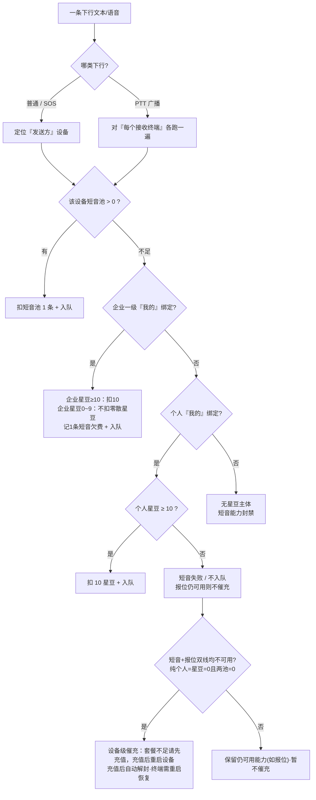
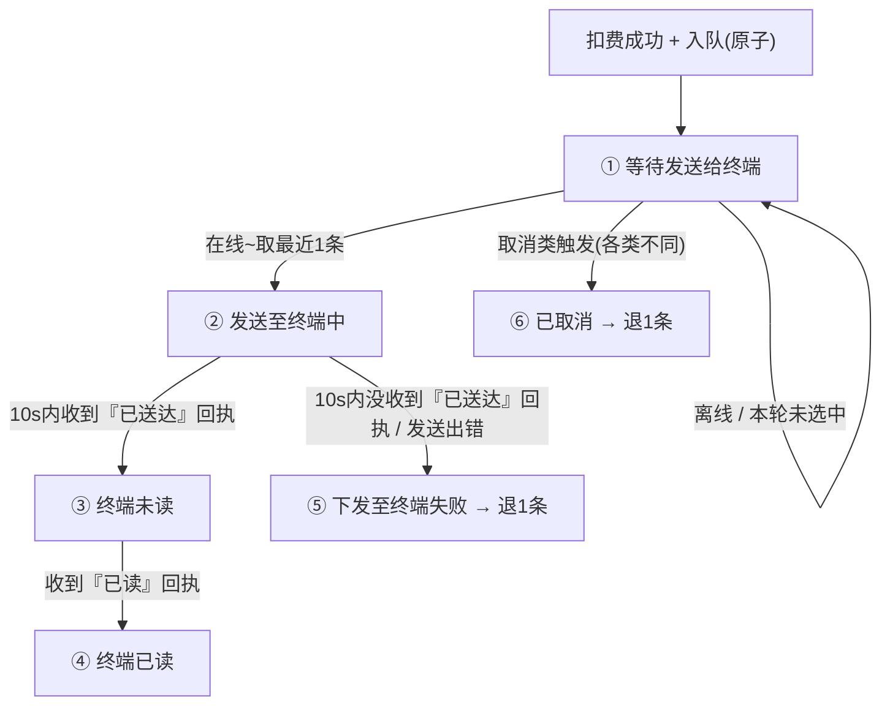

# 下行计费逻辑

<!-- notion_page_id: a8b5667c-6d3a-8298-b2e6-0187ca27e5a8 -->

<callout icon="💸" color="blue_bg">
	本页梳理 **救援棒终端「下行消息」计费逻辑点**（平台 / 服务端 → 终端方向）。**按三种下行类型分别独立说明**：普通聊天室、SOS 求救群聊、PTT 语音广播。**扣费**（第二章）与**退费**（第三章）各自分三类列出，第四章再汇总「三者结合」的异常 / 边界场景。计费以 **需求文档 v1.2 归属计费** 为准；标 ⚠️ 为待产品确认，标 ❗ 为需求间冲突。
</callout>
## 一、通用基础（三类共用，先讲一次）
### 1.1 术语
- **下行消息**：平台 / 服务端 发往救援棒终端的消息（文本 / 语音）。本页只管下行计费。
- **短音**：下行计费基本单位，**1 条下行文本 / 语音入队 = 扣 1 条短音**。
- **套餐 / 星豆**：套餐额度绑「设备」，星豆绑「账号」。**设备套餐不是单一数字，而是含两条相互独立的子额度：短音池（下行 / 消息用）与报位池（上行 / 位置用），各自独立计数、独立耗尽。**
- **双轨独立扣费**：短音与报位是两条平行的「子套餐 → 星豆」漏斗，互不串联——短音池 = 0 即可触发短音扣星豆（10 星豆 / 条），报位池 = 0 即可触发报位扣星豆（1 星豆 / 次）；不存在「报位 + 短音整体 = 0 才扣星豆」的合并门槛。本页只讲下行，因此只走短音这条线。
- **企业 / 个人**：企业允许欠费（套餐可为负）；个人不允许欠费，但**不能笼统说“套餐=0 / 星豆不为0”**，必须按资源类型判断：短音能力看「短音池 + 10 星豆 / 条」，报位能力看「报位池 + 1 星豆 / 次」。因此个人星豆 = 1\~9 时，短音按「\< 10」处理，买不起 1 条短音；报位若 ≥ 1 仍可继续抵扣。
### 1.2 计费主体与资源闸门（按归属拆开）⭐
<callout icon="🧭" color="gray_bg">
	**下行计费先判“扣哪台设备的短音池”，再判“短音池 = 0 后有没有星豆主体兜底”。不要再用“余额 = 0”统称：短音池、报位池、个人星豆、企业星豆是四个不同判断点。**
</callout>
<callout icon="🔔" color="green_bg">
	**催充提示是「设备级」聚合，不是「单资源级」**：只有当短音与报位**两条线都不可用**时，才向终端下发统一提示「**套餐不足请先充值，充值后重启设备**」；任一条线还能用（哪怕只剩报位）就不提示。纯个人因短音 / 报位共用同一星豆池，触发条件可简化为 **短音池 = 0 且 报位池 = 0 且 星豆 = 0**。充值后**系统自动解封**（无需人工干预），但**终端需重启**才能恢复正常使用——二者不冲突。
</callout>
**1）先判资源线：短音 / 报位不混算**
- **短音线**：下行文本 / 语音只走短音线，先扣设备短音池；短音池 = 0 后，才按归属进入星豆兜底。
- **报位线**：报位只走报位线，先扣设备报位池；报位池 = 0 后，才按归属进入星豆兜底。
- **星豆单价**：1 短音 = 10 星豆；1 报位 = 1 星豆。个人星豆 1\~9 时，**短音按 \< 10 处理，不能买 1 条短音；但报位按 ≥ 1 判断，仍可能可报位**。
**2）再判归属：有没有星豆兜底主体**
<table fit-page-width="true" header-row="true">
<tr>
<td>归属</td>
<td>星豆主体</td>
<td>短音池 = 0 后</td>
<td>报位池 = 0 后</td>
<td>核心边界</td>
</tr>
<tr>
<td>纯个人（个人 =【我的】，无企业【我的】）</td>
<td>个人绑定者</td>
<td>星豆 ≥ 10：扣 10 星豆可下发；星豆 \< 10：短音失败 / 不入队（报位仍可用则不催充）</td>
<td>星豆 ≥ 1：扣 1 星豆可报位；星豆 = 0：报位失败（此时短音必然也不可用）→ 触发设备级催充</td>
<td>个人不可欠费；短音封禁不等于报位封禁</td>
</tr>
<tr>
<td>企业（企业一级 =【我的】，含企业双绑）</td>
<td>企业一级</td>
<td>企业星豆 ≥ 10：扣 10 星豆可下发；企业星豆 0\~9：不扣零散星豆，记 1 条短音欠费，仍可下发</td>
<td>企业星豆 ≥ 1：扣 1 星豆可报位；企业星豆 = 0：记报位欠费，仍可报位</td>
<td>企业优先；双绑也不扣个人星豆</td>
</tr>
<tr>
<td>无【我的】归属（仅用户 / 好友关系）</td>
<td>无</td>
<td>无星豆兜底；短音池 = 0 后短音能力封禁</td>
<td>无星豆兜底；报位池 = 0 后报位能力封禁</td>
<td>有关联不等于有扣费主体</td>
</tr>
</table>
**3）核心边界场景表**
**3.1 纯个人｜个人不可欠费**
<table fit-page-width="true" header-row="true">
<tr>
<td>短音池</td>
<td>报位池</td>
<td>个人星豆</td>
<td>下行短音 / 语音</td>
<td>报位</td>
<td>易错点</td>
</tr>
<tr>
<td>1</td>
<td>1</td>
<td>0</td>
<td>扣短音池 1，可下发</td>
<td>扣报位池 1，可报位</td>
<td>设备子池够时，不看星豆</td>
</tr>
<tr>
<td>0</td>
<td>1</td>
<td>10</td>
<td>扣 10 星豆，可下发</td>
<td>扣报位池 1，可报位</td>
<td>短音兜底门槛是 10 星豆</td>
</tr>
<tr>
<td>0</td>
<td>1</td>
<td>9</td>
<td>不可下发；短音失败 / 不入队（报位仍可用，不催充）</td>
<td>扣报位池 1，可报位</td>
<td>星豆不为 0，也不代表短音可发</td>
</tr>
<tr>
<td>0</td>
<td>0</td>
<td>9</td>
<td>不可下发；短音失败 / 不入队（报位仍可用，不催充）</td>
<td>扣 1 星豆，可报位</td>
<td>同一星豆池：短音不够，报位够</td>
</tr>
<tr>
<td>0</td>
<td>0</td>
<td>1</td>
<td>不可下发；短音失败 / 不入队（报位仍可用，不催充）</td>
<td>扣 1 星豆，可报位；扣后星豆 = 0</td>
<td>只够 1 次报位，不够 1 条短音</td>
</tr>
<tr>
<td>0</td>
<td>0</td>
<td>0</td>
<td>不可下发；短音能力封禁；短音+报位双线均不可用 → 设备级催充</td>
<td>不可报位；报位能力封禁；下发「套餐不足请先充值，充值后重启设备」</td>
<td>两条资源线都无可扣来源</td>
</tr>
</table>
**3.2 企业｜企业可欠费**
<table fit-page-width="true" header-row="true">
<tr>
<td>短音池</td>
<td>报位池</td>
<td>企业星豆</td>
<td>下行短音 / 语音</td>
<td>报位</td>
<td>易错点</td>
</tr>
<tr>
<td>1</td>
<td>1</td>
<td>0</td>
<td>扣短音池 1，可下发</td>
<td>扣报位池 1，可报位</td>
<td>设备子池够时，不看星豆</td>
</tr>
<tr>
<td>0</td>
<td>1</td>
<td>0\~9</td>
<td>不扣零散星豆，记 1 条短音欠费，仍可下发</td>
<td>扣报位池 1，可报位</td>
<td>企业星豆 0\~9 买不起 1 条短音，不写“星豆不足”</td>
</tr>
<tr>
<td>1</td>
<td>0</td>
<td>0</td>
<td>扣短音池 1，可下发</td>
<td>记 1 次报位欠费，仍可报位</td>
<td>报位单价是 1 星豆，企业星豆 = 0 时整次报位记欠费</td>
</tr>
<tr>
<td>0</td>
<td>0</td>
<td>0\~9</td>
<td>不扣零散星豆，记 1 条短音欠费，仍可下发</td>
<td>企业星豆 ≥ 1：扣 1 星豆可报位；企业星豆 = 0：记 1 次报位欠费，仍可报位</td>
<td>短音看 10 星豆；报位看 1 星豆；低于对应单价时不拆扣</td>
</tr>
</table>
**3.3 无【我的】归属｜无星豆兜底**
<table fit-page-width="true" header-row="true">
<tr>
<td>短音池</td>
<td>报位池</td>
<td>星豆主体</td>
<td>下行短音 / 语音</td>
<td>报位</td>
<td>易错点</td>
</tr>
<tr>
<td>1</td>
<td>1</td>
<td>无</td>
<td>扣短音池 1，可下发</td>
<td>扣报位池 1，可报位</td>
<td>有关联时仍可消耗设备子池</td>
</tr>
<tr>
<td>0</td>
<td>1</td>
<td>无</td>
<td>不可下发；短音能力封禁</td>
<td>扣报位池 1，可报位</td>
<td>短音池不足后不能扣任何账号星豆</td>
</tr>
<tr>
<td>1</td>
<td>0</td>
<td>无</td>
<td>扣短音池 1，可下发</td>
<td>不可报位；报位能力封禁</td>
<td>报位池不足后也无星豆兜底</td>
</tr>
<tr>
<td>0</td>
<td>0</td>
<td>无</td>
<td>不可下发；短音能力封禁</td>
<td>不可报位；报位能力封禁</td>
<td>两条能力分别封禁，不产生星豆扣费</td>
</tr>
</table>
**4）下行方向：扣哪台设备**
- 普通 / SOS → 扣**发消息那台设备**（普通聊天室好友不能发）。
- PTT → 对**每台接收终端**各判一次：A 说一句，A 上行先扣 A 自己 1 条短音；广播给其他终端时，每个接收终端再各自跑一遍下行短音判断。
**5）决策流程图（下行短音线）**

### 1.3 下行状态机（三类共用）
扣费成功入队后走统一设备级状态机；**离线进「等待发送给终端」队列待补发**。三类的差异只在**「已取消」的触发来源**（见第三章各小节）。

<table fit-page-width="true" header-row="true">
<tr>
<td>状态</td>
<td>触发</td>
<td>费用</td>
</tr>
<tr>
<td>① 等待发送给终端</td>
<td>扣费成功入队，设备离线 / 本轮未选中</td>
<td>已扣，暂不退</td>
</tr>
<tr>
<td>② 发送至终端中</td>
<td>通过网络把消息发给终端，等终端回『已送达』，限时 10 秒</td>
<td>已扣</td>
</tr>
<tr>
<td>③ 终端未读</td>
<td>终端已收到消息（回了『已送达』），但用户还没查看</td>
<td>已扣，不退</td>
</tr>
<tr>
<td>④ 终端已读</td>
<td>终端回『已读』（用户已查看）</td>
<td>已扣，不退</td>
</tr>
<tr>
<td>⑤ 下发至终端失败</td>
<td>10 秒内没收到『已送达』回执 / 发送出错（非人为）</td>
<td>**退 1 条**</td>
</tr>
<tr>
<td>⑥ 已取消</td>
<td>撤销仍处「等待发送」的消息（触发按类型，见第三章）</td>
<td>**退 1 条**（套餐过期也退）</td>
</tr>
</table>
- 『已送达』/『已读』回执按消息编号去重（**幂等**）；重复回执不会重复扣费 / 退费。
- **取消只发生在「等待发送」窗口**；进入「发送中」后不可取消。
## 二、扣费规则（分三类独立说明）
### 2.1 普通聊天室下行
- **下行触发**：用户 / 平台在普通通信会话中**手动单发**给终端（点对点 / 会话，非群广播）。
- **谁能产生下行**：标签 = **我的 / 用户** 可发；**好友**隐藏输入框 + 后端拒绝；**无绑定历史**的会话项不可发。
- **特例·解绑后仍可下发**：个人账号与设备曾产生关联（标签=我的 / 用户，如存在历史聊天项），即使之后解绑，该会话仍可继续向终端下发；但此时已无【我的】归属主体，**只扣设备套餐、不扣星豆**（套餐=0 后按 1.2 上下行直接封禁）。
- **计费单位**：每条入队扣 **1 条短音**。
- **计费主体 / 闸门**：按 1.2 —— 企业【我的】归属设备短音不足走欠费入队；个人【我的】归属设备必须满足「短音池 \> 0」或「短音池 = 0 且星豆 ≥ 10」，否则短音下行失败 / 不入队（报位仍可用则不催充，仅短音+报位双线均不可用才触发设备级催充「套餐不足请先充值，充值后重启设备」）；无企业 / 个人【我的】绑定、仅有关联关系的设备不扣星豆，仅消耗设备短音池，短音池 = 0 后下行短音能力封禁。
- **特点**：无「群」概念 → **无群结束类取消**，取消仅来自平台人为（见 3.1）。
### 2.2 SOS 求救群聊下行
- **下行触发**：求救群聊**群内成员手动发**给终端。
- **计费单位**：每条入队扣 **1 条短音**。
- **计费主体 / 闸门**：按 1.2（企业短音不足仍欠费入队；个人短音池 = 0 且星豆 \< 10 时短音失败 / 不入队；无【我的】绑定仅扣设备短音池，不扣星豆，短音池 = 0 后下行短音能力封禁）。
- **特点**：群有「结束」概念（结束救援 / 报平安 / 72h 无业务消息 / 主账号解绑），直接影响退费（见 3.2）。
### 2.3 PTT 语音广播下行（对讲群 · 服务端自动）
<callout icon="📡" color="purple_bg">
	每个接收终端各持一份独立副本（独立扣费 / 状态机 / 退费）。
</callout>
- **下行触发**：终端 A 上报 1 条 PTT 语音 → **服务端自动扇出**给同对讲群其他终端。
- **计费（两段）**：
	- **上行**：A 上报 = A 设备扣 **1 条短音，仅一次**，与广播落点数无关（计费主体 = A 设备归属）。
	- **下行**：广播到的**每个接收终端各扣 1 条短音**，**各自按 1.2 计费主体**（企业设备→企业一级；个人设备→个人）。
	- **L5「转发去多个不再对发送方扣费」只豁免 A，不豁免接收终端。**
	- **总消耗 = 1（A 上行）+ Σ(成功入队的接收终端 × 1)**。
- **准发快照**：以下行副本生成事务时刻的群成员为本次接收终端快照；快照内终端各生成独立副本，快照后新加入终端**不补收历史等待语音、不补扣费**，只参与加入后的新 PTT。
- **混合成员差异**：同一对讲群可同时存在纯个人、企业、企业+个人双绑、无【我的】归属设备；同一条 PTT 允许出现“部分成功 / 部分失败 / 部分待确认”的并存结果，按每台接收终端副本独立判断。
<table fit-page-width="true" header-row="true">
<tr>
<td>示例成员</td>
<td>设备归属 / 资源状态</td>
<td>本条 PTT 下行处理</td>
<td>扣费 / 退费口径</td>
</tr>
<tr>
<td>B：纯个人接收终端</td>
<td>短音池 = 0；个人星豆 = 0\~9（\< 10，买不起 1 条短音）</td>
<td>短音下行失败 / 不入队；仅封禁该设备短音能力</td>
<td>本就未扣，无需退；仅影响 B，不影响其他终端；若星豆 ≥ 1，报位仍可正常按 1 星豆 / 次抵扣</td>
</tr>
<tr>
<td>C：企业接收终端</td>
<td>短音池 = 0；企业一级星豆 = 0\~9（\< 10，买不起 1 条短音）</td>
<td>不扣零散星豆，记 1 条短音欠费，仍可下发</td>
<td>企业欠费入队；正常送达不退</td>
</tr>
<tr>
<td>D：企业 + 个人双绑接收终端</td>
<td>短音池 = 0；企业星豆 = 0\~9；个人星豆任意余额</td>
<td>企业优先；不扣个人星豆，记 1 条短音欠费，仍可下发</td>
<td>不触发个人封禁；正常送达不退</td>
</tr>
<tr>
<td>E：无【我的】归属接收终端</td>
<td>仅用户 / 好友关系；短音池 = 0</td>
<td>无星豆扣费主体，短音能力封禁</td>
<td>本就未扣，无需退</td>
</tr>
<tr>
<td>F：离线接收终端</td>
<td>扣费成功但终端离线</td>
<td>进入「等待发送」</td>
<td>等待期间若离群 / 换群则取消并原路退</td>
</tr>
</table>
- **发送方上行失败边界**：若 A 为纯个人设备且短音池 = 0、个人星豆 \< 10，A 的 PTT 上行短音应失败，原则上不生成接收端下行副本，避免“发送方未成功、接收方被扣费”。不能写成“星豆不为 0 就可发”，星豆 1\~9 对短音都不够。
- **闸门（不管设备在线状态，先扣费）**：
	- 企业【我的】归属接收终端短音池 = 0 后看企业星豆：≥10 扣 10 星豆入队，0\~9 不扣零散星豆、记 1 条短音欠费入队；
	- 个人【我的】归属接收终端短音池 = 0 且星豆 \< 10 → 该接收端短音副本失败 / 不入队；
	- 无企业 / 个人【我的】绑定、仅有关联关系的接收终端→不扣星豆，仅消耗设备短音池，短音池 = 0 后该接收端下行短音能力封禁。
**三类扣费速查**
<table fit-page-width="true" header-row="true">
<tr>
<td>维度</td>
<td>普通聊天室</td>
<td>SOS 求救群聊</td>
<td>PTT 语音广播</td>
</tr>
<tr>
<td>下行触发</td>
<td>用户 / 平台手动单发</td>
<td>群内成员手动发</td>
<td>服务端自动扇出（A 上报触发）</td>
</tr>
<tr>
<td>计费单位</td>
<td>每条 1 条短音</td>
<td>每条 1 条短音</td>
<td>上行 1 + 下行每接收终端各 1</td>
</tr>
<tr>
<td>计费主体</td>
<td>先设备套餐；企业【我的】→企业一级星豆；个人【我的】→个人星豆；无【我的】→不扣星豆</td>
<td>同左（统一按 1.2）</td>
<td>各接收终端各自判定，规则同左</td>
</tr>
<tr>
<td>没余额闸门</td>
<td>①企业：欠费也能发；    ②个人：短音池=0且星豆\<10发不了（星豆≥1还能报位）；                                   ③无【我的】：套餐用完直接封禁</td>
<td>①企业：欠费也能发；       ②个人：短音池=0且星豆\<10发不了（星豆≥1还能报位）；                                  ③无【我的】：套餐用完直接封禁</td>
<td>①企业：欠费也能发；    ②个人：短音池=0且星豆\<10发不了（星豆≥1还能报位）；                                  ③无【我的】：套餐用完直接封禁</td>
</tr>
<tr>
<td>群结束概念</td>
<td>无</td>
<td>有（影响退费）</td>
<td>有（对讲群结束 / 离群）</td>
</tr>
</table>
## 三、退费规则（分三类独立说明）
<callout icon="🔁" color="gray_bg">
	**三类共用约束**：① **只要失败就退**——不论失败原因（含发送超时），失败即退 1 条；② **原路退**：扣的是设备套餐就退回原套餐池，**套餐过期也照退**（只是过期额度无法再二次使用）；扣的是星豆就原路退回**原扣费归属账号**，**哪怕中途设备归属账号已动态变化**仍退给原账号；③ 同一副本只退一次·原子 + 幂等·取消只在「等待发送」窗口。个人「短音池 = 0 且星豆 \< 10 导致短音失败」本就未扣、无需退；企业欠费入队后正常送达不退；无【我的】绑定场景未产生星豆扣费主体，仅可能退回已扣的设备短音池。
</callout>
### 3.1 普通聊天室退费
- **① 下发至终端失败**（超时等非人为）→ 退该终端 1 条短音。
- **② 已取消**：**仅**应急救援平台 / 后台对「等待发送」消息**人为取消** → 原路退。
- 无群结束类取消。
### 3.2 SOS 求救群聊退费
- **① 下发至终端失败**（非人为）→ 退 1 条。
- **② 已取消**（对仍处「等待发送」的消息，任一触发）：
	- 求救群聊**结束救援 / 报平安**；
	- **报警模块处理报警；**
	- **个人绑定者解绑设备**（方式 E 自动结束群）；
	- **平台 / 后台人为取消**。
	→ 退 1 条。
### 3.3 PTT 语音广播退费（逐终端独立）
- **① 下发至终端失败**（非人为）→ 退该终端 1 条。
- **② 已取消**：仅对仍处「等待发送给终端」的接收端副本生效；进入「发送中」后即使发生离群 / 换群 / 归属变化 / 群结束，也不再取消，按 0x03 / 超时结果处理。取消按下列 A–F 分类，均**原路退该终端 1 条**、只退一次、幂等。
<callout icon="🆕" color="orange_bg">
	**v7 口径**：群只在两种情形结束——① 群主点「结束群组」；② 群主账号注销 / 删除（企业群含上级删除导致的子级账号级联删除，且被删子树覆盖到本群群主账号）。**单纯设备归零不再结束群**：设备怎么动都不结束群（B / C），只要进入「群结束」就是 A 整群级取消。
</callout>

🧨 A｜整群级取消（群结束 → 全群「等待发送」副本逐副本原路退）

	- 群主点「结束群组」。
	- 企业级联账号删除命中本群群主账号：上级删除子级账号会向下级联删除，只要被删子树**覆盖到本群群主账号**，群主主体即消失 → 群结束。例：
		- ① 一级删除二级，且二级是本群群主；
		- ② 一级删除二级 → 级联删三级账号，且三级是本群群主；
		- ③ 二级删除三级，且三级是本群群主。
	→ 命中即全群仍处「等待发送」的接收副本转「已取消」，逐副本原路退。

👤 B｜单终端级离群（仅取消该终端副本，群继续）

	- 群主移除该成员设备。
	- 成员归属账号主动退出自己设备。
	- 归属账号（比如个人账号绑定者或者一级账号绑定者）主动解绑设备（平台 / 后台强制解绑口径一致）。
	- 设备类型变更为非 TT_RESCUE_STICK。
	- 非群主账号注销 / 删除，名下设备被强制离群。
	- 个人主人变更：旧主人 A 解绑 → 新个人 B 绑定（离群发生在 A 解绑时，归 B 后不自动回旧群）。
	- 群主本人的设备被移除 / 退出 / 被动离群——即便导致群主名下设备归零：群继续、仍是群主、会话项正常、可重新邀请，仅取消该设备等待副本（不升级为 A）。
	→ 该设备等待副本转「已取消」原路退 1 条；其余终端不受影响。

🏢 C｜企业级联离群（设备级，群继续，仅取消该设备副本、原路退 1 条）

	- 一级群主：**一级解绑设备 **/ 设备类型变更 / **后台企业改绑 A→B** / **换群**。
	- 二级群主：**自身解绑**·类型变更·**换群** ＋ **一级解绑设备** / **一级移除对二级的设备分配**。
	- 三级群主：**自身解绑**·类型变更·**换群** ＋ **二级解绑** / **移除分配** ＋ **一级（跨级）解绑** / **移除分配。**
	- 口径：未归零→群继续；归零→群继续（群主仍在，可重新邀请）。
	- 反例：若级联删除的是本群群主账号本身（打到群主主体）→ 不属本类，按 A 整群级取消处理。

🔁 D｜换群 / 邀请并发（旧群退出，新群不补历史）

	- 设备加入新群 → 自动退出原群 → 原群该设备等待副本取消并原路退。
	- 他人设备同意新邀请 → 退原群 + 入新群 → 新群不补收旧群历史等待语音。
	- 多群并发邀请同一设备 → 仅一个成功，其余失效。
	- 快照后新加入终端 → 不进本条历史 PTT 接收快照，不生成副本 / 不扣费 / 不补发。

🔀 E｜归属变化判定（接收端自身·先判断是否真离群）

	**判定内核**：当前群靠哪条「我的」绑定入群，那条被删 / 换走才离群；群主变化见 A、发送方变化见上行 / 准发。
	**已扣费原则**：准发副本（等待发送 / 发送中）费用已扣完，归属变化只要不离群就不重算、不改扣（锁原扣费来源）；只有之后新产生的消息才按新归属计费。离群（✅）不是改扣，而是整条取消并原路退。
	<table fit-page-width="true" header-row="true">
<tr>
<td>场景</td>
<td>判定</td>
<td>口径</td>
</tr>
<tr>
<td>个人主人变更（个人 A 解绑→个人 B 绑定）</td>
<td>✅ 离群</td>
<td>离群在 A 解绑时；归 B 不自动回旧群</td>
</tr>
<tr>
<td>换企业（A→B）且当前群靠企业 A 入群</td>
<td>✅ 离群</td>
<td>入群依据被换走</td>
</tr>
<tr>
<td>双绑·企业侧解绑 / 改绑，当前是企业群</td>
<td>✅ 离群</td>
<td>企业入群依据消失</td>
</tr>
<tr>
<td>双绑·个人侧解绑，当前是个人群</td>
<td>✅ 离群</td>
<td>个人入群依据消失</td>
</tr>
<tr>
<td>变未绑定（所有「我的」解绑，仅剩用户 / 好友）</td>
<td>✅ 离群</td>
<td>彻底无入群依据</td>
</tr>
<tr>
<td>解绑后重新绑定（同人 / 换人）</td>
<td>✅ 离群</td>
<td>解绑即取消退费；</td>
</tr>
<tr>
<td>双绑·企业侧解绑 / 改绑，当前是个人群</td>
<td>❌ 不离群</td>
<td>历史副本不取消、不改扣</td>
</tr>
<tr>
<td>双绑·个人侧解绑，当前是企业群</td>
<td>❌ 不离群</td>
<td>同上</td>
</tr>
<tr>
<td>升企业 / 进双绑（新增「我的」绑定）</td>
<td>❌ 不离群</td>
<td>只增不删；已扣副本不重算，新消息才按新归属</td>
</tr>
<tr>
<td>企业内二 / 三级非锚点关系增删</td>
<td>❌ 不离群</td>
<td>一级=我的不变，不改扣</td>
</tr>
<tr>
<td>降个人后企业负账继承（个人=我的仍在）</td>
<td>❌ 不离群</td>
<td>仅负账 / 计费主体变化</td>
</tr>
<tr>
<td>仅计费主体切换、设备仍在原群</td>
<td>❌ 不离群</td>
<td>历史副本锁原来源，新消息按新归属</td>
</tr>
	</table>

🚫 F｜平台人为取消 + 不触发取消的反例

	- ✅ 平台 / 后台对「等待发送」副本人为取消 → 原路退该终端 1 条。
	- ❌ 账号冻结 / 过期（含群主、父级冻结、父级过期）：设备仍在群，仅不能发消息。
	- ❌ 仅改备注 / 图标：仅展示变化，不离群。
	- ❌ 副本已进「发送中」后离群 / 群结束 / 归属变化：不按取消，按 0x03 / 超时结果（**超时即失败 → 仍退该终端 1 条**，失败不论原因都退）。
	- ❌ 副本已终端未读 / 已读：已送达 / 已读，不退。

**三类退费**
<table fit-page-width="true" header-row="true">
<tr>
<td>退费触发</td>
<td>普通聊天室</td>
<td>SOS 求救群聊</td>
<td>PTT 语音广播</td>
</tr>
<tr>
<td>下发失败（非人为）</td>
<td>✅ 退 1 条</td>
<td>✅ 退 1 条</td>
<td>✅ 退该终端 1 条</td>
</tr>
<tr>
<td>已取消-群结束类</td>
<td>❌ 无群概念</td>
<td>✅ 结束救援 / 报平安 / 报警处理 / 解绑</td>
<td>✅ 群主结束 / 设备归零</td>
</tr>
<tr>
<td>已取消-单终端离群</td>
<td>❌</td>
<td>—（随群结束）</td>
<td>✅ 8 条离群路径</td>
</tr>
<tr>
<td>已取消-平台人为</td>
<td>✅ 原路退</td>
<td>✅ 原路退</td>
<td>✅ 原路退</td>
</tr>
<tr>
<td>个人短音不足失败</td>
<td>短音池=0且星豆&lt;10，本就未扣，无需退；不影响星豆≥1时继续报位</td>
<td>短音池=0且星豆&lt;10，本就未扣，无需退；不影响星豆≥1时继续报位</td>
<td>短音池=0且星豆&lt;10，本就未扣，无需退；不影响星豆≥1时继续报位</td>
</tr>
</table>
<empty-block/>
<empty-block/>
