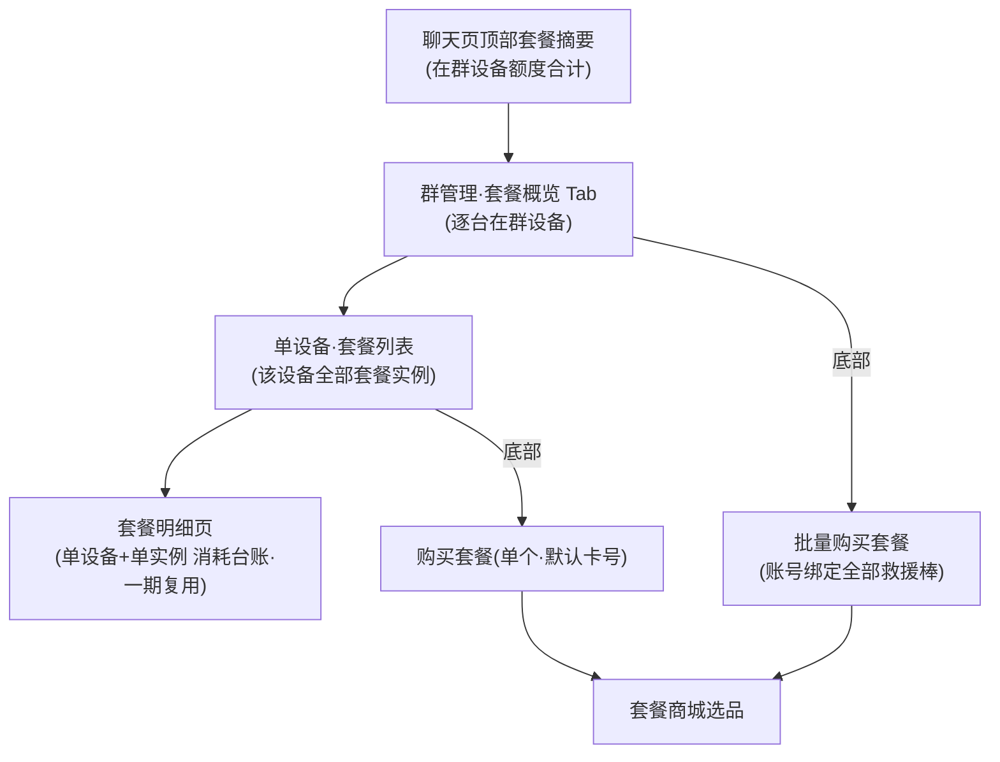

# 聊天室逻辑

<!-- notion_page_id: c555667c-6d3a-83d0-a00d-81403f5fd393 -->

<callout icon="💬" color="blue_bg">
	**文档用途**：单独梳理「对讲群（PTT 群）**聊天主页面**」本身的 UI 与交互逻辑，作为产品 / 测试对齐与用例设计依据。
	**适用范围**：仅覆盖**聊天主页面**（顶部套餐摘要、消息气泡区、底部操作区、接收规则、已读未读、群结束只读）。**创建 / 邀请 / 群信息管理 / 路由 / 计费**等仅作关联引用，不展开。**仅适用于天通应急救援棒（TT_RESCUE_STICK）。**
	**为何单立**：大纲已有「群管理页（US-群-02）」「邀请」「上 / 下行计费」「终端上报路由」，但**唯独缺「聊天主页面本身」**；且 <mention-page url="https://app.notion.com/p/2c65667c6d3a820b978801838378c4f3"/> 仅覆盖「普通通信 & 求救群聊」、<mention-page url="https://app.notion.com/p/2fd5667c6d3a838c9ecc8150e9c5ae68"/> 仅覆盖「普通通信 + 求救群聊」，均**未含对讲群**。本页填补该空白。
</callout>
---
## 一、页面结构总览
<callout icon="🧱" color="gray_bg">
	对讲群聊天主页面自上而下分三段：**① 顶部区（标题 + 状态 + 套餐摘要）→ ② 消息气泡区 → ③ 底部操作区**。群管理 / 成员 / 邀请记录等不在本页，点击底部「群信息」跳转群管理页（见 <mention-page url="https://app.notion.com/p/3305667c6d3a8281b7e88145fe82fd34"/>）。
</callout>
## 二、对讲群套餐：展示与购买
<callout icon="📦" color="yellow_bg">
	<mention-page url="https://app.notion.com/p/2c65667c6d3a820b978801838378c4f3"/> §1.1 适用范围为「**普通通信 & 求救群聊通用**」，**未含对讲群**。本节整合对讲群全部套餐逻辑（顶部摘要 → 套餐概览 → 套餐列表 → 套餐明细 → 单个 / 批量购买），与设备池 / 商城既有口径去重，仅补对讲群增量。
</callout>
### 2.0 基本模型（地基）
- **对讲群成员都是设备**：无「人头」套餐，所有套餐口径都落到**设备**。
- **套餐归属设备池**：额度永久绑定设备、解绑不断开、快照永久同步；跨账号（我的 / 用户 / 好友）看同一台设备额度一致（沿用 <mention-page url="https://app.notion.com/p/2c65667c6d3a820b978801838378c4f3"/> §1.2 / §2，不重述）。
- **与套餐商城解耦**：商品上下架只影响可购买性、不影响已购实例；多套餐「先到期先消耗」。
- **报位单位 = 次**：2期（需求变更 v1.2）由「按时长」改为「按位置点次数」；对讲群全部套餐口径统一展示「次」，无残留「小时」。
- **倒欠（负值）**：仅企业设备可倒欠，展示规则见 §2.2。
### 2.1 入口与下钻链路

### 2.2 四层余量口径与倒欠铁律
<table fit-page-width="true" header-row="true">
<tr>
<td>层</td>
<td>位置</td>
<td>口径</td>
<td>倒欠展示</td>
</tr>
<tr>
<td>① 群顶部合计</td>
<td>聊天页顶部摘要</td>
<td>全部在群设备短音 / 报位求和</td>
<td>显负数 +「欠费使用中」</td>
</tr>
<tr>
<td>② 概览逐台</td>
<td>套餐概览 Tab</td>
<td>每台在群设备短音 / 报位剩余</td>
<td>显负数 +「欠费使用中」</td>
</tr>
<tr>
<td>③ 单套餐实例卡</td>
<td>套餐列表卡片</td>
<td>单台设备单个套餐实例余量</td>
<td>永不显负、只到 0（一期沿用）</td>
</tr>
<tr>
<td>④ 套餐明细页</td>
<td>明细页</td>
<td>单实例消耗台账（逐条流水）</td>
<td>纯日志、扣除 / 返还逐条</td>
</tr>
</table>
<callout icon="⚠️" color="red_bg">
	**铁律**：倒欠负值只在**设备聚合层（①②）**出现并标「欠费使用中」；**单套餐实例卡（③）**进度条不显倒扣、满条 100%、最低到 0，永不为负。
</callout>
### 2.3 顶部套餐摘要（聊天页）
- **数据 = 当前在群设备**短音 / 报位（次）之和：设备退群 / 移除 / 换群即移出合计，新设备入群计入，实时刷新。
- **点击跳转**：→ 群管理页默认「套餐概览」Tab；与底部「群信息」入口落同页不同 Tab。
- 文案示例：
<table fit-page-width="true" header-row="true">
<tr>
<td>状态</td>
<td>文案示例（X / Y = 全部在群设备合计）</td>
</tr>
<tr>
<td>正常 / 有余额</td>
<td>`短音剩余：X条　报位剩余：Y次 >`</td>
</tr>
<tr>
<td>无可用套餐</td>
<td>`短音剩余：0条　报位剩余：0次 >`</td>
</tr>
<tr>
<td>含企业设备倒欠</td>
<td>`报位剩余：-3次（欠费使用中）`（①层显负 + 标识）</td>
</tr>
</table>
### 2.4 套餐概览 Tab（US-群-13 / US-豆-04）
- 逐台列出**在群设备**：设备图标（在线 / 离线 / 报警角标）+ 群内昵称（备注(卡号)）+ 短音剩余 + 报位剩余（次）+ `>`。
- 倒欠台（②层）显负数 +「欠费使用中」。
- 底部「**批量购买套餐**」按钮；点某台 → 该设备「套餐列表」。
- **可见范围（已确认）**：对全体成员（含群主）**只读可见全部在群设备**（与「顶部合计 = 全部在群设备求和」口径一致，避免合计与逐台对不上）；**购买 / 批量购买仅能操作自己有权限的设备**；企业可见范围按群信息 §8.3。
- **组件复用（已确认）**：与求救群「设备套餐信息模块」**复用同一「套餐概览」组件**，按群类型传参（数据源 = 在群设备），UI / 字段一致以减少重复开发。
### 2.5 单设备·套餐列表（一期复用）
- 该设备**全部套餐实例**，按**失效时间升序**、跨套餐混排（沿用 <mention-page url="https://app.notion.com/p/34f5667c6d3a822ba7ef01e619786259"/> 套餐实例卡口径）。
- 卡片字段：状态（生效中 / 已失效）、设备 ID、激活 / 失效时间、短音（已用 / 剩余 / 总量 + 进度条）、报位（次，进度条）、`查看套餐明细 >`。
- 进度条**不显倒扣只到 0**（③层铁律）。
- 生效中 →「查看套餐明细」、已失效 →「查看历史明细」，**同跳套餐明细页**。
### 2.6 套餐明细页（一期既有功能·直接复用）
- 单设备 + 单套餐实例的**消耗台账**，纯流水、**倒序、无筛选**。
- 短音 / 报位扣除逐条记账；**报位无返还**（后置记账，仅扣除条目）。
- 短音返还：R1 下发失败 `+1条`；R2 群结束「等待发送」取消 `+1条`。
### 2.7 购买套餐（单个·默认卡号）
- 入口：单设备套餐列表页底部「购买套餐」。
- **办理设备 = 当前上下文设备，卡号默认带入、只读，免手填、不扫码**（区别于一期 <mention-page url="https://app.notion.com/p/00d5667c6d3a830d84e3014a48de2608"/> §3.1 商城手输设备 ID）。
- 选品：商城三分类（组合 / 短音 / 报位）→ 周期分组（价格升序、默认前 3 + 查看更多）→ 购买确认弹窗（套餐摘要含报位「Y次」、全球 / 即时生效 / 不可退订、办理设备 ID、价格、立即支付）。
- 支付：小程序仅微信 / WEB 微信 + 支付宝；成功即激活、写入设备池。
### 2.8 批量购买（账号维度·全部救援棒）
- 入口：套餐概览 Tab 底部「批量购买套餐」。
- **可选设备列表 = 当前对讲群内的全部在群设备（仅在群即列，与账号是否绑定其它救援棒、设备归属何种标签无关）**；唯一硬过滤 = 设备类型（仅救援棒 TT_RESCUE_STICK）。
- **与「套餐概览」列表区别**：概览 = 仅在群设备（群维度）；批量购买 = 账号全部救援棒（账号维度），二者不同范围。
- 列表字段：复选框 / 设备图标 / 名称（备注(卡号)）/ 卡号 / 短音剩余 / 报位剩余（次）/（可选）标签；数据来源 = 账号设备关联关系 + 设备池快照。
- **套餐选择（已确认）**：本期**仅支持「同一套餐应用到所选多台」**，多设备混配不同套餐留后续迭代。
- 流程：选 1\~N 台（支持全选）→ 选套餐（同一套餐应用到所选）→ 确认（已选 N 台 + 合计 = 单价 × N）→ 支付。
- **订单模型（已确认）**：**N 笔子订单 + 一次聚合支付**——每台设备独立子订单（沿用一期「单订单单设备」激活 / 退款 / 对账，不破坏既有计费）；**逐台独立激活**，失败者按一期 <mention-page url="https://app.notion.com/p/00d5667c6d3a830d84e3014a48de2608"/> §6「激活失败异步重试」，仍失败则该子订单原路退款、**不阻塞其他设备**；支付后给**批量结果页**（逐台 成功 / 失败 / 重试中）。
### 2.9 全局规则与购买校验
- **关联校验**：账号与设备任意标签关联即可购买；实名前置。（报位=次见 §2.0、倒欠铁律见 §2.2，此处不重述）
- **支付无二次校验·按历史快照执行**：进入支付流程后**不做任何二次校验**，若支付过程中发生**设备解绑 / 套餐变更 / 关联失效 / 商品下架 / 价格变更**，前端**无任何感知**，仍按下单时的**历史快照**完成支付与激活；已支付成功不可撤销，套餐仍按快照入设备池。
- **禁止跨端支付**：订单与**创建端绑定**，哪个端创建就必须在哪个端支付——**小程序创建的订单不能在 WEB 端支付，WEB 创建的订单也不能在小程序支付**；跨端无法继续该订单的支付（需在原端完成或取消重下）。
- **支付异常**：超时 10 分钟 / 取消 / 失败 / 掉单 / 连点幂等，沿用 <mention-page url="https://app.notion.com/p/00d5667c6d3a830d84e3014a48de2608"/> §6 商城规则（其中价格变更二次校验对对讲群不适用，以本节「支付无二次校验」为准）。
## 三、顶部群名称与状态标签
<table fit-page-width="true" header-row="true">
<tr>
<td>元素</td>
<td>规则</td>
</tr>
<tr>
<td>群名称</td>
<td>展示对讲群名称（1\~15 字符，建群时定，见 <mention-page url="https://app.notion.com/p/6015667c6d3a8398a5e7015cc92b4e3c"/> §3）；群主可在群管理页改名，聊天页实时同步</td>
</tr>
<tr>
<td>群生命周期状态</td>
<td>已退出群聊/已结束/群有效</td>
</tr>
<tr>
<td>页面能力变化</td>
<td>群有效时正常查看；群结束后只读；已退出群聊不可再次进入</td>
</tr>
</table>
## 四、消息气泡区（当前仅两类消息）
<callout icon="💬" color="gray_bg">
	经核对 <mention-page url="https://app.notion.com/p/7035667c6d3a83b5806e81211959442f"/> §四 / §5.1：对讲群聊天页**当前仅两类消息**——**① 语音（短音，0x02）**、**② 报警文本（位置上报派生镜像）**；报警文本仅两种固定文案：「遇到危险，触发 SOS 报警，请求支援！」「遇到危险，触发落水报警，请求支援！」。（哪些消息进 / 不进对讲群见 §六 接收规则）
</callout>
### 4.1 两类消息与展示要素
<table fit-page-width="true" header-row="true">
<tr>
<td>消息类型</td>
<td>来源</td>
<td>经纬度</td>
<td>气泡内容</td>
</tr>
<tr>
<td>① 语音（短音）</td>
<td>终端 PTT 上报（0x02）→ 服务端广播</td>
<td>❌ **语音不带定位**</td>
<td>语音条 + 时长（1-10 秒）</td>
</tr>
<tr>
<td>② SOS 报警文本</td>
<td>按键 SOS（0x01·标识 1）位置派生镜像</td>
<td>✅ **展示经纬度**（如 116°17'14.14"E 39°49'38.00"N）</td>
<td>遇到危险，触发 SOS 报警，请求支援！</td>
</tr>
<tr>
<td>② 落水报警文本</td>
<td>落水 SOS（0x01·标识 2）位置派生镜像</td>
<td>✅ **展示经纬度**</td>
<td>遇到危险，触发落水报警，请求支援！</td>
</tr>
</table>
- **经纬度来源**：报警文本由位置上报派生，文本 + 位置点属同一事件（路由 L2），故报警气泡附带该次上报经纬度；语音无定位信息，气泡不展示坐标。
- **计费**：语音按短音计费（上行 1 + 下行每接收终端各 1）；报警文本镜像由位置派生，**不额外扣短音 / 报位**（路由 L14）。
### 4.2 发送者信息（每条气泡）
- **设备图标**：每个气泡框**旁边显示发送终端的设备图标**（终端图标实时同步，复用群信息 §6.2）。
- **昵称**：气泡**顶部显示发送终端的群内昵称**——「备注(卡号)」，无备注则展示卡号（群信息 §5）。
- **在线状态**：设备图标带在线 / 报警 / 离线角标，实时刷新（心跳 1 分钟无 → 离线）。
### 4.3 气泡下方·已读未读实时统计
<callout icon="👁️" color="blue_bg">
	**每条消息气泡下方实时展示接收统计**：`X人已读　Y人未读　Z人失败`。接收对象 = 该条广播命中的群内其他在群终端，逐台独立统计，随终端回执（0x03 未读 / 0x05 已读）实时刷新。
</callout>
- **点击展开「消息接收人列表」弹窗**，按状态分三 Tab：**未读 / 已读 / 失败**（Tab 上带实时数量）；列表逐成员展示**昵称(卡号) + 当前下行状态**。
- **下行状态文案**（映射下行计费 §1.3 六态，不重复定义状态机）：
<table fit-page-width="true" header-row="true">
<tr>
<td>下行状态（下行计费 §1.3）</td>
<td>接收人列表文案</td>
<td>归入 Tab</td>
</tr>
<tr>
<td>① 等待发送给终端</td>
<td>等待发送给终端</td>
<td>未读</td>
</tr>
<tr>
<td>② 发送至终端中</td>
<td>发送给终端中</td>
<td>未读</td>
</tr>
<tr>
<td>③ 终端未读</td>
<td>已发送，终端未读</td>
<td>未读</td>
</tr>
<tr>
<td>④ 终端已读</td>
<td>已发送，终端已读</td>
<td>已读</td>
</tr>
<tr>
<td>⑤ 下发至终端失败</td>
<td>发送失败</td>
<td>失败</td>
</tr>
<tr>
<td>⑥ 已取消（群结束 / 终端离群退费）</td>
<td>已取消</td>
<td>失败（暂时归入）</td>
</tr>
</table>
- **统计维度 = 终端（设备）维度**：成员本质是设备终端，逐台独立统计；退费随状态由下行计费 §3.3 处理，聊天页只做呈现。
- **发送方自身**：发语音的终端 A 是上行方，不计入自己的接收统计（仅统计其他接收终端）。
#### 4.3.1 失败原因透传（三 Tab 归类见 §4.3 映射表）
- **失败原因不另做前端枚举，以后端实现为基准**：当前不预设失败原因清单，失败 Tab 按**后端返回的原因文案透传展示**（原型「设备已离线」「失败原因」仅为示意）；后端新增 / 调整原因无需前端改动。
#### 4.3.2 图标 / 昵称三处同源，但与 ACK 是两个维度
- **三处同源**：弹窗行的设备图标 / 昵称 = 气泡旁图标 / 气泡顶部昵称 = 群信息成员列表头像 / 昵称，**同一数据源**实时刷新（图标见群信息 §6、昵称取群内昵称快照见群信息 §5）；改备注三处齐变（最后修改为准、绑定层不回写），设备离群后昵称快照销毁、跨群不继承。
- **图标实时状态 ≠ ACK 历史状态（关键）**：图标 = 设备**此刻**全局状态（在线 / 离线 / 报警）；Tab（未读 / 已读 / 失败）= 这条消息**当时**的投递结果。二者可不一致且正常（如现为在线、但该条历史消息当时失败仍躺「失败」Tab），不可据此把图标与 ACK 绑死。
## 五、底部操作区与账号下发能力
### 5.1 底部按钮与权限（复用群信息 §二）
<table fit-page-width="true" header-row="true">
<tr>
<td>按钮</td>
<td>可见 / 权限</td>
</tr>
<tr>
<td>成员位置</td>
<td>所有成员可见；地图 30 秒刷新不算上报、不扣报位（上行计费 L9）</td>
</tr>
<tr>
<td>群信息</td>
<td>所有成员可见，点击进群管理页「群信息」Tab</td>
</tr>
<tr>
<td>添加成员（邀请）</td>
<td>**仅群主可见 / 可操作**（邀请逻辑见 <mention-page url="https://app.notion.com/p/d345667c6d3a8275b77e01df63808736"/>）</td>
</tr>
<tr>
<td>购买套餐</td>
<td>任何关联账号可进入为设备购买（device-package-info-display §2.2）</td>
</tr>
</table>
### 5.2 账号侧无消息下发入口
<callout icon="🚫" color="red_bg">
	**已确认（产品口径）**：对讲群**账号 / 用户侧无法主动下发消息**，聊天页**不提供任何消息输入 / 发送入口**（无文本框、无语音录制按钮）。账号侧对讲群聊天页为**只读 / 监听**——仅接收并展示终端上报的语音与报警文本、做已读未读呈现，自身不发起任何下行下发。
</callout>
- **消息来源唯一为终端上报**：语音由终端 PTT 按键上报（0x02）、报警文本由终端位置上报派生镜像；账号 / 平台侧不发起对讲群消息，底部四个按钮（§5.1）均不含消息下发。
## 六、对讲群消息接收规则（账号侧）
<callout icon="📥" color="yellow_bg">
	<mention-page url="https://app.notion.com/p/2fd5667c6d3a838c9ecc8150e9c5ae68"/> 整篇仅覆盖「普通通信 + 求救群聊」，**不含对讲群**。本节补对讲群账号侧接收口径，路由判定以 <mention-page url="https://app.notion.com/p/7035667c6d3a83b5806e81211959442f"/> 为准。
</callout>
### 6.1 账号在对讲群可接收 / 不接收
<table fit-page-width="true" header-row="true">
<tr>
<td>消息类型</td>
<td>是否进对讲群</td>
<td>依据</td>
</tr>
<tr>
<td>终端上报语音（0x02）</td>
<td>✅ 终端在对讲群即进（路由结果矩阵）</td>
<td>路由 §四 L7\~L8</td>
</tr>
<tr>
<td>PTT 其他终端广播语音</td>
<td>✅ 服务端扇出至群内终端</td>
<td>路由 L8 / 下行计费 §2.3</td>
</tr>
<tr>
<td>SOS 报警文本（按键 / 落水）</td>
<td>✅ **镜像**进对讲群</td>
<td>路由 §5.1 L12：终端在对讲群时镜像报警文本</td>
</tr>
<tr>
<td>取消报警 / 普通位置派生文本</td>
<td>❌ 只进 SOS 求救群聊，不进对讲群</td>
<td>路由 §5.2 L17</td>
</tr>
<tr>
<td>普通位置 / 轨迹</td>
<td>❌ 不在聊天室展示</td>
<td>接收规则 §7.1（位置只在地图 / 轨迹）</td>
</tr>
</table>
### 6.2 接收对象与可见范围
- **接收对象**：对讲群成员——即**名下有设备在本群的归属账号**，以及**群主**（群主即便无自有设备在群也可见，对齐群信息 §二）。
- **群外关联账号不接收**：对讲群是常驻 PTT 群，非「关联即广播」；与普通通信「含此设备无论何种关系都可查看」不同。
- **企业可见范围**：企业账号只看自己创建的群；企业设备被拉入他人群时该企业在消息列表不可见（群信息 §8.3）。
## 七、账号侧已读 / 未读与会话项
<callout icon="👁️" color="gray_bg">
	需区分两套「已读」：**① 终端 ACK 已读**（计费 / 状态机用，0x03 / 0x05，已在下行计费定义）；**② 账号侧聊天页未读**（消息列表角标 / 进入清零，本节补）。二者互不等同——账号打开聊天页 ≠ 终端已读。
</callout>
<table fit-page-width="true" header-row="true">
<tr>
<td>维度</td>
<td>规则</td>
</tr>
<tr>
<td>会话项未读角标</td>
<td>消息列表对讲群 Tab 按最后消息时间倒序、支持未读角标（群信息 §8.3）</td>
</tr>
<tr>
<td>账号侧进入即读</td>
<td>账号打开对讲群聊天页 → 该账号未读清零（账号维度），**不代表终端已读**</td>
</tr>
<tr>
<td>气泡级已读未读</td>
<td>每条消息气泡下方实时统计 + 接收人列表弹窗，按**终端维度**逐台展示（详见 §4.3）</td>
</tr>
<tr>
<td>「全部已读」</td>
<td>只作用当前 Tab（群信息 §8.3）</td>
</tr>
</table>
## 八、群结束 / 历史消息在聊天页（只读）
- 群结束后聊天页进入**只读**：底部管理按钮隐藏 / 置灰（账号侧本无消息下发入口，见 §5.2，故无下发输入框需处理）。
- **只读冻结口径（已确认）**：聊天页只读后，**设备图标 / 在线·报警角标与顶部设备套餐余额仍全局实时刷新**；**其余历史参数（群名、成员列表、群内昵称快照、消息记录等）定格为结束时刻快照，不再变化。**
- **群主**：群结束后仍可进入聊天页只读查看历史 + 进群管理页只读（群信息 §八）。
- **普通成员归属账号**：
	- 群被群主结束时**自己仍有设备在群** → 会话项`已结束`，**可进入聊天页只读查看历史**（与群主一致，群信息 §8.1）。
	- 自己设备退出 / 被移除（归零）→ 会话项灰`已退出`，**不可再进入**（群信息 §8.1）。
- 历史语音气泡保留并可回放（欠费态播放限制同 §4.1）。
## 九、参考文档
- <mention-page url="https://app.notion.com/p/8375667c6d3a83418af28148964e9b01"/>（US-群 系列 / 第七章全局规则）
- <mention-page url="https://app.notion.com/p/3305667c6d3a8281b7e88145fe82fd34"/>（角色权限 / 头像状态 / 会话项 / 群结束）
- <mention-page url="https://app.notion.com/p/2c65667c6d3a820b978801838378c4f3"/>（套餐数据口径，注：仅普通通信 + 求救群聊）
- <mention-page url="https://app.notion.com/p/2fd5667c6d3a838c9ecc8150e9c5ae68"/>（接收口径，注：仅普通通信 + 求救群聊）
- <mention-page url="https://app.notion.com/p/7035667c6d3a83b5806e81211959442f"/>（上行路由 / 镜像）
- <mention-page url="https://app.notion.com/p/90a5667c6d3a834dab038144953f606d"/>、<mention-page url="https://app.notion.com/p/a8b5667c6d3a8298b2e60187ca27e5a8"/>（计费 / 状态机 / 退费）
- <mention-page url="https://app.notion.com/p/d345667c6d3a8275b77e01df63808736"/>、<mention-page url="https://app.notion.com/p/d6d5667c6d3a8271a79101876788a072"/>、<mention-page url="https://app.notion.com/p/6015667c6d3a8398a5e7015cc92b4e3c"/>
---
> **版本**：v1.0 ｜ **维护人**：<mention-user url="user://2d7d872b-594c-813e-a8a5-00026539d78a"/> ｜ **状态**：草稿，⚠️ 项待产品评审拍板 {color="gray"}
<empty-block/>
