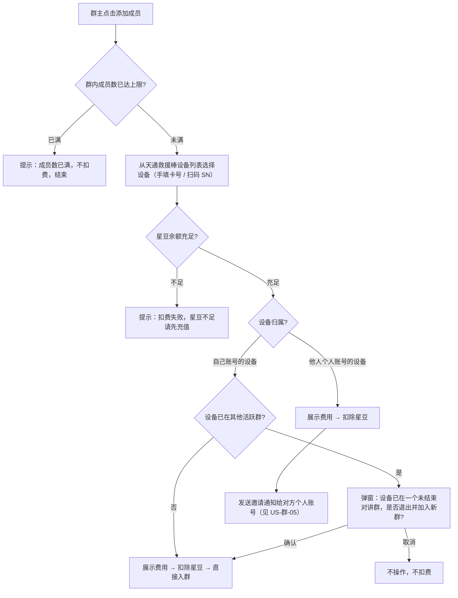

# 群成员邀请逻辑

<!-- notion_page_id: d345667c-6d3a-8275-b77e-01df63808736 -->

<callout icon="🎯" color="blue_bg">
	**文档用途**：梳理「对讲群 — 添加成员（邀请设备入群）」功能的核心逻辑、主流程与异常边界，供产品 / 测试快速对齐，并作为用例设计依据。
	**适用范围**：仅覆盖「对讲群」邀请设备入群链路（入口 → 设备列表过滤 → 邀请权限 → 扣费 → 邀请处理 → 换群 → 并发 → 退还）；消息收发 / 套餐 / 结束群仅作关联引用。**邀请对象仅限天通应急救援棒（TT_RESCUE_STICK）设备**。求救群聊「手机号添加成员」为另一套逻辑，见第 9 节对比。
</callout>
---
## 1. 角色与权限规则（谁能添加成员）
<table header-row="true">
<tr>
<td>角色</td>
<td>能否添加成员</td>
<td>说明</td>
</tr>
<tr>
<td>**群主**（个人 / 一级 / 二级 / 三级账号均可）</td>
<td>✅ 可邀请</td>
<td>仅对**自己创建**的群；星豆充足创建对讲群者自动成为群主</td>
</tr>
</table>
<callout icon="💡" color="gray_bg">
	**为何只有群主一行**：对讲群里除群主外的成员，本身就是**被邀请入群的终端（设备）**，是被邀请的一方，**不存在「添加成员」这个动作 / 概念**，故不在权限表中单列。邀请动作始终由**群主**发起。
</callout>
---
## 2. 设备类型与设备列表过滤规则（多账号 / 多标签核心）
### 2.1 设备类型限制
- 邀请设备列表**只显示天通应急救援棒（TT_RESCUE_STICK）**类型设备，其他设备类型不可加入对讲群。
### 2.2 设备标签来源回顾（理解过滤的前提）
- 标签取值：**我的 / 用户 / 好友 / null**，优先级 **我的 \> 用户 \> 好友**。
- 形成路径：扫码绑定 → **我的**；个人授权派生 → **用户**（仅企业账号会出现）；扫码关注 → **好友**。
- 一台设备最多被 **1 个个人账号 + 1 个一级企业账号** 同时绑定（双绑场景，均可为「我的」）。
#### 2.2.1 设备 - 账号关系是「多维」的（同一台设备对不同账号呈现不同标签）
<callout icon="🧬" color="purple_bg">
	**关键认知**：标签（我的 / 用户 / 好友）是「**账号 × 设备**」的**相对属性**，不是设备的全局属性。同一台设备，对不同账号可同时呈现不同标签 —— 因此一台设备的真实状态是下列多个维度的**叠加组合**，而非单一标签。
</callout>
<table header-row="true">
<colgroup>
<col>
<col>
<col>
<col>
<col width="148.25567626953125">
</colgroup>
<tr>
<td>关系维度</td>
<td>形成方式</td>
<td>可持有的账号</td>
<td>数量约束</td>
<td>该账号看到的标签</td>
</tr>
<tr>
<td>个人「我的」</td>
<td>个人扫码绑定</td>
<td>个人账号</td>
<td>**最多 1 个**</td>
<td>我的</td>
</tr>
<tr>
<td>企业「我的」</td>
<td>一级企业扫码绑定（ENTERPRISE）</td>
<td>一级企业账号</td>
<td>**最多 1 个**</td>
<td>我的</td>
</tr>
<tr>
<td>企业「用户」</td>
<td>个人将设备授权派生给企业（FOLLOW）</td>
<td>企业账号</td>
<td>**可多个**</td>
<td>用户</td>
</tr>
<tr>
<td>「好友」</td>
<td>扫码关注</td>
<td>个人 / 企业账号</td>
<td>**可多个**</td>
<td>好友</td>
</tr>
</table>
- 同一账号若同时具备多种关系，按优先级 **我的 \> 用户 \> 好友** 取最高标签展示。
- **典型组合示例**：一台设备被个人 A 绑定为「我的」后，它**仍可同时**被一级企业 B 绑定为「我的」（双绑）、被企业 C 授权派生为「用户」、被企业 D 与个人 E/F 扫码关注为「好友」。
<table header-row="true">
<colgroup>
<col width="149.06533813476562">
<col>
<col>
<col>
</colgroup>
<tr>
<td>视角账号</td>
<td>与设备的关系</td>
<td>该账号看到的标签</td>
<td>能否邀请 / 行为</td>
</tr>
<tr>
<td>个人 A（绑定者）</td>
<td>扫码绑定</td>
<td>我的</td>
<td>✅ 直接入群，不发通知</td>
</tr>
<tr>
<td>个人 E / F（关注者）</td>
<td>扫码关注</td>
<td>好友</td>
<td>✅ 展示（因设备有个人「我的」归属 A）；邀请 = 发通知给 A</td>
</tr>
<tr>
<td>一级企业 B（绑定者）</td>
<td>ENTERPRISE 绑定</td>
<td>我的</td>
<td>✅ 直接拉进群</td>
</tr>
<tr>
<td>企业 C（被授权）</td>
<td>FOLLOW 授权派生</td>
<td>用户</td>
<td>❌ 不展示</td>
</tr>
<tr>
<td>企业 D（关注者）</td>
<td>扫码关注</td>
<td>好友</td>
<td>❌ 不展示</td>
</tr>
</table>
### 2.3 设备列表过滤规则（按邀请方）
<callout icon="🔑" color="blue_bg">
	**核心判定**：一台天通救援棒能否进入某账号的邀请列表，取决于它**与该账号（或同体系账号）的关联关系**：
	**个人邀请方** —— 看设备是否已被**某个个人账号**关联为「我的」（即存在个人「我的」归属）。
	**企业邀请方** —— 仅看设备是否被**本企业**关联为「我的」（ENTERPRISE 绑定）；「用户」（FOLLOW 授权派生）与「好友」（关注）的设备不展示。
</callout>
<table header-row="true">
<colgroup>
<col>
<col width="341.98577880859375">
<col width="287.80113220214844">
</colgroup>
<tr>
<td>邀请方</td>
<td>列表展示范围</td>
<td>不展示</td>
</tr>
<tr>
<td>**个人账号**</td>
<td>**已被某个个人账号关联为「我的」**的天通救援棒（含本账号扫码绑定的「我的」设备，以及被他人个人账号认领为「我的」、且当前账号已关注的「好友」设备）</td>
<td>无任何个人账号「我的」归属的设备</td>
</tr>
<tr>
<td>**企业账号**</td>
<td>本企业**绑定（ENTERPRISE，标签「我的」）**的天通救援棒</td>
<td>本企业「用户」（FOLLOW 授权派生）与「好友」（关注）关系的设备，及未与本企业建立绑定的设备</td>
</tr>
</table>
#### 2.3.1 个人账号邀请列表 —— 进入列表的两个前提 + 标签细分
<callout icon="🧭" color="blue_bg">
	**进入个人账号 A 邀请列表的两个前提（需同时满足）**：
	**前提 1**：该设备已在**账号 A 的「设备管理」**中（A 与设备已建立绑定或关注关系，先不论标签）。
	**前提 2**：该设备已被**某个个人账号绑定为「我的」**（设备存在个人「我的」归属）。
	满足两个前提后，从 A 的视角看，设备标签只会是「**我的**」（A 自己绑定）或「**好友**」（A 关注、但「我的」主人是别的个人账号）。
</callout>
**① 标签 = 我的（A 自己扫码绑定，前提天然满足，必展示）**
<table header-row="true">
<colgroup>
<col width="310.9886169433594">
<col width="104.98011016845703">
<col width="184.88919067382812">
</colgroup>
<tr>
<td>绑定情况</td>
<td>是否展示</td>
<td>邀请行为</td>
</tr>
<tr>
<td>仅 A 自己绑定</td>
<td>✅ 展示</td>
<td>直接入群，不发通知</td>
</tr>
<tr>
<td>A 自己绑定 + 企业一级也绑定（双绑，均为「我的」）</td>
<td>✅ 展示</td>
<td>直接入群，不发通知</td>
</tr>
<tr>
<td>A 自己绑定 + 授权派生给企业（企业侧标签为「用户」）</td>
<td>✅ 展示</td>
<td>直接入群，不发通知</td>
</tr>
</table>
<callout icon="💡" color="gray_bg">
	设备同时被**其他企业账号绑定 / 授权 / 关注**、或被**其他个人账号关注**，**不影响 A 侧的展示与入群行为**（A 仍按「我的」直接入群）；这些关系只改变那些「其他账号」各自列表里的可见性。多账号叠加的全景见 2.2.1。
</callout>
**② 标签 = 好友（A 关注的设备，是否展示取决于「有没有个人账号我的归属」）**
<table header-row="true">
<colgroup>
<col width="157.42897033691406">
<col width="152.21875">
<col width="124.99999237060547">
<col>
<col width="142.99999237060547">
</colgroup>
<tr>
<td>设备绑定状态</td>
<td>个人「我的」归属</td>
<td>企业绑定</td>
<td>是否展示</td>
<td>邀请行为</td>
</tr>
<tr>
<td>无个人绑定，但有企业绑定</td>
<td>无</td>
<td>有</td>
<td>❌ 不展示</td>
<td>—（设备无个人主人，不满足前提 2）</td>
</tr>
<tr>
<td>无个人绑定，无企业绑定</td>
<td>无</td>
<td>无</td>
<td>❌ 不展示</td>
<td>—（不满足前提 2）</td>
</tr>
<tr>
<td>有个人绑定（被**他人**个人账号认领为「我的」），无企业绑定</td>
<td>有（他人）</td>
<td>无</td>
<td>✅ 展示</td>
<td>发邀请通知给设备的个人主人，见第 5 节</td>
</tr>
</table>
<callout icon="📌" color="gray_bg">
	**核心隔离**：企业账号绑定的设备只能由企业账号直接加入；个人账号链路则按「设备是否有个人账号我的归属」过滤。两条链路按归属严格隔离，互不交叉。
</callout>
#### 2.3.2 企业账号邀请列表 —— 按企业侧标签细化
<callout icon="🧭" color="gray_bg">
	**判定核心**：企业邀请方只看**本企业与设备的关联关系**——仅「我的」（ENTERPRISE 绑定）的设备可邀请；「用户」（FOLLOW 授权派生）与「好友」（关注）的设备不展示。
</callout>
<table header-row="true">
<tr>
<td>设备与本企业的关系</td>
<td>企业侧标签</td>
<td>是否展示</td>
<td>邀请行为</td>
</tr>
<tr>
<td>本企业扫码绑定（ENTERPRISE）</td>
<td>我的</td>
<td>✅ 展示</td>
<td>直接拉进群，不发通知</td>
</tr>
<tr>
<td>本企业授权派生（FOLLOW）</td>
<td>用户</td>
<td>❌ 不展示</td>
<td>—</td>
</tr>
<tr>
<td>本企业仅扫码关注</td>
<td>好友</td>
<td>❌ 不展示</td>
<td>—</td>
</tr>
</table>
#### 2.3.3 已在群 / 邀请中状态过滤（重复邀请拦截）
<callout icon="🚫" color="red_bg">
	**统一规则**：只要目标设备**已在本群**、或**已有指向本群的待处理邀请通知**，按入口区分处理、**均不扣费**：**批量添加** → 列表**直接过滤不展示**该设备；**扫码添加** → 现场**提示拦截**，沿用原状态（成员身份或原 pending 通知）。计费只发生在「该设备此前既不在本群、也无本群 pending」一种有效情形（扣 1 笔）。
</callout>
<table header-row="true">
<colgroup>
<col>
<col width="300.99998474121094">
<col width="193.9005584716797">
</colgroup>
<tr>
<td>状态 ＼ 入口</td>
<td>扫码添加（单个）</td>
<td>批量添加</td>
</tr>
<tr>
<td>**设备已在本群**</td>
<td>扫码命中 → 提示「设备已在本群」，不可添加、不扣费</td>
<td>列表直接过滤该设备</td>
</tr>
<tr>
<td>**已有本群邀请通知**（pending）</td>
<td>扫码命中 → 提示「该设备邀请中 / 待对方确认」，不可重复邀、不扣费，沿用原通知</td>
<td>列表直接过滤该设备</td>
</tr>
</table>
<callout icon="⚙️" color="gray_bg">
	**与并发的关系**：同群并发重复（两笔几乎同时邀同一设备进同一群）归入本规则——第一笔生效后，后到笔正好命中「已在群 / 已 pending」→ 拦截，已扣按退还开关退；不再单列并发档。
</callout>
### 2.4 扫码添加的提示
<callout icon="🔍" color="blue_bg">
	**扫码判定顺序**：设备类型（是否救援棒）→ 绑定 / 归属关系→ 已在群 / 已 pending（见 2.3.3）。扫码不走列表过滤，设备类型必须在此现场校验。
</callout>
- **设备类型校验（最优先）**：扫码发现设备**非天通救援棒（非 TT_RESCUE_STICK）** → 提示「该设备不支持加入对讲群（仅天通救援棒可加入）」，直接终止，不再做后续绑定 / 归属判定。
- 个人账号扫码发现设备**未绑定个人账号** → 提示「设备未绑定个人账号」。
- 企业账号扫码发现设备**非本账号所有** → 提示「未绑定该设备」。
---
## 4. 添加成员主流程（US-群-04）
- **入口**：群聊页底部「添加成员」（仅群主可见）或群信息页入口。
- **前置**：当前用户为群主；群内成员数未达上限。

**关键校验顺序**：成员上限 → 余额 → 设备归属 → 是否已在他群。
<callout icon="🌳" color="green_bg">
	**完整权限判断树 v3.1（个人分支恢复标签 + 关联维度）** —— 把第 1\~3 节权限、第 4\~7 节流程与扣费、第 11 节存疑点收敛为一棵可执行判定树；下方按图标 + 折叠拆分，点开查看各分支判定。⚠️ 为仍存疑、需产品对齐项。
</callout>
<details>
<summary>🧭 全局前置校验（P0–P3 · 单个 / 批量通用）</summary>
	```javascript
【全局前置校验】（单个 / 批量都先过）
├─ P0 角色：必须是群主本人（仅群主可邀请）
├─ P1 群容量：成员数未达上限（个人 5 / 企业 100，可配置）→ 否：提示「成员数已满」，不扣费结束
├─ P2 账号状态：群主账号冻结 / 过期？
│    └─ 是 → 跳转登录页，物理端阻断，进不去邀请入口（数据层无限制）
└─ P3 设备类型：仅天通救援棒（TT_RESCUE_STICK）可入对讲群
     （邀请设备列表已前置过滤：列表里展示的都是「可被邀请」的设备）
	```
</details>
<details>
<summary>👤 模式一 · 单个邀请 — 分线 A：个人账号（标签 + 关联维度）</summary>
	```javascript
分线 A：个人账号 A 发起
核心判定 = 设备是否被「某个个人账号」绑定为「我的」，且该「我的」主人是否本人
│
├─ 标签 =「我的」（A 自己扫码绑定）
│    → ✅ 直接入群，不发通知（无视设备是否同时被企业绑定 / 授权 / 被他人关注）
│
├─ 标签 =「好友」（A 仅扫码关注）→ 看「该设备有无个人账号『我的』归属」
│    ├─ 有（被他人个人账号认领为「我的」）
│    │    → ✅ 展示；邀请 = 发通知给设备的个人主人 →（走通用后置 / 接收处理）
│    └─ 无（仅企业绑定 或 无任何绑定）
│         → ❌ 不展示、不可邀请（扫码提示「设备未绑定个人账号」）
│
├─ 标签 =「用户」→ 个人账号不存在「用户」标签（用户 = 企业 FOLLOW 派生），不出现在个人列表
│
└─ 标签 = null（无任何关系）→ ❌ 不展示
	```
</details>
<details>
<summary>🏢 模式一 · 单个邀请 — 分线 B：企业账号</summary>
	```javascript
分线 B：企业账号发起
核心判定 = 设备与「本企业」的关系
│
├─ 本企业 ENTERPRISE 扫码绑定（标签 =「我的」）→ ✅ 直接拉进群，不发通知
│
├─ 本企业 FOLLOW 授权派生（标签 =「用户」）
│    → ❌ 不展示、不可邀请
│
├─ 本企业仅扫码关注（标签 =「好友」）→ ❌ 不展示
│
├─ 标签 = null → ❌ 不展示
│
└─ 子账号（一 / 二 / 三级）发起：与一级共用成员上限配置；星豆从子账号自身扣，独立不共享
	```
</details>
<details>
<summary>💰 单个邀请 · 通用后置（扣费 / 换群）</summary>
	```javascript
单个邀请 · 通用后置（确定「可入群」之后）
├─ 扣费校验：星豆是否充足？→ 否：提示「扣费失败，星豆不足」，不邀请、不扣费
├─ 扣费：默认 20 豆、邀请即扣（自己设备扣后直接入群；他人设备扣后发通知）
└─ 目标设备是否已在其他活跃群？
     ├─ 否 → 入群（自己设备直接入；他人设备待对方同意后入）
     └─ 是 → 设备同一时间仅属 1 群，需换群
          ├─ 自己设备（本人「我的」）→ 直接退原群 + 入新群（无需额外换群确认弹窗）
          └─ 他人设备 → 发邀请通知给主人；主人同意 → 自动退原群 + 入新群
                         拒绝 → 失效，按退还开关退费；超时 → 失效，按退还开关退费
	```
</details>
<details>
<summary>📦 模式二 · 批量邀请（公共校验 + 个人 / 企业分线 + 换群）</summary>
	```javascript
模式二 · 批量邀请（先按邀请方账号类型分线；列表已前置过滤，展示 = 可邀请）
【公共校验 · 按整批判定】
Step1 角色 = 群主本人；账号状态正常（冻结 / 过期 → 阻断，同 P2）
Step2 去重 / 拦截：剔除「已在本群」「已有本群待处理邀请」及批内重复勾选的设备 → 不计费、不重复发通知；按剩余有效设备继续
Step3 整批入群后是否超成员上限？→ 超：整批拦截、不扣费
Step4 整批星豆是否充足（按**去重后**总额扣）？→ 不足：整批失败、不扣费
Step5 并发锁：竞争同一设备时仅一个成功，其余失效退还；同群并发重复的后到笔判为「已在群 / 已 pending」→ 拦截，已扣按退还开关退
Step6 即时阶段强一致：成员上限 / 余额 / 并发 任一失败 → 整批回滚、已扣全退
 
▶ 分线 A：个人账号批量（每台按【单个 · 分线 A】标签判定）
  ├─「我的」设备 → 直接入群（批次内这部分可先入群）
  └─ 他人「我的」设备（好友且有个人主人）→ 各自发通知，主人同意后入群
▶ 分线 B：企业账号批量（每台按【单个 · 分线 B】判定）
  └─「我的」 → 直接拉群
【批量 · 换群处理】（设备同一时间仅属 1 个活跃群 · 逐台检测，无 per-device / 批量额外确认弹窗）
逐台判断：目标设备当前是否已在其他活跃对讲群？
└─ 已在其他活跃群 → 触发换群，按「设备归属」分两类：
     ├─ A. 自己设备（本人「我的」/ 本企业「我的」· 即时入群类）
     │    → 直接从原群移除 + 入新群（不弹换群确认，批量逐台静默执行）
     │    ├─ 原群：设备移出原群成员列表（退出旧群那笔不退，见 §5.5-3）
     │    └─ 新群：按新邀请已另扣一笔，即时入新群
     └─ B. 他人个人「我的」设备（异步入群类）
          → 发邀请通知给设备的个人主人，设备暂留原群，等待处理：
          ├─ 主人同意 → 自动退原群 + 入新群（原群那笔不退；新群已扣保留）
          ├─ 主人拒绝 → 邀请失效，设备留原群不动（新群那笔按退还开关退，见 §5.4-1）
          └─ 主人超时未处理 → 邀请失效，设备留原群不动（新群那笔按退还开关退，见 §5.4-2）
	```
</details>
<details>
<summary>🔁 横切维度（账号状态 D / 扣费退还 E · 两模式共用）</summary>
	```javascript
横切维度（两模式共用）
D｜账号状态（冻结 / 过期）
  ├─ 群主（邀请方）→ 跳登录页、物理端阻断，进不去入口（数据无限制）
  └─ 目标设备的个人主人 → 通知照常下发，但本人无法登录处理 → 超时失效 → 按「失败退还开关」退费
E｜扣费 / 退还
  ├─ 邀请即扣（默认 20 豆，可配置开关）
  ├─ 拒绝 → 按退还开关退
  ├─ 超时 / 群结束 / 满员失效 → 按退还开关退
  ├─ 移除成员 / 换群退出 → 不退
  └─ 星豆只退一次（防重复退还）
	```
</details>
---
## 5. 星豆消耗与退还（计费 / 退还）
### 5.1 计费参数（个人 / 企业统一）
- **唯一参数控制**：邀请扣费由管理后台「**邀请成员扣除星豆**」单一参数（开关 + 数值，默认开启、20 豆）控制。
- **个人与企业完全一致**：个人账号、企业账号（含一 / 二 / 三级子账号）邀请成员**消耗星豆相同**，**都走同一个后台参数**，**不存在按账号类型分别定价**。
- **扣费主体**：扣**发起操作账号自身**星豆 —— 个人扣个人；子账号操作扣子账号（子账号星豆独立、不共享、不扣一级）。
- **扣费时点**：**邀请即扣**（点确认发起即扣，不是设备入群时才扣）。
- **快照固化（星豆消耗详情快照）**：邀请即扣时，对该笔邀请落一条**星豆消耗快照流水**并固化下列字段；后台中途改配置**只对其后新发起的邀请生效**，不影响在途邀请：
	- **消耗金额**（单价 × 去重后台数，如 20 豆 × N 台）—— 退还的等额依据。
	- **扣费账号**（个人 / 子账号）—— 退还原路退回同一账号。
	- **退还开关状态**（开 / 关）—— 决定这笔到底退不退。
	- **过期时长**（默认 10min）—— 决定何时失效触发退还。
- **退还按快照回放，不重算**：任何失效场景的退还，都**读取该笔消耗快照流水、原路等额退回**，与后台当前配置无关（**绝不按实时单价重新计算**）。批量邀请按「发起时单价 × 去重后台数」整体锁进快照，批内各设备异步处理时间不同，退的也都是各自快照里的那一份，避免「同一批两种退价」。
### 5.2 费用扣除确认弹窗（UI 口径）
- **只展示「本次需消耗星豆总数」**，**不拆**「单价 × 台数 = 合计」明细。
- 余额充足 → 确认后扣费、正常添加；余额不足 → 提示「**扣费失败，星豆不足请先充值**」，**不扣费、不邀请**。
- 批量按**整批总额**校验与扣费。
### 5.3 消耗星豆的场景（即扣）
- 邀请**自己设备**直接入群。
- 邀请**他人个人设备**（发通知，先扣后等处理）。
- **批量邀请**（按**去重后**合计台数一次扣；已在本群 / 已有本群待处理邀请的设备不计费）。
- 设备**换群**再被邀请（新邀请按新一笔扣费）。
### 5.4 可退还场景（统一「按退还开关」快照判定）
<callout icon="🔌" color="green_bg">
	**退还总口径**：**无「无条件退还」一档**，是否退 = **发起时快照的「退还开关」**——开启则原路退回扣费账号，关闭则不退；退还金额一律 = **该笔消耗快照流水的原额**（**回放快照，不按后台实时配置重算**）；**同一笔邀请星豆只退一次**。
</callout>
<table header-row="true">
<tr>
<td>#</td>
<td>可退还场景</td>
<td>类型</td>
</tr>
<tr>
<td>1</td>
<td>**被邀请人主动拒绝**</td>
<td>异步失效</td>
</tr>
<tr>
<td>2</td>
<td>超时未处理失效</td>
<td>异步失效</td>
</tr>
<tr>
<td>3</td>
<td>待处理期间**群已结束**</td>
<td>异步失效</td>
</tr>
<tr color="brown_bg">
<td>4</td>
<td>待处理期间**群已满员**（他人抢先占满）</td>
<td>异步失效</td>
</tr>
<tr color="brown_bg">
<td>5</td>
<td>**并发失败**（多群抢同设备，同意其一 → 其余失效）</td>
<td>异步失效</td>
</tr>
<tr>
<td>6</td>
<td>**设备已解绑**（主动 / 管理员强制，无个人绑定者）</td>
<td>动态异常</td>
</tr>
<tr>
<td>7</td>
<td>**设备归属变更**（主人变更 / 好友→我的强制替换）</td>
<td>动态异常</td>
</tr>
<tr>
<td>8</td>
<td>**账号已注销**（被邀请人账号注销 / 删除）</td>
<td>动态异常</td>
</tr>
<tr color="brown_bg">
<td>9</td>
<td>**设备类型已变更**（不再是 TT_RESCUE_STICK）</td>
<td>动态异常</td>
</tr>
<tr>
<td>10</td>
<td>**批量即时阶段失败回滚**（成员上限 / 余额 / 并发任一失败 → 整批回滚、已扣全退）</td>
<td>即时强一致</td>
</tr>
</table>
### 5.5 不可退还场景
<table header-row="true">
<tr>
<td>#</td>
<td>不退场景</td>
<td>说明</td>
</tr>
<tr>
<td>1</td>
<td>入群成功后**被群主移除成员**</td>
<td>服务已兑现，不退</td>
</tr>
<tr>
<td>2</td>
<td>**换群退出原群**</td>
<td>退出旧群那笔不退（新群按新邀请另扣）</td>
</tr>
<tr>
<td>3</td>
<td>**已成功入群的正常消耗**</td>
<td>自己设备直接入群 / 他人同意入群</td>
</tr>
<tr>
<td>4</td>
<td>群**正常解散 / 结束后**已入群成员的已扣星豆</td>
<td>与「待处理期间群结束 → 失效退」区分</td>
</tr>
</table>
### 5.6 关键边界
- **只退一次**：多原因同时命中（如群结束 + 超时）也只退一笔（快照流水带「已退还」标记保证幂等）。
- **原路退回**到当初扣费账号（个人退个人、子账号退子账号），金额 = 快照原额。
- **不在邀请记录模块展示扣费 / 退还**，需到「**星豆记录 / 明细**」查看；退还另记一条。
- **扣费开关关闭** → 邀请免费、退还开关自动置灰禁用；已发起在途失效仍按快照退。
- 退还在后台**不计入「退款」统计**（退款口径仅含套餐）。
---
## 6. 关键规则总结（索引 · 细则见对应章节）
1. **权限（§1）**：仅群主可邀请；其余成员均为被邀请入群的设备终端，无「添加成员」概念。
2. **设备范围与过滤（§2）**：仅天通救援棒；个人看「有个人『我的』归属」的设备，企业仅看本企业 ENTERPRISE 绑定设备，两条链路按归属严格隔离。
3. **入群与唯一性（§4）**：自己设备直接入群、他人设备发通知待确认；一台设备同时仅属一个活跃群，并发仅一个成功，接受新邀请自动退原群。
4. **扣费 / 退还（§5）**：个人 / 企业同一参数，默认 20 豆、邀请即扣；失效按退还开关退（含**主动拒绝**）、批量即时失败整批回滚，移除 / 换群退出 / 已入群不退，只退一次。
5. **解绑联动（§5.4）**：用户主动解绑自动退出全部活跃群；管理员强制解绑不处理。
---
## 7. 参考文档
- <mention-page url="https://app.notion.com/p/8375667c6d3a83418af28148964e9b01"/>：US-群-04（添加成员 / 邀请）、US-群-05（接收处理邀请）、US-群-06（设备换群）、US-群-12（邀请记录）、第七章全局规则
- <mention-page url="https://app.notion.com/p/6015667c6d3a8398a5e7015cc92b4e3c"/>（格式 / 角色权限参考）
- <mention-page url="https://app.notion.com/p/43d5667c6d3a824b8c19813469fb2794"/>（我的 / 用户 / 好友标签来源与多账号规则）
- <mention-page url="https://app.notion.com/p/a8b5667c6d3a82aa9f9d01cbb8a25317"/>（一期求救群聊「手机号添加成员」对比）
- <mention-page url="https://app.notion.com/p/4565667c6d3a8367aa3501fac664a6d4"/>、<mention-page url="https://app.notion.com/p/f515667c6d3a83a1b1df81fe12cfdf55"/>（UI 原型：邀请通知 / 费用扣除确认 / 添加成员）
---
> **版本**：v7 ｜ **维护人**：<mention-user url="user://2d7d872b-594c-813e-a8a5-00026539d78a"/> ｜ **状态**：已与需求方确认（v7：被邀请人主动拒绝改为按退还开关退费） {color="gray"}
<empty-block/>
