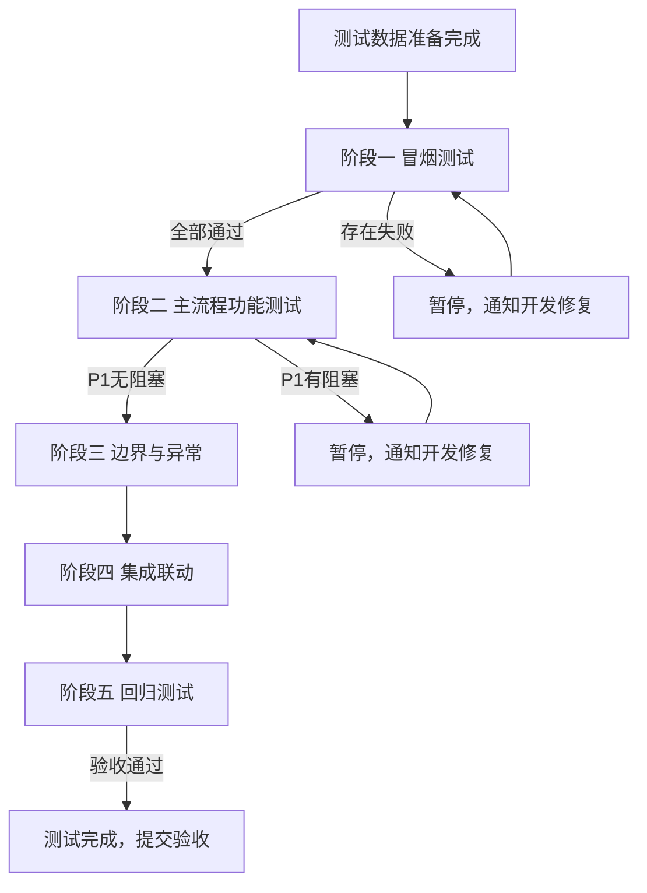

# 小程序测试策略

<!-- notion_page_id: e285667c-6d3a-8375-90be-01c3ce90b0ff -->

# 星联应急叫应平台小程序 · 整体测试策略
> **产品**：星联应急叫应平台（微信小程序端）<br>**关联 PRD**：星联应急叫应平台（合并版）PRD v1.1（2026-02-11）<br>**覆盖用例集**：`case/` 目录全量用例（US-101 / US-102 / US-007 / US-008 / US-010 / US-107 / US-107-B / US-SOS-LIST / COM-R / US-DEV-PKG-DISPLAY / US-PKG-MALL / US-MY-PKG / US-MY-ORDER）
---
## 一、文档信息
<table header-row="true">
<tr>
<td>项目</td>
<td>内容</td>
</tr>
<tr>
<td>文档版本</td>
<td>v1.0</td>
</tr>
<tr>
<td>编写人</td>
<td>QA</td>
</tr>
<tr>
<td>创建日期</td>
<td>2026-03-24</td>
</tr>
<tr>
<td>最近更新日期</td>
<td>2026-03-24</td>
</tr>
<tr>
<td>状态</td>
<td>草稿</td>
</tr>
</table>
### 参考文档
<table header-row="true">
<tr>
<td>文档</td>
<td>说明</td>
</tr>
<tr>
<td>星联应急叫应平台（合并版）PRD v1.1（2026-02-11）</td>
<td>产品需求主文档</td>
</tr>
<tr>
<td>`plan/sos-groupchat-plan_fa323615.plan.md`</td>
<td>求救群聊触发、拉群成员、状态流转规划</td>
</tr>
<tr>
<td>`plan/sos-msg-send-limits_27a0ad10.plan.md`</td>
<td>消息下发校验、扣费规则、设备队列状态机</td>
</tr>
<tr>
<td>`plan/sos-groupchat-group-management.plan.md`</td>
<td>群管理功能规划</td>
</tr>
<tr>
<td>`plan/sos-groupchat-list-rules.plan.md`</td>
<td>求救群聊列表规则</td>
</tr>
<tr>
<td>`plan/sos-groupchat-message-receipts.plan.md`</td>
<td>消息接收人列表与已读/未读回执规则</td>
</tr>
<tr>
<td>`plan/天通救援应急棒终端上报消息（语音 位置）.plan.md`</td>
<td>终端上报语音/位置的扣费与路由规则</td>
</tr>
<tr>
<td>`plan/聊天窗口消息接收规则梳理.plan.md`</td>
<td>聊天窗口消息接收矩阵</td>
</tr>
<tr>
<td>`plan/device-package-info-display.plan.md`</td>
<td>聊天室顶部套餐摘要与套餐信息模块设计规划</td>
</tr>
<tr>
<td>`plan/test-plan_device-package-info-display.md`</td>
<td>US-DEV-PKG-DISPLAY 专项测试计划</td>
</tr>
<tr>
<td>`plan/package-mall.plan.md`</td>
<td>套餐商城商品来源、分类、购买流程规划</td>
</tr>
<tr>
<td>`plan/my-package-page.plan.md`</td>
<td>我的套餐页面功能规划</td>
</tr>
<tr>
<td>`plan/我的信息 → 我的订单.plan.md`</td>
<td>我的订单功能规划</td>
</tr>
</table>
---
## 二、项目背景与测试目标
### 2.1 产品背景
星联应急叫应平台微信小程序，面向**天通应急救援终端**（以下简称”天通终端”）的持有者、关联账号及紧急联系人，提供：
- **应急通信**：普通通信（终端在线状态下的文本/语音下发）和**求救群聊**（SOS 触发后自动建群、全程协同救援）。
- **终端上报消息**：接收终端上报的语音短音与位置信息，并根据设备模式路由到对应聊天窗口。
- **账号与设备管理**：实名认证、设备绑定/解绑、紧急联系人配置。
- **套餐与商业化**：套餐商城购买、我的套餐管理、我的订单查询、聊天室内套餐余量实时展示。
> 其他设备类型（如北斗等）沿用旧有逻辑，非本次测试重点，但需在回归中验证兼容性不受破坏。
### 2.2 测试目标
1. 验证小程序各核心功能模块在主流程、边界场景及异常场景下的**正确性**。
2. 验证**跨模块联动**：设备状态变更 ↔︎ 群聊状态、消息队列状态 ↔︎ 套餐扣费/返还、绑定关系变更 ↔︎ 权限校验等。
3. 验证**多账号/多角色**下的数据隔离与权限边界（个人账号、企业账号、好友、紧急联系人）。
4. 验证**小程序端与 Web 端**核心业务逻辑一致，交互差异不引入功能缺陷。
5. 保障上线时 P1 用例 100% 通过、无阻塞/严重缺陷遗留。
---
## 三、测试范围
### 3.1 In Scope（本次测试覆盖）
<table header-row="true">
<tr>
<td>编号</td>
<td>功能模块</td>
<td>关联用例文件</td>
<td>主要验证内容</td>
</tr>
<tr>
<td>M1</td>
<td>实名认证（微信授权）</td>
<td>US-101</td>
<td>认证入口、认证状态、微信授权流程、拦截逻辑、企业账号展示差异</td>
</tr>
<tr>
<td>M2</td>
<td>绑定设备与紧急联系人</td>
<td>US-102</td>
<td>实名前置、扫码/手输设备 ID、紧急联系人增删改、验证码流程</td>
</tr>
<tr>
<td>M3</td>
<td>消息下发与限制规则（天通终端）</td>
<td>US-007</td>
<td>前置校验、权限路由、内容合法性、3 秒频率限制、扣费入队、队列状态机</td>
</tr>
<tr>
<td>M4</td>
<td>求救群聊触发与拉群</td>
<td>US-107</td>
<td>触发条件、设备类型校验、不重复建群、自动拉群算法、只增不减</td>
</tr>
<tr>
<td>M5</td>
<td>求救群聊系统消息与消息回执</td>
<td>US-107-B</td>
<td>系统消息展示、接收人列表、进入即读、发送者不计入、增量拉群不回写</td>
</tr>
<tr>
<td>M6</td>
<td>求救群聊群管理</td>
<td>US-008</td>
<td>成员展示、昵称编辑、手机号添加成员、救援完成权限、结束后只读</td>
</tr>
<tr>
<td>M7</td>
<td>求救群聊列表页</td>
<td>US-SOS-LIST</td>
<td>群名/状态标签/预览时间、未读计数、排序、仅设备 ID 搜索、空态</td>
</tr>
<tr>
<td>M8</td>
<td>聊天窗口消息接收规则</td>
<td>COM-R</td>
<td>天通终端普通通信 vs 求救群聊接收矩阵、救援完成后路由、其他设备类型差异</td>
</tr>
<tr>
<td>M9</td>
<td>终端上报消息（语音/位置）</td>
<td>US-010</td>
<td>上报类型校验、先用后扣/倒欠、1 小时报位窗口、路由分发、欠费限制</td>
</tr>
<tr>
<td>M10</td>
<td>聊天室顶部套餐摘要与套餐信息模块</td>
<td>US-DEV-PKG-DISPLAY</td>
<td>摘要展示格式/计算口径/倒欠、跳转差异（普通通信 vs 求救群聊）、明细页日志</td>
</tr>
<tr>
<td>M11</td>
<td>套餐商城</td>
<td>US-PKG-MALL</td>
<td>三大分类 Tab、分组/查看更多、购买条件校验、支付激活、异常边界</td>
</tr>
<tr>
<td>M12</td>
<td>我的套餐</td>
<td>US-MY-PKG</td>
<td>账号维度列表、筛选+设备 ID 组合、失效时间升序排序、卡片字段与进度条</td>
</tr>
<tr>
<td>M13</td>
<td>我的订单</td>
<td>US-MY-ORDER</td>
<td>订单列表/状态流转、待支付/超时取消、小程序 vs WEB 差异、软删除</td>
</tr>
</table>
### 3.2 Out of Scope（本次不覆盖）
<table header-row="true">
<tr>
<td>模块</td>
<td>说明</td>
</tr>
<tr>
<td>其他设备类型（北斗等）核心逻辑</td>
<td>沿用旧逻辑，本次仅做兼容性验证（不建求救群、不展示摘要栏等）</td>
</tr>
<tr>
<td>管理后台操作</td>
<td>套餐配置、上下架、后台退款等管理端功能由管理端测试计划覆盖</td>
</tr>
<tr>
<td>Web 端差异交互</td>
<td>侧边栏布局、多设备订单支付宝等 Web 独有交互，不在小程序测试范围内</td>
</tr>
<tr>
<td>自动化性能压测</td>
<td>本阶段以手工功能测试为主，性能基准测试待产品规模化后单独立项</td>
</tr>
<tr>
<td>TCP 协议底层测试</td>
<td>0x01/0x02/0x03/0x05 等协议层验证属于后端/协议集成测试，不在本计划范围</td>
</tr>
</table>
### 3.3 设备类型约束
当前版本以下功能**仅对「天通应急救援终端」生效**，其他类型设备需验证相关功能入口不展示/不生效：
- 求救群聊全链路（触发、建群、状态机）
- 聊天室顶部套餐摘要栏与套餐信息模块
- 消息队列状态机与短音扣费
---
## 四、测试策略
### 4.1 测试类型矩阵
<table header-row="true">
<tr>
<td>测试类型</td>
<td>预估占比</td>
<td>主要覆盖场景</td>
</tr>
<tr>
<td>功能测试</td>
<td>\~60%</td>
<td>各模块主流程正向场景（实名→绑定→通信→群聊→套餐购买与展示）</td>
</tr>
<tr>
<td>边界值测试</td>
<td>\~15%</td>
<td>0 余量、倒欠负数、充值恰好等于/小于倒欠、3 秒频率边界、10 秒回执超时、72 小时自动结束等</td>
</tr>
<tr>
<td>反向/异常测试</td>
<td>\~15%</td>
<td>无权限购买/下发、无效设备 ID、未实名、网络异常、重复操作、群聊已结束后仍尝试发消息等</td>
</tr>
<tr>
<td>集成/联动测试</td>
<td>\~7%</td>
<td>跨模块状态联动：解绑触发群结束、群结束触发消息取消+退费、套餐到期影响摘要展示等</td>
</tr>
<tr>
<td>易用性测试</td>
<td>\~3%</td>
<td>点击区域、Tab 切换流畅性、长文案截断、骨架屏/加载态/空态展示</td>
</tr>
</table>
### 4.2 优先级驱动策略
<table header-row="true">
<tr>
<td>优先级</td>
<td>定义</td>
<td>执行策略</td>
</tr>
<tr>
<td>P1</td>
<td>核心功能，失败直接阻塞发布</td>
<td>冒烟+主流程阶段全部通过，不允许任何失败</td>
</tr>
<tr>
<td>P2</td>
<td>重要功能，影响核心体验或商业化流程</td>
<td>主流程阶段执行，不可有严重级以上缺陷遗留</td>
</tr>
<tr>
<td>P3</td>
<td>优化项/易用性/边缘场景</td>
<td>边界阶段执行，允许带已知优化缺陷发布</td>
</tr>
</table>
### 4.3 测试分层架构
```plain text
┌─────────────────────────────────────────────────────────────────┐
│  E2E 主流程层（跨模块全链路）                                    │
│  · 账号注册→实名→绑设备→发消息→触发SOS→群聊→套餐购买→查看余量    │
│  · 救援完成全链路：结束群聊→消息取消→退费→摘要数值更新            │
├─────────────────────────────────────────────────────────────────┤
│  功能模块层（单模块正向/反向/边界）                               │
│  · 每个 M1–M13 模块独立覆盖，含 P1/P2/P3 用例                   │
│  · 聚焦模块内部逻辑、状态流转、数据展示正确性                    │
├─────────────────────────────────────────────────────────────────┤
│  接口/数据层（配合前端验证）                                      │
│  · 关键业务数据与接口返回交叉比对（如摘要数值=设备池汇总口径）    │
│  · 扣费/退费日志与明细页展示一致性                               │
│  · 状态机流转正确性（WAITING→PUSHING→UNREAD/READ/FAILED/CANCEL） │
└─────────────────────────────────────────────────────────────────┘
```
### 4.4 关键业务链路（冒烟路径）
以下 15 条路径构成冒烟测试主干，覆盖所有一级功能域：
<table header-row="true">
<tr>
<td>#</td>
<td>路径描述</td>
<td>覆盖模块</td>
</tr>
<tr>
<td>S1</td>
<td>个人账号完成微信实名认证，认证后状态变更正确</td>
<td>M1</td>
</tr>
<tr>
<td>S2</td>
<td>实名后扫码绑定天通终端，配置紧急联系人</td>
<td>M2</td>
</tr>
<tr>
<td>S3</td>
<td>主账号在普通通信窗口向天通终端发送文本，消息状态流转至”终端未读”</td>
<td>M3、M8</td>
</tr>
<tr>
<td>S4</td>
<td>天通终端触发 SOS，10 秒内自动建群并拉入主账号/企业账号/紧急联系人</td>
<td>M4</td>
</tr>
<tr>
<td>S5</td>
<td>求救群聊内多成员发送文本，消息可正常入队扣费并流转状态</td>
<td>M3、M4</td>
</tr>
<tr>
<td>S6</td>
<td>求救群聊列表页展示新群，群名/状态/预览/未读计数正确</td>
<td>M7</td>
</tr>
<tr>
<td>S7</td>
<td>主账号在群管理中点击”救援完成”，群状态变为只读，输入框置灰</td>
<td>M6、M4</td>
</tr>
<tr>
<td>S8</td>
<td>救援完成后”等待发送给终端”的消息被取消，额度按规则退还</td>
<td>M3</td>
</tr>
<tr>
<td>S9</td>
<td>天通终端上报语音短音，正确扣减套餐余量，路由到对应聊天窗口</td>
<td>M9</td>
</tr>
<tr>
<td>S10</td>
<td>求救群聊顶部展示套餐摘要，余量数值与设备池汇总口径一致</td>
<td>M10</td>
</tr>
<tr>
<td>S11</td>
<td>点击摘要跳转套餐信息模块，页面内容与各账号套餐数据一致</td>
<td>M10</td>
</tr>
<tr>
<td>S12</td>
<td>账号在套餐商城为天通终端购买短音套餐，支付成功后立即激活</td>
<td>M11</td>
</tr>
<tr>
<td>S13</td>
<td>购买成功后在「我的套餐」中可见新套餐卡片，字段与进度条正确</td>
<td>M12</td>
</tr>
<tr>
<td>S14</td>
<td>「我的订单」展示订单列表，待支付订单在 10 分钟内超时自动取消</td>
<td>M13</td>
</tr>
<tr>
<td>S15</td>
<td>非天通终端聊天窗口不展示套餐摘要栏</td>
<td>M10、M3</td>
</tr>
</table>
### 4.5 跨模块联动测试重点
以下联动场景是高风险区域，需专项设计集成测试用例：
<table header-row="true">
<tr>
<td>联动场景</td>
<td>涉及模块</td>
<td>测试要点</td>
</tr>
<tr>
<td>解绑”我的”标签设备 → 求救群状态变更</td>
<td>M2、M4、M6</td>
<td>解绑操作触发群状态→“救援完成”，输入框置灰，系统消息写入</td>
</tr>
<tr>
<td>求救群结束 → 消息队列取消 → 短音额度退还</td>
<td>M4、M3、M10</td>
<td>仅”等待发送”状态消息被取消，“发送中”继续流转，退还额度正确写入明细页</td>
</tr>
<tr>
<td>短音倒欠 → 充值新套餐 → 摘要数值恢复正常</td>
<td>M11、M10</td>
<td>新套餐激活后先清零倒欠再展示剩余，数值与后端接口口径一致</td>
</tr>
<tr>
<td>发送失败（R1 返还）→ 套餐过期时是否可用</td>
<td>M3、M10、M12</td>
<td>返还发生在套餐有效期内则额度可用；过期则不退，明细页写入正确日志</td>
</tr>
<tr>
<td>多账号共享设备池 → 各账号摘要/我的套餐差异</td>
<td>M10、M12</td>
<td>设备池汇总扣减全局可见，但”我的套餐”仅展示当前账号自己购买的订单</td>
</tr>
<tr>
<td>增量拉群 → 新成员消息回执不回写历史统计</td>
<td>M4、M5</td>
<td>新成员入群后，历史消息的”接收人”统计不重新计算，仅新增消息记入</td>
</tr>
</table>
### 4.6 反向用例覆盖重点
以下反向场景是缺陷高发区，每个模块均需显式覆盖：
- **权限类**：好友标签在普通通信窗口隐藏发送框、无绑定关系账号拒绝下发、紧急联系人无法结束救援。
- **状态类**：向”救援完成”群发消息被拦截、非天通终端不建群/不扣短音、重复触发群结束仅第一次生效。
- **数据类**：无效设备 ID 购买套餐被拒绝、无关联关系账号购买被拒绝、短音余额不足时下发失败不扣费。
- **网络类**：断网时摘要展示加载失败提示、支付超时自动取消订单、支付成功但激活回调延迟的最终补偿。
- **并发类**：短音余额仅剩 1 条时多用户并发下发，仅 1 条成功入队，其余返回余额不足。
---
## 五、各模块测试要点摘要
### M1 实名认证（US-101）
- 未认证时下发天通终端消息被拦截，前端引导完成实名。
- 企业账号无需实名，不受实名前置限制。
- 实名状态在账号维度持久化，不受设备绑定/解绑影响。
- 微信授权实名与手机号+身份证两种路径均需覆盖。
### M2 绑定设备与紧急联系人（US-102）
- 扫码/手输设备 ID 两种方式均需验证。
- 紧急联系人数量上限 3 个，超限不可保存。
- 绑定关系标签（我的/用的/好友）需覆盖权限差异场景。
- 解绑操作触发天通终端求救群自动结束（若有进行中的救援）。
### M3 消息下发与限制（US-007）
- 前置校验完整链路：设备类型 → 实名 → 关系权限 → 群状态 → 内容合法性 → 频率控制 → 余额校验。
- 文本 ≤ 60 字符物理限制与字符计数展示。
- 语音 \< 1 秒不发送，\> 10 秒自动截断，1–10 秒正常发送。
- 消息队列状态机六态流转（WAITING / PUSHING / UNREAD / READ / FAILED / CANCELLED）。
- R1 退费（10 秒超时失败）与 R2 退费（群结束取消）场景均需覆盖。
### M4 求救群聊触发与拉群（US-107）
- 仅天通应急救援终端触发 SOS 才创建求救群，其他设备不创建。
- 同一设备仅允许一个”救援中”群，重复报警不新建群。
- 拉群算法：个人主账号(A) + 最低等级企业账号(E) + 全部紧急联系人(C) + 设备虚拟成员(D)。
- 增量拉群：再次上报时差集补拉，只增不减。
- 四种触发”救援完成”路径：设备取消 SOS / 手动结束 / 72 小时无消息 / 主账号解绑”我的”设备。
### M5 消息回执与系统消息（US-107-B）
- 系统消息（成员入群、状态变更）UI 展示正确。
- 消息接收人列表展示对象为群内其他人类成员（排除发送者和设备虚拟成员）。
- 进入群聊即将该账号的全部未读标为已读。
- 增量拉入新成员后，历史消息接收人统计不回写。
### M6 群管理（US-008）
- 手机号添加成员流程（含非平台用户自动注册账号）。
- 昵称编辑：仅本人可编辑自己的群内昵称，2–10 字符。
- 结束救援权限：主账号/最低等级企业账号可操作，紧急联系人不可操作。
- 救援完成后群管理页面仅可查看（成员列表只读）。
### M7 求救群聊列表（US-SOS-LIST）
- 群名格式 `SOS-设备ID-四位序号`，状态标签（救援中/已结束）展示。
- 消息预览与时间展示口径（业务消息 vs 系统消息区分）。
- 未读计数准确，进入群聊后清零。
- 仅支持设备 ID 搜索，不支持群名搜索。
- 救援中群排列在已结束群之前。
### M8 聊天窗口消息接收规则（COM-R）
<table header-row="true">
<tr>
<td>账号关系</td>
<td>普通通信</td>
<td>求救群聊（救援中）</td>
<td>求救群聊（救援完成）</td>
</tr>
<tr>
<td>我的/用的</td>
<td>可收发</td>
<td>可收发</td>
<td>只读</td>
</tr>
<tr>
<td>好友</td>
<td>仅可收，不可发</td>
<td>可收发（被拉入后）</td>
<td>只读</td>
</tr>
<tr>
<td>无绑定</td>
<td>仅查看历史</td>
<td>不适用</td>
<td>不适用</td>
</tr>
</table>
- 位置消息不在聊天室展示，仅在地图/轨迹模块展示。
- 其他设备类型（非天通）按旧逻辑，好友可收发不受上述限制。
### M9 终端上报消息（US-010）
- 0x02 语音上报：先扣费后展示（允许倒欠）；倒欠时播放受限规则验证。
- 0x01 位置上报：1 小时窗口内只展示最新一条；超出窗口不计费。
- 上报消息按设备模式路由：求救模式→求救群聊，普通模式→普通通信。
- 欠费时后续上报的语音消息不播放/不下发，仅记录。
### M10 套餐摘要与套餐信息模块（US-DEV-PKG-DISPLAY）
- 摘要计算口径：设备维度所有生效中套餐余量汇总，非账号维度。
- 倒欠展示：负数 + “（欠费）”红色标识；充值后先清零倒欠再计算剩余。
- 普通通信点击摘要→套餐信息模块（仅套餐信息Tab）；求救群聊点击摘要→含群管理Tab。
- 套餐信息模块列表按失效时间升序排列，包含生效中和已失效。
- 明细页纯日志视图，包含正常扣减、R1 返还（发送失败）、R2 返还（群结束取消）条目。
### M11 套餐商城（US-PKG-MALL）
- 三大 Tab（组合套餐/短音套餐/报位置套餐），每组前 3 个商品 + “查看更多”。
- 购买前置：实名认证 + 输入关联设备 ID 校验。
- 微信支付唯一支付方式（小程序端）。
- 支付成功后立即激活，失效时间按日包/月包规则精确计算。
- 价格变更二次校验提示、商品下架后拒绝支付。
### M12 我的套餐（US-MY-PKG）
- 账号维度展示：仅当前账号自己购买的订单，与其他账号数据隔离。
- 状态筛选（全部/生效中/已失效）× 设备 ID 搜索，结果取交集。
- 进入页面默认重置筛选；Tab 内切换保留筛选状态。
- 套餐卡片展示”设备已消耗”（非购买者个人消耗），进度条不展示倒扣。
- 解绑设备后，该账号的历史套餐订单仍永久保留，数据持续更新。
### M13 我的订单（US-MY-ORDER）
- 订单状态：待支付/已支付/已取消，状态流转正确。
- 待支付订单 10 分钟超时自动取消。
- 小程序端订单仅展示单设备购买记录；Web 端支持多设备。
- 软删除：账号侧删除操作仅隐藏，不物理删除，跨端不可见。
---
## 六、测试环境
### 6.1 环境要求
<table header-row="true">
<tr>
<td>环境项</td>
<td>说明</td>
</tr>
<tr>
<td>小程序运行环境</td>
<td>微信开发者工具（真机调试模式）+ 真机设备（iOS / Android 各至少 1 台）</td>
</tr>
<tr>
<td>后端测试环境</td>
<td>套餐服务、设备服务、消息队列服务、认证服务均部署并稳定运行</td>
</tr>
<tr>
<td>天通终端硬件</td>
<td>至少 1 台可上电运行的天通应急救援终端（支持 SOS 触发、语音/位置上报）</td>
</tr>
<tr>
<td>非天通设备</td>
<td>至少 1 台其他类型设备（用于验证不建群/不展示摘要等隔离场景）</td>
</tr>
<tr>
<td>网络模拟工具</td>
<td>Charles / 微信开发者工具网络限速（用于弱网、断网场景）</td>
</tr>
<tr>
<td>时间快进接口（建议）</td>
<td>后端提供 Mock 时间接口，用于 R1/R2 退费竞态、套餐到期等时序敏感场景</td>
</tr>
</table>
### 6.2 账号矩阵
<table header-row="true">
<tr>
<td>账号标识</td>
<td>账号类型</td>
<td>与主测设备的关系</td>
<td>用途</td>
</tr>
<tr>
<td>账号A</td>
<td>个人</td>
<td>我的（设备所有者）</td>
<td>主操作账号，覆盖下发、购买套餐、结束救援等</td>
</tr>
<tr>
<td>账号B</td>
<td>个人</td>
<td>好友</td>
<td>验证好友权限、普通通信不可发送</td>
</tr>
<tr>
<td>账号C</td>
<td>个人</td>
<td>用的</td>
<td>验证”用的”关系下发权限</td>
</tr>
<tr>
<td>账号D</td>
<td>个人</td>
<td>无关联关系</td>
<td>验证无权限购买/下发被拒绝</td>
</tr>
<tr>
<td>账号E</td>
<td>个人</td>
<td>紧急联系人</td>
<td>验证紧急联系人入群、无结束救援权限</td>
</tr>
<tr>
<td>账号F</td>
<td>企业账号</td>
<td>我的（最低等级企业）</td>
<td>验证企业账号结束救援权限、无需实名</td>
</tr>
<tr>
<td>账号G</td>
<td>个人</td>
<td>新绑定（快照验证用）</td>
<td>验证绑定后快照生成与同步</td>
</tr>
</table>
### 6.3 设备矩阵
<table header-row="true">
<tr>
<td>设备标识</td>
<td>设备类型</td>
<td>用途</td>
</tr>
<tr>
<td>天通终端-主测</td>
<td>天通应急救援终端</td>
<td>所有天通相关场景的核心设备</td>
</tr>
<tr>
<td>天通终端-备用</td>
<td>天通应急救援终端</td>
<td>多设备池共享、套餐隔离场景</td>
</tr>
<tr>
<td>非天通设备-X</td>
<td>非天通类型</td>
<td>验证非天通设备不建群/不展示摘要等</td>
</tr>
</table>
---
## 七、测试数据预置
<table header-row="true">
<tr>
<td>#</td>
<td>数据场景</td>
<td>预置内容描述</td>
<td>关联模块</td>
</tr>
<tr>
<td>D1</td>
<td>主账号已完成实名认证</td>
<td>账号A 完成手机号+微信实名</td>
<td>M1、M3</td>
</tr>
<tr>
<td>D2</td>
<td>多关系绑定设置完成</td>
<td>账号 A（我的）/ B（好友）/ C（用的）/ E（紧急联系人）均与主测设备绑定</td>
<td>M2、M3</td>
</tr>
<tr>
<td>D3</td>
<td>单套餐正常余量</td>
<td>主测设备，1条生效中套餐，短音100条/报位8小时</td>
<td>M10、M12</td>
</tr>
<tr>
<td>D4</td>
<td>多套餐汇总</td>
<td>主测设备，套餐A（短音20条）+ 套餐B（短音15条）均生效中</td>
<td>M10</td>
</tr>
<tr>
<td>D5</td>
<td>短音/报位倒欠状态</td>
<td>主测设备，所有套餐失效，短音倒欠-3条、报位倒欠-2小时</td>
<td>M10、M9</td>
</tr>
<tr>
<td>D6</td>
<td>充值后倒欠待抵扣</td>
<td>短音倒欠-3条基础上新购短音10条并激活</td>
<td>M10、M11</td>
</tr>
<tr>
<td>D7</td>
<td>混合状态套餐列表</td>
<td>套餐A（生效中）+ 套餐B（生效中）+ 套餐C（已失效）</td>
<td>M10、M12</td>
</tr>
<tr>
<td>D8</td>
<td>明细页日志（含R1/R2返还）</td>
<td>3条正常扣除 + 1条发送失败R1已返还 + 1条群结束R2已返还</td>
<td>M10</td>
</tr>
<tr>
<td>D9</td>
<td>求救群聊进行中</td>
<td>主测设备触发SOS，群状态为”救援中”，已有消息记录</td>
<td>M4–M8</td>
</tr>
<tr>
<td>D10</td>
<td>待支付订单</td>
<td>账号A 已创建订单但未完成支付（10分钟超时场景备用）</td>
<td>M13</td>
</tr>
<tr>
<td>D11</td>
<td>设备池多账号共享</td>
<td>账号A + 账号B 均为主测设备购买了套餐，验证池内余量汇总</td>
<td>M10、M12</td>
</tr>
<tr>
<td>D12</td>
<td>账号解绑后快照持久化</td>
<td>账号A已解绑主测设备，仍在相关求救群聊中</td>
<td>M10</td>
</tr>
</table>
---
## 八、测试执行计划
### 8.1 阶段划分
```plain text
阶段一  冒烟测试（S1–S15）    ── 约 0.5 人天
阶段二  主流程功能测试         ── 约 5.0 人天
阶段三  边界与异常测试         ── 约 3.0 人天
阶段四  集成联动测试           ── 约 1.5 人天
阶段五  回归测试               ── 约 1.5 人天
━━━━━━━━━━━━━━━━━━━━━━━━━━━━━
合计                           ── 约 11.5 人天
```
### 8.2 各阶段详情
### 阶段一：冒烟测试（约 0.5 人天）
- **目标**：用最小代价确认核心路径可通，为后续阶段提供基线。
- **执行范围**：§4.4 冒烟路径 S1–S15 全部 15 条。
- **通过标准**：15 条全部通过，无 P1 失败。
- **阻塞条件**：任意冒烟用例失败则暂停后续阶段，通知开发修复后重新执行冒烟。
### 阶段二：主流程功能测试（约 5.0 人天）
- **目标**：完整覆盖 M1–M13 所有 P1 用例及 P2 正向路径。
- **执行顺序建议**（考虑前置依赖）：
	1. M1 实名认证（M2、M3 前置）
	2. M2 绑定设备与紧急联系人
	3. M3 消息下发与限制规则
	4. M4 求救群聊触发与拉群
	5. M5 消息回执与系统消息
	6. M6 群管理
	7. M7 求救群聊列表
	8. M8 聊天窗口消息接收规则
	9. M9 终端上报消息
	10. M10 套餐摘要与套餐信息模块（P1 全量）
	11. M11 套餐商城（P1 全量）
	12. M12 我的套餐（P1 全量）
	13. M13 我的订单（P1 全量）
### 阶段三：边界与异常测试（约 3.0 人天）
- **目标**：覆盖边界值、反向场景、P2 剩余用例及 P3 易用性用例。
- **重点场景**：
	- 短音余额刚好耗尽时的下发行为
	- 多用户并发下发余额仅剩 1 条
	- R1/R2 退费竞态时序（需时间 Mock 支持）
	- 充值恰好等于/小于倒欠金额
	- 网络异常下各模块降级处理
	- 价格变更/商品下架时的购买拦截
	- 72 小时无消息自动结束救援
### 阶段四：集成联动测试（约 1.5 人天）
- **目标**：验证 §4.5 跨模块联动场景的完整性与数据一致性。
- **执行范围**：6 个联动场景的专项测试，每个场景设计完整的前置→操作→验证链路。
### 阶段五：回归测试（约 1.5 人天）
- **目标**：验证缺陷修复效果，确保无新引入问题。
- **回归范围**：
	- 阻塞/严重缺陷：对应模块全量用例回归 + 冒烟路径全量回归。
	- 一般缺陷：仅回归触发缺陷的相关用例。
	- 发布前必执行一轮 S1–S15 冒烟回归。
### 8.3 执行顺序依赖关系

---
## 九、风险识别与缓解措施
<table header-row="true">
<tr>
<td>#</td>
<td>风险描述</td>
<td>影响范围</td>
<td>概率</td>
<td>严重度</td>
<td>缓解措施</td>
</tr>
<tr>
<td>R1</td>
<td>**天通终端硬件缺货或不稳定**</td>
<td>M3–M10 全量场景</td>
<td>中</td>
<td>高</td>
<td>提前申请备用终端；与研发沟通是否可 Mock 设备上报接口</td>
</tr>
<tr>
<td>R2</td>
<td>**R1/R2 退费竞态场景难构造**</td>
<td>M3、M10 返还逻辑</td>
<td>高</td>
<td>高</td>
<td>要求后端提供时间快进 Mock 接口；备选方案：排期真实等待（接受执行时间增加）</td>
</tr>
<tr>
<td>R3</td>
<td>**多模块并行开发时接口频繁变更**</td>
<td>全量模块</td>
<td>中</td>
<td>中</td>
<td>建立接口变更通知机制，测试用例与接口文档版本锁定；关键接口变更前提前评估影响范围</td>
</tr>
<tr>
<td>R4</td>
<td>**测试环境定时任务与生产不一致**</td>
<td>M4（72小时超时）、M11（套餐到期）</td>
<td>中</td>
<td>中</td>
<td>确认测试环境定时任务正常运行；紧急时使用后台手动触发状态变更</td>
</tr>
<tr>
<td>R5</td>
<td>**多账号/设备数据相互污染**</td>
<td>数据隔离类用例</td>
<td>中</td>
<td>中</td>
<td>每轮测试前按 §七 数据预置重置测试数据；账号与设备编号固定，避免临时数据干扰</td>
</tr>
<tr>
<td>R6</td>
<td>**微信支付沙盒环境与生产行为差异**</td>
<td>M11、M13</td>
<td>低</td>
<td>高</td>
<td>与后端确认沙盒支付回调机制；关键支付场景（掉单补偿）在预发布环境验证</td>
</tr>
<tr>
<td>R7</td>
<td>**存疑点未确认导致预期结果模糊**</td>
<td>M10（8 个存疑点）</td>
<td>中</td>
<td>中</td>
<td>测试启动前组织产品/研发澄清会，逐项确认后更新用例预期结果</td>
</tr>
<tr>
<td>R8</td>
<td>**多端状态同步延迟（小程序 vs Web）**</td>
<td>M4、M7、M13</td>
<td>中</td>
<td>低</td>
<td>明确接口推送策略（WebSocket/轮询间隔），测试中适当等待后再验证多端一致性</td>
</tr>
</table>
---
## 十、准入与准出标准
### 10.1 测试准入标准（各阶段开始前需满足）
<table header-row="true">
<tr>
<td>阶段</td>
<td>准入条件</td>
</tr>
<tr>
<td>冒烟测试</td>
<td>后端服务部署完成且健康检查通过；测试账号/设备矩阵准备完毕；冒烟用例设计完成</td>
</tr>
<tr>
<td>主流程测试</td>
<td>冒烟测试 15 条全部通过；M1–M13 用例设计审查完成；测试数据预置就绪</td>
</tr>
<tr>
<td>边界测试</td>
<td>主流程阶段所有 P1 用例通过，无阻塞缺陷遗留</td>
</tr>
<tr>
<td>集成测试</td>
<td>所有独立模块主流程 P1 通过；联动场景测试数据准备完毕</td>
</tr>
<tr>
<td>回归测试</td>
<td>阻塞/严重缺陷已修复并通过开发自测；修复版本已部署测试环境</td>
</tr>
</table>
### 10.2 测试准出标准（发布上线前需满足）
<table header-row="true">
<tr>
<td>条件</td>
<td>标准</td>
</tr>
<tr>
<td>P1 用例通过率</td>
<td>100%（全量 P1 用例通过）</td>
</tr>
<tr>
<td>P2 缺陷要求</td>
<td>无阻塞/严重级缺陷遗留；一般级缺陷可带条件发布（需产品确认）</td>
</tr>
<tr>
<td>P3 缺陷要求</td>
<td>可带已知 P3 缺陷发布，需在发布说明中列明</td>
</tr>
<tr>
<td>存疑点确认</td>
<td>所有待确认的设计存疑点已通过产品/研发澄清并更新至用例文档</td>
</tr>
<tr>
<td>回归通过率</td>
<td>阻塞/严重缺陷回归后对应模块 100% 通过</td>
</tr>
<tr>
<td>冒烟回归</td>
<td>发布前最后一次版本的 S1–S15 冒烟全部通过</td>
</tr>
</table>
---
## 十一、缺陷管理
### 11.1 缺陷严重级别定义
<table header-row="true">
<tr>
<td>级别</td>
<td>定义</td>
<td>示例</td>
</tr>
<tr>
<td>**阻塞**</td>
<td>P1 用例失败且无可绕过方案，功能完全不可用</td>
<td>SOS 触发后不建群；短音扣费后消息不入队；支付成功后套餐不激活</td>
</tr>
<tr>
<td>**严重**</td>
<td>P1 用例失败有绕过方案，或 P2 核心路径失败</td>
<td>消息状态机跳转错误；倒欠数值计算错误；群结束未取消等待队列</td>
</tr>
<tr>
<td>**一般**</td>
<td>P2 非核心路径失败，或 P3 场景失败</td>
<td>排序偶现不一致；骨架屏展示缺失；搜索结果不刷新</td>
</tr>
<tr>
<td>**提示**</td>
<td>易用性/文案/视觉问题，不影响功能</td>
<td>按钮文案大小写差异；数值较大时轻微截断；加载动画异常</td>
</tr>
</table>
### 11.2 缺陷回归策略
<table header-row="true">
<tr>
<td>缺陷级别</td>
<td>修复后回归范围</td>
</tr>
<tr>
<td>阻塞</td>
<td>对应模块全量用例 + 冒烟路径 S1–S15</td>
</tr>
<tr>
<td>严重</td>
<td>对应模块全量用例</td>
</tr>
<tr>
<td>一般</td>
<td>仅回归触发该缺陷的用例及直接相关联的用例</td>
</tr>
<tr>
<td>提示</td>
<td>仅验证该提示项修复结果</td>
</tr>
</table>
### 11.3 缺陷处理流程
```plain text
发现缺陷
  → 提交缺陷报告（含优先级/复现步骤/截图或录屏/版本信息）
  → 开发确认优先级并修复
  → QA 按 11.2 策略执行回归
  → 回归通过 → 关闭缺陷
  → 回归失败 → 重新打开，附加失败信息，通知开发
```
---
## 十二、交付物清单
<table header-row="true">
<tr>
<td>交付物</td>
<td>说明</td>
</tr>
<tr>
<td>**本测试策略文档**</td>
<td>`plan/test-strategy_miniprogram.md`，覆盖整体策略与执行规划</td>
</tr>
<tr>
<td>**各模块测试用例**</td>
<td>`case/` 目录下各 US 用例文件，每条用例标注执行结果（通过/失败/阻塞/跳过）</td>
</tr>
<tr>
<td>**US-DEV-PKG-DISPLAY 测试计划**</td>
<td>`plan/test-plan_device-package-info-display.md`，含详细数据预置与79条用例统计</td>
</tr>
<tr>
<td>**缺陷报告汇总**</td>
<td>按严重级别汇总的缺陷列表，含状态、修复版本、回归结果</td>
</tr>
<tr>
<td>**测试总结报告**</td>
<td>各阶段执行统计、缺陷分布分析、遗留风险说明、上线建议</td>
</tr>
</table>
