# 管理后台与监控平台 PRD（20260630 增量）

<!-- notion_page_id: f805667c-6d3a-8213-bcdd-818575659208 -->

## 文档元信息
<table header-row="true">
<tr>
<td>属性</td>
<td>值</td>
</tr>
<tr>
<td>**文档标题**</td>
<td>星联应急叫应平台 2 期 — 管理后台与监控平台 PRD（20260630 增量）</td>
</tr>
<tr>
<td>**文档版本**</td>
<td>v1.1</td>
</tr>
<tr>
<td>**创建日期**</td>
<td>2026-07-06</td>
</tr>
<tr>
<td>**最后更新**</td>
<td>2026-07-08</td>
</tr>
<tr>
<td>**文档状态**</td>
<td>草稿</td>
</tr>
<tr>
<td>**参与方**</td>
<td>产品、前端（管理后台/监控平台）、后端、测试、业务</td>
</tr>
<tr>
<td>**适用项目**</td>
<td>管理后台、监控平台（pg-podium-tdwt）</td>
</tr>
</table>
### 术语表
<table header-row="true">
<tr>
<td>术语</td>
<td>定义</td>
<td>数据类型</td>
<td>备注</td>
</tr>
<tr>
<td>入库分组（Inventory Group）</td>
<td>平台级设备分类标签，管理员入库设备时打上；一台设备只属于一个入库分组；不挂任何企业或账号；删除前需先移除全部设备</td>
<td>实体</td>
<td>与「账号分组」是两套独立共存体系</td>
</tr>
<tr>
<td>默认分组（Default Group）</td>
<td>系统内置的特殊入库分组，作为设备脱离原分组时的转移目标；不可删除</td>
<td>实体</td>
<td>删除自定义分组前的中转站</td>
</tr>
<tr>
<td>账号分组（Account Group）</td>
<td>账号下的设备组织单元，绑定设备到账号时指定；按账号维度查询</td>
<td>实体</td>
<td>与入库分组独立共存，绑定不改入库分组</td>
</tr>
<tr>
<td>设备激活（Device Activation）</td>
<td>天通救援棒（TT_RESCUE_STICK）特有生命周期事件：存 ICCID + 调天通平台 API 开通卫星通信能力</td>
<td>行为</td>
<td>其他设备类型不需激活；未激活无法通信</td>
</tr>
<tr>
<td>ICCID</td>
<td>天通 SIM 卡号</td>
<td>字符串</td>
<td>天通救援棒入库时必填</td>
</tr>
<tr>
<td>激活状态（三字段语义）</td>
<td>「状态」=整体激活状态；「激活结果」=最近一次激活操作结果；「状态明细」=天通平台推送的实时详细状态</td>
<td>复合</td>
<td>三字段独立，语义不同</td>
</tr>
<tr>
<td>入库状态</td>
<td>已入库 / 未入库</td>
<td>枚举</td>
<td>入库是进入平台前提</td>
</tr>
<tr>
<td>绑定状态</td>
<td>未绑定 / 已绑定到某账号</td>
<td>枚举</td>
<td>独立于入库与激活</td>
</tr>
<tr>
<td>设备状态（通信状态）</td>
<td>在线 / 离线</td>
<td>枚举</td>
<td>独立于上述三者</td>
</tr>
<tr>
<td>通信欠费（Communication Arrears）</td>
<td>企业设备套餐耗尽且企业一级账号星豆为 0 后继续通信产生的未付费资源消耗</td>
<td>度量</td>
<td>分短音欠费（条）、报位欠费（个）；个人设备不欠费</td>
</tr>
<tr>
<td>欠费账单（Arrears Bill）</td>
<td>按企业一级账号聚合的欠费记录</td>
<td>实体</td>
<td>含欠费状态、起止时间、处理说明、备注</td>
</tr>
<tr>
<td>报位</td>
<td>设备上报位置/报文，单位「个」</td>
<td>度量</td>
<td>原型图曾误写「报文」，已统一为「报位」</td>
</tr>
<tr>
<td>短音</td>
<td>短语音消息，单位「条」</td>
<td>度量</td>
<td>—</td>
</tr>
<tr>
<td>星豆</td>
<td>平台内虚拟资源，用于通信计费</td>
<td>度量</td>
<td>余额不记负数</td>
</tr>
<tr>
<td>默认分组转移</td>
<td>删除自定义入库分组前，把分组下设备移到默认分组的动作</td>
<td>行为</td>
<td>—</td>
</tr>
<tr>
<td>消息类型（Message Type）</td>
<td>监控平台消息列表的筛选维度，包含全部消息、求救群聊、对讲群聊、终端消息</td>
<td>枚举</td>
<td>默认显示「全部消息」</td>
</tr>
<tr>
<td>物理删除</td>
<td>从业务消息记录中删除且不可恢复</td>
<td>行为</td>
<td>删除前必须按消息类型弹窗确认</td>
</tr>
<tr>
<td>解绑风险控制</td>
<td>企业一级账号设备解绑前围绕欠费状态或费用责任进行拦截/确认的规则</td>
<td>行为</td>
<td>监控平台强拦截欠费设备；管理后台二次确认风险</td>
</tr>
</table>
## 项目概述
### 功能概述
本期（20260630 增量）在管理后台和监控平台新增/增强 **6 个模块**，串联起设备从入库、绑定、激活、通信消息到欠费与解绑风险控制的完整链路：
1. **入库管理增强**：新增「入库管理」一级菜单（分组管理 + 设备入库），分组管理用于维护平台级入库分组；设备入库列表新增 ICCID 字段、导出与模糊查询扩展。
2. **批量绑定弹窗增强**：在子终端管理的批量绑定弹窗左侧设备选择区，新增设备类型/入库分组筛选与分组名称模糊搜索。
3. **设备激活（天通救援棒）**：新增「设备激活」一级菜单，提供列表查看、单设备激活、按企业账号激活、批量激活四类操作；接入天通平台开通卫星通信能力。
4. **欠费账单管理**：新增「账单管理」一级菜单，按企业一级账号聚合展示欠费，支持线下核销（处理/结清）、欠费设备下钻、备注修改。
5. **监控平台消息列表合并与右键删除**：在监控平台将聊天消息与群聊/终端消息合并为一个 Tab，通过下拉筛选「全部消息 / 求救群聊 / 对讲群聊 / 终端消息」，默认展示全部消息；列表展示保持原有样式，统一支持右键删除。
6. **设备解绑风险控制**：监控平台企业一级账号解绑设备时，若本次解绑设备中存在欠费设备，则强拦截并提示先结清；管理后台企业一级账号解绑设备时，展示费用责任风险确认。
### 范围与排除项
**在范围内**：
- 上述 6 个模块在管理后台与监控平台侧的新增菜单、列表、弹窗、字段与交互
- 设备激活与天通平台 API 的对接（开通通信能力 + 接收状态明细推送）
- 欠费账单的线下手动核销流程（与 v2.2 线上自动冲抵并存）
- 个人账号绑定设备后由后台自动触发的激活逻辑（结果在管理后台展示）
- 监控平台消息列表合并、消息类型下拉筛选、按消息类型区分的右键物理删除确认
- 监控平台与管理后台针对企业一级账号设备解绑的欠费拦截和费用责任确认
**排除项**：
- v2.2 主文档已定义的管理后台既有功能（对讲群参数配置、星豆经济参数、套餐管理、订单统计 Dashboard 等）
- pg-podium-tdwt（监控平台 Web）侧除「消息列表合并与右键删除」「企业一级账号设备解绑欠费拦截」之外的其他新增功能；tdwt-applet（小程序）侧的批量绑定增强与自动激活触发实现（跨端协同，但本 PRD 不描述其实现）
- 线上自动冲抵清欠路径（v2.2 已定义，本期不重复）
- 设备类型扩展（仅覆盖天通救援棒的激活，其他设备类型激活不在本期）
## 用户与角色
### 用户分类
<table header-row="true">
<tr>
<td>用户类</td>
<td>特征描述</td>
<td>核心痛点</td>
<td>主要功能</td>
<td>技术熟练度</td>
</tr>
<tr>
<td>平台管理员（管理后台操作者）</td>
<td>唯一具备后台操作权限的角色；负责入库、分组维护、激活、欠费核销、后台解绑风险确认等运营动作</td>
<td>入库与激活分散、批量操作效率低、欠费线下核销无系统支撑、设备类型/分组筛选维度不足</td>
<td>管理后台入库、绑定、激活、欠费与解绑责任确认相关操作</td>
<td>中高</td>
</tr>
<tr>
<td>企业一级账号（运营/管理者视角）</td>
<td>企业主账号，名下设备产生通信欠费的承担主体；不直接操作管理后台，可在监控平台查看消息和解绑设备</td>
<td>欠费不透明、线下打款后核销状态不同步、欠费设备解绑责任不清</td>
<td>欠费账单列表的被聚合维度；监控平台消息列表与设备解绑操作者</td>
<td>中</td>
</tr>
<tr>
<td>企业二/三级账号（子账号视角）</td>
<td>企业下级账号，名下可绑有天通救援棒；按企业账号激活的搜索范围包含此层</td>
<td>设备激活只能逐台手工，缺少以账号为维度的批量入口</td>
<td>按企业账号激活弹窗的搜索/选择对象（非操作者）</td>
<td>—</td>
</tr>
<tr>
<td>个人账号（小程序扫码绑定者）</td>
<td>通过小程序扫码绑定设备的个人用户；绑定后天通救援棒自动激活</td>
<td>绑定后仍需手动激活的开销</td>
<td>触发后台自动激活（被动）</td>
<td>低</td>
</tr>
</table>
> **说明**：管理后台只有**超级管理员**一个账户，全部功能由其操作；其余三类用户是业务相关方（被聚合 / 被搜索 / 被动触发），不直接操作管理后台。因此本文档不设权限矩阵。
## 功能需求
### 需求关联总览
6 个模块串联起设备从入库到通信消息、欠费与解绑风险控制的完整链路：
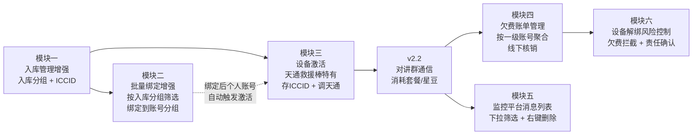
**核心关联点**：
- **入库分组 ↔︎ 批量绑定**：批量绑定弹窗左侧新增「入库分组」筛选（模块一提供分组数据，模块二消费）
- **入库 ICCID ↔︎ 设备激活**：入库时天通救援棒 ICCID 必填（模块一），激活时校验 ICCID 存在（模块三）
- **激活 ↔︎ 通信**：只有已激活的设备才能通信（v2.2 对讲群），通信产生计费/欠费
- **通信欠费 ↔︎ 欠费账单**：企业设备欠费（v2.2 定义）在模块四按一级账号聚合展示和线下核销
- **绑定 ↔︎ 激活**：绑定和激活相互独立，但个人账号绑定设备会**自动触发**激活（需求 #3.7）
- **通信消息 ↔︎ 消息列表合并**：监控平台将求救群聊、对讲群聊、终端消息统一到同一个消息 Tab，通过下拉筛选查看，默认展示全部消息
- **欠费账单 ↔︎ 设备解绑**：监控平台解绑本次选中设备时校验欠费设备并强拦截；管理后台解绑企业一级账号设备时进行费用责任风险确认
### 功能清单
<table header-row="true">
<tr>
<td>功能 ID</td>
<td>功能名称</td>
<td>所属模块</td>
<td>优先级</td>
<td>用户故事</td>
<td>验收标准关联</td>
</tr>
<tr>
<td>F-入库-01</td>
<td>分组管理（入库分组 CRUD）</td>
<td>模块一</td>
<td>P0</td>
<td>US-入库-01</td>
<td>AC-入库-01.1 \~ 01.7</td>
</tr>
<tr>
<td>F-入库-02</td>
<td>设备入库列表增强（ICCID + 导出）</td>
<td>模块一</td>
<td>P0</td>
<td>US-入库-02</td>
<td>AC-入库-02.1 \~ 02.5</td>
</tr>
<tr>
<td>F-绑定-01</td>
<td>批量绑定弹窗增强</td>
<td>模块二</td>
<td>P1</td>
<td>US-绑定-01</td>
<td>AC-绑定-01.1 \~ 01.5</td>
</tr>
<tr>
<td>F-激活-01</td>
<td>天通救援棒激活列表</td>
<td>模块三</td>
<td>P0</td>
<td>US-激活-01</td>
<td>AC-激活-01.1 \~ 01.7</td>
</tr>
<tr>
<td>F-激活-02</td>
<td>单设备激活</td>
<td>模块三</td>
<td>P0</td>
<td>US-激活-02</td>
<td>AC-激活-02.1 \~ 02.4</td>
</tr>
<tr>
<td>F-激活-03</td>
<td>按企业账号激活</td>
<td>模块三</td>
<td>P1</td>
<td>US-激活-03</td>
<td>AC-激活-03.1 \~ 03.4</td>
</tr>
<tr>
<td>F-激活-04</td>
<td>批量激活（模板导入）</td>
<td>模块三</td>
<td>P1</td>
<td>US-激活-04</td>
<td>AC-激活-04.1 \~ 04.3</td>
</tr>
<tr>
<td>F-欠费-01</td>
<td>欠费账单列表</td>
<td>模块四</td>
<td>P0</td>
<td>US-欠费-01</td>
<td>AC-欠费-01.1 \~ 01.7</td>
</tr>
<tr>
<td>F-欠费-02</td>
<td>欠费处理（线下核销）</td>
<td>模块四</td>
<td>P0</td>
<td>US-欠费-02</td>
<td>AC-欠费-02.1 \~ 02.3</td>
</tr>
<tr>
<td>F-欠费-03</td>
<td>欠费设备列表（下钻）</td>
<td>模块四</td>
<td>P0</td>
<td>US-欠费-03</td>
<td>AC-欠费-03.1 \~ 03.5</td>
</tr>
<tr>
<td>F-欠费-04</td>
<td>备注（新增/修改）</td>
<td>模块四</td>
<td>P1</td>
<td>US-欠费-04</td>
<td>AC-欠费-04.1 \~ 04.2</td>
</tr>
<tr>
<td>F-消息-01</td>
<td>监控平台消息列表合并与右键删除</td>
<td>模块五</td>
<td>P0</td>
<td>US-消息-01</td>
<td>AC-消息-01.1 \~ 01.7</td>
</tr>
<tr>
<td>F-解绑-01</td>
<td>监控平台设备解绑欠费拦截</td>
<td>模块六</td>
<td>P0</td>
<td>US-解绑-01</td>
<td>AC-解绑-01.1 \~ 01.5</td>
</tr>
<tr>
<td>F-解绑-02</td>
<td>管理后台设备解绑责任风险确认</td>
<td>模块六</td>
<td>P0</td>
<td>US-解绑-02</td>
<td>AC-解绑-02.1 \~ 02.4</td>
</tr>
</table>
### 用户故事
---
#### US-入库-01：分组管理（入库分组）
**描述**：作为平台管理员，我希望在「入库管理 → 分组管理」页面维护入库分组（增删改查），用于分类入库设备，便于按分组筛选与管理。
#### 前置条件
- 管理员已登录管理后台。
- 「入库管理」一级菜单及其下「分组管理」子菜单已配置。
- 系统已内置「默认分组」（不可删除、不可编辑名称）。
#### 触发条件
- 管理员点击左侧菜单「入库管理 → 分组管理」进入列表页。
- 在列表页执行新增/编辑/删除/查询/查看设备数量等操作。
#### 主流程（列表查看 + 新增分组）
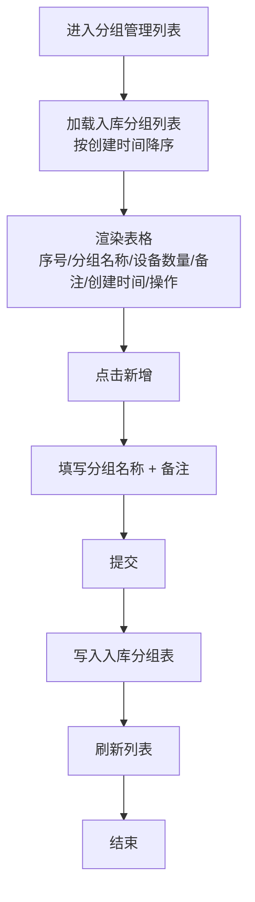
#### 分支流程/异常流程
<table header-row="true">
<tr>
<td>分支 ID</td>
<td>条件</td>
<td>流程</td>
</tr>
<tr>
<td>A1</td>
<td>点击「设备数量」数字</td>
<td>弹出该分组的入库设备列表弹窗，字段与设备入库列表一致；关闭弹窗返回列表</td>
</tr>
<tr>
<td>A2</td>
<td>点击「编辑」</td>
<td>仅分组名称与备注可编辑；其余字段只读；保存后更新记录</td>
</tr>
<tr>
<td>E1</td>
<td>删除分组时，分组下仍有入库设备</td>
<td>阻止删除，提示「分组下还有入库设备，不能删除」；用户需先移除分组下所有设备（两种方式：**删除入库设备** 或 **转移到其他分组**，含默认分组）后再删</td>
</tr>
<tr>
<td>E2</td>
<td>删除空分组</td>
<td>二次确认后删除，列表刷新</td>
</tr>
<tr>
<td>E3</td>
<td>删除「默认分组」</td>
<td>禁用操作按钮（默认分组不可删除）</td>
</tr>
<tr>
<td>E4</td>
<td>分组名称重复 / 为空</td>
<td>校验失败，提示具体原因，不提交</td>
</tr>
<tr>
<td>E5</td>
<td>模糊查询无结果</td>
<td>列表显示「暂无数据」</td>
</tr>
</table>
#### 验收标准
- [ ] AC-入库-01.1：「入库管理」一级菜单存在，含「分组管理」「设备入库」两个子菜单。
- [ ] AC-入库-01.2：分组列表展示 6 个字段（序号/分组名称/设备数量/备注/创建时间/操作），**无状态字段**。
- [ ] AC-入库-01.3：支持按分组名称/备注模糊查询。
- [ ] AC-入库-01.4：点击「设备数量」弹出该分组的入库设备列表，字段与设备入库列表一致。
- [ ] AC-入库-01.5：删除非空分组时提示「分组下还有入库设备，不能删除」，不执行删除；用户需先**移除分组下所有设备**（两种方式：**删除入库设备** / **转移到其他分组**，含默认分组）后再删。
- [ ] AC-入库-01.6：编辑只允许改分组名称和备注。
- [ ] AC-入库-01.7：按创建时间降序排列。
#### 字段规范（列表）
<table header-row="true">
<tr>
<td>字段名</td>
<td>标识</td>
<td>类型</td>
<td>长度/格式</td>
<td>必填</td>
<td>默认值</td>
<td>校验规则</td>
<td>显示方式</td>
<td>错误提示</td>
</tr>
<tr>
<td>序号</td>
<td>index</td>
<td>整数</td>
<td>—</td>
<td>—</td>
<td>自增</td>
<td>行号</td>
<td>文本</td>
<td>—</td>
</tr>
<tr>
<td>分组名称</td>
<td>groupName</td>
<td>字符串</td>
<td>1-50 字符</td>
<td>是</td>
<td>无</td>
<td>不允许重复；去除首尾空格后非空</td>
<td>文本</td>
<td>「分组名称已存在」/「分组名称不能为空」</td>
</tr>
<tr>
<td>设备数量</td>
<td>deviceCount</td>
<td>整数</td>
<td>≥0</td>
<td>—</td>
<td>0</td>
<td>系统统计该分组下入库设备数</td>
<td>可点击数字链接</td>
<td>—</td>
</tr>
<tr>
<td>备注</td>
<td>remark</td>
<td>字符串</td>
<td>0-200 字符</td>
<td>否</td>
<td>空</td>
<td>无</td>
<td>文本</td>
<td>—</td>
</tr>
<tr>
<td>创建时间</td>
<td>createTime</td>
<td>日期时间</td>
<td>YYYY-MM-DD HH\:mm\:ss</td>
<td>—</td>
<td>系统时间</td>
<td>—</td>
<td>文本</td>
<td>—</td>
</tr>
<tr>
<td>操作</td>
<td>—</td>
<td>—</td>
<td>—</td>
<td>—</td>
<td>—</td>
<td>—</td>
<td>编辑/删除按钮</td>
<td>—</td>
</tr>
</table>
#### 字段规范（新增/编辑表单）
<table header-row="true">
<tr>
<td>字段名</td>
<td>标识</td>
<td>类型</td>
<td>必填</td>
<td>默认值</td>
<td>校验规则</td>
<td>错误提示</td>
</tr>
<tr>
<td>分组名称</td>
<td>groupName</td>
<td>字符串</td>
<td>是</td>
<td>无</td>
<td>1-50 字符；同级唯一（不含默认分组）</td>
<td>「分组名称不能为空」/「分组名称已存在」</td>
</tr>
<tr>
<td>备注</td>
<td>remark</td>
<td>字符串</td>
<td>否</td>
<td>空</td>
<td>≤200 字符</td>
<td>—</td>
</tr>
</table>
#### 功能级业务规则
<table header-row="true">
<tr>
<td>规则 ID</td>
<td>规则名称</td>
<td>触发时机</td>
<td>规则描述</td>
<td>校验逻辑</td>
<td>错误提示</td>
<td>错误代码</td>
</tr>
<tr>
<td>BR-入库-01</td>
<td>分组非空校验</td>
<td>删除分组时</td>
<td>分组下必须无入库设备才能删除</td>
<td>`if deviceCount > 0 then reject`</td>
<td>「分组下还有入库设备，不能删除」</td>
<td>ERR_GROUP_NOT_EMPTY</td>
</tr>
<tr>
<td>BR-入库-02</td>
<td>默认分组保护</td>
<td>删除/重命名时</td>
<td>默认分组不可删除、不可重命名</td>
<td>`if group.isDefault then disable actions`</td>
<td>—</td>
<td>—</td>
</tr>
<tr>
<td>BR-入库-03</td>
<td>平台级共享</td>
<td>创建/查询时</td>
<td>入库分组是平台级的，不挂任何企业或账号，管理员全局可见</td>
<td>无企业维度过滤</td>
<td>—</td>
<td>—</td>
</tr>
<tr>
<td>BR-入库-04</td>
<td>设备归属唯一性</td>
<td>入库/转移时</td>
<td>一台设备同时只能属于一个入库分组</td>
<td>入库/转移时覆盖原分组字段</td>
<td>—</td>
<td>—</td>
</tr>
</table>
#### 数据流转
- **输入**：管理员在分组管理页输入分组名称、备注（新增/编辑）；删除时传入分组 ID。
- **处理**：
	- 新增：写入入库分组表，记录创建时间。
	- 编辑：更新分组名称、备注；不改动设备数量（系统统计）。
	- 删除：前置校验 `deviceCount = 0`；通过后从入库分组表删除记录。
	- 移除分组下设备（删除分组前用户手动操作，两种方式）：(a) **删除入库设备**——从入库设备表删除记录；(b) **转移到其他分组**（含默认分组）——批量更新设备的 `inventoryGroupId` 为目标分组 ID。
- **输出**：列表刷新展示最新数据；点击设备数量时按 `inventoryGroupId` 查询入库设备表并弹窗展示。
---
#### US-入库-02：设备入库列表增强（新增 ICCID 字段）
**描述**：作为平台管理员，我希望在「入库管理 → 设备入库」列表中查看和管理入库设备，本次新增 ICCID 字段以支持后续设备激活，并支持导出与 ICCID 模糊查询。
#### 前置条件
- 管理员已登录管理后台。
- 入库分组数据已存在（用于「分组」下拉筛选与入库表单选择）。
#### 触发条件
- 管理员点击「入库管理 → 设备入库」进入列表页。
- 在列表页执行入库/编辑/删除/导出/查询等操作。
#### 主流程（设备入库）
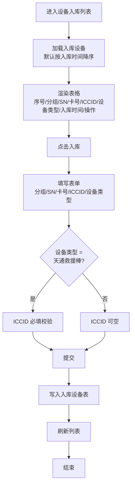
#### 分支流程/异常流程
<table header-row="true">
<tr>
<td>分支 ID</td>
<td>条件</td>
<td>流程</td>
</tr>
<tr>
<td>A1</td>
<td>点击「导出」</td>
<td>按当前筛选条件导出入库设备列表（Excel/CSV），文件名含导出时间</td>
</tr>
<tr>
<td>A2</td>
<td>模糊查询 ICCID</td>
<td>输入 ICCID 关键字，列表实时/回车后过滤</td>
</tr>
<tr>
<td>E1</td>
<td>天通救援棒入库时 ICCID 为空</td>
<td>校验失败，提示「天通救援棒的 ICCID 不能为空」，不提交</td>
</tr>
<tr>
<td>E2</td>
<td>其他设备类型 ICCID 为空</td>
<td>允许提交</td>
</tr>
<tr>
<td>E3</td>
<td>SN/卡号重复</td>
<td>校验失败，提示具体原因</td>
</tr>
</table>
#### 验收标准
- [ ] AC-入库-02.1：列表新增 ICCID 列，正确展示设备 ICCID（其他设备类型可为空展示）。
- [ ] AC-入库-02.2：模糊查询在原有基础上**新增对 ICCID 的模糊查询**。
- [ ] AC-入库-02.3：新增「导出」按钮，可按当前筛选条件导出列表。
- [ ] AC-入库-02.4：入库表单含 ICCID 字段；选择设备类型为天通救援棒时，ICCID 必填校验生效；其他类型允许为空。
- [ ] AC-入库-02.5：入库列表**不展示**激活状态/激活时间字段，也**不含设备状态字段**（激活属性只在「天通救援棒激活列表」展示；设备状态属于通信状态维度，不在入库列表展示）。
#### 字段规范（列表）
<table header-row="true">
<tr>
<td>字段名</td>
<td>标识</td>
<td>类型</td>
<td>长度/格式</td>
<td>必填</td>
<td>默认值</td>
<td>校验规则</td>
<td>显示方式</td>
<td>错误提示</td>
</tr>
<tr>
<td>序号</td>
<td>index</td>
<td>整数</td>
<td>—</td>
<td>—</td>
<td>自增</td>
<td>行号</td>
<td>文本</td>
<td>—</td>
</tr>
<tr>
<td>分组</td>
<td>inventoryGroupName</td>
<td>字符串</td>
<td>—</td>
<td>—</td>
<td>—</td>
<td>关联入库分组表</td>
<td>文本</td>
<td>—</td>
</tr>
<tr>
<td>SN</td>
<td>sn</td>
<td>字符串</td>
<td>1-50</td>
<td>是（入库时）</td>
<td>无</td>
<td>全局唯一</td>
<td>文本</td>
<td>「SN 已存在」</td>
</tr>
<tr>
<td>设备卡号</td>
<td>cardNo</td>
<td>字符串</td>
<td>1-50</td>
<td>是（入库时）</td>
<td>无</td>
<td>全局唯一</td>
<td>文本</td>
<td>「卡号已存在」</td>
</tr>
<tr>
<td>**ICCID**</td>
<td>iccid</td>
<td>字符串</td>
<td>1-32</td>
<td>**条件必填**</td>
<td>空</td>
<td>设备类型=天通救援棒时必填；建议数字+字母组合</td>
<td>文本</td>
<td>「天通救援棒的 ICCID 不能为空」</td>
</tr>
<tr>
<td>设备类型</td>
<td>deviceType</td>
<td>枚举</td>
<td>—</td>
<td>是</td>
<td>无</td>
<td>取值集（含 TT_RESCUE_STICK）</td>
<td>标签/下拉</td>
<td>—</td>
</tr>
<tr>
<td>入库时间</td>
<td>storageTime</td>
<td>日期时间</td>
<td>YYYY-MM-DD HH\:mm\:ss</td>
<td>—</td>
<td>系统时间</td>
<td>—</td>
<td>文本</td>
<td>—</td>
</tr>
<tr>
<td>操作</td>
<td>—</td>
<td>—</td>
<td>—</td>
<td>—</td>
<td>—</td>
<td>—</td>
<td>编辑/删除</td>
<td>—</td>
</tr>
</table>
#### 功能级业务规则
<table header-row="true">
<tr>
<td>规则 ID</td>
<td>规则名称</td>
<td>触发时机</td>
<td>规则描述</td>
<td>校验逻辑</td>
<td>错误提示</td>
<td>错误代码</td>
</tr>
<tr>
<td>BR-入库-05</td>
<td>ICCID 条件必填</td>
<td>入库提交时</td>
<td>设备类型 = TT_RESCUE_STICK 时 ICCID 必填；其他类型可空</td>
<td>`if deviceType == TT_RESCUE_STICK and isEmpty(iccid) then reject`</td>
<td>「天通救援棒的 ICCID 不能为空」</td>
<td>ERR_ICCID_REQUIRED</td>
</tr>
<tr>
<td>BR-入库-06</td>
<td>激活字段隔离</td>
<td>列表展示时</td>
<td>入库列表不展示激活状态、激活时间</td>
<td>字段不出现在列表元数据</td>
<td>—</td>
<td>—</td>
</tr>
<tr>
<td>BR-入库-07</td>
<td>导出范围</td>
<td>点击导出时</td>
<td>按当前筛选条件导出，非全量</td>
<td>拼接当前 query 参数</td>
<td>—</td>
<td>—</td>
</tr>
</table>
#### 数据流转
- **输入**：管理员在入库表单输入 SN、卡号、ICCID、设备类型、所属入库分组等。
- **处理**：
	- 入库：写入入库设备表，记录入库时间；天通救援棒校验 ICCID 非空。
	- 编辑：更新可编辑字段（含 ICCID，覆盖历史漏填场景）。
	- 导出：按当前筛选条件查询入库设备表，序列化为 Excel/CSV 输出。
	- 删除：从入库设备表移除（注意：删除后该设备若已激活/已绑定，需评估级联，本期不细化）。
- **输出**：列表展示入库记录；ICCID 数据后续被「天通救援棒激活列表」与「激活弹窗」消费。
---
#### US-绑定-01：批量绑定弹窗增强
**描述**：作为平台管理员，我希望在子终端管理的批量绑定弹窗中，通过设备类型、入库分组等条件更精确地筛选入库设备，提升批量绑定效率。
#### 适用范围说明
需求说明 #2 原文为「一级账号的设备管理页的批量绑定功能弹窗」。结合管理后台已有的 `inventoryBatchBind.vue`（管理员把入库设备绑定到指定账号），本需求的管理后台侧交付物是增强该组件。pg-podium-tdwt 一级账号侧的批量绑定增强不在本文档范围。
#### 入口
「账号管理 → 子终端管理 → 某账号 → 批量绑定」（对应组件 `inventoryBatchBind.vue`）。
#### 前置条件
- 管理员已登录管理后台。
- 已选择目标账号（绑定目标账号分组）。
- 入库设备数据已存在；入库分组数据已加载。
#### 触发条件
- 管理员在子终端管理点击「批量绑定」按钮，打开弹窗。
#### 当前实现现状（参考 `inventoryBatchBind.vue`）
- 左侧：入库设备树面板（`InventoryBindTreePanel`），选择入库设备。
- 右侧：目标分组下拉（账号分组，`getcommonGroups(account)`）、已选设备列表、搜索框。
- 流程：选入库设备 → 选目标账号分组 → 预检查（`postAccountDeviceBindCheck`）→ 确认弹窗 → 提交绑定（`postAccountDeviceBindConfirm`）。
#### 主流程（增强后）
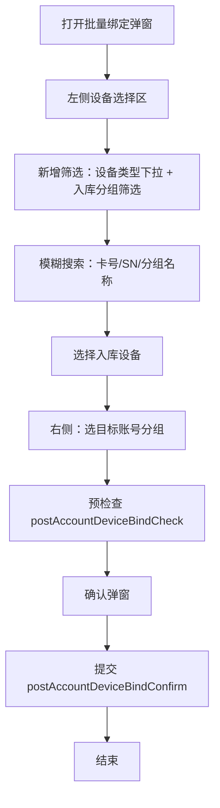
#### 分支流程/异常流程
<table header-row="true">
<tr>
<td>分支 ID</td>
<td>条件</td>
<td>流程</td>
</tr>
<tr>
<td>A1</td>
<td>选定某入库分组</td>
<td>该分组下设备**按入库时间降序**排列</td>
</tr>
<tr>
<td>A2</td>
<td>未选入库分组（其他/未分组设备）</td>
<td>默认排在最后</td>
</tr>
<tr>
<td>E1</td>
<td>模糊搜索关键字命中分组名称</td>
<td>同时按分组名称过滤设备</td>
</tr>
<tr>
<td>E2</td>
<td>右侧目标分组未选</td>
<td>提交按钮置灰</td>
</tr>
</table>
#### 验收标准
- [ ] AC-绑定-01.1：左侧设备选择区新增「设备类型」下拉筛选（天通救援棒/其他）。
- [ ] AC-绑定-01.2：左侧设备选择区新增「入库分组」筛选（注意：这里是**入库分组**，不是右侧的目标账号分组）。
- [ ] AC-绑定-01.3：分组内设备按入库时间降序，其他（未分组的）设备在最后。
- [ ] AC-绑定-01.4：模糊搜索支持卡号、SN、**分组名称**。
- [ ] AC-绑定-01.5：右侧「目标分组」（账号分组）逻辑不变。
#### 字段规范（左侧筛选/搜索）
<table header-row="true">
<tr>
<td>字段名</td>
<td>标识</td>
<td>类型</td>
<td>必填</td>
<td>默认值</td>
<td>校验规则</td>
<td>显示方式</td>
<td>错误提示</td>
</tr>
<tr>
<td>设备类型</td>
<td>deviceTypeFilter</td>
<td>枚举</td>
<td>否</td>
<td>全部</td>
<td>取值集（含 TT_RESCUE_STICK）</td>
<td>下拉</td>
<td>—</td>
</tr>
<tr>
<td>入库分组</td>
<td>inventoryGroupFilter</td>
<td>枚举</td>
<td>否</td>
<td>全部</td>
<td>关联入库分组表</td>
<td>下拉/树</td>
<td>—</td>
</tr>
<tr>
<td>模糊关键字</td>
<td>keyword</td>
<td>字符串</td>
<td>否</td>
<td>空</td>
<td>匹配卡号/SN/分组名称</td>
<td>输入框 + 搜索按钮</td>
<td>—</td>
</tr>
</table>
#### 功能级业务规则
<table header-row="true">
<tr>
<td>规则 ID</td>
<td>规则名称</td>
<td>触发时机</td>
<td>规则描述</td>
<td>校验逻辑</td>
<td>错误提示</td>
<td>错误代码</td>
</tr>
<tr>
<td>BR-绑定-01</td>
<td>两套分组共存</td>
<td>左侧筛选 + 右侧选择时</td>
<td>左侧筛选用「入库分组」（平台级），右侧选择「账号分组」（账号维度），两者独立共存不混淆</td>
<td>字段命名与查询接口分离</td>
<td>—</td>
<td>—</td>
</tr>
<tr>
<td>BR-绑定-02</td>
<td>入库时间排序</td>
<td>选定入库分组时</td>
<td>该分组下设备按入库时间降序</td>
<td>`order by storageTime desc`</td>
<td>—</td>
<td>—</td>
</tr>
<tr>
<td>BR-绑定-03</td>
<td>绑定参数不变</td>
<td>提交绑定时</td>
<td>提交参数仍为 `{ account, addrs, groupId }`，`groupId` 是目标账号分组，不受本次增强影响</td>
<td>接口签名不变</td>
<td>—</td>
<td>—</td>
</tr>
</table>
#### 数据流转
- **输入**：左侧筛选条件（设备类型、入库分组、模糊关键字）。
- **处理**：按筛选条件查询入库设备表，按入库时间降序返回；右侧选择目标账号分组后，预检查（重复绑定、容量等）→ 提交绑定。
- **输出**：成功绑定后，设备 `account` 字段更新为目标账号，`groupId` 更新为目标账号分组；入库分组属性不变。
---
#### US-激活-01：天通救援棒激活列表
**描述**：作为平台管理员，我希望在「设备激活 → 天通救援棒激活」列表中查看所有天通救援棒的激活状态，并对未激活/激活失败的设备执行激活操作。
#### 入口
「设备激活 → 天通救援棒激活」（左侧菜单新增一级菜单「设备激活」，下含「天通救援棒激活」子菜单）。
#### 前置条件
- 管理员已登录管理后台。
- 入库设备中存在设备类型 = 天通救援棒的记录。
#### 触发条件
- 管理员点击「设备激活 → 天通救援棒激活」进入列表页。
#### 主流程（列表查看）
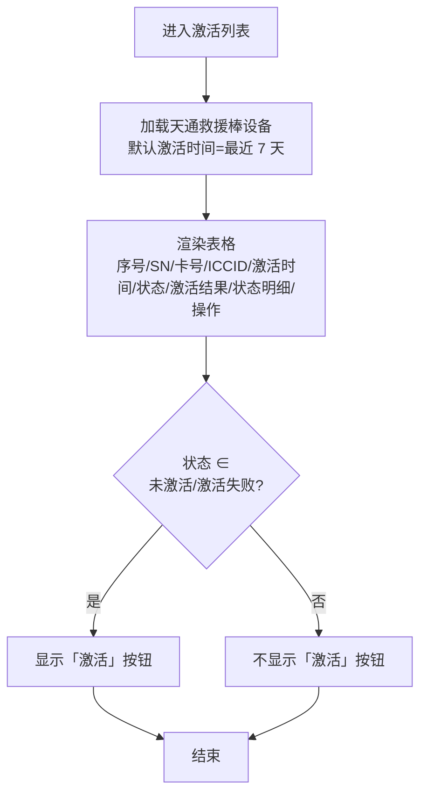
#### 分支流程/异常流程
<table header-row="true">
<tr>
<td>分支 ID</td>
<td>条件</td>
<td>流程</td>
</tr>
<tr>
<td>A1</td>
<td>顶部「按企业账号激活」</td>
<td>打开按企业账号激活弹窗（US-激活-03）</td>
</tr>
<tr>
<td>A2</td>
<td>顶部「批量激活」</td>
<td>打开批量激活弹窗（US-激活-04）</td>
</tr>
<tr>
<td>A3</td>
<td>行操作「激活」</td>
<td>打开单设备激活弹窗（US-激活-02）</td>
</tr>
<tr>
<td>E1</td>
<td>ICCID 未绑定 SN</td>
<td>「状态明细」字段不记录（保持空或显示「—」）</td>
</tr>
<tr>
<td>E2</td>
<td>天通平台未推送状态明细</td>
<td>「状态明细」默认显示「正常」</td>
</tr>
<tr>
<td>E3</td>
<td>模糊查询无结果</td>
<td>列表显示「暂无数据」</td>
</tr>
</table>
#### 验收标准
- [ ] AC-激活-01.1：「设备激活」菜单存在，含「天通救援棒激活」子菜单。
- [ ] AC-激活-01.2：列表只展示天通救援棒类型的设备。
- [ ] AC-激活-01.3：列表展示 9 列（序号/SN/卡号/ICCID/激活时间/状态/激活结果/状态明细/操作）。
- [ ] AC-激活-01.4：模糊查询支持 SN/卡号/ICCID。
- [ ] AC-激活-01.5：激活时间默认筛选「最近 7 天」。
- [ ] AC-激活-01.6：状态明细默认「正常」，由天通平台推送更新；ICCID 未绑定 SN 时不记录。
- [ ] AC-激活-01.7：未激活/激活失败的设备显示「激活」按钮；已激活/激活中不显示。
#### 字段规范（列表）
<table header-row="true">
<tr>
<td>字段名</td>
<td>标识</td>
<td>类型</td>
<td>必填</td>
<td>默认值</td>
<td>校验规则</td>
<td>显示方式</td>
<td>错误提示</td>
</tr>
<tr>
<td>序号</td>
<td>index</td>
<td>整数</td>
<td>—</td>
<td>自增</td>
<td>行号</td>
<td>文本</td>
<td>—</td>
</tr>
<tr>
<td>设备 SN</td>
<td>sn</td>
<td>字符串</td>
<td>—</td>
<td>—</td>
<td>关联入库设备</td>
<td>文本</td>
<td>—</td>
</tr>
<tr>
<td>设备卡号</td>
<td>cardNo</td>
<td>字符串</td>
<td>—</td>
<td>—</td>
<td>关联入库设备</td>
<td>文本</td>
<td>—</td>
</tr>
<tr>
<td>ICCID</td>
<td>iccid</td>
<td>字符串</td>
<td>—</td>
<td>—</td>
<td>天通救援棒必有</td>
<td>文本</td>
<td>—</td>
</tr>
<tr>
<td>激活时间</td>
<td>activationTime</td>
<td>日期时间</td>
<td>—</td>
<td>空</td>
<td>最近一次激活操作时间</td>
<td>文本</td>
<td>—</td>
</tr>
<tr>
<td>状态</td>
<td>activationStatus</td>
<td>枚举</td>
<td>—</td>
<td>未激活</td>
<td>未激活/激活中/已激活/激活失败</td>
<td>状态标签</td>
<td>—</td>
</tr>
<tr>
<td>激活结果</td>
<td>activationResult</td>
<td>字符串</td>
<td>—</td>
<td>空</td>
<td>成功 / 具体失败原因</td>
<td>文本</td>
<td>—</td>
</tr>
<tr>
<td>状态明细</td>
<td>statusDetail</td>
<td>字符串</td>
<td>—</td>
<td>正常</td>
<td>由天通平台推送；ICCID 未绑定 SN 则不记录</td>
<td>文本</td>
<td>—</td>
</tr>
<tr>
<td>操作</td>
<td>—</td>
<td>—</td>
<td>—</td>
<td>—</td>
<td>—</td>
<td>激活按钮（条件显示）</td>
<td>—</td>
</tr>
</table>
#### 功能级业务规则
<table header-row="true">
<tr>
<td>规则 ID</td>
<td>规则名称</td>
<td>触发时机</td>
<td>规则描述</td>
<td>校验逻辑</td>
<td>错误提示</td>
<td>错误代码</td>
</tr>
<tr>
<td>BR-激活-01</td>
<td>数据范围限定</td>
<td>列表查询时</td>
<td>只展示设备类型 = 天通救援棒的设备</td>
<td>`where deviceType = TT_RESCUE_STICK`</td>
<td>—</td>
<td>—</td>
</tr>
<tr>
<td>BR-激活-02</td>
<td>失败也生成记录</td>
<td>激活操作完成时</td>
<td>激活失败也生成一条激活记录，便于追溯</td>
<td>写入激活记录表（含失败原因）</td>
<td>—</td>
<td>—</td>
</tr>
<tr>
<td>BR-激活-03</td>
<td>状态明细异步推送</td>
<td>接收天通推送时</td>
<td>状态明细由天通（天翼）平台异步推送；管理后台不主动查询，只接收和展示</td>
<td>监听推送回调，更新 `statusDetail`</td>
<td>—</td>
<td>—</td>
</tr>
<tr>
<td>BR-激活-04</td>
<td>状态明细绑定约束</td>
<td>接收推送时</td>
<td>ICCID 未绑定 SN 时不记录状态明细</td>
<td>`if iccid not bound to sn then skip`</td>
<td>—</td>
<td>—</td>
</tr>
<tr>
<td>BR-激活-05</td>
<td>默认状态明细</td>
<td>列表展示时</td>
<td>状态明细默认「正常」</td>
<td>字段默认值</td>
<td>—</td>
<td>—</td>
</tr>
</table>
#### 数据流转
- **输入**：管理员进入列表；筛选条件（SN/卡号/ICCID、激活时间范围）。
- **处理**：从入库设备表筛选天通救援棒，左联激活记录表（取最近一次激活）与状态明细表（取天通推送的最新值）。
- **输出**：列表展示设备激活属性；激活操作跳转到 US-激活-02。
---
#### US-激活-02：单设备激活
**描述**：作为平台管理员，我希望通过卡号、SN 或 ICCID 定位设备并执行激活，激活时调用天通平台开通通信能力。
#### 入口
激活列表（US-激活-01）行操作「激活」按钮。
#### 前置条件
- 设备已入库（出现在入库设备表）。
- 设备类型 = 天通救援棒。
- 设备已有 ICCID（正常流程：入库时已录入；异常兜底：本弹窗补填）。
#### 触发条件
- 管理员在激活列表点击行操作「激活」按钮；或
- 个人账号扫码绑定设备后由后台**自动触发**（需求 #3.7，跨端：绑定发生在小程序/监控平台，结果在管理后台展示）。
#### 主流程
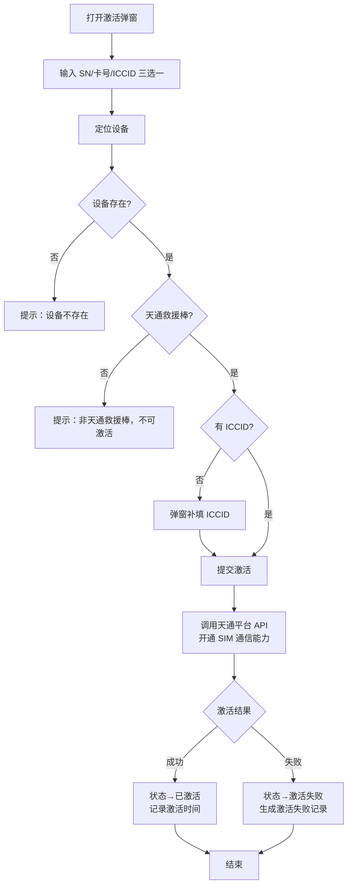
#### 分支流程/异常流程
<table header-row="true">
<tr>
<td>分支 ID</td>
<td>条件</td>
<td>流程</td>
</tr>
<tr>
<td>A1</td>
<td>已激活设备再次激活</td>
<td>允许重新激活（无次数限制）</td>
</tr>
<tr>
<td>E1</td>
<td>设备不存在</td>
<td>提示「设备不存在」，不进入激活流程</td>
</tr>
<tr>
<td>E2</td>
<td>非天通救援棒</td>
<td>提示「非天通救援棒，不可激活」</td>
</tr>
<tr>
<td>E3</td>
<td>缺少 ICCID 且未补填</td>
<td>提示「缺少 ICCID，请先补充」；管理员在 ICCID 框补填后才能提交</td>
</tr>
<tr>
<td>E4</td>
<td>天通平台 API 调用失败</td>
<td>生成激活失败记录，记录失败原因；可重新激活</td>
</tr>
<tr>
<td>E5</td>
<td>个人账号扫码绑定后自动触发</td>
<td>后台自动走该流程，不需要管理员介入</td>
</tr>
</table>
#### 验收标准
- [ ] AC-激活-02.1：弹窗含 SN/卡号/ICCID 三个输入框，任填一个可定位设备。
- [ ] AC-激活-02.2：激活前执行三项前提判断（设备存在 / 天通救援棒 / 有 ICCID），不满足时提示**具体原因**（不是笼统的「激活失败」）。
- [ ] AC-激活-02.3：激活成功后状态变为已激活，记录激活时间。
- [ ] AC-激活-02.4：激活失败也生成一条激活记录（含失败原因），可重新激活；无重新激活次数限制。
#### 字段规范（激活弹窗）
<table header-row="true">
<tr>
<td>字段名</td>
<td>标识</td>
<td>类型</td>
<td>必填</td>
<td>默认值</td>
<td>校验规则</td>
<td>显示方式</td>
<td>错误提示</td>
</tr>
<tr>
<td>设备 SN</td>
<td>sn</td>
<td>字符串</td>
<td>三选一</td>
<td>空</td>
<td>任一非空即可定位设备</td>
<td>输入框</td>
<td>—</td>
</tr>
<tr>
<td>设备卡号</td>
<td>cardNo</td>
<td>字符串</td>
<td>三选一</td>
<td>空</td>
<td>任一非空即可定位设备</td>
<td>输入框</td>
<td>—</td>
</tr>
<tr>
<td>ICCID</td>
<td>iccid</td>
<td>字符串</td>
<td>三选一 / 补填</td>
<td>空</td>
<td>定位后若设备无 ICCID，本框必填</td>
<td>输入框</td>
<td>「缺少 ICCID，请先补充」</td>
</tr>
</table>
#### 功能级业务规则
<table header-row="true">
<tr>
<td>规则 ID</td>
<td>规则名称</td>
<td>触发时机</td>
<td>规则描述</td>
<td>校验逻辑</td>
<td>错误提示</td>
<td>错误代码</td>
</tr>
<tr>
<td>BR-激活-06</td>
<td>三选一定位</td>
<td>提交前</td>
<td>SN/卡号/ICCID 任一非空即可定位设备</td>
<td>`if sn or cardNo or iccid not empty then locate`</td>
<td>「请至少填写一个标识」</td>
<td>ERR_NO_IDENTIFIER</td>
</tr>
<tr>
<td>BR-激活-07</td>
<td>三项前提判断</td>
<td>激活前</td>
<td>设备存在 + 类型为天通救援棒 + 有 ICCID</td>
<td>依次校验，失败给出具体原因</td>
<td>见 E1/E2/E3</td>
<td>ERR_DEVICE_NOT_FOUND / ERR_NOT_RESCUE_STICK / ERR_ICCID_MISSING</td>
</tr>
<tr>
<td>BR-激活-08</td>
<td>自动触发</td>
<td>个人账号绑定时</td>
<td>个人账号扫码绑定设备后，后台自动触发激活，不区分设备是否属于企业账号</td>
<td>绑定回调里触发</td>
<td>—</td>
<td>—</td>
</tr>
<tr>
<td>BR-激活-09</td>
<td>重新激活无限制</td>
<td>激活失败后</td>
<td>失败后可自由重新激活，无次数/时间限制</td>
<td>不做次数校验</td>
<td>—</td>
<td>—</td>
</tr>
</table>
#### 数据流转
- **输入**：管理员输入 SN/卡号/ICCID（任一）+ 必要时补填 ICCID。
- **处理**：
	- 定位设备 → 三项前提判断 → 调用天通平台 API 开通 SIM 通信能力。
	- 写入/更新激活记录：状态、激活结果、激活时间。
	- 失败也写入激活记录（含失败原因），便于追溯。
- **输出**：列表刷新展示最新状态；状态明细待天通平台异步推送后更新。
---
#### US-激活-03：按企业账号激活
**描述**：作为平台管理员，我希望以企业账号为维度，批量激活某账号名下的天通救援棒，适合「某企业刚采购一批设备，统一激活」的场景。
#### 入口
激活列表（US-激活-01）顶部「按企业账号激活」按钮。
#### 前置条件
- 管理员已登录管理后台。
- 存在企业一/二/三级账号数据。
#### 触发条件
- 管理员点击激活列表顶部「按企业账号激活」按钮。
#### 主流程
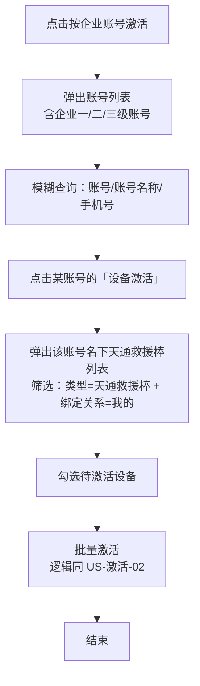
#### 分支流程/异常流程
<table header-row="true">
<tr>
<td>分支 ID</td>
<td>条件</td>
<td>流程</td>
</tr>
<tr>
<td>A1</td>
<td>账号名下无天通救援棒</td>
<td>设备列表显示「暂无数据」</td>
</tr>
<tr>
<td>E1</td>
<td>部分设备激活失败</td>
<td>逐台独立处理，失败设备生成激活失败记录；不影响其他设备</td>
</tr>
<tr>
<td>E2</td>
<td>模糊查询无结果</td>
<td>账号列表显示「暂无数据」</td>
</tr>
</table>
#### 验收标准
- [ ] AC-激活-03.1：账号列表含企业**一到三级**账号数据。
- [ ] AC-激活-03.2：模糊查询支持账号/账号名称/手机号。
- [ ] AC-激活-03.3：点击「设备激活」弹出该账号名下的天通救援棒（设备类型=天通救援棒 + 绑定关系=我的）。
- [ ] AC-激活-03.4：批量激活逻辑同 US-激活-02（含三项前提判断 + 失败也生成记录）。
#### 字段规范（账号列表弹窗）
<table header-row="true">
<tr>
<td>字段名</td>
<td>标识</td>
<td>类型</td>
<td>必填</td>
<td>默认值</td>
<td>校验规则</td>
<td>显示方式</td>
<td>错误提示</td>
</tr>
<tr>
<td>账号</td>
<td>account</td>
<td>字符串</td>
<td>—</td>
<td>—</td>
<td>企业一/二/三级账号</td>
<td>文本</td>
<td>—</td>
</tr>
<tr>
<td>账号名称</td>
<td>accountName</td>
<td>字符串</td>
<td>—</td>
<td>—</td>
<td>—</td>
<td>文本</td>
<td>—</td>
</tr>
<tr>
<td>手机号码</td>
<td>mobile</td>
<td>字符串</td>
<td>—</td>
<td>—</td>
<td>手机号格式</td>
<td>文本</td>
<td>—</td>
</tr>
<tr>
<td>操作</td>
<td>—</td>
<td>—</td>
<td>—</td>
<td>—</td>
<td>—</td>
<td>设备激活按钮</td>
<td>—</td>
</tr>
</table>
#### 功能级业务规则
<table header-row="true">
<tr>
<td>规则 ID</td>
<td>规则名称</td>
<td>触发时机</td>
<td>规则描述</td>
<td>校验逻辑</td>
<td>错误提示</td>
<td>错误代码</td>
</tr>
<tr>
<td>BR-激活-10</td>
<td>账号层级范围</td>
<td>账号列表查询时</td>
<td>包含企业一级、二级、三级账号</td>
<td>`where accountType in (1,2,3) and isEnterprise`</td>
<td>—</td>
<td>—</td>
</tr>
<tr>
<td>BR-激活-11</td>
<td>绑定关系=我的</td>
<td>设备列表筛选时</td>
<td>**只含直接绑定到该账号的设备，不含其下级账号的设备**</td>
<td>`where device.account = currentAccount`</td>
<td>—</td>
<td>—</td>
</tr>
<tr>
<td>BR-激活-12</td>
<td>与欠费账单维度差异</td>
<td>—</td>
<td>按企业账号激活可针对一到三级任意层级；欠费账单只按一级聚合；两者账号维度不同</td>
<td>—</td>
<td>—</td>
<td>—</td>
</tr>
</table>
#### 数据流转
- **输入**：管理员选择账号 → 选择该账号名下天通救援棒。
- **处理**：按「设备类型=天通救援棒 + 绑定关系=我的」筛选；逐台执行 US-激活-02 的激活逻辑（含前提判断 + 调天通 API）。
- **输出**：批量激活结果（每台成功/失败）；列表刷新展示最新状态。
---
#### US-激活-04：批量激活（模板导入）
**描述**：作为平台管理员，我希望通过下载模板、批量填写设备标识、上传后批量激活，适合大批量设备的一次性激活。
#### 入口
激活列表（US-激活-01）顶部「批量激活」按钮。
#### 前置条件
- 管理员已登录管理后台。
#### 触发条件
- 管理员点击激活列表顶部「批量激活」按钮。
#### 主流程
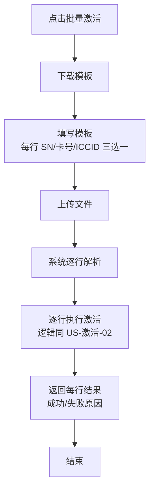
#### 分支流程/异常流程
<table header-row="true">
<tr>
<td>分支 ID</td>
<td>条件</td>
<td>流程</td>
</tr>
<tr>
<td>E1</td>
<td>部分行失败</td>
<td>逐行独立处理，失败行生成激活失败记录；不影响其他行</td>
</tr>
<tr>
<td>E2</td>
<td>文件格式错误</td>
<td>整体拒绝，提示具体格式问题</td>
</tr>
<tr>
<td>E3</td>
<td>模板字段缺失（整行三标识皆空）</td>
<td>该行跳过，结果中标记「未填写标识」</td>
</tr>
</table>
#### 验收标准
- [ ] AC-激活-04.1：提供模板下载。
- [ ] AC-激活-04.2：模板只需填 SN/卡号/ICCID **三选一**。
- [ ] AC-激活-04.3：批量上传后逐行激活，返回每行结果（成功/失败原因）。
#### 功能级业务规则
<table header-row="true">
<tr>
<td>规则 ID</td>
<td>规则名称</td>
<td>触发时机</td>
<td>规则描述</td>
<td>校验逻辑</td>
<td>错误提示</td>
<td>错误代码</td>
</tr>
<tr>
<td>BR-激活-13</td>
<td>三选一模板规则</td>
<td>解析每行时</td>
<td>每行只需 SN/卡号/ICCID 任一非空</td>
<td>`if any(sn,cardNo,iccid) not empty`</td>
<td>「第 N 行未填写任何标识」</td>
<td>ERR_ROW_NO_IDENTIFIER</td>
</tr>
<tr>
<td>BR-激活-14</td>
<td>逐行独立</td>
<td>批量激活时</td>
<td>部分行失败不影响其他行</td>
<td>每行独立 try/catch</td>
<td>—</td>
<td>—</td>
</tr>
<tr>
<td>BR-激活-15</td>
<td>单行激活逻辑同单设备</td>
<td>每行激活时</td>
<td>含三项前提判断 + 调天通 API + 失败也生成记录（同 US-激活-02）</td>
<td>复用 BR-激活-07/08</td>
<td>—</td>
<td>—</td>
</tr>
</table>
#### 数据流转
- **输入**：管理员上传填好的模板文件（SN/卡号/ICCID 列）。
- **处理**：逐行解析 → 逐行执行 US-激活-02 激活逻辑（含前提判断）。
- **输出**：返回导入结果报表（每行成功/失败原因 + 失败原因明细）。
---
#### US-消息-01：监控平台消息列表合并与右键删除
**描述**：作为监控平台企业一级账号用户，我希望在同一个消息 Tab 中查看全部消息，并可通过下拉筛选求救群聊、对讲群聊、终端消息，列表展示沿用原有样式，同时支持对任意消息右键删除。
#### 入口
监控平台消息列表 Tab（原聊天消息、求救群聊等消息入口合并到同一个 Tab）。
#### 前置条件
- 用户已登录监控平台。
- 当前账号存在求救群聊、对讲群聊或终端消息中的至少一种历史消息。
- 系统可按消息记录识别实际消息类型：求救群聊 / 对讲群聊 / 终端消息。
#### 触发条件
- 用户进入监控平台消息列表 Tab。
- 用户切换消息类型下拉筛选项。
- 用户在消息列表中右键点击某条消息并选择「删除」。
#### 主流程
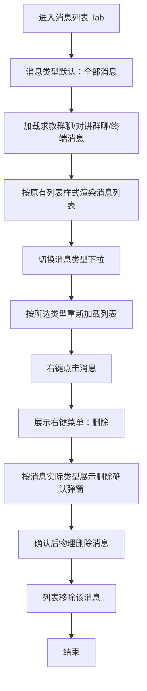
#### 分支流程/异常流程
<table header-row="true">
<tr>
<td>分支 ID</td>
<td>条件</td>
<td>流程</td>
</tr>
<tr>
<td>A1</td>
<td>下拉选择「全部消息」</td>
<td>展示求救群聊、对讲群聊、终端消息的合并列表，列表展示仍沿用原有样式</td>
</tr>
<tr>
<td>A2</td>
<td>下拉选择「求救群聊」</td>
<td>仅展示求救群聊消息</td>
</tr>
<tr>
<td>A3</td>
<td>下拉选择「对讲群聊」</td>
<td>仅展示对讲群聊消息</td>
</tr>
<tr>
<td>A4</td>
<td>下拉选择「终端消息」</td>
<td>仅展示终端消息</td>
</tr>
<tr>
<td>A5</td>
<td>在「全部消息」下右键删除</td>
<td>按当前行实际消息类型展示对应确认文案</td>
</tr>
<tr>
<td>E1</td>
<td>用户取消删除确认</td>
<td>关闭弹窗，不删除消息，列表不变</td>
</tr>
<tr>
<td>E2</td>
<td>当前筛选条件无消息</td>
<td>列表显示「暂无数据」</td>
</tr>
<tr>
<td>E3</td>
<td>删除接口失败</td>
<td>保留原消息，提示删除失败原因</td>
</tr>
</table>
#### 验收标准
- [ ] AC-消息-01.1：监控平台消息入口合并为同一个消息 Tab，不再拆分为多个并列消息 Tab。
- [ ] AC-消息-01.2：消息类型下拉默认选中「全部消息」。
- [ ] AC-消息-01.3：消息类型下拉包含「全部消息」「求救群聊」「对讲群聊」「终端消息」四个选项。
- [ ] AC-消息-01.4：切换下拉选项后，列表按所选消息类型筛选；「全部消息」展示三类消息合并结果。
- [ ] AC-消息-01.5：列表字段、排列与视觉展示沿用原有聊天消息/群聊/终端消息列表展示，不因合并 Tab 新增或删减原有展示字段。
- [ ] AC-消息-01.6：求救群聊、对讲群聊、终端消息在列表中均支持右键删除。
- [ ] AC-消息-01.7：删除前按消息实际类型展示确认弹窗；确认后物理删除且不可恢复，取消则不删除。
#### 字段规范（筛选与删除）
<table header-row="true">
<tr>
<td>字段名</td>
<td>标识</td>
<td>类型</td>
<td>必填</td>
<td>默认值</td>
<td>校验规则</td>
<td>显示方式</td>
<td>错误提示</td>
</tr>
<tr>
<td>消息类型筛选</td>
<td>messageType</td>
<td>枚举</td>
<td>是</td>
<td>全部消息</td>
<td>可选值：全部消息 / 求救群聊 / 对讲群聊 / 终端消息</td>
<td>下拉框</td>
<td>—</td>
</tr>
<tr>
<td>消息记录列表</td>
<td>messageList</td>
<td>列表</td>
<td>—</td>
<td>—</td>
<td>按消息类型筛选；列表展示沿用原有样式</td>
<td>列表</td>
<td>—</td>
</tr>
<tr>
<td>右键删除</td>
<td>deleteAction</td>
<td>操作</td>
<td>—</td>
<td>—</td>
<td>仅右键菜单触发；删除前必须确认</td>
<td>右键菜单</td>
<td>—</td>
</tr>
<tr>
<td>删除确认文案</td>
<td>confirmContent</td>
<td>字符串</td>
<td>是</td>
<td>按消息类型生成</td>
<td>见 BR-消息-04</td>
<td>弹窗文本</td>
<td>—</td>
</tr>
</table>
#### 功能级业务规则
<table header-row="true">
<tr>
<td>规则 ID</td>
<td>规则名称</td>
<td>触发时机</td>
<td>规则描述</td>
<td>校验逻辑</td>
<td>错误提示</td>
<td>错误代码</td>
</tr>
<tr>
<td>BR-消息-01</td>
<td>默认全部消息</td>
<td>进入消息 Tab 时</td>
<td>消息类型筛选默认显示「全部消息」</td>
<td>`messageType = ALL`</td>
<td>—</td>
<td>—</td>
</tr>
<tr>
<td>BR-消息-02</td>
<td>消息类型筛选</td>
<td>切换下拉时</td>
<td>仅展示所选类型消息；全部消息展示求救群聊、对讲群聊、终端消息合并结果</td>
<td>`filter by messageType`</td>
<td>—</td>
<td>—</td>
</tr>
<tr>
<td>BR-消息-03</td>
<td>列表展示保持不变</td>
<td>渲染列表时</td>
<td>合并 Tab 不改变原列表字段、布局和展示语义</td>
<td>复用原列表展示配置</td>
<td>—</td>
<td>—</td>
</tr>
<tr>
<td>BR-消息-04</td>
<td>删除确认文案区分</td>
<td>右键删除时</td>
<td>求救群聊提示「确认删除该求救群聊消息吗？删除后不可恢复。」；对讲群聊提示「确认删除该对讲群聊消息吗？删除后不可恢复。」；终端消息提示「确认删除该终端消息吗？删除后不可恢复。」；全部消息下按当前行实际类型提示</td>
<td>`confirmContent = messageTypeConfirmMap[row.actualMessageType]`</td>
<td>—</td>
<td>—</td>
</tr>
<tr>
<td>BR-消息-05</td>
<td>物理删除不可恢复</td>
<td>确认删除后</td>
<td>删除成功后从业务消息记录中移除，不提供恢复入口</td>
<td>`delete message record`</td>
<td>「删除失败」</td>
<td>ERR_MESSAGE_DELETE_FAILED</td>
</tr>
</table>
#### 数据流转
- **输入**：消息类型筛选值、右键删除的消息 ID、当前行实际消息类型。
- **处理**：按筛选值查询消息列表；右键删除时根据当前行实际消息类型生成确认文案；用户确认后调用删除逻辑物理删除消息。
- **输出**：列表展示筛选后的消息；删除成功后当前消息从列表中移除；删除失败时保留原列表数据并提示失败原因。
---
#### US-解绑-01：监控平台企业一级账号设备解绑欠费拦截
**描述**：作为监控平台企业一级账号用户，我在解绑设备时，如果本次要解绑的设备中存在欠费设备，系统需要阻止解绑并提示我先结清欠费。
#### 入口
监控平台设备管理/账号设备列表中的设备解绑操作。
#### 前置条件
- 用户已登录监控平台。
- 当前操作账号为企业一级账号。
- 用户已选择一个或多个待解绑设备。
#### 触发条件
- 企业一级账号用户点击设备解绑操作。
#### 主流程
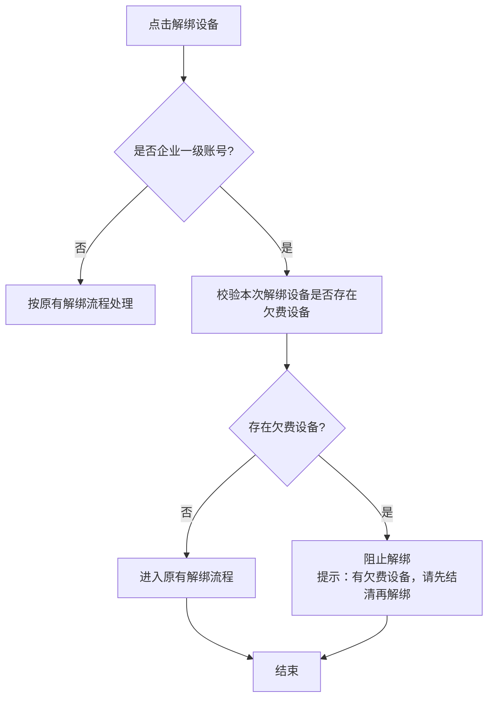
#### 分支流程/异常流程
<table header-row="true">
<tr>
<td>分支 ID</td>
<td>条件</td>
<td>流程</td>
</tr>
<tr>
<td>A1</td>
<td>本次解绑设备均无欠费</td>
<td>继续原有解绑流程</td>
</tr>
<tr>
<td>E1</td>
<td>本次解绑设备中存在任一欠费设备</td>
<td>阻止本次解绑，不允许用户二次确认后继续解绑</td>
</tr>
<tr>
<td>E2</td>
<td>批量解绑中部分设备欠费</td>
<td>整批解绑阻止，不做部分解绑</td>
</tr>
<tr>
<td>E3</td>
<td>欠费校验失败</td>
<td>阻止解绑并提示系统异常，避免绕过欠费校验</td>
</tr>
</table>
#### 验收标准
- [ ] AC-解绑-01.1：该规则仅适用于监控平台企业一级账号的设备解绑。
- [ ] AC-解绑-01.2：系统仅校验本次要解绑的设备集合，不因同账号名下其他未选中设备欠费而阻止解绑。
- [ ] AC-解绑-01.3：本次解绑设备中存在任一欠费设备时，解绑被完全阻止。
- [ ] AC-解绑-01.4：欠费拦截提示文案固定为「有欠费设备，请先结清再解绑」。
- [ ] AC-解绑-01.5：批量解绑场景下，只要存在欠费设备，整批解绑失败，不做部分解绑。
#### 字段规范（解绑校验）
<table header-row="true">
<tr>
<td>字段名</td>
<td>标识</td>
<td>类型</td>
<td>必填</td>
<td>默认值</td>
<td>校验规则</td>
<td>显示方式</td>
<td>错误提示</td>
</tr>
<tr>
<td>当前账号层级</td>
<td>accountLevel</td>
<td>枚举</td>
<td>是</td>
<td>—</td>
<td>仅企业一级账号触发欠费拦截</td>
<td>系统字段</td>
<td>—</td>
</tr>
<tr>
<td>本次解绑设备</td>
<td>selectedDeviceIds</td>
<td>数组</td>
<td>是</td>
<td>—</td>
<td>至少选择 1 台设备</td>
<td>系统参数</td>
<td>—</td>
</tr>
<tr>
<td>设备欠费状态</td>
<td>arrearsStatus</td>
<td>枚举</td>
<td>是</td>
<td>—</td>
<td>按本次解绑设备逐台校验是否欠费</td>
<td>系统字段</td>
<td>—</td>
</tr>
<tr>
<td>拦截提示</td>
<td>blockMessage</td>
<td>字符串</td>
<td>是</td>
<td>有欠费设备，请先结清再解绑</td>
<td>存在欠费设备时展示</td>
<td>提示文本</td>
<td>—</td>
</tr>
</table>
#### 功能级业务规则
<table header-row="true">
<tr>
<td>规则 ID</td>
<td>规则名称</td>
<td>触发时机</td>
<td>规则描述</td>
<td>校验逻辑</td>
<td>错误提示</td>
<td>错误代码</td>
</tr>
<tr>
<td>BR-解绑-01</td>
<td>企业一级账号限定</td>
<td>点击解绑时</td>
<td>仅监控平台企业一级账号解绑设备时执行欠费拦截</td>
<td>`if platform = monitor and accountLevel = ENTERPRISE_L1`</td>
<td>—</td>
<td>—</td>
</tr>
<tr>
<td>BR-解绑-02</td>
<td>本次设备校验</td>
<td>欠费校验时</td>
<td>只校验本次选中的解绑设备集合</td>
<td>`check selectedDeviceIds only`</td>
<td>—</td>
<td>—</td>
</tr>
<tr>
<td>BR-解绑-03</td>
<td>欠费强拦截</td>
<td>欠费设备存在时</td>
<td>存在欠费设备则不允许解绑，不提供继续确认入口</td>
<td>`if any selectedDevice.arrears then reject`</td>
<td>「有欠费设备，请先结清再解绑」</td>
<td>ERR_UNBIND_DEVICE_ARREARS</td>
</tr>
<tr>
<td>BR-解绑-04</td>
<td>批量不部分解绑</td>
<td>批量解绑时</td>
<td>任一设备欠费则整批解绑失败</td>
<td>`reject all selectedDeviceIds`</td>
<td>「有欠费设备，请先结清再解绑」</td>
<td>ERR_UNBIND_DEVICE_ARREARS</td>
</tr>
</table>
#### 数据流转
- **输入**：当前账号层级、本次解绑设备 ID 集合。
- **处理**：查询本次解绑设备的欠费状态；若存在欠费设备则直接拒绝解绑；若均无欠费则进入原有解绑流程。
- **输出**：欠费场景输出固定提示并保持设备绑定关系不变；无欠费场景输出原解绑流程结果。
---
#### US-解绑-02：管理后台企业一级账号设备解绑责任风险确认
**描述**：作为平台管理员，我在管理后台为企业一级账号解绑设备时，需要看到费用责任风险确认，避免解绑后费用责任脱离原账号而未被确认。
#### 入口
管理后台企业一级账号相关设备解绑操作。
#### 前置条件
- 平台管理员已登录管理后台。
- 目标解绑对象为企业一级账号名下设备。
- 原有设备解绑能力可用。
#### 触发条件
- 管理员在管理后台对企业一级账号执行设备解绑操作。
#### 主流程
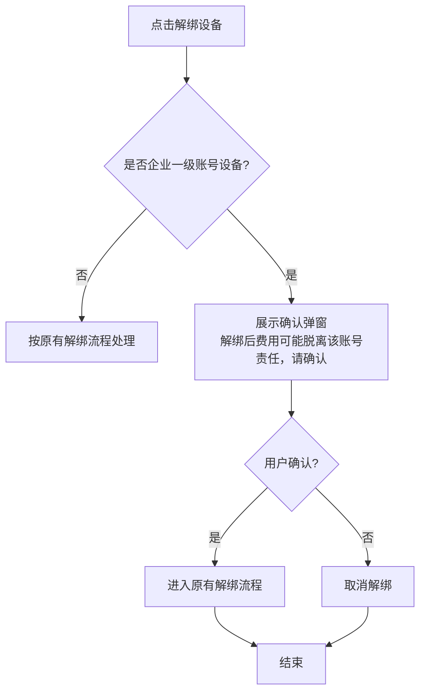
#### 分支流程/异常流程
<table header-row="true">
<tr>
<td>分支 ID</td>
<td>条件</td>
<td>流程</td>
</tr>
<tr>
<td>A1</td>
<td>管理员确认</td>
<td>继续原有解绑流程</td>
</tr>
<tr>
<td>A2</td>
<td>管理员取消</td>
<td>关闭确认弹窗，不解绑设备</td>
</tr>
<tr>
<td>A3</td>
<td>目标不是企业一级账号设备</td>
<td>不展示该责任风险确认，按原有解绑流程处理</td>
</tr>
</table>
#### 验收标准
- [ ] AC-解绑-02.1：该规则仅适用于管理后台企业一级账号的设备解绑。
- [ ] AC-解绑-02.2：管理后台企业一级账号设备解绑前必须展示确认弹窗。
- [ ] AC-解绑-02.3：确认弹窗文案固定为「解绑后费用可能脱离该账号责任，请确认」。
- [ ] AC-解绑-02.4：该规则仅做责任风险确认，不额外做欠费拦截；管理员确认后进入原有解绑流程，取消后不解绑。
#### 字段规范（确认弹窗）
<table header-row="true">
<tr>
<td>字段名</td>
<td>标识</td>
<td>类型</td>
<td>必填</td>
<td>默认值</td>
<td>校验规则</td>
<td>显示方式</td>
<td>错误提示</td>
</tr>
<tr>
<td>目标账号层级</td>
<td>targetAccountLevel</td>
<td>枚举</td>
<td>是</td>
<td>—</td>
<td>仅企业一级账号触发确认</td>
<td>系统字段</td>
<td>—</td>
</tr>
<tr>
<td>确认文案</td>
<td>confirmContent</td>
<td>字符串</td>
<td>是</td>
<td>解绑后费用可能脱离该账号责任，请确认</td>
<td>固定文案，不随欠费状态变化</td>
<td>弹窗文本</td>
<td>—</td>
</tr>
<tr>
<td>用户确认结果</td>
<td>confirmResult</td>
<td>布尔</td>
<td>是</td>
<td>false</td>
<td>确认后继续解绑；取消后停止</td>
<td>弹窗按钮</td>
<td>—</td>
</tr>
</table>
#### 功能级业务规则
<table header-row="true">
<tr>
<td>规则 ID</td>
<td>规则名称</td>
<td>触发时机</td>
<td>规则描述</td>
<td>校验逻辑</td>
<td>错误提示</td>
<td>错误代码</td>
</tr>
<tr>
<td>BR-解绑-05</td>
<td>管理后台限定</td>
<td>点击解绑时</td>
<td>仅管理后台企业一级账号设备解绑展示责任风险确认</td>
<td>`if platform = admin and targetAccountLevel = ENTERPRISE_L1`</td>
<td>—</td>
<td>—</td>
</tr>
<tr>
<td>BR-解绑-06</td>
<td>必须二次确认</td>
<td>进入解绑前</td>
<td>解绑前必须弹窗提示费用责任风险</td>
<td>`show confirm dialog before unbind`</td>
<td>—</td>
<td>—</td>
</tr>
<tr>
<td>BR-解绑-07</td>
<td>不做欠费拦截</td>
<td>展示确认时</td>
<td>管理后台此规则为风险确认，不校验欠费状态，不因欠费阻断</td>
<td>不调用欠费拦截逻辑</td>
<td>—</td>
<td>—</td>
</tr>
<tr>
<td>BR-解绑-08</td>
<td>取消不解绑</td>
<td>取消确认时</td>
<td>管理员取消后不执行解绑</td>
<td>`if confirmResult = false then stop`</td>
<td>—</td>
<td>—</td>
</tr>
</table>
#### 数据流转
- **输入**：目标账号层级、待解绑设备信息、管理员确认结果。
- **处理**：目标为企业一级账号设备时先展示责任风险确认；管理员确认后进入原有解绑流程；管理员取消则停止。
- **输出**：确认后输出原解绑流程结果；取消后设备绑定关系保持不变。
---
### 状态机定义（设备激活状态）
天通救援棒的激活状态字段（`activationStatus`）状态机如下：
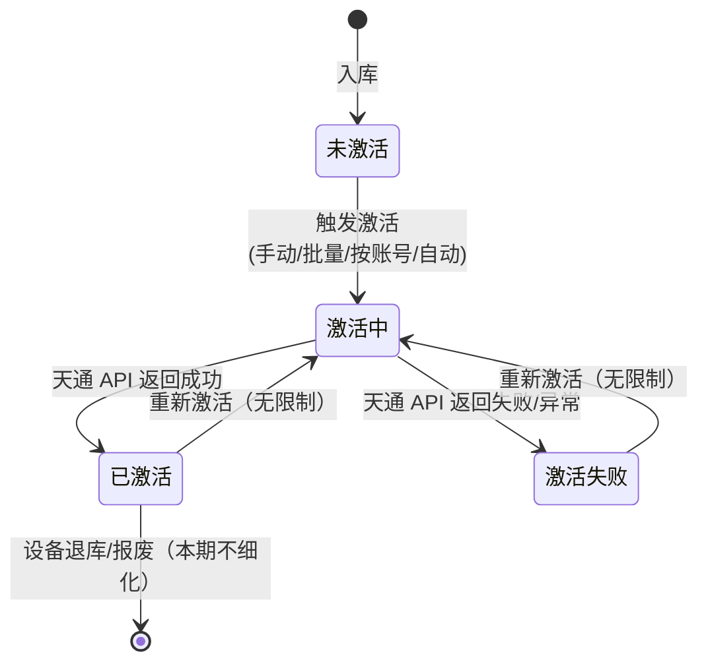
#### 状态流转矩阵
<table header-row="true">
<tr>
<td>当前状态</td>
<td>可转换至</td>
<td>触发操作</td>
<td>权限要求</td>
<td>前置条件</td>
<td>后置动作</td>
</tr>
<tr>
<td>未激活</td>
<td>激活中</td>
<td>行操作「激活」/ 批量激活 / 按企业账号激活 / 个人账号绑定后自动触发</td>
<td>管理员（手动）/ 系统（自动）</td>
<td>设备存在 + 天通救援棒 + 有 ICCID</td>
<td>写入激活中记录</td>
</tr>
<tr>
<td>激活中</td>
<td>已激活</td>
<td>天通平台 API 返回成功</td>
<td>系统</td>
<td>API 同步返回或异步回调</td>
<td>状态→已激活，记录激活时间</td>
</tr>
<tr>
<td>激活中</td>
<td>激活失败</td>
<td>天通平台 API 返回失败 / 异常</td>
<td>系统</td>
<td>—</td>
<td>生成激活失败记录（含失败原因）</td>
</tr>
<tr>
<td>激活失败</td>
<td>激活中</td>
<td>重新激活（行操作或自动触发）</td>
<td>管理员 / 系统</td>
<td>无次数限制</td>
<td>写入新的激活记录</td>
</tr>
<tr>
<td>已激活</td>
<td>激活中</td>
<td>重新激活（行操作）</td>
<td>管理员</td>
<td>无次数限制</td>
<td>写入新的激活记录</td>
</tr>
</table>
> **注**：状态明细字段（`statusDetail`）独立于上述状态机，由天通平台异步推送更新；ICCID 未绑定 SN 时不记录。
---
#### US-欠费-01：欠费账单列表
**描述**：作为平台管理员，我希望在「账单管理 → 欠费账单」列表中查看所有企业一级账号的欠费情况，并对欠费中的账单进行处理。
#### 入口
「账单管理 → 欠费账单」（左侧菜单新增一级菜单「账单管理」，下含「欠费账单」子菜单）。
#### 前置条件
- 管理员已登录管理后台。
- 系统中存在企业设备的通信欠费数据（v2.2 定义的短音/报位欠费）。
#### 触发条件
- 管理员点击「账单管理 → 欠费账单」进入列表页。
#### 主流程
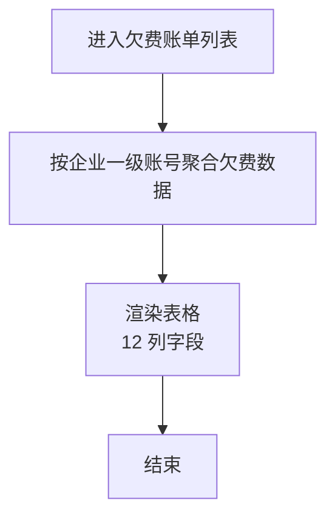
#### 分支流程/异常流程
<table header-row="true">
<tr>
<td>分支 ID</td>
<td>条件</td>
<td>流程</td>
</tr>
<tr>
<td>A1</td>
<td>点击「短音欠费总数」/「报位欠费总数」</td>
<td>弹出欠费设备列表（US-欠费-03）</td>
</tr>
<tr>
<td>A2</td>
<td>点击「处理」（仅欠费中）</td>
<td>弹出处理弹窗（US-欠费-02）</td>
</tr>
<tr>
<td>A3</td>
<td>点击「备注」</td>
<td>弹出备注弹窗（US-欠费-04）</td>
</tr>
<tr>
<td>A4</td>
<td>欠费状态筛选</td>
<td>按欠费中/已交清过滤</td>
</tr>
<tr>
<td>E1</td>
<td>模糊查询无结果</td>
<td>列表显示「暂无数据」</td>
</tr>
</table>
#### 验收标准
- [ ] AC-欠费-01.1：「账单管理」菜单存在，含「欠费账单」子菜单。
- [ ] AC-欠费-01.2：列表展示 13 列（序号/账号/账号名称/手机号/短音欠费总数/报位欠费总数/欠费状态/欠费开始时间/欠费结束时间/处理时间/处理说明/备注/操作）。
- [ ] AC-欠费-01.3：欠费状态有「欠费中」「已交清」两种。
- [ ] AC-欠费-01.4：模糊查询支持账号/账号名称/手机号。
- [ ] AC-欠费-01.5：点击短音欠费总数或报位欠费总数，弹出欠费设备列表（US-欠费-03）。
- [ ] AC-欠费-01.6：「处理」按钮仅对欠费中的账单显示。
- [ ] AC-欠费-01.7：「备注」按钮可修改备注（已交清账单也可修改）。
#### 字段规范（列表）
<table header-row="true">
<tr>
<td>字段名</td>
<td>标识</td>
<td>类型</td>
<td>必填</td>
<td>默认值</td>
<td>校验规则</td>
<td>显示方式</td>
<td>错误提示</td>
</tr>
<tr>
<td>序号</td>
<td>index</td>
<td>整数</td>
<td>—</td>
<td>自增</td>
<td>行号</td>
<td>文本</td>
<td>—</td>
</tr>
<tr>
<td>账号</td>
<td>account</td>
<td>字符串</td>
<td>—</td>
<td>—</td>
<td>企业一级账号</td>
<td>文本</td>
<td>—</td>
</tr>
<tr>
<td>账号名称</td>
<td>accountName</td>
<td>字符串</td>
<td>—</td>
<td>—</td>
<td>—</td>
<td>文本</td>
<td>—</td>
</tr>
<tr>
<td>手机号码</td>
<td>mobile</td>
<td>字符串</td>
<td>—</td>
<td>—</td>
<td>手机号格式</td>
<td>文本</td>
<td>—</td>
</tr>
<tr>
<td>短音欠费总数</td>
<td>shortVoiceArrears</td>
<td>整数</td>
<td>—</td>
<td>0</td>
<td>单位：条；该账号名下所有欠费设备短音欠费总和</td>
<td>可点击数字链接</td>
<td>—</td>
</tr>
<tr>
<td>报位欠费总数</td>
<td>reportArrears</td>
<td>整数</td>
<td>—</td>
<td>0</td>
<td>单位：个；该账号名下所有欠费设备报位欠费总和</td>
<td>可点击数字链接</td>
<td>—</td>
</tr>
<tr>
<td>欠费状态</td>
<td>arrearsStatus</td>
<td>枚举</td>
<td>—</td>
<td>欠费中</td>
<td>欠费中 / 已交清</td>
<td>状态标签</td>
<td>—</td>
</tr>
<tr>
<td>欠费开始时间</td>
<td>arrearsStartTime</td>
<td>日期时间</td>
<td>—</td>
<td>空</td>
<td>最早欠费时间</td>
<td>文本</td>
<td>—</td>
</tr>
<tr>
<td>欠费结束时间</td>
<td>arrearsEndTime</td>
<td>日期时间</td>
<td>—</td>
<td>空</td>
<td>最近欠费时间</td>
<td>文本</td>
<td>—</td>
</tr>
<tr>
<td>处理时间</td>
<td>settleTime</td>
<td>日期时间</td>
<td>—</td>
<td>空</td>
<td>已交清才有</td>
<td>文本</td>
<td>—</td>
</tr>
<tr>
<td>处理说明</td>
<td>settleRemark</td>
<td>字符串</td>
<td>—</td>
<td>空</td>
<td>线下核销时填写</td>
<td>文本</td>
<td>—</td>
</tr>
<tr>
<td>备注</td>
<td>remark</td>
<td>字符串</td>
<td>—</td>
<td>空</td>
<td>可修改</td>
<td>文本</td>
<td>—</td>
</tr>
<tr>
<td>操作</td>
<td>—</td>
<td>—</td>
<td>—</td>
<td>—</td>
<td>—</td>
<td>处理 / 备注 按钮</td>
<td>—</td>
</tr>
</table>
#### 功能级业务规则
<table header-row="true">
<tr>
<td>规则 ID</td>
<td>规则名称</td>
<td>触发时机</td>
<td>规则描述</td>
<td>校验逻辑</td>
<td>错误提示</td>
<td>错误代码</td>
</tr>
<tr>
<td>BR-欠费-01</td>
<td>一级账号聚合</td>
<td>列表查询时</td>
<td>按企业一级账号聚合欠费，只有企业设备会欠费</td>
<td>`group by enterpriseL1Account`</td>
<td>—</td>
<td>—</td>
</tr>
<tr>
<td>BR-欠费-02</td>
<td>单位语义</td>
<td>展示时</td>
<td>短音单位「条」，报位单位「个」，不是金额</td>
<td>—</td>
<td>—</td>
<td>—</td>
</tr>
<tr>
<td>BR-欠费-03</td>
<td>个人设备不欠费</td>
<td>数据生成时</td>
<td>个人设备星豆为 0 即停服，不产生欠费（v2.2）</td>
<td>—</td>
<td>—</td>
<td>—</td>
</tr>
</table>
#### 数据流转
- **输入**：管理员筛选条件（账号/账号名称/手机号/欠费状态）。
- **处理**：从欠费明细表按企业一级账号聚合（sum 短音/报位），关联账号信息（名称/手机号），关联线下核销记录（处理时间/处理说明）。
- **输出**：列表展示聚合账单；点击数字下钻到设备明细（US-欠费-03）；处理/备注进入对应弹窗。
---
#### US-欠费-02：欠费处理（线下核销）
**描述**：作为平台管理员，我希望对企业线下转款后的欠费账单进行手动核销，记录处理说明并标记为已交清。
#### 入口
欠费账单列表（US-欠费-01）行操作「处理」按钮（仅欠费中）。
#### 前置条件
- 目标账单状态 = 欠费中。
- 管理员已与企业完成线下对公转款确认（业务前提）。
#### 触发条件
- 管理员点击欠费中账单的「处理」按钮。
#### 主流程
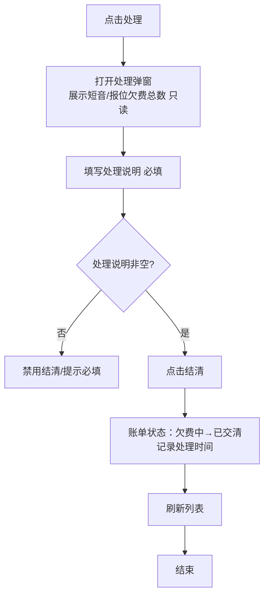
#### 分支流程/异常流程
<table header-row="true">
<tr>
<td>分支 ID</td>
<td>条件</td>
<td>流程</td>
</tr>
<tr>
<td>A1</td>
<td>点击「取消」</td>
<td>关闭弹窗，不操作</td>
</tr>
<tr>
<td>E1</td>
<td>处理说明为空时点击结清</td>
<td>禁用按钮或提示「处理说明不能为空」</td>
</tr>
</table>
#### 验收标准
- [ ] AC-欠费-02.1：处理弹窗展示短音欠费总数、报位欠费总数（只读，单位：条/个）。
- [ ] AC-欠费-02.2：处理说明必填，为空时不可结清。
- [ ] AC-欠费-02.3：结清后账单状态变为「已交清」，记录处理时间。
#### 字段规范（处理弹窗）
<table header-row="true">
<tr>
<td>字段名</td>
<td>标识</td>
<td>类型</td>
<td>必填</td>
<td>默认值</td>
<td>校验规则</td>
<td>显示方式</td>
<td>错误提示</td>
</tr>
<tr>
<td>短音欠费总数</td>
<td>shortVoiceArrears</td>
<td>整数</td>
<td>—</td>
<td>—</td>
<td>只读</td>
<td>文本</td>
<td>—</td>
</tr>
<tr>
<td>报位欠费总数</td>
<td>reportArrears</td>
<td>整数</td>
<td>—</td>
<td>—</td>
<td>只读；统一为「报位欠费总数」</td>
<td>文本</td>
<td>—</td>
</tr>
<tr>
<td>处理说明</td>
<td>settleRemark</td>
<td>字符串</td>
<td>是</td>
<td>空</td>
<td>≤500 字符</td>
<td>多行文本框</td>
<td>「处理说明不能为空」</td>
</tr>
</table>
#### 功能级业务规则
<table header-row="true">
<tr>
<td>规则 ID</td>
<td>规则名称</td>
<td>触发时机</td>
<td>规则描述</td>
<td>校验逻辑</td>
<td>错误提示</td>
<td>错误代码</td>
</tr>
<tr>
<td>BR-欠费-04</td>
<td>处理说明必填</td>
<td>点击结清时</td>
<td>处理说明非空才能结清</td>
<td>`if isEmpty(settleRemark) then reject`</td>
<td>「处理说明不能为空」</td>
<td>ERR_SETTLE_REMARK_REQUIRED</td>
</tr>
<tr>
<td>BR-欠费-05</td>
<td>线下核销语义</td>
<td>结清时</td>
<td>此「处理/结清」是线下收款核销，不涉及系统内星豆扣款</td>
<td>不调用星豆扣款接口</td>
<td>—</td>
<td>—</td>
</tr>
<tr>
<td>BR-欠费-06</td>
<td>与线上冲抵独立</td>
<td>结清时</td>
<td>与 v2.2「线上自动冲抵」是两条独立清欠路径，并存不冲突</td>
<td>—</td>
<td>—</td>
<td>—</td>
</tr>
<tr>
<td>BR-欠费-07</td>
<td>报位术语统一</td>
<td>字段命名/展示</td>
<td>统一为「报位欠费总数」，原型图「报文」已统一</td>
<td>—</td>
<td>—</td>
<td>—</td>
</tr>
</table>
#### 数据流转
- **输入**：管理员填写处理说明。
- **处理**：账单状态从「欠费中」更新为「已交清」，写入处理时间、处理说明。
- **输出**：列表刷新，账单出现在已交清视图；不影响星豆账户余额。
---
#### US-欠费-03：欠费设备列表
**描述**：作为平台管理员，我希望查看某个欠费账号下每台设备的欠费明细，了解欠费的具体来源。
#### 入口
欠费账单列表（US-欠费-01）点击「短音欠费总数」或「报位欠费总数」列的数字。
#### 前置条件
- 目标账号存在欠费账单（含短音或报位欠费）。
#### 触发条件
- 管理员点击欠费账单的短音/报位欠费总数。
> **勘误**：原型图弹窗标题误写为「欠费&备入队」，实际术语为「**欠费设备列表**」，不存在「备入队」概念。
#### 主流程
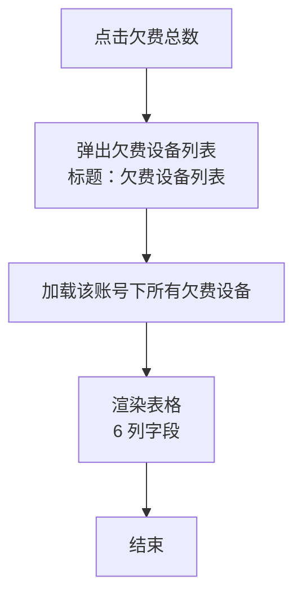
#### 分支流程/异常流程
<table header-row="true">
<tr>
<td>分支 ID</td>
<td>条件</td>
<td>流程</td>
</tr>
<tr>
<td>A1</td>
<td>输入设备卡号模糊查询</td>
<td>实时/回车过滤列表</td>
</tr>
<tr>
<td>A2</td>
<td>点击导出</td>
<td>**直接导出所有记录**（不限当前筛选条件）</td>
</tr>
<tr>
<td>E1</td>
<td>模糊查询无结果</td>
<td>列表显示「暂无数据」</td>
</tr>
</table>
#### 验收标准
- [ ] AC-欠费-03.1：点击欠费账单的短音/报位欠费总数，弹出欠费设备列表。
- [ ] AC-欠费-03.2：列表展示 6 列（设备卡号/短音欠费总数/报位欠费总数/欠费开始时间/欠费结束时间）。
- [ ] AC-欠费-03.3：支持设备卡号模糊查询。
- [ ] AC-欠费-03.4：导出**直接导出所有记录**（不限当前筛选条件）。
- [ ] AC-欠费-03.5：弹窗标题为「欠费设备列表」（非原型图的「欠费&备入队」）。
#### 字段规范（欠费设备列表）
<table header-row="true">
<tr>
<td>字段名</td>
<td>标识</td>
<td>类型</td>
<td>必填</td>
<td>默认值</td>
<td>校验规则</td>
<td>显示方式</td>
<td>错误提示</td>
</tr>
<tr>
<td>序号</td>
<td>index</td>
<td>整数</td>
<td>—</td>
<td>自增</td>
<td>行号</td>
<td>文本</td>
<td>—</td>
</tr>
<tr>
<td>设备卡号</td>
<td>cardNo</td>
<td>字符串</td>
<td>—</td>
<td>—</td>
<td>欠费设备卡号</td>
<td>文本</td>
<td>—</td>
</tr>
<tr>
<td>短音欠费总数</td>
<td>shortVoiceArrears</td>
<td>整数</td>
<td>—</td>
<td>0</td>
<td>单位：条</td>
<td>文本</td>
<td>—</td>
</tr>
<tr>
<td>报位欠费总数</td>
<td>reportArrears</td>
<td>整数</td>
<td>—</td>
<td>0</td>
<td>单位：个</td>
<td>文本</td>
<td>—</td>
</tr>
<tr>
<td>欠费开始时间</td>
<td>arrearsStartTime</td>
<td>日期时间</td>
<td>—</td>
<td>空</td>
<td>该设备最早欠费时间</td>
<td>文本</td>
<td>—</td>
</tr>
<tr>
<td>欠费结束时间</td>
<td>arrearsEndTime</td>
<td>日期时间</td>
<td>—</td>
<td>空</td>
<td>该设备最近欠费时间</td>
<td>文本</td>
<td>—</td>
</tr>
</table>
#### 功能级业务规则
<table header-row="true">
<tr>
<td>规则 ID</td>
<td>规则名称</td>
<td>触发时机</td>
<td>规则描述</td>
<td>校验逻辑</td>
<td>错误提示</td>
<td>错误代码</td>
</tr>
<tr>
<td>BR-欠费-08</td>
<td>设备范围</td>
<td>数据查询时</td>
<td>设备均为企业设备（绑定到企业一级账号），个人设备不欠费</td>
<td>—</td>
<td>—</td>
<td>—</td>
</tr>
<tr>
<td>BR-欠费-09</td>
<td>导出全量</td>
<td>点击导出时</td>
<td>导出所有记录，不限当前筛选条件</td>
<td>忽略 keyword 过滤</td>
<td>—</td>
<td>—</td>
</tr>
</table>
#### 数据流转
- **输入**：欠费账单维度（企业一级账号 ID）。
- **处理**：从欠费明细表按账号 + 设备维度聚合，每台设备一行。
- **输出**：设备明细列表；导出生成全量 Excel/CSV。
---
#### US-欠费-04：备注（新增/修改）
**描述**：作为平台管理员，我希望对欠费账单添加或修改备注，记录额外信息。
#### 入口
欠费账单列表（US-欠费-01）行操作「备注」按钮。
#### 前置条件
- 目标账单存在。
#### 触发条件
- 管理员点击欠费账单的「备注」按钮。
#### 主流程
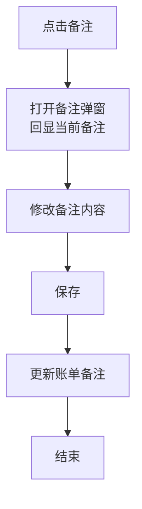
#### 分支流程/异常流程
<table header-row="true">
<tr>
<td>分支 ID</td>
<td>条件</td>
<td>流程</td>
</tr>
<tr>
<td>A1</td>
<td>已交清账单点击备注</td>
<td>仍可修改备注（与处理/结清无关）</td>
</tr>
<tr>
<td>E1</td>
<td>备注超长</td>
<td>校验失败，提示字符上限</td>
</tr>
</table>
#### 验收标准
- [ ] AC-欠费-04.1：「备注」按钮弹出备注弹窗（回显当前值）。
- [ ] AC-欠费-04.2：可修改备注内容并保存；已交清账单也可修改。
#### 字段规范（备注弹窗）
<table header-row="true">
<tr>
<td>字段名</td>
<td>标识</td>
<td>类型</td>
<td>必填</td>
<td>默认值</td>
<td>校验规则</td>
<td>显示方式</td>
<td>错误提示</td>
</tr>
<tr>
<td>备注</td>
<td>remark</td>
<td>字符串</td>
<td>否</td>
<td>现有值</td>
<td>≤200 字符</td>
<td>多行文本框</td>
<td>「备注不超过 200 字符」</td>
</tr>
</table>
#### 功能级业务规则
<table header-row="true">
<tr>
<td>规则 ID</td>
<td>规则名称</td>
<td>触发时机</td>
<td>规则描述</td>
<td>校验逻辑</td>
<td>错误提示</td>
<td>错误代码</td>
</tr>
<tr>
<td>BR-欠费-10</td>
<td>与结清独立</td>
<td>修改备注时</td>
<td>备注是独立操作，与处理/结清无关；已交清账单也可修改</td>
<td>不校验账单状态</td>
<td>—</td>
<td>—</td>
</tr>
</table>
#### 数据流转
- **输入**：管理员输入新备注。
- **处理**：更新账单备注字段。
- **输出**：列表刷新，备注列展示最新值。
---
## 非功能性需求
### 异常场景处理
<table header-row="true">
<tr>
<td>场景</td>
<td>触发条件</td>
<td>预期行为</td>
<td>错误提示/处理</td>
</tr>
<tr>
<td>天通平台 API 超时/不可用</td>
<td>单设备/批量/按企业账号激活时调用天通 API 失败</td>
<td>标记本次激活为「激活失败」，生成激活失败记录（含失败原因 = 超时/不可用）；允许重新激活</td>
<td>「激活失败：天通平台暂不可用，请稍后重试」</td>
</tr>
<tr>
<td>天通状态明细推送丢失</td>
<td>天通平台未推送状态明细</td>
<td>状态明细保持默认「正常」；不做兜底查询</td>
<td>—</td>
</tr>
<tr>
<td>ICCID 历史漏填</td>
<td>入库时未录入 ICCID（历史数据）</td>
<td>激活弹窗允许管理员补填 ICCID 后激活</td>
<td>「缺少 ICCID，请先补充」</td>
</tr>
<tr>
<td>删除分组下含设备</td>
<td>用户尝试删除非空分组</td>
<td>阻止删除</td>
<td>「分组下还有入库设备，不能删除」</td>
</tr>
<tr>
<td>网络中断（提交表单时）</td>
<td>入库/激活/核销提交时断网</td>
<td>表单数据保留，提供重试</td>
<td>「网络异常，请稍后重试」</td>
</tr>
<tr>
<td>设备不存在（激活弹窗）</td>
<td>三选一定位不到设备</td>
<td>阻止进入激活流程</td>
<td>「设备不存在」</td>
</tr>
<tr>
<td>非天通救援棒激活</td>
<td>三选一定位到其他类型设备</td>
<td>阻止激活</td>
<td>「非天通救援棒，不可激活」</td>
</tr>
<tr>
<td>模板批量激活部分行失败</td>
<td>批量激活部分行无效/失败</td>
<td>逐行独立处理；失败行生成激活失败记录；返回完整结果报表</td>
<td>报表中标注每行失败原因</td>
</tr>
<tr>
<td>欠费账单线下核销后状态回退</td>
<td>已交清账单再次产生新欠费</td>
<td>系统应能再次进入「欠费中」（v2.2 定义），本期不细化状态回退链路</td>
<td>—</td>
</tr>
<tr>
<td>跨端自动激活失败</td>
<td>个人账号绑定后天通 API 调用失败</td>
<td>后台生成激活失败记录；管理后台列表展示「激活失败」状态；个人端不阻塞绑定动作</td>
<td>—</td>
</tr>
</table>
### 交互与数据规范
#### 1. 搜索框输入规范
<table header-row="true">
<tr>
<td>项目</td>
<td>规范说明</td>
</tr>
<tr>
<td>**触发方式**</td>
<td>输入后按「回车键」或点击「搜索图标」触发搜索</td>
</tr>
<tr>
<td>**输入提示**</td>
<td>placeholder 文字需明确，如「请输入分组名称/备注」「请输入 SN/卡号/ICCID」</td>
</tr>
<tr>
<td>**输入建议**</td>
<td>各列表默认**不启用**自动补全</td>
</tr>
<tr>
<td>**搜索逻辑**</td>
<td>模糊匹配（`LIKE %keyword%`）；多字段用 OR 拼接（如 SN/卡号/ICCID 任一命中）</td>
</tr>
<tr>
<td>**清空操作**</td>
<td>提供「清除（X）」按钮，点击后清空输入并刷新列表</td>
</tr>
<tr>
<td>**结果展示**</td>
<td>无结果时显示占位图与「暂无数据」</td>
</tr>
</table>
> 适用列表：分组管理、设备入库、天通救援棒激活列表、按企业账号激活弹窗账号列表、欠费账单列表、欠费设备列表。
#### 2. 文件上传/下载规范
<table header-row="true">
<tr>
<td>项目</td>
<td>规范说明</td>
</tr>
<tr>
<td>**批量激活模板下载**</td>
<td>提供 `.xlsx` 模板，含表头：设备 SN、设备卡号、ICCID；附填写说明（三选一）</td>
</tr>
<tr>
<td>**批量激活上传**</td>
<td>支持 `.xlsx`、`.xls`；单文件 ≤ 5 MB；行数建议 ≤ 5000 行（超出分批）</td>
</tr>
<tr>
<td>**导出（入库列表/欠费设备列表）**</td>
<td>导出 `.xlsx`，文件名含模块名 + 导出时间（如 `入库设备列表_20260706_153000.xlsx`）</td>
</tr>
<tr>
<td>**状态反馈**</td>
<td>上传校验失败时整体拒绝并提示具体行/字段；导出异步时显示进度</td>
</tr>
<tr>
<td>**欠费设备列表导出范围**</td>
<td>直接导出所有记录（不限当前筛选条件），见 BR-欠费-09</td>
</tr>
</table>
#### 3. 列表分页规范
<table header-row="true">
<tr>
<td>项目</td>
<td>规范说明</td>
</tr>
<tr>
<td>**参数命名**</td>
<td>`page`（页码）、`page_size`（每页条数）</td>
</tr>
<tr>
<td>**默认值**</td>
<td>`page=1`、`page_size=20`</td>
</tr>
<tr>
<td>**页大小选项**</td>
<td>20 / 50 / 100</td>
</tr>
<tr>
<td>**响应格式**</td>
<td>`{ items, total, page, page_size }`</td>
</tr>
<tr>
<td>**前端控件**</td>
<td>经典分页器：总条数 + 页码跳转 + 上一页/下一页</td>
</tr>
<tr>
<td>**无数据**</td>
<td>占位图 + 「暂无数据」</td>
</tr>
</table>
#### 4. 日期/时间选择器规范
<table header-row="true">
<tr>
<td>项目</td>
<td>规范说明</td>
</tr>
<tr>
<td>**激活时间默认**</td>
<td>默认查询「最近 7 天」（AC-激活-01.5）</td>
</tr>
<tr>
<td>**范围限制**</td>
<td>不可选择未来日期</td>
</tr>
<tr>
<td>**格式**</td>
<td>展示与提交统一为 `YYYY-MM-DD HH:mm:ss`</td>
</tr>
<tr>
<td>**快捷选项**</td>
<td>提供今天 / 最近 7 天 / 最近 30 天</td>
</tr>
<tr>
<td>**欠费时间筛选**</td>
<td>支持欠费开始/结束时间范围筛选</td>
</tr>
</table>
## 风险清单
<table header-row="true">
<tr>
<td>风险描述</td>
<td>可能性</td>
<td>影响</td>
<td>应对措施/缓解方案</td>
</tr>
<tr>
<td>天通（天翼）平台 API 不稳定 / 接口变更</td>
<td>中</td>
<td>高（影响激活成功率 + 状态明细推送）</td>
<td>1. 激活失败可重试，无次数限制；2. 状态明细异步推送丢失时保持默认「正常」，不阻塞激活主流程；3. 接口变更建立联调机制与告警</td>
</tr>
<tr>
<td>天通状态明细推送延迟或丢失</td>
<td>中</td>
<td>中（影响展示准确性）</td>
<td>1. 状态明细默认「正常」，缺失不影响业务；2. ICCID 未绑定 SN 时不记录（已知约束，文档化）</td>
</tr>
<tr>
<td>历史 ICCID 漏填数据规模未知</td>
<td>高</td>
<td>中（影响激活弹窗兜底路径的覆盖率）</td>
<td>1. 入库时强制天通救援棒 ICCID 必填（US-入库-02）；2. 激活弹窗提供补填路径；3. 上线前排查历史漏填数据</td>
</tr>
<tr>
<td>「按企业账号激活」账号层级范围（一/二/三级）数据量大，模糊查询性能</td>
<td>中</td>
<td>中（响应慢）</td>
<td>1. 账号、账号名称、手机号建索引；2. 分页查询；3. 必要时按需加载</td>
</tr>
<tr>
<td>欠费账单聚合查询性能（按一级账号聚合全量欠费明细）</td>
<td>中</td>
<td>中（响应慢）</td>
<td>1. 欠费明细表对一级账号建索引；2. 考虑预聚合/物化视图；3. 分页</td>
</tr>
<tr>
<td>跨端自动激活链路（小程序绑定 → 后台激活 → 管理后台展示）协同复杂</td>
<td>高</td>
<td>高（自动激活失败难追溯）</td>
<td>1. 后台生成激活失败记录，便于追溯；2. 监控告警自动激活失败率；3. 明确三端责任边界</td>
</tr>
<tr>
<td>「报位」vs「报文」术语再次混淆</td>
<td>低</td>
<td>低（UI 不一致）</td>
<td>1. 已统一为「报位欠费总数」；2. 接口/字段/文案统一审查</td>
</tr>
<tr>
<td>删除分组前「移除设备」（删除/转移）缺少系统级批量操作（用户手动逐台）</td>
<td>中</td>
<td>低（操作繁琐）</td>
<td>1. 文档明确两种移除路径；2. 后续可补「批量转移」功能（本期不实现）</td>
</tr>
<tr>
<td>批量激活模板用户填错字段（误以为三选一是任意一个就一定能激活，忽略前提判断）</td>
<td>中</td>
<td>中（激活失败率高）</td>
<td>1. 模板说明强调前提（设备存在/天通救援棒/有 ICCID）；2. 返回结果报表逐行说明失败原因</td>
</tr>
<tr>
<td>原型图与实际术语/字段不一致（已发现两处：状态字段、欠费&备入队）</td>
<td>—</td>
<td>—</td>
<td>1. 已在 CONTEXT.md「Prototype corrections」记录；2. 实现以本 PRD 为准</td>
</tr>
</table>
## 界面原型
### UI-入库-01：分组管理列表
- **所属模块**：模块一·入库管理
- **入口**：左侧菜单「入库管理 → 分组管理」
- **功能描述**：维护平台级入库分组（增删改查）；查看分组下设备数量；删除前需先转移设备到默认分组。
- **交互规则**：
	1. 列表按创建时间降序。
	2. 点击「设备数量」数字弹出该分组入库设备列表。
	3. 编辑只允许改分组名称 + 备注。
	4. 删除非空分组时提示「分组下还有入库设备，不能删除」。
### UI-入库-02：设备入库列表
- **所属模块**：模块一·入库管理
- **入口**：「入库管理 → 设备入库」
- **功能描述**：入库设备列表，新增 ICCID 字段、ICCID 模糊查询、导出；入库表单对天通救援棒强制 ICCID 必填。
- **交互规则**：
	1. 列表新增 ICCID 列。
	2. 模糊查询支持 ICCID。
	3. 顶部新增「导出」按钮。
	4. 入库表单：设备类型 = 天通救援棒时 ICCID 必填，其他类型可空。
### UI-绑定-01：批量绑定弹窗
- **所属模块**：模块二·批量绑定增强
- **入口**：「账号管理 → 子终端管理 → 某账号 → 批量绑定」
- **功能描述**：左侧设备选择区新增设备类型/入库分组筛选与分组名称模糊搜索；右侧目标账号分组不变。
- **交互规则**：
	1. 左侧新增「设备类型」下拉 + 「入库分组」筛选。
	2. 模糊搜索支持卡号/SN/分组名称。
	3. 分组内设备按入库时间降序，未分组设备排最后。
	4. 右侧「目标分组」（账号分组）逻辑不变。
### UI-激活-01：天通救援棒激活列表
- **所属模块**：模块三·设备激活
- **入口**：「设备激活 → 天通救援棒激活」
- **功能描述**：展示天通救援棒的激活属性与操作；提供按企业账号激活、批量激活入口。
- **交互规则**：
	1. 默认激活时间筛选 = 最近 7 天。
	2. 模糊查询 SN/卡号/ICCID。
	3. 未激活/激活失败行显示「激活」按钮。
	4. 顶部「按企业账号激活」「批量激活」按钮。
### UI-激活-02：单设备激活弹窗
- **所属模块**：模块三·设备激活
- **入口**：激活列表行操作「激活」
- **功能描述**：通过 SN/卡号/ICCID 三选一定位设备，必要时补填 ICCID，调用天通平台 API 激活。
- **交互规则**：
	1. 三选一定位设备。
	2. 三项前提判断（设备存在/天通救援棒/有 ICCID），失败提示具体原因。
	3. 设备无 ICCID 时本框补填必填。
### UI-激活-03：按企业账号激活弹窗
- **所属模块**：模块三·设备激活
- **入口**：激活列表顶部「按企业账号激活」
- **功能描述**：选择企业一/二/三级账号 → 展示该账号名下天通救援棒（绑定关系=我的）→ 批量激活。
- **交互规则**：
	1. 账号列表含一到三级。
	2. 模糊查询账号/账号名称/手机号。
	3. 设备列表只展示「设备类型=天通救援棒 + 绑定关系=我的」。
### UI-欠费-01：欠费账单列表
- **所属模块**：模块四·欠费账单管理
- **入口**：「账单管理 → 欠费账单」
- **功能描述**：按企业一级账号聚合展示欠费，支持线下核销、备注、下钻到欠费设备列表。
- **交互规则**：
	1. 列表 13 列字段。
	2. 模糊查询账号/账号名称/手机号；可按欠费状态筛选。
	3. 「处理」按钮仅欠费中显示。
	4. 点击短音/报位欠费总数弹出欠费设备列表。
### UI-欠费-02：欠费处理弹窗
- **所属模块**：模块四·欠费账单管理
- **入口**：欠费账单列表行操作「处理」
- **功能描述**：线下核销，填写处理说明后结清账单。
- **交互规则**：
	1. 短音/报位欠费总数只读。
	2. 处理说明必填，空时禁用结清。
	3. 字段统一为「报位欠费总数」。
### UI-欠费-03：欠费设备列表弹窗
- **所属模块**：模块四·欠费账单管理
- **入口**：欠费账单列表点击短音/报位欠费总数
- **功能描述**：下钻展示某账号下每台设备的欠费明细。
- **交互规则**：
	1. 弹窗标题为「**欠费设备列表**」。
	2. 支持设备卡号模糊查询。
	3. 导出**直接导出所有记录**。
---
## 业务规则
### 全局业务规则
<table header-row="true">
<tr>
<td>规则 ID</td>
<td>规则名称</td>
<td>规则描述</td>
<td>触发场景</td>
<td>错误提示</td>
<td>优先级</td>
</tr>
<tr>
<td>BR-G001</td>
<td>设备四状态维度独立</td>
<td>一台设备有「入库 / 绑定 / 激活 / 设备状态（通信）」四个相互独立的状态维度；不同列表展示不同维度，互不耦合</td>
<td>任何设备相关展示与操作</td>
<td>—</td>
<td>P0</td>
</tr>
<tr>
<td>BR-G002</td>
<td>入库与激活字段隔离</td>
<td>设备入库列表不展示激活状态/激活时间；激活属性只在「天通救援棒激活列表」展示</td>
<td>入库列表、激活列表展示</td>
<td>—</td>
<td>P0</td>
</tr>
<tr>
<td>BR-G003</td>
<td>入库分组与账号分组共存</td>
<td>两套分组独立共存，绑定设备到账号（指定账号分组）不修改入库分组属性</td>
<td>入库、绑定、筛选</td>
<td>—</td>
<td>P0</td>
</tr>
<tr>
<td>BR-G004</td>
<td>默认分组不可删除</td>
<td>系统内置默认分组作为设备转移中转，不可删除、不可重命名</td>
<td>删除/编辑分组</td>
<td>—</td>
<td>P0</td>
</tr>
<tr>
<td>BR-G005</td>
<td>天通救援棒激活 = 存 ICCID + 调天通 API</td>
<td>激活做两件事：(1) 关联 ICCID 到设备记录；(2) 调用天通平台 API 在 ICCID 对应 SIM 卡上开通卫星通信能力</td>
<td>单设备/批量/按企业账号/自动激活</td>
<td>—</td>
<td>P0</td>
</tr>
<tr>
<td>BR-G006</td>
<td>激活是通信前置</td>
<td>未激活的天通救援棒即使绑定账号也无法通信（收发短音/报位）</td>
<td>任何通信流程</td>
<td>—</td>
<td>P0</td>
</tr>
<tr>
<td>BR-G007</td>
<td>个人设备不欠费</td>
<td>个人设备星豆为 0 即停服，不产生欠费；只有企业设备会欠费</td>
<td>欠费生成</td>
<td>—</td>
<td>P0</td>
</tr>
<tr>
<td>BR-G008</td>
<td>欠费归一级账号</td>
<td>企业设备欠费归企业一级账号承担，欠费账单按一级账号聚合</td>
<td>欠费账单列表</td>
<td>—</td>
<td>P0</td>
</tr>
<tr>
<td>BR-G009</td>
<td>单位语义</td>
<td>短音单位「条」，报位单位「个」；星豆余额不记负数</td>
<td>欠费展示与计费</td>
<td>—</td>
<td>P0</td>
</tr>
<tr>
<td>BR-G010</td>
<td>报位术语统一</td>
<td>统一为「报位」（非「报文」），原型图已勘误</td>
<td>全部 UI/接口/字段命名</td>
<td>—</td>
<td>P1</td>
</tr>
<tr>
<td>BR-G011</td>
<td>状态明细异步来源</td>
<td>状态明细由天通（天翼）平台异步推送；管理后台不主动查询，只接收和展示；ICCID 未绑定 SN 则不记录</td>
<td>激活列表展示</td>
<td>—</td>
<td>P1</td>
</tr>
<tr>
<td>BR-G012</td>
<td>两条清欠路径独立并存</td>
<td>「线上自动冲抵」（v2.2，企业充值星豆时按单价抵扣）与「线下手动核销」（本期，对公转款后管理员手动结清）独立并存，互不冲突</td>
<td>欠费账单处理</td>
<td>—</td>
<td>P0</td>
</tr>
<tr>
<td>BR-G013</td>
<td>时间统一格式</td>
<td>系统中所有时间字段展示与提交格式为 `YYYY-MM-DD HH:mm:ss`</td>
<td>任何时间字段</td>
<td>—</td>
<td>P1</td>
</tr>
<tr>
<td>BR-G014</td>
<td>监控平台消息统一入口</td>
<td>监控平台求救群聊、对讲群聊、终端消息统一进入同一个消息 Tab，通过消息类型下拉筛选</td>
<td>消息列表查看</td>
<td>—</td>
<td>P0</td>
</tr>
<tr>
<td>BR-G015</td>
<td>消息删除物理不可恢复</td>
<td>监控平台消息右键删除为物理删除，删除前必须按实际消息类型展示确认文案</td>
<td>消息右键删除</td>
<td>删除失败</td>
<td>P0</td>
</tr>
<tr>
<td>BR-G016</td>
<td>监控平台欠费设备解绑强拦截</td>
<td>企业一级账号在监控平台解绑本次选中设备时，若任一设备欠费，则整批解绑阻止</td>
<td>监控平台设备解绑</td>
<td>有欠费设备，请先结清再解绑</td>
<td>P0</td>
</tr>
<tr>
<td>BR-G017</td>
<td>管理后台解绑责任风险确认</td>
<td>管理后台企业一级账号设备解绑前必须提示费用责任风险；该规则不额外做欠费拦截</td>
<td>管理后台设备解绑</td>
<td>—</td>
<td>P0</td>
</tr>
</table>
### 功能级业务规则索引
<table header-row="true">
<tr>
<td>规则 ID</td>
<td>所属用户故事</td>
<td>规则名称</td>
<td>简要描述</td>
</tr>
<tr>
<td>BR-入库-01</td>
<td>US-入库-01</td>
<td>分组非空校验</td>
<td>分组下必须无入库设备才能删除</td>
</tr>
<tr>
<td>BR-入库-02</td>
<td>US-入库-01</td>
<td>默认分组保护</td>
<td>默认分组不可删除、不可重命名</td>
</tr>
<tr>
<td>BR-入库-03</td>
<td>US-入库-01</td>
<td>平台级共享</td>
<td>入库分组平台级，不挂企业/账号</td>
</tr>
<tr>
<td>BR-入库-04</td>
<td>US-入库-01</td>
<td>设备归属唯一性</td>
<td>一台设备同时只属于一个入库分组</td>
</tr>
<tr>
<td>BR-入库-05</td>
<td>US-入库-02</td>
<td>ICCID 条件必填</td>
<td>天通救援棒入库 ICCID 必填，其他可空</td>
</tr>
<tr>
<td>BR-入库-06</td>
<td>US-入库-02</td>
<td>激活字段隔离</td>
<td>入库列表不展示激活字段</td>
</tr>
<tr>
<td>BR-入库-07</td>
<td>US-入库-02</td>
<td>导出范围</td>
<td>按当前筛选条件导出</td>
</tr>
<tr>
<td>BR-绑定-01</td>
<td>US-绑定-01</td>
<td>两套分组共存</td>
<td>左侧入库分组筛选 / 右侧账号分组选择</td>
</tr>
<tr>
<td>BR-绑定-02</td>
<td>US-绑定-01</td>
<td>入库时间排序</td>
<td>分组内按入库时间降序</td>
</tr>
<tr>
<td>BR-绑定-03</td>
<td>US-绑定-01</td>
<td>绑定参数不变</td>
<td>提交参数仍为 `{account, addrs, groupId}`</td>
</tr>
<tr>
<td>BR-激活-01</td>
<td>US-激活-01</td>
<td>数据范围限定</td>
<td>只展示天通救援棒</td>
</tr>
<tr>
<td>BR-激活-02</td>
<td>US-激活-01</td>
<td>失败也生成记录</td>
<td>激活失败也写激活记录</td>
</tr>
<tr>
<td>BR-激活-03</td>
<td>US-激活-01</td>
<td>状态明细异步推送</td>
<td>来自天通平台异步推送</td>
</tr>
<tr>
<td>BR-激活-04</td>
<td>US-激活-01</td>
<td>状态明细绑定约束</td>
<td>ICCID 未绑定 SN 不记录</td>
</tr>
<tr>
<td>BR-激活-05</td>
<td>US-激活-01</td>
<td>默认状态明细</td>
<td>默认「正常」</td>
</tr>
<tr>
<td>BR-激活-06</td>
<td>US-激活-02</td>
<td>三选一定位</td>
<td>SN/卡号/ICCID 任一非空即可</td>
</tr>
<tr>
<td>BR-激活-07</td>
<td>US-激活-02</td>
<td>三项前提判断</td>
<td>设备存在 + 天通救援棒 + 有 ICCID</td>
</tr>
<tr>
<td>BR-激活-08</td>
<td>US-激活-02</td>
<td>自动触发</td>
<td>个人账号绑定后自动激活</td>
</tr>
<tr>
<td>BR-激活-09</td>
<td>US-激活-02</td>
<td>重新激活无限制</td>
<td>失败后无次数限制</td>
</tr>
<tr>
<td>BR-激活-10</td>
<td>US-激活-03</td>
<td>账号层级范围</td>
<td>含企业一/二/三级账号</td>
</tr>
<tr>
<td>BR-激活-11</td>
<td>US-激活-03</td>
<td>绑定关系=我的</td>
<td>只含直接绑定设备，不含下级账号</td>
</tr>
<tr>
<td>BR-激活-12</td>
<td>US-激活-03</td>
<td>与欠费账单维度差异</td>
<td>激活可一/二/三级，欠费只一级</td>
</tr>
<tr>
<td>BR-激活-13</td>
<td>US-激活-04</td>
<td>三选一模板规则</td>
<td>每行 SN/卡号/ICCID 任一非空</td>
</tr>
<tr>
<td>BR-激活-14</td>
<td>US-激活-04</td>
<td>逐行独立</td>
<td>部分行失败不影响其他行</td>
</tr>
<tr>
<td>BR-激活-15</td>
<td>US-激活-04</td>
<td>单行逻辑同单设备</td>
<td>复用 BR-激活-07/08</td>
</tr>
<tr>
<td>BR-欠费-01</td>
<td>US-欠费-01</td>
<td>一级账号聚合</td>
<td>按企业一级账号聚合欠费</td>
</tr>
<tr>
<td>BR-欠费-02</td>
<td>US-欠费-01</td>
<td>单位语义</td>
<td>短音「条」、报位「个」</td>
</tr>
<tr>
<td>BR-欠费-03</td>
<td>US-欠费-01</td>
<td>个人设备不欠费</td>
<td>个人设备星豆为 0 即停服</td>
</tr>
<tr>
<td>BR-欠费-04</td>
<td>US-欠费-02</td>
<td>处理说明必填</td>
<td>处理说明非空才能结清</td>
</tr>
<tr>
<td>BR-欠费-05</td>
<td>US-欠费-02</td>
<td>线下核销语义</td>
<td>不涉及系统内星豆扣款</td>
</tr>
<tr>
<td>BR-欠费-06</td>
<td>US-欠费-02</td>
<td>与线上冲抵独立</td>
<td>两条清欠路径并存</td>
</tr>
<tr>
<td>BR-欠费-07</td>
<td>US-欠费-02</td>
<td>报位术语统一</td>
<td>「报位」（非「报文」）</td>
</tr>
<tr>
<td>BR-欠费-08</td>
<td>US-欠费-03</td>
<td>设备范围</td>
<td>均为企业设备</td>
</tr>
<tr>
<td>BR-欠费-09</td>
<td>US-欠费-03</td>
<td>导出全量</td>
<td>导出所有记录，不限筛选</td>
</tr>
<tr>
<td>BR-欠费-10</td>
<td>US-欠费-04</td>
<td>与结清独立</td>
<td>备注与处理/结清无关</td>
</tr>
<tr>
<td>BR-消息-01</td>
<td>US-消息-01</td>
<td>默认全部消息</td>
<td>消息类型筛选默认显示「全部消息」</td>
</tr>
<tr>
<td>BR-消息-02</td>
<td>US-消息-01</td>
<td>消息类型筛选</td>
<td>按全部/求救群聊/对讲群聊/终端消息筛选</td>
</tr>
<tr>
<td>BR-消息-03</td>
<td>US-消息-01</td>
<td>列表展示保持不变</td>
<td>合并 Tab 不改变原列表字段与布局</td>
</tr>
<tr>
<td>BR-消息-04</td>
<td>US-消息-01</td>
<td>删除确认文案区分</td>
<td>按当前行实际消息类型展示确认文案</td>
</tr>
<tr>
<td>BR-消息-05</td>
<td>US-消息-01</td>
<td>物理删除不可恢复</td>
<td>删除成功后业务消息记录不可恢复</td>
</tr>
<tr>
<td>BR-解绑-01</td>
<td>US-解绑-01</td>
<td>企业一级账号限定</td>
<td>仅监控平台企业一级账号解绑执行欠费拦截</td>
</tr>
<tr>
<td>BR-解绑-02</td>
<td>US-解绑-01</td>
<td>本次设备校验</td>
<td>只校验本次选中的解绑设备集合</td>
</tr>
<tr>
<td>BR-解绑-03</td>
<td>US-解绑-01</td>
<td>欠费强拦截</td>
<td>有欠费设备则不允许解绑</td>
</tr>
<tr>
<td>BR-解绑-04</td>
<td>US-解绑-01</td>
<td>批量不部分解绑</td>
<td>任一设备欠费则整批解绑失败</td>
</tr>
<tr>
<td>BR-解绑-05</td>
<td>US-解绑-02</td>
<td>管理后台限定</td>
<td>仅管理后台企业一级账号设备解绑展示确认</td>
</tr>
<tr>
<td>BR-解绑-06</td>
<td>US-解绑-02</td>
<td>必须二次确认</td>
<td>解绑前必须弹窗提示费用责任风险</td>
</tr>
<tr>
<td>BR-解绑-07</td>
<td>US-解绑-02</td>
<td>不做欠费拦截</td>
<td>管理后台该规则仅提示风险，不拦截欠费</td>
</tr>
<tr>
<td>BR-解绑-08</td>
<td>US-解绑-02</td>
<td>取消不解绑</td>
<td>管理员取消确认后不执行解绑</td>
</tr>
</table>
