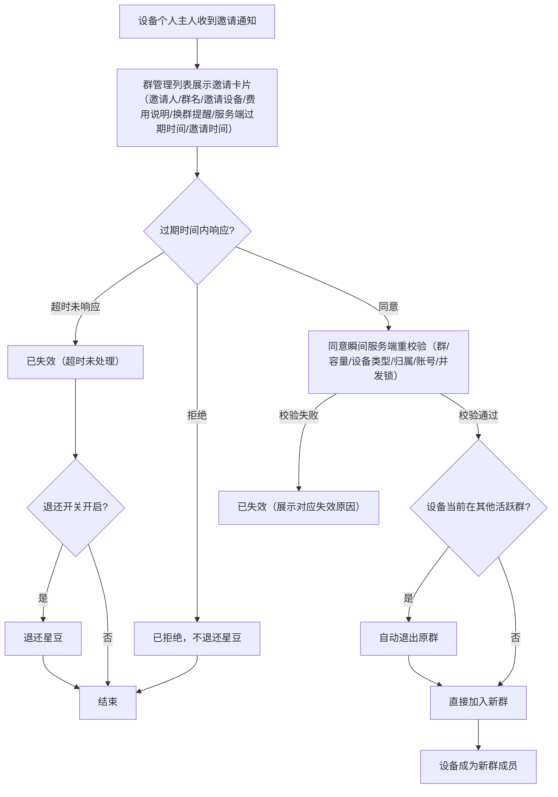

<callout icon="🎯" color="blue_bg">
	**文档用途**：梳理「对讲群 — 接收与处理邀请（US-群-05）」链路的核心逻辑、状态机、卡片字段、过期 / 并发 / 动态异常 / 后台快照及群主侧记录，供产品 / 测试对齐与用例设计。
	**触发条件**：仅「**邀请他人个人账号设备**」时触发——设备真正的个人「我的」主人收到站内邀请通知。邀请**自己设备**（直接入群、不发通知、被邀请侧无卡片）与**企业直接拉群**均不触发本流程。
	**关联文档**：邀请发起 / 设备过滤 / 扣费等完整链路见 <mention-page url="https://app.notion.com/p/e035667c6d3a82e3a23401a669915699"/>。
</callout>
---
## 1. 邀请通知 — 入口与可见范围
- **入口路径**：聊天消息 →「群邀请通知」（带未读角标）→ 群管理列表（卡片流）。
- **可见人**：被邀请**设备的个人「我的」主人**收到；企业直接拉群、自己设备直接入群均不产生待处理通知。
- **一主人多设备**：同一主人名下多台设备被邀请 → **多张卡片**，按邀请时间降序。
- **未读角标口径**：**页面级未读** —— 未进入通知页即计未读，**进入页面即清零**（与是否逐条点开无关）。
- **提醒 / 推送方式（现状）**：**目前仅支持用户主动进入小程序查看邀请通知**，**无任何其他提醒方式**——不推送微信服务通知，也无 App / 短信 / 站内实时提醒等其他实时触达渠道（是否新增其他提醒渠道见 TBD-002 待定）。
---
## 2. 处理流程

---
## 3. 状态机与 Tab
- **状态机**：`待处理 →（已同意 / 已拒绝 / 已失效）`，三者均为终态。
- **Tab 分类**：全部 / 待处理 / 已同意 / 已拒绝 / 已失效。
- **术语统一**：弃用「已过期」，失效态统一为「**已失效**」；「超时未处理」降为失效原因之一，不再作为独立状态。
- 已同意 = 用户主动【同意】并通过同意时重校验；已拒绝 = 用户主动【拒绝】（独立终态、不退费）；已失效 = **系统自动判定**，直接展示失效原因。
---
## 4. 失效原因细分（枚举，与群主侧统一）
<table header-row="true">
<tr>
<td>失效原因</td>
<td>触发场景</td>
<td>退费</td>
</tr>
<tr>
<td>超时未处理</td>
<td>过期时间到仍未响应</td>
<td>按退还开关</td>
</tr>
<tr>
<td>群已结束</td>
<td>待确认期间群主结束群</td>
<td>按退还开关</td>
</tr>
<tr>
<td>群已满员</td>
<td>其他设备抢先入群占满名额</td>
<td>按退还开关</td>
</tr>
<tr>
<td>并发失败</td>
<td>多群同时邀请，同意其一 → 其余失效</td>
<td>按退还开关</td>
</tr>
<tr>
<td>设备已解绑（无个人绑定者）</td>
<td>主动解绑 OR 管理员强制解绑（二者同类）</td>
<td>按退还开关</td>
</tr>
<tr>
<td>设备归属变更</td>
<td>个人主人变更 / 好友→我的强制替换</td>
<td>按退还开关</td>
</tr>
<tr>
<td>账号已注销</td>
<td>设备个人主人账号注销 / 删除</td>
<td>按退还开关</td>
</tr>
<tr>
<td>设备类型已变更</td>
<td>设备类型中途变化，不再是 TT_RESCUE_STICK</td>
<td>按退还开关</td>
</tr>
</table>
- **退费列口径说明（重要）**：目前**所有失效原因的退费统一由「退还开关」决定**，没有「无条件退还」这一档。是否退费取决于**发起那一刻**的后台「退还开关」快照：
	- 开关**开启** → 原路退回已消耗的星豆；
	- 开关**关闭** → **不退还**，已消耗星豆不返还。
<callout icon="🌰" color="green_bg">
	**举例（以群主邀请扣 20 星豆为例）**：群主邀请设备 A，发起那一刻扣群主 20 星豆。
	- **场景一（快照：退还开关 = 开启）**：被邀请人超时未处理 → 邀请失效（原因「超时未处理」，退费列 = 按退还开关）→ 因快照开关**开启** → **原路退回群主 20 星豆**。
	- **场景二（快照：退还开关 = 关闭）**：同样超时未处理 → 邀请失效 → 因快照开关**关闭** → **不退还**，群主 20 星豆不返还。
	- **其他失效原因同理**：无论是「超时未处理」「群已满员」「群已结束」「并发失败」还是「设备解绑 / 归属变更 / 注销 / 设备类型变更」，退费都**统一按发起时快照的退还开关**判定 —— 开启则原路退 20 星豆，关闭则不退。
	- **关键点**：以**发起时的快照**为准，中途去后台改开关**不影响在途邀请**；同一笔邀请星豆只退一次。
</callout>
- 失效即系统自动判定、直接展示原因，无需用户点同意 / 拒绝；星豆**只退一次**，拒绝不退。
---
## 5. 卡片字段 — 状态矩阵（被邀请方侧）
**字段**：邀请人（姓名＋手机号，**不脱敏**）、群名称、邀请设备（卡号）、状态徽标、邀请时间、失效时间、（失效时）失效原因、说明。
<table header-row="true">
<tr>
<td>状态</td>
<td>展示内容</td>
<td>按钮</td>
</tr>
<tr>
<td>待处理</td>
<td>全字段 ＋ 说明</td>
<td>【拒绝】【同意】</td>
</tr>
<tr>
<td>已同意</td>
<td>全字段 ＋ 说明</td>
<td>无</td>
</tr>
<tr>
<td>已拒绝</td>
<td>全字段 ＋ 说明</td>
<td>无</td>
</tr>
<tr>
<td>已失效</td>
<td>全字段 ＋ **失效原因** ＋ 说明</td>
<td>无</td>
</tr>
</table>
- **说明（固定统一展示，每个状态展开都显示）**：① 进群后通信费各自承担；② 设备将退出其他未结束对讲群并加入该群（换群提醒）。
- **费用口径**：**不向被邀请人展示 20 豆邀请费**（由群主承担），说明里只提通信费各自承担。
---
## 6. 过期时间
- **无倒计时**，卡片只显示**过期时间** `yyyy-MM-dd HH:mm:ss`（精确到秒）。
- 过期时长默认 10 分钟（后台可配），发起那一刻按快照写入（见第 8 节）。
- 时间口径以**服务端时间**为准，切换前后台不丢进度，超时后**不允许手动确认**（不依赖本地计时器）。
- 超时未响应 → 已失效（原因「超时未处理」），按退还开关退费。
---
## 7. 并发互斥（多群 / 多邀请同设备）
- 同一设备同时收到多群邀请 → **多条并列待处理**，互不阻塞展示。
- **同意一条 → 其余立即自动失效**（原因「并发失败」），各自按开关退费。
- 拒绝一条 → 不影响其余待处理。
- 一台设备同一时间仅属 **1 个活跃群**；同意时抢并发锁，仅一个成功。
- **已入群设备再被邀请** → 并列生成新「待处理」，需用户主动选择；同意 = 重走换群（自动退原群 + 入新群），**不自动换群、不自动失效原邀请**。
---
## 8. 确认期间动态异常（同意瞬间服务端重校验）
- 用户点【同意】瞬间，服务端**重走发起校验链**：群是否存在 / 未满 → 设备类型 → 设备是否仍为该主人个人「我的」归属 → 主人账号状态 → 设备当前所在群 → 并发锁。
- 系统实时监听关键事件，命中即将待处理邀请**自动失效**（失效原因见第 4 节）：
	- 设备失去个人绑定者（主动解绑 / 管理员强制解绑，**二者同类**）→「设备已解绑（无个人绑定者）」，并退出全部活跃群。
	- 个人主人变更  →「设备归属变更」（原邀请失效，不转移给新主人）。
	- 账号注销 / 删除 →「账号已注销」。
	- 群被结束 / 满员 →「群已结束」/「群已满员」。
	- 设备类型中途变化 → 同意时设备类型校验失败 →「设备类型已变更」。
- 设备主人账号冻结 / 过期：通知照常下发，但本人**无法登录处理** → 走超时失效 → 按退还开关退。
---
## 9. 后台配置变更（快照口径）
<callout icon="📸" color="blue_bg">
	**快照总纲**：扣费额 / 退还规则 / 过期时长 / 目标群成员上限，在**邀请发起那一刻固化为快照**。后台变更**不影响在途**邀请与已建群，仅对**之后新发起的邀请 / 新建的群**生效。
</callout>
- **成员上限**：建群时锁快照；后台改上限只影响新建群（个人 5 / 企业 100）。
- **扣费数值**：发起时按快照扣，失效 / 退还按快照原额退。
- **退还开关**：按发起时快照决定是否退；中途改开关不影响在途邀请。
- **过期时长**：发起时写入快照（默认 10min），后续邀请才用新值。
- **扣费开关联动**：扣费开关关闭 → 退还开关自动置灰禁用、邀请免费；已发起在途失效仍按快照退。
---
## 10. 群主侧邀请记录
（群主侧记录：按群隔离、纯查看无按钮、状态与被邀请侧统一、不展示扣费/退还——属星豆明细范畴）
**群主侧 vs 被邀请侧 对照**：群主侧按群隔离、无角标、纯查看；被邀请侧跨群聚合、有页面级未读角标、待处理可同意/拒绝。
---
## 11. 参考文档
- US-群-05（接收处理邀请）、US-群-06（设备换群）、US-群-12（邀请记录）
- 邀请发起 / 设备过滤 / 权限矩阵 / 扣费完整链路见 02-对讲群添加成员邀请
- 版本：v6，已与需求方确认
