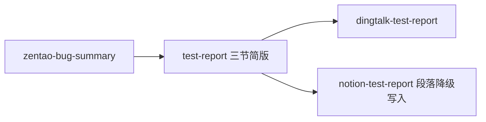
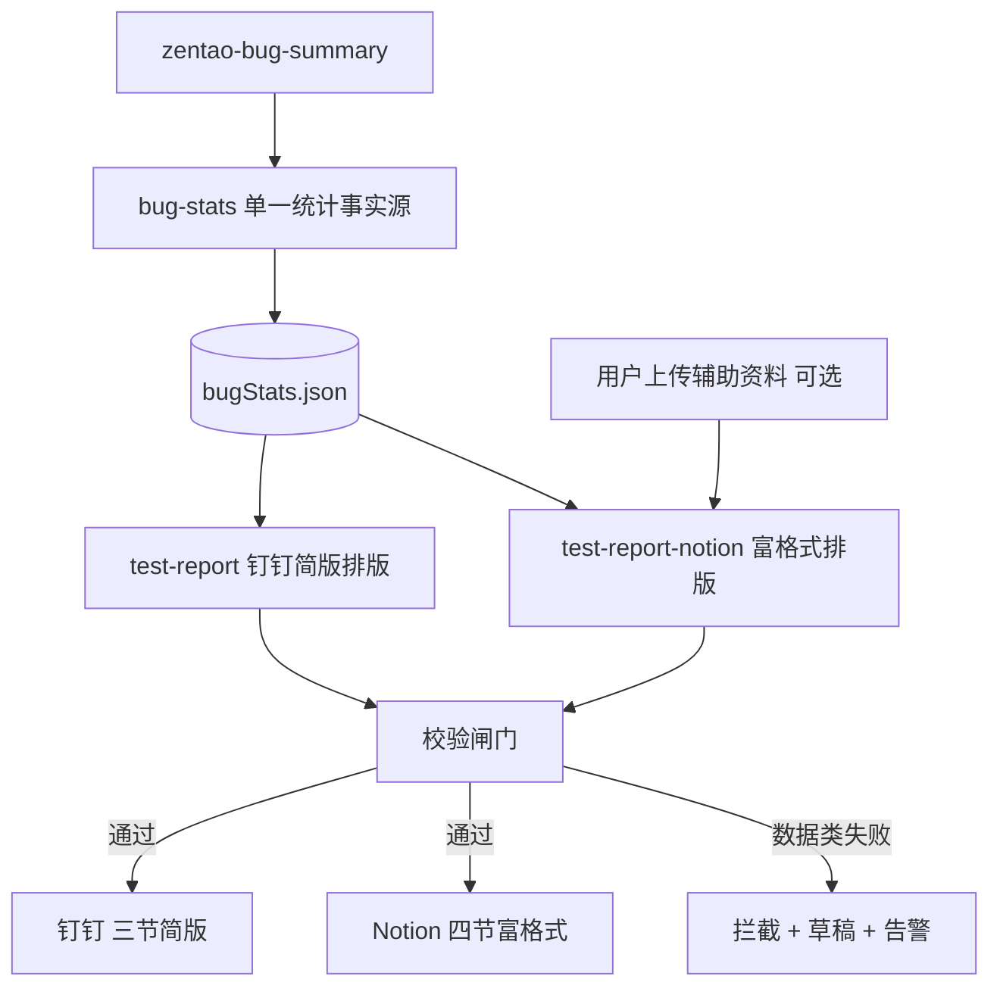
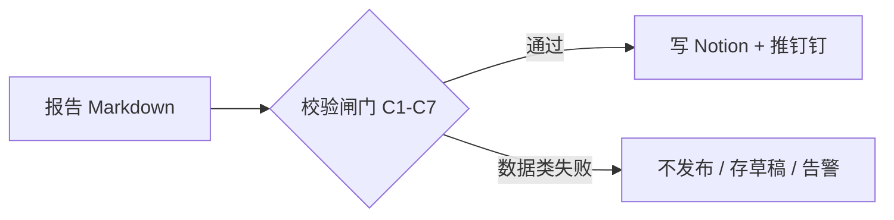

# Notion 富格式测试报告升级方案（完整版 v2）

> 本版相对 v1 的核心变化（已与需求方确认）：
> 1. **第二部分改为纯条件模块**：拿不到可用辅助测试资料（未上传 **或** 上传后读取失败）时，整节跳过隐藏，不再「推断造表」。
> 2. **新增单一统计事实源 bugStats**：钉钉与 Notion 共用同一份统计结果，从源头消除数字不一致。
> 3. **新增发布前校验闸门 + 失败处置矩阵**：数据类不一致一律硬阻断（钉钉、Notion 都不外发）。
> 4. **幂等策略明确为「默认始终新建」**，并补充覆盖前留痕与目标页安全断言。
> 5. **所有降级路径必须显式标注**，杜绝静默产出劣质报告。

---

## 一、现状与差距

**当前链路**（qa-agent-report-publish/SKILL.md）：



**问题根因**：
- `test-report/SKILL.md` 仅产出 3 节纯文本（无报告信息、无测试范围表、无待回归独立节）。
- `notion-test-report/SKILL.md` 用 `API-patch-block-children` 且只映射 `paragraph` / `bulleted_list_item`，丢失 callout、heading、table、quote、numbered_list。
- 钉钉与 Notion 两条管线**各自统计缺陷**，数字存在跑偏风险。
- 自检清单**只检查、不阻断**，可能发出数字自相矛盾的报告。

**样板页结构**（`c1b23699-3b3b-4b06-b2ac-0ec9ede194b6`，「第一轮功能测试报告 2026-06-02」）：

| 区块 | 样板元素 | 当前缺失 |
|------|----------|----------|
| 报告信息 | gray callout（项目/类型/覆盖期/测试人/开发者/模块） | 完全缺失 |
| 一、测试结果 | 2 段摘要 + 分类 bullet（含加粗高亮） | 仅有简版 bullet |
| 二、功能测试范围与执行情况 | quote + 5 列执行表 + green callout 结论 | 完全缺失（且为条件模块，见 §4） |
| 三、未解决问题汇总 | 按状态分组 + 编号列表（不截断） | 简版且超 10 条截断 |
| 四、待回归 | 已解决缺陷独立列表 | 混在「缺陷附件」里 |

---

## 二、目标架构



**原则**：
- **统计只算一次**：`bug-stats` 产出 `bugStats.json`，钉钉与 Notion 都只排版、不重算。
- **钉钉**：继续用 `test-report` 三节简版 + `dingtalk-test-report`（推送仍只摘录「一、测试结果」）。
- **Notion**：走独立富格式管线，内容更完整、版式对齐样板。
- **先校验后外发**：任何数据类不一致，钉钉与 Notion 一并拦截。

---

## 三、单一统计事实源 bugStats（解决数字不一致 / 原致命 2）

**根因**：`test-report`（钉钉）与 `test-report-notion`（Notion）各自从禅道缺陷重新聚合，口径或取数时点一有偏差，两边数字即不一致。

**解决**：抽出只跑一次的共享统计步骤 `bug-stats`（或由 `zentao-bug-summary` 直接多输出该结构），产出结构化事实对象，两条管线只消费、只排版、**绝不重新计数**。

**落盘位置**：`skill/mcp/output/{项目}-bugstats-{date}.json`（落盘而非纯内存传递，保证两条管线读同一份字节）。

**bugStats 结构**：

```jsonc
{
  "total": 30,
  "byLevel": { "一级": 0, "二级": 3, "三级": 23, "四级": 4 },
  "byStatus": {
    "未解决": 23,          // 激活（含回归不通过）
    "已修复待回归": 7,
    "已延期": 1
  },
  "回归不通过": 4,          // 激活-已确认
  "未解决列表": [
    { "级别": "三级", "模块": "电子围栏", "标题": "…", "状态": "回归不通过" }
  ],
  "待回归列表": [ { "级别": "二级", "模块": "账号管理", "标题": "…" } ],
  "byModule": {
    "订阅与通知推送": { "未解决": 10, "已修复": 0, "延期": 0, "回归不通过": 0 }
  }
}
```

**关键约束（写进技能）**：
- 钉钉摘要数字、Notion 四节里**每一个数字**，都必须从 `bugStats` 取值，禁止从正文文案再数一遍。
- 缺陷标题原样取自 `bugStats`（即禅道 MD 原文），两条管线都不许改写。
- `bugStats` 一旦生成，本发布周期内只读不再重算。

---

## 四、技能拆分

### 1. 新增 `test-report-notion`（富格式编排）

路径：`skill/skills/test-report-notion/SKILL.md`

**输入**：
- `bugStats.json`（来自 §3 的单一统计事实源）
- 用户上传的辅助测试资料（相关 Notion 链接：测试方案 / 测试大纲等）——**可选**
- 样板结构：默认 `notionTemplatePageId = c1b23699-3b3b-4b06-b2ac-0ec9ede194b6`

**固定配置**（稳定 ID，建议集中到 config，见 §8 健壮性）：

```yaml
notion:
  templatePageId: "c1b23699-3b3b-4b06-b2ac-0ec9ede194b6"
  materialRootPageId: "3585667c-6d3a-8084-bb07-d7a30a3945d9"  # 测试资料
  outlineParentPageId: "3665667c-6d3a-8079-85ff-ec1a76e55946"  # 测试大纲
```

**输出**：一份 Notion 增强 Markdown 全文（非 JSON blocks），结构严格对齐样板：

```markdown
<callout icon="📝" color="gray_bg">
  **报告信息**
  - 项目：…
  - 测试类型：…
  - 覆盖期：YYYY-MM-DD～YYYY-MM-DD
  - 测试人：童美娜（或 handoff.creator）
  - 开发者：…（handoff 可选）
  - 覆盖模块：…（从本轮有缺陷/有执行的模块归纳）
</callout>

## 一、测试结果
…（2 段量化摘要 + 分类 bullet，数字全部取自 bugStats）

<!-- 二、功能测试范围与执行情况：条件模块，见 §4.1 -->

## 三、未解决问题汇总
**激活-已确认（回归不通过）（N）**
1. [三级] …
…（完整列表，不截断）

## 四、待回归
1. [二级] …（状态=已解决）
```

#### 4.1 第二部分「功能测试范围与执行情况」——纯条件模块（已确认规则）

**数据来源 = 两份输入汇总**：
1. 用户上传的辅助测试资料（提供模块清单、核心测试点、优先级）；
2. `bugStats`（提供本轮缺陷统计与执行结果）。

**条件渲染规则（最终）**：

> **只要拿不到可用的辅助测试资料——无论是用户未上传，还是上传了但读取失败——就跳过并隐藏整个第二部分**：不推断、不占位、不报错，标题「二、功能测试范围与执行情况」与表格一起不渲染，后续小节（三、四）顺延。

> 注：这条规则**作废**了 v1「失败策略」中「资料读取失败 → 用默认模块表 + 缺陷前缀推断执行表」的做法。两种缺失情形处理**完全一致**（隐藏）。

**当第二部分存在时**的结构（对齐样板页）：
1. 一句灰色 quote，说明本轮依据与范围；
2. 一张 5 列执行表（`header-row="true"`，列宽 `43 / 150 / 400 / 63 / 175`）：
   `# | 测试模块 | 核心测试点 | 优先级 | 执行结果`
3. 一个 green callout 作为「功能测试结论」。

**执行表生成规则**：
- 以辅助资料中的模块清单（如测试方案 1.4.1 全景表）为行模板；
- 仅保留本轮实际涉及模块：缺陷标题 `【模块】` 前缀 + 资料当前阶段任务取并集；
- 列「执行结果」自动填充：
  - `✅ 已修复待回归（N）` — 该模块仅有已解决缺陷
  - `⚠️ X 个未解决（…）` — 有激活/延期缺陷
  - `✅ 通过` — 本轮覆盖且无未关闭缺陷
  - 括号附注回归不通过、已延期数量
- 所有数字取自 `bugStats.byModule`，不重新计数。

### 2. 改造 `notion-test-report`（写入层）

路径：`skill/skills/notion-test-report/SKILL.md`

**写入流程**：
1. 通过校验闸门（§5）后才进入写入。
2. `API-post-page` 在 `notionParentPageId` 下创建空页（仅 title）——**默认始终新建**（见 §6）。
3. `API-update-page-markdown` + `type: replace_content` 一次性写入 `test-report-notion` 产出的增强 Markdown。
4. 写入后回读 `API-retrieve-page-markdown` 做二次一致性校验（双保险）。
5. `replace_content` 失败时降级：回退 `patch-block-children` 纯段落模式，并在报告顶部**显式标注「版式降级」**。

**目标页安全断言**：写入目标页 ID 必须 ≠ `templatePageId`，防止误覆盖样板页。

### 3. 改造 `qa-agent-report-publish`（编排层）

路径：`skill/skills/qa-agent-report-publish/SKILL.md`

**Agent2 流程调整**：

```
1. zentao-bug-summary
2. bug-stats → 产出 bugStats.json（单一事实源）
3. test-report（排版 bugStats）→ 钉钉简版正文
4. 若 publishNotion:
   a. test-report-notion（bugStats + 可选辅助资料 → 富格式 MD；无资料则隐藏第二部分）
5. 校验闸门（§5）：对钉钉正文与 Notion MD 统一做数据类校验
   - 数据类失败 → 钉钉与 Notion 一并拦截，存草稿 + 告警
   - 通过 → 6
6. dingtalk-test-report（推送）+ notion-test-report（replace_content 写入）
```

允许引用技能数相应增加（新增 `bug-stats`、`test-report-notion`）。

---

## 五、发布前校验闸门 + 失败处置矩阵（解决「只检查不阻断」/ 原致命 1）

**位置**：在写入 Notion / 推送钉钉**之前**插入强制闸门；校验对象 = 渲染出的报告 vs `bugStats`。



**校验项（全部以 bugStats 为基准）**：

| 编号 | 校验项 | 判定 |
|---|---|---|
| C1 | 「一、测试结果」声明的未解决数 == `byStatus.未解决` | 必须相等 |
| C2 | 「三、未解决问题汇总」编号条目总数 == `byStatus.未解决` | 必须相等 |
| C3 | 各级别数量（一/二/三/四级）== `byLevel` | 必须相等 |
| C4 | 统计行「一共/未解决/已修复待回归/已延期」== bugStats | 必须相等 |
| C5 | 「四、待回归」条目数 == `待回归列表.length` | 必须相等 |
| C6 | （仅当第二部分存在）执行表各模块「未解决」之和 == `byStatus.未解决`；每模块数字 == `byModule` | 必须相等 |
| C7 | 报告缺陷标题与 bugStats 原文逐条一致（无改写） | 必须一致 |

> C6 仅在第二部分渲染时执行；按 §4.1，无辅助资料时第二部分隐藏，跳过 C6，不报错。

**失败处置矩阵**：

| 失败类别 | 包含 | 处置动作 |
|---|---|---|
| **数据类**（C1–C7） | 数字对不上、级别错、标题被改写 | **硬阻断**：不写 Notion、不推钉钉；保留草稿（标 `validation_failed`）；告警「哪条校验、期望值 vs 实际值」 |
| **版式类** | callout/表格列宽/标题层级渲染异常 | **降级放行**：仍发布，但报告顶部**显式标注「版式降级」**并告警 |
| **资料类** | 第二部分辅助资料缺失 | 不算失败，按 §4.1 隐藏第二部分，跳过 C6 |

**原则**：数据错 = 拦死（错数据比没报告更糟）；版式错 = 可降级但显式标注；资料缺 = 静默隐藏。

**同源保护**：因 §3 已让两边共用 `bugStats`，数据类校验只跑一次即可同时保护钉钉与 Notion；C1–C7 任一不过，**钉钉也不推**（避免两边状态再次不一致）。

---

## 六、幂等 / 回滚策略（默认始终新建）

**结论：默认始终重新创建新页，覆盖仅作为受限例外。**

理由：测试报告是对外正式产物（同步钉钉、客户演示、回归依据），留档价值高于整洁；工作空间现状本就按日期一版一页；`replace_content` 整页覆盖不可逆，新建最多产生可删除的废稿，错误可恢复。

**`--report-mode` 三模式**：

| 模式 | 行为 | 适用 |
|------|------|------|
| `create-new`（默认） | 每次新建页，标题带日期 | 按轮次留档 |
| `overwrite` | 命中相同 reportKey 且为草稿才覆盖；覆盖前先存快照 | 当天草稿即时修正 |
| `fail-on-duplicate` | 命中重复直接报错退出 | 防误操作严格模式 |

**幂等键**：`reportKey = 项目名 + 测试类型 + 覆盖期/报告日期`，用于查重提示（命中提示而非默默再建一页）。

**留痕（覆盖前必做）**：覆盖前用 `API-retrieve-page-markdown` 读出旧内容存 `skill/mcp/output/snapshots/{reportKey}-{timestamp}.md`，回滚即把快照重新写回。

**草稿可覆盖、发布即锁定（推荐增强）**：

| 阶段 | 行为 |
|------|------|
| 当天首次生成 | 新建页，标 `draft` |
| 当天重跑（草稿未发布） | 覆盖该页（先存快照） |
| 一旦同步钉钉 / 标记发布 | 锁定，之后重跑一律新建 |

> 当前 v1 行为属「裸新建」：每跑必 `API-post-page` 新建空页再 `replace_content` 填充，无查重、无目标页安全断言。v2 在保持「默认新建」的同时补齐查重提示与目标页断言。

---

## 七、Handoff / CLI 扩展

更新 `handoff.schema.json` 的 `reportOptions`：

| 字段 | 说明 |
|------|------|
| `notionTemplatePageId` | 样板页 ID，默认 `c1b23699-…` |
| `notionMaterialPageIds` | 用户指定辅助资料页 ID 数组（第二部分数据来源；为空则隐藏第二部分） |
| `reportMeta.testType` | 如「第二轮功能测试 + 缺陷回归」 |
| `reportMeta.coverageStart/End` | 覆盖期 |
| `reportMeta.tester` / `developer` | 报告信息 callout |
| `reportMode` | `create-new`（默认）/ `overwrite` / `fail-on-duplicate` |

同步 `qa-pipeline.mjs` 增加 `--notion-template-page-id`、`--notion-material-page-ids`、`--report-mode` 参数（可选）。

---

## 八、健壮性与工程优化（非致命，建议跟进）

- **硬编码 ID 收敛**：`templatePageId` 等集中到一份 config，避免散落 SKILL.md；并加「模板页可读性校验」，读不到则报错而非降级生成错版式。
- **拼表脚本提前**：`notion-report-compose.mjs`（读 bugStats + 资料表 → 拼执行表）由「二期可选」提前到一期，拼表是确定性强的部分，更适合脚本化，技能只负责润色文案。
- **降级显式标注**：任何降级（版式回退、资料推断等）均在报告顶部或钉钉同步中显式标注，杜绝用户拿到降级版而不自知。
- **样板结构单一事实来源**：明确以「运行时读样板页结构」或「固定模板」二选一为准，避免两套并存产生歧义。

---

## 九、自检清单（写入前）

- 报告信息 6 项非空（覆盖期、测试人至少要有）。
- C1–C7 全部通过（见 §5）。
- 若第二部分存在：执行表每行结果与 `bugStats.byModule` 一致；若无辅助资料：确认第二部分已隐藏。
- 缺陷标题与禅道 MD 原文一致，未改写。
- 目标页 ID ≠ 样板页 ID。

---

## 十、失败策略（v2 修订）

- **辅助资料缺失（未上传 / 读取失败）** → 隐藏第二部分（§4.1），不推断、不报错。
- **数据类校验失败（C1–C7）** → 硬阻断，钉钉与 Notion 均不外发，存草稿 + 告警（§5）。
- **版式类失败 / `replace_content` 失败** → 降级段落模式写入，并**显式标注「版式降级」**。
- **Notion 写入失败** → 不阻断钉钉（钉钉已通过同一份 bugStats 与校验）。

---

## 十一、实施顺序

1. **bug-stats 单一事实源**：产出 `bugStats.json`（致命 2 的地基，先做）。
2. **校验闸门 + 处置矩阵**：以 bugStats 为基准做 C1–C7 与失败拦截（致命 1）。
3. **定稿 `test-report-notion`**：结构模板 + 资料读取 + 第二部分条件渲染 + 拼表规则。
4. **升级 `notion-test-report`**：切 `API-update-page-markdown`，加目标页断言、写入后回读、降级标注。
5. **改 `qa-agent-report-publish` + handoff schema + qa-pipeline 参数**（含 `reportMode`）。
6. **用一期项目回归验证**：对比样板页与新生成页的版式 / 数据一致性。
7. （可选）补充 `notion-report-compose.mjs` 自动化拼表。

---

## 十二、验收标准

以「【磐钴】星地多网融合指挥调度SaaS平台1期 + 童美娜缺陷」为例，生成的 Notion 页应：

- 顶部有 gray **报告信息** callout（6 项）。
- **一、测试结果** 含量化摘要 + 分类 bullet，数字与 bugStats 一致。
- **二、功能测试范围与执行情况**：
  - 上传了辅助资料 → 含 quote、模块执行表（5 列）、green「功能测试结论」callout，模块/优先级与资料一致、执行结果与缺陷统计一致；
  - 未上传 / 读取失败 → 整节隐藏，三、四节顺延。
- **三、未解决问题汇总** 按状态分组、编号、完整列出（不截断）。
- **四、待回归** 单独列出已解决缺陷。
- 通过校验闸门 C1–C7；钉钉与 Notion 数字完全一致。
