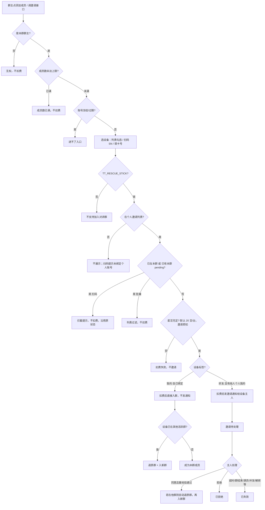

# 对讲群 · 个人账号邀请成员核心流程

> 用途：给对讲群接口自动化用例对齐主干、校验顺序、状态机与计费边界。  
> 范围：仅个人账号作为群主，邀请天通应急救援棒（`TT_RESCUE_STICK`）入群。企业直接拉群、求救群「手机号添加成员」、消息收发不展开。  
> 汇总日期：2026-08-18  
> 构图查询：`services/rescue-graph` 图谱 DFS，词表扩展  
> `[个人账号, 群成员邀请逻辑, 邀请处理逻辑, 群邀请, 添加成员, 创建对讲群逻辑, 常驻对讲群, 群成员设备, 待确认, 已接受, 已拒绝, 已过期]`

## 1. 一句话模型

入群主体是**设备**，邀请动作只能由**群主**发起。个人账号邀请成员 = 群主把救援棒拉进自己创建的**活跃对讲群**。

图谱 EXTRACTED 主链：

```
群主 --manages--> 常驻对讲群 --contains--> 群成员设备
群邀请 --starts_in--> 待确认 --transitions_to--> 已接受 / 已拒绝 / 已过期
群成员设备 --belongs_to_one_active--> 常驻对讲群
```

一台设备同一时刻只属于一个活跃对讲群。

## 2. 接口测必须先站住的前置

| # | 前置 | 依据 |
|---|---|---|
| 1 | 个人账号已登录，且已创建对讲群；创建者即群主 | `创建对讲群逻辑`，Notion `6015667c-6d3a-8398-a5e7-015cc92b4e3c` |
| 2 | 只有群主能邀请；群内其他「成员」是被邀请的终端，没有添加成员动作 | `群成员邀请逻辑` §1，Notion `d345667c-6d3a-8275-b77e-01df63808736` |
| 3 | 成员上限按设备数，个人群默认 5 台（后台可配，只锁建群快照） | 邀请逻辑 §4 P1；创建逻辑 §5 |
| 4 | 可入群设备类型只有 `TT_RESCUE_STICK` | 图谱 `常驻对讲群 --contains--> 群成员设备`；邀请逻辑 §2.1 |

个人创建群默认扣 20 星豆（后台可关/改）；企业创建默认 0，不在本流程展开。

## 3. 校验顺序（接口应按这个打）

**角色 → 成员上限 → 账号状态 → 设备类型 → 列表过滤 → 星豆余额 → 设备归属 → 是否已在他群。**



## 4. 个人邀请列表：两个前提

进入个人账号 A 的邀请列表，需**同时**满足（邀请逻辑 §2.3.1）：

1. 设备已在 A 的「设备管理」中（绑定或关注）。
2. 设备已被**某个个人账号**绑定为「我的」。

满足后，从 A 视角标签只可能是：

- **我的**：A 自己扫码绑定。
- **好友**：A 关注，但「我的」主人是别的个人账号。

标签优先级：`我的 > 用户 > 好友`。个人账号不存在「用户」标签（「用户」= 企业 FOLLOW 派生）。

## 5. 两条入群支路（用例主干）

| 支路 | 标签 | 接口行为 | 被邀请侧 | 群主侧邀请记录 |
|---|---|---|---|---|
| A. 自己设备 | 「我的」（含与企业一级双绑，均为「我的」） | 邀请即扣 → **直接入群** | 无通知、无卡片 | **暂不产生记录** |
| B. 他人设备 | 「好友」且「我的」主人是别人 | 邀请即扣 → **发通知给主人** | 走接收处理 US-群-05 | 逐台一条，可查 |
| 不可邀 | 无任何个人「我的」 | 列表不展示；扫码提示「设备未绑定个人账号」 | — | — |
| 隔离 | 仅企业 ENTERPRISE / FOLLOW / 关注 | 个人列表不展示；企业设备只能企业直接拉 | — | — |

企业链路只作为**负向边界**：个人不能邀纯企业设备。两条链路按归属严格隔离。

### 5.1 扫码添加（不走列表过滤）

判定顺序：设备类型 → 绑定/归属 → 已在群 / 已 pending。

- 非救援棒 → 「该设备不支持加入对讲群（仅天通救援棒可加入）」
- 个人账号扫到未绑定个人账号的设备 → 「设备未绑定个人账号」
- 已在本群 → 「设备已在本群」，不扣费
- 已有本群 pending → 「该设备邀请中 / 待对方确认」，不扣费，沿用原通知

批量入口：已在本群、已 pending、批内重复 → **直接过滤，不计费**。

## 6. 支路 B：邀请处理状态机

触发条件：只邀请**他人个人「我的」设备**时才有。  
来源：`邀请处理逻辑`，Notion `d6d5667c-6d3a-8271-a791-01876788a072`

| 口径 | 状态名 |
|---|---|
| 图谱节点（EXTRACTED） | `待确认 → 已接受 / 已拒绝 / 已过期` |
| 处理文档 v6 | `待处理 → 已同意 / 已拒绝 / 已失效`（弃用「已过期」） |

**接口断言字段必须以实际 API 枚举为准，不能只按图谱旧名写死。**

可见人：设备的个人「我的」主人。入口：聊天消息 → 群邀请通知（页面级未读，进入即清）。现状无微信服务通知 / App / 短信推送。

同意瞬间服务端重校验：群仍在且未满、设备仍是 `TT_RESCUE_STICK`、仍是该主人「我的」、主人账号状态、当前所在群、并发锁。失败则自动失效，展示对应原因。

| 终态 | 何时 | 设备 | 星豆 |
|---|---|---|---|
| 已同意 / 已接受 | 主动同意且重校验通过 | 入新群；若在他群则自动退原群 | 已扣保留，不退 |
| 已拒绝 | 主动拒绝 | 留原群 | **见 §9 冲突 1** |
| 已失效 | 超时 / 群结束 / 满员 / 并发失败 / 解绑 / 归属变更 / 账号注销 / 设备类型变更 | 留原群（未入新群） | 按**发起时快照的退还开关** |

过期时长默认 10 分钟，以服务端时间为准；超时后不允许再同意。

### 6.1 并发与换群

- 多群同时邀同一设备：多条待处理并列；同意一条，其余立刻「并发失败」。
- 拒绝一条，不影响其余待处理。
- 一台设备同一时间仅属 1 个活跃群；同意时抢并发锁，仅一个成功。
- 已入群设备再被邀请：并列生成新「待处理」，同意 = 重走换群（自动退原群 + 入新群），不自动换群、不自动失效原邀请。

### 6.2 失效原因（与群主侧统一）

| 失效原因 | 触发 | 退费 |
|---|---|---|
| 超时未处理 | 过期时间到仍未响应 | 按退还开关 |
| 群已结束 | 待确认期间群主结束群 | 按退还开关 |
| 群已满员 | 其他设备抢先占满名额 | 按退还开关 |
| 并发失败 | 多群同时邀请，同意其一 | 按退还开关 |
| 设备已解绑（无个人绑定者） | 主动解绑或管理员强制解绑 | 按退还开关 |
| 设备归属变更 | 个人主人变更 / 好友→我的强制替换 | 按退还开关 |
| 账号已注销 | 设备个人主人账号注销 / 删除 | 按退还开关 |
| 设备类型已变更 | 不再是 `TT_RESCUE_STICK` | 按退还开关 |

主人账号冻结 / 过期：通知照常下发，但无法登录处理 → 走超时失效。

## 7. 扣费 / 退还

| 项 | 口径 |
|---|---|
| 控制参数 | 后台「邀请成员扣除星豆」单一参数（开关 + 数值），个人/企业同一参数 |
| 默认 | 开启，20 豆 / 台 |
| 扣费主体 | 发起操作账号自身 |
| 扣费时点 | **邀请即扣**，不是入群才扣 |
| 快照 | 发起瞬间固化：消耗金额、扣费账号、退还开关、过期时长；中途改配置不影响在途 |
| 退还 | 回放快照原额、原路退回、同一笔只退一次 |
| 批量 | 按去重后总额一次扣；已在本群 / 已 pending 不计费；上限 / 余额 / 并发任一失败 → **整批回滚全退** |
| 扣费开关关闭 | 邀请免费；退还开关自动置灰；已发起在途失效仍按快照退 |

**可退（统一按发起时退还开关快照）：**

1. 被邀请人主动拒绝（v7 口径，见 §9）
2. 超时未处理
3. 待处理期间群已结束
4. 待处理期间群已满员
5. 并发失败
6. 设备已解绑
7. 设备归属变更
8. 账号已注销
9. 设备类型已变更
10. 批量即时阶段失败回滚（整批全退）

**不退：**

1. 入群成功后被群主移除
2. 换群退出原群那一笔（新群按新邀请另扣）
3. 已成功入群的正常消耗（自己设备直接入 / 他人同意入）
4. 群正常解散 / 结束后，已入群成员的已扣星豆

扣费 / 退还不在邀请记录模块展示，到「星豆记录 / 明细」查看。退还不计入后台「退款」统计。

## 8. 接口自动化建议切点

1. **可邀设备列表**：只出救援棒；个人只出「有个人我的归属」的设备；已在本群、已 pending 在批量侧直接过滤。
2. **单个邀请**：扫码校验顺序 = 类型 → 归属 → 已在群 / pending。
3. **批量邀请**：整批上限、整批余额、批内去重、部分失败整批回滚。
4. **支路 A**：自己设备直接入群，不发通知、不记邀请记录。
5. **支路 B**：他人设备先扣后邀；同意 / 拒绝 / 超时失效；同意时重校验失败。
6. **换群**：一台设备只在一个活跃群；同意新邀请自动退原群。
7. **并发锁**：多群抢同一设备只成功一个。
8. **星豆流水**：邀请扣、失效退、幂等只退一次。
9. **邀请记录**：群主按群隔离、纯查看、无按钮；被邀请侧跨群聚合；自己设备直接入群不产生记录；群结束后仍可只读。

群主侧入口：对讲群 → 群管理（套餐概览 / 群管理双 Tab）→ 邀请通知记录。  
被邀请侧入口：聊天消息 → 群邀请通知 → 群管理（单列表）。同名不同页。

## 9. 不能当单一结论写进断言的冲突

### 9.1 拒绝是否退费

| 来源 | 口径 |
|---|---|
| 图谱 EXTRACTED | `已拒绝 --refunds--> 星豆账户`（v2.2） |
| 群成员邀请逻辑 v7 | 拒绝改为按退还开关，已与需求方确认 |
| 邀请处理逻辑 v6 流程图 | 仍写「拒绝不退还星豆」 |

**接口测：拒绝场景按「退还开关开 / 关」各打一枪。不要写死「拒绝必退」或「拒绝必不退」。**

### 9.2 自己设备换群是否弹确认

| 来源 | 口径 |
|---|---|
| US-群-04 / 邀请逻辑 §4 mermaid | 自己设备在他群要弹窗；取消不扣费 |
| 同页 v3.1 判定树 | 自己设备换群静默退原群入新群，无额外弹窗 |

**目前证据冲突。** 接口层应同时准备「需确认」和「静默换群」两条预期，等产品对齐再收口。

### 9.3 状态枚举名

图谱 `待确认 / 已接受 / 已过期` vs 处理文档 `待处理 / 已同意 / 已失效`。断言前先对真实响应字段。

## 10. 来源页

| 文档 | Notion page id |
|---|---|
| 创建对讲群逻辑 | `6015667c-6d3a-8398-a5e7-015cc92b4e3c` |
| 群成员邀请逻辑 | `d345667c-6d3a-8275-b77e-01df63808736` |
| 邀请处理逻辑 | `d6d5667c-6d3a-8271-a791-01876788a072` |
| 群信息管理逻辑 | `3305667c-6d3a-8281-b7e8-8145fe82fd34` |
| 添加成员 UI | `f515667c-6d3a-83a1-b1df-81fe12cfdf55` |
| 星联应急叫应平台 2 期需求文档 v2.2 | `4975667c-6d3a-82de-bf5e-81df8412feae` |

对应需求：US-群-01（创建）/ US-群-04（添加成员）/ US-群-05（接收处理）/ US-群-06（换群）/ US-群-12（邀请记录）。
