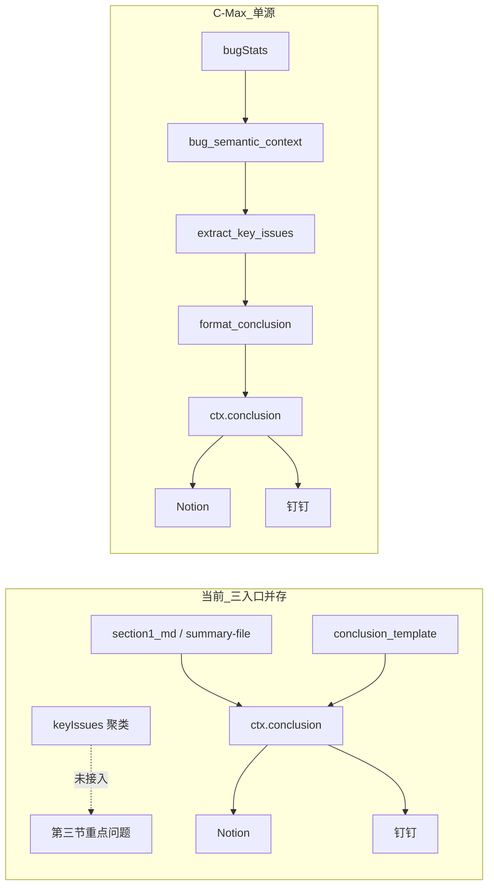

# C-Max 测试结论统一落地计划

> 对应设计文档：[C-Max结论统一方案.md](C-Max结论统一方案.md)（v1.3）  
> 输出路径：`C:\Users\33606\Desktop\skills\skill\c-max-conclusion-unification.plan.md`

## 0. 目标与不变量

**目标**：钉钉机器人、钉钉文档、Notion 报告三处「一、测试结果」结论**唯一**来自符合 [skills/test-report/SKILL.md](skills/test-report/SKILL.md) 规范的算法生成器，杜绝三类并存入口：

| 入口 | 现状 | C-Max 后 |
|------|------|---------|
| ① 外部 md（`--summary-file` / section1.md） | 直接赋给 `ctx["conclusion"]` | 仅审计对比，**不参与结论** |
| ② 兜底模板 `conclusion_template` | 数字堆叠版 | **删除** |
| ③ `keyIssues` 动态聚类 | 已算好但未接入结论段 | **唯一结论源** |

**硬约束（不得违反）**：
- 数字仍 100% 来自 `bugStats` / `ctx["metrics"]`，不动 C1-C10 数字闸门
- 方向聚类只在 [mcp/scripts/lib/key_issues.py](mcp/scripts/lib/key_issues.py) 实现；[conclusion_builder.py](mcp/scripts/lib/conclusion_builder.py) 只做 Markdown 格式化（~50 行薄适配层）
- **禁止**引入 `_gen_creator_report.py` 的 `THEME_RULES` 或重写分类逻辑

## 1. 根因定位（代码证据）

当前病根在 [mcp/scripts/lib/report_context.py](mcp/scripts/lib/report_context.py) L178：

```python
"conclusion": meta.get("section1_md"),  # 外部 md 直接透传
```

而 L116 已产出 `keyIssues`，[standard.py](mcp/scripts/lib/report_templates/standard.py) L16-24 的 `_conclusion_text` 优先用 `ctx["conclusion"]`，无结论时走 `conclusion_template` 数字兜底。



## 2. 核心交付物

### 2.1 新增 `conclusion_builder.py`（N1）

路径：[mcp/scripts/lib/conclusion_builder.py](mcp/scripts/lib/conclusion_builder.py)

- 导出 `format_conclusion(ctx) -> str`
- 输入：`ctx["keyIssues"]`、`ctx["metrics"]`、`ctx["lists"]`
- 输出契约（对齐 test-report SKILL §一、测试结果）：
  - **首段**：`本轮测试已完成 {moduleCount} 个模块...高优问题（二级及以上）需优先修复...`
  - **分方向 bullet**：每个 `keyIssues.groups[]` 一条，含二级 ID 点名、去前缀标题示例、impact 短语
  - **待回归**：`m["pending"] > 0` 时追加回归验证 bullet

### 2.2 聚类韧性增强（N3）

路径：[mcp/scripts/lib/key_issues.py](mcp/scripts/lib/key_issues.py) L28-31、L59

`_primary_label(bug, config=None)` 增加 Tier-2 回退：关键词未命中时用 `config["moduleAlias"]` 前缀匹配禅道模块名，避免大量落入「其他功能问题」。

### 2.3 结论结构闸门 C_conclusion（N2）

路径：[mcp/scripts/lib/report_context.py](mcp/scripts/lib/report_context.py) `validate_report_context`

| 编号 | 规则 | 级别 |
|------|------|------|
| C_conclusion-1 | `open > 0` 时结论含「高优问题（二级及以上）」 | error |
| C_conclusion-2 | `open > 0` 时结论含 `【` 方向分组 | error |
| C_conclusion-3 | 每个方向 bullet 含至少 1 条完整去前缀标题（与 `format_conclusion` 写入逻辑一致，**禁止** `[:8]` 截断） | warning |

### 2.4 Bug-M：`--material-auto` 跨项目污染修复

根因：[publish_report.py](mcp/scripts/publish_report.py) L110-111 无 `--material-page-id` 时自动回填 [qa_config.py](mcp/scripts/lib/qa_config.py) L96 的 SaaS1期方案 ID。

修复：
- 删除 L110-111 自动回填两行；单独传 `--material-auto` → 等价无资料，降精简执行表
- `NOTION_DEFAULT_MATERIAL_PAGE_ID` 重命名为 `NOTION_MATERIAL_GUARD_PAGE_ID`，注释明确仅用于 [notion_client.py](mcp/scripts/lib/notion_client.py) L100 禁写保护
- 加 warn 日志：单独传 `--material-auto` 时提示需配合 `--material-page-id`
- 同步更新 [skills/qa-agent-report-publish/SKILL.md](skills/qa-agent-report-publish/SKILL.md) L154/L159/L203 硬编码示例

## 3. 分步执行（先 dry 再落地）

### Step 1：格式化质量验证（不改主管线）

**目的**：确认 `format_conclusion(ctx)` 输出质量达标，避免固化不满意措辞。

**操作**：
1. 新建 `conclusion_builder.py`（N1）
2. 用天翼项目现有产物 dry 跑：
   - bugStats：[mcp/output/【天翼】星联应急叫应平台2期-bugstats-20260709.json](mcp/output/【天翼】星联应急叫应平台2期-bugstats-20260709.json)
   - 调用 `build_report_context(bs)` → `format_conclusion(ctx)` 打印结论
3. 人工审阅：方向名、二级点名、标题示例、与 `keyIssues` 一致性

**通过标准**（摘自方案 §7.1）：
- 方向来自 `impactSignals.label` 或 `moduleAlias` 别名，**非**禅道模块路径名
- 「其他功能问题」≤ 未关闭总数 10%（天翼预期 1 条）
- 归纳质量 ≥ 当前人工 [section1 md](mcp/output/【天翼】星联应急叫应平台2期-section1-20260709.md)，**主人签字认可**

**回滚**：仅删 `conclusion_builder.py`，零主管线影响。

### Step 2：C-Max 全链路落地（Step 1 通过后）

按顺序执行（每步可独立 commit）：

1. **N3** `key_issues.py` Tier-2 `moduleAlias` 回退
2. **主管线接入** `report_context.py`：
   - L178：`"conclusion": None`（切断 section1 注入）
   - `return ctx` 前：`ctx["conclusion"] = conclusion_builder.format_conclusion(ctx)`（**不得**在 dict 字面量内调用，避免 `KeyError`）
3. **N2** `validate_report_context` 追加 `C_conclusion`
4. **publish_report.py**：
   - 删 `publish_dingtalk` L214-218 无结论阻断逻辑
   - 删 `--allow-fallback` CLI 参数
   - `--summary-file` / `--report-file` 标记 deprecated（仅写 `meta` 审计）
   - 删 L110-111 material-auto 自动回填 + 加 warn
5. **qa_config.py + notion_client.py**：`NOTION_MATERIAL_GUARD_PAGE_ID` 重命名
6. **standard.py**：`_conclusion_text` 简化为 `return ctx["conclusion"].strip(), True`，删 fallback
7. **strings.py**：删 `conclusion_template`（zh-CN + en-US）
8. **删除废弃文件**（删除前 `grep` 全仓引用）：
   - [mcp/scripts/validate_report.py](mcp/scripts/validate_report.py)（导入不存在函数，运行必崩）
   - [mcp/scripts/_gen_report_md.py](mcp/scripts/_gen_report_md.py)
   - [mcp/scripts/_gen_creator_report.py](mcp/scripts/_gen_creator_report.py)
9. **SKILL.md** 文档对齐 + Bug-M 命令示例修正
10. **全链路验证**：`publish_report.py --mode both` dry + 小流量真实推送

## 4. 改动文件清单

| 类别 | 文件 | 动作 |
|------|------|------|
| 新增 | `mcp/scripts/lib/conclusion_builder.py` | 结论格式化器 |
| 修改 | `mcp/scripts/lib/report_context.py` | 单源接入 + C_conclusion |
| 修改 | `mcp/scripts/lib/key_issues.py` | Tier-2 moduleAlias |
| 修改 | `mcp/scripts/publish_report.py` | CLI/阻断/material-auto |
| 修改 | `mcp/scripts/lib/qa_config.py` | 重命名 guard ID |
| 修改 | `mcp/scripts/lib/notion_client.py` | 同步引用名 |
| 修改 | `mcp/scripts/lib/report_templates/standard.py` | 删 fallback |
| 修改 | `mcp/scripts/lib/report_templates/strings.py` | 删 conclusion_template |
| 修改 | `skills/qa-agent-report-publish/SKILL.md` | 文档 + Bug-M |
| 删除 | `validate_report.py`, `_gen_report_md.py`, `_gen_creator_report.py` | 废弃旁路 |
| 不动 | `bugstats.py`, `dingtalk_client.py`, `bug_semantic_context.py`, `report_config.py`, `material_context.py` | 安全边界 |

**预估净变化**：新增 ~76 行，修改 ~50 行，删除 ~255 行（净减约 130 行）。

## 5. 验证清单

### Step 1（dry）
- [ ] `format_conclusion` 不抛异常
- [ ] 含「高优问题（二级及以上）需优先修复」
- [ ] 方向分组来自 `keyIssues`，数字与 `metrics` 一致
- [ ] 二级缺陷 ID 逐条出现
- [ ] 主人签字认可输出质量

### Step 2（全链路）
- [ ] 不传 `--summary-file` 结论仍正确生成
- [ ] 传不规范 `--summary-file` **不污染**结论
- [ ] 钉钉 / Notion / 钉钉文档三端结论段逐字一致
- [ ] `validate_report_context` 校验通过
- [ ] `--allow-fallback` 已删除；废弃脚本已删、无残留引用
- [ ] 单独 `--material-auto` 降精简表，不加载 SaaS1 方案
- [ ] C1-C10 数字闸门不受影响

## 6. 风险与缓解

| 风险 | 缓解 |
|------|------|
| R1 可溯源率低，impact 多为模板短语 | 标注「（影响待复核）」；Step 1 真实数据验证 |
| R2 方向全落「其他功能问题」 | N3 Tier-2 `moduleAlias` 回退；新项目补 alias 条目 |
| R3 失去人工微调能力 | 可后续预留 `--conclusion-override`（默认禁用） |
| R5 闸门误阻断 | C_conclusion-3 降为 warning；保留 `--no-validate` |
| R6 conclusion_builder 膨胀为第二分类器 | 代码评审硬性禁止写 classify/THEME_RULES |
| R7 `--material-auto` 语义变化 | warn 日志 + SKILL 文档 + 通知使用方显式传 `--material-page-id` |

## 7. 回滚策略

- **Step 1**：删 `conclusion_builder.py` 即可
- **Step 2**：`git revert` 对应 commit；D1-D3 可从 git 历史恢复

## 8. 与 robust-report-design-v2 的关系

本计划是 [robust-report-design-v2.plan.md](robust-report-design-v2.plan.md) 中「报告模板 / 双端一致 / 校验闸门」子集的具体落地，聚焦**结论段单源化**与 **Bug-M 资料安全**。不改动 MaterialContext、数字闸门、Notion 八段其余部分。
