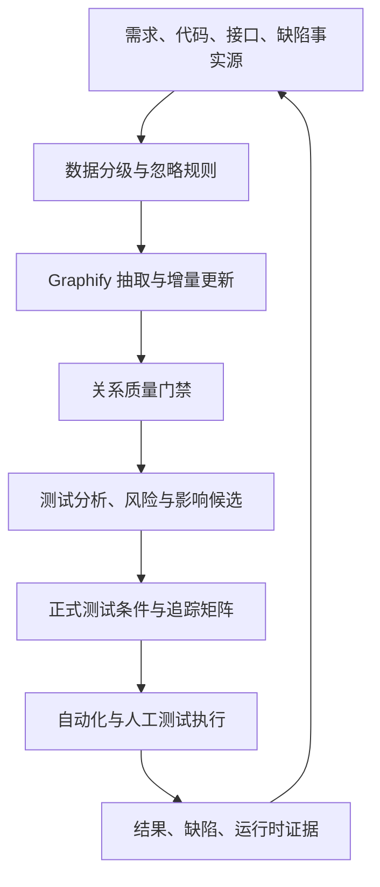

# Graphify 测试工程技术调研报告

> 报告版本：V1.0  
> 调研日期：2026-07-20  
> 调研对象：Graphify / PyPI 包 `graphifyy`  
> 本机验证版本：0.9.20（Python ≥ 3.10，MIT License）  
> 报告定位：面向测试工程团队的技术选型与 PoC 方案，不构成生产落地验收结论

## 摘要

Graphify 是面向 AI 编码助手的本地优先知识图谱工具。它把代码、需求文档、PDF、图片、音视频等项目资产转化为节点、边、超边和社区，并通过 `query`、`path`、`explain` 等方式进行结构化查询。它不是自动化测试执行器，也不会直接证明系统正确；对测试工程师的核心价值，是把分散的“测试依据”转化为可遍历、可追溯、可持续更新的关系网络，辅助发现状态、角色、权限、数据、接口、计费和异常处理之间的联系。

本调研从官方资料、本机 0.9.20 实现和一组业务需求文档样本三个层面进行分析。结论是：Graphify 适合用作复杂业务的需求评审、测试分析、风险识别、回归影响分析、缺陷定位和知识传承辅助层，尤其适用于多文档、多模块、跨代码与需求资产的项目；但不适合作为测试管理平台、测试生成结果的唯一来源，也不能替代等价类、边界值、判定表、状态迁移、组合测试等正式测试技术。

现有样本包含约 3,997 词，生成 121 个节点、126 条边和 22 个社区。图谱定位出状态机、并发锁、幂等退费、扣费漏斗、权限控制和路由转发等测试关注点，并暴露 25 个弱连接节点与 4 条模糊关系。但该语料规模较小，Graphify 自身也提示“可装入单一上下文，可能不需要图谱”，因此这些结果只能证明可行性，不能独立证明效率提升或缺陷检出率改善。建议进入受控 PoC，而不是直接全项目推广。

## 术语与证据口径

- **测试依据（test basis）**：需求、用户故事、设计、接口契约、代码、缺陷等测试分析输入。
- **节点**：函数、类、文件、业务规则、状态、角色或其他概念。
- **边**：节点间的调用、导入、引用、继承、数据共享、业务理由等关系。
- **超边**：同时关联多个节点的一组关系，适合表达一条业务规则涉及多个参与者。
- **社区**：依据图结构聚类得到的关联子图，可近似理解为业务域或技术子系统，但不是正式模块定义。
- **God Node**：连接度较高的节点，是关注候选，不等同于最高业务风险。
- **EXTRACTED**：关系由源码或材料直接抽取。
- **INFERRED**：关系由解析、名称解析或模型推导，需要复核。
- **AMBIGUOUS**：关系证据不足或存在歧义，应作为澄清线索。
- **官方声明**：来自 Graphify 官方仓库、官网或 PyPI，未经本次调研独立复现。
- **源码事实**：由本机 0.9.20 包实现直接核实。
- **样本观测**：来自当前 `notion-corpus` 图谱，仅对该样本有效。

---

## 1. 调研背景

测试工程师的主要困难往往不是“不会编写测试步骤”，而是测试依据分散且关系复杂：

1. 一条业务链路跨越需求文档、原型、接口定义、代码、数据库和历史缺陷；
2. 需求通常按页面或迭代拆分，完整状态机、权限矩阵和数据生命周期隐藏在多个文件中；
3. 修改一个规则后，直接影响容易识别，间接影响和跨模块副作用难以穷举；
4. 测试经验沉淀在个人脑中或聊天记录中，新成员需要重复理解；
5. 大语言模型可以总结文本，但直接把整个仓库或大量需求放入上下文存在成本、长度和可追溯性问题。

ISTQB CTFL v4.0.1 强调，应在测试依据、测试条件、风险、测试用例、结果和缺陷之间维持可追溯关系。良好追溯既支持覆盖评估，也支持变更影响分析和审计。Graphify 的图结构与这一目标具有天然契合点：它可以承载“需求—规则—代码—接口—测试风险”之间的候选关系，为测试分析提供导航层。

本调研关注的问题不是“知识图谱是否看起来直观”，而是：

- 它能否减少测试人员寻找与串联测试依据的成本；
- 它能否提升关键规则、跨模块路径和异常分支的发现率；
- 它输出的关系是否足够准确、可解释和可复核；
- 它的成本、隐私和维护负担是否可接受；
- 它在何种规模和场景下比搜索、普通 RAG 或人工阅读更有价值。

## 2. 调研目标

### 2.1 总体目标

评估 Graphify 作为“测试分析与测试知识导航层”的可行性，形成可执行的 PoC、验收指标和分阶段落地建议。

### 2.2 具体目标

1. 核实 Graphify 的技术架构、输入输出、算法、部署方式和安全边界；
2. 建立 Graphify 能力与测试工程活动之间的映射；
3. 设计可复现的对照实验，避免用节点数、边数等表面指标代替测试收益；
4. 识别语义错误、图谱漂移、模型成本、敏感数据和工具依赖风险；
5. 给出采用、限制采用和不采用的明确条件；
6. 形成试点、治理、CI 更新和团队推广路线。

### 2.3 成功判定原则

Graphify 的成功不以“生成了图谱”判定，而应同时满足：

- 对关键测试任务有可测量的效率或质量提升；
- 结论可回溯到文件和位置；
- 错误关系率处于团队可接受范围；
- 不增加不可控的数据外发和维护成本；
- 测试人员能够对输出进行复核，而非盲目信任 AI。

## 3. 调研范围

### 3.1 工具范围

- 本机安装版本：`graphifyy 0.9.20`；
- 官方仓库默认分支在调研时为 `v8`；
- Python 版本要求：3.10 及以上；
- 许可证：MIT；
- 图构建与分析：NetworkX；
- 社区发现：优先 Leiden（`graspologic`），不可用时回退 NetworkX Louvain；
- 代码抽取：Tree-sitter 及部分语言的专用/正则解析器；
- 文档和多媒体：结构化快速扫描与可选语义模型抽取；
- 输出：`graph.json`、`GRAPH_REPORT.md`、`graph.html`，以及可选 Wiki、Obsidian、GraphML、Neo4j/FalkorDB、MCP 等。

官方 README 对支持范围有两种表述：“36 个 Tree-sitter grammars”和“约 40 种语言的跨文件关系”。本报告不把二者强行合并为精确语言数；实际采用前应以目标仓库后缀能否被当前版本解析为准。

### 3.2 测试活动范围

- 测试依据整理与需求评审；
- 测试条件识别与用例设计辅助；
- 风险测试与优先级排序；
- 变更影响和回归范围分析；
- 缺陷定位和跨层链路分析；
- 测试资产追溯与知识管理。

### 3.3 不在范围内

- 不评价 Graphify 能否替代 Jira、禅道或 TestRail 等测试管理平台；
- 不把图谱查询结果视为可直接执行的测试脚本；
- 不替代接口、UI、性能、安全和可靠性测试工具；
- 不对官方基准进行完整复现；
- 不在本报告中承诺生产缺陷下降比例；
- 不覆盖企业采购、法务和供应链安全的完整审计。

## 4. 当前测试现状与痛点

以下是复杂业务测试中的典型痛点，项目落地前仍需通过访谈和历史数据确认其权重。

### 4.1 需求理解碎片化

业务规则常按功能拆分，而测试场景按端到端链路发生。例如“邀请成员”可能同时依赖账号身份、设备归属、并发约束、扣费快照、过期状态和退费幂等。逐文档阅读容易掌握局部规则，却遗漏跨文档组合。

### 4.2 测试覆盖依赖个人经验

资深测试人员能通过经验识别状态机、并发、幂等、权限和账务风险，新成员通常先覆盖主流程。缺少显式关系时，测试设计容易退化为页面操作清单，而不是业务规则验证。

### 4.3 回归范围过宽或过窄

- 过宽：缺乏影响证据，只能执行大规模全量回归；
- 过窄：只验证变更页面，遗漏调用链、共享数据、配置和下游状态；
- 难追溯：无法解释某个回归用例为何被选中或排除。

### 4.4 缺陷定位链路长

跨终端、平台、账号、设备、消息、计费的缺陷可能表现为 UI 状态异常，根因却位于路由、快照或幂等逻辑。测试人员需要在需求、日志和代码之间反复切换。

### 4.5 测试知识难复用

历史缺陷、评审结论和特殊边界可能只存在于会议纪要或个人笔记。文档全文检索能找到关键词，却不能稳定回答“两个概念通过哪些规则相连”“某节点影响哪些社区”。

### 4.6 AI 使用缺乏可解释边界

直接让模型阅读文档可以生成总结，但存在上下文截断、每次重复读取、引用不稳定和模型幻觉。Graphify 尝试通过持久化图、关系置信标签和来源字段降低这些问题，但并没有消除错误。

## 5. 测试需求分析

### 5.1 用户角色

- **测试分析师**：需要从需求中识别测试条件、风险和澄清项；
- **自动化测试工程师**：需要定位接口、调用链、数据实体和可复用场景；
- **开发测试/SDET**：需要从代码关系评估变更影响与回归范围；
- **测试负责人**：需要风险地图、覆盖证据和试点数据；
- **产品与开发**：需要复核测试提出的模糊关系和缺失规则；
- **新人及跨团队成员**：需要快速建立系统全局认知。

### 5.2 输入资产需求

建议纳入：

- 结构化需求、用户故事、验收标准、流程和状态说明；
- OpenAPI/Swagger、数据库 DDL、配置和核心代码；
- 测试用例、历史缺陷和故障复盘；
- ADR/RFC、接口时序和关键设计说明；
- 必要的原型截图或流程图。

不建议无筛选纳入：

- 密钥、账号、生产数据和受监管个人信息；
- 构建产物、依赖目录、覆盖率报告和大批快照；
- 无版本、过期或来源不明的文档；
- 大量低价值聊天记录。

### 5.3 功能需求

1. 支持多种测试依据的统一抽取；
2. 保留节点和关系的来源文件、位置及置信类型；
3. 支持按问题检索局部子图；
4. 支持两个概念的最短路径和单节点邻域解释；
5. 支持增量更新与图差异分析；
6. 支持识别高连接节点、跨社区桥接、弱连接节点和模糊关系；
7. 可导出供团队审阅和其他工具消费的格式；
8. 可配置忽略规则和敏感文件过滤。

### 5.4 非功能需求

- **准确性**：不能把名称相同但语义不同的对象错误合并；
- **完整性**：关键测试依据不能因不支持的格式、忽略规则或抽取失败而静默丢失；
- **可解释性**：输出应能追溯到来源，推断关系必须显式标记；
- **安全性**：代码尽量本地处理，语义材料外发必须经过数据分级和模型审批；
- **可维护性**：提交后可增量更新，图谱不应长期偏离仓库；
- **性能**：常用查询应在测试分析可接受的交互时间内返回；
- **可移植性**：图中路径应相对化，团队成员拉取后可复用。

### 5.5 测试工程映射

| Graphify 能力 | 测试活动 | 可产生的测试资产 | 必须人工复核 |
| --- | --- | --- | --- |
| 社区与 God Nodes | 测试范围划分、风险头脑风暴 | 模块清单、风险候选 | 连接度不等于风险等级 |
| `query` | 需求分析、探索式测试准备 | 规则清单、测试章程 | 查询词和召回范围 |
| `path` | 端到端链路、缺陷定位 | 影响路径、排查路径 | 最短路径未必是业务真实路径 |
| `explain` | 单功能理解、新人学习 | 节点说明、邻接依赖 | 邻接关系的语义方向 |
| AMBIGUOUS 边 | 需求评审 | 澄清项 | 模糊边也可能是抽取噪声 |
| 弱连接节点 | 查漏补缺 | 待补文档/待关联项 | 独立功能不一定是缺口 |
| 增量更新/图差异 | 回归分析 | 变更节点、候选回归集 | 需要结合 Git diff 与业务风险 |
| 超边 | 组合规则分析 | 判定表维度、参与者组合 | 组合爆炸的裁剪策略 |

## 6. 候选测试技术及工具介绍

### 6.1 Graphify 技术原理

Graphify 的处理链路可概括为：


#### 文件检测

本机 `detect.py` 会分类代码、文档、论文、图片和音视频，遵循 `.gitignore` 与 `.graphifyignore`，过滤虚拟环境、依赖、构建产物、覆盖率与快照目录。它对常见密钥文件、凭据目录和 Office 压缩炸弹设置了安全规则，并记录无法分类、忽略、敏感跳过和扫描错误。这一点对测试资产治理很重要：扫描覆盖本身也必须可审计。

#### 结构抽取

代码通过 Tree-sitter 或语言专用解析器抽取文件、类、函数、调用、导入、继承等关系。结构抽取确定性较高、可离线运行，适合代码调用链和静态依赖分析。它不能识别所有运行时行为，例如反射、动态注入、消息队列实际拓扑和配置驱动分支。

#### 语义抽取

需求、PDF、图片等通常需要 AI 助手或配置的模型提取业务概念和关系。其优势是能连接非代码语义，代价是模型依赖、费用、数据外发与不确定性。模型输出可能出现 ID 漂移、重复节点或错误关系；0.9.20 的 `build.py` 包含节点重键、幽灵节点合并、跨语言幻影边过滤、端点校验和重复边处理，说明这些并非理论风险，而是工具必须持续修复的真实问题。

#### 图构建与社区发现

图由 NetworkX 构建。默认可使用无向图，`--directed` 才显式构建有向图；无向模式通过 `_src`、`_tgt` 属性尽量保留原始方向，但部分遍历仍以连接性为主。社区发现优先 Leiden，不可用时回退 Louvain。超大或低内聚社区会再次拆分，社区标签可由最高连接度节点确定。

#### 图分析

- God Nodes：按度数识别高连接实体；
- Surprising Connections：跨文件、跨类型或跨社区关系；
- Suggested Questions：根据模糊边、桥接节点、推断边和弱连接节点生成问题；
- Cohesion：社区内部实际边数与最大可能边数之比；
- Graph Diff：比较新旧节点和边；
- Import Cycles：识别文件级导入环。

这些指标适合生成测试线索，但都不是业务风险的完整代理。风险仍需结合故障概率、业务影响、历史缺陷、变更频率和可观测性判断。

### 6.2 与其他候选方案的区别

#### 全文检索/代码搜索

优点是简单、准确、成本低，适合已知关键词和具体定义定位。缺点是难以直接回答跨文件关系、路径和桥接问题。对于小语料，搜索和单上下文阅读可能比建图更经济。

#### 长上下文大模型

适合一次性理解中小材料，能直接生成测试建议；但重复读取成本高，材料变化后需要重新组织上下文，且结构化追溯较弱。

#### 向量 RAG

擅长语义相似召回和同义表达，对自然语言问答友好；但“两个对象之间经过哪些节点”不是向量相似度的强项。Graphify 官方明确定位为真实图遍历而非向量索引。二者可以组合，而非互斥。

#### 传统静态调用图/依赖图

代码关系精确、适合影响分析，但通常不包含需求、图片、设计理由和业务规则。Graphify 的差异是把结构抽取与语义资产放入同一图中。

#### 需求追踪矩阵

矩阵适合正式审计和覆盖统计，关系类型稳定；维护成本较高，跨多层关系表达能力有限。Graphify 可帮助发现矩阵候选关系，但不能未经审核直接成为合规证据。

## 7. 技术方案对比

评分采用 1—5 分，5 分表示更符合测试分析需求。评分是本调研的定性判断，需由 PoC 校准。

| 维度 | 全文检索 | 长上下文模型 | 向量 RAG | 静态调用图 | Graphify |
| --- | ---: | ---: | ---: | ---: | ---: |
| 已知关键词定位 | 5 | 3 | 4 | 3 | 3 |
| 语义近义召回 | 1 | 4 | 5 | 1 | 2 |
| 路径与关系解释 | 1 | 3 | 2 | 5 | 5 |
| 跨代码与需求 | 2 | 5 | 4 | 1 | 5 |
| 确定性 | 5 | 2 | 3 | 5 | 代码高、语义中 |
| 增量维护 | 5 | 2 | 4 | 4 | 4 |
| 来源可追溯 | 5 | 3 | 4 | 5 | 4 |
| 本地隐私 | 5 | 取决于模型 | 取决于部署 | 5 | 代码 5、语义取决于模型 |
| 小语料经济性 | 5 | 5 | 2 | 3 | 2 |
| 测试影响分析 | 2 | 3 | 3 | 5 | 4 |

### 7.1 关键取舍

1. **Graphify 与搜索**：未知关系探索优先图谱，具体事实确认回到源码/原文；
2. **Graphify 与 RAG**：图谱解决拓扑，RAG 解决语义召回；中文同义词较多时可组合；
3. **Graphify 与调用图**：代码运行结构以静态分析为主，业务语义由 Graphify 补充；
4. **Graphify 与追踪矩阵**：Graphify 发现候选，人工批准后进入正式矩阵；
5. **Graphify 与测试设计技术**：Graphify找“测什么和关联什么”，判定表、状态迁移等决定“如何系统地测”。

### 7.2 初步选型结论

不建议以 Graphify 替换现有工具。推荐架构是：

> 原始测试依据为事实源，Graphify 为导航与发现层，测试管理平台为受控资产层，自动化框架为执行层，人工评审为质量门禁。

## 8. PoC 验证方案

### 8.1 验证假设

- H1：Graphify 能缩短跨文件业务规则分析时间；
- H2：Graphify 能提高跨模块测试条件和需求澄清项的发现率；
- H3：Graphify 能提升变更影响范围识别准确率；
- H4：Graphify 的错误关系率在人工复核成本可接受范围内；
- H5：当语料较小时，Graphify 的收益可能不高于全文阅读。

### 8.2 实验对象

建议选择三类语料，避免单样本偏差：

1. **小型需求集**：约 5,000 词，验证建图是否过度；
2. **中型混合项目**：50—200 个文件，包含需求、接口与代码；
3. **复杂变更集**：具备 Git 变更、历史缺陷和已知影响范围。

当前 `notion-corpus` 可作为第一类样本，不应承担全部结论。

### 8.3 分组方式

- A 组：使用原文、IDE 搜索和现有测试方法；
- B 组：在相同工具基础上增加 Graphify；
- 采用交叉实验：两组交换任务，降低个人经验差异；
- 参与者至少包括一名熟悉业务和一名不熟悉业务的测试人员；
- 使用统一任务说明、时间上限和答案模板；
- 由第三方产品/开发联合建立金标准。

### 8.4 任务集

1. 列出某功能完整状态及合法迁移；
2. 找出角色、权限、设备归属组合；
3. 识别扣费、退费和幂等边界；
4. 给定一项需求变更，列出直接与间接回归范围；
5. 给定缺陷现象，提出候选根因路径；
6. 找出文档冲突、缺失说明和模糊关系；
7. 输出可执行的测试条件，而非泛化建议。

### 8.5 执行步骤

1. 冻结语料版本并记录哈希；
2. 建立专家金标准：关键规则、路径、风险、预期影响范围；
3. 记录建图参数、模型、版本、耗时和费用；
4. A/B 两组独立完成任务；
5. 记录原始文件打开数、搜索次数、查询次数和总耗时；
6. 专家盲评答案正确性、完整性、可追溯性和可执行性；
7. 复核所有 INFERRED、AMBIGUOUS 和关键 EXTRACTED 边；
8. 分析收益是否覆盖建图与维护成本；
9. 在语料变更后重复增量更新和回归分析。

### 8.6 指标定义

| 指标 | 计算方式 | 目的 |
| --- | --- | --- |
| 规则识别召回率 | 正确识别的金标准规则数 / 金标准规则总数 | 衡量查漏能力 |
| 规则准确率 | 正确规则数 / 输出规则总数 | 衡量噪声 |
| 关键路径覆盖率 | 命中的金标准路径数 / 金标准路径总数 | 衡量跨模块分析 |
| 澄清项有效率 | 被产品/开发确认有效的澄清项 / 总澄清项 | 衡量评审价值 |
| 影响范围准确率 | 正确受影响项 / 输出受影响项 | 防止过度回归 |
| 影响范围召回率 | 正确受影响项 / 金标准受影响项 | 防止漏回归 |
| 可追溯率 | 可定位来源的有效结论 / 有效结论总数 | 衡量可审计性 |
| 关系错误率 | 复核错误边 / 复核边总数 | 衡量图质量 |
| 分析耗时变化 | `(基线耗时-Graphify耗时)/基线耗时` | 衡量效率 |
| 总成本 | 建图时间+查询时间+复核时间+模型费用 | 避免只看查询速度 |

### 8.7 建议通过门槛

在中型混合项目中，同时满足以下条件才建议扩大试点：

- 规则识别召回率较基线提升至少 10 个百分点，或总分析时间降低至少 20%；
- 关键路径覆盖率不低于基线；
- 关键关系错误率不高于 5%，全部关键结论可回溯；
- 影响范围召回率不低于 90%；
- 人工复核时间不抵消主要效率收益；
- 敏感数据处理符合组织要求。

门槛应根据项目风险调整。金融、医疗、安全等高风险系统应提高准确性与追溯要求。

## 9. 验证结果与数据分析

### 9.1 样本说明

本次已有实验数据来自 10 篇中文业务逻辑文档，涉及对讲群、终端消息路由、上下行计费、星豆账户和成员位置。它属于需求语义图，不代表 Graphify 在大型代码库上的效果。

### 9.2 建图结果

| 指标 | 样本结果 | 解读 |
| --- | ---: | --- |
| 语料规模 | 约 3,997 词 | 工具提示可装入单一上下文 |
| 节点 | 121 | 表示规则、状态、角色、实体等 |
| 边 | 126 | 图较稀疏，平均连接有限 |
| 社区 | 22 | 其中 10 个为少于 3 节点的薄社区 |
| EXTRACTED | 94% | 大部分关系标记为直接抽取 |
| INFERRED | 3% | 4 条推断边，平均置信度 0.85 |
| AMBIGUOUS | 3% | 4 条需要澄清的关系 |
| 弱连接节点 | 25 | 度数不超过 1，需区分独立规则与缺失关系 |
| 记录的 Token | 输入 0、输出 0 | 不能据此证明真实语义抽取零成本 |

最后一项需要特别说明：样本报告记录 0 Token，但通过 IDE 宿主模型完成语义处理时，工具的成本文件可能未覆盖宿主会话消耗，因此“报告为 0”不等于组织成本为 0。

### 9.3 对测试分析的有效线索

图谱识别出的高连接或关键关系包括：

- `终端上报消息路由转发`：关联会话载体、路由、计费和消息派生；
- `对讲群添加成员(邀请)`：关联设备唯一活跃群、并发锁、扣费与换群；
- `下行状态机六态`：关联接收人列表、两套已读定义和实时统计；
- `扣费三步漏斗`：关联短音池、报位池、星豆与欠费兜底；
- `退费三约束`：失败即退、原路退和原子幂等只退一次；
- `权限按钮级控制`：将权限规则连接到群信息管理。

这些线索可以直接转化为测试技术输入：

- 状态节点进入状态迁移测试；
- 多条件扣费进入判定表；
- 并发锁和幂等进入并发/重复请求测试；
- 路由与镜像消息进入端到端链路测试；
- 权限节点进入角色权限矩阵；
- 超边成员进入组合测试维度。

### 9.4 需求评审价值

4 条 AMBIGUOUS 关系涉及：

1. 创建对讲群与星豆账户资产；
2. 邀请成员与星豆账户资产；
3. 群信息管理与聊天主页面；
4. 终端上报路由与上行计费。

这些关系跨越业务域，适合作为评审问题：“这是直接依赖、仅文档引用，还是存在真实数据/状态耦合？”但不能把 AMBIGUOUS 自动判定为需求缺陷，因为它也可能来自文档引用方式或抽取不足。

25 个弱连接节点包括成员上限、换群、邀请过期、邀请记录、设备状态等。其中部分显然是独立配置或展示规则，部分可能缺少与主流程的连接。正确处理方式是按业务重要性抽样复核，而不是要求所有节点增加边。

### 9.5 查询观测

针对状态机、并发锁、幂等键、扣费漏斗、权限、路由、退费、归属与双轨计费的组合查询，BFS 深度 2 返回 73 个节点，并恢复了多条可用于测试设计的关系。单次本机命令墙钟时间约 0.86 秒，但这只是一次启动与查询观测，未做预热、重复采样和机器基线，不能作为性能结论。

同时观察到查询扩展的重要性：Graphify CLI 主要按图中标签进行子串/词项匹配，不内置完整同义词、词干和跨语言语义匹配。中文业务查询如果使用与节点标签不同的表达，可能漏召回。测试团队应建立领域词表，或在 Graphify 之前增加查询扩展/RAG 层。

### 9.6 样本结论

本样本证明了三点：

1. Graphify 能把跨文档业务规则组织为可查询关系；
2. 它能生成有意义的测试关注候选和需求澄清入口；
3. 输出具有置信标签，有利于分层复核。

本样本尚未证明：

- 相比人工阅读节省了多少时间；
- 提升了多少规则覆盖或缺陷检出率；
- 大型代码与需求混合项目仍保持相同准确性；
- 增量更新后的图谱不会漂移；
- 官方基准可直接外推到测试工程场景。

## 10. 预期收益

### 10.1 提升测试分析效率

测试人员可以先通过社区和查询定位局部子图，再读取关键原文，减少无目标的全量扫描。收益主要出现在“关系未知、资料分散”的任务，而非已知文件和关键词定位。

### 10.2 提升测试条件完整性

图谱把状态、角色、资源、数据和异常关系显式化，有助于发现：

- 状态迁移缺口；
- 权限与归属组合；
- 扣费、退款和幂等链；
- 上下游共享数据；
- 跨模块副作用；
- 未被主流程覆盖的弱连接规则。

### 10.3 支持风险驱动测试

高连接度、跨社区桥接、历史缺陷和变更频率可以共同构成风险特征。建议的风险分数为：

`Risk = 业务影响 × 发生概率 × 变更系数 × 连接系数 × 不确定性系数`

其中连接系数只能作为辅助，不能覆盖业务影响和历史质量数据。

### 10.4 改善回归选择

通过 Git diff、图差异、路径和邻域，可以形成“直接变更节点—相邻依赖—跨社区桥接—关联测试”的候选集，再由风险规则裁剪，减少全量回归和拍脑袋回归。

### 10.5 加快缺陷定位

当缺陷跨 UI、接口、消息、数据库和账务层时，`path` 与邻域可以帮助提出候选排查路径。它适合形成假设，不适合代替日志、链路追踪和运行时证据。

### 10.6 促进知识传承

持久化 `graph.json`、报告、Wiki 和查询结果可作为团队共享地图。新人从业务社区和核心节点开始，再沿来源阅读，比按目录随机浏览更容易建立全局认知。

## 11. 成本、限制与风险

### 11.1 工具与环境成本

- Python 3.10+ 和独立环境维护；
- 可选语法解析器、Leiden、Office、视频等依赖；
- Windows 下 CLI PATH 可能未正确配置，本次环境即出现 `graphify` 命令不可直接找到、需使用记录的 Python 解释器；
- 团队需维护忽略规则、图谱输出和更新钩子。

### 11.2 语义模型成本

代码 AST 可本地运行，但文档、PDF、图片通常需要模型。成本包括输入输出 Token、重试、人工复核和数据审批。使用 Ollama 等本地模型可以改善数据驻留，但可能降低抽取质量或增加算力与运维成本。

### 11.3 准确性风险

- 同名实体可能错误合并或错误连接；
- LLM 可能产生重复、幽灵节点和端点错误；
- 动态调用、反射、运行时配置可能无法通过静态分析恢复；
- 默认无向图更适合连通性探索，不适合把所有路径解释为真实执行方向；
- 最短路径只说明图上最短连接，不证明业务因果；
- 社区算法结果是结构聚类，不等于组织定义的领域边界；
- God Node 可能只是工具类或文档枢纽，不等于高风险功能。

### 11.4 查询召回限制

当前查询基于词项匹配和图遍历，不是完整语义搜索。别名、中英文混用、缩写和业务黑话会降低召回。应维护词汇映射，记录死路查询，并对无匹配结果明确提示。

### 11.5 图谱漂移

代码和文档持续变化，如果未运行增量更新，图谱会与事实源不一致。即使运行更新，也需验证删除文件清理、路径迁移、缓存失效、社区 ID 变化和图收缩保护。建议把更新时间、源提交 SHA 和构建版本写入报告。

### 11.6 隐私与安全

官方说明代码通过 AST 本地处理、音视频可由 faster-whisper 本地转写；文档、PDF、图片可能发送给 IDE 模型或配置的后端。必须：

- 对输入分级并设置 `.graphifyignore`；
- 禁止生产密钥、个人信息和受监管数据进入云模型；
- 明确模型服务地域、保留策略和供应商条款；
- 共享 HTTP MCP 时绑定鉴权，不应直接暴露 `0.0.0.0`；
- 评估提交 `graph.json` 是否泄露内部架构和文件路径。

官方资料对查询日志存在版本差异：环境变量说明称默认关闭，隐私段又描述查询会记录。实际部署必须以所用版本代码和配置验证，不能仅依赖文档表述。

### 11.7 小语料不经济

`detect.py` 将低于约 50,000 词的语料标记为“可能不需要图谱”。这不是硬性禁用，而是成本提醒。对于少量、高内聚文档，长上下文阅读、搜索和人工评审可能更快。

### 11.8 组织风险

最大的非技术风险是把图谱输出误当事实。若团队把 AI 生成的关系直接转成用例或回归结论，可能形成“结构化幻觉”。必须建立来源回读、关键边复核和审批机制。

## 12. 调研结论与推荐方案

### 12.1 总体结论

Graphify 具备成为测试工程辅助技术选题和试点工具的条件。其真正价值不是可视化本身，而是把测试依据持久化为可遍历关系，并提供来源、置信和社区信息。它尤其适合复杂业务、多文档和代码/需求混合场景。

综合判断为：**建议受控 PoC，暂不建议直接作为全团队强制基础设施。**

### 12.2 推荐使用场景

- 状态、权限、计费、路由和数据生命周期复杂；
- 需求分散在多个文档和代码模块；
- 项目存在频繁变更与跨模块回归；
- 团队需要新人快速理解系统；
- 能安排产品、开发和测试共同复核；
- 输入资产允许本地或合规模型处理。

### 12.3 限制使用场景

- 语料很小且单文档已能完整表达；
- 主要问题是 UI 操作执行，而非关系理解；
- 项目大量依赖运行时动态行为；
- 无法维护图谱更新与来源治理；
- 模型外发不合规且本地模型质量不足。

### 12.4 推荐落地架构



核心原则：

1. Graphify 输出只作为候选，不覆盖事实源；
2. EXTRACTED 也需要关键路径抽样验证；
3. INFERRED 和 AMBIGUOUS 默认进入人工复核队列；
4. 测试条件经审核后再进入测试管理平台；
5. 回归选择必须结合变更、风险和历史缺陷。

## 13. 后续落地计划

### 阶段一：准备与基线（1 周）

- 选择一个中等复杂度、数据可合规处理的项目；
- 冻结语料与代码提交；
- 建立 20—30 个金标准问题；
- 收集人工分析耗时、搜索次数、覆盖和历史遗漏；
- 配置 `.graphifyignore` 与数据分级规则。

### 阶段二：受控 PoC（2 周）

- 建立代码、需求和接口混合图谱；
- 完成 A/B 交叉实验；
- 复核关键边和来源；
- 测量准确率、召回率、耗时与复核成本；
- 记录模型、参数、版本和失败样本。

### 阶段三：变更与回归验证（1 周）

- 人为选择一组真实需求变更；
- 执行增量更新和图差异；
- 与专家影响范围、Git diff 和实际缺陷对照；
- 评估回归候选的漏选与冗余。

### 阶段四：有限推广（2—4 周）

- 建立领域词表与查询模板；
- 建立关键关系审批和错误关系反馈流程；
- 将已审核关系同步到需求追踪矩阵；
- 在 CI 或提交钩子中执行 AST 增量更新；
- 文档语义更新采用人工触发或受控流水线。

### 阶段五：规模化决策

满足第 8.7 节门槛后，再决定：

- 是否提交 `graphify-out` 供团队共享；
- 是否启用 MCP 服务；
- 是否接入测试管理平台；
- 是否增加向量 RAG 解决同义词召回；
- 是否形成组织级测试知识图谱规范。

### 建议治理指标

- 图谱新鲜度：最新源提交与图构建提交差；
- 关键边抽样准确率；
- INFERRED/AMBIGUOUS 待复核数量与关闭时长；
- 查询无结果率和错误查询率；
- 图谱辅助发现的有效澄清项数；
- 影响分析漏选率；
- 复核成本占总分析成本比例。

## 14. 参考资料与附录

### 14.1 参考资料

1. Graphify 官方仓库：<https://github.com/Graphify-Labs/graphify>
2. Graphify 官网：<https://graphify.com/>
3. Graphify PyPI：<https://pypi.org/project/graphifyy/>
4. Graphify 官方仓库元数据 API：<https://api.github.com/repos/Graphify-Labs/graphify>
5. ISTQB Certified Tester Foundation Level Syllabus v4.0.1：<https://istqb.org/wp-content/uploads/2024/11/ISTQB_CTFL_Syllabus_v4.0.1.pdf>
6. ISTQB Certified Tester Advanced Level Test Analyst Syllabus：<https://istqb.org/wp-content/uploads/sdm-uploads/ISTQB-CTAL-TA-Syllabus-v4.0-EN-4.pdf>
7. NetworkX Documentation：<https://networkx.org/documentation/stable/>
8. Tree-sitter Documentation：<https://tree-sitter.github.io/tree-sitter/>
9. Traag, V. A., Waltman, L., & van Eck, N. J. (2019). From Louvain to Leiden: guaranteeing well-connected communities. *Scientific Reports*, 9, 5233.

### 14.2 官方基准的使用说明

官方 README 报告了 LOCOMO 和 LongMemEval-S 等结果，并称使用统一模型、预算和盲评流程，评审者一致率为 90.6%、Cohen's kappa 为 0.81。这些数据针对记忆/问答基准，并非软件测试任务基准；本报告仅将其视为工具方证据，不据此推导测试效率或缺陷发现收益。正式选型应复现本报告第 8 节的测试工程 PoC。

### 14.3 常用命令

```bash
# 安装与注册
uv tool install graphifyy
graphify install

# 建图与更新
/graphify .
/graphify . --update
/graphify . --cluster-only

# 查询
graphify query "邀请状态机与扣费、退费之间有什么关系"
graphify path "对讲群添加成员" "星豆账户资产"
graphify explain "下行状态机六态"

# 导出与服务
graphify export html
python -m graphify.serve graphify-out/graph.json
```

Windows 环境若 `graphify` 不在 PATH，可使用 Graphify 记录的解释器：

```powershell
& (Get-Content graphify-out/.graphify_python) -m graphify query "问题"
```

### 14.4 测试设计转换示例

| 图谱信号 | 正式测试技术 | 示例输出 |
| --- | --- | --- |
| 状态节点和迁移边 | 状态迁移测试 | 待处理→同意/拒绝/失效及非法迁移 |
| 多条件业务规则 | 判定表 | 账号类型×套餐×星豆×设备归属 |
| 数值和时限 | 边界值 | 0、1、上限、上限+1、过期前后 |
| 角色和权限 | 权限矩阵 | 群主/成员/非成员×查看/编辑/结束 |
| 并发锁和幂等 | 并发/重复测试 | 双请求仅一个成功、重复退款只退一次 |
| 路由与调用路径 | 端到端测试 | 终端→平台→会话→接收端 |
| 模糊边 | 静态评审 | 明确是引用、依赖还是共享数据 |
| 弱连接节点 | 探索式测试章程 | 验证孤立规则与主流程的真实边界 |

### 14.5 PoC 记录模板

```text
样本名称：
源提交/文档版本：
Graphify 版本：
构建参数与模型：
参与人员与熟悉度：
任务编号：
基线耗时 / Graphify 耗时：
打开文件数 / 查询次数：
识别规则：
错误规则：
遗漏规则：
可追溯结论数：
有效澄清项：
人工复核耗时：
结论与异常：
```

### 14.6 最终建议摘要

- 技术定位：测试分析与知识导航辅助层；
- 当前决策：进入受控 PoC；
- 首选场景：复杂规则、跨文档、跨代码、频繁变更；
- 核心门禁：来源可追溯、关键边复核、敏感数据治理；
- 主要风险：语义错误、查询漏召回、图谱漂移和错误信任；
- 成功标准：实际提升测试分析质量或效率，而不是生成更多节点和图形。
