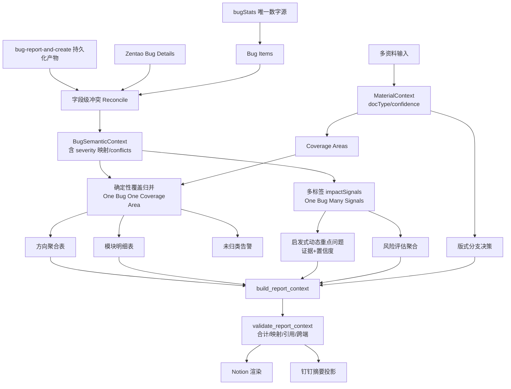

# 稳健测试报告流程设计 v2（含补强方案）

> 本文档在 v1《稳健测试报告流程设计》基础上，针对评审发现的 9 项不足给出对应解决方案，并整合为一份可执行的完整计划。

## 0. 设计不变量（Invariants）

这些是任何实现都不得违反的硬约束，作为全局验收基线：

1. **数字只来自 `bugStats`**：缺陷总数、级别分布、状态分布、清单完整性永远以 `bugStats` 为唯一事实源；资料只影响测试方向、场景、风险措辞、优先级。
2. **覆盖归并唯一，风险标签可多值**：一个 bug 只能归入一个测试方向（用于执行范围表合计），但可以拥有多个 `impactSignals`（用于重点问题和风险评估）。
3. **可追溯**：报告中任何"问题描述/业务影响"必须能回溯到真实缺陷的 bugID、标题或实际结果/预期结果原文，禁止臆造。
4. **降级不崩溃**：资料解析失败只降级、提示，绝不阻断报告产出。
5. **确定性与启发式分层**：数字与归并必须确定性可复现；措辞与类别可启发式，但需置信度门槛与证据。
6. **报告阶段只消费缺陷语义，不触发缺陷创建**：`bug-report-and-create` 只在缺陷录入阶段运行；报告流程只能读取其持久化产物或禅道 steps，不能重新调用该技能。

---

# 一、不足与对应解决方案

## 0. `bug-report-and-create` 输出缺少持久化（数据来源硬伤）

**问题**：计划依赖 `bug-report-and-create` 的结构化输出提取重点问题，但该技能当前主要是“对话中输出 + 写入禅道”，没有稳定落盘。报告阶段如果拿不到当时的前置条件、复现步骤、实际结果、预期结果，只能退化为标题分析，动态重点问题的质量会大幅下降。

**解决方案**：
- 缺陷创建成功后，将结构化 Bug 报告同步写入稳定产物，例如：
  - `mcp/output/bug-semantic/{projectId}-{date}.jsonl`
  - 或 handoff 中追加 `bugSemanticRecords[]`（小规模场景可用）
- 每条记录至少包含：
  ```python
  {
    "bugId": 3393,
    "source": "bug-report-and-create",
    "projectId": 1278,
    "module": "星豆明细",
    "title": "管理后台订单退款星豆未扣减可白嫖",
    "preconditions": [...],
    "steps": [...],
    "actualResults": [...],
    "expectedResults": [...],
    "severity": 3,
    "pri": 1,
    "openedBuild": "trunk",
    "createdAt": "2026-06-25T15:20:00+08:00"
  }
  ```
- 报告流程读取顺序：
  1. `bug-report-and-create` 持久化产物；
  2. 禅道 bug steps；
  3. `bugStats` 标题/模块/级别（低置信兜底）。
- 若结构化产物缺失，报告不阻断，但 `BugSemanticContext.sourceConfidence=low`，重点问题影响判断只能使用标题级保守措辞。

## 0.1 报告阶段不得触发 `bug-report-and-create`

**问题**：数据流写成 `bug-report-and-create → BugSemanticContext` 容易被误解为报告流程要触发该技能，而该技能自身规则明确“勿在拉缺陷汇总、测试报告、钉钉推送流程中触发”。

**解决方案**：
- 明确命名为 `bug-report-and-create persisted output`，表示只消费缺陷录入阶段留下的结构化记录。
- 报告流程禁止调用 `bug-report-and-create`；如需补全缺陷语义，只允许：
  - 读取已存在 JSONL / handoff；
  - 读取禅道 steps；
  - 使用标题低置信分析。
- SKILL 文档中必须写明：报告发布 Agent **只读消费**，不得二次创建或改写缺陷。

## 1. severity ↔ 报告级别 映射（正确性硬伤）

**问题**：禅道 `severity` 通常 1 最严重，而报告"一/二/三/四级"也常以一级最严重；若直接把 severity 数字当级别，可能整体反向或错位。

**解决方案**：
- 引入**显式映射表**，不允许隐式数字直传：
  ```python
  # 默认：禅道 severity(1=最严重) -> 报告级别(一级=最严重)
  SEVERITY_TO_LEVEL = {1: "一级", 2: "二级", 3: "三级", 4: "四级"}
  LEVEL_TO_RANK = {"一级": 1, "二级": 2, "三级": 3, "四级": 4}  # rank 越小越严重
  ```
- 映射表**可被项目配置覆盖**（不同禅道实例口径可能不同），并在 `BugSemanticContext` 里同时保留原始 `severity` 与派生 `level`、`levelRank`。
- **级别展示口径收紧**：报告正文展示级别、级别分布、排序优先级一律以 `bugStats.byLevel` 与 `bugStats` 列表中的级别为准；禅道 severity / `bug-report-and-create` severity 只作为语义辅助和冲突检测来源。
- **校验闸门**：发布前断言 `BugSemanticContext` 中影响级别的字段不会反向改写 `bugStats` 口径。若派生级别分布与 `bugStats` 不一致，记录 conflict；只有当报告渲染数字因此发生偏移时才阻断。
- 单测覆盖 severity=1..4 与异常值（0/5/null）的映射与兜底（未知 → 记 `unknownLevel`，不静默丢弃）。

## 2. 动态聚类的"确定性"承诺 vs 启发式张力

**问题**：`impactSignals` 词典与自动标签本质是启发式，但流程图标注 `Deterministic Matcher`，承诺与现实不符；自动高频词标签易产生噪音类别。

**解决方案**：
- **分层声明**：
  - 确定性层（必须可复现、可校验）：缺陷数字、状态/级别分布、bug→方向唯一归并、合计。
  - 启发式层（允许不完美，但需证据与置信度）：impactSignals 标签、动态类别、重点问题排序、业务影响措辞。
- impactSignals 采用**分级词典**：内置稳定词典（资金/数据一致性/链路阻断/权限安全/体验）为高置信；项目自动高频词标签标记为 `auto`、`confidence=low`，**默认不单独成类**，仅作为已有类别的辅助证据。
- 自动标签需通过**最小支持度阈值**（如同类缺陷≥N 条且词频显著）才提升为正式类别，并在报告内部留痕 `source=auto`。
- 重点问题表为启发式产物，提供 `needsReview` 标记位，便于人工快速复核。

## 3. 阈值魔法数字

**问题**：70% 覆盖率、"同类数量阈值"等缺乏依据，写死即另一种 hardcode。

**解决方案**：
- 所有阈值集中到**配置对象**，提供默认值 + 来源说明 + 可项目覆盖：
  ```python
  REPORT_THRESHOLDS = {
    "coverageMinRatio": 0.70,      # 低于则切模块明细优先模式
    "keyIssueClusterMin": 3,        # 三级同类达到该数才进重点问题
    "autoLabelMinSupport": 3,       # 自动标签最小支持度
    "autoLabelMinConfidence": 0.6,
  }
  ```
- 配置可经 CLI/项目配置文件覆盖；报告内部（debug 段）记录本次实际生效阈值，保证结果可解释、可复盘。
- 阈值变更纳入回放测试，避免调参导致历史报告口径漂移。

## 4. 多来源字段冲突 reconcile

**问题**：同一 bug 在 bug-report-and-create / 禅道 / bugStats 中字段（severity、状态、模块）不一致时无规则。

**解决方案**：
- 定义**字段级来源优先级 + 冲突策略**：
  ```python
  FIELD_SOURCE_PRIORITY = {
    "severity": ["zentao", "bug-report-and-create", "bugStats"],
    "status":   ["bugStats", "zentao", "bug-report-and-create"],  # 状态以统计口径为准
    "module":   ["zentao", "bug-report-and-create", "bugStats"],
    "steps":    ["bug-report-and-create", "zentao"],
  }
  ```
  说明：**状态/级别这类影响数字口径的字段以 `bugStats` 体系为准**（呼应不变量 1），描述性字段以更详细的来源为准。
- 冲突时按字段优先级取值，并在 `BugSemanticContext.conflicts[]` 记录 `{field, chosen, candidates}`，发布时汇总为"数据来源冲突 N 处"提示（不阻断，除非影响级别/状态合计）。
- 影响合计的冲突（如级别不一致导致分布对不上）升级为**阻断级**校验失败。

## 5. 防臆造的可落地约束

**问题**："业务影响不许臆造"是理念，缺生成期与校验期的可执行约束。

**解决方案**：
- **生成期**：业务影响字段限定为两种来源——(a) 直接引用 `actualResults`/`expectedResults` 原文片段；(b) 从受控的**影响短语模板库**中按 impactSignals 选取（如"资金安全 → 直接资损/欠费累加"）。禁止自由发挥长句。
- 每个重点问题行强制携带 `evidenceRef`（bugID 或标题原文哈希），无证据不得入表。
- **校验期（可机检指标）**分阻断与降级两档：
  - 重点问题引用的每个 bugID/标题必须存在于 `bugStats`，否则阻断。
  - 业务影响文本若非模板库命中，必须能在对应缺陷的 actual/expected 文本中找到子串来源；若找不到，不直接阻断，而是降级为 `影响待复核` 或移除该影响判断，并记录 `unverifiedImpact` 告警。
  - 只有当不可溯源文本仍被渲染为确定性结论时才阻断。
- 这样把"不臆造"从主观要求转成可自动断言的约束。

## 6. 兼容层双轨迁移风险

**问题**：`test_plan_material.py` 与 `material_context.py` 并存期易产出不一致。

**解决方案**：
- 引入 `--material-engine legacy|context|shadow`，默认 `shadow`：
  - `shadow` 模式下两套并行执行，**以新引擎结果为准输出**，同时 diff 旧引擎结果并记录差异日志。
- 设定迁移退出标准：连续 N 次真实任务 shadow diff 无实质差异（数字层 0 差异、措辞层差异可接受）后，切默认 `context` 并**给兼容层加弃用告警**。
- 迁移完成后删除 legacy 路径，避免长期双轨。

## 7. Notion 与钉钉双端口径一致

**问题**：`build_dingtalk_summary()` 与 Notion 全量是两套生成，易出现两端数字不一致。

**解决方案**：
- 统一为 `build_report_context()` **单一上下文**，Notion 与钉钉都只做"渲染"，不各自计算数字。
- 钉钉摘要 = 报告 context 的第一节结论 + 重点问题 Top-N 视图（同一对象的裁剪投影，而非重新统计）。
- 增加**跨端一致性校验**：断言钉钉摘要中出现的总数/级别/状态数字与 Notion 渲染数字完全一致，不一致阻断推送。

## 8. docType / confidence 下游闭环

**问题**：解析出的 `docType`/`confidence` 除覆盖率阈值外未真正驱动行为。

**解决方案**：明确将其接入版式决策：
| docType / 置信度 | 下游行为 |
| --- | --- |
| test_plan 且高置信 | 出完整"测试方向聚合 + 范围全景"表 |
| outline / prd 中置信 | 出测试方向聚合，范围表标注"依据资料推断" |
| freeform / 低置信 | 仅出模块明细，顶部提示"资料未充分参与范围归并" |
| unknown / 覆盖率 < 阈值 | 切"模块明细优先"模式，隐藏范围全景表 |
- 报告内部 debug 段记录 `docType`、`confidence`、生效版式分支，保证可解释。

## 9. 性能、成本与多模板

**问题**：BugSemanticContext 若走 LLM 解析 steps，大批量缺陷的耗时/成本未评估；版式固定中文单模板。

**解决方案**：
- **性能/成本**：
  - steps 结构化优先用规则解析，仅在缺结构时回退 LLM；对 LLM 解析结果按 bugID + 内容哈希做**缓存**，避免重复解析。
  - 批处理 + 并发上限；记录每次运行的缺陷条数、解析耗时、token 估算，纳入可观测日志。
- **多模板/多语言**：
  - 模板与文案抽到 `report_templates/{locale}/{kind}.py|json`，支持 `--locale zh-CN|en-US` 与 `--template <name>`，默认中文标准模板。
  - 文案走资源表，避免硬编码中文，便于多客户/多语言扩展。

---

# 二、整合后的目标架构

## 2.1 目标版式（标准报告）

以标准测试报告为目标模板，结构固化为：

- **报告信息 callout**：项目、测试类型、覆盖期、负责人、开发者、版本号。
- **一、测试结论**：冒烟/功能/回归结论 callout + 缺陷指标看板 + 一句话总结。
- **二、重点问题**：由 `BugSemanticContext` 动态聚类生成，列为 `# / 动态类别 / 关联缺陷 / 问题本质 / 影响判断 / 级别·优先级 / 证据来源`。
- **三、测试范围与执行情况**：测试方向聚合表 + 模块级缺陷分布明细表。
- **四、风险评估与处置建议**：按风险方向聚合（不照搬缺陷模块），含隐藏风险标注位。
- **五、后续计划**：下一轮修复、回归、专项验证动作。
- **附录**：未解决清单、待回归清单用 toggle 收起。

## 2.2 数据流（含补强点）



## 2.3 关键数据结构

`MaterialContext`：
```python
{
  "docType": "test_plan|outline|prd|testcase|checklist|freeform|unknown",
  "confidence": 0.0,
  "sources": [...],
  "coverageAreas": [{"name": "", "aliases": [], "priority": "P0", "evidence": [], "scenarios": []}],
  "risks": [...],
  "unknownSections": [...],
  "parseWarnings": []
}
```

`BugSemanticContext`：
```python
{
  "bugId": 3393,
  "module": "星豆明细",
  "title": "管理后台订单退款星豆未扣减可白嫖",
  "severity": 3,            # 原始值
  "level": "三级",          # 经 SEVERITY_TO_LEVEL 派生
  "levelRank": 3,
  "priority": 1,
  "status": "激活-待确认",
  "preconditions": [...], "steps": [...],
  "actualResults": [...], "expectedResults": [...],
  "impactSignals": [{"label": "资金安全", "source": "builtin", "confidence": 0.9}],
  "coverageAssignment": {
    "area": "星豆体系",
    "matchRule": "exact|alias|materialAlias|titleKeyword|unmatched",
    "confidence": 0.9,
    "evidence": "module:星豆明细"
  },
  "rootProblem": "退款后账本未扣减",
  "userImpact": "已退款星豆仍可继续使用",
  "evidenceRef": "zentao#3393",
  "sourceConfidence": "high|medium|low",
  "conflicts": [{"field": "severity", "chosen": 3, "candidates": {"zentao": 3, "bugStats": 2}]
}
```

其中：
- `coverageAssignment` 是确定性归并结果，一个 bug 只能有一个，用于第三节“测试范围与执行情况”的合计。
- `impactSignals` 是启发式风险标签，一个 bug 可以有多个，用于第二节“重点问题”和第四节“风险评估”。
- 两者不能互相替代，避免为了合计唯一而丢风险，或为了多风险而导致执行表重复计数。

---

# 三、校验闸门清单（发布前必过）

阻断级（任一失败则不发布）：
1. 各统计表含合计行，且合计等于 `bugStats` 对应口径。
2. 每条缺陷只能有一个 `coverageAssignment`；第三节测试方向聚合不得重复计数。
3. 重点问题引用的 bugID/标题均存在于 `bugStats`。
4. 报告正文展示的级别分布 == `bugStats` 级别分布；severity 映射冲突不得反向污染展示数字。
5. 重点问题中的“问题描述/关联缺陷/级别/状态”必须可追溯；不可溯源的业务影响不得以确定性结论输出。
6. 钉钉摘要数字 == Notion 渲染数字。
7. 影响合计的来源冲突（级别/状态）必须清零。

告警级（提示但不阻断）：
- 资料解析失败 / 降级原因、资料参与状态。
- 覆盖率低于阈值 → 自动切模块明细优先模式。
- 非阻断字段冲突计数。
- 自动标签 `confidence=low`、`needsReview` 项数。
- `bug-report-and-create` 持久化产物缺失，已降级为禅道 steps 或标题级语义分析。
- 业务影响不可溯源，已降级为“影响待复核”或未渲染。

---

# 四、可执行步骤

1. 新增缺陷语义持久化约定：缺陷创建成功后写入 `mcp/output/bug-semantic/{projectId}-{date}.jsonl`，报告阶段只读消费。
2. 新增 `mcp/scripts/lib/material_context.py`：多资料解析 → `MaterialContext`，docType/confidence 接入版式分支。
3. 新增 `mcp/scripts/lib/bug_semantic_context.py`：三来源整合（bug-report-and-create 持久化产物 / 禅道 steps / bugStats 标题）+ `SEVERITY_TO_LEVEL` 映射 + 字段级 reconcile + conflicts 记录。
4. 新增动态重点问题提取器：内置/自动分级词典 + 置信度门槛 + 模板化影响短语 + `evidenceRef`；不可溯源影响降级为“影响待复核”。
5. 新增确定性覆盖归并模块：固定匹配优先级、一个 bug 一个测试方向、未归类告警、合计闸门。
6. 新增风险多标签模块：一个 bug 可有多个 `impactSignals`，用于重点问题和风险评估，不参与执行范围合计。
7. `publish_report.py` 拆分：`build_report_context()` / `build_standard_report_blocks()` / `build_dingtalk_summary()`（投影）/ `validate_report_context()`。
8. 阈值与映射集中到配置对象，支持 CLI/项目覆盖，运行时记录生效值。
9. 增加 `--report-kind smoke|functional|regression|auto`、`--material-engine legacy|context|shadow`、`--material-file`（多文件）、`--material-page-id`（多页）、`--locale`、`--template`。
10. 建立回放测试集：测试计划/逻辑大纲/PRD/无表自由文本/错误资料/空资料/仅标题缺陷/含完整 steps 缺陷/缺陷语义持久化缺失/多来源冲突/severity 边界，断言不崩、不重复计数、不编造、级别不反。
11. 性能与成本：steps 规则优先 + LLM 回退 + 结果缓存 + 批处理上限 + 可观测日志。
12. 兼容层灰度：shadow 模式 diff → 达标后切 context → 删除 legacy。
13. 更新 `bug-report-and-create/SKILL.md`：新增结构化缺陷语义持久化产物；更新 `qa-agent-report-publish/SKILL.md` 与 `test-report-notion/SKILL.md`：流程从"解析 1.4.1 表"改为"构建 MaterialContext + BugSemanticContext + 标准报告模板"，并写入第三节校验闸门清单。

---

# 五、验收标准

- 切换项目无需改代码即可生成正确报告（重点问题、范围、风险均由数据驱动）。
- 任意资料缺失/错误均不导致崩溃，仅降级并提示。
- 所有报告数字可追溯至 `bugStats`，重点问题可追溯至真实缺陷。
- 报告阶段不触发 `bug-report-and-create`，只读取其持久化产物；产物缺失时可降级但需提示。
- 第三节执行范围表合计不重复；第四节风险标签可多值但不参与范围合计。
- 级别分布、状态分布、跨端数字三处一致，校验闸门全绿。
- 回放测试集全部通过，新增项目接入仅需配置 alias 与阈值。
