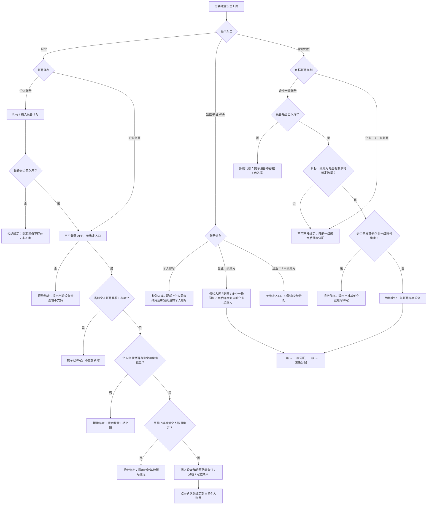
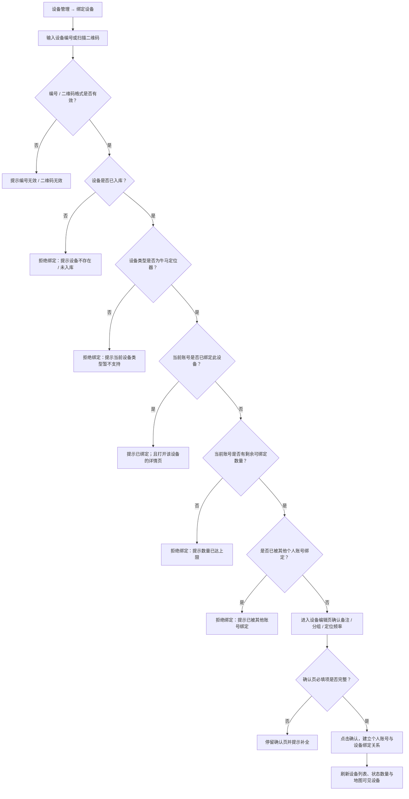
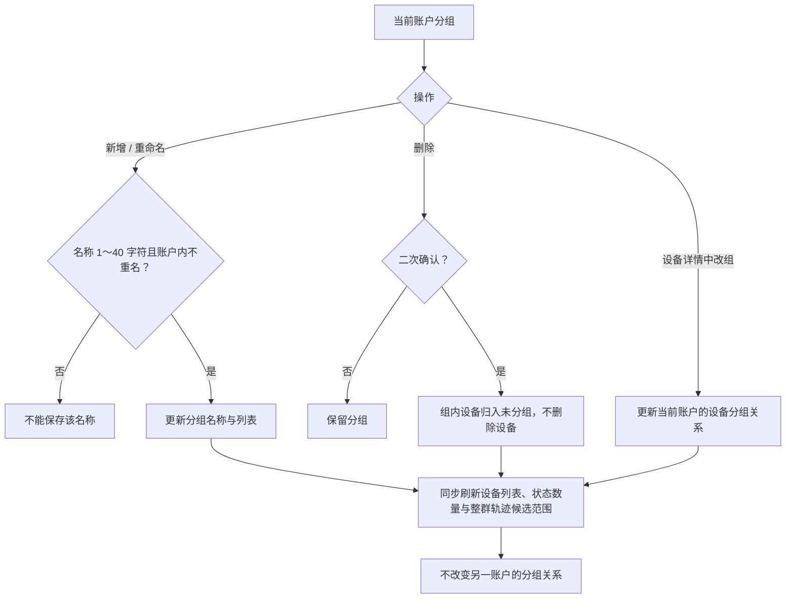
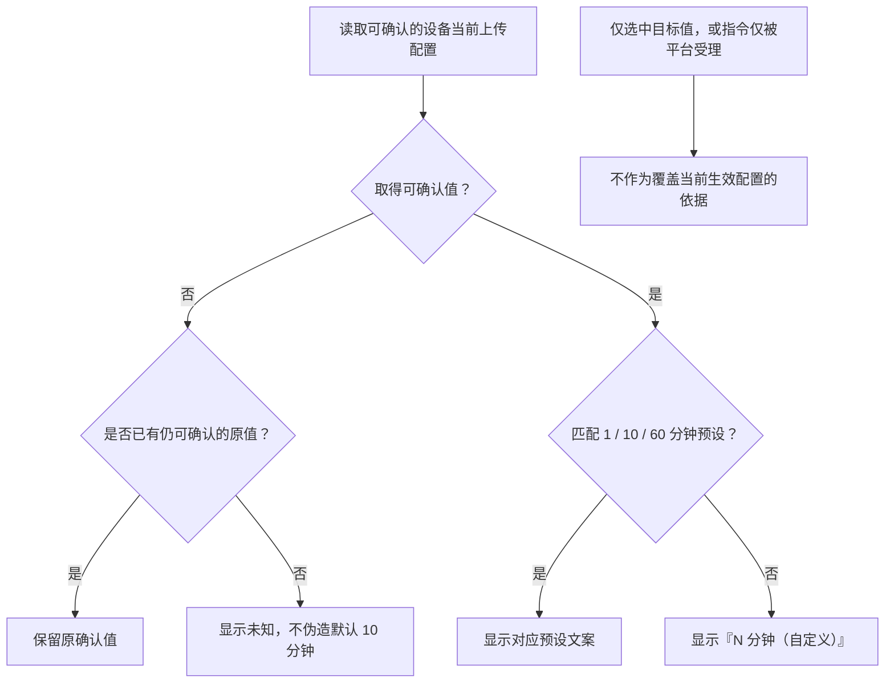
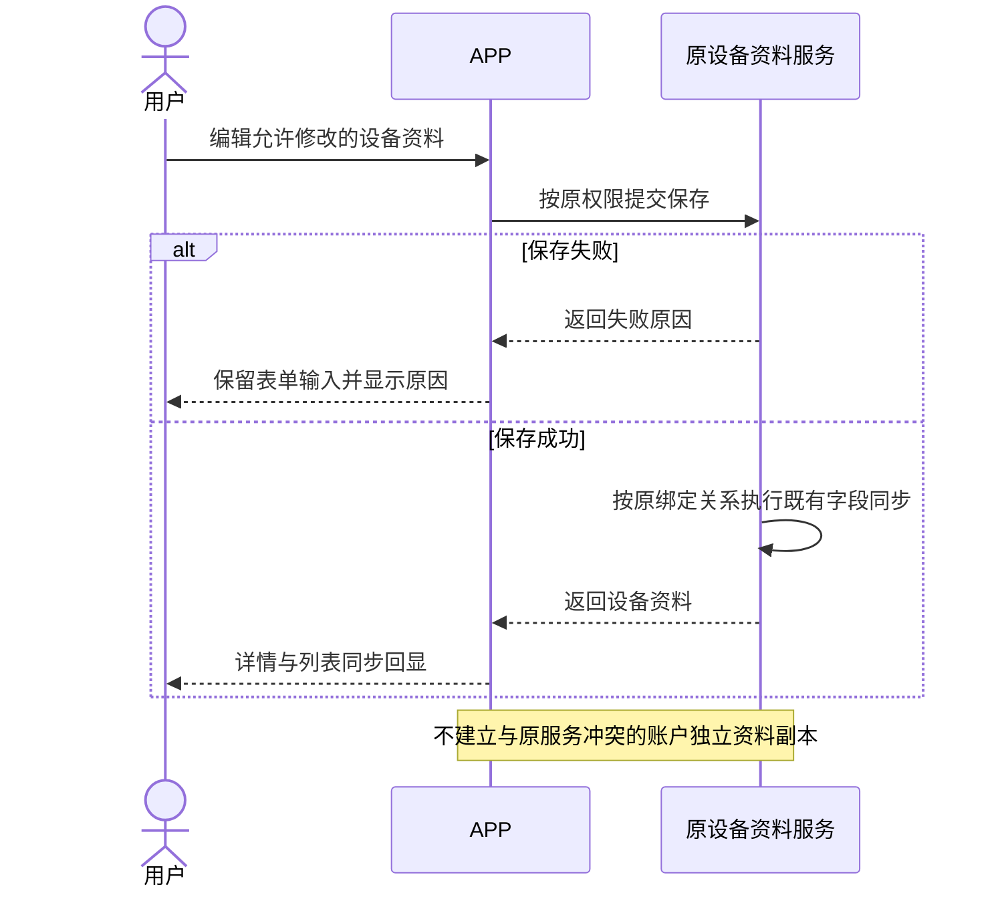
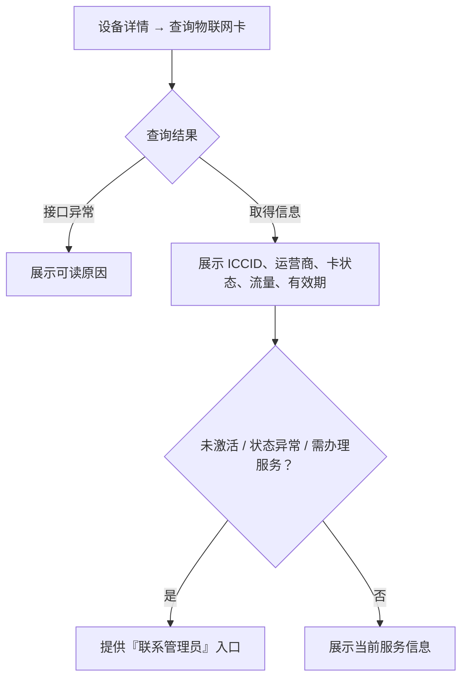
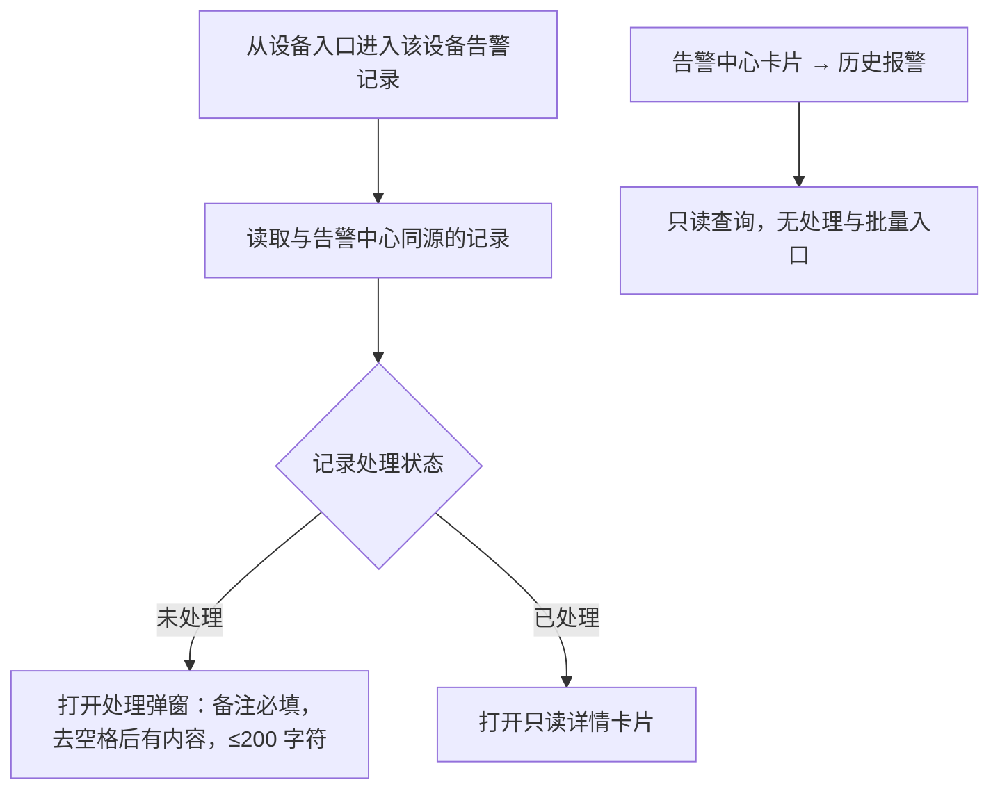
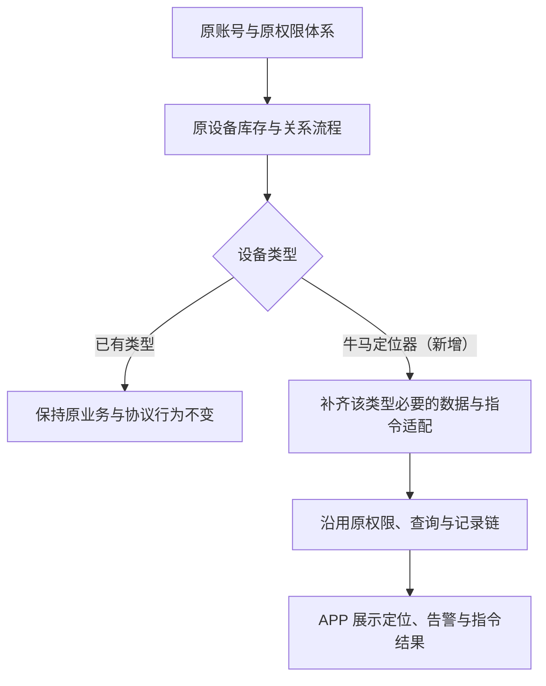

# 革泰 APP 设备管理逻辑点梳理.plan

<aside>
🎯

**文档用途**：梳理革泰 APP「设备管理（牛马定位器）」相关功能的核心逻辑规则、流程与边界，作为后续测试用例编写的依据。

**适用范围**：覆盖 US-015 设备筛选与快捷操作、US-016 绑定牛马定位器、US-017 设备分组、US-018 设备资料与物联网卡、US-019 设备入口告警、US-032 新类型接入原平台；并关联 US-006/US-007 的设备状态计数、US-020～US-022 指令入口。告警处理、围栏判定、轨迹回放本身仅作关联引用，不展开。

**存量对齐**：设备绑定 / 解绑级联、设备标签（我的 / 用户 / 好友）、设备备注单存储、分配方式（同步分组和设备 / 仅分配设备）、账号层级与配额等，全部以原监控平台既有逻辑为基准，汇总在第 3.5～3.7 与第 9 节；与 APP 新规则冲突或本期未定的部分列入第 11 节。

</aside>

---

## 1. 账号类型、绑定权与设备可见范围

| 账号类型 | 可发起绑定的入口 | 设备范围来源 | 分组 / 资料操作 |
| --- | --- | --- | --- |
| 个人账户 | ✅ **仅 APP**：个人账号登录后扫码或输入设备编号绑定 | 自己绑定的设备 | 可管理自己账户内的分组；可编辑权限内的设备资料 |
| 企业一级账号 | ✅ 监控平台 Web 自行绑定
✅ 管理后台可代其绑定
❌ APP 不可登录，入口不可达 | 自行绑定 + 管理后台代绑 | 在 Web / 后台向下逐级分配设备与分组 |
| 企业二 / 三级账号 | ❌ **三端均无绑定入口**，只能由对应父级分配 | 一级 → 二级 → 三级 逐级分配 | 仅在原授权范围内查看与操作 |

<aside>
⚠️

**关键隔离规则**

1. **绑定权只在两处产生**：设备绑定关系只能由**个人账号（APP）**或**企业一级账号（监控平台 Web 自绑 / 管理后台代绑）**建立。二级、三级账号**永远不产生绑定关系**，只通过父级分配获得可见范围。
2. **可见 ≠ 可操作**：当前账户仅管理自己有权限的设备绑定、分组与围栏关系；界面隐藏按钮不能代替服务端授权。
3. **双绑共存**：一台牛马定位器可同时被 1 个个人账户与 1 个企业一级账号绑定，两条绑定分别经 APP 与 Web / 后台产生，互不阻断；**已有另一类账户绑定不是单独拒绝理由**。
4. **设备事实唯一**：设备身份、位置、电量、运行状态唯一，不同账户看到的是同一台物理设备；分组归属则按账户分别管理。
5. **APP 只有个人视角**：企业账号在 APP 端不可登录（见登录梳理第 3.6 节），因此 APP 内**不存在企业绑定入口**，也就不存在「二 / 三级子账号在 APP 绑定被服务端拒绝」这类用例——正确的用例是**该入口在 APP 根本不可达**。企业侧绑定、分配与越权校验以监控平台 Web / 管理后台为准。
</aside>

---

## 2. 设备列表与状态筛选（US-015）

<aside>
⚠️

**状态统计计数规则（本期口径）**

1. **设备列表只展示三种设备状态**：在线、离线、告警。前端不展示「未连接」独立状态，不设置「未连接」筛选项，也不单独统计未连接数量。
2. **离线 = 离线 + 未连接**：设备已有通信记录但当前不可通信时，展示为离线；设备初始化绑定后，尚无任何数据上报，也没有完成过有效下发 / 通信建立时，属于未连接，但在设备列表中统一按离线展示、筛选和计数。
3. **在线 / 离线为基础状态**：同一统计范围内，在线数 + 离线数 = 设备总数；未连接设备计入离线数，不额外增加第三类基础状态。
4. **告警为设备状态优先展示**：告警表示设备触发了告警。设备处于告警状态时，列表筛选可命中「告警」，卡片右侧状态优先展示「告警」。
5. **告警仍需保留在线 / 离线底层差异**：告警设备当前在线时，图标展示为告警 + 在线角标；告警设备当前离线或未连接时，图标展示为告警 + 离线角标，第三行展示「离线，无法下发指令」。
6. **设备按唯一标识去重统计**：同一设备通过多条关系可见时，设备总数、在线数、离线数、告警数均按设备唯一标识去重，不重复计数。
</aside>

| 统计项 | 计数范围 | 说明 |
| --- | --- | --- |
| 全部 | 当前账户可见的全部设备去重数 | 包含在线、离线、未连接与告警设备；未连接不单独拆分 |
| 在线 | 当前明确在线的设备去重数 | 若设备触发告警，同时可进入告警筛选；卡片右侧优先展示告警 |
| 离线 | 当前离线设备 + 初始化未连接设备的去重数 | 未连接来源于设备初始化绑定后尚无数据上报与有效通信；统一归入离线 |
| 告警 | 当前触发告警的设备去重数 | 告警是设备状态优先展示项；不在本节展开告警来源 |

**状态组合与计数归属**

| 设备实际情况 | 计入全部 | 计入在线 | 计入离线 | 计入告警 |
| --- | --- | --- | --- | --- |
| 在线，无告警 | ✅ | ✅ | ❌ | ❌ |
| 离线，无告警 | ✅ | ❌ | ✅ | ❌ |
| 初始化未连接，无告警 | ✅ | ❌ | ✅ | ❌ |
| 告警 + 在线 | ✅ | ✅ | ❌ | ✅ |
| 告警 + 离线 | ✅ | ❌ | ✅ | ✅ |

### 2.2 筛选、搜索与卡片字段

| 项 | 规则 | 边界与易错点 |
| --- | --- | --- |
| 状态筛选 | 全部 / 在线 / 离线 / 告警，各带数量 | 一次只选一项；默认离线设备必须能在「全部」「离线」中找到 |
| 搜索字段 | 设备编号、名称、备注、序列号 | 不区分大小写、忽略首尾空格；**备注展示与备注检索必须是同一份业务备注** |
| 分组筛选 | 全部分组 / 具体分组 / 未分组；支持按分组名称搜索 | 分组数量不随当前状态与关键词减少；状态数量不随关键词减少 |
| 条件组合 | 状态 × 分组 × 关键词取**交集** | 改一项不清空其他项；清空关键词恢复当前状态 + 分组范围 |
| 卡片字段 | 第一行展示备注优先、设备编号兜底；第二行展示电池图标 + 电量；第三行展示定位频率 / 离线提示；保留左侧图标状态与右上角更多入口 | 卡片内不再展示分组名称、字段分隔符和右侧在线 / 离线 / 告警文字标签；电量缺失或越界显示 Unknown，不按 0% 处理 |
| 列表操作 | 刷新、整群轨迹、指令下发 | 指令下发进入多选模式 |
| 行内菜单 | 设备详情、实时位置、历史轨迹、查看/配置围栏、解除当前账户绑定 | 跳转一律携带**设备唯一标识**，不以名称作为身份 |

### 2.3 设备卡片展示元素

<aside>
🎯

**本节口径**：以下规则来自「革泰 APP-设备卡片展示元素.plan」确认稿。若与旧卡片大纲冲突，以本节为准。本节只约束设备卡片展示元素、显示条件、布局边界与卡片本体点击行为；不改变绑定流程、批量指令、全选规则、列表排序或刷新机制。

</aside>

**设备卡片结构**

| 区域 | 展示内容 | 规则 |
| --- | --- | --- |
| 左侧设备图标 | 系统固定设备图标 | 按设备类型固定展示，添加设备及后续编辑时均不可修改图标形态。 |
| 图标主体与角标 | 状态颜色 + 右上角角标 | 在线绿色，离线 / 未连接灰色，存在未处理告警时红色；告警态通过角标保留在线 / 离线差异。 |
| 第一行 | 备注优先，设备编号兜底 | 有备注显示备注；备注为空时显示设备编号；不额外附加编号，不新增备注唯一性限制。 |
| 第二行 | 电池图标 + 电量 | 有效电量展示百分比，缺失或越界显示 Unknown。有效电量 < 20%，图标颜色为红色；有效电量 ≥ 20%，图标为绿色 |
| 第三行 | 定位频率及模式 / 离线提示 | 在线显示定位频率及模式；离线 / 未连接统一显示「离线，无法下发指令」。 |
| 更多入口 | 右上角竖向三点 | 所有设备状态均保留；独立于卡片本体点击。 |
| 卡片本体点击 | 进入对应设备详情 | 在线、离线、未连接、告警状态均保持相同跳转目标；跳转必须携带设备唯一标识。 |

**第三行定位频率与离线提示**

| 情况 | 展示文案 |
| --- | --- |
| 在线，1 分钟 | 1分钟定位（耗电模式） |
| 在线，10 分钟 | 10分钟定位（默认模式） |
| 在线，60 分钟 | 1小时定位（省电模式） |
| 在线，自定义 N 分钟 | 自定义模式（N分钟） |
| 在线，无可确认频率 | 表达频率未知，确切占位文案待确认 |
| 离线 / 未连接，无论是否有已知频率 | 离线，无法下发指令 |
- 自定义 N 沿用 1～1440 整数分钟；N 为 1、10、60 时，优先展示对应预设文案。
- 定位频率与 APP 刷新间隔不是同一概念，本节不改变页面刷新设置。
- 绑定时填写的目标值、编辑选择值、平台受理结果均不自动等于设备已生效值。
- 没有可确认值时表达未知，不自行填入 10 分钟默认值。
- 截图中的灰色离线卡片继续显示定位频率不采纳；离线 / 未连接统一替换为离线提示。
- 截图中的「1 分钟 = 省电模式」不采纳；沿用 1 分钟耗电、10 分钟默认、60 分钟省电。

**布局与展示边界**

| 区域 | 约束 |
| --- | --- |
| 第一行备注 / 兜底编号 | 单行尾部省略，不挤压更多入口 |
| 电量数值 | 优先完整展示，不截断；缺失时不再隐藏，改为 Unknown |
| 第三行 | 单行过长尾部省略；多语言及大字体下关键语义如何保护需补充设计 |
| 设备图标与角标 | 固定尺寸和位置，不被文本挤压或遮挡 |
| 更多入口 | 各状态保留，不被长文本遮挡 |

**待确认项与建议**

以下内容未确认为正式需求，不能直接作为开发实现或测试通过标准。

| 待确认项 | 具体缺口 | 建议，尚未采纳 |
| --- | --- | --- |
| 历史电量提示 | 最终文案、位置、换行、行高及溢出处理 | 可在第二行采用「电池图标 65% · 上次上报」，第三行保留离线提示 |
| Unknown 图标 | 是否保留图标、颜色和填充形态 | 中性灰色未知态，避免像满电或低电 |
| 告警角标 | 在线 / 离线的具体颜色、形状和辨识方式 | 提供两种明确视觉稿，并补充非颜色提示与读屏语义 |
| 标题空值 | 纯空白备注归一化；备注和编号均缺失的异常兜底 | 纯空白按空处理，异常数据避免无标题卡片 |
| 电量精度与异常 | 小数、舍入、非法类型、历史有效值与新异常值优先级 | 避免显示 20% 却因原始小数值而标红，异常数据不当正常百分比 |
| 在线频率未知 | 确切占位文案 | 可使用「定位频率未知」 |
| 离线整卡样式 | 是否弱化及弱化范围 | 建议只改变状态图标，不把整卡呈现为不可点击 |
| 长文案与多语言 | 历史电量提示及模式名称在窄屏、大字体下的显示 | 优先保留电量及关键状态含义，验证长备注、翻译膨胀和读屏 |
| 在线恢复后的历史电量 | 已恢复通信但尚无新电量时历史标记如何处理 | 不仅凭通信恢复就把旧电量表达为实时数据 |

列表默认排序、状态刷新机制等原有待确认事项未在本轮解决，也不纳入本节新增设计。

---

## 3. 设备绑定与解绑（US-016 / US-015）

### 3.1 绑定入口与主流程

**入口 × 账号类别分流（本期已确认）**

绑定入口按「入口」和「账号类别」同时判断，不能只按端来理解。APP 和监控平台均可以发起设备绑定；管理后台不绑定到操作员自己名下，而是为企业一级账号代绑设备。三类入口的共同前提是：**设备必须已入库**。设备未入库时，任何入口均不得绑定成功，并需给出对应提示。

| 入口 | 账号类别 / 操作主体 | 是否可发起绑定 | 绑定落到谁名下 | 入库前置 | 不满足时预期 |
| --- | --- | --- | --- | --- | --- |
| APP | 个人账号 | ✅ 可绑定 | 当前登录个人账号 | 必须已入库 | 未入库则拒绝绑定，并提示设备不存在 / 未入库等对应原因 |
| APP | 企业账号 | ❌ 不可达 | — | — | 企业账号不可登录 APP，因此无 APP 绑定入口 |
| 监控平台 Web | 个人账号 | ✅ 可绑定 | 当前登录个人账号 | 必须已入库 | 未入库则拒绝绑定，并提示设备不存在 / 未入库等对应原因 |
| 监控平台 Web | 企业一级账号 | ✅ 可绑定 | 当前登录企业一级账号 | 必须已入库 | 未入库则拒绝绑定，并提示设备不存在 / 未入库等对应原因 |
| 监控平台 Web | 企业二 / 三级账号 | ❌ 不可绑定 | — | — | 无绑定入口；只能由父级分配设备 |
| 管理后台 | 运营 / 管理员 | ✅ 可代绑 | 指定企业一级账号 | 必须已入库 | 未入库则拒绝代绑，并提示设备不存在 / 未入库等对应原因 |
| 管理后台 | 企业二 / 三级账号作为目标 | ❌ 不可作为绑定目标 | — | — | 不支持直接为二 / 三级账号绑定，只能先绑定到一级账号，再由一级逐级分配 |

<aside>
⚠️

**入口分流核心**

1. **APP 与监控平台都可以绑定设备**：APP 面向个人账号；监控平台面向个人账号与企业一级账号。
2. **管理后台是代绑入口**：操作主体是运营 / 管理员，绑定目标是企业一级账号，不是绑定到管理员自己名下。
3. **设备入库是所有绑定入口的共同前提**：APP、监控平台、管理后台均要求设备已入库；未入库一律不能绑定成功。
4. **二 / 三级账号不产生绑定关系**：无论在 APP、监控平台还是管理后台目标选择中，二 / 三级账号都不能直接建立绑定，只能通过父级分配获得设备可见范围。
</aside>



<aside>
⚠️

**分配 ≠ 绑定**：二 / 三级账号获得设备属于「被分配」，不产生新的绑定占用，也不占用「1 个个人 + 1 个一级企业」的唯一性名额。解绑、改绑、强制替换等动作只对**绑定关系**生效；对分配关系表现为随父级级联变化。用例设计时不要把「分配成功」写成「绑定成功」。

</aside>

**APP 绑定主流程（个人账号）**



### 3.2 绑定前置与拦截清单

| 校验项 | 是否绑定前置 | 校验规则 | 未满足时预期 |
| --- | --- | --- | --- |
| 编号 / 二维码格式 | ✅ 是 | 用户输入或扫码结果必须能解析为系统可识别的SN码 | 提示编号无效 / 二维码无效；不进入后续查库与确认页。 |
| 设备是否已入库 | ✅ 是 | 设备必须已在管理后台完成入库；APP、监控平台 Web、管理后台代绑均适用。 | 拒绝绑定，提示设备不存在 / 未入库等对应原因。 |
| 设备类型是否支持当前入口 | ✅ 是 | 革泰 APP 当前仅支持牛马定位器；已入库但类型为北斗、星联卫士等旧类型时，不允许在 APP 绑定。设备类型以后台入库维护的类型 / 型号 / 品类字段为准，不以名称或二维码文案判断。 | 拒绝绑定，提示当前设备类型暂不支持；不要误提示为设备不存在。 |
| 账号类别与入口权限 | ✅ 是 | APP 仅个人账号可绑定；监控平台 Web 支持个人账号与企业一级账号绑定；管理后台为指定企业一级账号代绑；企业二 / 三级账号不直接产生绑定关系，只能由父级分配。 | 无入口或拒绝绑定；二 / 三级账号场景提示只能由父级分配。 |
| 当前账号是否已绑定 | ✅ 是 | 当前账号 / 目标账号已绑定该设备时，视为重复绑定，不新增关系、不增加数量。 | 提示已绑定 / 已添加；APP 可直接打开该设备详情页。 |
| 账号剩余可绑定设备数量 | ✅ 是 | 个人账号绑定消耗个人账号配额；企业一级账号自绑或后台代绑消耗目标一级账号配额。二 / 三级被分配是否消耗可见 / 分配数量，需按企业分配规则另行确认，不应混同为绑定配额。 | 拒绝绑定，提示数量已达上限 / 可绑定设备数量不足。 |
| 是否已被其他同级别账号绑定 | ✅ 是 | 个人绑定时，若已被其他个人账号绑定则拒绝；企业一级绑定 / 后台代绑时，若已被其他企业一级账号绑定则拒绝。个人 + 企业一级属于不同绑定层级，可双绑共存。 | 拒绝绑定，提示已被其他账号绑定 / 已被其他企业账号绑定。 |
| 确认页必填项 | ✅ 是，但属于确认页保存条件 | APP 进入设备编辑确认页后，需校验分组、定位频率等必填项；备注可为空或使用默认值；设备图标固定不可修改。 | 停留确认页并提示补全；不建立绑定关系。 |
| 设备是否激活 | ❌ 否 | 不作为绑定成功 / 失败的前置条件。 | 不拦截绑定；绑定后可能影响位置、轨迹、在线状态或通信能力。 |
| 物联网卡状态 | ❌ 否 | 无 SIM、未激活、停机、已拆机、卡状态异常等不作为绑定前置。 | 不拦截绑定；仅在设备详情 / 物联网卡查询 / 通信异常场景中展示或提示联系管理员。 |
| 设备是否在线 / 是否已有上报 | ❌ 否 | 不要求设备当前在线，也不要求已有定位或数据上报。 | 不拦截绑定；绑定后若无上报 / 无有效通信，按未连接来源归入离线展示。 |

**建议拦截优先级**

1. 编号 / 二维码格式无效；
2. 设备未入库 / 设备不存在；
3. 设备类型不支持当前入口；
4. 当前账号类别或目标账号无绑定权限；
5. 当前账号 / 目标账号已绑定该设备；
6. 账号剩余可绑定设备数量不足；
7. 已被其他同级别账号绑定。

<aside>
💡

**设计原则**：绑定只验证「能不能建立归属关系」，不验证「设备当前能不能正常工作」。激活、物联网卡、在线、定位上报属于绑定后的使用状态，不应阻断绑定。

</aside>

### 3.3 解绑流程与级联边界

- **入口 × 操作主体 × 被操作对象矩阵**
    
    
    | 入口 | 操作主体 | 被操作对象 | 动作性质 | 影响范围 |
    | --- | --- | --- | --- | --- |
    | 📱 APP · 设备管理 | 个人账号 | 自己设备列表中的设备 | 个人绑定解绑 | 当前个人账号在 APP / Web 均不可见；清除个人侧分组与围栏设备关联；不影响企业链路。 |
    | 🖥️ Web · 设备管理 | 个人账号 | 自己设备列表中的设备 | 个人绑定解绑 | 当前个人账号在 Web / APP 均不可见；清除个人侧分组与围栏设备关联；不影响企业链路。 |
    | 🖥️ Web · 设备管理 | 企业一级账号 | 自己设备列表中的设备 | 企业一级绑定解绑 | 一级自己不可见；所有二级、三级通过该一级获得的设备关系立即失效；清除整条企业链路内分组与围栏设备关联；不影响个人绑定关系。 |
    | 🖥️ Web · 设备管理 | 企业二级账号 | 自己设备列表中的设备 | 二级分配关系移除 | 二级自己不可见；该二级下所有三级立即失效；一级仍可见；其他二级及其三级不受影响；清除该二级及其下三级分组与围栏设备关联。 |
    | 🖥️ Web · 设备管理 | 企业三级账号 | 自己设备列表中的设备 | 三级分配关系移除 | 仅该三级自己不可见；一级、二级、同二级下其他三级均不受影响；清除该三级分组与围栏设备关联。 |
    | 🖥️ Web · 用户管理 | 企业一级账号 | 指定二级账号设备 | 一级回收二级分配 | 一级仍可见；指定二级不可见；该二级下所有三级立即失效；其他二级及其三级不受影响；清除被回收链路分组与围栏设备关联。 |
    | 🖥️ Web · 用户管理 | 企业一级账号 | 指定二级对应的三级账号设备 | 一级经用户管理路径回收三级分配 | 一级仍可见；二级仍可见；指定三级不可见；同二级下其他三级不受影响；仅清除该三级分组与围栏设备关联。 |
    | 🖥️ Web · 用户管理 | 企业二级账号 | 指定三级账号设备 | 二级回收三级分配 | 一级仍可见；二级仍可见；指定三级不可见；同二级下其他三级不受影响；仅清除该三级分组与围栏设备关联。 |
    | 🛠️ 管理后台 | 后台管理员 / 运营人员 | 指定个人账号绑定关系 | 后台解绑个人 | 指定个人账号在 APP / Web 均不可见；清除该个人侧分组与围栏设备关联；不影响企业链路。 |
    | 🛠️ 管理后台 | 后台管理员 / 运营人员 | 指定企业一级账号绑定关系 | 后台解绑一级 | 一级、所有二级、所有三级企业链路立即失效；清除整条企业链路内分组与围栏设备关联；不影响个人绑定关系。 |
    | 🛠️ 管理后台 | 后台管理员 / 运营人员 | 企业一级 A → 企业一级 B | 后台改绑 | 等价于「解绑 A + 绑定 B」；A 下所有二 / 三级分配立即失效；B 下级默认不可见，需重新分配；个人绑定关系保留。 |
- **APP 分支树**
    
    ```
    📱 APP · 设备管理删除设备
    └─ 👤 个人账号删除自己的设备
       ├─ 动作性质：个人绑定解绑
       ├─ 当前个人账号在 APP 不可见
       ├─ 同一个人账号在监控平台 Web 同步不可见
       ├─ 清除个人侧分组关系
       ├─ 清除个人侧围栏设备关联
       ├─ 后续重新绑定同一设备，原围栏关联不自动恢复
       ├─ 保留历史位置 / 轨迹 / 告警 / 指令等历史数据
       └─ 不影响企业一级 / 二级 / 三级链路
    ```
    
- **Web 平台分支树**
    
    ```
    🖥️ 监控平台 Web 删除 / 移除设备
    ├─ A. 设备管理入口：当前账号删除自己的设备
    │  ├─ 👤 个人账号
    │  │  └─ 删除自己绑定设备 → 个人绑定解绑 → APP / Web 同步不可见
    │  ├─ 🏢 企业一级账号
    │  │  └─ 删除自己绑定设备 → 企业一级绑定解绑 → 一级 + 所有二级 + 所有三级失效
    │  ├─ 🏢 企业二级账号
    │  │  └─ 删除自己设备 → 二级分配关系移除 → 二级 + 该二级下所有三级失效，一级保留
    │  └─ 🏢 企业三级账号
    │     └─ 删除自己设备 → 三级分配关系移除 → 仅三级自己失效，一级 / 二级保留
    │
    └─ B. 用户管理入口：父级移除下级账号设备
       ├─ 🏢 一级账号 → 移除二级账号设备
       │  └─ 一级保留；指定二级失效；该二级下所有三级失效
       ├─ 🏢 一级账号 → 移除二级对应三级账号设备
       │  └─ 一级、二级保留；指定三级失效；同二级下其他三级不受影响
       └─ 🏢 二级账号 → 移除三级账号设备
          └─ 一级、二级保留；指定三级失效；同二级下其他三级不受影响
    ```
    
- **管理后台分支树**
    
    ```
    🛠️ 管理后台解绑 / 改绑
    ├─ 👤 后台解绑个人账号绑定关系
    │  ├─ 动作性质：个人绑定解绑
    │  ├─ 指定个人账号在 APP / Web 均不可见
    │  ├─ 清除该个人账号侧分组关系
    │  ├─ 清除该个人账号侧围栏设备关联
    │  ├─ 后续重新绑定同一设备，原围栏关联不自动恢复
    │  ├─ 保留历史数据
    │  └─ 不影响企业链路
    │
    ├─ 🏢 后台解绑企业一级绑定关系
    │  ├─ 动作性质：企业一级绑定解绑
    │  ├─ 一级账号不可见
    │  ├─ 所有二级分配关系立即失效
    │  ├─ 所有三级分配关系立即失效
    │  ├─ 清除一级 / 二级 / 三级企业链路内分组关系
    │  ├─ 清除一级 / 二级 / 三级企业链路内围栏设备关联
    │  ├─ 后续重新绑定同一设备，原二 / 三级分配不自动恢复
    │  ├─ 后续重新绑定同一设备，原围栏关联不自动恢复
    │  ├─ 保留历史数据
    │  └─ 不影响个人账号独立绑定关系
    │
    └─ 🔀 后台改绑企业一级 A → 企业一级 B
       ├─ 动作性质：解绑 A + 绑定 B
       ├─ A 的企业一级绑定关系删除
       ├─ A 下所有二 / 三级分配关系立即失效
       ├─ 清除 A 企业链路内分组与围栏设备关联
       ├─ B 获得企业一级绑定关系
       ├─ B 下二 / 三级默认不可见，必须重新分配
       ├─ 原围栏关联不迁移、不自动恢复
       ├─ 个人账号绑定关系保留
       └─ 保留历史数据
    ```
    
- **级联规则**
    
    <aside>
    💡
    
    1. **一级删除自己的设备 / 后台解绑一级**：删除企业一级绑定关系，一级、所有二级、所有三级企业链路立即失效。
    2. **二级删除自己的设备**：删除二级自己的分配关系；该二级及其下所有三级立即失效；一级、其他二级、其他二级下三级不受影响。
    3. **三级删除自己的设备**：只删除三级自己的分配关系；一级、二级、同二级下其他三级不受影响。
    4. **一级在用户管理移除二级设备**：一级仍可见；指定二级及其下所有三级立即失效。
    5. **一级在用户管理移除二级对应三级设备**：一级与二级仍可见；仅指定三级失效。
    6. **二级在用户管理移除三级设备**：一级与二级仍可见；仅指定三级失效。
    7. **后台改绑企业一级 A → B**：等价于「解绑 A + 绑定 B」；A 链路全部失效，B 获得一级绑定，B 下二 / 三级默认不可见，需重新分配。
    8. **重新绑定 / 重新分配不自动恢复**：原二 / 三级分配关系不会自动恢复，原围栏与设备绑定关系也不会自动恢复。
    </aside>
    
- **围栏与历史数据规则**
    
    <aside>
    💡
    
    1. 设备删除 / 解绑 / 分配回收时，当前失效链路内的围栏设备关联同步清除。
    2. 个人解绑：清除个人侧围栏设备关联。
    3. 一级解绑：清除一级 + 所有二级 + 所有三级企业链路内围栏设备关联。
    4. 二级删除自己设备或一级移除二级设备：清除该二级 + 该二级下所有三级围栏设备关联。
    5. 三级删除自己设备、一级移除三级设备、二级移除三级设备：仅清除该三级围栏设备关联。
    6. 后续重新绑定 / 重新分配同一设备后，原围栏与设备关系不自动恢复，必须重新关联。
    7. 历史位置、历史轨迹、历史告警、历史指令记录等已产生历史数据保留；但当前账号是否还能查看，取决于其是否仍有设备可见关系。
    </aside>
    

<aside>
❗

**易错边界**

1. **删除自己的设备不一定等于解绑设备**：个人 / 企业一级删除是绑定解绑；企业二 / 三级删除是分配关系移除。
2. **一级移除二级 ≠ 一级移除三级**：移除二级会带掉该二级下所有三级；只移除三级时，二级仍可见。
3. **二级也有父级级联能力**：二级删除自己的设备会影响其下三级；二级在用户管理移除三级设备时，仅该三级失效。
4. **级联只向下，不向上**：二级 / 三级删除或被移除，不反向影响一级绑定；三级删除不影响二级可见。
5. **个人链路与企业链路独立**：个人解绑不影响企业链路；企业解绑 / 分配回收不影响个人绑定。
6. **解绑不等于删除设备**：设备本体、库存、物联网卡与历史数据保留；只是当前归属 / 分配 / 分组 / 围栏关联与可见范围失效。
</aside>

### 3.4 重复绑定与幂等

| 场景 | 预期结果 |
| --- | --- |
| 当前账户重复绑定同一设备 | 提示「已绑定」；设备列表保持一条记录，数量不增加 |
| 设备已被个人绑定，企业按其权限申请绑定 | 不以此为唯一拒绝理由；其余准入条件仍校验 |
| 同一设备通过多条可见关系出现 | 按唯一标识去重，只计一台 |
| 解绑后重新绑定 | 分组、围栏关联、判定基线按原规则重建；下一条有效定位只建立基线，不报警 |

---

## 4. 分组管理（US-017）



| 规则项 | 取值 / 逻辑 |
| --- | --- |
| 名称长度 | 1～40 字符，同一账户内不重名 |
| 系统视图 | 「全部分组」「未分组」为系统视图，不可增删改 |
| 删除行为 | 二次确认后删除；组内设备归入未分组，设备与历史数据保留 |
| 归属维度 | 分组按**账户**管理；个人与企业双绑同一设备时各用各的分组 |
| 联动范围 | 分组切换同步设备列表、状态数量、整群轨迹候选范围；**围栏牛群统计的分组独立** |
| 分组搜索 | 分组选择内支持按名称搜索；无匹配时提示，未选择关闭则保留原分组 |

<aside>
⚠️

易错点：分组数量的统计范围随页面不同——设备列表 / 监控选择页按**当前账户**统计；围栏牛群统计页的分组数量取**围栏 ∩ 分组**交集。三个范围不可混用。

</aside>

---

## 5. 设备详情与资料编辑（US-018）

### 5.1 字段清单与可编辑性

| 字段 | 来源 | 可编辑 |
| --- | --- | --- |
| 设备图标 | 系统按设备类型固定展示 | ❌ 固定图标，用户不可修改 |
| 设备名称 | 用户填写 | ✅ |
| 设备昵称 / 备注 | 用户填写 | ✅ |
| 联系人 / 联系电话 | 用户填写 | ✅ |
| 分组 | 当前账户分组关系 | ✅（仅当前账户） |
| 设备编号 / IMEI / 系统标识 | 实际设备记录 | ❌ 只读 |
| 设备型号 | 实际硬件型号 | ❌ 只读 |
| 到期日期 | 管理端写入 | ❌ 只读，无自助续费入口 |
| 创建时间 | 系统 | ❌ 只读 |
| ICCID | 关联物联网卡 | ❌ 只读 |
| 定位频率 | 用户填写 | ✅ |

### 5.2 定位频率的展示口径（本期重点）



| 预设 | 文案 | 分钟 | UPLOAD 参数（秒） |
| --- | --- | --- | --- |
| 预设一 | 1 分钟（耗电模式） | 1 | 60 |
| 预设二 | 10 分钟（默认模式） | 10 | 600 |
| 预设三 | 1 小时（省电模式） | 60 | 3600 |
| 自定义 | 自定义 | 1～1440 整数 | 分钟 × 60 |

<aside>
❗

**四条必须区分的概念**

1. **设备定位频率 ≠ APP 在线刷新间隔**：前者是设备侧上传周期（指令下发），后者是页面取数频率（我的 → 在线刷新间隔，30 秒 / 60 秒 / 仅手动，默认 30 秒）。改一项不代替改另一项。
2. **目标值 ≠ 生效值**：弹层选中、平台受理都不能证明设备配置已生效；未取得可确认依据前保留原值。
3. **「默认模式」是文案，不是当前值**：不得把截图中的 10 分钟当作全部设备的当前配置。
4. **耗电 / 默认 / 省电只是文案**：不新增运行模式命令、不改低电阈值、不承诺续航。
</aside>

### 5.3 资料保存与跨账户同步



**存量口径：设备备注是设备级单存储**

| 关联账号标签构成 | 备注状态 | 说明 |
| --- | --- | --- |
| 含「我的」 | 可写 | 以「我的」账号最近一次设置为准；双绑时双向同步，后写覆盖先写 |
| 仅有「用户」 | 只读冻结 | 保持首次写入值，无编辑入口 |
| 仅有「好友」 | 只读冻结 | 同上 |
| 管理后台 | 始终可写 | **越权通道**：不校验标签，直接写入并全局刷新 |
- 备注默认值：绑定 / 扫码关注时写入当前账号昵称（**快照**，昵称后续变更不回写）；解绑后重绑、强制替换会重置。
- ⚠️ APP 侧要求「备注展示与关键词搜索使用**同一份业务备注**」，不另建 APP 独立覆盖值，也不扩展为两个备注字段的联合搜索——这与原平台单存储模型一致，需在双绑场景实测验证。

### 5.4 物联网卡查询



| 卡状态 | 说明 | APP 表现 |
| --- | --- | --- |
| 预开通 | 已开卡未启用 | 只读展示 |
| 未激活 | 未激活 | 提供联系管理员入口 |
| 在用 | 正常 | 展示流量与有效期 |
| 停机 | 欠费 / 停用 | 提供联系管理员入口 |
| 已拆机 | 卡已拆除 | 提供联系管理员入口；后台拆机卡充值应被拦截 |
- 展示字段：ICCID、运营商、卡状态、流量套餐、已用 / 剩余流量、有效期、查询异常原因。
- **只读边界**：App 与监控平台**不出现自助续费入口**，到期时间仅管理端可写。

---

## 6. 设备入口的告警与指令（US-019 / US-020～022）

### 6.1 设备入口告警



<aside>
⚠️

**两个告警页面不能互相替代**：设备模块的单设备告警记录页**保留**处理与详情；告警中心卡片进入的「历史报警」**仅只读**，且不继承告警中心的页签与筛选。

</aside>

### 6.2 设备入口指令

| 规则 | 说明 |
| --- | --- |
| 离线禁发 | 离线设备禁止提交新指令，提示「设备离线，无法下发指令」 |
| 提交前重校验 | 选择时在线、提交前变离线 → 本次拒绝，不新建等待上线任务 |
| 批量去重 | 按设备唯一标识选择，同一设备在同一批次仅提交一次 |
| 批量离线 | 计为「跳过」，不为其新建待上线指令 |
| 高风险确认 | 批量关机使用独立面板，展示目标数量与停机影响，**长按 1 秒**确认 |
| 受理 ≠ 执行 | 平台受理只表示接收；未收到设备有效回复前不显示执行完成 |
| 记录入口 | 设备指令页、批量结果页保留各自上下文；「我的 → 指令记录」为全设备范围 |

---

## 7. 新设备类型接入与跨端一致性（US-032）



- **接入判定标准**：新类型必须能完整走通**库存 → 绑定 → 分组 → 列表 → 查询**；只改显示名称不算完成接入。
- **协议不兼容时**：只隔离必要的协议适配边界，仍复用原业务平台，不新建授权入口或独立设备事实库。
- **跨端一致性必测项**：App、监控平台、管理后台三端的**账号、设备归属、分组、SIM 状态、在线状态、到期时间**一致。
- **存量回归**：旧设备类型、旧多边形围栏、原告警同步、原历史分页不因新增类型出现规则变化。

---

## 8. 边界值与等价类速查

| 校验对象 | 有效值 | 无效值 / 边界行为 |
| --- | --- | --- |
| 分组名称长度 | 1 字符、40 字符 | 空、41 字符、账户内重名 |
| 分组删除 | 二次确认后删除 | 组内设备被一并删除（错误）；应归入未分组 |
| 设备电量 | 0～100 有效百分比 | 缺失、越界 → 显示未知，**不按 0% 触发低电** |
| 低电阈值 | 19%、0% 触发 | 20%、21% 不触发；阈值不随上传间隔、账户类型变化 |
| 上传间隔自定义 | 1 分钟、1440 分钟 | 空、0、1441、小数、非整数 |
| 上传间隔换算 | 1→60、10→600、60→3600 秒 | 1 小时按 1 分钟发送（错误） |
| APP 刷新间隔 | 30 秒（默认）、60 秒、仅手动 | 改刷新间隔联动改变设备上传间隔（错误） |
| 设备搜索 | 编号 / 名称 / 备注 / 序列号，含匹配 | 展示一份备注却检索另一份备注 |
| 状态计数 | 在线 + 离线 = 总数 | 在线 + 离线 + 告警 = 总数（错误） |
| 绑定入口 | APP = 仅个人账号；Web = 仅一级账号；后台 = 为一级账号绑定 | 二 / 三级账号出现绑定入口、绑定成功，或把「分配成功」判为「绑定成功」 |
| 重复绑定 | 提示已绑定，记录仍为 1 条 | 列表出现两条、数量 +1 |
| 双绑 | 个人 + 企业一级各 1 个绑定共存 | 因已有另一类绑定单独拒绝；把二 / 三级分配也计入唯一性名额 |
| 解绑范围 | 仅清理本账户及下游 | 连带清除父级有效绑定 / 删除设备 / 删除历史告警 |
| 卡状态 | 预开通 / 未激活 / 在用 / 停机 / 已拆机 | 出现第六种状态或空白无提示 |
| 定位频率展示 | 预设文案、N 分钟（自定义）、未知 | 无依据时显示「10 分钟（默认模式）」 |

---

## 9. 权限与存量兼容约束

| 前置状态 | 触发动作 | 系统行为 |
| --- | --- | --- |
| 企业账号（含一级） | 尝试在 APP 登录后绑定 | APP 不支持企业账号登录，绑定入口不可达 |
| 企业二 / 三级账号 | 在监控平台 Web 尝试绑定设备 | 无绑定入口；即便构造请求服务端同样拒绝，只能由父级分配 |
| 管理后台为一级账号绑定设备 | 二 / 三级账号查看设备列表 | 未分配前不可见；需一级 → 二级 → 三级逐级分配后才进入范围 |
| 企业子账号仅可见指定设备 | 请求授权范围外设备 | 执行原服务端校验，不因新客户端扩权 |
| 设备未入库 | 在 APP 输入编号绑定 | 明确报错，不允许绑定 |
| 设备未激活 / 无 SIM | 绑定 | 按原规则拦截并给出可读原因 |
| 账号设备配额已满 | 绑定或被分配设备 | 拦截并提示配额限制 |
| 个人与企业双绑同一设备 | 个人修改分组 | 企业侧分组不变 |
| 个人与企业双绑同一设备 | 有权限方修改共享备注 | 按原服务端同步范围生效，双方读取同一结果 |
| 当前账户解除绑定 | 查看另一类账户 | 另一类账户独立有效的绑定继续保留 |
| 一级账号解绑设备 | 查看二 / 三级 | 已分配给子级的关联关系一并失效（唯一级联） |
| 一级账号执行「同步分组和设备」 | 二级账号查看分组 | 二级原有分组被**全量覆盖**，属高破坏性操作 |
| 一级账号执行「仅分配设备」 | 二级账号查看分组 | 原分组保留，新设备进入「我的分组」 |
| 账号被冻结 | 在 APP 访问设备业务 | 沿用原冻结结果拦截；冻结期间设备数据照常入库 |
| 服务到期 | 在 APP / 监控平台查看 | 只读或按原规则降级，无自助续费入口 |
| 新增牛马定位器类型上线 | 回归旧设备类型业务 | 旧类型的绑定、围栏、告警、指令规则不变 |
| 管理后台修改设备备注 | 各端查看 | 后台不校验标签直接写入，所有关联账号视角同步刷新 |

---

## 10. 关键规则说明

1. **设备身份**：一切选择、查询、跳转、批量去重都以**设备唯一标识**为准，不以设备名称代替。
2. **通信状态**：只有在线与离线；未明确在线一律默认离线，并按离线规则禁止提交新指令。该默认映射**只作用于通信状态展示与计数**，不适用于定位、配置值或围栏判定基线。
3. **告警叠加**：告警是可叠加分类而非第三种通信状态；设备数与记录数分别统计。
4. **去重口径**：同一账户通过多条可见关系访问同一设备只计一台；同一批次同一设备只提交一次指令。
5. **绑定权来源与双绑**：绑定关系只由个人账号（APP）与企业一级账号（Web 自绑 / 后台代绑）产生，二 / 三级账号只能被父级分配，**分配不等于绑定**；绑定、分组、围栏关系按账户分别管理，设备位置、电量、状态是同一份事实。
6. **解绑边界**：账户解绑、围栏解绑、设备删除三者互不等同；父级 / 子级清理方向必须区分。
7. **资料同步**：设备备注为设备级单存储，APP 不建立账户独立覆盖值；展示与搜索必须同源。
8. **定位频率**：设备上传间隔与 APP 刷新间隔分别管理；目标值、平台受理、实际生效三者分别表达。
9. **只读边界**：设备编号、型号、到期时间、SIM 信息在 APP 侧只读，管理端唯一可写。
10. **存量优先**：新类型在原库存、身份、绑定、查询与协议链内补齐；只有原契约无法表达已定需求时才作向后兼容扩展，旧调用默认行为保持。

---

## 11. 待确认问题

- **设备标签是否进入 APP**：PRD 只写「绑定 / 解绑」，未出现我的 / 用户 / 好友标签。APP 的设备列表是否展示标签、资料编辑是否仅限「我的」标签、是否支持「好友 → 我的」强制替换。
- **APP 端企业视角**：企业账号在 APP 不可登录，那么 PRD 中「个人 + 企业双绑」「企业分组独立」等规则在 APP 侧如何验证，是否只能通过监控平台 Web 交叉验证。
- **个人账号在监控平台 Web 是否仍可绑定**：一期口径「Web 仅一级账号可绑定」是仅针对企业层级而言，还是意味着个人账号在 Web 端**不再保留**绑定入口（原平台 Web 支持个人绑定）。
- **后台代绑的目标范围**：管理后台是否只能绑定到企业一级账号，能否直接绑定到二 / 三级账号或个人账号；后台代绑是否需要一级账号确认。
- **分配关系的回收与越级**：一级账号解绑或改绑设备后，已分配给二 / 三级的可见关系是否实时回收；二级向三级分配后，一级能否越级直接回收或改派。
- **绑定前置的拦截顺序与文案**：未入库、未激活、无 SIM、已被占用、配额已满同时命中时返回哪一条提示。
- **扫码绑定的二维码内容口径**：扫码识别的是 SN、IMEI 还是设备编号；扫到非本平台二维码 / 非牛马定位器类型时的提示。
- **设备配额**：个人账户是否有绑定数量上限，上限值与超限提示文案。
- **解绑的欠费 / 风险拦截**：原平台监控侧对企业一级账号解绑有欠费强拦截、管理后台为风险二次确认；革泰一期是否沿用，APP 解绑是否需要同类拦截。
- **备注默认值**：APP 绑定成功后设备备注是否自动填入账号昵称，还是留空；与原平台快照规则是否一致。
- **设备名称与昵称 / 备注的关系**：PRD 同时出现「设备名称」「设备昵称或备注」「关联牲畜编号」，三者是否为不同字段、各自长度上限与唯一性要求。
- **联系人 / 联系电话字段规则**：是否必填、长度与格式校验（是否支持国家区号）、是否参与搜索。
- **分组数量上限**：单账户可创建的分组数上限、单分组设备数上限。
- **未分组的可见性**：「未分组」在设备数为 0 时是否仍展示；删除分组后是否自动切换筛选。
- **物联网卡查询频率**：是否有查询次数限制或缓存时长；「联系管理员」入口的具体落点（电话 / 邮箱 / 跳转页面）。
- **服务到期后的设备表现**：到期设备在列表中是否有单独标识、是否仍计入在线 / 离线统计、是否仍可下发指令。
- **低电阈值与电量来源**：电量取自最近一次上报还是最近一次有效定位；长时间未上报时电量是否显示为过期值。
- **定位频率的「可确认依据」定义**：哪些指令回复足以证明设备配置已读回，需与实际命令契约书面确认。
- **跨端删除与解绑的实时性**：监控平台 / 后台解绑后，APP 是否实时刷新还是需手动刷新或重新登录。
- **设备型号与能力过滤**：S18 / 186 支持的指令集是否不同；APP 是否需按型号过滤可用指令入口（后台已有按型号过滤要求）。

---

## 12. 参考文档

- [革泰 APP 产品需求文档](https://app.notion.com/p/APP-3d75667c6d3a800e938af02c795b6fcf?pvs=21)：US-015 筛选设备并打开快捷操作 / US-016 绑定牛马定位器 / US-017 管理账户内设备分组 / US-018 编辑设备资料并查询物联网卡 / US-019 从设备入口查看与处理告警 / US-032 在原平台接入牛马定位器类型；「用户与角色」章、「全局业务规则」章
- [革泰 APP 登录与注册逻辑点梳理.plan](https://app.notion.com/p/APP-plan-6a7ad80968254dbbb4bd514d60d7a86e?pvs=21)：账号类型与 APP 登录边界、企业账号不可登录、账号状态矩阵
- [设备绑定 / 设备标签 / 归属 — 核心逻辑与隐藏风险](https://app.notion.com/p/9625667c6d3a82949c9f81896c6b3fd8?pvs=21)：三端绑定入口、唯一性与双绑、强制替换、解绑级联、设备标签矩阵、分配方式、设备备注单存储
- [天地卫通相关模块核心逻辑梳理 ](https://app.notion.com/p/9225667c6d3a834a969701209a2dff27?pvs=21)：设备绑定逻辑、标签起始与派生表、账号冻结与过期
- [北斗位置监控平台使用说明书20260421](https://app.notion.com/p/20260421-bf25667c6d3a839e8d7a01bf1a85076e?pvs=21)：设备管理与用户管理操作口径
- [革泰海外平台一期测试计划（设备业务与公共能力）](https://app.notion.com/p/9d8aa4ed74cb4812b6c0df6a46c24e26?pvs=21)：设备生命周期、SIM 五态与到期、指令闭环、跨端一致性、账号配额
- [革泰海外平台1期-测试A测试排期表](https://app.notion.com/p/1-A-3d75667c6d3a805a8128d5bc40596dad?pvs=21)：App 设备用例设计与监控平台设备用例排期

---

**文档版本**：v1.1（补充三端绑定入口与账号层级口径）

**最后更新**：2026-09-10

**维护人**：测试团队